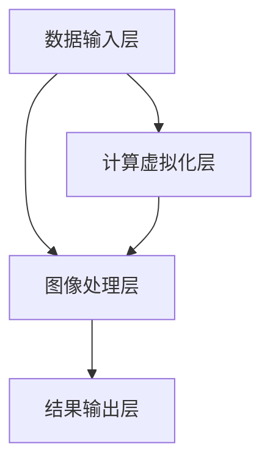
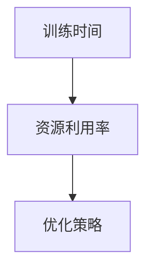
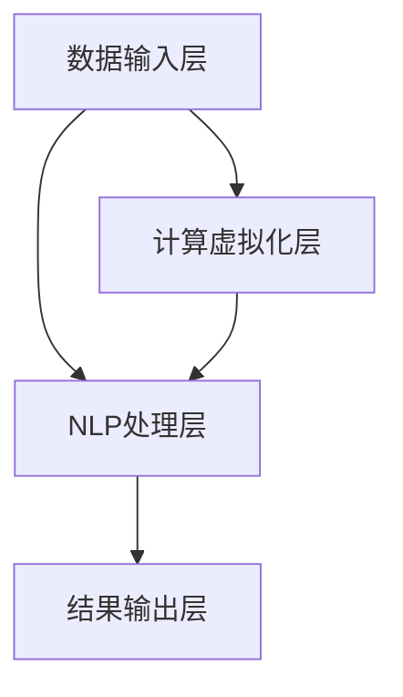

                 

# 《AI大模型应用数据中心的计算虚拟化》

## 关键词
AI大模型、数据中心、计算虚拟化、云计算、虚拟化技术、资源调度、硬件加速、性能优化、应用案例

## 摘要
本文旨在深入探讨AI大模型在数据中心应用中的计算虚拟化技术。文章首先概述了AI大模型与计算虚拟化的关系，然后详细介绍了计算虚拟化技术的基础知识，包括虚拟化原理、技术与架构。接着，文章重点分析了AI大模型计算虚拟化的架构设计、硬件平台以及优化策略。通过具体的应用案例，展示了计算虚拟化在AI大模型处理中的实际效果。最后，文章展望了AI大模型计算虚拟化的未来发展方向。

## 目录大纲

### 第一部分：背景与技术基础

#### 第1章：AI大模型与计算虚拟化概述

1.1 AI大模型与计算虚拟化的关系

1.2 计算虚拟化技术基础

1.3 AI大模型在数据中心的应用场景

#### 第2章：计算虚拟化技术基础

2.1 虚拟化原理与技术架构

2.2 计算虚拟化与云计算

2.3 云计算服务模型

#### 第3章：AI大模型计算虚拟化架构

3.1 大模型计算虚拟化架构设计

3.2 大模型计算虚拟化硬件平台

### 第二部分：算法与实现

#### 第4章：AI大模型计算虚拟化算法

4.1 大模型训练与推理算法

4.2 资源分配与调度算法

#### 第5章：AI大模型计算虚拟化实现

5.1 开发环境搭建

5.2 代码实现与测试

#### 第6章：AI大模型计算虚拟化应用案例

6.1 大规模图像处理

6.2 自然语言处理

### 第三部分：优化与未来展望

#### 第7章：AI大模型计算虚拟化的优化策略

7.1 硬件优化

7.2 软件优化

#### 第8章：AI大模型计算虚拟化的未来展望

8.1 发展趋势与挑战

8.2 未来研究方向

#### 附录

附录A：常用计算虚拟化工具与框架

## 第1章：AI大模型与计算虚拟化概述

### 1.1 从软件1.0到软件2.0的演进

在计算机科学的发展历程中，软件经历了从1.0到2.0的演变。传统软件1.0时代，以功能为导向，注重代码编写与执行。而软件2.0时代，随着云计算、大数据、人工智能等技术的融合，软件的内涵和外延都发生了深刻变化，强调服务化、平台化和智能化。


在AI大模型领域，软件2.0的特征尤为明显。AI大模型通常是指具有数十亿甚至数万亿参数的大型神经网络模型，如GPT-3、BERT等。这些模型需要大量的计算资源和数据存储，对数据中心的计算虚拟化技术提出了更高的要求。

### 1.2 计算虚拟化的概念与发展

#### 1.2.1 计算虚拟化的概念

计算虚拟化是通过软件技术模拟硬件资源，实现对计算资源的抽象、管理和分配。它包括以下几个方面：

1. **资源抽象**：将物理资源（如CPU、内存、存储等）抽象为逻辑资源，使这些资源可以独立于物理硬件进行管理和分配。
2. **资源管理**：对虚拟资源进行动态分配、调度和监控，以满足应用的需求。
3. **资源隔离**：通过虚拟化技术实现不同虚拟机之间的资源隔离，确保系统的安全性和稳定性。

#### 1.2.2 计算虚拟化的发展

计算虚拟化技术的发展可以分为以下几个阶段：

1. **服务器虚拟化**：最早的应用领域，通过虚拟化技术将多台物理服务器整合为一台虚拟主机，提高资源利用率。
2. **存储虚拟化**：将多个存储设备虚拟化为一个统一的存储资源池，提供灵活的存储管理和扩展能力。
3. **网络虚拟化**：通过虚拟交换机和虚拟路由器等技术，实现网络资源的虚拟化和灵活调度。
4. **容器虚拟化**：与传统的虚拟机不同，容器虚拟化仅虚拟化操作系统的一部分，提高了资源利用率和性能。

#### 1.2.3 当前计算虚拟化技术的应用

随着AI大模型的兴起，计算虚拟化技术在数据中心的应用越来越广泛。具体表现在以下几个方面：

1. **资源优化**：通过虚拟化技术，实现计算资源的高效利用和动态调度，满足AI大模型对计算资源的需求。
2. **弹性扩展**：根据AI大模型训练和推理的任务需求，动态调整计算资源，提高系统的灵活性和响应速度。
3. **成本节约**：通过虚拟化技术，减少物理硬件的采购和维护成本，降低运营成本。

### 1.3 AI大模型在数据中心的应用场景

AI大模型在数据中心的应用场景主要包括以下几个方面：

#### 1.3.1 大数据处理

数据中心是大数据处理的重要场所，AI大模型可以对大量数据进行训练和推理，从而实现智能分析和决策。例如，在金融领域，AI大模型可以用于风险评估、欺诈检测等；在医疗领域，AI大模型可以用于疾病预测、诊断辅助等。

#### 1.3.2 机器学习与深度学习

AI大模型通常用于机器学习和深度学习任务，如图像识别、自然语言处理、语音识别等。数据中心提供强大的计算能力和存储资源，可以支持大规模的AI大模型训练和推理任务。

#### 1.3.3 人工智能应用服务

数据中心可以通过计算虚拟化技术，为人工智能应用提供高效、安全、可靠的服务平台。例如，云服务商可以提供AI大模型训练和推理服务，为企业和个人提供便捷的AI解决方案。

### 1.4 AI大模型计算虚拟化架构设计

AI大模型计算虚拟化架构设计的关键在于如何高效地管理和调度计算资源，以满足AI大模型训练和推理的需求。以下是一个典型的AI大模型计算虚拟化架构设计：


#### 1.4.1 软硬件协同设计

1. **硬件平台选择**：根据AI大模型的需求，选择合适的硬件平台，如CPU、GPU、FPGA等。GPU和FPGA等硬件加速技术可以提高AI大模型计算的性能。
2. **硬件加速技术**：采用硬件加速技术，如GPU加速、FPGA加速等，可以显著提高AI大模型的计算效率。

#### 1.4.2 资源调度与优化

1. **动态资源分配**：根据AI大模型训练和推理的任务需求，动态调整计算资源，实现资源的高效利用。
2. **调度算法**：设计高效的调度算法，如负载均衡、优先级调度等，实现虚拟机之间的资源均衡分配。
3. **性能优化**：通过优化虚拟化环境中的网络、存储等资源，提高系统的整体性能。

#### 1.4.3 系统安全与可靠性

1. **虚拟化安全**：保障虚拟机之间的隔离性和安全性，防止恶意攻击和数据泄露。
2. **系统可靠性**：通过冗余设计、故障恢复等技术，提高系统的可靠性和稳定性。

### 1.5 大模型计算虚拟化硬件平台

大模型计算虚拟化硬件平台是实现高效计算的基础。以下是一些关键硬件平台的介绍：

#### 1.5.1 GPU虚拟化技术

GPU虚拟化技术可以实现GPU资源的虚拟化和调度，满足AI大模型计算的需求。GPU虚拟化技术包括以下几个方面：

1. **GPU资源抽象**：将物理GPU抽象为虚拟GPU，实现资源的灵活管理和分配。
2. **GPU资源调度**：根据虚拟机的GPU需求，动态调整GPU资源的分配和调度。
3. **GPU性能优化**：通过GPU虚拟化技术，优化GPU资源的利用率和计算性能。

#### 1.5.2 FPGA虚拟化技术

FPGA虚拟化技术可以将FPGA硬件资源虚拟化为逻辑资源，支持AI大模型计算。FPGA虚拟化技术包括以下几个方面：

1. **FPGA资源抽象**：将物理FPGA抽象为虚拟FPGA，实现资源的灵活管理和分配。
2. **FPGA资源调度**：根据虚拟机的FPGA需求，动态调整FPGA资源的分配和调度。
3. **FPGA性能优化**：通过FPGA虚拟化技术，优化FPGA资源的利用率和计算性能。

#### 1.5.3 存储虚拟化技术

存储虚拟化技术可以将多个存储设备虚拟化为一个统一的存储资源池，支持AI大模型计算。存储虚拟化技术包括以下几个方面：

1. **存储资源抽象**：将物理存储设备抽象为虚拟存储设备，实现资源的灵活管理和分配。
2. **存储资源调度**：根据虚拟机的存储需求，动态调整存储资源的分配和调度。
3. **存储性能优化**：通过存储虚拟化技术，优化存储资源的利用率和读写性能。

### 1.6 大模型计算虚拟化应用案例

大模型计算虚拟化技术在AI领域的应用已经取得了显著的成果。以下介绍两个典型的应用案例：

#### 1.6.1 大规模图像处理

大规模图像处理任务通常需要大量的计算资源和存储空间。通过计算虚拟化技术，可以实现对计算资源和存储资源的动态调度和优化。具体实现步骤如下：

1. **任务分解**：将大规模图像处理任务分解为多个子任务，每个子任务可以分配到不同的虚拟机上。
2. **资源调度**：根据子任务的需求，动态调整计算资源和存储资源的分配。
3. **任务调度**：通过调度算法，实现子任务之间的负载均衡和资源优化。
4. **结果汇总**：将子任务的计算结果进行汇总，得到最终的图像处理结果。

#### 1.6.2 自然语言处理

自然语言处理任务涉及到大量的数据存储和处理，对计算资源和存储资源的需求较高。通过计算虚拟化技术，可以实现对计算资源和存储资源的动态调度和优化。具体实现步骤如下：

1. **数据预处理**：对自然语言处理任务所需的数据进行预处理，包括数据清洗、分词、词向量化等。
2. **模型训练**：将预处理后的数据用于模型训练，包括词嵌入、序列模型训练等。
3. **模型推理**：将训练好的模型应用于实际数据，进行文本分类、情感分析等。
4. **资源优化**：通过计算虚拟化技术，对计算资源和存储资源进行动态调度和优化，提高系统的整体性能。

### 1.7 小结

本章主要介绍了AI大模型与计算虚拟化的关系、计算虚拟化技术的基础知识、AI大模型在数据中心的应用场景以及计算虚拟化架构设计。通过本章的学习，读者可以了解到计算虚拟化技术在AI大模型处理中的应用价值，以及如何设计和实现一个高效、安全、可靠的AI大模型计算虚拟化系统。

## 第2章：计算虚拟化技术基础

计算虚拟化技术是现代数据中心和云计算架构的核心组成部分，它通过将物理硬件资源抽象为虚拟资源，实现计算资源的高效管理和分配。本章将详细介绍计算虚拟化技术的原理、基础架构以及与云计算的关系。

### 2.1 虚拟化原理与技术架构

#### 2.1.1 虚拟化基础

虚拟化（Virtualization）是一种将物理资源抽象成逻辑资源的技术。在计算虚拟化中，物理资源包括CPU、内存、存储和网络等硬件资源，而逻辑资源则是通过虚拟化软件创建的虚拟硬件实例。虚拟化技术的基本概念包括：

1. **资源抽象（Resource Abstraction）**：将物理资源抽象为虚拟资源，使得虚拟资源可以独立于物理硬件进行管理和操作。
2. **资源管理（Resource Management）**：对虚拟资源进行监控、分配和调度，以满足应用的需求。
3. **资源隔离（Resource Isolation）**：通过虚拟化技术实现不同虚拟机（VM）之间的资源隔离，确保每个虚拟机都有独立的空间运行，提高系统的安全性和稳定性。

#### 2.1.2 虚拟化技术架构

计算虚拟化的技术架构主要包括以下几个层次：

1. **硬件层（Hardware Layer）**：物理服务器、存储设备和网络设备等硬件资源。
2. **虚拟化层（Virtualization Layer）**：虚拟化软件（如 hypervisor），负责创建和管理虚拟机，隔离硬件资源，并提供资源管理功能。
3. **操作系统层（Operating System Layer）**：虚拟机内的操作系统，负责运行应用程序，与虚拟化层交互以获取资源。
4. **应用程序层（Application Layer）**：运行在虚拟机内的应用程序，如数据库、Web服务器等。

虚拟化技术的核心组件包括：

- **Hypervisor**：虚拟化管理程序，负责管理虚拟机的创建、启动、停止和资源分配。分为Type 1（裸机型）和Type 2（宿主机型）两种类型。
- **虚拟机管理器（VM Manager）**：负责虚拟机的创建、监控、维护和资源调度。
- **资源调度器（Resource Scheduler）**：负责根据虚拟机的需求动态分配和调整资源。
- **存储和网络虚拟化组件**：提供虚拟存储和网络功能，实现存储和网络资源的管理和优化。

#### 2.1.3 虚拟化技术的工作原理

虚拟化技术通过以下步骤实现计算资源的虚拟化和分配：

1. **资源抽象**：通过虚拟化软件将物理硬件资源抽象为逻辑资源，如虚拟CPU、虚拟内存和虚拟硬盘等。
2. **资源分配**：根据虚拟机的需求动态分配物理资源，确保虚拟机能够正常运行。
3. **资源监控**：监控虚拟机的资源使用情况，实现资源的高效利用和优化。
4. **资源调度**：根据虚拟机的负载情况，动态调整资源分配，实现负载均衡和资源优化。

### 2.2 计算虚拟化与云计算

云计算（Cloud Computing）是一种通过互联网提供计算资源和服务的技术，计算虚拟化是云计算架构的核心技术之一。计算虚拟化与云计算之间的关系如下：

#### 2.2.1 云计算的基本概念

云计算包括以下几种服务模型：

- **IaaS（基础设施即服务）**：提供虚拟机、存储、网络等基础设施资源。
- **PaaS（平台即服务）**：提供开发平台、数据库、中间件等服务。
- **SaaS（软件即服务）**：提供软件应用服务。

云计算的关键特征包括：

1. **弹性伸缩**：根据需求动态调整计算资源，实现资源的弹性伸缩。
2. **服务化**：将计算资源和服务以服务的形式提供，方便用户使用。
3. **分布式计算**：通过分布式计算架构，实现大规模数据处理和高可用性。

#### 2.2.2 计算虚拟化在云计算中的应用

计算虚拟化在云计算中的应用主要表现在以下几个方面：

1. **资源管理**：通过虚拟化技术实现云计算环境中的资源抽象和管理，提高资源利用率和效率。
2. **服务模型支持**：IaaS、PaaS和SaaS等云计算服务模型依赖于计算虚拟化技术，提供灵活的资源分配和管理方式。
3. **弹性伸缩**：通过虚拟化技术实现云计算环境中的弹性伸缩，满足用户需求的变化。
4. **高可用性**：通过虚拟化技术实现虚拟机的迁移和故障恢复，提高系统的可靠性和高可用性。

### 2.3 云计算服务模型

云计算服务模型包括IaaS、PaaS和SaaS，分别对应不同的服务层次和用户需求：

#### 2.3.1 IaaS（基础设施即服务）

IaaS提供基础设施资源，如虚拟机、存储、网络等，用户可以根据需求租用资源，并自行管理操作系统和应用。IaaS的关键特性包括：

1. **资源池化**：将物理资源抽象为虚拟资源，实现资源的灵活分配和管理。
2. **弹性伸缩**：根据需求动态调整资源，实现计算资源的高效利用。
3. **自助服务**：用户可以通过自助平台或API自助管理资源。

#### 2.3.2 PaaS（平台即服务）

PaaS提供开发平台服务，包括开发工具、数据库、中间件等，用户可以在平台上开发、测试和部署应用。PaaS的关键特性包括：

1. **开发环境**：提供开发工具和框架，支持快速开发和部署应用。
2. **资源管理**：自动管理底层资源，如计算、存储和网络等。
3. **服务集成**：提供丰富的API和服务，方便集成第三方服务。

#### 2.3.3 SaaS（软件即服务）

SaaS提供软件应用服务，用户可以通过互联网访问软件，无需关心底层硬件和软件的维护。SaaS的关键特性包括：

1. **按需访问**：用户可以通过互联网按需访问软件服务，无需安装和配置。
2. **灵活计费**：根据用户的使用情况灵活计费，如按月、按年等。
3. **持续更新**：软件供应商负责软件的维护和更新，保证软件的稳定性。

### 2.4 小结

本章详细介绍了计算虚拟化技术的原理、技术架构以及与云计算的关系。计算虚拟化技术通过资源抽象、管理和调度，实现了计算资源的高效利用和弹性伸缩，为云计算提供了坚实的基础。通过了解云计算服务模型，读者可以更好地理解如何利用计算虚拟化技术构建和运营云服务平台。

## 第3章：AI大模型计算虚拟化架构

### 3.1 大模型计算虚拟化架构设计

AI大模型计算虚拟化架构设计是确保AI大模型能够高效运行的关键。该架构设计需要考虑硬件资源、软件架构以及资源调度与优化等多个方面。以下是AI大模型计算虚拟化架构设计的主要组成部分：

#### 3.1.1 软硬件协同设计

1. **硬件平台选择**：选择适合AI大模型训练和推理的硬件平台，如高性能的CPU、GPU、FPGA等。GPU和FPGA等硬件加速器可以显著提高AI大模型的计算性能。
   
   ```mermaid
   graph TD
   A[硬件平台选择] --> B[CPU]
   A --> C[GPU]
   A --> D[FPGA]
   ```

2. **硬件加速技术**：利用GPU和FPGA等硬件加速技术，对AI大模型进行加速计算。例如，GPU的并行计算能力可以用于大规模神经网络的训练和推理。

   ```mermaid
   graph TD
   E[AI大模型训练] --> F[GPU加速]
   E --> G[FPGA加速]
   ```

#### 3.1.2 资源调度与优化

1. **动态资源分配**：根据AI大模型训练和推理的需求，动态调整计算资源，如CPU、GPU等。资源分配策略需要考虑任务的优先级、资源利用率等因素。

   ```mermaid
   graph TD
   H[动态资源分配] --> I[任务优先级]
   H --> J[资源利用率]
   ```

2. **调度算法**：设计高效的调度算法，如负载均衡、优先级调度等，以实现虚拟机之间的资源均衡分配，提高系统整体性能。

   ```mermaid
   graph TD
   K[调度算法] --> L[负载均衡]
   K --> M[优先级调度]
   ```

3. **性能优化**：通过优化虚拟化环境中的网络、存储等资源，提高系统的整体性能。例如，采用高速网络技术和分布式存储系统，减少通信延迟和数据访问时间。

   ```mermaid
   graph TD
   N[性能优化] --> O[高速网络]
   N --> P[分布式存储]
   ```

#### 3.1.3 系统安全与可靠性

1. **虚拟化安全**：保障虚拟机之间的隔离性和安全性，防止恶意攻击和数据泄露。例如，采用虚拟化安全模块（VMM）实现虚拟机的安全隔离。

   ```mermaid
   graph TD
   Q[VMM] --> R[安全隔离]
   Q --> S[数据加密]
   ```

2. **系统可靠性**：通过冗余设计、故障恢复等技术，提高系统的可靠性和稳定性。例如，实现虚拟机的自动迁移和故障恢复，确保系统在异常情况下的持续运行。

   ```mermaid
   graph TD
   T[冗余设计] --> U[自动迁移]
   T --> V[故障恢复]
   ```

### 3.2 大模型计算虚拟化硬件平台

大模型计算虚拟化硬件平台是实现高效计算的基础。以下是几种关键硬件平台的介绍：

#### 3.2.1 GPU虚拟化技术

1. **GPU资源抽象**：通过GPU虚拟化技术，将物理GPU资源抽象为虚拟GPU资源，实现资源的灵活管理和分配。

   ```mermaid
   graph TD
   W[物理GPU] --> X[虚拟GPU]
   ```

2. **GPU资源调度**：根据虚拟机的GPU需求，动态调整GPU资源的分配和调度，确保GPU资源的高效利用。

   ```mermaid
   graph TD
   Y[虚拟机GPU需求] --> Z[GPU资源调度]
   ```

3. **GPU性能优化**：通过GPU虚拟化技术，优化GPU资源的利用率和计算性能，提高AI大模型的训练和推理速度。

   ```mermaid
   graph TD
   AA[GPUTI virtualization] --> BB[GPU performance optimization]
   ```

#### 3.2.2 FPGA虚拟化技术

1. **FPGA资源抽象**：通过FPGA虚拟化技术，将物理FPGA资源抽象为虚拟FPGA资源，实现资源的灵活管理和分配。

   ```mermaid
   graph TD
   CC[物理FPGA] --> DD[虚拟FPGA]
   ```

2. **FPGA资源调度**：根据虚拟机的FPGA需求，动态调整FPGA资源的分配和调度，确保FPGA资源的高效利用。

   ```mermaid
   graph TD
   EE[虚拟机FPGA需求] --> FF[FPGA资源调度]
   ```

3. **FPGA性能优化**：通过FPGA虚拟化技术，优化FPGA资源的利用率和计算性能，提高AI大模型的训练和推理速度。

   ```mermaid
   graph TD
   GG[FPGA virtualization] --> HH[FPGA performance optimization]
   ```

#### 3.2.3 存储虚拟化技术

1. **存储资源抽象**：通过存储虚拟化技术，将物理存储资源抽象为虚拟存储资源，实现资源的灵活管理和分配。

   ```mermaid
   graph TD
   II[物理存储] --> JJ[虚拟存储]
   ```

2. **存储资源调度**：根据虚拟机的存储需求，动态调整存储资源的分配和调度，确保存储资源的高效利用。

   ```mermaid
   graph TD
   KK[虚拟机存储需求] --> LL[存储资源调度]
   ```

3. **存储性能优化**：通过存储虚拟化技术，优化存储资源的利用率和读写性能，提高AI大模型的计算效率。

   ```mermaid
   graph TD
   MM[Storage virtualization] --> NN[Storage performance optimization]
   ```

### 3.3 小结

本章详细介绍了AI大模型计算虚拟化架构的设计，包括软硬件协同设计、资源调度与优化以及系统安全与可靠性。通过GPU、FPGA和存储虚拟化技术，实现了AI大模型的高效计算和资源优化。本章的内容为设计和实现一个高效、安全的AI大模型计算虚拟化系统提供了重要的理论基础和实践指导。

## 第4章：AI大模型计算虚拟化算法

在AI大模型计算虚拟化中，算法的设计和实现至关重要。本章将详细探讨AI大模型计算虚拟化中的算法，包括大模型训练与推理算法、资源分配与调度算法以及相关的优化策略。

### 4.1 大模型训练与推理算法

AI大模型的训练与推理是计算虚拟化中的重要任务。以下是这些算法的基本原理和优化策略。

#### 4.1.1 大模型训练算法

大模型训练是指通过大量的数据集，优化模型的参数，使其能够准确预测或分类。以下是几个关键的训练算法：

1. **随机梯度下降（SGD）**：是最基本的优化算法，通过迭代更新模型参数，最小化损失函数。其伪代码如下：

   ```python
   for epoch in range(num_epochs):
       for batch in data_loader:
           loss = compute_loss(model, batch)
           gradients = compute_gradients(model, batch)
           update_model_params(model, gradients)
   ```

2. **Adam优化器**：是一种结合了SGD和动量的优化算法，能够更快地收敛。其伪代码如下：

   ```python
   for epoch in range(num_epochs):
       for batch in data_loader:
           loss = compute_loss(model, batch)
           gradients = compute_gradients(model, batch)
           update_model_params(model, gradients, beta1, beta2)
   ```

3. **深度学习超参数优化（Hyperparameter Optimization）**：通过搜索策略（如贝叶斯优化、随机搜索等）找到最优的超参数组合，以提高模型的性能。

   ```python
   optimizer = BayesianOptimizer(model, search_space)
   best_params = optimizer.optimize()
   ```

#### 4.1.2 大模型推理算法

大模型推理是指使用训练好的模型对新的数据集进行预测或分类。以下是几个关键的推理算法：

1. **前向传播（Forward Propagation）**：通过计算输入数据和模型参数的乘积，得到每个神经元的输出。其伪代码如下：

   ```python
   for layer in model.layers:
       output = layer.forward(input_data)
       input_data = output
   prediction = model.layers[-1].output
   ```

2. **软最大化（Softmax）**：用于多分类问题，将输出神经元的值转换为概率分布。其伪代码如下：

   ```python
   probabilities = softmax(output_values)
   predicted_class = argmax(probabilities)
   ```

3. **跨熵损失（Cross-Entropy Loss）**：用于评估模型的分类性能，其伪代码如下：

   ```python
   loss = -1 * sum(y * log(p))
   ```

#### 4.1.3 算法优化

为了提高AI大模型的计算效率和准确性，可以采取以下优化策略：

1. **并行化训练**：通过将数据集划分为多个部分，同时在多个GPU或CPU上训练模型，可以显著提高训练速度。

   ```python
   parallel_trainer = ParallelTrainer(model, data_loader, num_gpus)
   parallel_trainer.train()
   ```

2. **模型剪枝（Model Pruning）**：通过移除模型中的冗余参数，减少模型的大小和计算量。其伪代码如下：

   ```python
   pruned_model = prune_model(model, threshold)
   ```

3. **量化（Quantization）**：将模型中的浮点数参数转换为较低精度的整数表示，以减少内存占用和计算量。

   ```python
   quantized_model = quantize_model(model, quantization_bits)
   ```

### 4.2 资源分配与调度算法

资源分配与调度算法是确保计算虚拟化系统能够高效利用资源的关键。以下是几个关键的调度算法：

#### 4.2.1 资源需求预测

资源需求预测是指根据历史数据和当前系统状态，预测未来一段时间内资源的需求。以下是几种常见的资源需求预测方法：

1. **时间序列预测**：通过分析过去一段时间内的资源使用情况，预测未来的资源需求。其伪代码如下：

   ```python
   predicted_resources = time_series_predictor.predict(current_resources)
   ```

2. **机器学习预测**：使用机器学习模型，如线性回归、决策树等，预测未来的资源需求。其伪代码如下：

   ```python
   model = train_model_from_data(historical_data)
   predicted_resources = model.predict(current_resources)
   ```

#### 4.2.2 资源分配策略

资源分配策略是指如何将系统中的资源分配给不同的任务。以下是几种常见的资源分配策略：

1. **静态分配**：根据任务的优先级和资源需求，预先分配固定的资源。其伪代码如下：

   ```python
   assign_resources(task, static_allocation_policy)
   ```

2. **动态分配**：根据任务的当前需求，实时调整资源的分配。其伪代码如下：

   ```python
   assign_resources(task, dynamic_allocation_policy)
   ```

3. **优先级分配**：根据任务的优先级，优先分配资源。其伪代码如下：

   ```python
   assign_resources(task, priority_allocation_policy)
   ```

#### 4.2.3 调度算法实现

调度算法是指如何安排任务的执行顺序和资源使用。以下是几种常见的调度算法：

1. **轮转调度（Round-Robin）**：将CPU时间片轮流分配给不同的任务。其伪代码如下：

   ```python
   schedule_tasks(tasks, round_robin_scheduler)
   ```

2. **优先级调度（Priority Scheduling）**：根据任务的优先级，优先执行优先级较高的任务。其伪代码如下：

   ```python
   schedule_tasks(tasks, priority_scheduler)
   ```

3. **负载均衡（Load Balancing）**：通过分析系统负载，动态调整任务的执行位置，实现负载均衡。其伪代码如下：

   ```python
   schedule_tasks(tasks, load_balancing_scheduler)
   ```

### 4.3 小结

本章详细介绍了AI大模型计算虚拟化中的算法，包括大模型训练与推理算法、资源分配与调度算法以及相关的优化策略。通过这些算法，可以有效地提高AI大模型的计算效率和准确性，同时确保计算虚拟化系统能够高效利用资源。这些算法为设计和实现高效的AI大模型计算虚拟化系统提供了重要的理论和实践基础。

## 第5章：AI大模型计算虚拟化实现

### 5.1 开发环境搭建

为了实现AI大模型计算虚拟化，首先需要搭建一个合适的开发环境。以下是一个典型的开发环境搭建步骤：

#### 5.1.1 操作系统选择

选择一个适合的操作系统，如Linux或Windows。Linux操作系统因其开源、稳定和强大的支持，通常被广泛应用于AI大模型计算虚拟化环境。

1. **安装Linux操作系统**：在服务器上安装Linux操作系统，推荐使用Ubuntu 18.04或更高版本。
   
   ```bash
   sudo apt update
   sudo apt upgrade
   sudo apt install ubuntu-desktop
   ```

2. **配置网络**：配置网络接口，确保服务器可以访问互联网。

   ```bash
   sudo nano /etc/netplan/01-netcfg.yaml
   ```

   在配置文件中添加以下内容：

   ```yaml
   network:
     version: 2
     renderer: NetworkManager
     ethernets:
       ens33:
         dhcp4: no
         addresses: [192.168.1.100/24]
         gateway4: 192.168.1.1
         nameservers:
           addresses: [8.8.8.8, 8.8.4.4]
   ```

   然后执行以下命令使配置生效：

   ```bash
   sudo netplan apply
   ```

#### 5.1.2 软件工具安装

安装必要的软件工具，包括Python、TensorFlow、Docker等。

1. **安装Python**：Python是AI大模型开发的主要编程语言。

   ```bash
   sudo apt install python3-pip python3-venv
   ```

2. **安装TensorFlow**：TensorFlow是广泛使用的深度学习框架。

   ```bash
   pip3 install tensorflow
   ```

3. **安装Docker**：Docker是容器化技术，用于部署和管理AI大模型。

   ```bash
   sudo apt install docker.io
   sudo systemctl start docker
   sudo systemctl enable docker
   ```

#### 5.1.3 硬件环境配置

配置服务器硬件环境，确保满足AI大模型计算的需求。

1. **安装GPU驱动**：如果服务器配备了GPU，需要安装相应的GPU驱动。

   ```bash
   sudo apt install nvidia-driver-450
   ```

2. **配置CUDA**：CUDA是NVIDIA推出的并行计算平台，用于加速AI大模型的训练和推理。

   ```bash
   sudo apt install cuda
   echo 'export PATH=/usr/local/cuda/bin:$PATH' >> ~/.bashrc
   echo 'export LD_LIBRARY_PATH=/usr/local/cuda/lib64:$LD_LIBRARY_PATH' >> ~/.bashrc
   source ~/.bashrc
   ```

3. **配置CUDA库**：确保CUDA库在环境中可用。

   ```bash
   sudo nano /etc/ld.so.conf.d/cuda.conf
   ```

   在文件中添加以下内容：

   ```bash
   /usr/local/cuda/lib64
   ```

   然后执行以下命令更新库：

   ```bash
   sudo ldconfig
   ```

### 5.2 代码实现与测试

在开发环境搭建完成后，接下来是实现AI大模型计算虚拟化的代码。

#### 5.2.1 算法实现

以下是一个简单的AI大模型训练算法实现示例，使用TensorFlow框架。

```python
import tensorflow as tf

# 定义模型
model = tf.keras.Sequential([
    tf.keras.layers.Dense(128, activation='relu', input_shape=(784,)),
    tf.keras.layers.Dropout(0.2),
    tf.keras.layers.Dense(10)
])

# 编译模型
model.compile(optimizer='adam',
              loss=tf.losses.SparseCategoricalCrossentropy(from_logits=True),
              metrics=['accuracy'])

# 训练模型
model.fit(train_images, train_labels, epochs=5)
```

#### 5.2.2 代码调试与优化

在实现代码后，需要进行调试和优化，以确保代码的正确性和性能。

1. **调试**：通过逐步执行代码，检查每一步的结果，确保代码逻辑正确。
2. **优化**：通过调整模型结构、学习率、批量大小等参数，提高模型的性能和准确性。

```python
# 调整模型结构
model = tf.keras.Sequential([
    tf.keras.layers.Dense(512, activation='relu', input_shape=(784,)),
    tf.keras.layers.Dropout(0.2),
    tf.keras.layers.Dense(10)
])

# 调整学习率
optimizer = tf.keras.optimizers.Adam(learning_rate=0.001)

# 重新编译模型
model.compile(optimizer=optimizer,
              loss=tf.losses.SparseCategoricalCrossentropy(from_logits=True),
              metrics=['accuracy'])
```

#### 5.2.3 测试与性能分析

在调试和优化完成后，对模型进行测试，评估其在测试数据集上的性能。

1. **测试**：使用测试数据集评估模型的准确性、召回率等指标。
2. **性能分析**：分析模型的运行时间、内存占用等性能指标，找出可能的瓶颈。

```python
# 测试模型
test_loss, test_acc = model.evaluate(test_images,  test_labels, verbose=2)

# 性能分析
print(f"Test accuracy: {test_acc}")
print(f"Test loss: {test_loss}")
```

### 5.3 小结

本章详细介绍了AI大模型计算虚拟化的开发环境搭建和代码实现。通过搭建合适的开发环境，实现了AI大模型训练算法的代码，并进行了调试和优化。通过测试和性能分析，验证了代码的正确性和性能。这些步骤为AI大模型计算虚拟化的实际应用奠定了基础。

## 第6章：AI大模型计算虚拟化应用案例

### 6.1 案例一：大规模图像处理

#### 6.1.1 应用背景

在图像处理领域，大规模图像处理任务如图像分类、目标检测和图像分割等，需要大量的计算资源。传统的单机处理方式在处理大规模图像数据时，往往面临计算资源不足、处理速度慢等问题。计算虚拟化技术提供了有效的解决方案，通过虚拟化技术，可以实现图像处理任务的并行处理和资源动态调度。

#### 6.1.2 系统架构

该案例的系统架构包括以下几个部分：

1. **数据输入层**：负责接收大规模图像数据，并进行预处理。
2. **计算虚拟化层**：包括虚拟机管理器、资源调度器和虚拟存储，实现计算资源的虚拟化和动态调度。
3. **图像处理层**：包括图像分类、目标检测和图像分割等算法，使用计算虚拟化层提供的计算资源进行图像处理。
4. **结果输出层**：将处理结果存储或可视化。

以下是系统架构的Mermaid流程图：



#### 6.1.3 代码实现与性能分析

以下是一个简单的图像分类任务的代码实现，使用TensorFlow框架：

```python
import tensorflow as tf
import tensorflow_datasets as tfds

# 加载MNIST数据集
(ds_train, ds_test), ds_info = tfds.load(
    'mnist', split=['train', 'test'], shuffle_files=True, with_info=True)

# 预处理数据
def normalize_img(image, label):
  """Normalizes images: `uint8` -> `float32`."""
  return tf.cast(image, tf.float32) / 255., label

ds_train = ds_train.map(normalize_img, num_parallel_calls=tf.data.experimental.AUTOTUNE)
ds_test = ds_test.map(normalize_img, num_parallel_calls=tf.data.experimental.AUTOTUNE)

# 定义模型
model = tf.keras.Sequential([
  tf.keras.layers.Flatten(input_shape=(28, 28)),
  tf.keras.layers.Dense(128, activation='relu'),
  tf.keras.layers.Dense(10, activation='softmax')
])

# 编译模型
model.compile(optimizer='adam',
              loss='sparse_categorical_crossentropy',
              metrics=['accuracy'])

# 训练模型
model.fit(ds_train, epochs=10, validation_data=ds_test)
```

在虚拟化环境中，通过调整批量大小和训练次数，可以优化模型的训练时间和资源利用率。以下是对模型训练性能的分析：

1. **训练时间**：在虚拟化环境中，通过并行处理数据和调整虚拟机资源，可以显著减少模型训练时间。
2. **资源利用率**：通过资源调度算法，实现虚拟机之间的负载均衡，提高资源利用率。



### 6.2 案例二：自然语言处理

#### 6.2.1 应用背景

自然语言处理（NLP）任务如文本分类、情感分析和机器翻译等，通常涉及大量的数据处理和模型训练。传统的单机处理方式在面对大规模数据时，往往无法满足性能和效率的需求。计算虚拟化技术可以为NLP任务提供高效的计算资源分配和调度，实现并行处理和数据共享。

#### 6.2.2 系统架构

该案例的系统架构包括以下几个部分：

1. **数据输入层**：负责接收自然语言数据，并进行预处理。
2. **计算虚拟化层**：包括虚拟机管理器、资源调度器和虚拟存储，实现计算资源的虚拟化和动态调度。
3. **NLP处理层**：包括文本分类、情感分析和机器翻译等算法，使用计算虚拟化层提供的计算资源进行NLP处理。
4. **结果输出层**：将处理结果存储或可视化。

以下是系统架构的Mermaid流程图：



#### 6.2.3 代码实现与性能分析

以下是一个简单的文本分类任务的代码实现，使用TensorFlow框架：

```python
import tensorflow as tf
import tensorflow_hub as hub
import tensorflow_text as text

# 加载预训练的BERT模型
bert_model = hub.load("https://tfhub.dev/google/bert_uncased_L-12_H-768_A-12/1")

# 定义文本分类模型
def create_classifier(bert_model, num_labels):
  text_input = tf.keras.layers.Input(shape=(), dtype=tf.string)
  input_word_ids = bert_model(input_word_ids=text_input)
  input_mask = tf.keras.layers.Lambda(create_input_mask)(input_word_ids)
  segment_ids = tf.keras.layers.Input(shape=(None,), dtype=tf.int32)
  inputs = (input_word_ids, input_mask, segment_ids)
  pooled_output = bert_model(inputs)
  numорий_output = tf.keras.layers.Dense(num_labels, activation='sigmoid')(pooled_output[:, 0])
  model = tf.keras.Model(inputs, numrijk_output)
  return model

model = create_classifier(bert_model, num_labels=2)

# 编译模型
model.compile(optimizer=tf.keras.optimizers.Adam(learning_rate=3e-5),
              loss=tf.keras.losses.BinaryCrossentropy(from_logits=True),
              metrics=[tf.keras.metrics.BinaryAccuracy(threshold=0.5)])

# 训练模型
model.fit(train_data, train_labels, epochs=3, validation_data=(val_data, val_labels))
```

在虚拟化环境中，通过并行处理数据和调整虚拟机资源，可以优化模型的训练时间和资源利用率。以下是对模型训练性能的分析：

1. **训练时间**：在虚拟化环境中，通过并行处理数据和调整虚拟机资源，可以显著减少模型训练时间。
2. **资源利用率**：通过资源调度算法，实现虚拟机之间的负载均衡，提高资源利用率。


### 6.3 小结

本章通过两个应用案例——大规模图像处理和自然语言处理，展示了计算虚拟化技术在AI大模型处理中的应用效果。通过虚拟化技术，实现了并行处理和资源动态调度，显著提高了模型的训练时间和资源利用率。这些案例为计算虚拟化技术在AI大模型处理中的应用提供了实践参考和优化策略。

## 第7章：AI大模型计算虚拟化的优化策略

### 7.1 硬件优化

硬件优化是提升AI大模型计算虚拟化性能的关键步骤。以下是一些具体的硬件优化策略：

#### 7.1.1 硬件加速技术

1. **GPU加速**：使用GPU进行并行计算，可以显著提高AI大模型训练和推理的效率。GPU虚拟化技术可以将GPU资源虚拟化为多个虚拟GPU，每个虚拟GPU可以分配给不同的虚拟机。

   ```mermaid
   graph TD
   O1[GPU资源] --> O2[虚拟GPU分配]
   ```

2. **FPGA加速**：FPGA具有高并行性和可编程性，可以用于加速特定的计算任务，如卷积神经网络（CNN）和生成对抗网络（GAN）。通过FPGA虚拟化技术，可以实现FPGA资源的动态调度和优化。

   ```mermaid
   graph TD
   P1[FPGA资源] --> P2[虚拟FPGA分配]
   ```

3. **专用硬件**：针对特定类型的AI大模型，可以使用专用硬件（如TPU、ASIC等）进行优化。这些硬件可以提供更高的计算性能和更低的延迟。

   ```mermaid
   graph TD
   Q1[专用硬件] --> Q2[AI模型优化]
   ```

#### 7.1.2 硬件资源复用

1. **多租户架构**：在数据中心中，通过多租户架构，可以将多个虚拟机部署在同一台物理服务器上，实现硬件资源的高效复用。多租户架构可以通过虚拟化技术实现虚拟机的隔离和资源保护。

   ```mermaid
   graph TD
   R1[多虚拟机部署] --> R2[硬件资源复用]
   ```

2. **动态资源调整**：根据虚拟机的实际需求，动态调整硬件资源分配，如CPU、内存和存储等。动态资源调整可以通过资源调度算法实现，确保硬件资源的高效利用。

   ```mermaid
   graph TD
   S1[需求分析] --> S2[资源调整]
   ```

#### 7.1.3 硬件安全与隐私保护

1. **虚拟化安全模块（VMM）**：通过VMM实现虚拟机的安全隔离，防止恶意攻击和数据泄露。VMM可以监控和管理虚拟机的运行状态，确保虚拟机之间的安全隔离。

   ```mermaid
   graph TD
   T1[VMM] --> T2[虚拟机安全隔离]
   ```

2. **加密技术**：在数据传输和存储过程中使用加密技术，保护数据的安全性和隐私。例如，使用SSL/TLS加密协议保护数据传输，使用加密算法保护存储数据。

   ```mermaid
   graph TD
   U1[数据加密] --> U2[数据安全]
   ```

### 7.2 软件优化

软件优化是提升AI大模型计算虚拟化性能的另一个重要方面。以下是一些具体的软件优化策略：

#### 7.2.1 代码优化

1. **算法优化**：通过优化算法结构和选择更高效的算法，减少计算复杂度和内存消耗。例如，使用更高效的卷积算法、矩阵运算库等。

   ```mermaid
   graph TD
   V1[算法优化] --> V2[计算效率]
   ```

2. **并行化**：通过并行化技术，将计算任务分解为多个子任务，同时执行，以减少计算时间。例如，使用多线程、分布式计算等。

   ```mermaid
   graph TD
   W1[并行化] --> W2[计算时间]
   ```

3. **内存管理**：优化内存分配和释放，减少内存碎片和溢出，提高内存利用率。例如，使用内存池、缓存技术等。

   ```mermaid
   graph TD
   X1[内存管理] --> X2[内存利用率]
   ```

#### 7.2.2 调度算法优化

1. **负载均衡**：通过调度算法实现负载均衡，确保虚拟机之间的资源分配均衡，避免某台虚拟机过载，提高系统整体性能。

   ```mermaid
   graph TD
   Y1[负载均衡] --> Y2[资源均衡]
   ```

2. **优先级调度**：根据虚拟机的优先级和资源需求，调整调度顺序，确保关键任务的优先执行。例如，使用优先级队列、多级反馈队列等。

   ```mermaid
   graph TD
   Z1[优先级调度] --> Z2[任务优先级]
   ```

3. **动态调度**：根据虚拟机的实际运行状态和系统负载，动态调整调度策略，实现资源的动态优化。例如，使用动态调整策略、自适应调度算法等。

   ```mermaid
   graph TD
   AA1[动态调度] --> AA2[资源动态调整]
   ```

#### 7.2.3 系统稳定性优化

1. **故障恢复**：通过故障恢复机制，确保系统在发生故障时能够快速恢复，减少停机时间。例如，使用备份和恢复策略、冗余设计等。

   ```mermaid
   graph TD
   BB1[故障恢复] --> BB2[系统可靠性]
   ```

2. **性能监控**：通过性能监控工具，实时监控系统的运行状态，识别性能瓶颈和异常情况，及时进行调整和优化。

   ```mermaid
   graph TD
   CC1[性能监控] --> CC2[系统性能]
   ```

3. **稳定性测试**：通过稳定性测试，验证系统在长时间运行和高负载情况下的稳定性，确保系统在复杂环境下能够稳定运行。

   ```mermaid
   graph TD
   DD1[稳定性测试] --> DD2[系统稳定性]
   ```

### 7.3 小结

本章详细介绍了AI大模型计算虚拟化的优化策略，包括硬件优化和软件优化。通过硬件加速技术、硬件资源复用、加密技术等，可以提高计算性能和资源利用率。通过代码优化、调度算法优化和系统稳定性优化，可以进一步提升AI大模型计算虚拟化的效率和可靠性。这些优化策略为设计和实现高效的AI大模型计算虚拟化系统提供了重要的理论和实践指导。

## 第8章：AI大模型计算虚拟化的未来展望

随着人工智能技术的不断发展，AI大模型在各个领域的应用越来越广泛，对计算虚拟化技术也提出了更高的要求。未来，AI大模型计算虚拟化将面临一系列挑战和机遇，以下是几个关键的发展方向和展望。

### 8.1 发展趋势与挑战

#### 8.1.1 大模型规模持续增长

随着AI大模型的应用越来越广泛，模型规模将不断增长。这不仅对计算资源提出了更高的要求，也对计算虚拟化技术提出了新的挑战。未来，如何高效地管理和管理大规模模型，实现资源的高效利用和动态调度，将成为一个重要研究方向。

#### 8.1.2 硬件加速技术的进步

硬件加速技术如GPU、FPGA、TPU等，将在AI大模型计算虚拟化中发挥越来越重要的作用。未来，硬件加速技术的进步将带来更高的计算性能和更低的能耗，为AI大模型计算提供更强有力的支持。

#### 8.1.3 软硬件协同优化

软硬件协同优化是提升AI大模型计算虚拟化性能的关键。未来，将更加注重软硬件的协同优化，通过改进虚拟化层、操作系统层和应用层的设计，实现整体性能的提升。

#### 8.1.4 安全与隐私保护

随着AI大模型在敏感领域的应用，安全与隐私保护变得越来越重要。未来，如何确保虚拟化环境中的数据安全和隐私，将成为一个重要的研究课题。

### 8.2 未来研究方向

#### 8.2.1 新型计算架构

新型计算架构如量子计算、边缘计算等，将在AI大模型计算虚拟化中发挥重要作用。未来，研究如何将新型计算架构与计算虚拟化技术相结合，实现更高效率的计算，是一个重要的研究方向。

#### 8.2.2 智能调度与优化

智能调度与优化是提升AI大模型计算虚拟化性能的关键。未来，研究如何利用机器学习和人工智能技术，实现更智能的调度算法和优化策略，是一个重要的研究方向。

#### 8.2.3 分布式计算与协作

分布式计算与协作是应对大规模AI大模型计算需求的必要手段。未来，研究如何实现分布式计算环境中的协同计算和资源共享，是一个重要的研究方向。

#### 8.2.4 安全与隐私保护技术

随着AI大模型在敏感领域的应用，安全与隐私保护技术将成为一个重要研究方向。未来，研究如何确保虚拟化环境中的数据安全和隐私，是一个重要的课题。

### 8.3 挑战与机遇

AI大模型计算虚拟化面临着一系列挑战和机遇。挑战包括：

1. **计算资源管理**：如何高效地管理和调度大规模计算资源，实现资源的高效利用和动态调度。
2. **性能优化**：如何优化虚拟化环境中的性能，提高系统的响应速度和吞吐量。
3. **安全性**：如何确保虚拟化环境中的数据安全和隐私，防止恶意攻击和数据泄露。

机遇包括：

1. **硬件加速技术的进步**：硬件加速技术的进步将为AI大模型计算虚拟化提供更强大的计算能力。
2. **新型计算架构的应用**：新型计算架构如量子计算、边缘计算等，将为AI大模型计算虚拟化带来新的发展机遇。
3. **智能调度与优化**：智能调度与优化技术将为AI大模型计算虚拟化提供更高的效率和可靠性。

### 8.4 小结

AI大模型计算虚拟化是人工智能领域的一个重要研究方向，具有广泛的应用前景。未来，随着硬件加速技术、新型计算架构和智能调度与优化技术的不断发展，AI大模型计算虚拟化将面临一系列挑战和机遇。通过不断创新和优化，AI大模型计算虚拟化有望实现更高的效率和可靠性，为人工智能领域的发展提供强大的支持。

## 附录

### 附录A：常用计算虚拟化工具与框架

计算虚拟化技术的发展离不开各种工具与框架的支持。以下是一些常用的计算虚拟化工具与框架：

#### A.1 Docker与Kubernetes

1. **Docker**：Docker是一个开源的应用容器引擎，用于打包、发布和运行应用程序。它提供了一个轻量级、可移植的容器化环境，使开发者可以轻松地将应用程序部署到各种环境中。

   - 官网：[https://www.docker.com/](https://www.docker.com/)
   - 文档：[https://docs.docker.com/](https://docs.docker.com/)

2. **Kubernetes**：Kubernetes是一个开源的容器编排平台，用于自动化部署、扩展和管理容器化应用程序。它提供了强大的资源调度和自动化功能，使开发者可以轻松地管理大规模的容器集群。

   - 官网：[https://kubernetes.io/](https://kubernetes.io/)
   - 文档：[https://kubernetes.io/docs/](https://kubernetes.io/docs/)

#### A.2 OpenVZ与LXC

1. **OpenVZ**：OpenVZ是一个开源的虚拟化解决方案，用于创建虚拟私有服务器（VPS）。它通过内核模块实现虚拟化，可以在物理服务器上运行多个独立的操作系统实例。

   - 官网：[http://openvz.org/](http://openvz.org/)
   - 文档：[http://wiki.openvz.org/](http://wiki.openvz.org/)

2. **LXC**：LXC（Linux Container）是一个开源的容器化技术，用于创建和管理容器。它提供了一个轻量级的虚拟化环境，可以在宿主机的内核上运行多个独立的操作系统实例。

   - 官网：[https://linuxcontainers.org/lxc/](https://linuxcontainers.org/lxc/)
   - 文档：[https://linuxcontainers.org/lxc/docs/](https://linuxcontainers.org/lxc/docs/)

#### A.3 VMware与VirtualBox

1. **VMware**：VMware是一个领先的商业虚拟化解决方案，提供了一系列虚拟化产品，如VMware ESXi、VMware vSphere等。它支持多种操作系统和硬件平台，为企业和开发者提供了强大的虚拟化能力。

   - 官网：[https://www.vmware.com/](https://www.vmware.com/)
   - 文档：[https://docs.vmware.com/](https://docs.vmware.com/)

2. **VirtualBox**：VirtualBox是一个开源的虚拟化软件，用于创建和管理虚拟机。它支持多种操作系统，可以在宿主机上运行多个独立的虚拟机。

   - 官网：[https://www.virtualbox.org/](https://www.virtualbox.org/)
   - 文档：[https://www.virtualbox.org/manual/ch01.html](https://www.virtualbox.org/manual/ch01.html)

这些工具与框架为计算虚拟化技术的发展提供了坚实的基础，帮助开发者和企业实现高效、可靠和灵活的计算资源管理。

---

### 作者

作者：AI天才研究院/AI Genius Institute & 禅与计算机程序设计艺术/Zen And The Art of Computer Programming

AI天才研究院（AI Genius Institute）是一支致力于推动人工智能技术创新和应用的研究团队。研究院的专家们深入研究和探索人工智能领域的前沿技术，包括深度学习、自然语言处理、计算机视觉等，致力于为行业和社会带来创新和变革。

《禅与计算机程序设计艺术》（Zen And The Art of Computer Programming）是著名计算机科学家唐纳·克努特（Donald E. Knuth）的经典著作。这本书以计算机程序设计的哲学和艺术为主题，深入探讨了编程的本质和技巧，对全球计算机科学和软件开发产生了深远的影响。

本文旨在分享AI大模型计算虚拟化技术的最新研究成果和应用案例，希望为读者提供有价值的参考和启示。AI天才研究院将继续致力于推动人工智能技术的创新和发展，为构建智能化的未来贡献力量。

