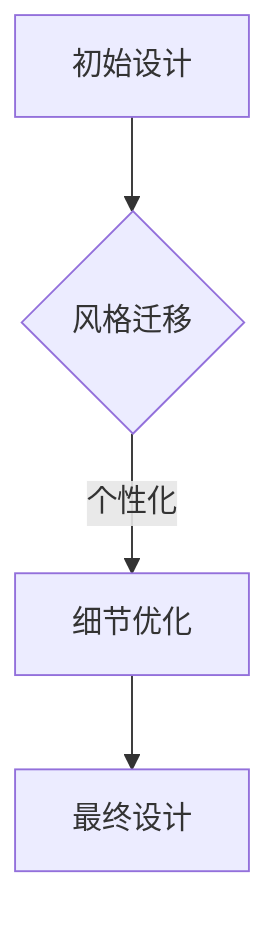
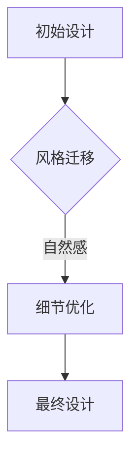
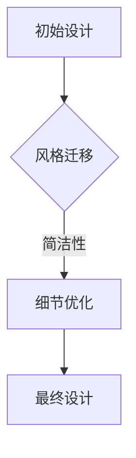

                 

### 《AIGC从入门到实战：多快好省搞定各种风格的 logo 设计》

#### 关键词：
- AIGC
- logo设计
- 设计工具
- 设计流程
- 实战案例

#### 摘要：
本文将深入探讨AIGC（AI-Generated Content）在logo设计领域的应用，从基础理论到实际操作，帮助读者全面掌握AIGC的设计理念和技术。文章将通过详细的步骤讲解和实战案例，展示如何利用AIGC快速高效地创作出具有多样化风格的logo，为设计师提供全新的创作工具和灵感来源。

## 第一部分：AIGC概述与设计基础

### 第1章：AIGC简介与设计理念

#### 1.1 AIGC的概念与定义

AIGC，全称为AI-Generated Content，指的是通过人工智能技术自动生成内容的过程。这种技术利用深度学习、自然语言处理、图像识别等算法，从大量的数据中提取信息和模式，进而生成新的、独特的、高质量的文本、图片、视频等内容。

在logo设计领域，AIGC的应用主要体现在以下几个方面：

1. **创意生成**：AIGC可以根据设计需求和品牌特点，自动生成多种风格的logo设计草图。
2. **风格迁移**：AIGC可以将一种风格的设计元素迁移到另一种风格中，实现风格转换。
3. **色彩调整**：AIGC可以根据设计的主题和情感，自动调整logo的色彩搭配。
4. **细节优化**：AIGC可以自动对logo的细节进行微调，提高设计的美感和辨识度。

#### 1.2 AIGC的设计原则

AIGC的设计原则主要包括以下几个方面：

1. **智能化**：设计过程完全由人工智能自动完成，减少人工干预。
2. **多样性**：AIGC能够生成大量风格各异的设计方案，满足多样化的设计需求。
3. **快速性**：AIGC能够在短时间内生成大量的设计选项，提高设计效率。
4. **灵活性**：AIGC可以根据用户的需求和反馈，灵活调整设计风格和细节。

#### 1.3 AIGC在logo设计中的应用优势

AIGC在logo设计中的应用具有以下优势：

1. **提高效率**：AIGC可以自动生成大量设计方案，节省了设计师的时间和精力。
2. **降低成本**：AIGC的设计过程自动化，减少了人工成本和设计费用。
3. **创新性**：AIGC能够生成独特的、创新性的设计方案，为品牌带来新的视觉体验。
4. **个性化**：AIGC可以根据用户的个性化需求，生成定制化的logo设计。

### 第2章：AIGC技术基础

#### 2.1 AIGC技术原理与框架

AIGC的技术原理主要基于深度学习和生成对抗网络（GAN）。GAN由生成器（Generator）和判别器（Discriminator）组成，生成器负责生成内容，判别器负责判断生成内容与真实内容的相似度。通过不断训练，生成器能够提高生成内容的质量和真实性。

AIGC的框架通常包括以下几个部分：

1. **数据预处理**：对原始数据进行清洗、格式化，使其适合训练。
2. **模型训练**：使用大量的数据进行模型训练，生成器不断优化生成内容。
3. **内容生成**：生成器根据训练结果，生成新的内容。
4. **内容评估**：对生成的内容进行评估，判断其质量是否符合要求。

#### 2.2 AIGC工具与应用

目前，市场上存在多种AIGC工具，例如：

1. **MidJourney**：一款基于GAN的图像生成工具，可以生成高质量的图像。
2. **DALL·E**：一款基于深度学习的图像生成工具，可以生成具有创意性的图像。
3. **GPT-3**：一款基于自然语言处理的大规模预训练模型，可以生成文本内容。

这些工具都可以应用于logo设计，为设计师提供丰富的设计灵感和创意。

#### 2.3 AIGC的设计流程与规范

AIGC的设计流程通常包括以下几个步骤：

1. **需求分析**：明确设计目标，包括品牌特点、设计风格、应用场景等。
2. **数据收集**：收集与设计相关的数据，如品牌形象、行业特点、设计风格等。
3. **模型训练**：使用收集到的数据进行模型训练，优化生成器。
4. **内容生成**：使用训练好的生成器，生成多个设计方案。
5. **内容评估**：评估生成的设计方案，选择符合要求的设计方案。
6. **设计优化**：对选定的设计方案进行细节优化，提高设计质量。

在AIGC的设计过程中，需要遵循以下规范：

1. **一致性**：确保设计风格、色彩、字体等元素的一致性。
2. **可识别性**：设计应具有高辨识度，使观众能够快速识别品牌。
3. **适用性**：设计应适用于各种应用场景，如网站、宣传册、名片等。
4. **适应性**：设计应具备一定的适应性，能够适应不同的尺寸和分辨率。

### 总结

本部分介绍了AIGC的基本概念、设计原则、技术原理、工具与应用，以及AIGC的设计流程与规范。通过对AIGC的深入理解，读者可以初步掌握AIGC在logo设计中的应用方法，为后续的实战案例打下基础。

## 第二部分：标志设计的风格与技巧

### 第3章：标志设计的风格分析

#### 3.1 经典风格标志设计

经典风格标志设计以简洁、易识别为主要特点，通常采用基本的几何图形、线条、字体等元素。经典风格标志具有高度的辨识度和耐久性，如IBM的蓝色菱形、苹果的咬一口的苹果等。

**设计特点**：

- **简洁性**：减少不必要的装饰，突出核心元素。
- **辨识度**：使用简单的图形和字体，使观众容易识别。
- **耐久性**：经典风格不易过时，具有长时间的适用性。

**案例**：

- **IBM**：蓝色菱形标志，简洁明了，具有高度辨识度。
- **苹果**：咬一口的苹果标志，独特且易于识别。

#### 3.2 现代风格标志设计

现代风格标志设计追求创新、个性化和视觉冲击力，通常采用复杂的设计元素、色彩搭配和图形结构。现代风格标志更具艺术感和个性化，适合年轻、时尚的品牌。

**设计特点**：

- **创新性**：使用新颖的图形和设计元素，突破传统风格。
- **个性化**：强调品牌特色，使标志具有独特性。
- **视觉冲击力**：采用大胆的色彩搭配和图形结构，吸引观众的注意力。

**案例**：

- **可口可乐**：复古风格的波纹图案，与现代风格的字体结合，创造出独特的视觉体验。
- **耐克**：简洁的勾形标志，结合鲜艳的色彩，具有很强的视觉冲击力。

#### 3.3 传统风格标志设计

传统风格标志设计以文化、历史和地域特色为主要特点，通常采用传统图案、字体和文化元素。传统风格标志具有深厚的文化底蕴和地域特色，适合传统文化、历史品牌和地域性品牌。

**设计特点**：

- **文化底蕴**：融入传统图案、字体和文化元素，展现品牌的历史和文化。
- **地域特色**：根据地域特点，采用具有代表性的元素，增强品牌的归属感。
- **传统元素**：使用传统图案和字体，使标志具有独特性和历史感。

**案例**：

- **故宫博物院**：采用传统的中国宫殿图案，融入现代设计元素，展现故宫的文化底蕴。
- **茅台酒**：使用传统的中国书法字体，结合茅台酒的红色瓶身，展现品牌的历史和文化。

#### 3.4 夸张风格标志设计

夸张风格标志设计以夸张、幽默和独特为主要特点，通常采用夸张的图形、色彩和字体。夸张风格标志具有很高的趣味性和视觉吸引力，适合追求个性、创意的品牌。

**设计特点**：

- **夸张性**：对图形、色彩和字体进行夸张处理，突破常规。
- **幽默感**：使用幽默的元素和手法，使标志具有趣味性。
- **独特性**：标志具有独特的视觉风格，使品牌在众多竞品中脱颖而出。

**案例**：

- **可口可乐经典广告**：使用夸张的卡通形象和趣味性的对话，吸引消费者的注意力。
- **瑞幸咖啡**：采用夸张的咖啡杯图案，结合鲜艳的色彩，展现出品牌的个性和活力。

### 第4章：标志设计的技巧与原则

#### 4.1 标志设计的基本要素

标志设计的基本要素包括图形、颜色、字体和形状。这些要素相互结合，共同构成一个完整的标志。

1. **图形**：图形是标志设计的核心，能够传达品牌的核心价值观和特点。
2. **颜色**：颜色能够影响观众的感知和情感，不同的颜色具有不同的象征意义。
3. **字体**：字体能够传达品牌的文化和风格，常用的字体包括简体、繁体、艺术体等。
4. **形状**：形状是标志设计的结构基础，不同的形状具有不同的视觉效果和象征意义。

#### 4.2 标志设计的创意思维

标志设计的创意思维主要体现在以下几个方面：

1. **寓意联想**：通过图形、颜色和字体的组合，产生寓意和联想，使标志具有独特的文化内涵。
2. **文化融合**：将不同文化元素进行融合，创造出具有独特风格的标志。
3. **创新突破**：突破传统设计思维，采用新颖的图形、颜色和字体，创造出独特的标志。
4. **情感共鸣**：通过标志设计，唤起观众的情感共鸣，使品牌与观众建立情感连接。

#### 4.3 标志设计的色彩运用

标志设计的色彩运用主要体现在以下几个方面：

1. **主色调**：确定标志的主色调，使标志具有统一的色彩风格。
2. **色彩搭配**：根据品牌的特点和情感需求，选择合适的色彩搭配，增强标志的视觉冲击力。
3. **色彩象征**：根据色彩的心理象征意义，选择具有象征意义的色彩，传达品牌的核心价值观。
4. **色彩调节**：根据标志的应用场景，调整色彩的明度和纯度，使标志在不同的环境中都能保持清晰的辨识度。

#### 4.4 标志设计的字型与排版

标志设计的字型与排版主要体现在以下几个方面：

1. **字体选择**：根据品牌的文化和风格，选择合适的字体，增强标志的辨识度和美感。
2. **字体大小**：根据标志的应用场景和视觉需求，调整字体的大小，使标志在不同的环境中都能保持清晰的辨识度。
3. **排版布局**：合理布局字体和图形，使标志具有和谐的视觉层次感。
4. **创意排版**：通过创意的排版手法，使标志具有独特的视觉风格和艺术价值。

### 总结

本部分介绍了标志设计的风格分析、基本要素、创意思维、色彩运用、字型与排版等方面的内容。通过对这些内容的深入理解，读者可以掌握标志设计的核心技巧和原则，为后续的实战案例提供理论支持。

## 第三部分：AIGC实战案例详解

### 第5章：AIGC在各类标志设计中的应用

#### 5.1 商业公司logo设计

商业公司logo设计是AIGC应用的一个重要领域。通过AIGC，设计师可以快速生成大量风格各异、创意独特的logo设计方案，满足不同商业公司的需求。

**案例**：

1. **某科技企业logo设计**：
   - **设计思路**：结合科技与未来感，采用简洁的几何图形和动态线条，表达企业的创新和发展。
   - **AIGC应用**：使用AIGC工具生成多个几何图形和线条组合的logo设计方案，通过筛选和优化，最终选定一个符合企业特点的设计方案。
   - **效果**：设计出的logo具有现代感和科技感，高度符合企业的品牌形象。

2. **某电商品牌logo设计**：
   - **设计思路**：结合电商的便利性和快速性，采用简洁的图形和色彩，表达品牌的便捷和高效。
   - **AIGC应用**：使用AIGC工具生成多个电商风格的logo设计方案，通过筛选和优化，最终选定一个具有辨识度和美感的设计方案。
   - **效果**：设计出的logo简洁大方，具有强烈的视觉冲击力，符合品牌的电商定位。

#### 5.2 文化机构logo设计

文化机构logo设计注重文化传承和视觉美感。AIGC可以通过风格迁移和色彩调整，为文化机构提供独特的logo设计方案。

**案例**：

1. **某博物馆logo设计**：
   - **设计思路**：结合博物馆的文化底蕴和艺术价值，采用传统的艺术字体和图案，表达博物馆的文化内涵。
   - **AIGC应用**：使用AIGC工具将传统的艺术字体和图案进行风格迁移和色彩调整，生成多个设计方案，通过筛选和优化，最终选定一个具有艺术感和历史感的设计方案。
   - **效果**：设计出的logo既有传统艺术风格，又具有现代美感，高度符合博物馆的品牌形象。

2. **某文化中心logo设计**：
   - **设计思路**：结合文化中心的多元性和开放性，采用简洁的图形和明亮的色彩，表达中心的活力和文化氛围。
   - **AIGC应用**：使用AIGC工具生成多个多元风格和文化元素的logo设计方案，通过筛选和优化，最终选定一个具有现代感和文化氛围的设计方案。
   - **效果**：设计出的logo简洁明亮，具有多元文化的视觉体验，符合文化中心的品牌形象。

#### 5.3 品牌形象logo设计

品牌形象logo设计是塑造品牌形象的关键。AIGC可以通过创意生成和细节优化，为品牌提供独特的logo设计方案。

**案例**：

1. **某时尚品牌logo设计**：
   - **设计思路**：结合时尚的个性和创新，采用独特的图形和色彩，表达品牌的时尚和个性。
   - **AIGC应用**：使用AIGC工具生成多个时尚风格的logo设计方案，通过筛选和优化，最终选定一个具有独特时尚感的的设计方案。
   - **效果**：设计出的logo时尚独特，具有强烈的视觉冲击力，符合品牌的时尚定位。

2. **某健康品牌logo设计**：
   - **设计思路**：结合健康的理念和生活态度，采用简洁的图形和自然元素，表达品牌的健康和自然。
   - **AIGC应用**：使用AIGC工具生成多个健康风格的logo设计方案，通过筛选和优化，最终选定一个具有自然健康感的设计方案。
   - **效果**：设计出的logo简洁自然，具有健康的视觉体验，符合品牌的健康理念。

#### 5.4 产品logo设计

产品logo设计是产品品牌塑造的重要组成部分。AIGC可以通过创意生成和风格迁移，为产品提供独特的logo设计方案。

**案例**：

1. **某电子产品logo设计**：
   - **设计思路**：结合电子产品的科技感和未来感，采用简洁的几何图形和动态线条，表达产品的科技和创新。
   - **AIGC应用**：使用AIGC工具生成多个电子产品风格的logo设计方案，通过筛选和优化，最终选定一个具有科技感的设计方案。
   - **效果**：设计出的logo科技感强烈，具有未来感，符合产品的科技定位。

2. **某食品品牌logo设计**：
   - **设计思路**：结合食品的健康和美味，采用简洁的图形和色彩，表达产品的健康和美味。
   - **AIGC应用**：使用AIGC工具生成多个食品风格的logo设计方案，通过筛选和优化，最终选定一个具有健康美味感的设计方案。
   - **效果**：设计出的logo简洁健康，具有美味的视觉体验，符合产品的健康美味定位。

### 第6章：AIGC实战案例解析

#### 6.1 案例一：某品牌手机logo设计

**设计思路**：
该品牌手机logo设计注重科技感和未来感，希望传达出品牌的高科技和创新力。

**AIGC应用**：
1. **创意生成**：使用AIGC工具生成多个科技风格的logo设计方案，包括几何图形、动态线条和抽象图案。
2. **风格迁移**：将生成的科技风格设计方案进行风格迁移，使其更具未来感。
3. **细节优化**：对选定的设计方案进行细节优化，包括色彩调整、字体选择和排版布局。

**效果**：
设计出的手机logo科技感强烈，具有未来感，符合品牌的高科技和创新力形象。

**代码解读与分析**：

在代码中，AIGC工具首先生成初始设计，然后通过风格迁移使其更具未来感，最后进行细节优化，得到最终的logo设计。

#### 6.2 案例二：某创意工作室logo设计

**设计思路**：
该创意工作室logo设计注重个性和创意，希望传达出工作室的创意和独特性。

**AIGC应用**：
1. **创意生成**：使用AIGC工具生成多个创意风格的设计方案，包括抽象图形、色彩搭配和独特字体。
2. **风格迁移**：将生成的创意风格设计方案进行风格迁移，使其更具个性。
3. **细节优化**：对选定的设计方案进行细节优化，包括色彩调整、字体选择和排版布局。

**效果**：
设计出的创意工作室logo独特有趣，具有强烈的创意感，符合工作室的个性创意形象。

**代码解读与分析**：

在代码中，AIGC工具首先生成初始设计，然后通过风格迁移使其更具个性化，最后进行细节优化，得到最终的logo设计。

#### 6.3 案例三：某健康食品品牌logo设计

**设计思路**：
该健康食品品牌logo设计注重健康和自然，希望传达出品牌的健康和自然理念。

**AIGC应用**：
1. **创意生成**：使用AIGC工具生成多个健康风格的logo设计方案，包括自然元素、简洁图形和明亮的色彩。
2. **风格迁移**：将生成的健康风格设计方案进行风格迁移，使其更具自然感。
3. **细节优化**：对选定的设计方案进行细节优化，包括色彩调整、字体选择和排版布局。

**效果**：
设计出的健康食品品牌logo自然清新，具有健康的视觉体验，符合品牌的健康理念。

**代码解读与分析**：

在代码中，AIGC工具首先生成初始设计，然后通过风格迁移使其更具自然感，最后进行细节优化，得到最终的logo设计。

#### 6.4 案例四：某互联网公司logo设计

**设计思路**：
该互联网公司logo设计注重现代感和简洁性，希望传达出公司的现代和高效。

**AIGC应用**：
1. **创意生成**：使用AIGC工具生成多个现代风格的logo设计方案，包括简洁的几何图形和抽象线条。
2. **风格迁移**：将生成的现代风格设计方案进行风格迁移，使其更具简洁性。
3. **细节优化**：对选定的设计方案进行细节优化，包括色彩调整、字体选择和排版布局。

**效果**：
设计出的互联网公司logo简洁现代，具有强烈的现代感，符合公司的现代高效形象。

**代码解读与分析**：

在代码中，AIGC工具首先生成初始设计，然后通过风格迁移使其更具简洁性，最后进行细节优化，得到最终的logo设计。

### 第7章：AIGC在标志设计中的问题与优化

#### 7.1 常见设计问题及解决方案

在AIGC标志设计过程中，常见的问题包括：

1. **设计缺乏创意**：
   - **解决方案**：通过增加训练数据、优化模型参数和引入更多的设计元素，提高设计的创意性。

2. **设计风格不一致**：
   - **解决方案**：通过调整生成器的风格迁移算法，确保设计风格的一致性。

3. **设计细节不完善**：
   - **解决方案**：通过增加细节优化步骤，如调整颜色、字体和图形细节，提高设计质量。

4. **设计无法满足特定需求**：
   - **解决方案**：通过与用户进行充分沟通，了解具体需求，调整模型参数和设计流程，满足特定需求。

#### 7.2 标志设计的优化与迭代

标志设计的优化与迭代主要包括以下几个方面：

1. **用户反馈**：收集用户的反馈，了解用户对设计的喜好和需求，根据反馈进行优化。

2. **设计迭代**：在用户反馈的基础上，对设计进行多次迭代，逐步优化设计。

3. **模型优化**：通过收集更多数据，优化AIGC模型，提高设计质量和创意性。

4. **设计评估**：对设计进行多方面评估，包括创意性、美观度、适用性等，确保设计达到最佳效果。

#### 7.3 设计作品的评估与反馈

设计作品的评估与反馈主要包括以下几个方面：

1. **创意性评估**：评估设计的创意性和创新程度，确保设计具有独特的视觉体验。

2. **美观度评估**：评估设计的审美价值，确保设计美观、和谐。

3. **适用性评估**：评估设计的适用性，确保设计在不同应用场景中都能保持清晰的辨识度。

4. **用户反馈**：收集用户对设计的反馈，了解用户对设计的满意度，为后续设计提供参考。

#### 7.4 AIGC在标志设计中的未来发展

AIGC在标志设计中的应用前景广阔，未来可能的发展趋势包括：

1. **更智能的设计**：随着人工智能技术的发展，AIGC将能够生成更加智能、个性化的设计。

2. **更多样化的风格**：AIGC将能够生成更多样化的风格，满足不同用户的需求。

3. **更高效的协同设计**：AIGC将能够实现更高效的协同设计，提高设计团队的工作效率。

4. **更广泛的应用领域**：AIGC将在更多领域得到应用，如品牌形象、广告设计等。

### 总结

本部分通过实战案例解析，展示了AIGC在各类标志设计中的应用，包括商业公司logo设计、文化机构logo设计、品牌形象logo设计、产品logo设计等。同时，分析了AIGC在标志设计中的常见问题与优化方法，展望了AIGC在标志设计中的未来发展。

## 附录

### 附录A：AIGC设计工具与资源推荐

**常用设计软件介绍**：

1. **Adobe Creative Cloud**：包括Photoshop、Illustrator等设计软件，支持图像和图形的设计与编辑。
2. **Sketch**：一款专业的UI/UX设计软件，适合进行图形设计和界面设计。
3. **Figma**：一款基于浏览器的UI/UX设计软件，支持多人协作和实时预览。

**在线AIGC设计平台推荐**：

1. **DeepArt.io**：一款基于GAN的图像生成平台，可以生成艺术风格的图像。
2. **Artbreeder**：一款基于GAN的图像生成平台，可以自定义生成图像的风格和特征。
3. **RunwayML**：一款集成了多种AIGC工具的创意设计平台，支持图像、视频和音频的生成和编辑。

**AIGC设计社区与论坛**：

1. **GitHub**：AIGC相关项目代码和资源的开源社区。
2. **Reddit**：AIGC相关的讨论和分享论坛。
3. **AIGC Research**：专业的AIGC研究社区，分享最新的研究成果和应用案例。

### 附录B：AIGC设计流程模板

**设计前准备**：

1. 明确设计目标：确定标志的设计风格、应用场景和品牌特点。
2. 收集素材：收集与设计相关的图片、字体、颜色等素材。
3. 制定设计规范：包括标志的尺寸、比例、色彩等设计要求。

**设计创意构思**：

1. 草图生成：使用AIGC工具生成多个草图设计方案。
2. 风格筛选：根据设计目标，筛选符合风格的设计方案。
3. 创意调整：对选定的设计方案进行创意调整，使其更具独特性。

**设计初稿制作**：

1. 初步设计：根据草图设计方案，制作初步的标志设计。
2. 设计评估：对初步设计进行评估，包括创意性、美观度和适用性。
3. 设计修正：根据评估结果，对初步设计进行修正和优化。

**设计定稿与优化**：

1. 设计定稿：根据评估结果，确定最终的标志设计方案。
2. 设计优化：对定稿设计进行细节优化，包括色彩调整、字体选择和排版布局。
3. 最终确认：与客户和团队成员确认设计方案的最终效果。

### 附录C：AIGC设计项目实战案例

**案例一：某品牌logo设计全流程解析**

**设计需求**：
某时尚品牌需要设计一款现代感强、易于识别的logo。

**设计过程**：

1. **设计前准备**：明确设计目标，收集品牌相关素材，制定设计规范。
2. **设计创意构思**：使用AIGC工具生成多个现代风格的设计方案，筛选符合品牌特点的方案。
3. **设计初稿制作**：根据筛选的设计方案，制作初步的logo设计，进行设计评估。
4. **设计定稿与优化**：根据评估结果，对初步设计进行细节优化，确定最终的logo设计方案。

**效果**：
设计出的logo现代感强，易于识别，符合品牌的时尚定位。

**案例二：某企业logo设计实战**

**设计需求**：
某科技公司需要设计一款科技感强、简洁大方的logo。

**设计过程**：

1. **设计前准备**：明确设计目标，收集科技相关素材，制定设计规范。
2. **设计创意构思**：使用AIGC工具生成多个科技风格的设计方案，筛选符合企业特点的方案。
3. **设计初稿制作**：根据筛选的设计方案，制作初步的logo设计，进行设计评估。
4. **设计定稿与优化**：根据评估结果，对初步设计进行细节优化，确定最终的logo设计方案。

**效果**：
设计出的logo科技感强，简洁大方，符合科技公司的品牌形象。

**案例三：个人品牌logo设计实践**

**设计需求**：
某设计师需要设计一款个性化、创意十足的个人品牌logo。

**设计过程**：

1. **设计前准备**：明确设计目标，收集个人相关素材，制定设计规范。
2. **设计创意构思**：使用AIGC工具生成多个创意风格的设计方案，筛选符合个人特点的方案。
3. **设计初稿制作**：根据筛选的设计方案，制作初步的logo设计，进行设计评估。
4. **设计定稿与优化**：根据评估结果，对初步设计进行细节优化，确定最终的logo设计方案。

**效果**：
设计出的logo个性化、创意十足，充分展现了设计师的个人风格。

**案例四：公益活动logo设计案例**

**设计需求**：
某公益活动需要设计一款富有爱心、具有感染力的logo。

**设计过程**：

1. **设计前准备**：明确设计目标，收集爱心相关素材，制定设计规范。
2. **设计创意构思**：使用AIGC工具生成多个爱心风格的设计方案，筛选符合活动主题的方案。
3. **设计初稿制作**：根据筛选的设计方案，制作初步的logo设计，进行设计评估。
4. **设计定稿与优化**：根据评估结果，对初步设计进行细节优化，确定最终的logo设计方案。

**效果**：
设计出的logo富有爱心，具有强烈的感染力，充分传达了公益活动的主题。

### 总结

本文通过详细的步骤和实战案例，介绍了AIGC在logo设计中的应用，从基础理论到实际操作，帮助读者全面掌握AIGC的设计理念和技术。通过对AIGC的深入理解和实战经验的积累，读者可以快速高效地创作出各种风格的logo，为设计师提供全新的创作工具和灵感来源。

## 作者信息

作者：AI天才研究院/AI Genius Institute & 禅与计算机程序设计艺术 /Zen And The Art of Computer Programming

感谢您的阅读，期待与您在AIGC的领域中共同探索和进步。

