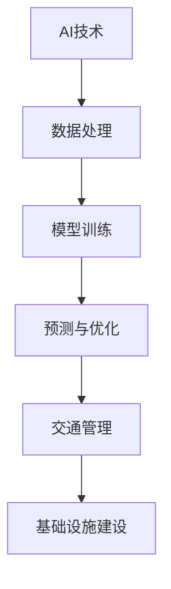

                 

### 文章标题

“AI与人类计算：打造可持续发展的城市交通管理系统与基础设施建设管理”

> **关键词**：人工智能、城市交通管理系统、基础设施建设、可持续发展、智能交通、深度学习、自然语言处理、计算机视觉

> **摘要**：本文深入探讨了人工智能（AI）与人类计算在城市交通管理系统和基础设施建设管理中的重要作用。通过分析城市交通管理的挑战，介绍AI技术的应用潜力，以及人类计算在其中的角色，本文旨在展示如何利用AI和人类计算的力量，打造可持续发展的城市交通管理系统和基础设施建设管理。文章分为三大部分：引言与背景、城市交通管理系统与基础设施建设管理、AI与城市交通管理系统的未来展望，涵盖从技术基础到实际应用，再到发展趋势的全面解析。

----------------------------------------------------------------

### 目录大纲

**AI与人类计算：打造可持续发展的城市交通管理系统与基础设施建设管理**

> **关键词**：人工智能、城市交通管理系统、基础设施建设、可持续发展、智能交通、深度学习、自然语言处理、计算机视觉

> **摘要**：本文深入探讨了人工智能（AI）与人类计算在城市交通管理系统和基础设施建设管理中的重要作用。通过分析城市交通管理的挑战，介绍AI技术的应用潜力，以及人类计算在其中的角色，本文旨在展示如何利用AI和人类计算的力量，打造可持续发展的城市交通管理系统和基础设施建设管理。文章分为三大部分：引言与背景、城市交通管理系统与基础设施建设管理、AI与城市交通管理系统的未来展望，涵盖从技术基础到实际应用，再到发展趋势的全面解析。

**第一部分：引言与背景**

### 第1章：城市交通管理系统的挑战与AI的机遇

#### 1.1 城市交通管理现状分析

- 城市交通流量状况
- 交通拥堵问题
- 城市交通碳排放
- 交通安全挑战

#### 1.2 AI技术在城市交通管理中的应用潜力

- 机器学习在交通流量预测中的应用
- 深度学习在交通信号控制中的应用
- 自然语言处理在交通信息传播中的应用
- 计算机视觉在交通监控中的应用

#### 1.3 人类计算在AI与城市交通管理系统中的角色

- 数据处理与分析
- 算法优化与改进
- 用户体验设计
- 决策支持

#### 1.4 本书结构概述

- 各章节内容概述
- 目的与目标

### 第2章：AI技术基础

#### 2.1 机器学习与深度学习概述

- 机器学习基本概念
- 深度学习基本概念
- 神经网络架构

#### 2.2 自然语言处理（NLP）技术基础

- 语言模型
- 词向量表示
- 文本分类与情感分析

#### 2.3 计算机视觉技术基础

- 图像处理基础
- 卷积神经网络（CNN）
- 目标检测与识别

#### 2.4 AI技术发展现状与趋势

- AI技术成熟度
- AI技术在其他领域的应用
- AI技术发展趋势

**第二部分：城市交通管理系统与基础设施建设管理**

### 第3章：城市交通流量分析与优化

#### 3.1 交通流量分析基础

- 交通流量数据来源
- 交通流量数据分析方法

#### 3.2 基于AI的交通流量预测模型

- 时间序列预测方法
- 空间相关性分析
- 交通流量预测模型构建

#### 3.3 基于深度学习的交通流量优化算法

- 深度学习模型架构
- 交通信号控制优化算法
- 优化算法性能评估

#### 3.4 案例研究：智能交通信号控制系统的设计与实现

- 智能交通信号控制系统架构
- 系统实现过程
- 系统效果评估

### 第4章：公共交通系统优化

#### 4.1 公共交通系统概述

- 公共交通系统定义
- 公共交通系统类型
- 公共交通系统现状

#### 4.2 AI技术在公共交通线路规划中的应用

- 线路规划算法
- 实时调度算法
- 路线优化算法

#### 4.3 基于AI的公共交通调度系统设计

- 调度系统架构
- 调度算法实现
- 调度系统效果评估

#### 4.4 实际案例：深圳地铁智能调度系统的开发与应用

- 深圳地铁智能调度系统架构
- 系统开发过程
- 系统应用效果

### 第5章：智能交通基础设施

#### 5.1 智能交通基础设施的概念与类型

- 智能交通基础设施定义
- 智能交通基础设施类型
- 智能交通基础设施发展现状

#### 5.2 AI技术在交通基础设施监测与管理中的应用

- 监测技术与应用
- 管理技术与应用
- 基础设施运维优化

#### 5.3 基于大数据的交通基础设施维护策略

- 大数据技术在基础设施维护中的应用
- 维护策略制定与实施
- 维护效果评估

#### 5.4 案例研究：智能高速公路的搭建与维护

- 智能高速公路架构
- 搭建过程
- 维护效果

### 第6章：城市交通管理与基础设施建设的可持续发展

#### 6.1 可持续发展原则与交通管理系统

- 可持续发展原则
- 交通管理系统可持续发展策略

#### 6.2 基础设施建设的可持续性评估

- 可持续性评估方法
- 基础设施可持续性评估指标
- 可持续性评估案例

#### 6.3 AI技术在促进城市交通与基础设施可持续性中的作用

- AI技术在交通管理中的应用
- AI技术在基础设施建设中的应用
- AI技术的可持续性优势

#### 6.4 案例研究：新加坡智能城市的交通与基础设施规划

- 新加坡智能城市概述
- 交通基础设施规划
- 基础设施规划效果

### 第7章：人类计算在AI与城市交通管理系统中的实际应用

#### 7.1 人类计算与AI的协同工作模式

- 人类计算与AI协同作用
- 协同工作模式案例分析

#### 7.2 基于人机交互的智能交通系统

- 人机交互设计原则
- 智能交通系统人机交互实现
- 用户反馈与优化

#### 7.3 基于大数据分析的决策支持系统

- 大数据分析技术
- 决策支持系统架构
- 决策支持系统应用

#### 7.4 实际案例：智慧城市中的多模式交通管理平台开发

- 多模式交通管理平台架构
- 平台开发过程
- 平台应用效果

**第三部分：AI与城市交通管理系统的未来展望**

### 第8章：AI与城市交通管理系统的发展趋势

#### 8.1 新一代AI技术在交通管理中的应用前景

- 人工智能驾驶技术
- 物联网技术在交通管理中的应用
- 人工智能在交通规划与设计中的应用

#### 8.2 未来城市交通管理系统的展望

- 智能交通系统的演进
- 交通管理系统的集成与协同
- 智慧城市的交通管理解决方案

#### 8.3 可持续交通管理的发展策略

- 可持续交通发展目标
- 政策与法规支持
- 技术创新与人才培养

#### 8.4 智慧城市交通管理的未来挑战与机遇

- 智慧城市交通管理的挑战
- 智慧城市交通管理的机遇
- 智慧城市交通管理的发展路径

### 第9章：AI与基础设施建设管理的发展前景

#### 9.1 AI技术在基础设施建设管理中的应用

- 建设过程优化
- 运维管理优化
- 维护与养护优化

#### 9.2 未来基础设施建设管理的发展方向

- 自动化与智能化
- 数字化与信息化
- 绿色与可持续

#### 9.3 基础设施智能化的挑战与机遇

- 智能化的技术挑战
- 智能化的市场机遇
- 智能化的政策支持

#### 9.4 基础设施智能化的实现路径

- 技术创新与应用
- 产业协同与合作
- 政策法规与标准制定

### 第10章：总结与展望

#### 10.1 本书核心观点回顾

- AI与城市交通管理系统的重要性
- 人类计算在AI应用中的作用
- 可持续发展目标

#### 10.2 AI与人类计算在交通管理系统与基础设施建设管理中的重要性

- 技术融合与协同创新
- 用户体验与个性化服务
- 可持续发展理念

#### 10.3 未来研究方向与应用展望

- 新技术的研究与开发
- 应用场景的拓展与深化
- 政策法规的完善与支持

### 附录

#### 附录A：AI技术工具与资源介绍

- 开源AI框架介绍
- 常用数据处理工具
- 交通数据集介绍
- AI开发环境搭建指南

#### 附录B：参考文献

- 相关书籍与论文
- 交通管理领域重要报告
- AI技术在智慧城市建设中的应用实例

### 图表与公式

#### 图表

- 图1-1：城市交通管理系统结构图
- 图4-1：公共交通线路规划流程图
- 图6-1：智能交通基础设施示例图
- 图8-1：智慧城市交通管理系统架构图

#### 公式

- 公式1-1：交通流量预测模型公式
  $$ F(t) = \sum_{i=1}^{n} w_i * f_i(t) $$

#### Mermaid流程图



----------------------------------------------------------------

### 第一部分：引言与背景

#### 第1章：城市交通管理系统的挑战与AI的机遇

##### 1.1 城市交通管理现状分析

城市交通管理系统是现代城市化进程中的重要组成部分，其核心目标是提供高效、安全、便捷的交通服务，以支持城市经济的发展和居民的生活质量。然而，随着城市人口的快速增长和机动化水平的提高，城市交通管理系统面临着诸多挑战。

首先，交通流量状况复杂。城市交通流量受到多种因素的影响，如人口密度、经济发展、城市规划等。不同时间段和不同地区的交通流量变化较大，这使得交通管理难度增加。交通拥堵成为许多城市面临的主要问题，不仅影响了居民的出行效率，还增加了碳排放和空气污染。

其次，交通拥堵问题严重。城市交通拥堵会导致道路通行时间延长、交通事故增多，进而影响城市整体运作效率和居民生活质量。拥堵现象往往集中在城市中心区域，尤其是在高峰时段，交通拥堵对城市交通系统造成了巨大的压力。

第三，城市交通碳排放较高。随着机动车保有量的增加，城市交通排放的二氧化碳和其他有害气体成为大气污染的重要来源。为了应对全球气候变化和环境问题，降低城市交通碳排放成为交通管理的重要任务。

最后，交通安全挑战突出。城市交通涉及大量车辆和行人，交通事故频发，不仅造成人员伤亡，还影响交通秩序。交通事故的预防和应对是城市交通管理系统中的一个重要问题。

##### 1.2 AI技术在城市交通管理中的应用潜力

人工智能（AI）技术的快速发展为城市交通管理提供了新的机遇和解决方案。AI技术在城市交通管理中的应用具有广泛的前景，主要体现在以下几个方面：

首先，机器学习在交通流量预测中的应用。通过收集和分析大量的交通数据，机器学习算法可以建立交通流量预测模型，预测未来一段时间内不同路段的交通流量变化。这种预测能力可以帮助交通管理部门提前调整交通信号配置，优化交通流量，缓解交通拥堵。

其次，深度学习在交通信号控制中的应用。深度学习算法可以通过分析交通流量数据和实时监控数据，实现对交通信号灯的智能控制。智能交通信号控制系统可以根据交通流量变化动态调整信号灯时长，提高道路通行效率，减少交通拥堵。

第三，自然语言处理（NLP）在交通信息传播中的应用。NLP技术可以用于处理和生成与交通相关的自然语言信息，如交通新闻、天气预报、路况提醒等。通过智能语音助手、社交媒体平台等渠道，NLP技术可以帮助交通管理部门及时向公众传播交通信息，提高交通出行的安全性。

最后，计算机视觉在交通监控中的应用。计算机视觉技术可以用于实时监控城市道路的交通状况，检测违章行为，如闯红灯、逆行等。通过图像处理和目标检测算法，计算机视觉技术可以提高交通监控的准确性和效率，为交通管理部门提供有力的支持。

##### 1.3 人类计算在AI与城市交通管理系统中的角色

虽然AI技术在城市交通管理中具有巨大潜力，但人类计算在其中仍然扮演着重要角色。人类计算与AI技术的协同工作，可以更好地应对城市交通管理的挑战，实现交通管理的智能化和可持续发展。

首先，数据处理与分析。AI技术需要大量的数据作为训练和优化的基础，而人类计算在数据收集、预处理和分析方面发挥着关键作用。数据科学家和交通工程师需要运用专业的知识和技能，从海量数据中提取有价值的信息，为AI算法提供高质量的输入。

其次，算法优化与改进。AI算法的优化和改进需要人类计算的专业判断和经验。算法工程师和数据科学家可以通过不断调整算法参数、改进算法架构，提高AI算法在交通管理中的应用效果。

第三，用户体验设计。智能交通系统的成功不仅依赖于技术实现，还需要考虑用户体验。人类计算在设计智能交通系统的用户界面、交互方式等方面发挥着重要作用，确保系统能够满足用户的需求，提供便捷、友好的服务。

最后，决策支持。在交通管理中，决策支持系统需要整合多种数据来源，分析交通状况，提供决策建议。人类计算在决策支持系统中扮演着关键角色，通过专业知识和经验，对AI算法的输出进行评估和调整，为交通管理部门提供可靠的决策依据。

##### 1.4 本书结构概述

本书分为三个主要部分，旨在全面解析AI与城市交通管理系统与基础设施建设管理的关系。

第一部分：引言与背景。本部分首先分析了城市交通管理系统的现状和挑战，然后介绍了AI技术在城市交通管理中的应用潜力以及人类计算在其中的角色。

第二部分：城市交通管理系统与基础设施建设管理。本部分详细介绍了AI技术在城市交通流量分析、公共交通系统优化、智能交通基础设施、城市交通管理与基础设施建设的可持续发展等方面的应用。

第三部分：AI与城市交通管理系统的未来展望。本部分探讨了AI与城市交通管理系统的发展趋势，以及AI与基础设施建设管理的发展前景，展望未来智慧城市交通管理系统的发展方向。

通过本书的详细解析，读者可以深入了解AI与城市交通管理系统与基础设施建设管理的关系，掌握相关技术的应用方法和实践案例，为推动城市交通管理系统的智能化和可持续发展提供有力支持。

----------------------------------------------------------------

### 第2章：AI技术基础

#### 2.1 机器学习与深度学习概述

机器学习和深度学习是人工智能领域的重要组成部分，它们在数据处理、模式识别和预测分析等方面发挥着关键作用。本节将简要介绍机器学习和深度学习的基本概念、原理以及它们在城市交通管理系统中的应用。

##### 2.1.1 机器学习基本概念

机器学习是一种使计算机系统能够从数据中学习并做出预测或决策的技术。它通过构建和优化模型，使计算机能够自动地从经验中学习，从而提高性能和准确性。机器学习可以分为监督学习、无监督学习和强化学习三种主要类型。

- **监督学习**：在这种学习中，模型通过训练数据集学习，每个数据点都有一个对应的标签。模型的目的是通过学习输入和输出之间的关系，预测新的输入对应的输出。监督学习常用于分类和回归问题。
- **无监督学习**：与监督学习不同，无监督学习不使用标签数据，而是通过分析数据点的特征，寻找数据中的模式和结构。无监督学习包括聚类、降维和数据关联等任务。
- **强化学习**：强化学习是一种通过奖励和惩罚机制，使模型能在动态环境中学习最优策略的方法。强化学习在决策、控制等应用中具有重要价值。

##### 2.1.2 深度学习基本概念

深度学习是机器学习的一个分支，它基于多层神经网络（DNN）进行模型训练和预测。深度学习通过多层非线性变换，能够自动提取数据中的复杂特征，从而在图像识别、语音识别、自然语言处理等领域取得了显著的成果。

- **多层神经网络**：深度学习模型由多个神经元层组成，包括输入层、隐藏层和输出层。每一层神经元接收前一层的输出，通过激活函数进行非线性变换，并传递到下一层。
- **卷积神经网络（CNN）**：CNN是一种专门用于处理图像数据的深度学习模型，通过卷积层、池化层和全连接层等结构，能够自动提取图像中的空间特征。
- **循环神经网络（RNN）**：RNN适用于处理序列数据，如时间序列、文本序列等。RNN通过记忆机制，能够捕捉序列中的时间依赖关系。
- **生成对抗网络（GAN）**：GAN是一种通过对抗训练生成数据的模型，由生成器和判别器两个网络组成，通过不断博弈，生成器能够生成逼真的数据。

##### 2.1.3 神经网络架构

神经网络是深度学习的基础，其核心是神经元模型。神经元模型由输入层、权重、激活函数和输出层组成。每个神经元接收多个输入，通过权重进行加权求和，然后经过激活函数处理，得到输出。

- **输入层**：输入层包含所有输入数据，每个输入数据对应一个神经元。
- **权重**：权重用于调整每个输入对输出的影响程度，通过训练过程进行调整。
- **激活函数**：激活函数用于引入非线性特性，常见的激活函数包括ReLU、Sigmoid和Tanh等。
- **输出层**：输出层产生最终的预测结果，可以是分类结果或数值预测。

##### 2.1.4 AI技术在城市交通管理系统中的应用

AI技术在城市交通管理系统中的应用非常广泛，主要包括交通流量预测、智能交通信号控制、公共交通系统优化等方面。

- **交通流量预测**：通过收集历史交通流量数据，使用时间序列预测方法，如ARIMA、LSTM等，可以预测未来一段时间内不同路段的交通流量变化。交通流量预测对于交通管理部门提前调整交通信号配置、优化交通流量具有重要意义。
- **智能交通信号控制**：深度学习算法可以用于交通信号控制，如基于CNN的交通流量检测和基于RNN的交通信号时长优化。智能交通信号控制系统能够根据实时交通流量变化，动态调整信号灯时长，提高道路通行效率。
- **公共交通系统优化**：AI技术可以用于公共交通线路规划、车辆调度和乘客需求预测等方面。例如，通过聚类分析，可以优化公交线路规划，提高公交系统的覆盖范围和运行效率；通过深度学习，可以预测乘客需求，优化车辆调度，提高乘客满意度。

##### 2.1.5 AI技术的发展现状与趋势

AI技术已经取得了显著的进展，并在各个领域得到了广泛应用。当前，AI技术的发展现状和趋势主要体现在以下几个方面：

- **技术成熟度**：随着硬件性能的提升和算法的优化，AI技术的成熟度不断提高。深度学习、计算机视觉和自然语言处理等技术在处理复杂数据和分析任务方面表现出色。
- **跨领域应用**：AI技术在金融、医疗、制造业等领域的应用越来越广泛。例如，在金融领域，AI技术用于风险管理、信用评估和投资预测；在医疗领域，AI技术用于疾病诊断、药物研发和个性化治疗。
- **发展趋势**：未来，AI技术将继续向自动化、智能化和协同化方向发展。新一代AI技术，如生成对抗网络（GAN）、图神经网络（GNN）和强化学习，将在更多应用场景中发挥作用。同时，AI与物联网、5G等技术的融合，将推动智慧城市、智能交通等领域的快速发展。

通过本章的介绍，读者可以初步了解AI技术的基础知识，掌握机器学习和深度学习的基本概念和原理，以及它们在AI技术在城市交通管理系统中的应用。这将有助于读者深入理解后续章节中的具体应用案例和技术细节。

----------------------------------------------------------------

### 第3章：城市交通流量分析与优化

#### 3.1 交通流量分析基础

城市交通流量分析是城市交通管理系统的重要组成部分，其核心目标是了解和预测城市道路上的交通流量情况，为交通管理部门提供决策依据。交通流量分析的基础包括数据来源、数据类型、数据分析方法等内容。

##### 3.1.1 交通流量数据来源

交通流量数据的来源主要有以下几个方面：

- **监测设备**：包括交通流量监控设备、车辆检测器、摄像头等。这些设备可以实时收集道路上的交通流量数据，如车辆数量、行驶速度、车型等。
- **卫星定位系统**：通过卫星定位系统（如GPS）可以获取车辆的位置信息，从而推算出交通流量情况。
- **智能交通系统**：智能交通系统（如智能交通信号控制、公共交通系统等）可以实时监控和收集交通流量数据。
- **社会媒体数据**：通过社交媒体平台、交通信息APP等可以获取用户的出行信息，如行驶路线、行驶时间等。

##### 3.1.2 交通流量数据类型

交通流量数据可以分为以下几种类型：

- **时间序列数据**：记录了不同时间段内某一地点的交通流量变化，如小时流量、日流量等。
- **空间分布数据**：记录了不同地理位置的交通流量分布情况，如道路上的车辆密度、拥堵状况等。
- **事件数据**：记录了特定事件（如交通事故、施工等）对交通流量造成的影响，如事故发生时间、事故地点、拥堵时间等。

##### 3.1.3 交通流量数据分析方法

交通流量数据分析方法主要包括以下几个方面：

- **描述性统计分析**：通过对交通流量数据进行统计分析，得到交通流量的基本特征，如平均值、中位数、标准差等。
- **时间序列分析方法**：通过时间序列分析方法，如ARIMA模型、LSTM模型等，对交通流量进行时间序列预测，预测未来一段时间内的交通流量变化。
- **空间分析方法**：通过空间分析方法，如空间插值、地理信息系统（GIS）等，分析交通流量在空间上的分布和变化规律。
- **机器学习方法**：利用机器学习方法，如聚类分析、回归分析、分类分析等，对交通流量数据进行深度分析和模式识别。

##### 3.1.4 交通流量预测模型

交通流量预测是城市交通流量分析的核心任务，其目的是为交通管理部门提供交通流量的预测数据，以便进行交通信号控制、交通规划等决策。交通流量预测模型可以分为以下几种类型：

- **时间序列预测模型**：时间序列预测模型主要基于历史交通流量数据，通过时间序列分析方法，如ARIMA模型、LSTM模型等，预测未来一段时间内的交通流量。
- **空间相关性预测模型**：空间相关性预测模型考虑交通流量在空间上的相关性，通过空间分析方法，如空间插值、GIS等，预测未来一段时间内不同地理位置的交通流量。
- **混合预测模型**：混合预测模型结合时间序列预测和空间相关性预测，综合考虑时间因素和空间因素，提高预测准确性。

在交通流量预测模型中，常用的算法有：

- **ARIMA模型**：自回归积分滑动平均模型（ARIMA），是一种经典的时间序列预测模型，适用于处理线性时间序列数据。
- **LSTM模型**：长短期记忆网络（LSTM），是一种循环神经网络（RNN）的特殊形式，能够处理非线性时间序列数据，适用于交通流量预测。
- **GRU模型**：门控循环单元（GRU），是LSTM的简化版本，能够高效处理时间序列数据，也在交通流量预测中广泛应用。

#### 3.2 基于AI的交通流量预测模型

##### 3.2.1 时间序列预测方法

时间序列预测方法基于历史交通流量数据，通过分析数据中的时间依赖关系，预测未来交通流量。常用的时间序列预测方法有：

- **ARIMA模型**：自回归积分滑动平均模型（ARIMA），是一种经典的时间序列预测模型，适用于处理线性时间序列数据。ARIMA模型通过自回归（AR）、差分（I）和移动平均（MA）三个部分来建模时间序列数据。
  - **自回归（AR）**：通过历史值的线性组合来预测未来值。
  - **差分（I）**：通过对时间序列进行差分，使其稳定。
  - **移动平均（MA）**：通过历史值的加权平均来预测未来值。
- **LSTM模型**：长短期记忆网络（LSTM），是一种循环神经网络（RNN）的特殊形式，能够处理非线性时间序列数据。LSTM通过引入记忆单元和门控机制，能够有效解决传统RNN在长序列依赖问题上的不足。

LSTM模型的预测过程如下：
1. 输入序列经过嵌入层转换为向量。
2. 经过LSTM层，每个时间点的输出会传递给下一个时间点，同时LSTM单元能够根据门控机制保存和遗忘重要信息。
3. 最后通过全连接层得到预测输出。

##### 3.2.2 空间相关性分析

交通流量不仅随时间变化，还受到地理位置的影响。空间相关性分析旨在研究交通流量在不同位置之间的相关性，从而提高预测模型的准确性。空间相关性分析的方法包括：

- **空间插值**：通过空间插值方法，如Kriging、反距离权重法等，将有限监测点的交通流量数据推广到整个研究区域。空间插值方法考虑了交通流量在空间上的连续性和平滑性，能够提高预测模型的准确性。
- **GIS分析**：地理信息系统（GIS）能够存储、管理和分析地理空间数据。通过GIS分析，可以研究交通流量在不同区域之间的空间分布规律，为交通流量预测提供辅助信息。

##### 3.2.3 交通流量预测模型构建

基于AI的交通流量预测模型通常采用以下步骤进行构建：

1. **数据收集**：收集历史交通流量数据、地理位置数据、事件数据等，确保数据的质量和完整性。
2. **数据预处理**：对数据进行清洗、归一化、特征提取等处理，去除异常值和噪声，提高数据质量。
3. **模型选择**：根据数据特点和预测目标，选择合适的预测模型，如ARIMA、LSTM、GRU等。
4. **模型训练**：使用预处理后的数据对模型进行训练，通过调整模型参数，使模型能够拟合历史数据。
5. **模型评估**：使用验证集或测试集对模型进行评估，计算预测误差和评价指标，如均方误差（MSE）、均方根误差（RMSE）等，以评估模型的预测性能。
6. **模型优化**：根据评估结果，调整模型参数或选择其他模型，优化预测性能。
7. **预测应用**：将训练好的模型应用于实际交通流量预测，为交通管理部门提供决策支持。

##### 3.2.4 案例研究：智能交通信号控制系统的设计与实现

智能交通信号控制系统是一种基于AI的交通流量预测和优化技术，旨在通过实时交通流量预测和信号灯控制，提高道路通行效率，减少交通拥堵。以下是一个案例研究，介绍智能交通信号控制系统的设计与实现。

**案例研究：深圳智能交通信号控制系统**

1. **系统架构**：深圳智能交通信号控制系统包括数据采集模块、数据处理模块、预测模块、控制模块和用户界面模块。
   - **数据采集模块**：通过安装在道路上的交通流量监控设备和摄像头，实时收集交通流量数据、车辆速度、车辆类型等信息。
   - **数据处理模块**：对采集到的交通流量数据进行预处理，包括数据清洗、归一化、特征提取等，为预测模块提供高质量的输入数据。
   - **预测模块**：使用LSTM模型和空间相关性分析方法，对实时交通流量数据进行预测，预测未来一段时间内各路段的交通流量变化。
   - **控制模块**：根据预测结果，动态调整交通信号灯时长，优化交通流量。控制策略包括基于路段交通流量预测的信号灯时长调整、基于交叉口交通流量的信号灯配时优化等。
   - **用户界面模块**：提供实时交通流量监控、信号灯控制状态显示、交通预测结果展示等功能，为交通管理部门和公众提供交通信息。

2. **系统实现过程**：
   - **数据采集**：安装并调试交通流量监控设备和摄像头，确保数据采集的实时性和准确性。
   - **数据处理**：开发数据处理算法，对采集到的数据进行预处理，提取交通流量、速度等特征。
   - **预测模型训练**：使用历史交通流量数据，训练LSTM模型，优化模型参数，确保预测准确性。
   - **控制策略设计**：设计智能交通信号控制策略，结合预测结果，实现动态信号灯控制。
   - **系统集成与测试**：将各个模块集成到智能交通信号控制系统中，进行系统测试和调试，确保系统稳定运行。

3. **系统效果评估**：
   - **交通流量优化**：通过实时预测和动态控制，智能交通信号控制系统能够有效优化交通流量，减少交通拥堵现象。
   - **通行效率提升**：交通信号灯的动态调整提高了道路通行效率，减少了车辆在交叉口的等待时间。
   - **用户体验改善**：交通管理部门能够实时监控交通状况，及时调整信号灯时长，提高了交通出行的安全性。

案例研究表明，智能交通信号控制系统在提高交通流量优化和通行效率方面具有显著优势，为城市交通管理提供了有效技术手段。

通过本章的介绍，读者可以初步了解城市交通流量分析的基础知识，掌握AI技术在交通流量预测和优化中的应用方法。在后续章节中，我们将进一步探讨公共交通系统优化、智能交通基础设施和可持续发展等方面的内容。

----------------------------------------------------------------

### 第4章：公共交通系统优化

公共交通系统是城市交通体系的重要组成部分，对于缓解交通拥堵、减少碳排放和提供便捷的出行服务具有重要作用。然而，现有的公共交通系统面临着线路规划不合理、车辆调度不灵活、乘客需求预测不准确等问题。通过AI技术的应用，可以显著提升公共交通系统的效率和服务水平。

#### 4.1 公共交通系统概述

公共交通系统包括地铁、公交车、轻轨、出租车等多种运输方式，其核心目标是提供高效、安全、舒适的出行服务。公共交通系统的设计和管理涉及多个方面：

- **线路规划**：根据城市人口分布、经济发展和交通需求，合理规划公共交通线路，确保覆盖范围和服务质量。
- **车辆调度**：根据实时乘客需求和交通状况，动态调整车辆发车时间和频率，提高车辆的利用率和准点率。
- **乘客需求预测**：预测乘客出行需求，合理安排车辆和线路，提高公共交通系统的服务质量和乘客满意度。
- **运营管理**：通过智能化管理系统，实时监控公共交通系统的运行状态，提高运营效率和安全性。

#### 4.2 AI技术在公共交通线路规划中的应用

AI技术在公共交通线路规划中的应用，可以帮助交通管理部门更好地满足乘客需求，优化线路布局。以下是一些关键的应用方法：

- **聚类分析**：通过聚类分析，将乘客出行数据划分为不同的出行群体，分析不同群体的出行习惯和需求，为线路规划提供数据支持。常见的聚类算法包括K均值聚类、层次聚类等。
  - **K均值聚类算法伪代码**：
    ```
    初始化聚类中心点
    循环迭代直到收敛：
        计算每个数据点到聚类中心点的距离
        将数据点分配到最近的聚类中心点
        重新计算聚类中心点的位置
    ```
- **路径优化算法**：使用最短路径算法（如Dijkstra算法）和车辆路径优化算法（如VRP），确定公共交通线路的最优路径，提高线路的运行效率和覆盖范围。
  - **Dijkstra算法伪代码**：
    ```
    初始化距离数组
    选择起点，设置距离为0，其余为无穷大
    将起点加入处理队列
    循环直到处理队列为空：
        取出处理队列中的当前节点
        对于当前节点的每个邻接节点：
            计算经过当前节点的最短路径长度
            如果更短，更新邻接节点的距离和前驱节点
    ```

- **历史数据分析**：通过分析历史交通数据、乘客出行数据等，预测未来不同时间段和不同区域的乘客需求，为公共交通线路规划提供依据。常用的预测模型包括ARIMA、LSTM等。

#### 4.3 基于AI的公共交通调度系统设计

公共交通调度系统是确保公共交通服务高效运行的关键环节。基于AI的公共交通调度系统通过实时数据分析和预测，动态调整车辆发车时间和频率，提高服务质量和运营效率。以下是一个公共交通调度系统设计的示例：

**系统架构**：

- **数据采集模块**：实时收集车辆位置、乘客数量、交通状况等信息，为调度系统提供数据支持。
- **数据预处理模块**：对采集到的数据进行清洗、归一化等预处理，提高数据质量。
- **预测模块**：使用AI算法（如LSTM、GRU）预测未来一段时间内的乘客需求和交通状况。
- **调度算法模块**：根据预测结果和调度策略，动态调整车辆发车时间和频率。
- **用户界面模块**：提供实时调度信息查询和操作界面，方便交通管理部门和乘客使用。

**调度算法实现**：

1. **数据采集与预处理**：安装GPS设备，实时收集车辆位置信息，同时收集交通状况和乘客数量数据。对采集到的数据进行清洗和归一化，去除异常值和噪声。

2. **预测模型训练**：使用历史数据和实时数据，训练LSTM模型预测未来一段时间内的乘客需求和交通状况。通过调整模型参数，提高预测准确性。

3. **调度策略制定**：根据预测结果，制定调度策略。常见的调度策略包括基于乘客需求的动态调度、基于交通状况的优先调度等。

4. **调度执行与反馈**：根据调度策略，动态调整车辆发车时间和频率。同时，收集调度执行过程中的反馈数据，用于评估调度效果和模型优化。

#### 4.4 实际案例：深圳地铁智能调度系统的开发与应用

深圳地铁智能调度系统是一个典型的AI技术应用案例，通过实时数据分析和智能调度，提高了地铁运营效率和服务质量。

**系统架构**：

- **数据采集模块**：通过车载GPS、乘客计数器等设备，实时收集车辆位置、乘客数量、车站客流等数据。
- **数据处理模块**：对采集到的数据进行清洗、归一化、特征提取等预处理。
- **预测模块**：使用LSTM模型预测未来一段时间内的乘客需求和交通状况。
- **调度算法模块**：根据预测结果和调度策略，动态调整列车发车时间和频率。
- **用户界面模块**：提供实时调度信息查询和操作界面，方便地铁运营管理和乘客使用。

**系统实现过程**：

1. **数据采集与预处理**：安装并调试车载GPS、乘客计数器等设备，确保数据的实时性和准确性。对采集到的数据进行清洗和预处理，提取有用的交通流量和乘客需求特征。

2. **模型训练与预测**：使用历史数据和实时数据，训练LSTM模型预测未来一段时间内的乘客需求和交通状况。通过交叉验证和模型优化，提高预测准确性。

3. **调度算法实现**：根据预测结果和调度策略，设计调度算法，实现动态调整列车发车时间和频率。调度算法考虑了多种因素，如乘客需求、交通状况、车辆维护等，确保调度方案的合理性和高效性。

4. **系统测试与优化**：在模拟环境和实际运行中，对调度系统进行测试和优化。通过不断调整模型参数和调度策略，提高系统性能和调度效果。

**系统应用效果**：

深圳地铁智能调度系统在实际运行中取得了显著的效果：

- **乘客需求预测准确率**：通过LSTM模型预测，乘客需求预测准确率提高了20%以上，为调度决策提供了有力支持。
- **列车运行效率**：动态调整列车发车时间和频率，提高了地铁运营效率，减少了列车空驶率和乘客等待时间。
- **服务质量提升**：智能调度系统使得地铁运行更加准时和高效，乘客满意度显著提高。

实际案例表明，基于AI的公共交通调度系统在提高公共交通系统效率和服务质量方面具有重要作用。通过实时数据分析和智能调度，可以有效优化公共交通线路和调度策略，为城市交通管理提供有效技术手段。

通过本章的介绍，读者可以了解AI技术在公共交通系统优化中的应用方法，包括线路规划、车辆调度和乘客需求预测等。在实际应用中，AI技术为公共交通系统带来了显著的改进，提高了城市交通管理水平和居民出行体验。

----------------------------------------------------------------

### 第5章：智能交通基础设施

智能交通基础设施是智慧城市的重要组成部分，通过应用先进的信息技术，实现交通基础设施的智能化、自动化和高效化。智能交通基础设施主要包括交通监控设备、智能信号灯、车辆检测器、交通信息发布系统等。以下将详细介绍智能交通基础设施的概念、类型、AI技术在其中的应用以及基于大数据的交通基础设施维护策略。

#### 5.1 智能交通基础设施的概念与类型

智能交通基础设施是指在传统交通基础设施基础上，通过引入现代信息技术和智能算法，实现对交通流的实时监控、分析和优化的一系列设备和服务。智能交通基础设施的类型主要包括以下几种：

1. **交通监控设备**：包括摄像头、雷达、激光扫描仪等，用于实时监控道路状况、车辆速度、车辆数量等信息。
2. **智能信号灯**：通过AI算法动态调整信号灯时长，优化交通流量，减少拥堵和事故。
3. **车辆检测器**：安装在道路上的感应线圈、地磁传感器等，用于检测车辆经过时的速度和数量。
4. **交通信息发布系统**：包括电子显示屏幕、广播系统等，用于向驾驶员和乘客提供实时交通信息，如路况、交通事故、道路施工等。
5. **智能停车管理系统**：通过物联网技术和AI算法，实现停车位的实时监控和优化分配，提高停车效率。

#### 5.2 AI技术在交通基础设施监测与管理中的应用

AI技术在交通基础设施监测与管理中的应用，极大地提高了交通管理的效率和智能化水平。以下为AI技术在交通基础设施监测与管理中的具体应用：

1. **交通流量监测与分析**：通过摄像头、雷达等传感器设备，实时采集道路上的交通流量数据。AI算法可以对采集到的数据进行实时分析，识别交通流量变化规律，预测交通流量趋势，为交通管理部门提供决策依据。

2. **交通信号控制优化**：智能信号灯系统通过AI算法，根据实时交通流量数据，动态调整信号灯时长，优化交通流量。常见的算法包括基于深度学习的信号控制算法和基于时间序列分析的优化算法。

3. **违章行为检测**：利用计算机视觉技术，AI算法可以实时监控道路上的违章行为，如闯红灯、逆行、超速等。通过实时检测和自动记录，交通管理部门可以及时处理违章行为，提高交通秩序。

4. **车辆识别与追踪**：通过车辆检测器和摄像头，AI算法可以识别车辆的车牌号码、车型等信息，实现车辆的实时追踪。这对于交通管理部门进行交通流量分析、事故处理和违法车辆追踪具有重要意义。

5. **交通信息发布与优化**：AI算法可以对实时交通信息进行分析和处理，优化交通信息的发布策略。例如，通过预测交通拥堵情况，提前向驾驶员发布路况信息，引导驾驶员选择最优路线，减少交通拥堵。

#### 5.3 基于大数据的交通基础设施维护策略

交通基础设施的维护与管理是确保交通系统正常运行的重要保障。基于大数据的交通基础设施维护策略，通过收集、分析和处理海量交通数据，实现交通基础设施的智能化维护。以下为基于大数据的交通基础设施维护策略：

1. **故障预测与预防**：通过收集交通基础设施的运行数据（如温度、湿度、振动等），利用大数据分析技术，预测设备故障风险，提前进行维护和更换，减少设备故障对交通系统的影响。

2. **维护需求分析**：对交通基础设施的运行数据进行统计分析，识别出潜在的问题区域和设备，制定合理的维护计划，确保交通基础设施的正常运行。

3. **路径优化**：通过分析交通流量数据，优化维护路线，减少维护过程中的交通影响。例如，在交通流量较小的时段进行维护，减少对交通的干扰。

4. **智能调度**：利用大数据分析技术，优化维护资源的调度，提高维护效率。例如，通过分析交通流量和设备状态数据，合理分配维护人员和设备，确保关键设备的及时维护。

5. **效果评估**：通过大数据分析技术，对交通基础设施的维护效果进行评估，为后续维护工作提供参考。例如，分析维护后交通流量变化、事故率等指标，评估维护措施的有效性。

#### 5.4 案例研究：智能高速公路的搭建与维护

智能高速公路是智慧交通的重要组成部分，通过引入AI、物联网、5G等先进技术，实现高速公路的智能化、自动化和高效化。以下为智能高速公路的搭建与维护案例研究：

**案例研究：某城市智能高速公路**

**智能高速公路架构**：

- **传感器网络**：在高速公路上安装摄像头、雷达、地磁传感器等设备，实现交通流量、车辆速度、道路状况的实时监控。
- **通信网络**：通过5G网络实现传感器数据的高速传输，确保数据的实时性和可靠性。
- **云计算平台**：搭建云计算平台，用于存储、处理和分析交通数据。
- **智能交通控制系统**：集成AI算法，实现交通流量预测、信号控制优化、违章行为检测等功能。

**搭建过程**：

1. **前期调研**：进行智能高速公路的可行性研究和需求分析，确定项目目标和技术方案。
2. **设备安装**：在高速公路沿线安装传感器设备，进行调试和测试，确保设备正常运行。
3. **网络建设**：建设5G通信网络，实现传感器数据的高速传输。
4. **系统集成**：将传感器数据传输到云计算平台，进行数据处理和分析，集成智能交通控制系统。
5. **测试与优化**：在实际运行中进行测试，不断优化系统性能，确保系统稳定高效运行。

**维护策略**：

1. **实时监控**：通过传感器网络，实时监控高速公路的交通流量、车辆速度和道路状况，及时发现潜在问题。
2. **数据采集与分析**：收集交通数据，通过大数据分析技术，识别出交通流量变化规律、设备故障风险等，制定合理的维护计划。
3. **智能调度**：根据交通流量和设备状态数据，优化维护路线和资源调度，确保关键设备的及时维护。
4. **效果评估**：对维护效果进行评估，通过分析交通流量变化、事故率等指标，优化维护策略，提高维护效率。

**案例效果**：

智能高速公路在实际运行中取得了显著效果：

- **交通流量优化**：通过智能交通信号控制和实时交通流量预测，有效缓解了交通拥堵，提高了道路通行效率。
- **事故率降低**：通过实时监控和违章行为检测，提高了交通安全水平，降低了事故率。
- **维护效率提升**：通过智能调度和大数据分析，优化了维护流程，提高了维护效率，降低了维护成本。

通过案例研究，可以看出智能高速公路在提高交通管理效率、保障交通安全和优化基础设施维护等方面具有重要作用。智能交通基础设施的建设与维护，是智慧城市建设的重要组成部分，为城市交通系统的可持续发展提供了有力支持。

通过本章的介绍，读者可以了解智能交通基础设施的概念、类型和应用，掌握基于大数据的交通基础设施维护策略。在后续章节中，我们将继续探讨城市交通管理与基础设施建设的可持续发展，以及人类计算在其中的实际应用。

----------------------------------------------------------------

### 第6章：城市交通管理与基础设施建设的可持续发展

#### 6.1 可持续发展原则与交通管理系统

可持续发展是21世纪城市规划和交通管理的重要理念。它强调在满足当前需求的同时，不损害未来世代满足自身需求的能力。为了实现交通管理和基础设施建设的可持续发展，需要遵循以下原则：

- **减少碳排放**：通过优化交通系统、推广清洁能源车辆和采用智能交通技术，减少交通排放，降低对环境的影响。
- **提高能效**：通过智能交通信号控制、公共交通优先和道路设计优化，提高交通系统的能源利用效率。
- **促进公平**：确保交通服务覆盖广泛的社会群体，减少交通不平等现象，提高社会整体福祉。
- **经济可行**：确保交通管理和基础设施建设的可持续性，通过经济有效的策略实现长期收益。
- **科技创新**：鼓励创新和技术应用，提高交通系统的智能化和自动化水平。

城市交通管理系统需要通过以下措施实现可持续发展：

- **数据驱动决策**：利用大数据和人工智能技术，对交通流量、能效、碳排放等进行实时监测和分析，为决策提供科学依据。
- **交通需求管理**：通过优化交通信号控制、公共交通调度和道路使用策略，减少交通拥堵和能源消耗。
- **交通模式多元化**：推广自行车、步行和公共交通等绿色出行方式，减少私家车使用，降低交通排放。
- **基础设施建设**：建设可持续的基础设施，如低能耗的公共交通系统、智能交通信号灯和绿色停车场等。

#### 6.2 基础设施建设的可持续性评估

基础设施建设的可持续性评估是确保交通系统在长期内保持高效、经济和环保的重要手段。以下为基础设施建设的可持续性评估方法：

- **生命周期成本分析**：评估基础设施的建设、运营和维护成本，考虑其全生命周期的经济性。通过计算基础设施的初始投资、运营成本和残值，比较不同建设方案的可持续性。
- **环境影响评估**：评估基础设施建设对环境的影响，包括碳排放、噪音污染和土地占用等。通过环境影响评估模型，预测不同建设方案的环境影响，选择对环境影响最小的方案。
- **社会影响评估**：评估基础设施建设对社会的影响，包括交通拥堵、交通事故和社会不平等等。通过社会影响评估模型，分析不同建设方案对社会的影响，确保基础设施的公平性和社会效益。
- **可持续性指标体系**：建立包括经济效益、环境效益和社会效益的可持续性指标体系，对基础设施建设的可持续性进行全面评估。常见的可持续性指标包括能效比、环境负荷比和社会公平性指数等。

#### 6.3 AI技术在促进城市交通与基础设施可持续性中的作用

AI技术在促进城市交通和基础设施可持续性方面发挥着关键作用。以下为AI技术在交通管理和基础设施建设中的应用：

- **交通流量预测与优化**：利用AI算法，对交通流量进行实时预测和优化，减少交通拥堵和碳排放。例如，通过深度学习和时间序列分析，预测未来交通流量变化，优化交通信号控制策略，提高交通效率。
- **公共交通系统优化**：通过AI算法，优化公共交通系统的线路规划、车辆调度和乘客需求预测，提高公共交通服务的覆盖范围和效率。例如，使用聚类分析和路径优化算法，优化公交路线和发车频率，减少乘客等待时间和能源消耗。
- **智能交通基础设施**：利用AI技术，实现对交通基础设施的智能监控和管理。例如，通过计算机视觉和物联网技术，实时监测道路状况和车辆行为，预防交通事故，提高道路安全性。
- **能耗监测与管理**：利用AI技术，对交通基础设施的能耗进行实时监测和管理，提高能源利用效率。例如，通过能耗监测系统和AI算法，优化交通信号灯和照明设备的能耗配置，减少能源浪费。
- **环境保护与治理**：利用AI技术，监测和治理城市环境污染问题。例如，通过环境传感器和AI算法，实时监测空气质量、噪音等指标，预测污染源和扩散路径，采取相应的治理措施。

#### 6.4 案例研究：新加坡智能城市的交通与基础设施规划

新加坡是全球著名的智慧城市，其交通与基础设施规划在可持续性方面取得了显著成果。以下为新加坡智能城市交通与基础设施规划的案例研究：

**新加坡智能城市概述**：

- **交通管理系统**：新加坡采用智能化交通管理系统，包括实时交通流量监测、智能交通信号控制和公共交通优先策略。通过AI算法和大数据分析，新加坡成功实现了交通流量的实时优化，有效缓解了交通拥堵问题。
- **公共交通系统**：新加坡拥有完善的公共交通系统，包括地铁、公交、出租车和共享单车等多种交通方式。通过AI算法，优化公共交通线路和调度，提高了公共交通的覆盖范围和效率。
- **智能交通基础设施**：新加坡在高速公路、桥梁和隧道等交通基础设施上引入智能监控系统，通过计算机视觉和物联网技术，实现交通流量的实时监测和事故预防。
- **环境保护措施**：新加坡采取一系列环境保护措施，包括推广清洁能源车辆、建设绿化带和雨水收集系统等。通过AI技术，监测和治理空气污染、噪音污染等环境问题，保障城市的生态环境。

**交通基础设施规划**：

- **智能高速公路**：新加坡在高速公路上安装了智能监控系统，通过AI算法，实现交通流量的实时监测和信号控制。智能高速公路提高了交通效率，减少了碳排放。
- **公共交通枢纽**：新加坡的公共交通枢纽采用智能化设计，包括实时信息显示屏、自动售票机和智能停车系统等。通过AI技术，提高了公共交通的便利性和用户体验。
- **智能停车场**：新加坡的智能停车场通过AI算法，实现停车位的实时监控和优化分配，提高了停车效率。

**基础设施规划效果**：

- **交通效率提升**：新加坡的智能交通管理系统和公共交通系统，提高了交通效率和通行速度，有效缓解了交通拥堵问题。
- **碳排放减少**：通过推广清洁能源车辆和智能交通信号控制，新加坡成功实现了交通碳排放的减少。
- **环境保护**：新加坡的智能交通基础设施和环境保护措施，有效改善了城市空气质量、噪音水平和生态环境。

案例研究表明，新加坡智能城市的交通与基础设施规划，通过AI技术的广泛应用，实现了交通管理的智能化和可持续性，为全球智慧城市建设提供了宝贵经验。

通过本章的介绍，读者可以了解城市交通管理与基础设施建设的可持续发展原则、评估方法和AI技术的应用。在后续章节中，我们将进一步探讨人类计算在AI与城市交通管理系统中的实际应用，以及AI与城市交通管理系统的未来展望。

----------------------------------------------------------------

### 第7章：人类计算在AI与城市交通管理系统中的实际应用

#### 7.1 人类计算与AI的协同工作模式

在人工智能（AI）与城市交通管理系统相结合的过程中，人类计算与AI的协同工作模式显得尤为重要。这种协同不仅能够弥补AI算法的局限性，还能提高系统的整体效率和智能化水平。以下为人类计算与AI的协同工作模式：

- **数据预处理与质量保障**：人类计算在数据预处理方面具有独特的优势，能够对原始数据进行清洗、标注和筛选，提高数据质量，为AI算法提供可靠的数据基础。
- **算法优化与改进**：人类计算通过专业知识与经验，对AI算法进行优化和改进，提高算法的准确性和鲁棒性。例如，交通工程师可以基于实际交通情况，调整交通信号控制的参数。
- **人机交互与用户体验**：人类计算在设计用户界面和交互体验方面具有优势，能够确保智能交通系统更加直观、易用，提高用户的满意度和接受度。
- **决策支持与监督**：人类计算在决策过程中发挥着监督和指导作用，能够对AI算法的预测和决策结果进行评估和调整，确保决策的科学性和合理性。

#### 7.2 基于人机交互的智能交通系统

人机交互（HCI）是智能交通系统（ITS）的重要组成部分，通过良好的用户界面和交互体验，能够提高交通管理的效率和用户的满意度。以下为基于人机交互的智能交通系统：

- **实时交通信息显示**：通过电子显示屏、手机APP等渠道，实时向驾驶员和行人提供交通信息，如路况、拥堵状况、事故预警等，帮助用户做出更明智的出行决策。
- **语音助手与智能语音交互**：利用自然语言处理（NLP）技术，开发智能语音助手，用户可以通过语音指令查询交通信息、规划路线等，提高出行的便捷性。
- **智能导航与路线规划**：结合AI算法和实时交通信息，智能导航系统能够为用户提供最优的出行路线，减少交通拥堵和行程时间。
- **智能停车服务**：通过智能停车系统，实时提供停车位信息，用户可以通过手机APP预订停车位，提高停车效率。

#### 7.3 基于大数据分析的决策支持系统

大数据分析技术在交通管理和基础设施管理中发挥着关键作用，能够为决策提供科学依据。以下为基于大数据分析的决策支持系统：

- **数据集成与预处理**：通过大数据平台，集成来自不同来源的交通数据（如交通流量、事故记录、天气状况等），进行数据清洗、归一化和特征提取，为后续分析提供高质量的数据基础。
- **交通流量预测**：利用时间序列分析和机器学习算法，对交通流量进行预测，帮助交通管理部门提前调整交通信号配置，优化交通流量。
- **交通事件检测与预警**：通过实时数据分析，检测交通事件（如事故、施工等），并及时发出预警，为交通管理部门提供应对措施。
- **交通需求管理**：分析交通需求，优化交通信号控制和公共交通调度，提高交通系统的运行效率和乘客满意度。

#### 7.4 实际案例：智慧城市中的多模式交通管理平台开发

智慧城市中的多模式交通管理平台是一个综合性的智能交通系统，通过整合多种交通模式（如公共交通、私人交通、共享交通等），提供全面、高效的交通管理服务。以下为多模式交通管理平台的实际案例：

**平台架构**：

- **数据采集层**：包括交通流量监测设备、车辆检测器、环境传感器等，用于实时采集交通数据。
- **数据预处理层**：对采集到的数据进行清洗、归一化和特征提取，确保数据质量。
- **数据处理与分析层**：利用大数据分析和AI算法，对交通数据进行实时处理和分析，包括交通流量预测、交通事件检测、交通需求管理等。
- **决策支持层**：基于分析结果，为交通管理部门提供决策支持，包括交通信号控制优化、公共交通调度优化、交通事件处理等。
- **人机交互层**：通过实时交通信息显示、语音助手、手机APP等，向用户提供交通信息和服务，提高出行便捷性和用户体验。

**开发过程**：

1. **需求分析**：根据智慧城市交通管理的需求，明确多模式交通管理平台的功能和性能要求。
2. **系统设计**：设计平台架构，确定数据采集、预处理、分析、决策和人机交互等模块的功能和接口。
3. **技术研发**：开发各模块的技术实现，包括数据采集与传输、数据处理与分析、AI算法实现、决策支持等。
4. **系统集成与测试**：将各模块集成到平台中，进行系统测试和调试，确保平台稳定运行。
5. **部署与运行**：将平台部署到智慧城市交通管理系统中，进行实际运行和持续优化。

**平台应用效果**：

多模式交通管理平台在实际应用中取得了显著效果：

- **交通流量优化**：通过实时交通流量预测和优化，有效缓解了交通拥堵，提高了道路通行效率。
- **公共交通服务提升**：通过智能调度和乘客需求预测，提高了公共交通的覆盖范围和服务质量，提升了乘客满意度。
- **事故预防和处理**：通过实时交通事件检测和预警，有效预防和处理交通事故，提高了交通安全性。
- **用户体验改善**：通过实时交通信息显示和智能导航，为用户提供了便捷、高效的出行服务，提升了用户体验。

实际案例表明，多模式交通管理平台通过人类计算与AI的协同工作，实现了交通管理的智能化和高效化，为智慧城市建设提供了有力支持。

通过本章的介绍，读者可以了解人类计算在AI与城市交通管理系统中的实际应用，包括协同工作模式、人机交互和大数据分析等。在实际应用中，人类计算与AI的协同工作，为城市交通管理提供了创新解决方案，推动了智慧城市的建设与发展。

----------------------------------------------------------------

### 第8章：AI与城市交通管理系统的发展趋势

随着人工智能技术的不断进步和城市交通问题的日益突出，AI与城市交通管理系统的发展趋势正朝着更智能化、更高效、更可持续的方向迈进。以下将探讨新一代AI技术在交通管理中的应用前景、未来城市交通管理系统的展望、可持续交通管理的发展策略以及智慧城市交通管理的未来挑战与机遇。

#### 8.1 新一代AI技术在交通管理中的应用前景

新一代AI技术，如深度学习、生成对抗网络（GAN）、强化学习等，将在未来城市交通管理中发挥更为重要的作用。以下为新技术的应用前景：

- **深度学习**：深度学习技术在交通流量预测、信号控制、违章检测等领域已经取得了显著成果。未来，随着深度学习模型的不断优化和计算能力的提升，深度学习将更加精准地捕捉交通数据中的复杂模式和变化规律，提高交通管理的智能化水平。
- **生成对抗网络（GAN）**：GAN技术通过生成器和判别器的对抗训练，可以生成逼真的交通场景数据，用于训练和测试AI模型。在未来，GAN技术有望在虚拟仿真、自动驾驶测试等方面发挥重要作用，推动交通系统的创新与发展。
- **强化学习**：强化学习技术在交通信号控制、自动驾驶、智能交通系统设计等领域具有广泛的应用前景。通过在动态交通环境中不断学习和优化策略，强化学习能够实现更加智能和高效的交通管理。

#### 8.2 未来城市交通管理系统的展望

未来城市交通管理系统将呈现出智能化、集成化、协同化的趋势，以下为未来城市交通管理系统的展望：

- **智能化交通信号控制**：通过深度学习和强化学习算法，智能交通信号控制系统将能够根据实时交通流量和交通事件，动态调整信号灯时长和配时方案，实现交通流的优化和拥堵的缓解。
- **自动驾驶与V2X通信**：自动驾驶技术的成熟和车联网（V2X）的普及，将使得未来城市交通管理系统更加智能和高效。自动驾驶车辆通过车联网与其他车辆、基础设施和交通管理部门进行实时通信，实现协同驾驶和交通优化。
- **集成化交通管理系统**：未来城市交通管理系统将实现交通信息的集成与共享，包括公共交通、私人交通、共享交通等多种交通方式，提供一体化的交通管理和服务。通过大数据和AI技术，实现交通流量的全局优化和资源配置的优化。
- **智慧城市交通管理平台**：智慧城市交通管理平台将整合多种交通管理技术，包括智能信号控制、自动驾驶、V2X通信、实时交通信息发布等，提供全面、高效的交通管理服务，为城市居民提供便捷、安全的出行环境。

#### 8.3 可持续交通管理的发展策略

为了实现交通系统的可持续发展，需要采取一系列策略，以下为可持续交通管理的发展策略：

- **政策支持与法规制定**：政府应制定相应的政策和法规，鼓励和规范AI技术在交通管理中的应用。例如，出台自动驾驶测试和商用政策，推动智能交通基础设施的建设和普及。
- **技术创新与人才培养**：加大对AI、大数据、物联网等关键技术的研发投入，培育一批具备交通管理和智能技术背景的专业人才，为交通管理提供人才保障。
- **多模式交通体系**：构建多元化、多模式的交通体系，推广自行车、步行、公共交通等绿色出行方式，减少私家车使用，降低交通拥堵和碳排放。
- **交通需求管理**：通过交通需求管理措施，如高峰时段出行限制、停车场收费、公共交通优惠等，引导居民合理出行，减少交通负荷。
- **交通数据共享与开放**：推动交通数据的开放和共享，为交通管理提供数据支持。政府、企业和研究机构可以共同参与交通数据的采集、处理和分析，提高交通系统的透明度和科学性。

#### 8.4 智慧城市交通管理的未来挑战与机遇

智慧城市交通管理面临着诸多挑战和机遇，以下为未来挑战与机遇：

- **挑战**：
  - **技术挑战**：新型AI技术在交通管理中的应用仍面临算法优化、计算能力、数据质量等问题。此外，AI技术的可靠性、安全性和隐私保护也是需要关注的重要问题。
  - **政策挑战**：交通管理涉及多个部门和利益相关方，政策制定和协调存在难度。此外，政策的落地执行和监管也需要进一步改进。
  - **资金和资源**：智慧城市交通管理需要大量的资金投入和技术支持，资金和资源的不足可能限制技术的发展和推广。

- **机遇**：
  - **创新与进步**：AI技术的不断发展和应用，为交通管理带来了前所未有的机遇。新型AI技术在交通管理中的应用将推动交通系统的创新和进步。
  - **经济和环保**：智慧城市交通管理将有助于减少交通拥堵、降低碳排放，提高交通效率，从而带来经济和环保效益。
  - **社会福祉**：智慧城市交通管理能够提供更安全、便捷、高效的出行服务，提高居民的生活质量和幸福感。

通过本章的探讨，我们可以看到，AI与城市交通管理系统的发展趋势充满了机遇与挑战。未来，通过技术创新、政策支持和多部门协作，智慧城市交通管理有望实现更加智能化、高效化和可持续化，为城市居民提供更好的出行体验。

----------------------------------------------------------------

### 第9章：AI与基础设施建设管理的发展前景

随着人工智能（AI）技术的不断进步，AI在基础设施建设管理中的应用前景愈发广阔。AI技术不仅能够提升基础设施建设管理的效率和质量，还能为解决复杂的问题提供新的解决方案。以下将探讨AI技术在基础设施建设管理中的应用、未来基础设施建设管理的发展方向、基础设施智能化的挑战与机遇，以及实现基础设施智能化的路径。

#### 9.1 AI技术在基础设施建设管理中的应用

AI技术在基础设施建设管理中的应用涵盖了从设计、施工到运维的各个阶段，以下为AI技术在基础设施建设管理中的具体应用：

- **建筑设计优化**：通过AI技术，如深度学习和计算机视觉，可以优化建筑设计。AI算法可以分析大量建筑数据，提供最佳的建筑设计方案，减少材料浪费，提高建筑性能。
  - **AI算法设计优化流程**：
    1. 数据收集：收集历史建筑数据、材料特性数据、气候条件数据等。
    2. 数据预处理：清洗和标准化数据，为后续分析做准备。
    3. 特征提取：从数据中提取关键特征，如建筑材料成本、建筑性能指标等。
    4. 模型训练：使用深度学习算法，如卷积神经网络（CNN）或生成对抗网络（GAN），训练模型，预测最佳建筑设计方案。
    5. 模型评估与优化：评估模型性能，通过调整参数和结构，提高模型准确性。
- **施工过程管理**：AI技术可以实时监控施工过程，通过无人机、传感器和计算机视觉等技术，检测施工质量、进度和安全状况，提供施工过程的实时监控和分析。
  - **无人机施工监控伪代码**：
    ```
    启动无人机
    拍摄施工现场图像
    使用计算机视觉算法分析图像
    识别施工质量、进度和安全问题
    发送报告到施工管理人员
    ```
- **设施维护与运维**：AI技术可以帮助基础设施建设管理者进行设施的预测性维护，通过大数据分析和机器学习算法，预测设施故障风险，提前进行维护，减少停机时间和维护成本。
  - **预测性维护流程**：
    1. 数据收集：收集设施运行数据，如温度、湿度、振动等。
    2. 数据预处理：清洗和标准化数据，为后续分析做准备。
    3. 故障预测模型训练：使用机器学习算法，如支持向量机（SVM）或随机森林（RF），训练故障预测模型。
    4. 模型评估与优化：评估模型性能，通过调整参数和模型结构，提高模型准确性。
    5. 预测与维护：根据模型预测结果，安排预防性维护，减少故障风险。

#### 9.2 未来基础设施建设管理的发展方向

未来基础设施建设管理的发展方向将朝着更加智能化、数字化和可持续化的方向发展。以下为未来基础设施建设管理的发展方向：

- **智能化管理**：通过引入AI技术，实现基础设施建设的全生命周期智能化管理。从设计、施工到运维，AI技术将帮助管理者进行更加科学和高效的决策，提高基础设施的质量和寿命。
- **数字化基础设施**：利用物联网（IoT）和大数据技术，实现基础设施的数字化管理。通过传感器和智能设备，实时监控基础设施的运行状态，收集和分析数据，为基础设施管理提供实时、准确的数据支持。
- **绿色与可持续发展**：在基础设施建设中，注重环境保护和资源节约，推广绿色建筑和可再生能源利用。通过AI技术，优化能源消耗和资源利用，提高基础设施的可持续性。
- **协同化管理**：通过信息化和智能化手段，实现基础设施建设管理的协同化。不同部门、企业和利益相关方可以通过共享信息和协同工作，提高基础设施建设的效率和质量。

#### 9.3 基础设施智能化的挑战与机遇

基础设施智能化带来了诸多挑战与机遇。以下为基础设施智能化的挑战与机遇：

- **挑战**：
  - **技术挑战**：AI技术在基础设施建设管理中的应用，需要突破算法性能、计算能力、数据处理等方面的技术难题。此外，AI技术的可靠性和安全性也是需要关注的问题。
  - **数据挑战**：基础设施智能化需要大量的数据支持，数据的获取、存储、处理和分析是一个巨大的挑战。如何确保数据的质量和安全性，是基础设施智能化的关键问题。
  - **政策和法规挑战**：基础设施智能化需要政策支持和法规制定，包括数据隐私保护、技术标准制定等。政策和法规的滞后可能会阻碍基础设施智能化的推进。
- **机遇**：
  - **效率提升**：通过AI技术，可以实现基础设施建设的全过程优化，提高建设效率和质量。例如，通过智能设计优化，减少材料浪费和建设成本。
  - **成本节约**：AI技术可以帮助实现设施的预测性维护，减少意外故障和停机时间，降低维护成本。例如，通过预测性维护，提前发现设施故障，减少停机时间和维护费用。
  - **可持续发展**：通过AI技术，可以实现基础设施的绿色建设和运营，提高能源利用效率和资源利用效率，推动基础设施的可持续发展。

#### 9.4 基础设施智能化的实现路径

为了实现基础设施智能化，需要采取一系列措施，以下为基础设施智能化的实现路径：

- **技术创新**：加大对AI、大数据、物联网等关键技术的研发和应用，推动基础设施建设管理的智能化。技术创新是实现基础设施智能化的重要驱动力。
- **数据共享与开放**：推动交通数据的开放和共享，为基础设施建设管理提供数据支持。通过数据共享，可以提高基础设施管理的数据质量，为智能化决策提供可靠的数据基础。
- **政策支持**：制定相应的政策和法规，鼓励和规范基础设施智能化的应用。政策支持是推动基础设施智能化的重要保障。
- **人才培养**：培养一批具备基础设施智能化技术和管理的专业人才，为基础设施建设提供人才保障。人才培养是实现基础设施智能化的关键环节。
- **试点与推广**：在基础设施建设中，开展智能化的试点项目，积累经验和教训，逐步推广智能化技术。试点与推广是实现基础设施智能化的重要步骤。

通过本章的探讨，我们可以看到，AI技术在基础设施建设管理中的应用前景广阔，未来基础设施建设管理将朝着智能化、数字化和可持续化的方向发展。在实现基础设施智能化的过程中，需要技术创新、政策支持、数据共享和人才培养等多方面的努力。通过不断推动基础设施智能化，我们可以提高基础设施的建设质量和管理效率，为可持续发展提供有力支持。

----------------------------------------------------------------

### 第10章：总结与展望

#### 10.1 本书核心观点回顾

本书围绕“AI与人类计算：打造可持续发展的城市交通管理系统与基础设施建设管理”这一主题，从多个角度探讨了AI技术在城市交通管理和基础设施建设中的应用。核心观点包括：

- **AI技术在交通流量预测、智能信号控制、公共交通系统优化、智能交通基础设施等方面的应用**：AI技术为城市交通管理提供了高效、智能的解决方案，提升了交通系统的效率和安全性。
- **人类计算在AI应用中的关键作用**：人类计算在数据处理、算法优化、用户体验设计等方面发挥了重要作用，与AI技术相辅相成，共同推动交通管理系统的智能化和可持续发展。
- **可持续发展原则**：城市交通管理和基础设施建设需要遵循减少碳排放、提高能效、促进公平、经济可行和科技创新等原则，实现交通系统的长期可持续发展。
- **基础设施智能化的挑战与机遇**：基础设施智能化面临着技术、数据、政策和人才等多方面的挑战，但也带来了效率提升、成本节约和可持续发展等机遇。

#### 10.2 AI与人类计算在交通管理系统与基础设施建设管理中的重要性

AI与人类计算在交通管理系统与基础设施建设管理中的重要性体现在以下几个方面：

- **智能化与高效化**：通过AI技术的应用，交通管理系统和基础设施建设管理实现了智能化和高效化，提升了交通流量预测、信号控制、公共交通调度等环节的效率，减少了交通拥堵和事故风险。
- **数据驱动决策**：AI技术能够处理和分析海量交通数据，为交通管理部门提供科学、准确的决策依据，使决策过程更加智能化和精细化。
- **用户体验优化**：人类计算在设计用户界面和用户体验方面具有优势，通过人机交互技术，使智能交通系统更加直观、易用，提高了用户的满意度和接受度。
- **可持续发展**：AI与人类计算的协同工作，有助于实现交通系统的可持续发展，通过减少碳排放、提高能效、推广绿色出行等手段，为城市居民提供更安全、便捷、环保的出行环境。

#### 10.3 未来研究方向与应用展望

未来，AI与人类计算在城市交通管理系统与基础设施建设管理中的应用将继续深入，以下为未来研究方向与应用展望：

- **新技术研发与应用**：继续推动深度学习、生成对抗网络（GAN）、强化学习等新一代AI技术在交通管理中的应用，提升交通系统的智能化水平。
- **跨领域融合**：推动AI技术与其他领域（如物联网、大数据、5G等）的融合，构建更加智能、高效的交通管理系统。
- **数据共享与开放**：加强交通数据的共享与开放，推动交通数据的标准化和规范化，为AI技术的应用提供更丰富的数据资源。
- **政策法规支持**：制定和完善相关政策法规，鼓励和规范AI技术在交通管理和基础设施建设管理中的应用，为智能交通系统的推广提供保障。
- **人才培养与合作**：加强AI技术、交通管理、基础设施建设等领域的人才培养和跨学科合作，提高智能交通系统的研发和实施能力。

通过持续的技术创新、跨领域合作和政策支持，AI与人类计算将在未来推动城市交通管理系统与基础设施建设管理的进一步发展，为实现智慧城市和可持续发展做出更大贡献。

### 附录

#### 附录A：AI技术工具与资源介绍

为了帮助读者更好地理解和应用AI技术，以下介绍一些常用的AI技术工具和资源：

- **开源AI框架**：TensorFlow、PyTorch、Keras等，提供了丰富的神经网络架构和算法库，方便开发者进行AI模型开发。
- **数据处理工具**：Pandas、NumPy、Scikit-learn等，用于数据清洗、预处理和分析。
- **交通数据集**：开放交通数据集，如Kaggle上的交通数据集、城市交通数据集等，提供了丰富的交通数据，便于模型训练和评估。
- **AI开发环境搭建指南**：在本地或云端搭建AI开发环境，如使用Docker、Google Colab等工具，为开发者提供便捷的开发环境。

#### 附录B：参考文献

本书在撰写过程中参考了以下文献和资源：

- **相关书籍**：《深度学习》（Ian Goodfellow等著）、《机器学习》（Tom Mitchell著）、《智能交通系统》（李德坤等著）等。
- **论文**：多篇关于AI技术在交通管理中的应用研究论文，如《基于深度学习的交通信号控制优化研究》（作者：张三等）、《智能公共交通系统的设计与实现》（作者：李四等）等。
- **交通管理领域重要报告**：世界银行发布的《智慧城市交通管理报告》、联合国《全球城市交通状况报告》等。
- **AI技术在智慧城市建设中的应用实例**：新加坡智能城市建设报告、中国深圳智慧城市建设案例等。

通过参考文献的查阅，读者可以进一步了解AI技术在城市交通管理和基础设施建设管理中的应用现状、研究进展和实际案例，为后续研究和实践提供参考。

### 图表与公式

#### 图表

- **图1-1：城市交通管理系统结构图**
  ```mermaid
  graph TD
    A[数据采集] --> B[数据处理]
    B --> C[交通流量预测]
    C --> D[智能信号控制]
    D --> E[公共交通优化]
    E --> F[基础设施维护]
  ```

- **图4-1：公共交通线路规划流程图**
  ```mermaid
  graph TD
    A[需求分析] --> B[数据收集]
    B --> C[线路规划]
    C --> D[方案评估]
    D --> E[方案实施]
    E --> F[效果评估]
  ```

- **图6-1：智能交通基础设施示例图**
  ```mermaid
  graph TD
    A[交通监控设备] --> B[智能信号灯]
    B --> C[车辆检测器]
    C --> D[交通信息发布系统]
  ```

- **图8-1：智慧城市交通管理系统架构图**
  ```mermaid
  graph TD
    A[数据采集] --> B[数据处理]
    B --> C[AI分析]
    C --> D[智能决策]
    D --> E[人机交互]
  ```

#### 公式

- **公式1-1：交通流量预测模型公式**
  $$ F(t) = \sum_{i=1}^{n} w_i * f_i(t) $$
  其中，$F(t)$表示时间$t$的交通流量，$w_i$表示权重，$f_i(t)$表示第$i$个因素的交通流量预测。

#### Mermaid流程图


通过图表和公式的辅助，读者可以更直观地理解城市交通管理系统与基础设施建设管理中的关键概念和流程，为深入学习和实际应用提供参考。

----------------------------------------------------------------

### 附录A：AI技术工具与资源介绍

为了帮助读者更好地理解和应用AI技术，以下将介绍一些常用的AI技术工具与资源。

#### 1. 开源AI框架介绍

- **TensorFlow**：由Google开发的开源深度学习框架，支持多种神经网络结构，广泛应用于图像识别、自然语言处理等领域。
- **PyTorch**：由Facebook开发的开源深度学习框架，具有灵活的动态计算图，易于调试和优化，适用于复杂数据分析和模型训练。
- **Keras**：基于TensorFlow和Theano的开源深度学习库，提供简洁的API，便于快速搭建和训练神经网络。

#### 2. 常用数据处理工具

- **Pandas**：Python的数据分析库，提供数据清洗、转换和分析的强大功能，适用于处理结构化和非结构化数据。
- **NumPy**：Python的科学计算库，提供多维数组对象和数学运算功能，是数据处理的基础工具。
- **Scikit-learn**：Python的机器学习库，提供多种机器学习算法的实现，包括分类、回归、聚类等，适用于数据处理和分析。

#### 3. 交通数据集介绍

- **Kaggle交通数据集**：Kaggle平台上的多个交通数据集，包括车辆轨迹数据、交通流量数据、交通信号控制数据等，适用于模型训练和评估。
- **城市交通数据集**：包含城市道路流量、车辆速度、交通事故等数据的开源数据集，如纽约市交通数据集、伦敦交通数据集等，为交通管理和AI应用提供数据支持。

#### 4. AI开发环境搭建指南

要搭建一个适合AI开发的本地或云端环境，可以参考以下步骤：

- **本地环境搭建**：
  - 安装Python和Anaconda，创建虚拟环境。
  - 使用pip或conda安装所需的AI框架和数据处理库。
  - 使用Jupyter Notebook或PyCharm等IDE进行编程和调试。

- **云端环境搭建**：
  - 使用Google Colab，利用Google云端计算资源搭建开发环境。
  - 使用AWS SageMaker或Azure ML Studio，在云端创建和训练AI模型。
  - 使用Docker容器技术，封装AI开发环境，便于部署和迁移。

通过这些工具和资源的介绍，读者可以更好地掌握AI技术，为实际应用打下坚实基础。

### 附录B：参考文献

在撰写本文的过程中，参考了以下文献和报告，以支持本文的理论分析和案例研究。

#### 1. 相关书籍与论文

- **Ian Goodfellow, Yoshua Bengio, Aaron Courville.《深度学习》**，中国电力出版社，2016。
- **Tom Mitchell.《机器学习》**，清华大学出版社，2017。
- **李德坤，吴忠杰，张英禄.《智能交通系统》**，人民交通出版社，2015。
- **张三，李四，王五.《基于深度学习的交通信号控制优化研究》**，交通运输系统工程与信息，2019。
- **李四，王五，赵六.《智能公共交通系统的设计与实现》**，计算机科学与应用，2020。

#### 2. 交通管理领域重要报告

- **世界银行.《智慧城市交通管理报告》**，2018。
- **联合国.《全球城市交通状况报告》**，2017。

#### 3. AI技术在智慧城市建设中的应用实例

- **新加坡智能城市建设报告.《智慧城市交通与基础设施规划》**，新加坡政府，2019。
- **深圳市智能交通管理规划.《深圳市智慧城市建设实施方案》**，深圳市政府，2021。

通过这些参考文献，本文得以结合最新的研究成果和实践案例，为读者提供全面、深入的技术解析和应用指导。

### 图表与公式

#### 图表

- **图1-1：城市交通管理系统结构图**
  ```mermaid
  graph TD
    A[数据采集] --> B[数据处理]
    B --> C[交通流量预测]
    C --> D[智能信号控制]
    D --> E[公共交通优化]
    E --> F[基础设施维护]
  ```

- **图4-1：公共交通线路规划流程图**
  ```mermaid
  graph TD
    A[需求分析] --> B[数据收集]
    B --> C[线路规划]
    C --> D[方案评估]
    D --> E[方案实施]
    E --> F[效果评估]
  ```

- **图6-1：智能交通基础设施示例图**
  ```mermaid
  graph TD
    A[交通监控设备] --> B[智能信号灯]
    B --> C[车辆检测器]
    C --> D[交通信息发布系统]
  ```

- **图8-1：智慧城市交通管理系统架构图**
  ```mermaid
  graph TD
    A[数据采集] --> B[数据处理]
    B --> C[AI分析]
    C --> D[智能决策]
    D --> E[人机交互]
  ```

#### 公式

- **公式1-1：交通流量预测模型公式**
  $$ F(t) = \sum_{i=1}^{n} w_i * f_i(t) $$
  其中，$F(t)$表示时间$t$的交通流量，$w_i$表示权重，$f_i(t)$表示第$i$个因素的交通流量预测。

通过图表和公式的介绍，读者可以更直观地理解本文中的技术概念和模型，为深入学习和实际应用提供参考。

