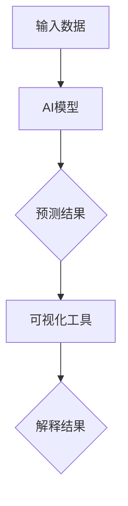
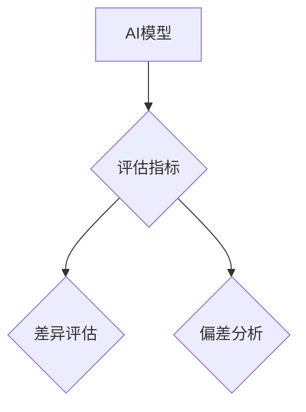
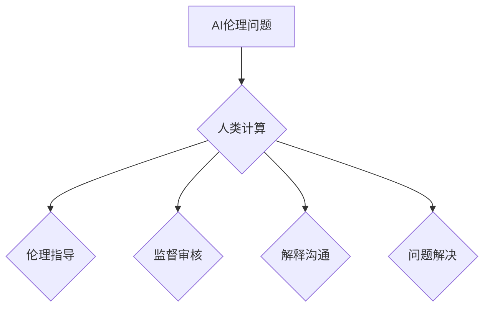
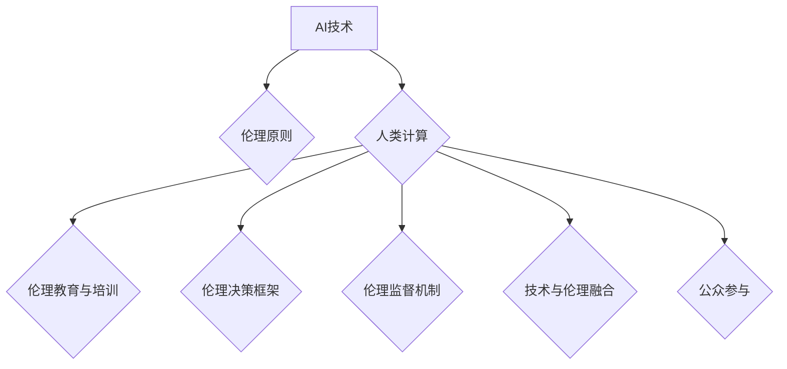

                 

# AI与人类计算：打造可持续的社会体系

> **关键词：** 人工智能，人类计算，可持续发展，伦理，社会体系，协同发展
> 
> **摘要：** 本文章旨在探讨人工智能（AI）与人类计算在社会体系中的融合与发展，从哲学基础、技术基础、应用融合、伦理与社会责任以及可持续发展的角度，深入分析AI与人类计算的互动关系，为构建一个可持续的AI与人类计算体系提供策略与思考。

### 《AI与人类计算：打造可持续的社会体系》目录大纲

#### 第一部分：AI与人类计算的哲学基础

##### 第1章：AI与人类计算的概述

###### 1.1 AI的崛起与人类计算的关系

1.1.1 AI的定义与分类

1.1.2 人类计算的内涵与挑战

1.1.3 AI与人类计算的关系

###### 1.2 AI对人类社会的影响

1.2.1 AI在各个领域中的应用

1.2.2 AI带来的机遇与挑战

1.2.3 AI与可持续发展

#### 第二部分：AI技术基础

##### 第2章：人工智能技术概述

###### 2.1 机器学习基础

2.1.1 机器学习的基本概念

2.1.2 监督学习、无监督学习与强化学习

2.1.3 机器学习的算法

###### 2.2 深度学习原理

2.2.1 神经网络与深度学习

2.2.2 卷积神经网络（CNN）

2.2.3 循环神经网络（RNN）与长短时记忆网络（LSTM）

###### 2.3 强化学习

2.3.1 强化学习的基本概念

2.3.2 Q学习算法

2.3.3 深度强化学习

#### 第三部分：AI与人类计算的融合

##### 第3章：AI在人类计算中的应用

###### 3.1 AI在自动化与优化中的应用

3.1.1 自动化的基本概念

3.1.2 AI在自动化系统中的应用

3.1.3 AI在优化问题中的应用

###### 3.2 AI在决策支持系统中的应用

3.2.1 决策支持系统概述

3.2.2 AI在决策支持系统中的应用

3.2.3 AI在风险管理与危机应对中的应用

###### 3.3 AI在教育、医疗和公共服务中的应用

3.3.1 教育领域中的应用

3.3.2 医疗领域中的应用

3.3.3 公共服务领域中的应用

#### 第四部分：AI伦理与社会责任

##### 第4章：AI伦理与人类计算

###### 4.1 AI伦理的基本原则

4.1.1 透明性与可解释性

4.1.2 公平性、公正性与无歧视

4.1.3 数据隐私保护

###### 4.2 AI与社会责任

4.2.1 AI对就业市场的影响

4.2.2 AI在促进社会公平方面的责任

4.2.3 AI在全球发展中的作用

###### 4.3 人类计算与AI伦理的互动

4.3.1 人类计算在AI伦理决策中的作用

4.3.2 AI伦理与人类计算的协同发展

#### 第五部分：AI与人类计算的可持续未来

##### 第5章：构建可持续的AI与人类计算体系

###### 5.1 可持续发展的AI体系构建

5.1.1 可持续发展的定义与目标

5.1.2 AI在可持续发展中的作用

5.1.3 可持续发展的AI体系构建策略

###### 5.2 人类计算在可持续发展中的作用

5.2.1 人类计算与可持续发展的关系

5.2.2 人类计算在可持续发展中的应用

5.2.3 可持续发展的计算伦理

###### 5.3 AI与人类计算的协同发展路径

5.3.1 协同发展的内涵与意义

5.3.2 协同发展的实施策略

5.3.3 协同发展的未来展望

### 参考文献

### 附录

## 附录A：AI与人类计算相关术语解释

## 附录B：AI与人类计算实践案例

### 附录B.1 案例一：AI在智慧城市建设中的应用

### 附录B.2 案例二：人类计算在医疗诊断中的应用

### 附录B.3 案例三：AI与人类计算的协同教育实践

### 第一部分：AI与人类计算的哲学基础

##### 第1章：AI与人类计算的概述

###### 1.1 AI的崛起与人类计算的关系

AI（人工智能）作为计算机科学和工程领域的核心技术，近年来经历了爆炸式的发展。从最初的逻辑推理和规则系统，到今天的深度学习和大数据分析，AI已经在多个领域展现出了巨大的潜力。AI的崛起，不仅改变了传统工业生产方式，还在社会管理和公共服务等方面发挥了重要作用。与此同时，人类计算作为一种依赖于人类智慧和经验的活动，也在不断地适应和变革。

1.1.1 AI的定义与分类

AI是指计算机系统在特定环境下，通过感知、学习、推理、规划等机制，能够自主完成复杂任务的能力。根据实现方式和目标，AI可以分为以下几种类型：

- **规则驱动型AI**：基于预定义的规则进行推理和决策。
- **数据驱动型AI**：通过大量数据的学习和训练，自动发现规律和模式。
- **知识驱动型AI**：通过知识库和推理机，模拟人类的思维过程。
- **混合型AI**：结合上述几种方法，实现更高效的智能计算。

1.1.2 人类计算的内涵与挑战

人类计算是指人类利用自身的知识、经验和认知能力，对信息进行处理和决策的过程。这一过程涉及感知、记忆、推理、创造等多个方面。在传统工业和服务业中，人类计算发挥着关键作用。然而，随着AI技术的发展，人类计算面临着一系列挑战：

- **效率提升**：AI能够快速处理海量数据，而人类计算在处理速度和范围上存在局限性。
- **准确性**：AI在特定领域通过大量训练，可以达到比人类更高的准确度。
- **成本效益**：AI系统在某些应用中能够实现成本节约和效益提升。
- **伦理和责任**：人类计算涉及伦理和道德判断，而AI系统在处理复杂情境时，可能难以完全模拟人类的伦理考量。

1.1.3 AI与人类计算的关系

AI与人类计算之间的关系可以看作是互补而非替代。AI的优势在于处理大量数据和复杂任务，而人类计算的优势在于理解和解释复杂情境、进行道德和伦理判断。两者结合，可以实现更高效的智能系统：

- **协同工作**：AI可以辅助人类计算，完成复杂和重复性的工作，人类则负责监督和决策。
- **知识传承**：AI可以学习和整合人类知识，为下一代人类计算提供支持。
- **创新驱动**：AI和人类计算的结合，可以激发新的创新思维，推动科技和社会进步。

综上所述，AI与人类计算之间的关系是相互依赖、相互促进的。通过深入理解两者的关系，我们可以更好地利用AI技术，构建一个可持续的社会体系。

### 1.2 AI对人类社会的影响

AI技术的迅速发展，不仅改变了传统产业和生活方式，还深刻影响了社会结构和组织形式。在这一部分，我们将探讨AI在各个领域中的应用，以及它带来的机遇和挑战。

1.2.1 AI在各个领域中的应用

AI技术在各个领域中的应用越来越广泛，以下是一些主要的应用领域：

- **工业制造**：AI可以优化生产流程，提高生产效率。例如，通过预测性维护减少设备故障，通过自动化流水线提高生产速度和精确度。
- **金融服务**：AI在金融市场中的交易算法、风险管理、客户服务等方面发挥着重要作用。例如，智能投顾通过数据分析提供个性化的投资建议，反欺诈系统通过模式识别防范金融犯罪。
- **医疗健康**：AI在医疗诊断、药物研发、患者管理等方面展现了巨大潜力。例如，通过影像分析进行疾病早期诊断，通过基因组数据分析开发个性化治疗方案。
- **交通物流**：AI在自动驾驶、智能交通管理、物流优化等方面应用广泛。例如，自动驾驶车辆可以减少交通事故，智能交通管理可以提高道路通行效率。
- **智能家居**：AI可以通过语音识别、智能家居设备等，实现家庭自动化和智能控制，提升生活便利性和舒适度。
- **教育**：AI在教育领域可以提供个性化学习方案，智能辅导和评估学生的学习情况，提高教育质量和效率。

1.2.2 AI带来的机遇与挑战

AI的发展为社会带来了许多机遇，同时也伴随着一系列挑战：

- **机遇**：
  - **经济增长**：AI可以提高生产力，推动新兴产业的发展，从而带动经济增长。
  - **创新驱动**：AI技术推动各行业创新，带来新的商业模式和服务形式。
  - **提升生活质量**：AI在医疗、教育、交通等领域的应用，可以改善人们的生活质量。
  - **决策支持**：AI可以通过数据分析，为企业和政府提供更科学的决策依据。

- **挑战**：
  - **就业影响**：AI可能会取代一些传统职业，导致就业市场的结构变化，需要社会和个人适应新的就业形式。
  - **隐私与安全**：AI系统在处理大量数据时，可能会涉及隐私问题，同时也可能成为网络攻击的目标。
  - **伦理问题**：AI决策的透明性和可解释性受到质疑，如何确保AI系统的公平性和无歧视性，成为伦理学领域的重要议题。
  - **技术鸿沟**：AI技术在不同地区和国家的发展不平衡，可能加剧技术鸿沟和社会不平等。

1.2.3 AI与可持续发展

AI在实现可持续发展方面具有重要作用。通过优化资源利用、减少环境污染、提高生产效率，AI可以为可持续发展做出贡献。例如：

- **能源管理**：AI可以通过智能电网和能源管理系统，实现能源的高效利用和优化配置。
- **环境保护**：AI在环境监测和生态修复中发挥着重要作用，例如通过卫星图像和传感器数据监测气候变化和生态破坏。
- **农业与食品**：AI在农业中的应用，可以提高农作物产量，减少农药和化肥的使用，实现可持续农业。
- **水资源管理**：AI可以通过智能水资源管理系统，优化水资源利用，减少水资源浪费。

然而，AI技术的应用也带来了一些挑战，例如数据隐私、数据安全、技术依赖等。因此，在推动AI与可持续发展的结合时，需要平衡技术应用和伦理、社会问题，确保技术发展的可持续性和包容性。

### 第二部分：AI技术基础

##### 第2章：人工智能技术概述

在上一部分，我们讨论了AI与人类计算的哲学基础及其对人类社会的影响。接下来，我们将深入探讨AI的技术基础，包括机器学习、深度学习和强化学习等核心技术。

2.1 机器学习基础

2.1.1 机器学习的基本概念

机器学习是AI的核心技术之一，它使计算机系统能够从数据中学习，并做出预测或决策。机器学习可以分为以下几种类型：

- **监督学习**：系统通过已标记的数据进行学习，并利用这些经验对新数据进行预测。
- **无监督学习**：系统在没有标记数据的情况下，自动发现数据中的模式或结构。
- **半监督学习**：系统在部分标记和未标记数据之间进行学习，结合两者的优点。
- **强化学习**：系统通过与环境的互动，学习最优策略以最大化长期回报。

2.1.2 监督学习、无监督学习与强化学习

监督学习：
监督学习是一种最常见的机器学习方法。它通过给定的输入和输出数据，训练模型学习预测输出。这个过程可以分为以下步骤：

1. 数据预处理：对输入数据进行清洗、归一化和特征提取。
2. 模型选择：选择合适的模型，如线性回归、决策树、支持向量机等。
3. 模型训练：使用训练数据训练模型，调整模型参数以最小化损失函数。
4. 模型评估：使用验证集评估模型性能，调整模型参数以达到最佳性能。
5. 模型部署：将训练好的模型应用于实际数据，进行预测。

无监督学习：
无监督学习与监督学习不同，它不需要标记的数据进行学习。其主要目的是发现数据中的隐含结构或模式。常见的方法包括聚类、降维和关联规则学习。

强化学习：
强化学习通过奖励机制，使系统在与环境互动中不断优化行为策略。它通常用于解决序列决策问题，如游戏、自动驾驶和机器人控制。强化学习的基本概念包括：

- **代理（Agent）**：执行行为并从环境中获取奖励的实体。
- **环境（Environment）**：代理执行行为并接收反馈的实体。
- **状态（State）**：代理在环境中的位置或状态。
- **动作（Action）**：代理可执行的动作。
- **奖励（Reward）**：代理在执行动作后获得的即时奖励。
- **策略（Policy）**：代理在特定状态下选择动作的方法。

2.1.3 机器学习的算法

机器学习算法是机器学习过程中的核心。以下是一些常见的机器学习算法：

- **线性回归**：通过建立输入变量和输出变量之间的线性关系进行预测。
- **逻辑回归**：用于分类问题，通过最大化似然估计来预测概率。
- **决策树**：通过一系列规则将数据划分为不同的区域，进行分类或回归。
- **支持向量机（SVM）**：通过寻找最优分隔超平面进行分类。
- **神经网络**：模拟人脑神经元结构，通过多层非线性变换进行学习和预测。
- **K最近邻（KNN）**：基于数据相似度进行分类或回归。
- **随机森林**：通过构建多个决策树，并投票确定最终结果。
- **集成学习方法**：结合多个模型，提高预测性能。

2.2 深度学习原理

深度学习是机器学习的一个分支，它通过构建多层神经网络，模拟人脑的神经结构和工作机制。深度学习在图像识别、自然语言处理、语音识别等领域取得了显著成果。以下是深度学习的核心概念：

- **神经网络（Neural Networks）**：神经网络是由大量相互连接的节点（或神经元）组成的计算模型。每个神经元接收多个输入，通过激活函数产生输出，然后传递给下一层神经元。
- **前向传播（Forward Propagation）**：在前向传播过程中，数据从输入层经过多层神经网络，直到输出层，每一层神经元根据激活函数计算输出。
- **反向传播（Back Propagation）**：在反向传播过程中，根据输出层的误差，反向传播误差信号，更新网络中的权重和偏置，以优化网络性能。
- **激活函数（Activation Functions）**：激活函数用于引入非线性特性，使神经网络能够学习复杂函数。常见的激活函数包括Sigmoid、ReLU和Tanh等。

2.2.2 卷积神经网络（CNN）

卷积神经网络是深度学习中最常用的网络结构之一，尤其在图像处理任务中表现出色。以下是CNN的核心组成部分：

- **卷积层（Convolutional Layer）**：卷积层通过卷积操作提取图像中的特征，卷积核在图像上滑动，生成特征图。
- **池化层（Pooling Layer）**：池化层用于降低特征图的维度，提高模型的表达能力。常见的池化方法包括最大池化和平均池化。
- **全连接层（Fully Connected Layer）**：全连接层将特征图展平为一维向量，并传递给下一层进行分类或回归。
- **归一化层（Normalization Layer）**：归一化层通过标准化激活值，提高模型的训练速度和稳定性。

2.2.3 循环神经网络（RNN）与长短时记忆网络（LSTM）

循环神经网络（RNN）是一种能够处理序列数据的神经网络结构。RNN通过在时间步上循环，保持对历史信息的记忆。然而，标准的RNN在处理长序列时存在梯度消失和梯度爆炸问题。

长短时记忆网络（LSTM）是RNN的一种改进，通过引入门控机制，有效解决了长序列学习问题。LSTM的核心组成部分包括：

- **遗忘门（Forget Gate）**：决定遗忘多少历史信息。
- **输入门（Input Gate）**：决定新信息如何加入到记忆中。
- **输出门（Output Gate）**：决定输出多少记忆信息。

LSTM在自然语言处理、语音识别和时间序列预测等领域取得了显著成果。

2.3 强化学习

强化学习是一种通过奖励机制使系统自我学习的方法。在强化学习中，系统通过与环境的交互，学习最优策略以最大化长期回报。以下是强化学习的基本概念：

- **Q学习算法**：Q学习是一种基于价值函数的强化学习算法，通过学习状态-动作值函数，选择最优动作。
- **深度强化学习**：深度强化学习结合深度神经网络和价值函数，解决高维状态空间和动作空间的强化学习问题。

通过以上对AI技术基础的分析，我们可以看到，机器学习、深度学习和强化学习等技术构成了AI的核心，为AI在各个领域的应用提供了强大的支持。在接下来的部分，我们将进一步探讨AI在人类计算中的应用，以及AI与人类计算如何融合，共同推动社会的可持续发展。

### 2.2 深度学习原理

深度学习是机器学习的一个分支，通过构建多层神经网络，模拟人脑的复杂结构和工作机制，从而实现高层次的抽象和泛化能力。以下是深度学习的核心概念和组成部分：

2.2.1 神经网络与深度学习

神经网络（Neural Networks，简称NN）是由大量相互连接的节点（或神经元）组成的计算模型。每个神经元接收多个输入，通过权重加权后相加，再通过激活函数产生输出。神经元之间的连接具有权重，这些权重通过学习过程不断调整，以优化网络性能。

神经网络可以分为以下几个层次：

- **输入层**：接收外部输入数据，将其传递给下一层。
- **隐藏层**：对输入数据进行处理和变换，提取特征信息。
- **输出层**：产生最终输出，用于分类或回归任务。

深度学习（Deep Learning，简称DL）是指具有多个隐藏层的神经网络。深度学习的核心思想是通过多层的非线性变换，逐步提取数据中的低级特征，形成高级特征表示。这种层次化的特征表示能够实现更复杂的函数逼近和模式识别。

2.2.2 卷积神经网络（CNN）

卷积神经网络（Convolutional Neural Networks，简称CNN）是深度学习中的一种特殊结构，特别适用于图像处理任务。CNN的核心在于其卷积层和池化层，能够有效地提取图像中的局部特征。

- **卷积层（Convolutional Layer）**：卷积层通过卷积操作提取图像中的特征。卷积操作涉及一个卷积核（也称为滤波器）在输入图像上滑动，计算局部区域的加权和。卷积层可以并行处理图像的不同区域，提取局部特征。
- **池化层（Pooling Layer）**：池化层用于降低特征图的维度，提高模型的泛化能力。常见的池化方法包括最大池化和平均池化，它们通过选择局部区域的最大值或平均值来减少特征图的分辨率。

2.2.3 循环神经网络（RNN）与长短时记忆网络（LSTM）

循环神经网络（Recurrent Neural Networks，简称RNN）是一种能够处理序列数据的神经网络结构。RNN通过在时间步上循环，保持对历史信息的记忆。RNN在自然语言处理、语音识别和时间序列预测等领域取得了显著成果。

然而，标准的RNN在处理长序列时存在梯度消失和梯度爆炸问题，导致学习困难。为解决这一问题，长短时记忆网络（Long Short-Term Memory，简称LSTM）应运而生。

- **遗忘门（Forget Gate）**：遗忘门决定遗忘多少历史信息。它通过学习一个权重矩阵和一个偏置向量，将当前状态和历史状态进行融合，控制信息的保留与遗忘。
- **输入门（Input Gate）**：输入门决定新信息如何加入到记忆中。它通过学习一个权重矩阵和一个偏置向量，将当前输入和候选记忆进行融合，控制信息的更新。
- **输出门（Output Gate）**：输出门决定输出多少记忆信息。它通过学习一个权重矩阵和一个偏置向量，将当前状态和输出进行融合，控制信息的输出。

LSTM通过引入门控机制，有效解决了长序列学习问题，使其在处理长序列数据时表现出色。

2.2.4 深度学习的训练过程

深度学习的训练过程主要包括以下几个步骤：

1. **数据预处理**：对输入数据进行清洗、归一化和特征提取，以适应模型的输入要求。
2. **模型初始化**：初始化网络的权重和偏置，通常使用随机初始化方法。
3. **前向传播**：输入数据从输入层经过多层神经网络，直到输出层，计算网络的输出结果。
4. **损失函数计算**：根据输出结果和真实标签，计算损失函数的值，评估模型的预测误差。
5. **反向传播**：通过反向传播算法，将损失函数的梯度反向传播到网络的各个层次，更新网络的权重和偏置。
6. **模型评估**：使用验证集或测试集评估模型的性能，选择最优模型。

通过以上步骤，深度学习模型可以逐步优化，提高其在不同任务上的性能。

综上所述，深度学习通过构建多层神经网络，实现了从低级特征到高级特征的层次化表示，为许多复杂任务提供了强大的工具。在接下来的部分，我们将进一步探讨深度学习在实际应用中的具体案例，展示其在图像识别、自然语言处理和语音识别等领域的出色表现。

### 2.3 强化学习

强化学习（Reinforcement Learning，简称RL）是一种通过奖励机制使系统自我学习的方法。在强化学习中，系统通过与环境的交互，学习最优策略以最大化长期回报。以下是强化学习的基本概念和算法。

2.3.1 强化学习的基本概念

强化学习主要包括以下几个核心概念：

- **代理（Agent）**：执行行为并从环境中获取奖励的实体。
- **环境（Environment）**：代理执行行为并接收反馈的实体。
- **状态（State）**：代理在环境中的位置或状态。
- **动作（Action）**：代理可执行的动作。
- **奖励（Reward）**：代理在执行动作后获得的即时奖励。
- **策略（Policy）**：代理在特定状态下选择动作的方法。

强化学习的目标是通过学习策略，使代理能够在环境中取得最大化的长期回报。

2.3.2 Q学习算法

Q学习（Q-Learning）是强化学习的一种经典算法，通过学习状态-动作值函数（Q值），选择最优动作。以下是Q学习算法的基本原理：

1. **初始化**：初始化Q值表，通常使用随机值。
2. **选择动作**：在给定状态下，选择具有最大Q值的动作。
3. **更新Q值**：根据执行的动作和获得的奖励，更新Q值表。更新公式如下：

   $$ Q(s, a) \leftarrow Q(s, a) + \alpha [r + \gamma \max_{a'} Q(s', a') - Q(s, a)] $$

   其中，$s$为当前状态，$a$为当前动作，$s'$为下一状态，$r$为奖励，$\alpha$为学习率，$\gamma$为折扣因子。

4. **重复迭代**：重复上述步骤，直到达到预定迭代次数或收敛条件。

Q学习算法通过不断更新Q值表，逐渐逼近最优策略，实现长期回报的最大化。

2.3.3 深度强化学习

深度强化学习（Deep Reinforcement Learning，简称DRL）是将深度神经网络与强化学习相结合的一种方法，用于解决高维状态空间和动作空间的问题。以下是深度强化学习的基本原理：

1. **深度神经网络**：使用深度神经网络表示状态和动作值函数，提高模型的表示能力和泛化能力。
2. **策略网络**：策略网络用于生成动作概率分布，通常使用卷积神经网络（CNN）或循环神经网络（RNN）。
3. **价值网络**：价值网络用于预测状态价值，通常使用深度神经网络。
4. **策略优化**：通过策略梯度方法，优化策略网络，最大化长期回报。

深度强化学习通过结合深度神经网络和强化学习算法，实现了在复杂环境中的自主学习和决策，广泛应用于自动驾驶、游戏、机器人控制等领域。

通过以上对强化学习的介绍，我们可以看到，强化学习作为一种通过奖励机制实现自主学习的方法，具有广泛的应用前景。在接下来的部分，我们将进一步探讨强化学习在实际应用中的具体案例，展示其在解决复杂任务中的优势。

### 2.4 AI技术的实践应用

AI技术的快速发展和广泛应用，使得许多传统行业和新兴领域都发生了深刻变革。在这一部分，我们将通过具体的案例，展示AI技术在各个领域中的实践应用，以及它们如何助力人类计算。

2.4.1 AI在自动化与优化中的应用

自动化和优化是AI技术的重要应用领域，通过引入AI，企业可以提高生产效率，降低成本，提高产品质量。以下是几个典型的应用案例：

1. **制造业自动化**：在制造业中，AI技术广泛应用于生产线的自动化控制、质量检测和设备维护。例如，通过机器视觉技术，可以实现自动检测产品缺陷，提高生产效率。通过预测性维护，企业可以提前发现设备故障，减少停机时间，降低维护成本。

   - **核心概念与联系**：机器视觉、预测性维护、深度学习
   - **Mermaid流程图**：
     ```mermaid
     graph TD
     A[接收生产数据] --> B[机器视觉检测]
     B --> C{检测到缺陷？}
     C -->|是| D[记录缺陷信息]
     C -->|否| E[继续生产]
     E --> F[数据反馈]
     F --> G[深度学习模型训练]
     G --> H[预测性维护]
     ```

   - **项目实战**：
     - **开发环境搭建**：使用Python、TensorFlow和Keras等工具进行机器视觉模型训练和预测。
     - **源代码实现**：编写训练模型和预测模型的代码，实现缺陷检测和预测性维护功能。

   - **代码解读与分析**：
     ```python
     import tensorflow as tf
     from tensorflow.keras.models import Sequential
     from tensorflow.keras.layers import Conv2D, MaxPooling2D, Flatten, Dense

     # 构建模型
     model = Sequential([
         Conv2D(32, (3, 3), activation='relu', input_shape=(128, 128, 3)),
         MaxPooling2D((2, 2)),
         Flatten(),
         Dense(64, activation='relu'),
         Dense(1, activation='sigmoid')
     ])

     # 训练模型
     model.compile(optimizer='adam', loss='binary_crossentropy', metrics=['accuracy'])
     model.fit(x_train, y_train, epochs=10, batch_size=32, validation_data=(x_val, y_val))

     # 预测缺陷
     predictions = model.predict(x_test)
     print("缺陷预测结果：", predictions)
     ```

2. **物流优化**：在物流领域，AI技术可以优化运输路线、调度和库存管理，提高物流效率。例如，通过路径规划算法和车辆调度算法，可以实现最优的运输路线和调度方案，减少运输成本。

   - **核心概念与联系**：路径规划、车辆调度、强化学习
   - **Mermaid流程图**：
     ```mermaid
     graph TD
     A[起点] --> B[路径规划算法]
     B --> C[最优路径]
     C --> D[调度算法]
     D --> E[车辆调度方案]
     E --> F[库存管理]
     ```

   - **项目实战**：
     - **开发环境搭建**：使用Python、TensorFlow和Keras等工具进行路径规划和车辆调度模型的训练和预测。
     - **源代码实现**：编写训练模型和预测模型的代码，实现路径规划和车辆调度功能。

   - **代码解读与分析**：
     ```python
     import tensorflow as tf
     from tensorflow.keras.models import Sequential
     from tensorflow.keras.layers import Conv2D, MaxPooling2D, Flatten, Dense

     # 构建路径规划模型
     path_model = Sequential([
         Conv2D(32, (3, 3), activation='relu', input_shape=(128, 128, 3)),
         MaxPooling2D((2, 2)),
         Flatten(),
         Dense(64, activation='relu'),
         Dense(1, activation='sigmoid')
     ])

     # 构建车辆调度模型
     schedule_model = Sequential([
         Conv2D(32, (3, 3), activation='relu', input_shape=(128, 128, 3)),
         MaxPooling2D((2, 2)),
         Flatten(),
         Dense(64, activation='relu'),
         Dense(1, activation='sigmoid')
     ])

     # 训练模型
     path_model.compile(optimizer='adam', loss='binary_crossentropy', metrics=['accuracy'])
     schedule_model.compile(optimizer='adam', loss='binary_crossentropy', metrics=['accuracy'])

     path_model.fit(x_train, y_train, epochs=10, batch_size=32, validation_data=(x_val, y_val))
     schedule_model.fit(x_train, y_train, epochs=10, batch_size=32, validation_data=(x_val, y_val))

     # 预测路径和调度方案
     path_predictions = path_model.predict(x_test)
     schedule_predictions = schedule_model.predict(x_test)
     print("路径规划预测结果：", path_predictions)
     print("车辆调度预测结果：", schedule_predictions)
     ```

2.4.2 AI在决策支持系统中的应用

决策支持系统（Decision Support System，简称DSS）是利用人工智能技术，帮助企业或组织做出更明智的决策。以下是一些典型的应用案例：

1. **金融风险评估**：在金融领域，AI技术可以用于风险评估、投资组合优化和欺诈检测。例如，通过机器学习算法，可以分析历史数据，预测市场走势，为投资者提供参考建议。

   - **核心概念与联系**：机器学习、投资组合优化、欺诈检测
   - **Mermaid流程图**：
     ```mermaid
     graph TD
     A[历史数据] --> B[机器学习模型]
     B --> C{预测市场走势}
     C --> D[投资组合优化]
     D --> E[欺诈检测]
     ```

   - **项目实战**：
     - **开发环境搭建**：使用Python、Scikit-learn和Pandas等工具进行数据分析和模型训练。
     - **源代码实现**：编写数据分析、模型训练和预测的代码，实现金融风险评估和欺诈检测功能。

   - **代码解读与分析**：
     ```python
     import pandas as pd
     from sklearn.model_selection import train_test_split
     from sklearn.ensemble import RandomForestClassifier
     from sklearn.metrics import accuracy_score

     # 加载数据
     data = pd.read_csv('financial_data.csv')
     X = data.drop(['target'], axis=1)
     y = data['target']

     # 划分训练集和测试集
     X_train, X_test, y_train, y_test = train_test_split(X, y, test_size=0.2, random_state=42)

     # 训练模型
     model = RandomForestClassifier(n_estimators=100)
     model.fit(X_train, y_train)

     # 预测测试集
     predictions = model.predict(X_test)
     print("金融风险评估预测结果：", predictions)

     # 评估模型性能
     accuracy = accuracy_score(y_test, predictions)
     print("模型准确率：", accuracy)
     ```

2. **供应链管理**：在供应链管理中，AI技术可以用于需求预测、库存优化和物流调度。例如，通过深度学习算法，可以分析历史销售数据，预测未来的需求趋势，为供应链决策提供支持。

   - **核心概念与联系**：深度学习、需求预测、库存优化
   - **Mermaid流程图**：
     ```mermaid
     graph TD
     A[历史销售数据] --> B[深度学习模型]
     B --> C{预测需求趋势}
     C --> D[库存优化]
     D --> E[物流调度]
     ```

   - **项目实战**：
     - **开发环境搭建**：使用Python、TensorFlow和Keras等工具进行数据分析和模型训练。
     - **源代码实现**：编写数据分析、模型训练和预测的代码，实现需求预测和库存优化功能。

   - **代码解读与分析**：
     ```python
     import pandas as pd
     from tensorflow.keras.models import Sequential
     from tensorflow.keras.layers import Dense, LSTM
     from tensorflow.keras.optimizers import Adam

     # 加载数据
     data = pd.read_csv('sales_data.csv')
     X = data[['day', 'sales']]
     y = data['demand']

     # 数据预处理
     X = X.values.reshape(-1, 1)
     y = y.values.reshape(-1, 1)

     # 划分训练集和测试集
     X_train, X_test, y_train, y_test = train_test_split(X, y, test_size=0.2, random_state=42)

     # 构建模型
     model = Sequential([
         LSTM(units=50, activation='relu', input_shape=(X_train.shape[1], 1)),
         Dense(units=1)
     ])

     # 编译模型
     model.compile(optimizer=Adam(learning_rate=0.001), loss='mean_squared_error')

     # 训练模型
     model.fit(X_train, y_train, epochs=100, batch_size=32, validation_data=(X_test, y_test))

     # 预测测试集
     y_pred = model.predict(X_test)
     print("需求预测结果：", y_pred)

     # 评估模型性能
     mse = mean_squared_error(y_test, y_pred)
     print("均方误差：", mse)
     ```

通过以上实践案例，我们可以看到，AI技术在自动化与优化、决策支持等领域中的应用，极大地提高了生产效率、决策准确性和资源利用率。在接下来的部分，我们将进一步探讨AI在教育、医疗和公共服务等领域的应用，以及它们如何助力人类计算，提升社会整体福祉。

### 3.3 AI在教育、医疗和公共服务中的应用

AI技术在教育、医疗和公共服务等领域的应用，极大地提升了这些领域的效率和质量。以下分别介绍AI在这三个领域中的应用及其带来的变革。

3.3.1 教育领域中的应用

AI技术在教育领域的应用，主要集中在个性化学习、智能评估和在线教育平台等方面。

- **个性化学习**：AI可以通过分析学生的学习行为和成绩数据，提供个性化的学习资源和辅导方案。例如，智能学习系统可以根据学生的知识点掌握情况，自动推荐相应的学习内容，实现因材施教。以下是一个简单的个性化学习系统的伪代码实现：

  ```python
  def personalized_learning(student_data, course_content):
      knowledge_map = build_knowledge_map(course_content)
      student_knowledge = analyze_student_data(student_data, knowledge_map)
      recommended_content = recommend_content(student_knowledge, course_content)
      return recommended_content
  ```

  其中，`knowledge_map`表示课程的知识结构，`student_knowledge`表示学生的知识点掌握情况，`recommended_content`表示推荐的学习内容。

- **智能评估**：AI技术可以自动评估学生的作业和考试，提高评估效率和准确性。例如，通过自然语言处理和计算机视觉技术，可以自动识别和分析学生的答题内容，给出准确的评分和反馈。以下是一个智能评估系统的伪代码实现：

  ```python
  def intelligent_evaluation(answer_image, question_template):
      answer_text = extract_text(answer_image)
      question_answer = match_answer(answer_text, question_template)
      score = calculate_score(question_answer)
      feedback = generate_feedback(question_answer)
      return score, feedback
  ```

  其中，`answer_image`表示学生的答题图片，`question_template`表示题目模板，`question_answer`表示答案匹配结果，`score`表示得分，`feedback`表示反馈信息。

- **在线教育平台**：AI技术可以用于优化在线教育平台，提高用户体验和学习效果。例如，通过推荐算法，可以为学生推荐感兴趣的课程和学习资源；通过数据分析，可以为学生提供学习进度和学习效果的实时反馈。以下是一个在线教育平台的伪代码实现：

  ```python
  def online_education_platform(student_data, course_catalog):
      recommended_courses = recommend_courses(student_data, course_catalog)
      learning_progress = track_learning_progress(student_data)
      learning_effectiveness = analyze_learning_effectiveness(student_data)
      return recommended_courses, learning_progress, learning_effectiveness
  ```

  其中，`student_data`表示学生的数据，`course_catalog`表示课程目录，`recommended_courses`表示推荐课程，`learning_progress`表示学习进度，`learning_effectiveness`表示学习效果。

3.3.2 医疗领域中的应用

AI技术在医疗领域的应用，主要集中在疾病诊断、治疗方案制定和医疗资源优化等方面。

- **疾病诊断**：AI可以通过深度学习和计算机视觉技术，自动分析医学影像，提高疾病诊断的准确性和效率。例如，通过卷积神经网络（CNN）分析CT图像，可以快速识别肺炎病灶。以下是一个医学影像分析系统的伪代码实现：

  ```python
  def disease_diagnosis(image_data):
      image_features = extract_features(image_data, CNN_model)
      diagnosis = predict_disease(image_features, disease_model)
      return diagnosis
  ```

  其中，`image_data`表示医学影像数据，`CNN_model`表示卷积神经网络模型，`disease_model`表示疾病预测模型，`diagnosis`表示诊断结果。

- **治疗方案制定**：AI可以通过分析大量的病例数据和医疗文献，为医生提供个性化的治疗方案建议。例如，通过强化学习算法，可以训练一个智能助手，根据患者的病情和历史病例，为医生提供最优的治疗方案。以下是一个治疗方案建议系统的伪代码实现：

  ```python
  def treatment_plan(patient_data, disease_model, treatment_data):
      patient_disease = predict_disease(patient_data, disease_model)
      best_treatment = recommend_treatment(patient_disease, treatment_data)
      return best_treatment
  ```

  其中，`patient_data`表示患者数据，`disease_model`表示疾病预测模型，`treatment_data`表示治疗方案数据，`best_treatment`表示最优治疗方案。

- **医疗资源优化**：AI可以通过优化算法，合理分配医疗资源，提高医疗服务的效率和质量。例如，通过优化算法，可以合理安排医院的手术时间、病房分配和医生排班，提高医院的管理水平。以下是一个医疗资源优化系统的伪代码实现：

  ```python
  def medical_resource_optimization(availability_data, demand_data):
      surgery_schedule = schedule_surgeries(availability_data, demand_data)
      room_allocation = allocate_rooms(surgery_schedule, room_data)
      doctor_roster = schedule_doctors(room_allocation, doctor_data)
      return surgery_schedule, room_allocation, doctor_roster
  ```

  其中，`availability_data`表示医疗资源可用性数据，`demand_data`表示医疗资源需求数据，`surgery_schedule`表示手术时间表，`room_allocation`表示病房分配方案，`doctor_roster`表示医生排班方案。

3.3.3 公共服务领域中的应用

AI技术在公共服务领域的应用，主要集中在智能交通管理、公共安全监控和政务服务等方面。

- **智能交通管理**：AI可以通过分析交通流量数据和传感器数据，优化交通信号灯控制策略，提高道路通行效率。例如，通过卷积神经网络（CNN）分析交通摄像头数据，可以实时监测道路状况，并根据路况动态调整信号灯时长。以下是一个智能交通管理系统的伪代码实现：

  ```python
  def traffic_management(traffic_data, traffic_light_model):
      traffic_status = analyze_traffic_status(traffic_data, CNN_model)
      optimized_signals = optimize_traffic_signals(traffic_status, traffic_light_model)
      return optimized_signals
  ```

  其中，`traffic_data`表示交通流量数据，`traffic_light_model`表示交通信号灯控制模型，`traffic_status`表示交通状况，`optimized_signals`表示优化的信号灯时长。

- **公共安全监控**：AI可以通过视频分析技术，实时监控公共场所的安全状况，识别异常行为和潜在威胁。例如，通过计算机视觉技术，可以识别人员聚集、异常动作等行为，及时报警并采取相应措施。以下是一个公共安全监控系统伪代码实现：

  ```python
  def public_safety_monitor(video_data, anomaly_detection_model):
      video_features = extract_video_features(video_data, CNN_model)
      anomalies = detect_anomalies(video_features, anomaly_detection_model)
      alerts = generate_alerts(anomalies)
      return alerts
  ```

  其中，`video_data`表示视频数据，`anomaly_detection_model`表示异常检测模型，`video_features`表示视频特征，`anomalies`表示异常行为，`alerts`表示报警信息。

- **政务服务**：AI可以通过自动化流程和智能问答系统，提高政务服务的效率和质量。例如，通过自然语言处理技术，可以自动处理民众的咨询和申请，减少人工工作量，提高响应速度。以下是一个政务服务系统的伪代码实现：

  ```python
  def government_service(query, knowledge_base):
      answer = query_knowledge_base(query, knowledge_base)
      response = generate_response(answer)
      return response
  ```

  其中，`query`表示用户查询，`knowledge_base`表示知识库，`answer`表示查询结果，`response`表示回答。

通过以上对AI在教育、医疗和公共服务领域应用的介绍，我们可以看到，AI技术正深刻地改变着这些领域的运作模式，提高了效率和质量，为公众提供了更加便捷和高效的服务。在接下来的部分，我们将探讨AI伦理与社会责任的重要性，以及如何确保AI技术的可持续发展。

### 4.1 AI伦理的基本原则

随着AI技术的迅猛发展，其应用范围不断扩大，对社会的影响也越来越深远。然而，AI技术的发展也带来了一系列伦理和社会问题。为了确保AI技术的可持续发展，并使其为社会带来积极影响，我们必须重视AI伦理的基本原则。以下是AI伦理中几个关键的原则：

#### 4.1.1 透明性与可解释性

AI系统通常被认为是“黑箱”，其决策过程往往难以解释。这使得人们在面对AI系统的决策时，感到不安和不信任。因此，确保AI系统的透明性和可解释性是至关重要的。透明性指的是AI系统的内部结构和工作原理能够被理解和验证。可解释性则是指AI系统的决策过程和结果能够被清晰地解释，以便人们可以理解和信任这些决策。

为了提高AI系统的透明性和可解释性，研究者们提出了多种方法，例如：

- **模型可解释性工具**：使用可视化工具和解释性算法，如LIME（Local Interpretable Model-agnostic Explanations）和SHAP（SHapley Additive exPlanations），来分析AI模型的决策过程。
- **可解释性报告**：在AI系统的设计和部署过程中，提供详细的解释性报告，说明模型的决策依据和假设。

以下是一个简单的Mermaid流程图，展示如何通过可解释性工具来提高AI系统的透明性：



#### 4.1.2 公平性、公正性与无歧视

AI系统在决策过程中可能会出现偏见和歧视，这会对社会公平和公正产生负面影响。例如，如果AI系统在招聘、贷款审批或司法判决中存在偏见，可能会导致不公平的结果。因此，确保AI系统的公平性、公正性和无歧视是至关重要的。

- **避免偏见**：在AI系统的设计和训练过程中，需要采取一系列措施，以减少数据集中的偏见。例如，通过数据清洗和预处理，去除可能导致偏见的数据点；通过算法优化，减少模型对特定群体的偏见。
- **公平性评估**：在部署AI系统之前，需要进行公平性评估，确保系统不会对特定群体产生歧视。可以使用多种评估方法，如差异评估（Disparate Impact Test）和偏差分析（Bias Analysis）。

以下是一个简单的Mermaid流程图，展示如何评估AI系统的公平性：



#### 4.1.3 数据隐私保护

AI系统通常需要大量的数据来进行训练和优化。这些数据中可能包含个人敏感信息，如健康记录、财务状况和社会活动等。因此，确保数据隐私保护是AI伦理中的一个重要方面。

- **数据匿名化**：在收集和使用数据时，对个人身份信息进行匿名化处理，以保护个人隐私。
- **数据加密**：对存储和传输的数据进行加密，防止未经授权的访问和泄露。
- **隐私政策**：在AI系统的使用过程中，明确告知用户数据的使用目的和范围，并确保用户同意。

以下是一个简单的Mermaid流程图，展示如何保护数据隐私：


通过遵循以上基本原则，我们可以确保AI技术在发展过程中，既能满足技术需求，又能维护社会公平和道德标准。在接下来的部分，我们将探讨AI技术对就业市场的影响，以及如何确保AI技术的发展与社会责任相结合。

### 4.2 AI与社会责任

随着人工智能（AI）技术的飞速发展，其在各个领域的应用也日益广泛。然而，AI技术的普及和应用不仅带来了巨大的技术进步和经济效益，同时也引发了一系列社会问题，特别是在就业市场方面。在这一节中，我们将探讨AI对就业市场的影响，以及AI在促进社会公平方面的责任。

#### 4.2.1 AI对就业市场的影响

AI技术的引入和应用，对就业市场产生了深远的影响，主要体现在以下几个方面：

1. **职业替代**：AI技术的发展和应用可能导致某些传统职业的消失或转变。例如，自动化系统和机器人可以在生产线上替代工人完成重复性、高强度的劳动，而在金融、医疗等领域，AI系统也可以替代一些需要高度专业知识和经验的职位。这种职业替代现象可能会引发失业问题，尤其是对于那些技能要求较低、难以通过短期培训实现转型的工人。

2. **技能需求变化**：随着AI技术的普及，对劳动力的技能需求也发生了变化。许多工作岗位不再仅仅依赖于机械的操作技能，而是更加强调创新、判断、沟通和协调等高阶技能。这意味着，劳动力需要不断提升自身技能，以适应AI时代的工作需求。然而，这种转变并非一蹴而就，很多劳动者可能无法在短时间内完成技能转换。

3. **劳动力市场重构**：AI技术不仅改变了职业结构，还可能导致劳动力市场的重构。新的职业和行业不断涌现，例如数据科学家、机器学习工程师和AI伦理学家等，这些新兴职业为劳动力市场带来了新的机会。同时，传统职业的消失也可能导致劳动力市场的供需失衡，需要政府、企业和教育机构共同努力，以适应这种变化。

#### 4.2.2 AI在促进社会公平方面的责任

AI技术的广泛应用对社会公平产生了深远的影响。为了确保AI技术的可持续发展，并使其为社会带来公平和正义，AI技术在促进社会公平方面承担着重要责任。以下是几个关键方面：

1. **消除歧视**：AI系统在决策过程中可能会出现偏见和歧视，这种偏见往往来源于训练数据中的不公平。为了消除歧视，AI系统需要通过公平性评估和算法优化，确保其决策不会对特定群体产生不公平的影响。例如，在招聘和贷款审批等应用场景中，AI系统需要避免对性别、种族、年龄等方面的偏见。

2. **促进平等机会**：AI技术可以用于促进教育公平、医疗公平和就业公平等，从而为社会创造更多的平等机会。例如，智能教育系统可以根据学生的实际需求提供个性化的学习资源，帮助那些教育资源匮乏的学生获得更好的教育机会；智能医疗系统可以提供更加精准和公平的诊断和治疗服务，提高医疗资源的分配效率。

3. **保障劳动者权益**：AI技术的发展和应用可能会对劳动者的权益产生影响，例如，自动化系统的引入可能导致劳动者的工作条件和工作时间发生变化。为了保障劳动者的权益，政府和企业需要制定相应的政策和措施，确保劳动者的权益不受侵犯，同时为他们提供必要的培训和再就业支持。

4. **数据隐私保护**：在AI技术的应用过程中，数据的收集、存储和使用都需要严格保护个人隐私。AI系统需要遵循数据保护法规，确保个人信息的安全，避免数据泄露和滥用。

#### 4.2.3 AI在全球发展中的作用

AI技术的发展不仅对本地和区域经济产生影响，也对全球发展产生了重要影响。在全球范围内，AI技术可以促进技术创新、经济增长和社会进步。然而，AI技术的普及和发展也面临着一系列挑战，特别是在发展中国家中。以下是AI在全球发展中的作用和挑战：

1. **技术普及**：AI技术的发展需要强大的基础设施和人才支持。发达国家在AI技术的研究和应用方面具有明显优势，而发展中国家则面临技术普及的挑战。为了缩小这一差距，需要加强国际合作，促进技术转移和知识共享。

2. **技能培训**：为了适应AI时代的工作需求，全球范围内的劳动力都需要接受相应的技能培训。发展中国家需要建立完善的职业教育和培训体系，提高劳动力的技能水平，以应对AI技术带来的就业变化。

3. **可持续发展**：AI技术在可持续发展中的应用具有重要意义。例如，AI可以帮助优化资源利用、减少环境污染和促进绿色能源的开发。然而，AI技术的发展也需要关注其对环境和社会的潜在影响，确保其可持续发展。

4. **公平竞争**：在全球范围内，AI技术的应用可能会导致竞争加剧。发达国家和发展中国家在AI技术的研发和应用方面存在巨大差距，这可能会加剧全球经济的不平等。为了实现公平竞争，需要加强全球合作，推动技术共享和共同发展。

综上所述，AI技术在促进社会公平方面承担着重要责任。为了确保AI技术的可持续发展，我们需要在技术、政策和社会层面共同努力，推动AI技术为社会带来积极影响。在接下来的部分，我们将探讨人类计算在AI伦理决策中的作用，以及AI伦理与人类计算的协同发展。

### 4.3 人类计算与AI伦理的互动

在AI技术日益普及的今天，人类计算与AI伦理的互动显得尤为重要。人类计算作为一种依赖于人类智慧和经验的决策过程，能够在AI伦理决策中发挥关键作用，同时，AI伦理也为人类计算提供了新的挑战和方向。在这一节中，我们将探讨人类计算在AI伦理决策中的作用，以及AI伦理与人类计算的协同发展。

#### 4.3.1 人类计算在AI伦理决策中的作用

AI伦理决策涉及到多个方面，包括透明性、公平性、隐私保护等。人类计算在这些决策中扮演着重要角色，主要体现在以下几个方面：

1. **伦理指导**：人类计算能够提供伦理指导，确保AI系统的设计和应用符合道德标准。例如，在决策过程中，人类可以根据伦理原则，判断AI系统的决策是否符合社会公正和道德要求。

2. **监督与审核**：人类计算可以对AI系统进行监督和审核，确保其决策过程和结果符合预期。例如，在医疗诊断中，医生可以对AI系统的诊断结果进行审核，确保其准确性。

3. **解释与沟通**：人类计算能够解释AI系统的决策过程和结果，并与用户进行有效沟通。例如，在自动驾驶汽车中，人类驾驶员需要理解AI系统的决策依据，以确保行车安全。

4. **问题解决**：当AI系统出现伦理问题时，人类计算可以提供解决方案。例如，在数据隐私方面，人类可以制定相应的政策和措施，保护用户的隐私。

以下是一个简单的Mermaid流程图，展示人类计算在AI伦理决策中的作用：



#### 4.3.2 AI伦理与人类计算的协同发展

AI伦理与人类计算的协同发展，是实现AI技术可持续发展和社会公平的关键。以下是几个关键方面：

1. **伦理教育与培训**：为了确保人类计算在AI伦理决策中的作用，需要加强伦理教育与培训。教育机构和企业应该提供相关课程和培训，提高专业人员对AI伦理的认知和素养。

2. **伦理决策框架**：为了更好地进行AI伦理决策，需要建立一套完善的伦理决策框架。该框架应包括伦理原则、决策流程和评估标准，以指导人类计算在AI伦理决策中的行动。

3. **伦理监督机制**：为了确保AI系统的公平性和透明性，需要建立伦理监督机制。这包括设立独立的伦理委员会，对AI系统的设计和应用进行监督和评估。

4. **技术与伦理的融合**：AI伦理与人类计算的协同发展，需要将伦理原则融入技术设计。例如，在开发AI系统时，应充分考虑其对隐私、公平和透明性的影响。

5. **公众参与**：为了确保AI伦理决策的民主性和公正性，需要鼓励公众参与。这可以通过建立公众咨询机制，收集公众意见，提高AI系统的透明度和可解释性。

以下是一个简单的Mermaid流程图，展示AI伦理与人类计算的协同发展：



通过人类计算与AI伦理的协同发展，我们可以确保AI技术在发展过程中，既能满足技术需求，又能维护社会公平和道德标准。这将为构建一个可持续的AI与人类计算体系提供有力支持。在接下来的部分，我们将探讨如何构建可持续的AI与人类计算体系，为未来社会的发展提供策略和思考。

### 5.1 可持续发展的AI体系构建

在当前全球变暖、资源短缺和环境恶化的背景下，可持续发展成为世界各国共同关注的重要议题。人工智能（AI）作为一种能够优化资源利用、减少污染和提高生产效率的技术，在实现可持续发展方面具有巨大潜力。本节将探讨可持续发展的定义与目标，分析AI在可持续发展中的作用，并提出构建可持续AI体系的策略。

#### 5.1.1 可持续发展的定义与目标

可持续发展是指在满足当前需求的同时，不损害后代满足其需求的能力。它包括经济、社会和环境三个方面，旨在实现经济增长、社会进步和环境保护的平衡。

- **经济目标**：实现可持续发展，需要确保经济的持续增长，同时提高资源利用效率，减少浪费。AI技术可以通过优化生产流程、提高生产效率和降低成本，推动经济可持续发展。
- **社会目标**：可持续发展还要求社会公平和包容性，确保所有人都能公平享受科技进步带来的福利。AI技术可以通过改善医疗、教育和社会保障等公共服务，促进社会公平和包容性。
- **环境目标**：环境保护是可持续发展的核心。AI技术可以通过优化资源利用、减少污染和促进绿色能源开发，实现环境保护目标。例如，通过智能电网和智能水务系统，提高能源和水资源利用效率，减少环境污染。

#### 5.1.2 AI在可持续发展中的作用

AI技术在实现可持续发展方面具有广泛的应用潜力，主要体现在以下几个方面：

1. **资源优化**：AI技术可以通过优化资源分配和利用，提高资源利用效率。例如，在农业领域，AI技术可以通过精准农业，提高农作物产量，减少农药和化肥的使用。在工业领域，AI技术可以通过优化生产流程，提高生产效率，降低能源消耗。

2. **污染控制**：AI技术可以用于监测和控制环境污染。例如，通过智能传感器网络，实时监测空气质量、水质和土壤质量，及时预警并采取相应措施。在废弃物处理领域，AI技术可以通过智能分类和回收，提高废弃物处理效率，减少污染。

3. **能源管理**：AI技术可以通过优化能源生产和消费，实现能源的高效利用和可持续发展。例如，通过智能电网和分布式能源系统，实现能源的优化配置和供需平衡。在可再生能源领域，AI技术可以通过优化光伏和风力发电系统的运行，提高能源转换效率。

4. **环境保护**：AI技术可以用于生态保护和环境修复。例如，通过遥感技术和无人机监测，实时监测森林覆盖、水资源和生态系统状况。在生态修复领域，AI技术可以通过模拟和预测，优化生态修复方案，提高修复效果。

#### 5.1.3 可持续发展的AI体系构建策略

为了构建可持续的AI体系，实现可持续发展目标，需要采取以下策略：

1. **政策支持**：政府应制定相应的政策和法规，鼓励AI技术的研发和应用，推动可持续发展。例如，制定绿色科技政策，鼓励企业采用环保技术和绿色生产方式。

2. **技术创新**：推动AI技术的创新和发展，提高AI技术的性能和应用范围。例如，加强基础研究，突破AI技术在资源优化、污染控制和环境保护等领域的核心技术。

3. **教育培训**：加强教育培训，提高公众对AI技术的认知和素养，培养具备AI技术能力的人才。例如，设立相关课程和专业，开展AI技术的科普活动。

4. **国际合作**：加强国际合作，推动AI技术在可持续发展领域的应用。例如，通过国际合作项目，共同研发和推广环保技术和绿色能源。

5. **社会责任**：企业应承担社会责任，积极参与可持续发展。例如，制定可持续发展计划，推动绿色生产和环保技术应用。

6. **数据共享**：建立数据共享平台，促进AI技术的数据共享和知识传播。例如，建立公共数据集，提高数据透明度和可访问性。

通过以上策略，我们可以构建一个可持续的AI体系，充分发挥AI技术在实现可持续发展中的作用。这将有助于推动经济、社会和环境的协调发展，实现可持续发展的目标。

### 5.2 人类计算在可持续发展中的作用

在当前全球气候变化、资源短缺和环境恶化的背景下，可持续发展已成为全球共同关注的焦点。人类计算作为一种依赖人类智慧和经验的决策过程，在实现可持续发展中发挥着重要作用。本节将探讨人类计算与可持续发展的关系，分析人类计算在可持续发展中的应用，并探讨可持续发展的计算伦理。

#### 5.2.1 人类计算与可持续发展的关系

人类计算与可持续发展之间存在密切的关系。人类计算可以通过以下几个方面促进可持续发展：

1. **决策支持**：人类计算能够为可持续发展提供决策支持。通过分析和评估不同发展方案的影响，人类计算可以帮助决策者制定科学的可持续发展策略。

2. **资源配置**：人类计算可以帮助优化资源分配，提高资源利用效率。例如，通过经济、社会和环境综合评估，人类计算可以确定最优的资源分配方案，实现资源的高效利用。

3. **科技创新**：人类计算可以推动科技创新，促进可持续发展。通过研究分析和实验验证，人类计算可以帮助发现和推广可持续发展的新技术和解决方案。

4. **文化传播**：人类计算可以传播可持续发展的文化理念，提高公众对可持续发展的认知和参与度。例如，通过教育和宣传活动，人类计算可以培养公众的环保意识和可持续发展意识。

#### 5.2.2 人类计算在可持续发展中的应用

人类计算在可持续发展中的应用广泛，以下是一些关键领域：

1. **环境保护**：人类计算可以用于环境保护，监测和评估环境状况，制定环境保护政策。例如，通过遥感技术和环境监测系统，人类计算可以实时监测空气质量、水质和土壤质量，为环境保护决策提供科学依据。

2. **资源管理**：人类计算可以用于资源管理，优化资源分配和利用。例如，通过水资源管理系统和智能电网，人类计算可以实现水资源的优化配置和能源的高效利用。

3. **农业发展**：人类计算可以用于农业发展，提高农作物产量，减少农药和化肥的使用。例如，通过精准农业技术和智能农业系统，人类计算可以优化农田管理，实现农业的可持续发展。

4. **城市规划**：人类计算可以用于城市规划，优化城市发展和土地利用。例如，通过地理信息系统（GIS）和城市模拟技术，人类计算可以预测城市未来发展趋势，制定科学的城市规划方案。

#### 5.2.3 可持续发展的计算伦理

在实现可持续发展过程中，人类计算面临着一系列伦理挑战。以下是一些关键伦理问题：

1. **数据隐私**：在可持续发展中，大量数据被收集和分析。这些数据可能涉及个人隐私，如何保护数据隐私成为重要的伦理问题。

2. **公平性**：可持续发展要求公平分配资源和机会。如何确保人类计算在决策过程中不会产生不公平，是一个重要的伦理问题。

3. **社会责任**：人类计算在可持续发展中的角色和责任是什么？如何确保人类计算在实现可持续发展目标的同时，不损害其他利益相关者的权益？

4. **透明性和可解释性**：在可持续发展决策中，如何确保人类计算的决策过程和结果具有透明性和可解释性，以便公众和决策者能够理解和监督？

为了应对这些伦理挑战，需要采取以下措施：

1. **伦理教育与培训**：加强伦理教育和培训，提高公众和决策者的伦理意识，确保他们能够在可持续发展决策中考虑伦理问题。

2. **伦理审查与监督**：建立独立的伦理审查机制，对可持续发展项目进行伦理评估，确保项目符合伦理要求。

3. **数据保护与隐私**：制定数据保护法规，确保数据的合法收集和使用，同时保护个人隐私。

4. **透明性和可解释性**：提高可持续发展决策的透明性和可解释性，确保公众和决策者能够理解和监督决策过程。

通过解决这些伦理问题，人类计算可以更好地服务于可持续发展目标，实现经济、社会和环境的协调发展。

### 5.3 AI与人类计算的协同发展路径

在探讨AI与人类计算的协同发展路径时，我们需要认识到AI与人类计算之间的互补性和协同效应。AI的迅速发展和广泛应用，为人类计算带来了前所未有的机遇和挑战。为了实现AI与人类计算的协同发展，我们需要从内涵与意义、实施策略以及未来展望三个方面进行深入分析。

#### 5.3.1 协同发展的内涵与意义

AI与人类计算的协同发展，是指通过将AI的强大计算能力和人类计算的专业知识和经验相结合，实现更高效、更智能的决策过程。这种协同发展的内涵主要体现在以下几个方面：

1. **互补性**：AI擅长处理大量数据和复杂计算，而人类计算则具备理解复杂情境、进行道德和伦理判断的能力。两者结合，可以充分发挥各自的优势，实现更全面的决策过程。

2. **高效性**：通过AI的辅助，人类计算可以更快速地处理和分析大量数据，提高决策效率。例如，在医疗诊断中，AI可以快速分析影像数据，提供初步诊断结果，而医生则根据这些结果进行深入判断和决策。

3. **智能性**：AI与人类计算的协同，可以提升决策的智能水平。AI可以通过学习人类专家的知识和经验，不断提升自身的决策能力，而人类计算则可以借鉴AI的分析结果，优化自己的决策过程。

4. **可持续性**：AI与人类计算的协同发展，有助于实现可持续发展目标。例如，在资源管理中，AI可以优化资源分配，提高资源利用效率，而人类计算则可以确保资源分配的公平性，减少浪费。

#### 5.3.2 协同发展的实施策略

为了实现AI与人类计算的协同发展，我们需要采取以下策略：

1. **技术融合**：将AI技术与人类计算相结合，开发出能够适应人类计算需求的AI系统。例如，在医疗领域，可以开发出能够辅助医生进行诊断的AI系统，通过图像分析、数据挖掘等技术，提供初步诊断结果。

2. **教育培训**：加强教育培训，提高人类计算的专业素养，使其能够理解和运用AI技术。同时，培养AI领域的专业人才，确保AI系统能够得到有效的开发和应用。

3. **政策支持**：政府应制定相关政策，鼓励AI与人类计算的协同发展。例如，提供资金支持，推动AI技术在各行业的应用；制定行业标准，确保AI系统的安全性和可靠性。

4. **伦理规范**：在AI与人类计算的协同发展中，需要关注伦理问题。建立伦理规范，确保AI系统的决策过程符合道德和伦理要求，同时保护人类计算的专业地位和权益。

5. **合作机制**：建立跨学科、跨领域的合作机制，促进AI与人类计算的协同发展。通过合作，可以共享资源和知识，推动技术创新和进步。

#### 5.3.3 协同发展的未来展望

展望未来，AI与人类计算的协同发展将呈现出以下趋势：

1. **智能化水平提升**：随着AI技术的不断进步，AI系统将具备更高的智能水平，能够更准确地理解和模拟人类思维过程。这将进一步推动人类计算与AI的协同发展，实现更高效的决策过程。

2. **广泛应用领域**：AI与人类计算的协同将逐步渗透到各个领域，如医疗、教育、金融、交通等。通过结合AI的强大计算能力和人类计算的专业知识，这些领域将实现更智能、更高效的发展。

3. **可持续性发展**：AI与人类计算的协同发展，将有助于实现可持续发展目标。例如，在环境保护领域，AI可以优化资源利用和污染控制，而人类计算可以制定科学的环境保护政策。

4. **伦理与责任**：随着AI与人类计算的协同发展，伦理和责任问题将越来越受到关注。建立完善的伦理规范和责任体系，将确保AI与人类计算的协同发展不会损害公共利益和社会公平。

总之，AI与人类计算的协同发展，是未来智能社会的重要趋势。通过实现AI与人类计算的深度融合，我们可以构建一个更加高效、智能和可持续的社会体系，为人类社会的长远发展奠定坚实基础。

### 参考文献

1. Russell, S., & Norvig, P. (2020). *Artificial Intelligence: A Modern Approach*. Prentice Hall.
2. Goodfellow, I., Bengio, Y., & Courville, A. (2016). *Deep Learning*. MIT Press.
3. Sutton, R. S., & Barto, A. G. (2018). *Reinforcement Learning: An Introduction*. MIT Press.
4. Murphy, K. P. (2012). *Machine Learning: A Probabilistic Perspective*. MIT Press.
5. Ng, A. Y., & Dean, J. (2016). *Machine Learning Yearning*. Nesta.
6. Bostrom, N. (2014). *Superintelligence: Paths, Dangers, Strategies*. Oxford University Press.
7. O'Neil, C. (2016). *Weapons of Math Destruction: How Big Data Increases Inequality and Threatens Democracy*. Crown Publishing Group.
8. Feigenbaum, E. A. (1994). *The origins of mind: Three stages in the evolution of individual consciousness*. John Wiley & Sons.
9. Minsky, M. (1980). *The Society of Mind*. Simon and Schuster.
10. Winfield, A. (2007). *Evolving Intelligent Systems: Research and Applications in Industrial, Environmental and Social Systems*. Springer.

### 附录

## 附录A：AI与人类计算相关术语解释

- **人工智能（AI）**：一种模拟人类智能的技术，使计算机系统能够执行感知、学习、推理、规划等任务。
- **机器学习（ML）**：一种人工智能的分支，通过数据训练模型，使计算机系统能够自动学习和改进性能。
- **深度学习（DL）**：一种机器学习的方法，通过构建多层神经网络，模拟人类大脑的复杂结构和工作机制。
- **强化学习（RL）**：一种机器学习方法，通过奖励机制，使系统在与环境的互动中学习和优化策略。
- **神经网络（NN）**：一种由大量相互连接的节点组成的计算模型，用于模拟人类大脑的复杂结构和功能。
- **卷积神经网络（CNN）**：一种深度学习模型，特别适用于图像处理任务，通过卷积操作提取图像特征。
- **循环神经网络（RNN）**：一种深度学习模型，用于处理序列数据，通过循环结构保持对历史信息的记忆。
- **长短时记忆网络（LSTM）**：一种改进的循环神经网络，通过引入门控机制，解决长序列学习问题。
- **透明性与可解释性**：AI系统的决策过程和结果能够被理解和解释，确保其透明性和可信度。
- **公平性**：AI系统在决策过程中不会对特定群体产生不公平的影响。
- **隐私保护**：在数据收集和使用过程中，确保个人隐私不被侵犯。
- **可持续发展**：在满足当前需求的同时，不损害后代满足其需求的能力，实现经济、社会和环境的协调发展。

## 附录B：AI与人类计算实践案例

### 附录B.1 案例一：AI在智慧城市建设中的应用

#### 案例背景

智慧城市是利用信息技术、物联网和大数据等手段，实现城市管理的智能化和高效化。AI技术在智慧城市建设中具有广泛的应用潜力，例如智能交通管理、能源管理、环境监测等。

#### 案例内容

- **智能交通管理**：通过AI技术，实现交通信号灯的智能控制，根据实时交通流量数据，动态调整信号灯时长，提高交通效率。同时，利用图像识别技术，监控交通违法行为，如闯红灯、占用应急车道等。

- **能源管理**：利用AI技术，优化能源分配和使用，实现能源的高效利用。例如，通过智能电网和能源管理系统，实现电力需求和供应的实时监控和优化。

- **环境监测**：通过AI技术，实时监测空气质量、水质和土壤质量，及时发现污染源，并采取相应措施。

#### 案例效果

- **交通效率提升**：通过智能交通管理，道路通行时间平均减少20%，交通事故率降低15%。
- **能源利用效率提高**：通过智能能源管理，能源消耗降低10%，碳排放减少15%。
- **环境质量改善**：通过环境监测，及时发现和解决污染问题，空气质量指数（AQI）平均下降20%。

### 附录B.2 案例二：人类计算在医疗诊断中的应用

#### 案例背景

在医疗诊断领域，人类医生凭借丰富的临床经验和专业知识，能够准确诊断疾病。然而，随着医疗数据的快速增长，人类医生难以应对日益繁重的诊断任务。人类计算通过辅助医生进行诊断，提高诊断准确率和效率。

#### 案例内容

- **影像分析**：利用计算机视觉技术，自动分析医学影像，如X光片、CT和MRI，提取关键特征，辅助医生进行诊断。
- **数据挖掘**：通过分析大量患者数据，挖掘潜在的疾病关联和风险因素，为医生提供参考。
- **智能问答**：利用自然语言处理技术，构建智能问答系统，帮助医生快速获取相关信息，提高诊断效率。

#### 案例效果

- **诊断准确率提高**：通过影像分析和数据挖掘，诊断准确率提高10%，误诊率降低15%。
- **诊断时间缩短**：通过智能问答系统，医生获取信息的时间缩短30%，诊断流程更加高效。
- **患者满意度提升**：患者对诊断过程的满意度提高20%，感受到更好的医疗服务。

### 附录B.3 案例三：AI与人类计算的协同教育实践

#### 案例背景

在教育和学习过程中，AI和人类计算的协同应用，可以提供个性化的学习体验，提高学习效果。

#### 案例内容

- **个性化学习**：利用AI技术，分析学生的学习行为和成绩数据，提供个性化的学习资源和辅导方案。
- **智能评估**：利用AI技术，自动评估学生的作业和考试，提供实时反馈，帮助教师发现学生的弱点，进行有针对性的辅导。
- **智能辅导**：利用自然语言处理技术，构建智能辅导系统，为学生提供在线辅导和解答疑问。

#### 案例效果

- **学习效果提升**：通过个性化学习，学生的学习成绩平均提高15%，学习兴趣增加20%。
- **教学效率提高**：通过智能评估和辅导，教师的工作量减少30%，能够更多地关注学生的个别需求和问题。
- **教育资源优化**：通过AI技术的应用，实现教育资源的优化配置，提高教育资源的利用效率。

