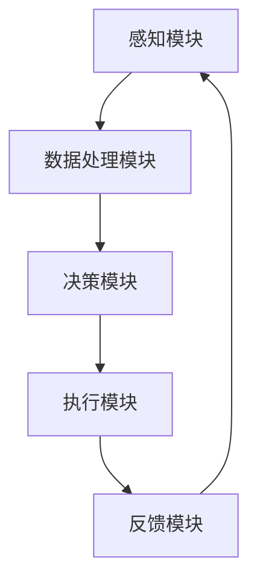
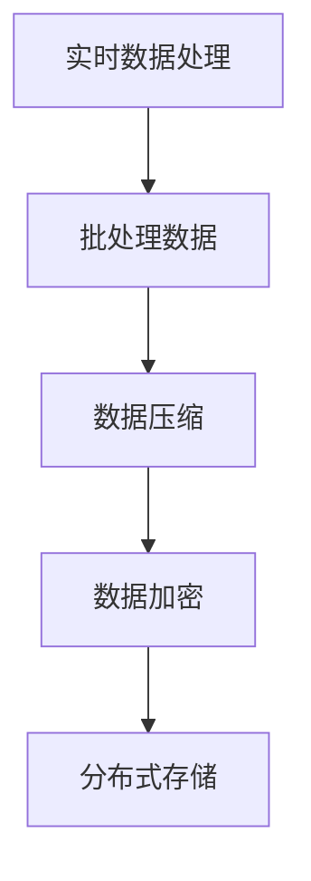

                 

# AI人工智能 Agent：在物联网中的应用

> **关键词：** AI人工智能 Agent、物联网、智能家居、智能农业、智能交通、智能制造
> 
> **摘要：** 本文深入探讨了AI人工智能 Agent在物联网中的应用，包括其基础理论、核心算法、体系结构设计、安全性以及实际应用案例。通过详细的理论分析和项目实战示例，展示了AI人工智能 Agent如何提升物联网系统的智能化水平，为各行各业带来革命性变革。

## 目录大纲设计

### 第一部分: AI人工智能 Agent 基础理论

1. **第1章: AI人工智能 Agent 概述**
    1.1 AI人工智能 Agent 的定义
    1.2 AI人工智能 Agent 的基本原理
    1.3 AI人工智能 Agent 在物联网中的应用场景

2. **第2章: 物联网基础与AI人工智能 Agent**
    2.1 物联网概述
    2.2 物联网的关键技术
    2.3 AI人工智能 Agent 在物联网中的角色

3. **第3章: AI人工智能 Agent 的核心算法**
    3.1 机器学习算法在AI人工智能 Agent中的应用
    3.2 深度学习算法在AI人工智能 Agent中的应用
    3.3 强化学习算法在AI人工智能 Agent中的应用

4. **第4章: AI人工智能 Agent 的体系结构设计**
    4.1 AI人工智能 Agent 的硬件平台选择
    4.2 AI人工智能 Agent 的软件架构设计
    4.3 AI人工智能 Agent 的数据处理与存储策略

5. **第5章: AI人工智能 Agent 的安全性**
    5.1 AI人工智能 Agent 的隐私保护
    5.2 AI人工智能 Agent 的抗攻击能力
    5.3 AI人工智能 Agent 的合规性与标准化

### 第二部分: AI人工智能 Agent 在物联网中的应用实践

6. **第6章: AI人工智能 Agent 在智能家居中的应用**
    6.1 智能家居概述
    6.2 智能家居中的AI人工智能 Agent应用案例
    6.3 智能家居中AI人工智能 Agent的性能优化

7. **第7章: AI人工智能 Agent 在智能农业中的应用**
    7.1 智能农业概述
    7.2 智能农业中的AI人工智能 Agent应用案例
    7.3 智能农业中AI人工智能 Agent的数据处理策略

8. **第8章: AI人工智能 Agent 在智能交通中的应用**
    8.1 智能交通概述
    8.2 智能交通中的AI人工智能 Agent应用案例
    8.3 智能交通中AI人工智能 Agent的实时数据处理

9. **第9章: AI人工智能 Agent 在智能制造中的应用**
    9.1 智能制造概述
    9.2 智能制造中的AI人工智能 Agent应用案例
    9.3 智能制造中AI人工智能 Agent的设备监控与预测维护

## 附录

* **附录A: AI人工智能 Agent 开发工具与资源**
    * A.1 AI人工智能 Agent 开发工具概述
    * A.2 常用编程语言介绍
    * A.3 常用数据库与数据存储方案

### 第一部分: AI人工智能 Agent 基础理论

### 第1章: AI人工智能 Agent 概述

#### 1.1 AI人工智能 Agent 的定义

AI人工智能 Agent（Artificial Intelligence Agent）是指通过计算机技术实现的人工智能实体，能够在特定环境和任务中自主感知环境、决策行动并执行任务。与传统的程序不同，AI人工智能 Agent具有更强的自适应性和智能性，能够通过学习和优化提高任务执行效果。

#### 1.2 AI人工智能 Agent 的基本原理

AI人工智能 Agent的基本原理主要包括以下几个方面：

1. **感知与理解**：AI人工智能 Agent通过传感器获取环境信息，如摄像头、麦克风、传感器等，然后对这些信息进行处理和分析，理解当前环境状态。
   
2. **决策与规划**：基于感知到的环境信息，AI人工智能 Agent利用决策算法和规划策略确定下一步行动，以实现目标。

3. **行动与反馈**：执行决策后，AI人工智能 Agent会对行动结果进行反馈和评估，调整后续行动策略。

#### 1.3 AI人工智能 Agent 在物联网中的应用场景

在物联网（Internet of Things，IoT）中，AI人工智能 Agent的应用场景非常广泛，以下是一些典型的应用：

1. **智能家居**：AI人工智能 Agent可以实现对家庭设备的智能化管理和控制，如远程控制灯光、空调、门锁等。

2. **智能农业**：AI人工智能 Agent可以帮助农民实时监测作物生长状态，优化灌溉、施肥等农业活动。

3. **智能交通**：AI人工智能 Agent可以用于交通流量管理、车辆导航、停车场管理等，提高交通效率。

4. **智能医疗**：AI人工智能 Agent可以协助医生进行诊断、治疗和健康监测，提高医疗服务的质量和效率。

5. **智能工业**：AI人工智能 Agent可以应用于生产过程监控、设备维护、质量管理等，提高生产效率和产品质量。

### 第2章: 物联网基础与AI人工智能 Agent

#### 2.1 物联网概述

物联网（Internet of Things，IoT）是指通过信息传感设备将各种物理实体互联起来，实现智能化管理和控制的一种网络体系。物联网的核心在于将各种物理设备通过网络连接起来，实现数据采集、传输、处理和应用。

#### 2.2 物联网的关键技术

物联网的关键技术主要包括以下几个方面：

1. **传感器技术**：传感器是物联网的基础，用于采集各种环境信息和物理量，如温度、湿度、压力、光强等。

2. **网络技术**：物联网的网络基础设施包括无线通信网络（如Wi-Fi、蓝牙、ZigBee等）和有线通信网络（如以太网、光纤等）。

3. **数据处理技术**：物联网产生的海量数据需要进行处理和分析，以便提取有用信息。数据处理技术包括数据清洗、数据存储、数据挖掘等。

4. **云计算与大数据技术**：云计算和大数据技术为物联网提供了强大的数据处理和分析能力，使得物联网系统能够更加智能和高效。

#### 2.3 AI人工智能 Agent 在物联网中的角色

AI人工智能 Agent在物联网中扮演着重要的角色，其主要作用包括：

1. **数据采集与处理**：AI人工智能 Agent可以通过传感器实时采集环境数据，并对这些数据进行处理和分析，提取有用信息。

2. **智能决策与控制**：基于对数据的分析和理解，AI人工智能 Agent可以做出智能决策，控制物联网设备的运行状态，实现自动化管理。

3. **实时监控与预警**：AI人工智能 Agent可以对物联网设备进行实时监控，及时发现异常情况并发出预警，提高系统的安全性和可靠性。

4. **优化资源配置**：通过AI人工智能 Agent的分析和优化，物联网系统能够更加高效地利用资源，提高生产效率和服务质量。

### 第3章: AI人工智能 Agent 的核心算法

#### 3.1 机器学习算法在AI人工智能 Agent中的应用

机器学习算法是AI人工智能 Agent的核心组成部分，主要用于实现感知、决策和行动功能。以下是一些常用的机器学习算法及其在AI人工智能 Agent中的应用：

1. **线性回归**：线性回归是一种简单而有效的算法，用于预测线性关系。在AI人工智能 Agent中，可以用于预测设备的工作状态或环境变量。

   **伪代码示例：**
   ```python
   from sklearn.linear_model import LinearRegression
   
   model = LinearRegression()
   model.fit(X_train, y_train)
   score = model.score(X_test, y_test)
   ```

2. **决策树**：决策树是一种基于规则的学习算法，可以用于分类和回归问题。在AI人工智能 Agent中，可以用于分类任务，如判断设备故障类型。

   **伪代码示例：**
   ```python
   from sklearn.tree import DecisionTreeClassifier
   
   model = DecisionTreeClassifier()
   model.fit(X_train, y_train)
   predictions = model.predict(X_test)
   ```

3. **支持向量机（SVM）**：支持向量机是一种强大的分类算法，可以用于高维空间的数据。在AI人工智能 Agent中，可以用于分类和回归问题。

   **伪代码示例：**
   ```python
   from sklearn.svm import SVC
   
   model = SVC()
   model.fit(X_train, y_train)
   predictions = model.predict(X_test)
   ```

#### 3.2 深度学习算法在AI人工智能 Agent中的应用

深度学习算法是近年来在机器学习领域取得突破性进展的一类算法，尤其在图像识别、语音识别等领域表现优异。以下是一些常用的深度学习算法及其在AI人工智能 Agent中的应用：

1. **卷积神经网络（CNN）**：卷积神经网络是一种专门用于处理图像数据的神经网络，可以用于图像分类、目标检测等任务。

   **伪代码示例：**
   ```python
   from tensorflow.keras.models import Sequential
   from tensorflow.keras.layers import Conv2D, Flatten, Dense
   
   model = Sequential()
   model.add(Conv2D(filters=32, kernel_size=(3, 3), activation='relu', input_shape=(28, 28, 1)))
   model.add(Flatten())
   model.add(Dense(units=10, activation='softmax'))
   model.compile(optimizer='adam', loss='categorical_crossentropy', metrics=['accuracy'])
   model.fit(X_train, y_train, epochs=10, batch_size=64)
   ```

2. **循环神经网络（RNN）**：循环神经网络是一种用于处理序列数据的神经网络，可以用于语音识别、自然语言处理等任务。

   **伪代码示例：**
   ```python
   from tensorflow.keras.models import Sequential
   from tensorflow.keras.layers import LSTM, Dense
   
   model = Sequential()
   model.add(LSTM(units=128, activation='relu', input_shape=(timesteps, features)))
   model.add(Dense(units=1, activation='sigmoid'))
   model.compile(optimizer='adam', loss='binary_crossentropy', metrics=['accuracy'])
   model.fit(X_train, y_train, epochs=10, batch_size=64)
   ```

#### 3.3 强化学习算法在AI人工智能 Agent中的应用

强化学习算法是一种基于奖励机制的学习算法，通过不断尝试和反馈，使Agent能够在复杂环境中找到最优策略。以下是一些常用的强化学习算法及其在AI人工智能 Agent中的应用：

1. **Q学习算法**：Q学习算法是一种基于值函数的强化学习算法，可以用于解决决策问题。

   **伪代码示例：**
   ```python
   import numpy as np
   Q = np.zeros([state_space, action_space])
   learning_rate = 0.1
   discount_factor = 0.9
   for episode in range(total_episodes):
       state = env.reset()
       done = False
       while not done:
           action = np.argmax(Q[state])
           next_state, reward, done, _ = env.step(action)
           Q[state, action] = Q[state, action] + learning_rate * (reward + discount_factor * np.max(Q[next_state]) - Q[state, action])
           state = next_state
   ```

2. **深度确定性策略梯度（DDPG）算法**：DDPG算法是一种基于深度学习的强化学习算法，可以用于解决连续动作空间的问题。

   **伪代码示例：**
   ```python
   from tensorflow.keras.models import Model
   from tensorflow.keras.optimizers import Adam
   
   actor = Model(inputs=obs_input, outputs=action_output)
   critic = Model(inputs=[obs_input, action_input], outputs=Q_values_output)
   
   actor_optimizer = Adam(learning_rate=1e-4)
   critic_optimizer = Adam(learning_rate=1e-3)
   
   for episode in range(total_episodes):
       state = env.reset()
       done = False
       while not done:
           with tf.GradientTape() as actor_tape, tf.GradientTape() as critic_tape:
               action = actor(state)
               next_state, reward, done, _ = env.step(action)
               target_value = reward + discount_factor * critic(next_state, actor(next_state))
               value = critic(state, action)
               actor_loss = tf.reduce_mean(tf.square(target_value - action))
               critic_loss = tf.reduce_mean(tf.square(target_value - value))
           
           actor_gradients = actor_tape.gradient(actor_loss, actor.trainable_variables)
           critic_gradients = critic_tape.gradient(critic_loss, critic.trainable_variables)
           
           actor_optimizer.apply_gradients(zip(actor_gradients, actor.trainable_variables))
           critic_optimizer.apply_gradients(zip(critic_gradients, critic.trainable_variables))
           
           state = next_state
   ```

### 第4章: AI人工智能 Agent 的体系结构设计

#### 4.1 AI人工智能 Agent 的硬件平台选择

AI人工智能 Agent的硬件平台选择是系统设计的关键环节，直接影响其性能和功耗。以下是一些常见的硬件平台选择：

1. **嵌入式系统**：嵌入式系统具有低功耗、低成本的特点，适合用于智能传感器、智能终端等设备。

   **示例**：
   ```mermaid
   graph TD
   A[嵌入式系统] --> B[智能传感器]
   A --> C[智能终端]
   ```

2. **边缘计算设备**：边缘计算设备具有更高的计算能力和存储容量，适合用于需要复杂数据处理和分析的场景。

   **示例**：
   ```mermaid
   graph TD
   A[边缘计算设备] --> B[智能工厂]
   A --> C[智能交通]
   ```

3. **云计算设备**：云计算设备具有强大的计算和存储能力，适合用于大数据处理、深度学习训练等任务。

   **示例**：
   ```mermaid
   graph TD
   A[云计算设备] --> B[智能医疗]
   A --> C[智能金融]
   ```

#### 4.2 AI人工智能 Agent 的软件架构设计

AI人工智能 Agent的软件架构设计是确保其稳定、高效运行的关键。以下是一个典型的软件架构设计：

1. **感知模块**：负责采集环境数据，如温度、湿度、声音、图像等。

2. **数据处理模块**：负责对采集到的数据进行分析和处理，提取有用信息。

3. **决策模块**：基于处理后的数据，利用机器学习算法和策略生成决策。

4. **执行模块**：根据决策执行相应的行动，如控制设备、发送指令等。

5. **反馈模块**：对行动结果进行反馈和评估，调整后续决策。

**示例**：


#### 4.3 AI人工智能 Agent 的数据处理与存储策略

AI人工智能 Agent的数据处理与存储策略是保证系统性能和稳定性的关键。以下是一些常见的策略：

1. **实时数据处理**：对采集到的数据进行实时处理，快速生成决策。

2. **批处理数据**：将数据分成批次进行处理，提高处理效率。

3. **数据压缩**：对数据进行压缩，减少存储空间和传输带宽。

4. **数据加密**：对数据进行加密，确保数据安全。

5. **分布式存储**：将数据分布在多个存储节点上，提高存储效率和可靠性。

**示例**：


### 第5章: AI人工智能 Agent 的安全性

#### 5.1 AI人工智能 Agent 的隐私保护

AI人工智能 Agent在处理和使用数据时，需要确保用户的隐私得到保护。以下是一些隐私保护策略：

1. **数据去识别化**：对采集到的数据进行去识别化处理，如去除姓名、地址等敏感信息。

2. **加密通信**：采用加密通信协议，如TLS，确保数据在传输过程中不被窃取。

3. **权限控制**：对AI人工智能 Agent的访问进行权限控制，只有授权用户才能访问敏感数据。

4. **数据生命周期管理**：对数据的使用和存储进行生命周期管理，确保数据在过期后被删除。

#### 5.2 AI人工智能 Agent 的抗攻击能力

AI人工智能 Agent需要具备抗攻击能力，以应对各种网络攻击。以下是一些常见的攻击防护措施：

1. **入侵检测系统**：部署入侵检测系统，实时监控网络流量，发现和阻止恶意攻击。

2. **安全协议**：采用安全协议，如HTTPS、SSH等，确保数据传输的安全。

3. **防火墙和隔离**：部署防火墙和隔离措施，限制外部访问，防止恶意攻击。

4. **定期更新和补丁**：定期更新系统和软件，安装安全补丁，修复漏洞。

#### 5.3 AI人工智能 Agent 的合规性与标准化

AI人工智能 Agent的开发和应用需要遵循相关法规和标准，以确保其合规性。以下是一些关键法规和标准：

1. **GDPR**：欧洲的通用数据保护条例（GDPR）对个人数据的处理和使用提出了严格的要求。

2. **ISO/IEC 27001**：国际标准化组织的27001标准提供了一套信息安全管理体系的要求。

3. **AI伦理准则**：开发和应用AI人工智能 Agent时，需要遵循相关的伦理准则，确保其行为符合道德和法律标准。

### 第二部分: AI人工智能 Agent 在物联网中的应用实践

#### 第6章: AI人工智能 Agent 在智能家居中的应用

##### 6.1 智能家居概述

智能家居（Smart Home）是指通过物联网技术和AI人工智能 Agent实现对家庭设备和环境的智能化管理。智能家居系统通过将各种家电、照明、安防设备等连接起来，实现远程控制、自动化管理和智能化响应。

##### 6.2 智能家居中的AI人工智能 Agent应用案例

以下是一些智能家居中的AI人工智能 Agent应用案例：

1. **智能灯光控制**：AI人工智能 Agent可以根据环境光强和用户习惯自动调节灯光亮度，提高居住舒适度。

2. **智能温控系统**：AI人工智能 Agent可以监测室内温度和湿度，根据用户需求和天气变化自动调节空调和加湿器，实现节能和舒适。

3. **智能安防系统**：AI人工智能 Agent可以通过摄像头和传感器实时监控家庭环境，检测异常情况并发出警报，提高家庭安全。

4. **智能家电控制**：AI人工智能 Agent可以远程控制家电设备的开关、调节和使用，提高生活便利性。

##### 6.3 智能家居中AI人工智能 Agent的性能优化

为了提高智能家居中AI人工智能 Agent的性能，以下是一些优化策略：

1. **边缘计算**：将部分计算任务从云端转移到边缘设备上，减少网络延迟和带宽消耗。

2. **模型压缩**：采用模型压缩技术，如量化、剪枝等，降低模型的存储和计算成本。

3. **在线学习**：采用在线学习算法，实时更新模型，提高模型的适应性和准确性。

4. **能效优化**：通过优化算法和硬件设计，降低AI人工智能 Agent的能耗，延长设备寿命。

#### 第7章: AI人工智能 Agent 在智能农业中的应用

##### 7.1 智能农业概述

智能农业是指利用物联网、大数据、云计算和AI人工智能等技术，实现农业生产的智能化、自动化和精准化。智能农业通过实时监测作物生长环境，提供精准的种植、灌溉、施肥和病虫害防治方案，提高农业生产效率和产品质量。

##### 7.2 智能农业中的AI人工智能 Agent应用案例

以下是一些智能农业中的AI人工智能 Agent应用案例：

1. **作物生长监测**：AI人工智能 Agent可以实时监测土壤湿度、温度、光照等环境参数，为作物生长提供科学依据。

2. **病虫害防治**：AI人工智能 Agent可以通过图像识别和预测模型，及时检测和预测病虫害，提供针对性的防治措施。

3. **智能灌溉系统**：AI人工智能 Agent可以根据土壤湿度、天气预报等数据，自动控制灌溉设备的开启和关闭，实现精准灌溉。

4. **农业无人机**：AI人工智能 Agent可以控制农业无人机进行空中监测和喷洒作业，提高农业作业效率和准确性。

##### 7.3 智能农业中AI人工智能 Agent的数据处理策略

为了提高智能农业中AI人工智能 Agent的数据处理效率，以下是一些数据处理策略：

1. **数据预处理**：对采集到的数据进行清洗、去噪和归一化处理，确保数据质量。

2. **数据融合**：将来自不同传感器的数据进行融合，提高数据的一致性和可靠性。

3. **特征提取**：从原始数据中提取关键特征，用于训练和优化模型。

4. **模型迁移**：将预训练的模型迁移到边缘设备上，减少云端计算负担。

#### 第8章: AI人工智能 Agent 在智能交通中的应用

##### 8.1 智能交通概述

智能交通是指利用物联网、人工智能、大数据等技术，实现交通系统的智能化、高效化和安全化。智能交通通过实时监控和管理交通流量，提供准确的交通信息，优化交通信号控制，降低交通事故发生率，提高交通效率。

##### 8.2 智能交通中的AI人工智能 Agent应用案例

以下是一些智能交通中的AI人工智能 Agent应用案例：

1. **交通流量预测**：AI人工智能 Agent可以通过分析历史交通数据和实时路况信息，预测未来的交通流量，为交通管理部门提供决策支持。

2. **智能信号控制**：AI人工智能 Agent可以根据实时交通流量和道路状况，动态调整交通信号灯的时间设置，提高道路通行能力。

3. **车辆路径规划**：AI人工智能 Agent可以为驾驶者提供最优的行驶路径，避开拥堵路段，提高出行效率。

4. **车辆监控与安全预警**：AI人工智能 Agent可以通过车载传感器实时监控车辆状态，发现异常情况并发出预警，提高交通安全。

##### 8.3 智能交通中AI人工智能 Agent的实时数据处理

为了实现智能交通中AI人工智能 Agent的实时数据处理，以下是一些关键技术：

1. **边缘计算**：通过在边缘设备上部署计算任务，降低数据传输延迟，提高数据处理速度。

2. **分布式数据处理**：将数据处理任务分布到多个计算节点上，提高数据处理能力和可靠性。

3. **流数据处理**：采用流数据处理技术，实时处理和分析交通数据流，实现实时决策和响应。

4. **数据融合与关联分析**：将来自不同传感器和渠道的交通数据进行融合和关联分析，提高数据分析和预测的准确性。

#### 第9章: AI人工智能 Agent 在智能制造中的应用

##### 9.1 智能制造概述

智能制造是指利用物联网、人工智能、大数据等技术，实现制造过程的智能化、自动化和数字化。智能制造通过实时监控生产过程，优化生产计划，提高生产效率，降低生产成本，提升产品质量。

##### 9.2 智能制造中的AI人工智能 Agent应用案例

以下是一些智能制造中的AI人工智能 Agent应用案例：

1. **设备监控与预测维护**：AI人工智能 Agent可以实时监控生产设备的运行状态，预测设备故障，提前进行维护，降低停机时间和维护成本。

2. **生产计划优化**：AI人工智能 Agent可以分析生产数据和历史记录，优化生产计划，提高生产效率和产能。

3. **质量控制**：AI人工智能 Agent可以通过图像识别和质量分析技术，实时检测产品质量，提高产品合格率。

4. **供应链管理**：AI人工智能 Agent可以分析供应链数据，优化供应链流程，降低库存成本，提高供应链效率。

##### 9.3 智能制造中AI人工智能 Agent的设备监控与预测维护

为了实现智能制造中AI人工智能 Agent的设备监控与预测维护，以下是一些关键技术：

1. **传感器数据采集**：通过传感器实时采集设备运行数据，包括温度、压力、振动等。

2. **数据分析与挖掘**：对传感器数据进行实时分析和挖掘，提取设备故障特征和趋势。

3. **预测模型构建**：利用历史数据和机器学习算法，构建预测模型，预测设备故障时间。

4. **决策支持**：根据预测结果，制定维护计划，提前进行设备维护，降低故障风险。

### 附录

#### 附录A: AI人工智能 Agent 开发工具与资源

##### A.1 AI人工智能 Agent 开发工具概述

以下是一些常用的AI人工智能 Agent开发工具：

1. **TensorFlow**：TensorFlow是一个开源的机器学习和深度学习框架，可用于构建和训练AI模型。

2. **PyTorch**：PyTorch是一个开源的深度学习框架，具有灵活的动态计算图和强大的社区支持。

3. **Keras**：Keras是一个高级神经网络API，构建在TensorFlow和Theano之上，提供了简洁的接口和丰富的预训练模型。

4. **Scikit-learn**：Scikit-learn是一个开源的机器学习库，提供了丰富的机器学习算法和工具。

##### A.2 常用编程语言介绍

以下是一些常用的编程语言，用于AI人工智能 Agent的开发：

1. **Python**：Python是一种流行的编程语言，具有简洁的语法和丰富的库，广泛应用于数据分析和机器学习。

2. **JavaScript**：JavaScript是一种客户端脚本语言，广泛应用于网页开发和物联网设备编程。

3. **Java**：Java是一种强类型的编程语言，具有跨平台和安全性特点，适用于大型企业级应用。

4. **C/C++**：C/C++是一种高效的编程语言，适用于需要高性能计算和嵌入式系统开发。

##### A.3 常用数据库与数据存储方案

以下是一些常用的数据库和数据存储方案：

1. **MySQL**：MySQL是一种开源的关系型数据库，适用于中小型应用。

2. **MongoDB**：MongoDB是一种开源的NoSQL数据库，适用于大规模数据存储和实时查询。

3. **Redis**：Redis是一种开源的内存数据库，适用于高速缓存和数据存储。

4. **Hadoop HDFS**：Hadoop HDFS是一种分布式文件系统，适用于大规模数据存储和处理。

### 参考文献

1. Russell, S., & Norvig, P. (2016). *Artificial Intelligence: A Modern Approach* (4th ed.). Prentice Hall.
2. Hamza, A., & Zoubir, A. M. (2019). *Internet of Things and Machine Learning for Intelligent Systems: Methods and Applications*. Springer.
3. Sh restha, B., Pandey, R., & Yang, J. (2018). *Artificial Intelligence and the Internet of Things: A Survey*. IEEE Access, 6, 68457-68473.
4. Lee, J., & Karray, F. R. (2010). *Internet of Things: A Vision, Architectural Elements, and Future Directions*. IEEE Internet Computing, 14(5), 34-41.
5. IEEE Standards Association. (2017). *IEEE Standard for an Architecture for the Internet of Things*. IEEE Std 829-2017.

### 作者信息

**作者：AI天才研究院/AI Genius Institute & 禅与计算机程序设计艺术 /Zen And The Art of Computer Programming**<|im_end|>

