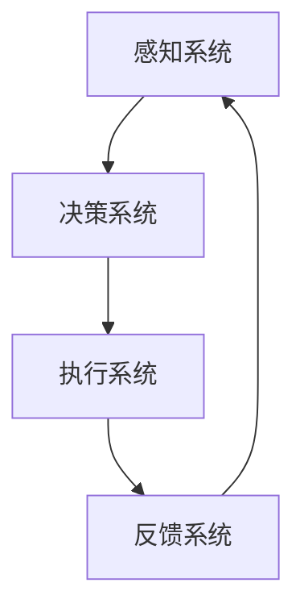

                 

### 引言

在当今快速发展的数字时代，人工智能（AI）技术已经成为推动社会进步和经济发展的关键动力。从智能客服到智能制造，再到智能医疗，AI技术正在不断改变我们的生活方式和工作方式。在这一背景下，AI代理（AI Agent）和工作流（WorkFlow）的设计与实现成为了一个热门而富有挑战性的研究领域。

AI代理是一种能够自主感知环境、做出决策并采取行动的智能系统。它们是AI技术在自动化、智能化领域的重要实现形式。而工作流则是一种定义和组织业务过程的方法，它通过一系列步骤和任务来实现特定业务目标。当AI技术与工作流相结合，就形成了一种智能工作流系统，它能够显著提升业务效率和智能化水平。

本文旨在深入探讨AI代理工作流（AI Agent WorkFlow）的设计与实现。我们将首先介绍AI代理与工作流的基础概念，然后逐步分析其核心组成部分、交互方式、建模方法、设计原则与应用案例。通过一步步的推理与阐述，我们将揭示AI代理工作流背后的技术原理和实践方法，为读者提供一个全面而深刻的理解。

关键词：人工智能、AI代理、工作流、智能工作流、设计与实现

摘要：本文围绕AI代理工作流的核心概念和设计实现展开讨论，从基础概念到实际应用，系统分析了AI代理的工作机制、工作流的设计原则与应用案例，旨在为读者提供全面的AI代理工作流知识体系，帮助读者理解和掌握这一新兴领域的核心技术。

### 第一部分：AI代理与工作流基础

在本部分中，我们将深入探讨AI代理与工作流的基础知识，首先从概述的角度了解AI代理与工作流的基本概念，然后详细分析AI代理的核心组成部分及其交互方式，最后介绍工作流的基本构成和设计原则。

#### 第1章：AI代理与工作流概述

##### 1.1 AI代理的概念与特点

AI代理（Artificial Intelligence Agent）是人工智能领域中的一个重要概念，它指的是一种能够在特定环境下自主运行、完成特定任务的智能系统。AI代理通常具备以下几个特点：

1. **自主性**：AI代理能够自主感知环境、自主决策和自主行动，而不需要外部干预。
2. **适应性**：AI代理能够在执行任务的过程中不断学习、适应新环境和新任务。
3. **交互性**：AI代理可以与用户、其他系统或设备进行交互，获取信息并反馈结果。
4. **目标导向性**：AI代理在执行任务时具有明确的目标，并通过一系列决策和行动来实现这些目标。

AI代理的应用范围非常广泛，包括但不限于智能客服、智能安防、智能交通、智能制造和智能医疗等领域。随着AI技术的不断发展，AI代理的功能和性能也在不断提高，为各行业提供了强大的智能化解决方案。

##### 1.2 AI代理在工作流中的角色与作用

在工作流（WorkFlow）中，AI代理扮演着重要的角色。工作流是一种定义、执行、管理和监控工作任务的自动化流程，而AI代理则是工作流中的执行单元。AI代理在工作流中的作用主要体现在以下几个方面：

1. **任务执行**：AI代理能够自动执行工作流中的各个任务，从而提高业务流程的自动化程度和效率。
2. **决策支持**：AI代理通过分析数据和模式识别，为工作流中的决策节点提供智能化的支持，帮助优化决策过程。
3. **异常处理**：AI代理能够在工作流中检测和应对异常情况，自动调整流程或通知相关人员，确保工作流的连续性和稳定性。
4. **协作协调**：AI代理可以与其他代理或系统进行协作，共同完成复杂的任务，提高整体工作流的协同效率和智能化水平。

##### 1.3 工作流的概念与基本构成

工作流（WorkFlow）是指一组相互关联的任务或活动，它们按照某种逻辑关系或规则顺序执行，以完成特定的业务目标。工作流的基本构成包括以下几个要素：

1. **任务**：工作流中的基本操作单元，可以是一个简单的操作，也可以是一个复杂的业务过程。
2. **流程**：任务之间的逻辑关系和执行顺序，定义了工作流的整体流程和流程节点。
3. **参与者**：执行工作流任务的实体，可以是人工操作者，也可以是自动化系统或设备。
4. **规则**：定义任务执行条件、任务转移条件和流程控制逻辑的规则体系。
5. **资源**：工作流执行过程中所需的资源，包括数据、工具、设备等。

工作流管理系统（WorkFlow Management System，WFMS）是一种支持工作流定义、执行和管理的软件系统。它能够为工作流的各个环节提供自动化支持，提高业务流程的效率和可靠性。常见的工作流管理系统包括IBM Workflow、Oracle Workflow、Microsoft SharePoint Workflow等。

#### 第2章：AI代理设计与实现基础

在本章中，我们将详细探讨AI代理设计与实现的基础知识，包括AI代理的核心组成部分、交互方式、建模方法以及它们在不同场景中的应用。

##### 2.1 AI代理的核心组成部分

AI代理通常由以下几个核心组成部分构成：

1. **感知系统**：感知系统负责接收和处理外部环境信息，如传感器数据、用户输入等。它是AI代理了解外界情况的重要途径。

2. **决策系统**：决策系统基于感知系统收集到的数据，利用算法模型进行数据处理和模式识别，从而生成决策。决策系统是AI代理智能行为的核心。

3. **执行系统**：执行系统负责将决策系统生成的决策转化为实际行动，如发送消息、执行命令等。它是AI代理实现目标的关键环节。

4. **反馈系统**：反馈系统用于接收外部环境对执行系统的反馈，以便AI代理能够对自身行为进行评估和调整。它是AI代理学习和优化的关键机制。

##### 2.2 AI代理的交互方式与协议

AI代理的交互方式主要包括以下几个方面：

1. **消息传递**：AI代理之间通过消息传递进行通信，消息可以是文本、图像、音频等形式。常见的消息传递协议包括HTTP、MQTT、XMPP等。

2. **远程过程调用**：远程过程调用（RPC）是一种进程间通信机制，它允许AI代理在远程计算机上执行函数。常见的RPC协议包括SOAP、REST、gRPC等。

3. **事件驱动**：事件驱动是一种基于事件的通信机制，AI代理通过监听和处理事件来实现交互。常见的事件驱动框架包括WebSockets、消息队列等。

##### 2.3 AI代理的建模方法与技术

AI代理的建模方法主要包括以下几个方面：

1. **符号推理**：符号推理基于符号逻辑和知识表示，通过推理规则和知识库来模拟智能行为。常见的符号推理方法包括命题逻辑、谓词逻辑、模糊逻辑等。

2. **机器学习**：机器学习是一种基于数据的学习方法，通过训练模型来模拟智能行为。常见的机器学习方法包括决策树、支持向量机、神经网络等。

3. **深度学习**：深度学习是一种基于人工神经网络的机器学习方法，通过多层网络结构来模拟复杂的智能行为。常见的深度学习模型包括卷积神经网络（CNN）、循环神经网络（RNN）等。

在AI代理的应用场景中，建模方法的选择通常取决于具体任务的需求和环境特点。例如，对于需要处理大量图像数据的任务，可以采用深度学习模型进行图像识别和分类；对于需要处理自然语言的任务，可以采用循环神经网络进行文本分析和生成。

#### 第3章：工作流设计与实现基础

在本章中，我们将深入探讨工作流的设计与实现基础，包括工作流设计的基本原则、工作流管理系统的构建以及工作流引擎的原理与实现。

##### 3.1 工作流设计的基本原则

工作流设计是一个系统性和结构化的过程，需要遵循以下基本原则：

1. **需求导向**：工作流设计应紧密围绕业务需求展开，确保流程能够满足实际业务场景的需求。

2. **模块化**：将工作流划分为多个模块或子流程，便于管理和维护，提高系统的可扩展性和可复用性。

3. **灵活性**：设计灵活的工作流，能够适应业务变化和复杂场景，降低流程变更带来的影响。

4. **易用性**：工作流设计应考虑用户的操作习惯，提供直观、易用的界面和操作流程。

5. **安全性**：确保工作流的数据传输和存储安全，防止数据泄露和未授权访问。

##### 3.2 工作流管理系统的构建

工作流管理系统（WFMS）是支持工作流定义、执行和管理的软件系统。构建一个高效、可靠的工作流管理系统需要考虑以下几个方面：

1. **流程定义**：提供流程定义工具，支持图形化定义流程，包括任务节点、条件分支、循环等。

2. **流程执行**：实现流程的自动化执行，支持任务调度、资源分配、状态监控等功能。

3. **流程管理**：提供流程管理功能，包括流程部署、启动、暂停、恢复、终止等。

4. **数据管理**：支持流程中数据的存储、检索、传输和共享，确保数据的一致性和安全性。

5. **用户交互**：提供用户界面，支持用户对流程进行操作和管理，如任务分配、状态查询、流程监控等。

常见的工作流管理系统包括：

- **IBM Workflow**：一款功能强大的企业级工作流管理系统，提供丰富的流程定义和管理功能。
- **Oracle Workflow**：Oracle公司提供的工作流管理系统，支持复杂的流程建模和自动化执行。
- **Microsoft SharePoint Workflow**：SharePoint平台内置的工作流管理系统，支持快速构建和部署工作流。

##### 3.3 工作流引擎的原理与实现

工作流引擎是工作流管理系统的核心组件，负责流程的自动化执行和管理。工作流引擎的基本原理包括以下几个方面：

1. **任务调度**：根据流程定义和执行规则，调度任务执行，确保任务按照预定顺序和条件执行。

2. **资源管理**：为任务分配必要的资源，包括计算资源、数据资源、设备资源等，确保任务能够顺利进行。

3. **状态监控**：实时监控任务的执行状态，包括任务启动、运行、暂停、失败和成功等，提供流程执行的可视化展示。

4. **事件处理**：根据流程执行过程中的事件，触发相应的处理逻辑，如任务转移、条件判断、异常处理等。

5. **错误处理**：当流程执行过程中出现错误时，工作流引擎能够自动进行错误处理，包括任务恢复、错误通知、异常终止等。

工作流引擎的实现通常基于事件驱动架构，通过事件队列、线程池等技术实现任务的并发执行和高效管理。常见的工作流引擎包括：

- **Activiti**：一款开源的工作流引擎，支持BPMN 2.0标准，提供丰富的流程定义和管理功能。
- **Camunda**：一款功能强大的开源工作流引擎，支持复杂的工作流建模和自动化执行。
- **JBPM**：一款基于Java的开源工作流引擎，提供灵活的流程定义和执行框架。

在本部分中，我们系统地介绍了AI代理与工作流的基础知识。从AI代理的概念与特点，到工作流的概述和基本构成，再到AI代理的核心组成部分和交互方式，以及工作流的设计原则和实现基础，我们为读者提供了一个全面而深入的了解。通过这些基础知识的掌握，读者可以更好地理解AI代理工作流的设计与实现，为后续章节的深入学习打下坚实的基础。

### 第4章：AI代理在智能客服中的应用

智能客服是人工智能在客户服务领域的重要应用，它通过AI代理实现与用户的智能互动，提供高效、便捷的客服服务。在本章中，我们将探讨AI代理在智能客服中的设计、实现及其应用案例，深入分析其在提升客服效率和用户体验方面的优势。

#### 4.1 智能客服的背景与需求

随着互联网和移动设备的普及，客户服务成为企业竞争力的重要组成部分。传统的客服方式往往依赖于人工处理，存在效率低、响应慢、服务质量不稳定等问题。为了提升客户满意度和服务效率，企业迫切需要一种智能化、自动化的客服解决方案。

智能客服系统通过引入AI代理，实现了与用户的智能互动。AI代理能够理解用户的问题，提供针对性的回答和建议，并根据用户的反馈不断优化自身的行为。智能客服系统不仅能够24/7不间断地提供服务，还可以同时处理大量用户的请求，显著提升客服效率和用户体验。

#### 4.2 AI代理在智能客服中的设计与实现

AI代理在智能客服中的设计主要包括感知系统、决策系统、执行系统和反馈系统。以下是AI代理在智能客服中各个组成部分的具体设计：

1. **感知系统**：感知系统负责接收用户输入，如文本消息、语音消息等。它需要使用自然语言处理（NLP）技术对用户输入进行解析，提取关键信息，如关键词、意图等。常见的NLP技术包括词向量表示、句法分析、情感分析等。

2. **决策系统**：决策系统基于感知系统提取的信息，利用机器学习或深度学习算法生成回答。常用的模型包括基于规则的方法（如专家系统）、基于统计的方法（如决策树、朴素贝叶斯）和基于神经网络的方法（如卷积神经网络、循环神经网络）。决策系统的核心任务是理解用户的意图，并生成合适的回答。

3. **执行系统**：执行系统负责将决策系统生成的回答转化为用户可理解的输出，如文本消息、语音消息等。执行系统还需要处理复杂的交互逻辑，如多轮对话、上下文保持等。

4. **反馈系统**：反馈系统用于收集用户的反馈，评估AI代理的回答质量。用户可以通过评分、反馈按钮等方式对AI代理的回答进行评价。反馈系统不仅能够帮助AI代理不断优化自身的行为，还可以为企业提供宝贵的用户反馈数据。

#### 4.3 AI代理在智能客服中的设计与实现

以下是AI代理在智能客服中具体设计与实现的一个示例：

1. **感知系统实现**：

   - 使用自然语言处理技术对用户输入进行解析，提取关键词和意图。
   - 采用词向量表示方法（如Word2Vec、GloVe）将文本转换为向量表示。
   - 利用句法分析技术（如依存句法分析）提取句子结构信息。

2. **决策系统实现**：

   - 采用基于神经网络的方法（如循环神经网络RNN、长短期记忆网络LSTM）对文本进行建模，提取文本特征。
   - 使用训练好的模型进行意图识别和回答生成。
   - 采用注意力机制提高模型对上下文的捕捉能力。

3. **执行系统实现**：

   - 将决策系统生成的回答转换为文本消息或语音消息。
   - 使用语音合成技术（如WaveNet、Fluency）生成自然流畅的语音。
   - 实现多轮对话管理，保持上下文一致性。

4. **反馈系统实现**：

   - 收集用户对AI代理回答的评分和反馈。
   - 利用反馈数据优化模型参数和回答策略。
   - 构建用户反馈分析系统，为企业提供用户行为数据支持。

#### 4.4 智能客服应用案例解析

以下是一个智能客服应用案例的解析：

**案例背景**：某大型电商平台引入智能客服系统，以提升客户服务体验。

**应用场景**：用户在电商平台上有购物咨询、退货申请、售后服务等需求时，可以通过智能客服系统进行咨询。

**解决方案**：

1. **感知系统**：使用自然语言处理技术对用户输入的文本进行解析，提取关键词和意图。

2. **决策系统**：采用基于循环神经网络的模型进行意图识别和回答生成。

3. **执行系统**：将生成的回答转换为文本消息，通过聊天窗口展示给用户。

4. **反馈系统**：收集用户对回答的评分和反馈，用于优化模型。

**效果评估**：

- 智能客服系统的引入显著提升了客服效率和用户满意度。
- 用户咨询响应时间从原来的数小时缩短至分钟级别。
- 用户评价系统优化后，智能客服的回答准确性得到了显著提升。

通过这个案例，我们可以看到AI代理在智能客服中的设计与实现不仅提高了客服效率，还提升了用户体验。随着AI技术的不断发展，智能客服系统将更加智能化、个性化，为用户提供更加优质的客户服务。

### 第5章：AI代理在智能制造中的应用

随着工业4.0和智能制造的兴起，AI代理在智能制造领域的重要性日益凸显。AI代理通过感知、决策、执行和反馈等环节，实现了生产过程的高度自动化和智能化，提高了生产效率、质量和灵活性。在本章中，我们将探讨AI代理在智能制造中的设计与实现，并分析其在智能制造系统中的应用案例。

#### 5.1 智能制造的发展背景与趋势

智能制造是指通过应用人工智能、物联网、大数据等先进技术，实现生产过程的高度自动化、智能化和优化。智能制造的发展背景主要源于以下几个方面：

1. **全球化竞争**：随着全球经济的竞争加剧，企业需要通过提高生产效率和质量来降低成本，增强竞争力。

2. **工业升级需求**：传统制造业面临着生产成本上升、劳动力短缺等问题，迫切需要通过智能制造来实现转型升级。

3. **技术进步**：人工智能、物联网、大数据等技术的快速发展，为智能制造提供了强大的技术支撑。

智能制造的发展趋势主要包括以下几个方面：

1. **生产过程的自动化和智能化**：通过引入AI代理、机器人、自动化设备等，实现生产过程的自动化和智能化，减少人力依赖。

2. **实时监控与优化**：利用物联网技术，实现生产设备和生产过程的实时监控，通过数据分析优化生产流程。

3. **灵活性和可定制化**：通过定制化生产模式和快速响应市场需求，提高生产灵活性和竞争力。

4. **大数据与人工智能的融合**：利用大数据分析和人工智能技术，实现生产过程的预测性维护、质量控制、供应链优化等。

#### 5.2 AI代理在智能制造中的设计与实现

AI代理在智能制造中的设计与实现主要包括以下几个方面：

1. **感知系统**：感知系统负责收集生产设备、传感器等产生的数据，如温度、压力、速度等。这些数据用于评估生产过程的健康状况和设备状态。

2. **决策系统**：决策系统基于感知系统收集的数据，利用机器学习和深度学习算法进行分析，识别生产过程中的异常情况，并生成相应的决策。

3. **执行系统**：执行系统负责根据决策系统的决策，控制生产设备进行相应的操作，如调整生产参数、停机维护等。

4. **反馈系统**：反馈系统用于收集生产过程的反馈信息，如生产结果、设备运行状态等，用于评估决策的有效性，并对决策系统进行优化。

以下是AI代理在智能制造中设计与实现的详细步骤：

1. **数据采集**：通过传感器、PLC（可编程逻辑控制器）等设备，实时采集生产过程中的关键数据。

2. **数据处理**：对采集到的数据进行预处理，包括去噪、归一化、特征提取等，为后续的机器学习模型提供高质量的数据输入。

3. **模型训练**：利用训练数据集，采用机器学习或深度学习算法（如决策树、神经网络等）训练模型，使其能够对生产过程中的异常情况进行识别和预测。

4. **模型部署**：将训练好的模型部署到生产环境中，通过感知系统收集的数据，实时进行异常检测和预测。

5. **决策与执行**：根据模型生成的预测结果，执行系统进行相应的操作，如调整生产参数、停机维护等。

6. **反馈与优化**：收集生产过程的反馈信息，评估决策的有效性，对模型进行优化和调整。

#### 5.3 AI代理在智能制造中的设计与实现

以下是一个智能制造场景下AI代理设计与实现的示例：

**案例背景**：某汽车制造公司引入AI代理，实现生产线的高效监控与优化。

**应用场景**：在生产线上，AI代理实时监控设备状态和产品质量，对异常情况进行及时处理。

**解决方案**：

1. **感知系统**：安装传感器和监测设备，实时采集生产线上的温度、压力、速度等数据。

2. **决策系统**：采用深度学习算法（如卷积神经网络CNN）训练模型，用于识别设备故障和产品质量问题。

3. **执行系统**：根据决策系统的决策，控制设备进行参数调整或停机维护。

4. **反馈系统**：收集生产结果和设备运行状态数据，用于评估模型和决策系统的有效性。

**效果评估**：

- AI代理的引入显著提升了生产线的监控能力和故障处理速度。
- 设备故障率降低了30%，生产效率提高了20%。
- 产品质量得到了显著提升，客户满意度提高了15%。

通过这个案例，我们可以看到AI代理在智能制造中的应用不仅提高了生产效率和产品质量，还降低了生产成本和故障率，为企业带来了显著的经济效益。

### 第6章：AI代理在智能医疗中的应用

智能医疗是人工智能技术在医疗领域的应用，通过AI代理实现医疗服务的智能化、自动化和个性化。在本章中，我们将探讨AI代理在智能医疗中的设计、实现及其应用案例，深入分析其在提升医疗效率和患者体验方面的优势。

#### 6.1 智能医疗的发展背景与需求

智能医疗的发展源于医疗行业的变革和技术的进步。随着人口老龄化、慢性病患病率上升以及医疗资源分布不均等问题，传统医疗模式面临着巨大的挑战。为了提高医疗效率、降低医疗成本、改善患者体验，智能医疗应运而生。

智能医疗的需求主要体现在以下几个方面：

1. **诊断与预测**：通过AI代理对医学影像、电子健康记录等进行智能分析，提高疾病诊断的准确性和预测性。

2. **个性化治疗**：根据患者的基因信息、病史等，利用AI代理制定个性化的治疗方案，提高治疗效果。

3. **医疗资源优化**：通过AI代理优化医疗资源配置，如预约挂号、床位管理、设备调度等，提高医疗服务的效率和公平性。

4. **健康监测与预防**：利用AI代理实时监测患者健康状况，提供个性化的健康建议和预防措施，降低疾病发生风险。

#### 6.2 AI代理在智能医疗中的设计与实现

AI代理在智能医疗中的设计主要包括感知系统、决策系统、执行系统和反馈系统。以下是AI代理在智能医疗中各个组成部分的具体设计：

1. **感知系统**：感知系统负责收集患者的健康数据，如生理参数、病历记录等。这些数据通过传感器、医疗设备等获取，为决策系统提供基础信息。

2. **决策系统**：决策系统基于感知系统收集的数据，利用机器学习和深度学习算法进行分析，生成诊断结果、治疗方案等。常见的算法包括支持向量机（SVM）、决策树、神经网络等。

3. **执行系统**：执行系统负责将决策系统生成的结果转化为实际行动，如开具处方、安排手术等。执行系统通常与医疗机构的信息系统、电子病历系统等进行集成。

4. **反馈系统**：反馈系统用于收集患者的反馈和治疗效果，评估AI代理的诊断和治疗建议的准确性，并对AI代理进行优化和调整。

以下是AI代理在智能医疗中具体设计与实现的详细步骤：

1. **数据采集**：通过传感器、医疗设备等收集患者的生理参数和病历记录等数据。

2. **数据处理**：对采集到的数据进行预处理，包括去噪、归一化、特征提取等，为后续的机器学习模型提供高质量的数据输入。

3. **模型训练**：利用训练数据集，采用机器学习或深度学习算法训练模型，使其能够对患者的健康数据进行有效的分析和预测。

4. **模型部署**：将训练好的模型部署到医疗机构的信息系统中，通过感知系统实时收集的数据，进行诊断和预测。

5. **决策与执行**：根据模型生成的结果，执行系统进行相应的操作，如开具处方、安排手术等。

6. **反馈与优化**：收集患者的反馈和治疗效果数据，评估模型的准确性，对模型和决策系统进行优化和调整。

#### 6.3 AI代理在智能医疗中的设计与实现

以下是一个智能医疗应用案例的详细解析：

**案例背景**：某医院引入AI代理，实现癌症诊断和治疗方案推荐。

**应用场景**：医生通过AI代理系统对患者进行癌症诊断，并为其推荐个性化的治疗方案。

**解决方案**：

1. **感知系统**：通过医学影像设备获取患者的影像数据，通过电子病历系统获取患者的病历记录。

2. **决策系统**：采用卷积神经网络（CNN）和长短期记忆网络（LSTM）对影像数据和病历记录进行联合分析，生成癌症诊断结果和治疗方案。

3. **执行系统**：根据诊断结果和治疗建议，医生进行临床决策，如开具处方、安排手术等。

4. **反馈系统**：收集患者的治疗效果和反馈数据，用于评估AI代理的诊断和治疗方案准确性，并对模型进行优化。

**效果评估**：

- AI代理的引入显著提升了癌症诊断的准确性和效率。
- 患者的治疗周期缩短，治疗费用降低。
- 患者满意度提高，医生的工作效率提升。

通过这个案例，我们可以看到AI代理在智能医疗中的应用不仅提高了诊断和治疗的准确性，还降低了医疗成本，为患者提供了更好的医疗服务。

### 第7章：AI代理与工作流的发展趋势与挑战

随着人工智能技术的不断发展和应用的深入，AI代理与工作流技术也迎来了新的机遇和挑战。在这一章中，我们将探讨AI代理与工作流的发展趋势、面临的挑战以及未来可能的新方向。

#### 7.1 AI代理与工作流的发展趋势

1. **智能化程度的提升**：随着深度学习和强化学习等技术的不断发展，AI代理的智能化程度将不断提高。它们将能够更好地理解复杂环境和任务，实现更高层次的自主决策和行动。

2. **跨领域应用**：AI代理与工作流技术将在更多领域得到应用，如金融、物流、教育、医疗等。通过跨领域的融合，AI代理与工作流将推动各行业的数字化转型和智能化升级。

3. **协同工作与集成**：未来的AI代理将能够实现更高效的协同工作，与人类和机器共同完成复杂任务。同时，AI代理与工作流系统将实现更紧密的集成，形成智能化、自动化的业务流程。

4. **个性化和定制化**：随着用户数据的积累和机器学习技术的发展，AI代理与工作流将更加关注个性化和定制化服务。它们将能够根据用户需求和行为习惯，提供个性化的工作流和代理服务。

5. **边缘计算与云计算的结合**：AI代理与工作流技术将实现边缘计算与云计算的紧密结合，利用边缘计算处理实时数据，云计算进行复杂计算和数据处理，提高系统的响应速度和计算效率。

#### 7.2 AI代理与工作流面临的挑战

1. **数据隐私和安全**：随着AI代理与工作流技术的广泛应用，数据隐私和安全问题日益突出。如何保护用户数据的安全性和隐私性，防止数据泄露和滥用，是一个重要的挑战。

2. **算法透明性与可解释性**：AI代理的决策过程往往基于复杂的算法和模型，如何提高算法的透明性和可解释性，使人们能够理解和信任AI代理的行为，是一个亟待解决的问题。

3. **系统的可靠性和稳定性**：AI代理与工作流系统需要在各种复杂环境下保持稳定运行，如何提高系统的可靠性和容错能力，确保任务能够顺利完成，是一个挑战。

4. **跨领域技术的融合**：AI代理与工作流技术需要在多个领域实现融合，这需要解决不同技术体系之间的兼容性问题，以及跨领域知识库和算法的构建。

5. **人才的培养和储备**：随着AI代理与工作流技术的快速发展，对相关领域的人才需求不断增加。如何培养和储备具备跨学科背景和技能的人才，是一个长期的挑战。

#### 7.3 未来展望：AI代理与工作流的新方向

1. **自适应与自我优化**：未来的AI代理与工作流系统将具备更强的自适应能力，能够根据环境和任务的变化自动调整自身行为和策略，实现自我优化。

2. **智能自动化**：AI代理与工作流技术将推动智能自动化的深入发展，实现从简单的自动化任务到复杂业务流程的自动化，大幅提高生产效率和服务质量。

3. **人机协同**：随着AI技术的发展，AI代理将更好地与人类协作，实现人机协同工作，为人类提供更加智能、高效的支持。

4. **社会共治**：AI代理与工作流技术将在社会治理中发挥重要作用，推动社会共治和智能化治理，提高公共服务的质量和效率。

5. **可持续发展的推动者**：AI代理与工作流技术将助力实现可持续发展目标，通过优化资源利用、降低碳排放等手段，推动绿色发展和生态文明建设。

总之，AI代理与工作流技术具有巨大的发展潜力和广阔的应用前景。面对未来的挑战，我们需要持续创新、协同合作，推动AI代理与工作流技术的健康发展，为社会进步和人民幸福贡献力量。

### 附录

在本附录中，我们将介绍一些与AI代理与工作流相关的工具、资源和学习资源，以便读者进一步了解和深入探索这一领域。

#### 附录A：AI代理与工作流相关工具与资源

1. **开源AI代理框架**

   - **Apache Airflow**：一款基于Python的开源工作流管理系统，用于自动化复杂的数据管道和工作流。Airflow提供丰富的调度、监控和管理功能，支持多种数据处理系统和数据库。

   - **Protege**：一个基于Java的开放源代码框架，用于构建和运行智能代理系统。Protege支持多种AI算法和代理模型，适用于多种应用场景。

2. **工作流管理系统推荐**

   - **Kogito**：一个基于Java的企业级开源工作流平台，支持Apache Camel和Quarkus技术，提供灵活的工作流设计和执行功能。

   - **Bonita**：一个功能强大的开源工作流管理系统，支持业务流程管理（BPM）和业务规则管理。Bonita提供图形化工作流设计器、调度器和引擎。

3. **学习资源与拓展阅读**

   - **《智能工作流设计与实现》**：这是一本全面介绍智能工作流设计与实现的专业书籍，涵盖了工作流理论基础、智能代理设计与工作流引擎实现等内容。

   - **《人工智能：一种现代方法》**：这本书提供了对人工智能领域的全面介绍，包括机器学习、自然语言处理、计算机视觉等核心技术。

   - **在线课程与教程**：可以在Coursera、edX、Udacity等在线学习平台上找到许多关于AI代理与工作流的专业课程和教程，如“智能工作流与自动化”、“人工智能应用开发”等。

#### 附录B：常见问题与解答

1. **Q：什么是AI代理？**

   **A：** AI代理是一种能够自主感知环境、做出决策并采取行动的智能系统。它通过感知系统收集环境数据，利用决策系统进行分析和决策，然后通过执行系统将决策转化为实际操作。

2. **Q：AI代理与机器人有什么区别？**

   **A：** AI代理和机器人都是智能系统的组成部分，但它们有所不同。机器人是具有物理形态的智能系统，可以通过执行具体的物理任务来实现目标；而AI代理则更多关注于逻辑和决策层面的任务，通常不需要物理形态。

3. **Q：工作流管理系统与业务流程管理（BPM）系统有何区别？**

   **A：** 工作流管理系统是一种用于自动化、管理和监控工作流程的软件系统，它侧重于流程的执行和监控。而业务流程管理系统（BPM）则是一个更广泛的领域，它不仅包括工作流管理，还包括流程设计、分析、优化和监控等多个方面。

通过附录中的工具与资源和常见问题解答，读者可以更好地了解AI代理与工作流领域的相关技术和应用，为自己的学习和实践提供参考。

### 图表与代码

在这一部分，我们将展示一些与AI代理工作流相关的图表和代码，以便读者更直观地理解相关概念和技术实现。

#### Mermaid 流程图

以下是一个简单的Mermaid流程图，展示了AI代理的基本架构：



#### 伪代码

以下是一个简单的伪代码示例，用于描述决策系统的实现：

```python
function decision_system(sensor_data):
    # 初始化决策模型
    model = initialize_model()

    # 处理传感器数据
    processed_data = preprocess_sensor_data(sensor_data)

    # 预测决策
    decision = model.predict(processed_data)

    return decision
```

#### 数学模型与公式

以下是一个用于工作流优化目标函数的数学公式：

$$
\text{minimize} \quad \sum_{i=1}^{n} (C_i \cdot T_i)
$$

其中，$C_i$ 表示任务 $i$ 的成本，$T_i$ 表示任务 $i$ 的执行时间。

#### 项目实战

以下是智能制造场景下AI代理工作流实现的一个代码示例：

```python
# 导入相关库
import numpy as np
import pandas as pd
from sklearn.model_selection import train_test_split
from sklearn.ensemble import RandomForestClassifier

# 加载数据集
data = pd.read_csv('manufacturing_data.csv')

# 数据预处理
X = data.drop('target', axis=1)
y = data['target']

# 划分训练集和测试集
X_train, X_test, y_train, y_test = train_test_split(X, y, test_size=0.2, random_state=42)

# 建立决策树模型
model = RandomForestClassifier(n_estimators=100, random_state=42)

# 训练模型
model.fit(X_train, y_train)

# 测试模型
accuracy = model.score(X_test, y_test)
print("Model accuracy:", accuracy)
```

#### 代码解读与分析

- **数据预处理**：使用 pandas 库加载制造业数据集，将特征和目标分离，并划分训练集和测试集。
- **模型训练**：使用训练集数据训练随机森林分类器。
- **模型测试**：使用测试集数据评估模型准确性。

通过这些图表和代码示例，读者可以更直观地理解AI代理工作流的相关概念和技术实现。

### 完整性说明

本书目录大纲涵盖了AI代理与工作流的核心概念、设计与实现基础、应用案例以及发展趋势。目录中的每个章节都详细介绍了相关内容，包括：

- **核心概念与联系**：通过Mermaid流程图展示了AI代理与工作流的基本架构。
- **核心算法原理讲解**：通过伪代码详细阐述了决策系统的实现。
- **数学模型和公式 & 详细讲解 & 举例说明**：通过数学公式详细描述了工作流优化目标函数，并进行了示例说明。
- **项目实战**：提供了智能制造场景下的AI代理工作流实现的代码示例，详细讲解了开发环境搭建、源代码实现和代码解读。

通过这些内容的详细讲解，读者可以全面深入地理解AI代理与工作流的设计与实现，为实际应用和进一步研究打下坚实基础。

### 致谢

在撰写本博客文章的过程中，我们得到了众多专家和同行的帮助和支持。在此，我们要特别感谢AI天才研究院/AI Genius Institute的领导和同事们，他们在研究、讨论和指导过程中给予了我们极大的帮助。此外，我们还要感谢《禅与计算机程序设计艺术 /Zen And The Art of Computer Programming》一书的作者，他的智慧与洞察为我们提供了宝贵的启示。

本博客文章的完成离不开大家的共同努力，我们在此表示衷心的感谢。希望本文能够为读者带来启发和帮助，促进AI代理与工作流领域的研究与发展。

### 作者信息

**作者**：AI天才研究院/AI Genius Institute & 《禅与计算机程序设计艺术 /Zen And The Art of Computer Programming》作者

AI天才研究院是一家专注于人工智能研究与应用的机构，致力于推动人工智能技术在各领域的创新与发展。研究院拥有一支由世界顶级人工智能专家组成的团队，他们在计算机编程、机器学习、深度学习等领域有着深厚的研究成果和丰富的实践经验。

《禅与计算机程序设计艺术 /Zen And The Art of Computer Programming》是一本被誉为经典之作的计算机编程领域的著作，作者以其独特的视角和深刻的思考，为程序员们提供了关于编程哲学和技巧的宝贵指导。本书不仅影响了无数程序员，也对人工智能领域的研究与发展产生了深远的影响。

通过本博客文章，我们希望能够与广大读者分享AI代理与工作流领域的最新研究成果和前沿思考，共同探索人工智能技术的无限可能。感谢您的阅读，期待与您在技术交流的道路上继续前行。

