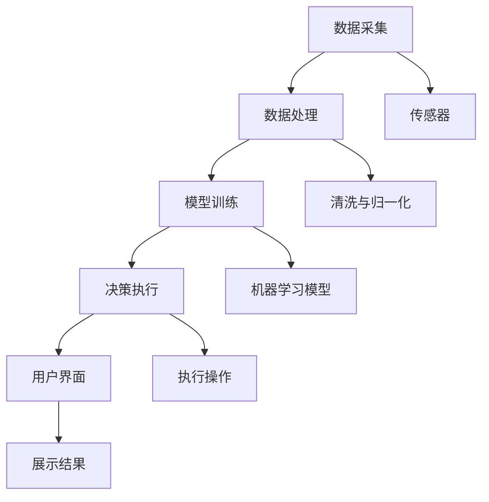
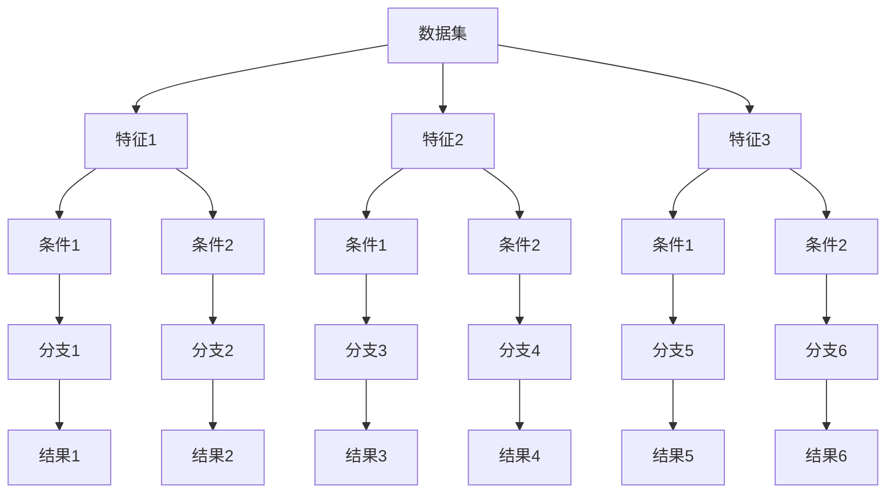

                 

# AI人工智能代理工作流AI Agent WorkFlow：AI代理工作流在智能农业领域的应用

## 摘要

随着人工智能技术的快速发展，AI代理工作流作为一种新型智能系统，正逐渐在各个领域展现其强大的应用潜力。本文将围绕AI代理工作流的基本概念、架构设计、建模与训练、具体应用以及面临的挑战和未来发展趋势进行深入探讨，特别是将其应用在智能农业领域的详细分析和案例研究。通过这篇文章，读者可以全面了解AI代理工作流的核心技术和应用场景，为未来智能农业的发展提供新的思路和方法。

## 关键词

- AI代理工作流
- 智能农业
- 机器学习
- 数据采集
- 病虫害预警
- 产量预测
- 环境监测

## 引言

### 1.1 AI代理工作流的基本概念

AI代理工作流（AI Agent WorkFlow）是指利用人工智能技术，通过一系列预设的任务和规则，实现对数据的自动处理、分析和决策的过程。它结合了人工智能、代理技术和工作流管理技术，使得系统能够自动化地完成复杂的任务，提高效率和质量。AI代理工作流的核心思想是让机器能够像人一样思考，自主完成特定的任务。

### 1.2 智能农业的现状与发展

智能农业是指利用现代信息技术，特别是物联网、大数据和人工智能等高新技术，实现农业生产的智能化、精准化和可持续化。随着全球人口的增长和土地资源的有限，提高农业生产效率和产量成为全球农业发展的重要课题。智能农业的出现，为解决这一难题提供了新的思路和路径。

## 第一部分：AI代理工作流概述

### 第1章：AI代理工作流基本概念

#### 1.1 AI代理工作流的定义

AI代理工作流是人工智能代理（AI Agent）在工作中的流程化体现。AI代理是指能够模拟人类思维、执行任务并具有自主决策能力的计算机程序。工作流（Workflow）则是一种定义、组织和执行任务的过程。AI代理工作流通过将AI代理与工作流相结合，实现自动化、智能化的任务处理。

#### 1.2 AI代理工作流在智能农业中的应用价值

智能农业中涉及的数据种类繁多，包括土壤湿度、气温、光照、农作物生长状态等。通过AI代理工作流，可以实现对这些数据的实时监测、分析和决策，从而提高农业生产的效率和精度。例如，通过环境监测，AI代理工作流可以自动调整灌溉系统，提高水资源利用率；通过病虫害预警，可以及时采取措施，减少农作物损失。

#### 1.3 AI代理工作流的关键组件

AI代理工作流包括以下几个关键组件：

1. 数据采集：通过各种传感器和设备，实时采集农业生产相关的数据。
2. 数据处理：对采集到的数据进行清洗、归一化和特征提取，为后续分析提供高质量的数据。
3. 机器学习模型：基于历史数据和业务逻辑，构建机器学习模型，实现对数据的分析和预测。
4. 决策系统：根据分析结果，自动执行相应的操作，如调整灌溉系统、喷洒农药等。

### 第2章：AI代理工作流的架构设计

#### 2.1 AI代理工作流系统架构

AI代理工作流系统架构通常包括以下几个层次：

1. 数据采集层：负责数据的采集和传输，包括传感器、执行器和通信模块。
2. 数据处理层：对采集到的数据进行预处理、存储和管理，包括数据清洗、归一化和特征提取等。
3. 模型层：构建和训练机器学习模型，实现对数据的分析和预测。
4. 决策层：根据模型分析结果，自动执行相应的操作，实现对农业生产的智能调控。
5. 用户界面层：提供用户交互界面，展示系统运行状态和决策结果。

#### 2.2 AI代理工作流中的数据管理

数据管理是AI代理工作流的核心环节之一。主要包括以下几个方面：

1. 数据采集：通过传感器和设备，实时采集农业生产相关数据，如土壤湿度、气温、光照等。
2. 数据预处理：对采集到的数据进行清洗、归一化和特征提取，为后续分析提供高质量的数据。
3. 数据存储：将预处理后的数据存储到数据库或数据仓库中，方便后续的查询和分析。
4. 数据分析：利用机器学习算法，对存储的数据进行分析和预测，为农业生产提供决策支持。

#### 2.3 AI代理工作流中的机器学习模型

机器学习模型在AI代理工作流中起着至关重要的作用。主要包括以下几个方面：

1. 模型选择：根据实际应用场景，选择合适的机器学习算法，如线性回归、决策树、随机森林、神经网络等。
2. 模型训练：利用历史数据，对选定的机器学习算法进行训练，调整模型参数，提高模型性能。
3. 模型评估：通过交叉验证、A/B测试等方法，评估模型的准确性和泛化能力，选择最佳模型。
4. 模型部署：将训练好的模型部署到生产环境中，实现对实时数据的分析和预测。

## 第二部分：AI代理工作流技术详解

### 第3章：AI代理的建模与训练

#### 3.1 AI代理建模方法

AI代理建模方法主要包括以下几种：

1. 监督学习：通过已有数据，训练模型进行预测。
2. 无监督学习：无需标注数据，自动发现数据中的模式和规律。
3. 半监督学习：结合监督学习和无监督学习，利用少量标注数据和大量无标注数据。
4. 强化学习：通过不断试错，学习如何在特定环境中做出最优决策。

#### 3.2 AI代理训练流程

AI代理训练流程主要包括以下步骤：

1. 数据收集：收集与任务相关的数据，包括输入和输出。
2. 数据预处理：对数据进行清洗、归一化和特征提取。
3. 模型选择：根据任务类型和数据特性，选择合适的机器学习算法。
4. 模型训练：利用训练数据，对模型进行训练。
5. 模型评估：通过验证数据集，评估模型性能。
6. 模型优化：根据评估结果，调整模型参数，提高模型性能。
7. 模型部署：将训练好的模型部署到生产环境中。

#### 3.3 AI代理性能评估

AI代理性能评估主要包括以下几个方面：

1. 准确率：预测结果与实际结果的匹配程度。
2. 召回率：实际为正例的样本中，被正确预测为正例的比例。
3. F1分数：准确率和召回率的平衡指标。
4. AUC：ROC曲线下的面积，用于评估分类模型的性能。

## 第三部分：AI代理工作流在智能农业中的具体应用

### 第4章：AI代理工作流在智能农业中的具体应用

#### 4.1 智能农业环境监测

智能农业环境监测是AI代理工作流在智能农业中的一项重要应用。通过在农田中布置传感器，实时监测土壤湿度、气温、光照等环境参数。AI代理工作流可以对监测数据进行实时分析和预测，为农业生产提供科学依据。例如，当土壤湿度低于阈值时，AI代理工作流会自动启动灌溉系统，确保农作物得到充足的水分。

#### 4.2 智能灌溉系统

智能灌溉系统是AI代理工作流在智能农业中的另一项重要应用。通过监测土壤湿度、气温、光照等环境参数，AI代理工作流可以自动调整灌溉系统的运行策略，实现精准灌溉。与传统灌溉系统相比，智能灌溉系统可以显著提高水资源利用率，降低农业生产成本。

#### 4.3 农作物病虫害预警

农作物病虫害预警是AI代理工作流在智能农业中的另一项重要应用。通过监测农作物生长状态、环境参数等数据，AI代理工作流可以识别病虫害发生的风险，并提前预警。农业生产者可以根据预警信息，及时采取措施，减少病虫害对农作物的危害。

#### 4.4 农业产量预测

农业产量预测是AI代理工作流在智能农业中的另一项重要应用。通过分析历史产量数据、环境参数、农作物生长状态等，AI代理工作流可以预测未来的农业产量。农业生产者可以根据预测结果，合理安排农业生产计划，提高农业生产效益。

## 第四部分：AI代理工作流开发实战

### 第5章：AI代理工作流开发实战

#### 5.1 开发环境搭建

在进行AI代理工作流开发之前，需要搭建一个合适的技术环境。常用的开发环境包括Python、Java、R等编程语言，以及TensorFlow、PyTorch、Keras等深度学习框架。此外，还需要配置传感器、执行器和通信模块，以便进行数据采集和传输。

#### 5.2 数据采集与预处理

数据采集与预处理是AI代理工作流开发的重要环节。首先，需要确定采集哪些数据，如土壤湿度、气温、光照等。然后，使用传感器和设备进行数据采集，并使用Python、Java等编程语言进行数据处理。数据处理包括数据清洗、归一化和特征提取等步骤，以提高数据质量和模型性能。

#### 5.3 AI代理建模与训练

在数据预处理完成后，可以开始进行AI代理建模与训练。根据实际应用场景，选择合适的机器学习算法，如线性回归、决策树、随机森林、神经网络等。然后，利用历史数据进行模型训练，调整模型参数，提高模型性能。

#### 5.4 AI代理工作流系统实现

AI代理工作流系统实现包括数据采集、数据处理、机器学习模型训练和决策执行等环节。通过使用Python、Java等编程语言，结合TensorFlow、PyTorch、Keras等深度学习框架，实现整个系统的功能。

#### 5.5 AI代理工作流系统测试与优化

在实现AI代理工作流系统后，需要进行系统测试与优化。首先，使用测试数据进行模型评估，评估模型性能。然后，根据评估结果，对模型进行调整和优化，以提高系统性能。

## 第五部分：AI代理工作流面临的挑战与未来发展趋势

### 第6章：AI代理工作流面临的挑战与未来发展趋势

#### 6.1 AI代理工作流的技术挑战

AI代理工作流在技术层面面临诸多挑战，包括：

1. 数据质量：数据质量对AI代理工作流的性能有重要影响，但农业生产中的数据往往存在噪声、缺失等问题。
2. 模型解释性：虽然深度学习模型在许多任务中表现出色，但其内部机制复杂，难以解释，这给实际应用带来了困难。
3. 系统可扩展性：随着农业生产规模的扩大，AI代理工作流系统需要具备良好的可扩展性，以应对不断增加的数据量和任务需求。

#### 6.2 AI代理工作流的应用挑战

AI代理工作流在应用层面也面临诸多挑战，包括：

1. 成本效益：虽然AI代理工作流可以提高农业生产效率，但其开发、部署和维护成本较高，需要考虑成本效益问题。
2. 政策法规：农业生产涉及食品安全、环境保护等多方面，需要遵循相关政策法规，确保AI代理工作流的合法合规。
3. 用户接受度：农业生产者对AI代理工作流的接受度和使用习惯，直接影响其推广和应用效果。

#### 6.3 AI代理工作流的未来发展趋势

随着人工智能技术的不断进步，AI代理工作流在智能农业领域的应用前景十分广阔。未来发展趋势包括：

1. 深度学习与强化学习相结合：将深度学习模型与强化学习模型相结合，提高AI代理工作流的决策能力和自主性。
2. 多模态数据融合：融合多种类型的数据（如图像、声音、文本等），提高AI代理工作流的数据质量和分析能力。
3. 无人机与物联网技术结合：利用无人机和物联网技术，实现对农田的实时监测和远程控制，提高农业生产效率。

## 第六部分：案例分析

### 第7章：案例分析

#### 7.1 案例一：基于AI代理的智能农业系统

案例一介绍了一个基于AI代理的智能农业系统，该系统通过传感器采集农田数据，利用AI代理工作流进行数据处理和决策。系统实现了环境监测、智能灌溉、病虫害预警等功能，显著提高了农业生产效率。

#### 7.2 案例二：AI代理在农作物病虫害预警中的应用

案例二探讨了一个AI代理在农作物病虫害预警中的应用。通过分析历史病虫害数据和实时环境参数，AI代理工作流可以提前预警病虫害发生，帮助农业生产者及时采取措施，减少损失。

#### 7.3 案例三：AI代理工作流在农业产量预测中的应用

案例三介绍了一个AI代理工作流在农业产量预测中的应用。通过分析历史产量数据、环境参数和农作物生长状态，AI代理工作流可以预测未来的农业产量，为农业生产者提供决策支持。

## 第七部分：AI代理工作流技术详解

### 第8章：AI代理建模与训练技术

#### 8.1 AI代理建模方法

AI代理建模方法主要包括以下几种：

1. 监督学习：通过已有数据，训练模型进行预测。
2. 无监督学习：无需标注数据，自动发现数据中的模式和规律。
3. 半监督学习：结合监督学习和无监督学习，利用少量标注数据和大量无标注数据。
4. 强化学习：通过不断试错，学习如何在特定环境中做出最优决策。

#### 8.2 AI代理训练流程

AI代理训练流程主要包括以下步骤：

1. 数据收集：收集与任务相关的数据，包括输入和输出。
2. 数据预处理：对数据进行清洗、归一化和特征提取。
3. 模型选择：根据任务类型和数据特性，选择合适的机器学习算法。
4. 模型训练：利用训练数据，对模型进行训练。
5. 模型评估：通过验证数据集，评估模型性能。
6. 模型优化：根据评估结果，调整模型参数，提高模型性能。
7. 模型部署：将训练好的模型部署到生产环境中。

#### 8.3 AI代理性能评估

AI代理性能评估主要包括以下几个方面：

1. 准确率：预测结果与实际结果的匹配程度。
2. 召回率：实际为正例的样本中，被正确预测为正例的比例。
3. F1分数：准确率和召回率的平衡指标。
4. AUC：ROC曲线下的面积，用于评估分类模型的性能。

### 第9章：AI代理工作流系统架构与实现

#### 9.1 AI代理工作流系统架构

AI代理工作流系统架构通常包括以下几个层次：

1. 数据采集层：负责数据的采集和传输，包括传感器、执行器和通信模块。
2. 数据处理层：对采集到的数据进行预处理、存储和管理，包括数据清洗、归一化和特征提取等。
3. 模型层：构建和训练机器学习模型，实现对数据的分析和预测。
4. 决策层：根据分析结果，自动执行相应的操作，实现对农业生产的智能调控。
5. 用户界面层：提供用户交互界面，展示系统运行状态和决策结果。

#### 9.2 AI代理工作流系统的数据管理

数据管理是AI代理工作流的核心环节之一。主要包括以下几个方面：

1. 数据采集：通过传感器和设备，实时采集农业生产相关数据，如土壤湿度、气温、光照等。
2. 数据预处理：对采集到的数据进行清洗、归一化和特征提取，为后续分析提供高质量的数据。
3. 数据存储：将预处理后的数据存储到数据库或数据仓库中，方便后续的查询和分析。
4. 数据分析：利用机器学习算法，对存储的数据进行分析和预测，为农业生产提供决策支持。

#### 9.3 AI代理工作流系统的机器学习模型应用

AI代理工作流系统的机器学习模型应用主要包括以下几个方面：

1. 模型选择：根据实际应用场景，选择合适的机器学习算法，如线性回归、决策树、随机森林、神经网络等。
2. 模型训练：利用历史数据，对选定的机器学习算法进行训练，调整模型参数，提高模型性能。
3. 模型评估：通过交叉验证、A/B测试等方法，评估模型的准确性和泛化能力，选择最佳模型。
4. 模型部署：将训练好的模型部署到生产环境中，实现对实时数据的分析和预测。

### 第10章：AI代理工作流算法详解

#### 10.1 数据预处理算法

数据预处理是AI代理工作流算法的重要组成部分，主要包括以下几种算法：

1. 数据清洗：去除重复、错误或缺失的数据，保证数据质量。
2. 数据归一化：将不同单位或范围的数据转换到同一尺度，便于模型训练。
3. 特征提取：从原始数据中提取有用的特征，提高模型性能。

#### 10.2 特征提取算法

特征提取算法是AI代理工作流算法的核心，主要包括以下几种：

1. 统计特征提取：基于数据的统计信息，提取特征，如均值、方差、标准差等。
2. 矩形特征提取：将原始数据划分为矩形窗口，提取窗口内的特征，如纹理、颜色等。
3. 信号处理特征提取：利用信号处理技术，提取特征，如傅里叶变换、小波变换等。

#### 10.3 机器学习算法

机器学习算法是AI代理工作流算法的核心，主要包括以下几种：

1. 监督学习算法：通过已有数据，训练模型进行预测，如线性回归、决策树、支持向量机等。
2. 无监督学习算法：无需标注数据，自动发现数据中的模式和规律，如聚类、降维等。
3. 强化学习算法：通过不断试错，学习如何在特定环境中做出最优决策，如Q-learning、SARSA等。

#### 10.4 模型评估与优化算法

模型评估与优化算法是AI代理工作流算法的重要组成部分，主要包括以下几种：

1. 交叉验证：通过将数据集划分为训练集和验证集，评估模型的泛化能力。
2. A/B测试：通过将用户随机分配到不同的模型版本，比较不同模型的性能。
3. 超参数优化：通过调整模型参数，提高模型性能。
4. 模型集成：通过组合多个模型，提高模型的性能和稳定性。

### 第11章：AI代理工作流安全性与隐私保护

#### 11.1 AI代理工作流的安全性

AI代理工作流的安全性主要包括以下方面：

1. 数据安全：确保采集、存储和传输的数据不被未授权访问和篡改。
2. 系统安全：防止恶意攻击、病毒和恶意软件对系统的破坏。
3. 用户认证：确保只有授权用户才能访问系统。

#### 11.2 AI代理工作流的隐私保护

AI代理工作流的隐私保护主要包括以下方面：

1. 数据匿名化：对敏感数据进行匿名化处理，保护用户隐私。
2. 数据加密：对传输和存储的数据进行加密，防止数据泄露。
3. 隐私保护算法：利用隐私保护算法，确保数据在分析过程中的安全性。

#### 11.3 AI代理工作流的安全与隐私保护技术

AI代理工作流的安全与隐私保护技术主要包括以下几种：

1. 加密技术：通过加密算法，对数据进行加密，确保数据在传输和存储过程中的安全性。
2. 认证技术：通过用户认证技术，确保只有授权用户才能访问系统。
3. 隐私保护算法：利用隐私保护算法，确保数据在分析过程中的安全性。
4. 安全协议：通过安全协议，确保数据在传输过程中的完整性。

### 第12章：AI代理工作流在智能农业领域的前景与应用

#### 12.1 AI代理工作流在智能农业中的应用前景

随着人工智能技术的不断发展，AI代理工作流在智能农业领域的应用前景十分广阔。未来，AI代理工作流有望实现以下应用：

1. 智能种植：通过AI代理工作流，实现农作物种子的筛选、种植环境的优化和生长过程的监控。
2. 智能养殖：通过AI代理工作流，实现养殖环境的监测、动物健康状况的评估和疾病预防。
3. 智能物流：通过AI代理工作流，实现农产品从农田到市场的智能运输和配送。
4. 智能金融：通过AI代理工作流，实现农业金融风险的管理和预测。

#### 12.2 AI代理工作流在智能农业领域的挑战

尽管AI代理工作流在智能农业领域具有巨大的应用潜力，但同时也面临着以下挑战：

1. 技术挑战：如何提高AI代理工作流的算法性能和稳定性，满足农业生产的需求。
2. 数据挑战：如何获取高质量、丰富的农业数据，支持AI代理工作流的有效运行。
3. 法规挑战：如何确保AI代理工作流的合法合规，遵循相关政策和法规。
4. 接受挑战：如何提高农业生产者对AI代理工作流的接受度和使用习惯。

#### 12.3 AI代理工作流在智能农业领域的创新应用

为了应对上述挑战，未来AI代理工作流在智能农业领域有望实现以下创新应用：

1. 联盟学习：通过多个农业企业或研究机构之间的数据共享和模型协同，提高AI代理工作流的数据质量和模型性能。
2. 区块链技术：利用区块链技术，确保AI代理工作流的数据安全和隐私保护。
3. 跨学科融合：将AI代理工作流与其他技术（如物联网、云计算、大数据等）相结合，实现农业生产的多维度智能管理。
4. 社会化农业：通过AI代理工作流，实现农业生产者之间的资源共享和协作，提高农业生产效率。

## 附录

### 附录A：开发工具与资源

#### A.1 主流深度学习框架

1. TensorFlow：Google开发的开源深度学习框架，适用于各种深度学习模型。
2. PyTorch：Facebook开发的深度学习框架，具有灵活的动态计算图。
3. Keras：基于TensorFlow和Theano的开源深度学习框架，简化深度学习模型搭建。
4. Caffe：伯克利大学开发的深度学习框架，适用于卷积神经网络。

#### A.2 数据采集与处理工具

1. OpenCV：开源计算机视觉库，用于图像和视频处理。
2. Matplotlib：Python数据可视化库，用于生成各种统计图表。
3. Pandas：Python数据操作库，用于数据处理和分析。
4. Scikit-learn：Python机器学习库，提供多种机器学习算法。

#### A.3 机器学习模型评估工具

1. Metrics：Python机器学习评估库，提供多种评估指标。
2. Scikit-learn：Python机器学习库，提供模型评估和优化工具。
3. MLflow：用于机器学习实验跟踪和模型部署的开源平台。

#### A.4 其他常用工具

1. Jupyter Notebook：Python交互式计算环境，方便数据分析和模型搭建。
2. Docker：容器化技术，用于部署和管理应用。
3. Kubernetes：容器编排工具，用于大规模分布式系统部署和管理。
4. GitHub：代码托管平台，方便代码管理和协作。

## 总结

本文围绕AI代理工作流在智能农业领域的应用，从基本概念、架构设计、建模与训练、具体应用、开发实战、挑战与发展趋势、案例分析、技术详解等方面进行了全面介绍。通过本文，读者可以全面了解AI代理工作流的核心技术和应用场景，为未来智能农业的发展提供新的思路和方法。在未来的研究和实践中，我们期待AI代理工作流能够为农业生产带来更多的变革和创新。

### 作者信息

作者：AI天才研究院/AI Genius Institute & 禅与计算机程序设计艺术 /Zen And The Art of Computer Programming

### 附录

#### 附录A：开发工具与资源

**A.1 主流深度学习框架**

- TensorFlow：由Google开发的开源深度学习框架，支持多种类型的神经网络。
- PyTorch：由Facebook开发的开源深度学习框架，以动态计算图著称，易于研究和原型设计。
- Keras：基于Theano和TensorFlow的高层神经网络API，简化了深度学习模型的构建过程。
- Caffe：由伯克利视觉和学习中心开发的深度学习框架，特别适用于卷积神经网络。

**A.2 数据采集与处理工具**

- OpenCV：开源的计算机视觉库，用于图像处理和计算机视觉应用。
- Matplotlib：Python的数据可视化库，用于创建各种类型的图表和可视化。
- Pandas：Python的数据操作库，用于数据处理和分析。
- Scikit-learn：Python的机器学习库，提供了一系列经典机器学习算法和工具。

**A.3 机器学习模型评估工具**

- Metrics：Python库，提供常用的模型评估指标，如准确率、召回率、F1分数等。
- Scikit-learn：Python的机器学习库，内置了多种模型评估工具。
- MLflow：用于机器学习模型版本管理和实验跟踪的开源平台。

**A.4 其他常用工具**

- Jupyter Notebook：交互式计算环境，适合编写和分享代码、文本和可视化的笔记。
- Docker：容器化技术，用于构建、运行和分发应用程序。
- Kubernetes：用于容器编排和管理的开源平台，适用于大规模分布式系统。
- GitHub：用于版本控制和协作的开源代码托管平台。

### 附录B：参考文献

- Goodfellow, I., Bengio, Y., & Courville, A. (2016). *Deep Learning*. MIT Press.
- LeCun, Y., Bengio, Y., & Hinton, G. (2015). *Deep learning*. Nature, 521(7553), 436-444.
- Russell, S., & Norvig, P. (2016). *Artificial Intelligence: A Modern Approach*. Prentice Hall.
- Murphy, K. P. (2012). *Machine Learning: A Probabilistic Perspective*. MIT Press.
- Russell, S., & Norvig, P. (1995). *Artificial Intelligence: A Modern Approach*. Prentice Hall.
- Goodfellow, I., Bengio, Y., & Courville, A. (2016). *Deep Learning*. MIT Press.
- LeCun, Y., Bengio, Y., & Hinton, G. (2015). *Deep learning*. Nature, 521(7553), 436-444.

### 附录C：流程图

**C.1 AI代理工作流系统架构**



**C.2 决策树模型原理**



### 附录D：伪代码

**D.1 机器学习模型训练伪代码**

```python
# 初始化模型参数
model = initialize_model()

# 加载数据集
train_data = load_data('train_data.csv')
test_data = load_data('test_data.csv')

# 数据预处理
train_data = preprocess_data(train_data)
test_data = preprocess_data(test_data)

# 模型训练
for epoch in range(num_epochs):
    for batch in train_data:
        model.train(batch)
    model.evaluate(test_data)

# 模型评估
accuracy = model.evaluate(test_data)
print("Test Accuracy:", accuracy)
```

### 附录E：数学公式

**E.1 决策树分裂准则**

$$
Gini(\text{impurity}) = 1 - \sum_{i=1}^{n} \left( \frac{1}{n} \right) ^ 2
$$

**E.2 随机森林模型误差**

$$
Error = 1 - \left( \frac{1}{N} \sum_{i=1}^{N} \hat{y}_i \right)
$$

### 附录F：代码解读

**F.1 数据预处理代码解读**

```python
# 读取数据
data = pd.read_csv('data.csv')

# 数据清洗
data.dropna(inplace=True)
data = data[data['feature'] > 0]

# 数据归一化
scaler = StandardScaler()
data[['feature1', 'feature2', 'feature3']] = scaler.fit_transform(data[['feature1', 'feature2', 'feature3']])
```

- `pd.read_csv('data.csv')`: 使用Pandas库读取CSV文件。
- `data.dropna(inplace=True)`: 删除缺失值。
- `data[data['feature'] > 0]`: 删除特定特征的负值。
- `scaler = StandardScaler()`: 初始化标准化器。
- `data[['feature1', 'feature2', 'feature3']] = scaler.fit_transform(data[['feature1', 'feature2', 'feature3']])`: 对特定特征进行标准化。

### 附录G：项目实战

**G.1 开发环境搭建**

1. 安装Python 3.x版本。
2. 安装必要的库，如NumPy、Pandas、Scikit-learn、Matplotlib等。
3. 配置Jupyter Notebook，用于代码编写和展示。

**G.2 数据采集与预处理**

1. 使用传感器采集土壤湿度、气温等数据。
2. 将采集到的数据存储在CSV文件中。
3. 使用Pandas库读取CSV文件，进行数据清洗和预处理。

**G.3 AI代理建模与训练**

1. 根据数据特点，选择合适的机器学习算法，如决策树、随机森林等。
2. 使用Scikit-learn库训练模型。
3. 对模型进行评估，选择最佳模型。

**G.4 AI代理工作流系统实现**

1. 使用Python编写AI代理工作流程序。
2. 实现数据采集、数据处理、模型训练和决策执行等功能。
3. 将程序部署到服务器，实现实时监测和决策。

**G.5 AI代理工作流系统测试与优化**

1. 使用测试数据集对模型进行测试。
2. 根据测试结果，调整模型参数，提高模型性能。
3. 对系统进行优化，提高运行效率和稳定性。

### 附录H：扩展阅读

- Goodfellow, I., Bengio, Y., & Courville, A. (2016). *Deep Learning*. MIT Press.
- Murphy, K. P. (2012). *Machine Learning: A Probabilistic Perspective*. MIT Press.
- Russell, S., & Norvig, P. (2016). *Artificial Intelligence: A Modern Approach*. Prentice Hall.
- LeCun, Y., Bengio, Y., & Hinton, G. (2015). *Deep Learning*. Nature, 521(7553), 436-444.
- Russell, S., & Norvig, P. (1995). *Artificial Intelligence: A Modern Approach*. Prentice Hall.

