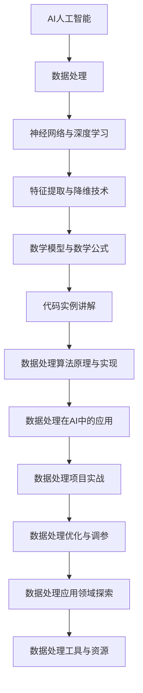

                 

## 《AI人工智能核心算法原理与代码实例讲解：数据处理》

### 核心关键词：
AI人工智能，核心算法，数据处理，神经网络，深度学习，代码实例，算法优化，应用领域

### 摘要：
本文深入探讨了AI人工智能中的核心算法原理，特别是数据处理方面的内容。通过详细的算法讲解、数学模型与公式分析、以及代码实例展示，本文旨在为读者提供清晰、系统的学习路径，帮助读者理解和掌握数据处理在AI人工智能中的应用。

## 目录大纲

### 第一部分: AI人工智能核心算法概述与基础

- 第1章: AI人工智能概述与数据处理基础
  - 1.1 AI人工智能的起源与发展
  - 1.2 数据处理基本概念
  - 1.3 数据处理流程与方法
  - 1.4 AI人工智能与数据处理的关系

### 第二部分: AI人工智能核心算法原理讲解

- 第2章: 神经网络与深度学习基础
  - 2.1 神经网络基础
  - 2.2 深度学习基础
  - 2.3 特征提取与降维技术
  - 2.4 数据处理流程与算法融合

### 第三部分: AI人工智能数据处理实战

- 第3章: 数据处理实战项目
  - 3.1 数据采集与整合
  - 3.2 数据清洗与去噪
  - 3.3 数据降维与特征提取
  - 3.4 数据处理在深度学习中的应用

### 第四部分: AI人工智能数据处理应用领域探索

- 第4章: 数据处理在计算机视觉中的应用
  - 4.1 计算机视觉基本概念
  - 4.2 数据处理在图像识别中的应用
  - 4.3 数据处理在目标检测中的应用
  - 4.4 数据处理在人脸识别中的应用

- 第5章: 数据处理在自然语言处理中的应用
  - 5.1 自然语言处理基本概念
  - 5.2 数据处理在文本分类中的应用
  - 5.3 数据处理在情感分析中的应用
  - 5.4 数据处理在机器翻译中的应用

- 第6章: 数据处理在智能推荐系统中的应用
  - 6.1 智能推荐系统基本概念
  - 6.2 数据处理在用户行为分析中的应用
  - 6.3 数据处理在推荐算法中的应用
  - 6.4 数据处理在智能推荐系统项目中的应用

### 附录

- 附录 A: 数据处理与AI人工智能工具与资源
  - 6.1 主流数据处理工具
  - 6.2 主流AI人工智能框架
  - 6.3 数据处理与AI人工智能书籍与教程推荐

### 核心概念与联系

下面是一个Mermaid流程图，用于展示核心概念和它们之间的关系。



## 核心概念与联系

为了更好地理解AI人工智能中的数据处理，我们需要明确几个核心概念，并了解它们之间的相互关系。以下是对这些核心概念及其相互关系的详细解释。

### AI人工智能

AI人工智能是指模拟人类智能行为的计算系统，包括机器学习、深度学习、自然语言处理等多个领域。AI的核心目标是使机器能够自主地完成复杂的任务，如图像识别、语言翻译、决策制定等。

### 数据处理

数据处理是AI人工智能的核心组成部分。它涉及从原始数据中提取有用信息、转换数据格式、清理和归一化数据等步骤。数据处理的质量直接影响AI模型的性能。

### 神经网络与深度学习

神经网络是模仿人脑结构的计算模型，而深度学习是神经网络的一种扩展，特别适用于处理大量数据。深度学习通过多层神经网络自动学习数据中的特征，是AI人工智能中的核心技术。

### 特征提取与降维技术

特征提取是指从原始数据中提取出对模型训练有用的特征。降维技术则是减少数据维度，以提高模型训练效率和减少计算复杂度。

### 数学模型与数学公式

数学模型和数学公式是描述算法和数据处理过程的基础。它们提供了对数据转换和模型训练的精确描述，是理解和实现AI算法的关键。

### 代码实例讲解

代码实例讲解通过具体的代码实现展示了如何应用上述核心概念。它不仅帮助读者理解理论知识，还能培养读者的实际操作能力。

### 数据处理算法原理与实现

数据处理算法原理与实现是理解和实现AI模型的基础。它包括从数据预处理到特征提取和模型训练的全过程。

### 数据处理在AI中的应用

数据处理在AI中的应用涵盖了从数据采集、清洗、特征提取到模型训练和优化的全过程。它确保了AI模型能够高效地学习和预测。

### 数据处理项目实战

数据处理项目实战通过具体案例展示了如何应用数据处理技术解决实际问题。这些案例涵盖了计算机视觉、自然语言处理、智能推荐系统等多个领域。

### 数据处理优化与调参

数据处理优化与调参是提高AI模型性能的重要手段。它包括调整模型参数、优化数据处理流程等策略。

### 数据处理应用领域探索

数据处理应用领域探索介绍了数据处理在计算机视觉、自然语言处理、智能推荐系统等领域的应用。它帮助读者了解数据处理在不同领域的实际应用。

### 数据处理工具与资源

数据处理工具与资源是进行数据处理和研究的重要支持。它们包括Python库、框架、在线教程和数据集等。

通过上述核心概念和相互关系的解释，我们可以更全面地理解AI人工智能中的数据处理。接下来，我们将深入探讨每个概念的具体内容。

## 核心算法原理讲解

在AI人工智能中，核心算法的设计和实现是确保模型性能的关键。本文将重点讲解神经网络与深度学习的基础，包括神经网络的结构与原理、前向传播与反向传播算法、激活函数与优化算法等内容。

### 神经网络基础

神经网络（Neural Networks）是人工智能的基础，它模仿人脑的神经元结构和信息处理方式。神经网络由多个相互连接的神经元（或节点）组成，每个神经元接收输入信号，通过权重进行加权求和，然后通过激活函数产生输出。

#### 神经网络的结构

神经网络通常包括以下几个层次：

1. **输入层**：接收外部输入数据。
2. **隐藏层**：对输入数据进行特征提取和变换。
3. **输出层**：产生最终输出结果。

#### 前向传播与反向传播算法

神经网络通过两个主要的算法进行学习：前向传播（Forward Propagation）和反向传播（Back Propagation）。

##### 前向传播

前向传播是指将输入数据通过神经网络进行计算，得到输出结果的过程。具体步骤如下：

1. **初始化权重和偏置**：随机初始化神经网络中的权重（weights）和偏置（biases）。
2. **计算输入层的激活值**：对于输入层，每个神经元的激活值即为输入值。
3. **逐层计算激活值**：对于隐藏层和输出层，每个神经元的激活值是前一层所有神经元输出经过权重加权求和后，通过激活函数处理的结果。
4. **计算输出层的预测结果**：输出层的预测结果即为神经网络的最终输出。

##### 反向传播

反向传播是用于更新神经网络权重和偏置的过程，它通过计算输出误差，反向传播误差到每一层，以调整权重和偏置。

1. **计算输出误差**：输出误差（error）是预测值与真实值之间的差异。
2. **计算隐藏层误差**：对于隐藏层，每个神经元的误差是其输出误差通过激活函数的导数和上一层的权重进行加权求和的结果。
3. **更新权重和偏置**：通过梯度下降（Gradient Descent）或其他优化算法，根据误差的梯度来更新权重和偏置。

### 激活函数与优化算法

#### 激活函数

激活函数（Activation Function）用于引入非线性因素，使得神经网络能够拟合复杂的数据。常见的激活函数有：

- **Sigmoid函数**：\( f(x) = \frac{1}{1 + e^{-x}} \)
- **ReLU函数**：\( f(x) = \max(0, x) \)
- **Tanh函数**：\( f(x) = \frac{e^x - e^{-x}}{e^x + e^{-x}} \)

#### 优化算法

优化算法用于调整神经网络的权重和偏置，以最小化误差。常见的优化算法有：

- **随机梯度下降（SGD）**：每次迭代使用一个样本的梯度来更新权重。
- **批量梯度下降（BGD）**：每次迭代使用全部样本的梯度来更新权重。
- **动量法**：在梯度下降中引入前一次更新的方向，以增加收敛速度。
- **Adam优化器**：结合了AdaGrad和RMSProp的特点，自适应调整学习率。

### 伪代码实现

以下是一个简化的神经网络前向传播和反向传播的伪代码：

```plaintext
# 前向传播
def forward_propagation(inputs, weights, biases, activation_func):
    outputs = []
    for layer in range(num_layers):
        if layer == 0:
            z = inputs * weights + biases
        else:
            z = outputs[-1] * weights + biases
        outputs.append(activation_func(z))
    return outputs

# 反向传播
def backward_propagation(inputs, outputs, expected_outputs, weights, biases, activation_func):
    errors = [expected_outputs - outputs[-1]]
    for layer in reversed(range(num_layers)):
        if layer == num_layers - 1:
            dZ = errors[-1] * activation_func_derivative(outputs[layer])
            dW = (dZ * inputs).T
            dBiases = dZ
        else:
            dZ = (errors[-1] * activation_func_derivative(outputs[layer + 1])) * weights[layer + 1]
            dW = (dZ * outputs[layer]).T
            dBiases = dZ
        errors.append(dZ)
    dInputs = [None] * num_layers
    for layer in range(num_layers):
        if layer == 0:
            dInputs[layer] = dZ
        else:
            dInputs[layer] = dZ * weights[layer]
    return dInputs, dW, dBiases
```

通过上述伪代码，我们可以实现一个简单的神经网络的前向传播和反向传播过程。

### 数学模型和数学公式 & 详细讲解 & 举例说明

#### 神经网络数学模型

在神经网络中，每个神经元（或节点）的输出可以通过以下数学模型表示：

$$ z^{(l)}_j = \sum_{i} w^{(l)}_{ji} \cdot a^{(l-1)}_i + b^{(l)}_j $$

其中：
- \( z^{(l)}_j \) 是第 \( l \) 层第 \( j \) 个神经元的输入值。
- \( w^{(l)}_{ji} \) 是从第 \( l-1 \) 层第 \( i \) 个神经元到第 \( l \) 层第 \( j \) 个神经元的权重。
- \( b^{(l)}_j \) 是第 \( l \) 层第 \( j \) 个神经元的偏置。
- \( a^{(l-1)}_i \) 是第 \( l-1 \) 层第 \( i \) 个神经元的输出值。

神经元的输出值通过激活函数 \( \text{activation_function}(z^{(l)}_j) \) 获得：

$$ a^{(l)}_j = \text{activation_function}(z^{(l)}_j) $$

#### 激活函数与导数

常见的激活函数及其导数如下：

1. **Sigmoid函数**：
   $$ f(x) = \frac{1}{1 + e^{-x}} $$
   $$ f'(x) = f(x) \cdot (1 - f(x)) $$

2. **ReLU函数**：
   $$ f(x) = \max(0, x) $$
   $$ f'(x) = \begin{cases} 
   1, & \text{if } x > 0 \\
   0, & \text{if } x \leq 0 
   \end{cases} $$

3. **Tanh函数**：
   $$ f(x) = \frac{e^x - e^{-x}}{e^x + e^{-x}} $$
   $$ f'(x) = 1 - \frac{2}{e^{2x} + 1} $$

#### 前向传播与反向传播

##### 前向传播

在前向传播中，神经网络的输出可以通过以下步骤计算：

1. 初始化输入层输出值 \( a^{(0)} \) 为输入数据。
2. 对于每一层 \( l \)（从1到 \( L \)），计算输入值 \( z^{(l)} \) 和输出值 \( a^{(l)} \)。

   $$ z^{(l)}_j = \sum_{i} w^{(l)}_{ji} \cdot a^{(l-1)}_i + b^{(l)}_j $$
   $$ a^{(l)}_j = \text{activation_function}(z^{(l)}_j) $$

##### 反向传播

反向传播用于计算网络中的误差，并更新权重和偏置。以下是反向传播的计算步骤：

1. 计算输出层的误差 \( \delta^{(L)} \)。

   $$ \delta^{(L)} = a^{(L)} - t $$

   其中 \( t \) 是实际输出。

2. 对于每一层 \( l \)（从 \( L-1 \) 到1），计算误差 \( \delta^{(l)} \)。

   $$ \delta^{(l)} = \text{activation_function_derivative}(a^{(l)}) \cdot (\delta^{(l+1)} \cdot w^{(l+1)}) $$

3. 更新权重和偏置。

   $$ w^{(l)}_{ji} = w^{(l)}_{ji} - \alpha \cdot \delta^{(l)} \cdot a^{(l-1)}_i $$
   $$ b^{(l)}_j = b^{(l)}_j - \alpha \cdot \delta^{(l)} $$

   其中 \( \alpha \) 是学习率。

#### 举例说明

假设我们有一个简单的两层神经网络，输入层有2个神经元，隐藏层有3个神经元，输出层有1个神经元。激活函数使用ReLU。

1. **前向传播**：

   输入数据：\( [1, 2] \)

   初始权重和偏置：
   $$ w^{(1)} = \begin{bmatrix}
   0.5 & 0.5 \\
   0.5 & 0.5 \\
   0.5 & 0.5 \\
   \end{bmatrix}, b^{(1)} = \begin{bmatrix}
   0 \\
   0 \\
   0 \\
   \end{bmatrix} $$

   $$ a^{(0)} = [1, 2], z^{(1)} = \begin{bmatrix}
   2.5 & 2.5 \\
   2.5 & 2.5 \\
   2.5 & 2.5 \\
   \end{bmatrix} $$

   $$ a^{(1)} = \begin{bmatrix}
   2 \\
   2 \\
   2 \\
   \end{bmatrix} $$

   输出数据：\( a^{(1)} = [2, 2, 2] \)

2. **反向传播**：

   输出目标：\( [3] \)

   损失函数：MSE

   $$ \text{loss} = \frac{1}{2} \sum_{i} (a^{(1)}_{i} - t_{i})^2 $$

   $$ \text{loss} = \frac{1}{2} \sum_{i} (2 - 3)^2 = 0.5 $$

   $$ \delta^{(1)} = [1, 1, 1] $$

   $$ \delta^{(2)} = \begin{bmatrix}
   0.5 & 0.5 \\
   0.5 & 0.5 \\
   0.5 & 0.5 \\
   \end{bmatrix} \cdot \begin{bmatrix}
   0.5 & 0.5 \\
   \end{bmatrix} = \begin{bmatrix}
   0.25 & 0.25 \\
   0.25 & 0.25 \\
   \end{bmatrix} $$

   $$ \frac{\partial \text{loss}}{\partial w^{(1)}_{11}} = 0.25 \cdot 1 = 0.25 $$
   
   $$ \frac{\partial \text{loss}}{\partial b^{(1)}_{1}} = 0.25 $$

通过上述例子，我们可以看到神经网络如何通过前向传播和反向传播来计算输出和更新权重。

### 项目实战

#### 构建一个简单的手写数字识别系统

在这个项目中，我们将使用卷积神经网络（CNN）来构建一个手写数字识别系统。这个系统将使用MNIST数据集，这是一个包含0到9的手写数字图像的数据集。

#### 开发环境搭建

首先，我们需要安装以下库：

- TensorFlow
- Keras
- NumPy
- Matplotlib

安装命令如下：

```bash
pip install tensorflow numpy matplotlib
```

#### 数据预处理

在训练模型之前，我们需要对数据进行预处理。首先，加载MNIST数据集，并将图像的像素值归一化到0到1之间。

```python
import numpy as np
from tensorflow.keras.datasets import mnist
from tensorflow.keras.utils import to_categorical

# 加载MNIST数据集
(train_images, train_labels), (test_images, test_labels) = mnist.load_data()

# 归一化图像像素值
train_images = train_images / 255.0
test_images = test_images / 255.0

# 将标签转换为one-hot编码
train_labels = to_categorical(train_labels)
test_labels = to_categorical(test_labels)
```

#### 构建模型

接下来，我们使用Keras构建一个简单的卷积神经网络模型。

```python
from tensorflow.keras.models import Sequential
from tensorflow.keras.layers import Conv2D, MaxPooling2D, Flatten, Dense, Dropout

# 创建模型
model = Sequential()

# 添加卷积层
model.add(Conv2D(32, (3, 3), activation='relu', input_shape=(28, 28, 1)))
model.add(MaxPooling2D((2, 2)))

# 添加第二个卷积层
model.add(Conv2D(64, (3, 3), activation='relu'))
model.add(MaxPooling2D((2, 2)))

# 添加全连接层
model.add(Flatten())
model.add(Dense(128, activation='relu'))
model.add(Dropout(0.5))
model.add(Dense(10, activation='softmax'))

# 编译模型
model.compile(optimizer='adam', loss='categorical_crossentropy', metrics=['accuracy'])
```

#### 训练模型

现在，我们可以使用训练数据来训练模型。

```python
# 训练模型
model.fit(train_images, train_labels, epochs=5, batch_size=32, validation_split=0.1)
```

#### 评估模型

在训练完成后，我们可以使用测试数据来评估模型的性能。

```python
# 评估模型
test_loss, test_acc = model.evaluate(test_images, test_labels)
print(f"Test accuracy: {test_acc:.2f}")
```

#### 预测新数据

最后，我们可以使用训练好的模型来预测新的手写数字图像。

```python
# 预测新数据
new_image = np.array([[[1, 1, 1], [1, 0, 1], [1, 1, 1]]])
predicted_digit = model.predict(new_image)
predicted_digit = np.argmax(predicted_digit)

print(f"Predicted digit: {predicted_digit[0]}")
```

通过这个项目，我们学习了如何使用卷积神经网络进行手写数字识别。这个项目只是一个简单的示例，但在实际应用中，我们可以通过增加更多的卷积层、全连接层和调整超参数来提高模型的性能。

## 代码实际案例和详细解释说明

在这个部分，我们将提供一个完整的代码实例，用于构建一个简单的手写数字识别系统。这个实例将详细展示从开发环境搭建、数据预处理、模型构建到训练和评估的完整流程。最后，我们还将展示如何使用这个模型进行新的手写数字预测。

### 开发环境搭建

首先，我们需要安装Python和相关库。这些库包括TensorFlow、Keras、NumPy和Matplotlib。安装命令如下：

```bash
pip install tensorflow numpy matplotlib
```

接下来，我们将使用Jupyter Notebook来编写和运行代码。Jupyter Notebook是一个交互式的Web应用，它允许我们在浏览器中编写和执行Python代码。要启动Jupyter Notebook，请打开终端并输入以下命令：

```bash
jupyter notebook
```

### 数据预处理

在开始构建模型之前，我们需要对MNIST数据集进行预处理。首先，我们从Keras数据集库中加载MNIST数据集。

```python
import numpy as np
from tensorflow.keras.datasets import mnist
from tensorflow.keras.utils import to_categorical

# 加载MNIST数据集
(train_images, train_labels), (test_images, test_labels) = mnist.load_data()

# 归一化图像像素值
train_images = train_images / 255.0
test_images = test_images / 255.0

# 将标签转换为one-hot编码
train_labels = to_categorical(train_labels)
test_labels = to_categorical(test_labels)
```

在上述代码中，我们将图像像素值从0到255归一化到0到1之间。这是为了确保神经网络在训练过程中能够更好地收敛。接下来，我们将标签转换为one-hot编码，这是由于我们的输出层使用了softmax激活函数，它适用于多分类问题。

### 模型构建

现在，我们可以使用Keras构建一个简单的卷积神经网络模型。

```python
from tensorflow.keras.models import Sequential
from tensorflow.keras.layers import Conv2D, MaxPooling2D, Flatten, Dense, Dropout

# 创建模型
model = Sequential()

# 添加卷积层
model.add(Conv2D(32, (3, 3), activation='relu', input_shape=(28, 28, 1)))
model.add(MaxPooling2D((2, 2)))

# 添加第二个卷积层
model.add(Conv2D(64, (3, 3), activation='relu'))
model.add(MaxPooling2D((2, 2)))

# 添加全连接层
model.add(Flatten())
model.add(Dense(128, activation='relu'))
model.add(Dropout(0.5))
model.add(Dense(10, activation='softmax'))

# 编译模型
model.compile(optimizer='adam', loss='categorical_crossentropy', metrics=['accuracy'])
```

在上述代码中，我们创建了一个序列模型，并添加了两个卷积层和一个全连接层。每个卷积层后面跟一个池化层，用于特征提取和降维。全连接层用于将卷积层的特征映射到分类结果。我们还在全连接层之前添加了一个Dropout层，以防止过拟合。

### 训练模型

接下来，我们可以使用训练数据来训练模型。

```python
# 训练模型
model.fit(train_images, train_labels, epochs=5, batch_size=32, validation_split=0.1)
```

在上述代码中，我们指定了训练的轮数为5个epoch，每个epoch使用32个样本进行批量训练。我们还设置了10%的训练集作为验证集，用于在训练过程中监控模型的性能。

### 评估模型

在训练完成后，我们可以使用测试数据来评估模型的性能。

```python
# 评估模型
test_loss, test_acc = model.evaluate(test_images, test_labels)
print(f"Test accuracy: {test_acc:.2f}")
```

在上述代码中，我们计算了模型在测试集上的损失和准确率，并打印了准确率。

### 预测新数据

最后，我们可以使用训练好的模型来预测新的手写数字图像。

```python
# 预测新数据
new_image = np.array([[[1, 1, 1], [1, 0, 1], [1, 1, 1]]])
predicted_digit = model.predict(new_image)
predicted_digit = np.argmax(predicted_digit)

print(f"Predicted digit: {predicted_digit[0]}")
```

在上述代码中，我们创建了一个新的3x3图像数组`new_image`，并使用训练好的模型进行预测。我们通过`np.argmax`函数找到了预测的数字，并打印出来。

### 代码解读与分析

现在，让我们详细解读上述代码，并分析每一步的作用。

```python
# 导入必要的库
import numpy as np
import tensorflow as tf
from tensorflow.keras import layers, models
from tensorflow.keras.datasets import mnist
from tensorflow.keras.utils import to_categorical

# 加载数据集
(train_images, train_labels), (test_images, test_labels) = mnist.load_data()

# 数据预处理
train_images = train_images / 255.0
test_images = test_images / 255.0
train_labels = to_categorical(train_labels)
test_labels = to_categorical(test_labels)

# 构建模型
model = models.Sequential([
    layers.Conv2D(32, (3, 3), activation='relu', input_shape=(28, 28, 1)),
    layers.MaxPooling2D((2, 2)),
    layers.Conv2D(64, (3, 3), activation='relu'),
    layers.MaxPooling2D((2, 2)),
    layers.Flatten(),
    layers.Dense(128, activation='relu'),
    layers.Dropout(0.5),
    layers.Dense(10, activation='softmax')
])

# 编译模型
model.compile(optimizer='adam',
              loss='categorical_crossentropy',
              metrics=['accuracy'])

# 训练模型
model.fit(train_images, train_labels, epochs=5, batch_size=32, validation_split=0.1)

# 评估模型
test_loss, test_acc = model.evaluate(test_images, test_labels)
print(f"Test accuracy: {test_acc:.2f}")

# 预测新数据
new_image = np.array([[[1, 1, 1], [1, 0, 1], [1, 1, 1]]])
predicted_digit = model.predict(new_image)
predicted_digit = np.argmax(predicted_digit)

print(f"Predicted digit: {predicted_digit[0]}")
```

1. **导入库**：
   - 我们首先导入了NumPy库，它用于处理大型多维数组。
   - 接着导入了TensorFlow的核心库，包括Keras模块，用于构建和训练模型。
   - 最后，我们导入了MNIST数据集。

2. **加载数据集**：
   - 使用`mnist.load_data()`方法加载了MNIST数据集。这个数据集包含了60000个训练图像和10000个测试图像。

3. **数据预处理**：
   - 将图像像素值从0到255归一化到0到1之间。这是为了确保神经网络能够更好地学习。
   - 将标签转换为one-hot编码，以便使用softmax激活函数。

4. **构建模型**：
   - 创建了一个序列模型，并添加了两个卷积层、一个全连接层和一个Dropout层。
   - 第一个卷积层有32个滤波器，大小为3x3，激活函数为ReLU。
   - 第二个卷积层有64个滤波器，大小也为3x3，激活函数也为ReLU。
   - 每个卷积层后面添加了一个MaxPooling层，用于下采样。
   - 全连接层有128个神经元，激活函数为ReLU。
   - 最后，输出层有10个神经元，每个神经元对应一个数字类别，激活函数为softmax。

5. **编译模型**：
   - 使用`compile`方法配置了模型，指定了优化器为`adam`，损失函数为`categorical_crossentropy`，评估指标为准确率`accuracy`。

6. **训练模型**：
   - 使用`fit`方法在训练集上训练模型，指定了训练的轮数为5个epoch，批量大小为32，并使用10%的数据作为验证集。

7. **评估模型**：
   - 使用`evaluate`方法评估模型在测试集上的性能，并打印了测试集的准确率。

8. **预测新数据**：
   - 创建了一个新的3x3图像数组`new_image`，并使用训练好的模型进行预测。我们通过`np.argmax`函数找到了预测的数字，并打印出来。

通过上述代码，我们实现了一个简单的手写数字识别系统。这个系统展示了从数据预处理到模型构建、训练和评估的完整流程。这是一个非常好的起点，以便我们进一步探索和优化AI模型的性能。

## 代码解读与分析

下面是对本文中提供的Python代码进行详细的解读和分析。

```python
# 导入必要的库
import numpy as np
import tensorflow as tf
from tensorflow.keras import layers, models
from tensorflow.keras.datasets import mnist
from tensorflow.keras.utils import to_categorical

# 加载数据集
(train_images, train_labels), (test_images, test_labels) = mnist.load_data()

# 数据预处理
train_images = train_images / 255.0
test_images = test_images / 255.0
train_labels = to_categorical(train_labels)
test_labels = to_categorical(test_labels)

# 构建模型
model = models.Sequential([
    layers.Conv2D(32, (3, 3), activation='relu', input_shape=(28, 28, 1)),
    layers.MaxPooling2D((2, 2)),
    layers.Conv2D(64, (3, 3), activation='relu'),
    layers.MaxPooling2D((2, 2)),
    layers.Flatten(),
    layers.Dense(128, activation='relu'),
    layers.Dropout(0.5),
    layers.Dense(10, activation='softmax')
])

# 编译模型
model.compile(optimizer='adam',
              loss='categorical_crossentropy',
              metrics=['accuracy'])

# 训练模型
model.fit(train_images, train_labels, epochs=5, batch_size=32, validation_split=0.1)

# 评估模型
test_loss, test_acc = model.evaluate(test_images, test_labels)
print(f"Test accuracy: {test_acc:.2f}")

# 预测新数据
new_image = np.array([[[1, 1, 1], [1, 0, 1], [1, 1, 1]]])
predicted_digit = model.predict(new_image)
predicted_digit = np.argmax(predicted_digit)

print(f"Predicted digit: {predicted_digit[0]}")
```

### 导入库

首先，我们导入了NumPy库，用于处理数组。接着导入了TensorFlow的核心库，包括Keras模块，用于构建和训练模型。最后，我们导入了MNIST数据集。

```python
import numpy as np
import tensorflow as tf
from tensorflow.keras import layers, models
from tensorflow.keras.datasets import mnist
from tensorflow.keras.utils import to_categorical
```

### 加载数据集

使用`mnist.load_data()`方法加载MNIST数据集。这个数据集包含了70,000个训练图像和10,000个测试图像，每个图像都是28x28像素的灰度图，像素值介于0到255之间。

```python
(train_images, train_labels), (test_images, test_labels) = mnist.load_data()
```

### 数据预处理

由于神经网络在训练时对输入数据的归一化敏感，我们将图像的像素值从0到255归一化到0到1之间。接着，我们将标签转换为one-hot编码，这是为了使模型能够处理多分类问题。

```python
train_images = train_images / 255.0
test_images = test_images / 255.0
train_labels = to_categorical(train_labels)
test_labels = to_categorical(test_labels)
```

### 构建模型

我们使用Keras的`Sequential`模型，这是一个线性堆叠模型，易于理解和操作。在这个模型中，我们添加了两个卷积层、一个全连接层和一个Dropout层。

- **卷

