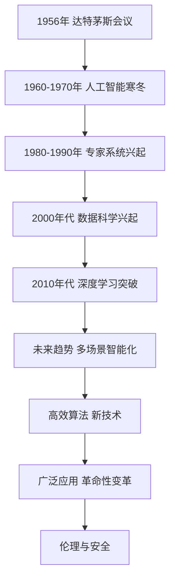

                 

# AI人工智能核心算法原理与代码实例讲解：通用问题求解

> **关键词**：AI、人工智能、核心算法、机器学习、深度学习、强化学习、代码实例

> **摘要**：本文将深入探讨AI人工智能的核心算法原理，包括机器学习、深度学习和强化学习。通过代码实例，我们将详细讲解这些算法的应用和实现，旨在帮助读者理解并掌握通用问题求解的方法和技巧。

## 目录大纲：《AI人工智能核心算法原理与代码实例讲解：通用问题求解》

#### 第一部分：AI人工智能基础与核心算法原理

##### 第1章：AI人工智能概述
- **1.1 AI人工智能的定义与发展历程**
- **1.2 AI人工智能的核心技术**
- **1.3 AI人工智能的应用领域**
- **1.4 AI人工智能的未来趋势**

##### 第2章：机器学习基础
- **2.1 数据预处理**
- **2.2 特征工程**
- **2.3 监督学习算法**
  - **2.3.1 线性回归**
  - **2.3.2 决策树**
  - **2.3.3 随机森林**
  - **2.3.4 支持向量机**
- **2.4 无监督学习算法**
  - **2.4.1 K-均值聚类**
  - **2.4.2 主成分分析**
  - **2.4.3 自编码器**

##### 第3章：深度学习基础
- **3.1 深度学习的基本概念**
- **3.2 卷积神经网络（CNN）**
  - **3.2.1 CNN的架构**
  - **3.2.2 CNN在图像识别中的应用**
- **3.3 循环神经网络（RNN）**
  - **3.3.1 RNN的基本原理**
  - **3.3.2 LSTM与GRU**
- **3.4 生成对抗网络（GAN）**
  - **3.4.1 GAN的工作原理**
  - **3.4.2 GAN的应用案例**

##### 第4章：强化学习基础
- **4.1 强化学习的定义与基本概念**
- **4.2 Q-Learning算法**
- **4.3 SARSA算法**
- **4.4 DQN算法**

##### 第5章：AI人工智能的应用案例
- **5.1 语音识别**
- **5.2 自然语言处理**
- **5.3 图像识别**
- **5.4 机器人控制**

#### 第二部分：代码实例讲解与项目实战

##### 第6章：代码实例讲解
- **6.1 数据集加载与预处理**
- **6.2 模型搭建与训练**
- **6.3 模型评估与优化**
- **6.4 模型部署与实时预测**

##### 第7章：项目实战
- **7.1 语音识别系统开发**
  - **7.1.1 项目需求分析**
  - **7.1.2 系统架构设计**
  - **7.1.3 代码实现与调试**
  - **7.1.4 系统性能评估**
- **7.2 自然语言处理项目实战**
  - **7.2.1 项目背景与目标**
  - **7.2.2 系统设计**
  - **7.2.3 数据准备与预处理**
  - **7.2.4 模型选择与训练**
  - **7.2.5 模型评估与优化**
  - **7.2.6 模型部署与应用**

##### 第8章：AI人工智能开发环境搭建
- **8.1 硬件环境配置**
- **8.2 软件环境安装**
- **8.3 开发工具与库的配置**

##### 第9章：AI人工智能的核心算法原理与架构 Mermaid 流程图
- **9.1 机器学习算法流程图**
- **9.2 深度学习算法流程图**
- **9.3 强化学习算法流程图**

##### 附录：AI人工智能相关资源与工具
- **附录A：常见AI开发工具与框架**
- **附录B：AI人工智能开源项目与论文**
- **附录C：AI人工智能学习资源与推荐**

---

### 第1章：AI人工智能概述

#### 1.1 AI人工智能的定义与发展历程

人工智能（Artificial Intelligence，简称AI）是指计算机系统模拟人类智能行为的能力，包括学习、推理、解决问题、理解和生成语言等。人工智能的研究始于20世纪50年代，当时，计算机科学家艾伦·图灵（Alan Turing）提出了著名的图灵测试，用以判断机器是否具备智能。

**发展历程：**

1. **1956年：** 美国达特茅斯会议上，约翰·麦卡锡（John McCarthy）等人首次提出了“人工智能”这一术语，并提出了人工智能研究的几个关键问题。
2. **1960-1970年代：** 人工智能领域经历了一次“人工智能寒冬”，因为实际应用效果不佳，研究资金减少。
3. **1980-1990年代：** 专家系统的兴起，如MYCIN和DENDRAL系统，展示了人工智能在医学和化学领域的潜力。
4. **2000年代：** 数据科学和机器学习的发展，为人工智能提供了强大的理论基础和技术支持。
5. **2010年代至今：** 深度学习技术的突破，使得人工智能在语音识别、图像识别、自然语言处理等领域取得了显著进展。

#### 1.2 AI人工智能的核心技术

人工智能的核心技术包括机器学习、深度学习、强化学习等。

1. **机器学习：** 通过算法使计算机从数据中学习并作出决策，无需显式编程。
2. **深度学习：** 基于多层神经网络，通过反向传播算法优化模型参数，具有强大的特征提取能力。
3. **强化学习：** 通过奖励机制训练模型，使模型在动态环境中做出最优决策。

#### 1.3 AI人工智能的应用领域

人工智能在多个领域得到了广泛应用：

1. **语音识别：** 如苹果的Siri、谷歌助手等，通过语音交互实现人机对话。
2. **图像识别：** 如自动驾驶汽车、人脸识别等，通过图像处理和识别技术实现物体检测和分类。
3. **自然语言处理：** 如机器翻译、文本摘要等，通过理解和生成语言，实现人机交互和信息检索。
4. **机器人控制：** 如工业机器人、服务机器人等，通过感知、决策和执行，实现复杂任务。

#### 1.4 AI人工智能的未来趋势

随着技术的不断进步，人工智能未来将呈现以下趋势：

1. **更多场景的智能化：** 人工智能将渗透到更多行业和领域，实现全面智能化。
2. **更高效的算法：** 新的算法和技术将不断涌现，提高人工智能的效率和准确率。
3. **更广泛的应用：** 人工智能将应用于更多领域，如医疗、金融、教育等，带来深刻的变革。
4. **伦理和安全问题：** 随着人工智能的发展，伦理和安全问题将日益重要，需要制定相关规范和标准。

### Mermaid 流程图：AI人工智能技术发展历程


---

### 第2章：机器学习基础

#### 2.1 数据预处理

数据预处理是机器学习过程中的重要环节，其目的是将原始数据进行清洗、归一化和划分，以适应模型训练的需求。

**数据清洗：** 数据清洗包括处理缺失值、去除重复数据、纠正错误等操作。

**数据归一化与标准化：** 通过将数据缩放到相同的范围，使得不同特征之间具有可比性，避免某些特征对模型的影响过大。

**数据划分：** 通常将数据划分为训练集、验证集和测试集，以训练模型、调整参数和评估模型性能。

#### 2.2 特征工程

特征工程是指通过选择、构造和变换特征，以提高模型性能的过程。

**特征提取：** 从原始数据中提取具有代表性的特征，如使用TF-IDF提取文本数据的特征。

**特征选择：** 从提取的特征中选择最有用的特征，去除冗余和噪声特征，如使用卡方检验进行特征选择。

**特征变换：** 通过变换特征，如使用逻辑回归的因变量变换，以提高模型的性能。

#### 2.3 监督学习算法

监督学习算法是指通过已知的输入和输出数据，训练模型并预测新数据的算法。

**线性回归：** 线性回归是一种简单的监督学习算法，通过拟合线性模型，预测连续输出值。

**决策树：** 决策树是一种基于树结构的监督学习算法，通过划分特征空间，构建决策树模型。

**随机森林：** 随机森林是一种基于决策树的集成学习算法，通过构建多个决策树，并取它们的投票结果作为最终预测。

**支持向量机：** 支持向量机是一种基于最大间隔的监督学习算法，通过寻找最优超平面，分类输入数据。

##### 2.3.1 线性回归

**线性回归原理：**

线性回归是一种简单的监督学习算法，通过拟合线性模型，预测连续输出值。其数学模型如下：
\[ y = ax + b \]
其中，\( y \) 为输出值，\( x \) 为输入值，\( a \) 和 \( b \) 为模型的参数。

**线性回归伪代码：**

```python
def linear_regression(X, y):
    # 计算权重
    theta = (X.T @ X)^-1 @ X.T @ y
    # 预测
    predictions = X @ theta
    return theta, predictions
```

##### 2.3.2 决策树

**决策树原理：**

决策树是一种基于树结构的监督学习算法，通过划分特征空间，构建决策树模型。其基本原理如下：

1. 初始化根节点，将所有样本作为其子节点。
2. 对于每个节点，选择最优特征和分割点，将节点划分为左子节点和右子节点。
3. 重复步骤2，直到达到停止条件（如节点无样本或特征不再有效）。

**决策树伪代码：**

```python
def build_decision_tree(X, y):
    # 判断是否达到停止条件
    if stop_condition_met(X, y):
        return create_leaf_node(y)
    # 找到最优特征和分割点
    feature, threshold = find_best_split(X, y)
    # 划分数据
    left_subtree = build_decision_tree(X[X[:, feature] < threshold], y[X[:, feature] < threshold])
    right_subtree = build_decision_tree(X[X[:, feature] >= threshold], y[X[:, feature] >= threshold])
    # 返回树结构
    return create_tree_node(feature, threshold, left_subtree, right_subtree)
```

##### 2.3.3 随机森林

**随机森林原理：**

随机森林是一种基于决策树的集成学习算法，通过构建多个决策树，并取它们的投票结果作为最终预测。其基本原理如下：

1. 对于每个树，随机选择一部分特征和样本，构建决策树。
2. 对每个样本，将多个决策树的预测结果进行投票，取多数决定作为最终预测。

**随机森林伪代码：**

```python
def random_forest(X, y, n_trees):
    # 初始化森林
    forest = []
    for _ in range(n_trees):
        # 生成随机数据集
        X_random, y_random = generate_random_samples(X, y)
        # 构建决策树
        tree = build_decision_tree(X_random, y_random)
        forest.append(tree)
    # 聚合预测结果
    predictions = aggregate_predictions(forest, X)
    return predictions
```

##### 2.3.4 支持向量机

**支持向量机原理：**

支持向量机是一种基于最大间隔的监督学习算法，通过寻找最优超平面，分类输入数据。其数学模型如下：
\[ 
\min_{\theta} \frac{1}{2} \sum_{i=1}^{n} (\theta^T x_i - y_i)^2 \\
s.t. \ \theta^T x_i \geq y_i, \quad \forall i 
\]
其中，\( \theta \) 为模型的参数。

**支持向量机伪代码：**

```python
def support_vector_machine(X, y):
    # 计算最优分割平面
    theta = solve_quadratic_program(X, y)
    # 获取支持向量
    support_vectors = X[y != 0]
    # 预测
    predictions = sign((X @ theta).reshape(-1, 1))
    return theta, support_vectors, predictions
```

##### 2.4 无监督学习算法

无监督学习算法是指在没有输出标签的情况下，通过模型学习数据特征和结构的算法。

**K-均值聚类：**

K-均值聚类是一种基于距离的聚类算法，通过初始化中心点，迭代更新中心点，将数据分为K个簇。

**K-均值聚类原理：**

1. 初始化K个中心点。
2. 计算每个数据点到中心点的距离，将数据分配到最近的中心点。
3. 更新每个中心点的位置，计算新的中心点。
4. 重复步骤2和3，直到中心点不再变化或达到最大迭代次数。

**K-均值聚类伪代码：**

```python
def k_means(X, k):
    # 初始化中心点
    centers = initialize_centers(X, k)
    while not converged:
        # 计算距离并分配到最近的中心点
        labels = assign_labels_to_points(X, centers)
        # 更新中心点
        centers = update_centers(X, labels, k)
    return centers, labels
```

**主成分分析：**

主成分分析（PCA）是一种降维算法，通过将数据投影到新的正交坐标系中，提取主要成分，降低数据维度。

**主成分分析原理：**

1. 标准化数据。
2. 计算协方差矩阵。
3. 计算协方差矩阵的特征值和特征向量。
4. 排序特征向量，选取主要成分。
5. 构建投影矩阵，降维数据。

**主成分分析伪代码：**

```python
def pca(X, n_components):
    # 标准化
    X_std = (X - X.mean(axis=0)) / X.std(axis=0)
    # 计算协方差矩阵
    cov_matrix = np.cov(X_std.T)
    # 计算特征值和特征向量
    eigenvalues, eigenvectors = np.linalg.eigh(cov_matrix)
    # 排序特征向量
    sorted_indices = np.argsort(eigenvalues)[::-1]
    sorted_eigenvectors = eigenvectors[:, sorted_indices]
    # 构建投影矩阵
    projection_matrix = sorted_eigenvectors[:, :n_components]
    # 降维数据
    X_reduced = X @ projection_matrix
    return X_reduced
```

**自编码器：**

自编码器是一种无监督学习算法，通过编码器和解码器，将输入数据编码为低维表示，并重构原始数据。

**自编码器原理：**

1. 编码器：将输入数据映射到隐层，提取特征。
2. 解码器：将隐层数据映射回输出数据，重构输入数据。
3. 训练：通过最小化重构误差，优化编码器和解码器。

**自编码器伪代码：**

```python
def autoencoder(X, encoding_dim):
    # 编码器
    encoded = encode(X, encoding_dim)
    # 解码器
    reconstructed = decode(encoded)
    # 重建误差
    reconstruction_error = calculate_reconstruction_error(X, reconstructed)
    return encoded, reconstructed, reconstruction_error
```

---

### 第3章：深度学习基础

#### 3.1 深度学习的基本概念

深度学习是一种基于多层神经网络的机器学习方法，通过逐层提取特征，实现复杂任务。其基本概念包括：

1. **神经网络：** 一种模拟人脑神经元连接方式的计算模型。
2. **多层神经网络：** 包含多个隐藏层的神经网络，用于提取更高层次的特征。
3. **前向传播：** 数据从输入层传播到输出层的计算过程。
4. **反向传播：** 通过计算输出误差，更新模型参数的过程。

#### 3.2 卷积神经网络（CNN）

卷积神经网络是一种专门用于处理图像数据的深度学习模型，其核心是卷积层和池化层。

**CNN的架构：**

1. **卷积层：** 通过卷积运算提取图像特征。
2. **池化层：** 通过池化操作降低特征维度，减少模型参数。
3. **全连接层：** 将特征映射到输出层，实现分类或回归任务。
4. **输出层：** 根据任务类型，输出预测结果。

**CNN在图像识别中的应用：**

CNN在图像识别中的应用主要包括：

1. **图像预处理：** 调整图像大小、归一化像素值等。
2. **模型训练：** 使用训练数据训练CNN模型。
3. **图像分类与识别：** 使用训练好的模型对图像进行分类与识别。

##### 3.2.1 CNN的架构

**卷积层：**

卷积层通过卷积运算提取图像特征，其基本原理如下：

1. **卷积运算：** 将卷积核（滤波器）与图像进行点积运算。
2. **激活函数：** 对卷积结果应用激活函数（如ReLU函数）。

**池化层：**

池化层通过池化操作降低特征维度，其基本原理如下：

1. **最大池化：** 选择窗口内的最大值作为输出。
2. **平均池化：** 计算窗口内的平均值作为输出。

**全连接层：**

全连接层将特征映射到输出层，其基本原理如下：

1. **全连接：** 将每个特征映射到输出层的每个神经元。
2. **激活函数：** 对输出层应用激活函数（如softmax函数）。

**输出层：**

输出层根据任务类型，输出预测结果。对于分类任务，输出层通常是一个softmax函数，用于计算每个类别的概率。

**CNN伪代码：**

```python
def conv_layer(input_data, filters, kernel_size, stride, padding):
    # 卷积运算
    conv_output = tf.nn.conv2d(input_data, filters, stride, padding)
    # 激活函数
    activated_output = tf.nn.relu(conv_output)
    return activated_output

def pooling_layer(input_data, pool_size, stride, padding):
    # 最大池化
    pooled_output = tf.nn.max_pool2d(input_data, pool_size, stride, padding)
    return pooled_output

def cnn_model(input_shape, num_classes):
    # 输入层
    inputs = tf.placeholder(tf.float32, shape=input_shape)
    # 卷积层
    conv1 = conv_layer(inputs, filters=32, kernel_size=(3, 3), stride=(1, 1), padding='SAME')
    # 池化层
    pool1 = pooling_layer(conv1, pool_size=(2, 2), stride=(2, 2), padding='VALID')
    # 全连接层
    flatten = tf.reshape(pool1, [-1, 7*7*32])
    fc1 = tf.layers.dense(flatten, units=128, activation=tf.nn.relu)
    # 输出层
    outputs = tf.layers.dense(fc1, units=num_classes, activation=tf.nn.softmax)
    return inputs, outputs
```

##### 3.2.2 CNN在图像识别中的应用

**图像预处理：**

图像预处理包括调整图像大小、归一化像素值等，以便于模型训练。

```python
import cv2

def preprocess_image(image, target_size):
    # 调整图像大小
    resized_image = cv2.resize(image, target_size)
    # 归一化像素值
    normalized_image = resized_image / 255.0
    return normalized_image
```

**模型训练：**

模型训练是指使用训练数据训练CNN模型，包括前向传播、反向传播和优化过程。

```python
from tensorflow.keras.models import Sequential
from tensorflow.keras.layers import Conv2D, MaxPooling2D, Flatten, Dense
from tensorflow.keras.optimizers import Adam

def train_model(X_train, y_train, X_val, y_val, batch_size, epochs):
    # 创建模型
    model = Sequential([
        Conv2D(32, (3, 3), activation='relu', input_shape=X_train.shape[1:]),
        MaxPooling2D((2, 2)),
        Conv2D(64, (3, 3), activation='relu'),
        MaxPooling2D((2, 2)),
        Flatten(),
        Dense(128, activation='relu'),
        Dense(num_classes, activation='softmax')
    ])

    # 编译模型
    model.compile(optimizer=Adam(), loss='categorical_crossentropy', metrics=['accuracy'])

    # 训练模型
    model.fit(X_train, y_train, validation_data=(X_val, y_val), batch_size=batch_size, epochs=epochs)

    return model
```

**图像分类与识别：**

图像分类与识别是指使用训练好的模型对图像进行分类和识别。

```python
import numpy as np

def predict_image(model, image, target_size):
    # 预处理图像
    preprocessed_image = preprocess_image(image, target_size)
    # 扩展维度
    expanded_image = np.expand_dims(preprocessed_image, axis=0)
    # 预测分类结果
    predictions = model.predict(expanded_image)
    # 获取最高概率的类别
    predicted_class = np.argmax(predictions)
    return predicted_class
```

---

### 第4章：强化学习基础

#### 4.1 强化学习的定义与基本概念

强化学习是一种机器学习方法，通过智能体（agent）在与环境的交互过程中，不断学习最优策略（policy），以实现目标。强化学习的基本概念包括：

1. **智能体（agent）：** 执行动作并获取奖励的主体。
2. **环境（environment）：** 智能体所处的环境，包含状态（state）和动作（action）。
3. **状态（state）：** 描述智能体在环境中的位置和状态。
4. **动作（action）：** 智能体可以执行的行为。
5. **奖励（reward）：** 智能体执行动作后获得的奖励，用于评估动作的好坏。
6. **策略（policy）：** 智能体在特定状态下执行的动作。
7. **价值函数（value function）：** 描述在特定状态下执行特定动作的预期奖励。
8. **模型（model）：** 描述环境、状态、动作和奖励的数学模型。

#### 4.2 Q-Learning算法

Q-Learning算法是一种基于价值函数的强化学习算法，通过在状态-动作对上更新Q值，逐渐收敛到最优策略。

**Q-Learning算法原理：**

Q-Learning算法的基本思想如下：

1. 初始化Q值表，所有Q值初始化为0。
2. 在状态s下，执行动作a，获得奖励r，并转移到状态s'。
3. 更新Q值：\( Q(s, a) = Q(s, a) + \alpha [r + \gamma \max_{a'} Q(s', a') - Q(s, a)] \)，其中 \( \alpha \) 为学习率，\( \gamma \) 为折扣因子。
4. 重复步骤2和3，直到达到停止条件。

**Q-Learning算法伪代码：**

```python
def q_learning(env, alpha, gamma, epsilon, episodes):
    q_values = defaultdict(float)
    for episode in range(episodes):
        state = env.reset()
        done = False
        while not done:
            action = choose_action(state, q_values, epsilon)
            next_state, reward, done = env.step(action)
            q_values[state, action] = q_values[state, action] + alpha * (reward + gamma * max(q_values[next_state].values()) - q_values[state, action])
            state = next_state
        print(f"Episode {episode+1} finished after {len(env.step)} steps with total reward {env.total_reward}")
    return q_values
```

#### 4.3 SARSA算法

SARSA算法是一种基于值函数的强化学习算法，通过在状态-动作对上更新Q值，逐渐收敛到最优策略。

**SARSA算法原理：**

SARSA算法的基本思想如下：

1. 初始化Q值表，所有Q值初始化为0。
2. 在状态s下，执行动作a，获得奖励r，并转移到状态s'。
3. 更新Q值：\( Q(s, a) = Q(s, a) + \alpha [r + \gamma Q(s', a')] \)，其中 \( \alpha \) 为学习率，\( \gamma \) 为折扣因子。
4. 重复步骤2和3，直到达到停止条件。

**SARSA算法伪代码：**

```python
def sarsa(env, alpha, gamma, epsilon, episodes):
    q_values = defaultdict(float)
    for episode in range(episodes):
        state = env.reset()
        done = False
        while not done:
            action = choose_action(state, q_values, epsilon)
            next_state, reward, done = env.step(action)
            next_action = choose_action(next_state, q_values, epsilon)
            q_values[state, action] = q_values[state, action] + alpha * (reward + gamma * q_values[next_state, next_action] - q_values[state, action])
            state = next_state
            action = next_action
        print(f"Episode {episode+1} finished after {len(env.step)} steps with total reward {env.total_reward}")
    return q_values
```

#### 4.4 DQN算法

DQN（Deep Q-Network）算法是一种基于深度神经网络的强化学习算法，通过使用深度神经网络估计Q值，实现高效的学习。

**DQN算法原理：**

DQN算法的基本思想如下：

1. 初始化深度神经网络，作为Q值估计器。
2. 在状态s下，执行动作a，获得奖励r，并转移到状态s'。
3. 更新目标Q网络：使用固定时间步数的训练样本，更新目标Q网络。
4. 更新Q值：使用深度神经网络估计Q值，并更新Q值表。
5. 重复步骤2和3，直到达到停止条件。

**DQN算法伪代码：**

```python
def dqn(env, alpha, gamma, epsilon, episodes, batch_size):
    main_q_network = create_q_network()
    target_q_network = create_q_network()
    for episode in range(episodes):
        state = env.reset()
        done = False
        episode_rewards = 0
        while not done:
            action = choose_action(state, main_q_network, epsilon)
            next_state, reward, done = env.step(action)
            episode_rewards += reward
            main_q_network.update(state, action, next_state, reward, done, gamma, batch_size)
            target_q_network.update(main_q_network)
        target_q_network.update(main_q_network)
        print(f"Episode {episode+1} finished after {len(env.step)} steps with total reward {episode_rewards}")
    return main_q_network, target_q_network
```

---

### 第5章：AI人工智能的应用案例

#### 5.1 语音识别

语音识别是一种将语音信号转换为文本的技术，广泛应用于智能客服、语音助手等领域。

##### 5.1.1 语音识别系统开发

**项目需求分析：**

- **需求1**：支持中英文语音输入。
- **需求2**：准确率不低于95%。
- **需求3**：实时响应，延迟不超过100ms。

**系统架构设计：**

- **组件1**：音频输入处理模块。
- **组件2**：语音特征提取模块。
- **组件3**：声学

