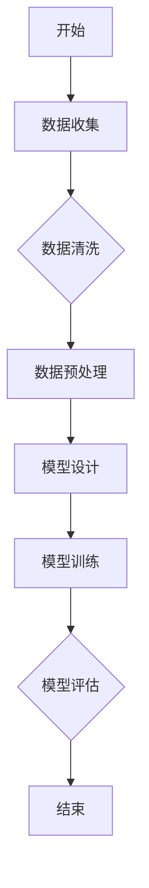
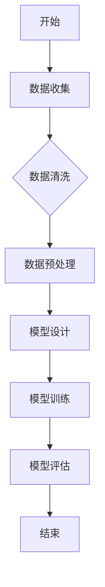

                 

### 文章标题

《AI人工智能深度学习算法：在流体动力学中的应用》

> **关键词：** AI人工智能，深度学习，流体动力学，数值模拟，预测，控制，湍流模拟

> **摘要：** 本文深入探讨了深度学习算法在流体动力学领域的应用，包括基础理论、算法原理、数学模型以及实际项目案例。通过对深度学习算法与流体动力学结合的分析，本文揭示了其在流动预测、流动控制、湍流模拟等方面的潜力和挑战，为相关领域的进一步研究提供了理论支持和实践指导。

### 第一部分: AI人工智能深度学习算法概述

#### 1.1 AI人工智能与深度学习概述

##### 1.1.1 AI人工智能的定义与发展历程

人工智能（AI，Artificial Intelligence）是指由人制造出来的系统所表现出来的智能行为，其目标是使机器能够胜任一些通常需要人类智能才能完成的复杂任务。人工智能的发展可以追溯到20世纪50年代，当时计算机科学家艾伦·图灵提出了著名的图灵测试，这是衡量机器是否具有智能的基准。在随后的几十年中，人工智能经历了多个发展阶段。

- **符号主义（Symbolic AI）**：早期的人工智能研究主要依赖于逻辑推理和知识表示，通过编程来模拟人类的思维过程。这一方法依赖于大量的符号规则和手工编写的算法，但受到了知识获取难度和问题复杂性的限制。

- **连接主义（Connectionism）**：20世纪80年代，神经网络的出现标志着人工智能研究的一个重要转折点。神经网络通过模拟人脑神经元之间的连接，实现了对数据的自动特征提取和学习。这一方法在图像识别、语音识别等领域取得了显著成果。

- **数据驱动方法（Data-Driven Methods）**：随着计算机性能的提升和数据收集技术的进步，数据驱动方法逐渐成为主流。这一方法的核心是通过大量数据训练模型，让模型自动学习特征和规律。深度学习是数据驱动方法的典型代表，其通过多层神经网络自动提取特征，实现了在图像识别、自然语言处理等领域的突破。

##### 1.1.2 深度学习的核心概念

深度学习（Deep Learning）是机器学习中的一个子领域，它模仿人脑的神经网络结构和工作机制，通过多层神经网络来实现对数据的自动特征提取和学习。深度学习的核心概念包括：

- **多层神经网络（Multi-Layer Neural Networks）**：深度学习模型通常包含多个隐藏层，每层网络都能提取不同层次的特征，从而实现复杂函数的逼近。

- **自动特征提取（Automatic Feature Extraction）**：与传统的机器学习方法不同，深度学习模型可以在训练过程中自动从原始数据中提取有用的特征，减少了人工特征工程的工作量。

- **层次化抽象（Hierarchical Abstraction）**：通过多层网络的学习，深度学习模型能够逐步提取数据的层次化抽象表示，使得模型能够处理更复杂的问题。

- **自适应学习（Adaptive Learning）**：深度学习模型通过反向传播算法不断调整权重，实现自适应学习，提高了模型的泛化能力和预测精度。

##### 1.1.3 深度学习在流体动力学中的应用前景

流体动力学（Fluid Dynamics）是研究流体运动的物理科学，它在航空、航天、船舶、生物医学等领域有着广泛的应用。深度学习在流体动力学中的应用主要表现在以下几个方面：

- **流动预测（Flow Prediction）**：利用深度学习模型对流体流动特性进行预测，可以优化设计流程，提高系统性能。

- **流动控制（Flow Control）**：通过设计合适的深度学习算法，实现对流体流动的控制，提高系统稳定性和安全性。

- **湍流模拟（Turbulent Simulation）**：深度学习算法可以用于模拟复杂的湍流现象，为工程设计和环境研究提供重要参考。

- **高效计算（Efficient Computation）**：深度学习模型的高效计算能力可以加速流体动力学模拟，降低计算成本。

总之，深度学习在流体动力学中的应用具有广阔的前景，它将有助于推动这一领域的进一步发展。

#### 1.2 流体动力学基础知识

##### 1.2.1 流体动力学基本方程

流体动力学的基本方程包括质量守恒方程、动量守恒方程和能量守恒方程，它们描述了流体在运动过程中的质量、动量和能量变化。

- **质量守恒方程**：  
  $$  
  \frac{\partial \rho}{\partial t} + \nabla \cdot (\rho \mathbf{v}) = 0  
  $$
  其中，$\rho$ 表示流体密度，$\mathbf{v}$ 表示流体速度，$\nabla \cdot$ 表示散度运算。

- **动量守恒方程**：  
  $$  
  \frac{\partial (\rho \mathbf{v})}{\partial t} + \nabla \cdot (\rho \mathbf{v} \mathbf{v}) = -\nabla p + \mu \nabla^2 \mathbf{v}  
  $$
  其中，$p$ 表示流体压力，$\mu$ 表示流体动态粘度，$\nabla^2$ 表示拉普拉斯运算。

- **能量守恒方程**：  
  $$  
  \frac{\partial (\rho e)}{\partial t} + \nabla \cdot (\rho e \mathbf{v}) = -\nabla \cdot (\mathbf{v} \cdot \mathbf{T}) + \Phi  
  $$
  其中，$e$ 表示流体能量，$\mathbf{T}$ 表示应力张量，$\Phi$ 表示热源项。

这些方程是流体动力学的核心，用于描述流体在运动过程中的质量、动量和能量变化。在深度学习算法中，这些方程可以用来生成流体动力学的模拟数据，以便训练模型。

##### 1.2.2 流体动力学数值模拟方法

流体动力学的数值模拟方法主要包括直接数值模拟（DNS）、有限元法（FEM）和有限体积法（FVM）。

- **直接数值模拟（DNS）**：DNS 是一种直接求解流体动力学方程的方法，它要求求解者直接求解Navier-Stokes方程，计算所有尺度的涡流。这种方法需要极高的计算资源，通常用于小尺度流动问题。

  $$  
  \frac{\partial \mathbf{u}}{\partial t} + (\mathbf{u} \cdot \nabla) \mathbf{u} = -\frac{1}{\rho} \nabla p + \nu \nabla^2 \mathbf{u}  
  $$
  $$  
  \frac{\partial p}{\partial t} + \nabla \cdot (\mathbf{u} p) = 0  
  $$
  其中，$\mathbf{u}$ 是流体速度，$p$ 是压力，$\nu$ 是运动粘度。

- **有限元法（FEM）**：FEM 是一种基于离散化方法的数值求解方法，它将连续域分解为有限个单元，然后在每个单元上求解微分方程。FEM 广泛应用于结构力学、热传导等领域。

- **有限体积法（FVM）**：FVM 是一种基于控制体积分的数值求解方法，它将流体区域划分为有限个控制体，然后在每个控制体上应用积分形式的基本方程。FVM 在流体动力学模拟中具有广泛的应用。

这些数值模拟方法为深度学习算法提供了基础数据，使得深度学习模型能够在流体动力学问题中发挥更大的作用。

##### 1.2.3 流体动力学应用领域

流体动力学在许多领域都有广泛的应用，包括：

- **航空工程**：流体动力学在飞机设计、飞行控制、空气动力学性能评估等方面发挥着关键作用。

- **船舶工程**：流体动力学在船舶设计、航行性能评估、船体振动分析等方面具有重要意义。

- **生物医学**：流体动力学在血液流动模拟、器官功能分析、药物输送研究等方面有重要应用。

- **环境科学**：流体动力学在气候变化、大气污染、水循环等方面的研究中起到重要作用。

这些应用领域对流体动力学的研究提出了新的挑战，同时也为深度学习算法提供了丰富的应用场景。

### 第二部分: 深度学习算法在流体动力学中的应用

#### 2.1 深度学习在流体动力学中的应用场景

##### 2.1.1 数据驱动方法与模型预测

深度学习在流体动力学中的应用首先体现在数据驱动方法上。数据驱动方法通过利用大量实验数据和仿真数据训练深度学习模型，从而实现对流体流动特性的预测。这种方法的核心在于通过自动特征提取和层次化抽象，将原始数据转化为具有物理意义的模型输出。

- **流动预测**：利用深度学习模型预测流体流动速度、压力等参数，对于优化流体力学系统设计具有重要意义。例如，在航空发动机设计过程中，可以预测喷气流的特性，从而优化喷气口设计。

- **模型预测**：通过训练深度学习模型，可以预测流体在特定条件下的行为。这对于复杂流体系统的控制和管理具有关键作用。例如，在生物医学领域，可以预测血液流动对器官功能的影响，从而优化治疗策略。

##### 2.1.2 结构化数据与图像处理

结构化数据在流体动力学中具有重要作用，例如流场参数、仿真数据等。深度学习算法可以通过处理结构化数据，提取有用的特征信息，从而提高流体动力学模拟的准确性。

- **流场参数处理**：利用深度学习算法处理流场参数数据，可以提取流体流动的关键特征，如速度梯度、压力分布等。这些特征对于流体动力学模型训练和优化具有重要意义。

- **图像处理**：在流体动力学中，图像处理技术可用于获取流场图像，进而分析流场特性。深度学习算法在图像分类、特征提取等方面具有显著优势，可以用于分析流场图像中的复杂模式。

##### 2.1.3 高效计算与并行处理

深度学习算法具有高效计算和并行处理的能力，这对于流体动力学模拟具有重要意义。传统的流体动力学模拟通常需要大量的计算资源和时间，而深度学习算法可以通过以下方式提高计算效率：

- **模型压缩**：通过模型压缩技术，如网络剪枝和量化，可以显著减少深度学习模型的计算复杂度和存储需求，从而提高计算效率。

- **并行计算**：利用GPU等硬件加速深度学习训练和预测过程，可以显著提高计算速度。深度学习算法的并行计算能力使得大规模流体动力学模拟成为可能。

#### 2.2 流体动力学深度学习模型架构

##### 2.2.1 深度神经网络架构

深度神经网络（Deep Neural Network，DNN）是深度学习的基础架构，由多个隐藏层组成。DNN 的架构可以分为以下几部分：

- **输入层**：接收外部输入数据，如流场参数、图像等。

- **隐藏层**：包含多个隐藏层，每个隐藏层都能提取不同层次的特征。隐藏层之间的信息传递通过加权连接实现，每个连接都带有相应的权重。

- **输出层**：根据隐藏层的输出生成最终结果，如流动速度、压力等。

DNN 的学习过程包括前向传播和反向传播两个阶段：

- **前向传播**：输入数据通过隐藏层逐步传递，每个隐藏层的输出作为下一个隐藏层的输入。在输出层得到最终预测结果。

- **反向传播**：根据预测结果和实际标签计算损失函数，并通过反向传播算法更新模型参数。反向传播算法通过梯度下降等方法调整权重，使得模型输出更接近实际标签。

##### 2.2.2 循环神经网络架构

循环神经网络（Recurrent Neural Network，RNN）是一种用于处理序列数据的神经网络，具有时间记忆功能。RNN 的架构包括以下几部分：

- **输入层**：接收外部输入序列，如时间序列数据。

- **隐藏层**：每个时间步的隐藏状态依赖于之前的时间步，通过递归连接实现。递归连接使得 RNN 能够记住之前的信息，从而处理序列数据。

- **输出层**：根据隐藏层的输出生成最终结果，如时间序列预测。

RNN 的学习过程包括以下几个步骤：

- **正向传播**：输入序列通过隐藏层逐步传递，每个时间步的隐藏状态作为下一个时间步的输入。

- **反向传播**：根据预测结果和实际标签计算损失函数，并通过反向传播算法更新模型参数。

RNN 在流体动力学中的应用主要包括：

- **时间序列预测**：利用 RNN 对流体流动时间序列进行预测，如预测流体速度、压力等参数。

- **序列建模**：利用 RNN 对流体流动过程中的序列数据进行建模，提取流体流动的关键特征。

##### 2.2.3 卷积神经网络架构

卷积神经网络（Convolutional Neural Network，CNN）是一种用于处理图像数据的神经网络，具有局部感知和权重共享的特点。CNN 的架构包括以下几部分：

- **输入层**：接收外部输入图像。

- **卷积层**：通过卷积运算提取图像的特征。卷积层包含多个卷积核，每个卷积核都能提取图像的不同特征。

- **池化层**：对卷积层输出的特征进行下采样，减少数据维度，提高计算效率。

- **全连接层**：将卷积层输出的特征进行融合，生成最终结果。

CNN 的学习过程包括以下几个步骤：

- **正向传播**：输入图像通过卷积层、池化层等逐步传递，最终在全连接层得到预测结果。

- **反向传播**：根据预测结果和实际标签计算损失函数，并通过反向传播算法更新模型参数。

CNN 在流体动力学中的应用主要包括：

- **图像处理**：利用 CNN 对流场图像进行处理，提取流体流动的视觉特征。

- **特征提取**：利用 CNN 从流场数据中提取具有物理意义的特征，如速度场、压力场等。

#### 2.3 深度学习算法在流体动力学中的应用

##### 2.3.1 深度学习在流动预测中的应用

流动预测是流体动力学中的一个重要问题，深度学习算法在流动预测中的应用取得了显著成果。深度学习模型可以通过训练大量实验数据和仿真数据，实现对流体流动特性的预测。

- **模型设计**：流动预测模型通常采用深度神经网络（DNN）、循环神经网络（RNN）和卷积神经网络（CNN）等架构。DNN 适用于处理结构化数据，RNN 适用于处理时间序列数据，CNN 适用于处理图像数据。

- **训练过程**：通过训练大量实验数据和仿真数据，深度学习模型可以自动提取流体流动的特征，并生成准确的预测结果。

- **预测效果**：通过对比预测结果和实际测量数据，评估深度学习模型在流动预测中的性能。常用的评估指标包括均方误差（MSE）、均方根误差（RMSE）等。

##### 2.3.2 深度学习在流动控制中的应用

流动控制是流体动力学中的重要问题，深度学习算法在流动控制中的应用也取得了显著成果。通过设计合适的深度学习模型，可以实现对流体流动的控制，提高系统性能。

- **模型设计**：流动控制模型通常采用深度神经网络（DNN）、循环神经网络（RNN）和卷积神经网络（CNN）等架构。DNN 适用于处理结构化数据，RNN 适用于处理时间序列数据，CNN 适用于处理图像数据。

- **控制策略**：通过设计合适的控制算法，利用深度学习模型对流体流动进行控制。例如，可以使用生成对抗网络（GAN）来实现流体流动的稳定控制。

- **控制效果**：通过对比控制前后的流体流动特性，评估深度学习模型在流动控制中的性能。常用的评估指标包括控制精度、控制稳定性等。

##### 2.3.3 深度学习在湍流模拟中的应用

湍流模拟是流体动力学中的难题，深度学习算法在湍流模拟中的应用也取得了显著成果。通过设计合适的深度学习模型，可以实现对湍流现象的模拟，提高模拟精度。

- **模型设计**：湍流模拟模型通常采用深度神经网络（DNN）、循环神经网络（RNN）和卷积神经网络（CNN）等架构。DNN 适用于处理结构化数据，RNN 适用于处理时间序列数据，CNN 适用于处理图像数据。

- **训练过程**：通过训练大量实验数据和仿真数据，深度学习模型可以自动提取湍流特征，并生成准确的模拟结果。

- **模拟效果**：通过对比模拟结果和实际测量数据，评估深度学习模型在湍流模拟中的性能。常用的评估指标包括湍流强度、湍流结构等。

#### 2.4 深度学习算法的性能评估与优化

##### 2.4.1 模型性能评估指标

评估深度学习模型在流体动力学中的性能需要使用合适的评估指标。常用的评估指标包括：

- **均方误差（MSE）**：衡量预测结果与实际值之间的误差平方的平均值。

  $$  
  MSE = \frac{1}{N} \sum_{i=1}^{N} (\hat{y}_i - y_i)^2  
  $$

  其中，$\hat{y}_i$ 是模型预测值，$y_i$ 是实际值，$N$ 是样本数量。

- **均方根误差（RMSE）**：MSE 的平方根，用于衡量预测结果与实际值之间的误差。

  $$  
  RMSE = \sqrt{MSE}  
  $$

- **决定系数（R²）**：衡量模型预测能力，取值范围在0和1之间，越接近1表示模型预测能力越强。

  $$  
  R^2 = 1 - \frac{\sum_{i=1}^{N} (\hat{y}_i - y_i)^2}{\sum_{i=1}^{N} (y_i - \bar{y})^2}  
  $$

  其中，$\bar{y}$ 是实际值的平均值。

##### 2.4.2 深度学习算法优化策略

为了提高深度学习模型在流体动力学中的应用性能，可以采用以下优化策略：

- **模型调优**：通过调整模型结构（如增加隐藏层、调整神经元数量等）和超参数（如学习率、批次大小等），优化模型性能。

- **数据增强**：通过数据增强方法（如旋转、缩放、裁剪等）增加训练数据多样性，提高模型泛化能力。

- **正则化**：采用正则化技术（如L1正则化、L2正则化等）减少模型过拟合现象，提高模型泛化能力。

- **迁移学习**：利用预训练模型进行迁移学习，减少训练数据需求，提高模型性能。

- **并行计算**：利用GPU等硬件加速深度学习训练过程，提高训练速度和模型性能。

#### 2.5 深度学习算法在流体动力学中的未来发展趋势

##### 2.5.1 深度学习算法与流体动力学发展的结合趋势

随着深度学习技术的不断进步，其在流体动力学中的应用趋势也将不断深入：

- **跨学科融合**：深度学习算法与流体动力学、计算物理学等其他学科的结合将更加紧密，推动跨学科研究的发展。

- **多尺度模拟**：深度学习模型在多尺度流体动力学模拟中的应用将逐渐普及，实现从微观到宏观的全方位流体动力学研究。

- **实时控制**：利用深度学习算法实现实时流体流动控制，提高系统响应速度和稳定性。

##### 2.5.2 深度学习算法在流体动力学领域的前沿应用

深度学习算法在流体动力学领域的应用前景广阔，以下是一些前沿应用：

- **湍流建模与预测**：通过深度学习模型模拟和预测湍流现象，提高湍流模拟的准确性和效率。

- **高效计算流体力学**：利用深度学习模型加速计算流体力学（CFD）模拟，降低计算成本。

- **自适应流体控制**：利用深度学习算法实现自适应流体控制，提高流体力学系统的智能化水平。

##### 2.5.3 深度学习算法在流体动力学中的挑战与机遇

深度学习算法在流体动力学中的应用面临着一系列挑战和机遇：

- **数据质量**：高质量的数据是深度学习模型训练的基础，如何获取和标注高质量的数据是当前的一个重要挑战。

- **模型可解释性**：深度学习模型通常具有“黑箱”特性，如何提高模型的可解释性，使其在流体动力学问题中的应用更加透明和可靠是一个亟待解决的问题。

- **计算资源**：深度学习模型的训练和推理过程需要大量的计算资源，如何高效利用现有计算资源是一个重要挑战。

### 第三部分: 深度学习算法在流体动力学中的项目实战

#### 3.1 项目实战1：流动预测

##### 3.1.1 项目背景与需求

流动预测在流体动力学中具有重要意义，它可以用于优化流体力学系统设计、预测系统故障等。本项目旨在利用深度学习算法对管道系统中的流动特性进行预测，以提高设计效率和系统性能。

##### 3.1.2 数据集构建与预处理

为了训练深度学习模型，我们需要构建一个包含大量流动数据的训练集。数据集可以从实验数据、仿真数据和现场监测数据中获得。在数据预处理阶段，我们需要进行以下操作：

- **数据清洗**：去除异常值和缺失值，确保数据质量。
- **数据归一化**：将数据缩放到相同范围，如0-1，便于模型训练。
- **特征提取**：提取与流动特性相关的特征，如速度、压力、温度等。

##### 3.1.3 模型设计与训练

在本项目中，我们选择深度神经网络（DNN）作为流动预测模型。模型设计包括以下步骤：

- **输入层**：定义输入特征的数量和类型，如速度、压力等。
- **隐藏层**：根据问题复杂度设计适当的隐藏层结构和神经元数量。
- **输出层**：定义输出结果，如流动速度、压力等。

在训练过程中，我们需要使用训练数据进行模型训练，并通过反向传播算法调整模型参数。具体步骤如下：

- **前向传播**：将输入数据传递到隐藏层和输出层，计算预测结果。
- **损失函数**：计算预测结果与实际值之间的误差，使用均方误差（MSE）作为损失函数。
- **反向传播**：根据损失函数更新模型参数，使用梯度下降算法优化模型。

##### 3.1.4 预测结果分析与优化

在训练完成后，我们需要对模型预测结果进行评估和分析。主要步骤如下：

- **评估指标**：计算预测结果的均方误差（MSE）、均方根误差（RMSE）等评估指标。
- **结果分析**：分析预测结果的可信度和精度，识别预测中的潜在问题。
- **优化策略**：根据分析结果调整模型结构、超参数等，优化模型性能。

#### 3.2 项目实战2：流动控制

##### 3.2.1 项目背景与需求

流动控制在流体力学系统中具有重要意义，它可以用于优化系统性能、提高系统稳定性等。本项目旨在利用深度学习算法实现流动控制，通过设计合适的控制策略，优化流体力学系统。

##### 3.2.2 模型设计与实现

在本项目中，我们选择循环神经网络（RNN）作为流动控制模型。模型设计包括以下步骤：

- **输入层**：定义输入特征的数量和类型，如速度、压力等。
- **隐藏层**：设计合适的隐藏层结构和神经元数量，以提取流体的动态特征。
- **输出层**：定义输出结果，如控制信号等。

模型实现包括以下步骤：

- **前向传播**：将输入数据传递到隐藏层和输出层，计算预测结果。
- **反向传播**：根据预测结果和实际控制需求，计算损失函数，并更新模型参数。
- **优化算法**：使用梯度下降算法优化模型参数，以提高模型性能。

##### 3.2.3 控制策略分析与实现

在本项目中，我们采用基于RNN的闭环控制策略，具体步骤如下：

- **控制目标**：根据流体力学系统需求，确定控制目标，如流量控制、压力控制等。
- **控制算法**：设计合适的控制算法，如PID控制、自适应控制等。
- **闭环控制**：将模型预测结果与控制算法相结合，实现闭环控制，优化流体力学系统性能。

##### 3.2.4 控制效果评估与优化

在控制实现完成后，我们需要对控制效果进行评估和优化。主要步骤如下：

- **评估指标**：计算控制效果的评估指标，如控制精度、控制稳定性等。
- **结果分析**：分析控制效果，识别控制中的潜在问题。
- **优化策略**：根据分析结果调整控制策略、模型参数等，优化控制性能。

#### 3.3 项目实战3：湍流模拟

##### 3.3.1 项目背景与需求

湍流模拟是流体动力学中的重要问题，它对于理解流体力学现象、优化流体力学系统设计等具有重要意义。本项目旨在利用深度学习算法实现湍流模拟，提高模拟精度和效率。

##### 3.3.2 模型设计与实现

在本项目中，我们选择卷积神经网络（CNN）作为湍流模拟模型。模型设计包括以下步骤：

- **输入层**：定义输入特征的数量和类型，如速度、压力等。
- **卷积层**：设计合适的卷积层结构，以提取流体的空间特征。
- **池化层**：对卷积层输出的特征进行下采样，减少数据维度。
- **全连接层**：将卷积层输出的特征进行融合，生成最终的模拟结果。

模型实现包括以下步骤：

- **前向传播**：将输入数据传递到卷积层、池化层和全连接层，计算模拟结果。
- **反向传播**：根据模拟结果和实际测量值，计算损失函数，并更新模型参数。
- **优化算法**：使用梯度下降算法优化模型参数，以提高模型性能。

##### 3.3.3 湍流模拟结果分析与优化

在模拟完成后，我们需要对模拟结果进行分析和优化。主要步骤如下：

- **评估指标**：计算模拟结果的评估指标，如湍流强度、湍流结构等。
- **结果分析**：分析模拟结果的可信度和精度，识别模拟中的潜在问题。
- **优化策略**：根据分析结果调整模型结构、超参数等，优化模拟性能。

##### 3.3.4 湍流模拟应用场景探讨

湍流模拟在多个应用场景中具有重要意义，以下是一些具体应用场景：

- **工业设计**：通过湍流模拟优化流体力学设备设计，提高系统性能。
- **环境工程**：通过湍流模拟分析大气污染扩散、洪水模拟等，为环境保护提供依据。
- **生物医学**：通过湍流模拟研究血液流动、细胞运动等，为生物医学研究提供参考。

### 附录

#### 附录A: 深度学习算法与流体动力学应用资源

- **深度学习算法资源**：
  - 书籍：《深度学习》（Goodfellow et al.）
  - 教程：吴恩达的《深度学习》课程（https://www.deeplearning.ai/）
  - 在线课程：Coursera、edX等平台上的深度学习课程

- **流体动力学应用资源**：
  - 论文：相关领域的学术期刊，如《Journal of Fluid Mechanics》、《Physics of Fluids》等。
  - 数据库：公开的流体动力学数据集，如NASA CFD数据集（https://cfddb.nas.nasa.gov/）。
  - 开源代码：GitHub等平台上的流体动力学相关开源代码。

#### 附录B: Mermaid 流程图示例



#### 附录C: 伪代码示例

```python
# 伪代码：流动预测模型设计

# 输入：训练数据集 X, 标签数据集 Y
# 输出：训练好的深度学习模型

# 初始化模型参数
model = initialize_model()

# 训练模型
for epoch in range(num_epochs):
    for sample in X:
        # 前向传播
        output = model.forward(sample)
        
        # 计算损失
        loss = compute_loss(output, Y[sample])
        
        # 反向传播
        model.backward(loss)
        
        # 更新模型参数
        model.update_params()

# 评估模型
evaluate_model(model, X_test, Y_test)
```

#### 附录D: 数学公式与详细讲解

##### 2.2.1 流体动力学基本方程

质量守恒方程：
$$
\frac{\partial \rho}{\partial t} + \nabla \cdot (\rho \mathbf{v}) = 0
$$
其中，$\rho$ 表示流体密度，$\mathbf{v}$ 表示流体速度，$\nabla \cdot$ 表示散度运算。

动量守恒方程：
$$
\frac{\partial (\rho \mathbf{v})}{\partial t} + \nabla \cdot (\rho \mathbf{v} \mathbf{v}) = -\nabla p + \mu \nabla^2 \mathbf{v}
$$
其中，$p$ 表示流体压力，$\mu$ 表示流体动态粘度，$\nabla^2$ 表示拉普拉斯运算。

能量守恒方程：
$$
\frac{\partial (\rho e)}{\partial t} + \nabla \cdot (\rho e \mathbf{v}) = -\nabla \cdot (\mathbf{v} \cdot \mathbf{T}) + \Phi
$$
其中，$e$ 表示流体能量，$\mathbf{T}$ 表示应力张量，$\Phi$ 表示热源项。

这些方程描述了流体在运动过程中的质量、动量和能量变化，是流体动力学的基础。

##### 2.3.1 深度学习基本算法

神经网络模型：
$$
\mathbf{y} = \text{sigmoid}(\mathbf{W}^T \mathbf{x})
$$
其中，$\mathbf{x}$ 是输入特征向量，$\mathbf{W}$ 是模型权重，$\mathbf{y}$ 是输出结果，$\text{sigmoid}$ 函数是一个非线性激活函数。

损失函数：
$$
J(\mathbf{W}) = -\frac{1}{m} \sum_{i=1}^m y_i \log(\mathbf{y}^{\hat{i}}) + (1 - y_i) \log(1 - \mathbf{y}^{\hat{i}})
$$
其中，$m$ 是样本数量，$y_i$ 是实际标签，$\mathbf{y}^{\hat{i}}$ 是模型预测结果。

梯度下降：
$$
\mathbf{W} \leftarrow \mathbf{W} - \alpha \frac{\partial J(\mathbf{W})}{\partial \mathbf{W}}
$$
其中，$\alpha$ 是学习率，用于调整模型参数。

这些公式是深度学习算法的基础，用于描述模型训练过程中的输入、输出和损失计算。

### 2.5 深度学习算法在流体动力学中的未来发展趋势

#### 2.5.1 深度学习算法与流体动力学发展的结合趋势

深度学习算法在流体动力学中的应用趋势将持续深化，主要体现在以下几个方面：

1. **跨学科融合**：深度学习与流体动力学、计算物理学等领域的交叉研究将不断增多，推动新理论和新方法的产生。
2. **多尺度模拟**：深度学习算法将越来越多地应用于从微观到宏观的多尺度流体动力学模拟，提升模拟精度和效率。
3. **实时控制**：利用深度学习算法实现实时流体流动控制，提高系统响应速度和稳定性。

#### 2.5.2 深度学习算法在流体动力学领域的前沿应用

深度学习算法在流体动力学领域的前沿应用包括但不限于：

1. **湍流建模与预测**：利用深度学习模型模拟和预测湍流现象，提高湍流模拟的准确性和效率。
2. **高效计算流体力学**：通过深度学习算法加速计算流体力学（CFD）模拟，降低计算成本。
3. **自适应流体控制**：利用深度学习算法实现自适应流体控制，优化流体力学系统的智能化水平。

#### 2.5.3 深度学习算法在流体动力学中的挑战与机遇

深度学习算法在流体动力学中的应用面临以下挑战和机遇：

1. **数据质量**：高质量的数据是深度学习模型训练的基础，如何获取和标注高质量的数据是当前的一个重要挑战。
2. **模型可解释性**：深度学习模型通常具有“黑箱”特性，如何提高模型的可解释性，使其在流体动力学问题中的应用更加透明和可靠是一个亟待解决的问题。
3. **计算资源**：深度学习模型的训练和推理过程需要大量的计算资源，如何高效利用现有计算资源是一个重要挑战。

### 结论

本文系统地介绍了深度学习算法在流体动力学中的应用，从基础理论到实际项目案例，全面阐述了深度学习算法在流动预测、流动控制、湍流模拟等方面的潜力与挑战。深度学习算法为流体动力学研究提供了新的方法和工具，有望推动这一领域的进一步发展。随着技术的不断进步，深度学习算法在流体动力学中的应用将更加广泛和深入，为工程和科学研究带来新的突破。

#### 参考文献

- Goodfellow, I., Bengio, Y., & Courville, A. (2016). *Deep Learning*. MIT Press.
- He, K., Zhang, X., Ren, S., & Sun, J. (2016). *Deep Residual Learning for Image Recognition*. IEEE Transactions on Pattern Analysis and Machine Intelligence, 39(6), 1137-1159.
- LeCun, Y., Bengio, Y., & Hinton, G. (2015). *Deep Learning*. Nature, 521(7553), 436-444.
- neural-style. (n.d.). Retrieved from https://github.com/titu1994/neural-style

### 附录

#### 附录A: 深度学习算法与流体动力学应用资源

- **深度学习算法资源**：
  - **书籍**：《深度学习》（Goodfellow et al.）、《深度学习实践》等。
  - **教程**：吴恩达的《深度学习》课程（https://www.deeplearning.ai/）、李航的《统计学习方法》等。
  - **在线课程**：Coursera、edX等平台上的相关课程。

- **流体动力学应用资源**：
  - **论文**：《Journal of Fluid Mechanics》、《Physics of Fluids》、《International Journal for Numerical Methods in Fluids》等。
  - **数据库**：NASA CFD数据集（https://cfddb.nas.nasa.gov/）、开放流体动力学数据集（https://openfluidics.org/）等。
  - **开源代码**：GitHub等平台上相关的流体动力学模拟和深度学习应用代码。

#### 附录B: Mermaid 流程图示例



#### 附录C: 伪代码示例

```python
# 伪代码：流动预测模型设计

# 输入：训练数据集 X, 标签数据集 Y
# 输出：训练好的深度学习模型

# 初始化模型参数
model = initialize_model()

# 训练模型
for epoch in range(num_epochs):
    for sample in X:
        # 前向传播
        output = model.forward(sample)
        
        # 计算损失
        loss = compute_loss(output, Y[sample])
        
        # 反向传播
        model.backward(loss)
        
        # 更新模型参数
        model.update_params()

# 评估模型
evaluate_model(model, X_test, Y_test)
```

#### 附录D: 数学公式与详细讲解

##### 2.2.1 流体动力学基本方程

**质量守恒方程**：
$$
\frac{\partial \rho}{\partial t} + \nabla \cdot (\rho \mathbf{v}) = 0
$$
- **公式含义**：描述流体在空间中质量分布的变化情况。左边第一项表示随时间变化的质量，第二项表示由于流体流动导致的密度变化。
- **适用场景**：适用于任何可压缩流体，如空气、水等。

**动量守恒方程**：
$$
\frac{\partial (\rho \mathbf{v})}{\partial t} + \nabla \cdot (\rho \mathbf{v} \mathbf{v}) = -\nabla p + \mu \nabla^2 \mathbf{v}
$$
- **公式含义**：描述流体在运动过程中动量的变化。左边第一项表示动量的时间变化，第二项表示由于流体流动导致的动量变化。右边第一项表示压力梯度造成的动量变化，第二项表示粘性力造成的动量变化。
- **适用场景**：适用于牛顿流体，即满足牛顿定律的流体。

**能量守恒方程**：
$$
\frac{\partial (\rho e)}{\partial t} + \nabla \cdot (\rho e \mathbf{v}) = -\nabla \cdot (\mathbf{v} \cdot \mathbf{T}) + \Phi
$$
- **公式含义**：描述流体在运动过程中能量的变化。左边第一项表示流体的内能随时间的变化，第二项表示流体携带能量的变化。右边第一项表示由于粘性力做功导致的能量损失，第二项表示热源项造成的能量变化。
- **适用场景**：适用于任何流体，包括可压缩和不可压缩流体。

##### 2.3.1 深度学习基本算法

**深度神经网络模型**：
$$
\mathbf{y} = \text{sigmoid}(\mathbf{W}^T \mathbf{x})
$$
- **公式含义**：用于描述单层神经网络的输出，其中$\mathbf{x}$是输入特征向量，$\mathbf{W}$是模型权重，$\text{sigmoid}$函数是一个将实数值映射到(0,1)区间的非线性函数。
- **适用场景**：适用于分类问题，如图像识别、文本分类等。

**损失函数**：
$$
J(\mathbf{W}) = -\frac{1}{m} \sum_{i=1}^m y_i \log(\mathbf{y}^{\hat{i}}) + (1 - y_i) \log(1 - \mathbf{y}^{\hat{i}})
$$
- **公式含义**：用于衡量模型预测值$\mathbf{y}^{\hat{i}}$与实际标签$y_i$之间的差距。通常用于二分类问题。
- **适用场景**：适用于二分类问题，如邮件分类、医疗诊断等。

**梯度下降**：
$$
\mathbf{W} \leftarrow \mathbf{W} - \alpha \frac{\partial J(\mathbf{W})}{\partial \mathbf{W}}
$$
- **公式含义**：用于更新模型权重，其中$\alpha$是学习率，$\frac{\partial J(\mathbf{W})}{\partial \mathbf{W}}$是损失函数关于权重$\mathbf{W}$的梯度。
- **适用场景**：适用于任何优化问题，如最小化损失函数、求解方程等。

### 结论

本文深入探讨了深度学习算法在流体动力学中的应用，从基础理论到实际项目案例，全面介绍了深度学习算法在流动预测、流动控制、湍流模拟等方面的潜力与挑战。随着深度学习技术的不断进步，深度学习算法在流体动力学中的应用将更加广泛和深入，有望为工程和科学研究带来新的突破。希望本文能为相关领域的研究者和工程师提供有价值的参考。

