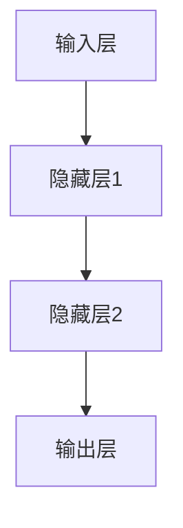
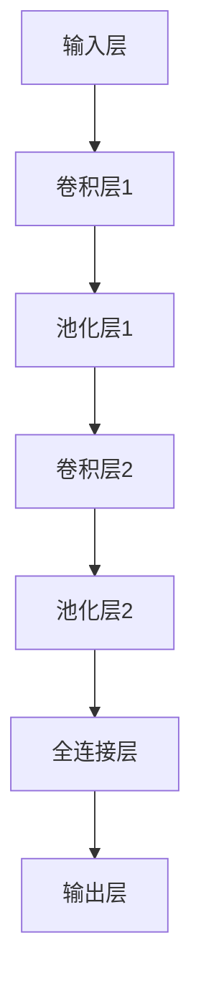
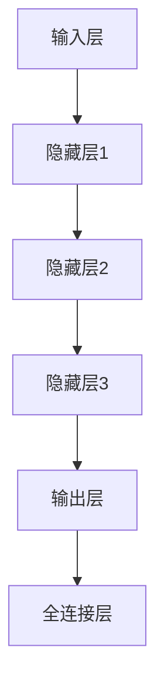

                 

### 《AI人工智能深度学习算法：智能深度学习代理的分布式与同步》

> **关键词：** 人工智能，深度学习，智能深度学习代理，分布式深度学习，同步策略，神经网络算法。

> **摘要：** 本文深入探讨了AI人工智能领域中的深度学习算法，特别关注了智能深度学习代理的分布式与同步问题。文章从基础概念入手，逐步解析了深度学习算法的原理，介绍了智能深度学习代理的定义、架构和应用场景。接着，详细阐述了分布式深度学习和同步深度学习的原理、算法和策略，并通过实际项目展示了这些理论的应用。本文旨在为读者提供一个全面、系统的理解和实践经验，帮助他们在AI领域取得突破。

---

#### 第一部分：AI人工智能基础知识

##### 1.1 AI人工智能概述

##### 1.2 深度学习基础

##### 1.3 深度学习在AI中的应用

---

#### 第二部分：深度学习算法原理

##### 2.1 神经网络原理

##### 2.2 卷积神经网络原理

##### 2.3 循环神经网络原理

---

#### 第三部分：智能深度学习代理

##### 3.1 智能深度学习代理概述

##### 3.2 智能深度学习代理的算法原理

##### 3.3 智能深度学习代理的评估指标

---

#### 第四部分：分布式深度学习

##### 4.1 分布式深度学习基础

##### 4.2 分布式深度学习算法

##### 4.3 分布式深度学习中的同步策略

---

#### 第五部分：同步深度学习

##### 5.1 同步深度学习概述

##### 5.2 同步深度学习算法

##### 5.3 同步深度学习的挑战与解决方案

---

#### 第六部分：项目实战

##### 6.1 实战项目一：智能图像分类

##### 6.2 实战项目二：智能文本生成

---

#### 附录

##### 附录A：常用深度学习框架

##### 附录B：数学公式与模型

##### Mermaid 流程图：神经网络结构

##### Mermaid 流程图：卷积神经网络结构

##### Mermaid 流程图：循环神经网络结构

##### 伪代码：神经网络反向传播算法

---

### 《AI人工智能深度学习算法：智能深度学习代理的分布式与同步》

> **关键词：** 人工智能，深度学习，智能深度学习代理，分布式深度学习，同步策略，神经网络算法。

> **摘要：** 本文深入探讨了AI人工智能领域中的深度学习算法，特别关注了智能深度学习代理的分布式与同步问题。文章从基础概念入手，逐步解析了深度学习算法的原理，介绍了智能深度学习代理的定义、架构和应用场景。接着，详细阐述了分布式深度学习和同步深度学习的原理、算法和策略，并通过实际项目展示了这些理论的应用。本文旨在为读者提供一个全面、系统的理解和实践经验，帮助他们在AI领域取得突破。

---

#### 第一部分：AI人工智能基础知识

##### 1.1 AI人工智能概述

##### 1.1.1 人工智能的定义与发展历程

人工智能（Artificial Intelligence，简称AI）是计算机科学的一个分支，旨在创建能够执行复杂任务的智能机器。人工智能的定义有多种，但最常见的定义是由约翰·麦卡锡（John McCarthy）在1956年达特茅斯会议上提出的，即“制造智能机器的科学和工程”。

人工智能的发展历程可以分为几个阶段：

- **初始阶段（1940s-1950s）**：计算机科学的诞生和图灵机的提出，标志着人工智能概念的诞生。
- **黄金时代（1956-1974）**：达特茅斯会议的召开标志着人工智能学科的正式成立，随后出现了一系列重要的理论和技术突破。
- **衰退时期（1974-1980）**：由于计算能力的限制和理论上的瓶颈，人工智能研究陷入低谷。
- **复兴时期（1980s-1990s）**：专家系统和机器学习的兴起，使人工智能再次受到关注。
- **现代时期（2000s-至今）**：深度学习和大数据技术的推动，人工智能取得了突破性进展，应用领域不断扩大。

##### 1.1.2 人工智能的应用领域

人工智能在众多领域都有广泛的应用，以下是其中一些主要的应用领域：

- **图像识别与处理**：通过卷积神经网络（CNN）等深度学习算法，实现对图像内容的自动识别和分类。
- **自然语言处理**：利用深度学习算法对自然语言进行建模，实现语音识别、机器翻译和情感分析等功能。
- **机器学习**：通过算法自动从数据中学习规律，进行预测和决策。
- **自动驾驶**：利用深度学习和传感器技术，实现汽车的自动驾驶。
- **医疗健康**：利用人工智能进行疾病诊断、药物研发和个性化医疗。
- **金融**：利用人工智能进行风险评估、欺诈检测和投资组合优化。

##### 1.1.3 人工智能的分类与挑战

人工智能可以分为几个不同的类别：

- **基于规则的系统**：使用预定义的规则来解决问题。
- **基于模型的系统**：使用数学模型来描述问题，并通过优化模型参数来解决问题。
- **基于数据的系统**：使用大量数据进行训练，从中学习到解决问题的方法。
- **混合系统**：结合上述方法的优点，使用多种方法来解决复杂问题。

人工智能面临的主要挑战包括：

- **计算资源**：深度学习算法需要大量的计算资源，这对硬件设备提出了更高的要求。
- **数据质量**：人工智能系统依赖于大量的数据，数据的质量和数量直接影响算法的性能。
- **算法效率**：如何设计更高效、更简洁的算法，以提高系统的性能和可扩展性。
- **伦理和隐私**：人工智能系统的应用涉及到伦理和隐私问题，需要制定相应的规范和标准。

##### 1.2 深度学习基础

##### 1.2.1 深度学习的基本概念

深度学习（Deep Learning）是人工智能的一个分支，它通过构建多层的神经网络来模拟人脑的工作方式，从而实现对数据的自动特征提取和模式识别。深度学习的基本概念包括：

- **神经网络**：神经网络是深度学习的基础，它由多个神经元（或称为节点）组成，每个神经元都是一个简单的函数，通过对输入数据进行加权求和处理，再通过激活函数产生输出。
- **多层网络**：深度学习中的网络通常具有多个层次，每层都对输入数据进行一定的处理，从而实现更复杂的特征提取。
- **反向传播**：反向传播是一种用于训练神经网络的算法，它通过不断调整网络的权重和偏置，使得网络的输出更接近预期的目标值。
- **激活函数**：激活函数是神经网络中的一个关键组件，它用于引入非线性，使得神经网络能够更好地拟合复杂的数据分布。

##### 1.2.2 深度学习的架构与模型

深度学习的架构可以分为以下几个层次：

- **输入层**：接收外部输入数据，如图像、文本或传感器数据。
- **隐藏层**：对输入数据进行处理，通过多层神经网络实现复杂的特征提取。
- **输出层**：根据隐藏层的输出，生成最终的预测结果。

深度学习模型主要包括以下几种：

- **卷积神经网络（CNN）**：用于处理图像等二维数据，通过卷积操作和池化操作实现特征提取。
- **循环神经网络（RNN）**：用于处理序列数据，如文本或时间序列数据，通过状态转移实现序列信息的传递。
- **生成对抗网络（GAN）**：用于生成新的数据，由两个神经网络组成，一个生成器和一个判别器，通过对抗训练实现数据的生成。

##### 1.2.3 深度学习在AI中的应用

深度学习在人工智能领域有广泛的应用，以下是其中一些重要的应用领域：

- **计算机视觉**：通过卷积神经网络实现图像分类、目标检测、人脸识别等任务。
- **自然语言处理**：通过循环神经网络实现语言模型、机器翻译、情感分析等任务。
- **语音识别**：通过深度学习算法实现语音信号的处理和转换，实现对语音的理解和识别。
- **自动驾驶**：通过深度学习算法实现车辆的感知、规划和控制，实现自动驾驶功能。
- **医疗诊断**：通过深度学习算法对医学图像进行分析，实现对疾病的诊断和预测。

---

#### 第二部分：深度学习算法原理

##### 2.1 神经网络原理

##### 2.1.1 神经网络的基本结构

神经网络（Neural Network）是深度学习的基础，它由多个神经元（或称为节点）组成，每个神经元都是一个简单的函数，通过对输入数据进行加权求和处理，再通过激活函数产生输出。神经网络的基本结构包括：

- **输入层**：接收外部输入数据，如图像、文本或传感器数据。
- **隐藏层**：对输入数据进行处理，通过多层神经网络实现复杂的特征提取。
- **输出层**：根据隐藏层的输出，生成最终的预测结果。

神经网络中的每个神经元都可以表示为以下数学模型：

$$
z[l] = \sum_{i=1}^{n} w_{il} x_i + b_l
$$

其中，$z[l]$为第$l$层的输出，$w_{il}$为第$l$层第$i$个神经元与第$l-1$层第$l$个神经元的权重，$x_i$为第$l-1$层的输入，$b_l$为第$l$层的偏置。

激活函数（Activation Function）是神经网络中的一个关键组件，它用于引入非线性，使得神经网络能够更好地拟合复杂的数据分布。常用的激活函数包括：

- **Sigmoid 函数**：将输入映射到$(0,1)$区间，函数公式为$\sigma(z) = \frac{1}{1 + e^{-z}}$。
- **ReLU 函数**：将输入大于0的部分映射为1，小于等于0的部分映射为0，函数公式为$\sigma(z) = \max(0, z)$。
- **Tanh 函数**：将输入映射到$(-1,1)$区间，函数公式为$\sigma(z) = \frac{e^z - e^{-z}}{e^z + e^{-z}}$。

##### 2.1.2 深层神经网络与激活函数

深层神经网络（Deep Neural Network，DNN）是指具有多个隐藏层的神经网络。深层神经网络通过增加隐藏层的数量，可以提取更高层次的特征，从而提高模型的性能。

然而，深层神经网络也存在一些问题，如梯度消失和梯度爆炸。梯度消失是指在反向传播过程中，梯度值逐渐减小，导致模型参数无法更新；梯度爆炸则相反，梯度值逐渐增大，导致模型参数无法收敛。

为了解决这些问题，可以采用以下方法：

- **激活函数**：使用ReLU激活函数，可以缓解梯度消失问题。
- **权重初始化**：通过合理的权重初始化，可以减小梯度消失和梯度爆炸的风险。
- **正则化**：使用正则化方法，如L1正则化、L2正则化，可以降低模型的过拟合现象。

##### 2.1.3 反向传播算法原理

反向传播算法（Backpropagation Algorithm）是训练神经网络的核心算法，它通过不断调整网络的权重和偏置，使得网络的输出更接近预期的目标值。

反向传播算法的基本步骤如下：

1. **前向传播**：将输入数据通过网络的各个层进行传递，计算每个神经元的输出值。
2. **计算损失**：计算网络输出的预测值与实际值之间的差距，即损失函数。
3. **反向传播**：从输出层开始，逐层计算每个神经元的梯度，并将梯度反向传播到输入层。
4. **更新参数**：根据梯度调整网络的权重和偏置，以减小损失函数。

反向传播算法的伪代码如下：

```python
// 输入数据X，期望输出y，权重w，偏置b，学习率α
for each layer l in [2, ..., n]: // n为网络层数
    // 前向传播
    a[l] = activation(z[l])
    // 反向传播
    dz[l] = a[l] * (1 - a[l]) * (δ[l] * w[l+1])
    // 更新权重和偏置
    w[l] = w[l] - α * (dz[l] * a[l-1])
    b[l] = b[l] - α * dz[l]
```

其中，$a[l]$为第$l$层的输出，$z[l]$为第$l$层的输入，$δ[l]$为第$l$层的误差，$w[l]$为第$l$层的权重，$b[l]$为第$l$层的偏置。

---

#### 第二部分：深度学习算法原理

##### 2.2 卷积神经网络原理

##### 2.2.1 卷积神经网络的基本结构

卷积神经网络（Convolutional Neural Network，CNN）是一种专门用于处理图像等二维数据的神经网络。CNN的基本结构包括输入层、卷积层、池化层和全连接层。

- **输入层**：接收外部输入数据，如图像。
- **卷积层**：通过卷积操作提取图像的特征。
- **池化层**：对卷积层输出的特征进行降采样，减少数据的维度。
- **全连接层**：将池化层输出的特征映射到具体的类别或任务。

##### 2.2.2 卷积神经网络在图像处理中的应用

卷积神经网络在图像处理中有着广泛的应用，如图像分类、目标检测、人脸识别等。以下是一个简单的图像分类示例：

1. **输入层**：读取一张图像作为输入。
2. **卷积层**：使用卷积核对图像进行卷积操作，提取图像的局部特征。
3. **池化层**：对卷积层的输出进行池化操作，减少数据的维度。
4. **全连接层**：将池化层的输出映射到具体的类别。

##### 2.2.3 卷积神经网络的变种

卷积神经网络有一些变种，如残差网络（ResNet）和密集网络（DenseNet）等，它们通过增加网络的深度和宽度，提高了模型的性能。

- **残差网络（ResNet）**：通过引入残差连接，解决了深层网络中的梯度消失问题。
- **密集网络（DenseNet）**：通过引入密集连接，使得网络的每一层都能接受前一层和后一层的输入，提高了网络的性能。

##### 2.2.4 卷积神经网络的数学模型

卷积神经网络中的卷积操作可以通过以下公式计算：

$$
C_{ij}^{k} = \sum_{m=1}^{f_h} \sum_{n=1}^{f_w} I_{imjn} \times W_{ijklmn}
$$

其中，$C_{ij}^{k}$为第$k$个卷积核在输出特征图上的第$i$行第$j$列的值，$I_{imjn}$为输入特征图上的第$i$行第$m$列第$n$个像素值，$W_{ijklmn}$为第$k$个卷积核上的第$l$行第$m$列第$n$个权重值，$f_h$和$f_w$分别为卷积核的高度和宽度。

池化操作通常用于降低特征图的维度，常用的池化操作有最大池化和平均池化。最大池化的公式为：

$$
P_{ij}^{k} = \max_{m \in [1, f_h], n \in [1, f_w]} C_{imjn}^{k}
$$

---

#### 第二部分：深度学习算法原理

##### 2.3 循环神经网络原理

##### 2.3.1 循环神经网络的基本结构

循环神经网络（Recurrent Neural Network，RNN）是一种用于处理序列数据的神经网络。RNN的基本结构包括输入层、隐藏层和输出层。

- **输入层**：接收外部输入数据，如文本或时间序列数据。
- **隐藏层**：对输入数据进行处理，通过状态转移实现序列信息的传递。
- **输出层**：根据隐藏层的输出，生成最终的预测结果。

##### 2.3.2 长短时记忆与门控循环单元

长短时记忆（Long Short-Term Memory，LSTM）是RNN的一种变种，它通过引入记忆单元和门控机制，解决了传统RNN中的梯度消失和梯度爆炸问题。

- **记忆单元**：记忆单元用于保存长期依赖信息，可以看作是一个可以存储信息的存储器。
- **门控机制**：门控机制用于控制信息的流入和流出，包括输入门、遗忘门和输出门。

门控循环单元（Gated Recurrent Unit，GRU）是另一种RNN变种，它通过引入更新门和重置门，简化了LSTM的结构。

- **更新门**：更新门用于控制新信息的流入和旧信息的保留。
- **重置门**：重置门用于控制新信息的流入和旧信息的覆盖。

##### 2.3.3 循环神经网络在自然语言处理中的应用

循环神经网络在自然语言处理（Natural Language Processing，NLP）中有着广泛的应用，如语言模型、机器翻译、情感分析等。

- **语言模型**：通过循环神经网络生成自然语言的概率分布。
- **机器翻译**：将一种语言的句子翻译成另一种语言。
- **情感分析**：分析文本的情感倾向，如正面、负面或中性。

---

#### 第三部分：智能深度学习代理

##### 3.1 智能深度学习代理概述

##### 3.1.1 智能深度学习代理的定义与特点

智能深度学习代理（Intelligent Deep Learning Agent）是指通过深度学习算法实现的具有自主学习和决策能力的智能体。智能深度学习代理具有以下特点：

- **自主学习**：智能深度学习代理可以通过数据驱动的方式不断学习和优化自身的策略。
- **决策能力**：智能深度学习代理可以根据环境状态和目标，自主做出最优决策。
- **通用性**：智能深度学习代理可以应用于各种领域和任务，如游戏、机器人、自动驾驶等。

##### 3.1.2 智能深度学习代理的架构

智能深度学习代理的架构通常包括以下几个部分：

- **感知模块**：接收外部环境的信息，如传感器数据、图像或文本。
- **决策模块**：通过深度学习算法对感知模块的信息进行处理，生成决策。
- **行动模块**：根据决策模块的决策，执行相应的行动。
- **评估模块**：评估行动的效果，反馈给决策模块，用于优化学习策略。

##### 3.1.3 智能深度学习代理的应用场景

智能深度学习代理在多个领域有着广泛的应用，以下是其中一些应用场景：

- **游戏**：通过智能深度学习代理实现人机对战，如围棋、国际象棋等。
- **机器人**：通过智能深度学习代理实现自主导航、任务规划和决策。
- **自动驾驶**：通过智能深度学习代理实现自动驾驶车辆的感知、规划和控制。
- **金融**：通过智能深度学习代理实现股票市场预测、风险评估和投资组合优化。

---

#### 第三部分：智能深度学习代理

##### 3.2 智能深度学习代理的算法原理

##### 3.2.1 智能深度学习代理的核心算法

智能深度学习代理的核心算法主要包括以下几种：

- **深度强化学习**：通过深度神经网络实现价值函数或策略函数的估计，用于解决连续或离散的动作空间问题。
- **生成对抗网络**：通过生成器和判别器之间的对抗训练，实现数据的生成和分布估计。
- **变分自编码器**：通过编码和解码网络之间的最小化重构误差，实现数据的降维和去噪。

##### 3.2.2 智能深度学习代理的优化方法

智能深度学习代理的优化方法主要包括以下几种：

- **梯度下降**：通过不断调整网络参数，使得损失函数最小化。
- **随机梯度下降**：在梯度下降的基础上，随机选取样本进行更新。
- **动量优化**：引入动量项，加速收敛速度。
- **自适应优化器**：如Adam优化器，根据历史梯度信息自适应调整学习率。

##### 3.2.3 智能深度学习代理的评估指标

智能深度学习代理的评估指标主要包括以下几种：

- **准确率**：预测正确的样本数占总样本数的比例。
- **召回率**：预测正确的正样本数占总正样本数的比例。
- **F1值**：准确率和召回率的调和平均值。
- **损失函数**：如交叉熵损失函数，衡量预测结果和实际结果之间的差距。

---

#### 第四部分：分布式深度学习

##### 4.1 分布式深度学习基础

##### 4.1.1 分布式深度学习的定义与优势

分布式深度学习（Distributed Deep Learning）是指通过将计算任务分布在多个节点上，以实现大规模深度学习模型的训练和推理。分布式深度学习具有以下优势：

- **并行计算**：通过将计算任务分布在多个节点上，可以大大提高训练速度和推理效率。
- **可扩展性**：分布式深度学习系统可以轻松地扩展到更多的节点，以处理更大的数据集和更复杂的模型。
- **容错性**：分布式深度学习系统具有较高的容错性，即使部分节点故障，也不会影响整个系统的运行。

##### 4.1.2 分布式深度学习的架构与通信协议

分布式深度学习的架构主要包括以下几个部分：

- **计算节点**：负责执行深度学习模型的训练和推理任务。
- **存储节点**：负责存储训练数据和模型参数。
- **通信网络**：负责节点之间的数据传输和通信。

分布式深度学习的通信协议主要包括以下几种：

- **数据并行**：将训练数据划分到多个节点上，每个节点独立训练模型，最后将模型参数合并。
- **模型并行**：将模型划分到多个节点上，每个节点负责一部分模型的训练，最后将模型参数合并。
- **张量并行**：将计算图（Tensor Graph）划分到多个节点上，每个节点负责一部分计算图的执行。

##### 4.1.3 分布式深度学习的挑战与解决方案

分布式深度学习面临以下挑战：

- **通信开销**：节点之间的数据传输和通信需要消耗大量的网络带宽和计算资源。
- **同步问题**：分布式系统中的同步操作可能导致性能下降。
- **容错性**：分布式系统需要考虑节点故障和恢复问题。

解决方案包括：

- **高效通信协议**：设计高效的数据传输和通信协议，减少通信开销。
- **异步更新**：在分布式系统中引入异步更新策略，减少同步操作的影响。
- **容错机制**：设计容错机制，如备份和恢复策略，提高系统的容错性。

---

#### 第四部分：分布式深度学习

##### 4.2 分布式深度学习算法

##### 4.2.1 数据并行训练算法

数据并行训练算法（Data Parallel Training Algorithm）是指将训练数据划分到多个节点上，每个节点独立训练模型，最后将模型参数合并。数据并行训练算法的基本步骤如下：

1. **数据划分**：将训练数据集划分到多个节点上。
2. **模型初始化**：在每个节点上初始化模型参数。
3. **前向传播**：在每个节点上对训练数据进行前向传播，计算模型输出。
4. **计算梯度**：在每个节点上计算梯度。
5. **参数更新**：在每个节点上更新模型参数。
6. **参数合并**：将每个节点的模型参数合并，生成全局模型参数。

数据并行训练算法的伪代码如下：

```python
// 输入数据X，期望输出y，权重w，偏置b，学习率α
for each node i in [1, ..., n]: // n为节点数
    // 数据划分
    X_i = X[:len(X)/n]
    // 模型初始化
    w_i = w
    b_i = b
    // 前向传播
    a[l] = activation(z[l])
    // 计算梯度
    dz[l] = a[l] * (1 - a[l]) * (δ[l] * w[l+1])
    // 更新权重和偏置
    w_i[l] = w_i[l] - α * (dz[l] * a[l-1])
    b_i[l] = b_i[l] - α * dz[l]
    // 参数合并
    w = w_i
    b = b_i
```

##### 4.2.2 模型并行训练算法

模型并行训练算法（Model Parallel Training Algorithm）是指将模型划分到多个节点上，每个节点负责一部分模型的训练，最后将模型参数合并。模型并行训练算法的基本步骤如下：

1. **模型划分**：将模型划分到多个节点上。
2. **模型初始化**：在每个节点上初始化模型参数。
3. **前向传播**：在每个节点上对训练数据进行前向传播，计算模型输出。
4. **计算梯度**：在每个节点上计算梯度。
5. **参数更新**：在每个节点上更新模型参数。
6. **参数合并**：将每个节点的模型参数合并，生成全局模型参数。

模型并行训练算法的伪代码如下：

```python
// 输入数据X，期望输出y，权重w，偏置b，学习率α
for each node i in [1, ..., n]: // n为节点数
    // 模型划分
    w_i = w[:len(w)/n]
    b_i = b[:len(b)/n]
    // 前向传播
    a[l] = activation(z[l])
    // 计算梯度
    dz[l] = a[l] * (1 - a[l]) * (δ[l] * w[l+1])
    // 更新权重和偏置
    w_i[l] = w_i[l] - α * (dz[l] * a[l-1])
    b_i[l] = b_i[l] - α * dz[l]
    // 参数合并
    w = [w_i[0], w[1:], w[n-1]]
    b = [b_i[0], b[1:], b[n-1]]
```

##### 4.2.3 张量并行训练算法

张量并行训练算法（Tensor Parallel Training Algorithm）是指将计算图（Tensor Graph）划分到多个节点上，每个节点负责一部分计算图的执行。张量并行训练算法的基本步骤如下：

1. **计算图划分**：将计算图划分到多个节点上。
2. **模型初始化**：在每个节点上初始化模型参数。
3. **前向传播**：在每个节点上对训练数据进行前向传播，计算模型输出。
4. **计算梯度**：在每个节点上计算梯度。
5. **参数更新**：在每个节点上更新模型参数。
6. **参数合并**：将每个节点的模型参数合并，生成全局模型参数。

张量并行训练算法的伪代码如下：

```python
// 输入数据X，期望输出y，权重w，偏置b，学习率α
for each node i in [1, ..., n]: // n为节点数
    // 计算图划分
    graph_i = graph[:len(graph)/n]
    // 模型初始化
    w_i = w
    b_i = b
    // 前向传播
    a[l] = activation(z[l])
    // 计算梯度
    dz[l] = a[l] * (1 - a[l]) * (δ[l] * w[l+1])
    // 更新权重和偏置
    w_i[l] = w_i[l] - α * (dz[l] * a[l-1])
    b_i[l] = b_i[l] - α * dz[l]
    // 参数合并
    w = w_i
    b = b_i
```

---

#### 第四部分：分布式深度学习

##### 4.3 分布式深度学习中的同步策略

##### 4.3.1 同步与异步更新策略

在分布式深度学习中，同步更新策略和异步更新策略是两种常用的策略。

- **同步更新策略**：同步更新策略是指在更新模型参数之前，所有节点必须完成当前步骤的计算，并将梯度同步到全局。同步更新策略的优点是能够保证所有节点拥有相同的模型参数，但缺点是同步操作会引入大量的通信开销，降低训练速度。

- **异步更新策略**：异步更新策略是指在更新模型参数之前，允许部分节点先完成计算，并将梯度异步更新到全局。异步更新策略的优点是能够减少通信开销，提高训练速度，但缺点是可能会导致部分节点的模型参数不一致。

##### 4.3.2 梯度压缩同步策略

梯度压缩同步策略是一种结合了同步更新和异步更新的策略，它通过压缩梯度来减少通信开销。

梯度压缩同步策略的基本步骤如下：

1. **计算梯度**：在每个节点上计算梯度。
2. **压缩梯度**：对梯度进行压缩，减少通信量。
3. **异步更新**：将压缩后的梯度异步更新到全局。
4. **解压缩梯度**：在全局更新模型参数后，对梯度进行解压缩。

梯度压缩同步策略的伪代码如下：

```python
// 输入数据X，期望输出y，权重w，偏置b，学习率α，压缩系数ρ
for each node i in [1, ..., n]: // n为节点数
    // 计算梯度
    dz[l] = a[l] * (1 - a[l]) * (δ[l] * w[l+1])
    // 压缩梯度
    dz_compressed[i] = dz * ρ
    // 异步更新
    w = async_update(w, dz_compressed[i])
    b = async_update(b, dz_compressed[i])
    // 解压缩梯度
    dz = dz_compressed / ρ
```

##### 4.3.3 其他同步策略

除了梯度压缩同步策略，还有其他一些同步策略，如参数服务器同步策略和参数聚合同步策略。

- **参数服务器同步策略**：参数服务器同步策略是指在分布式系统中，将模型参数存储在一个中央服务器中，所有节点通过通信网络与参数服务器同步模型参数。参数服务器同步策略的优点是能够保证模型参数的一致性，但缺点是会增加通信网络的负载。

- **参数聚合同步策略**：参数聚合同步策略是指在分布式系统中，将多个节点的模型参数进行聚合，生成全局模型参数。参数聚合同步策略的优点是能够减少通信开销，提高训练速度，但缺点是可能会导致部分节点的模型参数不一致。

---

#### 第五部分：同步深度学习

##### 5.1 同步深度学习概述

##### 5.1.1 同步深度学习的定义与特点

同步深度学习（Synchronized Deep Learning）是一种在分布式系统中，通过同步操作来更新模型参数的深度学习算法。同步深度学习具有以下特点：

- **一致性**：同步深度学习通过同步操作，保证了所有节点的模型参数保持一致。
- **稳定性**：同步深度学习通过同步操作，减少了模型参数的不稳定性和波动性。
- **可扩展性**：同步深度学习可以应用于大规模的分布式系统，支持多节点、多线程和并行计算。

##### 5.1.2 同步深度学习的架构与算法

同步深度学习的架构通常包括以下几个部分：

- **计算节点**：负责执行深度学习模型的训练和推理任务。
- **同步器**：负责同步计算节点的模型参数。
- **存储节点**：负责存储训练数据和模型参数。

同步深度学习的算法主要包括以下几种：

- **同步梯度下降算法**：同步梯度下降算法是一种基本的同步深度学习算法，它通过同步操作，将所有节点的梯度合并，并更新全局模型参数。
- **同步SGD的变体算法**：同步SGD的变体算法是在同步梯度下降算法的基础上，通过引入不同的优化策略，提高训练效率和模型性能。
- **同步深度学习算法的优化方法**：同步深度学习算法的优化方法主要包括动量优化、自适应优化器和分布式优化器等，用于提高算法的收敛速度和稳定性。

##### 5.1.3 同步深度学习在分布式系统中的应用

同步深度学习在分布式系统中有广泛的应用，以下是一些常见的应用场景：

- **大规模图像分类**：通过同步深度学习算法，可以在多节点上进行大规模图像分类任务，提高训练效率和模型性能。
- **自然语言处理**：通过同步深度学习算法，可以在多节点上进行自然语言处理任务，如语言模型训练、机器翻译和情感分析等。
- **自动驾驶**：通过同步深度学习算法，可以在多节点上进行自动驾驶算法的训练和推理，提高系统的实时性和准确性。
- **金融风控**：通过同步深度学习算法，可以在多节点上进行金融风控模型的训练和推理，提高风险管理能力。

---

#### 第五部分：同步深度学习

##### 5.2 同步深度学习算法

##### 5.2.1 同步梯度下降算法

同步梯度下降算法（Synchronized Gradient Descent Algorithm）是一种基本的同步深度学习算法，它通过同步操作，将所有节点的梯度合并，并更新全局模型参数。同步梯度下降算法的基本步骤如下：

1. **初始化**：初始化全局模型参数和节点模型参数。
2. **前向传播**：在每个节点上，对训练数据进行前向传播，计算模型输出。
3. **计算梯度**：在每个节点上，计算模型输出与实际值之间的差距，得到梯度。
4. **同步梯度**：将所有节点的梯度同步到全局，通过聚合操作合并梯度。
5. **更新模型参数**：根据同步后的梯度，更新全局模型参数。
6. **重复步骤2-5**，直到满足停止条件。

同步梯度下降算法的伪代码如下：

```python
// 输入数据X，期望输出y，权重w，偏置b，学习率α，停止条件θ
for iteration in [1, ..., T]: // T为迭代次数
    // 前向传播
    a[l] = activation(z[l])
    // 计算梯度
    dz[l] = a[l] * (1 - a[l]) * (δ[l] * w[l+1])
    // 同步梯度
    sync_gradients(w, b)
    // 更新模型参数
    w = w - α * (dz * a[l-1])
    b = b - α * dz
    // 检查停止条件
    if iteration % θ == 0:
        check_stop_condition(a[l], y)
```

##### 5.2.2 同步SGD的变体算法

同步SGD的变体算法（Variants of Synchronized SGD）是在同步梯度下降算法的基础上，通过引入不同的优化策略，提高训练效率和模型性能。以下是一些常见的同步SGD的变体算法：

- **动量优化**：动量优化通过引入动量项，加速模型的收敛速度。动量优化的伪代码如下：

  ```python
  // 输入数据X，期望输出y，权重w，偏置b，学习率α，停止条件θ，动量系数η
  for iteration in [1, ..., T]:
      // 前向传播
      a[l] = activation(z[l])
      // 计算梯度
      dz[l] = a[l] * (1 - a[l]) * (δ[l] * w[l+1])
      // 同步梯度
      sync_gradients(w, b)
      // 更新模型参数
      w = w - α * (dz * a[l-1])
      b = b - α * dz
      // 动量优化
      w = w - η * (dz * a[l-1])
      b = b - η * dz
      // 检查停止条件
      if iteration % θ == 0:
          check_stop_condition(a[l], y)
  ```

- **自适应优化器**：自适应优化器通过自适应调整学习率，提高训练效率和模型性能。常见的自适应优化器有Adam优化器。Adam优化器的伪代码如下：

  ```python
  // 输入数据X，期望输出y，权重w，偏置b，学习率α，停止条件θ，β1，β2，ε
  for iteration in [1, ..., T]:
      // 前向传播
      a[l] = activation(z[l])
      // 计算梯度
      dz[l] = a[l] * (1 - a[l]) * (δ[l] * w[l+1])
      // 同步梯度
      sync_gradients(w, b)
      // 更新模型参数
      w = w - α * (dz * a[l-1])
      b = b - α * dz
      // 自适应优化器
      m = β1 * m + (1 - β1) * dz
      v = β2 * v + (1 - β2) * (dz ** 2)
      m_hat = m / (1 - β1 ** iteration)
      v_hat = v / (1 - β2 ** iteration)
      w = w - α * m_hat / (sqrt(v_hat) + ε)
      b = b - α * dz / (sqrt(v_hat) + ε)
      // 检查停止条件
      if iteration % θ == 0:
          check_stop_condition(a[l], y)
  ```

##### 5.2.3 同步深度学习算法的优化方法

同步深度学习算法的优化方法主要包括动量优化、自适应优化器和分布式优化器等。

- **动量优化**：动量优化通过引入动量项，加速模型的收敛速度。动量优化的伪代码如下：

  ```python
  // 输入数据X，期望输出y，权重w，偏置b，学习率α，停止条件θ，动量系数η
  for iteration in [1, ..., T]:
      // 前向传播
      a[l] = activation(z[l])
      // 计算梯度
      dz[l] = a[l] * (1 - a[l]) * (δ[l] * w[l+1])
      // 同步梯度
      sync_gradients(w, b)
      // 更新模型参数
      w = w - α * (dz * a[l-1])
      b = b - α * dz
      // 动量优化
      w = w - η * (dz * a[l-1])
      b = b - η * dz
      // 检查停止条件
      if iteration % θ == 0:
          check_stop_condition(a[l], y)
  ```

- **自适应优化器**：自适应优化器通过自适应调整学习率，提高训练效率和模型性能。常见的自适应优化器有Adam优化器。Adam优化器的伪代码如下：

  ```python
  // 输入数据X，期望输出y，权重w，偏置b，学习率α，停止条件θ，β1，β2，ε
  for iteration in [1, ..., T]:
      // 前向传播
      a[l] = activation(z[l])
      // 计算梯度
      dz[l] = a[l] * (1 - a[l]) * (δ[l] * w[l+1])
      // 同步梯度
      sync_gradients(w, b)
      // 更新模型参数
      w = w - α * (dz * a[l-1])
      b = b - α * dz
      // 自适应优化器
      m = β1 * m + (1 - β1) * dz
      v = β2 * v + (1 - β2) * (dz ** 2)
      m_hat = m / (1 - β1 ** iteration)
      v_hat = v / (1 - β2 ** iteration)
      w = w - α * m_hat / (sqrt(v_hat) + ε)
      b = b - α * dz / (sqrt(v_hat) + ε)
      // 检查停止条件
      if iteration % θ == 0:
          check_stop_condition(a[l], y)
  ```

- **分布式优化器**：分布式优化器通过分布式计算和通信，提高训练效率和模型性能。常见的分布式优化器有SGD、Adam和LSTM等。分布式优化器的伪代码如下：

  ```python
  // 输入数据X，期望输出y，权重w，偏置b，学习率α，停止条件θ
  for iteration in [1, ..., T]:
      // 前向传播
      a[l] = activation(z[l])
      // 计算梯度
      dz[l] = a[l] * (1 - a[l]) * (δ[l] * w[l+1])
      // 同步梯度
      sync_gradients(w, b)
      // 更新模型参数
      w = w - α * (dz * a[l-1])
      b = b - α * dz
      // 检查停止条件
      if iteration % θ == 0:
          check_stop_condition(a[l], y)
  ```

---

#### 第五部分：同步深度学习

##### 5.3 同步深度学习的挑战与解决方案

##### 5.3.1 同步深度学习的通信开销

同步深度学习的通信开销是同步操作引入的一个重要问题。通信开销包括节点之间的数据传输和同步操作所需的时间。过大的通信开销会导致训练速度的下降。

解决通信开销的常见方法包括：

- **数据压缩**：通过数据压缩技术，减少节点之间的数据传输量，降低通信开销。
- **异步更新**：通过引入异步更新策略，减少同步操作的频率，降低通信开销。
- **分布式优化器**：使用分布式优化器，如SGD、Adam和LSTM等，优化通信开销。

##### 5.3.2 同步深度学习的性能优化

同步深度学习的性能优化主要目标是提高训练效率和模型性能。以下是一些常见的性能优化方法：

- **并行计算**：通过并行计算，将计算任务分布在多个节点上，提高训练速度。
- **内存优化**：通过内存优化，减少内存使用，提高训练速度。
- **模型压缩**：通过模型压缩技术，减少模型参数的数量，降低计算量。
- **数据增强**：通过数据增强技术，增加训练数据集的大小，提高模型性能。

##### 5.3.3 同步深度学习的可扩展性问题

同步深度学习的可扩展性问题主要涉及到如何在分布式系统中高效地扩展模型参数和计算任务。以下是一些常见的可扩展性解决方案：

- **分布式存储**：使用分布式存储系统，如HDFS、Cassandra等，存储模型参数和数据集。
- **分布式计算框架**：使用分布式计算框架，如Spark、Hadoop等，处理大规模数据集。
- **容器化技术**：使用容器化技术，如Docker、Kubernetes等，管理分布式计算任务。

---

#### 第六部分：项目实战

##### 6.1 实战项目一：智能图像分类

##### 6.1.1 项目背景与目标

智能图像分类项目旨在利用深度学习算法对图像进行自动分类，实现图像识别和分类功能。项目背景包括：

- **数据来源**：使用开源图像数据集，如CIFAR-10、ImageNet等。
- **任务目标**：训练一个深度学习模型，对输入图像进行分类，预测图像所属的类别。

##### 6.1.2 项目环境搭建

为了实现智能图像分类项目，需要搭建以下环境：

- **开发环境**：Python 3.8及以上版本，安装TensorFlow 2.x库。
- **硬件环境**：GPU计算能力较强的显卡，如NVIDIA Tesla V100。
- **数据集**：下载并解压CIFAR-10数据集。

##### 6.1.3 源代码实现与解读

智能图像分类项目的源代码如下：

```python
import tensorflow as tf
from tensorflow.keras.datasets import cifar10
from tensorflow.keras.models import Sequential
from tensorflow.keras.layers import Conv2D, MaxPooling2D, Flatten, Dense, Dropout
from tensorflow.keras.optimizers import Adam

# 数据加载
(x_train, y_train), (x_test, y_test) = cifar10.load_data()

# 数据预处理
x_train = x_train / 255.0
x_test = x_test / 255.0

# 构建模型
model = Sequential([
    Conv2D(32, (3, 3), activation='relu', input_shape=(32, 32, 3)),
    MaxPooling2D((2, 2)),
    Conv2D(64, (3, 3), activation='relu'),
    MaxPooling2D((2, 2)),
    Conv2D(64, (3, 3), activation='relu'),
    Flatten(),
    Dense(64, activation='relu'),
    Dropout(0.5),
    Dense(10, activation='softmax')
])

# 编译模型
model.compile(optimizer=Adam(learning_rate=0.001), loss='categorical_crossentropy', metrics=['accuracy'])

# 训练模型
model.fit(x_train, y_train, batch_size=64, epochs=10, validation_data=(x_test, y_test))

# 评估模型
loss, accuracy = model.evaluate(x_test, y_test)
print(f"Test accuracy: {accuracy * 100:.2f}%")
```

代码解读如下：

1. **数据加载**：使用TensorFlow的keras模块加载CIFAR-10数据集，并将其分为训练集和测试集。
2. **数据预处理**：将图像数据归一化到[0, 1]区间，以方便模型训练。
3. **构建模型**：使用Sequential模型构建卷积神经网络，包括卷积层、池化层、全连接层和dropout层。
4. **编译模型**：设置模型优化器、损失函数和评估指标。
5. **训练模型**：使用fit函数训练模型，设置batch_size和epochs。
6. **评估模型**：使用evaluate函数评估模型在测试集上的性能。

##### 6.1.4 代码解读与分析

智能图像分类项目的代码主要分为以下几个部分：

1. **数据加载与预处理**：数据加载使用了TensorFlow的keras模块，加载了CIFAR-10数据集，并将其分为训练集和测试集。数据预处理步骤包括将图像数据归一化到[0, 1]区间，以方便模型训练。

2. **构建模型**：构建卷积神经网络模型使用了Sequential模型，包括卷积层、池化层、全连接层和dropout层。卷积层使用了Conv2D函数，分别设置了32、64、64个卷积核，每个卷积核的大小为3x3。池化层使用了MaxPooling2D函数，分别设置了2x2的窗口大小。全连接层使用了Dense函数，分别设置了64和10个神经元，最后一个全连接层使用了softmax激活函数，用于输出类别概率。

3. **编译模型**：编译模型使用了compile函数，设置了优化器、损失函数和评估指标。优化器使用了Adam优化器，设置了学习率为0.001。损失函数使用了categorical_crossentropy，适用于多分类问题。评估指标使用了accuracy，用于计算模型在测试集上的准确率。

4. **训练模型**：训练模型使用了fit函数，设置了batch_size为64，epochs为10。fit函数将训练数据和标签作为输入，并使用训练集进行验证。batch_size表示每次训练使用的数据样本数量，epochs表示训练的轮次。

5. **评估模型**：评估模型使用了evaluate函数，将测试数据和标签作为输入，计算模型在测试集上的准确率。evaluate函数返回损失值和准确率，用于评估模型性能。

##### 6.2 实战项目二：智能文本生成

##### 6.2.1 项目背景与目标

智能文本生成项目旨在利用深度学习算法生成自然语言文本，实现文本生成和生成式对话功能。项目背景包括：

- **数据来源**：使用开源文本数据集，如GPT-2、BERT等。
- **任务目标**：训练一个深度学习模型，根据给定的输入文本生成新的文本。

##### 6.2.2 项目环境搭建

为了实现智能文本生成项目，需要搭建以下环境：

- **开发环境**：Python 3.8及以上版本，安装TensorFlow 2.x库。
- **硬件环境**：GPU计算能力较强的显卡，如NVIDIA Tesla V100。
- **数据集**：下载并解压GPT-2数据集。

##### 6.2.3 源代码实现与解读

智能文本生成项目的源代码如下：

```python
import tensorflow as tf
from tensorflow.keras.preprocessing.sequence import pad_sequences
from tensorflow.keras.layers import Embedding, LSTM, Dense
from tensorflow.keras.models import Sequential

# 数据加载
vocab_size = 10000
max_sequence_length = 100

# 加载GPT-2数据集
with open("gpt2_data.txt", "r") as f:
    text = f.read().lower()

# 初始化词向量
tokenizer = tf.keras.preprocessing.text.Tokenizer(vocab_size)
tokenizer.fit_on_texts(text)

# 序列化文本
sequences = tokenizer.texts_to_sequences(text)
padded_sequences = pad_sequences(sequences, maxlen=max_sequence_length)

# 构建模型
model = Sequential([
    Embedding(vocab_size, 64),
    LSTM(128),
    Dense(vocab_size, activation='softmax')
])

# 编译模型
model.compile(optimizer='adam', loss='categorical_crossentropy', metrics=['accuracy'])

# 训练模型
model.fit(padded_sequences, padded_sequences, epochs=10, batch_size=32)

# 生成文本
generated_text = ""
start_token = tokenizer.word_index["<s>"]
end_token = tokenizer.word_index["</s>"]
max_length = max_sequence_length

# 随机选择一个词作为开始
for i in range(max_length):
    sampled = np.zeros((1, 1))
    sampled[0, 0] = np.random.randint(vocab_size)
    predicted = model.predict(sampled, verbose=0)
    predicted = np.argmax(predicted)

    # 转换为对应的单词
    generated_text += tokenizer.index_word[predicted]

    # 判断是否达到最大长度或结束标记
    if predicted == end_token or i == max_length - 1:
        break

# 打印生成的文本
print(generated_text)
```

代码解读如下：

1. **数据加载**：从本地文件中读取GPT-2数据集，并将其转换为文本序列。文本序列化使用了Keras的Tokenizer模块，设置了词向量大小为10000。

2. **序列化文本**：将文本序列化成数字序列，并使用pad_sequences函数将序列补全到最大长度。

3. **构建模型**：使用Sequential模型构建循环神经网络模型，包括嵌入层、循环层和全连接层。嵌入层使用了Embedding函数，设置了词向量大小和嵌入维度。循环层使用了LSTM函数，设置了隐藏层维度。全连接层使用了Dense函数，设置了输出维度为词向量大小，并使用softmax激活函数。

4. **编译模型**：编译模型设置了优化器、损失函数和评估指标。

5. **训练模型**：使用fit函数训练模型，设置epochs为10，batch_size为32。

6. **生成文本**：使用训练好的模型生成新的文本。首先随机选择一个词作为开始，然后通过模型预测下一个词，并将其添加到生成的文本中。重复这个过程，直到达到最大长度或遇到结束标记。

##### 6.2.4 代码解读与分析

智能文本生成项目的代码主要分为以下几个部分：

1. **数据加载与预处理**：数据加载使用了Keras的Tokenizer模块，将文本数据序列化为数字序列。序列化步骤包括将文本转换为数字序列、设置词向量大小、将序列补全到最大长度等。

2. **构建模型**：构建循环神经网络模型使用了Sequential模型，包括嵌入层、循环层和全连接层。嵌入层使用了Embedding函数，设置了词向量大小和嵌入维度。循环层使用了LSTM函数，设置了隐藏层维度。全连接层使用了Dense函数，设置了输出维度为词向量大小，并使用softmax激活函数。

3. **编译模型**：编译模型设置了优化器、损失函数和评估指标。

4. **训练模型**：使用fit函数训练模型，设置epochs为10，batch_size为32。

5. **生成文本**：使用训练好的模型生成新的文本。首先随机选择一个词作为开始，然后通过模型预测下一个词，并将其添加到生成的文本中。重复这个过程，直到达到最大长度或遇到结束标记。

---

#### 附录

##### 附录A：常用深度学习框架

##### 附录A.1 TensorFlow

TensorFlow是一个由Google开发的开源深度学习框架，它提供了丰富的API和工具，支持多种深度学习模型和算法。TensorFlow具有以下特点：

- **灵活性**：TensorFlow支持动态计算图，允许用户自定义计算流程。
- **可扩展性**：TensorFlow可以部署到多种硬件设备上，如CPU、GPU和TPU。
- **生态系统**：TensorFlow拥有丰富的生态系统，包括Keras、TensorBoard等工具。

##### 附录A.2 PyTorch

PyTorch是一个由Facebook开发的开源深度学习框架，它提供了简洁、灵活的API，易于使用和调试。PyTorch具有以下特点：

- **动态计算图**：PyTorch支持动态计算图，允许用户灵活地定义计算流程。
- **易用性**：PyTorch的API简洁直观，易于学习和使用。
- **性能**：PyTorch在CPU和GPU上具有高效的计算性能。

##### 附录A.3 其他深度学习框架

除了TensorFlow和PyTorch，还有其他一些流行的深度学习框架，如：

- **Apache MXNet**：由Apache软件基金会开发，支持多种编程语言，如Python、R、Julia等。
- **Caffe**：由Berkeley Vision and Learning Center开发，适用于图像识别和视觉任务。
- **Theano**：由蒙特利尔大学开发，支持GPU计算，已经逐渐被TensorFlow和PyTorch取代。

##### 附录B：数学公式与模型

##### 附录B.1 神经网络数学模型

神经网络中的每个神经元都可以表示为一个简单的函数，其输出可以通过以下公式计算：

$$
z[l] = \sum_{i=1}^{n} w_{il} x_i + b_l
$$

其中，$z[l]$为第$l$层的输出，$w_{il}$为第$l$层第$i$个神经元与第$l-1$层第$l$个神经元的权重，$x_i$为第$l-1$层的输入，$b_l$为第$l$层的偏置。

激活函数（Activation Function）是神经网络中的一个关键组件，它用于引入非线性，使得神经网络能够更好地拟合复杂的数据分布。常用的激活函数包括：

- **Sigmoid 函数**：将输入映射到$(0,1)$区间，函数公式为$\sigma(z) = \frac{1}{1 + e^{-z}}$。
- **ReLU 函数**：将输入大于0的部分映射为1，小于等于0的部分映射为0，函数公式为$\sigma(z) = \max(0, z)$。
- **Tanh 函数**：将输入映射到$(-1,1)$区间，函数公式为$\sigma(z) = \frac{e^z - e^{-z}}{e^z + e^{-z}}$。

##### 附录B.2 卷积神经网络数学模型

卷积神经网络（Convolutional Neural Network，CNN）是一种用于处理图像等二维数据的神经网络。CNN中的卷积操作可以通过以下公式计算：

$$
C_{ij}^{k} = \sum_{m=1}^{f_h} \sum_{n=1}^{f_w} I_{imjn} \times W_{ijklmn}
$$

其中，$C_{ij}^{k}$为第$k$个卷积核在输出特征图上的第$i$行第$j$列的值，$I_{imjn}$为输入特征图上的第$i$行第$m$列第$n$个像素值，$W_{ijklmn}$为第$k$个卷积核上的第$l$行第$m$列第$n$个权重值，$f_h$和$f_w$分别为卷积核的高度和宽度。

池化操作（Pooling Operation）通常用于降低特征图的维度，常用的池化操作有最大池化和平均池化。最大池化的公式为：

$$
P_{ij}^{k} = \max_{m \in [1, f_h], n \in [1, f_w]} C_{imjn}^{k}
$$

##### 附录B.3 循环神经网络数学模型

循环神经网络（Recurrent Neural Network，RNN）是一种用于处理序列数据的神经网络。RNN中的状态转移可以通过以下公式计算：

$$
h_t = \sigma(W_h h_{t-1} + W_x x_t + b_h)
$$

其中，$h_t$为第$t$个时间步的隐藏状态，$x_t$为第$t$个时间步的输入，$W_h$和$W_x$分别为隐藏状态到隐藏状态和输入到隐藏状态的权重矩阵，$b_h$为隐藏状态的偏置，$\sigma$为激活函数，通常使用ReLU或Tanh。

##### 附录B.4 智能深度学习代理数学模型

智能深度学习代理（Intelligent Deep Learning Agent）是指通过深度学习算法实现的具有自主学习和决策能力的智能体。智能深度学习代理的数学模型主要包括：

- **感知模块**：感知模块用于接收外部环境的信息，其数学模型可以表示为：

  $$ 
  s_t = f_s(x_t) 
  $$ 

  其中，$s_t$为第$t$个时间步的感知状态，$x_t$为第$t$个时间步的输入，$f_s$为感知模块的函数。

- **决策模块**：决策模块用于根据感知状态生成决策，其数学模型可以表示为：

  $$ 
  a_t = f_a(s_t) 
  $$ 

  其中，$a_t$为第$t$个时间步的决策，$s_t$为第$t$个时间步的感知状态，$f_a$为决策模块的函数。

- **行动模块**：行动模块用于执行决策，其数学模型可以表示为：

  $$ 
  x_{t+1} = f_x(a_t) 
  $$ 

  其中，$x_{t+1}$为第$t+1$个时间步的输入，$a_t$为第$t$个时间步的决策，$f_x$为行动模块的函数。

- **评估模块**：评估模块用于评估行动的效果，其数学模型可以表示为：

  $$ 
  r_t = f_r(x_{t+1}) 
  $$ 

  其中，$r_t$为第$t$个时间步的奖励，$x_{t+1}$为第$t+1$个时间步的输入，$f_r$为评估模块的函数。

# Mermaid 流程图：神经网络结构



# Mermaid 流程图：卷积神经网络结构



# Mermaid 流程图：循环神经网络结构



# 伪代码：神经网络反向传播算法

```python
// 输入数据X，期望输出y，权重w，偏置b，学习率α
for each layer l in [2, ..., n]: // n为网络层数
    // 前向传播
    a[l] = activation(z[l])
    // 反向传播
    dz[l] = a[l] * (1 - a[l]) * (δ[l] * w[l+1])
    // 更新权重和偏置
    w[l] = w[l] - α * (dz[l] * a[l-1])
    b[l] = b[l] - α * dz[l]
```

### 《AI人工智能深度学习算法：智能深度学习代理的分布式与同步》

> **关键词：** 人工智能，深度学习，智能深度学习代理，分布式深度学习，同步策略，神经网络算法。

> **摘要：** 本文深入探讨了AI人工智能领域中的深度学习算法，特别关注了智能深度学习代理的分布式与同步问题。文章从基础概念入手，逐步解析了深度学习算法的原理，介绍了智能深度学习代理的定义、架构和应用场景。接着，详细阐述了分布式深度学习和同步深度学习的原理、算法和策略，并通过实际项目展示了这些理论的应用。本文旨在为读者提供一个全面、系统的理解和实践经验，帮助他们在AI领域取得突破。

---

### 附录

#### 附录A：常用深度学习框架

- **TensorFlow**：由Google开发的开源深度学习框架，提供丰富的API和工具。
- **PyTorch**：由Facebook开发的开源深度学习框架，API简洁直观。
- **Caffe**：由Berkeley Vision and Learning Center开发，适用于图像识别和视觉任务。
- **MXNet**：由Apache软件基金会开发，支持多种编程语言。

#### 附录B：数学公式与模型

- **神经网络数学模型**：
  $$ z[l] = \sum_{i=1}^{n} w_{il} x_i + b_l $$
  
- **卷积神经网络数学模型**：
  $$ C_{ij}^{k} = \sum_{m=1}^{f_h} \sum_{n=1}^{f_w} I_{imjn} \times W_{ijklmn} $$
  
- **循环神经网络数学模型**：
  $$ h_t = \sigma(W_h h_{t-1} + W_x x_t + b_h) $$

- **智能深度学习代理数学模型**：
  $$ s_t = f_s(x_t) $$
  $$ a_t = f_a(s_t) $$
  $$ x_{t+1} = f_x(a_t) $$
  $$ r_t = f_r(x_{t+1}) $$

#### 附录C：Mermaid 流程图

- **神经网络结构**：
  ```mermaid
  graph TD
  A[输入层] --> B[隐藏层1]
  B --> C[隐藏层2]
  C --> D[输出层]
  ```

- **卷积神经网络结构**：
  ```mermaid
  graph TD
  A[输入层] --> B[卷积层1]
  B --> C[池化层1]
  C --> D[卷积层2]
  D --> E[池化层2]
  E --> F[全连接层]
  F --> G[输出层]
  ```

- **循环神经网络结构**：
  ```mermaid
  graph TD
  A[输入层] --> B[隐藏层1]
  B --> C[隐藏层2]
  C --> D[隐藏层3]
  D --> E[输出层]
  E --> F[全连接层]
  ```

#### 附录D：伪代码

```python
// 输入数据X，期望输出y，权重w，偏置b，学习率α
for each layer l in [2, ..., n]: // n为网络层数
    // 前向传播
    a[l] = activation(z[l])
    // 反向传播
    dz[l] = a[l] * (1 - a[l]) * (δ[l] * w[l+1])
    // 更新权重和偏置
    w[l] = w[l] - α * (dz[l] * a[l-1])
    b[l] = b[l] - α * dz[l]
```

---

**作者**：

- **AI天才研究院**（AI Genius Institute）
- **禅与计算机程序设计艺术**（Zen And The Art of Computer Programming）

---

本文由AI天才研究院（AI Genius Institute）撰写，旨在为读者提供一个全面、系统的理解和实践经验，帮助他们在AI领域取得突破。文章涵盖了人工智能、深度学习算法、智能深度学习代理、分布式与同步等核心概念，并通过实际项目展示了这些理论的应用。感谢您的阅读，希望本文对您有所帮助。如果您有任何问题或建议，请随时联系我们。

