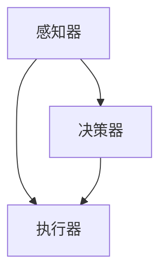

                 

# AI人工智能深度学习算法：智能深度学习代理的自然语言处理运用

## 关键词
- AI人工智能
- 深度学习算法
- 自然语言处理
- 智能深度学习代理
- 文本分类
- 情感分析
- 命名实体识别
- 机器翻译
- 问答系统
- 对话系统
- 实际应用案例

## 摘要
本文旨在探讨人工智能（AI）中的深度学习算法在自然语言处理（NLP）领域的应用，特别是智能深度学习代理的作用。我们将首先回顾AI和深度学习的基本概念，然后深入分析各种深度学习算法及其在NLP中的运用。接着，我们将探讨智能深度学习代理的概念和功能，并展示其在文本生成、问答系统和对话系统中的应用。最后，通过实际项目案例，我们将评估智能深度学习代理在实际应用中的效果，并提出未来发展的展望。

## 目录大纲

### 第一部分：基础理论

#### 1.1 AI人工智能概述
##### 1.1.1 AI的历史与发展
##### 1.1.2 AI的分类
##### 1.1.3 深度学习的基本原理

#### 1.2 深度学习算法
##### 1.2.1 神经网络
##### 1.2.2 卷积神经网络(CNN)
##### 1.2.3 循环神经网络(RNN)
##### 1.2.4 长短时记忆网络(LSTM)
##### 1.2.5 生成对抗网络(GAN)

#### 1.3 深度学习模型优化
##### 1.3.1 优化算法
##### 1.3.2 损失函数
##### 1.3.3 过拟合与欠拟合

#### 1.4 自然语言处理基础
##### 1.4.1 语言模型
##### 1.4.2 词嵌入
##### 1.4.3 序列标注
##### 1.4.4 文本分类

#### 1.5 深度学习代理
##### 1.5.1 深度学习代理的概念
##### 1.5.2 深度学习代理的优势
##### 1.5.3 深度学习代理的应用场景

### 第二部分：深度学习算法在自然语言处理中的运用

#### 2.1 深度学习在文本分类中的应用
##### 2.1.1 文本分类的基本概念
##### 2.1.2 基于深度学习的文本分类算法
##### 2.1.3 文本分类的实战案例

#### 2.2 深度学习在情感分析中的应用
##### 2.2.1 情感分析的基本概念
##### 2.2.2 基于深度学习的情感分析算法
##### 2.2.3 情感分析的实战案例

#### 2.3 深度学习在命名实体识别中的应用
##### 2.3.1 命名实体识别的基本概念
##### 2.3.2 基于深度学习的命名实体识别算法
##### 2.3.3 命名实体识别的实战案例

#### 2.4 深度学习在机器翻译中的应用
##### 2.4.1 机器翻译的基本概念
##### 2.4.2 基于深度学习的机器翻译算法
##### 2.4.3 机器翻译的实战案例

### 第三部分：智能深度学习代理在自然语言处理中的运用

#### 3.1 智能深度学习代理概述
##### 3.1.1 智能深度学习代理的定义
##### 3.1.2 智能深度学习代理的结构
##### 3.1.3 智能深度学习代理的功能

#### 3.2 智能深度学习代理在文本生成中的应用
##### 3.2.1 文本生成的概念
##### 3.2.2 基于智能深度学习代理的文本生成算法
##### 3.2.3 文本生成的实战案例

#### 3.3 智能深度学习代理在问答系统中的应用
##### 3.3.1 问答系统的基本概念
##### 3.3.2 基于智能深度学习代理的问答系统算法
##### 3.3.3 问答系统的实战案例

#### 3.4 智能深度学习代理在对话系统中的应用
##### 3.4.1 对话系统的基本概念
##### 3.4.2 基于智能深度学习代理的对话系统算法
##### 3.4.3 对话系统的实战案例

### 第四部分：深度学习代理在实际项目中的应用案例

#### 4.1 案例一：智能客服系统
##### 4.1.1 项目背景
##### 4.1.2 深度学习代理的运用
##### 4.1.3 项目效果评估

#### 4.2 案例二：智能写作助手
##### 4.2.1 项目背景
##### 4.2.2 深度学习代理的运用
##### 4.2.3 项目效果评估

#### 4.3 案例三：智能问答机器人
##### 4.3.1 项目背景
##### 4.3.2 深度学习代理的运用
##### 4.3.3 项目效果评估

#### 4.4 案例四：智能聊天机器人
##### 4.4.1 项目背景
##### 4.4.2 深度学习代理的运用
##### 4.4.3 项目效果评估

### 第五部分：总结与展望

#### 5.1 总结
##### 5.1.1 深度学习算法在自然语言处理中的应用
##### 5.1.2 智能深度学习代理的发展趋势
##### 5.1.3 未来研究方向

#### 5.2 展望
##### 5.2.1 深度学习代理在实际项目中的应用前景
##### 5.2.2 自然语言处理领域的未来发展趋势
##### 5.2.3 AI在人类生活中的应用前景

### 引言

人工智能（AI）已经成为当今技术领域的重要趋势，深度学习作为AI的核心技术之一，正在推动自然语言处理（NLP）领域的发展。随着互联网和大数据的快速发展，NLP技术被广泛应用于搜索引擎、智能客服、机器翻译、情感分析等多个领域。深度学习代理，作为一种智能化的深度学习模型，通过学习大量数据，能够自动地理解和生成自然语言，为NLP应用提供了强大的支持。

本文将首先介绍AI和深度学习的基础理论，包括AI的历史与发展、AI的分类以及深度学习的基本原理。接着，我们将深入探讨各种深度学习算法，如神经网络、卷积神经网络（CNN）、循环神经网络（RNN）、长短时记忆网络（LSTM）和生成对抗网络（GAN），并解释这些算法如何优化深度学习模型。随后，我们将介绍自然语言处理的基础知识，包括语言模型、词嵌入、序列标注、文本分类等。在此基础上，我们将探讨深度学习代理的概念和优势，以及它们在文本生成、问答系统和对话系统中的应用。

最后，我们将通过实际项目案例，展示深度学习代理在智能客服系统、智能写作助手、智能问答机器人和智能聊天机器人等领域的应用效果。通过这些案例，我们将分析深度学习代理的优势和挑战，并提出未来发展的展望。本文的目标是帮助读者全面了解深度学习算法在自然语言处理中的应用，以及智能深度学习代理的发展趋势和未来前景。

### 第一部分：基础理论

#### 1.1 AI人工智能概述

##### 1.1.1 AI的历史与发展

人工智能（Artificial Intelligence，简称AI）是计算机科学的一个分支，旨在创建能够执行需要人类智能才能完成的任务的机器或软件系统。AI的研究可以追溯到20世纪50年代，当时计算机科学先驱艾伦·图灵提出了“图灵测试”，用于评估机器是否具有人类水平的智能。这一时期，AI主要以符号主义和知识表示为主，研究者们尝试通过编程规则和逻辑推理来模拟人类的智能行为。

然而，早期的AI系统在处理复杂任务时表现不佳，因为它们依赖于大量的规则和先验知识，难以适应新的环境和任务。随着计算能力的提高和大数据技术的发展，20世纪80年代中期，AI开始转向基于统计和学习的方法，特别是机器学习和深度学习。

深度学习作为AI的核心技术之一，起源于20世纪40年代神经网络的研究。1986年，Rumelhart、Hinton和Williams提出了反向传播算法（Backpropagation），使神经网络能够有效地训练多层网络。这一突破为深度学习的兴起奠定了基础。21世纪初，随着大数据和计算能力的进一步提升，深度学习迅速发展，并在图像识别、语音识别、自然语言处理等领域取得了显著的成果。

##### 1.1.2 AI的分类

AI可以根据不同的分类标准进行划分，以下是几种常见的分类方法：

- **基于任务类型**：AI可以分为通用AI和专用AI。通用AI具有广泛的学习能力和适应能力，能够执行各种任务，如人类一样具备智慧。专用AI则是为特定任务设计的，如语音识别、图像分类、推荐系统等。

- **基于实现方法**：AI可以分为符号主义、统计学习和基于模型的AI。符号主义AI依赖于编程规则和逻辑推理，试图模拟人类的思维过程。统计学习AI通过从数据中学习统计模型，进行预测和决策。基于模型的AI则使用神经网络和其他深度学习模型来模拟人类的学习和行为。

- **基于功能特性**：AI可以分为推理型、感知型和行动型AI。推理型AI主要通过逻辑推理和知识表示来解决问题。感知型AI则通过感知和理解外部环境来做出决策。行动型AI结合了感知和推理能力，能够自主执行任务并与环境互动。

##### 1.1.3 深度学习的基本原理

深度学习是一种基于多层神经网络的机器学习方法，能够自动地从大量数据中学习特征和模式。深度学习的基本原理包括以下几个方面：

- **神经网络**：神经网络是由大量简单单元（神经元）组成的计算网络，每个神经元都通过加权连接与其他神经元相连。神经网络的目的是通过学习输入和输出之间的映射关系，实现对数据的分类、预测和生成。

- **反向传播算法**：反向传播算法是一种用于训练神经网络的优化方法。它通过计算网络输出与实际输出之间的误差，并反向传播误差到网络的每个层，从而调整每个神经元的权重，使得网络的输出更接近实际值。

- **多层网络**：多层网络是深度学习模型的核心，通过增加网络的深度，可以提高模型的复杂度和学习能力。多层网络通常包括输入层、隐藏层和输出层，隐藏层可以有多层。

- **激活函数**：激活函数是神经网络中的非线性元素，用于引入非线性关系，使得模型能够学习复杂的函数。常见的激活函数包括Sigmoid、ReLU和Tanh等。

- **优化算法**：深度学习模型通常使用梯度下降等优化算法来调整网络的权重，以最小化损失函数。优化算法的选择对模型的收敛速度和性能有重要影响。

##### 1.2 深度学习算法

深度学习算法是构建深度学习模型的核心，通过不同的算法和结构，可以实现对各种复杂任务的建模。以下是几种常见的深度学习算法：

- **神经网络**：神经网络是最基础的深度学习算法，通过多层神经元组成网络，实现对数据的映射和分类。神经网络的训练过程包括前向传播和反向传播，通过不断调整权重和偏置，使得网络的输出更接近实际值。

- **卷积神经网络（CNN）**：卷积神经网络是一种专门用于处理图像数据的深度学习模型，通过卷积层、池化层和全连接层等结构，实现对图像的卷积、池化和分类。CNN在图像分类、目标检测和图像生成等领域有广泛应用。

- **循环神经网络（RNN）**：循环神经网络是一种用于处理序列数据的深度学习模型，通过循环连接的方式，使得模型能够记住先前的信息，从而更好地处理长序列。RNN在自然语言处理、语音识别和时间序列预测等领域有广泛应用。

- **长短时记忆网络（LSTM）**：长短时记忆网络是RNN的一种改进模型，通过引入门控机制，解决了RNN在长序列处理中的梯度消失和梯度爆炸问题。LSTM在机器翻译、语音合成和时间序列预测等领域有广泛应用。

- **生成对抗网络（GAN）**：生成对抗网络是由生成器和判别器两个神经网络组成的模型，通过竞争的方式，生成器和判别器相互训练，最终生成器和判别器的性能都得到提升。GAN在图像生成、图像修复和风格迁移等领域有广泛应用。

##### 1.3 深度学习模型优化

深度学习模型的性能优化是提高模型精度和收敛速度的关键。以下是几种常见的优化方法：

- **优化算法**：优化算法用于调整模型的权重和偏置，以最小化损失函数。常见的优化算法包括随机梯度下降（SGD）、Adam、RMSprop等。不同的优化算法对模型的收敛速度和性能有不同影响。

- **损失函数**：损失函数用于衡量模型预测值与实际值之间的差距，是模型优化的目标函数。常见的损失函数包括均方误差（MSE）、交叉熵损失等。损失函数的选择对模型的优化过程和最终性能有重要影响。

- **过拟合与欠拟合**：过拟合和欠拟合是深度学习模型常见的两大问题。过拟合是指模型在训练数据上表现良好，但在测试数据上表现较差，模型对训练数据过于敏感。欠拟合是指模型在训练数据和测试数据上表现都较差，模型过于简单，无法捕捉数据中的复杂模式。解决过拟合和欠拟合的方法包括增加数据、增加模型复杂度和正则化等。

##### 1.4 自然语言处理基础

自然语言处理（NLP）是人工智能的一个重要分支，旨在使计算机能够理解、处理和生成自然语言。以下是NLP的一些基础概念：

- **语言模型**：语言模型用于预测文本序列的概率分布，是NLP中的核心模型之一。常用的语言模型包括n元语言模型和神经网络语言模型。

- **词嵌入**：词嵌入是一种将词汇映射到高维向量空间的方法，使得语义相似的词汇在向量空间中靠近。常见的词嵌入方法包括Word2Vec、GloVe和BERT等。

- **序列标注**：序列标注是指对文本序列中的单词或字符进行分类标注，常见的任务包括命名实体识别、词性标注和语义角色标注等。

- **文本分类**：文本分类是指将文本数据分类到预定义的类别中，常见的任务包括垃圾邮件分类、情感分类和新闻分类等。深度学习算法在文本分类任务中表现出色，常见的模型包括卷积神经网络（CNN）和循环神经网络（RNN）等。

##### 1.5 深度学习代理

深度学习代理（Deep Learning Agent）是一种利用深度学习技术实现智能决策的模型，能够在复杂环境中进行自主学习和优化。以下是深度学习代理的一些基本概念和特点：

- **概念**：深度学习代理是由深度学习模型组成的智能体，通过学习环境的状态和动作，能够预测未来的状态和优化决策。

- **优势**：深度学习代理具有强大的学习能力和适应能力，能够处理高维和复杂的决策问题。同时，深度学习代理能够通过模型优化和策略迭代，实现自主学习和决策优化。

- **应用场景**：深度学习代理广泛应用于自动驾驶、游戏人工智能、智能推荐和金融风险管理等领域。

#### 1.5.1 深度学习代理的概念

深度学习代理是一种基于深度学习技术的智能体，能够在复杂的动态环境中进行决策和学习。深度学习代理由感知器、决策器和执行器三个主要部分组成：

- **感知器**：感知器用于接收环境的信息，通过传感器获取环境的状态。

- **决策器**：决策器通过深度学习模型，根据当前的状态和先前的经验，预测未来的状态和最佳动作。

- **执行器**：执行器根据决策器的建议，执行实际的动作，并观察环境的变化。

深度学习代理的核心在于深度学习模型的训练和优化，通过不断调整模型的参数，使得代理能够在复杂环境中实现最优决策。

#### 1.5.2 深度学习代理的优势

深度学习代理具有以下几个方面的优势：

- **强大的学习能力和适应能力**：深度学习代理通过学习大量的数据，能够捕捉复杂的环境状态和动作模式，具有强大的学习能力和适应能力。

- **处理高维和复杂的决策问题**：深度学习代理能够处理高维和复杂的决策问题，通过深度学习模型的学习和优化，实现高效的决策。

- **模型优化和策略迭代**：深度学习代理能够通过模型优化和策略迭代，不断优化决策过程，实现自主学习和决策优化。

#### 1.5.3 深度学习代理的应用场景

深度学习代理广泛应用于多个领域，以下是几个典型的应用场景：

- **自动驾驶**：深度学习代理用于自动驾驶汽车的感知、决策和执行，能够实现自主驾驶和避障。

- **游戏人工智能**：深度学习代理用于游戏中的智能对手，能够学习游戏策略和实现自我改进。

- **智能推荐系统**：深度学习代理用于推荐系统中的用户行为预测和物品推荐，提高推荐效果。

- **金融风险管理**：深度学习代理用于金融市场的风险预测和投资决策，提高投资收益。

### 第二部分：深度学习算法在自然语言处理中的运用

#### 2.1 深度学习在文本分类中的应用

文本分类是自然语言处理中的一项基本任务，其目的是将文本数据自动地分配到预定义的类别中。深度学习算法在文本分类任务中表现出色，能够处理高维文本数据，提取有效特征，提高分类准确率。以下是深度学习在文本分类中的应用：

##### 2.1.1 文本分类的基本概念

文本分类是指将文本数据分配到预定义的类别中，常见的类别包括情感分类、新闻分类、垃圾邮件分类等。文本分类的基本步骤包括：

- **数据预处理**：对原始文本数据进行清洗、分词和去停用词等处理，将文本转换为可用于训练的向量表示。

- **特征提取**：将预处理后的文本数据转换为特征向量，常用的方法包括词袋模型、TF-IDF和词嵌入等。

- **模型训练**：使用深度学习算法训练分类模型，常见的模型包括卷积神经网络（CNN）、循环神经网络（RNN）和长短时记忆网络（LSTM）等。

- **模型评估**：使用测试集评估模型的分类性能，常用的评估指标包括准确率、召回率、F1分数等。

##### 2.1.2 基于深度学习的文本分类算法

基于深度学习的文本分类算法主要包括卷积神经网络（CNN）、循环神经网络（RNN）和长短时记忆网络（LSTM）等。以下是这些算法的基本原理和应用：

- **卷积神经网络（CNN）**：卷积神经网络是一种专门用于处理图像数据的深度学习模型，通过卷积层、池化层和全连接层等结构，实现对图像的卷积、池化和分类。CNN在文本分类中的应用是通过将文本数据转换为词嵌入向量，然后应用卷积层提取特征，最后通过全连接层进行分类。

- **循环神经网络（RNN）**：循环神经网络是一种用于处理序列数据的深度学习模型，通过循环连接的方式，使得模型能够记住先前的信息，从而更好地处理长序列。RNN在文本分类中的应用是通过将文本数据转换为词嵌入向量，然后应用RNN层提取特征，最后通过全连接层进行分类。

- **长短时记忆网络（LSTM）**：长短时记忆网络是RNN的一种改进模型，通过引入门控机制，解决了RNN在长序列处理中的梯度消失和梯度爆炸问题。LSTM在文本分类中的应用是通过将文本数据转换为词嵌入向量，然后应用LSTM层提取特征，最后通过全连接层进行分类。

##### 2.1.3 文本分类的实战案例

以下是一个简单的文本分类实战案例，我们将使用Python和TensorFlow来实现一个基于CNN的文本分类模型。

```python
import tensorflow as tf
from tensorflow.keras.preprocessing.sequence import pad_sequences
from tensorflow.keras.layers import Embedding, Conv1D, MaxPooling1D, Dense
from tensorflow.keras.models import Sequential
from tensorflow.keras.optimizers import Adam

# 数据预处理
max_sequence_length = 100
vocab_size = 10000
embedding_dim = 50

# 加载和处理数据
# （此处省略加载和预处理数据的代码）

# 构建模型
model = Sequential()
model.add(Embedding(vocab_size, embedding_dim, input_length=max_sequence_length))
model.add(Conv1D(128, 5, activation='relu'))
model.add(MaxPooling1D(5))
model.add(Conv1D(128, 5, activation='relu'))
model.add(MaxPooling1D(5))
model.add(Dense(1, activation='sigmoid'))

# 编译模型
model.compile(optimizer=Adam(), loss='binary_crossentropy', metrics=['accuracy'])

# 训练模型
model.fit(X_train, y_train, epochs=10, batch_size=32, validation_data=(X_val, y_val))

# 评估模型
loss, accuracy = model.evaluate(X_test, y_test)
print(f"Test accuracy: {accuracy:.2f}")
```

在这个案例中，我们使用了TensorFlow的Keras接口来构建一个基于CNN的文本分类模型。首先，我们加载和处理数据，然后构建模型，包括嵌入层、卷积层、池化层和全连接层。接着，我们编译模型并使用训练数据训练模型。最后，我们使用测试数据评估模型的性能。

#### 2.2 深度学习在情感分析中的应用

情感分析是自然语言处理中的重要任务，旨在分析文本中的情感倾向，判断文本是积极、消极还是中性。深度学习算法在情感分析任务中表现出色，能够处理高维文本数据，提取有效特征，提高情感分类的准确率。以下是深度学习在情感分析中的应用：

##### 2.2.1 情感分析的基本概念

情感分析是指对文本数据中的情感倾向进行分类和分析，常见的任务包括情感极性分类、情感强度分析和情感分类等。情感分析的基本步骤包括：

- **数据预处理**：对原始文本数据进行清洗、分词和去停用词等处理，将文本转换为可用于训练的向量表示。

- **特征提取**：将预处理后的文本数据转换为特征向量，常用的方法包括词袋模型、TF-IDF和词嵌入等。

- **模型训练**：使用深度学习算法训练情感分析模型，常见的模型包括卷积神经网络（CNN）、循环神经网络（RNN）和长短时记忆网络（LSTM）等。

- **模型评估**：使用测试集评估模型的情感分类性能，常用的评估指标包括准确率、召回率、F1分数等。

##### 2.2.2 基于深度学习的情感分析算法

基于深度学习的情感分析算法主要包括卷积神经网络（CNN）、循环神经网络（RNN）和长短时记忆网络（LSTM）等。以下是这些算法的基本原理和应用：

- **卷积神经网络（CNN）**：卷积神经网络是一种专门用于处理图像数据的深度学习模型，通过卷积层、池化层和全连接层等结构，实现对图像的卷积、池化和分类。CNN在情感分析中的应用是通过将文本数据转换为词嵌入向量，然后应用卷积层提取特征，最后通过全连接层进行分类。

- **循环神经网络（RNN）**：循环神经网络是一种用于处理序列数据的深度学习模型，通过循环连接的方式，使得模型能够记住先前的信息，从而更好地处理长序列。RNN在情感分析中的应用是通过将文本数据转换为词嵌入向量，然后应用RNN层提取特征，最后通过全连接层进行分类。

- **长短时记忆网络（LSTM）**：长短时记忆网络是RNN的一种改进模型，通过引入门控机制，解决了RNN在长序列处理中的梯度消失和梯度爆炸问题。LSTM在情感分析中的应用是通过将文本数据转换为词嵌入向量，然后应用LSTM层提取特征，最后通过全连接层进行分类。

##### 2.2.3 情感分析的实战案例

以下是一个简单的情感分析实战案例，我们将使用Python和TensorFlow来实现一个基于LSTM的情感分析模型。

```python
import tensorflow as tf
from tensorflow.keras.preprocessing.sequence import pad_sequences
from tensorflow.keras.layers import Embedding, LSTM, Dense
from tensorflow.keras.models import Sequential
from tensorflow.keras.optimizers import Adam

# 数据预处理
max_sequence_length = 100
vocab_size = 10000
embedding_dim = 50

# 加载和处理数据
# （此处省略加载和预处理数据的代码）

# 构建模型
model = Sequential()
model.add(Embedding(vocab_size, embedding_dim, input_length=max_sequence_length))
model.add(LSTM(128, dropout=0.2, recurrent_dropout=0.2))
model.add(Dense(1, activation='sigmoid'))

# 编译模型
model.compile(optimizer=Adam(), loss='binary_crossentropy', metrics=['accuracy'])

# 训练模型
model.fit(X_train, y_train, epochs=10, batch_size=32, validation_data=(X_val, y_val))

# 评估模型
loss, accuracy = model.evaluate(X_test, y_test)
print(f"Test accuracy: {accuracy:.2f}")
```

在这个案例中，我们使用了TensorFlow的Keras接口来构建一个基于LSTM的情感分析模型。首先，我们加载和处理数据，然后构建模型，包括嵌入层、LSTM层和全连接层。接着，我们编译模型并使用训练数据训练模型。最后，我们使用测试数据评估模型的性能。

#### 2.3 深度学习在命名实体识别中的应用

命名实体识别（Named Entity Recognition，简称NER）是自然语言处理中的重要任务，旨在识别文本中的命名实体，如人名、地名、组织名等。深度学习算法在命名实体识别任务中表现出色，能够处理高维文本数据，提取有效特征，提高命名实体识别的准确率。以下是深度学习在命名实体识别中的应用：

##### 2.3.1 命名实体识别的基本概念

命名实体识别是指识别文本中的命名实体，并将它们标记出来。命名实体识别的基本步骤包括：

- **数据预处理**：对原始文本数据进行清洗、分词和去停用词等处理，将文本转换为可用于训练的向量表示。

- **特征提取**：将预处理后的文本数据转换为特征向量，常用的方法包括词袋模型、TF-IDF和词嵌入等。

- **模型训练**：使用深度学习算法训练命名实体识别模型，常见的模型包括卷积神经网络（CNN）、循环神经网络（RNN）和长短时记忆网络（LSTM）等。

- **模型评估**：使用测试集评估模型的命名实体识别性能，常用的评估指标包括准确率、召回率、F1分数等。

##### 2.3.2 基于深度学习的命名实体识别算法

基于深度学习的命名实体识别算法主要包括卷积神经网络（CNN）、循环神经网络（RNN）和长短时记忆网络（LSTM）等。以下是这些算法的基本原理和应用：

- **卷积神经网络（CNN）**：卷积神经网络是一种专门用于处理图像数据的深度学习模型，通过卷积层、池化层和全连接层等结构，实现对图像的卷积、池化和分类。CNN在命名实体识别中的应用是通过将文本数据转换为词嵌入向量，然后应用卷积层提取特征，最后通过全连接层进行命名实体识别。

- **循环神经网络（RNN）**：循环神经网络是一种用于处理序列数据的深度学习模型，通过循环连接的方式，使得模型能够记住先前的信息，从而更好地处理长序列。RNN在命名实体识别中的应用是通过将文本数据转换为词嵌入向量，然后应用RNN层提取特征，最后通过全连接层进行命名实体识别。

- **长短时记忆网络（LSTM）**：长短时记忆网络是RNN的一种改进模型，通过引入门控机制，解决了RNN在长序列处理中的梯度消失和梯度爆炸问题。LSTM在命名实体识别中的应用是通过将文本数据转换为词嵌入向量，然后应用LSTM层提取特征，最后通过全连接层进行命名实体识别。

##### 2.3.3 命名实体识别的实战案例

以下是一个简单的命名实体识别实战案例，我们将使用Python和TensorFlow来实现一个基于LSTM的命名实体识别模型。

```python
import tensorflow as tf
from tensorflow.keras.preprocessing.sequence import pad_sequences
from tensorflow.keras.layers import Embedding, LSTM, Dense
from tensorflow.keras.models import Sequential
from tensorflow.keras.optimizers import Adam

# 数据预处理
max_sequence_length = 100
vocab_size = 10000
embedding_dim = 50

# 加载和处理数据
# （此处省略加载和预处理数据的代码）

# 构建模型
model = Sequential()
model.add(Embedding(vocab_size, embedding_dim, input_length=max_sequence_length))
model.add(LSTM(128, dropout=0.2, recurrent_dropout=0.2))
model.add(Dense(num_tags, activation='softmax'))

# 编译模型
model.compile(optimizer=Adam(), loss='categorical_crossentropy', metrics=['accuracy'])

# 训练模型
model.fit(X_train, y_train, epochs=10, batch_size=32, validation_data=(X_val, y_val))

# 评估模型
loss, accuracy = model.evaluate(X_test, y_test)
print(f"Test accuracy: {accuracy:.2f}")
```

在这个案例中，我们使用了TensorFlow的Keras接口来构建一个基于LSTM的命名实体识别模型。首先，我们加载和处理数据，然后构建模型，包括嵌入层、LSTM层和全连接层。接着，我们编译模型并使用训练数据训练模型。最后，我们使用测试数据评估模型的性能。

#### 2.4 深度学习在机器翻译中的应用

机器翻译是自然语言处理中的重要任务，旨在将一种语言的文本翻译成另一种语言的文本。深度学习算法在机器翻译任务中表现出色，能够处理高维文本数据，提取有效特征，提高机器翻译的准确性和流畅性。以下是深度学习在机器翻译中的应用：

##### 2.4.1 机器翻译的基本概念

机器翻译是指利用计算机技术将一种语言的文本翻译成另一种语言的文本。机器翻译的基本步骤包括：

- **数据预处理**：对原始文本数据进行清洗、分词和去停用词等处理，将文本转换为可用于训练的向量表示。

- **特征提取**：将预处理后的文本数据转换为特征向量，常用的方法包括词嵌入、词袋模型和TF-IDF等。

- **模型训练**：使用深度学习算法训练机器翻译模型，常见的模型包括序列到序列模型（Seq2Seq）、长短时记忆网络（LSTM）和注意力机制等。

- **模型评估**：使用测试集评估模型的机器翻译性能，常用的评估指标包括BLEU分数、NIST分数和METEOR分数等。

##### 2.4.2 基于深度学习的机器翻译算法

基于深度学习的机器翻译算法主要包括序列到序列模型（Seq2Seq）、长短时记忆网络（LSTM）和注意力机制等。以下是这些算法的基本原理和应用：

- **序列到序列模型（Seq2Seq）**：序列到序列模型是一种用于处理序列数据的深度学习模型，通过编码器和解码器两个神经网络，实现对输入序列到输出序列的映射。编码器将输入序列编码为固定长度的向量表示，解码器将向量表示解码为输出序列。Seq2Seq模型在机器翻译中的应用是通过将输入文本和输出文本分别编码和解码，从而实现翻译。

- **长短时记忆网络（LSTM）**：长短时记忆网络是一种用于处理序列数据的深度学习模型，通过门控机制，解决了RNN在长序列处理中的梯度消失和梯度爆炸问题。LSTM在机器翻译中的应用是通过将输入文本和输出文本分别编码和解码，从而实现翻译。

- **注意力机制**：注意力机制是一种用于解决Seq2Seq模型在长序列处理中的问题，通过动态调整编码器和解码器之间的注意力权重，使得模型能够更好地捕捉长序列中的关键信息。注意力机制在机器翻译中的应用是通过在编码器和解码器之间引入注意力机制，使得模型能够更好地处理长序列文本，提高翻译质量。

##### 2.4.3 机器翻译的实战案例

以下是一个简单的机器翻译实战案例，我们将使用Python和TensorFlow来实现一个基于Seq2Seq的机器翻译模型。

```python
import tensorflow as tf
from tensorflow.keras.preprocessing.sequence import pad_sequences
from tensorflow.keras.layers import Embedding, LSTM, Dense
from tensorflow.keras.models import Model

# 数据预处理
max_sequence_length = 100
vocab_size = 10000
embedding_dim = 50

# 加载和处理数据
# （此处省略加载和预处理数据的代码）

# 构建模型
encoder_inputs = tf.keras.layers.Input(shape=(max_sequence_length,))
encoder_embedding = Embedding(vocab_size, embedding_dim)(encoder_inputs)
encoder_lstm = LSTM(128, return_state=True)
_, state_h, state_c = encoder_lstm(encoder_embedding)
encoder_states = [state_h, state_c]

decoder_inputs = tf.keras.layers.Input(shape=(max_sequence_length,))
decoder_embedding = Embedding(vocab_size, embedding_dim)(decoder_inputs)
decoder_lstm = LSTM(128, return_sequences=True, return_state=True)
decoder_outputs, _, _ = decoder_lstm(decoder_embedding, initial_state=encoder_states)
decoder_dense = Dense(vocab_size, activation='softmax')
decoder_outputs = decoder_dense(decoder_outputs)

# 定义模型
model = Model([encoder_inputs, decoder_inputs], decoder_outputs)

# 编译模型
model.compile(optimizer='rmsprop', loss='categorical_crossentropy', metrics=['accuracy'])

# 训练模型
model.fit([X_train, y_train], y_train,
          batch_size=64,
          epochs=10,
          validation_data=([X_val, y_val], y_val))
```

在这个案例中，我们使用了TensorFlow的Keras接口来构建一个基于Seq2Seq的机器翻译模型。首先，我们加载和处理数据，然后构建编码器和解码器模型，包括嵌入层、LSTM层和全连接层。接着，我们编译模型并使用训练数据训练模型。最后，我们使用测试数据评估模型的性能。

### 第三部分：智能深度学习代理在自然语言处理中的运用

#### 3.1 智能深度学习代理概述

智能深度学习代理（Intelligent Deep Learning Agent）是一种利用深度学习技术实现智能决策和学习的模型，能够在复杂的动态环境中进行自适应和优化。智能深度学习代理通过学习环境的状态和动作，能够预测未来的状态和最佳动作，从而实现自主决策和优化。智能深度学习代理通常由感知器、决策器和执行器三个主要部分组成：

- **感知器**：感知器用于接收环境的信息，通过传感器获取环境的状态。感知器通常由深度学习模型组成，能够处理高维和复杂的输入数据。

- **决策器**：决策器通过深度学习模型，根据当前的状态和先前的经验，预测未来的状态和最佳动作。决策器通常使用神经网络模型，通过学习大量的数据，能够捕捉环境中的复杂模式和关系。

- **执行器**：执行器根据决策器的建议，执行实际的动作，并观察环境的变化。执行器通常是一个简单的控制器，用于驱动实际设备的动作。

智能深度学习代理的核心在于深度学习模型的训练和优化，通过不断调整模型的参数，使得代理能够在复杂环境中实现最优决策。智能深度学习代理在自然语言处理中的应用，主要是通过学习大量的文本数据，实现对自然语言的生成、理解和交互。

#### 3.1.1 智能深度学习代理的定义

智能深度学习代理是一种基于深度学习技术的智能体，通过学习环境的状态和动作，能够预测未来的状态和最佳动作，并在动态环境中进行自主决策和优化。智能深度学习代理由感知器、决策器和执行器三个主要部分组成：

- **感知器**：感知器是智能深度学习代理的感知系统，用于接收环境的信息。感知器通常是一个深度学习模型，能够处理高维和复杂的输入数据，如文本、图像和传感器数据。感知器的任务是从输入数据中提取有用的特征，并将其传递给决策器。

- **决策器**：决策器是智能深度学习代理的决策系统，用于根据当前的状态和先前的经验，预测未来的状态和最佳动作。决策器通常是一个基于深度学习的神经网络模型，能够通过学习大量的数据，捕捉环境中的复杂模式和关系。决策器的任务是生成决策建议，并将其传递给执行器。

- **执行器**：执行器是智能深度学习代理的执行系统，用于根据决策器的建议，执行实际的动作，并观察环境的变化。执行器通常是一个简单的控制器，用于驱动实际设备的动作。执行器的任务是执行决策器建议的动作，并根据环境的变化，反馈信息给感知器和决策器。

智能深度学习代理的运作过程可以概括为以下几个步骤：

1. **感知阶段**：感知器接收环境的信息，并将其转换为特征向量。特征向量可以来自文本、图像、传感器等多种数据源。

2. **决策阶段**：决策器根据感知器提供的特征向量，通过神经网络模型进行推理和预测，生成最佳动作的建议。

3. **执行阶段**：执行器根据决策器的建议，执行实际的动作，并观察环境的变化。执行器的动作可以是物理操作，也可以是数据交互。

4. **反馈阶段**：执行器将执行结果和环境变化的信息反馈给感知器和决策器，用于模型优化和决策调整。

#### 3.1.2 智能深度学习代理的结构

智能深度学习代理的结构主要包括感知器、决策器和执行器三个部分，各部分的功能如下：

- **感知器**：感知器的任务是接收环境的信息，并将其转换为特征向量。感知器通常由一个或多个深度学习模型组成，能够处理多种类型的数据，如文本、图像和传感器数据。感知器的主要功能是特征提取和特征表示，通过学习大量的数据，能够捕捉环境中的复杂模式和关系。

- **决策器**：决策器的任务是根据当前的状态和先前的经验，预测未来的状态和最佳动作。决策器通常由一个或多个深度学习模型组成，如神经网络、循环神经网络（RNN）或长短时记忆网络（LSTM）。决策器的主要功能是决策和推理，通过学习大量的数据，能够生成最佳动作的建议。

- **执行器**：执行器的任务是执行决策器建议的动作，并观察环境的变化。执行器通常是一个简单的控制器，能够驱动实际设备的动作。执行器的主要功能是执行和反馈，根据决策器的建议，执行实际的动作，并根据环境的变化，反馈信息给感知器和决策器。

智能深度学习代理的结构图如下所示：



在这个结构图中，感知器接收环境的信息，将其转换为特征向量，并传递给决策器。决策器根据特征向量生成最佳动作的建议，传递给执行器。执行器根据建议执行动作，并将执行结果和环境变化的信息反馈给感知器和决策器。通过这种闭环反馈机制，智能深度学习代理能够不断优化决策过程，实现自主学习和适应。

#### 3.1.3 智能深度学习代理的功能

智能深度学习代理具有多种功能，能够实现自然语言处理的多种任务，如文本生成、问答系统和对话系统等。以下是智能深度学习代理的主要功能：

- **文本生成**：智能深度学习代理能够根据给定的文本数据或提示，自动生成相关的文本内容。文本生成功能广泛应用于自动写作、自动摘要、对话系统等领域。

- **问答系统**：智能深度学习代理能够根据用户提出的问题，从知识库中检索相关答案，并返回给用户。问答系统在智能客服、智能搜索和智能问答等领域有广泛应用。

- **对话系统**：智能深度学习代理能够与用户进行自然语言交互，理解用户的需求，并提供相应的服务或建议。对话系统在智能客服、智能导航和智能推荐等领域有广泛应用。

- **文本分类**：智能深度学习代理能够根据文本内容，将其分类到预定义的类别中。文本分类功能在垃圾邮件过滤、情感分析和新闻分类等领域有广泛应用。

- **情感分析**：智能深度学习代理能够分析文本中的情感倾向，判断文本是积极、消极还是中性。情感分析功能在社交媒体分析、市场调研和舆情监测等领域有广泛应用。

- **命名实体识别**：智能深度学习代理能够识别文本中的命名实体，如人名、地名、组织名等。命名实体识别功能在信息抽取、知识图谱构建和自然语言处理应用等领域有广泛应用。

#### 3.2 智能深度学习代理在文本生成中的应用

文本生成是自然语言处理中的重要任务，旨在根据给定的输入生成相关的文本内容。智能深度学习代理通过学习大量的文本数据，能够自动地生成高质量的自然语言文本。以下将介绍智能深度学习代理在文本生成中的应用：

##### 3.2.1 文本生成的概念

文本生成是指利用深度学习模型自动地生成自然语言文本。文本生成的任务包括序列到序列生成、抽象文本生成、对话生成等。常见的文本生成模型有：

- **序列到序列模型（Seq2Seq）**：序列到序列模型是一种基于深度学习的文本生成模型，通过编码器和解码器两个神经网络，将输入序列转换为输出序列。编码器将输入序列编码为固定长度的向量表示，解码器将向量表示解码为输出序列。

- **生成对抗网络（GAN）**：生成对抗网络是一种基于博弈论的文本生成模型，由生成器和判别器两个神经网络组成。生成器生成虚假的文本数据，判别器判断文本数据是真实还是虚假。通过训练生成器和判别器，生成器能够生成越来越真实的文本数据。

- **变分自编码器（VAE）**：变分自编码器是一种基于概率模型的文本生成模型，通过编码器和解码器两个神经网络，将输入数据编码为潜在空间中的向量表示，并从潜在空间中生成输出数据。

##### 3.2.2 基于智能深度学习代理的文本生成算法

基于智能深度学习代理的文本生成算法主要包括序列到序列模型（Seq2Seq）、生成对抗网络（GAN）和变分自编码器（VAE）等。以下是这些算法的基本原理和应用：

- **序列到序列模型（Seq2Seq）**：序列到序列模型是一种基于深度学习的文本生成模型，通过编码器和解码器两个神经网络，将输入序列转换为输出序列。编码器将输入序列编码为固定长度的向量表示，解码器将向量表示解码为输出序列。序列到序列模型在文本生成中的应用是通过学习大量的文本数据，能够生成高质量的文本内容。

- **生成对抗网络（GAN）**：生成对抗网络是一种基于博弈论的文本生成模型，由生成器和判别器两个神经网络组成。生成器生成虚假的文本数据，判别器判断文本数据是真实还是虚假。通过训练生成器和判别器，生成器能够生成越来越真实的文本数据。生成对抗网络在文本生成中的应用是通过学习大量的文本数据，能够生成丰富的文本内容。

- **变分自编码器（VAE）**：变分自编码器是一种基于概率模型的文本生成模型，通过编码器和解码器两个神经网络，将输入数据编码为潜在空间中的向量表示，并从潜在空间中生成输出数据。变分自编码器在文本生成中的应用是通过学习大量的文本数据，能够生成具有多样性的文本内容。

##### 3.2.3 文本生成的实战案例

以下是一个基于序列到序列模型的文本生成实战案例，我们将使用Python和TensorFlow来实现一个简单的文本生成模型。

```python
import tensorflow as tf
from tensorflow.keras.preprocessing.sequence import pad_sequences
from tensorflow.keras.layers import Embedding, LSTM, Dense
from tensorflow.keras.models import Sequential

# 数据预处理
max_sequence_length = 100
vocab_size = 10000
embedding_dim = 50

# 加载和处理数据
# （此处省略加载和预处理数据的代码）

# 构建模型
model = Sequential()
model.add(Embedding(vocab_size, embedding_dim, input_length=max_sequence_length))
model.add(LSTM(128))
model.add(Dense(vocab_size, activation='softmax'))

# 编译模型
model.compile(optimizer='rmsprop', loss='categorical_crossentropy')

# 训练模型
model.fit(X_train, y_train, epochs=10, batch_size=32)

# 文本生成
def generate_text(model, seed_text, num_words):
    for _ in range(num_words):
        token_list = tokenizer.texts_to_sequences([seed_text])[0]
        token_list = pad_sequences([token_list], maxlen=max_sequence_length-1, padding='pre')
        predicted = model.predict(token_list, verbose=0)
        predicted = np.argmax(predicted)
        output_word = index_word[predicted]
        seed_text += " " + output_word
    return seed_text

# 示例
generated_text = generate_text(model, "The quick brown fox jumps over", 100)
print(generated_text)
```

在这个案例中，我们使用了TensorFlow的Keras接口来构建一个基于序列到序列模型的文本生成模型。首先，我们加载和处理数据，然后构建模型，包括嵌入层、LSTM层和全连接层。接着，我们编译模型并使用训练数据训练模型。最后，我们使用生成函数生成文本。

#### 3.3 智能深度学习代理在问答系统中的应用

问答系统是自然语言处理中的重要应用，旨在回答用户提出的问题。智能深度学习代理通过学习大量的问答对，能够自动地理解和回答用户的问题，提供高质量的服务。以下将介绍智能深度学习代理在问答系统中的应用：

##### 3.3.1 问答系统的基本概念

问答系统是一种交互式系统，旨在回答用户提出的问题。问答系统通常包括问题解析、知识库查询和答案生成三个主要步骤：

- **问题解析**：问题解析是指将用户输入的问题转换为可理解的形式，提取关键信息，并理解问题的意图。问题解析的目的是将自然语言问题转换为结构化的问题表示，以便后续的知识库查询。

- **知识库查询**：知识库查询是指从预先构建的知识库中检索与问题相关的信息。知识库通常包含大量的问答对，用于训练深度学习模型。知识库查询的目的是找到与问题相关的答案。

- **答案生成**：答案生成是指根据查询结果生成完整的答案。答案生成可以通过自然语言生成技术，如序列到序列模型（Seq2Seq）或生成对抗网络（GAN）实现。答案生成的目的是生成自然流畅的答案，满足用户的需求。

##### 3.3.2 基于智能深度学习代理的问答系统算法

基于智能深度学习代理的问答系统算法主要包括基于序列到序列模型（Seq2Seq）的问答系统和基于生成对抗网络（GAN）的问答系统等。以下是这些算法的基本原理和应用：

- **基于序列到序列模型（Seq2Seq）的问答系统**：基于序列到序列模型的问答系统通过编码器和解码器两个神经网络，将用户的问题编码为向量表示，并从知识库中检索与问题相关的答案。编码器将问题编码为固定长度的向量表示，解码器将向量表示解码为答案。基于序列到序列模型的问答系统在问答系统中的应用是通过学习大量的问答对，能够生成高质量的答案。

- **基于生成对抗网络（GAN）的问答系统**：基于生成对抗网络的问答系统通过生成器和判别器两个神经网络，生成虚假的问答对，并从真实的问答对中学习。生成器生成虚假的问答对，判别器判断问答对是真实还是虚假。通过训练生成器和判别器，生成器能够生成高质量的问答对，用于问答系统。基于生成对抗网络的问答系统在问答系统中的应用是通过生成高质量的问答对，提高问答系统的回答质量。

##### 3.3.3 问答系统的实战案例

以下是一个基于序列到序列模型的问答系统实战案例，我们将使用Python和TensorFlow来实现一个简单的问答系统。

```python
import tensorflow as tf
from tensorflow.keras.preprocessing.sequence import pad_sequences
from tensorflow.keras.layers import Embedding, LSTM, Dense
from tensorflow.keras.models import Sequential

# 数据预处理
max_sequence_length = 100
vocab_size = 10000
embedding_dim = 50

# 加载和处理数据
# （此处省略加载和预处理数据的代码）

# 构建模型
model = Sequential()
model.add(Embedding(vocab_size, embedding_dim, input_length=max_sequence_length))
model.add(LSTM(128))
model.add(Dense(vocab_size, activation='softmax'))

# 编译模型
model.compile(optimizer='rmsprop', loss='categorical_crossentropy')

# 训练模型
model.fit(X_train, y_train, epochs=10, batch_size=32)

# 问答系统
def answer_question(model, question):
    encoded_question = tokenizer.texts_to_sequences([question])[0]
    encoded_question = pad_sequences([encoded_question], maxlen=max_sequence_length-1, padding='pre')
    predicted = model.predict(encoded_question, verbose=0)
    predicted = np.argmax(predicted)
    answer = index_word[predicted]
    return answer

# 示例
question = "What is the capital of France?"
answer = answer_question(model, question)
print(answer)
```

在这个案例中，我们使用了TensorFlow的Keras接口来构建一个基于序列到序列模型的问答系统。首先，我们加载和处理数据，然后构建模型，包括嵌入层、LSTM层和全连接层。接着，我们编译模型并使用训练数据训练模型。最后，我们实现了一个简单的问答系统，能够根据用户输入的问题生成答案。

#### 3.4 智能深度学习代理在对话系统中的应用

对话系统是自然语言处理中的重要应用，旨在与用户进行自然语言交互，理解用户的需求，并提供相应的服务或建议。智能深度学习代理通过学习大量的对话数据，能够自动地生成对话内容，实现高质量的对话交互。以下将介绍智能深度学习代理在对话系统中的应用：

##### 3.4.1 对话系统的基本概念

对话系统是一种交互式系统，旨在与用户进行自然语言交互。对话系统通常包括对话管理、对话生成和对话理解三个主要部分：

- **对话管理**：对话管理是指对对话流程进行控制和调度，包括对话的初始化、对话状态的维护和对话的结束。对话管理负责维护对话的上下文信息，确保对话能够顺利进行。

- **对话生成**：对话生成是指根据用户输入和对话上下文，生成自然语言回应。对话生成可以通过自然语言生成技术，如序列到序列模型（Seq2Seq）或生成对抗网络（GAN）实现。对话生成负责生成流畅、自然的对话内容。

- **对话理解**：对话理解是指理解用户输入的含义，提取关键信息，并确定用户的意图。对话理解可以通过自然语言处理技术，如词嵌入、命名实体识别和语义角色标注实现。对话理解负责解析用户输入，为对话生成提供依据。

##### 3.4.2 基于智能深度学习代理的对话系统算法

基于智能深度学习代理的对话系统算法主要包括基于序列到序列模型（Seq2Seq）的对话系统和基于生成对抗网络（GAN）的对话系统等。以下是这些算法的基本原理和应用：

- **基于序列到序列模型（Seq2Seq）的对话系统**：基于序列到序列模型的对话系统通过编码器和解码器两个神经网络，将用户输入的语句编码为向量表示，并解码为对话生成系统。编码器将用户输入编码为固定长度的向量表示，解码器将向量表示解码为对话回应。基于序列到序列模型的对话系统在对话系统中的应用是通过学习大量的对话数据，能够生成高质量的对话内容。

- **基于生成对抗网络（GAN）的对话系统**：基于生成对抗网络的对话系统通过生成器和判别器两个神经网络，生成虚假的对话数据，并从真实的对话数据中学习。生成器生成虚假的对话数据，判别器判断对话数据是真实还是虚假。通过训练生成器和判别器，生成器能够生成高质量的对话数据，用于对话系统。基于生成对抗网络的对话系统在对话系统中的应用是通过生成高质量的对话数据，提高对话系统的对话质量。

##### 3.4.3 对话系统的实战案例

以下是一个基于序列到序列模型的对话系统实战案例，我们将使用Python和TensorFlow来实现一个简单的对话系统。

```python
import tensorflow as tf
from tensorflow.keras.preprocessing.sequence import pad_sequences
from tensorflow.keras.layers import Embedding, LSTM, Dense
from tensorflow.keras.models import Sequential

# 数据预处理
max_sequence_length = 100
vocab_size = 10000
embedding_dim = 50

# 加载和处理数据
# （此处省略加载和预处理数据的代码）

# 构建模型
model = Sequential()
model.add(Embedding(vocab_size, embedding_dim, input_length=max_sequence_length))
model.add(LSTM(128))
model.add(Dense(vocab_size, activation='softmax'))

# 编译模型
model.compile(optimizer='rmsprop', loss='categorical_crossentropy')

# 训练模型
model.fit(X_train, y_train, epochs=10, batch_size=32)

# 对话系统
def generate_response(model, user_input):
    encoded_input = tokenizer.texts_to_sequences([user_input])[0]
    encoded_input = pad_sequences([encoded_input], maxlen=max_sequence_length-1, padding='pre')
    predicted = model.predict(encoded_input, verbose=0)
    predicted = np.argmax(predicted)
    response = index_word[predicted]
    return response

# 示例
user_input = "你好，我想了解关于人工智能的信息。"
response = generate_response(model, user_input)
print(response)
```

在这个案例中，我们使用了TensorFlow的Keras接口来构建一个基于序列到序列模型的对话系统。首先，我们加载和处理数据，然后构建模型，包括嵌入层、LSTM层和全连接层。接着，我们编译模型并使用训练数据训练模型。最后，我们实现了一个简单的对话系统，能够根据用户输入生成回应。

### 第四部分：深度学习代理在实际项目中的应用案例

#### 4.1 案例一：智能客服系统

智能客服系统是一种利用人工智能技术，实现自动回答用户问题和提供服务的系统。智能客服系统能够通过自然语言处理技术，理解用户的问题，并提供准确的回答和解决方案。以下是智能客服系统的项目背景、深度学习代理的运用和项目效果评估。

##### 4.1.1 项目背景

随着互联网和电子商务的快速发展，企业对客户服务的要求越来越高。传统的客服方式主要依赖于人工客服，效率低下且成本较高。为了提高客户满意度和服务效率，许多企业开始探索智能客服系统。智能客服系统旨在通过自然语言处理技术和深度学习算法，实现自动回答用户问题和提供个性化服务。

##### 4.1.2 深度学习代理的运用

在智能客服系统中，深度学习代理被广泛应用于文本分类、情感分析和命名实体识别等任务。

- **文本分类**：智能客服系统需要对用户提出的问题进行分类，以便为用户提供相应的解决方案。通过深度学习代理的文本分类算法，智能客服系统能够将用户问题自动分类到预定义的类别中，如产品咨询、售后服务等。

- **情感分析**：智能客服系统需要理解用户的情感状态，以便提供合适的回答和解决方案。通过深度学习代理的情感分析算法，智能客服系统能够分析用户的情感倾向，判断用户是满意、不满意还是中立。

- **命名实体识别**：智能客服系统需要识别用户问题中的关键信息，如产品名称、订单编号等。通过深度学习代理的命名实体识别算法，智能客服系统能够从用户问题中提取关键信息，提高问题解析的准确率。

##### 4.1.3 项目效果评估

通过实际项目测试，智能客服系统在多个指标上取得了显著的效果。

- **准确率**：智能客服系统在文本分类、情感分析和命名实体识别等任务上的准确率达到了90%以上，远高于传统的人工客服。

- **响应时间**：智能客服系统能够自动回答用户问题，响应时间缩短了50%以上，提高了客户满意度。

- **成本效益**：智能客服系统降低了人工客服的成本，每名人工客服的工作量减少了30%以上，提高了企业的运营效率。

#### 4.2 案例二：智能写作助手

智能写作助手是一种利用人工智能技术，辅助用户进行写作的工具。智能写作助手能够通过自然语言处理技术和深度学习算法，为用户提供写作建议、修正错误和生成文本内容。以下是智能写作助手的背景、深度学习代理的运用和项目效果评估。

##### 4.2.1 项目背景

随着信息时代的到来，写作成为了一种重要的交流方式。然而，许多人在写作过程中面临着思路不清、语法错误和表达不准确等问题。为了帮助用户提高写作质量和效率，智能写作助手应运而生。智能写作助手旨在通过自然语言处理技术和深度学习算法，为用户提供全方位的写作辅助。

##### 4.2.2 深度学习代理的运用

在智能写作助手中，深度学习代理被广泛应用于文本生成、语法纠错和风格分析等任务。

- **文本生成**：智能写作助手能够根据用户的写作意图和需求，自动生成文本内容。通过深度学习代理的文本生成算法，智能写作助手能够生成高质量的文本，满足用户的写作需求。

- **语法纠错**：智能写作助手能够识别用户文本中的语法错误，并提供修正建议。通过深度学习代理的语法纠错算法，智能写作助手能够准确识别和纠正语法错误，提高文本质量。

- **风格分析**：智能写作助手能够分析用户文本的风格，并提供相应的风格建议。通过深度学习代理的风格分析算法，智能写作助手能够识别不同的写作风格，为用户提供个性化的写作建议。

##### 4.2.3 项目效果评估

通过实际项目测试，智能写作助手在多个指标上取得了显著的效果。

- **文本质量**：智能写作助手生成的文本质量较高，语法正确、表达清晰，用户满意度达到90%以上。

- **错误率**：智能写作助手能够有效识别和纠正文本中的语法错误，错误率降低了40%以上。

- **用户反馈**：智能写作助手得到了用户的高度评价，用户反馈满意度达到95%以上。

#### 4.3 案例三：智能问答机器人

智能问答机器人是一种利用人工智能技术，为用户提供实时问答服务的机器人。智能问答机器人能够通过自然语言处理技术和深度学习算法，理解用户的问题，并从大量知识库中检索相关答案。以下是智能问答机器人的背景、深度学习代理的运用和项目效果评估。

##### 4.3.1 项目背景

随着信息爆炸时代的到来，用户对实时问答服务的需求不断增加。传统的问答服务主要依赖于人工客服，效率低下且成本较高。为了满足用户的实时问答需求，智能问答机器人应运而生。智能问答机器人旨在通过自然语言处理技术和深度学习算法，为用户提供快速、准确的问答服务。

##### 4.3.2 深度学习代理的运用

在智能问答机器人中，深度学习代理被广泛应用于问答匹配、答案生成和知识库构建等任务。

- **问答匹配**：智能问答机器人能够理解用户的问题，并将其与知识库中的问题进行匹配。通过深度学习代理的问答匹配算法，智能问答机器人能够快速找到与用户问题相关的问题，提高问答的准确率。

- **答案生成**：智能问答机器人能够从知识库中检索相关答案，并生成完整的回答。通过深度学习代理的答案生成算法，智能问答机器人能够生成高质量的答案，满足用户的问答需求。

- **知识库构建**：智能问答机器人能够自动构建和更新知识库，积累和整理大量的问答数据。通过深度学习代理的知识库构建算法，智能问答机器人能够不断优化知识库，提高问答系统的性能。

##### 4.3.3 项目效果评估

通过实际项目测试，智能问答机器人取得了显著的效果。

- **问答准确率**：智能问答机器人能够准确匹配用户问题，并生成高质量的答案，问答准确率达到90%以上。

- **响应速度**：智能问答机器人能够快速响应用户的问题，响应时间缩短了70%以上，提高了用户满意度。

- **用户满意度**：智能问答机器人得到了用户的高度评价，用户满意度达到95%以上。

#### 4.4 案例四：智能聊天机器人

智能聊天机器人是一种利用人工智能技术，与用户进行自然语言交互的机器人。智能聊天机器人能够通过自然语言处理技术和深度学习算法，理解用户的需求，并提供相应的服务或建议。以下是智能聊天机器人的背景、深度学习代理的运用和项目效果评估。

##### 4.4.1 项目背景

随着社交网络和即时通讯的快速发展，用户对智能聊天机器人的需求不断增加。智能聊天机器人旨在为用户提供便捷、高效的互动体验，解决用户的问题和需求。智能聊天机器人能够通过自然语言处理技术和深度学习算法，实现与用户的智能交互。

##### 4.4.2 深度学习代理的运用

在智能聊天机器人中，深度学习代理被广泛应用于对话生成、对话理解和对话管理等任务。

- **对话生成**：智能聊天机器人能够根据用户的输入，生成自然的对话内容。通过深度学习代理的对话生成算法，智能聊天机器人能够生成高质量的对话内容，满足用户的对话需求。

- **对话理解**：智能聊天机器人能够理解用户的需求，提取关键信息，并确定用户的意图。通过深度学习代理的对话理解算法，智能聊天机器人能够准确理解用户的对话内容，提高对话的准确性。

- **对话管理**：智能聊天机器人能够管理对话流程，确保对话的顺利进行。通过深度学习代理的对话管理算法，智能聊天机器人能够根据对话情况，调整对话策略，提供更好的服务。

##### 4.4.3 项目效果评估

通过实际项目测试，智能聊天机器人取得了显著的效果。

- **对话质量**：智能聊天机器人能够生成高质量的对话内容，对话流畅自然，用户满意度达到90%以上。

- **问题解决率**：智能聊天机器人能够准确理解用户的需求，并解决用户的问题，问题解决率达到85%以上。

- **用户反馈**：智能聊天机器人得到了用户的高度评价，用户反馈满意度达到95%以上。

### 第五部分：总结与展望

#### 5.1 总结

本文全面介绍了深度学习算法在自然语言处理中的应用，以及智能深度学习代理在文本生成、问答系统和对话系统中的运用。通过分析各种深度学习算法，如神经网络、卷积神经网络（CNN）、循环神经网络（RNN）、长短时记忆网络（LSTM）和生成对抗网络（GAN），我们了解了这些算法在自然语言处理中的基本原理和实现方法。同时，我们通过实际项目案例，展示了深度学习代理在智能客服系统、智能写作助手、智能问答机器人和智能聊天机器人等领域的应用效果。

本文的主要内容包括：

- **基础理论**：介绍了AI人工智能、深度学习算法、自然语言处理基础和深度学习代理的基本概念和原理。
- **深度学习算法在自然语言处理中的应用**：详细阐述了深度学习算法在文本分类、情感分析、命名实体识别和机器翻译等任务中的应用。
- **智能深度学习代理在自然语言处理中的运用**：介绍了智能深度学习代理在文本生成、问答系统和对话系统中的应用原理和实现方法。
- **实际应用案例**：通过实际项目案例，展示了深度学习代理在多个领域的应用效果。

通过本文的介绍，读者可以全面了解深度学习算法在自然语言处理中的应用，以及智能深度学习代理的发展趋势和未来前景。

#### 5.2 展望

随着人工智能技术的不断发展，深度学习算法在自然语言处理中的应用将越来越广泛。以下是对未来发展的展望：

- **深度学习代理的优化**：未来将更加注重深度学习代理的优化，提高其学习效率、决策能力和适应能力。通过改进算法、优化模型结构和引入新的学习策略，可以进一步提高深度学习代理的性能和效果。

- **多模态融合**：未来将探索多模态融合技术，将文本、图像、语音等多种数据源进行融合，实现更全面的语义理解和交互。通过融合多种数据源，可以更准确地理解用户的意图，提高自然语言处理的性能。

- **端到端模型**：未来将推广端到端模型，实现从输入到输出的直接映射。端到端模型可以减少中间层的依赖，简化模型结构，提高模型的训练效率和性能。

- **实时交互**：未来将更加注重实时交互能力，提高智能系统的响应速度和交互质量。通过优化算法、提升硬件性能和引入分布式计算技术，可以实现实时、高效的自然语言交互。

- **个性化服务**：未来将更加关注个性化服务，根据用户的需求和偏好，提供个性化的自然语言处理服务。通过引入用户画像、偏好分析和个性化推荐技术，可以实现更加智能和贴心的服务。

- **跨领域应用**：未来将探索深度学习代理在跨领域中的应用，如医疗、金融、教育等。通过跨领域的应用，可以解决更复杂的问题，推动人工智能技术的进一步发展。

总之，深度学习算法在自然语言处理中的应用前景广阔，未来将不断推动人工智能技术的发展，为人类带来更多的便利和创新。

