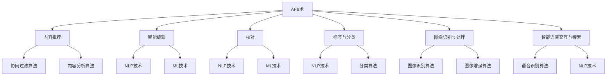

                 

### 第一部分：AI出版业概述

#### 1.1 AI出版业背景与未来趋势

人工智能（AI）作为当前技术发展的热点，已经在多个领域产生了深远影响。出版业作为一个传统的知识传播渠道，也在逐步被AI技术革新。AI在出版业的应用场景主要包括内容推荐、智能编辑、校对、标签与分类、图像识别与处理、智能语音交互与搜索等。

**1.1.1 AI在出版业的应用场景**

- **内容推荐系统**：通过分析用户的阅读历史和偏好，为用户推荐感兴趣的内容。
- **智能编辑与校对**：利用自然语言处理（NLP）技术对文本内容进行智能编辑和校对，提高文本质量和准确性。
- **智能标签与分类**：自动为文本内容生成标签和分类，方便用户快速检索和阅读。
- **图像识别与处理**：识别和处理图书、期刊等图像内容，实现数字化出版。
- **智能语音交互与搜索**：通过语音识别和自然语言理解，实现人机交互和智能搜索。

**1.1.2 AI出版业的发展历史**

AI出版业的发展可以追溯到20世纪90年代，当时计算机技术刚刚开始渗透到出版领域。随着互联网的兴起，AI技术在出版业的应用逐步扩展。近年来，随着深度学习等AI技术的成熟，AI在出版业的应用迎来了快速发展。

**1.1.3 AI出版业未来趋势分析**

- **个性化内容推荐**：基于用户行为分析和偏好挖掘，实现更加精准的内容推荐。
- **智能化编辑与校对**：利用AI技术实现自动化编辑和校对，提高出版效率和质量。
- **图像识别与处理技术的进步**：实现更高精度和更广泛的图像内容处理能力，推动数字化出版。
- **人机交互的优化**：通过智能语音交互和自然语言理解技术，提供更加便捷和智能的服务。

#### 1.2 AI出版业的核心概念

**1.2.1 自然语言处理（NLP）概述**

自然语言处理（NLP）是人工智能的一个重要分支，旨在使计算机能够理解、解释和生成人类语言。在出版业中，NLP技术主要用于文本分析、内容理解和智能编辑。

**1.2.2 计算机视觉（CV）在出版中的应用**

计算机视觉（CV）技术主要用于图像识别、图像处理和图像分析。在出版业中，CV技术可以应用于图像内容的自动识别和处理，如图像识别、图像增强、图像分类等。

**1.2.3 机器学习（ML）在出版业的应用**

机器学习（ML）是AI技术的重要组成部分，通过从数据中学习模式来改进系统性能。在出版业中，ML技术可以用于内容推荐、智能编辑、校对、标签与分类等场景。

#### 1.3 AI出版业的技术挑战与机遇

**1.3.1 技术挑战**

- **数据质量和隐私**：AI系统对高质量数据有较高要求，但出版业的数据质量和隐私问题亟待解决。
- **计算资源消耗**：深度学习等AI算法对计算资源需求较高，如何在有限的资源下高效运行是挑战之一。
- **技术落地与适配**：如何将AI技术有效地整合到出版业现有的业务流程中，实现技术落地和适配。

**1.3.2 机遇与影响**

- **提高出版效率**：AI技术可以自动化许多出版流程，提高出版效率。
- **改善用户体验**：通过个性化推荐、智能编辑等技术，提供更加个性化的服务，提升用户体验。
- **推动创新**：AI技术为出版业带来了新的发展机遇，可以推动出版模式的创新。

### 总结

AI技术在出版业的应用正在逐步深入，为出版业带来了新的机遇和挑战。通过分析AI在出版业的应用场景、核心概念以及面临的挑战，我们可以看到AI技术在出版业的未来具有巨大的潜力。接下来，我们将进一步探讨场景驱动的技术更新，分析AI技术在内容推荐、智能编辑、校对、标签与分类、图像识别与处理、智能语音交互与搜索等领域的具体应用。

### Mermaid 流程图

### 摘要

本文概述了AI在出版业的应用背景、未来趋势、核心概念以及面临的挑战。通过分析AI技术在内容推荐、智能编辑、校对、标签与分类、图像识别与处理、智能语音交互与搜索等领域的具体应用，我们揭示了AI技术在出版业的巨大潜力。本文旨在为读者提供一个全面的AI出版业技术更新全景图，帮助读者理解AI技术在出版业的变革和未来发展方向。

### 结论

AI技术在出版业的应用已经带来了深刻的变革，从内容推荐到智能编辑、校对、标签与分类、图像识别与处理、智能语音交互与搜索，AI技术在各个方面都展示了其强大的潜力。通过对这些技术的深入分析，我们可以看到AI出版业不仅提高了出版效率，改善了用户体验，还推动了出版业的创新。未来，随着技术的不断进步，AI将在出版业发挥更加重要的作用，为人类知识的传播和获取带来更多可能性。让我们期待AI出版业的美好未来。

