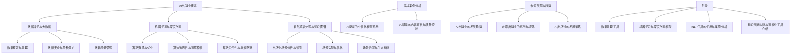
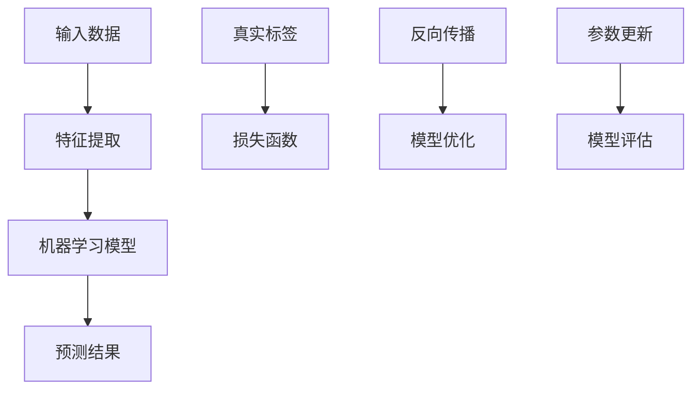
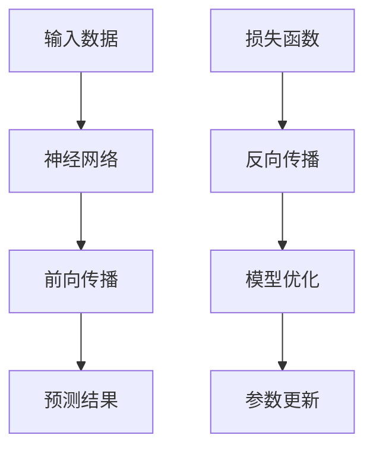

                 

### 《AI出版业的壁垒建设：数据，算法与场景协同》

> **关键词：** AI出版业，数据壁垒，算法壁垒，场景协同，算法公平性，数据隐私保护

> **摘要：** 本文章探讨了AI出版业在发展过程中面临的三大核心壁垒：数据壁垒、算法壁垒和场景协同壁垒。首先，文章概述了AI出版业的起源、现状与挑战，并分析了其带来的价值与机遇。接着，文章深入讨论了数据壁垒建设、算法壁垒建设和场景协同壁垒建设的方法与策略。最后，通过实战案例展示了AI出版业壁垒建设的实际应用，并对未来AI出版业的发展趋势进行了展望。文章旨在为AI出版业的从业者提供有价值的参考和指导。

---

## 《AI出版业的壁垒建设：数据，算法与场景协同》目录大纲

### 第一部分：背景与核心概念

#### 第1章 AI出版业概述

- 1.1 AI出版业的起源与发展
- 1.2 AI出版业的核心挑战
- 1.3 AI出版业的价值与机遇

#### 第2章 AI相关基础概念

- 2.1 数据科学与大数据
- 2.2 机器学习与深度学习
- 2.3 自然语言处理与知识图谱

### 第二部分：壁垒建设

#### 第3章 数据壁垒建设

- 3.1 数据获取与处理
- 3.2 数据安全与隐私保护
- 3.3 数据质量管理

#### 第4章 算法壁垒建设

- 4.1 算法选择与优化
- 4.2 算法透明性与可解释性
- 4.3 算法公平性与歧视防范

#### 第5章 场景协同壁垒建设

- 5.1 出版业场景分析与识别
- 5.2 场景适配与优化
- 5.3 场景协同与生态构建

### 第三部分：实战与展望

#### 第6章 实战案例分析

- 6.1 AI驱动的个性化推荐系统
- 6.2 AI辅助的内容审核与质量控制

#### 第7章 未来展望与趋势

- 7.1 AI出版业的发展趋势
- 7.2 未来出版业的挑战与机遇
- 7.3 AI出版业的发展策略

### 附录

#### 附录A：AI出版业相关工具与资源

- A.1 数据处理工具
- A.2 机器学习与深度学习框架
- A.3 自然语言处理工具
- A.4 知识图谱工具

### Mermaid 流�程图



### 核心算法原理讲解

#### 2.2.1 机器学习算法

**核心概念与联系：**

机器学习是AI出版业中不可或缺的一部分，其基本原理和架构如图所示：



**核心算法原理讲解：**

机器学习算法主要包括以下步骤：

1. **数据集加载：** 加载训练数据和测试数据。
2. **模型初始化：** 初始化机器学习模型，包括输入层、隐藏层和输出层。
3. **前向传播：** 将输入数据进行特征提取，并计算模型输出。
4. **计算损失：** 使用损失函数计算模型输出与真实标签之间的差距。
5. **反向传播：** 计算损失函数关于模型参数的梯度。
6. **模型优化：** 更新模型参数，减少损失函数值。
7. **模型评估：** 使用测试数据评估模型性能。

**伪代码：**

```python
# 数据集加载
data = load_dataset()

# 初始化模型
model = initialize_model()

# 训练模型
for epoch in range(num_epochs):
    for data_point in data:
        # 前向传播
        predictions = model.forward_pass(data_point.input)
        
        # 计算损失
        loss = compute_loss(predictions, data_point.label)
        
        # 反向传播
        model.backward_pass(loss)
        
        # 更新模型参数
        model.update_params()

# 评估模型
evaluate_model(model)
```

#### 2.2.2 深度学习算法

**核心概念与联系：**

深度学习是机器学习的一个分支，其核心思想和架构如图所示：



**核心算法原理讲解：**

深度学习算法主要包括以下步骤：

1. **神经网络初始化：** 初始化神经网络，包括输入层、隐藏层和输出层。
2. **前向传播：** 将输入数据通过神经网络进行计算，得到预测结果。
3. **计算损失：** 使用损失函数计算预测结果与真实标签之间的差距。
4. **反向传播：** 计算损失函数关于模型参数的梯度。
5. **模型优化：** 更新模型参数，减少损失函数值。
6. **参数更新：** 根据梯度更新模型参数。

**伪代码：**

```python
# 初始化神经网络
neural_network = initialize_neural_network()

# 前向传播
outputs = neural_network.forward_pass(inputs)

# 计算损失
loss = compute_loss(outputs, labels)

# 反向传播
neural_network.backward_pass(loss)

# 更新权重
neural_network.update_weights()
```

### 数学模型和数学公式

**2.3.1 预训练模型中的损失函数**

预训练模型中的损失函数通常采用交叉熵损失函数，其公式如下：

$$
\text{损失函数} = -\sum_{i=1}^{N} y_i \log(p_i)
$$

其中，$y_i$ 为真实标签，$p_i$ 为模型预测的概率。

### 项目实战

**6.1.1 AI驱动的个性化推荐系统**

**实战环境搭建：**

- 操作系统：Ubuntu 18.04
- Python版本：3.8
- 深度学习框架：PyTorch
- 数据库：MongoDB

**源代码实现：**

```python
# AI驱动的个性化推荐系统实现

import torch
import torch.nn as nn
import torch.optim as optim
from torch.utils.data import DataLoader
from sklearn.model_selection import train_test_split

# 数据加载与预处理
# ...

# 模型定义
class RecommenderModel(nn.Module):
    # ...

# 模型训练
def train_model(model, train_loader, criterion, optimizer):
    # ...

# 模型评估
def evaluate_model(model, test_loader, criterion):
    # ...

# 主函数
if __name__ == "__main__":
    # 加载数据
    # ...
    
    # 划分训练集和测试集
    # ...
    
    # 初始化模型、损失函数和优化器
    # ...
    
    # 训练模型
    # ...
    
    # 评估模型
    # ...
```

**代码解读与分析：**

- 数据加载与预处理：使用 PyTorch DataLoader 加载数据，并进行预处理，如归一化、缺失值填充等。
- 模型定义：定义一个推荐模型类，使用 PyTorch 的 nn.Module 基础类，定义输入层、隐藏层和输出层。
- 模型训练：使用训练数据训练模型，包括前向传播、计算损失、反向传播和参数更新。
- 模型评估：使用测试数据评估模型性能，计算损失值和准确率等指标。
- 主函数：设置训练参数，加载数据，划分训练集和测试集，初始化模型、损失函数和优化器，执行模型训练和评估。

通过上述步骤，可以实现一个基本的 AI 驱动的个性化推荐系统。进一步优化和调整模型参数，可以提升推荐系统的性能和效果。

### 附录

#### 附录A：AI出版业相关工具与资源

- **A.1 数据处理工具：** 
  - **Pandas:** Python 数据分析库，提供高效的数据结构操作。
  - **NumPy:** Python 科学计算库，提供多维数组对象和操作。

- **A.2 机器学习与深度学习框架：** 
  - **PyTorch:** 具有灵活性的深度学习框架，提供动态计算图。
  - **TensorFlow:** 由谷歌开发的开源机器学习库，支持静态计算图。

- **A.3 自然语言处理工具：** 
  - **NLTK:** Python 的自然语言处理库，提供大量文本处理工具。
  - **spaCy:** 高性能的NLP库，支持多种语言的文本处理。

- **A.4 知识图谱工具：** 
  - **Neo4j:** 图数据库，用于存储和管理知识图谱。
  - **OpenKG:** 开源知识图谱框架，支持知识图谱的构建和查询。

### 总结

本文详细探讨了AI出版业在发展过程中面临的三大核心壁垒：数据壁垒、算法壁垒和场景协同壁垒。通过深入分析数据壁垒建设、算法壁垒建设和场景协同壁垒建设的方法与策略，本文为AI出版业的从业者提供了有价值的参考和指导。同时，通过实战案例展示了AI出版业壁垒建设的实际应用，并对未来AI出版业的发展趋势进行了展望。希望本文能为读者在AI出版业领域的研究和实践带来启发和帮助。

