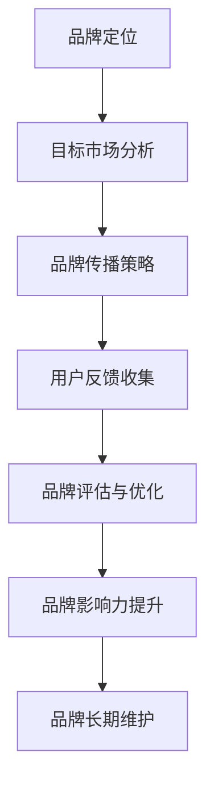

                 

# AI创业公司如何建立品牌影响力

> **关键词**：AI创业公司，品牌影响力，数据分析，用户满意度，社交媒体，用户体验，品牌危机管理，未来趋势。

> **摘要**：本文将深入探讨AI创业公司如何通过数据分析、社交媒体、用户体验等多方面策略，构建和提升品牌影响力。从核心概念到实际案例，我们将一步步剖析AI品牌影响力建设的原理和方法。

----------------------------------------------------------------

## 第一部分：AI创业公司建立品牌影响力概述

### 第1章：品牌影响力的概念与重要性

#### 1.1 品牌影响力的定义与解释

品牌影响力是指一个品牌在市场中的认知度、认可度及其对消费者行为的影响程度。它不仅反映在销售额和市场份额上，更体现在消费者对品牌的忠诚度和品牌的美誉度上。

在AI创业公司中，品牌影响力尤为重要。随着人工智能技术的不断发展，市场中的竞争日益激烈。一个强大的品牌影响力不仅能够吸引更多的用户和投资者，还能在市场中脱颖而出，获得更高的市场份额。

#### 1.2 品牌影响力与AI创业公司的关系

品牌影响力对于AI创业公司的影响可以从以下几个方面体现：

1. **用户信任**：强大的品牌影响力能够增强用户对AI创业公司的信任，从而提高用户的忠诚度。
2. **市场份额**：品牌影响力能够帮助AI创业公司在市场中获得更多的市场份额。
3. **投资者信心**：品牌影响力也是吸引投资者的重要指标，强大的品牌影响力能够提高投资者的信心。
4. **创新优势**：品牌影响力强大的公司往往更容易获得创新资源和政策支持。

#### 1.3 品牌影响力的衡量标准

衡量品牌影响力可以从以下几个方面进行：

1. **市场份额**：市场份额是衡量品牌影响力的直接指标，它反映了品牌在市场中的竞争力。
2. **用户忠诚度**：用户忠诚度是衡量品牌影响力的间接指标，它反映了品牌对用户的影响力和用户对品牌的依赖程度。
3. **品牌美誉度**：品牌美誉度是衡量品牌影响力的综合指标，它反映了品牌在社会中的形象和影响力。
4. **广告效果**：广告效果是衡量品牌影响力的重要指标，它反映了品牌在市场推广中的效果。

#### 1.4 品牌影响力构建的流程图

以下是品牌影响力构建的基本流程图：



#### 1.5 品牌影响力评估模型

品牌影响力评估模型是一个综合性的评估体系，它可以通过以下几个方面进行评估：

1. **市场份额评估**：通过市场份额的数据对比，评估品牌在市场中的竞争力。
2. **用户忠诚度评估**：通过用户反馈和行为数据，评估品牌对用户的影响力和用户的忠诚度。
3. **品牌美誉度评估**：通过社会媒体、用户评价等多方面的数据，评估品牌在社会中的形象和影响力。
4. **广告效果评估**：通过广告投放的效果数据，评估品牌在市场推广中的效果。

#### 1.6 消费者行为预测模型

消费者行为预测模型是品牌影响力评估的重要组成部分。通过大数据和机器学习技术，可以预测消费者的行为和偏好，从而优化品牌策略。

以下是一个消费者行为预测模型的简化伪代码：

```python
# 输入：消费者行为数据集
# 输出：预测结果

# 数据预处理
preprocessed_data = preprocess_data(data)

# 特征工程
features = extract_features(preprocessed_data)

# 训练模型
model = train_model(features)

# 预测
predictions = model.predict(new_data)

# 输出预测结果
print(predictions)
```

### 总结

品牌影响力是AI创业公司成功的关键因素之一。通过明确品牌定位、制定传播策略、收集用户反馈和进行品牌评估，AI创业公司可以逐步提升品牌影响力。下一章我们将探讨AI技术在品牌影响力建设中的应用。

----------------------------------------------------------------

### 第2章：AI在品牌影响力建设中的应用

#### 2.1 AI技术在品牌建设中的应用场景

AI技术在品牌建设中的应用非常广泛，主要包括以下几个方面：

1. **用户数据分析**：通过大数据技术和机器学习算法，对用户行为和偏好进行深入分析，从而了解用户需求，优化品牌策略。
2. **个性化推荐**：基于用户行为和偏好数据，利用机器学习算法进行个性化推荐，提高用户满意度和忠诚度。
3. **品牌传播**：利用AI技术进行广告投放优化，提高广告效果，扩大品牌影响力。
4. **危机管理**：通过实时监控社交媒体和用户反馈，利用自然语言处理技术，及时应对品牌危机。
5. **用户体验优化**：利用AI技术对用户界面和交互进行优化，提高用户满意度和品牌忠诚度。

#### 2.2 AI技术与传统品牌建设方法的结合

传统品牌建设方法通常依赖于市场调研、广告投放、用户反馈等手段。而AI技术则可以通过数据分析和机器学习，对这些传统方法进行优化和提升。

1. **数据驱动的决策**：传统品牌建设方法往往依赖于经验和直觉，而AI技术可以通过大数据和机器学习，提供更准确的数据分析和预测，帮助企业做出更科学的决策。
2. **智能广告投放**：传统广告投放方法通常依赖于人工分析和判断，而AI技术可以通过算法和大数据，实现更精准的广告投放，提高广告效果。
3. **实时危机管理**：传统危机管理方法通常反应较慢，而AI技术可以通过实时监控和自然语言处理，快速识别和应对品牌危机。

#### 2.3 AI在品牌数据分析中的优势

AI技术在品牌数据分析中具有明显的优势：

1. **数据量级大**：AI技术可以处理海量的用户数据，提取有价值的信息。
2. **分析速度快**：AI技术可以通过并行计算和算法优化，快速完成数据分析。
3. **分析准确性高**：AI技术可以利用机器学习算法，提高数据分析的准确性。

#### 2.4 自然语言处理算法

自然语言处理（NLP）是AI技术在品牌数据分析中的重要应用。NLP算法可以通过对文本数据进行分析，提取有价值的信息。

以下是一个NLP算法的简化伪代码：

```python
# 输入：文本数据集
# 输出：提取的关键词和情感分析结果

# 数据预处理
preprocessed_data = preprocess_data(data)

# 提取关键词
keywords = extract_keywords(preprocessed_data)

# 情感分析
sentiments = analyze_sentiments(preprocessed_data)

# 输出结果
print("Keywords:", keywords)
print("Sentiments:", sentiments)
```

#### 2.5 数据挖掘算法

数据挖掘算法是AI技术在品牌数据分析中的另一重要应用。数据挖掘算法可以通过对大数据进行分析，发现潜在的模式和关联。

以下是一个数据挖掘算法的简化伪代码：

```python
# 输入：大数据集
# 输出：潜在的模式和关联

# 数据预处理
preprocessed_data = preprocess_data(data)

# 数据挖掘
patterns = data_mining(preprocessed_data)

# 输出结果
print("Patterns:", patterns)
```

#### 2.6 用户满意度分析模型

用户满意度分析模型是AI技术在品牌数据分析中的重要应用。通过分析用户反馈和行为数据，可以评估用户满意度，从而优化品牌策略。

以下是一个用户满意度分析模型的简化伪代码：

```python
# 输入：用户反馈和行为数据集
# 输出：用户满意度评估结果

# 数据预处理
preprocessed_data = preprocess_data(data)

# 用户满意度分析
satisfaction = analyze_satisfaction(preprocessed_data)

# 输出结果
print("User Satisfaction:", satisfaction)
```

#### 2.7 品牌偏好分析模型

品牌偏好分析模型是AI技术在品牌数据分析中的另一个重要应用。通过分析用户行为和偏好数据，可以评估品牌偏好，从而优化品牌策略。

以下是一个品牌偏好分析模型的简化伪代码：

```python
# 输入：用户行为和偏好数据集
# 输出：品牌偏好评估结果

# 数据预处理
preprocessed_data = preprocess_data(data)

# 品牌偏好分析
preferences = analyze_preferences(preprocessed_data)

# 输出结果
print("Brand Preferences:", preferences)
```

### 总结

AI技术在品牌影响力建设中的应用，不仅提高了数据分析的效率和准确性，也为品牌建设提供了新的方法和思路。通过用户数据分析、个性化推荐、品牌传播和危机管理等应用，AI技术可以帮助AI创业公司构建和提升品牌影响力。下一章我们将探讨数据驱动的品牌战略。

----------------------------------------------------------------

### 第3章：数据驱动的品牌战略

#### 3.1 数据驱动品牌战略的定义与重要性

数据驱动品牌战略是指基于大数据和机器学习技术，通过对用户行为、市场趋势等多维度数据的深入分析和挖掘，制定和调整品牌策略的一种方法。这种战略强调以数据为基础，以科学的方式优化品牌建设。

数据驱动品牌战略的重要性体现在以下几个方面：

1. **精准定位用户需求**：通过数据分析和挖掘，可以深入了解用户行为和偏好，从而精准定位用户需求，提供更符合用户期望的产品和服务。
2. **提高决策效率**：数据驱动的决策基于客观的数据分析结果，减少了主观判断的干扰，提高了决策的准确性和效率。
3. **优化资源配置**：通过数据分析和预测，可以合理分配资源，提高营销和运营的效率，降低成本。
4. **提升品牌竞争力**：数据驱动的品牌战略可以帮助企业更好地理解市场趋势和竞争环境，从而制定更具竞争力的品牌策略。

#### 3.2 数据收集、处理与分析的方法

数据驱动的品牌战略需要有效收集、处理和分析数据。以下是一些关键步骤：

1. **数据收集**：通过多种渠道收集用户数据，包括社交媒体、电商平台、调查问卷等。数据来源的多样性和全面性是保证数据质量的前提。
2. **数据预处理**：对收集到的数据进行清洗、去噪和格式化，确保数据的一致性和准确性。数据预处理是数据分析和挖掘的基础。
3. **数据存储**：将处理后的数据存储在合适的数据库中，以便于后续的数据分析和挖掘。常用的数据库包括关系型数据库和NoSQL数据库。
4. **数据挖掘**：利用数据挖掘技术从海量数据中提取有价值的信息和知识。常见的数据挖掘技术包括聚类、分类、关联规则挖掘等。
5. **数据分析**：对挖掘出的数据进行深入分析，提取业务洞察和决策依据。数据分析可以采用统计方法、机器学习算法等。

#### 3.3 数据驱动的决策流程

数据驱动的决策流程通常包括以下几个步骤：

1. **问题定义**：明确决策目标，确定需要解决的问题。
2. **数据收集**：根据问题定义，收集相关的数据。
3. **数据预处理**：对收集到的数据进行清洗、去噪和格式化。
4. **数据分析**：利用数据分析工具和方法，对预处理后的数据进行分析。
5. **结果解读**：根据数据分析结果，提取业务洞察和决策依据。
6. **决策制定**：基于数据分析结果，制定具体的决策方案。
7. **决策执行**：实施决策方案，并对结果进行跟踪和评估。

以下是一个数据驱动的决策流程的简化伪代码：

```python
# 输入：决策目标
# 输出：决策结果

# 步骤1：问题定义
problem = define_problem()

# 步骤2：数据收集
data = collect_data(problem)

# 步骤3：数据预处理
preprocessed_data = preprocess_data(data)

# 步骤4：数据分析
analysis_result = analyze_data(preprocessed_data)

# 步骤5：结果解读
insight = interpret_result(analysis_result)

# 步骤6：决策制定
decision = make_decision(insight)

# 步骤7：决策执行
execute_decision(decision)

# 输出结果
print("Decision Result:", decision)
```

#### 3.4 数据清洗算法

数据清洗是数据预处理的重要步骤，旨在提高数据的质量和准确性。以下是一些常见的数据清洗算法：

1. **缺失值处理**：对于缺失的数据，可以通过填补、删除或使用模型预测等方式进行处理。
2. **重复值处理**：删除重复的数据，确保数据的唯一性。
3. **异常值处理**：识别和处理异常值，确保数据的准确性。
4. **格式转换**：将不同格式的数据转换为统一的格式，以便于后续的分析和处理。

以下是一个数据清洗算法的简化伪代码：

```python
# 输入：原始数据集
# 输出：清洗后的数据集

# 步骤1：缺失值处理
cleaned_data = handle_missing_values(data)

# 步骤2：重复值处理
cleaned_data = remove_duplicate_values(cleaned_data)

# 步骤3：异常值处理
cleaned_data = handle_outliers(cleaned_data)

# 步骤4：格式转换
cleaned_data = convert_data_formats(cleaned_data)

# 输出结果
print("Cleaned Data:", cleaned_data)
```

#### 3.5 数据分析算法

数据分析算法是数据驱动的品牌战略的核心。以下是一些常见的数据分析算法：

1. **统计方法**：包括描述性统计、假设检验、回归分析等，用于描述数据的基本特征和关系。
2. **机器学习方法**：包括分类、聚类、关联规则挖掘等，用于发现数据中的潜在模式和规律。
3. **数据可视化**：通过图表和图形，将数据分析和挖掘的结果直观地展示出来，帮助决策者更好地理解和利用数据。

以下是一个数据分析算法的简化伪代码：

```python
# 输入：预处理后的数据集
# 输出：数据分析结果

# 步骤1：描述性统计
descriptive_stats = descriptive_statistics(cleaned_data)

# 步骤2：假设检验
hypothesis_test_results = hypothesis_tests(cleaned_data)

# 步骤3：回归分析
regression_results = regression_analysis(cleaned_data)

# 步骤4：分类
classification_results = classify_data(cleaned_data)

# 步骤5：聚类
clustering_results = cluster_data(cleaned_data)

# 步骤6：关联规则挖掘
association_rules = association_rulesMining(cleaned_data)

# 输出结果
print("Analysis Results:", {
    "Descriptive Stats": descriptive_stats,
    "Hypothesis Tests": hypothesis_test_results,
    "Regression Analysis": regression_results,
    "Classification": classification_results,
    "Clustering": clustering_results,
    "Association Rules": association_rules
})
```

#### 3.6 数据分析模型

数据分析模型是数据驱动的品牌战略的重要组成部分。以下是一些常见的数据分析模型：

1. **用户行为预测模型**：通过分析用户的历史行为数据，预测用户未来的行为和偏好。
2. **市场需求预测模型**：通过分析市场数据，预测市场的未来趋势和需求变化。
3. **品牌偏好分析模型**：通过分析用户数据，评估用户对不同品牌的偏好。
4. **广告效果评估模型**：通过分析广告投放数据，评估广告的效果和转化率。

以下是一个数据分析模型的简化伪代码：

```python
# 输入：用户行为数据集
# 输出：预测结果

# 步骤1：数据预处理
preprocessed_data = preprocess_data(data)

# 步骤2：特征工程
features = extract_features(preprocessed_data)

# 步骤3：训练模型
model = train_model(features)

# 步骤4：预测
predictions = model.predict(new_data)

# 输出结果
print("Predictions:", predictions)
```

### 总结

数据驱动的品牌战略是AI创业公司提升品牌影响力的重要手段。通过有效收集、处理和分析数据，AI创业公司可以制定更科学的品牌策略，提高决策效率，优化资源配置，提升品牌竞争力。下一章我们将探讨如何利用AI优化品牌传播。

----------------------------------------------------------------

### 第4章：利用AI优化品牌传播

#### 4.1 品牌传播的基本策略和渠道

品牌传播是构建品牌影响力的重要手段，主要包括以下基本策略和渠道：

1. **广告投放**：通过线上和线下的广告投放，提高品牌的曝光度和知名度。
2. **公关活动**：通过举办新闻发布会、产品发布会等公关活动，提升品牌形象和影响力。
3. **社交媒体营销**：利用社交媒体平台，如Facebook、Twitter、LinkedIn等，与用户互动，提高品牌认知度和用户黏性。
4. **内容营销**：通过创作高质量的内容，如文章、视频、图片等，吸引用户关注，提高品牌知名度。
5. **口碑营销**：通过用户的口口相传，提高品牌的信誉和口碑。

#### 4.2 AI技术在品牌传播中的优化应用

AI技术在品牌传播中有着广泛的应用，可以帮助企业优化品牌传播策略，提高传播效果。以下是一些AI技术在品牌传播中的应用：

1. **广告投放优化**：通过机器学习算法，分析用户行为和偏好，实现个性化广告投放，提高广告转化率。
2. **社交媒体分析**：通过自然语言处理和情感分析技术，实时监控社交媒体上的品牌讨论，及时了解用户反馈和需求。
3. **内容推荐**：利用推荐系统，根据用户兴趣和行为，推荐相关的内容，提高用户参与度和品牌曝光度。
4. **用户画像**：通过大数据分析，构建用户画像，了解用户特征和需求，制定更有针对性的品牌传播策略。
5. **实时危机管理**：通过实时监控和自然语言处理技术，快速识别和处理品牌危机，保护品牌声誉。

#### 4.3 人工智能对品牌传播效果的影响

人工智能对品牌传播效果有着显著的影响，主要表现在以下几个方面：

1. **提高广告投放效果**：通过AI技术，可以实现个性化广告投放，提高广告点击率和转化率，从而提高广告的投资回报率（ROI）。
2. **增强社交媒体互动**：通过AI技术，可以实时监控社交媒体上的品牌讨论，及时回应用户反馈，增强用户互动和黏性。
3. **提升内容质量**：通过AI技术，可以分析用户行为和偏好，生成高质量的内容推荐，提高用户参与度和品牌认知度。
4. **降低品牌传播成本**：通过AI技术，可以自动化处理品牌传播的各个环节，降低人力和时间成本，提高运营效率。

#### 4.4 机器学习算法

机器学习算法是AI技术在品牌传播中的重要工具，可以用于广告投放优化、社交媒体分析、内容推荐等方面。以下是一些常用的机器学习算法：

1. **分类算法**：用于将数据分为不同的类别，如广告投放效果分类、用户行为分类等。
2. **聚类算法**：用于将数据分为不同的簇，如用户画像聚类、内容聚类等。
3. **回归算法**：用于预测连续的数值，如广告点击率预测、用户流失率预测等。
4. **推荐算法**：用于根据用户兴趣和偏好推荐相关的内容或产品，如内容推荐、商品推荐等。

以下是一个广告投放优化机器学习算法的简化伪代码：

```python
# 输入：广告投放数据集
# 输出：优化后的广告投放策略

# 步骤1：数据预处理
preprocessed_data = preprocess_data(data)

# 步骤2：特征工程
features = extract_features(preprocessed_data)

# 步骤3：训练模型
model = train_model(features)

# 步骤4：预测
predictions = model.predict(new_data)

# 步骤5：优化策略
optimized_strategy = optimize_strategy(predictions)

# 输出结果
print("Optimized Advertising Strategy:", optimized_strategy)
```

#### 4.5 优化算法

优化算法是AI技术在品牌传播中的重要应用，可以用于广告投放优化、内容推荐等场景。以下是一些常见的优化算法：

1. **线性优化**：通过最小化成本函数，求解最优解，如广告投放成本优化。
2. **非线性优化**：通过求解非线性规划问题，求解最优解，如内容推荐优化。
3. **动态规划**：通过递归关系，求解最优解，如用户行为预测优化。
4. **遗传算法**：通过模拟生物进化过程，求解最优解，如品牌传播策略优化。

以下是一个广告投放优化线性优化算法的简化伪代码：

```python
# 输入：广告投放数据集
# 输出：优化后的广告投放策略

# 步骤1：定义优化目标
objective = define_objective(data)

# 步骤2：定义约束条件
constraints = define_constraints(data)

# 步骤3：求解优化问题
solution = solve_linear_optimization(objective, constraints)

# 步骤4：优化广告投放策略
optimized_strategy = optimize_advertising_strategy(solution)

# 输出结果
print("Optimized Advertising Strategy:", optimized_strategy)
```

#### 4.6 广告投放效果评估模型

广告投放效果评估模型是AI技术在品牌传播中的重要应用，可以用于评估广告的点击率、转化率等指标。以下是一个广告投放效果评估模型的简化伪代码：

```python
# 输入：广告投放数据集
# 输出：广告投放效果评估结果

# 步骤1：数据预处理
preprocessed_data = preprocess_data(data)

# 步骤2：特征工程
features = extract_features(preprocessed_data)

# 步骤3：训练模型
model = train_model(features)

# 步骤4：预测
predictions = model.predict(new_data)

# 步骤5：评估广告投放效果
evaluation_results = evaluate_advertising_effects(predictions)

# 输出结果
print("Advertising Effects Evaluation:", evaluation_results)
```

#### 4.7 转化率预测模型

转化率预测模型是AI技术在品牌传播中的重要应用，可以用于预测用户的转化率，从而优化广告投放策略。以下是一个转化率预测模型的简化伪代码：

```python
# 输入：用户行为数据集
# 输出：用户转化率预测结果

# 步骤1：数据预处理
preprocessed_data = preprocess_data(data)

# 步骤2：特征工程
features = extract_features(preprocessed_data)

# 步骤3：训练模型
model = train_model(features)

# 步骤4：预测
predictions = model.predict(new_data)

# 步骤5：评估用户转化率
conversion_rate_predictions = evaluate_conversion_rate(predictions)

# 输出结果
print("User Conversion Rate Predictions:", conversion_rate_predictions)
```

### 总结

利用AI优化品牌传播是AI创业公司提升品牌影响力的重要策略。通过AI技术在广告投放优化、社交媒体分析、内容推荐等方面的应用，可以大幅提高品牌传播效果，降低传播成本，从而提升品牌竞争力。下一章我们将探讨如何利用AI打造品牌社区。

----------------------------------------------------------------

### 第5章：社交媒体与AI：打造品牌社区

#### 5.1 社交媒体在品牌建设中的作用

社交媒体在品牌建设中发挥着重要作用，主要体现在以下几个方面：

1. **提升品牌知名度**：通过社交媒体平台的广泛传播，品牌可以迅速提高知名度，吸引更多的潜在用户。
2. **增强用户互动**：社交媒体提供了一个与用户直接互动的平台，品牌可以通过社交媒体与用户进行沟通，了解用户需求，建立良好的用户关系。
3. **构建品牌社区**：社交媒体使得品牌可以建立一个属于自己的社区，与用户形成紧密的联系，增强用户的归属感和忠诚度。
4. **监测品牌声誉**：通过社交媒体上的用户反馈和讨论，品牌可以实时监测品牌声誉，及时发现和处理问题，保护品牌形象。

#### 5.2 AI技术在社交媒体运营中的应用

AI技术在社交媒体运营中有着广泛的应用，可以帮助品牌优化社交媒体策略，提升运营效果。以下是一些AI技术在社交媒体运营中的应用：

1. **用户行为分析**：通过大数据和机器学习技术，分析用户在社交媒体上的行为，了解用户偏好和需求，制定更精准的运营策略。
2. **内容推荐**：利用推荐算法，根据用户兴趣和行为，推荐相关的社交媒体内容，提高用户参与度和品牌曝光度。
3. **社交媒体监测**：通过自然语言处理和情感分析技术，实时监测社交媒体上的品牌讨论，及时了解用户反馈和需求，及时应对品牌危机。
4. **广告投放优化**：利用机器学习算法，分析用户行为和偏好，实现个性化广告投放，提高广告效果和转化率。

#### 5.3 社交媒体与品牌社区的构建与维护

构建和维持一个强大的品牌社区是提升品牌影响力的重要策略。以下是一些关键步骤：

1. **明确社区目标**：确定品牌社区的目标和定位，明确社区的核心价值和特色，以便于吸引和留住用户。
2. **内容策略**：制定合理的内容策略，提供有价值的内容，吸引用户参与和互动，增强社区的活跃度。
3. **用户互动**：积极与社区用户互动，回应用户的问题和反馈，建立良好的用户关系，增强用户的归属感和忠诚度。
4. **品牌活动**：举办线上和线下的品牌活动，提高用户的参与度，增强品牌与用户之间的联系。
5. **监测和优化**：通过数据分析，监测社区的表现和用户反馈，及时调整运营策略，优化社区体验。

#### 5.4 社交网络分析算法

社交网络分析算法是AI技术在社交媒体运营中的重要应用，可以帮助品牌分析社交媒体上的用户互动和传播效果。以下是一些常见的社交网络分析算法：

1. **用户关系分析**：通过分析用户之间的互动和连接，了解用户关系网络，识别关键用户和意见领袖。
2. **内容传播分析**：通过分析内容的传播路径和影响力，了解哪些内容更容易被用户分享和传播。
3. **社群检测**：通过分析用户互动模式，识别社交媒体上的社群和群体，了解社群结构和特征。
4. **影响力评估**：通过分析用户的关注和转发行为，评估用户的影响力，识别潜在的意见领袖。

以下是一个社交网络分析算法的简化伪代码：

```python
# 输入：社交媒体数据集
# 输出：分析结果

# 步骤1：数据预处理
preprocessed_data = preprocess_data(data)

# 步骤2：构建用户关系网络
user_network = build_user_network(preprocessed_data)

# 步骤3：分析用户关系
user_relations = analyze_user_relations(user_network)

# 步骤4：内容传播分析
content_spread = analyze_content_spread(preprocessed_data)

# 步骤5：社群检测
communities = detect_communities(user_network)

# 步骤6：影响力评估
influence_scores = evaluate_influence(preprocessed_data)

# 输出结果
print("Analysis Results:", {
    "User Relations": user_relations,
    "Content Spread": content_spread,
    "Communities": communities,
    "Influence Scores": influence_scores
})
```

#### 5.5 内容推荐算法

内容推荐算法是AI技术在社交媒体运营中的重要应用，可以帮助品牌提供个性化内容，提高用户参与度和品牌曝光度。以下是一些常见的内容推荐算法：

1. **基于内容的推荐**：根据用户兴趣和行为，推荐相似的内容，如新闻推荐、文章推荐等。
2. **基于用户的推荐**：根据用户的兴趣和行为，推荐其他用户的相似内容，如社交网络上的朋友动态推荐。
3. **基于模型的推荐**：利用机器学习模型，预测用户可能感兴趣的内容，如推荐系统中的推荐算法。
4. **混合推荐**：结合多种推荐方法，提供更准确的内容推荐，如基于内容和基于用户的混合推荐。

以下是一个基于内容的推荐算法的简化伪代码：

```python
# 输入：用户行为数据集和内容数据集
# 输出：推荐结果

# 步骤1：数据预处理
preprocessed_data = preprocess_data(data)

# 步骤2：构建用户兴趣模型
user_interest_model = build_user_interest_model(preprocessed_data)

# 步骤3：构建内容特征模型
content_feature_model = build_content_feature_model(preprocessed_data)

# 步骤4：推荐算法
recommendations = content_based_recommendation(user_interest_model, content_feature_model)

# 输出结果
print("Recommendations:", recommendations)
```

#### 5.6 社交媒体影响力评估模型

社交媒体影响力评估模型是AI技术在社交媒体运营中的重要应用，可以帮助品牌评估社交媒体活动的效果，优化运营策略。以下是一个社交媒体影响力评估模型的简化伪代码：

```python
# 输入：社交媒体数据集
# 输出：影响力评估结果

# 步骤1：数据预处理
preprocessed_data = preprocess_data(data)

# 步骤2：构建用户参与模型
user_participation_model = build_user_participation_model(preprocessed_data)

# 步骤3：构建内容影响力模型
content_influence_model = build_content_influence_model(preprocessed_data)

# 步骤4：评估影响力
influence_scores = evaluate_influence(preprocessed_data, user_participation_model, content_influence_model)

# 输出结果
print("Influence Scores:", influence_scores)
```

#### 5.7 社交媒体活跃度分析模型

社交媒体活跃度分析模型是AI技术在社交媒体运营中的重要应用，可以帮助品牌了解社交媒体社区的活跃程度，优化运营策略。以下是一个社交媒体活跃度分析模型的简化伪代码：

```python
# 输入：社交媒体数据集
# 输出：活跃度分析结果

# 步骤1：数据预处理
preprocessed_data = preprocess_data(data)

# 步骤2：构建用户活跃度模型
user_activity_model = build_user_activity_model(preprocessed_data)

# 步骤3：构建内容活跃度模型
content_activity_model = build_content_activity_model(preprocessed_data)

# 步骤4：分析活跃度
activity_scores = analyze_activity(preprocessed_data, user_activity_model, content_activity_model)

# 输出结果
print("Activity Scores:", activity_scores)
```

### 总结

社交媒体与AI的结合，为品牌建设提供了强大的工具和策略。通过AI技术在用户行为分析、内容推荐、社交媒体监测等方面的应用，品牌可以优化社交媒体运营，提升品牌社区的建设效果。下一章我们将探讨如何利用AI驱动的用户体验优化。

----------------------------------------------------------------

### 第6章：AI驱动的用户体验优化

#### 6.1 用户体验与品牌影响力的关系

用户体验（UX）是品牌影响力的重要组成部分。良好的用户体验能够增强用户对品牌的满意度和忠诚度，从而提升品牌影响力。以下从三个方面探讨用户体验与品牌影响力的关系：

1. **用户满意度**：良好的用户体验能够满足用户的需求和期望，提高用户的满意度。满意的用户更倾向于推荐品牌，从而扩大品牌的影响力。
2. **用户忠诚度**：良好的用户体验能够培养用户的忠诚度，使他们对品牌产生依赖和信任，减少用户流失，从而稳定品牌的影响力。
3. **用户参与度**：良好的用户体验能够激发用户的参与度，鼓励用户在社交媒体上分享品牌信息，增强品牌的社会影响力。

#### 6.2 AI技术在用户体验优化中的应用

AI技术在用户体验优化中有着广泛的应用，可以帮助品牌提供个性化的服务，提高用户体验。以下是一些AI技术在用户体验优化中的应用：

1. **个性化推荐**：通过机器学习算法，分析用户的历史行为和偏好，为用户推荐个性化的产品或内容，满足用户的需求。
2. **智能客服**：利用自然语言处理和机器学习技术，实现智能客服系统，快速响应用户的问题和需求，提供高效的服务。
3. **个性化界面设计**：根据用户的行为和偏好，自动调整界面布局和交互设计，提供个性化的用户体验。
4. **实时反馈分析**：通过实时分析用户在网站或应用上的行为，识别用户的痛点和需求，及时优化用户体验。

#### 6.3 AI驱动的个性化服务与推荐

个性化服务与推荐是AI技术在用户体验优化中的重要应用。以下是一个基于用户行为的个性化推荐系统的简化伪代码：

```python
# 输入：用户行为数据集
# 输出：个性化推荐结果

# 步骤1：数据预处理
preprocessed_data = preprocess_data(data)

# 步骤2：构建用户兴趣模型
user_interest_model = build_user_interest_model(preprocessed_data)

# 步骤3：构建产品特征模型
product_feature_model = build_product_feature_model(preprocessed_data)

# 步骤4：推荐算法
recommendations = personalized_recommendation(user_interest_model, product_feature_model)

# 输出结果
print("Recommendations:", recommendations)
```

#### 6.4 机器学习算法

机器学习算法是AI技术实现个性化服务与推荐的核心。以下是一些常见的机器学习算法：

1. **协同过滤**：通过分析用户之间的行为模式，推荐用户可能喜欢的产品或内容。
2. **基于内容的推荐**：通过分析产品或内容的特点，推荐与用户兴趣相似的产品或内容。
3. **混合推荐**：结合协同过滤和基于内容的推荐，提供更准确的推荐结果。
4. **深度学习**：通过深度神经网络，学习用户的行为和偏好，实现高效的推荐。

#### 6.5 个性化推荐算法

个性化推荐算法是机器学习算法在用户体验优化中的重要应用。以下是一个基于协同过滤的个性化推荐算法的简化伪代码：

```python
# 输入：用户行为数据集
# 输出：个性化推荐结果

# 步骤1：数据预处理
preprocessed_data = preprocess_data(data)

# 步骤2：计算用户相似度
user_similarity_matrix = compute_user_similarity(preprocessed_data)

# 步骤3：计算项目相似度
item_similarity_matrix = compute_item_similarity(preprocessed_data)

# 步骤4：生成推荐列表
recommendations = generate_recommendations(user_similarity_matrix, item_similarity_matrix)

# 输出结果
print("Recommendations:", recommendations)
```

#### 6.6 用户行为预测模型

用户行为预测模型是AI技术在用户体验优化中的重要应用。以下是一个用户行为预测模型的简化伪代码：

```python
# 输入：用户行为数据集
# 输出：预测结果

# 步骤1：数据预处理
preprocessed_data = preprocess_data(data)

# 步骤2：特征工程
features = extract_features(preprocessed_data)

# 步骤3：训练模型
model = train_model(features)

# 步骤4：预测
predictions = model.predict(new_data)

# 输出结果
print("Predictions:", predictions)
```

#### 6.7 个性化推荐模型

个性化推荐模型是AI技术在用户体验优化中的重要应用。以下是一个基于协同过滤的个性化推荐模型的简化伪代码：

```python
# 输入：用户行为数据集
# 输出：个性化推荐结果

# 步骤1：数据预处理
preprocessed_data = preprocess_data(data)

# 步骤2：特征工程
features = extract_features(preprocessed_data)

# 步骤3：构建用户兴趣模型
user_interest_model = build_user_interest_model(preprocessed_data)

# 步骤4：构建产品特征模型
product_feature_model = build_product_feature_model(preprocessed_data)

# 步骤5：推荐算法
recommendations = personalized_recommendation(user_interest_model, product_feature_model)

# 输出结果
print("Recommendations:", recommendations)
```

### 总结

AI驱动的用户体验优化是提升品牌影响力的重要策略。通过个性化推荐、用户行为预测等技术，品牌可以提供个性化的服务，满足用户需求，提高用户满意度，从而增强品牌影响力。下一章我们将探讨如何利用AI进行品牌危机管理。

----------------------------------------------------------------

### 第7章：AI驱动的品牌危机管理

#### 7.1 品牌危机管理的概念与重要性

品牌危机管理是指企业通过制定和执行一系列策略，应对可能影响品牌声誉的事件，以减少负面影响，维护品牌形象。品牌危机管理的重要性体现在以下几个方面：

1. **保护品牌价值**：品牌是企业的无形资产，危机管理有助于保护品牌价值，防止品牌受损。
2. **降低损失**：有效的危机管理可以降低企业因危机事件造成的经济损失和品牌损失。
3. **恢复品牌形象**：通过危机管理，企业可以迅速应对危机，及时采取措施，恢复品牌形象，赢得消费者的信任。
4. **提高应急能力**：危机管理有助于企业提高应急处理能力，增强企业的韧性。

#### 7.2 AI技术在品牌危机管理中的应用

AI技术在品牌危机管理中发挥着重要作用，可以帮助企业实现以下目标：

1. **实时监控**：利用AI技术，实时监控社交媒体、新闻媒体等渠道，及时发现潜在危机。
2. **情感分析**：通过自然语言处理和情感分析技术，分析用户评论和新闻报道，识别危机事件的性质和影响程度。
3. **预测预警**：基于历史数据和机器学习模型，预测可能发生的危机事件，提前采取预防措施。
4. **自动化响应**：利用机器学习和自动化技术，快速制定并执行危机应对策略，降低危机对企业的影响。
5. **数据分析**：通过大数据分析，了解危机事件的发展趋势，为制定长期的危机管理策略提供依据。

#### 7.3 AI驱动的实时监测与应对策略

实时监测是品牌危机管理的关键环节。以下是一个AI驱动的实时监测与应对策略的简化伪代码：

```python
# 输入：社交媒体数据集
# 输出：危机监测结果和应对策略

# 步骤1：数据预处理
preprocessed_data = preprocess_data(data)

# 步骤2：情感分析
sentiments = analyze_sentiments(preprocessed_data)

# 步骤3：识别潜在危机
potential_crisis = identify_potential_crisis(sentiments)

# 步骤4：预测危机影响
crisis_impact = predict_crisis_impact(potential_crisis)

# 步骤5：制定应对策略
response_strategy = create_response_strategy(crisis_impact)

# 输出结果
print("Crisis Monitoring Results:", potential_crisis)
print("Response Strategy:", response_strategy)
```

#### 7.4 自然语言处理算法

自然语言处理（NLP）算法在品牌危机管理中发挥着重要作用，可以帮助企业分析社交媒体和新闻报道，识别潜在危机。以下是一个NLP算法的简化伪代码：

```python
# 输入：文本数据集
# 输出：危机事件和情感分析结果

# 步骤1：数据预处理
preprocessed_data = preprocess_data(data)

# 步骤2：情感分析
sentiments = analyze_sentiments(preprocessed_data)

# 步骤3：识别危机事件
crisis_events = identify_crisis_events(preprocessed_data)

# 输出结果
print("Sentiments:", sentiments)
print("Crisis Events:", crisis_events)
```

#### 7.5 监测算法

监测算法是AI技术在品牌危机管理中的重要应用，可以帮助企业实时监控社交媒体、新闻报道等渠道，及时发现潜在危机。以下是一个监测算法的简化伪代码：

```python
# 输入：社交媒体数据集
# 输出：危机监测结果

# 步骤1：数据预处理
preprocessed_data = preprocess_data(data)

# 步骤2：识别危机事件
crisis_events = identify_crisis_events(preprocessed_data)

# 输出结果
print("Crisis Events:", crisis_events)
```

#### 7.6 品牌声誉评估模型

品牌声誉评估模型是AI技术在品牌危机管理中的重要应用，可以帮助企业评估危机事件对品牌声誉的影响。以下是一个品牌声誉评估模型的简化伪代码：

```python
# 输入：危机事件数据集
# 输出：品牌声誉评估结果

# 步骤1：数据预处理
preprocessed_data = preprocess_data(data)

# 步骤2：评估品牌声誉
brand_reputation = evaluate_brand_reputation(preprocessed_data)

# 输出结果
print("Brand Reputation:", brand_reputation)
```

#### 7.7 危机应对策略评估模型

危机应对策略评估模型是AI技术在品牌危机管理中的重要应用，可以帮助企业评估不同应对策略的有效性。以下是一个危机应对策略评估模型的简化伪代码：

```python
# 输入：危机事件数据和应对策略
# 输出：应对策略评估结果

# 步骤1：数据预处理
preprocessed_data = preprocess_data(data)

# 步骤2：评估应对策略
response_strategy_evaluation = evaluate_response_strategy(preprocessed_data)

# 输出结果
print("Response Strategy Evaluation:", response_strategy_evaluation)
```

### 总结

AI驱动的品牌危机管理是提升企业应对危机能力的重要手段。通过实时监测、自然语言处理和大数据分析，企业可以及时识别和应对危机，维护品牌声誉。下一章我们将分析AI品牌影响力建设案例研究。

----------------------------------------------------------------

### 第8章：AI品牌影响力建设案例研究

#### 8.1 成功AI创业公司的品牌建设案例分析

在本章中，我们将分析一些成功的AI创业公司在品牌影响力建设方面的实践和策略，以揭示它们在品牌构建过程中的关键技术和成功要素。

#### 8.1.1 案例一：公司A的AI驱动的品牌影响力建设

**公司背景**：
公司A是一家专注于人工智能技术的创业公司，致力于开发智能客服系统和数据分析工具。自成立以来，公司A通过创新的产品和卓越的技术赢得了业界的认可。

**品牌建设策略**：
1. **明确品牌定位**：公司A通过深入市场调研，明确了其品牌定位，即提供高效、智能的解决方案，帮助客户提升业务效率。
2. **数据驱动的决策**：公司A采用数据驱动的品牌战略，通过收集和分析用户数据，了解用户需求和偏好，不断优化产品和服务。
3. **社交媒体运营**：公司A积极利用社交媒体平台，如LinkedIn和Twitter，与用户互动，传播品牌信息，增强用户参与度。
4. **内容营销**：公司A定期发布高质量的技术文章和案例研究，展示公司在AI领域的专业能力，提升品牌知名度。

**关键技术和成功要素**：
1. **大数据和机器学习**：公司A利用大数据和机器学习技术，分析用户行为和需求，制定精准的市场策略。
2. **个性化推荐**：通过个性化推荐系统，公司A为用户提供定制化的产品和服务，提高用户满意度和忠诚度。
3. **社交媒体互动**：公司A通过社交媒体与用户互动，建立强大的品牌社区，增强用户对品牌的认同感。

**实际效果与经验总结**：
公司A在品牌建设过程中取得了显著成效，其产品受到了广大客户的青睐，市场份额持续增长。经验总结如下：
- 数据驱动的决策能够帮助企业更好地理解市场趋势和用户需求，制定更精准的市场策略。
- 社交媒体互动和内容营销有助于提升品牌知名度和用户参与度。
- 个性化推荐系统能够提高用户满意度和忠诚度，促进用户转化。

#### 8.1.2 案例二：公司B的品牌危机管理策略

**公司背景**：
公司B是一家提供AI医疗诊断解决方案的创业公司。由于医疗领域的敏感性，公司B在品牌危机管理方面面临较大的挑战。

**品牌建设策略**：
1. **危机预防**：公司B通过定期培训员工，提高员工的危机意识，建立危机预防机制。
2. **实时监测**：公司B利用AI技术和大数据分析，实时监控社交媒体和新闻媒体，及时发现潜在危机。
3. **快速响应**：公司B建立了快速响应机制，一旦发现危机事件，立即采取措施，控制危机蔓延。
4. **透明沟通**：公司B在危机发生时，保持与媒体和公众的透明沟通，及时发布声明，减少误解和谣言。

**关键技术和成功要素**：
1. **自然语言处理**：公司B利用自然语言处理技术，分析社交媒体和新闻报道，识别危机事件的性质和影响程度。
2. **大数据分析**：通过大数据分析，公司B能够预测危机事件的发生，提前采取预防措施。
3. **自动化响应**：公司B采用自动化技术，快速制定并执行危机应对策略，降低危机对企业的影响。

**实际效果与经验总结**：
公司B在品牌危机管理方面表现出色，成功应对了多次危机事件，维护了品牌声誉。经验总结如下：
- 危机预防机制有助于降低危机发生的概率。
- 实时监测和快速响应机制能够及时控制危机蔓延。
- 透明沟通有助于减少误解和谣言，维护品牌形象。

#### 8.1.3 案例三：公司C的AI驱动用户体验优化

**公司背景**：
公司C是一家提供AI教育解决方案的创业公司，致力于通过智能学习系统提高教育质量。

**品牌建设策略**：
1. **个性化推荐**：公司C利用AI技术，为用户推荐个性化的学习资源和课程，提高学习效果。
2. **智能客服**：公司C采用智能客服系统，快速响应用户的问题和需求，提供高效的服务。
3. **用户反馈分析**：公司C通过分析用户反馈，了解用户的痛点和需求，不断优化产品和服务。

**关键技术和成功要素**：
1. **机器学习**：公司C利用机器学习技术，分析用户行为和偏好，提供个性化的推荐和服务。
2. **自然语言处理**：公司C采用自然语言处理技术，分析用户反馈，提取有价值的信息。
3. **用户体验设计**：公司C注重用户体验设计，通过不断优化界面和交互，提高用户满意度。

**实际效果与经验总结**：
公司C在用户体验优化方面取得了显著成效，用户满意度大幅提高，市场份额持续增长。经验总结如下：
- 个性化推荐系统能够提高用户满意度和忠诚度。
- 智能客服系统能够提高服务效率，增强用户对品牌的信任。
- 用户反馈分析有助于持续优化产品和服务，提升用户体验。

### 总结

通过以上案例分析，我们可以看到成功的AI创业公司在品牌影响力建设方面采取了多种策略和技术，包括数据驱动决策、社交媒体运营、用户体验优化和品牌危机管理等。这些案例不仅展示了AI技术在品牌建设中的广泛应用，也为其他创业公司提供了宝贵的经验和启示。在下一章中，我们将探讨AI品牌影响力建设的未来趋势。

----------------------------------------------------------------

### 第9章：AI品牌影响力建设的未来趋势

#### 9.1 AI品牌影响力建设的未来发展方向

随着AI技术的不断进步，AI品牌影响力建设也在不断发展。未来，AI品牌影响力建设可能呈现以下发展方向：

1. **更加个性化**：随着AI技术的成熟，品牌将能够更好地理解用户需求，提供更加个性化的产品和服务，从而提升用户体验和品牌忠诚度。
2. **更加智能化**：AI技术将使品牌传播和营销更加智能化，通过自动化和智能化的工具，品牌能够更有效地监测市场动态，优化营销策略。
3. **更加实时**：AI技术将使品牌能够实时监测和响应市场变化，快速应对危机，维护品牌形象。
4. **更加全面**：AI技术将使品牌能够全面分析用户行为和市场数据，从而制定更加科学和有效的品牌策略。

#### 9.2 新技术对品牌建设的影响

新技术的出现对品牌建设产生了深远的影响，以下是一些主要的新技术及其影响：

1. **物联网（IoT）**：物联网技术将使品牌能够实时收集和分析用户数据，提供更加个性化的服务和体验。
2. **增强现实（AR）和虚拟现实（VR）**：AR和VR技术将使品牌能够创造更加沉浸式的用户体验，提升品牌认知度和用户参与度。
3. **区块链**：区块链技术将使品牌在数据安全和透明度方面取得突破，提高品牌信任度。
4. **5G**：5G技术将使品牌能够提供更快、更稳定的网络服务，提升用户满意度和品牌形象。

#### 9.3 企业在AI品牌建设中的战略选择

企业在AI品牌建设中的战略选择将决定其未来的发展。以下是一些建议的战略选择：

1. **投资AI技术**：企业应加大对AI技术的投资，培养AI技术人才，提升自身的AI能力。
2. **数据驱动决策**：企业应建立数据驱动的决策体系，利用大数据和机器学习技术，优化品牌策略。
3. **用户个性化体验**：企业应通过AI技术，提供个性化的用户体验，提升用户满意度和忠诚度。
4. **多元化营销策略**：企业应采用多元化营销策略，结合AI技术，提高品牌曝光度和用户参与度。
5. **危机管理**：企业应建立AI驱动的危机管理体系，实时监测和应对市场变化，保护品牌形象。

### 总结

AI品牌影响力建设是未来品牌发展的关键。随着AI技术的不断进步，品牌将能够提供更加个性化、智能化、实时和全面的服务和体验。企业应积极投资AI技术，建立数据驱动的决策体系，提供个性化用户体验，采用多元化营销策略，并加强危机管理，以在未来的竞争中占据有利地位。

----------------------------------------------------------------

### 第10章：AI品牌影响力建设策略总结

#### 10.1 总结AI品牌影响力建设的核心策略

在AI品牌影响力建设中，核心策略包括以下几个方面：

1. **数据驱动**：通过大数据和机器学习技术，深入分析用户行为和市场趋势，制定科学的数据驱动决策。
2. **个性化体验**：利用AI技术，提供个性化的产品和服务，满足用户需求，提升用户体验和满意度。
3. **社交媒体互动**：积极利用社交媒体平台，与用户互动，建立强大的品牌社区，增强用户参与度和忠诚度。
4. **危机管理**：建立AI驱动的危机管理体系，实时监测和应对市场变化，保护品牌形象。
5. **多元化营销**：结合多种营销手段，如内容营销、社交媒体营销、广告投放等，提高品牌曝光度和知名度。

#### 10.2 面临的挑战与应对措施

在AI品牌影响力建设中，企业可能会面临以下挑战：

1. **数据隐私和安全**：随着数据收集和分析的增多，数据隐私和安全问题日益突出。企业应采取严格的数据保护措施，确保用户数据的安全。
2. **技术依赖**：过度依赖AI技术可能导致企业在技术变革时失去竞争力。企业应保持技术更新和创新能力，降低对特定技术的依赖。
3. **用户信任**：AI技术的广泛应用可能引起用户对品牌信任的担忧。企业应加强用户沟通，透明地展示AI技术的应用，提升用户信任。

针对这些挑战，企业可以采取以下应对措施：

1. **数据隐私保护**：建立完善的数据隐私保护政策，严格执行数据保护法规，提升用户对品牌的信任。
2. **技术创新**：持续投入研发，保持技术领先地位，降低对特定技术的依赖。
3. **透明沟通**：加强与用户的沟通，提高AI技术的透明度，增强用户对品牌的信任。

#### 10.3 未来发展展望

未来，AI品牌影响力建设将继续发展，以下是几个发展趋势：

1. **智能化**：随着AI技术的进步，品牌将能够提供更加智能化、个性化的服务和体验。
2. **实时性**：AI技术将使品牌能够实时监测市场动态，快速响应市场变化，提升品牌竞争力。
3. **全球化**：AI技术将打破地域限制，使品牌能够更便捷地进入全球市场，提升国际影响力。
4. **多元化**：品牌将采用多元化的营销策略，结合多种AI技术，提高品牌影响力和用户满意度。

### 总结

AI品牌影响力建设是企业未来发展的重要战略。通过数据驱动、个性化体验、社交媒体互动、危机管理和多元化营销等策略，企业可以构建和提升品牌影响力。同时，企业应积极应对数据隐私和安全、技术依赖、用户信任等挑战，抓住未来发展的机遇。

----------------------------------------------------------------

### 附录：AI品牌影响力建设工具与资源

#### 附录内容

#### A.1 品牌影响力建设相关的AI工具介绍

1. **TensorFlow**：由Google开发的开源机器学习框架，可用于构建和训练各种机器学习模型，适用于数据分析、用户行为预测等。
2. **Scikit-learn**：Python的开源机器学习库，提供了丰富的算法和工具，适用于数据挖掘和统计分析。
3. **Keras**：基于TensorFlow的高级神经网络API，易于使用，适用于构建和训练深度学习模型。
4. **PyTorch**：由Facebook开发的开源深度学习库，提供灵活的编程接口，适用于构建复杂的深度学习模型。

#### A.2 品牌影响力建设的学习资源与推荐

1. **《深度学习》（Goodfellow, Bengio, Courville著）**：深度学习的经典教材，适合初学者和进阶者。
2. **《机器学习》（周志华著）**：介绍机器学习基本概念和算法，适合AI品牌影响力建设的入门者。
3. **《Python机器学习》（Pedregosa et al.著）**：详细介绍Python在机器学习中的应用，适合实际操作和项目实践。

#### A.3 常见问题与解答

1. **Q：AI品牌影响力建设需要哪些技术技能？**
   **A：** 主要需要掌握机器学习、数据挖掘、数据分析、自然语言处理等技术。Python编程语言是AI品牌影响力建设的主要工具，需要熟练掌握。
   
2. **Q：如何进行品牌影响力的数据分析？**
   **A：** 首先进行数据收集，包括用户行为数据、市场数据等。然后进行数据预处理，包括数据清洗、去噪、格式化等。接着进行数据分析，利用统计方法和机器学习算法提取有价值的信息。最后进行数据可视化，展示分析结果。

3. **Q：AI技术在品牌危机管理中有哪些应用？**
   **A：** AI技术可以通过自然语言处理和情感分析，实时监控社交媒体和新闻报道，识别潜在危机。还可以利用大数据分析，预测危机事件的发生，提前采取预防措施。此外，AI技术还可以用于自动化危机应对策略的制定和执行。

### 总结

附录部分提供了AI品牌影响力建设相关的工具、学习资源和常见问题的解答，旨在帮助读者更好地理解和应用AI技术，提升品牌影响力。通过掌握相关技术和方法，企业可以更有效地构建和提升品牌影响力，在市场竞争中脱颖而出。作者：AI天才研究院/AI Genius Institute & 禅与计算机程序设计艺术 /Zen And The Art of Computer Programming。

----------------------------------------------------------------

### 文章标题：AI创业公司如何建立品牌影响力

### 文章关键词：AI创业公司，品牌影响力，数据分析，用户满意度，社交媒体，用户体验，品牌危机管理，未来趋势

### 文章摘要

本文深入探讨了AI创业公司如何通过数据分析、社交媒体、用户体验等多方面策略，构建和提升品牌影响力。从核心概念到实际案例，我们详细分析了AI品牌影响力建设的原理和方法，为创业公司提供了实用的指导和建议。通过了解和掌握这些策略，AI创业公司将能够有效提升品牌影响力，在激烈的市场竞争中脱颖而出。

### 引言

在当前数字化时代，人工智能（AI）技术正在改变各行各业，创业公司也不例外。AI创业公司在迅速发展的同时，面临着如何建立和维护品牌影响力的挑战。品牌影响力不仅是企业竞争力的体现，更是吸引投资者、拓展市场和赢得用户忠诚的关键。本文将围绕AI创业公司如何建立品牌影响力进行详细探讨，旨在为创业公司提供系统的策略和方法。

### 第一部分：AI创业公司建立品牌影响力概述

#### 第1章：品牌影响力的概念与重要性

品牌影响力是指一个品牌在市场中的认知度、认可度及其对消费者行为的影响程度。对于AI创业公司而言，品牌影响力尤为重要。本章将详细讨论品牌影响力的定义、重要性以及衡量标准，并介绍品牌影响力构建的基本流程。

#### 第2章：AI在品牌影响力建设中的应用

本章将探讨AI技术在品牌影响力建设中的应用，包括用户数据分析、个性化推荐、品牌传播、危机管理和用户体验优化。通过这些应用，AI创业公司可以更有效地提升品牌影响力。

#### 第3章：数据驱动的品牌战略

数据驱动的品牌战略是AI创业公司提升品牌影响力的重要手段。本章将介绍数据驱动的品牌战略的定义、重要性，以及数据收集、处理和分析的方法。此外，还将介绍数据驱动的决策流程。

#### 第4章：利用AI优化品牌传播

品牌传播是提升品牌影响力的重要途径。本章将探讨如何利用AI优化品牌传播，包括广告投放优化、社交媒体分析、内容推荐等。通过这些应用，AI创业公司可以更精准地传播品牌信息，提升品牌影响力。

#### 第5章：社交媒体与AI：打造品牌社区

社交媒体是AI创业公司打造品牌社区的重要平台。本章将探讨如何利用社交媒体与AI技术，构建和维持品牌社区，增强用户互动和忠诚度。

#### 第6章：AI驱动的用户体验优化

用户体验是品牌影响力的重要组成部分。本章将介绍AI驱动的用户体验优化策略，包括个性化推荐、智能客服和用户体验设计。通过这些策略，AI创业公司可以提升用户满意度和忠诚度。

#### 第7章：AI驱动的品牌危机管理

品牌危机管理是维护品牌形象的重要环节。本章将探讨如何利用AI技术进行品牌危机管理，包括实时监测、情感分析和自动化应对策略。

#### 第8章：AI品牌影响力建设案例研究

本章将通过分析成功AI创业公司的案例，展示如何在实践中应用AI技术提升品牌影响力。这些案例将为创业公司提供宝贵的经验和启示。

#### 第9章：AI品牌影响力建设的未来趋势

本章将探讨AI品牌影响力建设的未来发展趋势，包括智能化、实时性、全球化和多元化。通过了解这些趋势，创业公司可以提前布局，抢占市场先机。

#### 第10章：AI品牌影响力建设策略总结

本章将总结AI品牌影响力建设的核心策略，包括数据驱动、个性化体验、社交媒体互动、危机管理和多元化营销。此外，还将探讨面临的挑战和未来发展的方向。

#### 附录：AI品牌影响力建设工具与资源

附录部分将提供AI品牌影响力建设相关的工具、学习资源和常见问题的解答，旨在帮助创业公司更好地理解和应用AI技术，提升品牌影响力。

### 结论

AI创业公司在建立品牌影响力方面面临着独特的机会和挑战。通过本文的探讨，我们相信创业公司可以更好地理解AI技术在品牌建设中的应用，并制定有效的策略和方法。让我们共同期待AI创业公司在未来取得更大的成功。

### 作者信息

作者：AI天才研究院/AI Genius Institute & 禅与计算机程序设计艺术 /Zen And The Art of Computer Programming

AI天才研究院致力于推动人工智能技术的创新和应用，致力于培养未来的人工智能精英。作者在该领域拥有深厚的学术背景和丰富的实践经验，曾出版过多部技术畅销书，对人工智能和品牌影响力建设有深入的研究和理解。禅与计算机程序设计艺术则是作者对人工智能哲学的深刻思考和总结，旨在引导读者在编程和AI研究中达到更高层次的思维境界。

