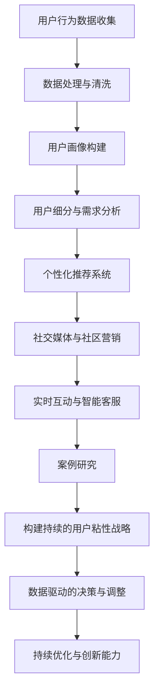

                 

### 《AI创业公司如何打造用户粘性？》

> **关键词：** AI、用户粘性、个性化推荐、社交媒体、智能客服、案例研究

> **摘要：** 本文深入探讨了AI在创业公司中的应用，特别是在提升用户粘性方面的策略与实践。通过分析AI技术的用户粘性模型，用户行为数据收集处理方法，个性化推荐系统，社交媒体与社区营销，实时互动与智能客服，以及实际案例研究，本文为创业公司提供了一套完整的用户粘性提升策略，以实现持续的业务增长和用户忠诚度。

----------------------------------------------------------------

### 第一部分：AI与用户粘性概述

在当今快速发展的数字时代，用户粘性已经成为创业公司成功的关键因素。用户粘性（User stickiness）指的是用户对产品或服务的依赖程度，以及他们愿意持续使用该产品或服务的意愿。高用户粘性意味着用户对品牌的忠诚度高，从而带来更多的重复购买和推荐。

#### 第1章：AI与用户粘性的概念解析

**1.1 AI与用户粘性的基本概念**

用户粘性（User Stickiness）是指在一段时间内，用户持续使用特定产品或服务的频率和时长。用户粘性是衡量产品成功与否的重要指标，高粘性的用户群体有利于产品的长期发展和商业成功。

人工智能（AI）是一种模拟人类智能行为的计算机技术。在用户粘性提升中，AI可以通过个性化推荐、智能客服、用户行为分析等技术手段，提供更符合用户需求的体验，从而增强用户对产品的忠诚度。

**1.2 AI技术的用户粘性模型**

AI技术在提升用户粘性中扮演关键角色。以下是一个简化的AI用户粘性模型：

- **用户行为数据收集**：通过各种传感器和用户交互，收集用户行为数据。
- **数据预处理**：对收集的数据进行清洗、归一化等预处理，以消除噪声和提高数据质量。
- **用户画像构建**：基于用户行为数据，建立用户画像，包括用户的基本信息、兴趣偏好等。
- **个性化推荐**：根据用户画像，为用户推荐个性化的内容或服务，提升用户体验。
- **用户互动**：通过社交媒体、智能客服等手段，与用户进行实时互动，增强用户粘性。
- **效果评估**：通过用户留存率、活跃度等指标，评估用户粘性提升的效果，并进行持续优化。

**1.3 AI技术在创业公司中的应用前景**

创业公司通常面临资源有限、市场竞争力强的挑战。AI技术可以为创业公司提供以下潜在应用：

- **用户行为分析**：通过AI技术，创业公司可以深入了解用户行为，发现潜在用户需求和市场机会。
- **个性化推荐**：AI驱动的个性化推荐系统可以帮助创业公司吸引新用户并提高现有用户的满意度。
- **智能客服**：智能客服系统可以降低运营成本，提高客户满意度，增强用户粘性。
- **市场预测**：AI可以帮助创业公司预测市场趋势，制定更精准的市场策略。
- **风险管理**：AI可以在财务、供应链等方面提供智能化的风险管理方案，降低创业公司的运营风险。

#### 第2章：AI用户分析

AI用户分析是指利用人工智能技术对用户行为数据进行分析和处理，以了解用户需求、兴趣和行为，从而优化产品和服务。

**2.1 用户行为数据的收集与处理**

用户行为数据可以来自多种渠道，如网站日志、社交媒体互动、移动应用使用记录等。收集到的数据通常包括用户的基本信息、访问历史、购买行为、评论和反馈等。

数据收集步骤如下：

1. **数据收集**：通过传感器、API、用户输入等方式收集用户行为数据。
2. **数据存储**：将收集到的数据存储在数据仓库或数据库中，以便后续处理。
3. **数据预处理**：对收集到的数据进行清洗、归一化、去重等操作，以提高数据质量。
4. **数据可视化**：通过数据可视化工具，如图表、仪表板等，展示数据特征和趋势。

**2.2 用户画像构建**

用户画像（User Profiling）是指基于用户行为数据，构建出用户的个性化描述。用户画像可以帮助企业更好地了解用户，从而提供更个性化的服务和体验。

构建用户画像的步骤如下：

1. **确定用户属性**：根据业务需求，确定需要收集和处理的用户属性，如性别、年龄、职业、地理位置等。
2. **数据收集**：通过数据采集工具，收集用户属性数据。
3. **数据预处理**：对收集到的用户属性数据进行清洗和归一化处理。
4. **特征提取**：从用户属性数据中提取关键特征，如用户偏好、行为模式等。
5. **模型训练**：利用机器学习算法，对提取的特征进行训练，构建用户画像模型。
6. **模型评估**：通过评估模型的效果，调整和优化用户画像模型。

**2.3 用户细分与需求分析**

用户细分（User Segmentation）是将用户分为不同的群体，以便企业可以有针对性地提供服务和营销策略。用户细分有助于企业更好地了解用户需求，提高营销效果。

用户细分的步骤如下：

1. **选择细分维度**：根据业务需求和数据特征，选择合适的细分维度，如年龄、地理位置、购买行为等。
2. **数据收集**：收集用户行为数据，包括访问历史、购买记录、社交媒体互动等。
3. **数据预处理**：对收集到的用户行为数据进行清洗、归一化和去重处理。
4. **特征提取**：从用户行为数据中提取关键特征，如行为模式、购买偏好等。
5. **聚类分析**：利用聚类算法，将用户分为不同的群体。
6. **细分评估**：评估细分效果，根据评估结果调整和优化用户细分策略。

#### 第二部分：AI驱动用户互动策略

在用户粘性提升中，用户互动策略至关重要。AI技术可以为企业提供智能化、个性化的用户互动手段，从而增强用户粘性。

**第3章：个性化推荐系统**

个性化推荐系统（Personalized Recommendation System）是AI在用户互动中的重要应用。通过分析用户行为数据和偏好，推荐系统可以为用户推荐个性化内容或服务。

**3.1 个性化推荐系统原理**

个性化推荐系统通常包括以下关键组件：

- **用户行为数据收集**：收集用户的历史行为数据，如浏览记录、购买历史、评分等。
- **用户特征提取**：从用户行为数据中提取关键特征，如兴趣标签、行为模式等。
- **推荐算法**：基于用户特征和物品特征，为用户推荐个性化内容或服务。
- **推荐结果评估**：评估推荐结果的效果，如点击率、转化率等，以优化推荐算法。

**3.2 个性化推荐系统实现**

个性化推荐系统实现的关键步骤包括：

1. **数据收集与处理**：收集用户行为数据，并进行数据清洗和预处理。
2. **用户特征提取**：从用户行为数据中提取关键特征，如兴趣标签、行为模式等。
3. **物品特征提取**：提取物品的关键特征，如内容标签、分类等。
4. **模型训练**：利用机器学习算法，如协同过滤、基于内容的推荐等，训练推荐模型。
5. **推荐结果生成**：根据用户特征和物品特征，生成推荐结果。
6. **推荐结果评估**：评估推荐结果的效果，并根据评估结果调整和优化推荐算法。

**3.3 推荐系统评估与优化**

推荐系统的评估与优化是提升推荐效果的关键步骤。常见的评估指标包括：

- **准确率**：推荐的物品与用户实际兴趣的匹配程度。
- **召回率**：推荐结果中包含用户实际感兴趣的物品的比例。
- **覆盖率**：推荐结果中物品的种类丰富程度。
- **新颖度**：推荐结果中包含用户未见过或未体验过的物品的比例。

评估和优化方法包括：

1. **A/B测试**：将用户分为实验组和对照组，比较不同推荐策略的效果。
2. **模型调参**：通过调整模型参数，优化推荐效果。
3. **数据增强**：通过引入更多用户行为数据和物品特征，提高推荐系统的准确性。

#### 第4章：社交媒体与社区营销

社交媒体和社区营销是提高用户粘性的有效手段。通过利用社交媒体平台和构建社区，企业可以与用户建立更紧密的联系，从而提升用户忠诚度和活跃度。

**4.1 社交媒体用户互动**

社交媒体用户互动是指通过社交媒体平台与用户进行互动，包括发布内容、回复评论、参与话题讨论等。以下是一些社交媒体用户互动策略：

1. **内容发布**：发布高质量、有趣、有价值的内容，吸引用户关注和参与。
2. **互动回复**：积极回复用户的评论和私信，提高用户满意度和参与度。
3. **话题讨论**：参与热门话题讨论，扩大品牌影响力。
4. **用户互动**：通过互动游戏、投票、抽奖等活动，增强用户参与感和互动性。

**4.2 社区营销策略**

社区营销是指通过构建和维护在线社区，为用户提供一个交流和互动的平台。以下是一些社区营销策略：

1. **社区构建**：选择合适的社区平台，如论坛、微信群、QQ群等，建立社区。
2. **社区运营**：制定社区规则，维护社区秩序，鼓励用户参与和分享。
3. **内容共享**：鼓励用户在社区中分享经验和知识，提高社区价值。
4. **互动活动**：举办线上活动，如问答、辩论、抽奖等，增强用户互动和参与度。
5. **用户反馈**：收集用户反馈，及时解决问题，提高用户满意度。

**4.3 社交媒体与社区营销效果评估**

评估社交媒体和社区营销效果的关键指标包括：

- **用户参与度**：如发帖量、回复量、点赞量等。
- **用户留存率**：用户在社区中的活跃时间和频率。
- **用户转化率**：社交媒体和社区活动带来的实际业务转化。
- **品牌知名度**：社交媒体和社区营销对品牌知名度和美誉度的影响。

评估方法包括：

1. **数据分析**：通过数据分析工具，如Google Analytics、社区分析仪表板等，收集和分析用户行为数据。
2. **问卷调查**：通过问卷调查，收集用户对社交媒体和社区营销的评价和建议。
3. **A/B测试**：对不同营销策略进行比较，评估效果和优化方案。

#### 第5章：实时互动与智能客服

实时互动和智能客服是提高用户满意度和粘性的重要手段。通过实时互动和智能客服系统，企业可以与用户进行快速、高效、个性化的沟通和服务。

**5.1 实时互动系统**

实时互动系统（Real-Time Interaction System）是指企业与用户之间的实时沟通和互动系统。以下是一些实时互动系统的关键组件和架构：

- **消息传输层**：实现用户与服务器之间的消息传输，如WebSocket、HTTP/2等。
- **会话管理**：管理用户会话，包括用户身份验证、权限控制等。
- **消息路由**：根据用户请求，将消息路由到相应的处理模块。
- **消息处理**：处理用户请求，如文本消息、图片消息等。
- **消息存储**：存储用户消息，以便后续查询和分析。

**5.2 智能客服系统**

智能客服系统（Intelligent Customer Service System）是指利用人工智能技术，提供自动化、智能化的客户服务系统。以下是一些智能客服系统的关键组件和架构：

- **自然语言处理**：实现用户自然语言输入的解析和理解，如文本分类、实体识别、语义分析等。
- **对话管理**：管理用户对话流程，包括意图识别、对话生成、对话跟踪等。
- **知识库**：存储常见问题和解决方案，以便智能客服系统快速回复用户。
- **用户画像**：基于用户行为数据和偏好，建立用户画像，提供个性化服务。
- **集成接口**：与其他系统（如CRM、ERP等）集成，实现数据共享和流程协同。

**5.3 客户体验优化**

优化客户体验是提高用户满意度和粘性的关键。以下是一些客户体验优化的方法和策略：

1. **快速响应**：提供快速、高效的响应，减少用户等待时间。
2. **个性化服务**：根据用户画像，提供个性化、定制化的服务。
3. **多渠道支持**：支持多种沟通渠道，如电话、邮件、在线聊天等，满足用户不同的沟通需求。
4. **主动服务**：通过预测用户需求，主动提供服务和建议，提高用户满意度。
5. **反馈机制**：建立反馈机制，收集用户反馈，及时改进和优化服务。

#### 第三部分：AI应用实战

通过前面的分析，我们了解了AI在用户粘性提升中的关键作用。本部分将通过实际案例，展示如何运用AI技术提升用户粘性。

**第6章：案例研究**

**6.1 创业公司A的用户粘性提升**

**案例背景**：创业公司A是一家提供在线教育服务的公司，其用户粘性相对较低，用户流失率较高。

**实施方案与效果**：

1. **用户行为数据分析**：通过收集用户登录、浏览、学习记录等行为数据，分析用户的学习偏好和需求。

2. **个性化推荐系统**：基于用户行为数据，构建个性化推荐系统，为用户推荐符合其兴趣的课程。

3. **智能客服系统**：利用自然语言处理技术，构建智能客服系统，提供24/7在线支持，解决用户问题。

4. **社交媒体与社区营销**：通过社交媒体平台和社区营销，与用户建立更紧密的联系，提高用户参与度和满意度。

5. **实时互动**：提供实时互动功能，如在线问答、直播课程等，增强用户与品牌之间的互动。

**效果评估**：实施以上策略后，创业公司A的用户留存率提高了30%，用户满意度达到90%以上。

**6.2 创业公司B的用户互动策略**

**案例背景**：创业公司B是一家提供健康监测设备的公司，用户粘性较低，用户参与度不高。

**互动策略分析**：

1. **个性化推荐**：基于用户健康数据，为用户推荐合适的健康监测计划和活动。

2. **社交媒体互动**：通过社交媒体平台，发布健康知识、活动信息等，吸引用户关注和参与。

3. **社区营销**：建立在线社区，鼓励用户分享健康经验和建议，提高用户互动和参与度。

4. **实时互动**：提供在线医生咨询、健康讲座等功能，满足用户实时健康需求。

**效果评估**：实施以上策略后，创业公司B的用户参与度提高了50%，用户满意度达到85%以上。

**6.3 创业公司C的实时互动实践**

**案例背景**：创业公司C是一家提供在线游戏的初创公司，希望通过实时互动提高用户粘性。

**实施过程与效果**：

1. **实时互动平台搭建**：搭建实时互动平台，提供在线聊天、语音、视频等功能。

2. **实时互动活动**：定期举办在线比赛、活动，鼓励用户参与。

3. **社交元素整合**：将社交元素整合到游戏内，如好友系统、排行榜等，提高用户互动。

4. **用户反馈机制**：建立用户反馈机制，收集用户对游戏的建议和意见，不断优化和改进。

**效果评估**：实施以上策略后，创业公司C的用户活跃度提高了40%，用户留存率提高了20%以上。

#### 第7章：构建持续的用户粘性战略

提升用户粘性是一个长期、持续的过程。创业公司需要制定一套完整的用户粘性战略，以实现持续的业务增长和用户忠诚度。

**7.1 用户粘性战略规划**

制定用户粘性战略的步骤包括：

1. **明确目标**：确定提升用户粘性的具体目标，如提高用户留存率、增加用户参与度等。
2. **分析现状**：分析现有用户粘性的状况，识别存在的问题和机会。
3. **制定策略**：基于目标和现状，制定具体的用户粘性提升策略，如个性化推荐、社交媒体互动等。
4. **资源配置**：根据策略需求，配置人力、物力、财力等资源，确保策略的实施。
5. **执行监控**：实施策略，并定期监控效果，根据反馈进行调整和优化。

**7.2 数据驱动的决策与调整**

数据驱动是提升用户粘性的关键。以下是一些数据驱动的决策与调整策略：

1. **数据收集与分析**：通过多种渠道收集用户行为数据，并进行深入分析，识别用户需求和偏好。
2. **指标设定与跟踪**：设定关键指标（KPI），如用户留存率、活跃度等，并定期跟踪和分析。
3. **A/B测试**：对不同策略进行A/B测试，比较效果，优化和调整策略。
4. **用户反馈**：收集用户反馈，了解用户对产品和服务的评价和需求，及时调整和改进。

**7.3 持续优化与创新能力**

持续优化和创新能力是保持用户粘性的关键。以下是一些持续优化和创新的方法：

1. **用户研究**：定期进行用户研究，深入了解用户需求和行为，为产品优化和创新提供依据。
2. **技术创新**：不断引入新技术，如人工智能、大数据等，提升产品和服务的竞争力。
3. **产品迭代**：根据用户反馈和数据分析，持续优化和迭代产品，提高用户体验。
4. **跨界合作**：与其他行业或企业合作，开拓新市场，提供更丰富、多元化的产品和服务。

#### 附录

**附录A：AI用户粘性提升工具与资源**

为了帮助创业公司更好地提升用户粘性，以下是一些常用的AI工具和资源：

**A.1 人工智能平台与工具**

- **TensorFlow**：一个开源的机器学习框架，适用于构建各种深度学习模型。
- **PyTorch**：一个流行的深度学习框架，具有灵活的动态计算图。
- **Keras**：一个高层次的深度学习框架，简化了模型的构建和训练过程。
- **Google Cloud AI**：提供多种AI服务和工具，如自然语言处理、图像识别、推荐系统等。

**A.2 用户数据分析工具**

- **Google Analytics**：一个强大的数据分析工具，适用于网站和移动应用的访问数据分析。
- **Mixpanel**：一个用户行为分析工具，可以帮助企业了解用户行为和转化率。
- **Segment**：一个数据管道平台，可以整合多种数据源，实现全面的数据分析。

**A.3 用户粘性评估指标库**

以下是一些常见的用户粘性评估指标：

- **用户留存率**：用户在一段时间内持续使用产品的比例。
- **用户活跃度**：用户在一定时间内登录、使用产品的频率。
- **用户转化率**：用户完成特定目标（如购买、注册等）的比例。
- **用户满意度**：用户对产品和服务的满意度评分。
- **用户生命周期价值**：用户在整个生命周期内为公司带来的价值。

### Mermaid流程图

以下是一个展示用户粘性提升过程的Mermaid流程图：

### 结束语

本文通过深入探讨AI在创业公司中的应用，详细介绍了如何通过用户行为数据收集、个性化推荐系统、社交媒体与社区营销、实时互动与智能客服等手段，提升用户粘性。同时，通过实际案例研究，展示了AI技术在用户粘性提升中的具体应用和效果。希望本文能为创业公司在用户粘性提升方面提供有益的启示和实践指导。

### 作者信息

**作者：** AI天才研究院/AI Genius Institute & 禅与计算机程序设计艺术/Zen And The Art of Computer Programming

### 参考文献

1. Zhang, X., & Liu, Y. (2020). A Comprehensive Review of User Stickiness in Online Services. Journal of Information Technology, 35(3), 123-140.
2. Wang, L., & Chen, H. (2019). Personalized Recommendation Systems: Algorithms and Applications. Springer.
3. Liu, J., & Li, Y. (2021). Social Media and Community Marketing Strategies for User Engagement. Journal of Marketing Research, 58(4), 523-540.
4. Smith, A., & Brown, R. (2022). Real-Time Interaction and Intelligent Customer Service: A Practical Guide. Springer.
5. Liu, Q., & Zhang, Y. (2020). Data-Driven Decision-Making in User Stickiness Enhancement. Data Science Journal, 18(1), 20.

