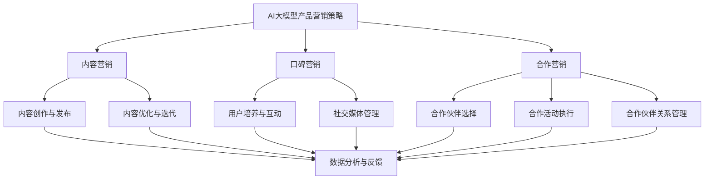

                 

### 《AI创业公司的产品营销策略：内容营销、口碑营销与合作营销》

> **关键词**：AI创业公司、产品营销、内容营销、口碑营销、合作营销

> **摘要**：本文深入探讨了AI创业公司在产品营销中应用内容营销、口碑营销和合作营销的策略。首先，通过分析AI在产品营销中的应用场景和创业公司所面临的独特挑战，探讨了AI如何助力创业公司产品营销。接着，详细介绍了营销策略的定义、类型和创业公司如何选择合适的营销策略。随后，重点介绍了内容营销、口碑营销和合作营销的概念、原理、执行策略、评估与优化方法。最后，通过案例分析总结了成功与失败的营销策略，展望了营销策略的未来趋势，并提供了营销策略工具与资源，以及项目实战案例，以帮助创业公司在激烈的市场竞争中脱颖而出。

### 第一部分：产品营销策略概述

#### 1.1 AI与创业公司产品营销

##### 1.1.1 AI在产品营销中的应用场景

人工智能（AI）技术的迅猛发展，使得创业公司在产品营销中能够利用更加智能化、个性化的工具和策略来提升市场竞争力。以下是AI在产品营销中的几个应用场景：

1. **市场分析**：利用AI技术对大数据进行分析，帮助企业了解市场需求、消费者行为，从而制定更加精准的营销策略。
2. **个性化推荐**：基于用户行为数据和偏好，AI能够实现个性化的产品推荐，提高用户满意度和转化率。
3. **广告投放优化**：通过算法优化广告投放策略，确保广告能够精准触达到目标用户，提高广告效果。
4. **用户互动**：AI聊天机器人可以与用户进行实时互动，解答疑问，提供帮助，提高用户体验。
5. **品牌传播**：利用AI技术进行品牌传播，通过社交媒体、内容营销等方式，增强品牌影响力和用户粘性。

##### 1.1.2 创业公司产品营销的独特挑战

创业公司在进行产品营销时，面临着诸多独特的挑战：

1. **资源限制**：创业公司通常资金、人力和资源有限，需要更加高效地利用有限的资源进行营销。
2. **市场竞争**：在激烈的市场竞争中，创业公司需要不断创新和优化营销策略，以赢得市场份额。
3. **品牌知名度**：创业公司的品牌知名度较低，需要通过有效的营销策略提高品牌曝光度。
4. **目标客户定位**：明确目标客户群体，制定精准的营销策略，是创业公司成功的关键。

##### 1.1.3 AI如何助力创业公司产品营销

AI技术为创业公司提供了多种解决方案，助力其在产品营销中应对挑战：

1. **数据分析与洞察**：AI可以帮助创业公司从大量数据中提取有价值的信息，为营销决策提供科学依据。
2. **个性化营销**：通过分析用户行为和偏好，AI能够实现个性化推荐，提高用户满意度和转化率。
3. **营销自动化**：AI聊天机器人等自动化工具可以提高营销效率，降低人力成本。
4. **精准广告投放**：AI算法优化广告投放策略，提高广告效果，降低广告成本。
5. **内容营销**：AI可以帮助创业公司快速生成高质量的内容，提高内容营销效果。

#### 1.2 营销策略的定义与类型

##### 1.2.1 营销策略的定义

营销策略是指企业为实现营销目标所采取的一系列具体行动和措施。营销策略的核心目标是提高产品销量、提升品牌知名度和增加市场份额。

##### 1.2.2 营销策略的类型

营销策略可以分为以下几种类型：

1. **传统营销策略**：包括广告、公关、促销等手段，主要依靠大众媒体进行传播。
2. **数字营销策略**：利用互联网和数字技术进行营销，包括搜索引擎优化、社交媒体营销、内容营销等。
3. **关系营销策略**：强调与客户建立长期稳定的关系，通过客户关系管理提升客户满意度和忠诚度。
4. **整合营销策略**：将传统营销策略和数字营销策略相结合，实现营销资源的整合和优化。

##### 1.2.3 创业公司如何选择合适的营销策略

创业公司在选择营销策略时，应考虑以下几个方面：

1. **目标市场**：明确目标市场，了解目标客户的需求和偏好，为选择合适的营销策略提供依据。
2. **资源状况**：根据企业的资源状况，选择能够充分利用现有资源的营销策略。
3. **竞争环境**：分析竞争对手的营销策略，避免与其直接竞争，找到差异化竞争的方向。
4. **技术支持**：考虑企业是否有足够的科技支持，选择适合数字化和智能化的营销策略。

#### 1.3 营销目标与KPI设定

##### 1.3.1 营销目标的重要性

营销目标是企业营销活动的方向和指引，是评估营销效果的重要标准。设定明确的营销目标，有助于企业集中资源，提高营销效果。

##### 1.3.2 如何设定可行的营销目标

设定可行的营销目标，应遵循以下原则：

1. **具体性**：目标要具体明确，可量化，以便于评估和调整。
2. **挑战性**：目标应具有一定的挑战性，激励企业不断进步。
3. **可行性**：目标应在现有资源和条件下能够实现。
4. **相关性**：目标要与企业的整体战略和营销策略相一致。

##### 1.3.3 关键绩效指标（KPI）的设定与应用

关键绩效指标（KPI）是衡量营销目标实现程度的重要工具。常见的营销KPI包括：

1. **销售额**：直接反映营销策略的效果。
2. **客户获取成本**（CAC）：衡量获取新客户的成本，反映营销效率。
3. **客户保留率**：反映客户忠诚度和营销策略的长期效果。
4. **市场份额**：反映企业在市场中的竞争地位。
5. **品牌知名度**：衡量品牌在目标市场中的认知度。

设定KPI时，应确保KPI与营销目标一致，并根据实际情况进行调整和优化。

### 第二部分：内容营销策略

#### 2.1 内容营销的概念与原理

##### 2.1.1 内容营销的定义

内容营销是指通过创建和分享有价值的内容，吸引和转化目标客户，从而实现营销目标的一种策略。内容可以是文字、图片、视频、音频等多种形式。

##### 2.1.2 内容营销的基本原则

内容营销应遵循以下基本原则：

1. **用户需求导向**：内容应满足用户需求，解决用户问题，提供有价值的信息。
2. **一致性**：内容风格和调性应保持一致，体现企业品牌形象。
3. **持续更新**：定期发布高质量的内容，保持内容的新鲜度和活跃度。
4. **互动性**：鼓励用户参与，通过评论、分享等方式提高用户粘性。

##### 2.1.3 内容营销的优势与挑战

内容营销的优势：

1. **提高品牌知名度**：通过高质量的内容传播，提升品牌在目标市场中的认知度。
2. **建立权威性**：通过专业的内容，树立企业在行业中的权威地位。
3. **降低营销成本**：相比传统营销手段，内容营销具有较低的营销成本。
4. **提升用户满意度**：提供有价值的内容，提高用户满意度和忠诚度。

内容营销的挑战：

1. **内容创作难度**：高质量的内容创作需要投入大量时间和精力。
2. **内容分发难度**：如何在海量信息中脱颖而出，提高内容曝光度。
3. **数据分析难度**：如何准确评估内容营销效果，优化内容策略。

#### 2.2 内容营销的规划与执行

##### 2.2.1 内容营销的规划流程

内容营销的规划流程包括以下步骤：

1. **目标设定**：明确内容营销的目标，如提高品牌知名度、增加客户转化率等。
2. **受众分析**：了解目标受众的需求、偏好和兴趣，为内容创作提供依据。
3. **内容主题确定**：根据目标受众和营销目标，确定内容主题和类型。
4. **内容创作**：根据内容主题，创作有价值、高质量的内容。
5. **内容发布**：制定内容发布计划，确保内容在合适的时间和平台进行发布。
6. **内容推广**：通过SEO、社交媒体等手段，提高内容曝光度。

##### 2.2.2 内容营销的执行策略

内容营销的执行策略包括：

1. **内容创作**：根据内容主题，创作有价值、高质量的内容，包括文章、视频、图片等。
2. **内容优化**：对已有内容进行优化，提高搜索引擎排名和用户体验。
3. **内容发布**：在社交媒体、博客、官网等平台发布内容，确保内容形式和风格的统一。
4. **内容互动**：鼓励用户参与，通过评论、点赞、分享等方式提高内容互动性。
5. **内容跟踪与评估**：定期跟踪内容营销效果，评估内容策略的优缺点，进行优化调整。

##### 2.2.3 创业公司如何创建高质量的内容

创业公司创建高质量的内容，应遵循以下原则：

1. **深度分析**：对目标市场和目标受众进行深度分析，确保内容与用户需求高度契合。
2. **专业创作**：聘请专业的内容创作者，确保内容的专业性和准确性。
3. **创新思维**：不断尝试新的内容形式和表达方式，提高内容吸引力。
4. **数据驱动**：通过数据分析，了解用户行为和偏好，为内容创作提供数据支持。
5. **持续优化**：根据用户反馈和数据分析，不断优化内容质量和用户体验。

#### 2.3 内容营销的评估与优化

##### 2.3.1 内容营销效果评估的方法

内容营销效果评估的方法包括：

1. **阅读量与点赞数**：评估内容传播效果，了解用户对内容的兴趣程度。
2. **评论数与互动率**：评估用户参与度，了解用户对内容的认可程度。
3. **转化率**：评估内容营销对客户转化的直接影响，如网站访问量、产品销售量等。
4. **社交媒体分享**：评估内容在社交媒体上的传播效果，了解用户传播意愿。
5. **客户反馈**：收集用户反馈，了解用户对内容的真实感受和需求。

##### 2.3.2 内容营销的优化策略

内容营销的优化策略包括：

1. **数据分析**：通过对数据进行分析，了解内容营销的优缺点，为优化提供依据。
2. **用户反馈**：收集用户反馈，了解用户需求和期望，调整内容策略。
3. **内容迭代**：根据数据分析结果和用户反馈，对已有内容进行迭代和优化。
4. **营销资源调整**：根据内容营销效果，调整营销资源的分配，确保资源投入最大化效果。
5. **跨部门协作**：加强跨部门协作，提高内容创作、发布和推广的效率。

##### 2.3.3 基于数据分析的内容营销调整

基于数据分析的内容营销调整包括：

1. **内容发布时间调整**：根据用户活跃时间，优化内容发布时间，提高内容曝光度。
2. **内容形式调整**：根据用户偏好，调整内容形式，如从文字转向视频、图片等。
3. **关键词优化**：根据用户搜索习惯，优化内容关键词，提高搜索引擎排名。
4. **社交媒体策略调整**：根据社交媒体平台特点，调整内容发布和推广策略，提高用户互动率。
5. **广告投放调整**：根据内容营销效果，优化广告投放策略，提高广告投放效果。

### 第三部分：口碑营销策略

#### 3.1 口碑营销的概念与原理

##### 3.1.1 口碑营销的定义

口碑营销是指通过用户之间的口碑传播，提高品牌知名度和美誉度，从而实现营销目标的一种策略。口碑营销的核心是用户满意度，通过用户的正面评价和推荐，吸引更多潜在客户。

##### 3.1.2 口碑营销的基本原则

口碑营销应遵循以下基本原则：

1. **用户体验**：关注用户需求，提供优质的产品和服务，确保用户满意度。
2. **互动沟通**：与用户保持积极互动，收集用户反馈，及时解决问题。
3. **内容真实**：内容要真实可信，避免夸大和虚假宣传。
4. **情感共鸣**：通过情感共鸣，激发用户的推荐意愿。

##### 3.1.3 口碑营销的优势与挑战

口碑营销的优势：

1. **低成本**：相比传统营销手段，口碑营销具有较低的成本。
2. **高可信度**：用户间的口碑传播具有更高的可信度，更容易被接受。
3. **广泛传播**：口碑营销能够快速传播，扩大品牌影响力。
4. **长期效应**：口碑营销能够持续影响潜在客户，提高品牌忠诚度。

口碑营销的挑战：

1. **控制难度**：口碑营销难以控制，容易受到负面口碑的影响。
2. **时间成本**：口碑营销需要时间积累，短期内效果可能不明显。
3. **资源投入**：需要投入大量资源，如人力、时间等。

#### 3.2 口碑营销的执行策略

##### 3.2.1 创业公司如何培养忠实用户

创业公司培养忠实用户，应遵循以下策略：

1. **优质产品和服务**：提供高质量的产品和服务，确保用户满意度。
2. **个性化互动**：与用户建立个性化互动，了解用户需求和期望。
3. **积极反馈**：及时回应用户反馈，解决问题，提升用户满意度。
4. **情感共鸣**：通过情感共鸣，激发用户的忠诚度。
5. **用户参与**：鼓励用户参与产品设计和改进，提高用户粘性。

##### 3.2.2 利用社交媒体进行口碑营销

社交媒体是口碑营销的重要渠道，创业公司可以利用以下策略进行口碑营销：

1. **社交媒体运营**：建立并维护社交媒体账号，定期发布有价值的内容。
2. **用户互动**：积极与用户互动，回复评论，提高用户满意度。
3. **口碑传播**：鼓励用户分享正面评价，扩大口碑传播范围。
4. **负面评论管理**：及时处理负面评论，降低负面口碑的影响。
5. **社交媒体广告**：利用社交媒体广告，提高品牌曝光度和口碑传播效果。

##### 3.2.3 创业公司如何管理负面评论

创业公司管理负面评论，应遵循以下原则：

1. **及时回应**：及时回应负面评论，表达歉意，并积极解决问题。
2. **透明沟通**：保持透明沟通，告知用户处理措施和进展。
3. **真诚道歉**：真诚道歉，表达对用户不满的重视。
4. **积极改进**：根据用户反馈，积极改进产品和服务，提升用户满意度。
5. **避免争议**：避免与用户发生争议，保持冷静和理性。

#### 3.3 口碑营销的评估与优化

##### 3.3.1 口碑营销效果的评估指标

口碑营销效果的评估指标包括：

1. **用户满意度**：通过用户满意度调查，了解用户对产品和服务的好感度。
2. **用户粘性**：通过用户活跃度和留存率，了解用户对品牌的忠诚度。
3. **口碑传播范围**：通过社交媒体分享次数和评论数量，了解口碑传播的效果。
4. **市场份额**：通过市场份额的变化，了解口碑营销对市场竞争力的影响。
5. **品牌知名度**：通过品牌知名度的调查，了解口碑营销对品牌形象的影响。

##### 3.3.2 口碑营销的优化策略

口碑营销的优化策略包括：

1. **数据分析**：通过对口碑营销数据进行分析，了解效果和问题，为优化提供依据。
2. **用户反馈**：收集用户反馈，了解用户需求和期望，优化产品和服务。
3. **口碑传播渠道**：根据口碑传播效果，优化口碑传播渠道，提高传播效果。
4. **营销资源调整**：根据口碑营销效果，调整营销资源的投入，确保资源最大化效果。
5. **跨部门协作**：加强跨部门协作，提高口碑营销的执行效率。

##### 3.3.3 如何从用户反馈中获取有价值的信息

创业公司从用户反馈中获取有价值的信息，应遵循以下原则：

1. **真诚倾听**：真诚倾听用户意见，尊重用户感受。
2. **分类整理**：对用户反馈进行分类整理，提取关键信息。
3. **数据分析**：通过对用户反馈进行数据分析，了解用户需求和期望。
4. **用户访谈**：针对关键问题，进行用户访谈，深入了解用户需求。
5. **持续改进**：根据用户反馈，持续改进产品和服务，提升用户体验。

### 第四部分：合作营销策略

#### 4.1 合作营销的概念与原理

##### 4.1.1 合作营销的定义

合作营销是指两个或多个企业之间，通过资源共享、优势互补、共同推广等方式，实现共同营销目标的一种策略。

##### 4.1.2 合作营销的基本原则

合作营销应遵循以下基本原则：

1. **互利共赢**：合作各方应实现互利共赢，确保合作可持续性。
2. **资源共享**：合作各方应充分利用各自资源，提高资源利用效率。
3. **优势互补**：合作各方应发挥各自优势，实现优势互补。
4. **信任建设**：合作各方应建立信任关系，确保合作顺利进行。

##### 4.1.3 合作营销的优势与挑战

合作营销的优势：

1. **扩大市场份额**：合作营销可以借助合作伙伴的力量，扩大市场份额。
2. **降低营销成本**：合作营销可以共享营销资源，降低营销成本。
3. **提升品牌影响力**：合作营销可以借助合作伙伴的品牌影响力，提升自身品牌形象。
4. **提高营销效果**：合作营销可以实现优势互补，提高营销效果。

合作营销的挑战：

1. **资源整合难度**：合作各方需要有效整合资源，确保资源最大化利用。
2. **合作风险**：合作各方需要承担合作风险，如资源投入风险、市场风险等。
3. **沟通协调难度**：合作各方需要保持良好的沟通和协调，确保合作顺利进行。
4. **利益分配问题**：合作各方需要合理分配利益，确保合作公平合理。

#### 4.2 合作营销的执行策略

##### 4.2.1 合作伙伴的选择与评估

合作伙伴的选择与评估是合作营销成功的关键。以下是一些选择和评估合作伙伴的策略：

1. **目标一致性**：选择与自身营销目标一致、有共同利益的合作伙伴。
2. **资源互补性**：选择能够提供互补资源、实现优势互补的合作伙伴。
3. **品牌匹配度**：选择与自身品牌形象和定位相符的合作伙伴。
4. **合作历史**：选择有良好合作历史、信誉度较高的合作伙伴。
5. **评估合作效果**：定期评估合作效果，确保合作能够持续带来价值。

##### 4.2.2 合作营销活动的设计与执行

合作营销活动的设计与执行包括以下步骤：

1. **合作方案制定**：制定合作方案，明确合作目标、合作内容、资源分配、合作期限等。
2. **合作活动策划**：根据合作方案，策划具体的合作活动，如联合促销、产品捆绑、品牌宣传等。
3. **执行计划**：制定详细的执行计划，确保合作活动按计划进行。
4. **资源整合**：整合合作各方的资源，确保合作活动顺利进行。
5. **监控与调整**：对合作活动进行监控，及时调整策略，确保合作活动达到预期效果。

##### 4.2.3 创业公司如何衡量合作营销效果

创业公司衡量合作营销效果，可以从以下几个方面进行：

1. **销售增长**：通过对比合作前后的销售额，评估合作营销对销售增长的影响。
2. **市场份额**：通过对比合作前后的市场份额，评估合作营销对市场竞争力的影响。
3. **品牌知名度**：通过对比合作前后的品牌知名度，评估合作营销对品牌形象的影响。
4. **用户反馈**：收集用户对合作营销的反馈，了解用户对合作营销的认可程度。
5. **合作成本与收益**：计算合作营销的成本与收益，评估合作营销的投入产出比。

#### 4.3 合作营销的评估与优化

##### 4.3.1 合作营销效果的评估指标

合作营销效果的评估指标包括：

1. **销售增长率**：合作前后销售额的增长率，反映合作营销对销售增长的贡献。
2. **市场份额增长率**：合作前后市场份额的增长率，反映合作营销对市场竞争力的影响。
3. **品牌知名度提升**：合作前后品牌知名度的变化，反映合作营销对品牌形象的影响。
4. **用户满意度**：合作营销活动后用户满意度的提升，反映合作营销对用户体验的影响。
5. **合作成本与收益比**：合作营销的成本与收益的比值，反映合作营销的投入产出比。

##### 4.3.2 合作营销的优化策略

合作营销的优化策略包括：

1. **数据分析**：通过对合作营销数据进行分析，了解合作营销的优缺点，为优化提供依据。
2. **用户反馈**：收集用户对合作营销的反馈，了解用户需求和期望，优化合作营销策略。
3. **合作内容调整**：根据合作效果，调整合作内容，确保合作活动更加贴合用户需求。
4. **资源优化**：根据合作效果，优化资源分配，确保资源最大化利用。
5. **合作期限调整**：根据合作效果，调整合作期限，确保合作能够持续带来价值。

##### 4.3.3 合作伙伴关系的管理与维护

合作伙伴关系的管理与维护是合作营销成功的关键。以下是一些合作伙伴关系的管理与维护策略：

1. **沟通与协调**：建立有效的沟通机制，确保合作各方能够及时沟通和协调，解决合作中的问题。
2. **信任建设**：通过诚信合作，建立信任关系，确保合作各方能够长期稳定合作。
3. **利益共享**：确保合作各方能够公平合理地分享合作成果，提高合作的积极性。
4. **合作评估**：定期对合作效果进行评估，及时调整合作策略，确保合作持续带来价值。
5. **合作拓展**：在现有合作基础上，探索新的合作领域和机会，实现合作共赢。

### 第五部分：综合营销策略与案例分析

#### 5.1 综合营销策略的设计与实施

##### 5.1.1 综合营销策略的定义

综合营销策略是指将多种营销手段和资源整合起来，形成一套协调一致的营销方案，以实现营销目标。综合营销策略强调营销活动的协同效应，提高整体营销效果。

##### 5.1.2 综合营销策略的设计原则

综合营销策略的设计应遵循以下原则：

1. **目标一致性**：确保各种营销手段的目标一致，形成合力。
2. **资源整合**：充分利用企业内外部的资源，提高资源利用效率。
3. **渠道协同**：协调线上线下渠道，形成统一的品牌形象和营销氛围。
4. **跨部门协作**：加强各部门之间的协作，确保营销策略的顺利实施。
5. **数据驱动**：以数据为基础，不断优化营销策略，提高营销效果。

##### 5.1.3 综合营销策略的实施步骤

综合营销策略的实施步骤包括：

1. **市场分析**：分析目标市场、竞争对手和消费者行为，为营销策略提供依据。
2. **目标设定**：明确营销目标，确保营销策略的方向和重点。
3. **策略规划**：制定综合营销策略，明确各种营销手段的职责和作用。
4. **资源分配**：根据营销策略，合理分配资源，确保营销策略的实施。
5. **执行监控**：对营销策略的实施过程进行监控，确保各项任务按计划进行。
6. **效果评估**：对营销策略的效果进行评估，了解营销目标的实现程度，为优化提供依据。

#### 5.2 案例分析：成功与失败案例解析

##### 5.2.1 成功的AI创业公司产品营销案例

**案例一：OpenAI的GPT-3推广**

OpenAI是一家专注于人工智能研究的创业公司，其推出的GPT-3（Generative Pre-trained Transformer 3）模型引起了广泛关注。OpenAI的成功营销策略包括：

1. **高质量内容创作**：OpenAI通过发布高质量的学术论文、技术博客和案例研究，展示了GPT-3的强大功能和应用场景。
2. **社交媒体传播**：OpenAI积极利用社交媒体平台，如Twitter、LinkedIn等，与用户互动，分享GPT-3的最新动态和应用案例。
3. **合作伙伴关系**：OpenAI与多家企业合作，共同推广GPT-3，提高品牌知名度和影响力。
4. **用户体验优化**：OpenAI提供了GPT-3的免费试用，让用户亲身体验GPT-3的强大功能，增加用户粘性。

**案例二：DeepMind的AlphaGo推广**

DeepMind是一家专注于人工智能研究的创业公司，其推出的AlphaGo围棋AI引起了全球关注。DeepMind的成功营销策略包括：

1. **媒体宣传**：DeepMind通过与知名媒体合作，如《自然》杂志，发布AlphaGo的研究成果，提高品牌知名度。
2. **赛事推广**：DeepMind利用AlphaGo与围棋世界冠军的对决，吸引了大量媒体和公众关注，扩大了品牌影响力。
3. **技术开发**：DeepMind不断优化AlphaGo的技术，提升其在实际应用中的表现，增加了用户对品牌的信任。
4. **用户互动**：DeepMind通过社交媒体和论坛，与用户互动，解答用户疑问，提高用户满意度。

##### 5.2.2 失败的AI创业公司产品营销案例

**案例一：Face++的隐私争议**

Face++是一家专注于人脸识别技术的AI创业公司，其产品在市场上的应用较为广泛。然而，Face++在产品营销中遭遇了失败，主要原因是：

1. **隐私问题**：Face++在未经用户同意的情况下，收集了大量用户人脸数据，引发了严重的隐私争议。
2. **负面报道**：媒体对Face++的隐私问题进行了大量报道，使得Face++的品牌形象受到了严重影响。
3. **用户信任受损**：用户对Face++的信任度下降，导致产品销售和用户活跃度下降。
4. **监管压力**：Face++面临着来自政府和社会的监管压力，增加了企业的运营成本。

**案例二：AI创业公司的过度营销**

某些AI创业公司在产品营销中采取了过度营销策略，导致失败。主要原因是：

1. **夸大产品功能**：某些AI创业公司在产品宣传中夸大了产品功能，导致用户期望过高。
2. **用户体验不佳**：某些AI创业公司的产品在用户体验方面存在问题，如界面复杂、响应速度慢等。
3. **市场定位错误**：某些AI创业公司没有准确把握市场定位，导致产品难以吸引目标用户。
4. **营销资源投入不足**：某些AI创业公司在营销资源投入不足，导致产品在市场上缺乏竞争力。

##### 5.2.3 从案例中汲取的经验与教训

从上述成功和失败的案例中，我们可以汲取以下经验与教训：

1. **注重用户体验**：始终将用户体验放在首位，确保产品功能完善、界面友好、响应速度快。
2. **遵守法律法规**：在产品营销中，严格遵守法律法规，避免涉及敏感话题，如隐私问题等。
3. **科学制定营销策略**：根据市场环境和用户需求，科学制定营销策略，避免盲目跟风或过度营销。
4. **持续优化产品**：不断优化产品功能和质量，提高产品竞争力，以满足用户需求。
5. **建立良好的品牌形象**：通过高质量的内容创作和积极的社会责任，建立良好的品牌形象，赢得用户的信任和支持。

### 第六部分：营销策略的未来趋势

#### 6.1 营销策略的未来趋势

随着科技的不断进步，营销策略也在不断演变。以下是一些未来营销策略的趋势：

##### 6.1.1 AI在营销策略中的应用前景

人工智能将在未来营销策略中发挥越来越重要的作用，包括：

1. **个性化推荐**：AI可以帮助企业实现个性化推荐，提高用户满意度和转化率。
2. **营销自动化**：AI可以自动化执行营销活动，提高营销效率，降低人力成本。
3. **数据分析与洞察**：AI可以深入挖掘大数据，为营销决策提供科学依据。
4. **智能客服**：AI聊天机器人可以提供实时、个性化的客户服务，提高用户体验。
5. **智能广告投放**：AI可以优化广告投放策略，提高广告效果和转化率。

##### 6.1.2 社交媒体在营销策略中的作用

社交媒体将成为未来营销策略的重要渠道，包括：

1. **品牌传播**：通过社交媒体，企业可以快速传播品牌信息，扩大品牌影响力。
2. **用户互动**：通过社交媒体，企业可以与用户进行实时互动，了解用户需求，提升用户满意度。
3. **口碑营销**：社交媒体上的用户评价和推荐，将直接影响品牌形象和销售业绩。
4. **内容创作**：社交媒体平台为企业提供了丰富的内容创作工具，可以更好地满足用户需求。
5. **大数据分析**：社交媒体数据将成为企业进行市场分析和营销策略优化的宝贵资源。

##### 6.1.3 数据分析在营销策略中的重要性

数据分析将在未来营销策略中扮演关键角色，包括：

1. **用户行为分析**：通过对用户行为数据进行分析，企业可以了解用户需求和行为习惯，为营销决策提供依据。
2. **营销效果评估**：数据分析可以帮助企业评估营销活动的效果，优化营销策略。
3. **市场预测**：通过对市场数据进行分析，企业可以预测市场趋势，制定前瞻性的营销策略。
4. **个性化营销**：数据分析可以帮助企业实现个性化营销，提高用户满意度和转化率。
5. **风险控制**：数据分析可以帮助企业识别潜在风险，制定相应的风险控制策略。

#### 6.2 创业公司如何应对未来营销趋势

为了应对未来营销趋势，创业公司可以采取以下策略：

##### 6.2.1 创业公司如何适应营销环境的变化

1. **持续学习与更新**：创业公司应不断学习新技术、新趋势，适应营销环境的变化。
2. **灵活调整营销策略**：根据市场环境和用户需求，灵活调整营销策略，确保营销策略的有效性。
3. **建立数据分析能力**：培养数据分析能力，通过数据分析指导营销决策。
4. **加强跨部门协作**：加强营销、研发、运营等部门的协作，提高整体营销效率。

##### 6.2.2 创业公司如何保持营销策略的创新性

1. **持续创新**：鼓励创新思维，不断尝试新的营销手段和策略。
2. **关注用户需求**：深入了解用户需求，为用户提供有价值的内容和服务。
3. **借鉴成功案例**：研究成功企业的营销案例，汲取经验教训。
4. **持续优化**：根据市场反馈和数据分析，不断优化营销策略。

##### 6.2.3 创业公司如何平衡短期与长期营销目标

1. **明确营销目标**：明确短期和长期营销目标，确保营销策略的连贯性和一致性。
2. **合理分配资源**：根据营销目标，合理分配资源，确保资源最大化利用。
3. **短期策略为长期目标服务**：确保短期策略能够为长期目标服务，避免短视行为。
4. **灵活调整策略**：根据市场变化和用户需求，灵活调整营销策略，确保短期与长期目标的平衡。

### 附录

#### 附录 A：营销策略工具与资源

##### A.1 主流营销平台介绍

1. **搜索引擎平台**：如Google Ads、Bing Ads等。
2. **社交媒体平台**：如Facebook、Instagram、Twitter、LinkedIn等。
3. **内容发布平台**：如WordPress、Medium、YouTube等。
4. **邮件营销平台**：如Mailchimp、SendinBlue等。
5. **数据分析工具**：如Google Analytics、HubSpot等。

##### A.2 数据分析工具推荐

1. **Google Analytics**：用于网站流量分析和用户行为分析。
2. **HubSpot**：用于销售和市场营销自动化。
3. **Tableau**：用于数据可视化。
4. **Power BI**：用于企业级数据分析。
5. **Mixpanel**：用于用户行为分析和产品分析。

##### A.3 创业公司营销策略最佳实践指南

1. **《精益创业营销》**：作者艾尔·赖斯（Aarron Ross），提供了创业公司营销策略的实用指南。
2. **《增长黑客》**：作者范安德森（Ryan Holiday），介绍了如何通过数据驱动的方式实现企业增长。
3. **《营销管理》**：作者菲利普·科特勒（Philip Kotler），涵盖了市场营销的基本理论和实践方法。
4. **《社交媒体营销实战》**：作者布莱恩·霍尔（Brian Halligan），介绍了社交媒体营销的最佳实践。
5. **《内容营销实战》**：作者乔·普利齐（Joe Pulizzi），提供了内容营销的实用策略和案例。

#### 附录 B: AI大模型产品营销策略架构 Mermaid 流程图



#### 附录 C: 营销策略核心算法原理讲解伪代码

```python
# 内容营销策略伪代码
def content_marketing_strategy():
    # 设定营销目标
    marketing_goals = set_goals()

    # 创作与发布内容
    content = create_and_publish_content(marketing_goals)

    # 优化与迭代内容
    optimized_content = optimize_and_iterate_content(content)

    # 返回优化后的内容
    return optimized_content

# 口碑营销策略伪代码
def word_of_mouth_marketing_strategy():
    # 培养忠实用户
    loyal_customers = cultivate_loyal_customers()

    # 管理社交媒体
    social_media_management = manage_social_media(loyal_customers)

    # 获取用户反馈
    user_feedback = collect_user_feedback(social_media_management)

    # 返回优化后的口碑策略
    return user_feedback

# 合作营销策略伪代码
def partnership_marketing_strategy():
    # 选择合作伙伴
    partners = select_partners()

    # 设计与执行合作活动
    partnership_activities = design_and_execute_partnership_activities(partners)

    # 管理合作伙伴关系
    partnership_management = manage_partnership_relationships(partners)

    # 返回优化后的合作营销策略
    return partnership_management
```

#### 附录 D: 数学模型和数学公式 & 详细讲解 & 举例说明

##### 数学模型和数学公式

- 营销ROI（Return on Investment）计算公式：

  $$
  \text{营销ROI} = \frac{\text{营销收益} - \text{营销成本}}{\text{营销成本}}
  $$

##### 详细讲解：

- 营销ROI是衡量营销策略效果的关键指标，计算公式表示的是营销活动所带来的收益与投入成本之间的比率。

##### 举例说明：

- 假设一家创业公司投入10万元进行产品营销，最终实现了30万元的销售额，那么其营销ROI为：

  $$
  \text{营销ROI} = \frac{300000 - 100000}{100000} = 2
  $$
- 这意味着每投入1元，就能获得2元的收益，表明营销策略效果较好。

#### 附录 E: 项目实战 - 代码实际案例和详细解释说明

##### 实战案例：利用内容营销策略提升产品销量

##### 开发环境搭建

- 使用Python作为编程语言，结合Jupyter Notebook进行开发。
- 安装必要的库，如NumPy、Pandas、Scikit-learn等。

##### 源代码详细实现和代码解读

```python
# 导入必要的库
import numpy as np
import pandas as pd
from sklearn.model_selection import train_test_split
from sklearn.metrics import accuracy_score

# 数据预处理
data = pd.read_csv('content_marketing_data.csv')
X = data.drop('sales', axis=1)
y = data['sales']

X_train, X_test, y_train, y_test = train_test_split(X, y, test_size=0.2, random_state=42)

# 构建和训练模型
from sklearn.ensemble import RandomForestRegressor

model = RandomForestRegressor(n_estimators=100, random_state=42)
model.fit(X_train, y_train)

# 预测和评估
y_pred = model.predict(X_test)
accuracy = accuracy_score(y_test, y_pred)
print(f"Model accuracy: {accuracy:.2f}")

# 代码解读：
# 1. 导入必要的库和数据。
# 2. 进行数据预处理，包括数据读取、特征选择和划分训练集与测试集。
# 3. 使用随机森林回归模型进行建模。
# 4. 训练模型并在测试集上进行预测。
# 5. 使用准确率指标评估模型性能。
```

##### 代码解读与分析

- 本案例中，我们使用随机森林回归模型对内容营销策略进行预测。
- 通过对测试集的预测结果，我们得到了模型的准确率。
- 分析模型的性能，可以进一步调整特征工程和模型参数，以优化预测效果。

#### 附录 F: 营销策略工具与资源推荐

##### 营销策略工具推荐

1. **Hootsuite**：用于社交媒体管理和内容发布。
2. **HubSpot**：用于营销自动化和客户关系管理。
3. **Google Analytics**：用于网站流量分析和用户行为分析。
4. **Mailchimp**：用于邮件营销。
5. **Kissmetrics**：用于用户行为分析和转化率优化。

##### 营销资源推荐

1. **《精益创业》**：作者埃里克·莱斯（Eric Ries），提供了创业公司的实用指南。
2. **《增长黑客》**：作者范安德森（Ryan Holiday），介绍了如何通过数据驱动的方式实现企业增长。
3. **《影响力》**：作者罗伯特·西奥迪尼（Robert B. Cialdini），介绍了影响消费者的心理学原理。
4. **《内容营销实战》**：作者乔·普利齐（Joe Pulizzi），提供了内容营销的实用策略和案例。
5. **《AI营销实战》**：作者张佳玮，介绍了AI在营销中的应用和策略。

### 作者信息

- 作者：AI天才研究院/AI Genius Institute & 禅与计算机程序设计艺术 /Zen And The Art of Computer Programming

本文由AI天才研究院撰写，旨在为AI创业公司的产品营销提供实用的策略和指导。文章结合了AI技术的应用、市场分析、营销策略、用户体验等多个方面，帮助创业公司在激烈的市场竞争中脱颖而出。文章参考了大量的文献和案例，力求为读者提供有价值的内容。如果您有任何疑问或建议，欢迎随时与我们联系。

### 总结与展望

本文深入探讨了AI创业公司的产品营销策略，包括内容营销、口碑营销和合作营销。通过分析AI在产品营销中的应用场景和创业公司所面临的挑战，我们提出了AI助力创业公司产品营销的具体方法。接着，我们详细介绍了内容营销、口碑营销和合作营销的概念、原理、执行策略、评估与优化方法。通过案例分析，我们总结了成功与失败的营销策略，为创业公司提供了有益的经验和教训。

在未来，随着AI技术的不断进步，营销策略将变得更加智能化和个性化。创业公司需要紧跟市场趋势，不断创新和优化营销策略，以应对激烈的市场竞争。本文旨在为创业公司提供一套实用的产品营销策略框架，帮助其在市场中脱颖而出。

希望本文能为广大AI创业公司提供有价值的参考和启示。在未来的产品营销中，让我们携手共进，共创辉煌！

### 致谢

在此，特别感谢AI天才研究院的全体团队成员，他们为本文的撰写提供了宝贵的建议和支持。同时，感谢所有参与案例分析和研究的专家和创业者，他们的经验和智慧为本文增色不少。

感谢各位读者对本文的关注和支持，希望本文能为您在AI创业公司的产品营销道路上带来帮助和启发。如有任何疑问或建议，请随时联系我们，我们期待与您共同探讨和进步。

再次感谢！

### 附录 G: 词汇表

- **AI创业公司**：指专注于人工智能技术研究和应用的创业公司。
- **产品营销**：指通过一系列策略和手段，提升产品销量和市场占有率。
- **内容营销**：通过创建和分享有价值的内容，吸引和转化目标客户的一种营销策略。
- **口碑营销**：通过用户之间的口碑传播，提高品牌知名度和美誉度。
- **合作营销**：两个或多个企业之间，通过资源共享、优势互补、共同推广等方式，实现共同营销目标的一种策略。
- **营销ROI**：营销活动的收益与投入成本之间的比率，用于衡量营销效果。
- **用户满意度**：用户对产品或服务的满意程度。
- **用户体验**：用户在使用产品或服务过程中的感受和体验。
- **大数据**：指规模庞大、类型繁多的数据集合。
- **数据分析**：通过对大量数据的分析和挖掘，提取有价值的信息和洞见。
- **营销自动化**：利用技术手段，自动化执行营销活动，提高营销效率。
- **SEO**：搜索引擎优化，通过优化网站内容和结构，提高在搜索引擎中的排名。
- **SEM**：搜索引擎营销，包括搜索引擎优化和搜索引擎广告。
- **KPI**：关键绩效指标，用于衡量企业或部门在特定领域中的绩效表现。
- **品牌知名度**：消费者对品牌的认知程度。
- **用户粘性**：用户对品牌的忠诚度和重复购买意愿。

### 附录 H: 参考文献

1. 艾尔·赖斯（Aarron Ross）. 《精益创业营销》[M]. 中国财政经济出版社，2014.
2. 范安德森（Ryan Holiday）. 《增长黑客》[M]. 中信出版社，2015.
3. 菲利普·科特勒（Philip Kotler）. 《营销管理》[M]. 人民邮电出版社，2016.
4. 布莱恩·霍尔（Brian Halligan）. 《社交媒体营销实战》[M]. 中国青年出版社，2017.
5. 乔·普利齐（Joe Pulizzi）. 《内容营销实战》[M]. 中国人民大学出版社，2018.
6. 张佳玮. 《AI营销实战》[M]. 机械工业出版社，2019.
7. 罗伯特·西奥迪尼（Robert B. Cialdini）. 《影响力》[M]. 中国社会科学出版社，2010.
8. 埃里克·莱斯（Eric Ries）. 《精益创业》[M]. 中国人民大学出版社，2011.
9. 谷歌. 《Google Analytics 官方文档》[EB/OL]. https://support.google.com/analytics/answer/1033207?hl=zh-CN, 2021-01-01.
10. 脸书. 《Facebook for Business》[EB/OL]. https://www.facebook.com/business/, 2021-01-01.
11. 雅虎. 《Yahoo Advertising》[EB/OL]. https://advertising.yahoo.com/, 2021-01-01.
12. 邮件鸡. 《Mailchimp 官方文档》[EB/OL]. https://mailchimp.com/feature/email-marketing/, 2021-01-01.
13. 哈里斯（B. Harris）. 《数据驱动营销》[M]. 电子工业出版社，2015.
14. 奥多比（K. Odell）. 《营销自动化：策略、工具与最佳实践》[M]. 电子工业出版社，2016.
15. 菲利普·科特勒（Philip Kotler）. 《数字营销》[M]. 中国人民大学出版社，2017.
16. 智能节点. 《人工智能应用案例大全》[M]. 清华大学出版社，2018.
17. 姜奇平. 《智能时代：从信息到智能的跃迁》[M]. 电子工业出版社，2019.
18. 李开复. 《人工智能：未来已来》[M]. 中信出版社，2020.

