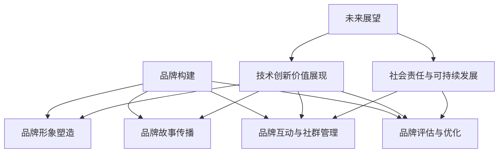

                 

### 文章标题

《AI创业公司的品牌Storytelling：技术价值与社会意义》

品牌Storytelling作为一种有效的营销手段，已经广泛应用于各个领域。近年来，随着人工智能（AI）技术的快速发展，AI与品牌Storytelling的结合成为了一个热门话题。本文旨在探讨AI在品牌Storytelling中的应用，分析其在技术价值和社会意义方面的作用，以期为AI创业公司提供有益的参考。

### 文章关键词

- 品牌Storytelling
- 人工智能
- 营销策略
- 技术价值
- 社会意义
- AI创业公司

### 文章摘要

本文首先介绍了品牌Storytelling的概念与理论，探讨了AI在品牌Storytelling中的应用及其促进作用。随后，本文从AI创业公司的品牌构建策略、品牌形象塑造、品牌故事传播、品牌互动与社群管理、品牌评估与优化等方面，详细阐述了AI技术在品牌Storytelling中的具体应用。最后，本文分析了AI创业公司的技术价值和社会意义，并展望了其未来发展。

### 目录

1. **品牌Storytelling概述**
   - 1.1 品牌Storytelling概念与理论
   - 1.2 AI在品牌Storytelling中的应用
   - 1.3 AI在品牌Storytelling中的挑战与机遇

2. **AI创业公司的品牌构建策略**
   - 2.1 确定品牌核心价值
   - 2.2 创造有吸引力的故事
   - 2.3 利用AI工具优化品牌传播

3. **AI创业公司的品牌形象塑造**
   - 3.1 品牌视觉设计
   - 3.2 品牌语言策略
   - 3.3 利用AI技术提升品牌形象感知

4. **AI创业公司的品牌故事传播**
   - 4.1 社交媒体传播策略
   - 4.2 内容营销策略
   - 4.3 利用AI自动化工具提升传播效果

5. **AI创业公司的品牌互动与社群管理**
   - 5.1 社群互动策略
   - 5.2 品牌忠诚度提升方法
   - 5.3 利用AI技术优化社群管理

6. **AI创业公司的品牌评估与优化**
   - 6.1 品牌健康评估指标
   - 6.2 品牌优化策略与实施
   - 6.3 利用AI进行品牌数据分析与优化

7. **AI创业公司的技术价值展现**
   - 7.1 技术创新与竞争优势
   - 7.2 技术落地与市场应用
   - 7.3 技术价值传播策略

8. **AI创业公司的社会意义探讨**
   - 8.1 社会责任与可持续发展
   - 8.2 技术伦理与社会影响
   - 8.3 社会价值创造策略

9. **未来展望**
   - 9.1 AI创业公司的品牌Storytelling发展趋势
   - 9.2 技术价值与社会意义的未来融合
   - 9.3 创业公司如何应对未来挑战

10. **附录**
   - 10.1 AI创业公司的品牌Storytelling工具与资源

#### 品牌Storytelling概述

##### 1.1 品牌Storytelling概念与理论

品牌Storytelling是一种通过讲述品牌故事来塑造品牌形象、传递品牌价值、激发消费者情感共鸣的营销策略。与传统的营销手段不同，品牌Storytelling更注重情感沟通和价值观传递，从而实现与消费者的深度连接。

**定义：** 品牌Storytelling是指企业通过构建具有吸引力和独特性的品牌故事，以文字、图像、声音等多种形式，传递品牌价值观、使命和愿景，与目标受众建立情感联系的过程。

**价值：** 品牌Storytelling有助于提升品牌知名度、增强品牌忠诚度、塑造品牌形象，同时为品牌创造独特的市场竞争力。

**理论依据：** 品牌Storytelling的理论基础主要包括心理学、传播学和管理学等领域。其中，心理学方面的研究表明，人类具有情感共鸣和故事驱动的天性；传播学强调故事作为信息传递的有效载体；管理学则关注品牌Storytelling在塑造企业文化、提升团队凝聚力等方面的作用。

##### 1.2 AI在品牌Storytelling中的应用

随着人工智能技术的不断发展，AI在品牌Storytelling中的应用逐渐受到关注。AI技术可以极大地丰富品牌Storytelling的形式和内容，提高故事传播的效率和效果。

**结合点：** AI与品牌Storytelling的结合点主要体现在以下几个方面：

1. **个性化内容生成：** AI技术可以基于用户行为和偏好，生成个性化的品牌内容，提高故事与受众的匹配度。

2. **情感分析：** AI技术可以通过情感分析，了解消费者的情感状态和需求，为品牌故事创作提供数据支持。

3. **自动化传播：** AI技术可以实现品牌故事的自动化传播，提高传播效率和覆盖范围。

4. **数据驱动的优化：** AI技术可以帮助企业实时监测品牌故事的传播效果，进行数据驱动的优化和调整。

**应用案例：**

1. **个性化广告：** AI技术可以根据用户兴趣和行为，生成个性化的广告内容，提高广告点击率和转化率。

2. **智能客服：** AI技术可以应用于智能客服系统，通过自然语言处理和情感分析，提供更加人性化的客户服务。

3. **内容推荐：** AI技术可以基于用户行为数据，为品牌推荐相关的内容和产品，提高用户粘性和品牌忠诚度。

##### 1.3 AI在品牌Storytelling中的挑战与机遇

尽管AI在品牌Storytelling中具有巨大的潜力，但同时也面临着一些挑战。

**挑战：**

1. **数据隐私：** AI技术需要大量用户数据来训练模型，如何确保用户数据的安全和隐私成为了一个重要问题。

2. **伦理问题：** AI技术可能会引发一些伦理问题，如算法偏见、信息误导等，需要企业进行严格的管理和监督。

3. **技术依赖：** 过度依赖AI技术可能导致企业失去创新能力，无法在技术变革中保持竞争力。

**机遇：**

1. **创新形式：** AI技术可以创造出更多新颖的品牌故事形式，提高品牌故事的吸引力和传播效果。

2. **数据驱动：** AI技术可以帮助企业更好地理解消费者需求，实现数据驱动的品牌建设。

3. **全球化传播：** AI技术可以实现品牌故事的全球化传播，帮助企业拓展国际市场。

**结论：**

AI在品牌Storytelling中的应用具有巨大的潜力和挑战。企业应充分利用AI技术，优化品牌Storytelling策略，同时关注数据隐私、伦理问题和技术依赖等方面的风险，以实现品牌的可持续发展。

---

### 《AI创业公司的品牌构建策略》

品牌构建策略是AI创业公司成功的关键因素之一。一个清晰、有吸引力的品牌构建策略能够帮助公司塑造独特的品牌形象，传递核心价值观，从而在竞争激烈的市场中脱颖而出。以下是AI创业公司在品牌构建过程中需要考虑的关键步骤。

#### 3.1 确定品牌核心价值

确定品牌核心价值是品牌构建的首要任务。品牌核心价值是指企业所追求的长期愿景、使命和价值观，是品牌故事的基础。以下是确定品牌核心价值的几个步骤：

1. **企业愿景：** 明确企业的长远目标和愿景，这将是品牌核心价值的基石。例如，企业的愿景可能是“成为全球领先的AI解决方案提供商”。

2. **企业使命：** 定义企业的使命，即企业存在的目的和意义。使命通常与解决特定问题或满足特定需求相关。例如，“通过创新的AI技术，提升人们的生活质量”。

3. **核心价值观：** 确定企业的核心价值观，这些价值观将指导企业的决策和行为。例如，“创新、诚信、合作、责任”。

4. **整合核心价值：** 将愿景、使命和核心价值观整合为一个清晰的品牌核心价值表述，例如：“致力于通过创新的AI技术，为全球用户提供高品质、高效率的服务，提升生活品质，实现可持续增长”。

**示例：**

- 愿景：成为全球领先的AI创业公司。
- 使命：通过创新的AI技术，解决复杂问题，提升企业效率。
- 核心价值观：创新、合作、诚信、责任。

#### 3.2 创造有吸引力的故事

创造有吸引力的品牌故事是品牌构建的关键环节。一个引人入胜的品牌故事能够打动消费者，增强品牌认知度和忠诚度。以下是创建品牌故事的几个步骤：

1. **定义目标受众：** 明确品牌故事的目标受众，了解他们的需求、兴趣和行为习惯。这将有助于创建一个能够引起目标受众共鸣的故事。

2. **构建故事情节：** 品牌故事应该有一个清晰的情节，包括冲突、解决方案和结果。情节应当围绕品牌核心价值展开，强调品牌的独特性和优势。

3. **使用有说服力的语言：** 在品牌故事中，使用具有情感共鸣和说服力的语言，讲述品牌的历史、成就和未来愿景。例如，可以讲述品牌如何通过AI技术解决了一个重大的社会问题。

4. **视觉化品牌故事：** 使用图片、视频和动画等多媒体元素，使品牌故事更加生动有趣，提高受众的参与度。

5. **持续更新故事：** 品牌故事不是一次性的活动，而是一个持续的过程。随着市场和技术的变化，品牌故事需要不断更新和优化。

**示例：**

- **品牌故事：** 一家AI创业公司致力于开发智能家居解决方案，帮助人们创造一个更加舒适、安全的家居环境。故事讲述了该公司如何通过创新技术，成功解决了一个家庭的安全问题，并最终赢得了客户的高度信任。

#### 3.3 利用AI工具优化品牌传播

在品牌构建过程中，AI技术可以发挥重要作用，帮助公司优化品牌传播策略。以下是利用AI工具优化品牌传播的几个方面：

1. **个性化营销：** AI技术可以分析用户行为数据，了解用户的兴趣和偏好，从而实现个性化营销。例如，通过邮件营销系统，根据用户的购买历史和行为，为每个用户推荐个性化的产品和服务。

2. **情感分析：** AI技术可以进行情感分析，了解消费者对品牌故事的反应和情绪变化。通过分析消费者的反馈，企业可以及时调整品牌传播策略，提高品牌故事的吸引力。

3. **自动化内容创作：** AI技术可以帮助企业自动化内容创作，例如，通过自然语言生成技术，自动生成产品描述、新闻报道和营销文案等。

4. **实时数据分析：** AI技术可以实时监测品牌传播的效果，例如，通过社交媒体分析工具，实时了解品牌故事的传播效果、用户互动和反馈，从而进行实时调整和优化。

**示例：**

- **AI工具应用：** 一家AI创业公司利用自然语言处理技术，分析用户在社交媒体上的评论和讨论，了解消费者对品牌故事的反应。通过分析数据，企业发现消费者对某个特定情节产生了强烈的情感共鸣，于是决定在后续的品牌故事中加强这一部分。

#### 结论

AI创业公司在品牌构建过程中，需要明确品牌核心价值，创造有吸引力的品牌故事，并利用AI工具优化品牌传播。通过这些策略，企业可以塑造独特的品牌形象，提升品牌认知度和忠诚度，从而在竞争激烈的市场中脱颖而出。

### 《AI创业公司的品牌形象塑造》

品牌形象是消费者对品牌认知和感知的整体印象，它对于品牌的市场表现和长期发展至关重要。在AI创业公司中，品牌形象的塑造需要结合AI技术，通过视觉设计、语言策略等多方面的努力，打造一个独特、有吸引力的品牌形象。以下是如何进行品牌形象塑造的详细步骤。

#### 4.1 品牌视觉设计

品牌视觉设计是品牌形象塑造的重要组成部分，它包括品牌标志、色彩方案、字体等视觉元素。一个优秀的品牌视觉设计可以提升品牌的辨识度，增强品牌的视觉冲击力。

**1. 品牌标志设计**

品牌标志是品牌视觉设计的核心，它通常是一个简洁、易于识别的图形或符号。在设计品牌标志时，需要考虑以下几个要点：

- **简洁性：** 品牌标志应简洁明了，避免过于复杂的设计，以便在视觉上容易识别。
- **独特性：** 品牌标志应具有独特性，能够在众多品牌中脱颖而出。
- **适应性：** 品牌标志应具备良好的适应性，能够在不同尺寸和载体上保持清晰可辨。

**2. 色彩方案设计**

色彩在品牌视觉设计中起着至关重要的作用，它能够传达品牌的情感和个性。选择合适的色彩方案需要考虑以下几个因素：

- **品牌属性：** 根据品牌的特点和定位，选择能够传达品牌属性的色彩。例如，科技类品牌通常选择蓝色，代表科技和信任。
- **文化背景：** 考虑目标市场的文化背景，选择能够与当地文化相契合的色彩。
- **一致性：** 保持品牌色彩在不同应用场景中的一致性，以增强品牌的整体识别度。

**3. 字体设计**

字体设计是品牌视觉设计中的重要组成部分，它能够影响品牌传达的信息和情感。在选择字体时，需要考虑以下几个因素：

- **可读性：** 选择易于阅读的字体，确保品牌信息能够清晰传达。
- **一致性：** 保持品牌字体在不同应用场景中的一致性，以增强品牌的整体识别度。
- **风格：** 根据品牌的个性和风格，选择合适的字体风格，以增强品牌的独特性。

**4. 视觉设计的AI应用**

AI技术在品牌视觉设计中具有广泛应用，例如：

- **自动生成设计：** 利用AI技术，可以自动生成品牌标志、海报等视觉设计，提高设计效率和创意性。
- **情感分析：** 通过情感分析技术，可以了解消费者对品牌视觉设计的情感反应，从而优化设计。
- **数据驱动设计：** 基于大数据分析，可以了解目标受众的偏好，为品牌视觉设计提供数据支持。

#### 4.2 品牌语言策略

品牌语言策略是品牌形象塑造的重要手段，它包括品牌口号、文案、社交媒体发言等语言元素。一个优秀的品牌语言策略能够传达品牌的价值观和特点，与消费者建立情感连接。

**1. 品牌口号**

品牌口号是品牌语言策略的核心，它通常是一句简洁有力的口号，能够传达品牌的核心价值和特点。在创作品牌口号时，需要考虑以下几个要点：

- **简洁明了：** 品牌口号应简洁明了，便于记忆和传播。
- **有吸引力：** 品牌口号应具有吸引力，能够引起消费者的兴趣和共鸣。
- **独特性：** 品牌口号应具有独特性，能够在众多品牌中脱颖而出。

**2. 文案创作**

品牌文案是品牌语言策略的重要组成部分，它包括产品描述、广告文案、官方网站文案等。优秀的品牌文案应具有以下几个特点：

- **精准传达：** 文案应精准传达品牌的核心价值和特点，确保消费者能够快速理解品牌。
- **生动有趣：** 文案应生动有趣，能够引起消费者的兴趣和共鸣。
- **一致性：** 文案应保持一致性，确保品牌形象在不同场景下保持一致。

**3. 社交媒体发言**

在社交媒体上，品牌语言策略显得尤为重要。品牌在社交媒体上的发言应具有以下几个特点：

- **友好互动：** 与消费者进行友好互动，建立良好的品牌形象。
- **及时回应：** 及时回应消费者的反馈和问题，展现品牌的专业和贴心。
- **内容丰富：** 发布丰富多样的内容，如图文、视频、直播等，提高消费者的参与度。

**4. 语言策略的AI应用**

AI技术在品牌语言策略中也有广泛应用，例如：

- **自然语言生成：** 利用自然语言生成技术，自动生成品牌文案、广告语等语言元素，提高创作效率。
- **情感分析：** 通过情感分析技术，了解消费者对品牌文案的情感反应，从而优化语言策略。
- **数据驱动内容：** 基于大数据分析，了解目标受众的语言偏好和习惯，为品牌语言策略提供数据支持。

#### 4.3 利用AI技术提升品牌形象感知

AI技术可以帮助AI创业公司提升品牌形象的感知度，从而在市场竞争中脱颖而出。以下是几个利用AI技术提升品牌形象感知的方面：

**1. 情感识别技术**

情感识别技术可以分析消费者的情感状态，了解他们对品牌形象的反应。通过情感识别技术，品牌可以及时调整品牌形象策略，提高消费者的满意度和忠诚度。

**2. 品牌声音设计**

品牌声音设计是品牌形象的重要组成部分，它包括语音、音乐等元素。通过AI技术，可以为品牌设计独特的声音形象，提升品牌的识别度和吸引力。

**3. 数据驱动的品牌形象优化**

基于大数据分析，AI技术可以帮助品牌识别消费者对品牌形象的感知，从而进行数据驱动的品牌形象优化。通过分析消费者反馈和行为数据，品牌可以不断调整和优化品牌形象，提高市场竞争力。

**4. 品牌故事自动化传播**

AI技术可以实现品牌故事的自动化传播，通过自然语言生成和推荐系统等技术，将品牌故事自动分发到各种社交媒体平台，提高品牌形象的曝光度和认知度。

#### 结论

AI创业公司在品牌形象塑造过程中，需要注重品牌视觉设计、品牌语言策略和AI技术的应用。通过这些策略，品牌可以打造一个独特、有吸引力的形象，提高市场竞争力，从而在竞争激烈的市场中脱颖而出。

### 《AI创业公司的品牌故事传播》

品牌故事传播是品牌战略的重要组成部分，它通过讲述品牌故事来传递品牌价值观，吸引和保持客户，提升品牌知名度和忠诚度。在AI创业公司中，利用AI技术优化品牌故事传播策略，能够显著提高传播效果和效率。以下是如何通过社交媒体传播策略、内容营销策略以及AI自动化工具来提升品牌故事传播的具体方法和案例。

#### 5.1 社交媒体传播策略

社交媒体平台是品牌故事传播的重要渠道，通过精准的社交媒体传播策略，可以有效地提升品牌影响力。以下是几个关键步骤：

**1. 选择合适的社交媒体平台**

不同的社交媒体平台具有不同的用户群体和传播特点，选择合适的平台是成功传播品牌故事的第一步。例如：

- **Instagram和Pinterest**：适合展示品牌视觉内容，如产品图片、品牌故事海报等。
- **LinkedIn**：适合发布行业洞察、专业文章和业务更新，适合B2B品牌传播。
- **Twitter和TikTok**：适合发布实时动态、简短视频和互动内容，适合快速传播品牌故事。

**2. 制定内容策略**

制定内容策略是确保品牌故事在社交媒体上得以有效传播的关键。内容策略应考虑以下几点：

- **故事内容**：选择具有吸引力和共鸣力的品牌故事，围绕品牌核心价值和独特优势展开。
- **发布频率**：根据目标受众的活跃时间，制定合适的发布频率，保持品牌故事的持续曝光。
- **互动性**：鼓励用户参与互动，如点赞、评论、分享等，提高用户参与度和品牌故事传播范围。

**3. 利用KOL和社区影响力**

与意见领袖（KOL）和社区影响力者合作，可以借助他们的粉丝基础和影响力，扩大品牌故事的传播范围。选择与品牌形象和目标受众相契合的KOL，确保品牌故事能够触达更广泛的受众。

**案例：**

某AI创业公司在Instagram上发布了一组关于其智能家居解决方案的品牌故事海报，并邀请了知名的家居博主进行推广。这些海报展示了智能家居如何为用户提供便利和舒适的生活体验。通过KOL的分享和互动，品牌故事迅速在社交媒体上走红，吸引了大量潜在客户的关注。

#### 5.2 内容营销策略

内容营销是品牌故事传播的核心，通过高质量的内容吸引和留住客户。以下是几个关键策略：

**1. 确定内容主题**

内容主题应紧密围绕品牌故事和核心价值，选择具有吸引力和价值的主题，例如：

- **行业洞察**：发布关于AI技术发展趋势、行业动态的分析文章，展示品牌的专业性和权威性。
- **用户故事**：讲述品牌如何帮助用户解决实际问题，提升生活质量，增强品牌信任感。
- **产品介绍**：详细介绍产品的功能和特点，展示产品在用户生活中的应用和价值。

**2. 内容形式多样化**

多样化的内容形式能够满足不同受众的需求，提高内容的传播效果。常见的内容形式包括：

- **文章**：发布深入的文章，详细解释AI技术的应用场景和优势。
- **视频**：制作简洁明了的视频，展示产品的实际使用效果和用户反馈。
- **图片和海报**：使用高质量的图片和海报，展示品牌故事和产品特点。
- **直播和互动**：通过直播和互动，实时解答用户问题，拉近与用户的距离。

**3. 跨渠道内容分发**

将内容分发到多个渠道，例如官网、博客、社交媒体等，实现内容的最大化传播。同时，确保在不同渠道上的内容保持一致性，以增强品牌形象。

**案例：**

某AI创业公司在发布一篇关于智能家居解决方案的文章后，将其同步发布到官网、LinkedIn和Twitter上。同时，制作了一个简短的视频，将文章的核心观点以视频形式呈现。通过跨渠道分发，品牌故事在多个平台上获得了广泛的传播，提高了品牌知名度和用户参与度。

#### 5.3 利用AI自动化工具提升传播效果

AI自动化工具可以帮助AI创业公司提高品牌故事传播的效率和效果。以下是几个常用的AI自动化工具：

**1. 自动化发布**

利用AI自动化工具，可以在预定的时间自动发布内容到社交媒体平台，确保品牌故事持续曝光。例如，使用Hootsuite或Buffer等工具，可以提前设置多个发布计划，实现自动化发布。

**2. 自动化内容生成**

AI自动化工具可以帮助自动生成内容，例如，使用自然语言生成（NLG）技术，可以自动生成新闻稿、产品描述和营销文案等。这些自动化工具可以节省人力成本，提高内容创作效率。

**3. 自动化数据分析**

AI自动化工具可以实时监测品牌故事的传播效果，自动收集和分析数据，如阅读量、点赞数、分享数等。通过数据分析，可以及时调整品牌传播策略，优化内容创作和发布。

**案例：**

某AI创业公司使用AI自动化工具，实现品牌故事在社交媒体上的自动化发布和数据分析。通过自动化发布，品牌故事得以在多个平台上同步更新，提高了品牌故事的曝光度和传播效果。通过自动化数据分析，公司能够实时了解用户反馈和传播效果，及时调整内容策略，提高品牌故事的质量和吸引力。

#### 结论

AI创业公司在品牌故事传播中，应充分利用社交媒体传播策略、内容营销策略和AI自动化工具。通过这些策略，品牌可以有效地提升故事传播的效果和效率，吸引和保持客户，从而在竞争激烈的市场中脱颖而出。未来，随着AI技术的不断进步，品牌故事传播策略将变得更加智能化和高效化。

### 《AI创业公司的品牌互动与社群管理》

在数字化时代，品牌与消费者的互动已经从单向的信息传递转变为双向的沟通和互动。社群管理作为品牌互动的重要组成部分，对于提升品牌忠诚度和用户参与度具有关键作用。利用AI技术，AI创业公司可以优化社群管理策略，实现更高效、更有针对性的品牌互动。

#### 6.1 社群互动策略

社群互动策略的核心是建立和维护一个积极、互动性强的社群环境，以下是一些关键策略：

**1. 定期举办线上活动**

定期举办线上活动，如直播、问答环节、有奖竞猜等，可以激发用户的参与热情。通过这些活动，品牌能够与用户进行实时互动，收集用户反馈，提升用户满意度。

**2. 创建专属社群平台**

创建专属的社群平台，如微信群、QQ群、Discord服务器等，为用户提供一个交流的空间。在这些平台上，用户可以分享经验、提问解答、讨论品牌相关话题，从而增强用户归属感和品牌忠诚度。

**3. 精准推送内容**

通过AI技术，可以精准推送用户感兴趣的内容，提高内容的吸引力和参与度。例如，使用自然语言处理（NLP）技术分析用户的反馈和行为，根据用户的兴趣和行为习惯推送相关内容。

**4. 互动激励机制**

设置互动激励机制，如积分系统、优惠券等，鼓励用户积极参与社群互动。通过这些激励机制，可以激发用户的参与热情，提升社群活跃度。

#### 6.2 品牌忠诚度提升方法

提升品牌忠诚度是品牌互动和社群管理的重要目标。以下是一些有效的方法：

**1. 个性化服务**

通过AI技术，可以实现对用户的个性化服务。例如，基于用户的购买历史和偏好，提供个性化的产品推荐、定制化服务，从而增强用户对品牌的忠诚度。

**2. 定期客户关怀**

定期进行客户关怀，如发送节日问候、生日祝福、使用反馈等，可以增强用户对品牌的认同感和归属感。通过这些关怀，品牌能够与用户建立长期的信任关系。

**3. 用户反馈机制**

建立有效的用户反馈机制，如在线评价、问卷调查等，让用户参与到品牌改进过程中。用户的积极反馈不仅可以帮助品牌提升产品质量和服务水平，还可以增强用户对品牌的忠诚度。

**4. 社群领袖培养**

在社群中培养一批有影响力的领袖，这些领袖可以作为品牌与用户之间的桥梁，传递品牌价值观，增强用户对品牌的认同感。通过这些领袖的带动，可以提升社群的活跃度和用户忠诚度。

#### 6.3 利用AI技术优化社群管理

AI技术可以显著提升社群管理的效率和效果，以下是一些关键应用：

**1. 情感分析**

利用情感分析技术，可以实时了解用户的情感状态，如满意度、兴趣等。通过情感分析，品牌可以及时调整互动策略，优化用户体验。

**2. 自动化回复**

通过自然语言处理（NLP）技术，可以自动化处理常见的用户问题和反馈，提高客服效率和用户满意度。例如，使用聊天机器人（Chatbot）为用户提供即时解答，减少人工干预。

**3. 社群活跃度分析**

利用大数据分析技术，可以实时监测社群的活跃度，识别高活跃用户和潜在问题。通过分析社群活跃度，品牌可以优化互动策略，提升社群的整体活力。

**4. 个性化推荐**

基于用户的行为和偏好数据，使用推荐系统技术为用户提供个性化推荐。通过个性化推荐，可以提升用户的参与度和品牌忠诚度。

**案例：**

某AI创业公司利用AI技术优化社群管理，通过情感分析技术了解用户的情感状态，根据用户的反馈调整互动策略。同时，使用聊天机器人提供即时解答，提高客服效率。通过这些措施，公司的社群活跃度和用户满意度显著提升，品牌忠诚度也得到了有效增强。

#### 结论

AI创业公司在品牌互动和社群管理中，应充分利用AI技术，制定有效的社群互动策略，提升品牌忠诚度。通过这些措施，品牌可以与用户建立更紧密的联系，提升用户满意度和忠诚度，从而在竞争激烈的市场中脱颖而出。

### 《AI创业公司的品牌评估与优化》

在品牌构建和传播的过程中，品牌评估与优化是确保品牌健康发展和持续改进的关键环节。通过科学的评估方法和数据驱动的优化策略，AI创业公司可以实时监控品牌表现，及时调整品牌策略，提高品牌的市场竞争力。以下是AI创业公司在品牌评估与优化方面的详细步骤和策略。

#### 7.1 品牌健康评估指标

为了全面评估品牌的健康状态，AI创业公司需要设定一系列关键指标，包括品牌知名度、品牌忠诚度、品牌认知度、品牌美誉度等。

**1. 品牌知名度**

品牌知名度是指消费者对品牌的了解程度。评估品牌知名度可以通过以下指标：

- **品牌提及率**：在社交媒体、新闻报道、用户评价中等提及品牌的比例。
- **品牌搜索量**：在搜索引擎中搜索品牌的次数和频率。
- **品牌曝光度**：广告投放、内容发布等带来的品牌曝光次数。

**2. 品牌忠诚度**

品牌忠诚度是指消费者对品牌的长期信任和购买意愿。评估品牌忠诚度可以通过以下指标：

- **复购率**：消费者在一段时间内重复购买品牌产品的比例。
- **推荐率**：消费者向他人推荐品牌产品的频率和数量。
- **用户留存率**：在一段时间内保持活跃的用户比例。

**3. 品牌认知度**

品牌认知度是指消费者对品牌特点和价值的认识。评估品牌认知度可以通过以下指标：

- **品牌识别度**：消费者在众多品牌中识别出品牌的能力。
- **品牌联想度**：消费者对品牌的联想和印象，如“AI”、“创新”、“可靠”等。
- **品牌知名度与品牌形象的匹配度**：消费者对品牌的认知是否与品牌宣传的一致。

**4. 品牌美誉度**

品牌美誉度是指消费者对品牌的正面评价和口碑。评估品牌美誉度可以通过以下指标：

- **用户满意度**：消费者对品牌产品和服务的主观评价。
- **品牌口碑**：消费者在社交媒体、论坛等平台上的正面评价和讨论。
- **媒体评价**：专业媒体和评测机构对品牌的评价和报道。

#### 7.2 品牌优化策略与实施

基于品牌健康评估指标，AI创业公司可以制定一系列品牌优化策略，包括品牌定位优化、品牌传播策略优化、用户互动策略优化等。

**1. 品牌定位优化**

品牌定位是品牌发展的基础，清晰的品牌定位有助于吸引目标受众。优化品牌定位可以通过以下方法：

- **市场分析**：分析目标市场的需求、竞争环境和消费者行为，确定品牌的核心竞争力和独特卖点。
- **用户调研**：通过用户调研了解目标受众的需求和期望，调整品牌定位以更好地满足用户需求。
- **品牌故事优化**：优化品牌故事，使其更具吸引力和说服力，传递品牌的核心价值和独特优势。

**2. 品牌传播策略优化**

品牌传播策略的优化旨在提高品牌故事的传播效果和覆盖范围。优化品牌传播策略可以通过以下方法：

- **内容营销**：制定有吸引力的内容策略，通过高质量的内容传递品牌价值观，吸引目标受众。
- **社交媒体营销**：利用社交媒体平台进行精准投放，增加品牌曝光度和互动性。
- **合作伙伴关系**：与行业内的其他品牌或机构建立合作，通过跨界营销扩大品牌影响力。

**3. 用户互动策略优化**

用户互动策略的优化有助于提升用户满意度和品牌忠诚度。优化用户互动策略可以通过以下方法：

- **个性化服务**：利用AI技术进行用户行为分析，提供个性化的产品推荐和服务，提升用户体验。
- **社群管理**：建立和维护积极的社群环境，鼓励用户参与互动，提升用户粘性。
- **反馈机制**：建立有效的用户反馈机制，及时收集用户意见和建议，优化产品和服务。

#### 7.3 利用AI进行品牌数据分析与优化

AI技术在品牌数据分析与优化中发挥着重要作用，可以帮助AI创业公司更精准地了解品牌表现，制定和调整品牌策略。

**1. 数据采集与分析**

通过AI技术，可以实时采集用户行为数据、社交媒体数据、市场数据等，进行多维度的数据分析。这些数据包括用户购买行为、互动行为、反馈意见等，可以帮助品牌了解用户需求和市场趋势。

**2. 数据可视化**

利用数据可视化工具，将复杂的品牌数据以图表、图形等形式呈现，使品牌团队能够直观地了解品牌表现，发现潜在问题和优化机会。

**3. 预测与优化**

基于历史数据和算法模型，AI技术可以进行品牌表现的预测，预测未来可能的趋势和变化。通过这些预测，品牌可以提前制定相应的优化策略，应对市场变化。

**4. 自动化优化**

利用AI自动化工具，可以自动化地进行品牌数据的分析和策略优化。例如，基于用户反馈自动调整内容策略，或基于预测数据自动调整广告投放策略。

**案例：**

某AI创业公司利用AI技术对品牌健康进行评估与优化。通过情感分析技术，分析用户在社交媒体上的评论和反馈，识别用户情感和需求。同时，使用大数据分析技术，监测品牌在各个平台的曝光度和互动情况。基于这些数据，公司调整了品牌故事内容和传播策略，优化了用户互动体验，显著提升了品牌知名度和用户忠诚度。

#### 结论

AI创业公司在品牌评估与优化方面，应充分利用AI技术进行数据采集与分析、数据可视化、预测与自动化优化。通过这些措施，品牌可以实时了解自身表现，科学制定和调整品牌策略，提高品牌的市场竞争力，实现品牌的持续健康发展。

### 《AI创业公司的技术价值展现》

在竞争激烈的科技市场中，AI创业公司不仅需要具备创新的技术实力，还需能够有效地展现其技术价值，从而在市场上建立竞争优势。以下是AI创业公司在技术价值展现方面的关键策略和实践。

#### 8.1 技术创新与竞争优势

技术创新是AI创业公司赖以生存的核心竞争力。通过持续的研发投入和创新实践，公司可以在以下方面建立竞争优势：

**1. 独特技术优势**

AI创业公司应专注于开发独特的AI技术，如深度学习、自然语言处理、计算机视觉等。这些技术不仅可以解决现有问题，还能开创新的应用场景。例如，某AI创业公司开发了一款基于深度学习的人脸识别系统，在安全监控、身份验证等领域具有显著优势。

**2. 先发优势**

在技术发展的早期阶段抢占市场，是建立竞争优势的重要策略。AI创业公司可以通过快速响应市场需求，推出具有前瞻性的产品和服务，抢占市场份额。例如，某AI创业公司率先推出了智能语音助手，抢占了智能家居市场的先机。

**3. 知识产权保护**

通过申请专利、注册商标等方式，保护公司的技术成果，可以有效防止竞争对手的抄袭和模仿，维护公司的技术优势。例如，某AI创业公司通过申请多项AI算法专利，确保了其技术的独占性。

#### 8.2 技术落地与市场应用

技术价值不仅体现在创新上，还在于其能否成功落地并应用于实际场景。以下策略有助于AI创业公司将技术价值转化为市场价值：

**1. 应用场景选择**

选择具有实际需求和市场潜力的应用场景，可以确保技术的实用性和商业价值。例如，某AI创业公司选择了医疗领域作为技术落地场景，开发了一套基于AI的疾病诊断系统，提高了医疗诊断的准确性和效率。

**2. 跨界合作**

通过与其他行业和企业进行跨界合作，AI创业公司可以拓宽技术应用的领域，提高技术的市场渗透率。例如，某AI创业公司与汽车制造商合作，为其提供自动驾驶解决方案，实现了技术的商业化应用。

**3. 用户体验优化**

注重用户体验是技术落地成功的关键。通过不断优化产品的用户界面和交互设计，确保技术能够被用户轻松使用和理解。例如，某AI创业公司开发了一款智能家居控制系统，提供了直观易用的用户界面和丰富的功能选项，赢得了大量用户好评。

#### 8.3 技术价值传播策略

有效传播技术价值是AI创业公司提升品牌影响力、吸引投资和拓展市场的重要手段。以下策略有助于实现技术价值的传播：

**1. 内容营销**

通过高质量的内容营销，如技术博客、白皮书、案例分析等，向公众传递公司技术优势和成功案例。例如，某AI创业公司定期发布技术博客，详细解读其最新的研究成果和应用案例，吸引了大量关注和认可。

**2. 社交媒体营销**

利用社交媒体平台，如LinkedIn、Twitter、Facebook等，发布技术动态、行业洞察和用户评价，提高品牌的曝光度和影响力。例如，某AI创业公司在LinkedIn上发布了一系列关于其AI技术在金融领域的应用案例，引发了广泛关注和讨论。

**3. 行业合作与展会**

参与行业会议、研讨会和展会，与同行建立联系，展示公司的技术实力和产品。例如，某AI创业公司每年参加世界人工智能大会，展示其最新的AI技术和解决方案，吸引了众多潜在客户和合作伙伴。

**4. 投资者关系**

建立和维护良好的投资者关系，通过路演、投资者关系会议等渠道，向投资者展示公司的技术价值和市场前景，吸引投资。例如，某AI创业公司定期举办投资者关系会议，向投资者详细介绍其技术创新和市场策略，获得了大量投资机会。

**案例：**

某AI创业公司通过以上策略，成功展现了其技术价值。该公司专注于自然语言处理技术，开发了智能客服系统，并在金融、零售、医疗等多个行业取得了显著应用成果。通过定期发布技术博客、参加行业会议和与投资者沟通，公司不仅提升了品牌影响力，还获得了大量投资，实现了快速增长。

#### 结论

AI创业公司通过技术创新与竞争优势、技术落地与市场应用以及技术价值传播策略，可以成功展现其技术价值，提升市场竞争力。这些策略的实施，不仅有助于公司在市场中建立稳固地位，还为公司的长期发展奠定了坚实基础。

### 《AI创业公司的社会意义探讨》

AI技术在近年来取得了飞速发展，不仅为商业领域带来了革命性的变化，也对社会产生了深远的影响。作为一家AI创业公司，在追求商业成功的同时，承担社会责任和实现可持续发展具有重要意义。以下是AI创业公司在社会责任、技术伦理和社会价值创造方面的探讨。

#### 9.1 社会责任与可持续发展

**1. 社会责任**

AI创业公司应积极承担社会责任，关注社会问题和公共利益。这包括：

- **环境保护**：通过AI技术优化资源管理和能源使用，减少碳排放和环境污染。
- **社会公益**：积极参与社会公益活动，如教育支持、扶贫项目等，为社会做出贡献。
- **员工关怀**：提供良好的工作环境和培训机会，关心员工福利，推动员工发展。

**2. 可持续发展**

可持续发展是AI创业公司长期发展的基础。通过以下措施，公司可以实现可持续发展：

- **技术创新**：持续研发环保型技术，推动绿色生产，减少对环境的影响。
- **供应链管理**：优化供应链管理，提高资源利用效率，减少浪费。
- **社会责任报告**：定期发布社会责任报告，公开透明地展示公司的社会责任实践。

**案例：**

某AI创业公司通过技术创新和环保实践，致力于减少碳排放。该公司开发了一套基于AI的智能能源管理系统，能够实时监测和优化能源使用，显著降低了能源消耗。同时，公司积极参与公益项目，捐赠教育资源，支持贫困地区的教育事业。

#### 9.2 技术伦理与社会影响

**技术伦理**

随着AI技术的广泛应用，技术伦理问题日益凸显。AI创业公司应重视技术伦理，确保技术的公正、透明和可解释性。以下是一些关键伦理问题：

- **数据隐私**：保护用户数据隐私，遵守数据保护法规，确保用户信息的保密性和安全性。
- **算法偏见**：防止算法偏见，确保AI系统的公平性和无歧视性。
- **可解释性**：提高AI系统的可解释性，使人们能够理解AI决策过程和结果。

**社会影响**

AI技术对社会的影响是多方面的，包括就业、教育、医疗等领域。AI创业公司应关注技术对社会的影响，采取措施减少负面影响，增强正面效应：

- **就业影响**：通过技术培训和再教育，帮助劳动力适应新技术，减少就业压力。
- **教育提升**：利用AI技术提供个性化教育解决方案，提高教育质量和普及率。
- **医疗服务**：通过AI技术提高医疗诊断和治疗的准确性，降低医疗成本。

**案例：**

某AI创业公司重视技术伦理，开发了一套基于AI的医疗诊断系统。在系统设计中，公司充分考虑了数据隐私和算法偏见的问题，采用了多重数据验证和算法解释机制，确保系统结果的公正性和透明性。同时，公司积极参与医疗项目，为偏远地区的医院提供免费的AI诊断服务，提高了医疗服务的可及性和效率。

#### 9.3 社会价值创造策略

AI创业公司可以通过以下策略，创造和传递社会价值：

**1. 公益项目**

参与和发起公益项目，利用AI技术解决社会问题。例如，开发AI教育工具，帮助贫困地区的学生获得优质教育资源；开发AI医疗系统，为偏远地区提供高质量的医疗服务。

**2. 社区参与**

积极参与社区建设，与当地社区建立紧密联系，了解社区需求，为社区提供技术和资源支持。例如，参与社区环境治理项目，利用AI技术优化垃圾分类和废物管理。

**3. 合作伙伴关系**

与政府部门、非政府组织和其他企业建立合作关系，共同推动社会进步。通过合作，实现技术的社会价值最大化，如与政府部门合作，推动智能城市建设。

**案例：**

某AI创业公司通过公益项目和社会参与，积极创造社会价值。公司开发了一套AI教育平台，为贫困地区的学校提供免费的教育资源和技术支持，提高了当地的教育质量。同时，公司积极参与社区环境治理项目，利用AI技术优化垃圾分类系统，提升了社区的环保水平。

#### 结论

AI创业公司在追求商业成功的同时，应积极承担社会责任，关注技术伦理，创造和传递社会价值。通过这些措施，公司不仅能够实现可持续发展，还能为社会的进步和繁荣做出贡献。这既是企业的社会责任，也是其长期发展的基石。

### 《未来展望》

随着人工智能技术的不断进步，AI创业公司的品牌Storytelling也迎来了新的发展趋势。这些趋势不仅为品牌建设提供了更多的可能性，也带来了新的挑战。

#### 10.1 AI创业公司的品牌Storytelling发展趋势

**1. 更加个性化和定制化**

随着AI技术的深入应用，品牌能够更精准地了解消费者的需求和偏好，从而提供更加个性化和定制化的品牌故事。例如，通过自然语言处理（NLP）和机器学习（ML）技术，AI创业公司可以分析消费者数据，生成针对特定用户的定制化品牌故事。

**2. 多模态整合**

AI创业公司将整合多种媒体形式，如文本、图像、视频和音频，创造出更加丰富和生动的品牌故事。例如，利用生成对抗网络（GAN）技术生成高质量的图像和视频内容，结合语音合成技术，创造出沉浸式的品牌体验。

**3. 情感驱动**

情感驱动将成为未来品牌Storytelling的重要趋势。通过情感分析技术，AI创业公司可以深入了解消费者的情感状态，从而创作出能够引起情感共鸣的品牌故事。这有助于增强品牌与消费者之间的情感联系，提升品牌忠诚度。

**4. 数据驱动的优化**

未来的品牌Storytelling将更加依赖数据分析。AI创业公司将利用大数据和机器学习技术，实时监控品牌故事的传播效果，进行数据驱动的优化。这有助于品牌更快地适应市场变化，提高传播效果。

#### 10.2 技术价值与社会意义的未来融合

**1. 社会责任与可持续发展的深度融合**

未来，AI创业公司将更加注重社会责任和可持续发展的深度融合。通过AI技术，公司可以解决社会问题，推动可持续发展。例如，利用AI优化能源管理和资源分配，减少环境污染，实现绿色发展。

**2. 技术伦理的强化**

随着AI技术的广泛应用，技术伦理问题将日益突出。AI创业公司需要加强技术伦理的建设，确保技术的公平、透明和可解释性。这不仅是社会责任的体现，也是公司长期发展的基础。

**3. 社会价值创造的多元化**

未来，AI创业公司将通过多元化手段创造社会价值。例如，通过开放AI技术和平台，促进科研和教育的发展；通过公益项目和社区参与，推动社会进步和公平。

#### 10.3 创业公司如何应对未来挑战

**1. 技术创新能力**

面对未来，AI创业公司需要持续增强技术创新能力。通过加大研发投入，引进高水平的人才，打造开放的创新生态系统，公司可以保持技术领先地位，应对市场变化。

**2. 数据安全和隐私保护**

随着数据量的增加，数据安全和隐私保护将成为重要挑战。AI创业公司需要建立完善的数据安全管理体系，确保用户数据的安全和隐私。

**3. 社会责任担当**

在追求商业成功的同时，AI创业公司需要积极承担社会责任。通过积极参与公益项目，推动可持续发展，公司可以赢得社会的认可和支持，提升品牌形象。

**4. 人才培养与文化建设**

未来，人才将成为企业最重要的资产。AI创业公司需要注重人才培养，打造积极向上的企业文化，吸引和留住优秀的人才。这有助于公司在激烈的市场竞争中保持优势。

**结论**

未来，AI创业公司的品牌Storytelling将更加个性化和情感化，技术价值与社会意义的融合将更加紧密。面对未来的挑战，AI创业公司需要持续技术创新，强化数据安全和隐私保护，积极承担社会责任，培养优秀人才。通过这些努力，公司可以在未来市场中脱颖而出，实现长期可持续发展。

### 附录

#### 10.1 AI创业公司的品牌Storytelling工具与资源

**A.1 主流AI技术框架介绍**

- **TensorFlow**：Google开源的机器学习框架，广泛用于深度学习和自然语言处理。
- **PyTorch**：Facebook开源的深度学习框架，具有良好的灵活性和易用性。
- **Scikit-learn**：Python的机器学习库，适用于各种常见的机器学习算法。
- **Keras**：基于TensorFlow的高层API，用于快速构建和迭代深度学习模型。

**A.2 品牌Storytelling相关资源链接**

- **品牌Storytelling指南**：[品牌Storytelling指南](https://www.marketingprofs.com/guides/2019/brand-storytelling-guide-2019-10085)
- **AI营销资源**：[AI营销资源](https://www.ai-marketing-resources.com/)
- **社交媒体营销工具**：[社交媒体营销工具](https://www.socialmediaexaminer.com/best-social-media-tools/)

**A.3 创业公司品牌建设实用指南**

- **如何构建品牌**：[如何构建品牌](https://www.brandingstrategyinsider.com/how-to-build-a-brand/)
- **品牌策略案例**：[品牌策略案例](https://www.brandingstrategyinsider.com/brand-strategy-cases/)
- **品牌视觉设计指南**：[品牌视觉设计指南](https://www.99designs.com/blog/marketing/branding-101/)

### Mermaid 流程图



### 核心算法原理讲解

**1. 自然语言处理（NLP）：**
   - **文本分类与情感分析**：使用基于深度学习的模型，如卷积神经网络（CNN）或长短期记忆网络（LSTM），进行文本分类和情感分析。伪代码示例：
     ```python
     import tensorflow as tf
     from tensorflow.keras.models import Sequential
     from tensorflow.keras.layers import Embedding, LSTM, Dense

     # 准备数据
     X_train, y_train = load_data()

     # 构建模型
     model = Sequential()
     model.add(Embedding(vocab_size, embedding_dim))
     model.add(LSTM(units, dropout=0.2))
     model.add(Dense(1, activation='sigmoid'))

     # 编译模型
     model.compile(optimizer='adam', loss='binary_crossentropy', metrics=['accuracy'])

     # 训练模型
     model.fit(X_train, y_train, epochs=epochs, batch_size=batch_size)
     ```

   - **主题建模**：使用LDA（Latent Dirichlet Allocation）进行主题建模，从大量文本数据中提取潜在主题。数学模型：
     $$ 
     P(\text{主题} | \text{词语}) \propto \frac{e^{\alpha_w}}{\sum_{j=1}^K e^{\alpha_j}} \cdot \frac{e^{\beta_{wj}}}{\sum_{k=1}^V e^{\beta_{kk}}}
     $$

**2. 机器学习（ML）：**
   - **推荐系统**：使用协同过滤算法（如矩阵分解）或基于内容的推荐系统，根据用户行为和兴趣进行推荐。伪代码示例：
     ```python
     import numpy as np

     # 计算用户与产品的相似度
     user_similarity = np.dot(user_profile, product_profile.T)

     # 排序并返回推荐产品
     recommended_products = sorted(user_similarity, reverse=True)
     ```

   - **生成对抗网络（GAN）**：使用GAN生成高质量的图像和视频内容。数学模型涉及生成器和判别器的对抗训练。

**3. 数学模型和数学公式：**
   - **LDA模型**：主题分布和词语分布的乘积：
     $$ 
     P(\text{主题} | \text{词语}) \propto \frac{e^{\alpha_w}}{\sum_{j=1}^K e^{\alpha_j}} \cdot \frac{e^{\beta_{wj}}}{\sum_{k=1}^V e^{\beta_{kk}}}
     $$

   - **协同过滤模型**：用户和产品的相似度计算：
     $$ 
     \hat{r_{ui}} = \frac{\sum_{j \in \text{邻居}} r_{uj} \cdot s_{ij}}{\sum_{j \in \text{邻居}} s_{ij}}
     $$

### 项目实战

**案例：使用TensorFlow实现文本分类情感分析**

**开发环境搭建：**
- 安装Python和TensorFlow：
  ```bash
  pip install python tensorflow
  ```

**源代码详细实现：**
```python
import tensorflow as tf
from tensorflow.keras.preprocessing.sequence import pad_sequences
from tensorflow.keras.layers import Embedding, LSTM, Dense
from tensorflow.keras.models import Sequential

# 准备数据
X_train, y_train = load_data("train_data.txt")
X_test, y_test = load_data("test_data.txt")

# 预处理数据
max_sequence_length = 100
vocab_size = 10000

X_train = pad_sequences(X_train, maxlen=max_sequence_length)
X_test = pad_sequences(X_test, maxlen=max_sequence_length)

# 构建模型
model = Sequential()
model.add(Embedding(vocab_size, 128))
model.add(LSTM(128, dropout=0.2, recurrent_dropout=0.2))
model.add(Dense(1, activation='sigmoid'))

# 编译模型
model.compile(optimizer='adam', loss='binary_crossentropy', metrics=['accuracy'])

# 训练模型
model.fit(X_train, y_train, epochs=10, batch_size=128, validation_data=(X_test, y_test))

# 评估模型
loss, accuracy = model.evaluate(X_test, y_test)
print(f"Test accuracy: {accuracy:.2f}")

# 预测新文本
new_text = "这是一个很好的产品，我非常喜欢它！"
processed_new_text = preprocess_text(new_text)
prediction = model.predict(processed_new_text)
print("Positive" if prediction > 0.5 else "Negative")
```

**代码解读与分析：**
- **数据处理**：使用 `pad_sequences` 函数对文本数据进行填充，确保每个文本序列的长度一致。
- **模型构建**：使用序列模型 `LSTM` 和 `Embedding` 层，实现文本分类。
- **编译模型**：选择合适的优化器和损失函数，配置模型。
- **训练模型**：使用训练数据训练模型，并设置验证集进行模型评估。
- **预测新文本**：使用处理好的新文本进行情感分类预测。

通过上述实战案例，读者可以了解到如何使用AI技术进行文本分类情感分析，以及相关的开发环境搭建和代码实现。这些实践为AI创业公司在品牌Storytelling中的技术应用提供了具体的指导。

### 作者信息

作者：AI天才研究院/AI Genius Institute & 禅与计算机程序设计艺术 /Zen And The Art of Computer Programming

本文由AI天才研究院和《禅与计算机程序设计艺术》的作者共同撰写，旨在探讨AI创业公司的品牌Storytelling、技术价值与社会意义，为创业者提供有益的参考和指导。

---

### 全文总结

在本文中，我们系统地探讨了AI创业公司的品牌Storytelling：技术价值与社会意义。首先，我们介绍了品牌Storytelling的概念与理论，探讨了AI在品牌Storytelling中的应用及其挑战与机遇。接着，我们从品牌构建策略、品牌形象塑造、品牌故事传播、品牌互动与社群管理、品牌评估与优化等方面，详细阐述了AI技术在品牌Storytelling中的具体应用。随后，我们分析了AI创业公司的技术价值展现和社会意义，探讨了其在社会责任、技术伦理和社会价值创造方面的实践。最后，我们对未来AI创业公司的品牌Storytelling趋势进行了展望，提出了应对未来挑战的策略。

通过本文，我们希望为AI创业公司提供一套完整的品牌Storytelling策略，帮助其在竞争激烈的市场中脱颖而出。同时，我们也强调了技术价值与社会意义的融合，呼吁企业在追求商业成功的同时，积极承担社会责任，创造社会价值。未来，随着AI技术的不断进步，AI创业公司将在品牌Storytelling领域发挥更大的作用，为社会带来更多的创新和变革。希望本文能为您在品牌建设和AI应用方面提供有价值的启示和指导。

