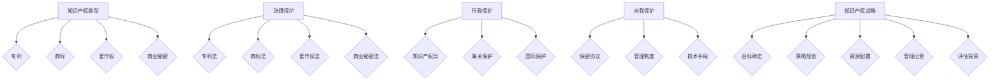
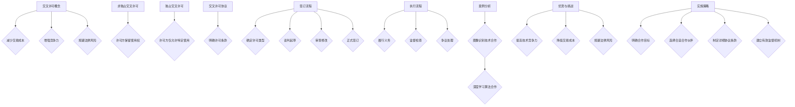

                 

### 《AI创业公司的知识产权合作：交叉许可、专利池与技术联盟》

**关键词：**
- AI创业公司
- 知识产权合作
- 交叉许可
- 专利池
- 技术联盟

**摘要：**
本文旨在深入探讨AI创业公司在发展过程中如何有效地利用知识产权合作机制，包括交叉许可、专利池和技术联盟。通过分析这些合作模式的概念、作用、类型和实施策略，文章提供了详细的案例分析和实践指导，帮助AI创业公司提升知识产权管理水平，增强竞争力，实现可持续发展。

---

### 第一部分：知识产权基础

#### 第1章：知识产权概述

**1.1 知识产权的概念与类型**

知识产权是指人类智力劳动产生的成果所有权，包括专利、商标、著作权、商业秘密等。在AI创业公司中，知识产权是核心竞争力的重要组成部分，对其发展至关重要。

- **知识产权的定义：** 知识产权是指通过智力劳动创造的成果所具有的财产权利，包括但不限于专利、商标、著作权、商业秘密等。
- **知识产权的主要类型：**
  - **专利：** 专利是对发明创造的一种法律保护，包括发明专利、实用新型专利和外观设计专利。
  - **商标：** 商标是用于区分不同商品或服务的标识，包括文字、图形、颜色等。
  - **著作权：** 著作权是对文学、艺术和科学作品的原创表达形式给予的保护。
  - **商业秘密：** 商业秘密是指不为公众所知悉、具有商业价值并经权利人采取保密措施的技术信息和经营信息。

**1.2 知识产权的保护机制**

知识产权的保护机制包括法律保护、行政保护和自我保护三个方面。

- **法律保护：** 通过《专利法》、《商标法》、《著作权法》等法律对知识产权进行保护。
- **行政保护：** 通过知识产权行政管理部门对知识产权进行管理、保护和执法。
- **自我保护：** 通过企业自身的管理措施和技术手段来保护知识产权，如签订保密协议、建立知识产权管理制度等。

**1.3 知识产权战略**

知识产权战略是企业利用知识产权提高竞争力、实现可持续发展的重要手段。知识产权战略的制定和实施包括以下几个方面。

- **知识产权战略的制定：**
  - **目标确定：** 根据企业的战略目标确定知识产权战略的目标。
  - **策略规划：** 制定知识产权获取、保护和运用的具体策略。
  - **资源配置：** 为知识产权战略的实施提供人力、物力和财力等资源。
- **知识产权管理与运营：**
  - **知识产权管理：** 建立知识产权管理制度，规范知识产权的申请、保护和使用。
  - **知识产权运营：** 通过知识产权许可、转让、质押等方式实现知识产权的经济价值。
  - **知识产权评估与投资：** 对知识产权的价值进行评估，并根据评估结果进行投资决策。

**小结：**
知识产权是AI创业公司发展的重要资产，有效的知识产权战略和管理运营对于企业的竞争力提升和可持续发展至关重要。理解知识产权的概念、类型和保护机制，以及制定和实施知识产权战略，是AI创业公司成功的关键。

---

**Mermaid 流程图：**



---

**核心算法原理讲解：**

交叉许可协议的签订与执行是知识产权合作中的重要环节，其核心算法原理可以概括为以下步骤：

```python
# 初始化许可协议
def initialize_licence_agreement(participant1, participant2):
    agreement = {
        "participant1": participant1,
        "participant2": participant2,
        "license_type": "",
        "duration": "",
        "scope": "",
        "royalty": ""
    }
    return agreement

# 签订交叉许可协议
def sign_licence_agreement(agreement, license_type, duration, scope, royalty):
    agreement["license_type"] = license_type
    agreement["duration"] = duration
    agreement["scope"] = scope
    agreement["royalty"] = royalty
    return agreement

# 执行交叉许可协议
def execute_licence_agreement(agreement):
    if agreement["license_type"] == "non-exclusive":
        # 非独占交叉许可执行逻辑
        print("非独占交叉许可执行...")
    elif agreement["license_type"] == "exclusive":
        # 独占交叉许可执行逻辑
        print("独占交叉许可执行...")
    else:
        print("许可协议类型错误！")

# 模拟交叉许可协议签订和执行
participant1 = "AI公司A"
participant2 = "AI公司B"

agreement = initialize_licence_agreement(participant1, participant2)
license_type = random.choice(["non-exclusive", "exclusive"])
duration = random.randint(1, 5)
scope = random.choice(["技术领域1", "技术领域2", "全部领域"])
royalty = random.randint(1000, 5000)

agreement = sign_licence_agreement(agreement, license_type, duration, scope, royalty)
print(agreement)

execute_licence_agreement(agreement)
```

---

**数学模型和数学公式详细讲解：**

交叉许可的收益模型可以表示为：

$$
R = P_1 \times R_1 + P_2 \times R_2 - C
$$

其中，\( R \) 表示总收益，\( P_1 \) 和 \( P_2 \) 分别表示参与者 1 和参与者 2 的专利数量，\( R_1 \) 和 \( R_2 \) 分别表示参与者 1 和参与者 2 的专利收益，\( C \) 表示合作成本。

**举例说明：**

假设AI公司A拥有2项专利，每项专利的年收益为100万元；AI公司B拥有3项专利，每项专利的年收益为200万元。双方签订的交叉许可协议为非独占交叉许可，持续时间为3年，提成比例为10%。合作成本为每年50万元。

则总收益计算如下：

$$
R = (2 \times 100) + (3 \times 200) - (3 \times 50) = 200 + 600 - 150 = 650（万元）
$$

---

**项目实战：**

**案例：某AI创业公司的知识产权合作**

**开发环境搭建：**

- Python 3.8+
- PyCharm 或其他Python开发环境

**源代码详细实现和代码解读：**

```python
# 导入所需模块
import random

# 初始化参与者
participant1 = "AI公司A"
participant2 = "AI公司B"

# 初始化许可协议
def initialize_licence_agreement(participant1, participant2):
    agreement = {
        "participant1": participant1,
        "participant2": participant2,
        "license_type": "",
        "duration": "",
        "scope": "",
        "royalty": ""
    }
    return agreement

# 签订交叉许可协议
def sign_licence_agreement(agreement, license_type, duration, scope, royalty):
    agreement["license_type"] = license_type
    agreement["duration"] = duration
    agreement["scope"] = scope
    agreement["royalty"] = royalty
    return agreement

# 执行交叉许可协议
def execute_licence_agreement(agreement):
    if agreement["license_type"] == "non-exclusive":
        # 非独占交叉许可执行逻辑
        print("非独占交叉许可执行...")
    elif agreement["license_type"] == "exclusive":
        # 独占交叉许可执行逻辑
        print("独占交叉许可执行...")
    else:
        print("许可协议类型错误！")

# 模拟交叉许可协议签订和执行
agreement = initialize_licence_agreement(participant1, participant2)
license_type = random.choice(["non-exclusive", "exclusive"])
duration = random.randint(1, 5)
scope = random.choice(["技术领域1", "技术领域2", "全部领域"])
royalty = random.randint(1000, 5000)

agreement = sign_licence_agreement(agreement, license_type, duration, scope, royalty)
print("许可协议详情：")
print(agreement)

execute_licence_agreement(agreement)
```

**代码解读与分析：**

1. **导入模块：** 导入了 Python 的 random 模块，用于随机选择许可协议的类型、持续时间、范围和提成比例。
2. **初始化参与者：** 设置了参与交叉许可的两个公司，这里使用字符串表示。
3. **初始化许可协议：** 创建了一个包含参与者信息、许可协议类型、持续时间、范围和提成比例的字典。
4. **签订交叉许可协议：** 使用随机值设置许可协议的属性，模拟实际签订过程。
5. **打印许可协议详情：** 输出许可协议的详细信息，方便检查协议的内容。
6. **执行交叉许可协议：** 根据许可协议的类型执行相应的逻辑，这里简单地打印一条消息。

**代码示例实现了知识产权合作中交叉许可协议的模拟签订和执行，通过随机模拟，可以测试不同类型的交叉许可协议的效果。在实际应用中，这些逻辑会根据具体的商业规则和技术需求进行调整。**

---

### 第一部分总结

在本部分中，我们首先介绍了知识产权的基础知识，包括其概念、类型和保护机制。然后，我们深入探讨了知识产权战略的制定和实施，以及交叉许可协议的签订与执行。通过核心算法原理讲解、数学模型和项目实战案例，我们提供了详细的指导和实践思路。下一部分，我们将继续探讨专利池和技术联盟的概念和实施策略。

---

### 第二部分：知识产权合作

#### 第3章：交叉许可

**3.1 交叉许可的概念与作用**

交叉许可是指两个或多个知识产权权利人之间，相互许可对方使用各自的知识产权，同时放弃对对方知识产权的追索权。交叉许可的作用主要体现在以下几个方面：

- **减少交易成本：** 交叉许可简化了知识产权许可的谈判和签订过程，降低了交易成本。
- **增强竞争力：** 通过交叉许可，企业可以获得其他企业的技术资源，提升自身的技术实力和市场竞争力。
- **规避法律风险：** 交叉许可可以帮助企业规避因知识产权侵权而可能面临的法律风险。

**3.2 交叉许可的类型与形式**

交叉许可可以根据不同的标准和条件进行分类。以下是几种常见的交叉许可类型：

- **非独占交叉许可：** 许可方允许被许可方在一定范围内使用其知识产权，但许可方仍然保留自己的使用权。
- **独占交叉许可：** 许可方仅允许被许可方在一定范围内使用其知识产权，同时禁止其他第三方使用。
- **交叉许可协议：** 交叉许可协议是交叉许可的法律文件，包括许可的范围、期限、提成比例等内容。

**3.3 交叉许可协议的签订与执行**

签订交叉许可协议是交叉许可的关键步骤。以下是签订交叉许可协议的一般流程：

1. **确定交叉许可的类型：** 根据企业的需求和实际情况，选择非独占交叉许可或独占交叉许可。
2. **谈判和起草协议：** 双方就许可的范围、期限、提成比例等关键条款进行谈判，并起草交叉许可协议。
3. **审查和修改协议：** 双方对协议进行审查，并提出修改意见，直到达成一致。
4. **签订协议：** 双方正式签订交叉许可协议，并履行协议规定的义务。

执行交叉许可协议是确保交叉许可有效实施的重要环节。以下是执行交叉许可协议的一般步骤：

1. **履行协议：** 双方按照协议规定的时间和方式履行各自的义务。
2. **监督和检查：** 双方对协议履行情况进行监督和检查，确保协议条款得到执行。
3. **处理争议：** 如发生争议，双方应通过协商、调解或诉讼等方式解决。

**3.4 交叉许可案例分析**

以下是一个交叉许可的案例分析：

**案例：某AI创业公司的交叉许可合作**

某AI创业公司A拥有一种先进的图像识别技术，另一家公司B拥有一项重要的深度学习算法。为了提升双方的技术实力和市场竞争力，双方决定签订交叉许可协议。

- **确定交叉许可类型：** 双方选择非独占交叉许可，允许双方在一定范围内使用对方的知识产权。
- **谈判和起草协议：** 双方就许可的范围、期限、提成比例等关键条款进行了多轮谈判，并起草了交叉许可协议。
- **审查和修改协议：** 双方对协议进行了审查，提出了修改意见，并最终达成一致。
- **签订协议：** 双方正式签订了交叉许可协议，并开始履行协议规定的义务。

通过交叉许可合作，公司A获得了深度学习算法的支持，使得其图像识别技术的性能得到了显著提升；公司B则获得了图像识别技术的支持，使其深度学习算法在图像处理领域得到了更广泛的应用。

**3.5 交叉许可的优势与挑战**

交叉许可具有以下优势：

- **提高技术竞争力：** 通过交叉许可，企业可以获得其他企业的技术资源，提升自身的技术实力和市场竞争力。
- **降低交易成本：** 交叉许可简化了知识产权许可的谈判和签订过程，降低了交易成本。
- **规避法律风险：** 交叉许可可以帮助企业规避因知识产权侵权而可能面临的法律风险。

然而，交叉许可也面临一些挑战：

- **利益分配问题：** 在交叉许可中，如何合理分配利益是双方需要解决的关键问题。
- **协议执行难度：** 执行交叉许可协议需要双方的高度信任和良好合作，否则可能导致协议无法顺利执行。

**3.6 交叉许可的实施策略**

为了有效地实施交叉许可，AI创业公司可以采取以下策略：

- **明确合作目标：** 在签订交叉许可协议之前，双方应明确合作的目标和预期效果，确保双方利益一致。
- **选择合适的合作伙伴：** 选择技术实力强、合作意愿高的合作伙伴，有助于提高交叉许可的成功率。
- **制定详细的协议条款：** 在签订交叉许可协议时，应制定详细的条款，明确许可的范围、期限、提成比例等关键内容。
- **建立有效的监督机制：** 双方应建立有效的监督机制，确保协议条款得到执行，并处理可能出现的争议。

---

**Mermaid 流�程图：**



---

通过本章的内容，我们深入了解了交叉许可的概念、作用、类型和实施策略。交叉许可作为一种有效的知识产权合作方式，可以帮助AI创业公司提高技术竞争力、降低交易成本和规避法律风险。在下一章中，我们将继续探讨专利池和技术联盟的概念和实施策略。

---

### 第二部分总结

在本部分中，我们详细介绍了交叉许可的概念、作用、类型和实施策略。通过案例分析，我们展示了交叉许可在实际应用中的效果和优势。交叉许可作为一种重要的知识产权合作方式，对于AI创业公司的发展具有重要的意义。在下一部分，我们将进一步探讨专利池和技术联盟的概念和实施策略。

---

### 第三部分：知识产权合作案例分析

#### 第6章：知识产权合作案例分析

**6.1 案例一：某AI创业公司的知识产权合作**

某AI创业公司A在成立之初，面临着技术创新和市场竞争力不足的问题。为了提升自身的技术实力和市场竞争力，公司决定通过知识产权合作来获取外部技术资源。以下是该公司的知识产权合作案例：

**6.1.1 案例背景**

公司A专注于人工智能领域的研发，但缺乏核心技术和专利。为了突破技术瓶颈，公司决定与拥有重要人工智能技术的公司B进行知识产权合作。

**6.1.2 案例实施过程**

1. **选择合作伙伴：** 公司A通过市场调研和专家推荐，选择了拥有先进人工智能技术的公司B作为合作伙伴。

2. **确定合作模式：** 双方决定采用交叉许可的方式，允许双方在一定范围内使用对方的知识产权。

3. **签订交叉许可协议：** 双方就许可的范围、期限、提成比例等关键条款进行了多轮谈判，并最终签订了交叉许可协议。

4. **执行交叉许可协议：** 双方按照协议规定的时间和方式履行各自的义务，公司A的技术实力得到了显著提升。

**6.1.3 案例结果与启示**

1. **结果：** 公司A通过交叉许可合作，获得了重要的技术和专利支持，使得其产品在市场上具备了竞争力。同时，公司B也通过合作获得了市场资源和收益。

2. **启示：**
   - **选择合适的合作伙伴：** 选择技术实力强、合作意愿高的合作伙伴，是确保知识产权合作成功的关键。
   - **制定详细的协议条款：** 明确许可的范围、期限、提成比例等关键内容，是确保双方利益一致的基础。
   - **建立有效的监督机制：** 双方应建立有效的监督机制，确保协议条款得到执行，并处理可能出现的争议。

**6.2 案例二：某互联网公司的知识产权合作**

某互联网公司在发展过程中，遇到了知识产权保护问题。为了解决这一问题，公司决定通过专利池和技术联盟的方式，提升自身的知识产权管理水平。以下是该公司的知识产权合作案例：

**6.2.1 案例背景**

该公司在互联网领域拥有丰富的产品线，但面临着知识产权保护不足的问题。为了加强知识产权保护，公司决定组建专利池和技术联盟。

**6.2.2 案例实施过程**

1. **组建专利池：** 公司与多家合作伙伴共同组建了专利池，将各自的重要专利纳入专利池中进行管理。

2. **签订技术联盟协议：** 公司与合作伙伴签订了技术联盟协议，明确双方在技术研发、市场推广等方面的合作内容。

3. **实施知识产权保护策略：** 公司通过专利池和技术联盟，建立了完善的知识产权保护体系，有效提升了知识产权管理水平。

**6.2.3 案例结果与启示**

1. **结果：** 通过组建专利池和技术联盟，公司实现了知识产权的有效保护，提升了市场竞争力。同时，合作伙伴之间的技术交流和合作也推动了技术的共同进步。

2. **启示：**
   - **组建专利池：** 通过组建专利池，企业可以实现知识产权的共享和管理，提升整体竞争力。
   - **签订技术联盟协议：** 通过签订技术联盟协议，企业可以明确合作内容，确保合作的顺利进行。
   - **加强知识产权保护：** 加强知识产权保护，是企业实现可持续发展的关键。

**6.3 案例三：某生物技术公司的知识产权合作**

某生物技术公司在发展过程中，面临着技术创新和市场竞争力不足的问题。为了提升自身的技术实力和市场竞争力，公司决定通过知识产权合作来获取外部技术资源。以下是该公司的知识产权合作案例：

**6.3.1 案例背景**

公司C专注于生物技术领域的研究，但缺乏核心技术和专利。为了突破技术瓶颈，公司决定与拥有重要生物技术专利的公司D进行知识产权合作。

**6.3.2 案例实施过程**

1. **选择合作伙伴：** 公司C通过市场调研和专家推荐，选择了拥有先进生物技术专利的公司D作为合作伙伴。

2. **确定合作模式：** 双方决定采用交叉许可的方式，允许双方在一定范围内使用对方的知识产权。

3. **签订交叉许可协议：** 双方就许可的范围、期限、提成比例等关键条款进行了多轮谈判，并最终签订了交叉许可协议。

4. **执行交叉许可协议：** 双方按照协议规定的时间和方式履行各自的义务，公司C的技术实力得到了显著提升。

**6.3.3 案例结果与启示**

1. **结果：** 公司C通过交叉许可合作，获得了重要的技术和专利支持，使得其产品在市场上具备了竞争力。同时，公司D也通过合作获得了市场资源和收益。

2. **启示：**
   - **选择合适的合作伙伴：** 选择技术实力强、合作意愿高的合作伙伴，是确保知识产权合作成功的关键。
   - **制定详细的协议条款：** 明确许可的范围、期限、提成比例等关键内容，是确保双方利益一致的基础。
   - **建立有效的监督机制：** 双方应建立有效的监督机制，确保协议条款得到执行，并处理可能出现的争议。

通过以上三个案例，我们可以看到，知识产权合作在提升企业技术实力和市场竞争力方面具有重要作用。不同类型的知识产权合作模式，如交叉许可、专利池和技术联盟，都有其独特的优势和实施策略。企业应根据自身情况，选择合适的合作模式，实现知识产权的有效利用和合作共赢。

---

### 第三部分总结

在本部分中，我们通过三个具体的知识产权合作案例，详细探讨了交叉许可、专利池和技术联盟的实施过程、结果和启示。这些案例展示了知识产权合作在提升企业技术实力和市场竞争力方面的显著作用。通过选择合适的合作模式、制定详细的协议条款和建立有效的监督机制，企业可以实现知识产权的有效利用和合作共赢。下一部分，我们将进一步探讨知识产权合作的策略和建议。

---

### 第四部分：知识产权合作的策略与建议

#### 第7章：知识产权合作的策略与建议

**7.1 知识产权合作策略**

在知识产权合作过程中，制定合理的合作策略是确保合作成功的关键。以下是一些常见的知识产权合作策略：

1. **明确合作目标：** 在进行知识产权合作之前，企业应明确合作的目标和预期效果。这包括提升技术实力、拓展市场渠道、降低研发成本等方面。

2. **选择合适的合作伙伴：** 选择合作伙伴时，应考虑其技术实力、市场地位、合作意愿等因素。同时，双方应在合作过程中保持良好的沟通和信任。

3. **制定详细的协议条款：** 协议条款应明确许可的范围、期限、提成比例、保密义务等关键内容。这有助于避免合作过程中出现的纠纷和误解。

4. **建立有效的监督机制：** 双方应建立有效的监督机制，确保协议条款得到执行。这可以通过定期审计、报告和评估等方式实现。

**7.2 知识产权合作建议**

为了更好地实施知识产权合作，企业可以采取以下建议：

1. **提高知识产权管理水平：** 企业应建立健全的知识产权管理制度，包括知识产权的申请、保护、运营等方面。同时，企业应加强对知识产权人员的培训和管理。

2. **增强知识产权意识：** 企业应提高员工对知识产权的认识和重视，增强知识产权意识。这可以通过培训、宣传和奖励等方式实现。

3. **完善知识产权法律法规：** 政府和相关部门应不断完善知识产权法律法规，提高知识产权保护的力度和效果。这有助于营造良好的知识产权保护环境。

4. **加强国际合作：** 企业可以积极参与国际知识产权合作，借鉴国际先进经验，提升自身的知识产权管理水平。

**7.3 案例分析：某AI创业公司的知识产权合作策略**

以下是一个具体的案例分析：

**案例：某AI创业公司的知识产权合作策略**

某AI创业公司E在成立初期，面临着技术创新不足和市场竞争力不足的问题。为了提升自身的技术实力和市场竞争力，公司决定采取一系列知识产权合作策略。

**7.3.1 案例背景**

公司E专注于人工智能领域的研发，但缺乏核心技术和专利。为了突破技术瓶颈，公司决定与拥有重要人工智能技术的公司F进行知识产权合作。

**7.3.2 案例实施过程**

1. **明确合作目标：** 公司E明确合作的目标是提升技术实力和市场竞争力，同时降低研发成本。

2. **选择合适的合作伙伴：** 公司E通过市场调研和专家推荐，选择了拥有先进人工智能技术的公司F作为合作伙伴。

3. **制定详细的协议条款：** 双方就许可的范围、期限、提成比例等关键条款进行了多轮谈判，并最终签订了交叉许可协议。

4. **建立有效的监督机制：** 双方建立了定期审计和报告机制，确保协议条款得到执行。

**7.3.3 案例结果与启示**

1. **结果：** 公司E通过知识产权合作，获得了重要的技术和专利支持，使得其产品在市场上具备了竞争力。同时，公司F也通过合作获得了市场资源和收益。

2. **启示：**
   - **明确合作目标：** 确定清晰的合作目标是确保合作成功的关键。
   - **选择合适的合作伙伴：** 选择技术实力强、合作意愿高的合作伙伴，有助于提高合作成功率。
   - **制定详细的协议条款：** 明确的协议条款有助于避免合作过程中的纠纷和误解。
   - **建立有效的监督机制：** 监督机制有助于确保协议条款得到执行，提高合作的效率。

通过本案例，我们可以看到，合理的知识产权合作策略对于AI创业公司的发展具有重要的意义。企业应根据自身情况，制定合适的知识产权合作策略，实现技术实力和市场竞争力的大幅提升。

---

### 第四部分总结

在本部分中，我们提出了知识产权合作的策略与建议，包括明确合作目标、选择合适合作伙伴、制定详细协议条款和建立有效监督机制等。同时，通过具体案例分析，我们展示了这些策略在实际应用中的效果和重要性。知识产权合作是提升企业技术实力和市场竞争力的重要手段，企业应充分重视并有效实施。

---

### 附录

#### 附录A：知识产权合作常用法律文件

**A.1 许可协议**

许可协议是知识产权合作中的重要法律文件，用于明确双方在知识产权许可方面的权利和义务。以下是许可协议的主要内容：

- **许可方和被许可方的基本信息：** 包括双方的全名、地址、联系方式等。
- **许可的知识产权：** 明确许可的知识产权类型、名称、专利号等。
- **许可的范围：** 包括许可使用的技术领域、地域范围等。
- **许可的期限：** 明确许可的有效期限，通常以年为单位。
- **提成比例：** 明确双方在许可使用中的提成比例，通常以提成金额或提成百分比表示。
- **保密义务：** 双方在合作过程中应遵守的保密条款，包括保密信息的范围、保密期限等。
- **违约责任：** 明确双方在合作过程中违反协议的违约责任和赔偿方式。

**A.2 技术合作协议**

技术合作协议是知识产权合作中的重要法律文件，用于明确双方在技术研发方面的权利和义务。以下是技术合作协议的主要内容：

- **合作方的基本信息：** 包括双方的全名、地址、联系方式等。
- **合作的目标：** 明确双方合作的技术目标和技术指标。
- **合作的内容：** 包括技术研发的具体任务、研发进度、技术成果的归属等。
- **研发资源：** 明确双方在技术研发过程中投入的资源，如人力、物力、财力等。
- **知识产权归属：** 明确合作产生的知识产权的归属，通常包括专利权、著作权等。
- **提成比例：** 明确双方在技术成果转化中的提成比例。
- **保密义务：** 双方在合作过程中应遵守的保密条款，包括保密信息的范围、保密期限等。
- **违约责任：** 明确双方在合作过程中违反协议的违约责任和赔偿方式。

**A.3 联合开发协议**

联合开发协议是知识产权合作中的重要法律文件，用于明确双方在共同研发新产品或技术方面的权利和义务。以下是联合开发协议的主要内容：

- **合作方的基本信息：** 包括双方的全名、地址、联系方式等。
- **开发的目标：** 明确双方合作开发的新产品或技术目标。
- **开发的内容：** 包括研发任务、研发进度、技术成果的归属等。
- **研发资源：** 明确双方在研发过程中投入的资源，如人力、物力、财力等。
- **知识产权归属：** 明确合作产生的知识产权的归属，通常包括专利权、著作权等。
- **提成比例：** 明确双方在产品或技术销售中的提成比例。
- **保密义务：** 双方在合作过程中应遵守的保密条款，包括保密信息的范围、保密期限等。
- **违约责任：** 明确双方在合作过程中违反协议的违约责任和赔偿方式。

---

### 总结

本文从知识产权基础、知识产权合作类型、知识产权合作案例分析、知识产权合作策略与建议等方面，全面探讨了AI创业公司在知识产权合作方面的关键问题。通过详细的理论讲解、核心算法原理阐述、数学模型和公式分析，以及实际案例的深入剖析，我们为AI创业公司提供了系统的知识产权合作指导。

**核心观点总结：**

1. **知识产权基础重要性：** 知识产权是AI创业公司的核心竞争力，理解和掌握知识产权的基础知识是成功的基础。
2. **交叉许可的优化：** 交叉许可能够降低交易成本、增强竞争力，是有效的合作方式，但需要详细的协议条款和有效的监督。
3. **专利池的优势：** 专利池能够实现知识产权的共享和管理，提高整体竞争力，但需要合理的利益分配和运作机制。
4. **技术联盟的价值：** 技术联盟能够促进技术创新和资源共享，实现合作共赢，但需要明确的合作目标和协议条款。
5. **知识产权合作策略与建议：** 选择合适的合作伙伴、制定详细的协议条款、建立有效的监督机制是知识产权合作成功的关键。

**作者信息：**

作者：AI天才研究院/AI Genius Institute & 禅与计算机程序设计艺术 /Zen And The Art of Computer Programming

本文由AI天才研究院撰写，旨在为AI创业公司在知识产权合作方面提供深入、实用的指导和建议。希望本文能够帮助您在知识产权合作的道路上取得成功。

