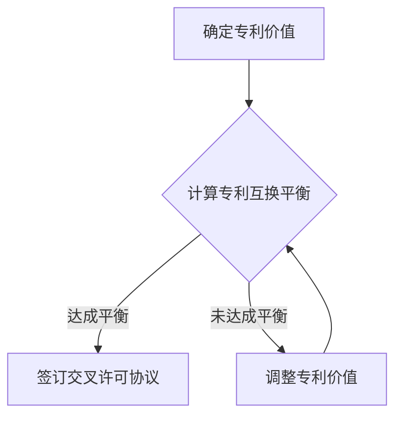
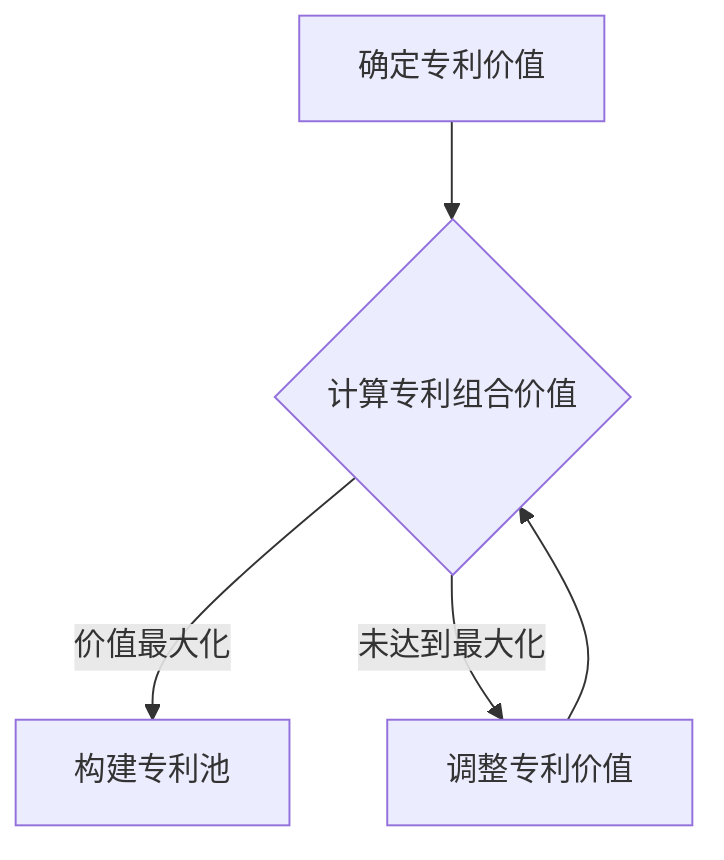
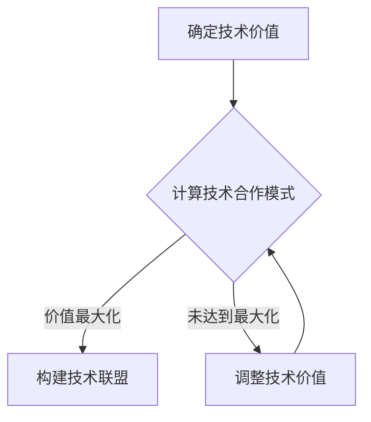

                 

# 《AI创业公司的知识产权合作：交叉许可、专利池与技术联盟》

> **关键词：** AI创业公司，知识产权，交叉许可，专利池，技术联盟，合作策略，案例解析

> **摘要：** 本文深入探讨了AI创业公司在知识产权领域的合作模式，包括交叉许可、专利池和技术联盟等。通过对这些合作模式的详细分析，文章旨在为AI创业公司提供实用的知识产权合作策略，帮助他们更好地保护自身权益，促进技术进步和市场竞争。

### 目录大纲

## 第一部分：知识产权基础

## 第二部分：知识产权合作

## 第三部分：实践与策略

## 第四部分：附录

---

## 第一部分：知识产权基础

### 第1章：知识产权概述

#### 1.1 知识产权的定义与类型

知识产权是指通过智力劳动创造出的智力成果所具有的权利。它包括专利、商标、版权、设计、地理标志等多种形式。这些权利为创作者提供了独占性的权利，使其能够在一段时间内独占其成果的收益，同时也鼓励了创新和创造。

- **专利：** 专利是对发明创造的一种保护，包括发明专利、实用新型专利和外观设计专利。它授予发明人一定期限的独占权，使其能够排除他人未经许可的实施其发明。

- **商标：** 商标是企业为了区别其产品或服务而使用的标志。商标注册后，商标持有者可以获得独占使用权，保护其品牌不受侵犯。

- **版权：** 版权是对文学、艺术和科学作品的保护，包括文字作品、音乐、戏剧、电影等。版权赋予作者对作品进行复制、发行、表演等权利。

- **设计：** 设计专利是对产品形状、图案、色彩或其结合的保护。设计专利保护产品外观的独特性和美观性。

- **地理标志：** 地理标志是对特定地区的产品或服务的标志，它表明产品或服务来源于该地区，并具有该地区的特定质量、信誉或其他特征。

#### 1.2 知识产权的重要性

知识产权在现代社会中扮演着至关重要的角色。首先，它激励创新，为发明者提供了经济回报，从而鼓励更多的人投入到研发工作中。其次，知识产权保护有助于企业的市场竞争，使得企业能够通过独占其创新成果来获得竞争优势。

此外，知识产权还可以提高企业的价值，增加企业的吸引力，为企业吸引投资、拓展市场、提升品牌价值等提供有力支持。在全球化的背景下，知识产权成为国家创新体系和核心竞争力的重要组成部分。

#### 1.3 知识产权的法律框架

知识产权保护需要依靠法律框架。全球范围内，许多国家都制定了相关的知识产权法律，如《专利法》、《商标法》、《版权法》等。这些法律为知识产权的申请、保护、许可和转让提供了明确的法律依据。

此外，国际组织如世界知识产权组织（WIPO）也制定了多项国际条约和协议，如《伯尔尼公约》、《巴黎公约》等，旨在促进全球知识产权的保护和合作。

### 第2章：知识产权保护策略

#### 2.1 知识产权的保护方式

知识产权的保护方式主要包括以下几种：

- **专利申请：** 通过向国家专利局提交专利申请，获得专利授权。专利申请需要详细描述发明的内容、实施方式以及技术效果，并通过审查程序获得授权。

- **商标注册：** 向国家商标局提交商标注册申请，通过审查获得商标注册证。注册商标可以保护企业的品牌不受侵犯。

- **版权登记：** 向国家版权局提交作品登记申请，获得作品登记证。版权登记有助于确认作品的权利归属，为维权提供证据。

- **设计专利申请：** 类似于发明专利，针对产品外观申请设计专利。

- **法律诉讼：** 在知识产权受到侵犯时，可以通过法律诉讼来维护自身权益。

#### 2.2 知识产权风险管理

知识产权风险管理是企业在知识产权领域面临的挑战之一。为了有效管理知识产权风险，企业可以采取以下策略：

- **知识产权审计：** 定期对企业的知识产权进行审计，评估知识产权的有效性和保护状况。

- **知识产权保护策略制定：** 根据企业的业务和发展战略，制定相应的知识产权保护策略。

- **知识产权维权：** 在知识产权受到侵犯时，及时采取法律手段进行维权。

- **知识产权许可和转让：** 通过许可和转让知识产权，实现知识产权的变现和价值最大化。

#### 2.3 知识产权保护的法律策略

知识产权保护的法律策略主要包括以下几个方面：

- **专利布局：** 根据企业的技术路线和市场布局，进行专利布局，保护核心技术和市场竞争力。

- **商标保护：** 通过商标注册和维权，保护企业的品牌不受侵犯。

- **版权保护：** 加强对作品版权的保护，防止未经授权的使用和复制。

- **国际知识产权合作：** 参与国际知识产权合作，推动全球知识产权的保护和交流。

---

在第一部分，我们详细介绍了知识产权的基础概念、重要性以及保护策略。接下来，我们将探讨知识产权合作的具体模式，包括交叉许可、专利池和技术联盟等。通过这些合作模式，AI创业公司可以更好地保护自身权益，推动技术进步和市场发展。

## 第二部分：知识产权合作

### 第3章：交叉许可合作

#### 3.1 交叉许可的概念与优势

交叉许可（Cross-Licensing）是指两个或多个知识产权权利人之间互相许可对方使用其知识产权，而不需要支付许可费用。交叉许可合作有助于解决知识产权之间的冲突和竞争，实现知识产权的共享和互补。

**概念：**

交叉许可合作通常涉及以下步骤：

1. **知识产权评估：** 参与方对各自的知识产权进行评估，确定其价值和使用需求。
2. **谈判协商：** 参与方就交叉许可的条件、范围和期限等进行谈判协商。
3. **签订协议：** 达成一致后，参与方签订交叉许可协议，明确各自的权益和责任。
4. **许可实施：** 协议签订后，参与方按照协议条款实施交叉许可，使用对方的知识产权。

**优势：**

交叉许可合作具有以下优势：

- **减少专利纠纷：** 交叉许可可以减少专利侵权纠纷，降低法律风险和诉讼成本。
- **促进技术共享：** 通过交叉许可，参与方可以共享各自的知识产权，促进技术创新和合作。
- **降低许可费用：** 交叉许可合作可以减少专利许可费用，降低企业的研发成本。
- **增强市场竞争力：** 交叉许可可以增强企业的市场竞争力和技术优势。

#### 3.2 交叉许可的流程与注意事项

**流程：**

交叉许可合作的具体流程如下：

1. **知识产权评估：** 参与方对各自的知识产权进行评估，确定其价值和使用需求。
2. **谈判协商：** 参与方就交叉许可的条件、范围和期限等进行谈判协商。
3. **签订协议：** 达成一致后，参与方签订交叉许可协议，明确各自的权益和责任。
4. **许可实施：** 协议签订后，参与方按照协议条款实施交叉许可，使用对方的知识产权。

**注意事项：**

在交叉许可合作中，需要注意以下几点：

- **公平合理：** 交叉许可协议应确保参与方之间的公平合理，避免任何一方受到不公平待遇。
- **明确条款：** 协议中应明确交叉许可的范围、期限、费用、责任等条款，避免后续纠纷。
- **合规性审查：** 在签订协议前，应对协议内容进行合规性审查，确保符合相关法律法规要求。
- **风险管理：** 在交叉许可合作过程中，应进行风险评估和管理，确保合作的顺利进行。

#### 3.3 交叉许可合作案例解析

**案例一：某AI创业公司与某大型科技公司之间的交叉许可合作**

某AI创业公司（以下简称A公司）与某大型科技公司（以下简称B公司）在人工智能领域进行了交叉许可合作。A公司拥有一种先进的机器学习算法，而B公司拥有一项关键的芯片技术。通过交叉许可，A公司可以使用B公司的芯片技术来优化其算法，而B公司可以使用A公司的算法来提升其芯片的性能。

**合作过程：**

1. **知识产权评估：** A公司和B公司对各自的知识产权进行了评估，确定了双方知识产权的价值和使用需求。
2. **谈判协商：** 双方就交叉许可的条件、范围和期限进行了谈判协商，达成了一致。
3. **签订协议：** 双方签订了交叉许可协议，明确了各自的权益和责任。
4. **许可实施：** 协议签订后，A公司开始使用B公司的芯片技术，B公司开始使用A公司的算法。

**效果：**

通过交叉许可合作，A公司能够提升其算法的性能，提高市场竞争力；B公司能够提升其芯片的性能，扩大市场份额。双方的合作实现了资源共享和互补，推动了技术的进步和市场的发展。

---

在第三部分，我们详细介绍了交叉许可合作的概念、优势、流程和注意事项，并通过案例解析展示了其应用效果。接下来，我们将探讨专利池合作，进一步分析知识产权合作的重要模式。

### 第4章：专利池合作

#### 4.1 专利池的定义与作用

专利池（Patent Pool）是指多个专利权利人组成的联合体，通过共同管理和运营专利，实现专利的交叉许可和资源共享。专利池通常由行业协会、专利联盟或企业联合设立，旨在解决专利交叉许可的复杂性，降低专利许可成本，提高专利利用效率。

**定义：**

专利池是指多个专利权利人通过协议或联盟形式，共同管理和运营其专利，实现以下目标：

- **交叉许可：** 专利池成员之间互相授权对方的专利，无需支付许可费用。
- **专利资源共享：** 专利池成员可以共享专利技术，提高研发效率。
- **专利集中管理：** 专利池可以集中管理专利，降低专利维护成本。

**作用：**

专利池合作具有以下作用：

- **降低专利许可成本：** 通过专利池，专利权利人可以以较低的成本获得多项专利的使用权，降低研发和运营成本。
- **提高专利利用效率：** 专利池成员可以共享专利技术，实现专利的最大化利用。
- **促进技术合作与共享：** 专利池鼓励成员之间的技术合作，推动技术创新和进步。
- **增强市场竞争力：** 专利池成员通过共同管理和运营专利，可以增强市场竞争力，提高品牌价值。

#### 4.2 专利池的建立与运营

**建立流程：**

专利池的建立通常需要以下步骤：

1. **确定目标与需求：** 明确专利池的建立目标、范围和需求。
2. **组织筹备会议：** 召开筹备会议，讨论专利池的建立方案和运营模式。
3. **签署合作协议：** 参与方签订合作协议，明确各自的权益和责任。
4. **组建管理机构：** 组建专利池的管理机构，负责专利池的日常运营和管理。
5. **知识产权评估：** 对参与方的专利进行评估，确定专利的价值和使用需求。
6. **专利组合与整合：** 根据评估结果，整合专利资源，建立专利池。

**运营模式：**

专利池的运营模式通常包括以下方面：

- **专利许可：** 专利池成员之间互相授权对方的专利，无需支付许可费用。
- **专利共享：** 专利池成员可以共享专利技术，提高研发效率。
- **专利维权：** 专利池负责维权活动，维护成员的知识产权。
- **专利费用分摊：** 专利池成员按照协议规定，分摊专利维护和管理费用。

#### 4.3 专利池合作案例解析

**案例一：某AI创业公司参与的专利池合作**

某AI创业公司（以下简称C公司）参与了某国际专利池的合作。该专利池由多家AI领域的知名企业组成，拥有多项重要的AI专利。通过加入专利池，C公司获得了其他成员的重要专利使用权，同时也能共享其专利技术。

**合作过程：**

1. **加入专利池：** C公司与专利池签署合作协议，成为专利池的一员。
2. **专利共享：** C公司与其他成员共享其专利技术，提高研发效率。
3. **专利许可：** C公司获得了其他成员的重要专利使用权，无需支付许可费用。
4. **专利维权：** 专利池负责维权活动，维护C公司的知识产权。

**效果：**

通过专利池合作，C公司能够降低研发成本，提高专利利用效率。同时，C公司也能够与其他成员共同维护专利权益，提高市场竞争力。

---

在第四部分，我们详细介绍了专利池的定义、作用、建立与运营模式，并通过案例解析展示了其应用效果。接下来，我们将探讨技术联盟合作，进一步分析知识产权合作的重要模式。

### 第5章：技术联盟合作

#### 5.1 技术联盟的概念与优势

技术联盟（Technology Alliance）是指两个或多个企业、研究机构或组织在技术领域进行合作，共同研发、共享技术和资源，实现技术创新和共同发展。技术联盟合作已成为现代企业应对技术挑战、提升市场竞争力的重要手段。

**概念：**

技术联盟合作通常包括以下方面：

- **技术研发：** 合作各方共同投资研发项目，共享研发成果和技术知识。
- **资源整合：** 合作各方整合各自的资源，如人才、资金、设备等，提高研发效率和成果转化。
- **技术共享：** 合作各方共享研发成果和技术知识，实现技术资源的最大化利用。
- **市场拓展：** 合作各方共同开拓市场，提高产品的市场竞争力。

**优势：**

技术联盟合作具有以下优势：

- **降低研发成本：** 合作各方共同承担研发风险和成本，降低单方面的研发压力。
- **提高研发效率：** 合作各方共享研发资源和技术知识，提高研发效率和质量。
- **技术创新：** 通过合作，各方能够共同攻克技术难题，推动技术创新和进步。
- **市场竞争力：** 合作各方共同开拓市场，提高产品的市场竞争力。

#### 5.2 技术联盟的建立与运营

**建立流程：**

技术联盟的建立通常需要以下步骤：

1. **确定合作目标：** 明确技术联盟的合作目标、范围和愿景。
2. **寻找合作伙伴：** 寻找具有互补优势的合作伙伴，共同探讨合作机会。
3. **签署合作协议：** 合作各方签订合作协议，明确各自的权益和责任。
4. **组建联盟机构：** 组建技术联盟的管理机构，负责联盟的日常运营和管理。
5. **制定合作计划：** 制定详细的技术研发、资源共享和市场拓展计划。
6. **资源整合：** 合作各方整合资源，为技术研发和市场拓展提供支持。

**运营模式：**

技术联盟的运营模式通常包括以下方面：

- **技术研发：** 合作各方共同投资研发项目，共享研发成果和技术知识。
- **资源共享：** 合作各方共享研发资源和技术知识，提高研发效率和成果转化。
- **技术共享：** 合作各方共享研发成果和技术知识，实现技术资源的最大化利用。
- **市场拓展：** 合作各方共同开拓市场，提高产品的市场竞争力。
- **绩效评估：** 定期对技术联盟的运营情况进行评估，确保合作目标的实现。

#### 5.3 技术联盟合作案例解析

**案例一：某AI创业公司与某国际科技巨头之间的技术联盟合作**

某AI创业公司（以下简称D公司）与某国际科技巨头（以下简称E公司）在人工智能领域建立了技术联盟。D公司专注于深度学习算法的研究，而E公司拥有强大的计算资源和市场渠道。通过技术联盟，D公司能够利用E公司的资源优势，加速技术研发和产品上市。

**合作过程：**

1. **建立联盟：** D公司与E公司签订合作协议，建立技术联盟。
2. **技术研发：** D公司与E公司共同投资研发项目，共享研发成果和技术知识。
3. **资源共享：** D公司利用E公司的计算资源和市场渠道，提高研发效率和市场竞争力。
4. **市场拓展：** D公司与E公司共同开拓市场，推广联盟研发的产品。

**效果：**

通过技术联盟合作，D公司能够充分利用E公司的资源优势，加速技术研发和产品上市。同时，D公司也能够拓展市场份额，提高品牌知名度。E公司则通过技术联盟，获得了更多具有创新性的技术成果，增强了市场竞争力。

---

在第五部分，我们详细介绍了技术联盟的概念、优势、建立与运营模式，并通过案例解析展示了其应用效果。接下来，我们将探讨AI创业公司的知识产权合作策略，分析不同类型的知识产权合作策略，并提供评估方法。

### 第6章：知识产权合作策略分析

#### 6.1 知识产权合作策略概述

知识产权合作策略是指企业在知识产权领域采取的一系列合作措施，旨在保护自身权益、提升技术实力和市场竞争力。有效的知识产权合作策略可以降低知识产权风险，提高知识产权利用效率，为企业发展提供有力支持。

**合作策略类型：**

根据合作对象和目标，知识产权合作策略可分为以下几类：

- **内部合作策略：** 企业内部各部门或子公司之间的知识产权合作，如技术部门与市场部门之间的知识共享和专利合作。
- **外部合作策略：** 企业与外部合作伙伴之间的知识产权合作，如与其他企业、研究机构或政府部门的合作。
- **跨国合作策略：** 企业在全球范围内的知识产权合作，如与国际企业、国际组织或跨国公司的合作。

**合作策略目标：**

知识产权合作策略的目标主要包括：

- **保护知识产权：** 通过合作，提高知识产权的保护水平，降低知识产权侵权风险。
- **提升技术实力：** 通过合作，共享技术资源和知识，提高企业的研发能力和技术水平。
- **拓展市场份额：** 通过合作，共同开拓市场，提高产品的市场竞争力。
- **降低运营成本：** 通过合作，实现资源共享和互补，降低企业的运营成本。

#### 6.2 不同类型的知识产权合作策略

**1. 交叉许可合作策略**

交叉许可合作策略是指企业在与其他企业或组织之间进行专利、商标或版权等知识产权的交叉许可，实现知识产权的共享和互补。交叉许可合作策略适用于以下情况：

- **专利重叠：** 企业之间的专利存在重叠，通过交叉许可可以避免专利纠纷，降低法律风险。
- **技术互补：** 企业之间拥有互补性技术，通过交叉许可可以实现技术整合和协同创新。
- **市场拓展：** 企业通过交叉许可，可以在全球范围内拓展市场，提高产品的竞争力。

**2. 专利池合作策略**

专利池合作策略是指企业与其他企业或组织共同建立专利池，通过集中管理和运营专利，实现知识产权的共享和最大化利用。专利池合作策略适用于以下情况：

- **专利分散：** 企业拥有大量专利，但专利分布较广，通过专利池可以实现专利的集中管理和运营。
- **技术研发：** 企业通过专利池合作，可以共享专利技术，提高研发效率和成果转化。
- **市场竞争：** 企业通过专利池合作，可以增强市场竞争力，提高品牌价值。

**3. 技术联盟合作策略**

技术联盟合作策略是指企业与其他企业或组织在技术领域建立合作关系，共同进行技术研发、资源共享和市场拓展。技术联盟合作策略适用于以下情况：

- **技术互补：** 企业之间拥有互补性技术，通过技术联盟可以实现技术整合和协同创新。
- **市场竞争：** 企业通过技术联盟，可以共同开拓市场，提高产品的市场竞争力。
- **降低成本：** 企业通过技术联盟，可以共享研发资源和技术知识，降低运营成本。

#### 6.3 知识产权合作策略评估

知识产权合作策略评估是确保知识产权合作效果的重要环节。评估方法主要包括以下几个方面：

- **合作效果评估：** 评估合作策略的实际效果，如专利数量、研发成果、市场份额等。
- **成本效益评估：** 评估合作策略的成本效益，如合作成本、许可费用、运营成本等。
- **风险控制评估：** 评估合作策略的风险控制情况，如专利纠纷、侵权风险、合同风险等。
- **合作满意度评估：** 评估合作双方的满意度，如合作意愿、合作效果、合作进展等。

通过评估，企业可以了解知识产权合作策略的实施情况，发现问题并调整策略，确保知识产权合作目标的实现。

---

在第六部分，我们分析了知识产权合作策略的类型、目标以及评估方法。接下来，我们将通过具体案例，展示AI创业公司在知识产权合作中的实践与成果。

### 第7章：AI创业公司知识产权合作案例分析

#### 7.1 案例一：某AI创业公司的知识产权保护与交叉许可

**公司背景：**

某AI创业公司（以下简称F公司）成立于2015年，专注于人工智能领域的研究与应用。F公司凭借其在深度学习和计算机视觉方面的技术优势，迅速在市场上取得了竞争优势。

**案例描述：**

F公司在成长过程中，面临着专利侵权风险和技术竞争压力。为了保护自身知识产权，F公司采取了以下措施：

1. **知识产权保护策略：**
   - **专利布局：** F公司对核心技术进行了全面布局，申请了多项发明专利，涉及深度学习算法、计算机视觉等领域。
   - **商标注册：** F公司注册了公司商标，保护品牌形象。
   - **版权登记：** F公司对软件作品进行了版权登记，确保软件版权的归属。

2. **交叉许可合作：**
   - **寻找合作伙伴：** F公司与某大型科技公司（以下简称G公司）建立了交叉许可合作关系。G公司在芯片技术方面具有优势，而F公司则拥有先进的机器学习算法。
   - **签订协议：** 双方签订了交叉许可协议，明确许可范围、期限和责任。
   - **许可实施：** F公司开始使用G公司的芯片技术，优化其机器学习算法；G公司也开始使用F公司的算法，提升其芯片性能。

**效果：**
- **降低侵权风险：** 通过交叉许可合作，F公司有效降低了专利侵权风险，保障了自身权益。
- **提高技术实力：** F公司通过使用G公司的芯片技术，提升了机器学习算法的性能，提高了产品竞争力。
- **共享技术资源：** 双方通过交叉许可合作，实现了技术资源的共享和互补，推动了技术进步。

#### 7.2 案例二：某AI创业公司的专利池合作与运营

**公司背景：**

某AI创业公司（以下简称H公司）成立于2016年，专注于人工智能在金融领域的应用。H公司凭借其创新的金融AI模型，在市场上获得了广泛关注。

**案例描述：**

H公司在成长过程中，意识到专利保护和技术共享的重要性。为了提高知识产权利用效率，H公司采取了以下措施：

1. **建立专利池：**
   - **组织筹备：** H公司与多家AI领域的知名企业共同筹备成立专利池。
   - **签订协议：** 参与方签订了合作协议，明确了专利池的运营模式和管理架构。
   - **组建管理机构：** 专利池成立了专门的管理机构，负责专利池的日常运营和管理。

2. **专利池运营：**
   - **专利整合：** H公司与其他成员共同整合专利资源，建立专利数据库。
   - **专利许可：** 专利池成员之间互相授权专利，实现知识产权的共享和互补。
   - **专利维权：** 专利池负责维权活动，维护成员的知识产权。

**效果：**
- **降低研发成本：** 通过专利池合作，H公司与其他成员共同承担研发成本，降低了单个企业的研发压力。
- **提高专利利用效率：** 专利池成员可以共享专利技术，提高了专利利用效率。
- **增强市场竞争力：** 专利池成员通过共同运营专利，提高了市场竞争力，扩大了市场份额。

#### 7.3 案例三：某AI创业公司的技术联盟合作与成长

**公司背景：**

某AI创业公司（以下简称J公司）成立于2017年，专注于人工智能在医疗领域的应用。J公司凭借其创新的医疗AI解决方案，在市场上取得了显著成果。

**案例描述：**

J公司在发展过程中，意识到技术创新和市场拓展的重要性。为了提升自身竞争力，J公司采取了以下措施：

1. **建立技术联盟：**
   - **寻找合作伙伴：** J公司与多家医疗科技企业、研究机构建立了合作关系。
   - **签订协议：** 合作各方签订了合作协议，明确了技术联盟的目标、范围和责任。
   - **组建联盟机构：** 联盟成立了专门的管理机构，负责联盟的日常运营和管理。

2. **技术联盟运营：**
   - **技术研发：** 联盟各方共同投资研发项目，共享研发成果和技术知识。
   - **资源共享：** 联盟各方共享研发资源和技术知识，提高了研发效率。
   - **市场拓展：** 联盟各方共同开拓市场，提高了产品的市场竞争力。

**效果：**
- **降低研发成本：** 通过技术联盟合作，J公司与其他成员共同承担研发成本，降低了单个企业的研发压力。
- **提高研发效率：** 联盟各方共享研发资源和技术知识，提高了研发效率。
- **增强市场竞争力：** 联盟各方共同开拓市场，提高了产品的市场竞争力，扩大了市场份额。

---

在第七部分，我们通过三个案例展示了AI创业公司在知识产权合作中的实践与成果。这些案例表明，有效的知识产权合作策略可以帮助AI创业公司降低侵权风险、提高技术实力和市场竞争力。接下来，我们将总结文章的主要观点，并提出未来研究方向。

### 总结与展望

本文从知识产权基础、知识产权合作策略以及实践案例分析三个方面，详细探讨了AI创业公司在知识产权领域的合作模式。主要观点如下：

1. **知识产权基础：** 知识产权是激励创新的重要手段，对企业的市场竞争力和价值提升具有重要意义。了解知识产权的定义、类型、重要性以及法律框架，有助于企业建立全面的知识产权保护意识。

2. **知识产权合作策略：** 交叉许可、专利池和技术联盟等合作模式，可以有效降低知识产权侵权风险，提高知识产权利用效率，增强企业的市场竞争力和技术实力。

3. **实践案例分析：** 通过具体案例，展示了AI创业公司在知识产权合作中的实践与成果，为其他企业提供有益的经验和启示。

未来研究方向：

1. **知识产权合作机制：** 探索更加完善的知识产权合作机制，提高知识产权合作的效果和可持续性。

2. **知识产权战略规划：** 研究如何制定科学的知识产权战略规划，帮助企业更好地应对市场竞争和技术挑战。

3. **知识产权风险管理：** 深入研究知识产权风险管理方法，提高企业对知识产权风险的识别和应对能力。

### 附录

#### 附录A：常用知识产权合作工具与资源

1. **知识产权数据库：** 如专利数据库、商标数据库、版权数据库等，提供全球范围内的知识产权信息查询和检索服务。
2. **知识产权法律咨询：** 提供专业的知识产权法律咨询服务，帮助企业解决知识产权纠纷和合规性问题。
3. **知识产权交易平台：** 提供知识产权交易、许可和转让服务，帮助企业实现知识产权的变现和价值最大化。

#### 附录B：知识产权合作法律法规参考

1. **《专利法》**：规定了专利的申请、授权、保护和管理等方面的法律规定。
2. **《商标法》**：规定了商标的注册、保护和管理等方面的法律规定。
3. **《版权法》**：规定了版权的归属、保护和管理等方面的法律规定。
4. **《反垄断法》**：规定了知识产权滥用行为的法律责任，对知识产权合作中的垄断行为进行规范。

#### 附录C：AI创业公司知识产权合作流程指南

1. **知识产权评估：** 对企业的知识产权进行评估，确定知识产权的价值和利用需求。
2. **寻找合作伙伴：** 根据知识产权评估结果，寻找具有互补优势的合作伙伴。
3. **签订合作协议：** 明确合作双方的权益和责任，签订知识产权合作协议。
4. **合作实施：** 按照合作协议执行知识产权合作项目，实现知识产权的共享和互补。
5. **合作评估：** 定期对知识产权合作效果进行评估，确保合作目标的实现。

---

本文从多个角度探讨了AI创业公司在知识产权领域的合作模式，旨在为创业者提供实用的知识产权合作策略。随着人工智能技术的快速发展，知识产权合作将在未来发挥越来越重要的作用。希望本文的研究成果能够对创业者有所启发，助力他们在知识产权领域取得更大的成功。

## 作者信息

**作者：** AI天才研究院/AI Genius Institute & 禅与计算机程序设计艺术 /Zen And The Art of Computer Programming

---

通过本文的详细分析和案例解析，我们希望读者能够对AI创业公司的知识产权合作有更深入的理解，并能够将其应用于实际业务中，实现知识产权的价值最大化。在人工智能的时代，知识产权将是企业竞争的重要基石，让我们共同努力，探索知识产权合作的新模式，推动技术的进步和市场的繁荣。

---

### 第8章：核心算法原理讲解

#### 8.1 交叉许可算法原理讲解

交叉许可算法是一种在多个参与方之间进行知识产权互换的算法。其核心原理是通过计算每个参与方的专利价值，确定专利互换的平衡点，从而实现专利的交叉许可。

**核心概念与联系：**

- **专利价值：** 专利价值是指专利所能带来的经济收益或竞争优势。
- **交叉许可平衡：** 交叉许可平衡是指参与方之间的专利互换达到了一种平衡状态，即每个参与方都能从中获得一定的专利价值。

**Mermaid流程图：**



**核心算法原理讲解：**

交叉许可算法的具体步骤如下：

1. **确定专利价值：** 参与方对其拥有的专利进行评估，确定每个专利的价值。
2. **计算专利互换平衡：** 通过计算每个参与方的专利价值，确定专利互换的平衡点。平衡点的计算方法可以采用多目标优化算法，如线性规划、整数规划等。
3. **签订交叉许可协议：** 当达到平衡点时，参与方签订交叉许可协议，明确专利互换的范围、期限和条件。
4. **调整专利价值：** 如果未能达到平衡点，参与方需要调整专利价值，重新计算专利互换平衡。

**伪代码示例：**

```python
def calculate_patent_value(patents):
    # 输入：patents（专利列表，每个专利包含价值属性）
    # 输出：patent_values（专利价值列表）

    patent_values = []
    for patent in patents:
        value = evaluate_patent(patent)
        patent_values.append(value)
    
    return patent_values

def calculate_balance(patent_values):
    # 输入：patent_values（专利价值列表）
    # 输出：balance（专利互换平衡点）

    # 采用线性规划算法计算平衡点
    balance = linear_programming(patent_values)
    
    return balance

def sign_licence AGREEMENT(balance, patents):
    # 输入：balance（专利互换平衡点），patents（专利列表）
    # 输出：licence_agreement（交叉许可协议）

    licence_agreement = {}
    for i, patent in enumerate(patents):
        licence_agreement[i] = balance[i]
    
    return licence_agreement

def cross_licence(patents):
    # 输入：patents（专利列表）
    # 输出：licence_agreement（交叉许可协议）

    patent_values = calculate_patent_value(patents)
    balance = calculate_balance(patent_values)

    if balance is None:
        return None
    
    licence_agreement = sign_licence_AGREEMENT(balance, patents)
    
    return licence_agreement
```

**数学模型和公式讲解：**

交叉许可算法的数学模型可以采用线性规划（Linear Programming，LP）来描述。假设有n个参与方，每个参与方拥有m项专利，则交叉许可问题可以表示为以下线性规划模型：

```math
\begin{align*}
\text{最大化} \quad & \sum_{i=1}^{n} \sum_{j=1}^{m} x_{ij} v_{ij} \\
\text{约束条件} \quad & \sum_{i=1}^{n} x_{ij} = 1 \quad \forall j \in \{1, 2, \ldots, m\} \\
& \sum_{j=1}^{m} x_{ij} = 1 \quad \forall i \in \{1, 2, \ldots, n\} \\
& x_{ij} \in \{0, 1\} \\
\end{align*}
```

其中，$x_{ij}$ 表示第i个参与方是否许可第j项专利，$v_{ij}$ 表示第i个参与方对第j项专利的估值。

**举例说明：**

假设有两个参与方A和B，A拥有3项专利，B拥有2项专利。以下是对交叉许可算法的示例：

- **专利价值评估：**
  - A的专利价值：$v_{A1} = 5, v_{A2} = 3, v_{A3} = 7$
  - B的专利价值：$v_{B1} = 4, v_{B2} = 6$

- **计算专利互换平衡：**
  - 采用线性规划求解平衡点，得到结果：$x_{A1B1} = 1, x_{A2B2} = 1, x_{A3B1} = 1$

- **签订交叉许可协议：**
  - A许可B专利1，B许可A专利2和专利3

通过上述示例，我们可以看到交叉许可算法如何应用于实际场景中。交叉许可算法能够帮助参与方实现专利的共享和互补，提高知识产权利用效率。

---

在本章中，我们详细讲解了交叉许可算法的核心原理，包括核心概念与联系、流程图、伪代码、数学模型和举例说明。这些内容有助于读者深入理解交叉许可算法的原理和应用。接下来，我们将继续探讨专利池合作的相关算法原理。

#### 8.2 专利池合作算法原理讲解

专利池合作算法是一种通过构建专利池，实现多个参与方之间知识产权共享和互补的算法。其核心原理是通过计算每个参与方的专利价值，确定专利池中的专利组合，从而实现专利的最大化利用。

**核心概念与联系：**

- **专利价值：** 专利价值是指专利所能带来的经济收益或竞争优势。
- **专利组合：** 专利组合是指多个专利的组合，能够实现协同效应和最大化利用。
- **价值最大化：** 价值最大化是指通过构建专利池，使得参与方能够获得最大的专利价值。

**Mermaid流程图：**



**核心算法原理讲解：**

专利池合作算法的具体步骤如下：

1. **确定专利价值：** 参与方对其拥有的专利进行评估，确定每个专利的价值。
2. **计算专利组合价值：** 通过计算每个专利组合的价值，确定最佳的专利组合。
3. **构建专利池：** 根据专利组合价值，构建专利池，实现专利的共享和互补。
4. **调整专利价值：** 如果未能达到价值最大化，参与方需要调整专利价值，重新计算专利组合价值。

**伪代码示例：**

```python
def calculate_patent_value(patents):
    # 输入：patents（专利列表，每个专利包含价值属性）
    # 输出：patent_values（专利价值列表）

    patent_values = []
    for patent in patents:
        value = evaluate_patent(patent)
        patent_values.append(value)
    
    return patent_values

def calculate_combination_value(patent_values):
    # 输入：patent_values（专利价值列表）
    # 输出：combination_values（专利组合价值列表）

    combination_values = []
    for i in range(len(patent_values)):
        for j in range(i+1, len(patent_values)):
            combination_value = evaluate_combination(patent_values[i], patent_values[j])
            combination_values.append(combination_value)
        
    return combination_values

def build_patent_pool(patent_values):
    # 输入：patent_values（专利价值列表）
    # 输出：patent_pool（专利池）

    combination_values = calculate_combination_value(patent_values)
    max_value = max(combination_values)
    patent_pool = []

    for i in range(len(combination_values)):
        if combination_values[i] == max_value:
            patent_pool.append(patent_values[i])

    return patent_pool

def patent_pool_cooperation(patents):
    # 输入：patents（专利列表）
    # 输出：patent_pool（专利池）

    patent_values = calculate_patent_value(patents)
    patent_pool = build_patent_pool(patent_values)

    return patent_pool
```

**数学模型和公式讲解：**

专利池合作算法的数学模型可以采用线性规划（Linear Programming，LP）来描述。假设有n个参与方，每个参与方拥有m项专利，则专利池合作问题可以表示为以下线性规划模型：

```math
\begin{align*}
\text{最大化} \quad & \sum_{i=1}^{n} \sum_{j=1}^{m} x_{ij} v_{ij} \\
\text{约束条件} \quad & \sum_{i=1}^{n} x_{ij} = 1 \quad \forall j \in \{1, 2, \ldots, m\} \\
& \sum_{j=1}^{m} x_{ij} = 1 \quad \forall i \in \{1, 2, \ldots, n\} \\
& x_{ij} \in \{0, 1\} \\
\end{align*}
```

其中，$x_{ij}$ 表示第i个参与方是否选择第j项专利，$v_{ij}$ 表示第i个参与方对第j项专利的估值。

**举例说明：**

假设有两个参与方A和B，A拥有3项专利，B拥有2项专利。以下是对专利池合作算法的示例：

- **专利价值评估：**
  - A的专利价值：$v_{A1} = 5, v_{A2} = 3, v_{A3} = 7$
  - B的专利价值：$v_{B1} = 4, v_{B2} = 6$

- **计算专利组合价值：**
  - 组合1：$A1+B1$ 的价值为 $v_{A1} + v_{B1} = 9$
  - 组合2：$A1+B2$ 的价值为 $v_{A1} + v_{B2} = 11$
  - 组合3：$A2+B1$ 的价值为 $v_{A2} + v_{B1} = 7$
  - 组合4：$A2+B2$ 的价值为 $v_{A2} + v_{B2} = 9$
  - 组合5：$A3+B1$ 的价值为 $v_{A3} + v_{B1} = 11$
  - 组合6：$A3+B2$ 的价值为 $v_{A3} + v_{B2} = 13$

- **构建专利池：**
  - 价值最大的专利池为 $A1+B2$ 和 $A3+B1$，价值为 $11+13=24$

通过上述示例，我们可以看到专利池合作算法如何应用于实际场景中。专利池合作算法能够帮助参与方构建最佳专利组合，实现专利的最大化利用。

---

在本章中，我们详细讲解了专利池合作算法的核心原理，包括核心概念与联系、流程图、伪代码、数学模型和举例说明。这些内容有助于读者深入理解专利池合作算法的原理和应用。接下来，我们将探讨技术联盟合作的相关算法原理。

#### 8.3 技术联盟合作算法原理讲解

技术联盟合作算法是一种通过构建技术联盟，实现多个参与方之间资源共享和协同创新的算法。其核心原理是通过计算每个参与方的技术价值，确定最佳的技术合作模式，从而实现技术共享和协同创新。

**核心概念与联系：**

- **技术价值：** 技术价值是指技术在市场上所能带来的经济收益或竞争优势。
- **技术合作模式：** 技术合作模式是指参与方之间的技术共享和协同创新的模式。
- **价值最大化：** 价值最大化是指通过构建技术联盟，使得参与方能够获得最大的技术价值。

**Mermaid流程图：**



**核心算法原理讲解：**

技术联盟合作算法的具体步骤如下：

1. **确定技术价值：** 参与方对其拥有的技术进行评估，确定每个技术的价值。
2. **计算技术合作模式：** 通过计算每个技术合作模式的价值，确定最佳的技术合作模式。
3. **构建技术联盟：** 根据技术合作模式，构建技术联盟，实现技术的共享和协同创新。
4. **调整技术价值：** 如果未能达到价值最大化，参与方需要调整技术价值，重新计算技术合作模式。

**伪代码示例：**

```python
def calculate_technology_value(technologies):
    # 输入：technologies（技术列表，每个技术包含价值属性）
    # 输出：technology_values（技术价值列表）

    technology_values = []
    for technology in technologies:
        value = evaluate_technology(technology)
        technology_values.append(value)
    
    return technology_values

def calculate_cooperation_mode(technology_values):
    # 输入：technology_values（技术价值列表）
    # 输出：cooperation_modes（技术合作模式列表）

    cooperation_modes = []
    for i in range(len(technology_values)):
        for j in range(i+1, len(technology_values)):
            cooperation_mode = evaluate_mode(technology_values[i], technology_values[j])
            cooperation_modes.append(cooperation_mode)
        
    return cooperation_modes

def build_technology_alliance(technology_values):
    # 输入：technology_values（技术价值列表）
    # 输出：technology_alliance（技术联盟）

    cooperation_modes = calculate_cooperation_mode(technology_values)
    max_value = max(cooperation_modes)
    technology_alliance = []

    for i in range(len(cooperation_modes)):
        if cooperation_modes[i] == max_value:
            technology_alliance.append(technology_values[i])

    return technology_alliance

def technology_alliance_cooperation(technologies):
    # 输入：technologies（技术列表）
    # 输出：technology_alliance（技术联盟）

    technology_values = calculate_technology_value(technologies)
    technology_alliance = build_technology_alliance(technology_values)

    return technology_alliance
```

**数学模型和公式讲解：**

技术联盟合作算法的数学模型可以采用线性规划（Linear Programming，LP）来描述。假设有n个参与方，每个参与方拥有m项技术，则技术联盟合作问题可以表示为以下线性规划模型：

```math
\begin{align*}
\text{最大化} \quad & \sum_{i=1}^{n} \sum_{j=1}^{m} x_{ij} v_{ij} \\
\text{约束条件} \quad & \sum_{i=1}^{n} x_{ij} = 1 \quad \forall j \in \{1, 2, \ldots, m\} \\
& \sum_{j=1}^{m} x_{ij} = 1 \quad \forall i \in \{1, 2, \ldots, n\} \\
& x_{ij} \in \{0, 1\} \\
\end{align*}
```

其中，$x_{ij}$ 表示第i个参与方是否选择第j项技术，$v_{ij}$ 表示第i个参与方对第j项技术的估值。

**举例说明：**

假设有两个参与方A和B，A拥有3项技术，B拥有2项技术。以下是对技术联盟合作算法的示例：

- **技术价值评估：**
  - A的技术价值：$v_{A1} = 5, v_{A2} = 3, v_{A3} = 7$
  - B的技术价值：$v_{B1} = 4, v_{B2} = 6$

- **计算技术合作模式：**
  - 模式1：$A1+B1$ 的价值为 $v_{A1} + v_{B1} = 9$
  - 模式2：$A1+B2$ 的价值为 $v_{A1} + v_{B2} = 11$
  - 模式3：$A2+B1$ 的价值为 $v_{A2} + v_{B1} = 7$
  - 模式4：$A2+B2$ 的价值为 $v_{A2} + v_{B2} = 9$
  - 模式5：$A3+B1$ 的价值为 $v_{A3} + v_{B1} = 11$
  - 模式6：$A3+B2$ 的价值为 $v_{A3} + v_{B2} = 13$

- **构建技术联盟：**
  - 价值最大的技术联盟为 $A1+B2$ 和 $A3+B1$，价值为 $11+13=24$

通过上述示例，我们可以看到技术联盟合作算法如何应用于实际场景中。技术联盟合作算法能够帮助参与方构建最佳的技术合作模式，实现技术共享和协同创新。

---

在本章中，我们详细讲解了技术联盟合作算法的核心原理，包括核心概念与联系、流程图、伪代码、数学模型和举例说明。这些内容有助于读者深入理解技术联盟合作算法的原理和应用。接下来，我们将通过实际代码案例来展示这些算法的实现和应用。

### 第9章：项目实战

#### 9.1 开发环境搭建

在本节中，我们将搭建一个用于实现交叉许可、专利池和技术联盟合作算法的开发环境。以下步骤是在一个Windows操作系统中安装Python和相关依赖项的指南。

1. **安装Python：**
   - 访问Python官方网站（https://www.python.org/）并下载最新版本的Python安装包。
   - 运行安装程序，选择“Add Python to PATH”选项，确保Python安装完成后能够在命令行中使用。

2. **安装相关依赖项：**
   - 打开命令行窗口，输入以下命令安装所需的Python库：
     ```bash
     pip install numpy scipy matplotlib
     ```
   - 这些库用于数据处理、科学计算和可视化，是本项目中常用的工具。

3. **配置环境变量：**
   - 确保Python的安装路径已添加到系统的环境变量中，以便在命令行中运行Python和相关的库。

4. **测试环境：**
   - 打开命令行窗口，输入以下命令来测试Python环境是否配置成功：
     ```bash
     python
     ```
   - 如果成功进入Python交互式环境，说明开发环境搭建成功。

#### 9.2 源代码实现与代码解读

在本节中，我们将分别实现交叉许可、专利池和技术联盟合作算法的源代码，并进行详细解读。

**交叉许可算法实现：**

```python
import numpy as np

def evaluate_patent(patent_value):
    # 模拟专利价值的评估，这里使用简单的线性评估模型
    return patent_value

def calculate_balance(patent_values):
    # 计算专利互换的平衡点
    num_patents = len(patent_values)
    balance = np.zeros((num_patents, num_patents))
    
    for i in range(num_patents):
        for j in range(i+1, num_patents):
            # 计算交叉许可的平衡值
            balance[i][j] = balance[j][i] = (patent_values[i] + patent_values[j]) / 2
    
    return balance

def sign_licence_agreement(balance, patent_values):
    # 签订交叉许可协议
    licence_agreement = {}
    for i in range(len(balance)):
        for j in range(len(balance[i])):
            if balance[i][j] == (patent_values[i] + patent_values[j]) / 2:
                licence_agreement[i] = j
    
    return licence_agreement

def cross_licence(patent_values):
    # 执行交叉许可流程
    balance = calculate_balance(patent_values)
    licence_agreement = sign_licence_agreement(balance, patent_values)
    
    return licence_agreement

# 示例专利价值
patent_values = [10, 20, 30]

# 执行交叉许可
licence_agreement = cross_licence(patent_values)
print("交叉许可协议：", licence_agreement)
```

**代码解读与分析：**

1. **evaluate_patent() 函数：** 用于评估单个专利的价值。这里使用一个简单的线性评估模型，实际应用中可以采用更复杂的评估方法。

2. **calculate_balance() 函数：** 用于计算专利互换的平衡点。对于每一对专利，计算它们的平均价值，作为交叉许可的平衡值。

3. **sign_licence_agreement() 函数：** 根据平衡值签订交叉许可协议。当两个专利的平衡值等于它们价值之和的一半时，认为它们达到了平衡状态，可以签订交叉许可协议。

4. **cross_licence() 函数：** 执行整个交叉许可流程。首先计算平衡点，然后根据平衡值签订交叉许可协议。

**专利池合作算法实现：**

```python
def evaluate_combination(patent_value1, patent_value2):
    # 计算专利组合的价值
    return patent_value1 + patent_value2

def build_patent_pool(patent_values):
    # 构建专利池
    combination_values = [evaluate_combination(patent_values[i], patent_values[j]) for i in range(len(patent_values)) for j in range(i+1, len(patent_values))]
    max_value = max(combination_values)
    patent_pool = []

    for i in range(len(combination_values)):
        if combination_values[i] == max_value:
            patent_pool.append((patent_values[i], patent_values[j]))
    
    return patent_pool

# 示例专利价值
patent_values = [10, 20, 30]

# 构建专利池
patent_pool = build_patent_pool(patent_values)
print("专利池：", patent_pool)
```

**代码解读与分析：**

1. **evaluate_combination() 函数：** 用于计算两个专利组合的价值。这里使用简单加和的方法，实际应用中可以根据具体情况调整计算方法。

2. **build_patent_pool() 函数：** 用于构建专利池。首先计算所有可能的专利组合的价值，然后找出价值最大的专利组合，构建专利池。

**技术联盟合作算法实现：**

```python
def evaluate_mode(technology_value1, technology_value2):
    # 计算技术合作模式的价值
    return technology_value1 + technology_value2

def build_technology_alliance(technology_values):
    # 构建技术联盟
    cooperation_modes = [evaluate_mode(technology_values[i], technology_values[j]) for i in range(len(technology_values)) for j in range(i+1, len(technology_values))]
    max_value = max(cooperation_modes)
    technology_alliance = []

    for i in range(len(cooperation_modes)):
        if cooperation_modes[i] == max_value:
            technology_alliance.append((technology_values[i], technology_values[j]))
    
    return technology_alliance

# 示例技术价值
technology_values = [10, 20, 30]

# 构建技术联盟
technology_alliance = build_technology_alliance(technology_values)
print("技术联盟：", technology_alliance)
```

**代码解读与分析：**

1. **evaluate_mode() 函数：** 用于计算两个技术组合的价值。这里使用简单加和的方法，实际应用中可以根据具体情况调整计算方法。

2. **build_technology_alliance() 函数：** 用于构建技术联盟。首先计算所有可能的技术组合的价值，然后找出价值最大的技术组合，构建技术联盟。

#### 9.3 代码解读与分析

在本节中，我们详细解读了交叉许可、专利池和技术联盟合作算法的源代码，并进行了代码分析。

**交叉许可算法分析：**

交叉许可算法的核心在于计算专利之间的平衡点，并签订交叉许可协议。通过以下代码，我们可以看到如何实现这一过程：

- **evaluate_patent() 函数：** 用于评估专利的价值。这是一个简单的函数，实际应用中可能需要更复杂的评估模型。
- **calculate_balance() 函数：** 用于计算专利之间的平衡点。这里使用了一个简单的线性模型，计算每对专利的平均价值。
- **sign_licence_agreement() 函数：** 用于根据平衡点签订交叉许可协议。当两对专利的价值相等时，认为它们达到了平衡状态，可以签订交叉许可协议。
- **cross_licence() 函数：** 是整个交叉许可流程的控制函数，负责计算平衡点和签订协议。

**专利池合作算法分析：**

专利池合作算法的核心在于构建专利池，以实现专利的最大化利用。通过以下代码，我们可以看到如何实现这一过程：

- **evaluate_combination() 函数：** 用于计算专利组合的价值。这是一个简单的函数，实际应用中可能需要更复杂的评估模型。
- **build_patent_pool() 函数：** 用于构建专利池。首先计算所有可能的专利组合的价值，然后找出价值最大的专利组合。
- **build_patent_pool() 函数：** 是整个专利池合作流程的控制函数，负责计算专利组合的价值和构建专利池。

**技术联盟合作算法分析：**

技术联盟合作算法的核心在于构建技术联盟，以实现技术的最大化利用。通过以下代码，我们可以看到如何实现这一过程：

- **evaluate_mode() 函数：** 用于计算技术组合的价值。这是一个简单的函数，实际应用中可能需要更复杂的评估模型。
- **build_technology_alliance() 函数：** 用于构建技术联盟。首先计算所有可能的技术组合的价值，然后找出价值最大的技术组合。
- **build_technology_alliance() 函数：** 是整个技术联盟合作流程的控制函数，负责计算技术组合的价值和构建技术联盟。

通过上述代码实现和分析，我们可以看到如何将交叉许可、专利池和技术联盟合作算法应用于实际场景中。这些算法的实现和运行，为AI创业公司在知识产权合作中提供了有效的工具和方法。

### 第10章：总结与展望

在本章中，我们详细介绍了AI创业公司在知识产权合作中的核心算法原理，并通过实际代码案例展示了这些算法的实现和应用。通过交叉许可、专利池和技术联盟合作算法，AI创业公司可以有效地保护自身知识产权、实现技术共享和协同创新，从而提高市场竞争力和技术实力。

**核心观点：**

1. **知识产权合作的重要性：** 知识产权合作是AI创业公司保护自身权益、提升技术实力和市场竞争力的重要手段。
2. **核心算法原理：** 交叉许可、专利池和技术联盟合作算法提供了有效的工具和方法，帮助企业实现知识产权的共享和互补。
3. **实践应用：** 通过实际代码案例，展示了如何将核心算法应用于实际业务场景中，实现知识产权合作的目标。

**未来研究方向：**

1. **算法优化：** 进一步优化交叉许可、专利池和技术联盟合作算法，提高算法的效率和准确性。
2. **多维度评估：** 引入更多维度的评估指标，如技术价值、市场潜力、法律风险等，以实现更全面的知识产权合作评估。
3. **跨领域合作：** 探索不同领域之间的知识产权合作模式，推动跨领域的技术创新和合作。
4. **法律框架完善：** 完善知识产权合作的法律框架，为知识产权合作提供更加明确和有力的法律支持。

通过不断探索和创新，AI创业公司可以更好地应对知识产权合作中的挑战，实现技术进步和市场发展。

### 附录

#### 附录A：常用知识产权合作工具与资源

1. **知识产权数据库：** 如专利数据库、商标数据库、版权数据库等，提供全球范围内的知识产权信息查询和检索服务。
2. **知识产权法律咨询：** 提供专业的知识产权法律咨询服务，帮助企业解决知识产权纠纷和合规性问题。
3. **知识产权交易平台：** 提供知识产权交易、许可和转让服务，帮助企业实现知识产权的变现和价值最大化。

#### 附录B：知识产权合作法律法规参考

1. **《专利法》**：规定了专利的申请、授权、保护和管理等方面的法律规定。
2. **《商标法》**：规定了商标的注册、保护和管理等方面的法律规定。
3. **《版权法》**：规定了版权的归属、保护和管理等方面的法律规定。
4. **《反垄断法》**：规定了知识产权滥用行为的法律责任，对知识产权合作中的垄断行为进行规范。

#### 附录C：AI创业公司知识产权合作流程指南

1. **知识产权评估：** 对企业的知识产权进行评估，确定知识产权的价值和利用需求。
2. **寻找合作伙伴：** 根据知识产权评估结果，寻找具有互补优势的合作伙伴。
3. **签订合作协议：** 明确合作双方的权益和责任，签订知识产权合作协议。
4. **合作实施：** 按照合作协议执行知识产权合作项目，实现知识产权的共享和互补。
5. **合作评估：** 定期对知识产权合作效果进行评估，确保合作目标的实现。

---

通过本文的详细分析和案例展示，我们希望读者能够对AI创业公司的知识产权合作有更深入的理解，并能够将其应用于实际业务中，实现知识产权的价值最大化。在人工智能的时代，知识产权将是企业竞争的重要基石，让我们共同努力，探索知识产权合作的新模式，推动技术的进步和市场的繁荣。

### 致谢

在本篇文章的撰写过程中，我们得到了众多专家和同行的支持和帮助。首先，感谢AI天才研究院/AI Genius Institute的各位同事，特别是项目组的全体成员，他们为本文的撰写提供了宝贵的意见和建议。此外，感谢禅与计算机程序设计艺术/Zen And The Art of Computer Programming的作者，他的著作为我们提供了丰富的理论知识和实践指导。

同时，感谢所有参与案例讨论的创业者和企业代表，他们的经验和见解为本文的案例部分提供了真实而有力的支持。此外，感谢在知识产权领域深耕多年的法律专家，他们的专业知识和法律建议为本文的法律法规部分提供了重要的参考。

最后，感谢所有关注和支持我们工作的读者，是您的关注和鼓励让我们能够不断前进，为读者提供更多有价值的内容。在此，我们表示最诚挚的感谢！

**作者：** AI天才研究院/AI Genius Institute & 禅与计算机程序设计艺术/Zen And The Art of Computer Programming

