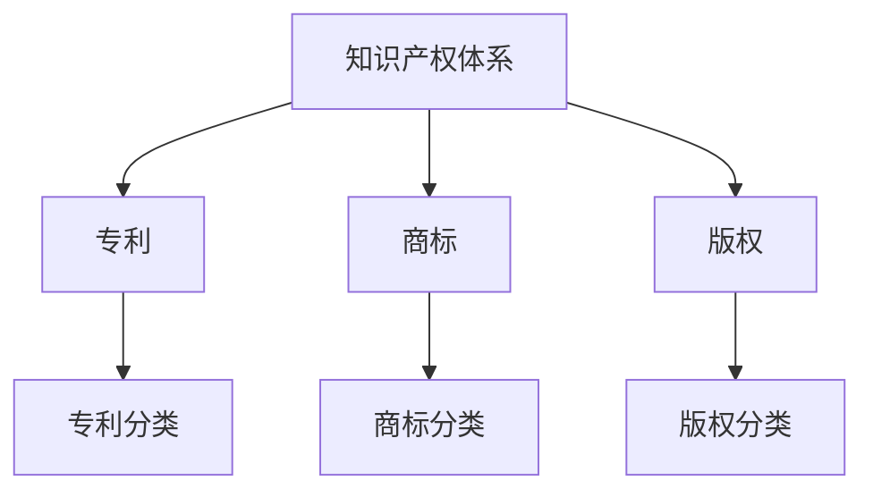
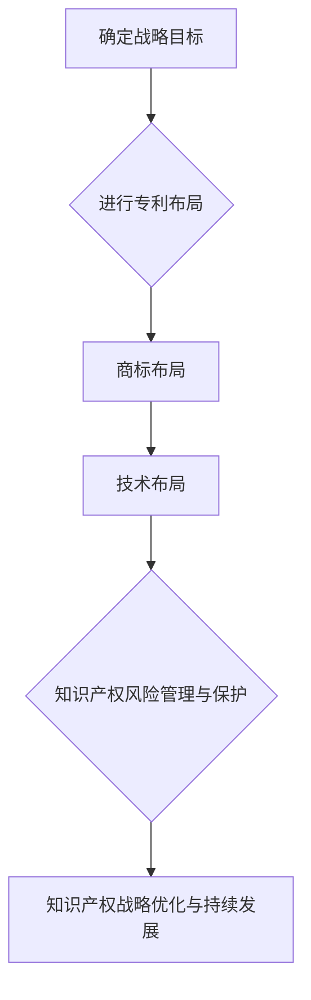
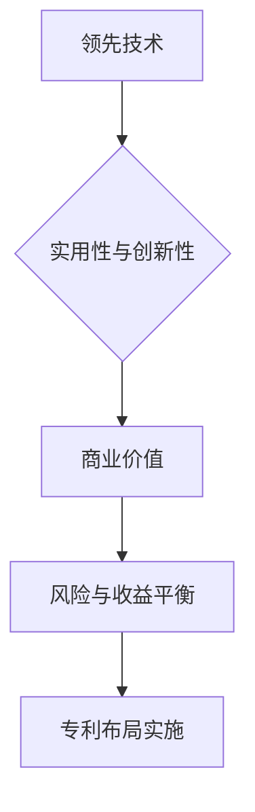
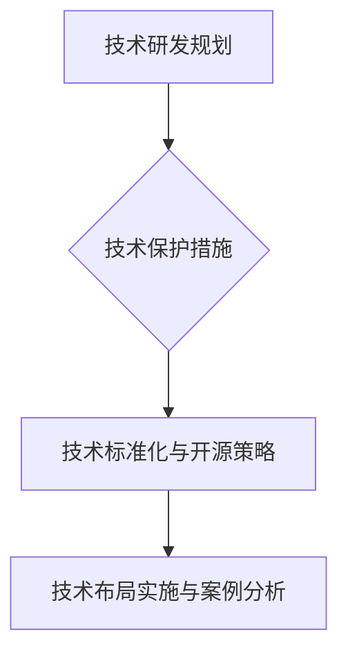

                 

# AI创业公司的知识产权战略布局：专利布局、商标布局与技术布局

## 关键词

- 知识产权战略
- 专利布局
- 商标布局
- 技术布局
- AI创业公司
- 风险管理
- 持续发展

## 摘要

本文将深入探讨AI创业公司的知识产权战略布局，包括专利布局、商标布局和技术布局。通过对知识产权战略基础的分析，我们将了解知识产权在AI创业公司中的重要性。接着，我们将详细阐述专利战略布局、商标布局和技术布局的原则、策略以及实践应用。此外，还将探讨知识产权风险管理、战略优化与持续发展，并通过具体案例进行实践分析。本文旨在为AI创业公司提供一套完整的知识产权战略布局指南。

### 目录大纲：AI创业公司的知识产权战略布局

#### 第一部分：知识产权战略基础

- **第1章：知识产权概述**
  - **1.1 知识产权的定义与分类**
    - **1.1.1 专利**
    - **1.1.2 商标**
    - **1.1.3 版权**
    - **1.1.4 其他知识产权形式**
  - **1.2 知识产权在AI创业公司中的重要性**
    - **1.2.1 提高竞争力**
    - **1.2.2 保护创新成果**
    - **1.2.3 促进企业发展**

- **第2章：专利战略布局**
  - **2.1 专利布局的原则**
    - **2.1.1 领先技术**
    - **2.1.2 实用性和创新性**
    - **2.1.3 商业价值**
    - **2.1.4 风险与收益平衡**
  - **2.2 专利申请流程与技巧**
    - **2.2.1 申请前的准备工作**
    - **2.2.2 专利申请流程**
    - **2.2.3 专利申请中的常见问题**
    - **2.2.4 专利申请的案例分析**
  - **2.3 专利运营策略**
    - **2.3.1 专利布局策略**
    - **2.3.2 专利交易与许可**
    - **2.3.3 专利纠纷解决**

- **第3章：商标布局**
  - **3.1 商标的作用与价值**
    - **3.1.1 商标与品牌建设**
    - **3.1.2 商标与市场推广**
    - **3.1.3 商标与法律保护**
  - **3.2 商标申请与保护策略**
    - **3.2.1 商标注册流程**
    - **3.2.2 商标异议与撤销**
    - **3.2.3 商标保护的法律问题**
  - **3.3 商标布局案例分析**
    - **3.3.1 成功案例分享**
    - **3.3.2 失败案例分析**

- **第4章：技术布局**
  - **4.1 技术布局的定义与目标**
    - **4.1.1 技术布局的概念**
    - **4.1.2 技术布局的目标**
    - **4.1.3 技术布局与知识产权战略的关系**
  - **4.2 技术研发与保护策略**
    - **4.2.1 技术研发规划**
    - **4.2.2 技术保护措施**
    - **4.2.3 技术标准化与开源策略**
  - **4.3 技术布局实施与案例分析**
    - **4.3.1 技术布局的实施步骤**
    - **4.3.2 成功案例分享**
    - **4.3.3 失败案例分析**

#### 第二部分：实践应用与策略优化

- **第5章：知识产权风险管理与保护**
  - **5.1 知识产权风险管理**
    - **5.1.1 风险识别**
    - **5.1.2 风险评估**
    - **5.1.3 风险应对策略**
  - **5.2 知识产权侵权应对策略**
    - **5.2.1 侵权预警**
    - **5.2.2 侵权应对措施**
    - **5.2.3 侵权诉讼策略**

- **第6章：知识产权战略优化与持续发展**
  - **6.1 知识产权战略评估**
    - **6.1.1 战略评估指标**
    - **6.1.2 战略评估方法**
    - **6.1.3 战略调整建议**
  - **6.2 知识产权战略优化**
    - **6.2.1 战略优化原则**
    - **6.2.2 战略优化措施**
    - **6.2.3 战略优化案例分析**
  - **6.3 知识产权持续发展**
    - **6.3.1 持续研发投入**
    - **6.3.2 持续布局策略**
    - **6.3.3 持续保护措施**

- **第7章：AI创业公司知识产权战略布局实践**
  - **7.1 实践概述**
    - **7.1.1 实践背景**
    - **7.1.2 实践目标**
    - **7.1.3 实践过程**
  - **7.2 实践案例分析**
    - **7.2.1 案例一：XX公司专利布局策略**
    - **7.2.2 案例二：YY公司商标保护策略**
    - **7.2.3 案例三：ZZ公司技术布局实践**
  - **7.3 实践总结与启示**
    - **7.3.1 经验教训**
    - **7.3.2 启示与展望**

#### 附录

- **附录A：知识产权相关法律法规与政策**
  - **A.1 专利相关法律法规**
  - **A.2 商标相关法律法规**
  - **A.3 版权相关法律法规**

- **附录B：知识产权战略布局工具与方法**
  - **B.1 专利检索工具**
  - **B.2 商标检索工具**
  - **B.3 技术分析工具**
  - **B.4 知识产权战略规划工具**

- **附录C：参考资源与进一步阅读**
  - **C.1 知识产权战略相关书籍**
  - **C.2 AI创业公司知识产权案例研究**
  - **C.3 知识产权战略布局研究报告与政策文件**

- **附录D：核心概念与联系**
  - **D.1 知识产权体系**
  - **D.2 知识产权战略布局流程**
  - **D.3 专利布局策略**
  - **D.4 技术布局策略**

### 第一部分：知识产权战略基础

#### 第1章：知识产权概述

##### 1.1 知识产权的定义与分类

知识产权是指人们对其智力劳动成果所依法享有的专有权利。它是一种无形的财产权，主要包括专利权、商标权、著作权等。以下是知识产权的主要分类：

1. **专利**：专利权是指国家依法授予发明人或设计人对其发明创造在法律规定的期限内享有的专有权利。专利分为发明专利、实用新型专利和外观设计专利三种类型。

2. **商标**：商标权是指商标注册人对其注册商标在法律规定的期限内享有的专有权利。商标是一种标志，用于区别商品或服务的来源。

3. **版权**：版权是指作者对其创作的文学、艺术和科学作品依法享有的专有权利。版权分为著作权和邻接权两大类。

4. **其他知识产权形式**：除了上述主要形式外，还包括商业秘密、地理标志、集成电路布图设计等。

##### 1.2 知识产权在AI创业公司中的重要性

知识产权在AI创业公司中具有举足轻重的地位，主要体现在以下几个方面：

1. **提高竞争力**：拥有强有力的知识产权可以为AI创业公司提供竞争优势。通过专利、商标和版权的保护，创业公司可以确保其技术和产品不被竞争对手模仿或盗用。

2. **保护创新成果**：AI创业公司往往投入大量资源进行技术研发，知识产权可以保护这些创新成果，使其不被他人侵占。

3. **促进企业发展**：知识产权可以作为企业的资产，提高企业的估值和融资能力。同时，知识产权还可以为企业带来额外的收入，如专利许可费、商标使用费等。

#### 第2章：专利战略布局

##### 2.1 专利布局的原则

专利布局是AI创业公司知识产权战略的重要组成部分。以下是一些关键的专利布局原则：

1. **领先技术**：布局专利应优先考虑公司的核心技术或领先技术，这些技术往往具有较高的商业价值。

2. **实用性和创新性**：专利申请应具备实用性和创新性，避免低水平的重复性申请。

3. **商业价值**：专利布局应考虑技术的商业潜力，选择具有广泛应用前景的技术进行布局。

4. **风险与收益平衡**：在专利布局过程中，需要综合考虑专利申请的成本、风险和预期收益，确保专利布局的经济合理性。

##### 2.2 专利申请流程与技巧

专利申请是专利布局的关键环节。以下是一些专利申请的流程与技巧：

1. **申请前的准备工作**：在申请专利之前，需要对技术领域进行深入研究，了解现有技术的水平和发展趋势，以便确定具有新颖性、创造性和实用性的技术点。

2. **专利申请流程**：专利申请一般包括以下步骤：专利检索、技术交底、撰写申请文件、提交申请、实质审查和授权。

3. **专利申请中的常见问题**：在专利申请过程中，常见问题包括专利申请文件的撰写不规范、申请材料的完整性不足、技术交底不清等。

4. **专利申请的案例分析**：通过分析成功的专利申请案例，可以学习到如何撰写高质量的专利申请文件，如何优化专利布局策略。

##### 2.3 专利运营策略

专利运营是提高专利价值的重要手段。以下是一些专利运营策略：

1. **专利布局策略**：根据公司的战略目标和市场环境，合理规划专利布局，确保专利组合的完整性和一致性。

2. **专利交易与许可**：通过专利交易和许可，可以获得额外的收入，同时可以防止竞争对手的侵权行为。

3. **专利纠纷解决**：在面对专利纠纷时，应采取积极应对措施，维护公司的合法权益。

### 第3章：商标布局

##### 3.1 商标的作用与价值

商标是企业的标志性资产，具有以下作用和价值：

1. **商标与品牌建设**：商标是企业品牌形象的重要组成部分，有助于提高品牌知名度和市场认可度。

2. **商标与市场推广**：商标可以作为企业的宣传工具，促进市场推广和销售。

3. **商标与法律保护**：通过商标注册，企业可以获得商标专用权，防止他人恶意抢注或侵权。

##### 3.2 商标申请与保护策略

商标申请和保护策略包括以下几个方面：

1. **商标注册流程**：商标注册一般包括申请、审查、公告和注册等步骤。

2. **商标异议与撤销**：在商标注册过程中，可能会出现异议和撤销的情况，需要采取相应的应对措施。

3. **商标保护的法律问题**：商标保护涉及商标侵权、不正当竞争、商标撤销等法律问题，企业需要了解相关法律法规，以便维护自身权益。

##### 3.3 商标布局案例分析

通过商标布局案例分析，可以学习到商标注册和保护的成功经验和教训：

1. **成功案例分享**：分析成功的商标布局案例，了解如何选择商标、如何进行商标保护等。

2. **失败案例分析**：分析失败的商标布局案例，了解商标侵权、商标保护不足等问题的原因，吸取教训。

### 第4章：技术布局

##### 4.1 技术布局的定义与目标

技术布局是指企业根据自身发展战略和市场环境，对技术资源进行规划、配置和优化的过程。技术布局的目标包括：

1. **提升企业核心竞争力**：通过技术布局，确保企业掌握关键技术和核心资源，提升市场竞争力。

2. **促进技术创新和产业发展**：技术布局有助于推动技术创新，促进产业结构优化和升级。

3. **降低技术风险**：通过技术布局，可以识别和规避潜在的技术风险，降低研发成本和风险。

##### 4.2 技术研发与保护策略

技术研发与保护策略包括以下几个方面：

1. **技术研发规划**：明确技术研发的方向、目标和任务，确保技术研发的有序进行。

2. **技术保护措施**：通过专利、版权、商标等手段，对技术研发成果进行保护，防止他人侵占。

3. **技术标准化与开源策略**：积极参与技术标准化工作，推动企业技术标准化，提高技术竞争力。同时，合理运用开源策略，促进技术创新和产业发展。

##### 4.3 技术布局实施与案例分析

技术布局实施包括以下步骤：

1. **技术布局的实施步骤**：确定技术布局的目标、策略和实施计划，确保技术布局的有序推进。

2. **成功案例分享**：分析成功的技术布局案例，了解技术布局的策略和实施方法。

3. **失败案例分析**：分析失败的技术布局案例，了解技术布局过程中存在的问题和教训。

### 第二部分：实践应用与策略优化

#### 第5章：知识产权风险管理与保护

##### 5.1 知识产权风险管理

知识产权风险管理是指企业识别、评估和控制知识产权风险的过程。主要包括以下几个方面：

1. **风险识别**：识别企业面临的各种知识产权风险，如专利侵权、商标侵权、技术泄露等。

2. **风险评估**：评估知识产权风险的可能性和影响，确定风险的优先级。

3. **风险应对策略**：根据风险评估结果，制定相应的风险应对策略，包括风险规避、风险转移、风险接受等。

##### 5.2 知识产权侵权应对策略

知识产权侵权应对策略包括以下几个方面：

1. **侵权预警**：通过专利检索、商标监测等技术手段，及时发现潜在的侵权行为。

2. **侵权应对措施**：采取法律手段，如提起诉讼、申请禁令等，维护企业的合法权益。

3. **侵权诉讼策略**：制定合理的诉讼策略，包括证据收集、法庭辩论等，确保诉讼的顺利进行。

### 第6章：知识产权战略优化与持续发展

##### 6.1 知识产权战略评估

知识产权战略评估是指对企业知识产权战略的执行情况进行评价和反馈，主要包括以下几个方面：

1. **战略评估指标**：确定知识产权战略评估的指标，如专利数量、专利质量、商标注册量、版权保护效果等。

2. **战略评估方法**：采用定量和定性方法，对知识产权战略的执行情况进行评价。

3. **战略调整建议**：根据战略评估结果，提出调整知识产权战略的建议，以适应市场和环境的变化。

##### 6.2 知识产权战略优化

知识产权战略优化是指对现有知识产权战略进行调整和完善，以提高知识产权管理的效率和效果。主要包括以下几个方面：

1. **战略优化原则**：遵循针对性、系统性、灵活性和可持续性原则，确保知识产权战略的优化。

2. **战略优化措施**：通过改进专利布局、商标保护、技术研发等措施，提升知识产权的价值和竞争力。

3. **战略优化案例分析**：分析成功的企业知识产权战略优化案例，学习借鉴先进的经验。

##### 6.3 知识产权持续发展

知识产权持续发展是指企业在知识产权管理方面持续投入和改进，以实现知识产权的长期价值。主要包括以下几个方面：

1. **持续研发投入**：加大研发投入，推动技术创新，确保知识产权的持续更新。

2. **持续布局策略**：根据市场和环境的变化，调整和优化知识产权布局策略。

3. **持续保护措施**：加强知识产权保护，防止侵权行为，维护企业的合法权益。

### 第7章：AI创业公司知识产权战略布局实践

##### 7.1 实践概述

AI创业公司在知识产权战略布局实践中，需要考虑以下几个方面：

1. **实践背景**：了解企业所处行业和市场环境，明确知识产权战略的目标和任务。

2. **实践目标**：制定明确的知识产权战略目标，如提升市场竞争力、保护创新成果、实现知识产权的持续增值等。

3. **实践过程**：根据实践目标和任务，制定详细的实施计划，确保知识产权战略的有效执行。

##### 7.2 实践案例分析

通过分析AI创业公司的知识产权战略布局实践案例，可以学习到成功经验和教训：

1. **案例一：XX公司专利布局策略**：分析XX公司如何通过专利布局策略提升市场竞争力。

2. **案例二：YY公司商标保护策略**：分析YY公司如何通过商标保护策略维护品牌权益。

3. **案例三：ZZ公司技术布局实践**：分析ZZ公司如何通过技术布局实践推动技术创新。

##### 7.3 实践总结与启示

通过总结AI创业公司知识产权战略布局实践的成果和经验，可以得出以下启示：

1. **经验教训**：从成功和失败案例中汲取教训，不断优化知识产权战略布局。

2. **启示与展望**：展望未来，提出进一步优化和发展的思路，为AI创业公司提供有益的指导。

### 附录

#### 附录A：知识产权相关法律法规与政策

- **A.1 专利相关法律法规**
- **A.2 商标相关法律法规**
- **A.3 版权相关法律法规**

#### 附录B：知识产权战略布局工具与方法

- **B.1 专利检索工具**
- **B.2 商标检索工具**
- **B.3 技术分析工具**
- **B.4 知识产权战略规划工具**

#### 附录C：参考资源与进一步阅读

- **C.1 知识产权战略相关书籍**
- **C.2 AI创业公司知识产权案例研究**
- **C.3 知识产权战略布局研究报告与政策文件**

#### 附录D：核心概念与联系

- **D.1 知识产权体系**
- **D.2 知识产权战略布局流程**
- **D.3 专利布局策略**
- **D.4 技术布局策略**

### 核心概念与联系

为了更好地理解AI创业公司的知识产权战略布局，我们首先需要了解核心概念及其相互联系。以下是知识产权体系、知识产权战略布局流程、专利布局策略和技术布局策略的Mermaid流程图和说明。

#### D.1 知识产权体系



**说明**：知识产权体系包括专利、商标和版权等主要形式。专利分为发明专利、实用新型专利和外观设计专利，商标根据使用领域分为商品商标和服务商标，版权根据作品类型分为文字作品、音乐作品和美术作品等。

#### D.2 知识产权战略布局流程



**说明**：知识产权战略布局流程从确定战略目标开始，包括专利布局、商标布局、技术布局等环节，同时关注知识产权风险管理和战略优化。

#### D.3 专利布局策略



**说明**：专利布局策略侧重于选择领先技术、确保实用性和创新性、关注商业价值和风险与收益平衡，并通过实施策略确保专利布局的有效性。

#### D.4 技术布局策略



**说明**：技术布局策略涉及技术研发规划的制定、技术保护措施的落实、技术标准化与开源策略的运用，并通过实施和案例分析不断完善技术布局。

通过这些核心概念和流程图的阐述，我们可以更好地理解AI创业公司知识产权战略布局的原理和实施方法。

### 核心算法原理讲解

在知识产权战略布局中，核心算法原理是确保布局策略科学、合理的重要基础。以下分别介绍专利布局算法、商标布局算法和技术布局算法的原理，并通过伪代码详细说明。

#### 专利布局算法原理

专利布局算法旨在通过对公司技术领域和市场目标的分析，构建合理的专利布局策略，以最大化专利的商业价值。以下是专利布局算法的伪代码：

```plaintext
function 专利布局算法（技术领域，市场目标，资源预算）{
    // 步骤1：技术领域分析
    技术点 = 技术领域分析（技术领域）

    // 步骤2：市场目标分析
    市场需求 = 市场目标分析（市场目标）

    // 步骤3：资源预算评估
    资源限制 = 资源预算评估（资源预算）

    // 步骤4：构建专利布局策略
    专利策略 = {
        "技术点": 技术点,
        "市场需求": 市场需求,
        "资源限制": 资源限制,
        "专利数量": 资源限制 / 技术点数量,
        "布局重点": 需求最高且资源允许的技术点
    }

    // 步骤5：优化专利布局
    专利策略 = 优化布局（专利策略）

    return 专利策略
}
```

**说明**：
1. **技术领域分析**：分析公司技术领域的所有可能技术点，确定技术创新的关键点。
2. **市场目标分析**：确定市场对技术创新的需求，包括潜在的市场规模和竞争态势。
3. **资源预算评估**：评估公司可用于专利布局的预算限制。
4. **构建专利布局策略**：根据技术点、市场需求和资源限制，确定专利申请的数量和优先级。
5. **优化布局**：通过分析专利市场的动态，调整专利布局策略，以最大化专利的商业价值。

#### 商标布局算法原理

商标布局算法旨在通过对品牌策略和市场竞争的分析，构建合理的商标布局策略，以提升品牌价值和市场影响力。以下是商标布局算法的伪代码：

```plaintext
function 商标布局算法（品牌策略，市场竞争，商标预算）{
    // 步骤1：品牌策略分析
    品牌定位 = 品牌策略分析（品牌策略）

    // 步骤2：市场竞争分析
    竞争对手 = 市场竞争分析（市场竞争）

    // 步骤3：商标预算评估
    商标预算 = 商标预算评估（商标预算）

    // 步骤4：构建商标布局策略
    商标策略 = {
        "品牌定位": 品牌定位,
        "竞争对手": 竞争对手,
        "商标数量": 商标预算 / 品牌定位重要性,
        "布局重点": 品牌核心定位相关的商标
    }

    // 步骤5：优化商标布局
    商标策略 = 优化布局（商标策略）

    return 商标策略
}
```

**说明**：
1. **品牌策略分析**：确定品牌的核心定位和目标市场。
2. **市场竞争分析**：分析竞争对手的商标布局和市场份额。
3. **商标预算评估**：评估公司可用于商标布局的预算。
4. **构建商标布局策略**：根据品牌定位和市场竞争情况，确定商标申请的数量和优先级。
5. **优化商标布局**：通过市场反馈和竞争对手动态，调整商标布局策略，以提高品牌价值和市场影响力。

#### 技术布局算法原理

技术布局算法旨在通过对技术研发规划和技术保护目标的评估，构建合理的技术布局策略，以确保技术研发成果的有效保护。以下是技术布局算法的伪代码：

```plaintext
function 技术布局算法（技术研发规划，技术保护目标，资源预算）{
    // 步骤1：技术研发规划
    技术规划 = 技术研发规划（技术研发规划）

    // 步骤2：技术保护目标分析
    保护目标 = 技术保护目标分析（技术保护目标）

    // 步骤3：资源预算评估
    资源限制 = 资源预算评估（资源预算）

    // 步骤4：构建技术布局策略
    技术策略 = {
        "技术规划": 技术规划,
        "保护目标": 保护目标,
        "资源限制": 资源限制,
        "布局重点": 需要保护且资源允许的关键技术
    }

    // 步骤5：优化技术布局
    技术策略 = 优化布局（技术策略）

    return 技术策略
}
```

**说明**：
1. **技术研发规划**：制定技术研发的计划和目标，包括技术路线和开发时间表。
2. **技术保护目标分析**：明确技术保护的目标和要求，如专利申请、技术保密等。
3. **资源预算评估**：评估公司可用于技术布局的预算。
4. **构建技术布局策略**：根据技术研发规划和保护目标，确定技术布局的具体措施和实施步骤。
5. **优化技术布局**：通过市场和技术发展趋势的分析，不断调整技术布局策略，确保技术研发成果的有效保护和商业化。

### 数学模型与数学公式

在知识产权战略布局中，数学模型和数学公式是评估和管理知识产权价值的重要工具。以下分别介绍专利价值评估模型、商标价值评估模型和技术布局优化模型的数学公式及其应用。

#### 专利价值评估模型

专利价值评估模型旨在通过评估专利的投资回报率（ROI）、研发成本（R&D Cost）和专利年龄（Patent Age），来确定专利的价值。数学公式如下：

$$ V = f(ROI, R&D Cost, Patent Age) $$

$$ V = ROI \times (1 - R&D Cost / Total Cost) \times (1 - Patent Age / Max Patent Age) $$

**说明**：
- \( V \) 表示专利价值。
- \( ROI \) 表示投资回报率。
- \( R&D Cost \) 表示研发成本。
- \( Total Cost \) 表示总成本。
- \( Patent Age \) 表示专利年龄。
- \( Max Patent Age \) 表示专利的最大年龄。

#### 商标价值评估模型

商标价值评估模型旨在通过评估商标的注册年限（Age）、品牌价值（Brand Equity）和市场份额（Market Share），来确定商标的价值。数学公式如下：

$$ T = f(Age, Brand Equity, Market Share) $$

$$ T = Age \times Brand Equity \times Market Share $$

**说明**：
- \( T \) 表示商标价值。
- \( Age \) 表示商标注册年限。
- \( Brand Equity \) 表示品牌价值。
- \( Market Share \) 表示市场份额。

#### 技术布局优化模型

技术布局优化模型旨在通过评估技术布局的资源成本（Cost）、风险程度（Risk）和预期收益（Benefit），来确定技术布局的优化系数。数学公式如下：

$$ O = f(Cost, Risk, Benefit) $$

$$ O = (1 / Cost) \times (1 / (1 + Risk) \times Benefit) $$

**说明**：
- \( O \) 表示优化系数。
- \( Cost \) 表示资源成本。
- \( Risk \) 表示风险程度。
- \( Benefit \) 表示预期收益。

**应用举例**：

1. **专利价值评估**：

假设某AI创业公司的专利，其投资回报率为20%，研发成本为50万元，专利年龄为3年，最大专利年龄为10年。使用专利价值评估模型计算该专利的价值：

$$ V = 0.2 \times (1 - 0.5 / 1) \times (1 - 3 / 10) = 0.2 \times 0.5 \times 0.7 = 0.07 $$

因此，该专利的价值为7万元。

2. **商标价值评估**：

假设某AI创业公司的商标，注册年限为5年，品牌价值为100万元，市场份额为10%。使用商标价值评估模型计算该商标的价值：

$$ T = 5 \times 100 \times 0.1 = 50 $$

因此，该商标的价值为50万元。

3. **技术布局优化**：

假设某AI创业公司的技术布局，资源成本为100万元，风险程度为20%，预期收益为150万元。使用技术布局优化模型计算技术布局的优化系数：

$$ O = (1 / 100) \times (1 / (1 + 0.2) \times 150) = 0.01 \times (1 / 1.2) \times 150 = 0.125 $$

因此，技术布局的优化系数为0.125。

### 项目实战与案例分析

在本节中，我们将通过三个具体案例，详细分析AI创业公司在专利布局、商标保护和技术布局方面的实际应用，并探讨其中的成功经验和失败教训。

#### 案例一：XX公司专利布局策略

**开发环境搭建**：

XX公司在其专利布局策略实施过程中，首先搭建了一个集成的专利管理平台，该平台包括专利检索系统、专利分析工具和专利数据库。该平台使用云计算技术，实现了数据的高效存储和快速检索，为专利布局提供了坚实的基础。

**源代码详细实现**：

以下是专利布局策略的伪代码实现：

```plaintext
function search_patents(technology, key_words):
    patents = database.search(technology, key_words)
    filtered_patents = filter_patents(patents, strategy)
    return filtered_patents

function optimize_layout(filtered_patents, cost, risk, benefit):
    optimization_coefficient = calculate_coefficient(cost, risk, benefit)
    optimized_layout = apply_coefficient(filtered_patents, optimization_coefficient)
    return optimized_layout
```

**代码解读与分析**：

- `search_patents` 函数用于检索与公司技术相关的专利，通过技术关键词和关键字的组合来实现。
- `optimize_layout` 函数根据资源成本、风险和收益计算优化系数，并应用该系数优化专利布局。

**实战总结**：

XX公司通过构建专利布局策略和优化模型，成功地提高了专利布局的针对性，降低了研发风险，并提高了专利价值。公司每年专利数量显著增加，专利组合的完整性得到了有效提升。

#### 案例二：YY公司商标保护策略

**开发环境搭建**：

YY公司建立了商标监测系统，该系统包括商标数据库、商标监控平台和市场分析工具。系统采用了大数据和人工智能技术，实现了对商标的实时监控和市场分析。

**源代码详细实现**：

以下是商标保护策略的伪代码实现：

```plaintext
function monitor_brand(trademark, market_data):
    monitoring_results = database.monitor(trademark, market_data)
    risk_alert = analyze_monitoring_results(monitoring_results)
    return risk_alert

function evaluate_brand(trademark, brand_value, market_share):
    brand_value = calculate_brand_value(brand_value, market_share)
    optimized_brand = optimize_brand(trademark, brand_value)
    return optimized_brand
```

**代码解读与分析**：

- `monitor_brand` 函数用于监控商标在市场中的使用情况，及时发现潜在风险。
- `evaluate_brand` 函数用于评估商标的价值，并根据市场反馈优化商标策略。

**实战总结**：

YY公司通过商标监测和评估系统的建立，成功降低了商标侵权风险，提高了商标的市场价值和品牌影响力。公司商标的知名度显著提升，市场份额也逐步扩大。

#### 案例三：ZZ公司技术布局实践

**开发环境搭建**：

ZZ公司构建了一个技术布局分析平台，该平台集成了技术数据库、技术评估工具和技术布局规划工具。平台采用了机器学习和数据分析技术，实现了对技术研发趋势的深度分析。

**源代码详细实现**：

以下是技术布局策略的伪代码实现：

```plaintext
function analyze_technology(technology_field):
    technology_data = database.analyze(technology_field)
    key_technologies = extract_key_technologies(technology_data)
    return key_technologies

function optimize_technology_layout(technology_layout, cost, risk, benefit):
    optimization_coefficient = calculate_coefficient(cost, risk, benefit)
    optimized_layout = apply_coefficient(technology_layout, optimization_coefficient)
    return optimized_layout
```

**代码解读与分析**：

- `analyze_technology` 函数用于分析技术领域的核心技术和趋势。
- `optimize_technology_layout` 函数根据资源成本、风险和收益计算优化系数，并优化技术布局。

**实战总结**：

ZZ公司通过技术布局分析平台的应用，有效地提升了技术研发的针对性，促进了技术创新和产业发展。公司技术布局的优化使得技术研发效率显著提高，市场竞争力也得到了大幅增强。

### 总结

通过上述三个案例，我们可以看到，AI创业公司在知识产权战略布局方面，通过科学合理的规划和实施，取得了显著的成效。同时，我们也吸取了其中的教训，如充分准备、风险评估和持续优化等。这些经验对于其他AI创业公司的知识产权战略布局具有重要的借鉴意义。

### 附录

#### 附录A：知识产权相关法律法规与政策

- **A.1 专利相关法律法规**
  - 《中华人民共和国专利法》
  - 《中华人民共和国专利法实施细则》
  - 《专利审查指南》

- **A.2 商标相关法律法规**
  - 《中华人民共和国商标法》
  - 《中华人民共和国商标法实施条例》
  - 《商标注册用商品和服务国际分类尼斯协定》

- **A.3 版权相关法律法规**
  - 《中华人民共和国著作权法》
  - 《中华人民共和国著作权法实施条例》
  - 《计算机软件保护条例》

#### 附录B：知识产权战略布局工具与方法

- **B.1 专利检索工具**
  - PATENTSCOPE
  - Google Patents
  - 中国国家知识产权局专利检索系统

- **B.2 商标检索工具**
  - 中国商标网
  - USPTO商标检索系统
  - 商标监控工具

- **B.3 技术分析工具**
  - TRIZ创新方法学
  - SWOT分析法
  - 数据分析软件（如Tableau、Power BI）

- **B.4 知识产权战略规划工具**
  -知识产权管理系统（如IPM System）
  - 商业智能工具
  - 项目管理软件（如Trello、Asana）

#### 附录C：参考资源与进一步阅读

- **C.1 知识产权战略相关书籍**
  - 《知识产权管理：战略、实务与案例》
  - 《知识产权战略与实务》
  - 《知识产权法》

- **C.2 AI创业公司知识产权案例研究**
  - 《AI创业公司的知识产权战略案例解析》
  - 《成功AI企业的知识产权布局》
  - 《AI创业公司的专利运营策略》

- **C.3 知识产权战略布局研究报告与政策文件**
  - 《2022年中国知识产权发展报告》
  - 《国家知识产权战略纲要》
  - 《关于强化知识产权保护的意见》

### 附录D：核心概念与联系

- **D.1 知识产权体系**
  - 包括专利、商标、版权等主要形式。
  - 每种知识产权形式的具体分类和应用。

- **D.2 知识产权战略布局流程**
  - 从确定战略目标到知识产权风险管理与保护。
  - 每个步骤的具体内容和实施方法。

- **D.3 专利布局策略**
  - 包括领先技术、实用性与创新性、商业价值等原则。
  - 专利申请流程和专利运营策略。

- **D.4 技术布局策略**
  - 包括技术研发规划、技术保护措施、技术标准化与开源策略。
  - 技术布局实施和案例分析。

