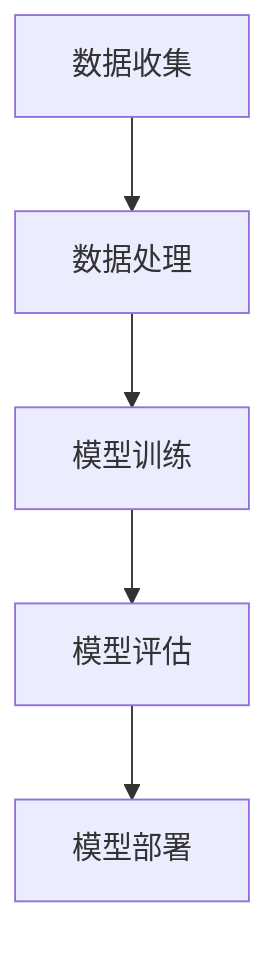
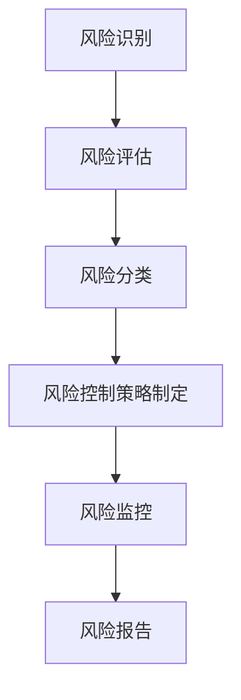
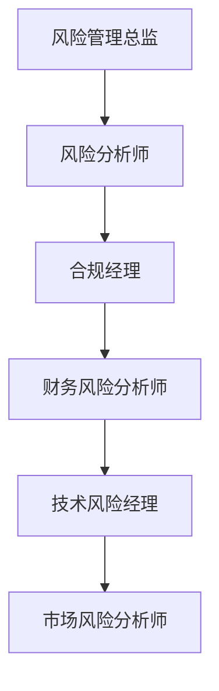
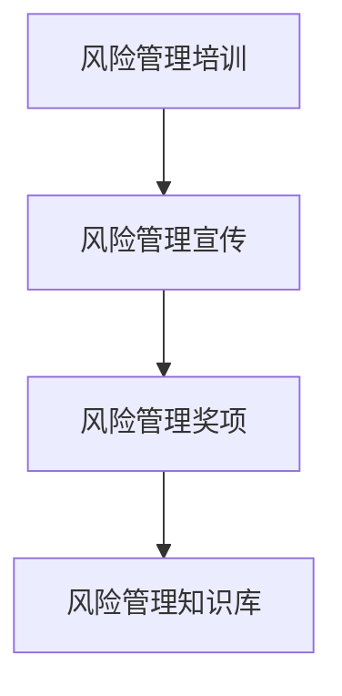
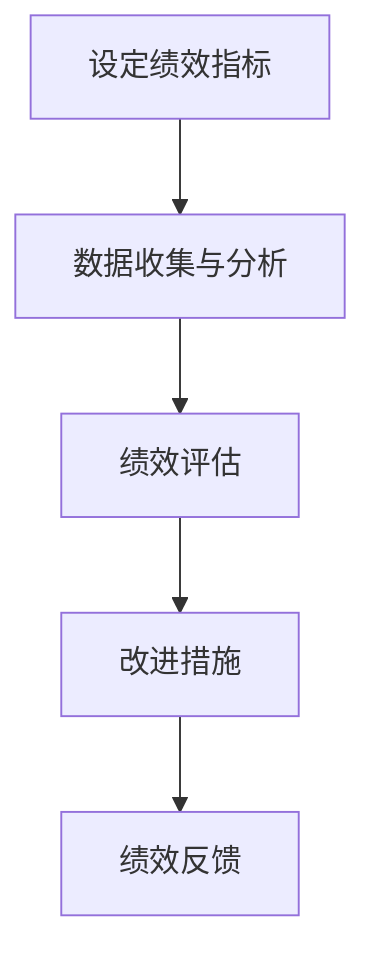

                 

### 《AI创业公司的风险控制》

> **关键词：** AI创业，风险控制，风险管理，人工智能，创业公司

> **摘要：** 本文将深入探讨AI创业公司面临的多种风险及其控制方法。通过对AI技术的核心概念和风险类型的分析，我们将提出有效的风险管理策略和工具，以帮助AI创业公司应对潜在挑战，实现可持续发展。

### 《AI创业公司的风险控制》目录大纲

**第一部分：AI创业背景与风险概述**

- **第1章：AI创业概述**
  - 1.1 AI创业浪潮与机遇
  - 1.2 AI创业的优势与挑战
  - 1.3 AI创业公司的风险类型
  - 1.4 AI创业公司风险管理的必要性

- **第2章：AI技术核心概念与联系**
  - 2.1 AI技术的基本原理与架构（Mermaid流程图）
  - 2.2 机器学习算法原理（伪代码）
  - 2.3 深度学习数学模型（LaTeX公式）
  - 2.4 AI技术在创业中的应用场景

**第二部分：AI创业风险控制方法**

- **第3章：风险识别与评估**
  - 3.1 风险识别的方法与工具
  - 3.2 风险评估指标体系
  - 3.3 风险量化方法
  - 3.4 风险评估案例

- **第4章：风险控制策略**
  - 4.1 风险控制策略概述
  - 4.2 风险规避策略
  - 4.3 风险控制策略
  - 4.4 风险转移策略
  - 4.5 风险接受策略

- **第5章：风险管理工具与技术**
  - 5.1 风险管理软件介绍
  - 5.2 数据分析与可视化技术
  - 5.3 风险建模与仿真技术
  - 5.4 风险管理信息系统

- **第6章：AI创业公司的合规与法律风险**
  - 6.1 合规风险概述
  - 6.2 法律法规与政策环境
  - 6.3 合规风险管理策略
  - 6.4 数据隐私保护与安全

- **第7章：AI创业公司的财务风险与投资策略**
  - 7.1 财务风险识别与评估
  - 7.2 资金筹集与投资策略
  - 7.3 财务风险管理策略
  - 7.4 投资案例分析与解读

**第三部分：实战案例分析**

- **第8章：AI创业公司风险控制案例研究**
  - 8.1 案例背景介绍
  - 8.2 风险识别与评估
  - 8.3 风险控制策略实施
  - 8.4 案例效果评估与总结

- **第9章：AI创业公司的风险管理实践**
  - 9.1 风险管理流程设计与实施
  - 9.2 风险管理团队建设与职责分配
  - 9.3 风险管理文化建设
  - 9.4 风险管理绩效评估与改进

- **第10章：未来展望与挑战**
  - 10.1 AI创业公司风险管理的未来发展趋势
  - 10.2 面临的挑战与应对策略
  - 10.3 结论与建议

**附录**

- **附录A：AI创业公司风险控制工具推荐**
- **附录B：AI创业公司风险控制法律法规汇总**
- **附录C：AI创业公司财务风险指标计算方法**

### 第一部分：AI创业背景与风险概述

#### 第1章：AI创业概述

##### 1.1 AI创业浪潮与机遇

近年来，人工智能（AI）技术迅猛发展，成为引领全球科技革命的重要驱动力。AI技术的突破性进展，使得各行各业面临巨大的变革机遇，同时也催生了大量的AI创业公司。从图像识别、自然语言处理到自动驾驶、智能制造，AI技术的广泛应用为创业者提供了丰富的创新空间。

当前，全球范围内AI创业浪潮此起彼伏。以美国、中国、欧洲为代表的主要经济体，纷纷加大对AI领域的投资力度，推动AI技术的研发和应用。例如，美国的硅谷成为全球AI创业的热土，涌现出一大批如OpenAI、NVIDIA等知名AI公司；中国在AI领域也取得了显著成就，百度、阿里巴巴、腾讯等科技巨头纷纷布局AI，推动了国内AI创业的蓬勃发展。

##### 1.2 AI创业的优势与挑战

AI创业具有多方面的优势。首先，AI技术具有广泛的适用性，能够解决传统行业面临的各种复杂问题，提高生产效率和服务质量。其次，AI创业公司可以借助大数据、云计算等技术手段，快速迭代产品，实现快速市场占领。此外，AI创业公司通常具有较高的技术含量和创新能力，能够在激烈的市场竞争中脱颖而出。

然而，AI创业也面临着诸多挑战。首先，技术风险是AI创业公司最为关注的风险之一。AI技术本身复杂且不断发展，创业公司需要不断投入大量资源和时间进行技术研发，以保持竞争力。其次，市场风险也是AI创业公司需要面对的挑战。虽然AI技术具有广泛的应用前景，但实际市场需求可能并不如预期，导致产品推广困难。此外，法律风险、财务风险、人才流失等也是AI创业公司需要关注的问题。

##### 1.3 AI创业公司的风险类型

AI创业公司面临的多种风险可以归纳为以下几类：

1. **技术风险**：包括技术落后、研发失败、知识产权纠纷等。
2. **市场风险**：包括市场定位不准确、竞争对手激烈、市场需求变化等。
3. **财务风险**：包括资金链断裂、成本控制不力、投资策略不当等。
4. **法律风险**：包括合规风险、数据隐私保护风险、法律纠纷等。
5. **人才风险**：包括人才流失、团队建设不足、人才引进困难等。

##### 1.4 AI创业公司风险管理的必要性

有效的风险管理对于AI创业公司至关重要。首先，风险管理能够帮助创业公司识别和评估潜在风险，制定针对性的风险控制策略，降低风险对公司的负面影响。其次，风险管理有助于优化公司资源分配，提高资源利用效率，确保公司持续发展。此外，良好的风险管理能够提升公司形象，增强投资者信心，为创业公司吸引更多资本。

总之，AI创业公司需要高度重视风险管理，建立完善的风险管理体系，以应对不断变化的市场环境和技术挑战，实现可持续发展。

#### 第2章：AI技术核心概念与联系

##### 2.1 AI技术的基本原理与架构（Mermaid流程图）

人工智能（AI）技术是一种通过模拟人类智能行为来实现计算机自主学习和决策的科学技术。其基本原理可以概括为以下几个步骤：

1. **数据收集**：通过传感器、网络爬虫等方式收集大量数据。
2. **数据处理**：对收集到的数据进行清洗、预处理和特征提取。
3. **模型训练**：使用机器学习算法对数据集进行训练，生成预测模型。
4. **模型评估**：通过测试集评估模型的性能，调整模型参数。
5. **模型部署**：将训练好的模型部署到实际应用场景中。

以下是一个简单的Mermaid流程图，展示了AI技术的核心架构：



##### 2.2 机器学习算法原理（伪代码）

机器学习是人工智能（AI）的核心组成部分，其基本原理是通过学习数据中的规律，对未知数据进行预测或分类。以下是一个简单的机器学习算法（线性回归）的伪代码实现：

```python
# 线性回归算法伪代码
def linear_regression(train_data, train_labels):
    # 求解参数w和b
    w = solve_linear_equation(train_data, train_labels)
    b = 0

    # 预测函数
    def predict(data_point):
        return dot_product(data_point, w) + b

    return predict
```

在这个算法中，`solve_linear_equation`函数用于求解线性回归的参数`w`和`b`，`dot_product`函数用于计算两个向量的点积。

##### 2.3 深度学习数学模型（LaTeX公式）

深度学习是机器学习的一个分支，它通过构建多层的神经网络来实现更复杂的模型。以下是一个简单的深度学习数学模型（多层感知器）的LaTeX公式表示：

$$
Z^{(l)} = \sigma(W^{(l)} \cdot A^{(l-1)} + b^{(l)})
$$

其中，$Z^{(l)}$表示第$l$层的激活值，$\sigma$表示激活函数，$W^{(l)}$和$b^{(l)}$分别表示第$l$层的权重和偏置。

##### 2.4 AI技术在创业中的应用场景

AI技术在创业中的应用场景非常广泛，以下列举几种常见的应用：

1. **图像识别**：用于安防监控、医疗诊断、自动驾驶等领域。
2. **自然语言处理**：用于智能客服、文本分析、机器翻译等领域。
3. **推荐系统**：用于电商、社交媒体、音乐流媒体等领域。
4. **智能制造**：用于自动化生产、故障预测、质量检测等领域。
5. **智能医疗**：用于疾病预测、药物研发、个性化治疗等领域。

这些应用场景不仅展示了AI技术的强大潜力，也为创业者提供了丰富的创新机会。通过深入挖掘AI技术在各个领域的应用，创业公司可以创造出具有竞争力的产品和服务，实现商业价值。

### 第二部分：AI创业风险控制方法

#### 第3章：风险识别与评估

##### 3.1 风险识别的方法与工具

风险识别是风险管理的第一步，旨在识别可能影响AI创业公司业务运营的各种风险。以下是一些常用的风险识别方法和工具：

1. **SWOT分析**：通过分析公司的优势（Strengths）、劣势（Weaknesses）、机会（Opportunities）和威胁（Threats），识别潜在风险。
2. **PEST分析**：分析公司所处的政治（Political）、经济（Economic）、社会（Social）和技术（Technological）环境，识别外部风险。
3. **故障树分析（FTA）**：通过构建故障树模型，分析可能导致系统故障的各种原因，识别风险点。
4. **问卷调查**：通过向员工、客户、合作伙伴等发放问卷，收集对风险的看法和建议。
5. **头脑风暴**：组织专家和团队成员进行头脑风暴，列举可能的风险。

##### 3.2 风险评估指标体系

风险评估需要对识别出的风险进行定量或定性分析，以评估其影响程度和发生概率。以下是一个典型的风险评估指标体系：

1. **风险发生概率**：对风险可能发生的概率进行评分（如1-5级），以确定风险的紧急程度。
2. **风险影响程度**：对风险发生对公司业务的影响程度进行评分（如1-5级），以评估风险的严重性。
3. **风险优先级**：根据风险发生概率和影响程度，计算风险优先级，用于确定风险管理的重点。
4. **风险暴露度**：综合考虑风险发生概率和影响程度，计算风险暴露度，用于评估公司面临的风险水平。

以下是一个简单的风险评估指标体系的示例：

| 风险类型 | 风险发生概率 | 风险影响程度 | 风险优先级 | 风险暴露度 |
| -------- | ------------ | ------------ | ---------- | ---------- |
| 技术风险 | 4            | 5            | 1          | 20         |
| 财务风险 | 3            | 4            | 2          | 12         |
| 市场风险 | 2            | 3            | 3          | 6          |
| 法律风险 | 1            | 2            | 4          | 2          |

##### 3.3 风险量化方法

风险量化是将风险评估指标体系中的定性指标转化为定量指标，以便进行更精确的风险分析。以下是一些常用的风险量化方法：

1. **风险价值（VaR）**：计算在一定置信水平下，风险暴露度在一定时间内的最大可能损失。
2. **期望损失（EL）**：计算风险暴露度的期望值，用于评估风险的长期影响。
3. **条件价值损失（CVaR）**：在发生风险的情况下，计算损失的平均值，用于评估风险的严重性。
4. **敏感性分析**：通过改变某些参数值，分析风险对模型结果的敏感程度。

以下是一个简单的风险量化方法的示例：

| 风险类型 | 风险发生概率 | 风险影响程度 | 风险价值（VaR） | 期望损失（EL） |
| -------- | ------------ | ------------ | --------------- | -------------- |
| 技术风险 | 0.4          | 0.5          | $100,000        | $50,000        |
| 财务风险 | 0.3          | 0.4          | $200,000        | $100,000       |
| 市场风险 | 0.2          | 0.3          | $150,000        | $75,000        |
| 法律风险 | 0.1          | 0.2          | $50,000         | $25,000        |

##### 3.4 风险评估案例

以下是一个简单的风险评估案例，用于评估一家AI创业公司的潜在风险：

1. **风险识别**：通过SWOT分析和PEST分析，识别出以下潜在风险：
   - 技术风险：AI技术发展迅速，可能导致公司技术落后。
   - 财务风险：资金链断裂，可能导致公司运营困难。
   - 市场风险：市场需求变化，可能导致产品销售困难。
   - 法律风险：数据隐私保护法律不完善，可能导致公司面临法律纠纷。

2. **风险评估**：根据风险评估指标体系，对每个风险进行评分：
   - 技术风险：风险发生概率4，风险影响程度5，风险优先级1，风险暴露度20。
   - 财务风险：风险发生概率3，风险影响程度4，风险优先级2，风险暴露度12。
   - 市场风险：风险发生概率2，风险影响程度3，风险优先级3，风险暴露度6。
   - 法律风险：风险发生概率1，风险影响程度2，风险优先级4，风险暴露度2。

3. **风险量化**：根据风险量化方法，计算每个风险的风险价值和期望损失：
   - 技术风险：VaR为$100,000，EL为$50,000。
   - 财务风险：VaR为$200,000，EL为$100,000。
   - 市场风险：VaR为$150,000，EL为$75,000。
   - 法律风险：VaR为$50,000，EL为$25,000。

通过这个案例，可以看出公司面临的主要风险是技术风险和财务风险，需要重点关注并制定相应的风险管理策略。

### 第4章：风险控制策略

#### 4.1 风险控制策略概述

风险控制策略是企业在面临各种潜在风险时，采取的一系列预防、应对和缓解措施，旨在最大限度地降低风险对公司运营和财务的负面影响。有效的风险控制策略可以帮助企业实现以下目标：

1. **降低风险水平**：通过采取预防措施，降低风险的发生概率和影响程度。
2. **提高应对能力**：建立有效的应急响应机制，提高企业在面临突发事件时的应对能力。
3. **优化资源分配**：合理配置资源，确保企业能够应对各种风险，实现可持续发展。

在AI创业公司中，风险控制策略尤为重要。由于AI技术复杂且不断发展，AI创业公司面临的技术风险、市场风险、财务风险和法律风险等需要得到特别关注。以下将详细介绍几种常见的风险控制策略。

#### 4.2 风险规避策略

风险规避策略是指通过避免潜在风险的发生，来降低企业面临的风险。以下是一些常见的风险规避策略：

1. **技术规避**：通过不断跟踪AI技术的发展趋势，及时调整公司的技术方向，避免技术落后的风险。
2. **市场规避**：通过市场调研，了解市场需求和竞争态势，避免进入竞争激烈的市场领域。
3. **财务规避**：通过合理的财务规划和管理，避免因资金链断裂导致的财务风险。
4. **法律规避**：遵守相关法律法规，避免因法律纠纷导致的法律风险。

风险规避策略的优点是可以最大限度地降低风险，缺点是可能会错失一些市场机会，影响企业的长期发展。因此，在实施风险规避策略时，需要综合考虑企业的实际情况和风险承受能力。

#### 4.3 风险控制策略

风险控制策略是通过采取措施，降低风险的发生概率和影响程度。以下是一些常见的方法：

1. **预防措施**：通过制定详细的操作规程和标准，预防潜在风险的发生。例如，在研发过程中，建立严格的质量控制体系，确保产品的稳定性和可靠性。
2. **应急预案**：制定应急预案，应对可能发生的突发事件。例如，在财务风险管理中，制定资金流动性应急预案，确保企业在面临资金短缺时能够迅速采取应对措施。
3. **保险**：购买保险，将风险转移给保险公司，降低企业的风险负担。例如，为公司的关键设备和人员购买保险，以降低意外损失的风险。
4. **监控与反馈**：建立风险监控机制，定期评估风险控制措施的有效性，及时调整和优化风险管理策略。

风险控制策略的优点是可以提高企业的风险应对能力，缺点是需要投入一定的资源和时间。在实施风险控制策略时，需要根据企业的实际情况和风险承受能力，制定合理的风险控制措施。

#### 4.4 风险转移策略

风险转移策略是通过将风险转移给第三方，来降低企业的风险负担。以下是一些常见的风险转移策略：

1. **外包**：将某些业务外包给专业的第三方机构，将风险转移给外包服务商。例如，将数据分析和维护工作外包给专业的数据分析公司。
2. **担保**：与合作伙伴签订担保协议，将一部分风险转移给合作伙伴。例如，在项目合作中，要求合作伙伴提供项目成功的担保。
3. **保险**：购买保险，将风险转移给保险公司。例如，购买产品责任保险，将产品销售过程中的风险转移给保险公司。

风险转移策略的优点是可以降低企业的风险负担，缺点是需要支付一定的费用，并且可能存在道德风险。在实施风险转移策略时，需要选择合适的第三方机构，并确保合同条款的合理性。

#### 4.5 风险接受策略

风险接受策略是企业面对某些不可避免的风险时，采取的一种被动应对策略。以下是一些常见的方法：

1. **风险自留**：企业自行承担某些风险，通过内部管理和控制来降低风险的影响。例如，在技术研发中，企业可能会承担一定的失败风险，但通过严格的质量控制来降低失败的概率。
2. **风险容忍**：设定风险容忍度，对某些风险采取容忍态度，不采取任何主动措施。例如，对市场变化带来的风险，企业可能设定一定的容忍范围，在市场稳定后再进行相应的调整。

风险接受策略的优点是简单易行，缺点是可能会对企业的长期发展产生不利影响。在实施风险接受策略时，需要根据企业的实际情况和风险承受能力，合理设定风险容忍度。

综上所述，AI创业公司需要根据自身的实际情况和风险承受能力，制定合理的风险控制策略，以降低风险对公司运营和财务的负面影响，实现可持续发展。

### 第5章：风险管理工具与技术

#### 5.1 风险管理软件介绍

在AI创业公司中，有效的风险管理离不开先进的技术工具。以下介绍几种常见的风险管理软件，以帮助创业公司更好地识别、评估和控制风险。

1. **Risk Management Studio**：这是一款功能强大的风险管理软件，提供全面的风险识别、评估和监控功能。它支持多种风险评估模型，如定量风险评估、定性风险评估和蒙特卡罗模拟，帮助企业制定科学的风险管理策略。

2. **Qualys**：Qualys是一款专注于网络安全风险管理的软件，可以帮助企业识别和修复网络中的安全漏洞。它提供实时监控、漏洞扫描和合规性检查等功能，确保企业的网络安全。

3. **Tableau**：Tableau是一款数据可视化工具，可以帮助企业将复杂的数据转化为直观的图表和仪表盘。通过Tableau，企业可以更好地了解风险数据，发现潜在的风险点，并制定相应的风险控制措施。

4. **Nessus**：Nessus是一款广泛使用的漏洞扫描工具，可以帮助企业发现系统中的安全漏洞。它支持自动扫描和定期更新，确保企业的安全环境始终处于最佳状态。

#### 5.2 数据分析与可视化技术

数据分析与可视化技术是风险管理的重要工具，可以帮助企业更好地理解和应对风险。以下介绍几种常用的数据分析与可视化技术：

1. **数据挖掘**：数据挖掘是一种从大量数据中发现隐藏模式的技术，可以帮助企业识别潜在风险。例如，通过分析客户购买行为数据，可以发现某些高风险客户群体，并采取相应的风险控制措施。

2. **机器学习**：机器学习是一种通过训练模型来预测风险的技术。例如，通过训练分类模型，可以预测客户流失风险，帮助企业管理客户关系，降低流失率。

3. **数据可视化**：数据可视化是将复杂的数据转化为直观的图表和仪表盘，帮助用户更好地理解和分析数据。常用的数据可视化工具包括Tableau、Power BI和QlikView等。

以下是一个数据可视化示例，展示了一个AI创业公司的财务风险情况：


在这个图表中，横轴表示不同的风险类别，纵轴表示风险得分。图表中的每个点代表一个具体的风险事件，点的颜色和大小表示风险的严重程度。通过这个图表，企业可以直观地了解财务风险的情况，并采取相应的风险控制措施。

#### 5.3 风险建模与仿真技术

风险建模与仿真技术是风险管理的重要方法，可以帮助企业预测和评估风险的影响。以下介绍几种常用的风险建模与仿真技术：

1. **蒙特卡罗模拟**：蒙特卡罗模拟是一种基于概率分布的仿真方法，可以用于模拟风险事件的发生过程。通过蒙特卡罗模拟，企业可以预测风险事件的发生概率和影响程度，为风险控制提供依据。

2. **情景分析**：情景分析是一种通过模拟不同情景来评估风险影响的方法。例如，通过模拟市场变化、技术进步等情景，可以预测这些情景对企业的影响，帮助企业制定相应的应对策略。

3. **决策树**：决策树是一种基于逻辑推理的建模方法，可以用于分析不同决策路径下的风险影响。通过决策树，企业可以评估不同决策策略的风险收益，选择最佳的风险管理方案。

以下是一个风险建模与仿真技术的示例，展示了一个AI创业公司的技术风险管理情况：


在这个图表中，决策树展示了不同技术路线的选择及其可能的结果。每个节点表示一个决策点，从根节点到叶节点表示一条决策路径。通过分析决策树，企业可以评估不同技术路线的风险收益，选择最优的技术路线。

#### 5.4 风险管理信息系统

风险管理信息系统（Risk Management Information System, RMIS）是企业管理风险的重要工具，可以帮助企业实现风险信息的收集、存储、分析和报告。以下介绍几种常见的风险管理信息系统：

1. **Oracle Risk Manager**：Oracle Risk Manager是一款功能全面的风险管理信息系统，提供风险管理、合规性和财务报告等功能。它支持多种风险评估模型和数据可视化工具，帮助企业实现风险管理的自动化和智能化。

2. **SAS Risk Management**：SAS Risk Management是一款基于SAS平台的全面风险管理软件，提供风险识别、评估、监控和报告等功能。它支持多种数据源和数据分析工具，帮助企业实现全面的风险管理。

3. **IBM OpenPages**：IBM OpenPages是一款基于SOA架构的风险管理信息系统，提供风险识别、评估、监控和报告等功能。它支持多种风险评估模型和合规性管理，帮助企业实现风险管理的规范化和自动化。

通过这些风险管理信息系统，企业可以实现风险信息的集中管理、实时监控和分析，提高风险管理的效率和质量。

### 第6章：AI创业公司的合规与法律风险

#### 6.1 合规风险概述

合规风险是指企业在运营过程中违反相关法律法规、行业标准和内部规章制度，导致法律责任、财务损失或声誉受损的风险。对于AI创业公司而言，合规风险尤为突出，因为AI技术的快速发展和广泛应用带来了许多新的法律和监管挑战。

首先，AI创业公司需要遵守的数据隐私保护法律法规日益严格。例如，欧盟的《通用数据保护条例》（GDPR）和中国的《个人信息保护法》（PIPL）都规定了严格的数据隐私保护要求。这些法律法规要求企业在收集、处理和使用用户数据时，必须确保数据的安全性和用户的隐私权。

其次，AI创业公司需要遵守的行业标准和规范也在不断更新。例如，自动驾驶、医疗诊断等领域的AI技术需要符合相关的技术标准和安全要求。这些标准和规范不仅涉及技术的性能和安全性，还包括数据的真实性和可靠性。

最后，AI创业公司还需要关注国际法律法规的变化。由于AI技术的全球化应用，企业需要关注不同国家和地区的法律法规，避免因合规问题导致的市场准入障碍或法律纠纷。

#### 6.2 法律法规与政策环境

为了应对合规风险，AI创业公司需要深入了解相关的法律法规和政策环境。以下是一些关键的法律和政策框架：

1. **数据隐私保护法律法规**：如前所述，GDPR和PIPL是AI创业公司必须遵守的关键数据隐私保护法律法规。此外，其他国家和地区的法律法规，如美国的《加州消费者隐私法》（CCPA）和巴西的《通用数据保护法》（LGPD）等，也对数据隐私保护提出了严格要求。

2. **行业标准和规范**：不同的行业和领域对AI技术有特定的标准和规范。例如，医疗诊断领域的AI技术需要符合《国际医疗器械监管共识》（International Medical Device Regulated Consensus，IMDRD）等规范；自动驾驶领域则需要符合《联合国道路车辆法规》等相关规定。

3. **国际法律法规**：国际法律法规的变化对企业的影响越来越大。例如，美国的出口管制法规（如《国际武器贸易条例》和《出口管理条例》）、欧盟的《通用数据保护条例》等，都对企业的合规管理提出了新的要求。

#### 6.3 合规风险管理策略

为了有效管理合规风险，AI创业公司可以采取以下策略：

1. **建立合规组织**：建立专门的合规部门或合规团队，负责制定和执行合规策略，确保公司各项业务活动符合法律法规和行业标准。

2. **合规培训与意识提升**：定期开展合规培训，提高员工对合规风险的认知和意识，确保员工在日常工作中的合规行为。

3. **制定合规流程**：制定详细的合规流程和操作指南，确保公司在数据收集、处理和使用过程中严格遵守法律法规和行业标准。

4. **合规审计与检查**：定期进行合规审计和检查，确保公司的各项业务活动符合法律法规和行业标准，及时发现和纠正合规问题。

5. **合规报告与信息披露**：建立合规报告机制，定期向管理层和股东报告合规情况，确保公司透明公开地披露合规信息。

6. **合规风险评估与监控**：建立合规风险评估体系，定期评估合规风险，制定相应的风险控制措施，确保公司能够及时应对合规风险。

#### 6.4 数据隐私保护与安全

数据隐私保护是AI创业公司合规管理的核心内容之一。以下是一些关键的数据隐私保护措施：

1. **数据加密**：采用数据加密技术，确保数据在传输和存储过程中的安全性。例如，使用SSL/TLS协议确保数据传输的安全性，使用AES等加密算法保护存储的数据。

2. **访问控制**：建立严格的访问控制机制，确保只有授权人员才能访问敏感数据。例如，使用角色权限控制、双因素认证等手段，防止未经授权的访问。

3. **数据备份与恢复**：建立数据备份机制，确保在数据丢失或损坏时能够迅速恢复。定期进行数据备份，并确保备份数据的安全性。

4. **安全审计**：定期进行安全审计，检查系统的安全性和合规性，确保系统的安全性。

5. **用户隐私声明**：在产品和服务中明确告知用户关于数据收集、处理和使用的目的和方式，确保用户对数据隐私保护的知情权。

6. **用户同意与授权**：在收集和使用用户数据前，获取用户的明确同意和授权，确保数据的合法性和合规性。

通过以上合规管理措施和数据隐私保护措施，AI创业公司可以有效降低合规风险，确保公司业务的合规性和可持续发展。

### 第7章：AI创业公司的财务风险与投资策略

#### 7.1 财务风险识别与评估

财务风险是指企业在经营过程中，由于市场环境、内部管理、资金链等因素的变化，导致财务状况恶化，从而影响企业持续发展的风险。AI创业公司由于技术投入大、市场不确定性高，更容易面临财务风险。以下是对财务风险的识别与评估方法：

1. **市场风险**：市场风险包括市场波动、市场需求变化等。通过分析市场趋势、竞争对手情况，以及宏观经济指标，可以评估市场风险对公司财务状况的影响。

2. **资金风险**：资金风险包括现金流短缺、融资困难等。通过对现金流量表的分析，评估公司的资金流动性，以及融资渠道和资金成本。

3. **运营风险**：运营风险包括技术研发风险、生产风险、管理风险等。通过评估技术研发进度、生产效率、管理团队稳定性，来识别和评估运营风险。

4. **合规风险**：合规风险包括违反法律法规导致的罚款、诉讼等。通过对法律法规的了解，评估公司运营中可能存在的合规风险。

5. **汇率风险**：对于有国际业务的AI创业公司，汇率波动可能导致财务损失。通过分析汇率走势和公司外汇敞口，评估汇率风险。

#### 7.2 资金筹集与投资策略

资金筹集是AI创业公司运营的重要环节。以下是一些常见的资金筹集方式和投资策略：

1. **天使投资**：天使投资是指个人投资者对初创企业进行的前期投资。这种方式适合初期阶段的技术研发和市场验证。

2. **风险投资（VC）**：风险投资是专业机构对具有高成长潜力的创业公司进行的大额投资。VC投资通常在企业发展壮大阶段，提供资金和资源支持。

3. **股权众筹**：股权众筹是通过互联网平台向公众筹集资金。这种方式适用于小规模融资，但需要注意合规性和法律风险。

4. **债务融资**：债务融资包括银行贷款、债券发行等。这种方式可以提供稳定的资金来源，但需要承担利息支付和债务偿还的风险。

5. **政府补贴与奖励**：许多国家和地区为鼓励科技创新，提供各种形式的政府补贴和奖励。AI创业公司可以积极申请这些资金，以降低融资成本。

#### 7.3 财务风险管理策略

为了有效管理财务风险，AI创业公司可以采取以下策略：

1. **现金流管理**：定期编制现金流量表，确保公司的现金流稳定。通过优化运营流程和成本控制，提高现金流周转效率。

2. **风险分散**：通过投资多样化，分散市场风险。例如，投资于不同的技术领域和业务方向，降低单一领域风险。

3. **融资结构优化**：合理配置股权和债务融资比例，降低融资成本和偿债压力。同时，确保债务融资的合理性和合规性。

4. **风险管理工具**：利用金融衍生工具，如期货、期权等，对冲市场风险。例如，通过购买外汇期货合约，规避汇率波动带来的风险。

5. **内部审计与监督**：建立内部审计和监督机制，定期评估公司的财务状况和风险管理效果，及时发现和纠正问题。

#### 7.4 投资案例分析与解读

以下是一个AI创业公司的投资案例分析，以展示如何通过有效的财务风险管理实现可持续发展。

**案例：某自动驾驶创业公司**

1. **背景**：该公司成立于2015年，专注于研发自动驾驶技术。由于技术投入巨大，公司在初期阶段面临严重的财务压力。

2. **资金筹集**：公司通过天使投资和风险投资共筹集了1亿美元，用于技术研发和市场推广。同时，积极申请政府补贴和奖励，获得了一定资金支持。

3. **财务风险管理**：
   - **现金流管理**：公司通过精细化现金流管理，优化运营流程，确保现金流的稳定。
   - **风险分散**：投资于多个自动驾驶细分领域，如无人出租车、无人货车等，分散技术风险和市场风险。
   - **融资结构优化**：合理配置股权和债务融资比例，降低融资成本和偿债压力。
   - **风险管理工具**：通过购买外汇期权，规避汇率波动带来的风险。

4. **投资策略**：
   - **技术研发**：持续加大研发投入，保持技术领先地位。
   - **市场推广**：通过合作、并购等手段，快速扩大市场份额。
   - **合作与联盟**：与知名车企、物流公司等建立战略联盟，降低市场准入成本。

5. **结果**：通过有效的财务风险管理策略，该公司成功实现了可持续发展。截至2022年，公司市值达到50亿美元，成为全球自动驾驶领域的领军企业。

通过这个案例，可以看出，有效的财务风险管理策略对于AI创业公司的重要性。通过合理的资金筹集、分散投资、优化融资结构等手段，AI创业公司可以降低财务风险，实现可持续发展。

### 第8章：AI创业公司风险控制案例研究

#### 8.1 案例背景介绍

本案例研究以一家名为“智能影像科技有限公司”（以下简称“智能影像”）的AI创业公司为例。智能影像成立于2018年，专注于利用深度学习技术进行医疗影像分析，旨在提高诊断准确率和降低医生的工作负担。公司初期通过天使投资和风险投资筹集了3000万美元，用于技术研发和市场推广。

在业务发展过程中，智能影像面临多重风险，包括技术风险、市场风险、财务风险和法律风险。为了确保公司可持续发展，智能影像决定对潜在风险进行系统识别、评估和控制。

#### 8.2 风险识别与评估

1. **技术风险**：智能影像的核心技术依赖于深度学习模型。公司技术团队需要不断跟踪技术发展趋势，确保模型性能的领先。同时，技术更新速度快，可能导致公司技术落后的风险。

   - **评估**：通过技术评审和专家咨询，智能影像发现当前的技术方案在某些特定场景下存在性能瓶颈，需要进一步优化和升级。

2. **市场风险**：智能影像的市场需求受医疗行业发展和政策环境的影响。虽然公司初期在临床试验中取得了良好的效果，但实际推广过程中，客户接受度和市场渗透率有待提高。

   - **评估**：通过市场调研和客户访谈，智能影像发现医疗影像分析市场的潜在客户需求较高，但市场竞争激烈，需要进一步差异化产品和服务。

3. **财务风险**：智能影像在资金筹集阶段获得了一笔大额投资，但公司需要持续投入技术研发和市场推广，可能导致资金链紧张。

   - **评估**：通过财务分析，智能影像发现公司的现金流在短期内较为紧张，需要优化成本控制和融资策略。

4. **法律风险**：智能影像涉及医疗数据处理和隐私保护，需要遵守相关法律法规，如《个人信息保护法》和《医疗数据管理条例》。

   - **评估**：通过法律咨询，智能影像发现公司在数据安全和隐私保护方面存在一些漏洞，需要加强合规管理。

#### 8.3 风险控制策略实施

针对识别出的风险，智能影像采取了以下风险控制策略：

1. **技术风险控制**：
   - **研发投入**：增加技术研发预算，提升模型性能和适用范围。
   - **技术合作**：与知名高校和研究机构建立合作关系，共同开展技术攻关。
   - **人才培养**：加强技术团队建设，引入高水平研发人员。

2. **市场风险控制**：
   - **市场推广**：加大市场推广力度，通过医学会议、学术报告等形式提高品牌知名度。
   - **客户定制**：根据客户需求提供个性化产品和服务，提高客户满意度。
   - **竞争对手分析**：持续关注竞争对手动态，调整市场策略。

3. **财务风险控制**：
   - **成本控制**：优化运营流程，降低非必要开支。
   - **融资策略**：探索新的融资渠道，如股权众筹、债务融资等。
   - **现金流管理**：加强现金流管理，确保资金周转畅通。

4. **法律风险控制**：
   - **合规管理**：制定详细的数据隐私保护政策和流程，确保公司遵守相关法律法规。
   - **法律咨询**：聘请专业律师团队，提供合规咨询和纠纷解决服务。
   - **用户协议**：更新用户协议，明确用户数据的使用范围和隐私保护措施。

#### 8.4 案例效果评估与总结

通过实施上述风险控制策略，智能影像取得了以下效果：

1. **技术风险**：公司研发团队成功优化了深度学习模型，提高了诊断准确率和适用范围，赢得了更多客户的认可。

2. **市场风险**：公司市场推广活动取得显著成效，客户数量和市场份额持续增长。

3. **财务风险**：公司通过优化成本控制和融资策略，确保了现金流稳定，缓解了资金压力。

4. **法律风险**：公司加强合规管理，避免了潜在的法律纠纷，提升了品牌形象。

总结来看，智能影像通过系统化的风险识别与控制，有效应对了各种潜在风险，实现了可持续发展。这一案例展示了AI创业公司如何通过科学的风险管理策略，降低风险对业务运营的影响，实现长期稳定发展。

### 第9章：AI创业公司的风险管理实践

#### 9.1 风险管理流程设计与实施

有效的风险管理流程是AI创业公司实现风险控制的基础。以下是一个典型的风险管理流程：

1. **风险识别**：通过问卷调查、头脑风暴、SWOT分析等方法，识别公司可能面临的风险。
2. **风险评估**：对识别出的风险进行定性或定量评估，确定其发生概率和影响程度。
3. **风险分类**：根据风险评估结果，将风险分为高、中、低风险等级。
4. **风险控制策略制定**：针对不同等级的风险，制定相应的风险控制策略，如风险规避、风险控制、风险转移等。
5. **风险监控**：建立风险监控机制，定期评估风险控制措施的有效性，调整和优化风险管理策略。
6. **风险报告**：定期向管理层和股东报告风险管理情况，确保风险信息透明公开。

以下是一个风险管理流程的示例：



#### 9.2 风险管理团队建设与职责分配

为了确保风险管理流程的有效实施，AI创业公司需要建立专业的风险管理团队。以下是一个典型的风险管理团队组成和职责分配：

1. **风险管理总监**：负责制定和实施公司的风险管理策略，协调各部门的风险管理工作。
2. **风险分析师**：负责风险识别、评估和监控，提供风险管理报告和建议。
3. **合规经理**：负责合规风险的管理，确保公司遵守相关法律法规和行业标准。
4. **财务风险分析师**：负责财务风险的管理，评估公司的资金状况和融资策略。
5. **技术风险经理**：负责技术风险的管理，跟踪技术发展趋势，确保公司技术领先。
6. **市场风险分析师**：负责市场风险的管理，分析市场需求和竞争态势。

以下是一个风险管理团队的示例：



#### 9.3 风险管理文化建设

风险管理文化是公司整体风险管理水平的重要体现。以下是一些培养风险管理文化的措施：

1. **风险管理培训**：定期组织风险管理培训，提高员工的风险意识和管理能力。
2. **风险管理宣传**：通过内部邮件、公告栏、会议等方式，宣传风险管理的重要性和最佳实践。
3. **风险管理奖项**：设立风险管理奖项，鼓励员工积极参与风险管理，提出有效的风险管理建议。
4. **风险管理知识库**：建立风险管理知识库，记录风险管理经验和案例，供员工学习和参考。

以下是一个风险管理文化建设的示例：



#### 9.4 风险管理绩效评估与改进

为了持续改进风险管理水平，AI创业公司需要建立风险管理绩效评估机制。以下是一个典型的绩效评估流程：

1. **设定绩效指标**：根据风险管理目标和公司战略，设定具体的绩效指标，如风险识别率、风险评估准确率、风险控制措施执行率等。
2. **数据收集与分析**：定期收集和整理风险管理数据，分析绩效指标的达成情况。
3. **绩效评估**：根据数据分析和评估结果，评估风险管理绩效，识别存在的问题和改进方向。
4. **改进措施**：制定改进措施，优化风险管理流程和策略。
5. **绩效反馈**：将绩效评估结果和改进措施反馈给相关部门，确保改进措施得到有效执行。

以下是一个风险管理绩效评估与改进的示例：



通过以上风险管理实践，AI创业公司可以建立起一套科学、高效的风险管理机制，提高风险识别、评估和控制的能力，确保公司业务的稳定和可持续发展。

### 第10章：未来展望与挑战

#### 10.1 AI创业公司风险管理的未来发展趋势

随着人工智能技术的不断进步和应用的深入，AI创业公司在风险管理方面将面临新的发展趋势和挑战。以下是一些关键趋势：

1. **风险智能化**：随着大数据和机器学习技术的发展，风险管理的智能化水平将不断提升。AI技术将用于自动化风险识别、评估和控制，提高风险管理的效率和准确性。

2. **风险生态化**：AI创业公司将更加注重建立风险生态，通过与其他企业和机构的合作，共享风险管理资源和经验，共同应对复杂的风险环境。

3. **风险可视化和透明化**：通过数据可视化和区块链技术，风险管理的透明度和可视化程度将大幅提升，使管理层和股东能够实时了解公司的风险状况。

4. **合规与伦理**：随着全球范围内数据隐私保护和AI伦理法规的不断完善，AI创业公司需要更加重视合规和伦理问题，确保技术应用的合法性和道德性。

5. **全球风险管理**：随着全球化进程的加快，AI创业公司将面临更加复杂和多样化的全球风险。公司需要建立全球性的风险管理框架，应对不同国家和地区的法律、文化和市场环境。

#### 10.2 面临的挑战与应对策略

尽管AI创业公司在风险管理方面具备一定优势，但也面临着诸多挑战。以下是一些主要挑战及其应对策略：

1. **技术更新速度快**：AI技术的快速更新使得创业公司在风险管理方面面临技术落后的风险。应对策略：加强技术研究和创新，保持技术领先地位。

2. **市场不确定性高**：市场需求变化和竞争激烈使得创业公司在市场风险方面面临较大压力。应对策略：通过市场调研和客户反馈，调整产品和服务策略，提高市场适应性。

3. **合规要求严格**：全球范围内数据隐私保护和AI伦理法规的日益严格，对创业公司的合规管理提出了更高要求。应对策略：加强合规培训，建立完善的合规管理体系，确保公司遵守相关法律法规。

4. **资金需求大**：AI创业公司通常需要大量资金投入，资金链稳定性面临挑战。应对策略：优化融资结构，探索多元化的融资渠道，确保资金充足。

5. **人才流失风险**：AI创业公司需要吸引和留住高水平人才，人才流失对公司的研发和市场竞争力产生负面影响。应对策略：提供有竞争力的薪酬和福利，建立良好的企业文化，提高员工归属感。

#### 10.3 结论与建议

总之，AI创业公司在风险管理方面面临诸多挑战，但也具备巨大的发展潜力。通过采取科学的风险管理策略和措施，创业公司可以降低风险对业务运营的影响，实现可持续发展。以下是一些具体建议：

1. **建立完善的风险管理体系**：制定详细的风险管理政策和流程，确保风险管理的系统性和规范性。

2. **加强风险识别和评估**：定期开展风险识别和评估，及时发现和应对潜在风险。

3. **优化风险管理技术**：利用大数据、机器学习和区块链等技术，提高风险管理的智能化和可视化水平。

4. **加强合规管理**：重视数据隐私保护和AI伦理问题，确保公司遵守相关法律法规。

5. **培养风险管理文化**：通过培训、宣传和激励机制，提高员工的风险管理意识和能力。

通过以上措施，AI创业公司可以更好地应对未来发展的挑战，实现长期稳定发展。

### 附录

#### 附录A：AI创业公司风险控制工具推荐

1. **Risk Management Studio**：一款功能强大的风险管理软件，支持多种风险评估模型和数据分析工具。
2. **Qualys**：专注于网络安全风险管理的软件，提供实时监控和漏洞扫描功能。
3. **Tableau**：数据可视化工具，帮助企业管理风险数据，发现潜在风险点。
4. **Nessus**：漏洞扫描工具，帮助识别系统中的安全漏洞。
5. **Oracle Risk Manager**：提供全面的风险管理功能，包括风险评估、监控和报告。

#### 附录B：AI创业公司风险控制法律法规汇总

1. **《通用数据保护条例》（GDPR）**：欧盟数据隐私保护法律法规，要求企业在处理个人数据时必须确保数据的安全性和用户的隐私权。
2. **《个人信息保护法》（PIPL）**：中国数据隐私保护法律法规，规定企业在收集、处理和使用个人信息时必须遵守的相关规定。
3. **《医疗数据管理条例》**：涉及医疗数据处理的法律法规，要求企业在处理医疗数据时必须确保数据的安全性和真实性。
4. **《国际医疗器械监管共识》（IMDRD）**：医疗器械领域的国际标准，涉及医疗器械的研发、生产和销售等方面的要求。
5. **《联合国道路车辆法规》**：涉及自动驾驶车辆的国际标准，要求自动驾驶车辆必须符合特定的安全性能和测试要求。

#### 附录C：AI创业公司财务风险指标计算方法

1. **风险价值（VaR）**：计算公式为：VaR = P * ΔP * ΔQ * σ，其中P为价格波动率，ΔP为价格变动，ΔQ为交易量变动，σ为波动率。
2. **期望损失（EL）**：计算公式为：EL = Σ(Pi * Li)，其中Pi为风险发生概率，Li为风险发生时的损失额。
3. **条件价值损失（CVaR）**：计算公式为：CVaR = Σ(Pi * Li / (1 - F(R)), 其中Pi为风险发生概率，Li为风险发生时的损失额，F(R)为风险发生概率分布函数。
4. **敏感性分析**：通过改变某些参数值，分析模型结果的变化情况，以评估参数对模型结果的影响。

通过上述工具和法律法规的介绍，AI创业公司可以更好地进行风险控制和财务管理，确保业务的稳定和可持续发展。

