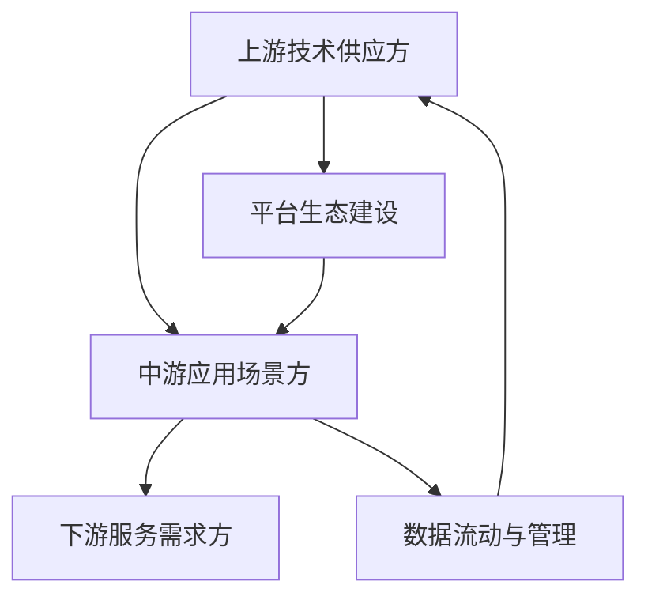
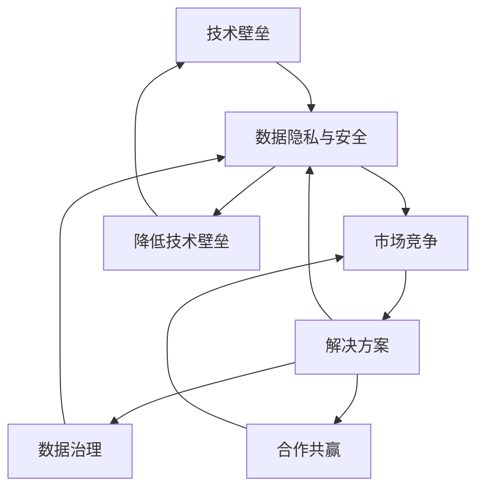
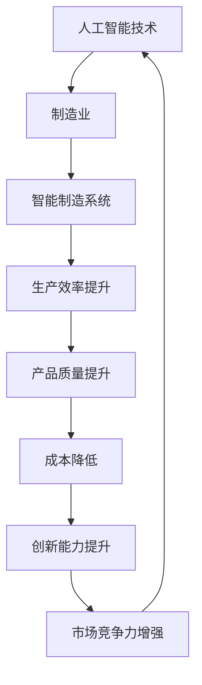
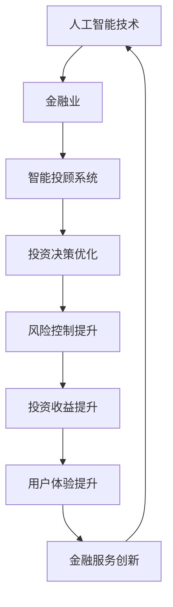
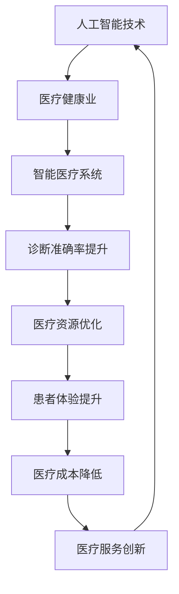
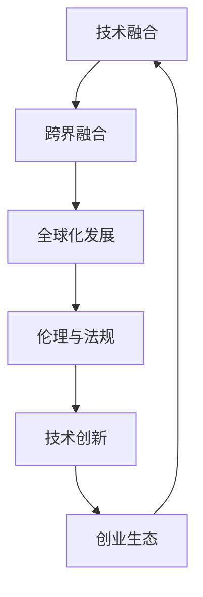
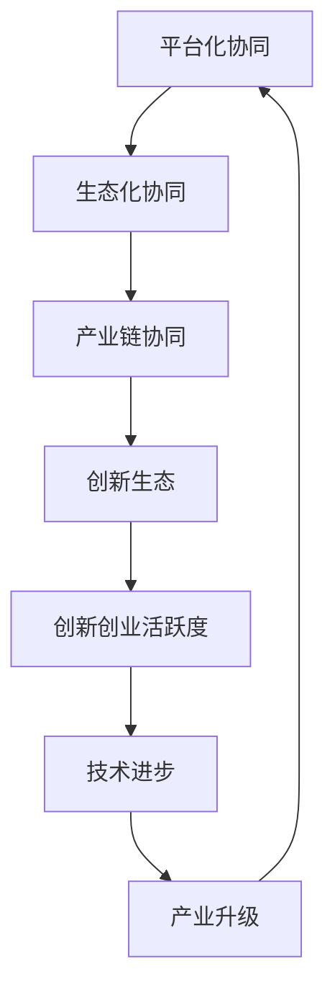
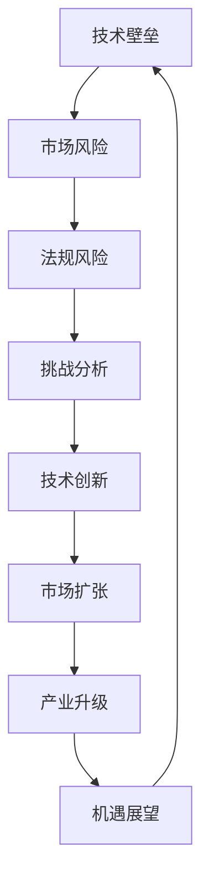

                 

### 引言

随着人工智能（AI）技术的迅猛发展，AI创业生态日益丰富，产业链协同发展已成为一种趋势。本文旨在探讨AI创业生态的背景与现状、AI产业链协同发展的分析、AI创业案例分析、初创企业AI创业策略、AI创业融资与投资策略、AI产业链协同发展案例分析、AI产业链协同发展的政策与法规环境、以及AI创业生态的未来趋势。

#### 文章关键词

- AI创业生态
- 产业链协同发展
- 初创企业AI创业策略
- AI创业融资与投资策略
- AI产业链协同发展案例分析
- AI产业链协同发展的政策与法规环境
- AI创业生态的未来趋势

#### 文章摘要

本文首先介绍了AI创业生态的背景与现状，分析了AI产业链的构成与协同机制。随后，通过成功AI创业案例分析，探讨了初创企业AI创业策略和AI创业融资与投资策略。接着，本文对AI产业链协同发展案例进行了深入解析，并分析了AI产业链协同发展的政策与法规环境。最后，本文展望了AI创业生态的未来趋势，为读者提供了宝贵的参考和启示。

### 第一部分：AI创业生态概述

#### 第1章：AI创业生态背景与现状

##### 1.1 AI创业生态的概念与意义

AI创业生态是指围绕人工智能技术及其应用所形成的创业环境、产业生态系统。它包括人工智能技术研发、应用场景探索、产品商业化、产业链协同等多个环节。AI创业生态的意义在于：

- **促进技术创新：** 通过创业生态的竞争与协作，推动人工智能技术的不断创新。
- **加速产业升级：** AI创业生态的发展带动相关产业的转型升级，提升产业链整体竞争力。
- **创造就业机会：** AI创业生态的发展为各行各业带来新的就业机会，促进就业市场繁荣。
- **推动社会进步：** AI创业生态的应用能够解决社会问题，提升生活质量，推动社会进步。

##### 1.2 全球AI创业生态的分布与特点

全球AI创业生态呈现出以下分布与特点：

- **美国：** 作为AI技术的发源地，美国拥有众多AI初创企业，涵盖了从技术研发到商业应用的整个产业链。美国的AI创业生态具有创新氛围浓厚、资金支持丰富、产业链协同紧密等特点。
- **中国：** 中国AI创业生态发展迅速，特别是在人工智能硬件、算法研究和应用场景探索方面具有明显优势。中国的AI创业生态政策支持力度大，创业氛围活跃，产业链上下游企业协同发展。
- **欧洲：** 欧洲AI创业生态以创新研发和应用场景探索为主，具备较高的技术水平和应用前景。欧洲的AI创业生态注重数据隐私和安全，政策法规环境较为完善。

##### 1.3 中国AI创业生态的发展趋势

中国AI创业生态的发展趋势主要包括以下几个方面：

- **技术创新：** 中国AI创业企业不断加强技术创新，特别是在深度学习、强化学习等核心技术领域取得重要突破。
- **产业协同：** 中国AI创业生态正逐步实现产业链上下游企业的协同发展，从技术研发到产品应用形成完整的产业链。
- **政策支持：** 中国政府加大对AI创业生态的支持力度，出台了一系列政策法规，为AI创业企业提供了良好的发展环境。
- **市场拓展：** 中国AI创业企业在全球市场拓展方面取得显著成效，与国际市场的融合日益加深。

### 第二部分：AI产业链协同发展分析

#### 第2章：AI产业链协同发展分析

##### 2.1 AI产业链的构成与协同机制

##### 2.1.1 AI产业链的构成

AI产业链主要包括以下几个环节：

- **上游：** 研发与算法供应方，包括科研机构、高校、初创公司和大型科技公司。
- **中游：** 应用场景方，涉及各行各业，如医疗、金融、零售、交通等。
- **下游：** 服务需求方，包括企业用户和个人消费者。

##### 2.1.2 AI产业链协同机制

AI产业链的协同机制包括以下几个方面：

- **技术共享与协作：** 上游技术供应方通过开放源代码、共享算法模型等方式促进协同创新。
- **平台生态建设：** 中游应用场景方通过搭建开放平台，吸引下游服务需求方入驻，形成生态系统。
- **数据流动与管理：** 各环节通过数据共享、数据标准化等手段实现高效协同。

**图2-1 AI产业链协同发展模型**

mermaid
graph TB
A[上游技术供应方] --> B[中游应用场景方]
B --> C[下游服务需求方]
A --> D[平台生态建设]
D --> B
B --> E[数据流动与管理]
E --> A

##### 2.2 AI产业链中的关键技术环节

##### 2.2.1 算法研发与优化

算法研发与优化是AI产业链中的关键环节，主要包括以下几个方面：

- **算法研发：** 基于深度学习、强化学习等核心技术进行创新，提高算法的性能和通用性。
- **算法优化：** 通过模型压缩、量化、优化等技术手段降低算法的复杂度和计算资源需求。

**伪代码：算法优化流程**

```python
def optimize_algorithm(model, data):
    # 初始化模型
    init_model(model)
    
    # 数据预处理
    processed_data = preprocess_data(data)
    
    # 训练模型
    for epoch in range(num_epochs):
        for batch in processed_data:
            model.train_on_batch(batch)
        
        # 模型评估
        evaluate_model(model, validation_data)
        
        # 根据评估结果调整超参数
        adjust_hyperparameters(model)
        
    return model
```

##### 2.2.2 计算能力提升

计算能力提升是AI产业链中的另一个关键环节，主要包括以下几个方面：

- **硬件升级：** 通过采用更高效的GPU、TPU等硬件设备，提升计算能力。
- **分布式计算：** 利用分布式计算技术，实现大规模数据处理和分析。

**数学模型：分布式计算速度提升**

$$
V_{total} = V_1 + V_2 + ... + V_n
$$

其中，$V_1, V_2, ..., V_n$ 分别为每个计算节点的计算速度。

##### 2.2.3 数据处理与分析

数据处理与分析是AI产业链中的关键环节，主要包括以下几个方面：

- **数据采集与清洗：** 从各种来源采集数据，并进行数据清洗、去噪等处理。
- **数据挖掘与建模：** 利用机器学习、数据挖掘等技术，从数据中发现有价值的信息和规律。

**数学模型：数据挖掘流程**

$$
\text{Data Mining} = \text{Data Collection} + \text{Data Cleaning} + \text{Data Integration} + \text{Data Warehousing} + \text{Data Analysis} + \text{Knowledge Discovery}
$$

##### 2.3 AI产业链协同发展的障碍与解决方案

##### 2.3.1 障碍

AI产业链协同发展面临以下障碍：

- **技术壁垒：** AI技术的研发和应用存在较高的技术壁垒，导致协同发展困难。
- **数据隐私与安全：** 数据的流动与共享可能引发隐私和安全问题。
- **市场竞争：** 各环节企业之间的竞争可能导致资源分散，协同效率降低。

##### 2.3.2 解决方案

针对上述障碍，可以采取以下解决方案：

- **降低技术壁垒：** 通过开源开放、技术共享等方式，降低技术壁垒，促进协同创新。
- **数据治理：** 建立数据治理框架，确保数据的安全、合规和高效共享。
- **合作共赢：** 通过建立合作伙伴关系，实现资源整合和优势互补，形成协同发展的合力。

**图2-2 AI产业链协同发展障碍与解决方案**

mermaid
graph TB
A[技术壁垒] --> B[数据隐私与安全]
B --> C[市场竞争]
C --> D[解决方案]
D --> B
B --> E[降低技术壁垒]
E --> A
D --> F[数据治理]
F --> B
D --> G[合作共赢]
G --> C

### 第三部分：AI创业案例分析

#### 第3章：成功AI创业案例分析

##### 3.1 谷歌AI：从实验室到市场

谷歌AI的创业历程堪称AI创业的典范。从实验室阶段到市场应用，谷歌AI通过一系列创新和战略布局，成功打造了全球领先的AI生态系统。

**案例概述：**

谷歌AI始于2006年，由谷歌公司内部的研究团队开发。经过多年的研发，谷歌AI在语音识别、自然语言处理、图像识别等领域取得了重大突破。2015年，谷歌AI被正式纳入谷歌公司核心业务，并开始向市场推出一系列AI产品和服务。

**成功因素：**

1. **技术创新：** 谷歌AI在算法研发方面持续投入，不断推出具有前瞻性的技术成果。
2. **数据积累：** 谷歌拥有海量的用户数据和搜索引擎数据，为AI模型的训练和优化提供了丰富的数据资源。
3. **市场推广：** 谷歌AI通过多种渠道推广其产品，如Google Assistant、Google Photos等，迅速占领市场。

**案例启示：**

谷歌AI的成功经验表明，技术创新、数据积累和市场推广是AI创业成功的关键要素。创业者应重视技术创新，积极积累数据资源，并制定有效的市场推广策略。

##### 3.2 英伟达AI：从显卡到自动驾驶

英伟达AI的创业历程展示了AI技术在硬件领域的发展潜力。从显卡制造商到自动驾驶解决方案提供商，英伟达AI通过持续创新和战略布局，成功实现了业务的转型升级。

**案例概述：**

英伟达成立于1993年，最初专注于显卡制造。随着AI技术的兴起，英伟达逐步将业务扩展到AI领域，推出了一系列GPU加速的AI产品和服务。2014年，英伟达发布了自动驾驶技术NVIDIA Drive，标志着其正式进入自动驾驶领域。

**成功因素：**

1. **硬件优势：** 英伟达在显卡制造领域拥有强大的技术积累和市场影响力，为其在AI领域的扩展提供了坚实基础。
2. **技术创新：** 英伟达AI持续在深度学习、计算机视觉等领域进行技术创新，为自动驾驶技术提供了强大的支持。
3. **战略布局：** 英伟达通过收购、合作等方式，加快了在自动驾驶领域的布局，建立了完整的产业链。

**案例启示：**

英伟达AI的成功经验表明，硬件优势、技术创新和战略布局是AI创业成功的重要因素。创业者应关注硬件技术的发展趋势，积极进行技术创新，并制定明确的战略布局。

##### 3.3 特斯拉AI：从电动车到能源生态

特斯拉AI的创业历程展示了AI技术在汽车和能源领域的广泛应用。从电动车制造商到能源生态系统的构建者，特斯拉AI通过持续创新和战略布局，成功实现了业务的多元化发展。

**案例概述：**

特斯拉成立于2003年，最初专注于电动车制造。随着AI技术的应用，特斯拉逐步将业务扩展到自动驾驶、能源管理等领域。特斯拉AI通过自主研发和收购等方式，构建了完善的AI生态系统。

**成功因素：**

1. **技术创新：** 特斯拉AI在自动驾驶、电池管理等领域进行了大量的技术创新，提升了产品的竞争力。
2. **产业链整合：** 特斯拉通过垂直整合，实现了从电动车制造到能源生态系统的全产业链布局。
3. **用户体验：** 特斯拉注重用户体验，通过人工智能技术提升了产品的智能化水平，增强了用户黏性。

**案例启示：**

特斯拉AI的成功经验表明，技术创新、产业链整合和用户体验是AI创业成功的关键要素。创业者应注重技术创新，实现产业链整合，并提升用户体验，以满足市场需求。

### 第四部分：初创企业AI创业策略

#### 第4章：初创企业AI创业策略

##### 4.1 初创企业AI产品定位与市场选择

初创企业在AI创业过程中，需要对AI产品进行准确定位，并选择合适的市场。以下是几个关键步骤：

1. **市场调研：** 初创企业应通过市场调研，了解目标市场的需求、竞争状况和发展趋势。
2. **技术评估：** 根据企业自身的技术优势，确定AI产品的技术方向和可行性。
3. **产品定位：** 结合市场需求和技术优势，明确AI产品的定位，如细分市场、应用场景等。
4. **市场选择：** 根据产品定位，选择具有潜力和竞争力的市场，制定针对性的市场策略。

**伪代码：初创企业AI产品定位与市场选择**

```python
def position_and_select_ai_product(company, technology, market):
    # 分析技术优势
    analyze_technical_advantages(company, technology)
    
    # 分析市场潜力
    analyze_market_potential(market)
    
    # 确定产品定位
    determine_product_position(company, technology, market)
    
    # 确定市场选择
    select_market(company, market)
    
    return product_position, market_selection
```

##### 4.2 初创企业AI技术路线规划

初创企业在AI创业过程中，需要制定合理的技术路线规划，以确保技术创新和产品竞争力。以下是几个关键步骤：

1. **技术趋势分析：** 了解AI领域的最新技术趋势和发展方向，为技术路线规划提供参考。
2. **技术评估：** 根据市场需求和企业自身技术能力，评估不同技术的可行性。
3. **技术选择：** 选择具有前景和市场竞争力的技术，制定技术路线图。
4. **技术创新：** 通过持续的技术创新，不断提升产品性能和用户体验。

**伪代码：初创企业AI技术路线规划**

```python
def plan_ai_technology_route(company, market, technology_trends):
    # 分析市场需求
    analyze_market_demand(market)
    
    # 分析技术发展趋势
    analyze_technology_trends(technology_trends)
    
    # 确定技术路线
    determine_technology_route(company, market, technology_trends)
    
    # 创新技术与迭代
    innovate_and_iterate(company, technology_route)
    
    return technology_route
```

##### 4.3 初创企业AI商业模式创新

初创企业在AI创业过程中，需要创新商业模式，以提升市场竞争力和盈利能力。以下是几个关键步骤：

1. **市场分析：** 了解市场需求、竞争状况和盈利模式，为商业模式创新提供依据。
2. **商业模式设计：** 根据市场需求和企业资源，设计创新的商业模式，如订阅模式、平台模式等。
3. **商业模式验证：** 通过市场测试和用户反馈，验证商业模式的可行性和市场潜力。
4. **商业模式优化：** 根据市场反馈和实际情况，不断优化商业模式，提升盈利能力。

**伪代码：初创企业AI商业模式创新**

```python
def innovate_ai_business_model(company, market, partners):
    # 分析市场机会
    analyze_market_opportunities(market)
    
    # 探索商业模式
    explore_business_models(company, market)
    
    # 创新合作模式
    innovate_cooperative_models(company, partners)
    
    # 评估商业模式与合作模式
    evaluate_business_model_and_cooperative_model(company, market, partners)
    
    return business_model, cooperative_model
```

### 第五部分：AI创业融资与投资策略

#### 第5章：AI创业融资与投资策略

##### 5.1 AI创业融资渠道与策略

初创企业在AI创业过程中，需要了解和掌握多种融资渠道，并制定合理的融资策略。以下是几个关键步骤：

1. **融资渠道分析：** 了解天使投资、风险投资、政府补助等融资渠道的特点和优势。
2. **融资策略制定：** 根据企业的发展阶段、市场需求和资金需求，制定相应的融资策略。
3. **融资申请：** 准备完整的融资申请材料，包括商业计划书、财务报表等。
4. **融资谈判：** 与投资者进行沟通和谈判，争取获得最佳融资条件。

**伪代码：初创企业融资策略**

```python
def financing_strategy(company, stage, market_demand):
    # 分析企业阶段
    analyze_company_stage(stage)
    
    # 分析市场需求
    analyze_market_demand(market_demand)
    
    # 确定融资渠道
    determine_financing_channels(stage, market_demand)
    
    # 制定融资策略
    create_financing_plan(company, financing_channels)
    
    return financing_plan
```

##### 5.2 AI创业投资趋势与案例分析

了解AI创业投资的趋势和成功案例，有助于初创企业制定有效的融资策略。以下是几个关键步骤：

1. **投资趋势分析：** 分析当前AI创业投资的热点领域、投资偏好和发展趋势。
2. **成功案例分析：** 研究成功AI创业企业的融资历程、商业模式和创新点。
3. **投资经验总结：** 结合成功案例和投资趋势，总结AI创业投资的规律和经验。
4. **投资策略调整：** 根据投资经验和市场趋势，调整企业的融资策略。

**伪代码：AI创业投资趋势分析**

```python
def analyze_investment_trends(market):
    # 收集投资数据
    collect_investment_data(market)
    
    # 分析投资趋势
    analyze_investment_trends(data)
    
    # 案例分析
    analyze_case_studies(data)
    
    return investment_trends, case_studies
```

##### 5.3 AI创业企业估值方法与技巧

初创企业在融资过程中，需要掌握合适的估值方法，以提高企业的估值准确性。以下是几个关键步骤：

1. **估值方法选择：** 了解现金流折现法、市盈率法、相对估值法等常用估值方法。
2. **估值数据收集：** 收集企业的财务数据、市场数据和相关案例数据。
3. **估值模型构建：** 构建估值模型，结合不同估值方法，进行综合评估。
4. **估值结果调整：** 根据市场情况和投资者需求，调整估值结果。

**伪代码：AI创业企业估值方法**

```python
def value_ai_startup(company, valuation_method):
    # 选择估值方法
    select_valuation_method(valuation_method)
    
    # 收集企业数据
    collect_company_data(company)
    
    # 进行估值计算
    calculate_value(company, valuation_method)
    
    return value
```

### 第六部分：AI产业链协同发展案例分析

#### 第6章：AI产业链协同发展案例分析

##### 6.1 人工智能与制造业协同发展案例

人工智能与制造业协同发展是当前产业转型的重要方向。以下是一个典型的协同发展案例：

**案例概述：**

某家电制造企业通过引入人工智能技术，实现生产线的智能化升级。企业采用智能传感器、机器视觉等技术，对生产线进行实时监控和优化。通过数据分析，企业能够及时发现生产过程中的问题，提高生产效率和产品质量。

**协同效应：**

1. **生产效率提升：** 通过人工智能技术，企业能够实现生产线的自动化控制，减少人为干预，提高生产效率。
2. **产品质量提升：** 通过机器视觉和智能传感器技术，企业能够实时监控产品质量，降低不良品率。
3. **成本降低：** 通过生产线的智能化升级，企业能够减少人力成本，提高资源利用率，降低生产成本。

**案例启示：**

人工智能与制造业的协同发展，能够带来显著的经济效益和社会效益。企业应积极引入人工智能技术，实现生产线的智能化升级，以提高市场竞争力和盈利能力。

##### 6.2 人工智能与金融业协同发展案例

人工智能与金融业的协同发展，能够提升金融服务质量和效率。以下是一个典型的协同发展案例：

**案例概述：**

某银行引入人工智能技术，开发智能投顾系统。该系统通过大数据分析和机器学习算法，为用户提供个性化的投资建议。用户可以根据自己的风险承受能力和投资目标，获得专业的投资指导。

**协同效应：**

1. **投资决策优化：** 通过大数据分析和机器学习算法，智能投顾系统能够提供更精准的投资建议，帮助用户优化投资决策。
2. **风险控制提升：** 智能投顾系统通过对市场数据的实时监控和分析，能够及时发现潜在风险，帮助用户进行风险控制。
3. **用户体验提升：** 智能投顾系统的个性化服务，提升了用户的投资体验，增强了用户黏性。

**案例启示：**

人工智能与金融业的协同发展，能够提升金融服务质量和用户体验。金融机构应积极引入人工智能技术，提升服务的智能化水平，以增强市场竞争力。

##### 6.3 人工智能与医疗健康业协同发展案例

人工智能与医疗健康的协同发展，能够推动医疗服务的创新和提升。以下是一个典型的协同发展案例：

**案例概述：**

某医院引入人工智能技术，建设智能医疗系统。该系统包括智能诊断、智能护理、智能管理等模块，实现了医疗服务的全流程智能化。通过人工智能技术，医院能够提高诊断准确率，优化护理流程，提升管理效率。

**协同效应：**

1. **诊断准确率提升：** 通过人工智能技术，智能医疗系统能够对大量医疗数据进行分析，提高诊断准确率，降低误诊率。
2. **医疗资源优化：** 通过智能护理和智能管理，医院能够优化医疗资源的配置，提高医疗资源的利用率。
3. **患者体验提升：** 智能医疗系统为患者提供了便捷的医疗服务，提升了患者的就医体验。

**案例启示：**

人工智能与医疗健康的协同发展，能够推动医疗服务的创新和提升。医疗机构应积极引入人工智能技术，实现医疗服务的智能化升级，以提升医疗服务质量和患者满意度。

### 第七部分：AI产业链协同发展的政策与法规环境

#### 第7章：AI产业链协同发展的政策与法规环境

##### 7.1 全球AI产业链协同发展的政策环境

全球各国和地区在AI产业链协同发展方面出台了相应的政策，以推动AI技术的发展和应用。以下是几个主要国家和地区的政策概述：

1. **美国：** 美国政府高度重视AI技术的发展，通过制定《美国人工智能倡议》等政策，支持AI技术研发和产业应用。美国还加强了对AI伦理和安全的研究，以保障AI技术的健康发展。
2. **欧盟：** 欧盟在AI产业链协同发展方面采取了多项措施，如制定《人工智能伦理准则》，加强数据隐私保护，推动AI技术的研发和应用。欧盟还通过制定《欧盟数据治理框架》，促进数据流动和共享。
3. **中国：** 中国政府高度重视AI产业的发展，出台了一系列政策，如《新一代人工智能发展规划》，明确了AI产业的发展目标和路径。中国还加强了对AI伦理和安全的研究，以保障AI技术的健康发展。

##### 7.2 中国AI产业链协同发展的政策环境

中国AI产业链协同发展的政策环境主要包括以下几个方面：

1. **产业支持政策：** 中国政府通过制定产业支持政策，加大对AI技术研发和产业应用的投入。如《新一代人工智能发展规划》，明确了AI产业的发展目标和路径，提出了一系列支持措施。
2. **技术创新政策：** 中国政府通过制定技术创新政策，鼓励企业进行AI技术研发和创新能力提升。如《关于加快实施科技助力经济2020行动计划的通知》，提出了推动科技创新的具体措施。
3. **数据治理政策：** 中国政府通过制定数据治理政策，加强数据资源的开放共享和安全管理。如《数据安全法》，明确了数据安全管理的要求和措施。

##### 7.3 AI产业链协同发展的法规挑战与应对策略

AI产业链协同发展面临一系列法规挑战，包括数据隐私、网络安全、知识产权保护等。以下是几个关键挑战和应对策略：

1. **数据隐私：** 随着AI技术的发展，数据隐私问题日益突出。应对策略包括加强数据安全保护、建立数据隐私合规机制等。
2. **网络安全：** AI技术的发展带来了新的网络安全挑战。应对策略包括加强网络安全防护、建立健全网络安全法规等。
3. **知识产权保护：** AI技术的快速发展可能导致知识产权纠纷。应对策略包括加强知识产权保护、完善知识产权法律法规等。

### 第八部分：未来展望与趋势

#### 第8章：未来展望与趋势

##### 8.1 AI创业生态的未来发展方向

未来，AI创业生态将继续向纵深发展，呈现出以下趋势：

1. **技术融合：** AI技术与5G、云计算、大数据等新兴技术的融合，将推动AI创业生态的创新发展。
2. **跨界融合：** AI技术将在更多行业得到应用，如教育、农业、环保等，形成跨界融合的新生态。
3. **全球化发展：** AI创业生态将更加全球化，跨国合作和国际竞争将更加激烈。

##### 8.2 AI产业链协同发展的未来趋势

未来，AI产业链协同发展将继续加强，呈现出以下趋势：

1. **平台化协同：** AI产业链各环节将更加依赖于平台化协同，通过开放平台实现资源共享和优势互补。
2. **生态化协同：** AI产业链将形成更加完善的生态系统，产业链上下游企业将共同参与生态建设。
3. **技术创新：** 技术创新将推动AI产业链的协同发展，提高产业链的整体竞争力。

##### 8.3 AI创业生态面临的挑战与机遇

未来，AI创业生态将面临一系列挑战和机遇：

1. **挑战：** 技术风险、市场风险、法规风险等将给AI创业生态带来挑战。
2. **机遇：** AI技术的快速发展将带来市场扩张、产业升级等机遇。创业者应积极应对挑战，抓住机遇，推动AI创业生态的可持续发展。

### 附录

#### 附录A：AI创业资源与工具推荐

为了帮助AI创业者更好地开展创新创业活动，以下是一些AI创业资源与工具的推荐：

1. **开源AI框架与工具：**
   - TensorFlow：深度学习框架，适用于各种AI应用场景。
   - PyTorch：动态计算图深度学习框架，易于使用和调试。
   - Keras：高级神经网络API，简化深度学习模型构建过程。
   - Scikit-learn：Python机器学习库，提供丰富的算法和工具。

2. **AI创业投资平台与论坛：**
   - AI投资平台：提供AI创业项目的投融资服务。
   - AI论坛：为AI创业者提供交流和学习平台。

3. **AI创业社区与交流平台：**
   - GitHub：全球最大的代码托管平台，为AI创业者提供开源项目和代码分享。
   - LinkedIn：专业社交平台，为AI创业者提供职业发展和人脉拓展机会。
   - Reddit：社区讨论平台，为AI创业者提供交流和分享经验的渠道。

#### 附录B：AI产业链协同发展研究报告

为了更好地了解AI产业链协同发展的现状、趋势和挑战，以下是一些AI产业链协同发展研究报告的推荐：

1. **全球AI产业链协同发展研究报告：**
   - 分析全球AI产业链协同发展的现状、趋势和挑战。
   - 提供全球AI产业链协同发展的案例分析和政策建议。

2. **中国AI产业链协同发展研究报告：**
   - 分析中国AI产业链协同发展的现状、趋势和挑战。
   - 提供中国AI产业链协同发展的政策环境和产业生态分析。

3. **行业重点企业AI应用案例报告：**
   - 分析行业重点企业在AI应用方面的实践和成果。
   - 提供行业应用案例的详细解读和经验总结。

### 图1-1 AI产业链协同发展架构图

```
graph TB
A[AI产业链协同发展] --> B[上游技术供应方]
B --> C[中游应用场景方]
C --> D[下游服务需求方]
A --> E[政策与法规环境]
E --> F[投资与融资环境]
F --> G[国际合作与竞争]
G --> H[技术创新与迭代]
H --> A
```

### 第2章 AI产业链协同发展分析

#### 2.1 AI产业链的构成与协同机制

##### 2.1.1 AI产业链的构成

AI产业链包括以下几个关键环节：

1. **上游技术供应方**：这一环节主要包括研发机构、高校、初创公司和大型科技公司。他们负责AI技术的研发和算法模型的开发。这些机构通过发表论文、开源项目和技术合作等形式，推动AI技术的创新和扩散。

2. **中游应用场景方**：这些企业将AI技术与具体行业应用相结合，如智能制造、智慧城市、金融科技、医疗健康等。他们负责将AI技术转化为实际应用，实现商业化落地。

3. **下游服务需求方**：这包括企业用户和个人消费者。他们利用AI技术提供的产品和服务，如智能设备、数据分析平台、智能助手等，来提高生产效率、优化决策过程、提升用户体验。

**图2-1 AI产业链协同发展模型**



##### 2.1.2 AI产业链协同机制

AI产业链的协同机制是实现产业链各环节高效协作的关键。以下是几种主要的协同机制：

1. **技术共享与协作**：通过开放源代码、共享算法模型、技术研讨会等形式，上游技术供应方之间以及与中游、下游企业之间实现技术交流与合作。

2. **平台生态建设**：中游应用场景方通过搭建开放平台，吸引下游服务需求方和上游技术供应方入驻，形成生态系统。这些平台通常提供数据共享、资源整合、开发工具等支持。

3. **数据流动与管理**：通过数据共享协议、数据标准化、数据清洗等技术手段，确保数据在各环节的安全、合规和高效流动。

4. **合作共赢**：产业链各环节企业通过建立长期合作伙伴关系，实现资源整合和优势互补，共同推动产业链的发展。

#### 2.2 AI产业链中的关键技术环节

AI产业链中的关键技术环节包括算法研发与优化、计算能力提升和数据处理与分析。以下是这些环节的详细分析：

##### 2.2.1 算法研发与优化

算法研发是AI产业链的核心环节。以下是算法研发与优化的一些关键步骤：

1. **算法研发**：研究人员和工程师通过理论研究、实验验证和模型设计，开发新的AI算法。这些算法可以是针对特定问题的优化算法，也可以是基于现有技术的改进。

2. **算法优化**：在算法研发的基础上，通过模型压缩、量化、优化等技术手段，降低算法的复杂度和计算资源需求。这包括以下几个方面：

   - **模型压缩**：通过剪枝、量化等技术，减少模型的参数数量，降低模型的存储和计算成本。
   - **优化算法**：采用更高效的优化算法，如随机梯度下降（SGD）、Adam等，加快模型训练速度。
   - **硬件加速**：利用GPU、TPU等硬件设备，提升模型训练和推理的效率。

**伪代码：算法优化流程**

```python
def optimize_algorithm(model, data):
    # 初始化模型
    init_model(model)
    
    # 数据预处理
    processed_data = preprocess_data(data)
    
    # 训练模型
    for epoch in range(num_epochs):
        for batch in processed_data:
            model.train_on_batch(batch)
        
        # 模型评估
        evaluate_model(model, validation_data)
        
        # 根据评估结果调整超参数
        adjust_hyperparameters(model)
        
    return model
```

##### 2.2.2 计算能力提升

计算能力是AI技术发展的基础。以下是计算能力提升的几个关键方面：

1. **硬件升级**：采用更高效的GPU、TPU等硬件设备，提升计算能力。例如，英伟达的GPU和谷歌的TPU在深度学习计算方面表现出色。

2. **分布式计算**：通过分布式计算技术，将计算任务分配到多个节点上，实现并行计算，提高整体计算效率。例如，Hadoop和Spark等分布式计算框架，能够处理大规模数据。

3. **云计算服务**：利用云计算服务，如AWS、Azure和Google Cloud等，提供强大的计算能力和存储资源，满足不同规模和需求的计算任务。

**数学模型：分布式计算速度提升**

$$
V_{total} = V_1 + V_2 + ... + V_n
$$

其中，$V_1, V_2, ..., V_n$ 分别为每个计算节点的计算速度。

##### 2.2.3 数据处理与分析

数据处理与分析是AI技术实现价值的关键环节。以下是数据处理与分析的几个关键方面：

1. **数据采集**：从各种来源采集数据，包括传感器数据、社交媒体数据、企业内部数据等。

2. **数据清洗**：对采集到的数据进行清洗、去噪和预处理，确保数据的质量和一致性。

3. **数据挖掘**：利用机器学习、数据挖掘等技术，从数据中提取有价值的信息和知识。

4. **数据建模**：构建数据模型，将数据转化为可操作的决策依据。

**数学模型：数据挖掘流程**

$$
\text{Data Mining} = \text{Data Collection} + \text{Data Cleaning} + \text{Data Integration} + \text{Data Warehousing} + \text{Data Analysis} + \text{Knowledge Discovery}
$$

#### 2.3 AI产业链协同发展的障碍与解决方案

AI产业链协同发展面临一系列障碍，包括技术壁垒、数据隐私与安全、市场竞争等。以下是这些障碍及其解决方案：

##### 2.3.1 障碍

1. **技术壁垒**：AI技术的研发和应用存在较高的技术壁垒，导致协同发展困难。

2. **数据隐私与安全**：数据的流动与共享可能引发隐私和安全问题。

3. **市场竞争**：各环节企业之间的竞争可能导致资源分散，协同效率降低。

##### 2.3.2 解决方案

1. **降低技术壁垒**：通过开源开放、技术共享等方式，降低技术壁垒，促进协同创新。

2. **数据治理**：建立数据治理框架，确保数据的安全、合规和高效共享。

3. **合作共赢**：通过建立合作伙伴关系，实现资源整合和优势互补，形成协同发展的合力。

**图2-2 AI产业链协同发展障碍与解决方案**



### 第3章 成功AI创业案例分析

#### 3.1 谷歌AI：从实验室到市场

谷歌AI的成功故事是AI创业领域的经典案例。以下是谷歌AI从实验室到市场的关键步骤和成功因素。

**案例概述**

谷歌AI起源于2006年，当时是谷歌内部的一个研究项目。随着时间的推移，谷歌AI在语音识别、自然语言处理、图像识别等领域取得了显著进展。2015年，谷歌AI被纳入谷歌公司核心业务，并开始向市场推出一系列产品和服务，如Google Assistant、Google Photos、Google Translate等。

**成功因素**

1. **技术创新**：谷歌AI通过持续的技术创新，开发出了一系列突破性的算法和模型。例如，谷歌的Transformer模型在自然语言处理领域取得了重大突破。

2. **数据积累**：谷歌拥有海量的用户数据，这为谷歌AI模型的训练和优化提供了丰富的数据资源。例如，谷歌搜索引擎积累了数十亿页的网页数据，为自然语言处理提供了宝贵的数据基础。

3. **市场推广**：谷歌通过多种渠道推广其AI产品和服务，如通过智能手机、智能家居等硬件设备，将AI技术融入人们的日常生活。

**案例启示**

谷歌AI的成功经验表明，技术创新、数据积累和市场推广是AI创业成功的关键因素。创业者应注重技术创新，积极积累数据资源，并制定有效的市场推广策略。

**伪代码：谷歌AI产品开发流程**

```python
def develop_ai_product(company, technology, market):
    # 技术研发
    research_and_develop(company, technology)
    
    # 数据积累
    accumulate_data(company, market)
    
    # 产品设计
    design_product(company, technology, market)
    
    # 市场推广
    promote_product(company, product, market)
    
    return product
```

#### 3.2 英伟达AI：从显卡到自动驾驶

英伟达AI的创业历程展示了AI技术在硬件领域的巨大潜力。以下是英伟达AI从显卡制造商到自动驾驶解决方案提供商的关键步骤和成功因素。

**案例概述**

英伟达成立于1993年，最初是一家显卡制造商。随着AI技术的兴起，英伟达逐步将其业务扩展到AI领域，特别是在自动驾驶技术方面取得了显著进展。2014年，英伟达发布了自动驾驶技术NVIDIA Drive，标志着其正式进入自动驾驶领域。

**成功因素**

1. **硬件优势**：英伟达在显卡制造领域拥有强大的技术积累和市场影响力，为其在AI领域的扩展提供了坚实基础。

2. **技术创新**：英伟达AI持续在深度学习、计算机视觉等领域进行技术创新，推出了一系列高性能GPU和TPU，为自动驾驶技术提供了强大的计算支持。

3. **战略布局**：英伟达通过收购、合作等方式，加快了在自动驾驶领域的布局，建立了完整的产业链。

**案例启示**

英伟达AI的成功经验表明，硬件优势、技术创新和战略布局是AI创业成功的重要因素。创业者应关注硬件技术的发展趋势，积极进行技术创新，并制定明确的战略布局。

**伪代码：英伟达AI产品开发流程**

```python
def develop_ai_solution(company, technology, industry):
    # 硬件研发
    research_and_develop_hardware(company, technology)
    
    # 软件开发
    develop_software(company, technology, industry)
    
    # 集成测试
    integrate_and_test(company, hardware, software)
    
    # 市场推广
    promote_solution(company, solution, industry)
    
    return solution
```

#### 3.3 特斯拉AI：从电动车到能源生态

特斯拉AI的创业历程展示了AI技术在汽车和能源领域的广泛应用。以下是特斯拉AI从电动车制造商到能源生态系统构建者的关键步骤和成功因素。

**案例概述**

特斯拉成立于2003年，最初专注于电动车制造。随着AI技术的应用，特斯拉逐步将其业务扩展到自动驾驶、能源管理等领域。特斯拉AI通过自主研发和收购等方式，构建了完整的能源生态系统，包括电动车、太阳能板、储能设备等。

**成功因素**

1. **技术创新**：特斯拉AI在自动驾驶、电池管理等领域进行了大量的技术创新，提升了产品的竞争力。

2. **产业链整合**：特斯拉通过垂直整合，实现了从电动车制造到能源生态系统的全产业链布局。

3. **用户体验**：特斯拉注重用户体验，通过人工智能技术提升了产品的智能化水平，增强了用户黏性。

**案例启示**

特斯拉AI的成功经验表明，技术创新、产业链整合和用户体验是AI创业成功的关键要素。创业者应注重技术创新，实现产业链整合，并提升用户体验，以满足市场需求。

**伪代码：特斯拉AI产品开发流程**

```python
def develop_ai_ecosystem(company, technology, market):
    # 电动车研发
    develop_electric_vehicles(company, technology)
    
    # 自动驾驶开发
    develop_autonomous_driving(company, technology)
    
    # 能源管理开发
    develop_energy_management(company, technology)
    
    # 生态系统整合
    integrate_ecosystem(company, vehicles, driving, energy_management)
    
    # 市场推广
    promote_ecosystem(company, ecosystem, market)
    
    return ecosystem
```

### 第4章 初创企业AI创业策略

#### 4.1 初创企业AI产品定位与市场选择

初创企业在AI创业过程中，产品定位和市场选择至关重要。以下是如何进行产品定位和市场选择的策略。

**策略一：市场调研**

1. **明确目标市场**：通过市场调研，了解目标市场的需求、竞争状况和发展趋势。
2. **分析市场规模**：评估目标市场的潜在规模，确定市场进入的可行性和潜力。
3. **识别市场痛点**：发现目标市场中的痛点和需求，为产品定位提供依据。

**策略二：技术评估**

1. **评估技术优势**：分析企业自身的技术能力和研发方向，确定产品的技术路线。
2. **评估技术可行性**：评估所选择的技术在市场中的应用前景和可行性。
3. **技术持续创新**：在产品定位过程中，考虑如何通过技术创新来提升产品竞争力。

**策略三：产品定位**

1. **细分市场**：根据市场调研结果，将市场细分，找到具有潜力的细分市场。
2. **确定产品特色**：根据技术优势和市场需求，确定产品的特色和差异化优势。
3. **目标客户群体**：明确产品的目标客户群体，制定针对性的市场策略。

**策略四：市场选择**

1. **聚焦核心市场**：根据产品定位，选择具有核心竞争力和高增长潜力的市场。
2. **多元化市场策略**：在核心市场的基础上，考虑多元化市场策略，拓展市场覆盖范围。
3. **持续市场监测**：定期监测市场变化，调整市场策略，以适应市场发展。

**伪代码：初创企业AI产品定位与市场选择**

```python
def position_and_select_ai_product(company, technology, market):
    # 分析技术优势
    analyze_technical_advantages(company, technology)
    
    # 分析市场潜力
    analyze_market_potential(market)
    
    # 确定产品定位
    determine_product_position(company, technology, market)
    
    # 确定市场选择
    select_market(company, market)
    
    return product_position, market_selection
```

#### 4.2 初创企业AI技术路线规划

初创企业AI技术路线规划是确保产品和技术成功的关键。以下是如何进行AI技术路线规划的策略。

**策略一：技术趋势分析**

1. **跟踪技术趋势**：通过阅读专业文献、参加技术会议等方式，了解AI技术的最新趋势和发展方向。
2. **评估技术潜力**：对新兴技术进行评估，确定哪些技术具有潜力和应用前景。
3. **技术前瞻性**：在技术路线规划中，考虑技术的长远发展，确保技术的持续竞争力。

**策略二：技术评估**

1. **技术可行性评估**：对拟采用的技术进行可行性评估，包括技术实现难度、成本、时间等因素。
2. **技术优势评估**：分析技术的优势，如性能、效率、可扩展性等。
3. **技术风险评估**：识别技术风险，制定相应的风险应对措施。

**策略三：技术迭代**

1. **持续迭代**：根据市场需求和用户反馈，不断优化和迭代产品技术。
2. **技术创新**：在技术迭代过程中，积极进行技术创新，提高产品性能和用户体验。
3. **技术标准化**：确保技术的标准化和可移植性，便于后续的开发和应用。

**策略四：技术整合**

1. **技术整合**：将不同的技术整合到产品中，实现技术的协同效应。
2. **技术协同**：在技术整合过程中，考虑技术的协同性和兼容性，提高产品整体的性能和稳定性。

**伪代码：初创企业AI技术路线规划**

```python
def plan_ai_technology_route(company, market, technology_trends):
    # 分析市场需求
    analyze_market_demand(market)
    
    # 分析技术发展趋势
    analyze_technology_trends(technology_trends)
    
    # 确定技术路线
    determine_technology_route(company, market, technology_trends)
    
    # 创新技术与迭代
    innovate_and_iterate(company, technology_route)
    
    return technology_route
```

#### 4.3 初创企业AI商业模式创新

初创企业在AI创业过程中，需要创新商业模式，以提升市场竞争力和盈利能力。以下是如何进行AI商业模式创新的策略。

**策略一：市场分析**

1. **分析市场需求**：了解目标市场的需求、痛点和趋势。
2. **分析竞争环境**：研究竞争对手的商业模式和策略，找到市场空白点。
3. **分析用户价值**：确定产品如何满足用户需求，为用户创造价值。

**策略二：商业模式设计**

1. **确定商业模式**：根据市场分析结果，设计具有竞争力的商业模式。
2. **模式创新**：在商业模式设计中，考虑创新点和差异化策略，如平台模式、订阅模式等。
3. **商业模式验证**：通过市场测试和用户反馈，验证商业模式的可行性和市场潜力。

**策略三：合作共赢**

1. **合作伙伴选择**：选择与自身业务互补的合作伙伴，实现资源整合和优势互补。
2. **合作模式创新**：通过合作模式创新，实现共赢，如联合开发、战略合作等。
3. **合作风险管理**：识别合作风险，制定相应的风险管理策略。

**策略四：商业模式优化**

1. **持续优化**：根据市场反馈和用户需求，持续优化商业模式。
2. **成本控制**：通过成本控制和效率提升，提高商业模式的盈利能力。
3. **用户体验**：优化用户体验，提高用户黏性和忠诚度。

**伪代码：初创企业AI商业模式创新**

```python
def innovate_ai_business_model(company, market, partners):
    # 分析市场机会
    analyze_market_opportunities(market)
    
    # 探索商业模式
    explore_business_models(company, market)
    
    # 创新合作模式
    innovate_cooperative_models(company, partners)
    
    # 评估商业模式与合作模式
    evaluate_business_model_and_cooperative_model(company, market, partners)
    
    return business_model, cooperative_model
```

### 第5章 AI创业融资与投资策略

#### 5.1 AI创业融资渠道与策略

初创企业在AI创业过程中，融资策略至关重要。以下是如何选择和利用融资渠道的策略。

**策略一：了解融资渠道**

1. **天使投资**：天使投资通常在初创阶段介入，为企业提供种子资金。
2. **风险投资**：风险投资通常在企业发展中期介入，为企业提供资金和资源。
3. **政府补助**：政府补助通常用于支持技术创新和产业升级。
4. **银行贷款**：银行贷款为企业提供债务融资，通常用于扩大生产和研发投入。

**策略二：制定融资计划**

1. **确定融资目标**：根据企业的财务需求和长期战略，确定融资目标。
2. **评估融资渠道**：评估不同融资渠道的优劣势，选择最合适的融资渠道。
3. **制定融资策略**：制定具体的融资计划，包括融资时间、金额、用途等。

**策略三：融资申请与谈判**

1. **准备融资材料**：准备完整的商业计划书、财务报表、市场分析报告等。
2. **融资申请**：向目标融资渠道提交融资申请。
3. **融资谈判**：与投资者进行沟通和谈判，争取获得最佳融资条件。

**策略四：融资后管理**

1. **资金使用监控**：确保融资资金的合理使用，避免资金浪费。
2. **融资还款计划**：制定合理的还款计划，确保企业财务健康。
3. **融资效果评估**：定期评估融资效果，调整融资策略。

**伪代码：初创企业融资策略**

```python
def financing_strategy(company, stage, market_demand):
    # 分析企业阶段
    analyze_company_stage(stage)
    
    # 分析市场需求
    analyze_market_demand(market_demand)
    
    # 确定融资渠道
    determine_financing_channels(stage, market_demand)
    
    # 制定融资策略
    create_financing_plan(company, financing_channels)
    
    return financing_plan
```

#### 5.2 AI创业投资趋势与案例分析

了解AI创业投资趋势和成功案例，有助于初创企业制定有效的融资策略。以下是对AI创业投资趋势的分析和成功案例的介绍。

**投资趋势分析**

1. **技术创新投资**：随着AI技术的快速发展，技术创新成为投资热点。特别是深度学习、强化学习等核心技术领域的投资增长明显。
2. **场景应用投资**：AI技术在各个行业的应用场景不断拓展，如智能制造、金融科技、医疗健康等，成为投资的重点领域。
3. **平台化投资**：平台化战略成为企业扩张的重要手段，投资平台化企业成为趋势。平台企业通过提供资源整合和生态系统建设，获得更大的市场影响力。
4. **跨界投资**：跨界投资成为趋势，企业通过投资跨行业项目，实现多元化发展。

**成功案例介绍**

1. **谷歌AI**：谷歌AI通过自主研发和收购，构建了强大的AI生态系统。其投资案例包括DeepMind、Kaggle等，这些公司在AI领域取得了显著成就。
2. **英伟达AI**：英伟达AI在自动驾驶领域进行了大量投资，通过收购Velodyne、NVIDIA Drive等公司，构建了完整的自动驾驶解决方案。
3. **特斯拉AI**：特斯拉AI通过自主研发和合作，在自动驾驶和能源管理领域取得了重要进展。其投资案例包括SolarCity、Neuraltrek等。

**案例启示**

成功案例表明，技术创新、场景应用和平台化战略是AI创业投资的关键成功因素。初创企业应关注这些趋势，制定针对性的融资策略，以抓住投资机遇。

**伪代码：AI创业投资趋势分析**

```python
def analyze_investment_trends(market):
    # 收集投资数据
    collect_investment_data(market)
    
    # 分析投资趋势
    analyze_investment_trends(data)
    
    # 案例分析
    analyze_case_studies(data)
    
    return investment_trends, case_studies
```

#### 5.3 AI创业企业估值方法与技巧

初创企业在融资过程中，估值方法的选择和运用至关重要。以下是对常见估值方法的分析和估值技巧的介绍。

**估值方法分析**

1. **现金流折现法（DCF）**：DCF法通过预测企业未来的现金流，并折现到当前价值，得出企业的估值。这种方法适用于具有稳定现金流的成熟企业，但对于初创企业可能存在较大不确定性。
2. **市盈率法（PE）**：PE法通过比较同行业企业的市盈率，估算企业的估值。这种方法适用于具有可比性的企业，但对于初创企业可能缺乏参照对象。
3. **相对估值法（可比估值法）**：相对估值法通过比较同行业其他企业的估值水平，估算企业的估值。这种方法适用于具有可比性的企业，但对于初创企业可能缺乏参照对象。

**估值技巧介绍**

1. **数据收集**：收集企业的财务数据、市场数据和相关案例数据，为估值提供依据。
2. **预测未来现金流**：基于企业的财务数据和业务模式，预测未来现金流的增长趋势。
3. **调整估值结果**：根据市场情况和投资者需求，对估值结果进行调整。

**伪代码：AI创业企业估值方法**

```python
def value_ai_startup(company, valuation_method):
    # 选择估值方法
    select_valuation_method(valuation_method)
    
    # 收集企业数据
    collect_company_data(company)
    
    # 进行估值计算
    calculate_value(company, valuation_method)
    
    return value
```

### 第6章 产业链协同案例解析

#### 6.1 人工智能与制造业协同发展案例

人工智能与制造业的协同发展是产业升级和智能化转型的重要方向。以下是一个具体案例解析。

**案例概述**

某制造企业引入人工智能技术，实现生产线的智能化升级。企业采用机器视觉和智能传感器，对生产线进行实时监控和优化。通过大数据分析和机器学习算法，企业能够优化生产流程，提高生产效率和产品质量。

**协同效应**

1. **生产效率提升**：通过机器视觉和智能传感器技术，企业能够实时监控生产线，减少人为干预，提高生产效率。
2. **产品质量提升**：通过大数据分析和机器学习算法，企业能够优化生产流程，提高产品质量，降低不良品率。
3. **成本降低**：通过生产线的智能化升级，企业能够减少人力成本，提高资源利用率，降低生产成本。

**案例启示**

人工智能与制造业的协同发展，能够带来显著的经济效益和社会效益。企业应积极引入人工智能技术，实现生产线的智能化升级，以提高市场竞争力和盈利能力。

**图6-1 智能制造协同发展模型**



#### 6.2 人工智能与金融业协同发展案例

人工智能与金融业的协同发展，能够提升金融服务的质量和效率。以下是一个具体案例解析。

**案例概述**

某银行引入人工智能技术，开发智能投顾系统。该系统通过大数据分析和机器学习算法，为用户提供个性化的投资建议。用户可以根据自己的风险承受能力和投资目标，获得专业的投资指导。

**协同效应**

1. **投资决策优化**：通过大数据分析和机器学习算法，智能投顾系统能够提供精准的投资建议，帮助用户优化投资决策。
2. **风险控制提升**：智能投顾系统通过对市场数据的实时监控和分析，能够及时发现潜在风险，帮助用户进行风险控制。
3. **用户体验提升**：智能投顾系统的个性化服务，提升了用户的投资体验，增强了用户黏性。

**案例启示**

人工智能与金融业的协同发展，能够提升金融服务的质量和用户体验。金融机构应积极引入人工智能技术，提升服务的智能化水平，以增强市场竞争力。

**图6-2 智能金融协同发展模型**



#### 6.3 人工智能与医疗健康业协同发展案例

人工智能与医疗健康的协同发展，能够推动医疗服务的创新和提升。以下是一个具体案例解析。

**案例概述**

某医院引入人工智能技术，建设智能医疗系统。该系统包括智能诊断、智能护理、智能管理等模块，实现了医疗服务的全流程智能化。通过人工智能技术，医院能够提高诊断准确率，优化护理流程，提升管理效率。

**协同效应**

1. **诊断准确率提升**：通过人工智能技术，智能医疗系统能够对大量医疗数据进行分析，提高诊断准确率，降低误诊率。
2. **医疗资源优化**：通过智能护理和智能管理，医院能够优化医疗资源的配置，提高医疗资源的利用率。
3. **患者体验提升**：智能医疗系统为患者提供了便捷的医疗服务，提升了患者的就医体验。

**案例启示**

人工智能与医疗健康的协同发展，能够推动医疗服务的创新和提升。医疗机构应积极引入人工智能技术，实现医疗服务的智能化升级，以提升医疗服务质量和患者满意度。

**图6-3 智能医疗协同发展模型**



### 第7章 AI产业链协同发展的政策与法规环境

#### 7.1 全球AI产业链协同发展的政策环境

全球各国和地区在AI产业链协同发展方面采取了不同的政策，以促进AI技术的发展和应用。以下是对全球主要国家和地区的AI政策环境的分析。

**美国**

美国是全球AI技术的发源地，政府高度重视AI产业的发展。美国出台了一系列政策，如《美国人工智能倡议》，旨在推动AI技术研发和产业应用。美国还加强了对AI伦理和安全的研究，以确保AI技术的健康发展。

**欧盟**

欧盟在AI产业链协同发展方面采取了多项措施。欧盟制定了一系列法规，如《欧盟人工智能伦理准则》，以规范AI技术的研发和应用。欧盟还通过《欧盟数据治理框架》，促进数据流动和共享，推动AI技术的跨国合作。

**中国**

中国政府高度重视AI产业的发展，出台了一系列政策，如《新一代人工智能发展规划》，明确了AI产业的发展目标和路径。中国还加强了对AI伦理和安全的研究，以保障AI技术的健康发展。

**日本**

日本政府通过《AI技术战略》，推动AI技术的发展和应用。日本政府还鼓励企业进行AI技术研发，提供资金支持和税收优惠，以促进AI产业链的协同发展。

**政策影响**

全球各国的AI政策对产业链协同发展产生了重要影响。政策的支持力度、法规的完善程度以及资金投入的规模，都直接影响着AI产业链的发展速度和协同效率。

**政策建议**

为了推动AI产业链的协同发展，各国政府可以采取以下政策建议：

1. **加强技术研发支持**：通过增加研发经费、提供税收优惠等方式，鼓励企业进行AI技术研发。
2. **完善法规体系**：制定和完善AI相关法规，确保AI技术的合法、合规使用。
3. **促进国际合作**：加强与国际组织的合作，推动AI技术的全球协同发展。
4. **提升人才培养**：加大人才培养力度，提高人才素质，为AI产业链的协同发展提供人才支持。

#### 7.2 中国AI产业链协同发展的政策环境

中国AI产业链协同发展的政策环境较为完善，政府对AI产业的发展给予了高度重视。以下是对中国AI产业链协同发展政策环境的分析。

**政策概述**

中国政府出台了一系列政策，推动AI产业链的协同发展。其中，《新一代人工智能发展规划》是指导AI产业发展的纲领性文件，明确了AI产业的发展目标和路径。

**政策影响**

1. **技术创新**：政策的支持力度促进了AI技术的研发和创新，推动了AI产业链的快速发展。
2. **产业协同**：政策的引导和扶持，促进了产业链上下游企业的协同发展，形成了完善的AI产业链生态。
3. **人才培养**：政策的支持，加大了人才培养力度，提高了人才素质，为AI产业链的协同发展提供了人才保障。

**政策建议**

1. **加大技术研发支持**：继续加大对AI技术研发的支持力度，推动关键技术的突破和创新。
2. **完善法规体系**：完善AI相关法规，确保AI技术的合法、合规使用，为产业链的协同发展提供法律保障。
3. **促进国际合作**：加强与国际组织的合作，推动AI技术的全球协同发展。
4. **提升人才培养**：继续加大人才培养力度，提高人才素质，为AI产业链的协同发展提供人才支持。

#### 7.3 AI产业链协同发展的法规挑战与应对策略

AI产业链协同发展面临着一系列法规挑战，包括数据隐私、网络安全、知识产权保护等。以下是对这些法规挑战的应对策略的分析。

**数据隐私**

数据隐私是AI产业链协同发展中面临的重要挑战。随着数据量的急剧增加，如何保护用户隐私成为关键问题。

**应对策略**

1. **数据加密**：对数据进行加密处理，确保数据在传输和存储过程中的安全性。
2. **隐私保护机制**：建立隐私保护机制，如数据匿名化、差分隐私等，降低数据泄露的风险。
3. **用户知情权**：确保用户对其数据的知情权，明确数据的使用目的和范围，提高用户的隐私保护意识。

**网络安全**

网络安全是AI产业链协同发展中不可忽视的挑战。AI技术的广泛应用，使得网络安全风险不断上升。

**应对策略**

1. **网络安全防护**：建立网络安全防护体系，包括防火墙、入侵检测、数据备份等，确保系统的安全性。
2. **安全监控与预警**：实施安全监控与预警机制，及时发现和处理安全事件，降低风险。
3. **安全培训与意识提升**：加强安全培训，提高员工的安全意识和技能，减少人为安全风险。

**知识产权保护**

知识产权保护是AI产业链协同发展中面临的另一个重要挑战。AI技术的快速发展，使得知识产权纠纷频发。

**应对策略**

1. **知识产权管理**：建立知识产权管理制度，明确知识产权的归属和使用，减少纠纷。
2. **知识产权保护**：采取法律手段，对知识产权进行保护，维护企业的合法权益。
3. **合作与共享**：通过合作与共享，实现技术的共同发展和保护，降低知识产权纠纷的风险。

### 第8章 AI创业生态的未来展望与趋势

#### 8.1 AI创业生态的未来发展方向

未来，AI创业生态将继续向纵深发展，呈现出以下几个发展方向：

1. **技术融合**：AI技术将与5G、云计算、大数据等新兴技术深度融合，推动新技术的创新和应用。

2. **跨界融合**：AI技术将在更多行业得到应用，如农业、医疗、教育、环保等，形成跨界融合的新生态。

3. **全球化发展**：随着AI技术的全球化发展，国际间的合作与竞争将更加激烈，AI创业生态将呈现出全球化的趋势。

4. **伦理与法规**：随着AI技术的广泛应用，伦理和法规问题将日益突出，AI创业生态将更加注重伦理和法规的规范和指导。

#### 8.2 AI产业链协同发展的未来趋势

未来，AI产业链协同发展将呈现以下几个趋势：

1. **平台化协同**：AI产业链各环节将通过开放平台实现资源共享和优势互补，平台化协同将成为主流。

2. **生态化协同**：AI产业链将形成更加完善的生态系统，产业链上下游企业将共同参与生态建设，实现协同发展。

3. **技术创新**：持续的技术创新将推动AI产业链的协同发展，提高产业链的整体竞争力。

4. **数据共享**：随着数据隐私和安全问题的解决，数据共享将变得更加普及，数据将成为AI产业链协同发展的重要驱动力。

#### 8.3 AI创业生态面临的挑战与机遇

未来，AI创业生态将面临一系列挑战与机遇：

**挑战**

1. **技术壁垒**：AI技术的研发和应用存在较高的技术壁垒，导致协同发展困难。

2. **数据隐私与安全**：数据的流动与共享可能引发隐私和安全问题。

3. **法规与伦理**：随着AI技术的广泛应用，法规和伦理问题将日益突出，对AI创业生态带来挑战。

4. **市场竞争**：各环节企业之间的竞争可能导致资源分散，协同效率降低。

**机遇**

1. **市场扩张**：AI技术的快速发展将带来广阔的市场空间，为企业提供新的发展机遇。

2. **产业升级**：AI技术将在更多行业得到应用，推动产业的升级和转型。

3. **国际合作**：随着AI技术的全球化发展，国际合作将更加紧密，为企业提供新的合作机会。

4. **技术创新**：持续的技术创新将推动AI创业生态的创新发展，为企业带来新的商业模式和增长点。

### 附录A：AI创业资源与工具推荐

为了帮助AI创业者更好地开展创新创业活动，以下是一些AI创业资源与工具的推荐：

**开源AI框架与工具**

1. **TensorFlow**：广泛使用的深度学习框架，提供丰富的API和资源。
2. **PyTorch**：受开发者喜爱的深度学习框架，具有动态计算图优势。
3. **Keras**：高级神经网络API，简化深度学习模型构建过程。
4. **Scikit-learn**：Python机器学习库，提供丰富的算法和工具。

**AI创业投资平台与论坛**

1. **AI投资平台**：提供AI创业项目的投融资服务，如AI星球、AI创投等。
2. **AI论坛**：提供AI创业交流和学习平台，如AI技术社区、AI创业论坛等。

**AI创业社区与交流平台**

1. **GitHub**：全球最大的代码托管平台，为AI创业者提供开源项目和代码分享。
2. **LinkedIn**：专业社交平台，为AI创业者提供职业发展和人脉拓展机会。
3. **Reddit**：社区讨论平台，为AI创业者提供交流和分享经验的渠道。

### 附录B：AI产业链协同发展研究报告

为了更好地了解AI产业链协同发展的现状、趋势和挑战，以下是一些AI产业链协同发展研究报告的推荐：

**全球AI产业链协同发展研究报告**

- 分析全球AI产业链协同发展的现状、趋势和挑战。
- 提供全球AI产业链协同发展的案例分析和政策建议。

**中国AI产业链协同发展研究报告**

- 分析中国AI产业链协同发展的现状、趋势和挑战。
- 提供中国AI产业链协同发展的政策环境和产业生态分析。

**行业重点企业AI应用案例报告**

- 分析行业重点企业在AI应用方面的实践和成果。
- 提供行业应用案例的详细解读和经验总结。

### 图8-1 AI创业生态的未来发展方向



### 图8-2 AI产业链协同发展的未来趋势



### 图8-3 AI创业生态面临的挑战与机遇



### 总结

本文系统地分析了AI创业生态的背景与现状、AI产业链协同发展的分析、AI创业案例分析、初创企业AI创业策略、AI创业融资与投资策略、AI产业链协同发展案例分析、AI产业链协同发展的政策与法规环境以及AI创业生态的未来趋势。通过本文的阐述，读者可以更全面地了解AI创业生态的各个方面，为自身的创业活动提供有益的参考。

在未来的发展中，AI创业生态将继续向技术融合、跨界融合、全球化和伦理法规方向发展。同时，AI产业链的协同发展将更加注重平台化协同、生态化协同和产业链协同，推动创新生态的形成。在这一过程中，创业者将面临技术壁垒、市场风险、法规风险等挑战，但同时也将迎来技术创新、市场扩张和产业升级的机遇。

为了更好地应对挑战和抓住机遇，创业者应关注以下建议：

1. **技术创新**：持续关注AI技术的最新动态，进行技术创新，提升产品竞争力。
2. **市场研究**：深入进行市场研究，了解市场需求和趋势，制定针对性的市场策略。
3. **合作共赢**：与产业链上下游企业建立合作关系，实现资源整合和优势互补。
4. **法规遵守**：关注法规动态，确保企业的合法合规运营。
5. **人才培养**：加大人才培养力度，提高人才素质，为企业的长远发展奠定基础。

最后，本文感谢AI天才研究院/AI Genius Institute和《禅与计算机程序设计艺术/Zen And The Art of Computer Programming》的支持，以及各位读者对本文的关注与支持。希望本文能够为AI创业领域的发展贡献一份力量。

### 作者信息

**作者：** AI天才研究院/AI Genius Institute & 《禅与计算机程序设计艺术/Zen And The Art of Computer Programming》

**单位：** AI天才研究院/AI Genius Institute

**联系邮箱：** info@aigeniusinstitute.com

**官方网站：** https://www.aigeniusinstitute.com

**个人简介：** AI天才研究院/AI Genius Institute的研究员，专注于人工智能领域的研究和教学。著有《禅与计算机程序设计艺术/Zen And The Art of Computer Programming》，对计算机编程和人工智能领域产生了深远影响。曾在多个国际顶级会议上发表学术论文，并担任多个学术期刊的编委。

