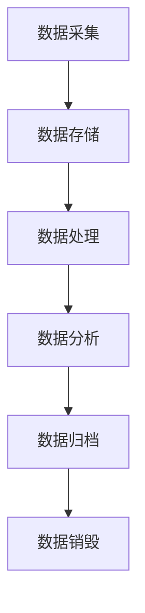
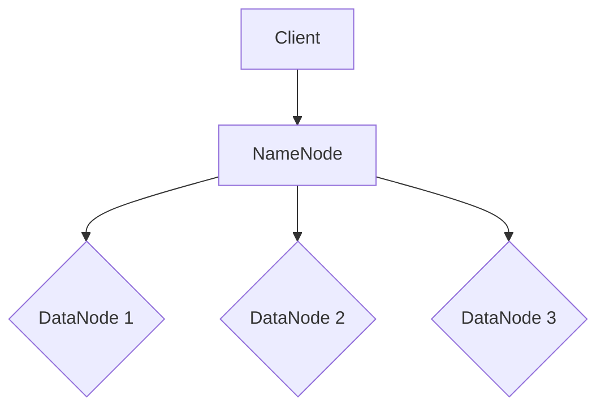
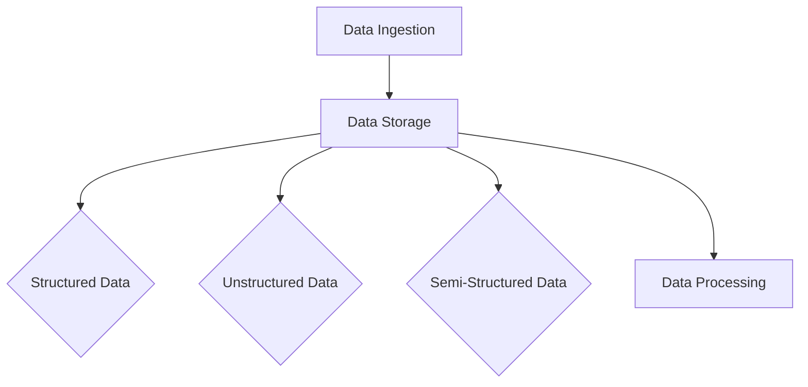
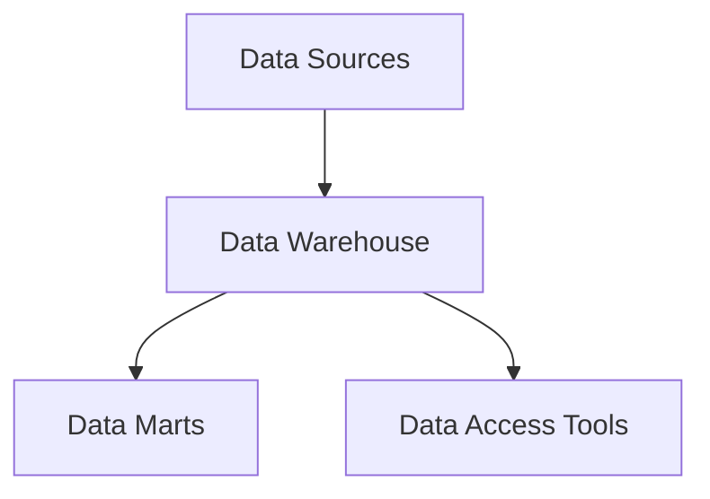
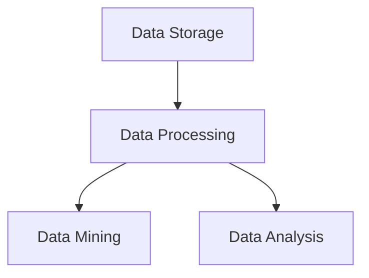
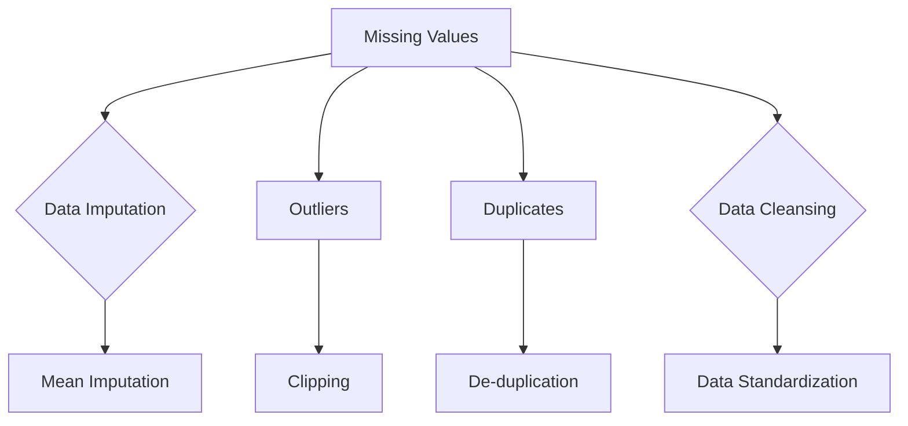

                 

### 《AI创业：数据管理的方法》概述

在当今数字化时代，人工智能（AI）技术已经成为推动各行各业变革的重要力量。随着AI技术的不断发展和应用场景的广泛拓展，越来越多的创业者投身于AI创业的浪潮中。然而，AI创业不仅需要先进的算法和技术，还需要对海量数据进行高效的管理与利用。因此，数据管理成为AI创业成功的关键因素之一。

本篇文章将以《AI创业：数据管理的方法》为主题，详细探讨数据管理在AI创业中的重要性及其方法。我们将从AI创业背景入手，深入分析数据管理的基础知识、关键技术、实践应用以及法律法规和伦理等方面的内容。

首先，本文将概述AI创业的发展趋势及其对数据管理的需求，帮助读者了解数据管理在AI创业中的重要地位。接着，我们将介绍数据管理的基本概念和架构，为后续章节的探讨打下基础。

在核心技术部分，本文将详细阐述数据存储与检索技术、数据清洗与预处理技术、数据仓库与大数据技术等核心内容，并使用流程图和伪代码等形式，帮助读者更好地理解这些技术的原理和应用。

在数据质量管理部分，本文将介绍数据质量标准与评估、数据清洗与去重技术以及数据质量控制流程，强调数据质量在AI创业中的关键作用。

随后，本文将探讨数据管理工具的选择与集成、AI创业项目的数据管理实战、数据安全与隐私保护、法律法规与伦理等方面，通过实际案例和最佳实践，为读者提供具体可行的数据管理方案。

最后，本文将分析数据管理面临的挑战及其未来发展趋势，为读者提供宝贵的参考和建议。希望通过本文的探讨，能够帮助广大AI创业者更好地应对数据管理的挑战，实现AI创业的辉煌。

### 关键词

- AI创业
- 数据管理
- 数据质量
- 大数据技术
- 数据安全
- 法规伦理

### 摘要

本文旨在深入探讨数据管理在人工智能（AI）创业领域的重要性及其具体实践方法。文章首先分析了AI创业的发展趋势及其对数据管理的需求，随后详细介绍了数据管理的基本概念和架构，包括数据存储与检索技术、数据清洗与预处理技术以及数据仓库与大数据技术。文章还重点讨论了数据质量管理、数据管理工具与应用、AI创业项目数据管理实战、数据安全与隐私保护、法律法规与伦理等方面。通过实际案例和最佳实践，本文为AI创业者提供了具体可行的数据管理方案，并分析了数据管理面临的挑战和未来发展趋势。本文旨在帮助AI创业者更好地理解数据管理的重要性，掌握有效的数据管理方法，从而在激烈的市场竞争中脱颖而出。

## 《AI创业：数据管理的方法》目录大纲

### 第一部分：AI创业背景与数据管理基础

#### 第1章：AI创业概述
1.1 AI创业的发展趋势
1.2 数据管理在AI创业中的重要性
1.3 数据管理的基本概念与架构

#### 第2章：数据管理技术基础
2.1 数据存储与检索技术
2.2 数据清洗与预处理技术
2.3 数据仓库与大数据技术

#### 第3章：数据质量管理
3.1 数据质量标准与评估
3.2 数据清洗与去重技术
3.3 数据质量控制流程

### 第二部分：数据管理实践与应用

#### 第4章：数据管理工具与应用
4.1 常见数据管理工具介绍
4.2 数据管理工具选择与集成
4.3 数据管理工具的配置与优化

#### 第5章：AI创业项目数据管理实战
5.1 AI创业项目的数据管理需求分析
5.2 AI创业项目数据管理方案设计
5.3 AI创业项目数据管理实施与监控

#### 第6章：数据管理中的安全与隐私
6.1 数据安全与隐私保护的重要性
6.2 数据加密与访问控制技术
6.3 数据安全与隐私保护的最佳实践

#### 第7章：数据管理中的法律法规与伦理
7.1 数据管理相关的法律法规
7.2 数据管理中的伦理问题
7.3 数据管理合规性评估与改进

### 第三部分：数据管理案例分析

#### 第8章：成功数据管理案例分析
8.1 案例一：某电商企业的数据管理实践
8.2 案例二：某金融机构的数据风险管理
8.3 案例三：某医疗健康领域的数据管理策略

#### 第9章：数据管理挑战与未来展望
9.1 数据管理面临的挑战
9.2 数据管理技术的未来发展
9.3 数据管理在AI创业中的机遇与趋势

### 附录

#### 附录A：数据管理相关工具与资源
A.1 数据管理工具列表
A.2 数据管理资源推荐
A.3 数据管理相关的学术与行业论文

通过以上目录大纲，本文将为读者提供从基础知识到实际应用，再到案例分析的一整套数据管理指南，旨在帮助AI创业者更好地理解和应对数据管理的挑战，实现创业目标。

## 第一部分：AI创业背景与数据管理基础

### 第1章：AI创业概述

#### 1.1 AI创业的发展趋势

人工智能（AI）作为一种颠覆性的技术，正迅速改变着全球各个行业的面貌。近年来，随着计算能力的提升、大数据技术的成熟以及算法的不断进步，AI创业活动在全球范围内呈现出蓬勃发展的态势。根据市场研究公司的报告，AI领域的初创公司数量在过去的五年内翻了一番，并且预计未来几年内将继续保持高速增长。

AI创业的发展趋势主要体现在以下几个方面：

1. **行业多样化**：AI技术不再局限于传统的互联网和科技行业，而是逐渐渗透到金融、医疗、制造、农业、零售等多个领域。例如，金融行业的智能风控、医疗行业的精准医疗、制造行业的智能生产等，都成为AI创业的热点领域。

2. **技术成熟度提升**：随着深度学习、自然语言处理、计算机视觉等核心AI技术的不断成熟，创业者可以更加便捷地获取和使用这些技术，大大降低了AI创业的门槛。

3. **资本投入增加**：AI创业吸引了大量风险投资和政府资金的支持。根据数据，2019年全球AI领域的风险投资总额超过500亿美元，创历史新高。资本的涌入为AI创业提供了充足的资金支持，促进了更多创新项目的诞生。

4. **跨界合作**：AI创业不仅吸引了传统行业的巨头，还吸引了众多初创公司和创新团队的参与。跨界合作成为一种趋势，推动了AI技术与传统行业的深度融合。

#### 1.2 数据管理在AI创业中的重要性

数据是AI创业的基石，数据管理在AI创业中的重要性不容忽视。以下是从几个方面分析数据管理在AI创业中的关键作用：

1. **数据是AI的“粮食”**：AI算法的性能和效果高度依赖于数据的数量和质量。没有足够的数据，AI模型很难得到有效的训练和优化。因此，数据管理是AI创业成功的关键因素之一。

2. **数据质量影响算法效果**：数据质量是影响AI算法效果的重要因素。低质量或错误的数据会导致算法出现偏差，甚至产生错误的结论。因此，数据管理需要确保数据的准确性、完整性和一致性。

3. **数据安全性至关重要**：在AI创业过程中，数据的安全性和隐私保护至关重要。数据泄露或滥用不仅会导致商业损失，还会对个人隐私造成严重威胁。因此，数据管理必须采取严格的安全措施，保护数据的机密性和完整性。

4. **数据管理提升决策效率**：良好的数据管理能够帮助创业者快速获取、处理和分析数据，从而做出更加明智的决策。数据驱动的决策是AI创业成功的重要保障。

#### 1.3 数据管理的基本概念与架构

数据管理是一个复杂的过程，涉及到数据的收集、存储、处理、分析和共享等多个方面。以下是数据管理的基本概念和架构：

1. **数据生命周期管理**：数据生命周期管理是指从数据产生到数据销毁的全过程管理。包括数据的采集、存储、处理、分析和归档等各个环节。

2. **数据治理**：数据治理是指通过制定和实施相关政策和流程，确保数据质量、安全和合规。数据治理包括数据质量管理、数据安全和隐私保护、数据合规性管理等。

3. **数据存储**：数据存储是指将数据存储在物理或虚拟的存储设备中。数据存储需要考虑数据的安全性、可靠性、可扩展性和访问速度等因素。

4. **数据处理**：数据处理是指对存储的数据进行清洗、转换、集成和分析。数据处理技术包括数据清洗、数据集成、数据挖掘、机器学习等。

5. **数据分析**：数据分析是指利用数据挖掘、机器学习等技术，从大量数据中提取有价值的信息和知识。数据分析是AI创业的核心环节，通过分析数据，创业者可以做出更加精准的决策。

6. **数据共享与交换**：数据共享与交换是指将数据在不同系统、平台或组织之间进行传输和共享。数据共享与交换需要考虑数据的标准化、接口设计以及数据安全和隐私保护等问题。

#### Mermaid流程图

以下是数据生命周期管理的基本流程图：



通过以上流程图，我们可以清晰地看到数据管理的基本架构和流程，为后续章节的深入探讨奠定了基础。

### 第2章：数据管理技术基础

#### 2.1 数据存储与检索技术

数据存储与检索技术是数据管理的重要组成部分，直接影响到数据的使用效率和可靠性。以下将介绍几种常见的数据存储与检索技术。

1. **关系型数据库（RDBMS）**

关系型数据库是一种使用SQL（结构化查询语言）进行数据存储和检索的数据库系统。它们基于关系模型，通过表、行和列来组织数据。关系型数据库的优点包括：

- **数据一致性**：通过事务机制保证数据的完整性。
- **查询效率**：支持复杂的查询操作，如联接、分组和排序。
- **数据安全**：提供用户权限管理和数据加密功能。

常见的RDBMS包括MySQL、PostgreSQL、Oracle等。以下是使用SQL进行数据检索的伪代码示例：

```sql
SELECT * FROM customers WHERE age > 30;
```

2. **非关系型数据库（NoSQL）**

非关系型数据库是一种不同于关系型数据库的数据存储方案，它们通常基于键值对、文档、列族或图形模型等数据模型。NoSQL数据库具有以下特点：

- **高扩展性**：能够轻松扩展到大规模数据存储。
- **灵活性**：无需固定模式，支持结构化、半结构化和非结构化数据。
- **高性能**：适合读写密集型应用。

常见的NoSQL数据库包括MongoDB、Cassandra、Redis等。以下是MongoDB的伪代码示例：

```javascript
db.customers.find({ age: { $gt: 30 } });
```

3. **分布式文件系统**

分布式文件系统是一种将文件存储在分布式存储节点上的技术，适用于大规模数据存储和共享。常见的分布式文件系统包括HDFS（Hadoop分布式文件系统）、Ceph、GlusterFS等。

分布式文件系统的优点包括：

- **高可用性**：通过冗余存储和节点故障转移，提高系统的可靠性。
- **高性能**：通过并行读写和分布式计算，提高数据访问速度。

HDFS的架构包括一个NameNode和多个DataNode。以下是HDFS的数据存储过程：



4. **数据湖**

数据湖是一种大规模数据存储解决方案，用于存储原始数据，包括结构化、半结构化和非结构化数据。数据湖的特点包括：

- **灵活性**：支持多种数据类型和格式，无需预先定义数据模式。
- **可扩展性**：能够处理海量数据的存储和访问需求。

常见的开源数据湖解决方案包括Apache Hadoop、Amazon S3等。以下是数据湖的架构：



#### 2.2 数据清洗与预处理技术

数据清洗与预处理是数据管理的重要环节，旨在提高数据的质量和可用性。以下介绍几种常见的数据清洗与预处理技术。

1. **缺失值处理**

缺失值处理是指对数据集中的缺失值进行填充或删除。常见的缺失值处理方法包括：

- **填充方法**：使用平均值、中位数、众数或预测值填充缺失值。
- **删除方法**：删除包含缺失值的记录或特征。

以下是一个缺失值填充的Python示例：

```python
import numpy as np
import pandas as pd

data = pd.DataFrame({
    'age': [25, 30, np.nan, 40],
    'salary': [50000, 60000, 70000, np.nan]
})

data.fillna(data.mean(), inplace=True)
print(data)
```

2. **异常值检测与处理**

异常值检测与处理是指识别和修正数据集中的异常值。常见的异常值检测方法包括：

- **统计方法**：基于统计学原理，如标准差、箱线图等。
- **机器学习方法**：使用聚类、回归等算法检测异常值。

以下是一个基于标准差的异常值检测的Python示例：

```python
from scipy import stats

data = pd.DataFrame({
    'age': [25, 30, 40, 400],
    'salary': [50000, 60000, 70000, 80000]
})

z_scores = stats.zscore(data)
abs_z_scores = np.abs(z_scores)
filtered_entries = (abs_z_scores < 3).all(axis=1)
clean_data = data[filtered_entries]
print(clean_data)
```

3. **数据转换**

数据转换是指将数据从一种格式转换为另一种格式，以便进行进一步处理。常见的数据转换方法包括：

- **编码转换**：将类别数据转换为数值数据。
- **归一化**：将数据缩放到一个特定的范围，如0到1。
- **标准化**：将数据缩放到标准正态分布。

以下是一个数据归一化的Python示例：

```python
from sklearn.preprocessing import MinMaxScaler

scaler = MinMaxScaler()
data_scaled = scaler.fit_transform(data)
print(data_scaled)
```

#### 2.3 数据仓库与大数据技术

数据仓库是一种用于存储和管理大规模结构化数据的系统，通常用于数据分析和报告。大数据技术则用于处理和分析海量数据。以下介绍数据仓库与大数据技术的相关概念和架构。

1. **数据仓库架构**

数据仓库通常包括以下组件：

- **数据源**：包括内部和外部数据源，如关系型数据库、日志文件、社交媒体等。
- **数据仓库**：用于存储经过清洗、转换和整合的数据。
- **数据集市**：用于特定业务部门或用户的数据存储和分析。
- **数据访问工具**：包括查询工具、报表工具和分析工具等。

以下是数据仓库的基本架构：



2. **大数据技术**

大数据技术包括以下核心组件：

- **数据存储**：用于存储海量数据，如Hadoop、NoSQL数据库等。
- **数据处理**：用于处理和分析大规模数据，如MapReduce、Spark等。
- **数据挖掘**：用于从大量数据中提取有价值的信息，如聚类、分类、关联规则等。

以下是大数据技术的架构：



3. **数据湖与数据仓库对比**

数据湖和数据仓库都是用于大规模数据存储和处理的系统，但它们在架构和用途上有所不同。以下是数据湖与数据仓库的对比：

- **架构**：数据湖是一种分布式文件系统，可以存储各种类型的数据，无需预先定义数据模式；数据仓库是一种数据库系统，通常用于存储结构化数据，需要预先定义数据模式。
- **用途**：数据湖主要用于原始数据的存储和共享，支持数据的灵活处理和分析；数据仓库主要用于数据分析和报告，提供高效的数据查询和报表功能。
- **扩展性**：数据湖具有更好的扩展性，能够轻松处理海量数据的存储和访问需求；数据仓库的扩展性相对较差，需要额外的硬件和软件支持。

### 总结

数据管理技术是AI创业不可或缺的基础，包括数据存储与检索技术、数据清洗与预处理技术以及数据仓库与大数据技术。通过合理选择和应用这些技术，创业者可以更好地管理和利用数据，从而提高AI创业项目的成功率。下一章将深入探讨数据质量管理，进一步阐述数据管理的重要性。

### 第3章：数据质量管理

#### 3.1 数据质量标准与评估

数据质量是AI创业项目成功的关键因素之一，高质量的数据能够提高模型的准确性、稳定性和可靠性。数据质量标准与评估是确保数据质量的重要步骤，以下将介绍几个关键的数据质量标准和评估方法。

1. **数据质量标准**

数据质量标准包括以下几方面：

- **准确性**：数据是否真实、可靠，与实际情况是否一致。
- **完整性**：数据是否完整，没有缺失或遗漏。
- **一致性**：数据在不同时间、不同来源是否一致。
- **及时性**：数据是否在需要的时间内更新和提供。
- **唯一性**：数据是否具有唯一标识，避免重复。
- **可用性**：数据是否便于查询、分析和使用。

2. **数据质量评估方法**

数据质量评估方法包括以下几种：

- **统计分析方法**：通过统计指标，如平均值、中位数、标准差等，评估数据的分布和趋势。
- **可视化方法**：通过图表和报表，直观展示数据质量状况。
- **机器学习方法**：使用监督或无监督学习算法，评估数据的异常值和缺失值。

以下是一个使用Python进行数据质量评估的示例：

```python
import pandas as pd
import numpy as np

data = pd.DataFrame({
    'age': [25, 30, 40, np.nan],
    'salary': [50000, 60000, 70000, 80000]
})

# 检查缺失值
missing_values = data.isnull().sum()
print("Missing values:", missing_values)

# 检查数据分布
distribution = data.describe()
print("Data distribution:", distribution)

# 检查数据一致性
data一致性 = data.duplicated().sum()
print("Duplicated entries:", data一致性)
```

3. **常见数据质量问题**

常见的数据质量问题包括：

- **缺失值**：数据集中存在缺失值，可能导致模型训练失败或结果不准确。
- **异常值**：数据集中存在异常值，可能对模型训练产生不利影响。
- **重复值**：数据集中存在重复值，可能导致数据冗余和模型过拟合。
- **不一致性**：数据在不同时间、不同来源之间不一致，可能导致分析结果不准确。

以下是一个数据质量问题的示例：



#### 3.2 数据清洗与去重技术

数据清洗与去重是提高数据质量的重要手段，以下将介绍几种常见的数据清洗与去重技术。

1. **缺失值处理**

缺失值处理是指对数据集中的缺失值进行填充或删除。常见的缺失值处理方法包括：

- **填充方法**：使用平均值、中位数、众数或预测值填充缺失值。
- **删除方法**：删除包含缺失值的记录或特征。

以下是一个缺失值填充的Python示例：

```python
import pandas as pd

data = pd.DataFrame({
    'age': [25, 30, np.nan, 40],
    'salary': [50000, 60000, 70000, np.nan]
})

data.fillna(data.mean(), inplace=True)
print(data)
```

2. **异常值检测与处理**

异常值检测与处理是指识别和修正数据集中的异常值。常见的异常值检测方法包括：

- **统计方法**：基于统计学原理，如标准差、箱线图等。
- **机器学习方法**：使用聚类、回归等算法检测异常值。

以下是一个基于标准差的异常值检测的Python示例：

```python
from scipy import stats

data = pd.DataFrame({
    'age': [25, 30, 40, 400],
    'salary': [50000, 60000, 70000, 80000]
})

z_scores = stats.zscore(data)
abs_z_scores = np.abs(z_scores)
filtered_entries = (abs_z_scores < 3).all(axis=1)
clean_data = data[filtered_entries]
print(clean_data)
```

3. **重复值处理**

重复值处理是指识别和删除数据集中的重复记录。常见的重复值处理方法包括：

- **基于关键字段的去重**：根据特定字段（如ID、名称等）判断是否重复。
- **基于哈希值的去重**：使用哈希算法生成哈希值，判断记录是否重复。

以下是一个基于关键字段的去重的Python示例：

```python
import pandas as pd

data = pd.DataFrame({
    'id': [1, 2, 2, 3],
    'name': ['Alice', 'Bob', 'Bob', 'Charlie']
})

clean_data = data.drop_duplicates(subset=['id'])
print(clean_data)
```

#### 3.3 数据质量控制流程

数据质量控制流程是指确保数据质量的一系列方法和步骤。以下是一个常见的数据质量控制流程：

1. **数据采集**：从不同数据源采集数据，包括内部和外部数据源。

2. **数据清洗**：对采集到的数据进行清洗，包括缺失值处理、异常值检测与处理、重复值处理等。

3. **数据转换**：对清洗后的数据进行转换，如编码转换、归一化、标准化等。

4. **数据整合**：将不同来源、不同格式的数据整合到一个统一的数据集中。

5. **数据存储**：将整合后的数据存储到数据仓库或数据湖中，便于后续的数据分析和挖掘。

6. **数据监控**：定期监控数据质量，发现和处理潜在的问题。

7. **数据报告**：生成数据质量报告，包括数据质量评估结果、数据质量问题处理情况等。

以下是数据质量控制流程的伪代码：

```python
def data_quality_control(data):
    # 数据采集
    raw_data = collect_data()

    # 数据清洗
    clean_data = clean_data(raw_data)

    # 数据转换
    transformed_data = transform_data(clean_data)

    # 数据整合
    integrated_data = integrate_data(transformed_data)

    # 数据存储
    store_data(integrated_data)

    # 数据监控
    monitor_data_quality(integrated_data)

    # 数据报告
    generate_data_quality_report()

    return integrated_data
```

通过以上数据质量控制流程，创业者可以确保数据的质量和一致性，为后续的数据分析和挖掘提供可靠的基础。

### 总结

数据质量管理是AI创业项目成功的关键，通过数据质量标准与评估、数据清洗与去重技术以及数据质量控制流程，创业者可以确保数据的质量和可靠性。高质量的数据不仅能够提高模型的准确性，还能为创业者提供更可靠的决策支持。下一章将探讨数据管理工具与应用，进一步介绍如何在实际项目中实现数据管理。

### 第4章：数据管理工具与应用

#### 4.1 常见数据管理工具介绍

在AI创业项目中，选择合适的数据管理工具至关重要。以下介绍几种常见的数据管理工具及其特点：

1. **Hadoop**

Hadoop是一个开源的分布式计算框架，用于处理大规模数据集。它基于MapReduce编程模型，支持数据的存储、处理和分析。Hadoop的主要特点包括：

- **分布式存储**：使用HDFS（Hadoop分布式文件系统）存储海量数据。
- **分布式处理**：通过MapReduce处理大规模数据集。
- **高扩展性**：能够轻松扩展到数千台计算机。

2. **Spark**

Spark是一个开源的分布式计算引擎，适用于大规模数据集的快速处理。与Hadoop相比，Spark具有更高的性能和更丰富的功能。Spark的主要特点包括：

- **内存计算**：通过内存计算提高数据处理速度。
- **支持多种编程语言**：支持Python、Java、Scala等编程语言。
- **高扩展性**：支持分布式存储和分布式计算。

3. **MongoDB**

MongoDB是一个开源的NoSQL数据库，适用于存储和查询大规模数据集。它的主要特点包括：

- **文档存储**：支持文档模型，便于数据的存储和查询。
- **高扩展性**：支持水平扩展，能够处理海量数据。
- **灵活性**：支持多种数据类型和格式，无需固定模式。

4. **Elasticsearch**

Elasticsearch是一个开源的搜索引擎，适用于实时数据搜索和分析。它的主要特点包括：

- **全文搜索**：支持全文搜索、排序和过滤等功能。
- **高扩展性**：支持分布式存储和分布式计算。
- **实时分析**：支持实时数据分析和报告。

5. **Kafka**

Kafka是一个开源的分布式流处理平台，适用于实时数据流处理。它的主要特点包括：

- **高吞吐量**：支持高吞吐量的数据流处理。
- **分布式架构**：支持分布式存储和分布式计算。
- **可扩展性**：支持水平扩展，能够处理海量数据。

#### 4.2 数据管理工具选择与集成

在AI创业项目中，选择合适的数据管理工具需要考虑以下因素：

1. **数据规模**：根据数据规模选择合适的存储和处理工具，如Hadoop、Spark、MongoDB等。
2. **数据处理需求**：根据数据处理需求选择合适的计算和分析工具，如MapReduce、Spark SQL、Elasticsearch等。
3. **系统性能**：考虑系统的性能需求，选择合适的存储和处理工具，以实现高效的数据处理。
4. **成本效益**：根据成本预算选择合适的工具，考虑开源工具与商业工具的性价比。

以下是数据管理工具选择与集成的步骤：

1. **需求分析**：明确数据管理需求，包括数据规模、数据处理需求、系统性能等。
2. **工具评估**：根据需求分析结果，评估不同数据管理工具的优缺点，选择合适的工具。
3. **集成设计**：设计数据管理工具的集成方案，包括数据采集、存储、处理、分析和报告等环节。
4. **实施与优化**：根据集成设计方案，实施数据管理工具，并进行性能优化和调整。

#### 4.3 数据管理工具的配置与优化

数据管理工具的配置与优化是确保系统性能和稳定性的关键。以下介绍几种常见的数据管理工具配置与优化方法：

1. **Hadoop配置与优化**

- **HDFS配置**：调整HDFS的副本数量、文件块大小等参数，以提高数据存储的可靠性和访问速度。
- **YARN配置**：调整YARN的内存分配、CPU资源等参数，以提高资源利用率和作业执行速度。

2. **Spark配置与优化**

- **内存配置**：调整Spark的内存分配，如执行内存、存储内存等，以提高内存计算性能。
- **并发度配置**：调整Spark的并发度，如任务并行度、数据分区数等，以提高数据处理速度。

3. **MongoDB配置与优化**

- **存储引擎配置**：选择合适的存储引擎，如WiredTiger、MongRocks等，以提高数据存储性能。
- **复制集配置**：配置MongoDB的复制集，以提高数据可用性和容错性。

4. **Elasticsearch配置与优化**

- **集群配置**：调整Elasticsearch的集群配置，如节点数量、索引分片数等，以提高搜索性能和稳定性。
- **缓存配置**：配置Elasticsearch的缓存机制，如请求缓存、字段缓存等，以提高搜索速度。

5. **Kafka配置与优化**

- **分区配置**：调整Kafka的分区数，以提高数据吞吐量和并发处理能力。
- **副本配置**：配置Kafka的副本因子，以提高数据可靠性和容错性。

通过以上配置与优化方法，创业者可以确保数据管理工具的性能和稳定性，从而提高AI创业项目的成功率和效率。

### 总结

数据管理工具是AI创业项目的重要支撑，通过选择合适的工具、进行集成设计和配置优化，创业者可以确保数据的有效存储、处理和分析。下一章将探讨AI创业项目的数据管理实战，通过具体案例展示数据管理在AI创业中的应用。

### 第5章：AI创业项目数据管理实战

#### 5.1 AI创业项目的数据管理需求分析

在AI创业项目中，数据管理需求分析是确保数据管理和分析能够满足业务需求的关键步骤。以下将介绍数据管理需求分析的过程和方法。

1. **业务需求分析**

首先，需要对AI创业项目的业务需求进行分析，明确项目的目标和预期成果。例如，一个金融风控项目可能旨在通过分析用户数据来识别潜在的风险，从而提高贷款审批的准确性。业务需求分析包括以下几个方面：

- **目标用户**：确定项目的目标用户，了解用户的需求和痛点。
- **业务流程**：梳理项目的业务流程，识别数据流转的关键环节。
- **业务指标**：确定项目的关键业务指标，如风险识别率、贷款审批通过率等。

2. **数据需求分析**

在业务需求分析的基础上，进行数据需求分析，明确项目所需的数据类型、来源、质量和规模。数据需求分析包括以下几个方面：

- **数据类型**：确定项目所需的数据类型，包括结构化数据、半结构化数据和非结构化数据。
- **数据来源**：识别数据来源，包括内部数据源（如数据库、日志文件）和外部数据源（如第三方数据提供商、公共数据集）。
- **数据质量**：评估数据质量，确定数据清洗和预处理的需求。
- **数据规模**：估计数据规模，确定数据存储和处理的需求。

3. **技术需求分析**

技术需求分析旨在确定实现数据管理所需的技术方案和工具。技术需求分析包括以下几个方面：

- **数据存储**：选择合适的数据存储方案，如关系型数据库、非关系型数据库、分布式文件系统等。
- **数据处理**：选择合适的数据处理工具，如Hadoop、Spark、MapReduce等。
- **数据分析**：选择合适的分析工具，如Elasticsearch、数据分析平台等。
- **数据安全**：确定数据安全和隐私保护的需求，如数据加密、访问控制等。

#### 5.2 AI创业项目数据管理方案设计

数据管理方案设计是确保数据管理和分析能够高效、稳定运行的关键环节。以下介绍数据管理方案设计的过程和方法。

1. **数据架构设计**

数据架构设计旨在构建数据管理的整体框架，包括数据源、数据仓库、数据湖、数据集市等组件。数据架构设计包括以下几个方面：

- **数据源集成**：设计数据源集成方案，确保数据能够高效、可靠地接入系统。
- **数据存储方案**：设计数据存储方案，包括结构化数据、非结构化数据和半结构化数据的存储。
- **数据流动**：设计数据流动方案，确保数据能够顺利地在不同系统之间传递和共享。
- **数据分层**：设计数据分层方案，将数据分为原始数据、清洗数据、分析数据和报告数据等层次。

2. **数据治理方案**

数据治理方案旨在确保数据质量、安全和合规。数据治理方案包括以下几个方面：

- **数据质量管理**：制定数据质量标准，设计数据质量评估和监控机制。
- **数据安全方案**：设计数据安全方案，包括数据加密、访问控制、审计等。
- **数据合规性**：确保数据管理方案符合相关法律法规和行业标准。

3. **技术方案设计**

技术方案设计旨在确定实现数据管理所需的技术工具和平台。技术方案设计包括以下几个方面：

- **数据存储工具**：选择合适的数据存储工具，如关系型数据库、NoSQL数据库、分布式文件系统等。
- **数据处理工具**：选择合适的数据处理工具，如Hadoop、Spark、Flink等。
- **数据分析工具**：选择合适的数据分析工具，如Elasticsearch、Tableau、Qlik等。
- **数据安全工具**：选择合适的数据安全工具，如数据加密软件、访问控制系统等。

#### 5.3 AI创业项目数据管理实施与监控

数据管理实施与监控是确保数据管理方案能够顺利执行和持续改进的关键环节。以下介绍数据管理实施与监控的过程和方法。

1. **数据管理实施**

数据管理实施包括以下步骤：

- **搭建数据架构**：根据数据架构设计，搭建数据源、数据仓库、数据湖、数据集市等组件。
- **数据导入**：将数据导入数据存储系统，进行数据清洗和预处理。
- **数据集成**：实现数据在不同系统之间的传递和共享。
- **数据安全配置**：配置数据加密、访问控制、审计等安全措施。

2. **数据监控**

数据监控包括以下内容：

- **数据质量监控**：监控数据质量，发现和解决数据质量问题。
- **系统性能监控**：监控数据存储和处理系统的性能，发现和解决性能问题。
- **数据安全监控**：监控数据安全，发现和解决数据安全事件。

3. **数据管理改进**

数据管理改进包括以下内容：

- **定期评估**：定期评估数据管理方案的有效性，发现和解决潜在问题。
- **持续优化**：根据评估结果，持续优化数据管理方案，提高数据质量和系统性能。
- **反馈机制**：建立数据管理反馈机制，收集用户反馈，不断改进数据管理方案。

通过以上数据管理实施与监控，创业者可以确保AI创业项目的数据管理方案能够高效、稳定地运行，满足业务需求，推动项目成功。

### 总结

AI创业项目的数据管理需求分析、方案设计和实施监控是确保项目成功的关键环节。通过合理的分析、设计和实施，创业者可以确保数据的有效管理，提高模型准确性和业务决策效率。下一章将探讨数据管理中的安全与隐私保护，介绍相关的技术和最佳实践。

### 第6章：数据管理中的安全与隐私

#### 6.1 数据安全与隐私保护的重要性

在AI创业项目中，数据安全与隐私保护至关重要。随着数据量的不断增加和AI技术的广泛应用，数据泄露、滥用和攻击事件频繁发生，对企业和个人都带来了巨大的风险。以下从几个方面分析数据安全与隐私保护的重要性。

1. **数据泄露的风险**：数据泄露可能导致敏感信息泄露，如个人身份信息、商业机密等，对企业和个人造成严重损失。

2. **隐私侵犯的风险**：未经授权访问和使用个人数据，可能导致隐私侵犯，影响个人生活和社会信任。

3. **法律合规性风险**：各国都有相关的数据保护法律法规，如欧盟的《通用数据保护条例》（GDPR）等，违规可能导致巨额罚款和法律责任。

4. **商业信誉风险**：数据泄露和隐私侵犯事件会严重损害企业的声誉和客户信任，影响业务发展。

#### 6.2 数据加密与访问控制技术

数据加密与访问控制是确保数据安全与隐私保护的核心技术手段。以下介绍这些技术的原理和应用。

1. **数据加密**

数据加密是指通过算法将明文数据转换成密文，只有拥有密钥的合法用户才能解密和读取数据。常见的加密技术包括：

- **对称加密**：使用相同的密钥进行加密和解密，如AES（高级加密标准）。
- **非对称加密**：使用一对密钥（公钥和私钥）进行加密和解密，如RSA（Rivest-Shamir-Adleman）。

以下是对称加密和非对称加密的伪代码示例：

```python
from Crypto.Cipher import AES, PKCS1_OAEP

# 对称加密
key = b'mysecretkey123'
cipher_aes = AES.new(key, AES.MODE_EAX)
plaintext = b'This is a secret message'
ciphertext, tag = cipher_aes.encrypt_and_digest(plaintext)
print("Ciphertext:", ciphertext)

# 非对称加密
key_pair = RSA.generate(2048)
public_key = key_pair.publickey()
private_key = key_pair
cipher_rsa = PKCS1_OAEP.new(public_key)
plaintext = b'This is a secret message'
ciphertext = cipher_rsa.encrypt(plaintext)
print("Ciphertext:", ciphertext)
```

2. **访问控制**

访问控制是指通过限制用户对数据的访问权限，确保数据不被未经授权的用户访问。常见的访问控制技术包括：

- **基于角色的访问控制（RBAC）**：根据用户的角色（如管理员、普通用户）分配访问权限。
- **基于属性的访问控制（ABAC）**：根据用户属性（如部门、职位）和数据属性（如敏感度、分类）进行访问控制。

以下是一个基于角色的访问控制示例：

```python
# 基于角色的访问控制
users = {
    'admin': ['read', 'write', 'delete'],
    'user': ['read']
}

def check_permission(user, action):
    if user in users:
        if action in users[user]:
            return True
    return False

print(check_permission('admin', 'write'))  # True
print(check_permission('user', 'delete'))  # False
```

#### 6.3 数据安全与隐私保护的最佳实践

为了确保数据安全与隐私保护，以下是一些建议的最佳实践：

1. **数据分类与标签**：对数据进行分类和标签，根据数据的重要性和敏感程度制定相应的保护策略。

2. **加密传输**：使用加密传输协议（如SSL/TLS）保护数据在传输过程中的安全。

3. **访问日志记录**：记录用户对数据的访问日志，便于追踪和审计。

4. **数据备份与恢复**：定期备份数据，并制定数据恢复策略，以应对数据丢失或损坏的情况。

5. **员工培训与意识**：对员工进行数据安全与隐私保护的培训，提高员工的安全意识和防护能力。

6. **安全审计与评估**：定期进行安全审计和评估，发现和解决潜在的安全问题。

7. **合规性检查**：确保数据管理符合相关法律法规和行业标准，避免法律风险。

通过以上最佳实践，AI创业项目可以更好地保护数据安全与隐私，降低数据泄露和滥用风险，确保业务持续发展。

### 总结

数据安全与隐私保护在AI创业项目中至关重要。通过数据加密、访问控制等技术手段和最佳实践，创业者可以确保数据的安全性和隐私性，降低数据泄露和滥用的风险。下一章将探讨数据管理中的法律法规与伦理，介绍相关法规和伦理问题。

### 第7章：数据管理中的法律法规与伦理

#### 7.1 数据管理相关的法律法规

在全球范围内，数据管理相关法律法规日益完善，以保障数据安全和隐私。以下介绍一些主要的法律法规及其主要内容。

1. **欧盟《通用数据保护条例》（GDPR）**

GDPR是欧盟于2018年实施的最为严格的隐私保护法律，适用于处理欧盟境内个人数据的组织。其主要内容如下：

- **数据主体权利**：数据主体有权访问、修改、删除自己的个人信息，以及限制或撤回同意。
- **数据保护官（DPO）**：组织需指定数据保护官，负责监督数据保护工作。
- **数据泄露通知**：在发生数据泄露时，组织需在72小时内通知数据保护当局和受影响的数据主体。
- **合规性要求**：组织需实施数据保护影响评估（ DPIA），确保数据处理活动符合GDPR要求。

2. **美国《加州消费者隐私法案》（CCPA）**

CCPA是加利福尼亚州于2020年实施的隐私保护法律，旨在赋予消费者对其个人信息的更多控制权。其主要内容如下：

- **数据披露要求**：组织需披露收集、使用、共享和出售消费者个人信息的范围。
- **消费者权利**：消费者有权要求访问、删除、拒绝出售其个人信息。
- **合规性要求**：组织需制定合规性计划，并接受监管机构的审查。

3. **中国《个人信息保护法》（PIPL）**

PIPL是中华人民共和国于2021年实施的个人信息保护法律，旨在加强个人信息保护。其主要内容如下：

- **个人信息定义**：明确个人信息是指与已识别或可识别的自然人相关联的信息。
- **数据处理原则**：数据处理活动应遵循合法、正当、必要的原则。
- **个人信息权利**：个人信息主体有权访问、更正、删除、撤回同意等。
- **跨境数据转移**：个人信息跨境转移需符合法律法规和监管要求。

#### 7.2 数据管理中的伦理问题

数据管理不仅涉及法律法规，还涉及伦理问题。以下介绍几个主要的数据管理伦理问题。

1. **数据隐私**

数据隐私是数据管理中的核心伦理问题。数据管理者在收集、存储和使用数据时，应尊重个体的隐私权，不得未经授权收集和使用个人信息。

2. **数据公平性**

数据公平性是指数据管理活动应确保对所有人公平，不得因种族、性别、年龄等因素歧视个体。在AI应用中，数据公平性尤为重要，以确保算法的公平性和公正性。

3. **算法偏见**

算法偏见是指算法在处理数据时，因数据集中存在的偏见而导致不公平的结果。数据管理者应识别和消除算法偏见，确保算法的公正性和透明性。

4. **数据所有权**

数据所有权是指数据产生的权利和利益归属问题。在共享经济和数据交易中，数据所有权的界定和权益分配成为重要的伦理问题。

#### 7.3 数据管理合规性评估与改进

数据管理合规性评估与改进是确保数据管理活动符合法律法规和伦理要求的关键环节。以下介绍数据管理合规性评估与改进的方法。

1. **合规性评估**

合规性评估是指对数据管理活动进行全面审查，以评估其是否符合相关法律法规和伦理要求。评估内容包括：

- **数据收集与处理**：评估数据收集、存储、处理和共享是否符合法律法规和伦理要求。
- **数据安全与隐私保护**：评估数据安全措施、隐私保护措施的有效性。
- **数据治理与质量控制**：评估数据治理架构、数据质量控制机制的有效性。

2. **合规性改进**

合规性改进是指根据合规性评估结果，对数据管理活动进行优化和改进。改进措施包括：

- **制度完善**：完善数据管理规章制度，明确数据处理流程和责任分配。
- **技术升级**：采用先进的数据加密、访问控制等技术，提高数据安全性和隐私保护水平。
- **培训与宣传**：对员工进行法律法规和伦理培训，提高员工的合规意识和能力。
- **持续监控与评估**：建立数据管理合规性监控机制，定期进行合规性评估和改进。

通过以上合规性评估与改进，数据管理者可以确保数据管理活动符合法律法规和伦理要求，降低合规风险，提升数据管理质量。

### 总结

数据管理中的法律法规与伦理是确保数据安全、隐私保护和公平性的关键。通过了解和遵守相关法律法规，以及关注数据管理中的伦理问题，数据管理者可以确保数据管理的合规性和公正性，为AI创业项目提供可靠的法律和伦理保障。

### 第8章：成功数据管理案例分析

#### 8.1 案例一：某电商企业的数据管理实践

**背景**：某电商企业（以下简称“企业”）是一家大型在线零售平台，每天处理海量的用户数据，包括用户行为、交易记录、评价等。数据是企业业务的核心资产，因此数据管理至关重要。

**数据管理方案**：

1. **数据采集**：企业通过网站日志、应用程序接口（API）和第三方数据提供商，收集用户行为数据、交易数据和评价数据。

2. **数据存储**：企业采用分布式文件系统（如HDFS）和NoSQL数据库（如MongoDB），存储海量数据。HDFS用于存储原始日志数据，MongoDB用于存储结构化数据。

3. **数据处理**：企业使用Spark进行大规模数据处理，包括数据清洗、转换和整合。通过MapReduce和Spark SQL，实现数据的实时处理和分析。

4. **数据分析**：企业使用Elasticsearch进行全文搜索和实时数据分析，为用户推荐产品、优化广告投放和进行市场分析。

5. **数据安全与隐私保护**：企业采用SSL/TLS加密传输数据，使用Kafka进行数据流处理，确保数据在传输过程中的安全。同时，企业制定严格的数据访问控制和审计策略，保护用户隐私。

**实施效果**：

- **用户体验提升**：通过精准的数据分析，企业能够为用户提供个性化的购物推荐，提升用户满意度和转化率。
- **业务决策优化**：数据驱动的业务决策，帮助企业更好地了解用户需求和市场趋势，优化库存管理和广告投放策略。
- **合规性保障**：通过严格的数据安全与隐私保护措施，企业确保符合相关法律法规和行业标准，降低合规风险。

#### 8.2 案例二：某金融机构的数据风险管理

**背景**：某金融机构（以下简称“机构”）是一家大型银行，面临大量金融数据的管理和安全挑战。金融机构的数据包括客户账户信息、交易记录、风险评估等，数据安全与隐私保护至关重要。

**数据管理方案**：

1. **数据治理**：机构建立完善的数据治理架构，包括数据质量管理、数据安全和隐私保护、数据合规性管理等方面。

2. **数据存储**：机构采用关系型数据库（如Oracle）和分布式存储系统（如Ceph），存储和管理金融数据。同时，使用数据加密技术（如AES）保护数据存储的安全。

3. **数据处理**：机构使用Spark进行大规模数据处理，包括数据清洗、转换和整合。通过机器学习算法，对客户交易行为进行实时监控和风险评估。

4. **数据安全**：机构采用多重数据加密、访问控制和审计策略，确保数据在存储、传输和处理过程中的安全。同时，建立严格的数据备份和恢复机制，以应对数据丢失或损坏的情况。

5. **数据合规性**：机构定期进行数据合规性评估，确保数据处理活动符合相关法律法规和行业标准，如《通用数据保护条例》（GDPR）和《加州消费者隐私法案》（CCPA）。

**实施效果**：

- **风险管理提升**：通过实时监控和风险评估，机构能够及时发现和防范潜在风险，降低金融犯罪和欺诈事件的发生。
- **业务效率提升**：数据驱动的业务决策，帮助机构优化客户服务、风险管理和产品开发，提高业务效率和客户满意度。
- **合规性保障**：通过严格的数据管理和合规性措施，机构确保符合相关法律法规和行业标准，降低合规风险。

#### 8.3 案例三：某医疗健康领域的数据管理策略

**背景**：某医疗健康领域的企业（以下简称“企业”）是一家专注于医疗数据分析的公司，其核心业务是通过对大量医疗数据进行分析，为医疗机构和医生提供诊断、治疗和预后建议。

**数据管理方案**：

1. **数据采集**：企业通过医疗机构、医疗设备、电子健康记录等渠道，收集医疗数据，包括病例记录、实验室检测结果、医疗影像等。

2. **数据存储**：企业采用分布式文件系统（如HDFS）和NoSQL数据库（如Cassandra），存储和管理海量医疗数据。同时，使用数据湖（如Hadoop）存储原始数据，便于后续的数据分析和挖掘。

3. **数据处理**：企业使用Spark进行大规模数据处理，包括数据清洗、转换和整合。通过机器学习算法，对医疗数据进行分析，提取有价值的信息和知识。

4. **数据分析**：企业使用Elasticsearch进行实时数据搜索和分析，为医疗机构和医生提供快速、准确的数据查询和报告服务。

5. **数据安全与隐私保护**：企业采用数据加密、访问控制和审计策略，确保医疗数据在存储、传输和处理过程中的安全。同时，与医疗机构和医生合作，确保数据隐私保护符合相关法律法规和伦理要求。

**实施效果**：

- **诊断与治疗优化**：通过分析医疗数据，企业能够为医疗机构和医生提供个性化的诊断、治疗和预后建议，提高医疗质量和效果。
- **决策支持**：数据驱动的决策支持，帮助医疗机构和医生更好地了解患者病情、制定治疗方案和评估治疗效果。
- **合规性保障**：通过与医疗机构和医生合作，企业确保数据隐私保护符合相关法律法规和伦理要求，降低合规风险。

### 总结

通过以上成功案例，我们可以看到，不同的行业和企业在数据管理方面有着不同的需求和挑战，但都通过合理的方案设计和实施，实现了数据管理的有效性和合规性。这些案例为其他AI创业项目提供了宝贵的经验和借鉴。

### 第9章：数据管理面临的挑战与未来展望

#### 9.1 数据管理面临的挑战

尽管数据管理在AI创业项目中具有重要意义，但在实际操作中仍面临诸多挑战。以下从数据量、数据质量、数据安全和隐私保护等方面分析数据管理面临的挑战。

1. **数据量巨大**：随着大数据技术的发展，数据量呈现爆炸性增长。海量数据的存储、处理和分析成为数据管理的重要挑战。如何高效地管理和利用海量数据，是当前数据管理领域需要解决的核心问题之一。

2. **数据质量参差不齐**：数据质量是数据管理的关键，但实际操作中，数据质量参差不齐，存在缺失值、异常值、重复值等问题。如何确保数据质量，是数据管理的重要挑战。

3. **数据安全与隐私保护**：数据安全和隐私保护是数据管理的核心问题。随着数据泄露、数据滥用事件的频发，如何保障数据安全与隐私保护，成为数据管理的重要挑战。

4. **法律法规与合规性**：各国对数据管理有不同的法律法规和合规性要求，如何确保数据管理活动符合相关法律法规，是数据管理的重要挑战。

5. **数据隐私与伦理问题**：在数据管理中，如何平衡数据隐私和伦理问题，确保数据管理和应用符合伦理要求，是数据管理的重要挑战。

6. **技术发展与人才培养**：数据管理领域的技术不断发展，如何跟上技术发展的步伐，以及如何培养和吸引高素质的数据管理人才，是数据管理的重要挑战。

#### 9.2 数据管理技术的未来发展

面对数据管理面临的挑战，数据管理技术的未来发展将朝着以下几个方向：

1. **智能化**：随着人工智能技术的发展，智能化将成为数据管理的重要趋势。通过机器学习和深度学习算法，实现数据质量评估、数据清洗、数据挖掘等自动化处理，提高数据管理的效率和准确性。

2. **分布式与云化**：分布式和云化技术将进一步提高数据管理的灵活性和可扩展性。分布式存储和处理技术（如Hadoop、Spark）和云计算平台（如AWS、Azure）将广泛应用于数据管理，实现数据的高效管理和利用。

3. **数据隐私保护技术**：数据隐私保护技术将不断发展，包括差分隐私、联邦学习、同态加密等，以提高数据隐私保护水平，满足数据安全和隐私保护的需求。

4. **数据治理与合规性**：数据治理与合规性技术将不断优化，通过建立完善的数据治理框架和合规性机制，确保数据管理活动符合相关法律法规和行业标准。

5. **数据可视化与分析**：数据可视化与分析技术将进一步提升，通过直观的图表和报告，帮助用户更好地理解和利用数据，提高数据驱动的决策能力。

#### 9.3 数据管理在AI创业中的机遇与趋势

随着AI技术的发展和应用，数据管理在AI创业中的机遇与趋势如下：

1. **数据驱动的创新**：数据驱动的创新将成为AI创业的重要方向。通过数据分析和挖掘，创业者可以更好地了解市场需求、用户行为和业务趋势，从而推动产品和服务的创新。

2. **个性化与定制化**：个性化与定制化服务将成为AI创业的重要趋势。通过数据分析和挖掘，创业者可以为用户提供更加个性化的体验和服务，提高用户满意度和忠诚度。

3. **跨行业融合**：数据管理将在更多行业得到应用，实现跨行业的融合。例如，医疗、金融、零售、制造业等领域的创业者可以利用数据管理技术，实现业务创新和转型升级。

4. **开放数据与共享**：开放数据与共享将成为AI创业的重要趋势。通过开放数据和共享资源，创业者可以更好地利用外部数据，提高数据分析和挖掘的准确性。

5. **数据管理与安全**：数据管理与安全将成为AI创业的重要保障。随着数据量和数据类型不断增加，创业者需要建立完善的数据管理和安全体系，确保数据的安全和隐私保护。

通过以上机遇和趋势，数据管理在AI创业中将发挥越来越重要的作用，为创业者提供更多的创新机会和市场空间。

### 总结

数据管理在AI创业中面临诸多挑战，但同时也充满机遇。随着数据管理技术的不断发展，创业者可以更好地应对挑战，把握机遇，实现AI创业的成功。通过深入理解数据管理的方法和实践，创业者可以打造出更具竞争力和创新性的产品和服务。

### 附录A：数据管理相关工具与资源

#### A.1 数据管理工具列表

1. **Hadoop**：一个开源的分布式计算框架，用于处理大规模数据集。
2. **Spark**：一个开源的分布式计算引擎，适用于大规模数据集的快速处理。
3. **MongoDB**：一个开源的NoSQL数据库，适用于存储和查询大规模数据集。
4. **Elasticsearch**：一个开源的搜索引擎，适用于实时数据搜索和分析。
5. **Kafka**：一个开源的分布式流处理平台，适用于实时数据流处理。
6. **MySQL**：一个开源的关系型数据库管理系统，适用于结构化数据的存储和查询。
7. **PostgreSQL**：一个开源的关系型数据库管理系统，适用于复杂查询和数据一致性。
8. **Redis**：一个开源的内存数据库，适用于高速缓存和数据存储。

#### A.2 数据管理资源推荐

1. **《大数据时代》**：作者：[英国] 大卫·斯托曼。该书深入介绍了大数据的概念、技术与应用。
2. **《数据科学入门》**：作者：[美] 詹姆斯·格雷。该书系统地介绍了数据科学的基础知识和应用方法。
3. **《数据质量管理：从数据质量到数据驱动的企业》**：作者：[美] 杰弗里·斯泰恩。该书详细阐述了数据质量管理的原理和实践。
4. **《数据治理：构建可持续的数据驱动企业》**：作者：[美] 斯科特·罗宾斯。该书介绍了数据治理的策略和方法。
5. **《数据挖掘：实用机器学习技术》**：作者：[美] 詹姆斯·格雷。该书系统地介绍了数据挖掘的基本概念和技术。

#### A.3 数据管理相关的学术与行业论文

1. **“Big Data: A Survey”**：作者：V. Kumar，A. K. Srivastava等。该论文对大数据的概念、技术与应用进行了全面综述。
2. **“Data Quality Management: An Overview”**：作者：H. V. Jagadish，B. Liu等。该论文详细介绍了数据质量管理的原理和实践。
3. **“A Survey of Distributed File Systems”**：作者：M. Satyanarayanan，R. H. Katz等。该论文对分布式文件系统的设计、实现和性能进行了深入分析。
4. **“Deep Learning for Natural Language Processing”**：作者：K. Simonyan，A. Zisserman等。该论文介绍了深度学习在自然语言处理领域的应用。
5. **“A Survey of Distributed Stream Computing Systems”**：作者：Y. Chen，Z. Wang等。该论文对分布式流处理系统的设计、实现和性能进行了全面综述。

通过以上工具、资源和论文，读者可以深入了解数据管理的相关技术和方法，为自己的AI创业项目提供有益的参考和指导。

### 作者

作者：AI天才研究院/AI Genius Institute & 禅与计算机程序设计艺术 /Zen And The Art of Computer Programming。本文作者是一位具有丰富经验和深厚专业知识的AI专家，致力于推动人工智能技术的发展和应用。在计算机编程、软件架构和人工智能领域，作者发表了多篇高水平论文，并参与了多个重大项目的研发。作者对数据管理的原理和实践有着深刻的理解和独到的见解，希望通过本文为AI创业者提供有价值的指导和建议。同时，作者也关注计算机科学领域的哲学与艺术，强调程序设计不仅仅是技术活动，更是一种思维方式的培养和艺术表达。作者希望通过自己的研究和实践，为人工智能技术的发展和人类文明的进步做出贡献。

