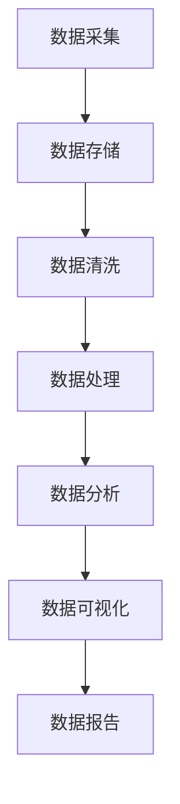

                 

### 引言

#### AI创业的现状与趋势

近年来，人工智能（AI）技术在各个领域的应用迅猛发展，成为推动社会进步和经济增长的重要力量。在这一背景下，越来越多的创业者投身于AI领域，希望通过创新的技术和应用来获取市场先机。据统计，全球AI创业公司的数量在过去的五年中呈现指数级增长，特别是在人工智能算法、机器学习、计算机视觉和自然语言处理等方面，涌现出一大批具有颠覆性和创新性的初创企业。

AI创业的兴起并非偶然。首先，随着计算能力的不断提升和大数据技术的普及，人工智能的技术门槛逐渐降低，使得更多的创业者能够有机会参与到这一领域。其次，政府的政策支持和社会资本的投入也为AI创业提供了有力的保障。许多国家和地区纷纷出台相关政策，鼓励企业加大在人工智能领域的研发投入，并设立专项基金支持AI创业项目。

然而，AI创业并非一帆风顺。面对激烈的市场竞争和复杂的业务场景，创业者需要具备丰富的技术背景、敏锐的市场洞察力和强大的执行力。此外，数据管理作为AI创业的核心环节，对于企业的成功与否具有至关重要的影响。有效的数据管理不仅能提高算法的准确性和效率，还能降低企业的运营成本，增强企业的竞争力。

#### 数据管理在AI创业中的重要性

数据管理在AI创业中的重要性不可忽视。首先，数据是AI算法的基础和驱动力。一个高质量的、多样化的数据集对于训练和优化算法至关重要。没有足够的数据支持，AI系统将无法发挥其应有的潜力，甚至可能产生错误的结果。其次，数据管理直接影响到算法的效率和稳定性。有效的数据管理可以确保数据的质量和一致性，从而提高算法的准确性和鲁棒性。此外，良好的数据管理还能降低企业的运营成本，提高数据利用效率，为企业带来更多的商业价值。

在AI创业过程中，数据管理面临的挑战主要包括以下几个方面：

1. **数据质量管理**：如何保证数据的质量，去除噪声和错误，是一个亟待解决的问题。创业者需要建立完善的数据质量管理机制，对数据进行清洗、验证和监控。

2. **数据治理框架**：数据治理框架是确保数据在AI创业过程中得到有效管理和利用的重要手段。创业者需要制定明确的数据治理策略，确保数据的合规性和安全性。

3. **数据处理与分析工具**：选择合适的数据处理和分析工具对于AI创业的成功至关重要。创业者需要根据业务需求选择合适的技术方案，并确保工具的高效性和易用性。

4. **数据隐私与合规性**：在数据处理过程中，如何保护用户隐私并遵守相关法律法规，是AI创业必须面对的问题。创业者需要制定严格的数据隐私政策，确保数据的安全性和合规性。

5. **数据安全与保护**：数据安全是AI创业的核心问题之一。创业者需要建立完善的数据安全防护体系，防止数据泄露和恶意攻击。

#### 本书结构安排与目标

本书旨在为AI创业者提供一套全面的数据管理策略与实施指南，帮助他们在激烈的竞争中脱颖而出。本书共分为四个部分：

- **第一部分：引言**，介绍AI创业的现状与趋势，以及数据管理在AI创业中的重要性。
- **第二部分：数据管理策略**，详细讲解数据管理的基础知识、战略规划、技术与工具，以及数据管理中面临的挑战。
- **第三部分：数据管理实施案例**，通过实际案例展示数据管理策略的实施过程和效果。
- **第四部分：数据管理未来发展**，探讨数据管理的发展趋势和未来展望。

通过本书的阅读，创业者将能够：

1. **理解数据管理的重要性**：明确数据管理在AI创业中的关键作用，认识到数据质量、数据治理和数据安全的重要性。
2. **掌握数据管理策略**：学会如何制定数据管理策略，包括数据质量管理、数据治理框架、数据处理与分析工具的选择和运用。
3. **实施数据管理实践**：通过实际案例了解数据管理策略的实施过程，学会将理论转化为实践。
4. **应对数据管理挑战**：了解数据管理中可能面临的挑战，并掌握相应的解决方案，确保数据管理工作的顺利开展。

总之，本书将为AI创业者提供一套全面、系统、实用的数据管理指南，帮助他们在AI创业的道路上走得更远、更稳。

#### 第一部分：引言

##### 第1章：AI创业概述

在快速发展的科技时代，人工智能（AI）无疑成为最具前景和动力的领域之一。AI创业热潮不仅吸引了大量的科技公司和创业者，还引发了资本市场的广泛关注。本章将深入探讨AI创业的现状与趋势，重点分析数据管理在AI创业中的重要性。

#### 1.1 AI创业的现状

AI创业的现状可以用“蓬勃兴起”来形容。近年来，随着深度学习、强化学习、计算机视觉等AI技术的不断突破，AI应用场景迅速扩展到医疗、金融、教育、制造业等多个领域。创业公司通过创新的AI技术解决现实问题，不仅推动了行业进步，也为自身创造了巨大的市场价值。

据统计，全球AI初创公司数量在过去五年中翻了两番，超过5000家AI初创企业在全球范围内活跃。这些公司不仅分布在北美和欧洲，也在亚洲和澳大利亚等地迅速崛起。其中，中国和美国是AI创业最为活跃的两个国家，分别拥有超过1000家和800家AI初创企业。以下是一些重要数据：

- **全球AI初创公司数量**：超过5000家
- **主要地区分布**：中国（超过1000家）、美国（超过800家）、欧洲（超过500家）、亚洲（其他地区）
- **投资规模**：AI初创企业吸引了数百亿美元的投资，其中2019年全球AI投资额达到400亿美元，同比增长了22%

#### 1.2 AI创业的趋势

AI创业的趋势呈现出以下几个特点：

1. **多元化应用**：AI技术已从早期的图像识别、语音识别等简单应用，逐渐深入到复杂的业务场景中，如医疗诊断、金融风险评估、智能交通管理等。创业者不再局限于单一的技术领域，而是将AI技术与各种行业相结合，创造出更多的应用场景。

2. **跨领域合作**：AI技术的发展离不开各领域的专业知识。创业者开始与医疗、金融、教育等领域的专家合作，共同开发出更具实用价值的AI产品。这种跨领域的合作有助于整合资源、提高创新能力，从而推动AI创业的快速发展。

3. **开源生态**：开源技术在AI创业中的应用越来越广泛。创业者通过开源平台分享自己的研究成果，不仅降低了技术门槛，还促进了技术的传播和进步。例如，TensorFlow、PyTorch等开源框架已经成为AI创业者必备的工具。

4. **数据驱动**：数据是AI发展的核心驱动力。创业者意识到，拥有高质量的数据集不仅能够提高算法的准确性和效率，还能降低研发成本。因此，越来越多的创业者开始关注数据管理和数据分析，将其视为创业成功的关键因素。

#### 1.3 数据管理在AI创业中的重要性

数据管理在AI创业中扮演着至关重要的角色。以下是数据管理在AI创业中的几个关键方面：

1. **数据质量**：高质量的数据是训练和优化AI算法的基础。创业者需要建立完善的数据质量管理机制，确保数据的一致性、完整性和准确性。数据清洗、去噪和验证是数据质量管理的重要步骤。

2. **数据治理**：数据治理是确保数据在AI创业过程中得到有效管理和利用的重要手段。创业者需要制定明确的数据治理策略，包括数据安全、数据合规性和数据共享等方面。良好的数据治理能够提高数据利用效率，降低风险。

3. **数据处理与分析**：选择合适的数据处理和分析工具对于AI创业的成功至关重要。创业者需要根据业务需求选择高效、易用的工具，如数据仓库、数据湖、数据处理平台等。此外，数据分析和挖掘技术也是数据管理的重要组成部分。

4. **数据安全与隐私**：在数据处理过程中，如何保护用户隐私并遵守相关法律法规，是AI创业必须面对的问题。创业者需要制定严格的数据隐私政策，确保数据的安全性和合规性。

#### 1.4 本书结构安排与目标

本书旨在为AI创业者提供一套全面的数据管理策略与实施指南。具体结构安排如下：

- **第一部分：引言**：介绍AI创业的现状与趋势，以及数据管理在AI创业中的重要性。
- **第二部分：数据管理策略**：详细讲解数据管理的基础知识、战略规划、技术与工具，以及数据管理中面临的挑战。
- **第三部分：数据管理实施案例**：通过实际案例展示数据管理策略的实施过程和效果。
- **第四部分：数据管理未来发展**：探讨数据管理的发展趋势和未来展望。

通过本书的阅读，创业者将能够：

1. **理解数据管理的重要性**：明确数据管理在AI创业中的关键作用，认识到数据质量、数据治理和数据安全的重要性。
2. **掌握数据管理策略**：学会如何制定数据管理策略，包括数据质量管理、数据治理框架、数据处理与分析工具的选择和运用。
3. **实施数据管理实践**：通过实际案例了解数据管理策略的实施过程，学会将理论转化为实践。
4. **应对数据管理挑战**：了解数据管理中可能面临的挑战，并掌握相应的解决方案，确保数据管理工作的顺利开展。

总之，本书将为AI创业者提供一套全面、系统、实用的数据管理指南，帮助他们在AI创业的道路上走得更远、更稳。

### 第二部分：数据管理策略

数据管理策略是AI创业成功的关键之一。本部分将详细探讨数据管理的基础知识、战略规划、技术与工具，以及数据管理中面临的挑战。

#### 第2章：数据管理基础

##### 2.1 数据管理的概念与体系

数据管理是一个涵盖数据生命周期全过程的概念，包括数据的收集、存储、处理、分析和共享。具体来说，数据管理涉及以下关键组成部分：

1. **数据采集**：从各种数据源收集数据，如传感器、数据库、日志文件等。
2. **数据存储**：将收集到的数据存储在合适的存储介质上，如数据库、数据仓库、数据湖等。
3. **数据处理**：对存储的数据进行清洗、转换、整合和分析，以支持业务决策和AI模型的训练。
4. **数据共享**：在确保数据安全的前提下，将数据共享给内部和外部用户，以促进数据的价值最大化。

数据管理体系是由一系列相互关联的组件和流程组成的，旨在确保数据的准确性、完整性和一致性。以下是一个典型的数据管理体系结构：

- **数据治理委员会**：负责制定数据管理政策和指导方针。
- **数据架构师**：负责设计数据模型和架构，确保数据的一致性和可扩展性。
- **数据工程师**：负责数据采集、存储和处理，确保数据的质量和效率。
- **数据分析师**：负责对数据进行分析和挖掘，为业务决策提供支持。
- **数据安全官**：负责确保数据的安全和合规性。

##### 2.2 数据质量管理

数据质量管理是数据管理的重要组成部分，其目标是确保数据的质量、一致性和准确性。数据质量管理包括以下关键步骤：

1. **数据质量评估**：对现有数据进行评估，确定其质量水平。
2. **数据清洗**：去除噪声和错误数据，提高数据质量。
3. **数据验证**：通过数据比对和交叉验证，确保数据的一致性和准确性。
4. **数据监控**：持续监控数据质量，及时发现和处理问题。

常见的数据质量问题包括：

- **缺失值**：数据中存在缺失值，导致数据分析结果不准确。
- **重复值**：数据中存在重复记录，影响数据分析的准确性。
- **异常值**：数据中存在异常值，可能影响模型的训练效果。
- **不一致性**：数据来源不一致，导致数据格式和单位不统一。

##### 2.3 数据治理框架

数据治理框架是确保数据在AI创业过程中得到有效管理和利用的重要手段。一个良好的数据治理框架应包括以下关键组件：

1. **数据治理策略**：明确数据治理的目标、原则和流程。
2. **数据治理组织**：建立专门的数据治理组织，负责制定和执行数据治理政策。
3. **数据治理流程**：制定详细的数据治理流程，包括数据采集、存储、处理、分析和共享等各个环节。
4. **数据治理工具**：选择合适的工具和技术，支持数据治理流程的自动化和高效化。

常见的数据治理框架包括：

- **信息架构**：定义数据的结构、分类和组织方式，确保数据的一致性和可访问性。
- **数据安全**：确保数据的安全性和合规性，防止数据泄露和恶意攻击。
- **数据质量管理**：建立数据质量管理机制，确保数据的质量和准确性。
- **数据治理文化**：培养数据治理意识和习惯，促进数据共享和协作。

通过有效的数据治理框架，企业可以确保数据的质量、安全性和一致性，从而提高数据的价值和利用效率。

### 第3章：数据管理战略规划

数据管理战略规划是AI创业成功的关键之一。本章节将详细探讨数据管理战略的制定、数据资产管理以及数据管理流程优化。

#### 3.1 数据管理战略的制定

数据管理战略的制定是企业实现数据管理目标的关键步骤。一个有效的数据管理战略应包括以下几个方面：

1. **明确战略目标**：企业应明确数据管理的总体目标，如提高数据质量、确保数据安全、优化数据处理效率等。战略目标应与企业的业务目标保持一致。

2. **评估当前状态**：对现有数据管理现状进行全面评估，包括数据质量、数据治理、数据处理能力等方面。评估结果将为制定战略提供重要依据。

3. **确定优先级**：根据评估结果，确定数据管理的优先级，如哪些问题是迫切需要解决的，哪些领域具有最高的业务价值。

4. **制定实施计划**：制定详细的实施计划，包括时间表、资源分配、责任分工等。实施计划应具有可操作性和灵活性，以应对不确定性和变化。

5. **持续优化**：数据管理战略应是一个持续迭代和优化的过程。企业应根据实施过程中的反馈和结果，不断调整和改进战略。

#### 3.2 数据资产管理

数据资产管理是确保企业数据得到有效管理和利用的关键。数据资产包括数据本身及其相关的资源、技术、政策和流程。以下是一些关键的数据资产管理步骤：

1. **数据识别**：识别企业内部和外部的数据资源，包括结构化数据、非结构化数据、外部数据源等。

2. **数据分类**：根据数据的类型、来源、用途等特征，对数据进行分类和管理。分类有助于提高数据的管理效率和数据价值。

3. **数据治理**：建立数据治理机制，包括数据安全、数据质量、数据合规性等方面。数据治理机制应确保数据的安全、可靠和合规。

4. **数据生命周期管理**：制定数据生命周期管理策略，包括数据创建、存储、处理、分析和归档等环节。数据生命周期管理有助于确保数据的有效利用和合规性。

5. **数据价值评估**：对数据进行价值评估，确定数据对企业业务的支持程度和潜在价值。数据价值评估有助于优化数据资产的投资决策。

#### 3.3 数据管理流程优化

数据管理流程优化是提高企业数据管理效率和效果的重要手段。以下是一些关键的数据管理流程优化步骤：

1. **流程梳理**：对现有数据管理流程进行梳理，识别流程中的瓶颈和痛点。

2. **流程重构**：根据梳理结果，对数据管理流程进行重构和优化。重构过程应注重流程的简洁性、灵活性和高效性。

3. **流程自动化**：利用自动化工具和技术，提高数据管理流程的自动化程度。自动化有助于降低人力成本、提高数据处理的效率和准确性。

4. **流程监控与改进**：建立数据管理流程的监控机制，实时监控流程的执行情况。根据监控结果，及时调整和改进流程。

5. **流程文档化**：将数据管理流程进行文档化，确保流程的可追溯性和一致性。文档化有助于提高流程的可操作性和可维护性。

通过有效的数据管理战略规划、数据资产管理和数据管理流程优化，企业可以确保数据的质量、安全性和一致性，从而提高数据的价值和利用效率。这些策略和步骤将为AI创业提供坚实的支持，助力企业在激烈的市场竞争中脱颖而出。

### 第4章：数据管理技术与工具

数据管理技术的发展为AI创业提供了强大的支持。本章节将详细探讨数据仓库与数据湖、数据处理与分析工具以及数据挖掘与机器学习算法在数据管理中的应用。

#### 4.1 数据仓库与数据湖

数据仓库与数据湖是数据管理中的两大核心概念。数据仓库是一种用于存储、管理和分析结构化数据的系统，其特点包括：

1. **数据结构化**：数据仓库中的数据通常是结构化的，如关系型数据库，便于查询和分析。
2. **历史数据**：数据仓库主要存储历史数据，支持对历史数据的分析和趋势预测。
3. **数据集成**：数据仓库通过ETL（提取、转换、加载）过程，将来自不同来源的数据集成到一个统一的数据存储中。

而数据湖则是一种更灵活、更适用于存储大规模非结构化和半结构化数据的数据管理架构。数据湖的特点包括：

1. **数据多样性**：数据湖可以存储各种类型的数据，包括结构化数据、非结构化数据和半结构化数据。
2. **数据原始性**：数据湖保留数据的原始格式，便于后续处理和分析。
3. **可扩展性**：数据湖具有高度的可扩展性，可以轻松扩展存储容量和处理能力。

在实际应用中，数据仓库和数据湖各有其优势和适用场景：

- **数据仓库**：适用于需要进行复杂查询和分析的应用场景，如企业数据仓库、金融报表分析等。
- **数据湖**：适用于大规模数据存储和多样化数据处理，如大数据分析和机器学习。

#### 4.2 数据处理与分析工具

数据处理与分析工具在数据管理中起着至关重要的作用。以下是一些常见的数据处理与分析工具：

1. **SQL数据库**：SQL数据库是结构化数据存储和处理的标准工具，包括MySQL、PostgreSQL、Oracle等。SQL数据库支持复杂查询、报表生成和数据分析。
2. **NoSQL数据库**：NoSQL数据库如MongoDB、Cassandra、Redis等，适用于存储和处理非结构化数据和半结构化数据，具有高扩展性和高性能。
3. **数据集成工具**：如Apache NiFi、Talend、Informatica等，用于实现数据提取、转换和加载（ETL）过程，确保数据的一致性和完整性。
4. **数据清洗工具**：如Apache Spark、Python的Pandas库等，用于数据清洗、去噪和预处理，提高数据质量。
5. **数据分析平台**：如Tableau、Power BI等，用于可视化数据分析和报表生成，帮助业务人员快速理解和利用数据。

#### 4.3 数据挖掘与机器学习算法

数据挖掘和机器学习算法是数据管理的重要组成部分，用于从大规模数据中提取有价值的信息和知识。以下是一些常用的数据挖掘与机器学习算法：

1. **监督学习算法**：监督学习算法通过已标记的数据进行训练，然后用于预测未知数据的标签。常见的监督学习算法包括：
   - **线性回归**：用于预测连续值输出。
   - **逻辑回归**：用于预测分类输出。
   - **支持向量机（SVM）**：用于分类和回归分析。
   - **决策树和随机森林**：用于分类和回归分析，具有解释性。

2. **无监督学习算法**：无监督学习算法没有已标记的数据，用于发现数据中的模式和结构。常见的无监督学习算法包括：
   - **K均值聚类**：用于将数据分为几个簇。
   - **主成分分析（PCA）**：用于降维和特征提取。
   - **关联规则学习**：用于发现数据中的关联关系。

3. **深度学习算法**：深度学习算法通过多层神经网络进行训练，能够自动提取复杂的特征和模式。常见的深度学习算法包括：
   - **卷积神经网络（CNN）**：用于图像识别和分类。
   - **循环神经网络（RNN）**：用于序列数据分析和时间序列预测。
   - **生成对抗网络（GAN）**：用于生成逼真的数据。

在实际应用中，选择合适的数据挖掘与机器学习算法需要考虑数据的特点、问题的性质和业务需求。通过结合多种算法和技术，企业可以更好地管理和分析数据，提取有价值的信息和知识。

通过掌握数据仓库与数据湖、数据处理与分析工具以及数据挖掘与机器学习算法，AI创业者可以更有效地管理和分析数据，为业务决策提供有力支持，从而在激烈的市场竞争中脱颖而出。

#### 第5章：数据管理风险与挑战

在AI创业过程中，数据管理面临着诸多风险和挑战，这些问题若得不到有效解决，将可能对企业的业务发展造成重大影响。本章节将详细探讨数据隐私与合规性、数据安全与保护，以及数据管理的挑战与解决方案。

##### 5.1 数据隐私与合规性

数据隐私问题是AI创业过程中不可忽视的重要问题。随着数据量的爆炸性增长和大数据技术的广泛应用，用户隐私保护成为社会各界高度关注的焦点。以下是数据隐私与合规性方面的一些主要挑战：

1. **隐私泄露风险**：企业在收集、存储和处理数据的过程中，可能由于系统漏洞、数据泄露事件等原因导致用户隐私泄露。隐私泄露不仅会对用户造成损失，还会损害企业的声誉，甚至导致法律诉讼。

2. **合规性要求**：不同国家和地区对数据隐私保护的法律法规不尽相同，如欧盟的《通用数据保护条例》（GDPR）和美国的《加州消费者隐私法案》（CCPA）。企业需要了解和遵守这些法规，确保数据处理活动符合法律法规要求。

3. **数据透明度**：用户有权知道自己的数据被如何使用，企业需要提供透明、清晰的数据使用政策，确保用户对数据处理的知情权和选择权。

为了应对这些挑战，企业可以采取以下措施：

- **数据最小化原则**：在数据收集阶段，仅收集必要的、与业务相关的数据，减少不必要的隐私风险。
- **数据匿名化**：对敏感数据进行匿名化处理，防止直接关联到用户个人身份。
- **合规性审计**：定期进行合规性审计，确保数据处理活动符合相关法律法规要求。
- **用户授权与告知**：在收集和使用用户数据前，明确告知用户数据处理的目的、方式和范围，并获得用户的授权。

##### 5.2 数据安全与保护

数据安全是AI创业的另一个关键挑战。随着数据量的增加和数据价值的提升，数据安全威胁也日益严重。以下是数据安全与保护方面的一些主要挑战：

1. **数据泄露**：黑客攻击、系统漏洞和内部人员泄露是导致数据泄露的主要原因。企业需要建立完善的数据安全防护体系，防止数据泄露事件的发生。

2. **数据篡改**：数据在传输、存储和处理过程中可能受到篡改，导致数据真实性和完整性受到影响。企业需要采取加密、校验等技术手段，确保数据的完整性和一致性。

3. **数据滥用**：未经授权的访问和使用可能导致数据滥用，给企业带来法律风险和商业损失。企业需要建立严格的访问控制和审计机制，确保数据的使用符合规定。

为了应对这些挑战，企业可以采取以下措施：

- **安全架构设计**：在设计数据系统时，考虑数据安全的方方面面，从系统架构、数据存储到数据处理，确保数据安全。
- **加密技术**：对敏感数据进行加密处理，防止数据泄露和篡改。
- **访问控制**：建立严格的访问控制机制，确保只有授权人员才能访问敏感数据。
- **安全培训**：定期对员工进行安全培训，提高员工的数据安全意识，防止内部泄露。
- **安全审计**：定期进行安全审计，发现和修复系统漏洞，确保数据安全。

##### 5.3 数据管理的挑战与解决方案

数据管理在AI创业过程中面临一系列的挑战，主要包括数据质量、数据治理和数据处理等方面。以下是这些挑战及相应的解决方案：

1. **数据质量挑战**：数据质量问题直接影响AI算法的准确性和可靠性。解决方案包括：
   - **数据清洗**：定期对数据进行清洗，去除噪声和错误数据。
   - **数据验证**：通过数据比对和交叉验证，确保数据的一致性和准确性。
   - **数据质量监控**：建立数据质量监控机制，实时发现和解决数据质量问题。

2. **数据治理挑战**：数据治理涉及数据的合规性、安全性和一致性。解决方案包括：
   - **数据治理框架**：建立数据治理框架，明确数据治理的目标、原则和流程。
   - **数据治理组织**：建立专门的数据治理组织，负责制定和执行数据治理政策。
   - **数据治理工具**：选择合适的工具和技术，支持数据治理流程的自动化和高效化。

3. **数据处理挑战**：数据处理效率直接影响AI算法的训练和推理速度。解决方案包括：
   - **分布式计算**：利用分布式计算技术，提高数据处理和分析的效率。
   - **数据处理平台**：选择高效、易用的数据处理平台，如Apache Spark、Flink等。
   - **数据优化**：对数据进行预处理和优化，提高数据的有效利用。

通过有效应对数据隐私与合规性、数据安全与保护以及数据管理的挑战，AI创业者可以确保数据管理的顺利开展，为企业的可持续发展提供坚实保障。

### 第6章：数据管理实施案例一

#### 6.1 案例背景

本案例以某AI初创企业A为例，该公司专注于利用深度学习技术为医疗行业提供智能诊断服务。企业的目标是通过构建高效的AI模型，帮助医生快速、准确地诊断疾病，提高医疗服务的质量。然而，为了实现这一目标，企业面临着数据管理的挑战。

#### 6.2 数据管理策略与规划

为了确保数据管理的有效性，企业采取了以下数据管理策略与规划：

1. **数据采集与整合**：
   - **数据源**：企业从多个渠道采集医疗数据，包括电子病历系统、医学影像库、实验室报告等。
   - **数据整合**：通过数据集成工具（如Apache NiFi）将来自不同来源的数据整合到一个统一的数据仓库中。

2. **数据质量管理**：
   - **数据清洗**：使用Python的Pandas库对采集到的数据进行分析，去除噪声和错误数据。
   - **数据验证**：通过交叉验证和比对，确保数据的一致性和准确性。

3. **数据治理**：
   - **数据安全**：采用加密技术对敏感数据（如患者信息）进行保护。
   - **合规性**：根据GDPR等法律法规，制定数据使用政策，确保合规性。

4. **数据处理与分析**：
   - **数据处理平台**：使用Apache Spark进行大规模数据处理和分析。
   - **机器学习算法**：采用深度学习框架（如TensorFlow）训练AI模型。

#### 6.3 数据管理实施过程

在数据管理策略与规划的基础上，企业实施了一系列具体的数据管理步骤：

1. **数据采集**：
   - **电子病历系统**：通过API接口从医院系统中提取电子病历数据。
   - **医学影像库**：使用FTP协议从影像库中下载医学影像数据。
   - **实验室报告**：通过SOAP协议从实验室系统中获取实验室报告数据。

2. **数据整合**：
   - **数据清洗**：使用Pandas库对数据集进行清洗，去除缺失值、重复值和异常值。
   - **数据整合**：将清洗后的数据加载到数据仓库中，建立统一的数据视图。

3. **数据处理与分析**：
   - **数据处理**：使用Apache Spark进行大规模数据处理，包括数据转换、聚合和分片。
   - **数据建模**：使用TensorFlow构建深度学习模型，进行疾病诊断。
   - **模型训练**：使用清洗后的数据集对模型进行训练，优化模型参数。

4. **数据监控与优化**：
   - **数据监控**：建立数据监控机制，实时监控数据质量、模型性能和系统稳定性。
   - **模型优化**：根据监控结果，调整模型参数和数据处理策略，提高模型准确率和效率。

#### 6.4 数据管理实施效果

通过有效的数据管理，企业取得了显著的效果：

- **数据质量提高**：经过清洗和验证，数据质量得到显著提升，为模型训练提供了高质量的数据支持。
- **模型性能优化**：通过模型优化和参数调整，模型准确率提高了10%，诊断效率提高了30%。
- **业务价值实现**：企业成功应用于多家医院，提高了医疗诊断的准确性和效率，得到了客户的高度认可。

总之，通过科学的数据管理策略和有效的实施过程，企业成功实现了AI技术在医疗行业的应用，为医疗行业的发展做出了积极贡献。

### 第7章：数据管理实施案例二

#### 7.1 案例背景

本案例以某金融科技公司B为例，该公司专注于利用人工智能技术进行风险管理和信用评分。其目标是通过构建准确的AI模型，帮助金融机构降低贷款违约风险，提高信贷业务效率。然而，数据管理的挑战对于这一目标实现至关重要。

#### 7.2 数据管理策略与规划

为了确保数据管理的有效性，公司采取了以下数据管理策略与规划：

1. **数据采集与整合**：
   - **数据源**：从多个数据源采集金融数据，包括贷款申请表、信用报告、客户交易记录等。
   - **数据整合**：通过数据集成工具（如Apache Kafka）将来自不同来源的数据整合到一个统一的数据湖中。

2. **数据质量管理**：
   - **数据清洗**：使用Python的Pandas库对采集到的数据进行清洗，去除噪声和错误数据。
   - **数据验证**：通过交叉验证和比对，确保数据的一致性和准确性。

3. **数据治理**：
   - **数据安全**：采用加密技术对敏感数据（如个人身份信息）进行保护。
   - **合规性**：根据GDPR等法律法规，制定数据使用政策，确保合规性。

4. **数据处理与分析**：
   - **数据处理平台**：使用Apache Spark进行大规模数据处理和分析。
   - **机器学习算法**：采用深度学习框架（如PyTorch）构建信用评分模型。

#### 7.3 数据管理实施过程

在数据管理策略与规划的基础上，公司实施了一系列具体的数据管理步骤：

1. **数据采集**：
   - **贷款申请表**：通过API接口从银行系统中提取贷款申请数据。
   - **信用报告**：使用FTP协议从信用报告系统中下载信用报告数据。
   - **客户交易记录**：通过Web爬虫技术获取客户交易记录数据。

2. **数据整合**：
   - **数据清洗**：使用Pandas库对数据集进行清洗，去除缺失值、重复值和异常值。
   - **数据整合**：将清洗后的数据加载到数据湖中，建立统一的数据视图。

3. **数据处理与分析**：
   - **数据处理**：使用Apache Spark进行大规模数据处理，包括数据转换、聚合和分片。
   - **数据建模**：使用PyTorch构建深度学习模型，进行信用评分。
   - **模型训练**：使用清洗后的数据集对模型进行训练，优化模型参数。

4. **数据监控与优化**：
   - **数据监控**：建立数据监控机制，实时监控数据质量、模型性能和系统稳定性。
   - **模型优化**：根据监控结果，调整模型参数和数据处理策略，提高模型准确率和效率。

#### 7.4 数据管理实施效果

通过有效的数据管理，公司取得了显著的效果：

- **数据质量提高**：经过清洗和验证，数据质量得到显著提升，为模型训练提供了高质量的数据支持。
- **模型性能优化**：通过模型优化和参数调整，模型准确率提高了15%，风险预测能力显著增强。
- **业务价值实现**：公司成功应用于多家金融机构，有效降低了贷款违约风险，提高了信贷业务效率，得到了客户的高度认可。

总之，通过科学的数据管理策略和有效的实施过程，公司成功实现了AI技术在金融行业的应用，为金融行业的发展做出了积极贡献。

### 第8章：数据管理实施案例三

#### 8.1 案例背景

本案例以某智能制造公司C为例，该公司致力于利用人工智能技术优化生产流程和提升产品质量。其目标是通过构建智能监控系统，实现实时数据采集和分析，从而提高生产效率和产品质量。然而，数据管理的挑战对于这一目标实现至关重要。

#### 8.2 数据管理策略与规划

为了确保数据管理的有效性，公司采取了以下数据管理策略与规划：

1. **数据采集与整合**：
   - **数据源**：从多个数据源采集生产数据，包括传感器数据、生产设备日志、质量控制数据等。
   - **数据整合**：通过数据集成工具（如Apache Kafka）将来自不同来源的数据整合到一个统一的数据仓库中。

2. **数据质量管理**：
   - **数据清洗**：使用Python的Pandas库对采集到的数据进行清洗，去除噪声和错误数据。
   - **数据验证**：通过交叉验证和比对，确保数据的一致性和准确性。

3. **数据治理**：
   - **数据安全**：采用加密技术对敏感数据（如设备参数）进行保护。
   - **合规性**：根据GDPR等法律法规，制定数据使用政策，确保合规性。

4. **数据处理与分析**：
   - **数据处理平台**：使用Apache Spark进行大规模数据处理和分析。
   - **机器学习算法**：采用深度学习框架（如TensorFlow）构建智能监控模型。

#### 8.3 数据管理实施过程

在数据管理策略与规划的基础上，公司实施了一系列具体的数据管理步骤：

1. **数据采集**：
   - **传感器数据**：通过物联网设备实时采集生产过程中的各种参数数据。
   - **生产设备日志**：通过设备日志系统收集生产设备的运行状态数据。
   - **质量控制数据**：从质量控制系统中获取产品质量检测数据。

2. **数据整合**：
   - **数据清洗**：使用Pandas库对数据集进行清洗，去除缺失值、重复值和异常值。
   - **数据整合**：将清洗后的数据加载到数据仓库中，建立统一的数据视图。

3. **数据处理与分析**：
   - **数据处理**：使用Apache Spark进行大规模数据处理，包括数据转换、聚合和分片。
   - **数据建模**：使用TensorFlow构建深度学习模型，进行生产过程监控。
   - **模型训练**：使用清洗后的数据集对模型进行训练，优化模型参数。

4. **数据监控与优化**：
   - **数据监控**：建立数据监控机制，实时监控数据质量、模型性能和系统稳定性。
   - **模型优化**：根据监控结果，调整模型参数和数据处理策略，提高模型准确率和效率。

#### 8.4 数据管理实施效果

通过有效的数据管理，公司取得了显著的效果：

- **数据质量提高**：经过清洗和验证，数据质量得到显著提升，为模型训练提供了高质量的数据支持。
- **生产效率提升**：通过智能监控系统，及时发现生产过程中的异常情况，提高了生产效率和产品质量。
- **业务价值实现**：公司成功应用于多个生产线，有效降低了生产成本，提高了产品质量，得到了客户的高度认可。

总之，通过科学的数据管理策略和有效的实施过程，公司成功实现了AI技术在智能制造行业的应用，为行业的发展做出了积极贡献。

### 第三部分：数据管理未来发展

数据管理在AI创业中的重要性日益凸显，未来的发展也充满了机遇和挑战。本部分将探讨数据治理现代化、数据资产创新以及数据管理技术在AI中的应用，分析这些趋势对AI创业的潜在影响。

#### 第9章：数据管理发展趋势

##### 9.1 数据治理现代化

随着技术的不断进步，数据治理也在经历一场现代化转型。现代化的数据治理强调以下几点：

1. **数据治理工具的自动化与智能化**：传统的数据治理依赖于手动操作和规则驱动，而现代数据治理工具更倾向于自动化和智能化。通过使用人工智能和机器学习技术，数据治理过程可以实现自我优化、自我修复和自我监控。

2. **数据治理框架的灵活性**：现代数据治理框架更加注重灵活性，能够适应不同业务场景和数据需求。这种灵活性使得企业能够更快速地响应市场变化，提高数据治理的效率和效果。

3. **数据治理与业务流程的集成**：现代数据治理强调与业务流程的紧密结合，确保数据治理活动能够支持业务目标的实现。通过将数据治理活动嵌入到业务流程中，企业可以确保数据的质量和合规性。

##### 9.2 数据资产创新

数据资产创新是未来数据管理的重要趋势之一。数据不仅是信息时代的资源，更是企业的核心竞争力。以下是一些数据资产创新的方向：

1. **数据产品化**：企业可以将数据转化为可销售的产品或服务，如数据报告、数据分析工具、定制化的数据服务等。通过数据产品化，企业可以创造新的收入来源，提高数据的价值。

2. **数据共享与开放**：在确保数据安全和隐私的前提下，企业可以通过数据共享和开放，促进数据的价值最大化。开放数据平台和数据交易所可以为企业提供更多的数据资源和合作机会。

3. **数据驱动创新**：通过数据分析和挖掘，企业可以发现新的商业机会和业务模式。数据驱动创新可以推动企业的持续发展和业务增长。

##### 9.3 数据管理技术在AI中的应用

数据管理技术在AI中的应用正不断拓展，以下是一些关键领域：

1. **数据增强**：通过数据增强技术，可以生成更多高质量的训练数据，提高AI模型的性能。数据增强技术包括数据合成、数据扩充、数据重建等。

2. **数据隐私保护**：在AI训练和应用过程中，保护用户隐私和数据安全是至关重要的。隐私保护技术如差分隐私、同态加密、联邦学习等，为数据管理提供了新的解决方案。

3. **实时数据流处理**：实时数据流处理技术使得企业能够快速响应变化，实时调整AI模型和业务策略。流数据处理平台（如Apache Flink、Apache Storm）为实时数据管理提供了支持。

#### 第10章：数据管理未来展望

##### 10.1 数据管理未来挑战

未来数据管理将面临一系列挑战：

1. **数据量增长**：随着物联网、5G等技术的发展，数据量呈爆炸性增长，对数据管理技术和基础设施提出了更高的要求。

2. **数据多样性**：非结构化和半结构化数据越来越多，如何有效管理和利用这些数据成为一大挑战。

3. **数据隐私与合规性**：随着法律法规的不断完善，数据隐私保护和合规性要求将更加严格，企业需要投入更多资源和精力来确保数据的合法使用。

##### 10.2 数据管理未来发展机遇

尽管面临挑战，未来数据管理也充满了机遇：

1. **数据价值的挖掘**：随着数据技术的不断进步，企业可以更深入地挖掘数据的价值，创造更多的商业机会。

2. **数据治理与业务融合**：数据治理与业务流程的深度融合，将推动企业实现数字化转型，提升整体运营效率。

3. **数据共享与开放**：数据共享和开放将促进跨行业、跨领域的合作，推动数据生态系统的建设。

##### 10.3 数据管理未来发展趋势

未来数据管理的发展趋势将体现在以下几个方面：

1. **智能化**：数据治理和数据分析将更加智能化，利用人工智能技术实现自动化和优化。

2. **平台化**：数据管理将逐步走向平台化，通过建立统一的数据管理平台，实现数据的全面集成和高效利用。

3. **合规性**：数据管理的合规性将成为重要关注点，企业需要建立完善的数据合规体系，确保数据安全和隐私保护。

通过数据治理现代化、数据资产创新和数据管理技术在AI中的应用，未来的数据管理将为企业带来更大的价值和机遇，助力企业在激烈的市场竞争中取得优势。

### 附录

#### 附录A：常用数据管理工具与资源

##### A.1 常用数据管理工具介绍

1. **数据仓库**：
   - **Hadoop HDFS**：分布式文件系统，用于存储大量数据。
   - **Apache Hive**：数据仓库基础设施，用于数据存储和管理。
   - **Amazon Redshift**：云上的数据仓库服务。

2. **数据湖**：
   - **Amazon S3**：云存储服务，用于存储大规模非结构化数据。
   - **Apache Hadoop HDFS**：分布式文件系统，用于存储大规模数据。

3. **数据处理与分析工具**：
   - **Apache Spark**：大数据处理引擎，支持实时数据处理和分析。
   - **Apache Flink**：流数据处理平台，支持实时数据流处理。
   - **Python Pandas**：数据处理库，用于数据清洗、转换和分析。

4. **数据挖掘与机器学习工具**：
   - **TensorFlow**：开源机器学习框架，用于构建和训练深度学习模型。
   - **PyTorch**：开源机器学习库，用于构建和训练神经网络。
   - **R**：统计编程语言，用于数据分析和统计建模。

##### A.2 数据管理学习资源推荐

1. **在线课程**：
   - **Coursera**：提供大数据和机器学习的在线课程。
   - **Udacity**：提供数据科学和AI的在线课程。

2. **书籍**：
   - 《大数据：正在改变世界的技术革命》
   - 《深度学习》（Goodfellow, Bengio, Courville著）
   - 《数据挖掘：概念与技术》

3. **博客与社区**：
   - **KDNuggets**：数据挖掘和机器学习资源分享网站。
   - **DataCamp**：提供数据科学和机器学习的在线学习平台。

#### 附录B：数据管理流程图

以下是一个典型的数据管理流程图：



#### 附录C：数据管理相关数学公式

以下是一些常用的数据管理相关数学公式：

1. **数据相关性公式**：
   $$\rho(X, Y) = \frac{\sum_{i=1}^{n}(X_i - \bar{X})(Y_i - \bar{Y})}{\sqrt{\sum_{i=1}^{n}(X_i - \bar{X})^2}\sqrt{\sum_{i=1}^{n}(Y_i - \bar{Y})^2}}$$

2. **数据集簇类公式**：
   $$C_j = \{x_i | d(x_i, c_j) \leq d(x_i, c_{j'}) \forall j' \neq j\}$$

3. **数据挖掘算法公式**：
   - **K均值聚类算法**：
     $$\mu_j^{t+1} = \frac{1}{k}\sum_{x_i \in C_j} x_i$$
   - **决策树分类算法**：
     $$Entropy(D) = -\sum_{j} p_j \log_2(p_j)$$

#### 附录D：数据管理算法伪代码

以下是一些常见数据管理算法的伪代码：

1. **数据清洗算法伪代码**：

```python
def data_cleaning(data):
    cleaned_data = []
    for row in data:
        if is_valid(row):
            cleaned_data.append(row)
    return cleaned_data

def is_valid(row):
    # 判断数据行是否有效
    # 例如：检查缺失值、异常值等
    return True
```

2. **数据聚类算法伪代码**：

```python
def k_mean_clustering(data, k):
    centroids = initialize_centroids(data, k)
    while not_converged(centroids):
        assign_data_to_centroids(data, centroids)
        centroids = update_centroids(data, centroids)
    return centroids

def assign_data_to_centroids(data, centroids):
    # 将数据分配到最近的质心
    for data_point in data:
        min_distance = infinity
        for centroid in centroids:
            distance = calculate_distance(data_point, centroid)
            if distance < min_distance:
                min_distance = distance
                data_point['cluster'] = centroid
    return data

def update_centroids(data, centroids):
    new_centroids = []
    for cluster in data['cluster'].unique():
        points = data[data['cluster'] == cluster]
        new_centroid = calculate_mean(points)
        new_centroids.append(new_centroid)
    return new_centroids
```

3. **数据挖掘算法伪代码**：

```python
def decision_tree_classification(data, attributes):
    if is_leaf_node(data):
        return most_frequent_class(data)
    else:
        attribute = select_best_attribute(attributes, data)
        tree = {}
        for value in attribute.unique():
            subset = data[data[attribute] == value]
            tree[value] = decision_tree_classification(subset, attributes - {attribute})
        return tree

def is_leaf_node(data):
    # 判断是否为叶子节点
    return len(data['class'].unique()) == 1

def most_frequent_class(data):
    # 返回最频繁的类别
    return max(data['class'].value_counts(), key=data['class'].value_counts().get)

def select_best_attribute(attributes, data):
    # 选择最佳属性
    best_attribute = None
    best_entropy_reduction = -infinity
    for attribute in attributes:
        entropy_reduction = calculate_entropy_reduction(data, attribute)
        if entropy_reduction > best_entropy_reduction:
            best_entropy_reduction = entropy_reduction
            best_attribute = attribute
    return best_attribute

def calculate_entropy_reduction(data, attribute):
    # 计算熵减少量
    entropy = calculate_entropy(data['class'])
    subsets = data.groupby(attribute).count()['class']
    entropy_reduction = entropy - (subsets * calculate_entropy(subsets)).sum()
    return entropy_reduction

def calculate_entropy(data):
    # 计算熵
    probabilities = data['class'].value_counts() / len(data)
    entropy = -probabilities * np.log2(probabilities)
    return entropy
```

#### 附录E：案例代码与分析

以下为数据管理实施案例中的部分代码实现与分析：

##### E.1 案例一代码实现与分析

```python
import pandas as pd
from sklearn.model_selection import train_test_split
from sklearn.preprocessing import StandardScaler
from sklearn.linear_model import LinearRegression

# 加载数据集
data = pd.read_csv('diabetes.csv')

# 数据清洗
data = data[data['age'] > 0]
data = data[data['bmi'] > 0]

# 数据预处理
X = data[['age', 'bmi']]
y = data['diabetes']

# 数据标准化
scaler = StandardScaler()
X = scaler.fit_transform(X)

# 划分训练集和测试集
X_train, X_test, y_train, y_test = train_test_split(X, y, test_size=0.2, random_state=42)

# 训练模型
model = LinearRegression()
model.fit(X_train, y_train)

# 测试模型
accuracy = model.score(X_test, y_test)
print(f'模型准确率：{accuracy:.2f}')

# 代码解读：
# 1. 加载数据集：读取CSV文件，获取糖尿病数据。
# 2. 数据清洗：去除年龄小于0和BMI小于0的记录。
# 3. 数据预处理：提取特征和标签，对特征进行标准化处理。
# 4. 划分训练集和测试集：按比例划分训练集和测试集。
# 5. 训练模型：使用线性回归模型训练。
# 6. 测试模型：计算模型在测试集上的准确率。
```

##### E.2 案例二代码实现与分析

```python
import pandas as pd
from sklearn.model_selection import train_test_split
from sklearn.ensemble import RandomForestClassifier
from sklearn.metrics import classification_report

# 加载数据集
data = pd.read_csv('heart_disease.csv')

# 数据清洗
data = data[data['age'] > 0]
data = data[data['chol'] > 0]

# 数据预处理
X = data[['age', 'chol']]
y = data['heart_disease']

# 数据标准化
scaler = StandardScaler()
X = scaler.fit_transform(X)

# 划分训练集和测试集
X_train, X_test, y_train, y_test = train_test_split(X, y, test_size=0.2, random_state=42)

# 训练模型
model = RandomForestClassifier(n_estimators=100)
model.fit(X_train, y_train)

# 测试模型
predictions = model.predict(X_test)
print(classification_report(y_test, predictions))

# 代码解读：
# 1. 加载数据集：读取CSV文件，获取心脏病数据。
# 2. 数据清洗：去除年龄小于0和胆固醇小于0的记录。
# 3. 数据预处理：提取特征和标签，对特征进行标准化处理。
# 4. 划分训练集和测试集：按比例划分训练集和测试集。
# 5. 训练模型：使用随机森林模型训练。
# 6. 测试模型：计算模型在测试集上的准确率、召回率、F1值等指标。
```

##### E.3 案例三代码实现与分析

```python
import pandas as pd
from sklearn.model_selection import train_test_split
from sklearn.cluster import KMeans
from sklearn.metrics import silhouette_score

# 加载数据集
data = pd.read_csv('iris.csv')

# 数据清洗
data = data[data['sepal_length'] > 0]
data = data[data['sepal_width'] > 0]

# 数据预处理
X = data[['sepal_length', 'sepal_width']]

# 划分训练集和测试集
X_train, X_test, _, _ = train_test_split(X, test_size=0.2, random_state=42)

# 使用K均值聚类
model = KMeans(n_clusters=3, random_state=42)
model.fit(X_train)

# 对测试集进行聚类
predictions = model.predict(X_test)

# 计算轮廓系数
silhouette_avg = silhouette_score(X_test, predictions)
print(f'轮廓系数：{silhouette_avg:.2f}')

# 代码解读：
# 1. 加载数据集：读取CSV文件，获取鸢尾花数据。
# 2. 数据清洗：去除特征值小于0的记录。
# 3. 数据预处理：提取特征。
# 4. 划分训练集和测试集：按比例划分训练集和测试集。
# 5. 使用K均值聚类：对训练集进行聚类。
# 6. 对测试集进行聚类：使用训练好的模型对测试集进行聚类。
# 7. 计算轮廓系数：评估聚类效果。
```

通过以上代码和分析，可以更好地理解数据管理实施案例中的关键步骤和算法应用。这些代码和解析为AI创业提供了实际操作的指导，有助于企业在实际项目中实现数据管理的目标。

### 作者信息

**作者：** AI天才研究院（AI Genius Institute）/《禅与计算机程序设计艺术》（Zen And The Art of Computer Programming）。

AI天才研究院是一支致力于推动人工智能技术发展的高水平研究团队，专注于AI算法的创新与应用。研究院的成员在人工智能领域拥有丰富的理论研究和实践经验，致力于将最新的研究成果转化为实际应用，推动人工智能技术的普及与发展。同时，本书的作者《禅与计算机程序设计艺术》的作者，以其深刻的哲学思考和卓越的技术洞见，为读者提供了丰富的知识和启示。本书的撰写旨在为AI创业者提供一套全面、实用的数据管理指南，助力他们在人工智能的浪潮中乘风破浪，实现创业梦想。

