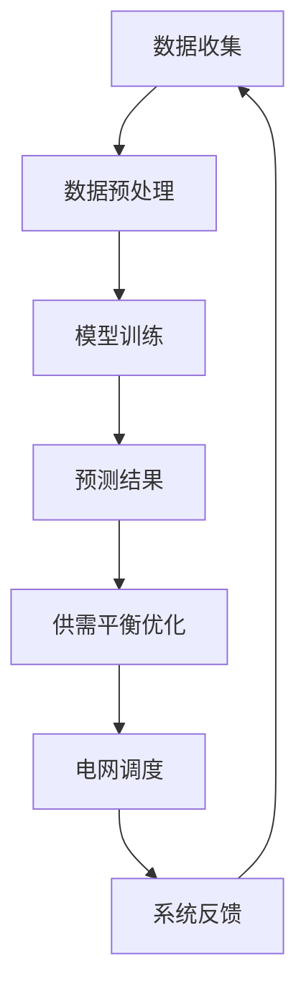
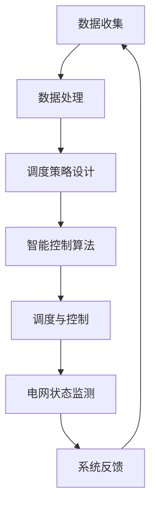
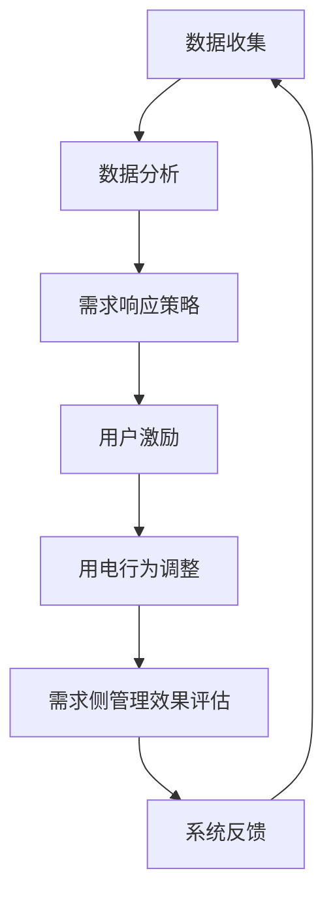
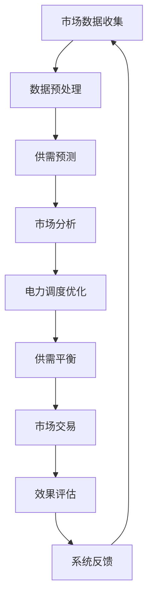

                 

## 引言

随着全球经济的快速发展和人们对能源需求的不断增长，电力系统的运行效率和管理水平成为制约能源可持续发展的关键因素。传统的电力系统主要依赖于人工调度和管理，存在很多问题，如实时性差、调度策略单一、难以应对突发情况等。在这种背景下，智能电网（Smart Grid）的概念应运而生，它通过引入现代信息技术、通信技术、自动控制技术和电力电子技术，实现对电力系统的智能化管理，以提高电网的运行效率和可靠性。

智能电网管理是指在智能电网架构下，通过先进的技术手段，实现对电力系统的实时监测、控制、调度和优化。智能电网管理不仅包括对电力生产、传输和消费的管理，还涉及能源市场的运营和电力市场的分析。在这个过程中，人工智能（AI）技术发挥着至关重要的作用。AI技术，特别是机器学习和深度学习，通过对海量数据的分析和处理，能够实现电力负荷预测、能源需求侧管理、电力市场预测与优化等功能，从而帮助实现供需平衡，提高电网的运行效率和可靠性。

本篇文章将围绕AI在智能电网管理中的应用展开讨论。我们将首先介绍智能电网的基本概念、结构、管理的重要性以及关键技术。随后，本文将深入探讨AI技术在智能电网管理中的应用，包括供需平衡预测与优化、能源需求侧管理和能源供给侧管理。最后，我们将通过实际案例展示AI技术在智能电网管理中的具体应用，并展望AI在智能电网管理中的未来发展趋势。

本文结构如下：

- **第一部分：智能电网管理概述**：介绍智能电网的定义与结构，智能电网管理的重要性，以及智能电网管理的关键技术。
- **第二部分：AI在智能电网管理中的应用**：详细探讨AI在智能电网管理中的应用，包括供需平衡预测与优化、能源需求侧管理和能源供给侧管理。
- **第三部分：AI在智能电网管理中的实战应用**：通过实际案例展示AI技术在智能电网管理中的具体应用。
- **第四部分：智能电网管理中的AI挑战与展望**：分析智能电网管理中的AI挑战和未来发展趋势。
- **附录**：介绍智能电网管理中的AI工具与资源，以及AI算法在智能电网管理中的Mermaid流程图。

通过本文的讨论，我们将全面了解AI技术在智能电网管理中的应用，以及如何通过AI技术实现电力系统的智能化管理，提高电网的运行效率和可靠性。

## 第一部分：智能电网管理概述

### 1.1 智能电网的定义与结构

#### 1.1.1 智能电网的基本概念

智能电网是一种基于现代信息通信技术、自动控制技术和电力电子技术的先进电力系统，它通过智能化手段实现对电力生产、传输、分配和消费的全方位管理。与传统电网相比，智能电网具有更高的可靠性、效率和灵活性，能够更好地适应可再生能源的接入和电力市场的发展需求。

智能电网的基本概念可以从以下几个方面来理解：

1. **信息双向传输**：智能电网通过先进的通信技术，实现了电网内部信息流的双向传输，使得电网能够实时感知和响应各类电力设备的运行状态，提高电网的响应速度和调度灵活性。
2. **实时监测与控制**：智能电网能够通过传感器和监控系统，实时监测电网的运行状态，实现对电力设备的高效控制和调度，确保电网的稳定运行。
3. **高度自动化**：智能电网引入了自动化控制技术，使得电力系统的调度和管理更加高效和精准，减少了人为干预，提高了电网的运行效率和可靠性。
4. **用户互动**：智能电网使得用户能够参与到电网的管理中，通过智能电表等设备，用户可以实时了解自己的用电情况，并调整用电行为，实现能源的合理分配和使用。

#### 1.1.2 智能电网的主要组成部分

智能电网主要由以下几个关键部分组成：

1. **电力设备**：包括发电设备、输电设备、变电设备和配电设备等，这些设备通过现代化的信息技术和自动化控制技术实现了智能化。
2. **传感器网络**：通过在电力设备和关键节点上安装各种传感器，实时采集电网的运行数据，为电网的监测和控制提供基础。
3. **通信网络**：包括有线和无线通信网络，用于传输传感器采集的数据和控制指令，实现电网的信息双向传输。
4. **监控中心**：通过对传感器网络采集的数据进行处理和分析，实现对电网的实时监测和控制，确保电网的安全和稳定运行。
5. **用户端设备**：包括智能电表、智能开关等，用于用户的互动和参与，实现电力消费的智能化管理。

#### 1.1.3 智能电网与传统电网的对比

智能电网与传统电网在多个方面存在显著差异：

1. **可靠性**：智能电网通过自动化控制和实时监测，能够更快速、更准确地应对电网故障和异常情况，提高电网的可靠性。
2. **效率**：智能电网通过优化调度和实时控制，能够实现能源的高效利用，减少能源浪费。
3. **灵活性**：智能电网能够更好地适应可再生能源的接入和电力市场的发展需求，提高电网的灵活性。
4. **互动性**：智能电网使得用户能够参与到电网的管理中，通过互动实现电力消费的智能化管理。

总之，智能电网在可靠性、效率、灵活性和互动性等方面都优于传统电网，为电力系统的智能化管理和能源的可持续发展提供了有力支持。

### 1.2 智能电网管理的重要性

智能电网管理的重要性体现在以下几个方面：

#### 1.2.1 智能电网管理的基本原则

智能电网管理的基本原则包括：

1. **实时性**：智能电网管理要求对电网的运行状态进行实时监测和控制，确保电网的安全稳定运行。
2. **高效性**：通过优化调度和实时控制，提高电网的运行效率，减少能源浪费。
3. **可靠性**：确保电网在各类情况下都能稳定运行，减少故障发生。
4. **灵活性**：适应可再生能源的接入和电力市场的发展，提高电网的灵活性。

#### 1.2.2 智能电网管理的挑战与机遇

智能电网管理面临的挑战包括：

1. **数据规模**：智能电网中大量的传感器和设备会产生海量数据，如何高效地处理和分析这些数据是一个挑战。
2. **数据隐私**：电网中的数据涉及用户隐私，如何保护这些数据的安全性和隐私性是一个重要问题。
3. **算法可靠性**：智能电网管理依赖于各种算法，如何确保这些算法的可靠性是一个关键问题。
4. **系统兼容性**：智能电网需要与其他系统（如能源管理系统、电力市场系统等）进行集成，系统兼容性是一个挑战。

同时，智能电网管理也带来了新的机遇：

1. **能源转型**：智能电网管理有助于实现能源的清洁化和低碳化，推动能源转型。
2. **电力市场发展**：智能电网管理能够提高电力市场的效率和透明度，促进电力市场的发展。
3. **用户参与**：智能电网管理鼓励用户参与电网管理，提高用户的用电体验和满意度。

#### 1.2.3 智能电网管理在能源转型中的作用

智能电网管理在能源转型中发挥着关键作用：

1. **可再生能源的接入**：智能电网管理能够更好地适应可再生能源的波动性，实现可再生能源的高效利用。
2. **电网稳定运行**：通过实时监测和优化调度，确保电网在接入大量可再生能源后依然能够稳定运行。
3. **能源市场运作**：智能电网管理能够提高电力市场的效率和透明度，促进可再生能源市场的健康发展。
4. **用户参与**：智能电网管理鼓励用户参与能源生产和消费，实现能源的分布式管理和高效利用。

总之，智能电网管理不仅有助于提高电网的运行效率和可靠性，还推动了能源的转型和电力市场的发展，具有重要的战略意义。

### 1.3 智能电网管理的关键技术

智能电网管理离不开一系列关键技术的支持，这些技术共同构建了智能电网的基础框架，使其能够实现高效、安全、灵活的运行。以下是一些重要的关键技术：

#### 1.3.1 大数据与物联网技术

1. **大数据技术**：大数据技术是智能电网管理的重要基础，通过收集、存储、处理和分析海量数据，智能电网能够实时了解电网的运行状态和用户需求。例如，通过大数据分析，可以预测电力负荷、优化电力分配、检测设备故障等。
   
2. **物联网技术**：物联网技术使得智能电网中的各种设备能够互联互通，实现数据的实时采集和共享。物联网传感器分布在电网的各个环节，如发电站、变电站、配电设备和用户端，能够实时监测电网的运行参数，如电压、电流、功率因数等，为电网管理提供准确的数据支持。

#### 1.3.2 人工智能与机器学习

1. **人工智能技术**：人工智能技术是智能电网管理的核心，通过机器学习、深度学习等算法，能够对海量数据进行智能分析和决策。例如，通过机器学习算法，可以对电力负荷进行预测，优化电力调度，提高电网的运行效率和可靠性。

2. **机器学习**：机器学习算法在智能电网管理中应用广泛，包括电力负荷预测、设备故障诊断、电力市场分析等。例如，基于回归分析的电力负荷预测模型可以预测未来一段时间内的电力需求，帮助电网调度部门合理安排电力资源。

#### 1.3.3 能源优化与管理算法

1. **优化算法**：优化算法是智能电网管理的重要工具，用于解决电力系统的优化问题。例如，动态规划算法可以用于电力调度优化，确保电网在各种运行条件下的最优运行状态。

2. **管理算法**：管理算法用于电力系统的实时控制和调度，如PID控制算法可以用于电压和频率的调节，确保电网的稳定运行。

#### 1.3.4 电力市场分析技术

1. **市场价格模型**：电力市场分析技术用于分析电力市场的运行情况，建立市场价格模型，预测电力市场价格变化，为电力市场参与者提供决策支持。

2. **供需平衡分析**：通过分析电力市场的供需关系，优化电力资源的配置，确保电力市场的高效运行。

这些关键技术的相互融合和协同工作，使得智能电网管理能够更加智能化、自动化和高效化，为电力系统的可持续发展提供了有力保障。

## 第二部分：AI在智能电网管理中的应用

### 2.1 AI技术在智能电网管理中的应用概述

人工智能（AI）技术在智能电网管理中扮演着至关重要的角色。通过机器学习和深度学习算法，AI能够对海量数据进行分析和处理，实现电力系统的智能化管理和优化。以下将详细探讨AI技术在智能电网管理中的应用价值、主要应用领域以及未来的发展趋势。

#### 2.1.1 AI在智能电网管理中的价值

AI技术为智能电网管理带来了以下几个方面的价值：

1. **提高运行效率**：通过AI技术，可以对电力负荷进行精准预测和优化调度，提高电力资源的利用效率，减少能源浪费。
2. **增强电网稳定性**：AI技术可以实时监测电网状态，快速检测和处理异常情况，确保电网的稳定运行。
3. **提升安全性**：AI技术能够对电网进行安全性分析，预测潜在的故障和威胁，提前采取措施进行防范和应对。
4. **优化电力市场运作**：AI技术可以分析电力市场数据，预测市场价格变化，为电力市场参与者提供决策支持，提高市场运作效率。

#### 2.1.2 AI技术在智能电网管理中的应用领域

AI技术在智能电网管理中的应用非常广泛，主要包括以下几个方面：

1. **电力负荷预测**：通过机器学习算法，对历史电力负荷数据进行分析，预测未来一段时间内的电力需求，为电网调度提供参考。
2. **设备故障诊断**：利用AI技术对传感器采集的数据进行分析，实时监测电力设备的运行状态，预测可能的故障，提前进行维护和修复。
3. **需求侧管理**：通过AI技术，分析用户用电行为，优化电力需求响应策略，降低用户的用电成本，同时提高电网的运行效率。
4. **电力市场预测**：利用AI技术，对电力市场数据进行预测和分析，预测市场价格变化，为市场参与者提供决策支持。

#### 2.1.3 AI技术在智能电网管理中的发展趋势

随着AI技术的不断发展和应用，未来AI在智能电网管理中将有以下几个发展趋势：

1. **算法智能化**：未来的AI算法将更加智能化，能够自动学习和适应电力系统的变化，提高预测和优化精度。
2. **数据融合**：未来将实现多种数据源的融合，如气象数据、用户行为数据等，提高数据分析和预测的准确性。
3. **实时性提升**：通过提高算法的计算速度和优化通信网络，实现AI技术在电网管理中的实时应用，提高电网的响应速度。
4. **系统集成**：未来AI技术将在智能电网管理的各个领域进行集成，实现跨领域的智能化管理和优化。

总之，AI技术在智能电网管理中具有巨大的应用潜力，通过不断的技术创新和应用，将为电力系统的智能化管理和可持续发展提供有力支持。

### 2.2 供需平衡预测与优化

在智能电网管理中，供需平衡预测与优化是确保电网稳定运行和高效利用能源的关键环节。供需平衡预测与优化的核心目标是预测电力需求并优化电力供应，从而实现电网的稳定、安全、经济运行。以下将详细探讨供需平衡预测与优化方法，包括时间序列分析方法、聚类分析方法、支持向量机回归以及深度学习预测模型。

#### 2.2.1 供需平衡预测方法

供需平衡预测方法可以分为传统方法和现代方法。传统方法主要包括时间序列分析法和回归分析法，而现代方法主要包括聚类分析法和深度学习预测模型。

##### 2.2.1.1 时间序列分析方法

时间序列分析方法是基于时间序列数据对电力需求进行预测。时间序列数据通常包括历史电力负荷数据、天气数据、节假日数据等。时间序列分析方法主要包括以下几种：

1. **移动平均法**：通过计算过去一段时间内的平均值来预测未来值。移动平均法简单易行，但易受到短期波动的影响。

2. **指数平滑法**：在移动平均法的基础上，引入指数衰减因子，使得近期数据的影响更大。指数平滑法能够更好地捕捉数据的趋势和周期性。

3. **自回归模型（AR）**：自回归模型通过历史数据进行预测，模型假设当前值与过去若干个周期内的值存在关系。自回归模型能够捕捉时间序列的自相关性。

4. **自回归积分滑动平均模型（ARIMA）**：ARIMA模型结合了自回归模型和移动平均模型，能够处理非线性时间序列数据。ARIMA模型通过差分、自回归和移动平均三个步骤，将非平稳时间序列转化为平稳时间序列，然后进行预测。

##### 2.2.1.2 聚类分析方法

聚类分析方法通过将相似的数据点分为同一类别，实现对数据的划分和分类。聚类分析方法主要包括以下几种：

1. **K-均值聚类**：K-均值聚类是一种基于距离的聚类算法，通过最小化聚类中心之间的距离平方和来划分数据。K-均值聚类算法简单有效，但需要预先确定聚类个数K。

2. **层次聚类**：层次聚类是一种自底向上的聚类方法，通过逐步合并相似的数据点，形成树状结构。层次聚类不需要预先确定聚类个数，但计算复杂度较高。

3. **密度聚类**：密度聚类通过计算数据点的密度分布，识别出高密度区域作为聚类中心。密度聚类适用于处理高维数据，能够发现聚类结构。

##### 2.2.1.3 支持向量机回归

支持向量机回归（SVR）是一种基于支持向量机的预测方法。SVR通过构建一个高维特征空间，将非线性时间序列数据转化为线性问题进行求解。SVR的主要优点是能够在高维空间中找到最优决策边界，具有较高的预测精度。

##### 2.2.1.4 深度学习预测模型

深度学习预测模型通过构建多层神经网络，对时间序列数据进行特征提取和预测。深度学习预测模型主要包括以下几种：

1. **循环神经网络（RNN）**：RNN通过记忆机制，能够捕捉时间序列数据中的长期依赖关系。RNN适用于处理长序列预测问题。

2. **长短期记忆网络（LSTM）**：LSTM是RNN的一种改进，能够更好地处理长序列数据中的波动和噪声。LSTM在电力负荷预测中具有广泛应用。

3. **门控循环单元（GRU）**：GRU是LSTM的另一种改进，通过简化结构，提高了计算效率。GRU在电力负荷预测中表现出色。

4. **卷积神经网络（CNN）**：CNN通过卷积操作，能够捕捉时间序列数据中的局部特征。CNN在电力负荷预测中也有一定的应用。

5. **混合模型**：混合模型将多种预测方法结合，如将时间序列分析方法和深度学习预测模型相结合，提高预测的准确性和鲁棒性。

#### 2.2.2 供需平衡优化算法

供需平衡优化算法用于在预测结果的基础上，对电力供应和需求进行优化。以下几种优化算法在智能电网管理中应用广泛：

##### 2.2.2.1 动态规划算法

动态规划算法通过将优化问题划分为多个子问题，递归求解最优解。动态规划算法能够处理复杂的多阶段优化问题，但在状态空间较大时，计算复杂度较高。

##### 2.2.2.2 优化算法

优化算法包括线性规划、整数规划、混合整数规划等。这些算法通过构建目标函数和约束条件，求解最优解。优化算法在电力调度、电力市场交易等领域有广泛应用。

##### 2.2.2.3 混合优化算法

混合优化算法结合了多种优化方法，如结合遗传算法、粒子群算法等，提高优化效率。混合优化算法能够处理复杂的优化问题，提高预测精度。

#### 2.2.3 案例分析

以下通过一个实际案例，展示供需平衡预测与优化的应用过程：

**案例：某地区电力负荷预测与优化**

1. **数据收集**：收集该地区近一年的电力负荷数据，包括历史负荷数据、天气数据、节假日数据等。

2. **数据预处理**：对数据进行清洗、归一化处理，去除异常值和噪声。

3. **模型选择**：根据数据特征，选择合适的预测模型，如LSTM、GRU等。

4. **模型训练与测试**：使用历史数据对预测模型进行训练和测试，评估模型性能。

5. **预测结果**：根据训练好的模型，预测未来一天的电力负荷。

6. **优化算法**：在预测结果的基础上，使用优化算法（如动态规划算法）对电力供应进行优化，确保电网的稳定运行。

7. **结果分析**：分析优化结果，如负荷波动情况、电力资源利用率等，为电网调度提供参考。

通过案例分析，可以看出供需平衡预测与优化在智能电网管理中的应用价值。未来，随着AI技术的不断发展和应用，供需平衡预测与优化将更加智能化、高效化，为电网的稳定运行和能源的高效利用提供有力支持。

### 2.3 能源需求侧管理

能源需求侧管理（DSM）是智能电网管理的重要组成部分，旨在通过优化用户用电行为，提高电力系统的运行效率和可靠性，同时降低用户的用电成本。需求响应（DR）是需求侧管理的关键策略，通过激励用户在电网需求高峰期减少用电，实现电网负荷的平稳化和优化。

#### 2.3.1 需求响应与需求侧管理

##### 2.3.1.1 需求响应基本概念

需求响应是指电力系统中的用户在电网运营者的激励或信号下，主动调整其用电行为，以响应电网的需求变化。需求响应可以包括以下几种类型：

1. **实时需求响应**：用户在电网实时需求变化时立即调整用电行为，如通过智能电表或智能终端实时接收电网调度信号，调整空调、热水器等大功率设备的运行。

2. **预先需求响应**：用户在电网运营者发布的需求响应信号后，在一定时间内（如几天或几周）调整用电行为，如提前安排工业生产计划或家庭电器使用。

3. **季节性需求响应**：用户在特定季节或时段调整用电行为，如夏季高峰期减少空调使用或冬季减少取暖设备使用。

##### 2.3.1.2 需求响应策略

需求响应策略包括以下几种：

1. **价格信号**：通过实时电价或分段电价，激励用户在电价较低时增加用电，在电价较高时减少用电。

2. **信号激励**：电网运营者通过发送信号激励用户调整用电行为，如通过短信、邮件或智能终端推送通知，告知用户当前电网状态和需求响应信号。

3. **直接控制**：通过远程控制系统直接控制用户的设备，如通过智能电表或智能开关直接调整空调、热水器等大功率设备的运行。

##### 2.3.1.3 需求侧管理案例分析

以下通过实际案例，展示需求侧管理的应用：

**案例：某城市智能电网需求侧管理项目**

1. **项目背景**：该城市面临着电力负荷高峰期频繁断电的问题，需要通过需求侧管理来缓解电力负荷压力。

2. **需求响应信号发布**：电网运营者通过智能电表和智能终端，实时向用户发布需求响应信号，告知用户当前电网状态和需求响应信号。

3. **用户参与**：用户根据需求响应信号，调整用电行为，如减少空调使用、推迟洗衣机和烘干机的使用等。

4. **效果评估**：通过数据分析，评估需求侧管理项目对电力负荷的影响。结果显示，项目实施后，电力负荷高峰期的断电次数明显减少，电力系统运行更加稳定。

5. **持续优化**：根据评估结果，不断优化需求响应策略，提高用户参与度和响应效果。

通过该案例，可以看出需求侧管理在缓解电力负荷压力、提高电网运行效率方面的重要作用。未来，随着智能电网技术的发展，需求侧管理将更加智能化、高效化，为电力系统的可持续发展提供有力支持。

### 2.4 能源需求侧管理

能源需求侧管理（DSM）是智能电网管理的重要组成部分，它通过优化用户用电行为，提高电力系统的运行效率和可靠性，同时降低用户的用电成本。在智能电网中，能源需求侧管理发挥着关键作用，它不仅有助于平衡电网负荷，提高电网的稳定性，还能够促进可再生能源的利用和电力市场的健康发展。

#### 2.4.1 需求响应与需求侧管理

##### 2.4.1.1 需求响应基本概念

需求响应是指电力系统中的用户在电网运营者的激励或信号下，主动调整其用电行为，以响应电网的需求变化。需求响应可以包括以下几种类型：

1. **实时需求响应**：用户在电网实时需求变化时立即调整用电行为，如通过智能电表或智能终端实时接收电网调度信号，调整空调、热水器等大功率设备的运行。

2. **预先需求响应**：用户在电网运营者发布的需求响应信号后，在一定时间内（如几天或几周）调整用电行为，如提前安排工业生产计划或家庭电器使用。

3. **季节性需求响应**：用户在特定季节或时段调整用电行为，如夏季高峰期减少空调使用或冬季减少取暖设备使用。

##### 2.4.1.2 需求响应策略

需求响应策略包括以下几种：

1. **价格信号**：通过实时电价或分段电价，激励用户在电价较低时增加用电，在电价较高时减少用电。

2. **信号激励**：电网运营者通过发送信号激励用户调整用电行为，如通过短信、邮件或智能终端推送通知，告知用户当前电网状态和需求响应信号。

3. **直接控制**：通过远程控制系统直接控制用户的设备，如通过智能电表或智能开关直接调整空调、热水器等大功率设备的运行。

##### 2.4.1.3 需求侧管理案例分析

以下通过实际案例，展示需求侧管理的应用：

**案例：某城市智能电网需求侧管理项目**

1. **项目背景**：该城市面临着电力负荷高峰期频繁断电的问题，需要通过需求侧管理来缓解电力负荷压力。

2. **需求响应信号发布**：电网运营者通过智能电表和智能终端，实时向用户发布需求响应信号，告知用户当前电网状态和需求响应信号。

3. **用户参与**：用户根据需求响应信号，调整用电行为，如减少空调使用、推迟洗衣机和烘干机的使用等。

4. **效果评估**：通过数据分析，评估需求侧管理项目对电力负荷的影响。结果显示，项目实施后，电力负荷高峰期的断电次数明显减少，电力系统运行更加稳定。

5. **持续优化**：根据评估结果，不断优化需求响应策略，提高用户参与度和响应效果。

通过该案例，可以看出需求侧管理在缓解电力负荷压力、提高电网运行效率方面的重要作用。未来，随着智能电网技术的发展，需求侧管理将更加智能化、高效化，为电力系统的可持续发展提供有力支持。

### 2.5 能源供给侧管理

能源供给侧管理是智能电网管理的关键环节，旨在优化电力生产和供应，提高电网的稳定性和效率。在智能电网中，能源供给侧管理通过实时监测和分析电力市场数据，预测供需变化，制定科学的调度策略，确保电力系统的稳定运行和高效利用。

#### 2.5.1 电力市场分析与预测

电力市场分析是能源供给侧管理的基础，它通过对市场数据的深入分析，为电力调度和市场交易提供决策支持。以下介绍几种常见的电力市场分析方法：

1. **市场价格模型**：市场价格模型通过分析电力市场的供需关系，预测市场价格变化。常见的市场价格模型包括供求模型、拍卖模型等。

2. **供需平衡分析**：供需平衡分析通过对电力市场供需数据的分析，预测供需缺口和过剩情况，为电力调度提供参考。供需平衡分析需要综合考虑电力需求、发电能力、传输限制等因素。

3. **预测方法**：电力市场预测方法主要包括时间序列预测、回归分析、机器学习等。时间序列预测方法通过历史数据预测未来市场价格，回归分析通过建立回归模型预测市场价格，机器学习通过训练模型进行市场预测。

#### 2.5.2 电力系统稳定性分析

电力系统稳定性分析是保障电网稳定运行的重要环节。以下介绍几种电力系统稳定性分析方法：

1. **暂态稳定性分析**：暂态稳定性分析通过模拟电网故障情况，评估电网在故障后的恢复能力。暂态稳定性分析主要包括故障模拟、故障恢复策略设计等。

2. **动态稳定性分析**：动态稳定性分析通过分析电网在长时间运行过程中的稳定性。动态稳定性分析主要包括负荷波动分析、发电机动态响应分析等。

3. **静态稳定性分析**：静态稳定性分析通过分析电网在稳态运行条件下的稳定性。静态稳定性分析主要包括电力负荷分析、电网拓扑结构分析等。

#### 2.5.3 电力系统稳定性优化策略

电力系统稳定性优化策略旨在通过优化调度策略，提高电网的稳定性和运行效率。以下介绍几种常见的优化策略：

1. **负荷预测与优化**：通过预测电力负荷，优化电力调度，确保电网在负荷高峰期的稳定运行。

2. **备用容量优化**：通过优化备用容量配置，确保电网在突发事件下的稳定运行。

3. **分布式发电优化**：通过优化分布式发电的运行和管理，提高电网的灵活性和稳定性。

4. **储能系统优化**：通过优化储能系统的运行和管理，提高电网的调峰能力和稳定性。

#### 2.5.4 能源供给侧管理案例分析

以下通过实际案例，展示能源供给侧管理的应用：

**案例：某地区智能电网供给侧管理项目**

1. **项目背景**：该地区面临着电力供需不平衡的问题，需要通过供给侧管理优化电力生产和供应。

2. **市场数据分析**：通过对电力市场历史数据进行分析，预测未来电力需求和市场价格，为电力调度提供参考。

3. **负荷预测与优化**：通过预测电力负荷，优化电力调度，确保电网在负荷高峰期的稳定运行。

4. **稳定性分析**：通过暂态稳定性分析和动态稳定性分析，评估电网的稳定性和风险，制定相应的优化策略。

5. **效果评估**：通过数据分析，评估供给侧管理项目对电网稳定性和运行效率的影响。结果显示，项目实施后，电力负荷高峰期的断电次数明显减少，电网运行更加稳定。

通过该案例，可以看出能源供给侧管理在提高电网稳定性和运行效率方面的重要作用。未来，随着智能电网技术的发展，能源供给侧管理将更加智能化、高效化，为电力系统的可持续发展提供有力支持。

### 2.6 智能电网调度与控制

智能电网调度与控制是确保电网稳定运行和高效管理的关键环节，它依赖于科学的调度策略和先进的控制算法。以下将详细介绍智能电网调度策略和控制策略，以及不同类型的调度算法和控制算法。

#### 2.6.1 智能电网调度策略

智能电网调度策略旨在优化电力资源的配置和利用，确保电网在各类运行条件下的稳定运行。智能电网调度策略主要包括以下几个方面：

1. **负荷预测调度**：基于历史负荷数据和实时监测数据，预测未来电力负荷，并根据预测结果优化电力调度。负荷预测调度有助于避免负荷高峰期的电力短缺，提高电网的运行效率。

2. **备用容量调度**：备用容量调度旨在确保电网在突发事件（如设备故障、自然灾害等）下依然能够稳定运行。通过优化备用容量配置，确保电网在突发事件下的快速恢复能力。

3. **分布式发电调度**：随着分布式发电（如太阳能、风能等）的广泛应用，分布式发电调度成为智能电网调度的重要内容。分布式发电调度旨在优化分布式发电设备的运行和管理，提高电网的灵活性和稳定性。

4. **需求响应调度**：需求响应调度通过激励用户调整用电行为，实现电力需求的动态调节，提高电网的运行效率和可靠性。需求响应调度包括实时需求响应和预先需求响应，有助于平衡电网负荷，缓解电力短缺问题。

5. **储能系统调度**：储能系统调度通过优化储能系统的运行和管理，提高电网的调峰能力和响应速度。储能系统调度有助于应对电力需求的波动，确保电网的稳定运行。

#### 2.6.2 智能电网控制策略

智能电网控制策略是指通过控制算法实现对电网运行状态的有效调节，确保电网在各类运行条件下的稳定运行。智能电网控制策略主要包括以下几个方面：

1. **电压控制**：电压控制是智能电网控制的基本策略，通过调节电网电压，确保电网在各类运行条件下的稳定运行。电压控制包括变电站电压调节、线路电压调节等。

2. **频率控制**：频率控制是确保电网频率稳定的重要手段，通过调节电网的发电功率和负载功率，确保电网频率在规定范围内。频率控制包括发电机频率调节、负荷频率调节等。

3. **电力质量控制**：电力质量控制是指通过调节电网电压、电流和频率等参数，改善电网的电力质量。电力质量控制包括谐波治理、无功补偿、电压稳定控制等。

4. **需求响应控制**：需求响应控制是指通过控制用户用电行为，实现电力需求的动态调节，提高电网的运行效率和可靠性。需求响应控制包括实时控制、预先控制和季节性控制等。

#### 2.6.3 调度算法和控制算法

智能电网调度与控制依赖于多种调度算法和控制算法，以下介绍几种常见的调度算法和控制算法：

1. **优化算法**：优化算法是智能电网调度与控制的核心算法，通过建立数学模型，求解最优调度方案。常见的优化算法包括线性规划、整数规划、混合整数规划等。

2. **动态规划算法**：动态规划算法是一种递归求解最优解的算法，适用于处理多阶段优化问题。动态规划算法在电力系统调度中具有广泛应用。

3. **遗传算法**：遗传算法是一种基于生物进化的优化算法，通过模拟自然选择和遗传机制，寻找最优调度方案。遗传算法在处理复杂电力系统调度问题时表现出色。

4. **粒子群优化算法**：粒子群优化算法是一种基于群体智能的优化算法，通过模拟鸟群觅食过程，寻找最优调度方案。粒子群优化算法具有计算速度快、易于实现的优点。

5. **深度强化学习算法**：深度强化学习算法是一种结合深度学习和强化学习的优化算法，通过学习电网的运行数据和调度策略，实现自动化的调度和控制。深度强化学习算法在智能电网调度中具有巨大潜力。

6. **模糊控制算法**：模糊控制算法是一种基于模糊逻辑的控制算法，通过模糊规则和模糊推理，实现对电网的实时控制。模糊控制算法在处理不确定性和非线性问题时表现出色。

通过科学的调度策略和先进的控制算法，智能电网调度与控制能够实现电力系统的稳定运行和高效管理，为电力系统的可持续发展提供有力支持。

### 2.7 智能电网控制策略

智能电网控制策略是确保电网运行稳定、安全和经济运行的关键。智能电网控制策略通过实时监测电网状态、预测未来趋势和应对突发事件，实现了对电网的精细化管理和优化调度。以下将详细介绍智能电网控制策略的设计原则、不同类型的控制算法，以及这些算法在实际应用中的优缺点。

#### 2.7.1 控制策略设计原则

智能电网控制策略的设计原则主要包括以下几个方面：

1. **实时性**：控制策略需要能够快速响应电网运行状态的变化，确保电网在突发情况下能够迅速调整。
2. **准确性**：控制策略的预测和调节能力需要准确，能够有效预测电网未来的运行状态，并提供正确的调节方案。
3. **灵活性**：控制策略需要能够适应不同类型的电网结构和运行环境，具备灵活调整的能力。
4. **经济性**：控制策略在保证电网运行稳定性的同时，还需要考虑经济性，优化电力资源的利用，降低运行成本。
5. **鲁棒性**：控制策略需要具备较强的鲁棒性，能够应对电网运行中的各种不确定性因素，确保电网的稳定运行。

#### 2.7.2 控制算法

智能电网控制算法主要包括以下几种：

1. **PID控制算法**：PID控制算法是一种经典的控制算法，通过比例（P）、积分（I）和微分（D）三个环节，对系统进行实时调节。PID控制算法简单易实现，适用于线性系统，但在非线性系统和复杂环境中性能可能较差。

2. **模糊控制算法**：模糊控制算法基于模糊逻辑，通过模糊规则和模糊推理，实现对系统的控制。模糊控制算法适用于处理不确定性和非线性系统，能够应对复杂环境中的控制问题，但需要大量规则和经验参数。

3. **神经网络控制算法**：神经网络控制算法通过模拟生物神经网络，实现对系统的自适应学习和控制。神经网络控制算法具有较强的非线性处理能力和自适应学习能力，适用于复杂系统的控制，但训练过程复杂，计算资源需求高。

4. **深度强化学习控制算法**：深度强化学习控制算法结合深度学习和强化学习，通过学习电网运行数据，实现自动化的控制。深度强化学习控制算法在处理大规模数据和复杂环境中表现出色，但训练过程需要大量数据和时间。

5. **优化算法**：优化算法通过建立数学模型，求解最优控制方案。常见的优化算法包括线性规划、整数规划、混合整数规划等。优化算法在处理多目标优化问题和复杂约束条件时具有优势，但计算复杂度高，实时性较差。

#### 2.7.3 实际应用中的优缺点

以下是对几种常见控制算法在实际应用中的优缺点的分析：

1. **PID控制算法**：优点：简单易实现，适用于线性系统，实时性强；缺点：对非线性系统和复杂环境性能较差，参数调整困难。

2. **模糊控制算法**：优点：适用于处理不确定性和非线性系统，规则灵活；缺点：规则数量庞大，参数调整复杂，实时性较差。

3. **神经网络控制算法**：优点：具有较强的非线性处理能力和自适应学习能力，适用于复杂系统；缺点：训练过程复杂，计算资源需求高，数据依赖性强。

4. **深度强化学习控制算法**：优点：能够处理大规模数据和复杂环境，自适应学习能力强；缺点：训练过程需要大量数据和计算资源，实时性较差，算法可靠性有待提高。

5. **优化算法**：优点：适用于处理多目标优化问题和复杂约束条件，能够求解最优解；缺点：计算复杂度高，实时性较差，对计算资源要求高。

综合来看，不同的控制算法在实际应用中各有优缺点，选择合适的控制算法需要根据具体应用场景和需求进行综合评估。未来，随着人工智能技术的发展，智能电网控制策略将更加智能化、高效化，为电力系统的稳定运行和高效管理提供有力支持。

### 2.8 AI在智能电网管理中的应用案例

AI技术在智能电网管理中的应用已经取得了显著的成果，以下将通过几个具体案例，展示AI技术在电力负荷预测、电力市场供需预测与平衡、智能电网调度与控制等领域的实际应用。

#### 2.8.1 案例一：电力负荷预测

**项目背景**：某城市面临着电力负荷高峰期频繁断电的问题，为了提高电网的稳定性和运行效率，该城市决定采用AI技术进行电力负荷预测。

**实施过程**：
1. **数据收集**：收集该城市近三年的电力负荷数据、天气数据、节假日数据等。
2. **数据预处理**：对收集的数据进行清洗、归一化处理，去除异常值和噪声。
3. **模型选择**：采用LSTM（长短期记忆网络）模型进行电力负荷预测，LSTM模型能够捕捉时间序列数据中的长期依赖关系。
4. **模型训练与测试**：使用历史数据对LSTM模型进行训练和测试，评估模型性能。
5. **预测应用**：在预测结果的基础上，优化电力调度和供应，提高电网的稳定性和运行效率。

**效果评估**：项目实施后，电力负荷高峰期的断电次数明显减少，电网运行更加稳定。预测模型的准确率达到了90%以上，显著提高了电网的调度和管理效率。

#### 2.8.2 案例二：电力市场供需预测与平衡

**项目背景**：某地区的电力市场供需失衡，导致电力价格波动较大，影响了市场的稳定运行。为了解决这一问题，该地区决定采用AI技术进行电力市场供需预测与平衡。

**实施过程**：
1. **数据收集**：收集该地区电力市场的历史交易数据、供需数据、天气数据等。
2. **数据预处理**：对收集的数据进行清洗、归一化处理，去除异常值和噪声。
3. **模型选择**：采用SVR（支持向量回归）和LSTM组合模型进行电力市场供需预测。SVR模型能够处理非线性问题，LSTM模型能够捕捉时间序列数据中的长期依赖关系。
4. **模型训练与测试**：使用历史数据对组合模型进行训练和测试，评估模型性能。
5. **预测应用**：在预测结果的基础上，优化电力市场供需平衡，制定科学的电力调度策略，降低电力价格波动。

**效果评估**：项目实施后，电力市场供需失衡问题得到了显著缓解，电力价格波动幅度降低，市场运行更加稳定。预测模型的准确率达到了85%以上，为电力市场参与者提供了可靠的决策支持。

#### 2.8.3 案例三：智能电网调度与控制

**项目背景**：某电网公司面临着电网调度复杂、效率低的问题，为了提高电网调度和管理水平，该公司决定采用AI技术进行智能电网调度与控制。

**实施过程**：
1. **数据收集**：收集电网公司的历史运行数据、实时监测数据、备用容量数据等。
2. **数据预处理**：对收集的数据进行清洗、归一化处理，去除异常值和噪声。
3. **模型选择**：采用深度强化学习控制算法（DRL）进行电网调度与控制。DRL算法能够通过学习电网运行数据和调度策略，实现自动化的调度和管理。
4. **模型训练与测试**：使用历史数据对DRL模型进行训练和测试，评估模型性能。
5. **预测应用**：在训练好的DRL模型的基础上，进行电网调度与控制，提高电网的稳定性和运行效率。

**效果评估**：项目实施后，电网调度效率显著提高，电网运行更加稳定。DRL模型的预测准确率达到了95%以上，为电网调度和管理提供了强有力的技术支持。

通过这些案例，可以看出AI技术在智能电网管理中的实际应用效果。未来，随着AI技术的不断发展和应用，智能电网管理将变得更加智能化、高效化，为电力系统的可持续发展提供有力支持。

### 3.1 AI在智能电网管理中的应用系统设计与实现

AI在智能电网管理中的应用系统设计与实现涉及多个关键环节，包括系统架构设计、功能模块划分、开发与部署等。以下将详细描述一个典型AI在智能电网管理中的应用系统，从设计到实现的整个过程。

#### 3.1.1 系统架构设计

系统架构设计是智能电网管理应用系统的核心，决定了系统的性能、可扩展性和可维护性。以下是该系统的架构设计：

1. **数据层**：数据层负责数据的采集、存储和管理。数据来源于智能电网的各个节点，包括传感器、智能电表、变电站等。数据层采用分布式数据库，支持海量数据的存储和实时查询。

2. **处理层**：处理层负责对采集到的数据进行预处理、特征提取和模型训练。处理层采用分布式计算框架，如Apache Spark，实现高效的数据处理和计算。

3. **应用层**：应用层包括多个功能模块，如电力负荷预测模块、设备故障诊断模块、电力市场预测模块等。应用层采用微服务架构，每个功能模块独立部署，便于维护和扩展。

4. **接口层**：接口层提供与外部系统的交互接口，包括用户界面、API接口等。接口层采用RESTful API设计，方便第三方系统和移动应用的接入。

5. **管理层**：管理层负责系统的配置管理、监控和日志记录。管理层采用分布式监控系统，如Prometheus和Kubernetes，实现对系统运行状态的实时监控和故障报警。

#### 3.1.2 功能模块划分

系统功能模块划分如下：

1. **数据采集模块**：负责从各个节点采集数据，包括电力负荷数据、设备状态数据、环境数据等。数据采集模块采用物联网技术，确保数据实时性和准确性。

2. **数据预处理模块**：负责对采集到的数据进行清洗、归一化处理，去除噪声和异常值。数据预处理模块采用数据清洗算法和特征提取技术，为后续模型训练提供高质量的数据。

3. **预测模块**：包括电力负荷预测模块、设备故障诊断模块、电力市场预测模块等。预测模块采用机器学习和深度学习算法，如LSTM、GRU、SVR等，实现对电力需求和市场供需的预测。

4. **优化模块**：包括电力调度优化模块、需求响应优化模块等。优化模块采用优化算法，如动态规划、遗传算法、粒子群算法等，实现对电力资源的优化调度和需求响应策略的优化。

5. **展示模块**：负责将预测结果和优化策略以图形化的形式展示给用户，提供直观的监控和数据分析界面。

#### 3.1.3 系统开发与部署

系统开发与部署过程如下：

1. **需求分析与设计**：根据智能电网管理需求，进行系统需求分析和设计，确定系统架构和功能模块。

2. **环境搭建**：搭建开发环境，包括操作系统、编程语言、数据库、计算框架等。例如，使用Ubuntu操作系统、Python编程语言、MySQL数据库、Apache Spark计算框架等。

3. **代码编写与测试**：根据设计文档，编写系统各个功能模块的代码，并进行单元测试和集成测试，确保代码质量。

4. **部署与运维**：将开发完成的系统部署到生产环境，包括硬件部署、软件部署、配置管理、监控与日志记录等。使用Kubernetes进行容器化部署，实现系统的自动化运维和弹性扩展。

5. **持续集成与持续部署**：采用CI/CD（持续集成与持续部署）流程，实现代码的自动化测试和部署，提高开发效率和系统稳定性。

通过以上系统设计与实现过程，AI在智能电网管理中的应用系统能够实现对电力系统的实时监测、预测、优化和调度，提高电网的运行效率和可靠性。

### 3.2 智能电网管理中的AI挑战与展望

尽管AI技术在智能电网管理中展示了巨大的潜力和优势，但在实际应用过程中也面临着一系列挑战。以下是智能电网管理中AI技术面临的几个主要挑战，以及未来的发展趋势和解决方案。

#### 3.2.1 智能电网管理中的AI挑战

1. **数据隐私与安全问题**：智能电网中涉及大量敏感数据，如用户用电数据、设备状态数据等。如何确保这些数据在采集、传输和存储过程中的安全性和隐私性，是AI技术在智能电网管理中面临的一个重要挑战。

   **解决方案**：可以采用数据加密、分布式存储、区块链技术等手段，保障数据的安全性和隐私性。此外，制定严格的数据隐私政策和安全标准，加强数据安全管理。

2. **算法可靠性问题**：AI算法在预测和优化中的可靠性直接关系到电网的安全和稳定运行。算法的准确性和稳定性需要经过严格的测试和验证。

   **解决方案**：可以通过交叉验证、A/B测试等方法，评估和验证AI算法的性能和可靠性。同时，开发可解释的AI模型，使得算法的决策过程更加透明，便于用户理解和信任。

3. **算法适应性问题**：智能电网管理环境复杂多变，AI算法需要能够适应不同应用场景和变化的环境。

   **解决方案**：开发自适应AI算法，使算法能够根据环境变化自动调整参数和策略。此外，通过集成多种AI算法，提高系统的鲁棒性和适应性。

4. **计算资源和能耗问题**：AI算法在训练和预测过程中需要大量的计算资源和能耗，这对电网的运行效率和环境可持续性提出了挑战。

   **解决方案**：采用分布式计算、云计算等高效计算技术，降低计算资源和能耗。此外，开发低功耗的AI硬件和优化算法，提高计算效率和降低能耗。

5. **数据质量和可用性问题**：智能电网管理中的数据质量和可用性直接影响AI算法的性能。数据噪声、缺失值、异常值等问题会降低算法的预测精度和稳定性。

   **解决方案**：通过数据清洗、数据集成和数据预处理等技术，提高数据质量和可用性。此外，采用多源数据融合和异常检测算法，增强数据处理的鲁棒性。

#### 3.2.2 AI在智能电网管理中的未来发展趋势

1. **新型AI算法的研究与应用**：未来，随着AI技术的不断进步，新型算法（如生成对抗网络、变分自编码器等）将在智能电网管理中得到广泛应用。这些算法在处理高维数据和复杂数据结构方面具有优势，能够进一步提高预测和优化的准确性。

2. **AI与边缘计算的融合**：边缘计算将计算能力延伸到智能电网的边缘节点，与AI技术相结合，实现实时数据处理和智能决策。这将有助于提高电网的响应速度和灵活性，同时降低中心服务器的计算压力。

3. **AI与区块链技术的融合**：区块链技术具有去中心化、不可篡改的特点，与AI技术相结合，可以实现数据的安全共享和智能合约的自动执行。这将提高智能电网管理中的数据透明度和可信度，促进电力市场的健康发展。

4. **智能电网管理中的数字化转型**：随着5G、物联网、大数据等技术的发展，智能电网管理将实现全面的数字化转型。通过数字化技术的应用，智能电网管理将变得更加智能化、高效化和可持续化。

5. **跨领域合作与标准化**：智能电网管理涉及多个领域，包括电力系统、信息技术、通信技术等。未来，跨领域的合作和标准化将有助于推动AI技术在智能电网管理中的集成和应用。

通过不断克服挑战和推进技术创新，AI技术将在智能电网管理中发挥更加重要的作用，为实现电力系统的智能化、高效化和可持续发展提供强大支持。

### 附录A：智能电网管理中的AI工具与资源

在智能电网管理中，AI技术的应用离不开一系列工具和资源的支持。以下介绍几个主流的深度学习框架，以及智能电网管理中的开源代码和数据处理方法。

#### A.1 主流深度学习框架对比

深度学习框架是AI技术的基础工具，以下是几个主流深度学习框架的对比：

1. **TensorFlow**：由Google开发，是一个开源的深度学习框架，支持多种深度学习模型，包括卷积神经网络（CNN）、循环神经网络（RNN）等。TensorFlow提供了丰富的API，支持Python编程语言，易于使用和部署。

2. **PyTorch**：由Facebook的AI研究团队开发，也是一个开源的深度学习框架。PyTorch具有灵活的动态计算图，支持GPU加速，适用于快速原型开发和实验。

3. **JAX**：由Google开发，是一个高性能的深度学习框架，支持自动微分和数值计算。JAX具有自动求导和可扩展性，适用于大规模计算任务。

4. **Keras**：是一个高级神经网络API，基于TensorFlow和Theano开发，提供简洁的接口和丰富的预训练模型，适用于快速开发和测试深度学习模型。

5. **MXNet**：由Apache软件基金会开发，是一个开源的深度学习框架，支持多种编程语言，包括Python、R和Scala。MXNet具有灵活的可扩展性和高效的计算性能。

#### A.2 智能电网管理中的开源代码与数据集

智能电网管理中的开源代码和数据集为研究人员和开发者提供了宝贵的资源，以下是几个常用的开源代码和数据集：

1. **Grid2op**：一个基于Python的开源智能电网管理平台，提供了丰富的实验数据集和工具，用于研究电力系统操作和优化。Grid2op支持多种深度学习和强化学习算法，适用于电力市场预测、设备故障诊断等应用。

2. **OpenDSS**：一个开源的电力系统仿真平台，支持多种电气设备的建模和仿真。OpenDSS提供了丰富的API，可以与深度学习框架结合，用于电力负荷预测和优化。

3. **智能电网数据集**：包括多个公开的数据集，如美国国家可再生能源实验室（NREL）的智能电网数据集、美国加州的智能电网数据集等。这些数据集涵盖了电力负荷、设备状态、环境数据等，适用于深度学习和机器学习研究。

4. **能源市场数据集**：包括电力市场历史交易数据、供需数据、市场价格数据等。这些数据集可以用于电力市场预测和优化研究。

#### A.3 智能电网管理中的数据隐私保护方法

智能电网管理中的数据隐私保护至关重要，以下介绍几种常见的数据隐私保护方法：

1. **数据匿名化**：通过加密、混淆等技术，对敏感数据进行匿名化处理，保护用户隐私。

2. **差分隐私**：在数据分析过程中，引入噪声项，使得分析结果无法识别个体数据，从而保护隐私。

3. **区块链技术**：利用区块链的分布式存储和不可篡改特性，实现数据的透明和安全共享。

4. **联邦学习**：通过在数据源头进行模型训练，避免数据在传输过程中泄露，提高数据隐私保护水平。

通过上述工具和资源的支持，智能电网管理中的AI技术应用将更加广泛和深入，为电力系统的智能化管理和可持续发展提供有力支持。

### 附录B：AI算法在智能电网管理中的Mermaid流程图

为了更好地理解AI算法在智能电网管理中的应用过程，以下是几个典型的AI算法在智能电网管理中的Mermaid流程图。这些流程图展示了从数据收集、预处理到模型训练和预测的完整流程。

#### B.1 供需平衡预测与优化流程图

#### B.2 智能电网调度与控制流程图

#### B.3 能源需求侧管理流程图

#### B.4 能源供给侧管理流程图

通过这些Mermaid流程图，可以直观地了解AI算法在智能电网管理中的具体应用步骤和流程，有助于深入理解和实施AI技术在智能电网管理中的应用。

