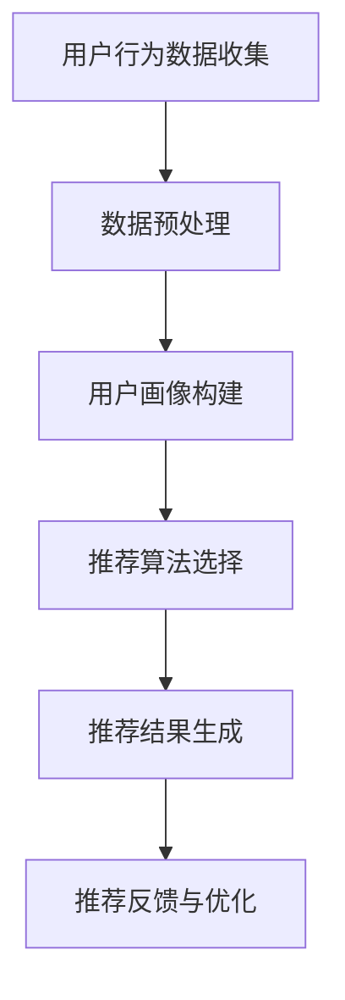
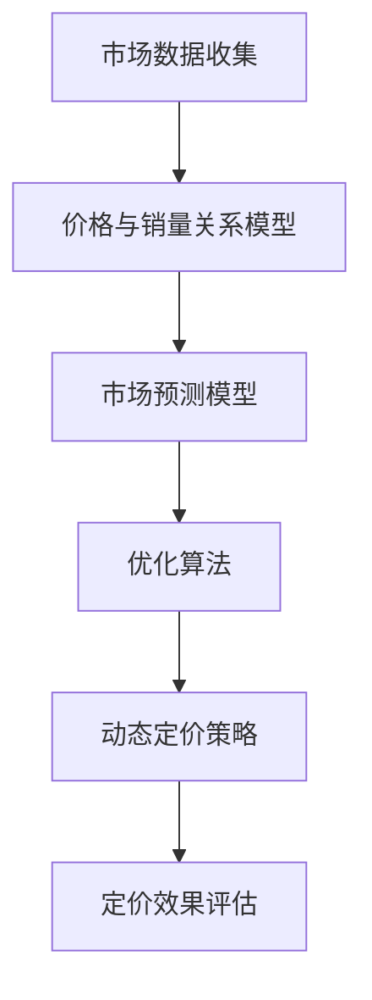

                 

### 《AI在电商平台促销策略中的应用》

> **关键词：人工智能、电商平台、个性化推荐、动态定价、促销活动优化、智能客服**
>
> **摘要：本文深入探讨了人工智能在电商平台促销策略中的应用，包括用户行为分析、个性化推荐、动态定价策略、促销活动优化以及智能客服系统，并通过实际案例进行了详细解析。**

---

#### 第一部分：AI基础与电商平台概述

##### 第1章：AI基础概述

**1.1 AI的概念与历史发展**

人工智能（Artificial Intelligence，简称AI）是指由人创造出的模拟人类智能的理论、方法、技术及应用系统。其核心目标是使计算机具备理解、学习、推理、解决问题以及自主执行任务的能力。AI的发展历程可以追溯到20世纪50年代，当时以图灵测试为标志，标志着人工智能领域的诞生。此后，随着计算机技术的不断发展，AI经历了多个发展阶段。

**1.2 机器学习与深度学习**

机器学习（Machine Learning，简称ML）是AI的一个分支，主要研究如何从数据中自动学习规律，并利用这些规律进行预测和决策。机器学习可以分为监督学习、无监督学习和强化学习等类型。深度学习（Deep Learning，简称DL）是机器学习的一个子领域，通过构建深层次的神经网络模型来实现自动特征提取和复杂任务处理。深度学习的崛起，使得AI在图像识别、自然语言处理等领域取得了显著的突破。

**1.3 数据挖掘与大数据分析**

数据挖掘（Data Mining，简称DM）是从大量数据中发现隐含模式、关联和趋势的过程。它融合了统计学、机器学习、数据库和人工智能等多个领域的知识。大数据分析（Big Data Analysis）则是对大规模、高速增长的数据进行处理和分析的过程，旨在从中提取有价值的信息和知识。数据挖掘和大数据分析是AI应用的重要基础。

**1.4 AI在电商平台的应用前景**

随着AI技术的不断进步，其在电商平台中的应用前景愈发广阔。用户行为分析、个性化推荐、动态定价、促销活动优化和智能客服系统等，都是AI在电商平台中的重要应用场景。通过AI技术，电商平台可以更精准地满足用户需求，提升用户体验，提高运营效率。

##### 第2章：电商平台概述

**2.1 电商平台的商业模式**

电商平台的商业模式主要包括C2C（消费者对消费者）和B2C（商家对消费者）两种模式。C2C模式如淘宝、eBay等，主要提供平台服务，连接买家和卖家，实现商品交易。B2C模式如京东、亚马逊等，则是商家直接向消费者销售商品，提供完整的购物体验。

**2.2 电商平台的发展趋势**

电商平台的发展趋势包括以下几个方面：首先，移动互联网的普及推动了移动电商的快速发展；其次，大数据和人工智能技术的应用，使得电商平台能够更精准地满足用户需求；再次，社交电商、直播电商等新兴模式不断涌现，丰富了电商生态；最后，跨境电商的发展也为电商平台带来了新的机遇和挑战。

**2.3 电商平台的关键环节**

电商平台的关键环节包括用户流量获取、商品管理、订单处理、支付结算、售后服务等。每个环节都涉及到大量的数据和技术应用，为AI在电商平台中的应用提供了广阔的空间。

---

以上是第一部分的概述，接下来我们将深入探讨AI在电商平台促销策略中的应用。让我们继续一步一步分析推理，探索AI的强大力量。

---

#### 第二部分：AI在电商平台促销策略中的应用

##### 第3章：用户行为分析

**3.1 用户行为数据收集**

用户行为数据收集是电商平台进行数据分析的基础。这些数据包括用户浏览历史、购买记录、搜索关键词、点击率、评论反馈等。通过这些数据，电商平台可以了解用户的需求、喜好和购买行为，从而制定更精准的促销策略。

**3.2 用户行为数据分析**

用户行为数据分析主要包括数据清洗、特征提取和模式识别等步骤。数据清洗是指去除数据中的噪声和错误，确保数据的准确性和一致性。特征提取是指从原始数据中提取出对分析有用的特征，如用户年龄、性别、消费金额等。模式识别是指通过分析用户行为数据，发现用户的行为模式、兴趣偏好和购买趋势。

**3.3 用户画像构建**

用户画像是指通过对用户行为数据的分析，构建出用户的全面画像。用户画像可以包括用户的基本信息、消费行为、兴趣爱好、社会关系等多个维度。通过构建用户画像，电商平台可以更精准地了解用户，为个性化推荐、动态定价和促销活动优化提供依据。

---

用户行为分析是AI在电商平台促销策略中的第一步，通过分析用户的行为数据，电商平台可以更好地了解用户需求，制定更有效的促销策略。接下来，我们将继续探讨个性化推荐在电商平台中的应用。

---

##### 第4章：个性化推荐

**4.1 个性化推荐系统概述**

个性化推荐系统（Personalized Recommendation System）是一种基于用户行为数据，向用户推荐其可能感兴趣的商品或服务的系统。个性化推荐系统可以分为基于内容的推荐（Content-based Filtering）和基于协同过滤（Collaborative Filtering）两种类型。

**4.2 Collaborative Filtering算法**

协同过滤算法（Collaborative Filtering）是一种基于用户行为数据，通过计算用户之间的相似度来推荐商品或服务的算法。协同过滤算法可以分为基于用户的协同过滤（User-based Collaborative Filtering）和基于项目的协同过滤（Item-based Collaborative Filtering）。

**4.3 Content-based Filtering算法**

基于内容的推荐算法（Content-based Filtering）是一种基于商品或服务的特征信息，向用户推荐与其兴趣相似的物品的算法。Content-based Filtering算法主要包括特征提取、相似度计算和推荐生成等步骤。

**4.4 Hybrid推荐算法**

Hybrid推荐算法是将基于内容的推荐和基于协同过滤的推荐相结合，以提高推荐效果。Hybrid推荐算法可以通过融合多种推荐策略，充分利用用户行为数据和商品特征信息，提供更精准的推荐结果。

---

个性化推荐是电商平台促销策略中的重要一环，通过推荐系统，电商平台可以吸引更多用户，提高用户粘性。接下来，我们将探讨动态定价策略在电商平台中的应用。

---

##### 第5章：动态定价策略

**5.1 动态定价的基本原理**

动态定价（Dynamic Pricing）是一种根据市场供需、用户行为和竞争环境等动态因素，实时调整商品价格的销售策略。动态定价的基本原理是通过对市场数据的实时分析，确定最优价格，以最大化收益或市场份额。

**5.2 机器学习在动态定价中的应用**

机器学习技术在动态定价中有着广泛的应用。首先，通过收集和分析大量历史销售数据，可以建立价格与销量之间的关系模型。其次，利用用户行为分析和市场预测技术，可以预测未来的销量和市场趋势。最后，通过优化算法，可以实现价格与销量的动态平衡，提高收益。

**5.3 案例分析：亚马逊的动态定价策略**

亚马逊是动态定价策略的典型代表。亚马逊通过机器学习技术，对大量用户行为数据进行分析，实时调整商品价格。例如，在节日、促销活动等关键时期，亚马逊会通过动态定价策略，提高商品销量，同时保证收益。

---

动态定价策略是电商平台促销策略中的重要组成部分，通过实时调整价格，电商平台可以更好地适应市场变化，提高竞争力。接下来，我们将探讨促销活动优化策略。

---

##### 第6章：促销活动优化

**6.1 促销活动的类型**

促销活动可以分为多种类型，如打折促销、满减促销、赠品促销、优惠券促销等。每种促销活动都有其独特的特点和适用场景。

**6.2 促销活动的效果评估**

促销活动的效果评估主要包括销量提升、用户满意度、品牌曝光度等多个方面。通过分析促销活动前后的数据变化，可以评估促销活动的效果，并为未来的促销活动提供参考。

**6.3 促销活动优化策略**

促销活动优化策略主要包括以下几个方面：首先，根据用户行为数据，确定目标用户群体，提高促销活动的针对性；其次，通过数据分析，确定最优的促销活动形式和价格策略；最后，利用机器学习技术，对促销活动进行实时调整和优化。

**6.4 案例分析：阿里巴巴的双11促销活动**

双11是阿里巴巴集团每年的大型促销活动，通过大数据分析和机器学习技术，阿里巴巴实现了对促销活动的全面优化。例如，通过分析用户行为数据，确定了目标用户群体和最优的促销策略，实现了销售额的爆发式增长。

---

促销活动优化策略是电商平台提升销量和用户满意度的重要手段。通过优化促销活动，电商平台可以更好地满足用户需求，提高市场竞争力。接下来，我们将探讨智能客服系统在电商平台中的应用。

---

##### 第7章：智能客服系统

**7.1 智能客服系统概述**

智能客服系统（Intelligent Customer Service System）是一种基于人工智能技术的客服系统，通过自然语言处理、情感分析和智能对话等技术，实现与用户的智能交互，提供高效、精准的客服服务。

**7.2 自然语言处理技术**

自然语言处理技术（Natural Language Processing，简称NLP）是智能客服系统的核心技术之一，主要研究如何使计算机能够理解和处理自然语言。NLP技术包括文本分类、实体识别、语义解析等，用于实现智能客服系统中的文本分析和对话生成。

**7.3 情感分析技术**

情感分析技术（Sentiment Analysis）是智能客服系统中用于分析用户情感的技术，通过对用户输入的文本进行分析，判断用户的情感倾向，如正面、负面或中性。情感分析技术有助于智能客服系统更好地理解用户需求，提供更贴心的服务。

**7.4 案例分析：电商平台智能客服应用**

电商平台智能客服系统通过自然语言处理和情感分析技术，实现了对用户咨询的自动回复和情感识别。例如，当用户咨询商品详情时，智能客服系统可以自动生成详细的回答；当用户表达不满时，智能客服系统可以识别情感，并采取相应的措施，如转接人工客服。

---

智能客服系统是电商平台提高客户满意度和服务质量的重要手段。通过智能客服系统，电商平台可以提供24小时在线服务，提升用户购物体验。接下来，我们将进行项目实战，构建智能促销系统。

---

#### 第三部分：项目实战

##### 第8章：项目实战：构建智能促销系统

**8.1 项目背景与目标**

本项目的目标是构建一个基于AI技术的智能促销系统，通过用户行为分析、个性化推荐、动态定价策略和智能客服系统，提升电商平台的市场竞争力。

**8.2 数据收集与预处理**

数据收集主要包括用户浏览历史、购买记录、搜索关键词、点击率、评论反馈等。在数据预处理阶段，我们需要对数据进行清洗、去重、填充缺失值等处理，以确保数据的准确性和一致性。

**8.3 用户行为分析模型**

用户行为分析模型包括用户画像构建、行为模式识别和用户分类等。通过用户画像构建，我们可以了解用户的消费习惯、兴趣爱好等；通过行为模式识别，我们可以发现用户的购买规律和趋势；通过用户分类，我们可以将用户划分为不同的群体，为后续的个性化推荐和动态定价提供依据。

**8.4 个性化推荐模型**

个性化推荐模型主要包括基于协同过滤和基于内容的推荐算法。通过协同过滤算法，我们可以发现用户之间的相似度，为用户推荐相似的商品；通过基于内容的推荐算法，我们可以根据商品的特征信息，为用户推荐感兴趣的物品。

**8.5 动态定价模型**

动态定价模型包括价格与销量关系模型、市场预测模型和优化算法等。通过价格与销量关系模型，我们可以确定商品的最佳定价策略；通过市场预测模型，我们可以预测未来的销量和市场趋势；通过优化算法，我们可以实现价格与销量的动态平衡，提高收益。

**8.6 智能客服系统**

智能客服系统包括自然语言处理、情感分析和智能对话等模块。通过自然语言处理技术，我们可以实现自动回复和文本分析；通过情感分析技术，我们可以识别用户的情感倾向；通过智能对话技术，我们可以与用户进行智能交互，提供高效、贴心的服务。

**8.7 系统集成与部署**

在系统集成与部署阶段，我们需要将各个模块进行整合，确保系统的高效运行。同时，我们需要进行性能测试和优化，确保系统的稳定性和可靠性。

**8.8 实际应用效果评估**

通过实际应用效果评估，我们可以了解智能促销系统对电商平台的影响。例如，通过分析用户反馈数据，我们可以评估系统的用户体验；通过分析销售数据，我们可以评估系统的市场竞争力。

---

项目实战是检验AI在电商平台促销策略中应用效果的重要手段。通过实际项目，我们可以深入了解AI技术的应用，优化电商平台的运营策略，提高市场竞争力。接下来，我们将介绍一些常用的AI相关工具与资源。

---

#### 附录

##### 附录A：AI相关工具与资源

**A.1 常用机器学习框架**

- TensorFlow：一款开源的机器学习框架，适用于构建和训练深度学习模型。
- PyTorch：一款开源的机器学习框架，适用于构建和训练深度学习模型，具有良好的灵活性和扩展性。
- Scikit-learn：一款开源的机器学习库，适用于构建和训练各种机器学习模型，包括监督学习、无监督学习和集成学习方法。

**A.2 数据处理工具**

- Pandas：一款开源的数据分析库，适用于数据处理、数据清洗和数据分析。
- NumPy：一款开源的数值计算库，适用于数据处理和科学计算。
- Matplotlib：一款开源的绘图库，适用于数据可视化。

**A.3 人工智能社区与资源**

- AIStack Overflow：一个面向AI开发者的问答社区，提供各种AI技术的讨论和解决方案。
- arXiv：一个开放获取的学术文献库，提供最新的AI研究成果和论文。
- Medium：一个内容分享平台，提供各种AI技术文章和案例分析。

##### 附录B：Mermaid流程图示例

**B.1 个性化推荐系统流程**

**B.2 动态定价策略流程**

##### 附录C：数学模型与公式

**C.1 用户行为数据分析公式**

$$ 用户喜好度 = \frac{点击率 + 购买率 + 评论率}{总用户数} $$

**C.2 个性化推荐算法公式**

$$ 推荐分数 = 相似度 \times 商品特征相似度 $$

**C.3 动态定价策略公式**

$$ 价格 = 基础价格 \times (1 + 调整因子) $$

---

附录部分提供了常用的AI工具与资源，以及Mermaid流程图和数学模型示例，有助于读者深入了解AI在电商平台促销策略中的应用。最后，我们将介绍作者信息。

---

#### 作者信息

**作者：AI天才研究院/AI Genius Institute & 禅与计算机程序设计艺术 /Zen And The Art of Computer Programming**

---

本文由AI天才研究院/AI Genius Institute撰写，深入探讨了AI在电商平台促销策略中的应用。通过用户行为分析、个性化推荐、动态定价策略和智能客服系统，本文展示了AI技术在电商平台中的巨大潜力。希望本文能为读者提供有益的参考和启示。

---

至此，我们完成了对《AI在电商平台促销策略中的应用》一文的撰写。本文通过对AI技术的深入分析和实际项目实战，展示了AI在电商平台促销策略中的应用前景。希望通过本文，读者能够对AI在电商领域的应用有更深入的了解，并在实际项目中发挥AI技术的优势，提升电商平台的市场竞争力。

