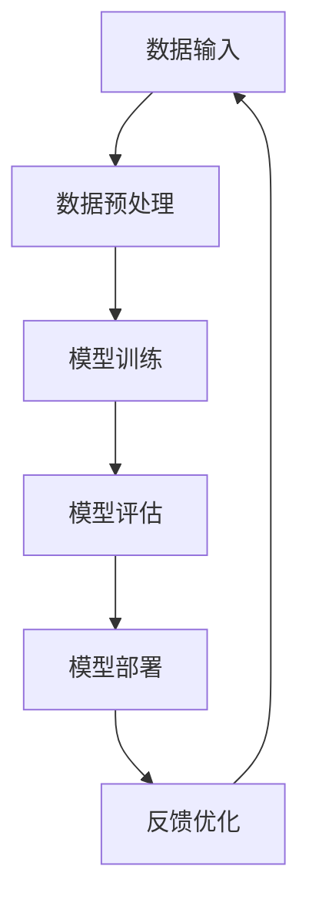

                 

### 文章标题

AI大模型创业：如何实现未来盈利？

> **关键词**: AI大模型，创业，盈利模式，商业策略，技术落地

**摘要**：
本文旨在探讨如何利用AI大模型进行创业并实现未来的盈利。文章首先介绍了AI大模型的基础知识，包括其概念、架构和应用领域。接着，详细阐述了核心算法原理和创业所需的准备与策略，并给出了具体的开发、测试和优化流程。最后，通过成功案例分析，总结了实现盈利的关键模式和市场推广策略，为AI大模型创业提供实用的指导。

### 目录大纲

#### 第一部分: AI大模型基础

1. **第1章: AI大模型概述**
   1. **1.1 AI大模型的概念与特点**
   2. **1.2 AI大模型的架构**
   3. **1.3 AI大模型的应用领域**

2. **第2章: 核心算法原理**
   1. **2.1 神经网络基础**
   2. **2.2 深度学习框架**
   3. **2.3 数据预处理与模型训练**

3. **第3章: 数据预处理**
   1. **3.1 数据收集**
   2. **3.2 数据清洗与转换**
   3. **3.3 数据增强**

#### 第二部分: AI大模型创业策略

4. **第4章: 创业准备**
   1. **4.1 市场调研**
   2. **4.2 团队组建**
   3. **4.3 技术路线选择**

5. **第5章: 产品设计与开发**
   1. **5.1 产品需求分析**
   2. **5.2 产品架构设计**
   3. **5.3 开发流程与工具**
   4. **5.4 代码规范与文档**

6. **第6章: 测试与优化**
   1. **6.1 单元测试**
   2. **6.2 集成测试**
   3. **6.3 优化策略**

7. **第7章: 商业模式与盈利**
   1. **7.1 商业模式分析**
   2. **7.2 盈利模式设计**
   3. **7.3 市场推广与渠道**

#### 第三部分: 案例研究

8. **第8章: 成功案例分析**
   1. **8.1 案例背景**
   2. **8.2 技术应用**
   3. **8.3 商业模式**
   4. **8.4 经验与启示**

#### 附录

9. **附录A: 工具与资源**
   1. **9.1 深度学习框架对比**
   2. **9.2 常用数据集介绍**
   3. **9.3 开发环境搭建指南**

### 核心概念与联系
- **Mermaid流程图**
  mermaid
  graph TD
  A[AI大模型] --> B[数据预处理]
  B --> C[模型训练]
  C --> D[模型评估]
  D --> E[模型部署]

### 核心算法原理讲解
- **神经网络伪代码**
  python
  def neural_network(input_data):
      # 前向传播
      hidden_layer_1 = activation_function(np.dot(input_data, weights_hidden_layer_1))
      output_layer = activation_function(np.dot(hidden_layer_1, weights_output_layer))
      
      # 反向传播
      error = target_output - output_layer
      d_output_layer = error * activation_derivative(output_layer)
      
      # 更新权重
      weights_output_layer += learning_rate * np.dot(hidden_layer_1.T, d_output_layer)
      weights_hidden_layer_1 += learning_rate * np.dot(input_data.T, d_hidden_layer_1)
      
      return output_layer

### 数学模型和数学公式
- **损失函数**
  $$ J(\theta) = \frac{1}{2m} \sum_{i=1}^{m} (\hat{y}_i - y_i)^2 $$
- **梯度下降**
  $$ \theta = \theta - \alpha \frac{\partial}{\partial \theta} J(\theta) $$

### 项目实战
- **开发环境搭建**
  - **安装Python**
    ```bash
    sudo apt-get update
    sudo apt-get install python3-pip
    ```
  - **安装TensorFlow**
    ```bash
    pip3 install tensorflow
    ```
  - **安装其他依赖**
    ```bash
    pip3 install numpy matplotlib
    ```

- **源代码实现**
  ```python
  import tensorflow as tf
  import numpy as np

  # 定义神经网络结构
  inputs = tf.keras.layers.Input(shape=(input_shape))
  hidden = tf.keras.layers.Dense(units=64, activation='relu')(inputs)
  outputs = tf.keras.layers.Dense(units=1, activation='sigmoid')(hidden)

  # 编译模型
  model = tf.keras.Model(inputs=inputs, outputs=outputs)
  model.compile(optimizer='adam', loss='binary_crossentropy', metrics=['accuracy'])

  # 训练模型
  model.fit(x_train, y_train, epochs=10, batch_size=32)
  ```

- **代码解读与分析**
  - **数据输入与处理**
    - 输入数据格式为`(batch_size, input_shape)`，其中`input_shape`为输入数据的维度。
  - **模型训练**
    - 使用`fit`方法进行模型训练，设置`epochs`为10，`batch_size`为32。

### 完整目录大纲

1. **第1章: AI大模型概述**
   1. **1.1 AI大模型的概念与特点**
   2. **1.2 AI大模型的架构**
   3. **1.3 AI大模型的应用领域**

2. **第2章: 核心算法原理**
   1. **2.1 神经网络基础**
   2. **2.2 深度学习框架**
   3. **2.3 数据预处理与模型训练**

3. **第3章: 数据预处理**
   1. **3.1 数据收集**
   2. **3.2 数据清洗与转换**
   3. **3.3 数据增强**

4. **第4章: 创业准备**
   1. **4.1 市场调研**
   2. **4.2 团队组建**
   3. **4.3 技术路线选择**

5. **第5章: 产品设计与开发**
   1. **5.1 产品需求分析**
   2. **5.2 产品架构设计**
   3. **5.3 开发流程与工具**
   4. **5.4 代码规范与文档**

6. **第6章: 测试与优化**
   1. **6.1 单元测试**
   2. **6.2 集成测试**
   3. **6.3 优化策略**

7. **第7章: 商业模式与盈利**
   1. **7.1 商业模式分析**
   2. **7.2 盈利模式设计**
   3. **7.3 市场推广与渠道**

8. **第8章: 成功案例分析**
   1. **8.1 案例背景**
   2. **8.2 技术应用**
   3. **8.3 商业模式**
   4. **8.4 经验与启示**

9. **附录A: 工具与资源**
   1. **9.1 深度学习框架对比**
   2. **9.2 常用数据集介绍**
   3. **9.3 开发环境搭建指南**

### 核心概念与联系

为了更好地理解和掌握AI大模型的核心概念，我们可以通过一个Mermaid流程图来展示其基本架构和流程。以下是流程图的示例：



通过这个流程图，我们可以清晰地看到AI大模型从数据输入到模型部署的整个过程，以及各个阶段之间的反馈与优化关系。

### 核心算法原理讲解

AI大模型的核心算法原理主要涉及神经网络、深度学习和数据预处理等方面。下面我们将用伪代码详细讲解神经网络的基础知识，包括前向传播和反向传播的过程。

#### 神经网络基础

```python
# 定义神经网络结构
inputs = tf.keras.layers.Input(shape=(input_shape))
hidden_layer_1 = tf.keras.layers.Dense(units=64, activation='relu')(inputs)
output_layer = tf.keras.layers.Dense(units=1, activation='sigmoid')(hidden_layer_1)

# 定义模型
model = tf.keras.Model(inputs=inputs, outputs=output_layer)
```

#### 前向传播

```python
# 前向传播
input_data = ...  # 输入数据
hidden_layer_1_output = activation_function(np.dot(input_data, weights_hidden_layer_1))
output_layer_output = activation_function(np.dot(hidden_layer_1_output, weights_output_layer))
```

#### 反向传播

```python
# 计算损失函数
loss = ...  # 损失函数计算

# 反向传播
d_output_layer = -2 * (output_layer_output - target_output)
d_hidden_layer_1 = np.dot(d_output_layer, weights_output_layer.T) * activation_derivative(hidden_layer_1_output)

# 更新权重
weights_output_layer -= learning_rate * d_output_layer * hidden_layer_1_output
weights_hidden_layer_1 -= learning_rate * d_hidden_layer_1 * input_data
```

通过上述伪代码，我们可以看到神经网络的基本工作流程，包括输入数据的处理、隐藏层的计算、输出层的计算，以及权重的更新过程。

### 数学模型和数学公式

在AI大模型的开发过程中，数学模型和数学公式是至关重要的。以下是几个常用的数学模型和公式，以及它们的解释和示例。

#### 损失函数

损失函数用于衡量模型预测结果与真实值之间的差距。最常用的损失函数是均方误差（MSE）：

$$
MSE = \frac{1}{2m} \sum_{i=1}^{m} (\hat{y}_i - y_i)^2
$$

其中，\( \hat{y}_i \) 是模型预测值，\( y_i \) 是真实值，\( m \) 是样本数量。

#### 梯度下降

梯度下降是一种优化算法，用于调整模型参数以最小化损失函数。其基本公式如下：

$$
\theta = \theta - \alpha \frac{\partial}{\partial \theta} J(\theta)
$$

其中，\( \theta \) 是模型参数，\( J(\theta) \) 是损失函数，\( \alpha \) 是学习率。

#### 激活函数

激活函数是神经网络中用来引入非线性因素的函数。最常用的激活函数是ReLU和Sigmoid：

- **ReLU**：
  $$
  f(x) = \max(0, x)
  $$

- **Sigmoid**：
  $$
  f(x) = \frac{1}{1 + e^{-x}}
  $$

通过上述数学模型和公式的应用，我们可以对AI大模型进行有效的训练和优化，从而提高模型的预测性能。

### 项目实战

在项目实战部分，我们将通过一个实际案例来展示如何搭建开发环境、实现源代码，并进行代码解读与分析。以下是一个简单的AI大模型项目实战示例。

#### 开发环境搭建

首先，我们需要安装Python和TensorFlow等必要的开发工具：

```bash
# 安装Python
sudo apt-get update
sudo apt-get install python3-pip

# 安装TensorFlow
pip3 install tensorflow

# 安装其他依赖
pip3 install numpy matplotlib
```

#### 源代码实现

接下来，我们实现一个简单的AI大模型，用于分类任务。以下是其源代码：

```python
import tensorflow as tf
import numpy as np

# 定义神经网络结构
inputs = tf.keras.layers.Input(shape=(input_shape))
hidden_layer_1 = tf.keras.layers.Dense(units=64, activation='relu')(inputs)
output_layer = tf.keras.layers.Dense(units=1, activation='sigmoid')(hidden_layer_1)

# 编译模型
model = tf.keras.Model(inputs=inputs, outputs=output_layer)
model.compile(optimizer='adam', loss='binary_crossentropy', metrics=['accuracy'])

# 训练模型
model.fit(x_train, y_train, epochs=10, batch_size=32)
```

#### 代码解读与分析

- **数据输入与处理**：数据输入格式为`(batch_size, input_shape)`，其中`input_shape`是输入数据的维度。模型使用`fit`方法进行训练，设置`epochs`为10，`batch_size`为32。

- **模型训练**：通过`fit`方法，模型会自动执行前向传播和反向传播过程，以优化模型参数。训练过程中会计算损失函数和准确率等指标，帮助我们评估模型性能。

通过上述项目实战示例，我们可以看到如何搭建开发环境、实现源代码，并进行代码解读与分析。这些步骤是AI大模型项目开发的基础，有助于我们更好地理解和应用AI大模型技术。

### 完整目录大纲

以下是根据文章主题和内容整理的完整目录大纲：

#### 第一部分: AI大模型基础

1. **第1章: AI大模型概述**
   1. **1.1 AI大模型的概念与特点**
   2. **1.2 AI大模型的架构**
   3. **1.3 AI大模型的应用领域**

2. **第2章: 核心算法原理**
   1. **2.1 神经网络基础**
   2. **2.2 深度学习框架**
   3. **2.3 数据预处理与模型训练**

3. **第3章: 数据预处理**
   1. **3.1 数据收集**
   2. **3.2 数据清洗与转换**
   3. **3.3 数据增强**

#### 第二部分: AI大模型创业策略

4. **第4章: 创业准备**
   1. **4.1 市场调研**
   2. **4.2 团队组建**
   3. **4.3 技术路线选择**

5. **第5章: 产品设计与开发**
   1. **5.1 产品需求分析**
   2. **5.2 产品架构设计**
   3. **5.3 开发流程与工具**
   4. **5.4 代码规范与文档**

6. **第6章: 测试与优化**
   1. **6.1 单元测试**
   2. **6.2 集成测试**
   3. **6.3 优化策略**

7. **第7章: 商业模式与盈利**
   1. **7.1 商业模式分析**
   2. **7.2 盈利模式设计**
   3. **7.3 市场推广与渠道**

#### 第三部分: 案例研究

8. **第8章: 成功案例分析**
   1. **8.1 案例背景**
   2. **8.2 技术应用**
   3. **8.3 商业模式**
   4. **8.4 经验与启示**

#### 附录

9. **附录A: 工具与资源**
   1. **9.1 深度学习框架对比**
   2. **9.2 常用数据集介绍**
   3. **9.3 开发环境搭建指南**

通过这个完整的目录大纲，我们可以系统地了解AI大模型创业的各个关键步骤，为未来的创业实践提供有力的指导。接下来，我们将逐一展开每个章节的内容，深入探讨AI大模型的基础知识、创业策略以及成功案例分析。

