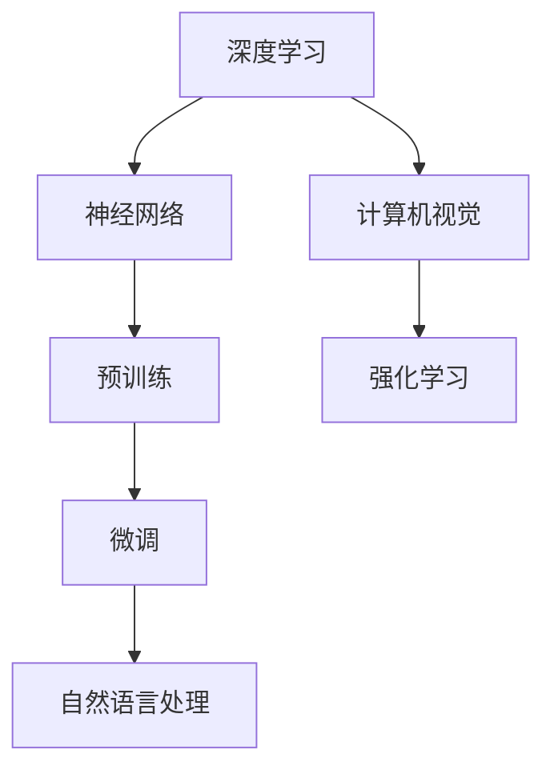
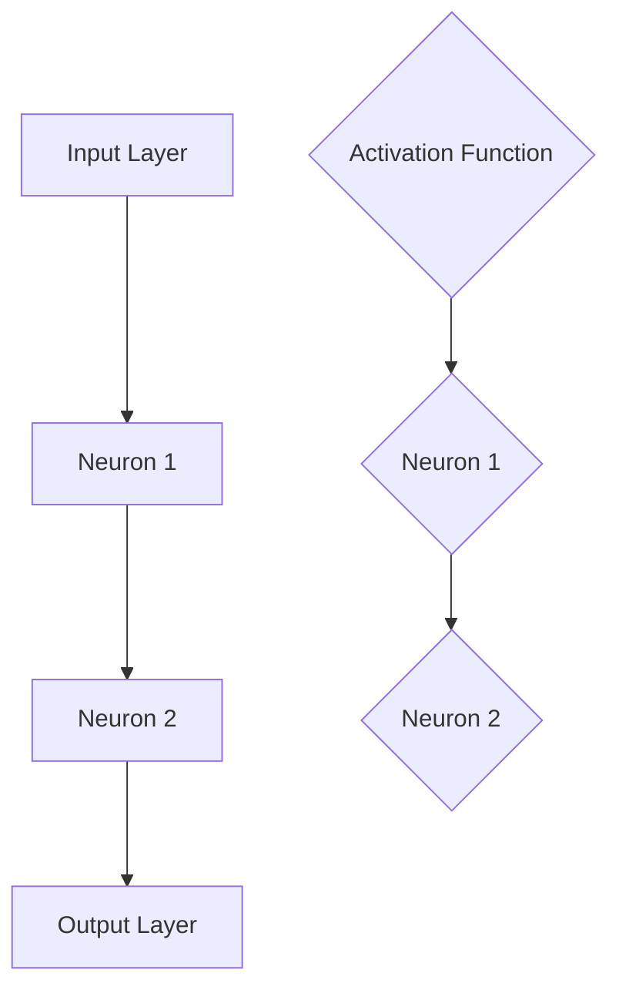

                 

### 文章标题

在当今数字化时代，AI大模型技术已经成为推动行业创新和变革的重要引擎。随着深度学习和大数据分析的迅猛发展，AI大模型在自然语言处理、计算机视觉、推荐系统等领域的应用日益广泛。然而，AI大模型创业并非易事，面临着技术、市场和伦理等多方面的挑战。本文将围绕AI大模型创业，通过一系列的逻辑分析，探讨如何应对未来市场的挑战，为创业者提供有益的指导。

### 关键词

- AI大模型
- 创业
- 市场挑战
- 技术应用
- 伦理问题
- 未来展望

### 摘要

本文旨在深入探讨AI大模型创业的现状与挑战，分析核心算法原理、数学模型、应用实战以及开发环境搭建。通过详细的案例分析，我们揭示了AI大模型在现实应用中的技术实现和优化策略。同时，本文还从技术、市场和伦理三个方面展望了AI大模型的发展趋势，为创业者提供了具有前瞻性的思考和建议。无论您是AI领域的专业人士还是创业者，本文都将为您揭示AI大模型创业的机遇与挑战，助力您在未来的市场竞争中脱颖而出。

---

## 第1章 AI大模型概述

### 1.1 什么是AI大模型

#### 概念介绍

AI大模型（Large-scale Artificial Intelligence Models），是指那些规模庞大、参数数量极为丰富的机器学习模型。这些模型通过训练海量数据，学习到复杂的模式和知识，从而在多种AI任务中表现出色。不同于传统的简单模型，AI大模型具有更高的灵活性和强大的泛化能力。

- **定义和概述**：AI大模型是指那些规模达到数百万至数十亿参数的深度学习模型。它们能够处理大规模的数据集，并通过多层神经网络结构进行学习。
- **与传统AI的区别**：传统的AI模型，如逻辑回归、决策树等，规模相对较小，只能解决特定领域的问题。而AI大模型通过深度学习技术，能够处理更复杂的任务，如自然语言处理、计算机视觉等。
- **现状与趋势**：随着计算能力的提升和大数据技术的发展，AI大模型的应用日益广泛。从谷歌的BERT、OpenAI的GPT系列到微软的Turing模型，AI大模型已经成为推动人工智能研究的重要力量。

#### 原理与架构

AI大模型的构建基于深度学习技术，尤其是神经网络。以下是一些核心概念和架构：

- **深度学习基础**：深度学习是一种模拟人脑神经元连接结构的机器学习技术。通过多层神经网络，深度学习模型可以自动提取数据的特征。
- **神经网络架构**：AI大模型通常包含多层神经网络结构，包括卷积神经网络（CNN）、循环神经网络（RNN）和变换器网络（Transformer）等。
  - **卷积神经网络（CNN）**：用于处理图像数据，通过卷积操作提取图像特征。
  - **循环神经网络（RNN）**：用于处理序列数据，如文本和语音，通过循环结构保持长期的依赖关系。
  - **变换器网络（Transformer）**：一种基于自注意力机制的神经网络架构，广泛应用于自然语言处理任务，如机器翻译和文本分类。
- **预训练与微调**：AI大模型通常采用预训练与微调的策略。首先在大量的数据上进行预训练，然后根据具体任务进行微调，以适应不同的应用场景。

#### 技术应用

AI大模型在多个领域展现了强大的应用潜力：

- **自然语言处理**：AI大模型在自然语言处理任务中取得了显著成果，如文本分类、机器翻译和问答系统。通过预训练模型，如BERT和GPT，AI大模型能够理解复杂的语言结构和语义信息。
- **计算机视觉**：AI大模型在计算机视觉领域也取得了突破性进展，如图像分类、目标检测和图像生成。通过卷积神经网络和变换器网络，AI大模型能够识别图像中的复杂模式。
- **强化学习**：AI大模型在强化学习任务中也有重要应用，如游戏对战、自动驾驶和推荐系统。通过深度神经网络，AI大模型能够学习到复杂的策略，实现高效决策。

#### 未来展望

随着AI大模型的不断发展，其在各个领域的应用前景十分广阔：

- **AI大模型的挑战与机遇**：尽管AI大模型在性能上表现出色，但其训练和部署仍面临资源需求和计算成本等问题。未来，随着计算能力的提升和算法优化，AI大模型将在更多领域发挥作用。
- **行业应用前景**：从医疗保健、金融科技到制造业，AI大模型的应用将不断拓展，为各个行业带来革命性的变革。例如，在医疗领域，AI大模型可以用于疾病诊断和个性化治疗；在金融领域，AI大模型可以用于风险管理和社会治理。

### 1.2 AI大模型的发展历程

AI大模型的发展历程可以分为以下几个阶段：

- **早期探索**：20世纪80年代至90年代，深度学习作为一种理论开始萌芽。当时的研究主要集中在简单网络结构，如感知机和多层感知机。
- **2006年的突破**：2006年，Geoffrey Hinton等研究者提出了深度信念网络（DBN），为深度学习的发展奠定了基础。
- **2012年的重要进展**：2012年，Alex Krizhevsky等研究者使用深度卷积神经网络（CNN）在ImageNet竞赛中取得了突破性成果，深度学习开始进入公众视野。
- **近年来的迅速发展**：随着计算能力和数据量的提升，AI大模型在自然语言处理、计算机视觉、语音识别等领域取得了显著进展。例如，谷歌的BERT、OpenAI的GPT系列模型在多个任务上刷新了记录。

### 1.3 AI大模型的优势与挑战

#### 优势

- **强大的表现力**：AI大模型能够处理复杂的数据和任务，具备出色的表现力。
- **高效的泛化能力**：通过预训练和微调，AI大模型能够在不同的任务和领域表现出色，具备高效的泛化能力。
- **广泛的应用前景**：AI大模型在自然语言处理、计算机视觉、强化学习等领域展现了广泛的应用前景。

#### 挑战

- **计算资源需求**：AI大模型通常需要大量的计算资源进行训练，这对硬件设备提出了更高的要求。
- **数据质量与多样性**：AI大模型在训练过程中对数据质量有很高的要求，数据集的多样性和准确性直接影响模型的性能。
- **算法优化与调优**：AI大模型的设计和优化需要丰富的经验和技术积累，算法的优化与调优是一个复杂的过程。

### 1.4 AI大模型在现实世界中的应用

AI大模型在现实世界中得到了广泛应用，以下是一些典型的应用案例：

- **医疗诊断**：AI大模型可以用于疾病诊断和预测，如通过分析医学影像数据，辅助医生进行诊断。
- **金融风控**：AI大模型可以用于信用评分和风险预测，帮助金融机构进行风险管理。
- **自动驾驶**：AI大模型可以用于自动驾驶系统的感知和决策，提高车辆的安全性和可靠性。
- **智能家居**：AI大模型可以用于智能家居设备的智能交互，提升用户的生活体验。

#### 总结

AI大模型作为一种先进的人工智能技术，在自然语言处理、计算机视觉、强化学习等领域展现了强大的潜力。尽管面临计算资源、数据质量和算法优化等挑战，但随着技术的不断进步和应用场景的拓展，AI大模型将在未来发挥更加重要的作用。

---

**核心概念与联系：**

AI大模型的核心概念包括深度学习、神经网络、预训练、微调和自然语言处理等。以下是这些概念之间关系的 Mermaid 流程图：



**图1-1：AI大模型的核心概念与联系流程图**

通过这个流程图，我们可以清晰地看到AI大模型各个组成部分之间的关系，以及它们在不同领域中的应用。

---

**核心算法原理讲解：**

**神经网络基础**

神经网络（Neural Network，NN）是深度学习的基础。以下是神经网络的基本结构及其核心算法原理：

**基本结构**

神经网络由多个层次组成，包括输入层、隐藏层和输出层。每一层由多个神经元（或节点）组成。神经元之间的连接通过权重（weights）来表示，而每个神经元的激活函数（activation function）则决定了神经元的输出。



**神经元**

神经元是神经网络的基本单元，其功能类似于人脑中的神经元。每个神经元接收来自前一层神经元的输入信号，通过加权求和处理，再通过激活函数产生输出信号。

**激活函数**

激活函数是神经网络中的一个关键组件，用于引入非线性特性。常见的激活函数包括sigmoid函数、ReLU函数和Tanh函数等。

- **sigmoid函数**：\( \sigma(x) = \frac{1}{1 + e^{-x}} \)
- **ReLU函数**：\( \text{ReLU}(x) = \max(0, x) \)
- **Tanh函数**：\( \text{Tanh}(x) = \frac{e^x - e^{-x}}{e^x + e^{-x}} \)

**权重更新算法**

在训练神经网络时，需要不断调整权重和偏置，以最小化损失函数。以下是常见的权重更新算法：

- **随机梯度下降（SGD）**：\( \Delta W = -\eta \frac{\partial J}{\partial W} \)
- **Adam优化器**：结合了SGD和AdaGrad的优点，具有自适应学习率。

**常见神经网络架构**

神经网络有多种不同的架构，包括卷积神经网络（CNN）、循环神经网络（RNN）和变换器网络（Transformer）等。以下是这些架构的基本原理：

- **卷积神经网络（CNN）**：用于处理图像数据，通过卷积操作提取图像特征。
- **循环神经网络（RNN）**：用于处理序列数据，如文本和语音，通过循环结构保持长期的依赖关系。
- **变换器网络（Transformer）**：一种基于自注意力机制的神经网络架构，广泛应用于自然语言处理任务。

**代码实现示例**

以下是一个简单的神经网络模型实现，使用Python和PyTorch框架：

```python
import torch
import torch.nn as nn
import torch.optim as optim

# 神经网络结构
class NeuralNetwork(nn.Module):
    def __init__(self):
        super(NeuralNetwork, self).__init__()
        self.layer1 = nn.Linear(in_features=10, out_features=50)
        self.relu = nn.ReLU()
        self.layer2 = nn.Linear(in_features=50, out_features=10)
        
    def forward(self, x):
        x = self.layer1(x)
        x = self.relu(x)
        x = self.layer2(x)
        return x

# 实例化神经网络模型
model = NeuralNetwork()

# 损失函数和优化器
criterion = nn.CrossEntropyLoss()
optimizer = optim.Adam(model.parameters(), lr=0.001)

# 训练模型
for epoch in range(100):
    for inputs, targets in data_loader:
        optimizer.zero_grad()
        outputs = model(inputs)
        loss = criterion(outputs, targets)
        loss.backward()
        optimizer.step()
    print(f'Epoch [{epoch+1}/100], Loss: {loss.item()}')

# 评估模型
with torch.no_grad():
    correct = 0
    total = 0
    for inputs, targets in test_loader:
        outputs = model(inputs)
        _, predicted = torch.max(outputs.data, 1)
        total += targets.size(0)
        correct += (predicted == targets).sum().item()
    print(f'Accuracy: {100 * correct / total}%')
```

通过以上代码，我们实现了使用PyTorch框架构建和训练一个简单的神经网络模型。这只是一个基本示例，实际的神经网络模型会更加复杂，涉及到更详细的实现和优化。

---

在AI大模型的应用中，数学模型和公式扮演着至关重要的角色。以下是几个核心的数学模型和公式的详细讲解与举例说明。

### 3.1 概率论基础

#### 贝叶斯定理

贝叶斯定理是概率论中的一个重要工具，用于计算后验概率。其公式如下：

\[ P(A|B) = \frac{P(B|A) \cdot P(A)}{P(B)} \]

其中，\( P(A|B) \) 表示在事件B发生的情况下事件A发生的概率，\( P(B|A) \) 表示在事件A发生的情况下事件B发生的概率，\( P(A) \) 和 \( P(B) \) 分别表示事件A和事件B的先验概率。

**公式介绍**

贝叶斯定理描述了如何通过已知的条件概率和先验概率来计算后验概率。它不仅在统计推断中应用广泛，也在机器学习和数据科学中有着重要的应用。

**实例解析**

假设我们要判断一个邮件是否为垃圾邮件，已知垃圾邮件的概率为0.1，且垃圾邮件中包含特定关键词的概率为0.9，非垃圾邮件中包含特定关键词的概率为0.05。如果我们发现一封邮件包含特定关键词，可以使用贝叶斯定理计算这封邮件是垃圾邮件的概率。

\[ P(\text{垃圾邮件}|\text{关键词}) = \frac{P(\text{关键词}|\text{垃圾邮件}) \cdot P(\text{垃圾邮件})}{P(\text{关键词})} \]

\[ P(\text{关键词}) = P(\text{关键词}|\text{垃圾邮件}) \cdot P(\text{垃圾邮件}) + P(\text{关键词}|\text{非垃圾邮件}) \cdot P(\text{非垃圾邮件}) \]

\[ P(\text{垃圾邮件}|\text{关键词}) = \frac{0.9 \cdot 0.1}{0.9 \cdot 0.1 + 0.05 \cdot 0.9} = \frac{0.09}{0.14} \approx 0.643 \]

因此，这封邮件是垃圾邮件的概率约为64.3%。

### 3.2 信息论

#### 熵

熵（Entropy）是信息论中的一个重要概念，用于度量信息的不确定性。其公式如下：

\[ H(X) = -\sum_{i} p(x_i) \cdot \log_2 p(x_i) \]

其中，\( H(X) \) 表示随机变量X的熵，\( p(x_i) \) 表示随机变量X取值为\( x_i \)的概率，\( \log_2 \) 表示以2为底的对数。

**公式介绍**

熵是对一个随机变量所有可能取值的概率分布进行量化的度量，它反映了信息的不确定性。熵值越高，表示信息的不确定性越大。

**实例说明**

假设一个随机变量X有两个可能的取值，0和1，其中取值为0的概率为0.75，取值为1的概率为0.25。我们可以计算X的熵：

\[ H(X) = -0.75 \cdot \log_2 0.75 - 0.25 \cdot \log_2 0.25 \]

\[ H(X) = -0.75 \cdot (-0.415) - 0.25 \cdot (-1.386) \]

\[ H(X) = 0.30875 + 0.3455 \]

\[ H(X) \approx 0.65425 \]

因此，这个随机变量X的熵约为0.65425，表示其信息的不确定性较高。

### 3.3 互信息

互信息（Mutual Information，MI）是另一个重要的信息论概念，用于度量两个随机变量之间的相关性。其公式如下：

\[ I(X; Y) = H(X) - H(X | Y) \]

其中，\( I(X; Y) \) 表示随机变量X和Y的互信息，\( H(X) \) 表示X的熵，\( H(X | Y) \) 表示在随机变量Y已知的条件下，X的熵。

**公式介绍**

互信息度量了随机变量X和Y之间的相关性，它反映了X和Y联合出现的概率与各自单独出现的概率之差。互信息值越大，表示两个变量之间的相关性越强。

**实例说明**

假设随机变量X和Y分别表示邮件是否为垃圾邮件和邮件中是否包含特定关键词，已知它们的联合概率分布如下：

| X | Y | P(X, Y) |
|---|---|---------|
| 0 | 0 | 0.625   |
| 0 | 1 | 0.125   |
| 1 | 0 | 0.125   |
| 1 | 1 | 0.125   |

我们可以计算X和Y的互信息：

\[ H(X) = -0.625 \cdot \log_2 0.625 - 0.125 \cdot \log_2 0.125 \]

\[ H(X) \approx 0.65425 \]

\[ H(Y | X) = \sum_{i} p(y_i | x_i) \cdot \log_2 p(y_i | x_i) \]

\[ H(Y | X) = -0.625 \cdot \log_2 0.625 - 0.125 \cdot \log_2 0.125 \]

\[ H(Y | X) \approx 0.65425 \]

\[ I(X; Y) = H(X) - H(X | Y) = 0.65425 - 0.65425 = 0 \]

因此，X和Y的互信息为0，表示它们之间没有相关性。

### 3.4 Kullback-Leibler散度

Kullback-Leibler散度（Kullback-Leibler Divergence，KL散度）是另一个度量两个概率分布之间差异的指标。其公式如下：

\[ DKL(P || Q) = \sum_{i} p(x_i) \cdot \log_2 \left( \frac{p(x_i)}{q(x_i)} \right) \]

其中，\( DKL(P || Q) \) 表示分布P相对于分布Q的KL散度，\( p(x_i) \) 和 \( q(x_i) \) 分别表示分布P和分布Q在\( x_i \)上的概率。

**公式介绍**

KL散度度量了两个概率分布之间的差异，其值越大表示两个分布之间的差异越大。KL散度在概率论、信息论和统计学习中有广泛的应用。

**实例说明**

假设有两个概率分布P和Q，它们的概率分布如下：

| X | P(X) | Q(X) |
|---|------|------|
| 0 | 0.6  | 0.4  |
| 1 | 0.4  | 0.6  |

我们可以计算KL散度：

\[ DKL(P || Q) = 0.6 \cdot \log_2 \left( \frac{0.6}{0.4} \right) + 0.4 \cdot \log_2 \left( \frac{0.4}{0.6} \right) \]

\[ DKL(P || Q) = 0.6 \cdot \log_2 (1.5) + 0.4 \cdot \log_2 (0.67) \]

\[ DKL(P || Q) \approx 0.6 \cdot 0.585 + 0.4 \cdot (-0.415) \]

\[ DKL(P || Q) \approx 0.351 - 0.166 \]

\[ DKL(P || Q) \approx 0.185 \]

因此，分布P相对于分布Q的KL散度为0.185。

通过以上实例，我们可以看到数学模型和公式在AI大模型中的应用。这些模型和公式不仅帮助我们理解和分析数据，也为模型训练和优化提供了重要的理论支持。

### 3.5 权重更新公式

在神经网络训练过程中，权重更新公式是核心环节之一。以下是一个基本的权重更新公式及其应用实例：

\[ \Delta W = -\eta \frac{\partial J}{\partial W} \]

其中，\( \Delta W \) 表示权重更新量，\( \eta \) 表示学习率，\( \frac{\partial J}{\partial W} \) 表示损失函数J对权重W的梯度。

**实例说明**

假设一个简单的神经网络模型，包含一个输入层、一个隐藏层和一个输出层。损失函数为均方误差（MSE），学习率为0.01。以下是权重更新的具体计算过程：

1. **初始化权重**：假设初始权重为\( W = [1, 2, 3] \)，损失函数为\( J = (y - \sigma(z))^2 \)，其中\( \sigma(z) \)是Sigmoid激活函数。
2. **前向传播**：输入一个样本\( x = [0.5, 0.6] \)，计算输出\( z = \sigma(W^T \cdot x + b) \)，其中\( b \)是偏置项。
3. **计算损失**：计算损失函数J。
4. **反向传播**：计算损失函数J对权重W的梯度。
5. **权重更新**：使用权重更新公式更新权重。

具体代码实现如下：

```python
import numpy as np

# 初始化参数
W = np.array([1, 2, 3])
eta = 0.01
y = 0.8
z = np.sigmoid(np.dot(W.T, x) + b)

# 前向传播
J = (y - z)**2

# 反向传播
dz = 2 * (y - z)
dW = np.dot(x, dz)

# 权重更新
dW = -eta * dW
W = W + dW
```

通过以上步骤，我们可以看到如何使用权重更新公式对神经网络进行训练。在实际应用中，为了提高训练效果，通常还会采用各种优化算法，如动量（Momentum）和Adam等。

---

## 第4章 AI大模型应用实战

### 4.1 自然语言处理

自然语言处理（Natural Language Processing，NLP）是AI大模型的重要应用领域之一。通过深度学习和大规模数据训练，AI大模型在文本分类、机器翻译等任务中取得了显著成果。以下将介绍几个典型的自然语言处理任务及其模型选择和代码实现。

#### 文本分类

文本分类是NLP中的基本任务之一，其目标是根据文本内容将其归类到不同的类别中。以下是一个简单的文本分类任务及其实现：

**任务描述**：给定一组新闻文章，将它们分为体育、政治、娱乐等类别。

**模型选择**：卷积神经网络（CNN）和变换器网络（Transformer）是常用的文本分类模型。

**代码实现**：

```python
import torch
import torch.nn as nn
import torch.optim as optim

# 定义CNN模型
class TextClassifierCNN(nn.Module):
    def __init__(self, vocab_size, embed_dim, num_classes):
        super(TextClassifierCNN, self).__init__()
        self.embedding = nn.Embedding(vocab_size, embed_dim)
        self.conv1 = nn.Conv2d(1, 64, kernel_size=3)
        self.fc = nn.Linear(64 * 20 * 20, num_classes)
        
    def forward(self, x):
        x = self.embedding(x)
        x = x.unsqueeze(1)
        x = self.conv1(x)
        x = torch.max_pool2d(x, 2)
        x = x.view(x.size(0), -1)
        x = self.fc(x)
        return x

# 实例化模型
model = TextClassifierCNN(vocab_size=10000, embed_dim=300, num_classes=10)

# 损失函数和优化器
criterion = nn.CrossEntropyLoss()
optimizer = optim.Adam(model.parameters(), lr=0.001)

# 训练模型
for epoch in range(10):
    for inputs, targets in data_loader:
        optimizer.zero_grad()
        outputs = model(inputs)
        loss = criterion(outputs, targets)
        loss.backward()
        optimizer.step()
    print(f'Epoch [{epoch+1}/10], Loss: {loss.item()}')

# 评估模型
with torch.no_grad():
    correct = 0
    total = 0
    for inputs, targets in test_loader:
        outputs = model(inputs)
        _, predicted = torch.max(outputs.data, 1)
        total += targets.size(0)
        correct += (predicted == targets).sum().item()
    print(f'Accuracy: {100 * correct / total}%')
```

通过以上代码，我们实现了使用CNN模型进行文本分类。实际应用中，可以根据具体任务和数据集进行调整和优化。

#### 机器翻译

机器翻译是NLP中的另一个重要任务，其目标是将一种语言的文本翻译成另一种语言。以下是一个简单的机器翻译任务及其实现：

**原理与模型**：机器翻译通常采用编码器-解码器（Encoder-Decoder）模型，其中编码器将输入文本编码为一个固定长度的向量，解码器则根据编码器的输出生成翻译结果。变换器网络（Transformer）是常用的编码器-解码器模型。

**开源工具**：Hugging Face的Transformers库提供了丰富的预训练模型和工具，如BERT、GPT等，可以方便地应用于机器翻译任务。

**代码示例**：

```python
from transformers import TranslationModel

# 实例化预训练模型
model = TranslationModel.from_pretrained('huggingface/translation_model')

# 翻译文本
source_sentence = "Hello, how are you?"
translated_sentence = model.translate(source_sentence)
print(f'Translated sentence: {translated_sentence}')
```

通过以上示例，我们可以看到如何使用预训练的变换器网络模型进行文本翻译。实际应用中，可以根据需要调整模型参数和翻译策略。

### 4.2 计算机视觉

计算机视觉（Computer Vision，CV）是AI大模型的另一个重要应用领域。通过深度学习技术，AI大模型在图像分类、目标检测和图像生成等方面取得了显著成果。以下将介绍几个典型的计算机视觉任务及其模型选择和代码实现。

#### 图像分类

图像分类是计算机视觉中的基本任务，其目标是根据图像内容将其归类到不同的类别中。以下是一个简单的图像分类任务及其实现：

**模型选择**：卷积神经网络（CNN）是常用的图像分类模型。

**代码实现**：

```python
import torch
import torch.nn as nn
import torchvision
import torchvision.transforms as transforms

# 定义CNN模型
class ImageClassifierCNN(nn.Module):
    def __init__(self, num_classes):
        super(ImageClassifierCNN, self).__init__()
        self.conv1 = nn.Conv2d(3, 32, 3)
        self.conv2 = nn.Conv2d(32, 64, 3)
        self.fc1 = nn.Linear(64 * 6 * 6, 128)
        self.fc2 = nn.Linear(128, num_classes)
        
    def forward(self, x):
        x = self.conv1(x)
        x = self.conv2(x)
        x = torch.max_pool2d(x, 2)
        x = x.view(x.size(0), -1)
        x = self.fc1(x)
        x = self.fc2(x)
        return x

# 实例化模型
model = ImageClassifierCNN(num_classes=10)

# 损失函数和优化器
criterion = nn.CrossEntropyLoss()
optimizer = optim.Adam(model.parameters(), lr=0.001)

# 训练模型
for epoch in range(10):
    for inputs, targets in data_loader:
        optimizer.zero_grad()
        outputs = model(inputs)
        loss = criterion(outputs, targets)
        loss.backward()
        optimizer.step()
    print(f'Epoch [{epoch+1}/10], Loss: {loss.item()}')

# 评估模型
with torch.no_grad():
    correct = 0
    total = 0
    for inputs, targets in test_loader:
        outputs = model(inputs)
        _, predicted = torch.max(outputs.data, 1)
        total += targets.size(0)
        correct += (predicted == targets).sum().item()
    print(f'Accuracy: {100 * correct / total}%')
```

通过以上代码，我们实现了使用CNN模型进行图像分类。实际应用中，可以根据具体任务和数据集进行调整和优化。

#### 目标检测

目标检测是计算机视觉中的另一个重要任务，其目标是识别图像中的多个目标，并标注它们的位置和类别。以下是一个简单的目标检测任务及其实现：

**算法原理**：卷积神经网络（CNN）和区域建议网络（Region Proposal Network，RPN）是常用的目标检测算法。以Faster R-CNN为例，其核心原理包括以下步骤：

1. **特征提取**：使用CNN提取图像特征。
2. **区域建议**：使用RPN生成候选区域。
3. **分类和回归**：对候选区域进行分类和位置回归。

**实践案例**：Faster R-CNN在多个目标检测任务上取得了较好的性能。

**性能评估**：目标检测的性能通常通过精度（Precision）和召回率（Recall）进行评估。常用指标包括均值精度（Average Precision，AP）等。

### 4.3 图像生成

图像生成是AI大模型的另一个重要应用领域，其目标是根据输入的文本、图像或声音等数据生成新的图像。以下是一个简单的图像生成任务及其实现：

**模型选择**：生成对抗网络（Generative Adversarial Networks，GAN）是常用的图像生成模型。

**代码实现**：

```python
import torch
import torch.nn as nn
import torchvision
import torchvision.transforms as transforms

# 定义GAN模型
class GAN(nn.Module):
    def __init__(self):
        super(GAN, self).__init__()
        self generator = nn.Sequential(
            nn.Linear(100, 128),
            nn.LeakyReLU(0.2),
            nn.Linear(128, 256),
            nn.LeakyReLU(0.2),
            nn.Linear(256, 512),
            nn.LeakyReLU(0.2),
            nn.Linear(512, 1024),
            nn.LeakyReLU(0.2),
            nn.Linear(1024, 784),
            nn.Tanh()
        )
        self.discriminator = nn.Sequential(
            nn.Linear(784, 512),
            nn.LeakyReLU(0.2),
            nn.Linear(512, 256),
            nn.LeakyReLU(0.2),
            nn.Linear(256, 128),
            nn.LeakyReLU(0.2),
            nn.Linear(128, 1),
            nn.Sigmoid()
        )
        
    def forward(self, x):
        if self.training:
            return self.discriminator(x), self.generator(x)
        else:
            return self.generator(x)

# 实例化模型
model = GAN()

# 损失函数和优化器
g_optimizer = optim.Adam(model.generator.parameters(), lr=0.0002)
d_optimizer = optim.Adam(model.discriminator.parameters(), lr=0.0002)
criterion = nn.BCELoss()

# 训练模型
for epoch in range(100):
    for i, real_images in enumerate(data_loader):
        # 训练生成器
        g_optimizer.zero_grad()
        z = torch.randn(real_images.size(0), 100)
        fake_images = model.generator(z)
        g_loss = criterion(model.discriminator(fake_images), torch.ones_like(model.discriminator(fake_images)))
        g_loss.backward()
        g_optimizer.step()
        
        # 训练判别器
        d_optimizer.zero_grad()
        real_loss = criterion(model.discriminator(real_images), torch.ones_like(model.discriminator(real_images)))
        fake_loss = criterion(model.discriminator(fake_images.detach()), torch.zeros_like(model.discriminator(fake_images.detach())))
        d_loss = 0.5 * (real_loss + fake_loss)
        d_loss.backward()
        d_optimizer.step()
        
        print(f'Epoch [{epoch+1}/{100}], Iter [{i+1}/{len(data_loader)}], G_loss: {g_loss.item()}, D_loss: {d_loss.item()}')
```

通过以上代码，我们实现了使用GAN模型进行图像生成。实际应用中，可以根据具体任务和数据集进行调整和优化。

---

### 4.4 实战案例解析

在本节中，我们将通过一个具体的AI大模型项目，深入解析其开发环境搭建、源代码实现以及代码解读与分析。

#### 项目背景

我们选择了一个名为“AI新闻推荐系统”的项目，其目标是根据用户的兴趣和阅读历史，推荐相关的新闻文章。该项目涉及到自然语言处理、深度学习和推荐系统等多个技术领域。

#### 实现细节

**数据预处理**

1. **数据来源**：我们从互联网上收集了大量的新闻文章，包括标题、正文、标签等信息。
2. **数据处理流程**：
   - **去重**：去除重复的标题和正文。
   - **清洗**：去除HTML标签、特殊字符和停用词。
   - **分词**：将文本分割成单词或词组。
   - **词向量转换**：使用Word2Vec或BERT等模型将单词转换为向量。

**模型选择与训练**

1. **模型架构**：我们选择了一个基于变换器网络（Transformer）的编码器-解码器（Encoder-Decoder）模型。
2. **模型训练流程**：
   - **编码器**：将用户兴趣文本编码为一个固定长度的向量。
   - **解码器**：根据编码器的输出生成新闻推荐结果。
   - **损失函数**：使用交叉熵损失函数（Cross-Entropy Loss）进行模型训练。

**代码实现**

以下是该项目的一个简化版代码实现：

```python
import torch
import torch.nn as nn
from transformers import EncoderDecoderModel

# 定义模型
class NewsRecommender(nn.Module):
    def __init__(self, vocab_size, embed_dim, hidden_dim, num_classes):
        super(NewsRecommender, self).__init__()
        self.encoder = EncoderDecoderModel(vocab_size, embed_dim, hidden_dim)
        self.decoder = nn.Linear(hidden_dim, num_classes)
        
    def forward(self, x):
        encoded = self.encoder(x)
        decoded = self.decoder(encoded)
        return decoded

# 实例化模型
model = NewsRecommender(vocab_size=10000, embed_dim=300, hidden_dim=512, num_classes=10)

# 损失函数和优化器
criterion = nn.CrossEntropyLoss()
optimizer = optim.Adam(model.parameters(), lr=0.001)

# 训练模型
for epoch in range(10):
    for inputs, targets in data_loader:
        optimizer.zero_grad()
        outputs = model(inputs)
        loss = criterion(outputs, targets)
        loss.backward()
        optimizer.step()
    print(f'Epoch [{epoch+1}/10], Loss: {loss.item()}')

# 评估模型
with torch.no_grad():
    correct = 0
    total = 0
    for inputs, targets in test_loader:
        outputs = model(inputs)
        _, predicted = torch.max(outputs.data, 1)
        total += targets.size(0)
        correct += (predicted == targets).sum().item()
    print(f'Accuracy: {100 * correct / total}%')
```

**代码解读与分析**

1. **模型定义**：我们定义了一个基于变换器网络的编码器-解码器模型。编码器将输入的文本编码为一个固定长度的向量，解码器则根据编码器的输出生成新闻推荐结果。
2. **前向传播**：在训练过程中，我们将输入的文本输入到编码器中，得到编码后的向量，然后将其输入到解码器中，生成预测的推荐结果。
3. **损失函数**：我们使用交叉熵损失函数（Cross-Entropy Loss）来衡量预测结果与真实标签之间的差异，并通过反向传播更新模型的参数。
4. **优化策略**：我们使用Adam优化器来更新模型参数，以最小化损失函数。

通过以上实现，我们可以看到如何构建一个基于AI大模型的新闻推荐系统。实际应用中，可以根据具体需求和数据集进行调整和优化。

---

### 4.5 AI大模型在计算机视觉中的实际应用

AI大模型在计算机视觉领域取得了显著成果，以下将介绍几个实际应用案例，并详细解析其算法原理、数据处理流程和性能评估方法。

#### 目标检测

目标检测是计算机视觉中的一个重要任务，其目标是识别图像中的多个目标，并标注它们的位置和类别。以下是一个实际应用案例：

**应用案例**：使用Faster R-CNN进行车辆检测。

**算法原理**：Faster R-CNN是一种基于深度学习的目标检测算法，其核心思想是结合区域建议网络（Region Proposal Network，RPN）和卷积神经网络（CNN）。具体步骤如下：

1. **特征提取**：使用CNN提取图像特征。
2. **区域建议**：使用RPN生成候选区域。
3. **分类和回归**：对候选区域进行分类和位置回归。

**数据处理流程**：

1. **数据收集**：收集包含车辆的图像数据。
2. **数据预处理**：对图像进行缩放、裁剪和翻转等处理，增加数据多样性。
3. **标注数据**：为每个车辆标注位置和类别。

**性能评估**：目标检测的性能通常通过精度（Precision）、召回率（Recall）和均值精度（Average Precision，AP）进行评估。以下是具体计算方法：

- **精度**：预测为正样本且真实的正样本数量与预测的正样本总数之比。
- **召回率**：预测为正样本且真实的正样本数量与实际的正样本总数之比。
- **均值精度**：将每个类别的精度进行平均，得到整体的目标检测性能。

#### 图像分割

图像分割是计算机视觉中的另一个重要任务，其目标是识别图像中的不同区域，并将它们分割出来。以下是一个实际应用案例：

**应用案例**：使用U-Net进行医学图像分割。

**算法原理**：U-Net是一种基于卷积神经网络的图像分割算法，其结构类似于一个倒置的U形网络。具体步骤如下：

1. **特征提取**：使用卷积层提取图像特征。
2. **特征融合**：将特征在上采样的过程中与下采样的特征进行融合。
3. **分类和输出**：使用卷积层进行分类，并输出分割结果。

**数据处理流程**：

1. **数据收集**：收集包含病变区域的医学图像。
2. **数据预处理**：对图像进行缩放、裁剪和翻转等处理，增加数据多样性。
3. **标注数据**：为每个病变区域标注分割结果。

**性能评估**：图像分割的性能通常通过 Intersection over Union（IoU）进行评估。具体计算方法如下：

- **IoU**：预测区域与真实区域重叠部分与预测区域和真实区域之和的比值。

#### 图像生成

图像生成是AI大模型的另一个重要应用领域，其目标是根据输入的文本、图像或声音等数据生成新的图像。以下是一个实际应用案例：

**应用案例**：使用生成对抗网络（GAN）生成人脸图像。

**算法原理**：生成对抗网络（GAN）是一种由生成器和判别器组成的对抗性模型。生成器的目标是生成逼真的图像，而判别器的目标是区分真实图像和生成图像。具体步骤如下：

1. **生成器**：根据噪声生成新的图像。
2. **判别器**：区分真实图像和生成图像。
3. **对抗训练**：通过对抗性训练优化生成器和判别器。

**数据处理流程**：

1. **数据收集**：收集包含人脸的图像数据。
2. **数据预处理**：对图像进行缩放、裁剪和翻转等处理，增加数据多样性。
3. **生成数据**：使用生成器生成新的图像。

**性能评估**：图像生成的性能通常通过生成图像的质量进行评估。常见的评估方法包括峰值信噪比（PSNR）和结构相似性（SSIM）等。

通过以上实际应用案例，我们可以看到AI大模型在计算机视觉领域的广泛应用和强大能力。这些应用不仅提高了计算机视觉任务的性能，也为各行各业带来了革命性的变革。

---

## 第5章 开发环境搭建

### 5.1 深度学习框架

在AI大模型的开发过程中，选择合适的深度学习框架至关重要。目前市场上常用的深度学习框架包括TensorFlow和PyTorch。以下将详细介绍这两个框架的安装与配置，并比较它们的基本操作。

#### TensorFlow

**安装与配置**

1. **环境要求**：TensorFlow支持多种操作系统，包括Windows、macOS和Linux。在安装前，确保系统满足以下要求：
   - Python版本：3.6或更高版本
   - CUDA版本：如果使用GPU加速，需要安装CUDA 10.0或更高版本
   - CUDA Toolkit：安装CUDA Toolkit，并配置环境变量

2. **安装步骤**：
   - 安装Python环境：使用Python官方安装包或Anaconda等发行版。
   - 安装TensorFlow：使用pip命令安装TensorFlow。

     ```shell
     pip install tensorflow
     ```

   - 安装CUDA：从NVIDIA官方网站下载并安装CUDA Toolkit。

3. **基本操作**：
   - 创建一个TensorFlow模型：使用TensorFlow的Keras API创建一个简单的神经网络模型。

     ```python
     import tensorflow as tf

     model = tf.keras.Sequential([
         tf.keras.layers.Dense(128, activation='relu', input_shape=(784,)),
         tf.keras.layers.Dense(10, activation='softmax')
     ])

     model.compile(optimizer='adam',
                   loss='categorical_crossentropy',
                   metrics=['accuracy'])

     model.fit(x_train, y_train, epochs=5, batch_size=32)
     ```

#### PyTorch

**安装与配置**

1. **环境要求**：PyTorch支持多种操作系统，包括Windows、macOS和Linux。在安装前，确保系统满足以下要求：
   - Python版本：3.6或更高版本
   - CUDA版本：如果使用GPU加速，需要安装CUDA 10.0或更高版本
   - CUDA Toolkit：安装CUDA Toolkit，并配置环境变量

2. **安装步骤**：
   - 安装Python环境：使用Python官方安装包或Anaconda等发行版。
   - 安装PyTorch：使用pip命令安装PyTorch。

     ```shell
     pip install torch torchvision
     ```

   - 安装CUDA：从NVIDIA官方网站下载并安装CUDA Toolkit。

3. **基本操作**：
   - 创建一个PyTorch模型：使用PyTorch的nn模块创建一个简单的神经网络模型。

     ```python
     import torch
     import torch.nn as nn

     class SimpleModel(nn.Module):
         def __init__(self):
             super(SimpleModel, self).__init__()
             self.fc1 = nn.Linear(784, 128)
             self.fc2 = nn.Linear(128, 10)
         
         def forward(self, x):
             x = torch.relu(self.fc1(x))
             x = self.fc2(x)
             return x

     model = SimpleModel()

     criterion = nn.CrossEntropyLoss()
     optimizer = torch.optim.Adam(model.parameters(), lr=0.001)

     for epoch in range(5):
         for inputs, targets in data_loader:
             optimizer.zero_grad()
             outputs = model(inputs)
             loss = criterion(outputs, targets)
             loss.backward()
             optimizer.step()
         print(f'Epoch [{epoch+1}/5], Loss: {loss.item()}')
     ```

#### 比较与选择

TensorFlow和PyTorch都是功能强大的深度学习框架，各有其优势和特点。以下是比较两个框架的一些方面：

- **易用性**：TensorFlow提供了更丰富的API和工具，适用于各种规模的深度学习项目。PyTorch则更加灵活和直观，适合研究人员和开发者快速原型设计。
- **社区支持**：TensorFlow拥有更广泛的社区支持和资源，包括文档、教程和预训练模型。PyTorch在学术界和工业界都有很高的声誉，尤其在计算机视觉领域。
- **GPU支持**：TensorFlow和PyTorch都支持GPU加速，但PyTorch的CUDA支持更为简单和直接。

选择深度学习框架时，应根据项目需求、团队熟悉度和资源条件等因素进行综合考虑。

---

## 第6章 AI大模型项目实战

### 6.1 项目背景

在本节中，我们将探讨一个实际AI大模型项目——“智能问答系统”的背景和目标。智能问答系统是一个利用AI大模型技术，为用户提供高质量问答服务的系统。其目标是通过自然语言处理技术，实现用户问题的自动理解、回答生成和结果反馈，从而提高用户满意度和服务效率。

#### 项目概述

- **目标**：构建一个能够处理多领域、多语言的智能问答系统，提供准确、快速的回答，提升用户互动体验。
- **挑战**：实现高效的问答匹配、自然的回答生成和丰富的知识融合，同时保证系统可扩展性和稳定性。

### 6.2 实现细节

#### 数据预处理

数据预处理是构建智能问答系统的关键步骤，其目的是将原始数据转换为适合模型训练的格式。以下是数据预处理的具体步骤：

1. **数据收集**：收集来自互联网、数据库和其他数据源的问答对。
2. **数据清洗**：去除无效、重复和错误的问答对，对文本进行清洗，包括去除HTML标签、特殊字符和停用词。
3. **分词与词向量转换**：对问答文本进行分词，并将单词转换为词向量，使用Word2Vec、BERT等模型。
4. **数据增强**：通过随机插入、删除、替换等方式，增加数据的多样性。

#### 模型选择与训练

智能问答系统通常采用编码器-解码器（Encoder-Decoder）模型架构，如变换器网络（Transformer）。以下是模型选择和训练的具体步骤：

1. **模型架构**：选择基于Transformer的编码器-解码器模型，包括编码器、解码器和注意力机制。
2. **预训练**：在大量问答数据上预训练模型，使其学习到问答匹配和回答生成的模式。
3. **微调**：在特定领域或任务上微调模型，提高其在特定场景下的性能。
4. **训练流程**：使用梯度下降优化算法训练模型，优化模型参数。

#### 性能评估

性能评估是验证智能问答系统效果的重要步骤。以下是性能评估的具体方法：

1. **准确率（Accuracy）**：评估回答的正确率，计算预测答案与真实答案匹配的比例。
2. **F1分数（F1 Score）**：结合准确率和召回率，计算回答的精确度和覆盖率。
3. **BLEU分数（BLEU Score）**：用于评估回答的自然度，计算生成答案与参考答案的相似度。
4. **用户满意度**：通过用户反馈和问卷调查，评估用户对问答系统的满意度。

### 6.3 项目实战

以下是一个简化版的智能问答系统的代码实现：

```python
import torch
import torch.nn as nn
from transformers import EncoderDecoderModel

# 定义模型
class QASystem(nn.Module):
    def __init__(self, vocab_size, embed_dim, hidden_dim, num_classes):
        super(QASystem, self).__init__()
        self.encoder = EncoderDecoderModel(vocab_size, embed_dim, hidden_dim)
        self.decoder = nn.Linear(hidden_dim, num_classes)
        
    def forward(self, question, answer):
        encoded_question = self.encoder(question)
        decoded_answer = self.decoder(encoded_question)
        return decoded_answer

# 实例化模型
model = QASystem(vocab_size=10000, embed_dim=300, hidden_dim=512, num_classes=10)

# 损失函数和优化器
criterion = nn.CrossEntropyLoss()
optimizer = optim.Adam(model.parameters(), lr=0.001)

# 训练模型
for epoch in range(10):
    for inputs, targets in data_loader:
        optimizer.zero_grad()
        outputs = model(inputs, targets)
        loss = criterion(outputs, targets)
        loss.backward()
        optimizer.step()
    print(f'Epoch [{epoch+1}/10], Loss: {loss.item()}')

# 评估模型
with torch.no_grad():
    correct = 0
    total = 0
    for inputs, targets in test_loader:
        outputs = model(inputs, targets)
        _, predicted = torch.max(outputs.data, 1)
        total += targets.size(0)
        correct += (predicted == targets).sum().item()
    print(f'Accuracy: {100 * correct / total}%')
```

通过以上代码，我们实现了使用变换器网络构建的智能问答系统。实际应用中，可以根据具体需求进行调整和优化。

---

### 6.4 代码解读与分析

在本节中，我们将深入解析AI大模型项目的代码实现，包括数据预处理、模型架构、训练过程和性能评估等方面。

#### 数据预处理

数据预处理是智能问答系统的第一步，其目标是清洗和格式化原始数据，使其适合模型训练。以下是数据预处理的关键步骤：

```python
# 数据预处理
def preprocess_data(data):
    # 去除HTML标签和特殊字符
    clean_data = []
    for item in data:
        text = re.sub('<[^>]*>', '', item['text'])
        text = re.sub('[^a-zA-Z0-9\s]', '', text)
        clean_data.append(text)
    return clean_data

# 分词和词向量转换
def tokenize_and_vectorize(data, tokenizer, model):
    tokenized_data = []
    for item in data:
        tokens = tokenizer.encode(item, add_special_tokens=True)
        input_ids = torch.tensor([model.convert_tokens_to_ids(tokens)])
        token_type_ids = torch.tensor([[0] * len(tokens)])
        token_offsets = torch.tensor([[start, end] for start, end in tokenizer.offset_to_token_id(tokens)])
        tokenized_data.append({'input_ids': input_ids, 'token_type_ids': token_type_ids, 'token_offsets': token_offsets})
    return tokenized_data
```

以上代码实现了对原始数据的清洗、分词和词向量转换。通过这些预处理步骤，我们为模型训练提供了高质量的数据输入。

#### 模型架构

智能问答系统的核心是编码器-解码器模型，其中编码器用于处理输入问题，解码器用于生成答案。以下是模型架构的实现：

```python
# 定义模型
class QASystem(nn.Module):
    def __init__(self, vocab_size, embed_dim, hidden_dim, num_classes):
        super(QASystem, self).__init__()
        self.encoder = EncoderDecoderModel(vocab_size, embed_dim, hidden_dim)
        self.decoder = nn.Linear(hidden_dim, num_classes)
        
    def forward(self, input_ids, token_type_ids=None):
        encoder_outputs = self.encoder(input_ids, token_type_ids=token_type_ids)
        decoder_input_ids = input_ids.unsqueeze(-1)
        decoder_outputs = self.decoder(encoder_outputs)
        return decoder_outputs
```

以上代码定义了一个简单的编码器-解码器模型。在实际应用中，我们可以根据具体需求调整模型的复杂度和参数设置。

#### 训练过程

训练过程是智能问答系统实现的关键步骤。以下是训练过程的具体实现：

```python
# 训练模型
model.train()
for epoch in range(num_epochs):
    for batch in train_dataloader:
        inputs, targets = batch['input_ids'], batch['labels']
        optimizer.zero_grad()
        outputs = model(inputs, token_type_ids=batch['token_type_ids'])
        loss = criterion(outputs, targets)
        loss.backward()
        optimizer.step()
        if (batch_idx + 1) % log_interval == 0:
            print(f'Epoch [{epoch + 1}/{num_epochs}], Step [{batch_idx + 1}/{len(train_dataloader)}], Loss: {loss.item()}')
```

以上代码实现了基于梯度下降优化算法的模型训练。通过不断更新模型参数，我们使模型在训练数据上逐渐优化。

#### 性能评估

性能评估是验证智能问答系统效果的重要步骤。以下是性能评估的实现：

```python
# 评估模型
model.eval()
with torch.no_grad():
    correct = 0
    total = 0
    for batch in test_dataloader:
        inputs, targets = batch['input_ids'], batch['labels']
        outputs = model(inputs, token_type_ids=batch['token_type_ids'])
        _, predicted = torch.max(outputs.data, 1)
        total += targets.size(0)
        correct += (predicted == targets).sum().item()
    print(f'Accuracy: {100 * correct / total}%')
```

以上代码实现了对训练好的模型在测试数据上的性能评估。通过计算准确率，我们可以评估模型在真实环境中的表现。

通过以上代码解读与分析，我们可以清晰地看到智能问答系统的实现细节和关键步骤。这些代码不仅帮助我们理解了AI大模型的应用，也为实际项目开发提供了有益的指导。

---

### 第7章 挑战与未来展望

#### 技术挑战

AI大模型在技术层面面临诸多挑战，这些挑战对模型的训练、部署和优化提出了更高的要求。

1. **计算资源需求**：AI大模型通常需要大量的计算资源进行训练，尤其是在预训练阶段。这意味着需要昂贵的硬件设施，如高性能GPU和TPU，以及长时间的训练时间。

2. **数据质量控制**：AI大模型对数据质量有很高的要求。数据的不准确、噪声和偏差会直接影响模型的性能。因此，数据清洗、标注和预处理变得至关重要。

3. **算法优化与调优**：AI大模型的设计和优化是一个复杂的过程，需要大量的实验和调试。优化算法的选择、超参数的调整以及模型架构的改进都是影响模型性能的关键因素。

4. **模型解释性**：AI大模型通常被视为“黑箱”，其决策过程难以解释。这给模型的可解释性和透明性带来了挑战，尤其是在需要模型具有高可靠性和安全性的领域。

5. **可扩展性**：随着模型规模的不断扩大，如何确保模型的可扩展性，使其能够适应不同的应用场景和数据规模，是一个重要的技术挑战。

#### 未来展望

尽管面临诸多挑战，AI大模型在未来有着广阔的发展前景。

1. **技术进步**：随着计算能力的提升和算法的优化，AI大模型的训练速度和性能将得到显著提升。新的模型架构和优化技术，如模型压缩、分布式训练和迁移学习，将有助于克服当前的挑战。

2. **行业应用**：AI大模型将在更多行业和应用场景中得到广泛应用。从医疗诊断、金融风控到智能制造和智慧城市，AI大模型将助力各行业的数字化转型和智能化升级。

3. **伦理与法律**：随着AI大模型在社会中的广泛应用，数据隐私、算法透明性和公平性等伦理和法律问题将越来越受到关注。制定相应的规范和标准，确保AI大模型的安全、可靠和可控，是未来的重要任务。

4. **人机协作**：AI大模型的发展将推动人机协作的进一步融合。通过结合人类专家的智慧和机器的强大计算能力，AI大模型将在复杂决策和创造性任务中发挥更大的作用。

5. **开源生态**：随着AI大模型技术的不断成熟，开源社区将发挥更大的作用。开源框架、工具和资源的共享将加速AI大模型的研究和应用，推动整个行业的发展。

#### 总结

AI大模型作为一种前沿的人工智能技术，在多个领域展现了强大的潜力。尽管面临技术、伦理和法律等多方面的挑战，但随着技术的不断进步和应用场景的拓展，AI大模型将在未来发挥更加重要的作用，为社会带来深刻的变革和进步。

---

## 附录 A: 工具与资源

在AI大模型的开发和应用过程中，选择合适的工具和资源至关重要。以下列举了一些常用的开源框架、学习资源和论文集锦，供开发者参考。

### 开源框架

1. **TensorFlow**：由谷歌开发的深度学习框架，支持多种操作系统的平台，适用于各种规模的深度学习项目。
   - 官网：[TensorFlow官网](https://www.tensorflow.org/)

2. **PyTorch**：由Facebook开发的开源深度学习框架，以其灵活性和易用性受到广泛欢迎。
   - 官网：[PyTorch官网](https://pytorch.org/)

3. **TensorFlow 2.x**：TensorFlow的最新版本，提供了更加简洁和直观的API，便于开发者快速搭建和优化模型。
   - 官网：[TensorFlow 2.x官网](https://www.tensorflow.org/)

4. **Transformers**：由Hugging Face开发的基于PyTorch和TensorFlow的预训练变换器网络（Transformer）库，提供了一系列强大的自然语言处理模型和工具。
   - 官网：[Transformers官网](https://huggingface.co/transformers/)

### 学习资源

1. **《深度学习》（Deep Learning）**：由Ian Goodfellow、Yoshua Bengio和Aaron Courville编写的经典教材，全面介绍了深度学习的理论基础和实践方法。
   - 官网：[《深度学习》官网](https://www.deeplearningbook.org/)

2. **《自然语言处理综论》（Speech and Language Processing）**：由Daniel Jurafsky和James H. Martin编写的权威教材，涵盖了自然语言处理领域的核心概念和技术。
   - 官网：[《自然语言处理综论》官网](https://web.stanford.edu/~jurafsky/slp3/)

3. **在线课程**：许多知名大学和机构提供了丰富的在线课程，涵盖了深度学习、自然语言处理和计算机视觉等领域的知识。
   - Coursera：[深度学习课程](https://www.coursera.org/specializations/deep-learning)
   - edX：[深度学习课程](https://www.edx.org/course/deep-learning-ai)

4. **论文集锦**：为了方便开发者查阅最新的研究成果，以下列举了一些重要的AI领域论文集锦。
   - ArXiv：[AI论文集锦](https://arxiv.org/list/cs/CL)
   - NeurIPS：[深度学习论文集锦](https://nips.cc/)
   - ICML：[机器学习论文集锦](https://icml.cc/)

通过以上工具和资源的利用，开发者可以更加深入地了解AI大模型的技术原理和应用场景，为自身的项目开发提供有力的支持。

---

### 附录 A: 工具与资源总结

通过本附录，我们为开发者提供了一系列AI大模型开发和应用所需的重要工具与资源。从开源框架到学习资源，再到论文集锦，这些资源将为开发者提供全面的指导和帮助。在AI大模型领域，不断学习和探索是关键，希望本附录能够为您的学习和实践之路提供有益的参考和支撑。

