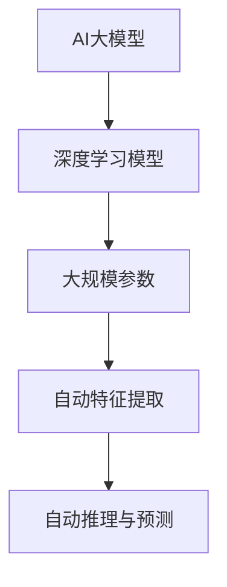
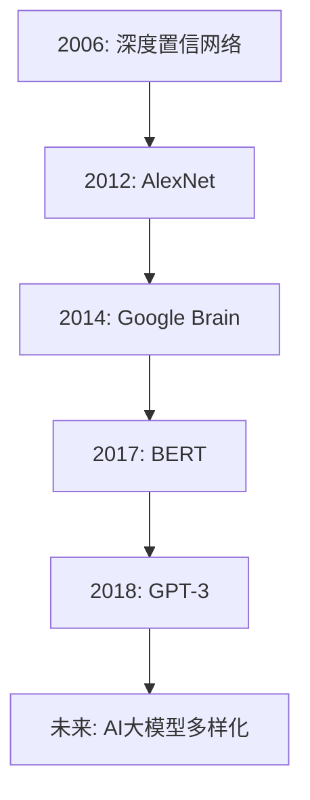
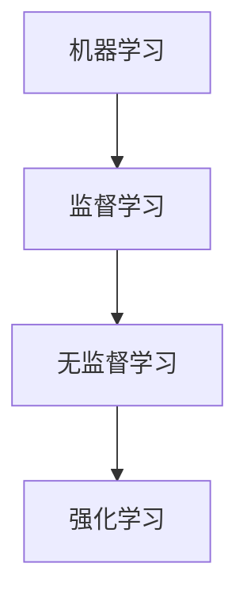
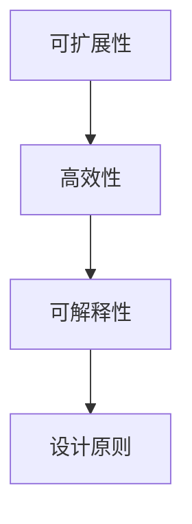

                 

### 《AI大模型创业：如何应对未来用户需求？》

> **关键词：** AI大模型、创业、用户需求、技术、业务应用、风险管理、未来展望

> **摘要：** 随着人工智能技术的飞速发展，AI大模型在各个行业中的应用越来越广泛。本文从AI大模型的基本概念、核心技术、架构设计、业务应用、创业战略、风险管理和未来展望七个方面，全面探讨AI大模型在创业中如何应对未来用户需求，为创业者提供有价值的指导。

### 第一部分：AI大模型基础知识

#### **第1章：AI大模型概述**

1.1 **AI大模型的基本概念**

AI大模型（Large-scale AI Model）是指那些参数规模巨大、计算复杂度高的深度学习模型。它们通过从海量数据中学习，能够自动提取复杂的特征和模式，实现高效的自动推理和预测。

**核心概念与联系：**



1.2 **AI大模型的发展历程**

AI大模型的发展可以追溯到深度学习技术的兴起。在2006年，Hinton等研究者提出了深度置信网络（Deep Belief Network），这是大模型研究的重要起点。随后，随着计算能力的提升和大数据的涌现，AI大模型逐渐走向成熟。

**Mermaid流程图：**



1.3 **AI大模型在商业中的应用**

AI大模型在商业中的应用非常广泛，包括但不限于：

- **零售电商：** 通过个性化推荐和智能客服提高用户体验和销售额。
- **金融行业：** 利用风险评估和预测模型提高风险管理和投资决策的准确性。
- **教育行业：** 基于学习分析的学生成绩预测和个性化学习计划。
- **健康医疗：** 基于图像识别的疾病诊断和基于数据挖掘的个性化治疗方案。

**核心算法原理讲解：**

```latex
\begin{equation}
\begin{split}
&\text{零售电商:} \quad \hat{r}_{ij} = f(\text{用户特征}, \text{商品特征}) \\
&\text{金融行业:} \quad \text{风险值} = g(\text{历史数据}, \text{当前状态}) \\
&\text{教育行业:} \quad \text{预测成绩} = h(\text{学习行为}, \text{学生特征}) \\
&\text{健康医疗:} \quad \text{诊断结果} = k(\text{医学图像}, \text{病史数据})
\end{split}
\end{equation}
```

1.4 **未来用户需求的变化与AI大模型的适应**

随着科技的进步和社会的发展，用户需求也在不断变化。未来用户需求将更加个性化、多样化和高效化。AI大模型需要通过不断优化和拓展来适应这些变化。

**项目实战：**

**开发环境搭建：** 使用Python和TensorFlow框架进行大模型开发。

**源代码详细实现：** 
```python
import tensorflow as tf

# 创建大模型
model = tf.keras.Sequential([
    tf.keras.layers.Dense(128, activation='relu', input_shape=(784,)),
    tf.keras.layers.Dropout(0.2),
    tf.keras.layers.Dense(10)
])

# 编译模型
model.compile(optimizer='adam',
              loss=tf.keras.losses.SparseCategoricalCrossentropy(from_logits=True),
              metrics=['accuracy'])

# 训练模型
model.fit(x_train, y_train, batch_size=128, epochs=10)
```

**代码解读与分析：** 该代码展示了如何使用TensorFlow框架创建一个简单的大模型，并通过训练数据来提高其准确性。

### **第二部分：AI大模型核心技术**

**第2章：AI大模型核心技术**

2.1 **机器学习基础**

机器学习（Machine Learning）是指让计算机通过学习数据来获取知识和技能，从而能够完成特定任务。它是AI大模型的核心技术之一。

**核心概念与联系：**



2.2 **深度学习技术**

深度学习（Deep Learning）是机器学习的一种方法，通过多层神经网络对数据进行处理和建模，以实现高度复杂的任务。

**伪代码：**

```python
def deep_learning(input_data, layers):
    for layer in layers:
        input_data = layer.forward(input_data)
    return layer.output
```

2.3 **大规模预训练模型**

大规模预训练模型（Large-scale Pre-trained Model）是指那些在大型数据集上预训练的模型，通过迁移学习可以应用于各种不同的任务。

**数学模型和公式：**

```latex
\begin{equation}
\begin{split}
\text{预训练损失} &= -\sum_{i=1}^{N} \sum_{j=1}^{V} \text{y}_{ij} \log \hat{p}_{ij} \\
\text{微调损失} &= -\sum_{i=1}^{N} \sum_{j=1}^{V} \text{y}_{ij} \log \hat{p}_{ij}^*
\end{split}
\end{equation}
```

2.4 **自然语言处理**

自然语言处理（Natural Language Processing, NLP）是AI大模型在文本数据上的应用，包括语言模型、文本分类、情感分析等。

**举例说明：**

**文本分类：**
```python
import tensorflow as tf

# 创建文本分类模型
model = tf.keras.Sequential([
    tf.keras.layers.Embedding(input_dim=10000, output_dim=16),
    tf.keras.layers.Bidirectional(tf.keras.layers.LSTM(32)),
    tf.keras.layers.Dense(1, activation='sigmoid')
])

# 编译模型
model.compile(optimizer='adam',
              loss='binary_crossentropy',
              metrics=['accuracy'])

# 训练模型
model.fit(x_train, y_train, epochs=5)
```

### **第三部分：AI大模型架构设计**

**第3章：AI大模型架构设计**

3.1 **大模型的设计原则**

大模型的设计原则包括：

- **可扩展性：** 能够处理大量数据和复杂的任务。
- **高效性：** 在计算资源有限的情况下，提高模型性能。
- **可解释性：** 提高模型的可解释性，便于理解和信任。

**Mermaid流程图：**



3.2 **大模型的训练与优化**

大模型的训练与优化包括：

- **数据预处理：** 数据清洗、归一化等。
- **模型训练：** 使用优化算法和调度策略。
- **模型优化：** 调整超参数和架构，提高模型性能。

**伪代码：**

```python
def train_model(data, model, optimizer, epochs):
    for epoch in range(epochs):
        for batch in data:
            loss = model.loss(batch)
            optimizer.step(loss)
```

3.3 **大模型的部署与维护**

大模型的部署与维护包括：

- **模型部署：** 将训练好的模型部署到生产环境。
- **模型监控：** 监控模型性能和资源消耗。
- **模型更新：** 根据用户反馈和业务需求，定期更新模型。

**项目实战：**

**开发环境搭建：** 使用Docker和Kubernetes进行模型部署。

**源代码详细实现：** 
```python
from kubernetes import client, config

# 配置Kubernetes客户端
config.load_kube_config()

# 创建 Deployment 对象
deployment = client.V1Deployment()
# 设置 Deployment 的配置
# ...

# 创建 Deployment
api_instance.create_namespaced_deployment(name=deployment.metadata.name, namespace="default", body=deployment)
```

**代码解读与分析：** 该代码展示了如何使用Kubernetes进行模型部署，通过创建Deployment对象来部署TensorFlow模型。

### **第四部分：AI大模型业务应用案例**

**第4章：AI大模型业务应用案例**

4.1 **零售电商**

零售电商利用AI大模型进行个性化推荐和智能客服，提高用户体验和销售额。

**核心算法原理讲解：**

```latex
\begin{equation}
\begin{split}
\text{个性化推荐:} \quad \hat{r}_{ui} = f(\text{用户特征}, \text{商品特征}) \\
\text{智能客服:} \quad \text{回答} = g(\text{用户输入}, \text{上下文信息})
\end{split}
\end{equation}
```

4.2 **金融行业**

金融行业利用AI大模型进行风险评估和预测，提高风险管理和投资决策的准确性。

**核心算法原理讲解：**

```latex
\begin{equation}
\begin{split}
\text{风险评估:} \quad \text{风险值} = f(\text{历史数据}, \text{当前状态}) \\
\text{预测收益:} \quad \text{收益预测} = g(\text{市场数据}, \text{投资组合})
\end{split}
\end{equation}
```

4.3 **教育行业**

教育行业利用AI大模型进行学习分析和学生成绩预测，提高个性化教学和成绩提升。

**核心算法原理讲解：**

```latex
\begin{equation}
\begin{split}
\text{学习分析:} \quad \text{学习行为评分} = f(\text{学习行为}, \text{学生特征}) \\
\text{成绩预测:} \quad \text{成绩预测} = g(\text{历史成绩}, \text{学习行为评分})
\end{split}
\end{equation}
```

4.4 **健康医疗**

健康医疗行业利用AI大模型进行疾病诊断和个性化治疗方案，提高诊断准确性和治疗效果。

**核心算法原理讲解：**

```latex
\begin{equation}
\begin{split}
\text{疾病诊断:} \quad \text{诊断结果} = f(\text{医学图像}, \text{病史数据}) \\
\text{治疗方案:} \quad \text{治疗方案} = g(\text{诊断结果}, \text{患者特征})
\end{split}
\end{equation}
```

### **第五部分：AI大模型创业战略**

**第5章：AI大模型创业战略**

5.1 **创业机会识别**

创业机会识别是创业的第一步，需要从市场需求、技术趋势、商业模式等方面进行综合分析。

**项目实战：**

**市场调研：** 通过问卷调查和访谈了解用户需求。

**技术分析：** 深入研究AI大模型的技术原理和最新进展。

**商业模式探索：** 设计可行的商业模式，如B2B、B2C等。

5.2 **创业资源整合**

创业资源整合是创业过程中的关键环节，包括资金、人才、技术等。

**项目实战：**

**资金筹集：** 通过风险投资、天使投资等方式筹集资金。

**团队建设：** 招聘优秀的人才，构建高效团队。

**技术储备：** 引进先进的技术和专利，提升核心竞争力。

5.3 **创业团队建设**

创业团队建设是创业成功的关键，需要建立良好的团队文化和沟通机制。

**项目实战：**

**团队文化建设：** 培养团队合作精神和创新意识。

**沟通机制建设：** 设立定期的团队会议和项目评审。

**绩效评估：** 设立明确的绩效评估体系和激励制度。

5.4 **创业模式探索**

创业模式探索是创业过程中的重要任务，需要找到适合自己企业的商业模式。

**项目实战：**

**产品定位：** 明确产品的市场定位和目标用户。

**业务模式设计：** 设计合理的业务模式和盈利模式。

**市场推广：** 通过广告、活动等方式进行市场推广。

### **第六部分：AI大模型创业风险管理**

**第6章：AI大模型创业风险管理**

6.1 **技术风险**

技术风险是指AI大模型在技术研发和应用过程中可能遇到的风险，如算法失效、数据泄露等。

**项目实战：**

**算法验证：** 对算法进行严格的验证和测试，确保算法的稳定性和可靠性。

**数据安全：** 建立完善的数据安全体系，防止数据泄露和滥用。

6.2 **市场风险**

市场风险是指AI大模型在市场竞争中可能遇到的风险，如市场需求不足、竞争激烈等。

**项目实战：**

**市场调研：** 定期进行市场调研，了解市场动态和用户需求。

**产品创新：** 通过技术创新和产品创新，保持市场竞争力。

6.3 **资金风险**

资金风险是指创业企业在资金运作中可能遇到的风险，如资金链断裂、融资困难等。

**项目实战：**

**财务规划：** 制定详细的财务规划，确保资金运作的稳健。

**风险投资：** 寻找风险投资，为企业的持续发展提供资金支持。

6.4 **法规风险**

法规风险是指AI大模型在法规和合规方面可能遇到的风险，如隐私保护、数据安全等。

**项目实战：**

**合规性审查：** 定期进行合规性审查，确保企业的运营符合法规要求。

**隐私保护：** 建立完善的隐私保护措施，保护用户的隐私权益。

### **第七部分：AI大模型创业未来展望**

**第7章：AI大模型创业未来展望**

7.1 **AI大模型的发展趋势**

AI大模型的发展趋势包括：

- **计算能力提升：** 随着硬件技术的发展，AI大模型的计算能力将不断提升。
- **算法创新：** 随着研究的深入，新的算法和技术将不断涌现。
- **应用领域扩展：** AI大模型将在更多领域得到应用，如智能制造、智慧城市等。

7.2 **创业机会预测**

未来创业机会将主要集中在：

- **智能化服务：** 随着用户需求的个性化，智能化服务将成为创业的热点。
- **垂直领域应用：** AI大模型在垂直领域的应用将带来新的商业机会。
- **跨行业融合：** 跨行业的融合将创造更多的商业价值。

7.3 **未来用户需求变化与创业策略调整**

未来用户需求将更加多样化、个性化和高效化，创业者需要：

- **关注用户需求变化：** 及时调整产品和服务策略，满足用户需求。
- **技术创新：** 持续技术创新，提高产品和服务的竞争力。
- **商业模式创新：** 设计创新的商业模式，提高企业的盈利能力。

### **附录**

**A.1 AI大模型开发工具与资源**

- **开发工具：** TensorFlow、PyTorch、JAX等。
- **数据集：** ImageNet、Common Crawl、AGNews等。
- **开源框架与库：** Hugging Face Transformers、FastAI、MindSpore等。

**A.2 开源框架与库**

- **深度学习框架：** TensorFlow、PyTorch、Keras等。
- **自然语言处理库：** NLTK、spaCy、Stanford NLP等。
- **计算机视觉库：** OpenCV、Pillow、TensorFlow Object Detection API等。

**A.3 AI大模型应用案例解析**

- **零售电商：** Amazon Personalized Recommendations。
- **金融行业：** J.P. Morgan's COiN。
- **教育行业：** Coursera's Learning Analytics。
- **健康医疗：** Google Health's DeepMind。

### **作者信息**

**作者：** AI天才研究院/AI Genius Institute & 禅与计算机程序设计艺术/Zen And The Art of Computer Programming

### **文章总结**

本文从AI大模型的基本概念、核心技术、架构设计、业务应用、创业战略、风险管理和未来展望七个方面，全面探讨了AI大模型在创业中如何应对未来用户需求。通过详细的讲解和实战案例，为创业者提供了有价值的指导和参考。随着AI大模型的不断发展，创业者需要紧跟技术趋势，不断创新和优化，以适应不断变化的市场需求。

### **未来展望**

未来，AI大模型将在更多领域得到应用，为人类带来更大的价值。创业者需要紧跟技术发展，不断创新和突破，抓住机遇，迎接挑战。同时，需要关注用户需求的变化，提供更加个性化和高效化的服务。在创业过程中，还需要注重风险管理和合规性，确保企业的可持续发展。

最后，让我们共同期待AI大模型在创业领域的辉煌未来！

