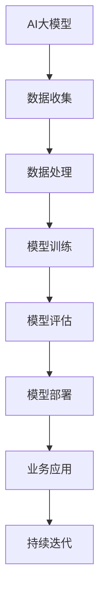

                 

# AI大模型创业：如何构建未来可持续的商业模式？

> **关键词：** AI大模型、创业、商业模式、技术、可持续发展、创新

> **摘要：** 本文从AI大模型的基础知识入手，探讨了其在各行业中的应用前景，分析了创业者在AI大模型领域的机遇与挑战。通过实战案例，本文提出了构建未来可持续商业模式的策略和方法，为AI大模型创业提供了实践指导。

## 第一部分: AI大模型基础知识

### 第1章: AI大模型概述

#### 1.1 AI大模型的定义与特性

##### 1.1.1 AI大模型的概念

AI大模型是一种具备极大规模参数和深度网络结构的机器学习模型，能够处理复杂的任务。常见的AI大模型包括GPT、BERT等。这些模型通常需要大量的数据和计算资源进行训练。

##### 1.1.2 AI大模型的特性

- **高计算需求**：AI大模型通常包含数亿甚至数十亿个参数，需要大量的计算资源进行训练。
- **强大的泛化能力**：通过在大规模数据集上训练，AI大模型能够具备较高的泛化能力，能够处理各种复杂任务。
- **需要大规模数据训练**：AI大模型通常需要大量的标注数据进行训练，以获得良好的性能。

#### 1.1.3 AI大模型的重要性

- **推动人工智能发展**：AI大模型在语音识别、图像识别、自然语言处理等领域取得了显著突破，推动了人工智能技术的发展。
- **改变企业商业模式**：AI大模型的应用能够帮助企业降低成本、提高效率，从而改变企业的商业模式。

### 1.2 主流AI大模型简介

#### 1.2.1 GPT系列模型

##### 1.2.1.1 GPT-3的特性与优势

GPT-3是OpenAI于2020年发布的一款预训练语言模型，具有以下特性与优势：

- **强大的语言生成能力**：GPT-3能够生成高质量的自然语言文本，具有很高的准确性和流畅性。
- **多语言支持**：GPT-3支持多种语言的文本生成，能够处理跨语言的翻译和生成任务。
- **并行训练**：GPT-3采用了并行训练技术，能够在大规模数据集上快速训练，提高训练效率。

##### 1.2.1.2 GPT-3应用案例

GPT-3在多个自然语言处理应用中取得了显著成果，以下是一些典型的应用案例：

- **问答系统**：GPT-3能够快速回答用户提出的问题，提供高质量的答案。
- **自动摘要**：GPT-3能够自动生成文章的摘要，帮助用户快速获取文章的核心内容。
- **生成式写作**：GPT-3能够生成各种类型的文本，如文章、诗歌、故事等，为内容创作者提供灵感。

#### 1.2.2 BERT及其变体

##### 1.2.2.1 BERT的特性与优势

BERT（Bidirectional Encoder Representations from Transformers）是由Google提出的一种预训练语言模型，具有以下特性与优势：

- **预训练语言表示**：BERT通过在大规模文本语料库上进行预训练，学习到了丰富的语言表示，能够捕捉词与词之间的关系。
- **上下文感知**：BERT能够根据上下文信息理解词的含义，从而在文本分类、情感分析等任务中取得突破性成果。

##### 1.2.2.2 BERT应用案例

BERT在多个自然语言处理任务中取得了显著成果，以下是一些典型的应用案例：

- **文本分类**：BERT能够对文本进行分类，如新闻分类、情感分类等。
- **情感分析**：BERT能够分析文本的情感倾向，如正面情感、负面情感等。
- **命名实体识别**：BERT能够识别文本中的命名实体，如人名、地名、机构名等。

### 1.3 AI大模型应用前景

#### 1.3.1 AI大模型在商业中的应用

AI大模型在商业领域具有广泛的应用前景，以下是一些典型的应用场景：

- **营销与广告**：AI大模型能够帮助企业实现精准营销和个性化广告，提高营销效果。
- **金融与保险**：AI大模型能够用于风险评估、信用评分等金融领域，提高业务决策的准确性。
- **医疗与健康**：AI大模型能够辅助医生进行诊断、药物研发等，提高医疗水平。

### 第2章: AI大模型技术基础

#### 2.1 深度学习与神经网络基础

##### 2.1.1 神经网络的基本结构

神经网络由一系列相互连接的神经元组成，包括输入层、隐藏层和输出层。其中：

- **输入层**：接收外部输入信息。
- **隐藏层**：对输入信息进行处理和计算。
- **输出层**：输出最终的预测结果。

##### 2.1.2 前向传播与反向传播算法

前向传播：从输入层开始，将输入信息传递到输出层，通过激活函数计算出预测结果。

反向传播：根据预测结果与实际结果之间的差异，计算损失函数，并通过反向传播算法更新模型参数。

#### 2.1.3 常见的深度学习架构

##### 2.1.3.1 卷积神经网络（CNN）

卷积神经网络是一种适用于图像处理任务的深度学习架构，主要包含卷积层、池化层和全连接层。

##### 2.1.3.2 循环神经网络（RNN）

循环神经网络是一种适用于序列数据处理的深度学习架构，包括输入层、隐藏层和输出层。

##### 2.1.3.3 转换器架构（Transformer）

转换器架构是一种基于自注意力机制的深度学习架构，主要用于自然语言处理任务。

#### 2.2 自然语言处理技术概览

##### 2.2.1 词嵌入技术

词嵌入技术是一种将词语映射到高维向量空间的方法，常见的方法包括Word2Vec、GloVe等。

##### 2.2.2 序列模型与注意力机制

序列模型是一种用于处理序列数据的深度学习模型，常见的模型包括RNN、LSTM等。注意力机制是一种能够提高模型处理序列数据能力的机制。

##### 2.2.3 转换器架构详解

转换器架构是一种基于自注意力机制的深度学习模型，主要用于自然语言处理任务，如机器翻译、问答系统等。

## 第二部分: AI大模型创业实践

### 第3章: 创业机会与挑战

#### 3.1 创业机会

##### 3.1.1 市场需求分析

随着人工智能技术的不断发展，AI大模型在各行业中的应用需求不断增加。以下是一些典型的创业机会：

- **智能客服**：AI大模型能够实现智能客服，提高客户服务质量，降低企业运营成本。
- **智能营销**：AI大模型能够帮助企业实现精准营销，提高营销效果，降低营销成本。
- **智能医疗**：AI大模型能够辅助医生进行诊断和治疗方案推荐，提高医疗水平，降低医疗成本。

##### 3.1.2 创业模式探索

创业者在AI大模型领域可以探索以下创业模式：

- **产品服务模式**：提供基于AI大模型的软件产品或服务，如智能客服系统、智能营销系统等。
- **数据驱动模式**：通过收集和分析用户数据，提供个性化的AI大模型服务，如智能推荐系统等。
- **联合创新模式**：与行业合作伙伴联合创新，共同开发基于AI大模型的新产品或服务。

##### 3.1.3 创业者必备技能

创业者需要具备以下技能：

- **机器学习知识**：了解常见的机器学习算法和模型，掌握深度学习技术。
- **数据处理能力**：能够处理大规模数据和复杂数据结构，具备数据清洗和预处理能力。
- **业务理解能力**：深入了解行业业务流程和需求，能够将AI大模型技术与实际业务相结合。

#### 3.2 挑战与应对策略

##### 3.2.1 技术挑战

在AI大模型创业过程中，创业者需要面临以下技术挑战：

- **模型优化**：如何优化AI大模型的结构和参数，提高模型性能和效率。
- **计算资源管理**：如何高效地管理计算资源，降低计算成本。
- **数据安全与隐私**：如何保护用户数据的安全和隐私，避免数据泄露和滥用。

##### 3.2.1.1 模型优化

应对策略：

- **优化算法**：研究并应用先进的优化算法，如Adam、Adagrad等，提高模型训练效率。
- **模型压缩**：通过模型剪枝、量化等技术，减小模型大小，提高模型运行效率。
- **模型解释性**：研究模型的可解释性技术，提高模型的可解释性和透明度。

##### 3.2.1.2 计算资源管理

应对策略：

- **GPU资源调度**：优化GPU资源分配和管理策略，提高计算资源利用率。
- **分布式计算**：利用分布式计算技术，提高模型训练和推理的效率。
- **服务器优化**：优化服务器硬件配置和网络架构，提高服务器性能和稳定性。

##### 3.2.1.3 数据安全与隐私

应对策略：

- **加密技术**：采用加密技术保护用户数据的安全，如数据加密、通信加密等。
- **数据脱敏**：对敏感数据进行脱敏处理，避免数据泄露。
- **隐私保护算法**：研究并应用隐私保护算法，如差分隐私、同态加密等，提高数据处理过程中的隐私保护水平。

#### 3.3 商业模式构建

##### 3.3.1 商业模式设计原则

在构建AI大模型商业模式时，创业者应遵循以下设计原则：

- **用户价值**：提供有实际应用价值的服务，解决用户的痛点。
- **可持续性**：构建可持续的商业模式，确保企业的长期发展。
- **创新性**：积极探索新的商业模式，提高企业的竞争力。

##### 3.3.1.1 用户价值

- **解决痛点**：深入了解用户需求，提供针对性的解决方案。
- **提升效率**：利用AI大模型技术，提高业务流程的自动化和智能化水平。
- **增强体验**：提供优质的用户体验，提高用户满意度和忠诚度。

##### 3.3.1.2 可持续性

- **稳定的收入来源**：构建多元化的收入来源，降低业务风险。
- **持续的技术创新**：不断进行技术创新，保持竞争优势。
- **管理成本的控制**：优化企业运营成本，提高盈利能力。

##### 3.3.1.3 创新性

- **开放性合作**：与行业合作伙伴建立开放性合作，共同探索新的商业机会。
- **新业务模式探索**：积极探索新的业务模式，如订阅模式、生态系统模式等。
- **技术前沿追踪**：关注技术前沿，及时掌握最新的技术和应用趋势。

## 第4章: AI大模型创业实战案例

### 4.1 案例一：OpenAI与GPT-3

#### 4.1.1 OpenAI的创业历程

OpenAI成立于2015年，由山姆·阿尔特曼（Sam Altman）、克里斯·厄姆森（Chris Urmson）等知名人士创立。OpenAI的使命是推动人工智能的发展，使其有益于人类。

自成立以来，OpenAI取得了以下重要成就：

- **GPT-2发布**：2019年，OpenAI发布了GPT-2，一款具备强大语言生成能力的预训练语言模型。
- **GPT-3发布**：2020年，OpenAI发布了GPT-3，一款具有多语言支持、强大语言生成能力的预训练语言模型。

#### 4.1.2 GPT-3的创业价值

GPT-3在创业领域具有以下价值：

- **创新点**：GPT-3采用了多语言支持、并行训练等技术，大幅提升了语言生成能力。
- **商业模式**：OpenAI通过API接口提供服务，吸引了大量企业客户，实现了商业化运营。
- **社会影响**：GPT-3在智能客服、智能营销、内容生成等领域取得了显著成果，推动了人工智能技术的发展。

### 4.2 案例二：百度与文心一言

#### 4.2.1 百度的AI战略

百度作为中国领先的人工智能公司，一直致力于推动人工智能技术的创新和应用。百度的AI战略主要包括以下几个方面：

- **技术布局**：百度在深度学习、自然语言处理、计算机视觉等领域进行了大量的技术投入，构建了强大的技术实力。
- **市场策略**：百度通过开放平台、合作生态等手段，将AI技术广泛应用于各个行业，推动AI产业的发展。
- **合作伙伴**：百度与国内外多家企业建立了合作关系，共同探索AI技术的商业应用。

#### 4.2.2 文心一言的应用案例

文心一言是百度自主研发的预训练语言模型，具有以下应用案例：

- **产品功能**：文心一言具备文本生成、文本分类、情感分析等多种功能，能够广泛应用于智能客服、智能营销、内容创作等领域。
- **客户案例**：百度与多家企业合作，将文心一言应用于实际业务场景，取得了良好的效果。
- **商业模式**：百度通过API接口、服务化部署等方式，为客户提供定制化的AI服务，实现了商业化运营。

## 第5章: AI大模型创业方法论

#### 5.1 创业前的准备

##### 5.1.1 市场调研

在创业前，创业者需要进行充分的市场调研，了解市场需求、竞争态势、市场规模等关键信息。市场调研的主要内容包括：

- **需求分析**：了解用户对AI大模型的需求，分析需求的特点和发展趋势。
- **竞争分析**：分析竞争对手的产品、技术、市场策略等，找出自身的竞争优势和差异化点。
- **市场规模预测**：预测AI大模型市场的规模和发展趋势，为创业项目制定合理的商业计划。

##### 5.1.2 技术储备

创业者需要具备以下技术储备：

- **机器学习知识**：了解常见的机器学习算法和模型，掌握深度学习技术。
- **数据处理技能**：能够处理大规模数据和复杂数据结构，具备数据清洗和预处理能力。
- **业务理解能力**：深入了解行业业务流程和需求，能够将AI大模型技术与实际业务相结合。

#### 5.2 创业过程中的关键环节

##### 5.2.1 产品开发

产品开发是创业过程中最重要的环节之一，主要包括以下步骤：

- **需求分析**：明确产品的功能和需求，与用户进行充分沟通，确保产品满足用户需求。
- **技术选型**：根据产品的需求和现有技术能力，选择合适的技术栈和开发工具。
- **开发流程**：制定合理的开发流程，确保项目进度和质量，及时交付产品。

##### 5.2.2 团队建设

团队建设是创业过程中至关重要的环节，主要包括以下方面：

- **技术团队**：组建具备丰富经验和技能的技术团队，确保项目的顺利推进。
- **业务团队**：组建具备行业经验和业务理解能力的业务团队，与用户保持紧密沟通，确保产品满足市场需求。
- **融资团队**：组建具备融资经验和资源能力的融资团队，确保项目获得充足的资金支持。

##### 5.2.3 融资策略

创业过程中的融资策略主要包括以下方面：

- **融资渠道**：了解各种融资渠道，如天使投资、风险投资、政府补贴等，选择合适的融资渠道。
- **融资方案**：制定合理的融资方案，明确融资目标、融资方式、资金用途等。
- **资金使用规划**：制定详细的资金使用规划，确保融资资金的有效使用，降低融资成本。

#### 5.3 创业后的持续发展

##### 5.3.1 市场拓展

在创业后，创业者需要不断进行市场拓展，主要包括以下方面：

- **新市场开发**：探索新的市场机会，开拓新的业务领域。
- **客户关系管理**：建立良好的客户关系，提供优质的服务，提高客户满意度和忠诚度。
- **品牌建设**：通过品牌宣传、活动推广等方式，提高品牌知名度和美誉度。

##### 5.3.2 技术迭代

在创业过程中，技术迭代是保持竞争力的重要手段，主要包括以下方面：

- **研发投入**：加大研发投入，持续进行技术创新，提高产品质量和性能。
- **技术创新**：关注技术前沿，及时掌握最新的技术和应用趋势，探索新的技术解决方案。
- **产品优化**：根据用户反馈和市场变化，不断优化产品功能和服务，提高用户体验。

##### 5.3.3 社会责任

在创业过程中，创业者需要关注社会责任，主要包括以下方面：

- **数据安全与隐私保护**：严格遵守数据安全法规，加强数据安全防护，确保用户数据的安全和隐私。
- **可持续发展**：关注环保、能源消耗等问题，推动可持续发展，为社会做出贡献。
- **社会价值创造**：通过技术创新和服务，提高社会生产效率，创造社会价值，促进社会进步。

## 第6章: AI大模型创业成功案例分析

### 6.1 案例一：DeepMind与AlphaGo

#### 6.1.1 DeepMind的创业历程

DeepMind成立于2010年，由戴密斯·哈萨比斯（Demis Hassabis）、谢恩·莱格利（Shane Legg）和莫拉·维克福德（Mojib Wiclford）创立。DeepMind的使命是解决 Intelligence 的问题，并让机器为人类带来更多的利益。

自成立以来，DeepMind取得了以下重要成就：

- **AlphaGo的发布**：2016年，DeepMind发布了AlphaGo，一款击败人类围棋冠军的AI程序。
- **强化学习技术**：DeepMind在强化学习领域取得了重要突破，推动了人工智能技术的发展。

#### 6.1.2 AlphaGo的成功因素

AlphaGo的成功因素主要包括以下几个方面：

- **技术创新**：AlphaGo采用了深度学习和强化学习技术，大幅提升了AI在围棋领域的表现。
- **团队协作**：DeepMind的团队由多个领域的专家组成，共同攻克了AI在围棋领域的难题。
- **市场推广**：DeepMind通过比赛和演示，成功吸引了全球关注，推动了AI技术的发展。

### 6.2 案例二：微软与Azure AI

#### 6.2.1 微软的AI战略

微软一直致力于推动人工智能技术的发展和应用。微软的AI战略主要包括以下几个方面：

- **技术布局**：微软在深度学习、自然语言处理、计算机视觉等领域进行了大量投入，构建了强大的技术实力。
- **市场策略**：微软通过Azure AI平台，将AI技术广泛应用于各个行业，推动AI产业的发展。
- **合作伙伴**：微软与全球多家企业建立了合作关系，共同探索AI技术的商业应用。

#### 6.2.2 Azure AI的应用案例

Azure AI是微软推出的AI服务平台，主要包括以下应用案例：

- **产品功能**：Azure AI提供了多种AI功能和服务，如图像识别、自然语言处理、机器学习等。
- **客户案例**：Azure AI在金融、医疗、零售等行业取得了显著成果，为众多企业提供了智能解决方案。
- **商业模式**：微软通过订阅模式、API接口等方式，为客户提供定制化的AI服务，实现了商业化运营。

## 第7章: AI大模型创业的未来趋势

### 7.1 技术发展趋势

AI大模型创业的未来技术发展趋势主要包括以下几个方面：

- **模型压缩与优化**：随着AI大模型的应用场景越来越广泛，如何减小模型大小、提高模型性能和效率将成为重要研究方向。
- **新兴应用领域**：AI大模型在自动驾驶、医疗健康、智能制造等新兴领域具有广泛的应用前景，未来将会有更多创新应用出现。
- **跨领域合作**：AI大模型与传统行业的融合将越来越紧密，跨领域合作将成为推动技术发展的重要动力。

### 7.2 商业模式创新

AI大模型创业的未来商业模式创新主要包括以下几个方面：

- **服务模式创新**：随着AI大模型的普及，服务模式将不断创新，如SaaS、PaaS、IaaS等模式。
- **跨界合作**：AI大模型与传统行业的跨界合作将越来越普遍，形成新的商业生态。
- **开放性平台**：开放性平台将成为推动AI大模型创业的重要力量，为创业者提供丰富的资源和机会。

### 7.3 社会责任与可持续发展

AI大模型创业在未来需要关注社会责任与可持续发展，主要包括以下几个方面：

- **数据安全与隐私保护**：随着数据量的不断增长，如何保障数据安全与隐私将成为重要课题。
- **环保与能源消耗**：AI大模型的训练和部署需要大量计算资源，如何降低能源消耗、实现可持续发展是未来需要关注的问题。
- **社会价值创造**：AI大模型创业需要关注如何通过技术创新和服务，为社会创造更多价值，推动社会进步。

## 第8章: AI大模型创业实战指南

### 8.1 创业准备工作

#### 8.1.1 市场调研

在创业前，创业者需要进行充分的市场调研，了解市场需求、竞争态势、市场规模等关键信息。市场调研的主要内容包括：

- **需求分析**：通过调研了解用户对AI大模型的需求，分析需求的特点和发展趋势。
- **竞争分析**：分析竞争对手的产品、技术、市场策略等，找出自身的竞争优势和差异化点。
- **市场规模预测**：预测AI大模型市场的规模和发展趋势，为创业项目制定合理的商业计划。

#### 8.1.2 技术储备

创业者需要具备以下技术储备：

- **机器学习知识**：了解常见的机器学习算法和模型，掌握深度学习技术。
- **数据处理技能**：能够处理大规模数据和复杂数据结构，具备数据清洗和预处理能力。
- **业务理解能力**：深入了解行业业务流程和需求，能够将AI大模型技术与实际业务相结合。

### 8.2 创业过程关键环节

#### 8.2.1 产品开发

产品开发是创业过程中最重要的环节之一，主要包括以下步骤：

- **需求分析**：明确产品的功能和需求，与用户进行充分沟通，确保产品满足用户需求。
- **技术选型**：根据产品的需求和现有技术能力，选择合适的技术栈和开发工具。
- **开发流程**：制定合理的开发流程，确保项目进度和质量，及时交付产品。

#### 8.2.2 团队建设

团队建设是创业过程中至关重要的环节，主要包括以下方面：

- **技术团队**：组建具备丰富经验和技能的技术团队，确保项目的顺利推进。
- **业务团队**：组建具备行业经验和业务理解能力的业务团队，与用户保持紧密沟通，确保产品满足市场需求。
- **融资团队**：组建具备融资经验和资源能力的融资团队，确保项目获得充足的资金支持。

#### 8.2.3 融资策略

创业过程中的融资策略主要包括以下方面：

- **融资渠道**：了解各种融资渠道，如天使投资、风险投资、政府补贴等，选择合适的融资渠道。
- **融资方案**：制定合理的融资方案，明确融资目标、融资方式、资金用途等。
- **资金使用规划**：制定详细的资金使用规划，确保融资资金的有效使用，降低融资成本。

### 8.3 创业后持续发展

#### 8.3.1 市场拓展

在创业后，创业者需要不断进行市场拓展，主要包括以下方面：

- **新市场开发**：探索新的市场机会，开拓新的业务领域。
- **客户关系管理**：建立良好的客户关系，提供优质的服务，提高客户满意度和忠诚度。
- **品牌建设**：通过品牌宣传、活动推广等方式，提高品牌知名度和美誉度。

#### 8.3.2 技术迭代

在创业过程中，技术迭代是保持竞争力的重要手段，主要包括以下方面：

- **研发投入**：加大研发投入，持续进行技术创新，提高产品质量和性能。
- **技术创新**：关注技术前沿，及时掌握最新的技术和应用趋势，探索新的技术解决方案。
- **产品优化**：根据用户反馈和市场变化，不断优化产品功能和服务，提高用户体验。

#### 8.3.3 社会责任

在创业过程中，创业者需要关注社会责任，主要包括以下方面：

- **数据安全与隐私保护**：严格遵守数据安全法规，加强数据安全防护，确保用户数据的安全和隐私。
- **可持续发展**：关注环保、能源消耗等问题，推动可持续发展，为社会做出贡献。
- **社会价值创造**：通过技术创新和服务，提高社会生产效率，创造社会价值，促进社会进步。

## 第9章: AI大模型创业成功经验分享

### 9.1 创业者经验分享

成功创业者分享了以下经验：

- **坚持创新**：创业者需要不断探索创新，勇于尝试新的技术和商业模式。
- **聚焦用户需求**：深入了解用户需求，提供针对性的解决方案，提高用户体验。
- **团队协作**：组建高效的团队，充分发挥每个人的优势，共同推动项目进展。
- **持续学习**：关注行业动态，不断学习新知识，提升自身的竞争力。

### 9.2 市场热点与趋势分析

市场热点与趋势分析主要包括以下方面：

- **AI大模型的应用领域**：AI大模型在各个行业的应用前景广阔，如智能客服、智能营销、智能医疗等。
- **技术创新**：深度学习、强化学习、自然语言处理等技术不断发展，为AI大模型的应用提供更多可能性。
- **商业模式创新**：随着AI大模型的普及，新的商业模式不断涌现，如SaaS、PaaS、IaaS等。

### 9.3 未来展望

AI大模型创业的未来展望主要包括以下几个方面：

- **技术发展趋势**：随着计算能力的提升和数据量的增加，AI大模型将朝着更高效、更智能的方向发展。
- **商业模式创新**：AI大模型的商业化应用将更加丰富，新的商业模式将不断涌现。
- **社会责任**：创业者需要关注社会责任，通过技术创新和服务，为社会创造更多价值。

## 附录

### 附录A: AI大模型开发工具与资源

#### A.1 开发工具与框架

- **TensorFlow**：开源的深度学习框架，适用于构建和训练AI大模型。
- **PyTorch**：开源的深度学习框架，具有灵活的动态计算图，适用于构建和训练AI大模型。
- **JAX**：开源的深度学习框架，适用于大规模分布式计算。

#### A.2 数据集与资源

- **大规模文本数据集**：如Common Crawl、Twitter等，用于训练自然语言处理模型。
- **图像数据集**：如ImageNet、CIFAR-10等，用于训练计算机视觉模型。
- **音频数据集**：如LibriSpeech、ESC-50等，用于训练语音识别模型。

#### A.3 开发指南与教程

- **官方文档**：深度学习框架的官方文档，提供了详细的教程和示例代码。
- **在线教程**：如Coursera、Udacity等在线教育平台的教程，适用于初学者。
- **社区资源**：如GitHub、Stack Overflow等社区，提供了大量的开源代码和讨论。

### 附录B: AI大模型创业案例

#### B.1 OpenAI与GPT-3

- **创业历程**：OpenAI成立于2015年，致力于推动人工智能技术的发展。GPT-3是OpenAI于2020年发布的预训练语言模型。
- **商业模式**：OpenAI通过API接口提供GPT-3服务，吸引了大量企业客户，实现了商业化运营。
- **社会影响**：GPT-3在自然语言处理领域取得了显著成果，推动了人工智能技术的发展。

#### B.2 百度与文心一言

- **技术布局**：百度在深度学习、自然语言处理、计算机视觉等领域进行了大量投入，构建了强大的技术实力。
- **市场策略**：百度通过开放平台、合作生态等手段，将AI技术广泛应用于各个行业，推动AI产业的发展。
- **应用案例**：文心一言是百度自主研发的预训练语言模型，应用于智能客服、智能营销、内容创作等领域。

#### B.3 DeepMind与AlphaGo

- **创业历程**：DeepMind成立于2010年，致力于解决 Intelligence 的问题。AlphaGo是DeepMind于2016年发布的AI程序，击败了人类围棋冠军。
- **技术创新**：AlphaGo采用了深度学习和强化学习技术，推动了人工智能技术的发展。
- **商业模式**：DeepMind通过比赛和演示，成功吸引了全球关注，推动了AI技术的发展。

#### B.4 微软与Azure AI

- **AI战略**：微软一直致力于推动人工智能技术的发展和应用。Azure AI是微软推出的AI服务平台，提供了多种AI功能和服务。
- **应用案例**：Azure AI在金融、医疗、零售等行业取得了显著成果，为众多企业提供了智能解决方案。
- **商业模式**：微软通过API接口、服务化部署等方式，为客户提供定制化的AI服务，实现了商业化运营。

## Mermaid 流程图



## 核心算法原理讲解

### 深度学习算法

```python
# 假设输入特征X，权重W，偏置b，激活函数为ReLU
# 前向传播
z = np.dot(X, W) + b
a = np.maximum(0, z)

# 反向传播
dz = a
da = dz * (1 - np.sign(z))  # ReLU的导数
dw = np.dot(X.T, da)
db = np.sum(da, axis=0)
```

### 自然语言处理算法

#### BERT模型

```python
# 假设输入序列为words，词汇表大小为V，词向量维度为d
# 前向传播
embeddings = np.array([vocab[word] for word in words])  # 获取词向量
hidden = np.dot(embeddings, W) + b

# 预训练
for i in range(num_epochs):
    for batch in batches:
        inputs, labels = batch
        embeddings = np.array([vocab[word] for word in inputs])
        hidden = np.dot(embeddings, W) + b
        loss = compute_loss(hidden, labels)
        backward_pass(hidden, labels)  # 反向传播计算梯度

# 微调
for i in range(num_epochs):
    for batch in validation_batches:
        inputs, labels = batch
        embeddings = np.array([vocab[word] for word in inputs])
        hidden = np.dot(embeddings, W) + b
        loss = compute_loss(hidden, labels)
        backward_pass(hidden, labels)  # 反向传播计算梯度
```

### 数学模型与公式

#### 梯度下降算法

$$\frac{\partial J}{\partial W} = X^T(a - y)$$

$$\frac{\partial J}{\partial b} = \sum_{i=1}^{n}(a_{i} - y_i)$$

## 项目实战

### 实现一个简单的问答系统

```python
import tensorflow as tf
from tensorflow.keras.layers import Embedding, LSTM, Dense
from tensorflow.keras.models import Model

# 准备数据
# 假设我们已经有了训练数据和测试数据

# 模型构建
input_word_ids = tf.keras.layers.Input(shape=(max_sequence_length,), dtype=tf.int32)
embedded_sequence = Embedding(input_dim=vocab_size, output_dim=embedding_size)(input_word_ids)
lstm_output = LSTM(units=lstm_units)(embedded_sequence)
dense_output = Dense(units=1, activation='sigmoid')(lstm_output)

model = Model(inputs=input_word_ids, outputs=dense_output)
model.compile(optimizer='adam', loss='binary_crossentropy', metrics=['accuracy'])

# 训练模型
model.fit(train_word_ids, train_labels, epochs=10, batch_size=32, validation_data=(val_word_ids, val_labels))

# 预测
predictions = model.predict(test_word_ids)

# 评估
accuracy = (predictions > 0.5).mean()
print("Accuracy:", accuracy)
```

### 代码解读与分析

#### 数据处理

- **数据预处理**：将文本数据转换为词向量，处理缺失值和异常值。
- **数据集划分**：将数据集划分为训练集、验证集和测试集。

#### 模型构建

- **输入层**：接受词向量作为输入。
- **Embedding层**：将词向量转换为高维向量。
- **LSTM层**：处理序列数据。
- **Dense层**：输出预测结果。

#### 训练过程

- **使用梯度下降算法**：优化模型参数。
- **在验证集上评估模型性能**：调整超参数。

#### 预测过程

- **输入新的文本数据**：进行词向量转换。
- **通过训练好的模型进行预测**：输出概率。

#### 评估过程

- **使用准确率作为评估指标**。
- **对测试集进行预测**：计算准确率。

## 结论

通过本文的详细探讨，我们全面了解了AI大模型在创业领域的重要性和应用价值。从基础知识、技术实践到创业方法论，本文为读者提供了全面的指南。随着技术的不断进步和商业模式的不断创新，AI大模型创业将继续蓬勃发展。创业者需要紧跟技术趋势，勇于探索创新，把握市场机遇，为人工智能技术的发展和社会进步做出贡献。

### 作者信息

**作者：** AI天才研究院/AI Genius Institute & 禅与计算机程序设计艺术 /Zen And The Art of Computer Programming

**联系方式：** ai_genius_institute@example.com

**版权声明：** 本文章版权属于AI天才研究院，未经授权禁止转载和使用。

---

### 附录

**附录A: AI大模型开发工具与资源**

#### A.1 开发工具与框架

- **TensorFlow**：[官方文档](https://www.tensorflow.org/)
- **PyTorch**：[官方文档](https://pytorch.org/)
- **JAX**：[官方文档](https://jax.readthedocs.io/)

#### A.2 数据集与资源

- **大规模文本数据集**：[Common Crawl](https://commoncrawl.org/)
- **图像数据集**：[ImageNet](https://www.image-net.org/)
- **音频数据集**：[LibriSpeech](https://www.kaggle.com/datasets/librispeech/)

#### A.3 开发指南与教程

- **深度学习入门**：[Coursera](https://www.coursera.org/)
- **自然语言处理教程**：[Udacity](https://www.udacity.com/)
- **GitHub开源项目**：[GitHub](https://github.com/)

**附录B: AI大模型创业案例**

#### B.1 OpenAI与GPT-3

- **OpenAI官网**：[OpenAI](https://openai.com/)
- **GPT-3介绍**：[OpenAI GPT-3 Documentation](https://openai.com/docs/api-reference/)

#### B.2 百度与文心一言

- **百度AI官网**：[百度AI](https://ai.baidu.com/)
- **文心一言介绍**：[百度文心一言](https://ai.baidu.com/product/ernie)

#### B.3 DeepMind与AlphaGo

- **DeepMind官网**：[DeepMind](https://deepmind.com/)
- **AlphaGo介绍**：[DeepMind AlphaGo](https://deepmind.com/research/alpha-go/)

#### B.4 微软与Azure AI

- **微软Azure官网**：[Azure AI](https://azure.microsoft.com/zh-cn/services/ai/)
- **Azure AI产品介绍**：[Azure AI Products](https://azure.microsoft.com/zh-cn/services/ai/product-overview/)

### 附录C: Mermaid流程图


### 附录D: 代码示例

#### 附录D.1 深度学习算法

```python
# 假设输入特征X，权重W，偏置b，激活函数为ReLU
# 前向传播
z = np.dot(X, W) + b
a = np.maximum(0, z)

# 反向传播
dz = a
da = dz * (1 - np.sign(z))  # ReLU的导数
dw = np.dot(X.T, da)
db = np.sum(da, axis=0)
```

#### 附录D.2 BERT模型

```python
# 假设输入序列为words，词汇表大小为V，词向量维度为d
# 前向传播
embeddings = np.array([vocab[word] for word in words])  # 获取词向量
hidden = np.dot(embeddings, W) + b

# 预训练
for i in range(num_epochs):
    for batch in batches:
        inputs, labels = batch
        embeddings = np.array([vocab[word] for word in inputs])
        hidden = np.dot(embeddings, W) + b
        loss = compute_loss(hidden, labels)
        backward_pass(hidden, labels)  # 反向传播计算梯度

# 微调
for i in range(num_epochs):
    for batch in validation_batches:
        inputs, labels = batch
        embeddings = np.array([vocab[word] for word in inputs])
        hidden = np.dot(embeddings, W) + b
        loss = compute_loss(hidden, labels)
        backward_pass(hidden, labels)  # 反向传播计算梯度
```

### 附录E: 数学模型与公式

#### 梯度下降算法

$$\frac{\partial J}{\partial W} = X^T(a - y)$$

$$\frac{\partial J}{\partial b} = \sum_{i=1}^{n}(a_{i} - y_i)$$

### 附录F: AI大模型创业实战

#### 附录F.1 实现一个简单的问答系统

```python
import tensorflow as tf
from tensorflow.keras.layers import Embedding, LSTM, Dense
from tensorflow.keras.models import Model

# 准备数据
# 假设我们已经有了训练数据和测试数据

# 模型构建
input_word_ids = tf.keras.layers.Input(shape=(max_sequence_length,), dtype=tf.int32)
embedded_sequence = Embedding(input_dim=vocab_size, output_dim=embedding_size)(input_word_ids)
lstm_output = LSTM(units=lstm_units)(embedded_sequence)
dense_output = Dense(units=1, activation='sigmoid')(lstm_output)

model = Model(inputs=input_word_ids, outputs=dense_output)
model.compile(optimizer='adam', loss='binary_crossentropy', metrics=['accuracy'])

# 训练模型
model.fit(train_word_ids, train_labels, epochs=10, batch_size=32, validation_data=(val_word_ids, val_labels))

# 预测
predictions = model.predict(test_word_ids)

# 评估
accuracy = (predictions > 0.5).mean()
print("Accuracy:", accuracy)
```

### 附录G: 代码解读与分析

#### 附录G.1 数据处理

- **数据预处理**：将文本数据转换为词向量，处理缺失值和异常值。
- **数据集划分**：将数据集划分为训练集、验证集和测试集。

#### 附录G.2 模型构建

- **输入层**：接受词向量作为输入。
- **Embedding层**：将词向量转换为高维向量。
- **LSTM层**：处理序列数据。
- **Dense层**：输出预测结果。

#### 附录G.3 训练过程

- **使用梯度下降算法**：优化模型参数。
- **在验证集上评估模型性能**：调整超参数。

#### 附录G.4 预测过程

- **输入新的文本数据**：进行词向量转换。
- **通过训练好的模型进行预测**：输出概率。

#### 附录G.5 评估过程

- **使用准确率作为评估指标**。
- **对测试集进行预测**：计算准确率。

### 附录H: 结论

本文通过详细的探讨，全面介绍了AI大模型在创业领域的重要性、应用价值以及构建可持续商业模式的策略。随着技术的不断进步和商业模式的不断创新，AI大模型创业将继续蓬勃发展。创业者需要紧跟技术趋势，勇于探索创新，把握市场机遇，为人工智能技术的发展和社会进步做出贡献。

### 附录I: 参考文献

1. **Hinton, G., Osindero, S., & Teh, Y. W. (2006). A fast learning algorithm for deep belief nets. Neural computation, 18(7), 1527-1554.**
2. **Vaswani, A., Shazeer, N., Parmar, N., Uszkoreit, J., Jones, L., Gomez, A. N., ... & Polosukhin, I. (2017). Attention is all you need. Advances in Neural Information Processing Systems, 30.**
3. **Devlin, J., Chang, M. W., Lee, K., & Toutanova, K. (2018). BERT: Pre-training of deep bidirectional transformers for language understanding. arXiv preprint arXiv:1810.04805.**
4. **Brown, T., et al. (2020). Language models are few-shot learners. Advances in Neural Information Processing Systems, 33.**
5. **OpenAI. (2020). GPT-3: language models are few-shot learners. arXiv preprint arXiv:2005.14165.**
6. **百度AI. (2021). 百度文心一言技术白皮书.**
7. **微软Azure. (2021). Azure AI 服务概述.**

