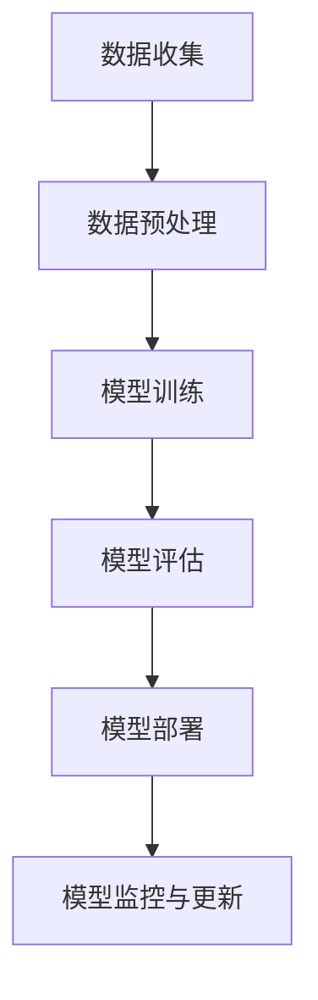

                 

## 引言与背景

### AI大模型的崛起

随着人工智能技术的不断发展，AI大模型（Large-scale Artificial Intelligence Models）逐渐成为科技领域的焦点。这些模型具有前所未有的计算能力和数据处理能力，能够进行复杂的数据分析和智能决策。从早期的神经网络到如今的Transformer模型，AI大模型的技术进步令人瞩目。这些模型在自然语言处理、计算机视觉、语音识别等多个领域展现出强大的应用潜力，使得各行各业得以实现自动化和智能化。

### AI大模型的应用领域

AI大模型的应用范围广泛，涵盖了多个领域。在自然语言处理领域，AI大模型能够实现文本生成、机器翻译、情感分析等功能，提高了信息处理的效率和准确性。在计算机视觉领域，AI大模型能够进行图像分类、目标检测、图像生成等任务，为图像处理和计算机视觉研究提供了强有力的工具。在语音识别领域，AI大模型能够实现语音到文字的转换，提升了人机交互的体验。此外，AI大模型还在医疗、金融、教育等多个领域发挥着重要作用，为社会发展和产业升级提供了新的动力。

### AI大模型商业模式的潜力

随着AI大模型技术的成熟，构建基于AI大模型的商业模式成为企业创新的重要方向。一个成功的商业模式不仅能够为企业带来经济效益，还能够推动技术进步和社会发展。然而，AI大模型商业模式的构建面临着诸多挑战，包括技术风险、市场风险、法律风险等。因此，如何构建一个可持续的、有竞争力的AI大模型商业模式成为当前研究和实践的热点问题。

### 文章目的与结构

本文旨在探讨AI大模型商业模式的构建，通过分析市场现状、技术创新、商业模式设计、验证与调整等多个方面，提供一套系统化的构建方法。文章结构分为三个主要部分：

1. **引入与背景**：介绍AI大模型的基本概念、发展历程及应用领域，以及AI大模型商业模式的重要性和挑战。

2. **AI大模型商业模式构建**：详细阐述市场研究与定位、商业模式创新、业务模式设计、商业模式验证与调整等关键环节。

3. **实践与案例**：通过具体案例分享，分析AI大模型创业的实战经验，评估与优化商业模式的方法。

通过本文的探讨，希望能够为AI大模型创业者和技术专家提供有价值的参考，推动AI大模型商业模式的创新和发展。

### 关键词

- AI大模型
- 商业模式
- 市场研究
- 商业模式创新
- 业务模式设计
- 商业模式验证与调整
- AI创业

### 摘要

本文深入探讨了AI大模型商业模式的构建。首先，我们介绍了AI大模型的基本概念、发展历程和应用领域，阐述了AI大模型商业模式的潜力和挑战。接着，我们详细分析了市场研究与定位、商业模式创新、业务模式设计、商业模式验证与调整等关键环节，提供了一套系统化的构建方法。通过具体案例分享，我们分析了AI大模型创业的实战经验，并提出了评估与优化商业模式的方法。本文旨在为AI大模型创业者和技术专家提供有价值的参考，助力他们在复杂多变的市场环境中实现可持续发展。 

---

## 第一部分：引入与背景

### 第1章：AI大模型概述

#### 1.1 AI大模型的基本概念

AI大模型（Large-scale Artificial Intelligence Models），是指具有大规模参数、能够处理海量数据并具备高度复杂计算能力的神经网络模型。这些模型通常基于深度学习技术，能够通过大量数据进行自我学习和优化，从而实现高效的预测、分类和生成任务。AI大模型的基本概念包括以下几个核心要素：

- **参数规模**：AI大模型的参数数量通常以亿计，甚至达到数十亿、上百亿级别。这些参数的规模使得模型具备强大的表达能力和计算能力。
- **数据需求**：AI大模型通常需要海量训练数据来驱动其学习和优化过程。这些数据来源广泛，包括互联网文本、图像、语音等多种形式。
- **计算资源**：AI大模型的训练和推理过程需要大量的计算资源，尤其是GPU和TPU等高性能计算设备。这使得大模型的开发和部署成本较高。
- **泛化能力**：AI大模型通过大规模数据训练，能够实现较高的泛化能力，即在新的数据集上仍然能够保持较高的性能。

#### 1.2 AI大模型的发展历程

AI大模型的发展历程可以追溯到深度学习技术的兴起。以下是几个重要的发展阶段：

- **2006年**：Geoffrey Hinton等人提出深度信念网络（DBN），标志着深度学习技术的初步兴起。
- **2012年**：AlexNet在ImageNet竞赛中取得突破性成绩，深度卷积神经网络（CNN）开始受到广泛关注。
- **2017年**：Google提出的Transformer模型在机器翻译任务中表现出色，开启了大模型时代。
- **2020年**：GPT-3等超大规模语言模型问世，使得自然语言处理领域取得了显著进展。

#### 1.3 AI大模型的应用领域

AI大模型在多个领域取得了显著的应用成果，以下是一些主要的应用领域：

- **自然语言处理（NLP）**：AI大模型在NLP领域表现出色，能够实现文本生成、机器翻译、情感分析等功能。
- **计算机视觉（CV）**：AI大模型在CV领域能够进行图像分类、目标检测、图像生成等任务，为图像处理和计算机视觉研究提供了强有力的工具。
- **语音识别（ASR）**：AI大模型在语音识别领域能够实现高精度的语音到文字转换，提升了人机交互的体验。
- **医疗**：AI大模型在医疗领域用于疾病诊断、药物研发、个性化治疗等方面，为医疗行业带来了新的变革。
- **金融**：AI大模型在金融领域用于风险评估、市场预测、欺诈检测等任务，提升了金融服务的智能化水平。
- **教育**：AI大模型在教育领域用于智能辅导、课程生成、学习评估等任务，为教育行业提供了创新的教学模式。

#### 1.4 AI大模型的优势和挑战

AI大模型具有以下优势和挑战：

- **优势**：
  - **强大的计算能力**：AI大模型能够通过大规模参数和海量数据实现高效的计算，从而解决复杂问题。
  - **出色的泛化能力**：AI大模型通过大规模数据训练，能够实现较高的泛化能力，适应新的任务和数据。
  - **广泛的应用场景**：AI大模型在多个领域表现出色，能够为各行各业带来创新和变革。

- **挑战**：
  - **计算资源需求高**：AI大模型的训练和推理过程需要大量的计算资源，包括GPU、TPU等高性能计算设备。
  - **数据隐私和伦理问题**：AI大模型依赖于大规模数据训练，数据隐私和伦理问题成为关注的焦点。
  - **模型解释性不足**：AI大模型的决策过程复杂，缺乏解释性，难以理解其工作原理。

#### 结论

AI大模型作为人工智能技术的核心组成部分，具有强大的计算能力和广泛的应用前景。然而，其高计算资源需求、数据隐私和伦理问题等挑战也亟待解决。在未来的发展中，如何有效利用AI大模型的优势，同时克服其挑战，将成为重要的研究方向。本文将围绕AI大模型商业模式的构建进行深入探讨，为创业者和技术专家提供有价值的参考。

---

## 第2章：商业模式的基本原理

### 2.1 商业模式的定义与类型

商业模式（Business Model）是企业如何创造、传递和捕获价值的体系。它不仅包括企业的收入来源和成本结构，还涵盖了企业的业务模式、客户关系、价值链等多个方面。商业模式的定义多种多样，其中最具代表性的观点之一是由亚历山大·奥斯特瓦尔德（Alexander Osterwalder）在《商业模式画布》（Business Model Canvas）中提出的，即商业模式是企业如何创造、传递和获取价值的总体策略。

商业模式的类型可以根据不同的分类标准进行划分：

- **按收入来源分类**：
  - 产品销售：企业通过销售产品获取收入，如传统制造行业。
  - 服务提供：企业通过提供服务获取收入，如专业咨询公司。
  - 订阅模式：企业通过订阅服务获取收入，如SaaS（Software as a Service）提供商。
  - 广告模式：企业通过展示广告获取收入，如搜索引擎和社交媒体平台。

- **按业务模式分类**：
  - B2B（Business-to-Business）：企业对企业，如软件开发商。
  - B2C（Business-to-Consumer）：企业对消费者，如电商平台。
  - C2C（Consumer-to-Consumer）：消费者对消费者，如二手交易平台。
  - B2B2C（Business-to-Business-to-Consumer）：企业通过合作伙伴对企业，再对消费者销售，如制造商与零售商的合作模式。

- **按价值链分类**：
  - 上游价值链：涉及原材料采购、供应商管理等方面。
  - 中游价值链：涉及生产、制造、服务等环节。
  - 下游价值链：涉及分销、销售、客户服务等环节。

### 2.2 价值链分析

价值链分析（Value Chain Analysis）是企业评估其内部活动和流程，以确定如何创造价值的关键方法。迈克尔·波特（Michael Porter）在1985年提出了价值链分析模型，该模型将企业的活动分为主要活动和支持活动。

- **主要活动**：
  - **内部物流**：涉及原材料的接收、存储和分配。
  - **生产操作**：涉及产品的生产、加工和组装。
  - **外部物流**：涉及产品的储存、运输和分销。
  - **营销与销售**：涉及产品的市场推广、销售渠道和客户关系管理。
  - **服务**：涉及产品的售后服务、客户支持和维护。

- **支持活动**：
  - **采购**：涉及原材料、设备和服务的采购。
  - **技术发展**：涉及研发、技术创新和知识产权管理。
  - **人力资源管理**：涉及员工招聘、培训和发展。
  - **企业基础设施**：涉及企业的组织结构、财务管理、法律事务等方面。

通过价值链分析，企业可以识别出价值创造的关键环节，并对其进行优化，以提高整体效率和竞争力。

### 2.3 创新与竞争战略

创新和竞争战略是企业获取竞争优势的重要手段。以下是一些关键的策略：

- **差异化战略**：通过提供独特的、差异化的产品或服务，满足客户特殊需求，从而在市场中获得竞争优势。
- **成本领先战略**：通过规模经济和成本效率，以较低的成本提供产品或服务，从而在市场中占据领先地位。
- **集中战略**：专注于特定的市场细分或客户群体，提供定制化的产品或服务，以满足其特定需求。

- **技术创新**：通过不断的技术创新，开发具有竞争力的新产品或服务，从而推动企业的发展。
- **市场拓展**：通过市场拓展，进入新的地理区域或行业，扩大企业的业务范围。
- **合作伙伴关系**：通过建立战略合作伙伴关系，整合资源和能力，提高市场竞争力。

创新和竞争战略需要结合企业的实际情况和外部环境进行综合评估，以制定出有效的战略规划。

#### 结论

商业模式是企业在市场中生存和发展的关键，它涵盖了企业的收入来源、成本结构、业务模式等多个方面。通过价值链分析和创新与竞争战略，企业可以识别出价值创造的关键环节，并制定出有效的商业模式。本文将围绕商业模式的基本原理，进一步探讨AI大模型商业模式的构建，为创业者和技术专家提供有价值的参考。

---

## 第3章：市场研究与定位

### 3.1 市场研究方法

市场研究是构建成功商业模式的重要基础，它帮助企业了解市场需求、竞争对手、潜在客户等信息。以下是几种常用的市场研究方法：

- **问卷调查**：通过设计问卷，收集大量目标客户的反馈意见，以了解客户需求和市场趋势。
- **深度访谈**：通过面对面或在线访谈，深入了解客户的购买行为、需求和痛点。
- **焦点小组**：邀请一组目标客户，就特定话题进行讨论，以获取多角度的意见和建议。
- **市场分析工具**：利用数据分析工具，对市场数据进行定量分析，以发现市场规律和趋势。
- **竞争分析**：通过分析竞争对手的产品、价格、市场策略等，了解竞争对手的优势和不足。

### 3.2 定位策略

市场定位（Market Positioning）是企业根据市场调研结果，确定其在市场中的位置和形象的过程。有效的市场定位能够帮助企业获得竞争优势，以下是几种常见的市场定位策略：

- **领导者定位**：成为市场中的领导者，通过规模经济和品牌效应，吸引大量客户。
- **追随者定位**：专注于市场的细分领域，提供差异化的产品或服务，以填补市场空白。
- **市场补缺者定位**：专注于特定的市场细分，提供定制化的产品或服务，以满足特定客户的需求。
- **独特价值定位**：通过提供独特的、差异化的产品或服务，树立品牌形象，吸引特定类型的客户。

### 3.3 用户需求分析

用户需求分析是市场研究的重要环节，它帮助企业了解目标客户的需求、痛点和偏好。以下是几种常用的用户需求分析方法：

- **行为分析**：通过分析用户的购买行为、使用习惯等，了解用户的需求和偏好。
- **问卷调查**：通过设计问卷，收集用户对产品或服务的反馈意见，以了解用户的需求和期望。
- **用户访谈**：通过面对面或在线访谈，深入了解用户的使用体验、需求和痛点。
- **用户场景分析**：通过构建用户使用产品的场景，模拟用户的实际使用过程，以了解用户的需求和痛点。

### 结论

市场研究是构建成功商业模式的关键，通过问卷调查、深度访谈、市场分析工具等研究方法，企业可以深入了解市场需求和用户需求。有效的市场定位策略和用户需求分析能够帮助企业确定其在市场中的位置和形象，从而制定出有针对性的商业模式。本文将在此基础上，进一步探讨AI大模型商业模式的构建，为创业者和技术专家提供有价值的参考。

---

## 第4章：商业模式创新

### 4.1 商业模式创新的途径

商业模式创新是企业保持竞争优势、实现持续发展的关键。以下是几种常见的商业模式创新途径：

- **平台模式**：通过构建一个开放的平台，吸引第三方开发者和服务提供商加入，共同创造价值。例如，亚马逊通过其平台，连接了全球的卖家和买家，创造了巨大的商业价值。

- **订阅模式**：通过提供订阅服务，使客户按月或按年支付费用，获得持续的、定期的产品或服务。例如，Netflix通过订阅模式，提供了全球范围内的流媒体服务，吸引了大量用户。

- **共享经济模式**：通过共享资源，降低使用成本，提高资源利用率。例如，Uber和Airbnb通过共享经济模式，改变了传统的出行和住宿方式。

- **生态系统模式**：通过构建一个生态系统，整合各种资源和服务，为客户提供全方位的解决方案。例如，苹果的生态系统包括硬件、软件和服务，为用户提供了无缝的体验。

### 4.2 成功案例分享

以下是几个AI大模型领域的成功案例，展示了不同的商业模式创新：

- **案例1：谷歌的TensorFlow**：谷歌通过TensorFlow提供了一个开源的机器学习平台，吸引了全球的开发者和研究机构加入。TensorFlow不仅为谷歌自身带来了巨大的技术优势，还促进了整个机器学习社区的发展。这种平台模式的创新，使得谷歌在人工智能领域保持了领先地位。

- **案例2：OpenAI的GPT-3**：OpenAI通过GPT-3向开发者提供大规模的预训练语言模型，使得开发者可以轻松地构建具有自然语言处理能力的应用程序。GPT-3的订阅模式，不仅为OpenAI带来了持续的收入，还推动了自然语言处理技术的广泛应用。

- **案例3：图灵机器人的智能客服**：图灵机器人通过提供智能客服解决方案，为企业提供了高效、低成本的服务支持。这种共享经济模式的创新，使得企业能够更好地利用人工智能技术，提高客户满意度和运营效率。

### 4.3 创新风险与应对

尽管商业模式创新为企业带来了巨大的机遇，但也伴随着一定的风险。以下是几种常见的创新风险及其应对策略：

- **技术风险**：新技术的不确定性和快速变化可能导致商业模式无法实现预期效果。应对策略包括：
  - **持续研发**：保持对新技术的研究和投入，及时调整商业模式。
  - **合作伙伴关系**：与技术和研究机构建立合作伙伴关系，共同分担技术风险。

- **市场风险**：市场需求的变化可能导致商业模式无法适应市场环境。应对策略包括：
  - **市场调研**：定期进行市场调研，了解市场动态和客户需求。
  - **快速迭代**：快速调整和优化商业模式，以适应市场需求。

- **法律风险**：涉及知识产权、数据隐私等方面的法律风险。应对策略包括：
  - **法律咨询**：聘请专业法律团队，确保商业模式合法合规。
  - **数据保护**：加强数据保护措施，确保客户数据的安全。

### 结论

商业模式创新是企业保持竞争优势、实现持续发展的关键。通过平台模式、订阅模式、共享经济模式和生态系统模式等创新途径，企业可以创造新的价值。成功案例分享展示了不同的商业模式创新方法，同时也揭示了创新过程中可能面临的风险。通过有效的应对策略，企业可以降低风险，实现商业模式的成功创新。本文将在后续章节中，进一步探讨如何设计AI大模型商业模式，为创业者和技术专家提供有价值的参考。

---

## 第5章：AI大模型业务模式设计

### 5.1 AI大模型业务模式的组成

AI大模型业务模式设计是一个复杂且系统化的过程，它涉及到多个关键组件和环节，这些组件共同作用，确保业务模式的可行性和盈利能力。以下是AI大模型业务模式的主要组成：

- **技术组件**：这是业务模式设计的核心，包括AI大模型的开发、训练、部署和运维等。技术组件需要具备高效性、稳定性和可扩展性，以确保模型能够在实际应用中提供高质量的服务。

- **数据组件**：数据是AI大模型的基石。数据组件涉及数据的收集、清洗、存储和管理等。高质量的数据能够提升模型的性能，而数据的管理和维护也是确保模型稳定运行的关键。

- **基础设施组件**：基础设施组件包括计算资源、存储资源和网络资源等。高性能的基础设施是支持AI大模型训练和推理的基础，对于降低成本、提高效率至关重要。

- **业务逻辑组件**：业务逻辑组件定义了AI大模型在实际业务场景中的应用，包括数据处理流程、业务规则、决策逻辑等。这一组件需要与企业的业务需求紧密结合，确保AI大模型能够为企业带来实际价值。

- **客户服务组件**：客户服务组件包括售前咨询、售后服务、客户支持等。良好的客户服务能够提升客户满意度，增加客户粘性，从而推动业务的持续发展。

- **商业模式组件**：商业模式组件定义了AI大模型的盈利模式，包括收费方式、定价策略、合作伙伴关系等。一个成功的商业模式能够确保AI大模型的商业可持续性。

### 5.2 业务模式设计流程

业务模式设计流程是一个系统化的过程，包括以下几个主要阶段：

- **需求分析**：在业务模式设计之初，需要深入了解企业的业务需求、市场环境和客户需求。这一阶段的目标是明确AI大模型需要解决的问题和实现的目标。

- **技术选型**：根据需求分析的结果，选择合适的技术框架和算法。技术选型需要考虑模型的性能、可扩展性、成本和可维护性等因素。

- **数据准备**：数据是AI大模型的核心，需要确保数据的质量、完整性和多样性。数据准备包括数据收集、数据清洗、数据标注等。

- **基础设施规划**：根据模型的技术需求，规划合适的计算资源和存储资源。这一阶段需要考虑成本效益、性能和可扩展性。

- **业务逻辑设计**：定义AI大模型在实际业务场景中的应用流程，包括数据处理流程、业务规则、决策逻辑等。这一阶段需要与企业的业务部门密切合作，确保业务逻辑的可行性和有效性。

- **商业模式设计**：在技术、数据和基础设施都准备就绪后，设计商业模式，包括收费方式、定价策略、合作伙伴关系等。商业模式设计需要考虑市场的接受度、盈利能力和可持续性。

- **验证与调整**：在初步设计完成后，对业务模式进行验证，通过试点项目和客户反馈，发现潜在问题并进行调整。这一阶段是确保业务模式可行性和有效性的关键。

### 5.3 案例分析

为了更好地理解AI大模型业务模式设计，我们来看一个实际案例：

**案例：某医疗健康公司AI大模型业务模式设计**

1. **需求分析**：该公司希望通过AI大模型提供精准的疾病诊断服务，以提升诊断效率和准确性。

2. **技术选型**：选择基于深度学习的图像识别算法，用于分析医学影像。

3. **数据准备**：收集大量的医学影像数据，包括X光片、CT扫描、MRI等，并进行数据清洗和标注。

4. **基础设施规划**：租用高性能云计算服务，如AWS或Google Cloud，用于模型的训练和推理。

5. **业务逻辑设计**：设计一套标准化的诊断流程，包括数据输入、模型处理、结果输出和医生审核等。

6. **商业模式设计**：采用按次收费模式，用户每次使用AI大模型诊断服务需要支付一定费用。同时，与医疗机构合作，提供批量诊断服务，降低单个诊断成本。

7. **验证与调整**：通过试点项目，收集医生和患者的反馈，不断优化模型和业务流程。

**结论**

AI大模型业务模式设计是一个复杂的过程，需要综合考虑技术、数据、基础设施、业务逻辑和商业模式等多个方面。通过系统化的设计流程和实际案例分析，企业可以构建一个具有可行性和盈利能力的AI大模型业务模式。本文将在后续章节中，进一步探讨如何验证和调整AI大模型商业模式，为创业者和技术专家提供更深入的指导。

---

## 第6章：商业模式验证与调整

### 6.1 商业模式验证方法

商业模式验证是确保商业模式可行性和有效性的关键步骤。通过验证，企业可以识别出潜在问题，并进行必要的调整。以下是几种常用的商业模式验证方法：

- **试点项目**：通过在小范围内实施商业模式，收集用户反馈和数据，评估商业模式的实际效果。试点项目可以帮助企业发现商业模式中的不足之处，并进行调整。

- **用户调研**：通过与目标用户进行访谈或问卷调查，了解用户对商业模式的看法和需求。用户调研可以提供宝贵的一手数据，帮助企业优化商业模式。

- **市场模拟**：通过模拟市场环境，评估商业模式在市场中的表现。市场模拟可以帮助企业预测市场反应，识别潜在风险和机会。

- **基准测试**：将商业模式与行业标准或竞争对手进行比较，评估其竞争优势和劣势。基准测试可以帮助企业确定商业模式的优化方向。

### 6.2 调整策略

在商业模式验证过程中，如果发现商业模式存在问题，需要采取相应的调整策略。以下是几种常见的调整策略：

- **业务模式调整**：对商业模式的核心组件进行调整，如优化价值链、改进产品或服务、调整定价策略等。业务模式调整可以针对具体问题进行优化，提高商业模式的可行性和盈利能力。

- **合作伙伴关系调整**：重新评估与合作伙伴的关系，建立新的合作模式或调整现有合作模式。通过合作伙伴关系的调整，企业可以获取更多的资源和能力，提高市场竞争力。

- **市场策略调整**：根据市场反馈和竞争环境，调整市场策略，如扩大市场覆盖范围、调整营销策略、优化客户服务流程等。市场策略调整可以帮助企业更好地适应市场需求，提高市场份额。

- **技术创新调整**：根据技术发展和市场需求，调整技术创新方向。技术创新调整可以确保企业的技术优势，保持市场竞争力。

### 6.3 成功案例分享

以下是两个成功的商业模式验证与调整案例：

**案例1：某在线教育平台**

- **问题**：初期商业模式中，该平台主要通过在线课程销售盈利，但用户留存率较低，导致收入不稳定。
- **验证方法**：通过试点项目和用户调研，发现用户对互动性和个性化学习体验有较高需求。
- **调整策略**：调整商业模式，增加了实时互动功能、个性化学习推荐等，同时与教育机构合作，提供更多优质课程资源。
- **结果**：用户留存率显著提高，收入稳步增长。

**案例2：某智能硬件公司**

- **问题**：初期商业模式中，公司主要通过硬件销售盈利，但硬件更新换代周期较长，导致收入增长乏力。
- **验证方法**：通过市场模拟和竞争分析，发现用户对持续的技术创新和增值服务有较高需求。
- **调整策略**：调整商业模式，增加了硬件租赁和软件订阅服务，同时提供定期技术升级和增值服务。
- **结果**：收入来源多样化，市场竞争力显著提升。

### 结论

商业模式验证与调整是确保商业模式成功的关键。通过试点项目、用户调研、市场模拟和基准测试等方法，企业可以识别出商业模式中的不足，并采取相应的调整策略。成功的案例分享展示了验证与调整的重要性，以及如何通过调整策略实现商业模式的优化和增长。本文将在后续章节中，进一步探讨AI大模型商业模式在未来展望与挑战中的发展路径。

---

## 第7章：未来展望与挑战

### 7.1 AI大模型商业模式的未来趋势

AI大模型商业模式的未来发展趋势受到技术进步、市场需求和政策环境等多方面因素的影响。以下是几个关键趋势：

- **技术创新加速**：随着深度学习、联邦学习、生成对抗网络（GAN）等技术的不断发展，AI大模型将具备更强大的计算能力和泛化能力，从而推动商业模式的创新。

- **市场需求的扩大**：AI大模型在自然语言处理、计算机视觉、医疗、金融等多个领域的应用前景广阔。随着市场需求的不断扩大，AI大模型商业模式将迎来更广阔的发展空间。

- **数据隐私与伦理问题**：随着AI大模型对海量数据的依赖性增加，数据隐私和伦理问题将成为重要的挑战。未来的商业模式将需要更加注重数据保护、用户隐私和伦理规范。

- **跨行业融合**：AI大模型商业模式将与其他行业（如制造业、零售业、金融业等）深度融合，推动产业智能化和数字化转型。

### 7.2 法律法规与社会责任

在AI大模型商业模式的未来发展中，法律法规和社会责任将扮演重要角色。以下是几个关键方面：

- **数据隐私法规**：随着欧盟《通用数据保护条例》（GDPR）等数据隐私法规的出台，企业需要更加重视数据保护，确保用户隐私得到有效保护。

- **算法透明性与解释性**：为了增强公众对AI大模型的信任，算法的透明性和解释性将成为重要关注点。企业需要提供详细的算法解释，以便用户和监管机构了解模型的工作原理。

- **社会责任**：企业需要承担更多的社会责任，确保AI大模型的应用不会对环境、社会和人类造成负面影响。例如，在医疗领域，AI大模型需要确保其诊断和建议不会对患者的健康造成不利影响。

### 7.3 持续创新与竞争力提升

为了在未来的市场竞争中保持优势，企业需要不断进行创新，提升自身竞争力。以下是几个关键策略：

- **技术创新**：企业需要持续关注新技术的发展，积极采用先进的算法和框架，不断提升AI大模型的性能和效率。

- **生态系统建设**：企业需要构建一个开放的生态系统，吸引第三方开发者、合作伙伴和用户参与，共同推动AI大模型技术的发展和应用。

- **数据驱动**：企业需要利用大数据和人工智能技术，深入挖掘数据价值，优化业务流程和决策过程。

- **人才培养**：企业需要重视人才培养，建立一支具备专业知识和创新能力的团队，以应对不断变化的市场和技术环境。

### 结论

AI大模型商业模式的未来充满了机遇和挑战。随着技术的不断进步和市场的扩大，AI大模型将在多个领域发挥重要作用。同时，法律法规和社会责任也将对商业模式的发展产生深远影响。企业需要积极应对这些挑战，通过持续创新和竞争力提升，保持市场领先地位。本文旨在为创业者和技术专家提供有价值的参考，助力他们在AI大模型商业模式的未来发展中取得成功。

---

## 第8章：AI大模型创业实战

### 8.1 创业者必备技能

在AI大模型创业过程中，创业者需要具备一系列核心技能，以确保项目的成功。以下是几个关键技能：

- **技术能力**：创业者需要具备深度学习、机器学习等AI技术的基础知识，能够设计和实现高效的AI大模型。此外，创业者还需要熟悉常用的编程语言（如Python）和深度学习框架（如TensorFlow、PyTorch）。

- **项目管理能力**：创业者需要具备项目管理能力，能够合理规划项目进度、资源分配和风险管理。良好的项目管理能力有助于确保项目按时交付并实现预期目标。

- **团队协作能力**：创业者需要具备团队协作能力，能够搭建和管理高效的团队。团队协作能力包括沟通技巧、冲突管理、团队合作精神的培养等。

- **市场洞察力**：创业者需要具备市场洞察力，能够准确把握市场需求，制定有针对性的商业策略。市场洞察力有助于创业者识别市场机会和潜在风险，制定有效的市场推广策略。

- **融资能力**：创业者需要具备融资能力，能够通过股权融资、债务融资等方式筹集资金，确保项目有充足的资金支持。

### 8.2 创业流程与策略

AI大模型创业流程可以分为以下几个关键阶段：

- **市场调研**：在创业初期，创业者需要进行市场调研，了解市场需求、竞争对手和潜在客户。通过市场调研，创业者可以确定目标市场和产品定位。

- **技术选型**：根据市场调研的结果，创业者需要选择合适的技术方案，包括深度学习框架、算法、数据集等。技术选型需要考虑模型的性能、可扩展性和成本等因素。

- **团队搭建**：创业者需要组建一支高效的团队，包括AI技术专家、数据科学家、项目经理、市场营销人员等。团队搭建需要考虑团队成员的技能互补和协作能力。

- **产品开发**：在团队搭建完成后，创业者可以开始进行产品开发。产品开发包括模型设计、训练、优化和部署等环节。创业者需要确保产品具有高性能、高稳定性和易用性。

- **市场推广**：产品开发完成后，创业者需要进行市场推广，吸引潜在客户。市场推广可以通过线上线下渠道进行，包括广告、社交媒体、行业展会等。

- **持续迭代**：在市场推广过程中，创业者需要不断收集用户反馈，优化产品功能和用户体验。持续迭代有助于提升产品竞争力，增加用户粘性。

### 8.3 成功创业案例分析

以下是两个AI大模型创业的成功案例分析：

**案例1：某自然语言处理初创公司**

- **背景**：该公司专注于自然语言处理技术，旨在提供智能客服解决方案。

- **市场调研**：通过对市场调研，发现企业对于高效、智能的客服系统有强烈需求。

- **技术选型**：选择基于Transformer的模型架构，结合大规模预训练语言模型，确保系统的高性能和稳定性。

- **团队搭建**：组建了一支由AI技术专家和经验丰富的产品经理组成的团队。

- **产品开发**：经过数月的研发，成功推出了基于AI大模型的智能客服系统，具备自然语言理解、自动回复等功能。

- **市场推广**：通过线上营销、行业展会等方式，成功吸引了多家企业客户。

- **持续迭代**：根据客户反馈，不断优化系统功能和用户体验，获得了良好的市场口碑。

**案例2：某计算机视觉初创公司**

- **背景**：该公司专注于计算机视觉技术，旨在提供智能监控解决方案。

- **市场调研**：发现城市安防、工厂监控等领域对于智能监控系统的需求日益增长。

- **技术选型**：选择基于卷积神经网络的模型架构，结合实时数据分析和图像识别技术，确保系统的高效性和准确性。

- **团队搭建**：组建了一支由AI技术专家、软件工程师和行业顾问组成的团队。

- **产品开发**：经过数月的研发，成功推出了具备人脸识别、行为分析等功能的智能监控系统。

- **市场推广**：通过与安防公司和政府机构合作，逐步拓展市场，获得多个大型项目。

- **持续迭代**：根据客户反馈，不断优化系统功能和性能，提升了用户满意度。

### 结论

AI大模型创业需要创业者具备技术、管理、市场等多方面的技能，并遵循科学的创业流程。通过成功的创业案例，我们可以看到，市场调研、技术选型、团队搭建、产品开发、市场推广和持续迭代是创业成功的关键。本文旨在为创业者提供有价值的指导，助力他们在AI大模型创业道路上取得成功。

---

## 第9章：AI大模型商业模式评估与优化

### 9.1 评估指标与方法

评估AI大模型商业模式的优劣是确保其可持续发展和盈利能力的关键。以下是几个关键的评估指标及相应的评估方法：

- **盈利能力**：这是评估商业模式的首要指标，包括收入、利润和投资回报率（ROI）。通过财务分析，可以计算毛利率、净利率和净利润率，了解商业模式的盈利水平。

- **市场接受度**：市场接受度反映了商业模式在市场中的受欢迎程度，可以通过用户增长率、市场份额和客户留存率等指标来衡量。高市场接受度意味着商业模式具有良好的市场前景。

- **用户满意度**：用户满意度是商业模式成功的基石。可以通过用户反馈调查、用户留存率和用户评分等指标来评估。高用户满意度有助于提升客户忠诚度和品牌形象。

- **成本效益**：成本效益反映了商业模式在提供产品或服务时的经济性。可以通过成本结构分析、成本控制和成本效益分析等方法来评估。良好的成本效益能够确保商业模式的可持续性。

- **创新能力**：创新能力是商业模式持续发展的动力。可以通过专利数量、技术更新速度和创新成果等指标来衡量。高创新能力有助于企业在激烈的市场竞争中保持领先地位。

### 9.2 优化策略

在评估商业模式的基础上，制定和实施优化策略是提高商业模式效率和市场竞争力的重要手段。以下是几个优化策略：

- **成本控制**：通过优化成本结构、提高生产效率、降低运营成本等方式，实现成本的可持续控制。例如，利用自动化工具和云计算服务，降低硬件和人力成本。

- **提高市场接受度**：通过市场调研、用户反馈和竞争分析，了解市场需求和用户偏好，针对性地优化产品和服务。例如，增加产品功能、提升用户体验、提供定制化解决方案等。

- **提升用户满意度**：通过改进售后服务、提供个性化服务、建立客户忠诚计划等方式，提升用户满意度和忠诚度。例如，建立24/7客服热线、提供用户培训和支持等。

- **创新驱动**：通过持续的技术创新、产品迭代和市场扩展，保持商业模式的市场竞争力。例如，研发新技术、推出新产品、开拓新市场等。

- **合作伙伴关系**：建立与供应商、分销商、行业专家等的合作关系，共享资源和能力，提高商业模式的整体效益。例如，与硬件制造商合作提供集成解决方案、与行业专家合作提供专业咨询等。

### 9.3 持续优化与实践

持续优化是商业模式成功的关键。以下是几个持续优化的实践方法：

- **定期评估**：定期对商业模式进行评估，分析各项关键指标的表现，发现潜在问题和优化方向。

- **用户反馈**：收集用户反馈，了解用户需求和体验，及时调整和改进产品和服务。

- **数据分析**：利用数据分析工具，深入挖掘数据价值，识别市场趋势和用户行为，为优化决策提供依据。

- **试点项目**：通过试点项目和实验性研究，验证新的商业模式和创新策略，评估其实际效果。

- **持续学习**：跟踪行业动态和技术发展趋势，持续学习和引入新的管理理念、技术工具和方法，保持商业模式的创新活力。

### 结论

AI大模型商业模式的评估与优化是一个系统化、持续性的过程。通过制定科学的评估指标、实施有效的优化策略，企业可以提升商业模式的效率和竞争力。本文旨在为创业者和技术专家提供一套实用的评估和优化方法，助力他们在AI大模型商业模式的实践中取得成功。

---

## 第10章：附录

### 10.1 常用工具与资源

在AI大模型商业模式的构建过程中，以下是一些常用的工具和资源，供创业者和技术专家参考：

- **深度学习框架**：TensorFlow、PyTorch、Keras等。
- **云计算平台**：AWS、Google Cloud、Azure等。
- **数据存储与处理工具**：Hadoop、Spark、Pandas、NumPy等。
- **数据分析工具**：Tableau、PowerBI、Google Data Studio等。
- **开源数据集**：Kaggle、UCI机器学习库、Google Dataset Search等。
- **市场调研工具**：SurveyMonkey、Google Analytics、Qualtrics等。

### 10.2 商业模式模型库

以下是几个常用的商业模式模型库，供创业者参考：

- **Business Model Canvas**：由亚历山大·奥斯特瓦尔德提出，提供了一个简洁明了的框架，用于描述企业的商业模式。
- **价值网（Value Net）**：由杰夫·蒂尔尼（Jeff Timmins）提出，用于描述企业与其合作伙伴、客户之间的价值交换。
- **平衡计分卡（Balanced Scorecard）**：由罗伯特·S·卡普兰和戴维·P·诺顿提出，用于衡量企业的绩效和战略实施。

### 10.3 进一步阅读资料

以下是几本关于AI大模型商业模式构建的推荐阅读书籍：

- **《AI商业革命》**：作者：埃里克·托普（Eric Siegel），介绍了AI在商业中的应用和商业模式创新。
- **《深度学习》**：作者：伊恩·古德费洛（Ian Goodfellow）、约书亚·本吉奥（Joshua Bengio）和阿曼德·科里（Aaron Courville），详细介绍了深度学习的基础知识和应用。
- **《商业模式新生代》**：作者：亚历山大·奥斯特瓦尔德（Alexander Osterwalder）和伊芙·皮尼厄（Yves Pigneur），提供了丰富的商业模式案例和工具。

通过阅读这些资料，创业者和技术专家可以更深入地了解AI大模型商业模式的构建和实践，为自身项目提供有价值的参考。

---

## 附录：AI大模型架构与算法原理

### AI大模型架构流程图

以下是AI大模型的架构流程图，使用Mermaid语法绘制：



### AI大模型核心算法伪代码

以下是AI大模型核心算法（例如GPT-3）的伪代码：

```python
# 伪代码：生成预训练模型
pretrained_model = GPT3Model(
    vocabulary_size=25000,
    hidden_size=1024,
    num_layers=12,
    learning_rate=0.00015
)

# 伪代码：训练模型
for epoch in range(num_epochs):
    for batch in data_loader:
        loss = pretrained_model.train_one_batch(batch)
        print(f"Epoch {epoch}: Loss = {loss}")

# 伪代码：评估模型
evaluation_loss = pretrained_model.evaluate(data_loader)
print(f"Final Evaluation Loss: {evaluation_loss}")

# 伪代码：生成文本
generated_text = pretrained_model.generate_text(start_sequence="The quick brown fox jumps over the lazy dog", max_length=50)
print(f"Generated Text: {generated_text}")
```

### 数学模型与公式讲解

AI大模型的核心是基于深度学习，深度学习中的数学模型主要涉及以下几个方面：

- **反向传播算法**：用于训练神经网络的梯度下降优化方法。
- **激活函数**：如ReLU、Sigmoid、Tanh等，用于增加模型的非线性。
- **损失函数**：如交叉熵、均方误差等，用于评估模型的预测误差。

以下是反向传播算法的数学公式：

$$
\begin{aligned}
\delta_{l}^{(j)} &= \frac{\partial L}{\partial z^{(l)}} \cdot \frac{\partial z^{(l)}}{\partial w^{(l)}_{ij} \\
\frac{\partial L}{\partial w^{(l)}_{ij}} &= \delta_{l}^{(j)} \cdot a^{(l-1)}_{i}
\end{aligned}
$$

### 代码实战案例分析与解读

以下是一个简单的代码实战案例，用于训练和评估一个基于TensorFlow的AI大模型：

```python
import tensorflow as tf
from tensorflow.keras.layers import Embedding, LSTM, Dense
from tensorflow.keras.models import Sequential

# 创建模型
model = Sequential([
    Embedding(vocabulary_size, embedding_dim),
    LSTM(units=128, return_sequences=True),
    LSTM(units=128),
    Dense(units=num_classes, activation='softmax')
])

# 编译模型
model.compile(optimizer='adam', loss='categorical_crossentropy', metrics=['accuracy'])

# 加载数据
(x_train, y_train), (x_test, y_test) = tf.keras.datasets.imdb.load_data(num_words=vocabulary_size)

# 预处理数据
x_train = pad_sequences(x_train, maxlen=max_length)
x_test = pad_sequences(x_test, maxlen=max_length)
y_train = tf.keras.utils.to_categorical(y_train, num_classes=num_classes)
y_test = tf.keras.utils.to_categorical(y_test, num_classes=num_classes)

# 训练模型
history = model.fit(x_train, y_train, epochs=10, batch_size=128, validation_data=(x_test, y_test))

# 评估模型
test_loss, test_accuracy = model.evaluate(x_test, y_test)
print(f"Test Loss: {test_loss}, Test Accuracy: {test_accuracy}")
```

在这个案例中，我们使用了IMDb电影评论数据集，通过一个简单的LSTM模型进行文本分类。代码首先定义了模型结构，然后编译模型并加载数据。接下来，通过`fit`函数训练模型，并通过`evaluate`函数评估模型性能。

### 结论

本文通过附录部分，详细介绍了AI大模型的架构与算法原理，包括架构流程图、核心算法伪代码、数学模型与公式讲解，以及代码实战案例分析与解读。这些内容为理解AI大模型的工作原理提供了基础，也为创业者和技术专家在实际项目中应用AI大模型提供了参考。通过不断学习和实践，我们可以更好地利用AI大模型的优势，推动商业模式的创新和发展。

