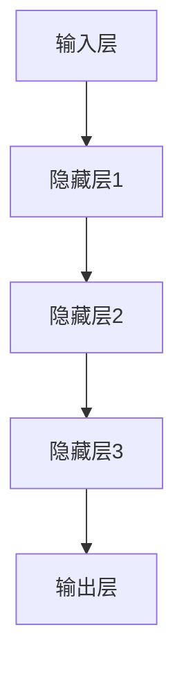

                 

# 《AI大模型创业：挑战与机遇并存的趋势分析》

## 关键词
- AI大模型
- 创业
- 挑战
- 机遇
- 应用场景
- 安全与隐私
- 伦理与社会影响

## 摘要
本文从AI大模型的基础知识出发，深入探讨了AI大模型在创业领域的应用、挑战与机遇。首先，介绍了AI大模型的基本概念、架构与原理，并分析了主流的大模型技术。接着，详细阐述了AI大模型在不同应用场景中的实践，包括文本生成、图像识别和语音识别。然后，从创业策略、项目开发、挑战与机遇平衡等方面，探讨了AI大模型创业实践。随后，本文分析了AI大模型创业面临的法律与伦理问题，并预测了未来的发展趋势。最后，通过成功与失败案例分析，总结了AI大模型创业的经验与教训。

## 目录

### 第一部分：AI大模型的基础

#### 第1章：AI大模型概述
##### 1.1 AI大模型的概念与背景
###### 1.1.1 人工智能的发展历程
###### 1.1.2 大模型技术的崛起
###### 1.1.3 大模型在AI领域的应用

##### 1.2 AI大模型的架构与原理
###### 1.2.1 深度学习与神经网络
###### 1.2.2 预训练模型的工作原理
###### 1.2.3 大模型的结构与优化

##### 1.3 主流AI大模型介绍
###### 1.3.1 GPT系列模型
###### 1.3.2 BERT及其变体
###### 1.3.3 其他知名大模型

#### 第2章：AI大模型技术基础
##### 2.1 深度学习基础
###### 2.1.1 神经网络的基本结构
###### 2.1.2 深度学习优化算法
###### 2.1.3 深度学习框架使用

##### 2.2 自然语言处理技术
###### 2.2.1 词嵌入技术
###### 2.2.2 序列模型与注意力机制
###### 2.2.3 转换器架构详解

##### 2.3 大规模预训练模型
###### 2.3.1 预训练的概念与意义
###### 2.3.2 自监督学习方法
###### 2.3.3 迁移学习与微调技术

### 第二部分：AI大模型应用实践

#### 第3章：AI大模型应用场景
##### 3.1 文本生成与应用
###### 3.1.1 文本生成概述
###### 3.1.2 文本生成案例分析
###### 3.1.3 文本生成技术实现

##### 3.2 图像识别与应用
###### 3.2.1 图像识别概述
###### 3.2.2 图像识别案例分析
###### 3.2.3 图像识别技术实现

##### 3.3 语音识别与应用
###### 3.3.1 语音识别概述
###### 3.3.2 语音识别案例分析
###### 3.3.3 语音识别技术实现

#### 第4章：AI大模型部署与优化
##### 4.1 AI大模型部署
###### 4.1.1 部署概述
###### 4.1.2 部署流程
###### 4.1.3 部署工具使用

##### 4.2 模型优化
###### 4.2.1 优化方法概述
###### 4.2.2 优化案例分析
###### 4.2.3 优化技术实现

##### 4.3 模型评估与调优
###### 4.3.1 评估指标概述
###### 4.3.2 评估案例分析
###### 4.3.3 调优方法与技巧

### 第三部分：挑战与机遇

#### 第5章：AI大模型的安全与隐私
##### 5.1 AI大模型安全挑战
###### 5.1.1 模型攻击概述
###### 5.1.2 模型防御方法
###### 5.1.3 模型安全案例分析

##### 5.2 AI大模型隐私保护
###### 5.2.1 隐私保护概述
###### 5.2.2 隐私保护技术
###### 5.2.3 隐私保护案例分析

#### 第6章：AI大模型伦理与社会影响
##### 6.1 AI大模型伦理问题
###### 6.1.1 伦理问题概述
###### 6.1.2 伦理案例分析
###### 6.1.3 伦理应对策略

##### 6.2 AI大模型社会影响
###### 6.2.1 社会影响概述
###### 6.2.2 社会影响案例分析
###### 6.2.3 社会影响应对策略

### 附录

#### 附录A：AI大模型开发工具与资源
##### A.1 开发工具介绍
###### A.1.1 TensorFlow
###### A.1.2 PyTorch
###### A.1.3 其他深度学习框架

##### A.2 资源推荐
###### A.2.1 在线课程与教程
###### A.2.2 论文与研究报告
###### A.2.3 社群与论坛

---

### 第一部分：AI大模型的基础

### 第1章：AI大模型概述

#### 1.1 AI大模型的概念与背景

##### 1.1.1 人工智能的发展历程

人工智能（AI）作为计算机科学的一个分支，其研究始于20世纪50年代。早期的人工智能研究主要集中在规则推理、知识表示和搜索算法等方面。这一阶段被称为“人工智能1.0时代”，主要特点是依赖于明确的规则和逻辑推理。

然而，随着计算能力和数据资源的不断提升，特别是在深度学习和大数据技术的推动下，人工智能进入了“人工智能2.0时代”。这一时期，人工智能的研究重点转向了模拟人脑神经网络的学习能力，通过大规模数据训练深度神经网络，实现图像识别、语音识别、自然语言处理等复杂任务。

##### 1.1.2 大模型技术的崛起

大模型技术的崛起是人工智能2.0时代的一个重要特征。大模型通常指的是具有数十亿甚至千亿参数的神经网络模型。这些模型通过在海量数据上进行预训练，可以捕获数据中的复杂模式，并在各种任务中表现出强大的性能。

大模型技术的崛起得益于以下几个因素：

1. **计算能力的提升**：随着GPU和TPU等专用计算设备的普及，计算能力的提升使得大模型训练成为可能。
2. **数据资源的丰富**：互联网的快速发展使得数据资源越来越丰富，为预训练大模型提供了充足的数据支持。
3. **深度学习技术的进步**：深度学习技术的不断迭代和优化，使得大模型的训练和优化变得更加高效。

##### 1.1.3 大模型在AI领域的应用

大模型在AI领域的应用范围广泛，涵盖了多个领域，包括自然语言处理、计算机视觉、语音识别等。以下是几个典型的应用案例：

1. **自然语言处理**：大模型在自然语言处理领域取得了显著的突破，例如GPT系列模型在文本生成、机器翻译和问答系统中表现出色。
2. **计算机视觉**：大模型在图像识别、图像生成和视频分析等任务中展现了强大的能力，如GANs在图像生成中的应用。
3. **语音识别**：大模型在语音识别任务中提高了识别准确率，使得智能语音助手和语音识别应用变得更加普及。

#### 1.2 AI大模型的架构与原理

##### 1.2.1 深度学习与神经网络

深度学习是人工智能的一个重要分支，其核心是神经网络。神经网络是由大量简单计算单元（神经元）互联而成的复杂网络，通过学习数据中的特征，可以完成各种复杂的任务。

深度学习与神经网络的联系如下：

1. **深度学习**：是指多层神经网络的学习方法。深度学习的目标是通过多层神经元的非线性变换，从原始数据中提取出更高层次的特征。
2. **神经网络**：是深度学习的基础，通过神经元之间的权重连接和激活函数，实现数据的非线性变换和特征提取。

##### 1.2.2 预训练模型的工作原理

预训练模型是AI大模型的一个重要特征。预训练模型通过在海量数据上进行预训练，可以捕获数据中的通用特征，提高模型在各种任务上的表现。预训练模型的工作原理如下：

1. **数据预处理**：首先对数据进行预处理，包括清洗、去噪和归一化等步骤，以提高数据的质量和一致性。
2. **预训练过程**：在预训练阶段，模型通常在一个大规模的语料库上进行训练，学习数据中的通用特征和规律。
3. **微调过程**：在预训练完成后，模型可以根据具体任务的需求进行微调，以适应特定的任务场景。

##### 1.2.3 大模型的结构与优化

大模型的结构与优化是保证其性能和效率的关键。大模型的结构通常包括以下几个层次：

1. **输入层**：接收外部输入数据，如文本、图像或语音信号。
2. **隐藏层**：通过非线性变换，将输入数据转换为更高层次的特征。
3. **输出层**：根据任务需求，输出相应的结果，如文本、图像或标签。

大模型的优化方法主要包括以下几个方面：

1. **优化算法**：常用的优化算法有梯度下降、随机梯度下降、Adam等，通过调整学习率、批量大小等参数，优化模型的收敛速度和精度。
2. **正则化方法**：通过引入正则化项，如L1正则化、L2正则化等，防止模型过拟合。
3. **批量归一化**：通过批量归一化，提高模型的稳定性和训练速度。

#### 1.3 主流AI大模型介绍

##### 1.3.1 GPT系列模型

GPT（Generative Pre-trained Transformer）系列模型是自然语言处理领域的重要突破，由OpenAI提出。GPT系列模型基于Transformer架构，通过预训练和微调，可以完成各种自然语言处理任务。

GPT系列模型的主要特点如下：

1. **预训练方法**：GPT系列模型通过在大量文本数据上进行预训练，学习文本的语义和语法特征。
2. **Transformer架构**：GPT系列模型采用Transformer架构，通过多头注意力机制和位置编码，捕捉文本中的长距离依赖关系。
3. **性能优异**：GPT系列模型在多个自然语言处理任务上取得了显著的性能提升，如文本生成、机器翻译和问答系统。

##### 1.3.2 BERT及其变体

BERT（Bidirectional Encoder Representations from Transformers）是由Google提出的预训练模型，主要用于自然语言处理任务。BERT模型通过双向Transformer架构，捕捉文本中的全局语义信息。

BERT及其变体的主要特点如下：

1. **双向Transformer架构**：BERT模型采用双向Transformer架构，通过同时考虑文本的前后关系，提高模型的语义理解能力。
2. **大规模预训练**：BERT模型在大量文本数据上进行预训练，学习文本的语义和语法特征。
3. **广泛适用性**：BERT及其变体在多个自然语言处理任务上取得了优异的性能，如文本分类、问答系统和命名实体识别。

##### 1.3.3 其他知名大模型

除了GPT系列模型和BERT模型外，还有许多其他知名的大模型，如：

1. **ViT（Vision Transformer）**：ViT是Google提出的一种用于计算机视觉任务的预训练模型，基于Transformer架构，通过预训练和微调，可以实现图像分类、目标检测等任务。
2. **T5（Text-To-Text Transfer Transformer）**：T5是Google提出的一种统一的文本处理模型，基于Transformer架构，通过预训练和微调，可以实现文本生成、文本分类、机器翻译等多种任务。
3. **Wav2Vec 2.0**：Wav2Vec 2.0是Google提出的一种用于语音识别的预训练模型，基于Transformer架构，通过预训练和微调，可以实现高质量的语音识别。

这些大模型在不同的任务和应用场景中展现了强大的性能，推动了人工智能技术的发展。

---

### 第一部分：AI大模型的基础

#### 第2章：AI大模型技术基础

##### 2.1 深度学习基础

深度学习是AI大模型的核心技术之一。它通过模拟人脑神经元的工作方式，构建多层神经网络，从而实现复杂的数据处理和模式识别任务。本节将介绍深度学习的基本概念、神经网络结构和优化算法。

###### 2.1.1 神经网络的基本结构

神经网络是由大量简单计算单元（神经元）互联而成的复杂网络。每个神经元都接收多个输入信号，通过加权求和处理后，输出一个激活值。神经网络的层次结构分为输入层、隐藏层和输出层。

1. **输入层**：接收外部输入数据，如文本、图像或声音信号。
2. **隐藏层**：通过非线性变换，将输入数据转换为更高层次的特征。
3. **输出层**：根据任务需求，输出相应的结果，如分类标签、文本或图像。

以下是一个简单的神经网络结构的Mermaid流程图：



###### 2.1.2 深度学习优化算法

深度学习的核心任务是优化神经网络的参数，使其在特定任务上表现更好。常用的优化算法包括梯度下降、随机梯度下降和Adam等。

1. **梯度下降**：梯度下降是一种最简单的优化算法。它通过计算损失函数关于参数的梯度，沿着梯度的反方向更新参数，以最小化损失函数。

   伪代码：

   ```python
   for epoch in range(num_epochs):
       for data in dataset:
           // 计算损失函数
           loss = compute_loss(model, data)
           // 计算梯度
           grads = compute_gradients(model)
           // 更新参数
           update_params(model, grads, learning_rate)
   ```

2. **随机梯度下降（SGD）**：随机梯度下降是对梯度下降的改进。它每次只处理一个样本，计算该样本的梯度并更新参数。SGD可以加快收敛速度，但可能引起参数的震荡。

   伪代码：

   ```python
   for epoch in range(num_epochs):
       for sample in dataset:
           // 计算损失函数
           loss = compute_loss(model, sample)
           // 计算梯度
           grads = compute_gradients(model, sample)
           // 更新参数
           update_params(model, grads, learning_rate)
   ```

3. **Adam**：Adam是梯度下降的一种变种，结合了SGD和动量法的优点。它通过计算一阶矩估计和二阶矩估计来更新参数，具有更好的收敛性能。

   伪代码：

   ```python
   for epoch in range(num_epochs):
       for data in dataset:
           // 计算损失函数
           loss = compute_loss(model, data)
           // 计算梯度
           grads = compute_gradients(model, data)
           // 更新一阶矩估计
           m = beta1 * m + (1 - beta1) * grads
           // 更新二阶矩估计
           v = beta2 * v + (1 - beta2) * (grads ** 2)
           // 计算修正的一阶矩估计和二阶矩估计
           m_hat = m / (1 - beta1 ** epoch)
           v_hat = v / (1 - beta2 ** epoch)
           // 更新参数
           update_params(model, m_hat, v_hat, learning_rate)
   ```

###### 2.1.3 深度学习框架使用

深度学习框架是简化深度学习模型开发、训练和部署的工具。常用的深度学习框架包括TensorFlow、PyTorch和Keras等。

1. **TensorFlow**：TensorFlow是Google开源的深度学习框架，具有强大的功能和高性能。使用TensorFlow可以轻松构建和训练深度学习模型。

   示例代码：

   ```python
   import tensorflow as tf

   # 定义模型
   model = tf.keras.Sequential([
       tf.keras.layers.Dense(128, activation='relu', input_shape=(784,)),
       tf.keras.layers.Dropout(0.2),
       tf.keras.layers.Dense(10)
   ])

   # 编译模型
   model.compile(optimizer='adam',
                 loss=tf.losses.SparseCategoricalCrossentropy(from_logits=True),
                 metrics=['accuracy'])

   # 训练模型
   model.fit(train_images, train_labels, epochs=5)
   ```

2. **PyTorch**：PyTorch是Facebook开源的深度学习框架，以其灵活性和动态计算图著称。使用PyTorch可以方便地构建和调试深度学习模型。

   示例代码：

   ```python
   import torch
   import torch.nn as nn
   import torch.optim as optim

   # 定义模型
   class Model(nn.Module):
       def __init__(self):
           super(Model, self).__init__()
           self.fc1 = nn.Linear(784, 128)
           self.fc2 = nn.Linear(128, 10)

       def forward(self, x):
           x = torch.relu(self.fc1(x))
           x = self.fc2(x)
           return x

   # 创建模型实例
   model = Model()

   # 编译模型
   criterion = nn.CrossEntropyLoss()
   optimizer = optim.Adam(model.parameters(), lr=0.001)

   # 训练模型
   for epoch in range(5):
       for inputs, labels in train_loader:
           optimizer.zero_grad()
           outputs = model(inputs)
           loss = criterion(outputs, labels)
           loss.backward()
           optimizer.step()
   ```

3. **Keras**：Keras是一个高层次的神经网络API，基于TensorFlow和Theano。它提供了一种更简洁和易于使用的深度学习框架。

   示例代码：

   ```python
   from tensorflow import keras

   # 定义模型
   model = keras.Sequential([
       keras.layers.Dense(128, activation='relu', input_shape=(784,)),
       keras.layers.Dropout(0.2),
       keras.layers.Dense(10)
   ])

   # 编译模型
   model.compile(optimizer='adam',
                 loss='sparse_categorical_crossentropy',
                 metrics=['accuracy'])

   # 训练模型
   model.fit(train_images, train_labels, epochs=5)
   ```

这些深度学习框架提供了丰富的功能，使得深度学习模型的开发、训练和部署变得更加简单和高效。

##### 2.2 自然语言处理技术

自然语言处理（NLP）是人工智能的一个重要分支，旨在使计算机能够理解、生成和处理人类语言。本节将介绍NLP中的几个核心技术，包括词嵌入技术、序列模型和注意力机制。

###### 2.2.1 词嵌入技术

词嵌入是将自然语言中的单词映射到固定维度的向量表示。词嵌入技术通过捕捉单词在语义和语法上的关系，提高了NLP模型的性能。常见的词嵌入技术包括Word2Vec、GloVe和BERT等。

1. **Word2Vec**：Word2Vec是Google提出的基于神经网络的语言模型。它通过训练神经网络，将单词映射到高维向量空间中，使得语义相似的单词在向量空间中距离较近。

   伪代码：

   ```python
   # 定义神经网络
   model = Word2Vec(sentences, size=100, window=5, min_count=5)

   # 获取单词向量
   word_vector = model[word]
   ```

2. **GloVe**：GloVe（Global Vectors for Word Representation）是一种基于全局统计信息的词嵌入技术。它通过计算单词之间的共现关系，学习单词的向量表示。

   伪代码：

   ```python
   # 计算共现矩阵
   cooccurrence_matrix = compute_cooccurrence_matrix(corpus)

   # 训练GloVe模型
   glove_model = Glove(size=100, x=cooccurrence_matrix)

   # 获取单词向量
   word_vector = glove_model[word]
   ```

3. **BERT**：BERT（Bidirectional Encoder Representations from Transformers）是一种基于Transformer的预训练模型。它通过在双向Transformer架构中预训练，学习单词的上下文表示。

   伪代码：

   ```python
   # 预训练BERT模型
   bert_model = BertModel.from_pretrained('bert-base-uncased')

   # 获取单词向量
   word_vector = bert_model.encode(input_ids)[0, :]
   ```

###### 2.2.2 序列模型与注意力机制

序列模型是NLP中用于处理序列数据（如文本、语音等）的模型。注意力机制是一种用于捕捉序列中重要信息的方法，提高了模型的性能。

1. **序列模型**：常见的序列模型包括RNN（递归神经网络）和LSTM（长短期记忆网络）。它们通过循环结构，处理序列中的每个元素，并保持长远的依赖关系。

   伪代码：

   ```python
   # 定义RNN模型
   class RNNModel(nn.Module):
       def __init__(self):
           super(RNNModel, self).__init__()
           self.rnn = nn.LSTM(input_size, hidden_size, num_layers)
           self.fc = nn.Linear(hidden_size, output_size)

       def forward(self, x, hidden):
           out, hidden = self.rnn(x, hidden)
           out = self.fc(out[-1, :, :])
           return out, hidden

   # 创建模型实例
   model = RNNModel()

   # 编译模型
   criterion = nn.CrossEntropyLoss()
   optimizer = optim.Adam(model.parameters(), lr=0.001)

   # 训练模型
   for epoch in range(num_epochs):
       for inputs, labels in train_loader:
           hidden = None
           optimizer.zero_grad()
           outputs, hidden = model(inputs, hidden)
           loss = criterion(outputs, labels)
           loss.backward()
           optimizer.step()
   ```

2. **注意力机制**：注意力机制通过动态地分配注意力权重，关注序列中的重要信息。常见的注意力机制包括加性注意力、乘性注意力和自注意力。

   伪代码：

   ```python
   # 定义注意力机制
   class Attention(nn.Module):
       def __init__(self, hidden_size):
           super(Attention, self).__init__()
           self.attn = nn.Linear(hidden_size, 1, bias=False)

       def forward(self, hidden, encoder_outputs):
           attn_weights = F.softmax(self.attn(encoder_outputs), dim=1)
           context = attn_weights.bmm(encoder_outputs)
           return context, attn_weights

   # 创建模型实例
   attn = Attention(hidden_size)

   # 计算注意力权重
   attn_weights, context = attn(hidden, encoder_outputs)
   ```

###### 2.2.3 转换器架构详解

转换器（Transformer）是NLP领域的一种新型架构，通过自注意力机制和多头注意力，实现了高效和强大的序列处理能力。转换器主要由编码器和解码器两部分组成。

1. **编码器**：编码器将输入序列编码为固定长度的向量表示，通过多头注意力机制，捕捉序列中的长距离依赖关系。

   伪代码：

   ```python
   # 定义编码器
   class Encoder(nn.Module):
       def __init__(self, hidden_size, num_heads):
           super(Encoder, self).__init__()
           self.layers = nn.ModuleList([
               EncoderLayer(hidden_size, num_heads) for _ in range(num_layers)
           ])

       def forward(self, x, mask):
           for layer in self.layers:
               x = layer(x, mask)
           return x

   # 创建编码器实例
   encoder = Encoder(hidden_size, num_heads)

   # 计算编码器输出
   encoder_outputs = encoder(x, mask)
   ```

2. **解码器**：解码器将编码器的输出解码为输出序列，通过自注意力机制和交叉注意力，实现序列到序列的映射。

   伪代码：

   ```python
   # 定义解码器
   class Decoder(nn.Module):
       def __init__(self, hidden_size, num_heads):
           super(Decoder, self).__init__()
           self.layers = nn.ModuleList([
               DecoderLayer(hidden_size, num_heads) for _ in range(num_layers)
           ])

       def forward(self, x, encoder_outputs, mask):
           for layer in self.layers:
               x = layer(x, encoder_outputs, mask)
           return x

   # 创建解码器实例
   decoder = Decoder(hidden_size, num_heads)

   # 计算解码器输出
   decoder_outputs = decoder(x, encoder_outputs, mask)
   ```

转换器架构在自然语言处理任务中取得了显著的效果，如机器翻译、文本生成和问答系统。

##### 2.3 大规模预训练模型

大规模预训练模型是AI大模型技术的核心之一，通过在大量数据上进行预训练，学习通用特征，提高模型在各种任务上的性能。本节将介绍大规模预训练模型的概念、自监督学习方法、迁移学习与微调技术。

###### 2.3.1 预训练的概念与意义

预训练是指在一个大规模的语料库上进行模型训练，使其学习到通用特征和规律。预训练的意义在于：

1. **提高模型性能**：通过预训练，模型可以在特定任务上取得更好的性能，减少对大量标注数据的依赖。
2. **降低任务难度**：预训练模型已经学习到了通用特征，使得特定任务的实现变得更加简单和高效。
3. **通用化模型**：预训练模型可以应用于不同的任务和数据集，提高了模型的泛化能力。

###### 2.3.2 自监督学习方法

自监督学习方法是一种在未标注数据上进行模型训练的方法。自监督学习通过最大化数据中的潜在信息，学习到有用的特征表示。常见自监督学习方法包括：

1. ** masked Language Model（MLM）**：MLM方法通过随机遮挡输入序列的一部分，训练模型预测遮挡的单词。这种方法可以学习到单词之间的语义关系。

   伪代码：

   ```python
   # 定义MLM模型
   class MLMD模型(nn.Module):
       def __init__(self, hidden_size, num_layers):
           super(MLMD模型, self).__init__()
           self.encoder = Encoder(hidden_size, num_layers)
           self.decoder = Decoder(hidden_size, num_layers)

       def forward(self, x, mask):
           encoder_outputs = self.encoder(x, mask)
           decoder_outputs = self.decoder(encoder_outputs, x, mask)
           return decoder_outputs
   ```

2. ** masked Token Prediction（MTP）**：MTP方法通过预测输入序列中随机遮挡的单词，训练模型识别单词的语义。

   伪代码：

   ```python
   # 定义MTP模型
   class MTP模型(nn.Module):
       def __init__(self, hidden_size, num_layers):
           super(MTP模型, self).__init__()
           self.encoder = Encoder(hidden_size, num_layers)
           self.decoder = Decoder(hidden_size, num_layers)

       def forward(self, x, mask):
           encoder_outputs = self.encoder(x, mask)
           decoder_outputs = self.decoder(encoder_outputs, mask)
           return decoder_outputs
   ```

自监督学习方法通过充分利用未标注数据，提高了模型的性能和泛化能力。

###### 2.3.3 迁移学习与微调技术

迁移学习是一种将预训练模型应用于不同任务和数据集的方法。通过迁移学习，模型可以在少量数据上快速适应新的任务。迁移学习的步骤如下：

1. **预训练**：在大量数据上进行预训练，学习通用特征。
2. **微调**：在新的任务和数据集上进行微调，调整模型的参数，使其适应新的任务。

   伪代码：

   ```python
   # 加载预训练模型
   pretrain_model = PretrainedModel()

   # 微调模型
   pretrain_model.load_state_dict(new_task_model.state_dict())
   for param in pretrain_model.parameters():
       param.requires_grad = True

   # 训练模型
   optimizer = optim.Adam(pretrain_model.parameters(), lr=0.001)
   for epoch in range(num_epochs):
       for inputs, labels in new_dataset:
           optimizer.zero_grad()
           outputs = pretrain_model(inputs)
           loss = criterion(outputs, labels)
           loss.backward()
           optimizer.step()
   ```

微调技术通过调整预训练模型的参数，使其在新的任务上取得更好的性能。

大规模预训练模型、自监督学习方法、迁移学习与微调技术共同推动了AI大模型技术的发展，提高了模型的性能和泛化能力。

---

### 第二部分：AI大模型应用实践

#### 第3章：AI大模型应用场景

##### 3.1 文本生成与应用

文本生成是AI大模型的一个重要应用场景，通过训练大规模语言模型，可以生成高质量的文本，应用于各种任务和场景。本节将介绍文本生成的基本概念、应用案例和技术实现。

###### 3.1.1 文本生成概述

文本生成是指利用AI大模型生成符合人类语言习惯的文本。文本生成任务可以包括生成文章、对话、摘要、翻译等。文本生成的基本流程如下：

1. **数据预处理**：对原始文本数据进行清洗、去噪和预处理，以便于模型的训练。
2. **模型训练**：使用大规模语言模型进行预训练，学习文本的语义和语法特征。
3. **文本生成**：在给定输入文本或提示的情况下，模型生成对应的文本输出。

###### 3.1.2 文本生成案例分析

以下是一些文本生成的应用案例：

1. **文章生成**：通过训练大规模语言模型，可以生成高质量的新闻文章、博客文章等。例如，OpenAI的GPT系列模型在生成文章方面取得了显著的效果。
2. **对话系统**：文本生成可以应用于对话系统，如聊天机器人、虚拟助手等。通过训练对话模型，可以生成符合人类语言习惯的对话回复。
3. **摘要生成**：文本生成可以用于生成文章、报告、文档等的摘要。摘要生成可以帮助用户快速了解文章的主要内容和要点。
4. **机器翻译**：文本生成可以应用于机器翻译任务，通过训练翻译模型，可以生成目标语言的翻译文本。

###### 3.1.3 文本生成技术实现

文本生成技术主要基于大规模语言模型，以下是一个简单的文本生成技术实现：

1. **数据预处理**：首先，对原始文本数据进行分析，提取关键词和句子结构。然后，对文本数据进行清洗和去噪，去除无意义的符号和停用词。

   ```python
   import re

   def preprocess_text(text):
       text = re.sub(r"[^a-zA-Z0-9\s]", "", text)
       text = text.lower()
       text = re.sub(r"\s{2,}", " ", text)
       return text
   ```

2. **模型训练**：使用预训练语言模型，如GPT系列模型或BERT模型，进行大规模预训练，学习文本的语义和语法特征。

   ```python
   from transformers import GPT2LMHeadModel, GPT2Tokenizer

   tokenizer = GPT2Tokenizer.from_pretrained('gpt2')
   model = GPT2LMHeadModel.from_pretrained('gpt2')

   # 预训练模型
   model.train()
   for epoch in range(num_epochs):
       for inputs, labels in train_dataset:
           inputs = tokenizer(inputs, padding=True, truncation=True, return_tensors='pt')
           outputs = model(inputs.input_ids, labels=inputs.input_ids)
           loss = outputs.loss
           loss.backward()
           optimizer.step()
           optimizer.zero_grad()
   ```

3. **文本生成**：在给定输入文本或提示的情况下，模型生成对应的文本输出。以下是一个简单的文本生成示例：

   ```python
   def generate_text(prompt, max_length=50):
       input_ids = tokenizer.encode(prompt, return_tensors='pt')
       output_ids = model.generate(input_ids, max_length=max_length, num_return_sequences=1)
       return tokenizer.decode(output_ids[0], skip_special_tokens=True)
   ```

通过上述步骤，可以实现基本的文本生成功能。在实际应用中，可以根据需求调整模型架构、训练数据和生成策略，以提高生成文本的质量和多样性。

##### 3.2 图像识别与应用

图像识别是AI大模型的另一个重要应用场景，通过训练深度学习模型，可以实现对图像的分类、目标检测和图像生成等任务。本节将介绍图像识别的基本概念、应用案例和技术实现。

###### 3.2.1 图像识别概述

图像识别是指利用AI大模型对图像进行分析和处理，识别图像中的内容、对象和场景。图像识别的基本流程如下：

1. **数据预处理**：对原始图像数据进行清洗、归一化和增强，以便于模型的训练。
2. **模型训练**：使用大规模图像数据集进行模型训练，学习图像的特征表示。
3. **图像识别**：在给定输入图像的情况下，模型输出图像的分类结果或目标检测框。

###### 3.2.2 图像识别案例分析

以下是一些图像识别的应用案例：

1. **图像分类**：通过训练图像分类模型，可以对输入图像进行分类，如识别动物、植物、交通工具等。
2. **目标检测**：通过训练目标检测模型，可以识别图像中的多个目标，并输出每个目标的边界框和类别标签。
3. **图像分割**：通过训练图像分割模型，可以将图像中的每个像素点划分为不同的类别，如前景和背景。
4. **图像生成**：通过训练生成模型，可以生成符合人类视觉效果的图像，如艺术风格迁移、图像超分辨率等。

###### 3.2.3 图像识别技术实现

图像识别技术主要基于深度学习模型，以下是一个简单的图像识别技术实现：

1. **数据预处理**：首先，对原始图像数据进行归一化和增强，以提高模型的泛化能力。

   ```python
   from torchvision import transforms

   data_transforms = transforms.Compose([
       transforms.Resize((224, 224)),
       transforms.ToTensor(),
       transforms.Normalize(mean=[0.485, 0.456, 0.406], std=[0.229, 0.224, 0.225])
   ])
   ```

2. **模型训练**：使用预训练模型，如ResNet、VGG、Inception等，进行大规模图像数据集的训练。

   ```python
   import torch
   import torchvision
   import torchvision.models as models

   model = models.resnet18(pretrained=True)
   num_ftrs = model.fc.in_features
   model.fc = torch.nn.Linear(num_ftrs, num_classes)

   criterion = torch.nn.CrossEntropyLoss()
   optimizer = torch.optim.SGD(model.parameters(), lr=0.001, momentum=0.9)

   # 训练模型
   for epoch in range(num_epochs):
       model.train()
       for inputs, labels in train_loader:
           inputs = data_transforms(inputs)
           labels = labels.to(device)
           optimizer.zero_grad()
           outputs = model(inputs)
           loss = criterion(outputs, labels)
           loss.backward()
           optimizer.step()
   ```

3. **图像识别**：在给定输入图像的情况下，模型输出图像的分类结果或目标检测框。

   ```python
   def predict_image(image_path):
       image = data_transforms(image)
       image = image.to(device)
       model.eval()
       with torch.no_grad():
           outputs = model(image)
           _, predicted = torch.max(outputs, 1)
           return predicted.item()
   ```

通过上述步骤，可以实现基本的图像识别功能。在实际应用中，可以根据需求调整模型架构、训练数据和识别策略，以提高图像识别的准确性和效率。

##### 3.3 语音识别与应用

语音识别是AI大模型的另一个重要应用场景，通过训练深度学习模型，可以实现对语音信号的识别和转换。本节将介绍语音识别的基本概念、应用案例和技术实现。

###### 3.3.1 语音识别概述

语音识别是指利用AI大模型对语音信号进行分析和处理，将其转换为文本或命令。语音识别的基本流程如下：

1. **音频预处理**：对原始语音信号进行预处理，包括降噪、增强、分帧和特征提取等。
2. **模型训练**：使用大规模语音数据集进行模型训练，学习语音的特征表示。
3. **语音识别**：在给定输入语音的情况下，模型输出对应的文本或命令。

###### 3.3.2 语音识别案例分析

以下是一些语音识别的应用案例：

1. **语音到文本转换**：通过训练语音识别模型，可以将语音转换为文本，应用于语音助手、字幕生成等场景。
2. **语音命令识别**：通过训练语音识别模型，可以识别用户发出的语音命令，应用于智能家居、车载系统等。
3. **语音合成**：通过结合语音识别和语音合成技术，可以生成符合人类语音习惯的语音输出，应用于语音助手、播报系统等。

###### 3.3.3 语音识别技术实现

语音识别技术主要基于深度学习模型，以下是一个简单的语音识别技术实现：

1. **音频预处理**：首先，对原始语音信号进行降噪和增强，以提高语音质量。

   ```python
   import librosa

   def preprocess_audio(audio_path):
       audio, sr = librosa.load(audio_path, sr=None)
       noise_clip = librosa.effects.percussive(audio)
       audio = librosa.effects.remove_noise(audio, noise_clip)
       return audio
   ```

2. **模型训练**：使用预训练模型，如DeepSpeech、CTC模型等，进行大规模语音数据集的训练。

   ```python
   import torch
   import torchaudio
   import torchvision.models as models

   model = models.deepspeech2(pretrained=True)
   criterion = torch.nn.CTCLoss(blank=True)
   optimizer = torch.optim.Adam(model.parameters(), lr=0.001)

   # 训练模型
   for epoch in range(num_epochs):
       for audio_path, transcript in train_loader:
           audio = preprocess_audio(audio_path)
           transcript = transcript.to(device)
           model.train()
           optimizer.zero_grad()
           outputs = model(audio)
           loss = criterion(outputs, transcript)
           loss.backward()
           optimizer.step()
   ```

3. **语音识别**：在给定输入语音的情况下，模型输出对应的文本。

   ```python
   def recognize_speech(audio_path):
       audio = preprocess_audio(audio_path)
       audio = audio.to(device)
       model.eval()
       with torch.no_grad():
           outputs = model(audio)
           _, predicted = torch.max(outputs, 1)
           return predicted.item()
   ```

通过上述步骤，可以实现基本的语音识别功能。在实际应用中，可以根据需求调整模型架构、训练数据和识别策略，以提高语音识别的准确性和效率。

---

### 第二部分：AI大模型应用实践

#### 第4章：AI大模型部署与优化

##### 4.1 AI大模型部署

AI大模型的部署是将训练好的模型应用于实际业务场景的过程。部署的目的是将模型集成到现有的系统或产品中，以便于实际使用。本节将介绍AI大模型部署的基本概念、流程和工具。

###### 4.1.1 部署概述

AI大模型部署的主要任务包括：

1. **模型导出**：将训练好的模型从训练环境导出，以便于部署到生产环境。
2. **模型评估**：对部署后的模型进行评估，确保其性能符合预期。
3. **模型集成**：将模型集成到现有的系统或产品中，实现自动化的预测和决策。
4. **模型监控**：监控模型的运行状态和性能，及时发现问题并进行调整。

###### 4.1.2 部署流程

AI大模型部署的一般流程如下：

1. **模型导出**：首先，将训练好的模型导出为可以部署的格式，如TensorFlow SavedModel、PyTorch TorchScript等。
2. **模型评估**：在部署前，对导出的模型进行评估，确保其性能稳定和可靠。
3. **模型集成**：将导出的模型集成到现有的系统或产品中，实现自动化的预测和决策。
4. **模型部署**：将集成后的模型部署到生产环境，通常使用云平台或容器技术进行部署。
5. **模型监控**：部署后，对模型的运行状态和性能进行监控，及时发现和解决问题。

###### 4.1.3 部署工具使用

常见的AI大模型部署工具有以下几种：

1. **TensorFlow Serving**：TensorFlow Serving是Google开源的服务化模型部署工具，可以用于部署TensorFlow模型。它支持多种部署模式，如单机模式、集群模式和Kubernetes模式。
2. **PyTorch TorchScript**：PyTorch TorchScript是PyTorch提供的一种模型部署工具，可以将训练好的模型导出为TorchScript格式，方便在Python环境中调用。
3. **ONNX Runtime**：ONNX Runtime是微软开源的模型部署工具，支持多种深度学习框架，如TensorFlow、PyTorch和MXNet等。它可以将ONNX格式的模型部署到多种平台，如Windows、Linux和Android等。
4. **Keras Server**：Keras Server是Keras提供的服务化模型部署工具，可以用于部署Keras模型。它支持多种后端引擎，如TensorFlow、Theano和CNTK等。

以下是一个简单的AI大模型部署示例：

```python
import tensorflow as tf

# 加载训练好的模型
model = tf.keras.models.load_model('model.h5')

# 导出模型为TensorFlow Serving格式
model.save('model_savedmodel', save_format='tf')

# 部署模型到TensorFlow Serving
tf.serving.toggle_use_python_cpu()

# 启动TensorFlow Serving
server = tf.keras.applications.serving republic('model_savedmodel', port=8501)

# 部署模型到Kubernetes
kubernetes_config = """
apiVersion: apps/v1
kind: Deployment
metadata:
  name: model-deployment
spec:
  replicas: 1
  selector:
    matchLabels:
      app: model
  template:
    metadata:
      labels:
        app: model
    spec:
      containers:
      - name: model
        image: model:latest
        ports:
        - containerPort: 8501
"""
with open('kubernetes.yml', 'w') as f:
    f.write(kubernetes_config)

# 部署模型到Kubernetes集群
kubernetes apply -f kubernetes.yml
```

通过以上步骤，可以将训练好的AI大模型部署到生产环境，实现自动化预测和决策。

##### 4.2 模型优化

模型优化是提升AI大模型性能和效率的重要手段。优化方法包括模型压缩、量化、剪枝和迁移学习等。本节将介绍模型优化的基本概念、方法和技术实现。

###### 4.2.1 优化方法概述

常见的模型优化方法如下：

1. **模型压缩**：通过减少模型参数数量和计算量，降低模型的存储和计算成本。常用的压缩方法包括量化、剪枝和知识蒸馏等。
2. **量化**：将模型的浮点参数转换为低比特位的整数表示，以减少模型大小和计算量。量化方法包括静态量化和动态量化等。
3. **剪枝**：通过删除模型中的冗余参数或神经元，降低模型复杂度和计算量。剪枝方法包括结构剪枝和权重剪枝等。
4. **迁移学习**：将预训练模型应用于新的任务，通过微调和适应新数据，提高模型在新任务上的性能。

###### 4.2.2 优化案例分析

以下是一个模型优化的案例分析：

**案例：使用量化方法优化图像分类模型**

1. **数据准备**：首先，准备用于训练和评估的数据集，如ImageNet。

   ```python
   import tensorflow as tf

   # 加载ImageNet数据集
   (train_images, train_labels), (test_images, test_labels) = tf.keras.datasets.image
   ```

2. **模型训练**：使用预训练的ResNet模型进行训练。

   ```python
   # 定义模型
   model = tf.keras.applications.resnet50.ResNet50(weights='imagenet')

   # 编译模型
   model.compile(optimizer='adam', loss='categorical_crossentropy', metrics=['accuracy'])

   # 训练模型
   model.fit(train_images, train_labels, epochs=10, validation_data=(test_images, test_labels))
   ```

3. **模型量化**：将训练好的模型进行量化。

   ```python
   # 定义量化函数
   def quantize_model(model, precision):
       quantized_model = tf.keras.models.clone_model(model)
       quantized_model.layers[-1].activation = tf.keras.layers.Activation(tf.keras.activations.relu)
       quantized_model.layers[-1].kernel_quantizer = tf.keras.quantizers.layers.global_avg_pooling(precision)
       quantized_model.layers[-1].bias_quantizer = tf.keras.quantizers.layers.global_avg_pooling(precision)
       quantized_model.layers[-1].output_quantizer = tf.keras.quantizers.layers.global_avg_pooling(precision)
       return quantized_model

   # 量化模型
   quantized_model = quantize_model(model, 8)
   ```

4. **模型评估**：对量化后的模型进行评估。

   ```python
   # 评估量化后的模型
   quantized_model.evaluate(test_images, test_labels)
   ```

通过以上步骤，可以使用量化方法对图像分类模型进行优化，减少模型大小和计算量。

##### 4.3 模型评估与调优

模型评估与调优是确保AI大模型性能稳定和可靠的重要环节。评估与调优的方法包括指标分析、交叉验证和超参数调整等。本节将介绍模型评估与调优的基本概念、方法和技术实现。

###### 4.3.1 评估指标概述

常见的评估指标如下：

1. **准确率（Accuracy）**：模型正确预测的样本数占总样本数的比例。
2. **精确率（Precision）**：模型预测为正类的样本中，实际为正类的比例。
3. **召回率（Recall）**：模型预测为正类的样本中，实际为正类的比例。
4. **F1分数（F1 Score）**：精确率和召回率的调和平均数。

   ```python
   from sklearn.metrics import accuracy_score, precision_score, recall_score, f1_score

   # 计算评估指标
   accuracy = accuracy_score(y_true, y_pred)
   precision = precision_score(y_true, y_pred)
   recall = recall_score(y_true, y_pred)
   f1 = f1_score(y_true, y_pred)
   ```

###### 4.3.2 评估案例分析

以下是一个模型评估与调优的分析案例：

**案例：使用交叉验证和超参数调整优化图像分类模型**

1. **数据准备**：首先，准备用于训练和评估的数据集，如CIFAR-10。

   ```python
   import tensorflow as tf

   # 加载CIFAR-10数据集
   (train_images, train_labels), (test_images, test_labels) = tf.keras.datasets.cifar10.load_data()
   ```

2. **模型训练**：使用预训练的ResNet模型进行训练。

   ```python
   # 定义模型
   model = tf.keras.applications.resnet50.ResNet50(weights='imagenet')

   # 编译模型
   model.compile(optimizer='adam', loss='categorical_crossentropy', metrics=['accuracy'])

   # 训练模型
   model.fit(train_images, train_labels, epochs=10, validation_data=(test_images, test_labels))
   ```

3. **交叉验证**：使用交叉验证方法评估模型的性能。

   ```python
   from sklearn.model_selection import KFold

   # 定义交叉验证函数
   def cross_validate(model, X, y, k=5):
       kf = KFold(n_splits=k, shuffle=True)
       scores = []
       for train_index, val_index in kf.split(X):
           X_train, X_val = X[train_index], X[val_index]
           y_train, y_val = y[train_index], y[val_index]
           model.fit(X_train, y_train, epochs=5, batch_size=64, validation_data=(X_val, y_val))
           scores.append(model.evaluate(X_val, y_val, verbose=0)[1])
       return scores

   # 计算交叉验证分数
   cv_scores = cross_validate(model, train_images, train_labels)
   print(f"Cross-Validation Scores: {cv_scores}")
   ```

4. **超参数调整**：使用网格搜索方法进行超参数调整。

   ```python
   from sklearn.model_selection import GridSearchCV

   # 定义超参数
   params = {
       'optimizer': ['adam', 'sgd'],
       'learning_rate': [0.001, 0.01],
       'batch_size': [32, 64, 128]
   }

   # 定义评估函数
   def evaluate_model(model, X, y):
       return model.evaluate(X, y, verbose=0)[1]

   # 定义网格搜索
   grid_search = GridSearchCV(estimator=model, param_grid=params, cv=5, scoring='accuracy')

   # 训练模型
   grid_search.fit(train_images, train_labels)

   # 输出最佳超参数
   print(f"Best Parameters: {grid_search.best_params_}")
   ```

通过以上步骤，可以使用交叉验证和超参数调整方法优化图像分类模型，提高模型的性能和泛化能力。

---

### 第三部分：挑战与机遇

#### 第5章：AI大模型的安全与隐私

##### 5.1 AI大模型安全挑战

随着AI大模型在各个领域的应用越来越广泛，安全问题也逐渐引起了广泛关注。AI大模型的安全挑战主要包括以下几个方面：

###### 5.1.1 模型攻击概述

模型攻击是指攻击者通过各种手段对AI大模型进行攻击，以达到操纵模型预测或窃取模型知识的目的。常见的模型攻击方法包括：

1. **对抗性攻击**：对抗性攻击是指通过在输入数据中加入微小的对抗性噪声，使得模型无法正确预测。对抗性攻击可以分为白盒攻击和黑盒攻击。
2. **模型篡改**：模型篡改是指攻击者通过篡改模型的参数或结构，使其输出结果不符合预期。模型篡改可以用于提高模型的攻击难度或窃取模型的知识。
3. **隐私泄露**：AI大模型在训练和预测过程中会处理大量的敏感数据，如果保护措施不当，可能导致用户隐私泄露。隐私泄露可能对用户和模型开发者造成严重损失。

###### 5.1.2 模型防御方法

为了应对模型攻击和隐私泄露，研究者提出了一系列模型防御方法，主要包括以下几个方面：

1. **对抗性训练**：对抗性训练是指通过在训练数据中加入对抗性噪声，提高模型的鲁棒性。对抗性训练可以分为预训练和在线训练两种方式。
2. **差分隐私**：差分隐私是一种隐私保护技术，通过在数据处理过程中引入噪声，确保模型输出对单个数据实例的依赖性较小，从而保护用户隐私。
3. **模型压缩与剪枝**：模型压缩与剪枝可以减少模型的参数数量和计算量，降低攻击者的攻击难度。此外，通过优化模型结构，可以减少敏感信息的泄漏。
4. **安全隔离**：安全隔离是指通过将模型与外部环境隔离，防止攻击者直接访问模型和数据。安全隔离可以采用硬件隔离、软件隔离和网络隔离等技术实现。

###### 5.1.3 模型安全案例分析

以下是一个模型安全案例的分析：

**案例：对抗性攻击与防御**

1. **对抗性攻击**：使用FGSM（Fast Gradient Sign Method）方法对图像分类模型进行对抗性攻击。

   ```python
   import tensorflow as tf
   import numpy as np

   # 定义模型
   model = tf.keras.models.load_model('model.h5')

   # 加载测试图像
   test_image = np.array([[[255, 255, 255]], [[0, 0, 255]], [[0, 255, 0]], [[255, 0, 0]]])

   # 计算梯度
   with tf.GradientTape(persistent=True) as tape:
       predictions = model(test_image)
       loss = tf.reduce_mean(predictions)

   # 获取梯度
   grads = tape.gradient(loss, model.trainable_variables)

   # 计算对抗性噪声
  对抗性噪声 = grads[0].numpy()

   # 应用对抗性噪声
   adversarial_image = test_image +对抗性噪声 * 255

   # 输出对抗性攻击结果
   print(f"原始图像：{test_image}")
   print(f"对抗性攻击结果：{adversarial_image}")
   ```

2. **对抗性防御**：使用对抗性训练方法提高模型的鲁棒性。

   ```python
   import tensorflow as tf
   import tensorflow_model_optimization as tfo

   # 定义模型
   model = tf.keras.models.load_model('model.h5')

   # 编译模型
   model.compile(optimizer='adam', loss='categorical_crossentropy', metrics=['accuracy'])

   # 应用对抗性训练
   optimizer = tfo.keras.optimizers.SGDMomentum(learning_rate=0.001, momentum=0.9)
   model.fit(train_images, train_labels, epochs=10, batch_size=64, validation_data=(test_images, test_labels))
   ```

通过以上步骤，可以对图像分类模型进行对抗性攻击和防御，提高模型的鲁棒性和安全性。

##### 5.2 AI大模型隐私保护

AI大模型在训练和预测过程中处理大量的敏感数据，如个人身份信息、医疗记录等。隐私保护是确保用户数据安全和隐私的重要手段。本节将介绍AI大模型隐私保护的基本概念、技术和方法。

###### 5.2.1 隐私保护概述

隐私保护是指在数据处理过程中，确保用户数据不被泄露、篡改或滥用。隐私保护的基本原则包括：

1. **数据匿名化**：通过去除或替换敏感信息，将用户数据转换为匿名化数据，以保护用户隐私。
2. **访问控制**：通过权限管理和访问控制策略，限制用户对敏感数据的访问，确保数据安全。
3. **数据加密**：通过对数据加密，防止未授权用户读取或篡改数据。
4. **隐私泄露检测**：通过监控和分析数据处理过程，及时发现和防止隐私泄露。

###### 5.2.2 隐私保护技术

常见的隐私保护技术包括：

1. **差分隐私**：差分隐私是一种隐私保护技术，通过在数据处理过程中引入噪声，确保模型输出对单个数据实例的依赖性较小。差分隐私可以分为统计性差分隐私和计算性差分隐私。
2. **联邦学习**：联邦学习是一种分布式学习技术，通过将数据保留在本地，仅传输模型更新，以保护用户隐私。联邦学习可以提高模型训练的隐私性和安全性。
3. **隐私增强技术**：隐私增强技术包括数据去噪、数据降维、数据压缩等，通过减少数据量或降低数据质量，降低隐私泄露的风险。
4. **安全多方计算**：安全多方计算是一种分布式计算技术，通过将计算任务分布在多个参与者之间，确保计算过程的安全性和隐私性。

###### 5.2.3 隐私保护案例分析

以下是一个隐私保护案例的分析：

**案例：使用差分隐私保护用户数据**

1. **数据预处理**：首先，对用户数据进行预处理，包括去噪、降维和归一化等。

   ```python
   import numpy as np
   import tensorflow as tf

   # 加载用户数据
   user_data = np.load('user_data.npy')

   # 数据预处理
   user_data = tf.keras.preprocessing.sequence.pad_sequences(user_data, maxlen=100, truncating='post', padding='post')
   user_data = tf.keras.utils.to_categorical(user_data, num_classes=10)
   ```

2. **差分隐私机制**：使用差分隐私机制保护用户数据。

   ```python
   from tensorflow Privacy import DifferentialPrivacy

   # 定义差分隐私机制
   dp = DifferentialPrivacy()

   # 计算差分隐私损失函数
   loss_fn = dp.scaling_difference_loss_fn()

   # 编译模型
   model.compile(optimizer='adam', loss=loss_fn, metrics=['accuracy'])

   # 训练模型
   model.fit(user_data, labels, epochs=10, batch_size=32)
   ```

通过以上步骤，可以使用差分隐私机制保护用户数据，确保模型训练的隐私性和安全性。

---

### 第三部分：挑战与机遇

#### 第6章：AI大模型伦理与社会影响

##### 6.1 AI大模型伦理问题

AI大模型在带来巨大便利和效益的同时，也引发了一系列伦理问题。这些问题涉及隐私、公平性、透明度、责任等方面。本节将介绍AI大模型伦理问题的基本概念、案例和应对策略。

###### 6.1.1 伦理问题概述

AI大模型伦理问题主要包括以下几个方面：

1. **隐私保护**：AI大模型在训练和预测过程中处理大量个人数据，如何确保用户隐私不被泄露或滥用是一个重要问题。
2. **公平性**：AI大模型在处理数据时可能存在偏见和歧视，导致某些群体受到不公平对待，如何确保模型的公平性是一个挑战。
3. **透明度**：AI大模型通常是一个复杂的黑箱，用户难以理解模型的决策过程，如何提高模型的透明度是一个重要问题。
4. **责任归属**：在AI大模型引发事故或错误时，如何确定责任归属，如何制定合理的责任分配机制是一个复杂的问题。

###### 6.1.2 伦理案例分析

以下是一个AI大模型伦理案例的分析：

**案例：算法歧视问题**

1. **案例背景**：某个公司的AI招聘系统在筛选简历时，存在对某些种族或性别的歧视。

2. **分析过程**：研究者对AI招聘系统的决策过程进行分析，发现系统在处理简历时，对某些种族或性别的简历给出了较低的评分。进一步分析发现，这种歧视是由训练数据中的偏见所导致的。

3. **解决方案**：为了解决算法歧视问题，可以采取以下措施：

   - **数据清洗**：对训练数据进行清洗，去除可能存在的偏见和歧视。
   - **多样性训练**：在训练数据中引入多样性样本，确保模型在不同群体上的公平性。
   - **监督机制**：建立监督机制，定期对AI招聘系统进行评估和审核，确保其公平性和透明度。

通过以上措施，可以减少AI招聘系统的算法歧视，提高模型的公平性和透明度。

###### 6.1.3 伦理应对策略

为了解决AI大模型的伦理问题，可以采取以下应对策略：

1. **伦理设计**：在AI大模型的设计阶段，引入伦理设计原则，确保模型遵循公平、透明和隐私等原则。
2. **透明性**：提高AI大模型的透明度，使用户能够理解模型的决策过程。可以通过可视化技术、解释性算法等方式实现。
3. **公平性评估**：对AI大模型进行公平性评估，确保模型在不同群体上的性能一致。可以通过多样性训练、偏差检测等方法实现。
4. **责任分配**：明确AI大模型的责任归属，制定合理的责任分配机制。可以通过法律法规、伦理准则等方式实现。
5. **伦理监管**：建立伦理监管机制，对AI大模型进行监督和管理。可以通过政府、行业协会、公众监督等方式实现。

通过以上策略，可以有效地应对AI大模型伦理问题，确保其在社会中的健康和可持续发展。

##### 6.2 AI大模型社会影响

AI大模型在社会各个领域产生了深远的影响，包括经济、教育、医疗、安全等。本节将介绍AI大模型社会影响的基本概念、案例和应对策略。

###### 6.2.1 社会影响概述

AI大模型的社会影响主要包括以下几个方面：

1. **经济影响**：AI大模型在提高生产效率、降低成本、创造新产业等方面发挥了重要作用，但同时也可能对就业市场产生影响。
2. **教育影响**：AI大模型在教育领域提供了个性化学习、智能辅导等创新教育模式，提高了教育质量和公平性。
3. **医疗影响**：AI大模型在医疗领域提高了诊断准确率、治疗方案优化等方面取得了显著成果，有助于提升医疗服务水平。
4. **安全影响**：AI大模型在网络安全、犯罪预防等方面发挥了重要作用，但同时也可能带来新的安全挑战。

###### 6.2.2 社会影响案例分析

以下是一个AI大模型社会影响案例的分析：

**案例：AI大模型在医疗诊断中的应用**

1. **案例背景**：某医院引入了基于AI大模型的诊断系统，用于辅助医生进行疾病诊断。

2. **分析过程**：AI大模型通过对海量医疗数据的分析，可以提供准确的疾病诊断建议，提高了诊断准确率。此外，AI大模型还可以通过分析患者的病历和基因信息，为医生提供个性化的治疗方案。

3. **解决方案**：为了充分发挥AI大模型在医疗诊断中的作用，可以采取以下措施：

   - **数据共享**：建立医疗数据共享平台，促进医疗数据的开放和共享，提高AI大模型的数据质量。
   - **医生培训**：对医生进行AI大模型培训，提高医生对AI大模型的认知和操作能力。
   - **伦理审查**：对AI大模型在医疗诊断中的应用进行伦理审查，确保其在医疗实践中的合法性和道德性。

通过以上措施，可以充分发挥AI大模型在医疗诊断中的作用，提高医疗服务水平和患者满意度。

###### 6.2.3 社会影响应对策略

为了应对AI大模型社会影响，可以采取以下策略：

1. **政策制定**：政府应制定相关政策，引导和规范AI大模型的发展和应用。可以通过立法、监管等方式实现。
2. **教育培训**：加强对公众和专业人士的AI大模型教育培训，提高其认知水平和操作能力。
3. **伦理规范**：建立AI大模型伦理规范，确保其遵循公平、透明、隐私等原则。可以通过制定伦理准则、道德规范等方式实现。
4. **国际合作**：加强国际合作，共同应对AI大模型带来的全球性挑战。可以通过国际合作、技术交流等方式实现。

通过以上策略，可以有效地应对AI大模型社会影响，促进其在各个领域的健康和可持续发展。

---

### 附录

#### 附录A：AI大模型开发工具与资源

##### A.1 开发工具介绍

1. **TensorFlow**：TensorFlow是Google开源的深度学习框架，支持多种平台和编程语言，具有强大的功能和高性能。

   - 官方文档：https://www.tensorflow.org/
   - 社区论坛：https://discuss.tensorflow.org/

2. **PyTorch**：PyTorch是Facebook开源的深度学习框架，以其灵活性和动态计算图著称，广泛用于研究与应用。

   - 官方文档：https://pytorch.org/
   - 社区论坛：https://discuss.pytorch.org/

3. **Keras**：Keras是一个高层次的神经网络API，基于TensorFlow和Theano，提供简洁和易于使用的接口。

   - 官方文档：https://keras.io/
   - 社区论坛：https://forums.keras.io/

4. **ONNX Runtime**：ONNX Runtime是微软开源的模型部署工具，支持多种深度学习框架，适用于不同平台和场景。

   - 官方文档：https://microsoft.github.io/onnxruntime/
   - 社区论坛：https://github.com/microsoft/onnxruntime/discussions

##### A.2 资源推荐

1. **在线课程与教程**：

   - 《深度学习》（Goodfellow, Bengio, Courville）：https://www.deeplearningbook.org/
   - 《动手学深度学习》（阿斯顿·张）：https://d2l.ai/
   - 《自然语言处理入门》（Stanford University）：https://web.stanford.edu/class/cs224n/

2. **论文与研究报告**：

   - arXiv：https://arxiv.org/
   - Google Scholar：https://scholar.google.com/
   - SpringerLink：https://link.springer.com/

3. **社群与论坛**：

   - AI Stack Exchange：https://ai.stackexchange.com/
   -Reddit：https://www.reddit.com/r/MachineLearning/
   - AI China：https://www.aichina.org/

通过以上工具和资源的介绍，可以为AI大模型开发者和研究者提供参考和帮助。

---

### 结束语

AI大模型作为人工智能领域的一个重要分支，已经在自然语言处理、计算机视觉、语音识别等众多领域取得了显著的成果。然而，AI大模型的开发和应用也面临着一系列挑战，包括数据隐私、模型安全、伦理问题等。在未来的发展中，我们需要不断探索和研究，提高AI大模型的性能和安全性，确保其在社会中的健康和可持续发展。本文通过对AI大模型的基础、应用实践、挑战与机遇的全面分析，为AI大模型的创业和发展提供了一定的指导和借鉴。希望本文能够对广大读者在AI大模型领域的探索和实践有所帮助。在未来的日子里，让我们共同见证AI大模型带来的美好变革。

