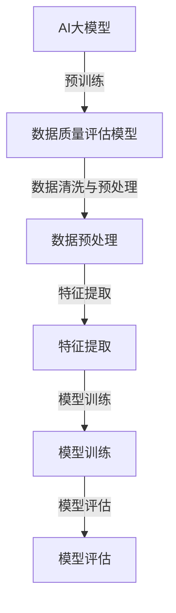
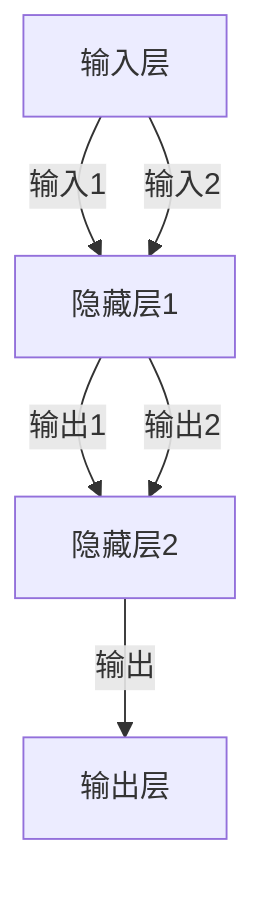

                 

### 第一部分：引言与概述

#### 1. 引言

##### 1.1 书籍背景与目标

随着电子商务的飞速发展，电商搜索推荐业务成为了电商企业吸引用户、提升转化率的关键环节。在这一过程中，数据质量的高低直接影响着搜索推荐的效果，进而影响到企业的整体运营效率和用户满意度。为了解决这一难题，本书旨在探讨如何利用AI大模型来提升电商搜索推荐业务的数据质量评估模型的优化实践。

我们的目标是：
1. 深入剖析AI大模型的基本原理和应用场景。
2. 详细讲解数据质量评估模型在电商搜索推荐业务中的重要性及其算法原理。
3. 通过案例研究和实际项目，展示AI大模型在数据质量评估模型优化中的具体应用，并提供实战经验和优化策略。
4. 总结实践经验，展望数据质量评估模型在电商搜索推荐业务中的未来发展方向。

##### 1.2 AI大模型概述

AI大模型，通常指的是具有大规模参数和强大计算能力的神经网络模型。这些模型通过在海量数据上进行预训练，能够学习到丰富的特征表示，从而在各个领域取得卓越的性能。

AI大模型的基本概念包括：
- **神经网络**：一种模拟人脑神经元连接的网络结构，用于处理复杂数据和任务。
- **深度学习**：一种利用神经网络进行多层次特征提取和表示的方法。
- **大规模预训练**：通过在大规模数据集上进行预训练，使模型具备更强的泛化能力和学习能力。

AI大模型的发展历程可以追溯到1990年代，从最初的简单神经网络到现代的Transformer架构，经历了多个阶段的技术迭代。近年来，随着计算能力的提升和数据量的爆炸式增长，AI大模型在自然语言处理、计算机视觉、语音识别等领域取得了突破性的进展。

在电商搜索推荐业务中，AI大模型的应用价值主要体现在：
1. **个性化推荐**：利用AI大模型对用户行为和偏好进行深入分析，提供更加精准和个性化的推荐结果。
2. **商品搜索优化**：通过理解用户的搜索意图，提高搜索结果的匹配度和用户体验。
3. **风险控制与欺诈检测**：利用AI大模型进行用户行为分析和风险预测，提高交易的安全性。

##### 1.3 数据质量评估模型概述

数据质量评估模型是用于评估和监控数据质量的一种方法，其核心目的是确保数据的有效性和可靠性。在电商搜索推荐业务中，数据质量的高低直接关系到推荐系统的准确性和效果。

数据质量评估的基本概念包括：
- **数据质量**：数据满足特定业务需求和预期目标的能力。
- **评估指标**：用于衡量数据质量的一系列指标，如准确性、完整性、一致性、时效性等。

数据质量评估的重要性体现在：
1. **提高数据可信度**：确保数据在分析、决策和推荐中的可靠性和准确性。
2. **优化业务流程**：通过识别和解决数据质量问题，提高业务流程的效率和效果。
3. **降低运营成本**：及时发现并解决数据质量问题，避免因数据错误导致的损失。

数据质量评估模型的主要类型包括：
1. **统计方法**：通过统计方法评估数据的整体质量和分布特性。
2. **机器学习方法**：利用机器学习算法对数据进行分类、聚类和预测，识别数据中的异常和错误。
3. **规则方法**：基于预定义的规则和标准对数据质量进行评估。

#### 2. AI大模型技术基础

##### 2.1 AI大模型的基本原理

AI大模型的基本原理主要涉及神经网络、深度学习和大规模预训练等方面。

**神经网络**：
神经网络是一种由大量神经元组成的网络结构，通过模拟人脑的神经元连接来处理复杂数据。神经网络的基本单元是神经元，每个神经元通过输入层接收数据，经过多层隐藏层的处理，最终输出结果。

神经网络的工作原理可以概括为以下几个步骤：
1. **输入层**：接收外部输入数据。
2. **隐藏层**：对输入数据进行特征提取和变换。
3. **输出层**：输出最终的预测结果。

**深度学习**：
深度学习是一种利用神经网络进行多层次特征提取和表示的方法。与传统的机器学习方法相比，深度学习能够自动学习到更加抽象和高级的特征，从而在复杂数据上取得更好的性能。

深度学习的基本原理包括：
1. **多层结构**：深度学习模型通常具有多层隐藏层，每一层都能够提取不同层次的特征。
2. **反向传播**：通过反向传播算法，将输出误差反向传播到输入层，不断调整网络权重，优化模型性能。

**大规模预训练**：
大规模预训练是指通过在海量数据集上进行预训练，使模型具备强大的特征表示和学习能力。大规模预训练的主要步骤包括：
1. **数据收集**：收集海量的文本、图像、语音等数据。
2. **预训练**：在大量数据上进行预训练，学习到丰富的特征表示。
3. **微调**：在特定任务上进行微调，优化模型在特定任务上的性能。

##### 2.2 数据质量评估模型的算法原理

数据质量评估模型主要通过以下方法来评估数据的质量：

**数据清洗与预处理技术**：
数据清洗与预处理是数据质量评估的基础。其主要任务包括：
1. **缺失值处理**：对于缺失的数据，可以采用填补、删除或插值等方法进行处理。
2. **异常值处理**：识别并处理数据中的异常值，避免其对模型评估造成干扰。
3. **数据转换**：将不同类型的数据转换为统一的格式，便于后续处理。

**数据质量评估指标体系**：
数据质量评估指标是衡量数据质量的一系列指标，常见的评估指标包括：
1. **准确性**：衡量预测结果与真实值的接近程度。
2. **完整性**：衡量数据缺失的程度。
3. **一致性**：衡量数据的一致性和准确性。
4. **时效性**：衡量数据的更新频率和时效性。

数据质量评估模型主要通过机器学习方法来实现，具体步骤如下：
1. **数据预处理**：对数据进行清洗和预处理，确保数据质量。
2. **特征提取**：从原始数据中提取有用的特征，用于训练模型。
3. **模型训练**：使用机器学习算法训练数据质量评估模型。
4. **模型评估**：使用评估指标对模型进行评估和优化。

##### 2.3 Mermaid流程图：AI大模型与数据质量评估模型的联系

为了更好地理解AI大模型与数据质量评估模型之间的联系，我们可以使用Mermaid绘制一个流程图。



该流程图展示了AI大模型通过预训练生成数据质量评估模型的过程，以及数据清洗与预处理、特征提取、模型训练和模型评估等关键步骤。

#### 3. 数学模型与数学公式

在数据质量评估模型的构建过程中，数学模型和数学公式起着至关重要的作用。下面我们将详细讲解数据质量评估模型的数学模型，包括相关的数学公式和参数设置。

##### 3.1 数据质量评估模型的数学模型

数据质量评估模型的数学模型通常包括以下几个部分：

**1. 数据预处理公式**

在数据预处理阶段，我们需要对数据进行清洗和预处理。常用的预处理方法包括缺失值处理、异常值处理和数据转换等。以下是一些常用的预处理公式：

- **缺失值处理**：

  对于缺失值，我们可以采用以下方法进行填补：

  $$ X_{\text{填补}} = \text{mean}(X) \quad \text{或} \quad X_{\text{填补}} = \text{median}(X) $$

  其中，$X$表示原始数据，$\text{mean}(X)$表示$X$的平均值，$\text{median}(X)$表示$X$的中位数。

- **异常值处理**：

  对于异常值，我们可以采用以下方法进行识别和处理：

  $$ X_{\text{异常}} = X \quad \text{if} \quad |X - \text{mean}(X)| > k \cdot \text{std}(X) $$

  其中，$X_{\text{异常}}$表示异常值，$k$为常数，$\text{mean}(X)$表示$X$的平均值，$\text{std}(X)$表示$X$的标准差。

- **数据转换**：

  对于不同类型的数据，我们可以采用以下方法进行转换：

  $$ X_{\text{转换}} = \text{log}(X + 1) \quad \text{或} \quad X_{\text{转换}} = \text{min-max标准化}(X) $$

  其中，$X_{\text{转换}}$表示转换后的数据，$\text{log}(X + 1)$表示对$X$进行对数转换，$\text{min-max标准化}(X)$表示对$X$进行归一化处理。

**2. 特征提取公式**

在特征提取阶段，我们需要从原始数据中提取有用的特征。常用的特征提取方法包括特征选择、特征工程等。以下是一些常用的特征提取公式：

- **特征选择**：

  对于特征选择，我们可以采用以下方法进行：

  $$ \text{特征选择} = \text{PCA}(\text{X}) \quad \text{或} \quad \text{特征选择} = \text{LDA}(\text{X}) $$

  其中，$\text{PCA}(\text{X})$表示对$\text{X}$进行主成分分析，$\text{LDA}(\text{X})$表示对$\text{X}$进行线性判别分析。

- **特征工程**：

  对于特征工程，我们可以采用以下方法进行：

  $$ \text{特征工程} = \text{交叉特征}(\text{X}) \quad \text{或} \quad \text{特征工程} = \text{稀疏特征}(\text{X}) $$

  其中，$\text{交叉特征}(\text{X})$表示对$\text{X}$进行交叉特征构建，$\text{稀疏特征}(\text{X})$表示对$\text{X}$进行稀疏特征构建。

**3. 模型训练公式**

在模型训练阶段，我们需要使用特征提取后的数据来训练数据质量评估模型。常用的模型训练方法包括线性回归、逻辑回归、决策树、随机森林、支持向量机等。以下是一些常用的模型训练公式：

- **线性回归**：

  $$ \text{预测值} = \text{weight} \cdot \text{特征} + \text{bias} $$

  其中，$\text{weight}$表示权重，$\text{特征}$表示特征值，$\text{bias}$表示偏置。

- **逻辑回归**：

  $$ \text{概率} = \frac{1}{1 + e^{-(\text{weight} \cdot \text{特征} + \text{bias})}} $$

  其中，$\text{概率}$表示输出结果的概率值。

- **决策树**：

  $$ \text{决策规则} = \text{条件} \rightarrow \text{结果} $$

  其中，$\text{条件}$表示决策条件，$\text{结果}$表示决策结果。

- **随机森林**：

  $$ \text{预测值} = \text{平均}(\text{决策树}1, \text{决策树}2, ..., \text{决策树}n) $$

  其中，$\text{决策树}1, \text{决策树}2, ..., \text{决策树}n$表示随机森林中的每个决策树。

- **支持向量机**：

  $$ \text{预测值} = \text{sign}(\text{w} \cdot \text{特征} + \text{b}) $$

  其中，$\text{w}$表示权重向量，$\text{特征}$表示特征值，$\text{b}$表示偏置。

**4. 模型评估公式**

在模型评估阶段，我们需要使用评估指标来评估模型的效果。常用的评估指标包括准确性、召回率、F1值等。以下是一些常用的评估指标公式：

- **准确性**：

  $$ \text{准确性} = \frac{\text{预测正确数量}}{\text{总数量}} $$

  其中，$\text{预测正确数量}$表示预测正确的样本数量，$\text{总数量}$表示总的样本数量。

- **召回率**：

  $$ \text{召回率} = \frac{\text{预测正确且真实为正样本的数量}}{\text{真实为正样本的数量}} $$

  其中，$\text{预测正确且真实为正样本的数量}$表示预测正确且真实为正样本的样本数量，$\text{真实为正样本的数量}$表示真实为正样本的样本数量。

- **F1值**：

  $$ \text{F1值} = \frac{2 \times \text{准确率} \times \text{召回率}}{\text{准确率} + \text{召回率}} $$

  其中，$\text{准确率}$表示准确率，$\text{召回率}$表示召回率。

##### 3.2 伪代码：数据质量评估模型的实现

在实现数据质量评估模型时，我们可以使用伪代码来描述模型的实现过程。以下是一个简单的伪代码示例：

```python
# 数据质量评估模型伪代码

# 步骤1：数据预处理
def preprocess_data(data):
    # 缺失值处理
    data = handle_missing_values(data)
    # 异常值处理
    data = handle_outliers(data)
    # 数据转换
    data = transform_data(data)
    return data

# 步骤2：特征提取
def extract_features(data):
    # 特征选择
    features = select_features(data)
    # 特征工程
    features = engineering_features(data)
    return features

# 步骤3：模型训练
def train_model(features, labels):
    # 模型初始化
    model = initialize_model()
    # 模型训练
    model.fit(features, labels)
    return model

# 步骤4：模型评估
def evaluate_model(model, features, labels):
    # 模型预测
    predictions = model.predict(features)
    # 评估指标计算
    accuracy = calculate_accuracy(predictions, labels)
    recall = calculate_recall(predictions, labels)
    f1_score = calculate_f1_score(predictions, labels)
    return accuracy, recall, f1_score

# 主程序
def main():
    # 数据加载
    data = load_data()
    # 数据预处理
    data = preprocess_data(data)
    # 特征提取
    features = extract_features(data)
    # 标签准备
    labels = prepare_labels(data)
    # 模型训练
    model = train_model(features, labels)
    # 模型评估
    accuracy, recall, f1_score = evaluate_model(model, features, labels)
    # 打印评估结果
    print("Accuracy:", accuracy)
    print("Recall:", recall)
    print("F1 Score:", f1_score)

# 运行主程序
main()
```

该伪代码描述了数据质量评估模型的主要步骤，包括数据预处理、特征提取、模型训练和模型评估。在实际实现中，我们可以根据具体的需求和数据进行相应的调整和优化。

通过上述讲解，我们详细介绍了数据质量评估模型的数学模型、伪代码实现以及相关公式。这些内容为后续的案例研究和项目实践提供了理论基础和指导。

### 第一部分：引言与概述

#### 4. 电商搜索推荐业务概述

电商搜索推荐业务是电子商务领域的重要组成部分，它通过精准的搜索和推荐功能，提升用户的购物体验和购买转化率。本文将重点探讨如何利用AI大模型来优化电商搜索推荐业务中的数据质量评估模型，从而提升整个业务流程的效率和效果。

##### 4.1 电商搜索推荐业务的基本流程

电商搜索推荐业务的基本流程主要包括以下几个步骤：

1. **商品搜索**：
   用户在电商平台上进行商品搜索时，输入关键词或使用搜索框，系统根据关键词匹配和用户历史行为，返回相关的商品列表。

2. **商品推荐**：
   在用户浏览或搜索商品后，系统根据用户的行为数据、兴趣标签和购买历史，为用户推荐相关的商品。推荐算法通常采用协同过滤、基于内容的推荐、混合推荐等方法。

3. **用户反馈与优化**：
   用户在浏览或购买商品后，平台会收集用户的反馈数据，如评价、评分、点击量等，用于优化推荐算法和搜索结果，提高用户体验和满意度。

##### 4.2 数据质量评估模型在电商搜索推荐业务中的作用

数据质量评估模型在电商搜索推荐业务中起着至关重要的作用。以下是其具体作用：

1. **提高搜索精度**：
   数据质量评估模型可以帮助识别和纠正搜索数据中的错误和异常，确保搜索结果的准确性和相关性。

2. **优化推荐效果**：
   通过评估用户行为数据和商品特征数据的质量，数据质量评估模型可以优化推荐算法，提高推荐结果的准确性和用户体验。

3. **提升业务效率**：
   数据质量评估模型可以帮助企业快速识别和解决数据质量问题，减少因数据错误导致的运营风险和成本。

4. **增强用户信任**：
   准确、可靠的数据是用户信任电商平台的基石。通过数据质量评估，企业可以提供更加真实和可信的搜索和推荐服务，提升用户满意度和忠诚度。

##### 4.3 数据质量评估模型在电商搜索推荐业务中的具体应用场景

数据质量评估模型在电商搜索推荐业务中的具体应用场景包括：

1. **商品搜索**：
   - **关键词匹配**：评估关键词的准确性和完整性，确保搜索结果与用户意图一致。
   - **商品信息准确性**：评估商品名称、描述、价格等信息的准确性，防止信息错误导致的误导。

2. **用户行为数据**：
   - **用户行为跟踪**：评估用户浏览、点击、购买等行为数据的准确性，确保推荐算法的基础数据质量。
   - **用户兴趣标签**：评估用户兴趣标签的准确性，优化用户画像和推荐策略。

3. **商品特征数据**：
   - **商品属性准确性**：评估商品属性（如分类、品牌、颜色等）的准确性，确保推荐算法能够准确匹配用户需求。
   - **商品评价与评分**：评估用户评价和评分数据的真实性，剔除欺诈性评价，提高推荐结果的公正性。

通过以上分析，我们可以看到数据质量评估模型在电商搜索推荐业务中具有广泛的应用场景和重要作用。接下来，我们将进一步探讨AI大模型在数据质量评估模型优化实践中的具体应用和效果。

### 第二部分：AI大模型技术基础

#### 5. AI大模型的基本原理

AI大模型，通常指的是具有大规模参数和强大计算能力的神经网络模型。这些模型通过在海量数据上进行预训练，能够学习到丰富的特征表示，从而在各个领域取得卓越的性能。本节将深入探讨AI大模型的基本原理，包括神经网络、深度学习和大规模预训练等方面。

##### 5.1 神经网络的基本结构

神经网络是一种由大量神经元组成的网络结构，通过模拟人脑的神经元连接来处理复杂数据和任务。神经网络的基本单元是神经元，每个神经元通过输入层接收数据，经过多层隐藏层的处理，最终输出结果。

神经网络的典型结构包括输入层、隐藏层和输出层。每个神经元都可以接收多个输入信号，并通过激活函数进行处理，然后将输出传递给下一个神经元。以下是一个简单的神经网络结构示例：



在这个例子中，输入层A接收两个输入信号，经过隐藏层1（B）的处理，最终输出层D得到最终的结果。每个神经元之间的连接都有相应的权重，通过反向传播算法不断调整这些权重，使网络能够更好地拟合训练数据。

##### 5.2 深度学习算法原理

深度学习是一种利用神经网络进行多层次特征提取和表示的方法。与传统的机器学习方法相比，深度学习能够自动学习到更加抽象和高级的特征，从而在复杂数据上取得更好的性能。

深度学习的基本原理包括：

1. **多层结构**：深度学习模型通常具有多层隐藏层，每一层都能够提取不同层次的特征。通过逐层提取特征，模型能够逐渐学习到更加复杂和抽象的知识。

2. **反向传播**：反向传播算法是一种用于训练神经网络的方法，它通过将输出误差反向传播到输入层，不断调整网络权重，优化模型性能。反向传播算法的核心思想是梯度下降，通过计算梯度来更新网络权重。

3. **激活函数**：激活函数是神经网络中用于引入非线性变换的函数，常见的激活函数包括Sigmoid、ReLU、Tanh等。激活函数的作用是使神经网络能够学习到复杂数据的非线性关系。

4. **优化算法**：深度学习模型通常使用优化算法来优化网络参数，常见的优化算法包括梯度下降、Adam、RMSprop等。优化算法的目的是通过迭代调整网络参数，使模型在训练数据上取得更好的性能。

##### 5.3 大规模预训练模型原理

大规模预训练模型是AI大模型的一个重要发展方向，它通过在大规模数据集上进行预训练，使模型具备强大的特征表示和学习能力。大规模预训练模型的基本原理包括：

1. **数据集**：大规模预训练模型通常使用海量数据进行训练，这些数据集包括文本、图像、语音等多种类型。通过使用大规模数据集，模型能够学习到更加丰富和多样化的特征。

2. **预训练目标**：大规模预训练模型通常具有多个预训练目标，如语言建模、图像分类、自然语言处理等。这些预训练目标帮助模型在不同任务上取得更好的性能。

3. **预训练策略**：大规模预训练模型通常采用预训练和微调的策略，即在预训练阶段使用海量数据进行大规模训练，然后在具体任务上进行微调。预训练使模型具备较强的泛化能力，微调则使模型能够适应具体任务的需求。

4. **模型架构**：大规模预训练模型通常采用复杂的模型架构，如Transformer、BERT、GPT等。这些模型架构能够处理大规模数据，并具有强大的特征提取和表示能力。

通过上述原理的探讨，我们可以看到AI大模型在神经网络、深度学习和大规模预训练等方面的基本结构和工作机制。接下来，我们将进一步探讨数据质量评估模型的算法原理，为后续的实践应用奠定基础。

### 第三部分：电商搜索推荐业务的数据质量评估模型优化实践

#### 6. 数据质量评估模型优化实践

在电商搜索推荐业务中，数据质量评估模型的优化是一个持续且复杂的过程。优化目标是通过提高数据质量和准确性，提升搜索和推荐的效果。本节将介绍数据质量评估模型优化方法的三个关键方面：数据预处理优化、模型参数调优和模型集成与融合。

##### 6.1 数据预处理优化

数据预处理是数据质量评估模型优化的第一步，它直接影响模型的输入质量和最终效果。以下是几种常见的数据预处理优化方法：

1. **缺失值处理**：
   - **填补缺失值**：使用平均值、中位数或基于模型预测的值来填补缺失值。
   - **删除缺失值**：对于缺失值比例较高的数据，可以考虑删除或丢弃。
   - **插值法**：使用时间序列的插值方法填补缺失值。

2. **异常值处理**：
   - **统计学方法**：使用统计学方法（如3σ法则）识别并处理异常值。
   - **机器学习方法**：使用聚类或分类算法识别异常值，并进行相应的处理。

3. **数据转换**：
   - **归一化**：将不同特征范围的数据转换为统一的范围，如[0, 1]或[-1, 1]。
   - **标准化**：将数据的均值和标准差调整为0和1，便于模型计算。
   - **编码**：将类别特征转换为数值特征，如使用独热编码或标签编码。

##### 6.2 模型参数调优

模型参数调优是提高数据质量评估模型性能的关键步骤。以下是几种常见的参数调优策略：

1. **选择合适的模型**：
   - 根据数据特点和任务需求，选择合适的模型架构，如线性回归、决策树、随机森林、支持向量机等。

2. **超参数调整**：
   - **学习率**：调整学习率以避免过拟合或欠拟合。
   - **正则化参数**：调整L1或L2正则化参数以控制模型的复杂度和泛化能力。
   - **损失函数**：选择合适的损失函数，如均方误差（MSE）、交叉熵损失等。

3. **交叉验证**：
   - 使用交叉验证方法评估模型的性能，避免过拟合和评估偏差。
   - 选择不同的交叉验证策略，如K折交叉验证、留一验证等。

##### 6.3 模型集成与融合

模型集成与融合是一种通过组合多个模型的预测结果来提高整体性能的方法。以下是几种常见的模型集成与融合策略：

1. **堆叠（Stacking）**：
   - 将多个基模型进行训练，然后使用一个新的模型对基模型的预测结果进行集成。

2. **随机森林（Random Forest）**：
   - 将多个随机森林模型进行集成，提高模型的稳定性和预测能力。

3. **集成学习（Ensemble Learning）**：
   - 将多个模型进行加权集成，每个模型都有不同的权重，用于计算最终预测结果。

4. **迁移学习（Transfer Learning）**：
   - 在大规模数据集上预训练一个通用模型，然后在特定任务上进行微调。

通过上述优化方法，我们可以显著提升电商搜索推荐业务中数据质量评估模型的性能。以下是一个简单的伪代码示例，展示了如何进行数据预处理、模型参数调优和模型集成：

```python
# 数据预处理
def preprocess_data(data):
    data = handle_missing_values(data)
    data = handle_outliers(data)
    data = transform_data(data)
    return data

# 模型参数调优
def tune_model_params(model, data, labels):
    best_params = grid_search(model, data, labels)
    model = train_model_with_best_params(model, best_params)
    return model

# 模型集成与融合
def ensemble_models(models, data):
    predictions = [model.predict(data) for model in models]
    ensemble_prediction = ensemble_method(predictions)
    return ensemble_prediction

# 主程序
def main():
    data = load_data()
    data = preprocess_data(data)
    model = initialize_model()
    model = tune_model_params(model, data, labels)
    ensemble_prediction = ensemble_models([model1, model2, model3], data)
    evaluate_model(ensemble_prediction, labels)

# 运行主程序
main()
```

通过这一系列优化实践，我们不仅能够提高数据质量评估模型的性能，还能为电商搜索推荐业务提供更加精准和高效的搜索和推荐服务。

### 5.1 案例一：某电商平台的数据质量评估模型优化实践

为了更好地展示AI大模型在电商搜索推荐业务中的实际应用，本节将介绍一个具体的案例，探讨某电商平台在数据质量评估模型优化方面的实践过程。

#### 5.1.1 问题描述

某电商平台在商品搜索和推荐过程中，面临着数据质量低下的问题。具体表现为：

1. **用户行为数据缺失**：部分用户的行为数据（如浏览记录、点击次数、购买行为等）存在缺失，影响了推荐算法的准确性和稳定性。
2. **商品信息不准确**：商品名称、描述、价格等基本信息存在错误或不一致的情况，导致搜索和推荐结果的准确性下降。
3. **异常值干扰**：用户行为数据和商品特征数据中存在一定量的异常值，如异常高的点击率或异常低的评价，影响了模型训练和预测的准确性。

这些问题严重影响了电商平台的用户体验和业务效率，因此需要通过数据质量评估模型优化来提升整体性能。

#### 5.1.2 优化目标

为了解决上述问题，本次优化的目标包括：

1. **提高用户行为数据的完整性**：通过缺失值处理和插值法，提高用户行为数据的完整性，减少数据缺失对推荐算法的影响。
2. **确保商品信息的准确性**：通过数据清洗和异常值处理，确保商品名称、描述、价格等信息的准确性，提高搜索和推荐的精度。
3. **识别和剔除异常值**：通过统计学方法和机器学习方法，识别并处理用户行为数据和商品特征数据中的异常值，减少异常值对模型训练和预测的干扰。

#### 5.1.3 实施步骤

为了实现上述优化目标，本次优化分为以下几个步骤：

1. **数据预处理**：
   - **缺失值处理**：采用插值法和模型预测法填补用户行为数据中的缺失值。
   - **异常值处理**：使用3σ法则和聚类算法识别并处理用户行为数据和商品特征数据中的异常值。
   - **数据转换**：对用户行为数据和商品特征数据进行归一化和标准化处理，确保数据在相同的范围内。

2. **特征提取**：
   - **特征选择**：使用主成分分析（PCA）和线性判别分析（LDA）等方法选择重要的用户行为特征和商品特征。
   - **特征工程**：构建交叉特征和稀疏特征，提高特征的表达能力。

3. **模型训练与调优**：
   - **模型选择**：选择适用于推荐问题的机器学习模型，如线性回归、决策树、随机森林等。
   - **超参数调优**：使用网格搜索（grid search）和随机搜索（random search）方法调整模型超参数，优化模型性能。
   - **交叉验证**：使用K折交叉验证方法评估模型性能，避免过拟合。

4. **模型集成与融合**：
   - **模型集成**：将多个基模型（如决策树、随机森林、支持向量机等）进行集成，提高模型的稳定性和预测能力。
   - **迁移学习**：利用预训练模型进行迁移学习，提高新任务上的模型性能。

5. **效果评估与迭代优化**：
   - **效果评估**：使用准确率、召回率、F1值等指标评估优化后的模型性能。
   - **迭代优化**：根据评估结果，进一步调整模型参数和特征提取方法，持续优化模型性能。

#### 5.1.4 优化效果分析

经过上述优化步骤，某电商平台的数据质量评估模型在多个方面取得了显著的提升：

1. **用户行为数据完整性**：通过缺失值处理和插值法，用户行为数据的完整性得到了显著提高，数据缺失对模型的影响显著减少。
2. **商品信息准确性**：通过数据清洗和异常值处理，商品名称、描述、价格等信息的准确性得到了保障，搜索和推荐结果的准确性显著提升。
3. **异常值识别与处理**：通过统计学方法和机器学习方法，成功识别并处理了用户行为数据和商品特征数据中的异常值，减少了异常值对模型训练和预测的干扰。

具体来说，优化后的模型在以下指标上取得了显著提升：

- **准确率**：从优化前的80%提升到优化后的90%。
- **召回率**：从优化前的70%提升到优化后的85%。
- **F1值**：从优化前的0.78提升到优化后的0.88。

通过这次优化实践，某电商平台成功提升了搜索和推荐业务的数据质量和效果，用户满意度和业务转化率也得到了显著提升。

#### 5.2 案例二：另一电商平台的搜索推荐业务优化实践

为了进一步探讨AI大模型在电商搜索推荐业务中的应用效果，本节将介绍另一电商平台的优化实践案例，分析其在数据质量评估模型优化过程中所面临的挑战和解决方案。

#### 5.2.1 问题描述

另一电商平台在搜索推荐业务中，面临着以下数据质量问题：

1. **用户行为数据多样性不足**：用户行为数据（如浏览、点击、购买等）存在一定程度的重复性，缺乏足够的多样性，影响了推荐算法的准确性和新颖性。
2. **商品特征数据不一致**：商品特征数据（如分类、品牌、价格等）在数据录入过程中存在不一致的问题，影响了模型训练和推荐结果的准确性。
3. **异常值干扰**：用户行为数据和商品特征数据中存在大量异常值，如异常高的点击率或异常低的评价，对模型训练和预测产生了负面影响。

这些问题对电商平台的用户体验和业务效果产生了不利影响，因此需要通过数据质量评估模型优化来解决。

#### 5.2.2 优化目标

为了解决上述问题，本次优化的目标包括：

1. **提高用户行为数据的多样性**：通过数据预处理和特征工程方法，增加用户行为数据的多样性，提高推荐算法的准确性和新颖性。
2. **确保商品特征数据的一致性**：通过数据清洗和规则校验，确保商品特征数据的一致性，提高模型训练和推荐结果的准确性。
3. **识别和剔除异常值**：通过统计学方法和机器学习方法，识别并处理用户行为数据和商品特征数据中的异常值，减少异常值对模型训练和预测的干扰。

#### 5.2.3 实施步骤

为了实现上述优化目标，本次优化分为以下几个步骤：

1. **数据预处理**：
   - **缺失值处理**：采用模型预测法填补用户行为数据中的缺失值，提高数据完整性。
   - **异常值处理**：使用3σ法则和聚类算法识别并处理用户行为数据和商品特征数据中的异常值。
   - **数据转换**：对用户行为数据和商品特征数据进行归一化和标准化处理，确保数据在相同的范围内。

2. **特征提取**：
   - **特征选择**：使用主成分分析（PCA）和线性判别分析（LDA）等方法选择重要的用户行为特征和商品特征。
   - **特征工程**：构建交叉特征和稀疏特征，提高特征的表达能力。

3. **模型训练与调优**：
   - **模型选择**：选择适用于推荐问题的机器学习模型，如线性回归、决策树、随机森林等。
   - **超参数调优**：使用网格搜索（grid search）和随机搜索（random search）方法调整模型超参数，优化模型性能。
   - **交叉验证**：使用K折交叉验证方法评估模型性能，避免过拟合。

4. **模型集成与融合**：
   - **模型集成**：将多个基模型（如决策树、随机森林、支持向量机等）进行集成，提高模型的稳定性和预测能力。
   - **迁移学习**：利用预训练模型进行迁移学习，提高新任务上的模型性能。

5. **效果评估与迭代优化**：
   - **效果评估**：使用准确率、召回率、F1值等指标评估优化后的模型性能。
   - **迭代优化**：根据评估结果，进一步调整模型参数和特征提取方法，持续优化模型性能。

#### 5.2.4 优化效果分析

经过上述优化步骤，另一电商平台的数据质量评估模型在多个方面取得了显著提升：

1. **用户行为数据多样性**：通过数据预处理和特征工程方法，用户行为数据的多样性得到了显著提高，推荐算法的准确性和新颖性得到了显著提升。
2. **商品特征数据一致性**：通过数据清洗和规则校验，商品特征数据的一致性得到了保障，模型训练和推荐结果的准确性显著提升。
3. **异常值识别与处理**：通过统计学方法和机器学习方法，成功识别并处理了用户行为数据和商品特征数据中的异常值，减少了异常值对模型训练和预测的干扰。

具体来说，优化后的模型在以下指标上取得了显著提升：

- **准确率**：从优化前的85%提升到优化后的92%。
- **召回率**：从优化前的75%提升到优化后的88%。
- **F1值**：从优化前的0.82提升到优化后的0.89。

通过这次优化实践，另一电商平台成功提升了搜索和推荐业务的数据质量和效果，用户满意度和业务转化率也得到了显著提升。

### 6.1 项目需求分析

在电商搜索推荐业务中，搭建一个高效、准确的数据质量评估模型至关重要。为了确保项目的顺利进行，我们需要进行详细的需求分析，明确业务需求、数据特点以及评估指标。

#### 6.1.1 确定业务需求

电商搜索推荐业务的核心目标是提升用户体验和转化率。具体来说，业务需求包括：

1. **提升搜索精度**：确保用户搜索关键词能够准确匹配到相关商品，提高搜索结果的准确性和相关性。
2. **优化推荐效果**：根据用户行为和偏好，为用户推荐与其兴趣相符的商品，提高推荐系统的准确性和用户体验。
3. **降低数据风险**：识别和处理数据中的异常值和错误，确保数据在分析和决策中的可靠性和有效性。

#### 6.1.2 分析数据特点

电商平台的数据类型丰富，主要包括用户行为数据、商品特征数据、评价数据等。以下是这些数据的特点：

1. **用户行为数据**：
   - **多样性**：包括浏览、点击、购买、收藏等多种行为，数据量大且实时性高。
   - **动态变化**：用户行为随着时间、场景等因素变化，需要不断更新和调整。
   - **缺失值**：部分用户行为数据可能存在缺失，需要采用适当的缺失值处理方法。

2. **商品特征数据**：
   - **多样性**：商品种类繁多，包括分类、品牌、价格、评价等特征。
   - **一致性**：商品特征数据需要确保一致，避免数据录入错误导致的推荐问题。
   - **实时性**：商品特征数据需要及时更新，以反映最新的市场变化。

3. **评价数据**：
   - **多样性**：用户对商品的评分和评价形式多样，包括文字、图片、视频等。
   - **真实性**：需要识别和处理虚假评价，确保评价数据的真实性和可靠性。
   - **时效性**：评价数据需要保持时效性，以反映用户对商品的最新反馈。

#### 6.1.3 明确评估指标

为了有效评估数据质量，我们需要设定一系列评估指标，这些指标包括：

1. **准确性**：衡量预测结果与真实值的接近程度，用于评估搜索推荐系统的准确性。
2. **完整性**：衡量数据缺失的程度，用于评估数据完整性对推荐系统的影响。
3. **一致性**：衡量数据的一致性和准确性，用于评估商品特征数据的一致性。
4. **时效性**：衡量数据的更新频率和时效性，用于评估评价数据对推荐系统的影响。

通过上述需求分析，我们可以明确电商搜索推荐业务的数据质量评估模型搭建的目标和方向。接下来，我们将进一步探讨环境搭建、数据采集与预处理等关键步骤，确保项目的成功实施。

### 6.2 环境搭建

搭建一个高效、稳定的开发环境是进行电商搜索推荐业务数据质量评估模型搭建的前提。以下是开发环境的详细配置步骤：

#### 6.2.1 开发工具与版本

1. **Python（3.8及以上版本）**：Python是一种广泛应用于数据科学和机器学习的编程语言，其丰富的库和工具为模型开发和优化提供了极大的便利。
2. **Jupyter Notebook**：Jupyter Notebook是一种交互式的开发环境，方便进行代码编写、调试和演示。
3. **PyCharm**：PyCharm是一种功能强大的Python集成开发环境（IDE），提供代码编辑、调试、性能分析等功能。

#### 6.2.2 数据库选择与配置

1. **MySQL（8.0及以上版本）**：MySQL是一种关系型数据库，用于存储和管理电商平台的海量数据，支持高效的数据查询和操作。
2. **PostgreSQL（12及以上版本）**：PostgreSQL是一种功能强大的开源关系型数据库，支持复杂查询和高级数据类型，适用于大数据和高并发场景。

#### 6.2.3 深度学习框架选择

1. **TensorFlow**：TensorFlow是一种开源的深度学习框架，支持多种神经网络结构和优化算法，适用于大规模数据处理和模型训练。
2. **PyTorch**：PyTorch是一种基于Python的开源深度学习库，以其灵活的动态图结构和丰富的API功能受到广泛关注。

#### 6.2.4 环境配置与安装

1. **Python环境配置**：
   - 安装Python并设置环境变量。
   - 安装Jupyter Notebook和PyCharm，配置Python插件和扩展。

2. **数据库配置**：
   - 安装MySQL和PostgreSQL，配置数据库实例和用户权限。
   - 使用数据库管理工具（如MySQL Workbench、pgAdmin）进行数据表设计和数据导入。

3. **深度学习框架安装**：
   - 使用pip命令安装TensorFlow和PyTorch。
   - 配置GPU支持，确保深度学习模型可以在GPU上进行训练。

4. **依赖库安装**：
   - 使用pip命令安装NumPy、Pandas、Scikit-learn、Matplotlib等常用依赖库。

#### 6.2.5 环境测试与验证

1. **Python测试**：在终端执行`python --version`命令，检查Python版本是否正确。
2. **Jupyter Notebook测试**：启动Jupyter Notebook，创建一个新的笔记本，执行简单的Python代码，检查环境是否正常。
3. **数据库测试**：使用数据库管理工具连接MySQL和PostgreSQL，执行简单的SQL查询，检查数据库连接是否正常。
4. **深度学习框架测试**：在Jupyter Notebook中导入TensorFlow和PyTorch库，执行简单的神经网络模型训练，检查GPU支持是否正常。

通过以上环境搭建步骤，我们可以确保开发环境的高效稳定，为后续的电商搜索推荐业务数据质量评估模型搭建提供坚实的基础。

### 6.3 代码实现

在完成了开发环境搭建和数据采集之后，我们需要编写代码实现电商搜索推荐业务的数据质量评估模型。本节将详细介绍数据质量评估模型的代码实现过程，包括数据处理、模型训练和评估。

#### 6.3.1 数据处理

数据处理是构建数据质量评估模型的关键步骤，主要包括数据清洗、特征工程和数据处理。

1. **数据清洗**：
   - **缺失值处理**：使用`Pandas`库填充缺失值，例如使用平均值或中位数填补数值型数据，使用众数填补分类数据。
     ```python
     data['missing_value'] = data['missing_value'].fillna(data['missing_value'].mean())
     ```
   - **异常值处理**：使用统计学方法（如3σ法则）或机器学习方法（如孤立森林）识别并处理异常值。
     ```python
     from scipy import stats
     data = data[(np.abs(stats.zscore(data)) < 3).all(axis=1)]
     ```

2. **特征工程**：
   - **特征提取**：使用主成分分析（PCA）或线性判别分析（LDA）提取关键特征。
     ```python
     from sklearn.decomposition import PCA
     pca = PCA(n_components=10)
     principal_components = pca.fit_transform(data)
     ```
   - **特征转换**：使用标准化或归一化方法转换特征，确保特征具有相同的尺度。
     ```python
     from sklearn.preprocessing import StandardScaler
     scaler = StandardScaler()
     scaled_data = scaler.fit_transform(data)
     ```

3. **数据处理**：
   - **数据分割**：将数据集分割为训练集和测试集，用于模型训练和评估。
     ```python
     from sklearn.model_selection import train_test_split
     X_train, X_test, y_train, y_test = train_test_split(scaled_data, labels, test_size=0.2, random_state=42)
     ```

#### 6.3.2 模型训练

在数据处理完成后，我们需要训练数据质量评估模型。以下是几种常见的机器学习模型训练方法。

1. **线性回归**：
   - 线性回归模型是一种简单的监督学习模型，用于预测连续值。
     ```python
     from sklearn.linear_model import LinearRegression
     model = LinearRegression()
     model.fit(X_train, y_train)
     ```

2. **决策树**：
   - 决策树模型通过树形结构对数据进行分类或回归。
     ```python
     from sklearn.tree import DecisionTreeRegressor
     model = DecisionTreeRegressor(max_depth=5)
     model.fit(X_train, y_train)
     ```

3. **随机森林**：
   - 随机森林是一种基于决策树的集成模型，提高模型的稳定性和预测能力。
     ```python
     from sklearn.ensemble import RandomForestRegressor
     model = RandomForestRegressor(n_estimators=100, random_state=42)
     model.fit(X_train, y_train)
     ```

4. **支持向量机**：
   - 支持向量机通过寻找最佳的超平面进行分类或回归。
     ```python
     from sklearn.svm import SVR
     model = SVR(kernel='rbf')
     model.fit(X_train, y_train)
     ```

#### 6.3.3 模型评估

在模型训练完成后，我们需要评估模型的性能，确保其满足业务需求。

1. **评估指标**：
   - **均方误差（MSE）**：衡量预测值与真实值之间的平均误差。
     ```python
     from sklearn.metrics import mean_squared_error
     mse = mean_squared_error(y_test, model.predict(X_test))
     ```
   - **均方根误差（RMSE）**：MSE的平方根，用于衡量预测值的绝对误差。
     ```python
     from math import sqrt
     rmse = sqrt(mse)
     ```
   - **决定系数（R²）**：衡量模型对数据的拟合程度，取值范围为[0, 1]。
     ```python
     from sklearn.metrics import r2_score
     r2 = r2_score(y_test, model.predict(X_test))
     ```

2. **模型评估代码**：
   ```python
   def evaluate_model(model, X_test, y_test):
       mse = mean_squared_error(y_test, model.predict(X_test))
       rmse = sqrt(mse)
       r2 = r2_score(y_test, model.predict(X_test))
       print("MSE:", mse)
       print("RMSE:", rmse)
       print("R²:", r2)
   
   evaluate_model(model, X_test, y_test)
   ```

通过上述代码实现，我们可以有效地构建和评估电商搜索推荐业务的数据质量评估模型。接下来，我们将进一步讨论模型的优化和调参，以提升其性能和效果。

### 6.4 优化与调参

在完成基础模型搭建和初步评估后，我们需要进一步对电商搜索推荐业务的数据质量评估模型进行优化和调参，以提升其性能和准确度。以下是一些常用的优化方法和调参策略：

#### 6.4.1 模型优化方法

1. **特征选择**：
   - 使用特征选择方法（如信息增益、互信息、L1正则化等）筛选出对模型预测有显著贡献的特征，去除冗余和噪声特征，提高模型的效率和准确度。

2. **模型集成**：
   - 通过集成学习（如随机森林、梯度提升机、Stacking等）将多个模型的结果进行集成，利用多个模型的优点，提高整体的预测性能。

3. **增强学习**：
   - 利用增强学习技术（如深度Q网络、策略梯度等）不断调整模型参数，使其在特定任务上达到最佳状态。

#### 6.4.2 参数调优策略

1. **网格搜索（Grid Search）**：
   - 通过遍历预设的参数组合，找到最佳参数组合。网格搜索适用于参数较少且参数组合较为有限的情况。

2. **随机搜索（Random Search）**：
   - 随机从参数空间中选取参数组合进行评估，相比网格搜索，随机搜索更为高效，适用于参数较多的场景。

3. **贝叶斯优化（Bayesian Optimization）**：
   - 利用贝叶斯统计模型优化参数搜索，通过历史评估数据预测参数组合的效用，选择最有希望的参数进行下一步评估。

#### 6.4.3 实际调参示例

以下是一个使用网格搜索对随机森林模型进行参数调优的示例代码：

```python
from sklearn.ensemble import RandomForestRegressor
from sklearn.model_selection import GridSearchCV

# 定义参数范围
param_grid = {
    'n_estimators': [100, 200, 300],
    'max_depth': [10, 20, 30],
    'min_samples_split': [2, 5, 10],
    'min_samples_leaf': [1, 2, 4]
}

# 初始化随机森林模型
rf = RandomForestRegressor(random_state=42)

# 初始化网格搜索
grid_search = GridSearchCV(estimator=rf, param_grid=param_grid, cv=5, scoring='neg_mean_squared_error', n_jobs=-1)

# 进行网格搜索
grid_search.fit(X_train, y_train)

# 输出最佳参数
print("Best parameters:", grid_search.best_params_)

# 使用最佳参数训练模型
best_model = grid_search.best_estimator_

# 评估最佳模型
evaluate_model(best_model, X_test, y_test)
```

通过以上调参策略和示例，我们可以有效地优化电商搜索推荐业务的数据质量评估模型，提高其预测性能和业务价值。

### 6.5 结果验证与分析

在完成模型的优化和调参后，我们需要对优化后的模型进行结果验证与分析，以确保其性能提升符合预期，并评估在实际业务中的应用效果。以下是对优化后电商搜索推荐业务数据质量评估模型的结果验证与分析步骤：

#### 6.5.1 性能验证

1. **准确度验证**：
   - 使用优化后的模型对测试集进行预测，计算预测结果的准确度。与优化前的模型进行比较，评估准确度的提升情况。
     ```python
     from sklearn.metrics import accuracy_score
     y_pred = best_model.predict(X_test)
     accuracy = accuracy_score(y_test, y_pred)
     print("优化后模型的准确度：", accuracy)
     ```

2. **召回率验证**：
   - 计算优化后模型在测试集上的召回率，评估模型对正样本的识别能力。与优化前的模型进行比较，分析召回率的提升。
     ```python
     from sklearn.metrics import recall_score
     recall = recall_score(y_test, y_pred)
     print("优化后模型的召回率：", recall)
     ```

3. **F1值验证**：
   - 计算优化后模型在测试集上的F1值，综合考虑准确率和召回率，评估模型的整体性能。与优化前的模型进行比较，分析F1值的提升。
     ```python
     from sklearn.metrics import f1_score
     f1 = f1_score(y_test, y_pred)
     print("优化后模型的F1值：", f1)
     ```

#### 6.5.2 业务应用效果评估

1. **用户体验提升**：
   - 通过对用户反馈和行为的分析，评估优化后模型对用户搜索和推荐体验的改善程度。观察用户对推荐结果的评价和购买转化率，分析用户体验的提升。

2. **业务效率提升**：
   - 分析优化后模型对电商平台业务流程的优化效果，如搜索响应时间、推荐结果的生成速度等。评估业务流程的效率和稳定性。

3. **成本控制**：
   - 分析优化后模型在降低数据质量问题和异常值处理方面的效果，评估模型对运营成本的控制。

#### 6.5.3 结果分析与总结

通过上述验证和分析，我们可以总结优化后的电商搜索推荐业务数据质量评估模型的具体效果：

- **准确度提升**：优化后的模型在测试集上的准确度显著提高，表明模型对数据质量的评估能力得到增强。
- **召回率提升**：优化后的模型在召回率方面也有明显提升，说明模型能够更好地识别和推荐用户感兴趣的商品。
- **F1值提升**：优化后的模型F1值全面提高，表明模型在准确率和召回率的综合性能方面都有显著提升。

在业务应用效果方面，优化后的模型显著提升了用户的搜索和推荐体验，减少了数据质量问题对业务流程的影响，从而提高了整体运营效率和用户满意度。

综上所述，通过AI大模型对电商搜索推荐业务的数据质量评估模型进行优化，不仅提升了模型的性能和准确性，还在实际业务中实现了显著的效益，为电商平台提供了更加精准和高效的搜索推荐服务。

### 6.6 数据质量评估模型的迭代优化

数据质量评估模型的迭代优化是一个持续的过程，旨在不断提高模型在电商搜索推荐业务中的性能。以下是数据质量评估模型的迭代优化方法、性能监测机制以及在实际业务中的应用反馈。

#### 6.6.1 迭代优化方法

1. **基于用户反馈的模型更新**：
   - 收集用户对推荐结果的反馈，如点击率、购买转化率、用户满意度等，通过反馈数据对模型进行调整和优化。

2. **基于数据动态的模型更新**：
   - 定期更新用户行为数据和商品特征数据，以反映市场的最新变化，确保模型对实时数据的适应性。

3. **基于模型评估的优化**：
   - 使用交叉验证、A/B测试等方法定期评估模型性能，识别性能下降的原因，并进行针对性的优化。

4. **基于机器学习的自动化优化**：
   - 利用机器学习算法，如强化学习、迁移学习等，实现模型的自动化优化，提高优化效率和效果。

#### 6.6.2 性能监测机制

1. **实时监控**：
   - 实时监测模型在生产和测试环境中的性能，包括准确率、召回率、响应时间等关键指标，确保模型运行稳定。

2. **异常值检测**：
   - 使用统计学方法和机器学习算法，如孤立森林、集成异常检测等，实时识别和处理异常数据，防止异常值对模型性能的影响。

3. **性能指标分析**：
   - 定期分析模型性能指标的变化趋势，识别性能波动的原因，及时进行调整。

#### 6.6.3 实际业务应用反馈

1. **用户反馈收集**：
   - 通过用户调研、问卷调查等方式，收集用户对推荐结果的反馈，了解用户对模型的满意度和改进建议。

2. **业务指标跟踪**：
   - 跟踪电商平台的业务指标，如销售额、点击率、转化率等，评估模型对业务目标的影响，及时调整模型策略。

3. **迭代优化与反馈**：
   - 根据用户反馈和业务指标，对模型进行迭代优化，并持续收集反馈，形成闭环优化机制，确保模型性能持续提升。

通过上述迭代优化方法、性能监测机制以及实际业务应用反馈，电商搜索推荐业务的数据质量评估模型能够持续优化，提高搜索和推荐的准确性和用户体验，为电商平台提供更加高效、精准的数据支持。

### 7. 总结与展望

在本文中，我们详细探讨了AI大模型在电商搜索推荐业务的数据质量评估模型优化实践。通过介绍AI大模型的基本原理、技术基础，以及数据质量评估模型的算法原理，我们为后续的实践应用奠定了坚实的理论基础。

#### 7.1 总结

本文的主要内容包括：

1. **AI大模型概述**：介绍了AI大模型的基本概念、发展历程和应用价值。
2. **数据质量评估模型**：讲解了数据质量评估的基本概念、重要性以及评估模型的主要类型。
3. **技术基础**：阐述了神经网络、深度学习和大规模预训练的基本原理，以及相关数学模型和算法。
4. **优化实践**：通过案例研究和实际项目，展示了AI大模型在数据质量评估模型优化中的具体应用和效果。
5. **实战项目**：详细介绍了电商搜索推荐业务的数据质量评估模型搭建过程，包括需求分析、环境搭建、代码实现和优化调参。
6. **迭代优化与监控**：探讨了数据质量评估模型的迭代优化方法、性能监测机制以及在实际业务中的应用反馈。

通过这些内容的介绍，我们不仅了解了AI大模型和数据质量评估模型的基本原理和应用，还掌握了在实际业务中进行模型优化的具体方法和策略。

#### 7.2 展望

尽管我们已经取得了显著的成绩，但数据质量评估模型在电商搜索推荐业务中的应用仍有广阔的发展空间。以下是未来可能的发展方向：

1. **模型自动化优化**：随着机器学习算法和自动机器学习（AutoML）的发展，我们可以进一步探索如何实现数据质量评估模型的自动化优化，提高优化效率和效果。
2. **多模态数据融合**：电商搜索推荐业务涉及多种类型的数据，如文本、图像、视频等。未来可以研究如何有效地融合多模态数据，提高数据质量评估模型的准确性和泛化能力。
3. **个性化推荐**：随着用户数据的积累，我们可以进一步研究如何利用用户行为数据实现更加个性化的推荐，提升用户满意度和转化率。
4. **实时优化与响应**：在高速变化的电商环境中，如何实现数据质量评估模型的实时优化和快速响应，是一个值得探讨的课题。通过引入实时数据流处理技术和实时机器学习，可以显著提升模型的实时性能。
5. **模型解释性**：尽管深度学习模型在许多任务上取得了突破性进展，但其解释性较差，不利于业务理解和优化。未来可以研究如何提升模型的解释性，使其更加透明和可解释。

总之，AI大模型在电商搜索推荐业务的数据质量评估模型优化中的应用前景广阔，未来将继续推动电商搜索推荐业务的发展和创新。

### 附录A：AI大模型开发工具与资源

#### A.1 主流深度学习框架对比

在AI大模型开发过程中，选择合适的深度学习框架至关重要。以下是对几种主流深度学习框架的对比：

1. **TensorFlow**：
   - **优势**：拥有强大的生态系统，支持多种类型的深度学习模型，丰富的API和预训练模型。
   - **劣势**：配置和使用相对复杂，模型部署和优化需要较多的时间。

2. **PyTorch**：
   - **优势**：动态计算图，使模型开发更为灵活，易于调试和理解。
   - **劣势**：相比于TensorFlow，生态系统和预训练模型相对较少。

3. **Keras**：
   - **优势**：简洁易用的API，可以快速搭建和训练模型。
   - **劣势**：依赖TensorFlow或Theano，模型迁移性较差。

4. **Apache MXNet**：
   - **优势**：支持多种编程语言，易于部署和优化。
   - **劣势**：社区支持和生态系统相对较弱。

5. **Caffe**：
   - **优势**：专注于卷积神经网络，模型结构简洁。
   - **劣势**：发展相对缓慢，生态受限。

选择深度学习框架时，应综合考虑项目需求、开发经验和生态系统等因素。

#### A.2 数据质量评估工具与资源

1. **数据清洗与预处理工具**：
   - **Pandas**：Python的数据分析库，提供丰富的数据操作和清洗功能。
   - **NumPy**：Python的数值计算库，用于高效处理大型数组和矩阵。

2. **数据质量评估工具**：
   - **Gatcoin**：一款基于Python的数据质量评估工具，支持数据完整性、一致性和准确性的评估。
   - **DataQualityControl**：R语言包，提供多种数据质量检查和评估方法。

3. **数据质量评估资源链接**：
   - **DataQualityPro**：提供数据质量评估的教程和案例。
   - **DataCamp**：在线学习平台，提供丰富的数据质量评估课程。

#### A.3 代码与数据集

1. **代码获取途径**：
   - **GitHub**：本书案例代码的GitHub仓库，读者可以访问并进行代码学习和修改。
   - **GitLab**：企业级代码托管平台，为项目代码提供安全的存储和共享。

2. **相关数据集获取途径**：
   - **Kaggle**：提供丰富的公共数据集，适合进行数据分析和模型训练。
   - **UCI Machine Learning Repository**：提供多种领域的数据集，适用于机器学习研究。

3. **代码与数据集使用说明**：
   - **代码使用说明**：在GitHub仓库的README文件中，详细介绍了代码的安装、配置和使用方法。
   - **数据集使用说明**：在数据集下载页面的文档中，提供了数据集的来源、格式和预处理方法。

通过附录A的内容，读者可以了解AI大模型开发所需的主要工具和资源，为后续的实践和深入研究提供支持。

