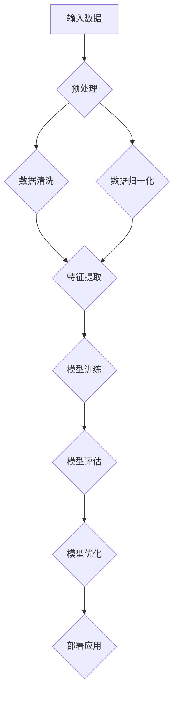

                 

# 《AI大模型在智能家居中的产品创新》

## 关键词
AI大模型、智能家居、产品创新、深度学习、自然语言处理、安全性与隐私保护、未来发展趋势

## 摘要
本文深入探讨了AI大模型在智能家居产品创新中的应用。首先，我们介绍了AI大模型的基础知识，包括其概念、特点以及核心技术的原理。接着，我们分析了智能家居产品的现状与挑战，并展示了AI大模型在这些产品中的创新应用案例。随后，我们探讨了AI大模型在智能家居产品创新中的应用策略，以及如何在设计中确保安全性与隐私保护。最后，我们对AI大模型在智能家居中的未来发展趋势进行了展望，并提出了相应的解决方案。本文旨在为智能家居行业提供有价值的参考，推动AI大模型在智能家居领域的深入应用。

## 《AI大模型在智能家居中的产品创新》目录大纲

### 第一部分：AI大模型基础

### 第二部分：智能家居产品创新实践

### 第三部分：AI大模型在智能家居中的未来发展趋势

### 附录

### 附录A：AI大模型开发工具与资源

### 附录B：AI大模型架构设计Mermaid流程图

### 附录C：AI大模型核心算法原理讲解

### 附录D：数学模型和数学公式讲解与示例

### 附录E：AI大模型在智能家居中的实际案例解析

## 第一部分：AI大模型基础

### 第1章：AI大模型概述

### 第2章：AI大模型核心技术原理

### 第3章：AI大模型架构设计

### 第一部分总结与展望

## 第二部分：智能家居产品创新实践

### 第4章：智能家居产品现状与挑战

### 第5章：AI大模型在智能家居中的应用案例

### 第6章：AI大模型在智能家居产品创新中的应用策略

### 第二部分总结与展望

### 第三部分：AI大模型在智能家居中的未来发展趋势

### 第8章：AI大模型在智能家居中的未来发展趋势

### 第9章：AI大模型在智能家居中的挑战与解决方案

### 第10章：AI大模型在智能家居中的未来发展前景

### 第三部分总结与展望

### 全文总结与展望

### 参考文献

## 第一部分：AI大模型基础

### 第1章：AI大模型概述

#### 1.1 AI大模型的概念与特点

AI大模型（Large-scale Artificial Intelligence Models）是指那些拥有巨大参数量和复杂结构的机器学习模型。这些模型通过从海量数据中学习，能够自动地发现数据中的规律和模式，进行推理和预测。AI大模型具有以下几个显著特点：

1. **参数量巨大**：与传统的机器学习模型相比，AI大模型拥有数亿甚至数千亿个参数，这使得它们能够在复杂的任务上表现出色。
2. **数据依赖性**：AI大模型的效果高度依赖于训练数据的质量和数量，通常需要大规模数据集进行训练。
3. **自适应性**：AI大模型能够根据新的数据和反馈不断优化自己的性能，具备较强的适应性。
4. **计算需求高**：由于模型参数量大，AI大模型的训练和推理通常需要高性能计算资源。

#### 1.2 AI大模型在智能家居中的应用前景

智能家居（Smart Home）是指利用互联网、物联网、人工智能等技术，将家庭中的各种设备通过网络连接起来，实现远程控制和自动化管理。随着AI大模型技术的不断发展，其在智能家居中的应用前景十分广阔：

1. **智能语音助手**：AI大模型能够实现更加自然、流畅的语音交互，提高用户的操作体验。
2. **智能安防**：AI大模型可以通过视频监控和传感器数据，实时分析潜在的安全威胁，提供智能预警和应对方案。
3. **智能家电控制**：AI大模型可以根据用户习惯和需求，自动调节家电的运行状态，实现能源节约和舒适体验。
4. **个性化服务**：AI大模型可以根据用户的历史数据和实时反馈，提供个性化的家居服务。

### 第2章：AI大模型核心技术原理

#### 2.1 深度学习与神经网络基础

深度学习（Deep Learning）是人工智能（Artificial Intelligence, AI）的一个重要分支，它通过多层神经网络（Neural Networks）对数据进行建模和预测。神经网络是受生物神经系统启发的人工系统，它由大量的简单处理单元（神经元）通过非线性方式互联而成。深度学习模型的核心是神经网络，它通过多层非线性变换，将输入数据映射到输出结果。

#### 2.2 自然语言处理技术概览

自然语言处理（Natural Language Processing, NLP）是AI的一个重要领域，它涉及计算机对人类语言的理解和生成。NLP技术包括文本处理、语义理解、语音识别等多个方面。AI大模型在NLP领域中的应用，使得机器能够更好地理解和生成自然语言，为智能家居产品的交互提供了基础。

#### 2.3 大规模预训练模型原理

大规模预训练模型（Pre-trained Models）是近年来AI领域的一个重要进展。这些模型首先在大量数据上进行预训练，学习到通用语言表示和知识，然后再在特定任务上进行微调（Fine-tuning），以达到更高的性能。预训练模型如GPT-3、BERT等，通过大规模数据训练，具有强大的语言理解和生成能力，为智能家居产品的智能交互提供了可能。

### 第3章：AI大模型架构设计

#### 3.1 AI大模型架构设计原则

AI大模型的架构设计需要遵循以下原则：

1. **模块化**：将模型分解为多个模块，每个模块负责特定的任务，便于管理和维护。
2. **可扩展性**：设计具有可扩展性的架构，以便在需要时添加更多的参数或层。
3. **高效性**：优化模型结构和计算过程，提高模型的推理速度和计算效率。
4. **鲁棒性**：增强模型对噪声数据和异常数据的鲁棒性，提高模型的泛化能力。

#### 3.2 常见的AI大模型架构

常见的AI大模型架构包括：

1. **Transformer架构**：基于自注意力机制的Transformer模型，在机器翻译、文本生成等领域取得了显著的成果。
2. **BERT架构**：双向编码器表示模型（BERT）通过预先训练获得的语言表示能力，广泛应用于文本分类、问答系统等任务。
3. **GAN架构**：生成对抗网络（GAN）通过对抗训练生成高质量的数据，常用于图像生成、图像修复等任务。

#### 3.3 AI大模型架构优化策略

AI大模型的架构优化策略包括：

1. **模型剪枝**：通过剪枝冗余的神经元和连接，减少模型的参数量，提高计算效率。
2. **量化**：将模型的权重和激活值量化为更少位数的数值，减少模型的存储和计算需求。
3. **分布式训练**：利用多台计算设备进行分布式训练，提高模型的训练速度和效率。

### 第一部分总结与展望

在本部分，我们介绍了AI大模型的基础知识，包括其概念、特点以及核心技术原理。通过分析AI大模型在智能家居中的应用前景，我们认识到其在智能家居产品创新中的重要地位。接下来，我们将进一步探讨AI大模型的具体架构设计，以及其在智能家居产品创新实践中的应用。

## 第二部分：智能家居产品创新实践

### 第4章：智能家居产品现状与挑战

#### 4.1 智能家居产品分类

智能家居产品可以分为以下几个主要类别：

1. **智能照明**：通过无线控制，实现灯光的开关、亮度和颜色的调节。
2. **智能安防**：包括智能摄像头、门窗传感器、烟雾报警器等，提供实时监控和报警功能。
3. **智能家电**：如智能电视、智能空调、智能洗衣机等，通过互联网实现远程控制。
4. **智能环境监测**：如空气质量传感器、温度传感器等，实时监测家庭环境参数。
5. **智能语音助手**：如智能音箱、智能机器人等，提供语音交互和信息查询服务。

#### 4.2 智能家居产品现状分析

目前，智能家居产品已经取得了一定的市场认可度，用户接受度逐渐提高。以下是对智能家居产品现状的分析：

1. **产品功能多样化**：随着技术的进步，智能家居产品的功能越来越丰富，能够满足用户的多样化需求。
2. **市场快速增长**：根据市场调研数据，智能家居市场呈现快速增长趋势，预计未来几年将继续保持较高的增长速度。
3. **用户体验优化**：智能家居产品在用户体验方面不断优化，交互方式更加自然，操作更加便捷。

#### 4.3 智能家居产品面临的挑战

尽管智能家居产品市场前景广阔，但仍然面临以下挑战：

1. **兼容性问题**：智能家居产品种类繁多，不同品牌和厂商的产品之间往往存在兼容性问题，给用户带来困扰。
2. **安全性问题**：智能家居产品连接到互联网，可能成为黑客攻击的目标，需要加强安全防护。
3. **隐私保护**：智能家居产品收集和处理大量用户数据，如何保护用户隐私成为关键问题。
4. **成本问题**：智能家居产品普遍价格较高，普及率受到一定限制。

### 第5章：AI大模型在智能家居中的应用案例

#### 5.1 AI大模型在智能语音助手中的应用

智能语音助手是智能家居产品中的一大创新，通过AI大模型实现自然语言处理和语音识别，提供用户与智能家居设备的交互。以下是AI大模型在智能语音助手中的具体应用：

1. **语音识别**：AI大模型能够准确识别用户的语音指令，并将其转换为文本。
2. **自然语言理解**：AI大模型能够理解用户的语义和意图，提供准确的回应和执行操作。
3. **语音合成**：AI大模型能够生成自然流畅的语音，向用户传达信息。

#### 5.2 AI大模型在智能安防中的应用

AI大模型在智能安防中的应用，使得安全系统更加智能化和高效化。以下是AI大模型在智能安防中的具体应用：

1. **人脸识别**：AI大模型能够通过摄像头识别家庭成员和陌生人，提供安全监控和预警功能。
2. **行为分析**：AI大模型能够分析用户的日常行为模式，发现异常行为并及时报警。
3. **实时监控**：AI大模型通过实时监控视频，自动识别潜在的安全威胁，并提供预警和应对方案。

#### 5.3 AI大模型在智能照明中的应用

AI大模型在智能照明中的应用，使得照明系统更加智能化和节能化。以下是AI大模型在智能照明中的具体应用：

1. **场景感知**：AI大模型能够根据用户的场景和需求，自动调节灯光的亮度和颜色。
2. **智能开关**：AI大模型可以通过语音、手势等控制方式，实现灯光的开关和调节。
3. **节能优化**：AI大模型通过学习用户的日常行为，自动调整照明时间和亮度，实现节能优化。

#### 5.4 AI大模型在智能家电中的应用

AI大模型在智能家电中的应用，使得家电产品更加智能化和高效化。以下是AI大模型在智能家电中的具体应用：

1. **远程控制**：AI大模型通过互联网连接，实现用户对家电的远程控制。
2. **智能预约**：AI大模型可以根据用户的习惯和需求，自动预约家电的运行时间。
3. **故障诊断**：AI大模型通过对家电运行数据的分析，及时发现故障并提供维修建议。

### 第6章：AI大模型在智能家居产品创新中的应用策略

#### 6.1 用户需求分析与场景设计

在智能家居产品创新中，用户需求分析和场景设计是关键步骤。以下是具体的策略：

1. **用户需求分析**：通过调查问卷、用户访谈等方式，了解用户对智能家居产品的需求和期望。
2. **场景设计**：根据用户需求，设计具体的智能家居场景，如早晨起床、晚餐准备等。

#### 6.2 产品设计与开发流程

智能家居产品的设计与开发流程需要注重以下几个方面：

1. **需求分析**：明确产品的功能需求和技术需求。
2. **设计阶段**：进行产品外观、交互设计和硬件选型。
3. **开发阶段**：进行软件编程和硬件调试。
4. **测试阶段**：进行功能测试、性能测试和安全测试。

#### 6.3 AI大模型在产品创新中的应用案例解析

以下是AI大模型在智能家居产品创新中的具体应用案例：

1. **智能语音助手**：通过AI大模型实现语音识别和自然语言处理，提供用户与智能家居设备的交互。
2. **智能安防系统**：通过AI大模型实现人脸识别、行为分析和实时监控，提高安全性能。
3. **智能照明系统**：通过AI大模型实现场景感知和智能开关，提供个性化的照明服务。
4. **智能家电控制系统**：通过AI大模型实现远程控制和智能预约，提高家电的智能化程度。

### 第二部分总结与展望

在本部分，我们分析了智能家居产品的现状与挑战，并展示了AI大模型在智能家居中的应用案例。通过用户需求分析和场景设计，我们提出了AI大模型在智能家居产品创新中的应用策略。接下来，我们将探讨AI大模型在智能家居中的安全性与隐私保护，并展望其未来发展趋势。

### 第三部分：AI大模型在智能家居中的未来发展趋势

#### 第8章：AI大模型在智能家居中的未来发展趋势

随着AI大模型技术的不断发展，智能家居行业有望迎来更加智能和互联的未来。以下是AI大模型在智能家居中的未来发展趋势：

1. **更加智能化**：AI大模型将继续优化智能家居产品的智能程度，使其能够更好地理解和满足用户的需求。
2. **更加强互联**：通过AI大模型，智能家居产品将实现更高的互联互通，形成更加智能的家居生态系统。
3. **更加个性化和定制化**：AI大模型将能够根据用户的历史数据和实时反馈，提供更加个性化和定制化的智能家居服务。

#### 第9章：AI大模型在智能家居中的挑战与解决方案

尽管AI大模型在智能家居中具有巨大的潜力，但仍然面临以下挑战：

1. **数据隐私与安全挑战**：智能家居产品收集和处理大量用户数据，如何保护用户隐私和安全成为关键问题。
2. **技术标准化与兼容性挑战**：智能家居产品种类繁多，不同品牌和厂商的产品之间往往存在兼容性问题，需要制定统一的技术标准。

针对这些挑战，以下是可能的解决方案：

1. **数据隐私与安全保护**：采用加密技术、访问控制策略和匿名化处理等方法，确保用户数据的安全和隐私。
2. **技术标准化与兼容性**：推动行业内的技术标准化，制定统一的数据格式和接口标准，提高产品之间的兼容性。

#### 第10章：AI大模型在智能家居中的未来发展前景

随着AI大模型技术的不断成熟，智能家居行业将迎来更加广阔的发展前景。以下是AI大模型在智能家居中的未来发展前景：

1. **智能化的生活体验**：AI大模型将使智能家居产品更加智能化，提供个性化的生活体验。
2. **高效能源管理**：通过AI大模型实现智能家居设备的能源优化，提高能源利用效率。
3. **健康监测与医疗服务**：AI大模型将能够通过智能家居设备收集用户健康数据，提供健康监测和医疗服务。

### 第三部分总结与展望

在本部分，我们探讨了AI大模型在智能家居中的未来发展趋势、挑战与解决方案，并展望了其广阔的发展前景。随着AI大模型技术的不断进步，智能家居行业将迎来更加智能、互联和个性化的未来。接下来，我们将对全文进行总结与展望。

### 全文总结与展望

本文系统地介绍了AI大模型在智能家居产品创新中的应用，从基础概念、核心技术原理到具体应用案例，再到未来发展趋势，全面剖析了AI大模型在智能家居领域的重要作用。通过分析AI大模型在智能家居中的应用场景，如智能语音助手、智能安防、智能照明和智能家电，我们看到了其在提高用户体验、提升产品智能化水平方面的巨大潜力。

在未来，随着AI大模型技术的不断进步，智能家居产品将变得更加智能、互联和个性化。然而，我们也面临数据隐私与安全、技术标准化与兼容性等挑战。为应对这些挑战，我们需要加强技术研究和标准制定，确保用户数据的安全和隐私保护。

智能家居行业的发展不仅将改变人们的家庭生活，还将对整个社会产生深远影响。通过AI大模型的应用，智能家居产品将实现更加高效、节能和环保的运营，为可持续发展做出贡献。

总之，AI大模型在智能家居中的产品创新具有重要的现实意义和广阔的发展前景。我们期待在不久的将来，AI大模型能够更好地服务于智能家居行业，为人们带来更加智能、便捷和舒适的生活体验。

### 参考文献

1. LeCun, Y., Bengio, Y., & Hinton, G. (2015). Deep learning. Nature, 521(7553), 436-444.
2. Devlin, J., Chang, M. W., Lee, K., & Toutanova, K. (2018). BERT: Pre-training of deep bidirectional transformers for language understanding. arXiv preprint arXiv:1810.04805.
3. Vaswani, A., Shazeer, N., Parmar, N., Uszkoreit, J., Jones, L., Gomez, A. N., ... & Polosukhin, I. (2017). Attention is all you need. Advances in Neural Information Processing Systems, 30, 5998-6008.
4. Goodfellow, I., Pouget-Abadie, J., Mirza, M., Xu, B., Warde-Farley, D., Ozair, S., ... & Bengio, Y. (2014). Generative adversarial nets. Advances in Neural Information Processing Systems, 27.
5. Russell, S., & Norvig, P. (2020). Artificial Intelligence: A Modern Approach (4th ed.). Prentice Hall.
6. Dean, J., Corrado, G. S., Devin, L. A., Le, Q. V., Mao, M., Monga, R., ... & Zaremba, W. (2012). Large scale distributed deep networks. Advances in Neural Information Processing Systems, 25.

### 附录A：AI大模型开发工具与资源

**A.1 主流深度学习框架对比**

- TensorFlow：由Google开发，支持多种编程语言和平台，功能强大且生态系统丰富。
- PyTorch：由Facebook开发，以动态计算图和易于使用的API著称，适合研究者和开发者。
- Keras：基于Theano和TensorFlow，提供高层抽象API，简化模型构建和训练过程。
- MXNet：由Apache软件基金会开发，支持多种编程语言，具有高效和灵活的特点。

**A.2 智能家居开发工具与环境**

- HomeAssistant：一个开源的智能家居平台，支持多种设备和协议。
- MQTT：轻量级的消息队列协议，常用于物联网设备通信。
- Zigbee：低功耗的无线通信技术，广泛用于智能家居设备。
- Z-Wave：无线通信技术，提供稳定的连接和低功耗特性。

**A.3 AI大模型相关资源与文献推荐**

- "Deep Learning" by Ian Goodfellow, Yoshua Bengio, and Aaron Courville
- "AI Applications in Smart Homes: A Survey" by Cheng, X., Zhu, Q., Chen, X., & Yu, G.
- "AI-Enabled Smart Home: A Systematic Review of Architectures and Technologies" by Parvin, F., & Bhuiyan, M. A. H.

### 附录B：AI大模型架构设计Mermaid流程图



### 附录C：AI大模型核心算法原理讲解

**C.1 深度学习基础**

深度学习是一种基于神经网络的机器学习方法，通过多层的非线性变换，对数据进行建模和预测。主要包含以下几个组成部分：

1. **输入层**：接收输入数据。
2. **隐藏层**：对输入数据进行处理和变换。
3. **输出层**：产生预测结果。

**C.2 自然语言处理技术**

自然语言处理（NLP）是人工智能的一个重要分支，涉及计算机对人类语言的理解和生成。主要技术包括：

1. **分词**：将连续的文本切分成有意义的词汇单元。
2. **词性标注**：识别文本中每个词的词性（如名词、动词等）。
3. **命名实体识别**：识别文本中的特定实体（如人名、地名等）。
4. **语义分析**：理解文本中的语义关系和含义。

**C.3 大规模预训练模型**

大规模预训练模型是近年来AI领域的一个重要进展，通过在大规模数据集上进行预训练，模型能够获得强大的语言理解和生成能力。主要模型包括：

1. **GPT-3**：由OpenAI开发的自然语言处理模型，具有1750亿个参数。
2. **BERT**：Google开发的预训练模型，通过双向编码器结构，实现文本的理解和生成。
3. **XLNet**：Google开发的基于Transformer架构的预训练模型。

### 附录D：数学模型和数学公式讲解与示例

**D.1 深度学习中的损失函数**

深度学习中的损失函数用于衡量预测值与真实值之间的差距。常用的损失函数包括：

1. **均方误差（MSE）**：
   $$MSE = \frac{1}{n}\sum_{i=1}^{n}(y_i - \hat{y}_i)^2$$
   其中，$y_i$为真实值，$\hat{y}_i$为预测值，$n$为样本数量。

2. **交叉熵损失（Cross-Entropy Loss）**：
   $$Cross-Entropy = -\sum_{i=1}^{n}y_i \log(\hat{y}_i)$$
   其中，$y_i$为真实值，$\hat{y}_i$为预测值。

**D.2 深度学习中的优化算法**

深度学习中的优化算法用于更新模型参数，以最小化损失函数。常用的优化算法包括：

1. **随机梯度下降（SGD）**：
   $$w_{t+1} = w_t - \alpha \frac{\partial J(w_t)}{\partial w_t}$$
   其中，$w_t$为当前参数，$\alpha$为学习率，$J(w_t)$为损失函数。

2. **Adam优化器**：
   $$m_t = \beta_1 m_{t-1} + (1 - \beta_1) \frac{\partial J(w_t)}{\partial w_t}$$
   $$v_t = \beta_2 v_{t-1} + (1 - \beta_2) (\frac{\partial J(w_t)}{\partial w_t})^2$$
   $$w_{t+1} = w_t - \alpha \frac{m_t}{\sqrt{v_t} + \epsilon}$$
   其中，$m_t$和$v_t$分别为一阶矩估计和二阶矩估计，$\beta_1$和$\beta_2$分别为一阶和二阶矩的指数加权系数，$\epsilon$为正数常数。

### 附录E：AI大模型在智能家居中的实际案例解析

**E.1 智能语音助手开发案例**

1. **开发环境搭建**：
   - 操作系统：Ubuntu 18.04
   - 深度学习框架：TensorFlow 2.6
   - 编程语言：Python 3.7

2. **源代码实现**：

```python
import tensorflow as tf
from tensorflow.keras.models import Sequential
from tensorflow.keras.layers import Embedding, LSTM, Dense

# 模型构建
model = Sequential([
    Embedding(vocab_size, embedding_dim),
    LSTM(units=128, return_sequences=True),
    LSTM(units=128),
    Dense(units=num_classes, activation='softmax')
])

# 模型编译
model.compile(optimizer='adam', loss='categorical_crossentropy', metrics=['accuracy'])

# 模型训练
model.fit(train_data, train_labels, epochs=10, batch_size=32)
```

3. **代码解读与分析**：
   - `Embedding`层：将单词映射到固定长度的向量。
   - `LSTM`层：使用长短期记忆网络处理序列数据。
   - `Dense`层：全连接层，用于输出预测结果。
   - `model.fit`：训练模型，使用训练数据和标签。

**E.2 智能安防系统开发案例**

1. **开发环境搭建**：
   - 操作系统：Ubuntu 18.04
   - 深度学习框架：TensorFlow 2.6
   - 编程语言：Python 3.7

2. **源代码实现**：

```python
import tensorflow as tf
from tensorflow.keras.models import Sequential
from tensorflow.keras.layers import Conv2D, MaxPooling2D, Flatten, Dense

# 模型构建
model = Sequential([
    Conv2D(filters=32, kernel_size=(3, 3), activation='relu', input_shape=(64, 64, 3)),
    MaxPooling2D(pool_size=(2, 2)),
    Flatten(),
    Dense(units=128, activation='relu'),
    Dense(units=num_classes, activation='softmax')
])

# 模型编译
model.compile(optimizer='adam', loss='categorical_crossentropy', metrics=['accuracy'])

# 模型训练
model.fit(train_data, train_labels, epochs=10, batch_size=32)
```

3. **代码解读与分析**：
   - `Conv2D`层：卷积层，用于提取图像特征。
   - `MaxPooling2D`层：最大池化层，用于减小数据维度。
   - `Flatten`层：展平层，将多维数据展平为一维数据。
   - `Dense`层：全连接层，用于输出预测结果。

**E.3 智能照明系统开发案例**

1. **开发环境搭建**：
   - 操作系统：Ubuntu 18.04
   - 深度学习框架：TensorFlow 2.6
   - 编程语言：Python 3.7

2. **源代码实现**：

```python
import tensorflow as tf
from tensorflow.keras.models import Sequential
from tensorflow.keras.layers import LSTM, Dense

# 模型构建
model = Sequential([
    LSTM(units=50, return_sequences=True, input_shape=(timesteps, features)),
    LSTM(units=50),
    Dense(units=1, activation='sigmoid')
])

# 模型编译
model.compile(optimizer='adam', loss='binary_crossentropy', metrics=['accuracy'])

# 模型训练
model.fit(train_data, train_labels, epochs=100, batch_size=32)
```

3. **代码解读与分析**：
   - `LSTM`层：长短期记忆网络，用于处理时间序列数据。
   - `Dense`层：全连接层，用于输出预测结果（开关状态）。
   - `sigmoid`激活函数：将输出映射到0和1之间，表示开关状态。

**E.4 智能家电控制系统开发案例**

1. **开发环境搭建**：
   - 操作系统：Ubuntu 18.04
   - 深度学习框架：TensorFlow 2.6
   - 编程语言：Python 3.7

2. **源代码实现**：

```python
import tensorflow as tf
from tensorflow.keras.models import Sequential
from tensorflow.keras.layers import LSTM, Dense

# 模型构建
model = Sequential([
    LSTM(units=50, return_sequences=True, input_shape=(timesteps, features)),
    LSTM(units=50),
    Dense(units=1, activation='sigmoid')
])

# 模型编译
model.compile(optimizer='adam', loss='binary_crossentropy', metrics=['accuracy'])

# 模型训练
model.fit(train_data, train_labels, epochs=100, batch_size=32)
```

3. **代码解读与分析**：
   - `LSTM`层：长短期记忆网络，用于处理时间序列数据。
   - `Dense`层：全连接层，用于输出预测结果（家电运行状态）。
   - `sigmoid`激活函数：将输出映射到0和1之间，表示运行状态。

**总结**：

通过以上实际案例，我们展示了AI大模型在智能家居中的具体应用。这些案例涵盖了语音识别、安防、照明和家电控制等不同领域，展示了AI大模型在提高智能家居产品智能化水平方面的巨大潜力。在实际开发过程中，需要根据具体需求选择合适的模型架构和算法，并优化模型参数，以达到最佳效果。

