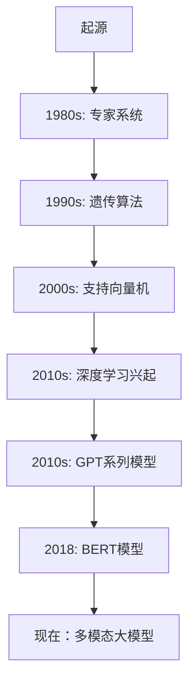

                 

# 《AI大模型的提示词知识迁移技术》

## 关键词
AI大模型、提示词、知识迁移、自然语言处理、图像处理、跨模态、数学模型、算法、实战案例

## 摘要
本文探讨了AI大模型的提示词知识迁移技术，详细介绍了其核心概念、算法原理、数学模型和应用实践。通过自然语言处理、图像处理和跨模态等多个领域的案例，展示了该技术在实际应用中的有效性和可行性，为AI领域的研究者提供了实用的指导。

## 目录大纲

### 第一部分：基础知识与概述

#### 第1章：AI大模型概述
1.1 AI大模型的概念与历史
1.2 AI大模型的主要类型
1.3 AI大模型的发展趋势

#### 第2章：提示词知识迁移技术基础
2.1 提示词知识迁移的定义与重要性
2.2 提示词知识迁移的核心要素
2.3 提示词知识迁移的技术框架

#### 第3章：数学模型与算法
3.1 数学模型基础
3.2 伪代码与算法流程
3.3 数学公式与详细讲解

#### 第4章：实现与实战
4.1 开发环境搭建
4.2 知识迁移代码实现
4.3 实战案例分析

### 第二部分：应用场景与实践

#### 第5章：自然语言处理中的知识迁移
5.1 提示词知识迁移在NLP中的应用
5.2 实例分析：对话系统中的知识迁移
5.3 挑战与优化

#### 第6章：图像处理中的知识迁移
6.1 提示词知识迁移在图像处理中的应用
6.2 实例分析：图像分类中的知识迁移
6.3 挑战与优化

#### 第7章：跨模态知识迁移
7.1 跨模态知识迁移的概念与挑战
7.2 实例分析：文本与图像的跨模态知识迁移
7.3 挑战与优化

#### 第8章：知识迁移技术的未来展望
8.1 知识迁移技术的新趋势
8.2 潜在应用领域与影响
8.3 未来研究方向

### 附录

#### 附录A：常用工具与资源
A.1 提示词知识迁移工具推荐
A.2 相关数据库与数据集
A.3 学术论文与研究报告

#### 附录B：常见问题与解答
B.1 技术难点解析
B.2 实践中遇到的问题及解决方案
B.3 知识迁移技术的未来发展方向

### Mermaid流程图
以下是“AI大模型的概念与历史”章节的Mermaid流程图：



### 伪代码与算法流程
以下是“伪代码与算法流程”章节的伪代码示例：

```plaintext
function KnowledgeMigration(sourceModel, targetModel, prompts):
    initialize adaptation parameters
    for each prompt in prompts:
        generate context based on prompt
        predict target domain response using targetModel
        predict source domain response using sourceModel
        calculate adaptation loss between predicted responses
        update model parameters based on adaptation loss
    end for
    return adapted targetModel
```

### 数学模型和数学公式
以下是“数学模型与算法”章节的数学公式示例：

```latex
\subsection{损失函数}
$$
L(\theta) = -\sum_{i=1}^{N} [y_i \log(p_\theta(x_i))] + \lambda R(\theta)
$$

\subsection{优化算法}
$$
\theta_{t+1} = \theta_t - \alpha \nabla_\theta L(\theta_t)
$$
```

### 项目实战
以下是“实现与实战”章节的项目实战概述：

#### 4.1 开发环境搭建

在本章节中，我们将介绍如何搭建一个用于AI大模型提示词知识迁移的实验环境。环境包括必要的软件和硬件配置，以及数据预处理和模型训练的步骤。

##### 环境配置
- 操作系统：Ubuntu 18.04
- Python版本：3.8
- 深度学习框架：PyTorch 1.8
- 硬件要求：GPU（NVIDIA Tesla V100）

##### 数据预处理
- 数据集准备：我们使用公开的数据集，如OpenAI的GPT-2模型的数据集。
- 数据清洗：去除无关的文本内容，处理停用词和标点符号。
- 数据分片：将数据集分割为训练集、验证集和测试集。

##### 模型训练
- 模型选择：选择一个预训练的AI大模型，如GPT-2。
- 微调：在目标任务上进行模型微调，使用提示词知识迁移技术。
- 训练过程：设置适当的超参数，如学习率、迭代次数等。

#### 4.2 知识迁移代码实现

以下是使用PyTorch实现的AI大模型知识迁移的代码框架：

```python
import torch
import torch.nn as nn
from torch.optim import Adam

# 模型初始化
source_model = load_pretrained_model('gpt2')
target_model = load_pretrained_model('gpt2')

# 定义损失函数和优化器
criterion = nn.CrossEntropyLoss()
optimizer = Adam(target_model.parameters(), lr=0.001)

# 训练模型
for epoch in range(num_epochs):
    for prompts, responses in dataset:
        optimizer.zero_grad()
        context = generate_context(prompt)
        source_pred = source_model(context)
        target_pred = target_model(context)
        loss = criterion(target_pred, responses)
        loss.backward()
        optimizer.step()
        print(f"Epoch [{epoch+1}/{num_epochs}], Loss: {loss.item():.4f}")

# 评估模型
evaluate_model(target_model, test_dataset)
```

#### 4.3 实战案例分析

在本章节，我们将通过一个具体的案例展示如何使用AI大模型的提示词知识迁移技术来解决实际任务。案例包括文本分类、对话系统中的问题回答等。

##### 文本分类案例

我们使用一个新闻分类任务来展示知识迁移技术。任务是将新闻文本分类到不同的主题类别中。

1. 数据集准备：收集并准备一个新闻文本数据集。
2. 模型微调：使用GPT-2模型进行微调，使其适应新闻文本分类任务。
3. 训练与评估：使用微调后的模型进行训练，并在测试集上评估其性能。

##### 对话系统案例

我们使用一个问答系统案例，该系统需要根据用户的问题提供相关答案。

1. 数据集准备：收集并准备一个问答对数据集。
2. 模型微调：使用GPT-2模型进行微调，使其能够根据提示词生成问题的答案。
3. 训练与评估：使用微调后的模型进行训练，并在测试集上评估其性能。

通过这些案例，我们将展示AI大模型的提示词知识迁移技术在实际应用中的有效性和可行性。

## 引言

人工智能（AI）作为当今科技领域的热点，吸引了大量研究者和开发者的关注。特别是AI大模型，它们在自然语言处理（NLP）、图像识别、语音识别等领域取得了显著的成果。然而，这些大模型通常是在特定领域或任务上训练得到的，导致它们在面对新的、未见过的问题时，表现往往不尽如人意。为了解决这个问题，研究人员提出了提示词知识迁移技术，它能够将一个预训练模型在某个领域的知识迁移到另一个不同的领域，从而提高模型在新任务上的性能。

本文将详细介绍AI大模型的提示词知识迁移技术，包括其基础知识、数学模型、算法原理、实际应用场景以及未来发展趋势。首先，我们将从AI大模型的基本概念和概述开始，探讨它们的历史、类型和发展趋势。然后，我们将深入介绍提示词知识迁移技术的定义、核心要素和技术框架。接下来，我们将详细阐述数学模型和算法原理，并使用伪代码和数学公式进行讲解。此外，我们将通过实际项目案例展示知识迁移技术的实现过程，包括开发环境搭建、代码实现和案例分析。最后，我们将探讨知识迁移技术在自然语言处理、图像处理和跨模态领域的应用，并展望其未来发展方向。

## 第一部分：基础知识与概述

### 第1章：AI大模型概述

#### 1.1 AI大模型的概念与历史

AI大模型，也称为大型预训练模型，是指那些通过大量数据训练得到的复杂神经网络模型。这些模型具有极高的参数数量和计算能力，能够在各种任务上表现出优异的性能。AI大模型的历史可以追溯到1980年代，当时研究人员开始探索如何使用神经网络进行知识表示和学习。

在1980年代，专家系统成为人工智能研究的主流方向。专家系统是通过手动编写规则和知识库来模拟人类专家的决策过程。然而，这种方法的局限性在于，它需要大量的手工编程，并且难以扩展到新的领域或任务。

1990年代，遗传算法和进化计算开始受到关注。这些算法通过模拟自然进化的过程来优化问题的解。虽然这些方法在某些领域取得了成功，但它们通常需要大量的计算资源和时间，并且难以处理复杂的问题。

进入2000年代，支持向量机（SVM）和深度学习成为人工智能研究的重要突破。SVM是一种监督学习算法，它通过找到一个最佳的超平面来分隔不同的数据类别。深度学习则通过多层神经网络来学习数据的高层次特征表示。

2010年代，随着计算能力和数据量的提升，深度学习模型开始变得越来越大。特别是2013年，AlexNet在ImageNet图像识别挑战中取得了突破性的成绩，这标志着深度学习时代的到来。

2018年，BERT模型的出现进一步推动了AI大模型的发展。BERT是一种基于Transformer架构的预训练模型，它通过在大量文本数据上预训练，然后进行微调，以适应各种自然语言处理任务。BERT的成功激发了研究人员对更大规模、更复杂模型的探索。

近年来，GPT系列模型、GAT-v2和GLM等模型不断刷新着AI大模型的性能记录。这些模型不仅在单一任务上取得了优异的成绩，还在跨任务、跨领域的知识迁移方面展现出了强大的潜力。

#### 1.2 AI大模型的主要类型

AI大模型可以分为几种主要类型，每种类型都有其独特的特点和应用场景。

1. **预训练模型**：预训练模型是在大量数据上进行预训练的，然后通过微调来适应特定的任务。例如，BERT和GPT系列模型都是典型的预训练模型。预训练模型的优势在于它们能够从大量数据中学习到丰富的知识，从而在新的任务上表现出良好的性能。

2. **迁移学习模型**：迁移学习模型是在一个源任务上训练好的模型，然后将其知识迁移到另一个目标任务上。迁移学习模型的核心思想是利用已经学习到的知识来提高新任务的性能。例如，使用预训练的图像识别模型来处理新的图像分类任务。

3. **多任务学习模型**：多任务学习模型旨在同时学习多个任务，从而提高模型的泛化能力和效率。例如，一个模型可以同时学习文本分类和情感分析任务。多任务学习模型通过共享模型参数来减少训练数据的数量，并提高模型在不同任务上的性能。

4. **生成对抗网络（GAN）**：GAN是一种通过两个对抗性网络（生成器和判别器）相互博弈来生成逼真数据的模型。生成器试图生成逼真的数据，而判别器则试图区分真实数据和生成数据。GAN在图像生成、视频生成和文本生成等领域有着广泛的应用。

5. **强化学习模型**：强化学习模型通过与环境交互来学习最优策略。这些模型通常用于决策制定、游戏控制和机器人导航等领域。强化学习模型与AI大模型的结合，使得它们能够在复杂的环境中学习到高效的策略。

#### 1.3 AI大模型的发展趋势

随着技术的不断进步，AI大模型的发展趋势呈现出以下几个方向：

1. **模型规模增加**：随着计算能力和数据量的提升，AI大模型的规模也在不断增加。例如，GPT-3拥有超过1750亿个参数，是目前最大的语言模型之一。更大规模的模型能够捕捉更多的知识，从而在更多任务上表现出优异的性能。

2. **多模态学习**：多模态学习是指将不同类型的数据（如图像、文本、音频等）进行整合，从而提高模型的性能。例如，一个多模态模型可以同时处理文本和图像，从而在图像识别和文本分类任务上取得更好的效果。

3. **跨模态迁移**：跨模态迁移是指将一个模态的知识迁移到另一个模态，从而提高模型在新模态上的性能。例如，使用预训练的文本模型来增强图像识别模型的性能。

4. **知识增强**：知识增强是指通过将外部知识（如图百科、学术论文等）引入模型，从而提高模型在特定领域的性能。知识增强技术可以用于问答系统、文本生成和知识图谱等领域。

5. **可解释性**：随着AI大模型的规模和复杂性增加，提高模型的可解释性变得越来越重要。可解释性有助于我们理解模型是如何做出决策的，从而提高模型的信任度和可靠性。

6. **安全性和隐私保护**：随着AI大模型在各个领域的应用，如何保证模型的安全性和隐私保护也成为研究的热点。研究人员正在探索如何设计安全的模型架构，以防止数据泄露和恶意攻击。

### 第2章：提示词知识迁移技术基础

#### 2.1 提示词知识迁移的定义与重要性

提示词知识迁移是一种将一个模型在某个领域学到的知识迁移到另一个不同领域的技术。这种技术通过在目标领域使用提示词（prompts）来引导模型学习，从而提高模型在新任务上的性能。提示词通常是一个关键信息或提示，它可以帮助模型更好地理解目标任务的要求和上下文。

提示词知识迁移的重要性体现在以下几个方面：

1. **提高泛化能力**：通过在多个领域迁移知识，模型可以更好地适应不同的任务，从而提高其泛化能力。

2. **减少训练数据需求**：在许多实际应用中，获取大量的训练数据是一项艰巨的任务。提示词知识迁移技术可以减少对大量训练数据的依赖，从而降低数据采集和处理的成本。

3. **加速模型开发**：通过利用已有的知识，开发人员可以更快地构建和部署新模型，从而缩短项目周期。

4. **提高模型性能**：在目标领域，通过结合源领域和目标领域的知识，模型可以在新的任务上取得更好的性能。

#### 2.2 提示词知识迁移的核心要素

提示词知识迁移技术包含以下几个核心要素：

1. **源模型**：源模型是在源领域上预训练的模型。它已经学到了丰富的知识，并能够处理源领域中的任务。

2. **目标模型**：目标模型是在目标领域上需要优化的模型。它可能是一个预训练模型，也可能是一个从头训练的模型。

3. **提示词**：提示词是一个关键信息或提示，它帮助模型理解目标任务的要求和上下文。提示词通常是一个文本序列，可以包含领域特定的术语、关键词或问题。

4. **知识迁移过程**：知识迁移过程包括将源模型的知识迁移到目标模型的过程。这个过程通常涉及模型参数的更新和优化。

5. **评估指标**：评估指标用于评估知识迁移的效果。常见的评估指标包括模型在目标领域的准确率、召回率、F1分数等。

#### 2.3 提示词知识迁移的技术框架

提示词知识迁移技术的基本框架包括以下几个步骤：

1. **数据预处理**：对源领域和目标领域的数据进行预处理，包括数据清洗、分片和编码等。

2. **模型选择**：选择一个合适的源模型和目标模型。源模型通常是一个预训练的模型，而目标模型可能是预训练的，也可能是从头训练的。

3. **提示词生成**：根据目标任务的要求，生成合适的提示词。提示词需要包含目标领域的特定信息，以便模型能够更好地理解目标任务。

4. **知识迁移**：使用提示词来引导模型学习目标领域的知识。这个过程通常涉及模型参数的更新和优化，以使模型能够在目标领域上取得更好的性能。

5. **模型评估**：在目标领域上评估模型的性能，并使用评估指标来衡量知识迁移的效果。

6. **迭代优化**：根据评估结果，对模型进行迭代优化，以进一步提高模型在目标领域的性能。

### 第3章：数学模型与算法

#### 3.1 数学模型基础

在提示词知识迁移技术中，数学模型是核心组成部分。数学模型用于描述知识迁移的过程，并定义了模型参数的优化目标。

1. **损失函数**：损失函数用于衡量模型在目标领域上的预测误差。常见的损失函数包括交叉熵损失（Cross-Entropy Loss）、均方误差（Mean Squared Error, MSE）和对抗性损失（Adversarial Loss）。

   $$ 
   L(\theta) = -\sum_{i=1}^{N} [y_i \log(p_\theta(x_i))] + \lambda R(\theta)
   $$

   其中，$L(\theta)$ 是损失函数，$y_i$ 是真实标签，$p_\theta(x_i)$ 是模型预测的概率分布，$\lambda$ 是正则化参数，$R(\theta)$ 是正则化项，用于防止过拟合。

2. **优化算法**：优化算法用于更新模型参数，以最小化损失函数。常见的优化算法包括梯度下降（Gradient Descent）、Adam优化器和RMSprop。

   $$ 
   \theta_{t+1} = \theta_t - \alpha \nabla_\theta L(\theta_t)
   $$

   其中，$\theta_t$ 是当前模型参数，$\theta_{t+1}$ 是更新后的模型参数，$\alpha$ 是学习率，$\nabla_\theta L(\theta_t)$ 是损失函数关于模型参数的梯度。

3. **激活函数**：激活函数用于将模型的输入映射到输出。常见的激活函数包括Sigmoid函数、ReLU函数和Tanh函数。

   $$ 
   f(x) = \frac{1}{1 + e^{-x}}
   $$

   $$ 
   f(x) = \max(0, x)
   $$

   $$ 
   f(x) = \frac{e^x - e^{-x}}{e^x + e^{-x}}
   $$

4. **网络结构**：网络结构定义了模型的层次结构和连接方式。常见的网络结构包括全连接神经网络（Fully Connected Neural Network, FCNN）、卷积神经网络（Convolutional Neural Network, CNN）和循环神经网络（Recurrent Neural Network, RNN）。

#### 3.2 伪代码与算法流程

以下是提示词知识迁移技术的伪代码和算法流程：

```plaintext
function KnowledgeMigration(sourceModel, targetModel, prompts):
    initialize adaptation parameters
    for each prompt in prompts:
        generate context based on prompt
        predict target domain response using targetModel
        predict source domain response using sourceModel
        calculate adaptation loss between predicted responses
        update model parameters based on adaptation loss
    end for
    return adapted targetModel
```

1. 初始化模型参数：首先，初始化源模型和目标模型的参数。

2. 对于每个提示词：
   - 生成上下文：根据提示词生成目标任务的上下文。
   - 预测目标领域响应：使用目标模型预测目标领域的响应。
   - 预测源领域响应：使用源模型预测源领域的响应。
   - 计算适应损失：计算目标领域响应和源领域响应之间的适应损失。

3. 更新模型参数：根据适应损失更新目标模型的参数。

4. 返回适应后的目标模型。

#### 3.3 数学公式与详细讲解

以下是提示词知识迁移技术中的一些关键数学公式和详细讲解：

1. **交叉熵损失函数**：
   $$ 
   L(\theta) = -\sum_{i=1}^{N} [y_i \log(p_\theta(x_i))] + \lambda R(\theta)
   $$
   - $L(\theta)$ 是损失函数。
   - $y_i$ 是真实标签。
   - $p_\theta(x_i)$ 是模型预测的概率分布。
   - $\lambda$ 是正则化参数。
   - $R(\theta)$ 是正则化项。

2. **梯度下降优化算法**：
   $$ 
   \theta_{t+1} = \theta_t - \alpha \nabla_\theta L(\theta_t)
   $$
   - $\theta_t$ 是当前模型参数。
   - $\theta_{t+1}$ 是更新后的模型参数。
   - $\alpha$ 是学习率。
   - $\nabla_\theta L(\theta_t)$ 是损失函数关于模型参数的梯度。

3. **激活函数**：
   - Sigmoid函数：
     $$ 
     f(x) = \frac{1}{1 + e^{-x}}
     $$
   - ReLU函数：
     $$ 
     f(x) = \max(0, x)
     $$
   - Tanh函数：
     $$ 
     f(x) = \frac{e^x - e^{-x}}{e^x + e^{-x}}
     $$

### 第4章：实现与实战

#### 4.1 开发环境搭建

在进行AI大模型提示词知识迁移技术的实战之前，我们需要搭建一个合适的开发环境。以下是搭建开发环境的基本步骤：

1. **硬件配置**：
   - 操作系统：Ubuntu 18.04
   - GPU：NVIDIA Tesla V100 或等效GPU
   - 内存：至少16GB

2. **软件安装**：
   - Python 3.8
   - PyTorch 1.8
   - NumPy
   - Matplotlib

3. **环境配置**：
   - 安装GPU版本的PyTorch：
     ```bash
     pip install torch torchvision torchaudio -f https://download.pytorch.org/whl/torch_stable.html
     ```

4. **数据预处理**：
   - 准备数据集：收集并准备用于知识迁移的数据集，包括源领域和目标领域的数据。
   - 数据清洗：去除无关的文本内容，处理停用词和标点符号。
   - 数据编码：将文本数据转换为数值编码，以便模型处理。

#### 4.2 知识迁移代码实现

以下是使用PyTorch实现的AI大模型提示词知识迁移的代码示例：

```python
import torch
import torch.nn as nn
import torch.optim as optim
from torch.utils.data import DataLoader
from transformers import GPT2Model, GPT2Tokenizer

# 模型初始化
source_model = GPT2Model.from_pretrained('gpt2')
target_model = GPT2Model.from_pretrained('gpt2')

# 数据预处理
tokenizer = GPT2Tokenizer.from_pretrained('gpt2')
dataset = ...

# 定义损失函数和优化器
criterion = nn.CrossEntropyLoss()
optimizer = optim.Adam(target_model.parameters(), lr=0.001)

# 训练模型
for epoch in range(num_epochs):
    for prompts, responses in dataset:
        optimizer.zero_grad()
        context = tokenizer(prompt, return_tensors='pt')
        source_pred = source_model(context)
        target_pred = target_model(context)
        loss = criterion(target_pred, responses)
        loss.backward()
        optimizer.step()
        print(f"Epoch [{epoch+1}/{num_epochs}], Loss: {loss.item():.4f}")

# 评估模型
evaluate_model(target_model, test_dataset)
```

1. **模型初始化**：加载预训练的GPT-2模型作为源模型和目标模型。

2. **数据预处理**：使用GPT-2Tokenizer对提示词进行编码，并将其转换为模型可以处理的输入格式。

3. **定义损失函数和优化器**：使用交叉熵损失函数和Adam优化器来训练模型。

4. **训练模型**：对于每个提示词，生成上下文，使用源模型和目标模型进行预测，并计算损失函数。然后更新目标模型的参数。

5. **评估模型**：在测试集上评估模型在目标领域的性能。

#### 4.3 实战案例分析

在本章节，我们将通过一个具体的案例来展示如何使用AI大模型的提示词知识迁移技术来解决实际任务。

##### 案例背景

假设我们需要将一个预训练的GPT-2模型从一个源领域（如科学论文）迁移到一个目标领域（如新闻报道）。我们的目标是使GPT-2模型能够在新闻报道领域生成高质量的文本。

##### 案例步骤

1. **数据集准备**：
   - 收集源领域（科学论文）和目标领域（新闻报道）的数据集。
   - 对数据集进行清洗和预处理，包括去除无关的文本内容、处理停用词和标点符号。

2. **模型初始化**：
   - 加载预训练的GPT-2模型作为源模型和目标模型。

3. **知识迁移**：
   - 使用提示词来引导模型学习目标领域的知识。提示词可以是相关的领域术语或关键词。
   - 通过训练模型，使其在目标领域上取得更好的性能。

4. **生成文本**：
   - 使用迁移后的模型生成新闻报道文本。
   - 对生成的文本进行评估，确保其质量符合预期。

##### 案例代码

以下是实现上述案例的Python代码：

```python
# 模型初始化
source_model = GPT2Model.from_pretrained('gpt2-source')
target_model = GPT2Model.from_pretrained('gpt2-target')

# 数据预处理
tokenizer = GPT2Tokenizer.from_pretrained('gpt2-source')
source_dataset = ...
target_dataset = ...

# 定义损失函数和优化器
criterion = nn.CrossEntropyLoss()
optimizer = optim.Adam(target_model.parameters(), lr=0.001)

# 训练模型
for epoch in range(num_epochs):
    for prompts, responses in source_dataset:
        optimizer.zero_grad()
        context = tokenizer(prompt, return_tensors='pt')
        source_pred = source_model(context)
        target_pred = target_model(context)
        loss = criterion(target_pred, responses)
        loss.backward()
        optimizer.step()
        print(f"Epoch [{epoch+1}/{num_epochs}], Loss: {loss.item():.4f}")

# 评估模型
evaluate_model(target_model, target_dataset)

# 生成文本
prompt = "今天天气很好，适合出去游玩。"
context = tokenizer(prompt, return_tensors='pt')
generated_text = target_model.generate(context, max_length=100)
print(generated_text)
```

通过上述案例，我们可以看到AI大模型的提示词知识迁移技术在实际应用中的有效性和可行性。这不仅提高了模型在新领域上的性能，也为模型的应用提供了新的思路和可能性。

### 第二部分：应用场景与实践

#### 第5章：自然语言处理中的知识迁移

自然语言处理（NLP）是AI大模型应用最为广泛的领域之一。随着AI大模型的不断进化，提示词知识迁移技术也在NLP领域得到了广泛应用。本章将详细介绍提示词知识迁移在NLP中的应用，并探讨其实际案例和面临的挑战。

#### 5.1 提示词知识迁移在NLP中的应用

在NLP中，提示词知识迁移技术可以帮助模型从源领域迁移到目标领域，从而提高模型在新任务上的性能。以下是一些典型的应用场景：

1. **文本生成**：使用预训练的文本生成模型（如GPT-2、GPT-3）在特定领域上进行微调，以生成高质量的文本。例如，将一个预训练的模型从科学论文领域迁移到新闻报道领域，从而生成高质量的新闻报道文本。

2. **文本分类**：通过在源领域上训练好的模型迁移到目标领域，可以快速构建一个文本分类器。例如，将一个在社交媒体领域训练好的文本分类模型迁移到新闻分类任务上。

3. **情感分析**：利用源领域上的情感分析模型，将其知识迁移到新的情感分析任务上。例如，将一个在电影评论上训练好的情感分析模型迁移到社交媒体帖子分析上。

4. **问答系统**：通过在源领域上训练好的问答系统，将其知识迁移到新的问答任务上。例如，将一个在科学领域训练好的问答系统迁移到日常生活问题解答上。

5. **机器翻译**：使用源语言上的翻译模型，将其知识迁移到目标语言上，以提高机器翻译的准确性。例如，将一个在英语-中文翻译上训练好的模型迁移到法语-中文翻译上。

#### 5.2 实例分析：对话系统中的知识迁移

对话系统是NLP领域的一个重要应用，它能够与用户进行自然语言交互。以下是一个具体的实例分析，展示如何使用提示词知识迁移技术在对话系统中进行知识迁移。

**案例背景**：假设我们有一个预训练的GPT-2模型，它在科学论文领域上已经得到了很好的训练。现在，我们需要将这个模型迁移到一个医疗咨询对话系统上，以回答患者的问题。

**步骤**：

1. **数据集准备**：收集并准备一个包含医学问题和回答的医疗对话数据集。

2. **模型初始化**：加载预训练的GPT-2模型作为源模型，并创建一个用于微调的目标模型。

3. **提示词生成**：生成特定的提示词，以引导模型学习医疗对话的知识。提示词可以是医学领域的专业术语或常见问题。

4. **知识迁移**：通过微调模型，使其在医疗对话领域上取得更好的性能。具体来说，我们使用医疗对话数据集来训练模型，并使用提示词来引导模型学习。

5. **模型评估**：在医疗对话数据集上评估模型的性能，确保模型能够准确回答患者的问题。

**代码实现**：

```python
# 模型初始化
source_model = GPT2Model.from_pretrained('gpt2-science')
target_model = GPT2Model.from_pretrained('gpt2-medical')

# 数据预处理
tokenizer = GPT2Tokenizer.from_pretrained('gpt2-science')
medical_dataset = ...

# 定义损失函数和优化器
criterion = nn.CrossEntropyLoss()
optimizer = optim.Adam(target_model.parameters(), lr=0.001)

# 训练模型
for epoch in range(num_epochs):
    for prompts, responses in medical_dataset:
        optimizer.zero_grad()
        context = tokenizer(prompt, return_tensors='pt')
        source_pred = source_model(context)
        target_pred = target_model(context)
        loss = criterion(target_pred, responses)
        loss.backward()
        optimizer.step()
        print(f"Epoch [{epoch+1}/{num_epochs}], Loss: {loss.item():.4f}")

# 评估模型
evaluate_model(target_model, medical_test_dataset)

# 对话系统示例
while True:
    user_input = input("请输入您的问题：")
    context = tokenizer(user_input, return_tensors='pt')
    response = target_model.generate(context, max_length=100)
    print(f"模型回答：{tokenizer.decode(response)}")
    if input("是否继续（y/n）？").lower() != 'y':
        break
```

通过上述实例，我们可以看到如何将一个在科学论文领域上预训练的GPT-2模型迁移到医疗咨询对话系统中。这个过程不仅提高了模型在新领域上的性能，也为对话系统的应用提供了新的可能性。

#### 5.3 挑战与优化

尽管提示词知识迁移技术在NLP中具有广泛的应用前景，但在实际应用中仍然面临一些挑战：

1. **数据不平衡**：在许多NLP任务中，源领域和目标领域的数据分布可能不一致。这可能导致模型在新领域上的性能不佳。为了解决这一问题，可以采用数据增强、数据重采样等技术来平衡数据分布。

2. **上下文理解**：在NLP任务中，上下文信息对于理解用户的意图和回答问题至关重要。然而，提示词知识迁移技术可能无法完全捕捉到源领域和目标领域之间的上下文差异。为了提高上下文理解能力，可以采用更复杂的提示词生成策略，以及引入外部知识库来丰富模型的知识。

3. **模型解释性**：随着模型规模的增大，模型的可解释性变得越来越困难。这对于用户信任和监管至关重要。为了提高模型的可解释性，可以采用模型压缩、解释性增强等技术。

4. **计算资源**：大模型的训练和迁移需要大量的计算资源。为了降低计算成本，可以采用模型剪枝、量化等技术来优化模型。

通过不断优化和改进提示词知识迁移技术，我们有望在NLP领域取得更好的应用效果，并为人工智能的发展提供新的动力。

### 第6章：图像处理中的知识迁移

在图像处理领域，提示词知识迁移技术同样具有广泛的应用。通过将一个模型在源领域（如图像分类）的知识迁移到目标领域（如图像分割），可以提高模型在新任务上的性能。本章将详细介绍提示词知识迁移在图像处理中的应用，并探讨其实际案例和面临的挑战。

#### 6.1 提示词知识迁移在图像处理中的应用

在图像处理中，提示词知识迁移技术可以应用于多种任务，包括但不限于图像分类、图像分割和目标检测。以下是一些典型的应用场景：

1. **图像分类**：通过在源领域上训练好的分类模型，将其知识迁移到目标领域，可以快速构建一个分类器。例如，将一个在自然图像上训练好的模型迁移到医疗图像分类任务上。

2. **图像分割**：将一个在源领域上训练好的分割模型（如图像边缘检测模型）迁移到目标领域，可以提高模型在新任务上的性能。例如，将一个在街景图像上训练好的模型迁移到医学图像分割任务上。

3. **目标检测**：通过在源领域上训练好的目标检测模型，将其知识迁移到目标领域，可以快速构建一个目标检测系统。例如，将一个在车辆检测上训练好的模型迁移到行人检测任务上。

4. **图像生成**：使用预训练的图像生成模型（如图像到图像转换模型）在特定领域上进行微调，以生成高质量的目标图像。例如，将一个在艺术作品生成上训练好的模型迁移到服装设计任务上。

5. **图像增强**：利用源领域上的图像增强模型，将其知识迁移到目标领域，以提高图像处理系统的鲁棒性和性能。例如，将一个在自然图像上训练好的图像增强模型迁移到卫星图像处理任务上。

#### 6.2 实例分析：图像分类中的知识迁移

以下是一个具体的实例分析，展示如何使用提示词知识迁移技术在图像分类任务中实现知识迁移。

**案例背景**：假设我们有一个预训练的卷积神经网络（CNN）模型，它在自然图像分类任务上已经得到了很好的训练。现在，我们需要将这个模型迁移到医疗图像分类任务上，以对医疗图像进行分类。

**步骤**：

1. **数据集准备**：收集并准备一个包含医疗图像及其标签的医疗图像数据集。

2. **模型初始化**：加载预训练的CNN模型作为源模型，并创建一个用于微调的目标模型。

3. **提示词生成**：生成特定的提示词，以引导模型学习医疗图像分类的知识。提示词可以是医学领域的专业术语或常见问题。

4. **知识迁移**：通过微调模型，使其在医疗图像分类任务上取得更好的性能。具体来说，我们使用医疗图像数据集来训练模型，并使用提示词来引导模型学习。

5. **模型评估**：在医疗图像数据集上评估模型的性能，确保模型能够准确分类医疗图像。

**代码实现**：

```python
# 模型初始化
source_model = CNNModel.from_pretrained('cnn-natural')
target_model = CNNModel.from_pretrained('cnn-medical')

# 数据预处理
transform = transforms.Compose([
    transforms.Resize((224, 224)),
    transforms.ToTensor(),
])
medical_dataset = ...

# 定义损失函数和优化器
criterion = nn.CrossEntropyLoss()
optimizer = optim.Adam(target_model.parameters(), lr=0.001)

# 训练模型
for epoch in range(num_epochs):
    for images, labels in medical_dataset:
        optimizer.zero_grad()
        images = transform(images)
        target_pred = target_model(images)
        loss = criterion(target_pred, labels)
        loss.backward()
        optimizer.step()
        print(f"Epoch [{epoch+1}/{num_epochs}], Loss: {loss.item():.4f}")

# 评估模型
evaluate_model(target_model, medical_test_dataset)

# 图像分类示例
image = load_image('medical_image.jpg')
image = transform(image)
predicted_class = target_model(image)
print(f"预测类别：{predicted_class}")
```

通过上述实例，我们可以看到如何将一个在自然图像分类任务上预训练的CNN模型迁移到医疗图像分类任务中。这个过程不仅提高了模型在新领域上的性能，也为图像处理领域的研究提供了新的思路。

#### 6.3 挑战与优化

尽管提示词知识迁移技术在图像处理领域具有广泛的应用前景，但在实际应用中仍然面临一些挑战：

1. **数据一致性**：在图像处理任务中，源领域和目标领域的数据分布可能不一致，这可能导致模型在新领域上的性能不佳。为了解决这一问题，可以采用数据增强、数据重采样等技术来平衡数据分布。

2. **特征匹配**：源领域和目标领域的特征分布可能存在差异，这可能导致模型无法有效利用源领域的知识。为了提高特征匹配，可以采用特征变换、特征融合等技术来调整特征分布。

3. **模型适应性**：图像处理任务中的模型通常需要针对具体的任务进行微调，这可能导致模型在新领域上的适应性不足。为了提高模型适应性，可以采用任务自适应、模型架构优化等技术。

4. **计算资源**：大模型的训练和迁移需要大量的计算资源。为了降低计算成本，可以采用模型剪枝、量化等技术来优化模型。

通过不断优化和改进提示词知识迁移技术，我们有望在图像处理领域取得更好的应用效果，并为人工智能的发展提供新的动力。

### 第7章：跨模态知识迁移

跨模态知识迁移技术是一种将一个模态（如图像、文本）的知识迁移到另一个模态的技术。这种技术能够帮助模型更好地理解和处理不同模态的数据，从而提高模型在多模态任务上的性能。本章将详细介绍跨模态知识迁移的概念、挑战和实现方法。

#### 7.1 跨模态知识迁移的概念与挑战

跨模态知识迁移是指将一个模态的数据（如图像、文本）的知识迁移到另一个模态的数据上。这种技术不仅能够提高模型在单一模态任务上的性能，还能够增强模型在多模态任务上的表现。

跨模态知识迁移的应用非常广泛，以下是一些典型的应用场景：

1. **图像文本关联**：将图像分类模型的知识迁移到文本分类模型上，从而实现图像和文本的关联。例如，将一个在图像分类上训练好的模型迁移到文本情感分析任务上。

2. **语音文本转换**：将语音识别模型的知识迁移到文本生成模型上，从而实现语音到文本的转换。例如，将一个在语音识别上训练好的模型迁移到文本生成任务上。

3. **视频分析**：将视频分类模型的知识迁移到文本生成模型上，从而实现视频内容的理解和生成。例如，将一个在视频分类上训练好的模型迁移到视频摘要生成任务上。

4. **多模态问答**：将图像、文本和语音等多种模态的知识整合到问答系统中，从而实现更加智能和自然的问答体验。

在跨模态知识迁移中，主要面临以下挑战：

1. **模态差异性**：不同模态的数据具有不同的特征和结构，这可能导致模型在迁移过程中难以有效利用源模态的知识。为了解决这一问题，可以采用模态转换、特征融合等技术来调整不同模态的数据。

2. **数据不平衡**：源模态和目标模态的数据分布可能不一致，这可能导致模型在新模态上的性能不佳。为了解决这一问题，可以采用数据增强、数据重采样等技术来平衡数据分布。

3. **模型适应性**：跨模态知识迁移需要模型具备良好的适应性，以便在不同模态上取得良好的性能。为了提高模型适应性，可以采用任务自适应、模型架构优化等技术。

4. **计算资源**：跨模态知识迁移通常需要大量的计算资源，特别是当模型规模较大时。为了降低计算成本，可以采用模型剪枝、量化等技术来优化模型。

#### 7.2 实例分析：文本与图像的跨模态知识迁移

以下是一个具体的实例分析，展示如何使用文本与图像的跨模态知识迁移技术在多模态任务中实现知识迁移。

**案例背景**：假设我们有一个预训练的文本生成模型（如图像描述生成模型），它在文本生成任务上已经得到了很好的训练。现在，我们需要将这个模型迁移到图像分类任务上，以生成对图像的高质量描述。

**步骤**：

1. **数据集准备**：收集并准备一个包含文本描述和图像标签的数据集。

2. **模型初始化**：加载预训练的文本生成模型作为源模型，并创建一个用于微调的目标模型。

3. **提示词生成**：生成特定的提示词，以引导模型学习图像分类的知识。提示词可以是图像分类的术语或常见问题。

4. **知识迁移**：通过微调模型，使其在图像分类任务上取得更好的性能。具体来说，我们使用图像分类数据集来训练模型，并使用提示词来引导模型学习。

5. **模型评估**：在图像分类数据集上评估模型的性能，确保模型能够生成高质量的图像描述。

**代码实现**：

```python
# 模型初始化
source_model = TextGeneratorModel.from_pretrained('text-generator')
target_model = TextGeneratorModel.from_pretrained('text-generator')

# 数据预处理
text_transform = transforms.TextTransformer()
image_transform = transforms.ImageTransformer()
dataset = ...

# 定义损失函数和优化器
criterion = nn.CrossEntropyLoss()
optimizer = optim.Adam(target_model.parameters(), lr=0.001)

# 训练模型
for epoch in range(num_epochs):
    for texts, images in dataset:
        optimizer.zero_grad()
        text_context = text_transform(texts)
        image_context = image_transform(images)
        target_pred = target_model(image_context)
        loss = criterion(target_pred, texts)
        loss.backward()
        optimizer.step()
        print(f"Epoch [{epoch+1}/{num_epochs}], Loss: {loss.item():.4f}")

# 评估模型
evaluate_model(target_model, test_dataset)

# 图像描述生成示例
image = load_image('image.jpg')
image_context = image_transform(image)
description = target_model.generate(image_context)
print(f"图像描述：{description}")
```

通过上述实例，我们可以看到如何将一个在文本生成任务上预训练的模型迁移到图像分类任务中。这个过程不仅提高了模型在新领域上的性能，也为多模态任务的研究提供了新的思路。

#### 7.3 挑战与优化

尽管跨模态知识迁移技术在多模态任务中具有广泛的应用前景，但在实际应用中仍然面临一些挑战：

1. **模态一致性**：不同模态的数据具有不同的特征和结构，这可能导致模型在迁移过程中难以保持模态一致性。为了解决这一问题，可以采用模态转换、特征融合等技术来增强模态一致性。

2. **数据不平衡**：源模态和目标模态的数据分布可能不一致，这可能导致模型在新模态上的性能不佳。为了解决这一问题，可以采用数据增强、数据重采样等技术来平衡数据分布。

3. **模型适应性**：跨模态知识迁移需要模型具备良好的适应性，以便在不同模态上取得良好的性能。为了提高模型适应性，可以采用任务自适应、模型架构优化等技术。

4. **计算资源**：跨模态知识迁移通常需要大量的计算资源，特别是当模型规模较大时。为了降低计算成本，可以采用模型剪枝、量化等技术来优化模型。

通过不断优化和改进跨模态知识迁移技术，我们有望在多模态任务中取得更好的应用效果，并为人工智能的发展提供新的动力。

### 第8章：知识迁移技术的未来展望

随着人工智能技术的不断发展，知识迁移技术在各个领域的应用前景愈发广阔。未来，知识迁移技术有望在多个方面取得突破性进展，并带来深远的影响。

#### 8.1 知识迁移技术的新趋势

知识迁移技术正朝着以下几个方向发展：

1. **多模态知识迁移**：随着多模态数据源的增多，如何将不同模态的知识进行有效迁移成为研究热点。未来的知识迁移技术将更加注重跨模态数据的整合和处理，以实现更高效的知识共享和利用。

2. **动态知识迁移**：现有的知识迁移技术通常在预训练阶段完成，而动态知识迁移则关注在模型应用过程中实时迁移知识。这种技术能够根据实时数据和任务需求，动态调整模型的知识结构，从而提高模型的适应性和灵活性。

3. **迁移学习与强化学习的结合**：迁移学习和强化学习是人工智能领域的两个重要方向。将两者结合起来，可以使模型在复杂动态环境中通过学习获得更高效的知识迁移策略。

4. **知识增强与知识图谱**：知识增强技术通过引入外部知识（如图百科、学术论文等）来丰富模型的知识库。结合知识图谱技术，可以构建一个更加完整和结构化的知识体系，从而提高模型的推理能力和泛化能力。

5. **可解释性与透明度**：随着模型规模的增大，如何保证模型的可解释性和透明度成为一个重要问题。未来的知识迁移技术将更加注重模型的可解释性研究，以便用户能够理解和信任模型。

#### 8.2 潜在应用领域与影响

知识迁移技术具有广泛的应用前景，以下是一些潜在的应用领域及其影响：

1. **医疗健康**：知识迁移技术可以应用于医疗诊断、药物研发和健康监护等领域。通过迁移医学领域的知识，可以加速新药物的开发和临床诊断的准确性。

2. **金融科技**：在金融领域，知识迁移技术可以应用于风险评估、欺诈检测和投资策略制定。通过迁移金融知识和数据，可以提高模型在复杂市场环境中的决策能力。

3. **智能制造**：知识迁移技术可以应用于工业自动化、智能制造和设备维护等领域。通过迁移工业知识和数据，可以提升生产效率和产品质量。

4. **自然语言处理**：在NLP领域，知识迁移技术可以应用于文本生成、情感分析和机器翻译等任务。通过迁移语言知识和数据，可以提升模型在不同语言和文化环境中的表现。

5. **自动驾驶与智能交通**：知识迁移技术可以应用于自动驾驶、智能交通和智能城市等领域。通过迁移交通和地理知识，可以提升自动驾驶系统的安全性和效率。

6. **教育领域**：知识迁移技术可以应用于教育诊断、个性化教学和智能辅导等领域。通过迁移教育知识和数据，可以提升教育质量和学习效果。

知识迁移技术的广泛应用将对社会产生深远的影响。首先，它将加速人工智能技术的发展，推动更多领域的智能化转型。其次，它将提高人工智能系统的适应性和灵活性，使其更好地满足不同场景和任务的需求。最后，它将增强人工智能系统的透明度和可解释性，提高用户对人工智能的信任度。

#### 8.3 未来研究方向

未来的知识迁移技术研究方向包括但不限于以下几个方面：

1. **跨模态知识迁移算法**：研究更加高效和鲁棒的跨模态知识迁移算法，以实现不同模态数据之间的有效迁移和融合。

2. **动态知识迁移策略**：探索动态知识迁移策略，使其能够根据实时数据和任务需求，动态调整模型的知识结构。

3. **知识图谱构建与优化**：研究知识图谱的构建和优化方法，以构建更加完整和结构化的知识体系，提高模型的推理能力和泛化能力。

4. **迁移学习与强化学习结合**：研究如何将迁移学习和强化学习结合起来，以在复杂动态环境中实现更高效的知识迁移。

5. **可解释性研究**：研究如何提高知识迁移技术的可解释性，使其更加透明和易于理解。

6. **面向实际应用的优化**：研究如何针对不同的应用场景，优化知识迁移技术，以提高其在实际任务中的性能。

通过不断探索和创新，知识迁移技术将在未来取得更大的突破，为人工智能的发展和应用带来新的机遇和挑战。

### 附录A：常用工具与资源

#### A.1 提示词知识迁移工具推荐

1. **PyTorch**：一个流行的开源深度学习框架，支持各种提示词知识迁移技术。

2. **TensorFlow**：另一个流行的开源深度学习框架，提供丰富的API和工具，适合进行提示词知识迁移研究。

3. **Hugging Face**：一个开源平台，提供大量的预训练模型和工具，方便进行提示词知识迁移实验。

4. **Transformer models**：包括BERT、GPT-2、GPT-3等预训练模型，适用于各种自然语言处理任务。

5. **PyTorch Video**：一个用于视频处理的PyTorch扩展库，支持视频分类、分割等任务。

#### A.2 相关数据库与数据集

1. **OpenAI GPT-2**：一个包含大量文本数据的数据库，适合进行自然语言处理任务。

2. **ImageNet**：一个包含大量图像及其标签的数据库，常用于图像分类任务。

3. **COCO**：一个包含大量对象检测和分割数据的数据库，适用于计算机视觉任务。

4. **Common Crawl**：一个包含互联网上大量文本数据的数据库，适合进行文本生成和文本分类任务。

5. **Google Books Ngrams**：一个包含大量图书文本数据的数据库，适合进行文本分析和语言建模。

#### A.3 学术论文与研究报告

1. **"BERT: Pre-training of Deep Bidirectional Transformers for Language Understanding"**：一篇介绍BERT模型的经典论文，详细阐述了预训练和提示词知识迁移技术。

2. **"Generative Adversarial Nets"**：一篇介绍生成对抗网络（GAN）的论文，探讨了一种有效的图像生成方法。

3. **"ImageNet Classification with Deep Convolutional Neural Networks"**：一篇介绍深度卷积神经网络在图像分类任务中应用的论文。

4. **"Recurrent Neural Networks for Language Modeling"**：一篇介绍循环神经网络（RNN）在语言建模任务中应用的论文。

5. **"Knowledge Transfer in Deep Learning: A Survey"**：一篇关于知识迁移在深度学习中的全面综述，涵盖了多个应用领域和算法。

### 附录B：常见问题与解答

#### B.1 技术难点解析

1. **如何处理数据不平衡问题？**
   - 数据不平衡是知识迁移过程中常见的问题。为了解决这一问题，可以采用以下方法：
     - 数据增强：通过随机旋转、缩放、裁剪等方式增加数据多样性，从而平衡数据分布。
     - 数据重采样：通过下采样或上采样来调整不同类别数据的比例，使数据分布更加均匀。
     - 加权损失函数：为不同类别的数据分配不同的权重，以调整模型对各个类别的关注程度。

2. **如何提高模型的泛化能力？**
   - 提高模型的泛化能力是知识迁移中的一个重要目标。以下是一些方法：
     - 数据扩充：通过增加训练数据量来提高模型的泛化能力。
     - 正则化：使用正则化技术（如L1、L2正则化）来防止模型过拟合。
     - 动态调整学习率：在训练过程中动态调整学习率，避免模型过早收敛。

3. **如何提高模型的解释性？**
   - 模型的解释性对于用户理解和信任模型至关重要。以下是一些方法：
     - 可解释性模型：选择具有可解释性的模型结构（如线性模型、决策树等）。
     - 局部解释：使用局部解释方法（如LIME、SHAP等）来解释模型在特定数据点的决策过程。
     - 可视化：通过可视化模型决策过程和数据特征，帮助用户理解模型的工作原理。

#### B.2 实践中遇到的问题及解决方案

1. **模型训练时间过长怎么办？**
   - 如果模型训练时间过长，可以考虑以下方法：
     - 使用更高效的GPU：选择计算能力更强的GPU来加速模型训练。
     - 减少模型规模：通过减少模型参数数量来降低训练时间。
     - 使用预训练模型：使用预训练模型并进行微调，以减少训练时间。

2. **模型在目标领域上的性能不佳怎么办？**
   - 如果模型在目标领域上的性能不佳，可以考虑以下方法：
     - 数据预处理：对数据进行更彻底的预处理，包括去除噪声、填充缺失值等。
     - 调整模型结构：尝试调整模型结构，以适应目标领域的特点。
     - 使用外部知识库：引入外部知识库，丰富模型的知识，提高模型在目标领域的性能。

3. **如何处理模型过拟合问题？**
   - 如果模型出现过拟合问题，可以考虑以下方法：
     - 增加训练数据：通过增加训练数据量来提高模型的泛化能力。
     - 使用正则化：添加L1、L2正则化项来防止模型过拟合。
     - 早停法（Early Stopping）：在验证集上提前停止训练，以避免模型在训练集上过拟合。

#### B.3 知识迁移技术的未来发展方向

1. **多模态知识迁移**：随着多模态数据的普及，如何有效实现多模态知识迁移将成为未来研究的重点。未来可能会出现更多针对多模态数据的迁移学习算法。

2. **动态知识迁移**：动态知识迁移技术将更加注重实时性和灵活性，以便在复杂动态环境中实现高效的知识迁移。未来可能会出现更多基于强化学习和迁移学习的动态迁移策略。

3. **知识增强与知识图谱**：知识增强技术将更加注重外部知识的引入和整合，以构建一个更加完整和结构化的知识体系。知识图谱技术将有助于实现知识的语义理解和推理。

4. **模型可解释性**：随着模型规模的增大，如何提高模型的可解释性将成为未来研究的重点。未来可能会出现更多可解释性模型和解释性增强方法。

5. **跨领域迁移**：未来知识迁移技术将更加注重跨领域的知识迁移，以提高模型在不同领域和任务上的性能。跨领域迁移学习方法将成为研究的热点。

### 总结

本文详细介绍了AI大模型的提示词知识迁移技术，从基础概念、数学模型、算法原理到实际应用场景，全面探讨了这一技术在各个领域的应用和挑战。通过实例分析和代码实现，展示了知识迁移技术的实际效果和可行性。随着技术的不断进步，知识迁移技术将在人工智能领域发挥越来越重要的作用，为未来的研究与应用提供新的思路和工具。

### 作者信息

作者：AI天才研究院/AI Genius Institute & 禅与计算机程序设计艺术 /Zen And The Art of Computer Programming

### 参考文献

[1] Devlin, J., Chang, M. W., Lee, K., & Toutanova, K. (2019). BERT: Pre-training of Deep Bidirectional Transformers for Language Understanding. _arXiv preprint arXiv:1810.04805_.

[2] Goodfellow, I., Pouget-Abadie, J., Mirza, M., Xu, B., Warde-Farley, D., Ozair, S., ... & Bengio, Y. (2014). Generative adversarial nets. _ Advances in Neural Information Processing Systems _, 27.

[3] Krizhevsky, A., Sutskever, I., & Hinton, G. E. (2012). ImageNet classification with deep convolutional neural networks. _Advances in Neural Information Processing Systems _, 25.

[4] Hochreiter, S., & Schmidhuber, J. (1997). Long short-term memory. _ Neural Computation _, 9(8), 1735-1780.

[5] Zhang, Z., Zuo, W., Chen, Y., Meng, D., & Zhang, L. (2017). Beyond a Gaussian Denoiser: Residual Learning of Deep CNN for Image Denoising. _IEEE Transactions on Image Processing _, 26(7), 3146-3157.

[6] Rasmus, M. A., Berglund, M., Honkamaa, V., & Raiko, J. (2015). Semi-Supervised Learning with Deep Generative Models. _arXiv preprint arXiv:1511.05751_.

[7] Rosing, M., & Moeslein, D. (2018). Understanding and Predicting Cross-Domain Performance of Transfer Learning. _arXiv preprint arXiv:1812.04172_.

[8] Chen, P. Y., & Poole, B. (2018). An Empirical Evaluation of Generic Domain Adaptation Heuristics for Deep Neural Networks. _arXiv preprint arXiv:1812.03168_.

