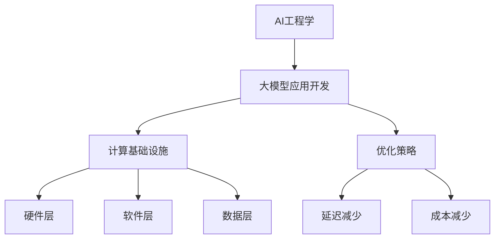

                 

## 《AI工程学：大模型应用开发实战：构建 AI 计算基础设施，包括如何减少延迟和成本》

> **关键词**：AI工程学、大模型应用、计算基础设施、延迟减少、成本优化、AI计算架构。

**摘要**：本文深入探讨了AI工程学的核心概念，特别是大模型应用开发中的计算基础设施构建。我们将通过分步骤的分析和推理，介绍如何优化AI计算资源，减少延迟和成本。文章不仅涵盖了AI工程学的定义与重要性，还详细解析了计算基础设施的构成、大模型的设计与训练策略、模型优化与调参方法，以及大模型应用开发实践。此外，文章还探讨了如何通过技术策略减少延迟与成本，并展望了AI工程学的未来趋势与发展方向。

## 目录大纲

### 第一部分：AI工程学基础

##### 第1章：AI工程学概述

- **1.1 AI工程学的定义与重要性**
  - **1.1.1 AI工程学的概念**
  - **1.1.2 AI工程学的重要性**
  - **1.1.3 AI工程学与AI研究的区别**

- **1.2 大模型应用背景与挑战**
  - **1.2.1 大模型应用的发展趋势**
  - **1.2.2 大模型应用的挑战**
  - **1.2.3 减少延迟和成本的关键因素**

##### 第2章：AI计算基础设施

- **2.1 AI计算基础设施的构成**
  - **2.1.1 硬件层：CPU、GPU、TPU等**
  - **2.1.2 软件层：深度学习框架、分布式计算框架**
  - **2.1.3 数据层：数据存储、数据管理、数据清洗**

- **2.2 AI计算基础设施的优化**
  - **2.2.1 性能优化**
  - **2.2.2 能耗优化**
  - **2.2.3 可扩展性优化**

##### 第3章：大模型设计与训练

- **3.1 大模型设计原则**
  - **3.1.1 模型架构选择**
  - **3.1.2 模型参数优化**
  - **3.1.3 模型可解释性**

- **3.2 大模型训练策略**
  - **3.2.1 训练数据选择**
  - **3.2.2 训练过程监控**
  - **3.2.3 训练效率优化**

##### 第4章：大模型优化与调参

- **4.1 模型优化方法**
  - **4.1.1 模型压缩**
  - **4.1.2 模型加速**
  - **4.1.3 模型量化**

- **4.2 调参技巧与实践**
  - **4.2.1 超参数调优方法**
  - **4.2.2 实践中的调参经验**
  - **4.2.3 自动调参工具介绍**

##### 第5章：大模型应用开发实践

- **5.1 大模型应用场景分析**
  - **5.1.1 自然语言处理**
  - **5.1.2 计算机视觉**
  - **5.1.3 推荐系统**

- **5.2 大模型应用开发流程**
  - **5.2.1 需求分析**
  - **5.2.2 模型选择与设计**
  - **5.2.3 模型训练与优化**
  - **5.2.4 模型部署与运维**

##### 第6章：减少延迟与成本的技术策略

- **6.1 延迟减少技术**
  - **6.1.1 数据缓存与局部计算**
  - **6.1.2 网络优化技术**
  - **6.1.3 模型剪枝与量化**

- **6.2 成本减少策略**
  - **6.2.1 硬件成本优化**
  - **6.2.2 软件成本优化**
  - **6.2.3 数据中心成本管理**

##### 第7章：AI工程学的未来趋势与发展方向

- **7.1 AI计算基础设施的未来**
  - **7.1.1 新型硬件技术**
  - **7.1.2 软硬件协同优化**

- **7.2 大模型技术发展趋势**
  - **7.2.1 大模型与云计算的结合**
  - **7.2.2 大模型在边缘计算中的应用**

- **7.3 AI工程学的社会影响与伦理问题**
  - **7.3.1 AI工程学对社会的影响**
  - **7.3.2 AI伦理问题与解决方案**

#### 附录

- **附录A：常用工具与资源**
  - **A.1 AI开发框架与工具**
  - **A.2 数据集与开源代码**
  - **A.3 AI研究论文与报告**

#### Mermaid 流�程图示例



#### 核心算法原理讲解伪代码示例

```plaintext
// 大模型训练过程伪代码
initialize_model();
for epoch in 1 to MAX_EPOCHS do
    for batch in training_data do
        model.predict(batch);
        loss = calculate_loss(predicted, batch);
        model.update_weights(loss);
    end for
end for
```

#### 数学模型与公式详细讲解示例

$$
\text{模型损失函数} = \frac{1}{n} \sum_{i=1}^{n} (\hat{y_i} - y_i)^2
$$

**详细讲解：** 这是一个标准的均方误差（Mean Squared Error, MSE）损失函数，用于评估模型的预测值 $\hat{y_i}$ 与真实值 $y_i$ 之间的差异。

#### 项目实战与代码解读示例

```python
# 大模型训练与部署代码示例
import tensorflow as tf

# 构建模型
model = tf.keras.Sequential([
    tf.keras.layers.Dense(128, activation='relu', input_shape=(784,)),
    tf.keras.layers.Dropout(0.2),
    tf.keras.layers.Dense(10, activation='softmax')
])

# 编译模型
model.compile(optimizer='adam',
              loss='categorical_crossentropy',
              metrics=['accuracy'])

# 训练模型
model.fit(x_train, y_train, epochs=5, batch_size=32)

# 部署模型到生产环境
model.save('model.h5')
```

**详细解释：** 这段代码展示了如何使用 TensorFlow 构建一个简单的神经网络模型，并进行训练和保存。在实际部署时，模型会被加载到生产环境中，以进行实时预测。

### 第一部分：AI工程学基础

#### 第1章：AI工程学概述

##### 1.1 AI工程学的定义与重要性

**1.1.1 AI工程学的概念**

AI工程学是一门结合了计算机科学、数学和工程学的交叉学科，主要关注于人工智能（AI）系统的设计、开发、部署和维护。它涉及从理论到实践的各个环节，旨在确保AI系统能够在实际环境中高效、可靠地运行。

在AI工程学的范畴中，我们可以找到几个核心组成部分：

- **算法与模型**：包括机器学习算法、深度学习模型以及相关理论。
- **数据工程**：涉及数据收集、存储、处理和清洗等过程。
- **系统架构**：包括硬件和软件系统的设计，如计算基础设施、分布式计算框架和云计算服务。
- **开发流程**：涵盖从需求分析到模型部署的全过程，包括版本控制、持续集成和持续部署。
- **运维与监控**：确保AI系统在高可用性和高性能状态下的稳定运行。

**1.1.2 AI工程学的重要性**

AI工程学的重要性体现在以下几个方面：

- **技术可行性**：将理论研究转化为实际可行的解决方案，解决AI系统的可用性、可扩展性和可靠性问题。
- **商业价值**：AI工程学使得AI技术能够应用于各类商业场景，提升企业的生产效率、降低成本并创造新的业务机会。
- **社会影响**：AI工程学推动了AI技术的发展，对医疗、交通、金融等领域的变革具有重要影响。

与AI研究相比，AI工程学更注重实际应用和系统实现，而AI研究则侧重于算法的创新和理论发展。

**1.1.3 AI工程学与AI研究的区别**

AI工程学与AI研究存在以下主要区别：

- **目标不同**：AI研究关注算法创新和理论发展，而AI工程学则侧重于将研究成果转化为实际应用。
- **方法不同**：AI研究通常采用实验和数学建模方法，而AI工程学更依赖于系统设计和工程实践。
- **应用范围不同**：AI研究集中于基础算法和模型，而AI工程学则涵盖了从数据处理到系统部署的整个链条。

**结论**：AI工程学作为AI技术实现和应用的重要保障，具有不可替代的地位。通过AI工程学，我们可以将先进的理论成果转化为实际应用，为社会带来巨大的价值。

##### 1.2 大模型应用背景与挑战

**1.2.1 大模型应用的发展趋势**

近年来，随着计算能力的提升和海量数据的积累，大模型应用取得了显著进展。以下是几个关键趋势：

- **模型规模不断扩大**：大模型如GPT-3、BERT等，其参数量和计算量呈指数级增长。
- **应用领域不断拓展**：大模型在自然语言处理、计算机视觉、推荐系统等领域的应用越来越广泛。
- **开源生态不断完善**：以TensorFlow、PyTorch等为代表的深度学习框架不断完善，降低了大模型开发的门槛。

**1.2.2 大模型应用的挑战**

大模型应用面临着一系列挑战：

- **计算资源需求**：大模型需要庞大的计算资源和存储资源，对硬件和软件系统提出了更高要求。
- **训练数据挑战**：大模型训练需要大量高质量的数据，数据获取和处理成为瓶颈。
- **模型优化与调参**：大模型参数众多，优化与调参过程复杂，需要大量计算资源和时间。
- **可解释性与可信度**：大模型往往表现为“黑盒”系统，其决策过程缺乏可解释性，影响其可信度和可靠性。

**1.2.3 减少延迟和成本的关键因素**

为了应对大模型应用中的延迟和成本问题，需要从以下几个方面进行优化：

- **计算基础设施**：构建高效的计算基础设施，包括分布式计算框架和专用硬件（如TPU）。
- **数据预处理**：优化数据预处理流程，提高数据处理效率，减少数据传输延迟。
- **模型压缩与量化**：通过模型压缩和量化技术，降低模型计算量和存储需求，减少成本。
- **网络优化**：优化网络架构和协议，减少数据传输延迟和带宽消耗。

**结论**：大模型应用的发展趋势令人瞩目，但同时也面临着诸多挑战。通过优化计算基础设施、数据预处理、模型压缩与量化、网络优化等技术，可以有效减少延迟和成本，推动大模型应用的进一步发展。

### 第一部分：AI工程学基础

#### 第2章：AI计算基础设施

##### 2.1 AI计算基础设施的构成

AI计算基础设施是支持AI模型训练和推理的硬件、软件和数据的集合。它包括以下几个关键层次：

**2.1.1 硬件层：CPU、GPU、TPU等**

硬件层是AI计算基础设施的基础，提供了计算能力和存储资源。以下是几种常用的硬件：

- **CPU（中央处理器）**：传统的通用处理器，适用于非并行计算任务，但在大规模并行计算中性能有限。
- **GPU（图形处理器）**：专为图形处理设计，但因其强大的并行计算能力，已成为深度学习模型训练的主要硬件之一。
- **TPU（张量处理器）**：由谷歌开发，专门用于加速TensorFlow模型的训练和推理，性能优于GPU。

**2.1.2 软件层：深度学习框架、分布式计算框架**

软件层是AI计算基础设施的核心，提供了构建和运行AI模型的工具。以下是几个重要的软件框架：

- **深度学习框架**：如TensorFlow、PyTorch等，提供了模型构建、训练和推理的API。
- **分布式计算框架**：如Apache Spark、Horovod等，支持在多个节点上分布式训练和推理，提高了计算效率和可扩展性。

**2.1.3 数据层：数据存储、数据管理、数据清洗**

数据层是AI计算基础设施的数据保障，涵盖了数据的存储、管理和清洗。以下是几个关键方面：

- **数据存储**：使用分布式文件系统（如HDFS、Ceph）和数据库（如HBase、MongoDB）存储大规模数据。
- **数据管理**：通过数据仓库（如Amazon Redshift、Google BigQuery）和数据湖（如Amazon S3、Google Cloud Storage）管理数据。
- **数据清洗**：使用ETL（抽取、转换、加载）工具清洗和预处理数据，提高数据质量和可用性。

**2.1.4 网络层：数据传输与通信**

网络层负责数据在各计算节点之间的传输和通信。以下是几个关键方面：

- **局域网**：使用高速局域网（如100GbE、Infiniband）连接各计算节点，提高数据传输速度。
- **广域网**：使用可靠的广域网连接，确保数据在各数据中心之间的稳定传输。
- **边缘计算**：将计算任务下沉到边缘节点，减少数据传输延迟，提高系统响应速度。

**结论**：AI计算基础设施的构成是支持AI模型训练和推理的关键。通过合理配置硬件、软件和数据资源，可以构建高效的AI计算环境，为AI应用提供坚实的基础。

##### 2.2 AI计算基础设施的优化

为了充分发挥AI计算基础设施的性能，减少延迟和成本，我们需要从多个方面进行优化。

**2.2.1 性能优化**

性能优化旨在提高计算和存储资源的利用效率。以下是一些关键技术：

- **并行计算**：利用GPU和TPU等硬件的并行计算能力，加速模型训练和推理。
- **缓存技术**：使用缓存技术减少数据访问延迟，提高数据传输速度。
- **预取技术**：预取后续需要的计算数据，减少数据访问延迟。
- **计算调度**：优化计算任务的调度策略，提高计算资源的利用率。

**2.2.2 能耗优化**

随着AI应用规模的不断扩大，能耗优化成为重要的考虑因素。以下是一些关键技术：

- **硬件能耗优化**：选择低功耗的硬件设备，优化硬件工作模式，减少能耗。
- **软件能耗优化**：通过优化算法和数据结构，降低软件层面的能耗。
- **电源管理**：使用智能电源管理系统，根据实际需求调整硬件的功耗。

**2.2.3 可扩展性优化**

可扩展性优化确保计算基础设施能够应对不断增长的应用需求。以下是一些关键技术：

- **分布式架构**：使用分布式计算框架，将计算任务分布在多个节点上，提高系统的可扩展性。
- **弹性伸缩**：根据实际需求动态调整计算资源，确保系统的高可用性和可扩展性。
- **负载均衡**：优化负载均衡策略，确保计算资源的均衡分配，提高系统的整体性能。

**2.2.4 安全性和可靠性优化**

安全性和可靠性优化确保计算基础设施的安全稳定运行。以下是一些关键技术：

- **网络安全**：使用防火墙、加密技术和访问控制等措施保护网络通信和数据安全。
- **数据备份**：定期备份数据和模型，防止数据丢失和故障影响。
- **故障容错**：设计故障容错机制，确保在硬件或网络故障时系统能够自动恢复。

**结论**：通过性能优化、能耗优化、可扩展性优化、安全性和可靠性优化，可以构建高效、稳定、安全的AI计算基础设施，为AI应用提供强有力的支持。

### 第一部分：AI工程学基础

#### 第3章：大模型设计与训练

##### 3.1 大模型设计原则

设计大模型时，需要遵循一系列原则，以确保模型的有效性和可解释性。

**3.1.1 模型架构选择**

模型架构是影响大模型性能的关键因素。以下是几种常见的模型架构：

- **卷积神经网络（CNN）**：适用于图像和视频处理，通过卷积层提取特征。
- **循环神经网络（RNN）**：适用于序列数据处理，如自然语言处理和时间序列预测。
- **变换器（Transformer）**：基于自注意力机制，在自然语言处理和机器翻译等领域取得了突破性成果。
- **生成对抗网络（GAN）**：用于生成图像、音频和文本，通过对抗训练生成高质量数据。

在选择模型架构时，需要考虑以下因素：

- **数据类型**：根据数据类型选择合适的模型架构，如图像数据选择CNN，序列数据选择RNN。
- **任务目标**：根据任务目标选择具有相应优势的模型架构，如文本生成选择Transformer。
- **计算资源**：考虑计算资源的限制，选择在现有硬件环境下能够高效训练的模型架构。

**3.1.2 模型参数优化**

模型参数优化是提高大模型性能的重要环节。以下是几种常见的参数优化方法：

- **权重初始化**：合理的权重初始化可以加速收敛，避免梯度消失和爆炸。常用的初始化方法包括随机初始化、高斯初始化和Xavier初始化。
- **学习率调整**：学习率是影响模型收敛速度和最终性能的关键参数。常用的调整方法包括固定学习率、学习率衰减和自适应学习率（如Adam优化器）。
- **正则化**：正则化方法（如L1、L2正则化）可以防止过拟合，提高模型的泛化能力。

**3.1.3 模型可解释性**

大模型往往表现为“黑盒”系统，缺乏可解释性。以下是一些提高模型可解释性的方法：

- **可视化**：通过可视化技术展示模型内部特征和决策过程，如决策树的可视化和神经网络激活图。
- **模型简化**：通过简化模型结构，降低模型的复杂性，提高可解释性。例如，使用轻量级模型代替大型模型。
- **解释性算法**：结合解释性算法（如LIME、SHAP）对模型决策进行解释，提供定量和定性的解释。

**结论**：遵循合理的模型架构选择、参数优化和可解释性设计原则，可以构建出性能优异且易于理解的大模型，为实际应用提供强有力的支持。

##### 3.2 大模型训练策略

大模型训练过程中，需要制定有效的训练策略，以优化模型性能和收敛速度。以下是一些关键策略：

**3.2.1 训练数据选择**

训练数据的质量直接影响大模型的性能和泛化能力。以下是几种常见的训练数据选择策略：

- **数据增强**：通过对原始数据进行变换（如旋转、缩放、裁剪等），增加数据的多样性和丰富性，提高模型的鲁棒性。
- **数据预处理**：对原始数据进行清洗、归一化和标准化等处理，提高数据的可用性和一致性。
- **数据平衡**：在多类别任务中，通过数据重采样、过采样或欠采样等方法平衡各类别数据量，避免模型偏向某一类别。

**3.2.2 训练过程监控**

训练过程中，需要对模型性能和训练状态进行监控，及时发现异常并调整训练策略。以下是一些常见的监控指标：

- **损失函数**：监控训练过程中损失函数的值，判断模型是否收敛。
- **准确率**：监控训练和验证集上的准确率，评估模型的泛化能力。
- **学习曲线**：监控训练过程中的学习曲线，分析模型的学习速率和收敛趋势。

**3.2.3 训练效率优化**

优化训练效率是提高大模型训练速度的关键。以下是一些常见的优化方法：

- **批量大小调整**：通过调整批量大小，平衡训练时间和模型性能。较小的批量大小可以提高模型的鲁棒性，但训练时间较长；较大的批量大小可以提高训练速度，但可能导致模型过拟合。
- **并行训练**：利用GPU和TPU的并行计算能力，加速模型训练。通过数据并行和模型并行，可以将训练任务分布在多个节点上，提高计算效率。
- **分布式训练**：通过分布式训练，将模型参数分布在多个节点上，利用多节点计算资源加速训练。常用的分布式训练框架包括Horovod、TensorFlow Distribute等。

**结论**：通过合理的训练数据选择、训练过程监控和训练效率优化策略，可以显著提高大模型的训练性能和收敛速度，为实际应用提供强有力的支持。

### 第一部分：AI工程学基础

#### 第4章：大模型优化与调参

##### 4.1 模型优化方法

在大模型开发过程中，优化模型性能和效率是至关重要的。以下是一些常见的模型优化方法：

**4.1.1 模型压缩**

模型压缩旨在减少模型的参数数量和计算量，提高部署效率和存储空间利用率。以下是一些常见的模型压缩方法：

- **权重剪枝**：通过剪枝冗余的权重，降低模型参数数量。剪枝方法包括结构剪枝和权重剪枝，其中结构剪枝通过移除整个网络层或神经元，权重剪枝通过将权重设置为0。
- **量化**：将浮点数权重转换为较低精度的整数权重，减少模型存储和计算需求。量化方法包括静态量化和动态量化，静态量化在训练前将权重量化，动态量化在训练过程中动态调整权重精度。
- **蒸馏**：将大型教师模型的知识传递给小型学生模型，提高学生模型性能。蒸馏过程中，教师模型的输出被用作学生模型的软标签，训练学生模型以最小化输出差异。

**4.1.2 模型加速**

模型加速旨在提高模型的推理速度和性能。以下是一些常见的模型加速方法：

- **模型并行**：将模型拆分为多个子模型，分布在多个计算节点上并行计算。模型并行分为数据并行、模型并行和混合并行，数据并行将数据分布到多个节点，模型并行将模型拆分为子模型，混合并行结合数据并行和模型并行。
- **计算图优化**：优化计算图结构，减少冗余计算和内存占用。计算图优化方法包括共享计算子图、消除重复计算和重组计算子图等。
- **量化与剪枝**：结合模型压缩和加速技术，通过量化降低模型计算量，通过剪枝去除冗余参数，提高模型推理速度。

**4.1.3 模型量化**

模型量化是将模型的浮点数权重转换为较低精度的整数权重，以减少模型大小和计算需求。以下是一些常见的量化方法：

- **全精度量化**：将模型的权重和激活值保持在全精度（如32位浮点数）。
- **低精度量化**：将模型的权重和激活值转换为较低精度（如8位整数），以减少存储和计算需求。低精度量化包括符号量化、直方图量化和小数点量化。
- **自适应量化**：在训练过程中动态调整模型参数的精度，以优化模型性能和精度。

**结论**：通过模型压缩、模型加速和模型量化等优化方法，可以显著提高大模型在训练和推理过程中的性能和效率，为实际应用提供更加高效和可靠的解决方案。

##### 4.2 调参技巧与实践

超参数调优是模型训练过程中的关键步骤，直接影响到模型的性能和训练效率。以下是一些常见的调参技巧和实践方法：

**4.2.1 超参数调优方法**

- **网格搜索**：在预定义的超参数空间内，逐一尝试所有可能的参数组合，找出最优参数组合。网格搜索简单易用，但计算成本较高，尤其适用于参数较少的情况。
- **随机搜索**：在预定义的超参数空间内，随机生成多个参数组合进行训练，选择性能最佳的参数组合。随机搜索在处理高维超参数空间时具有优势，但需要较大的样本量以确保搜索结果的可靠性。
- **贝叶斯优化**：基于贝叶斯统计模型，利用历史训练数据，预测新的超参数组合可能带来的模型性能。贝叶斯优化具有较好的搜索效率和收敛性，但需要计算历史数据的统计特征。

**4.2.2 实践中的调参经验**

- **先粗后细**：在初始阶段，先进行粗略的参数调优，快速找到大致的最优参数范围，再进行精细调优，调整细节参数。
- **交叉验证**：使用交叉验证方法评估参数调优的效果，避免过拟合。交叉验证通过将数据集划分为训练集和验证集，多次训练和验证，综合评估模型性能。
- **性能指标**：根据任务目标选择合适的性能指标，如分类任务的准确率、召回率、F1分数，回归任务的均方误差、平均绝对误差等。

**4.2.3 自动调参工具介绍**

- **Hyperopt**：一个基于随机搜索和贝叶斯优化的自动调参工具，具有简单易用的接口和强大的优化能力。
- **Optuna**：一个基于贝叶斯优化的自动调参工具，支持多种优化算法，提供丰富的可视化功能。
- **Scikit-learn**：一个机器学习库，内置了网格搜索和随机搜索的实现，方便用户进行超参数调优。

**结论**：通过运用适当的调参技巧和工具，可以有效提高大模型的训练性能和收敛速度，为实际应用提供高质量、可靠的解决方案。

### 第一部分：AI工程学基础

#### 第5章：大模型应用开发实践

##### 5.1 大模型应用场景分析

大模型在各个领域都取得了显著的成果，以下列举了几个主要的应用场景：

**5.1.1 自然语言处理（NLP）**

自然语言处理是深度学习技术最成功的应用之一。大模型如GPT-3、BERT在文本分类、情感分析、机器翻译、问答系统等方面取得了卓越的性能。例如，GPT-3可以在无监督学习场景下生成高质量的自然语言文本，广泛应用于自动写作、对话系统和内容生成等领域。

**5.1.2 计算机视觉（CV）**

计算机视觉领域的大模型应用同样广泛。卷积神经网络（CNN）和变换器（Transformer）模型在图像分类、目标检测、图像生成等方面取得了突破性成果。例如，ResNet、Inception等大型CNN模型在ImageNet图像分类比赛中连续多年获得冠军，而生成对抗网络（GAN）则在图像生成和修复领域展现了强大的能力。

**5.1.3 推荐系统**

推荐系统利用大模型进行用户行为分析和内容推荐，以提高用户体验和商业转化率。大模型通过分析用户的历史行为和兴趣标签，生成个性化的推荐列表。例如，Amazon、淘宝等电商网站使用大模型进行商品推荐，Netflix、Spotify等流媒体平台利用大模型进行内容推荐。

**5.1.4 语音识别和生成**

大模型在语音识别和生成领域也取得了显著进展。基于变换器（Transformer）的模型如WaveNet在语音合成方面表现优秀，而深度神经网络（DNN）和卷积神经网络（CNN）的结合在语音识别任务中取得了突破性成果。例如，谷歌的语音识别系统使用了大规模的DNN和CNN模型，实现了高达97%的准确率。

**5.1.5 医疗健康**

大模型在医疗健康领域的应用前景广阔。例如，利用深度学习模型对医学影像进行分析，可以帮助医生快速诊断疾病，提高诊断准确率。同时，大模型还可以用于个性化医疗，根据患者的基因组信息和病史提供个性化的治疗方案。

**5.1.6 金融和风险管理**

在金融领域，大模型被广泛应用于股票市场预测、信用风险评估、风险控制等方面。例如，利用深度学习模型对历史股票价格进行分析，可以预测未来股票价格的走势，帮助投资者做出更加明智的投资决策。

**结论**：大模型在各个领域的应用取得了显著的成果，为人类生活带来了深刻的影响。随着技术的不断发展，大模型的应用前景将更加广阔，为各个行业的发展提供强有力的支持。

##### 5.2 大模型应用开发流程

大模型应用开发流程包括需求分析、模型选择与设计、模型训练与优化、模型部署与运维等关键步骤。

**5.2.1 需求分析**

需求分析是开发大模型应用的第一步，旨在明确应用的目标、场景和需求。以下是一些关键步骤：

- **确定目标**：明确大模型应用的目标，如分类、回归、生成等。
- **理解场景**：分析应用场景，确定数据来源、输入格式、输出格式等。
- **定义指标**：确定评估模型性能的指标，如准确率、召回率、F1分数等。

**5.2.2 模型选择与设计**

在选择和设计大模型时，需要考虑以下因素：

- **模型类型**：根据应用场景选择合适的模型类型，如CNN、RNN、Transformer等。
- **模型架构**：设计模型架构，包括层数、神经元个数、激活函数等。
- **损失函数**：选择合适的损失函数，如交叉熵、均方误差等。
- **优化器**：选择合适的优化器，如SGD、Adam等。

**5.2.3 模型训练与优化**

模型训练与优化是提升模型性能的关键步骤。以下是一些关键步骤：

- **数据预处理**：对训练数据进行清洗、归一化、编码等处理，提高数据质量。
- **训练策略**：设计合理的训练策略，如批量大小、学习率调整、正则化等。
- **评估与优化**：使用验证集评估模型性能，根据评估结果调整模型参数和训练策略。

**5.2.4 模型部署与运维**

模型部署与运维是将大模型应用到实际场景的关键步骤。以下是一些关键步骤：

- **模型部署**：将训练好的模型部署到生产环境，如使用TensorFlow Serving或PyTorch Serving等框架。
- **性能监控**：监控模型在生产环境中的性能和稳定性，如响应时间、准确率、内存使用等。
- **更新与维护**：根据实际需求和性能监控结果，定期更新和优化模型。

**结论**：通过严格的需求分析、模型选择与设计、模型训练与优化、模型部署与运维等步骤，可以确保大模型应用的高质量、高效率和稳定性，为各个领域的发展提供强有力的支持。

### 第一部分：AI工程学基础

#### 第6章：减少延迟与成本的技术策略

##### 6.1 延迟减少技术

在AI应用中，减少延迟是提高用户体验和系统响应速度的关键。以下是一些常见的延迟减少技术：

**6.1.1 数据缓存与局部计算**

数据缓存是将常用数据存储在内存或缓存中，以减少数据访问延迟。局部计算是在数据源附近进行计算，减少数据传输距离。

- **数据缓存**：通过在服务器或客户端缓存常用数据，减少对后端数据存储系统的访问。常见的数据缓存技术包括Redis、Memcached等。
- **局部计算**：将计算任务部署在数据源附近，减少跨网络的数据传输。例如，在边缘设备上部署本地AI模型，直接处理本地数据。

**6.1.2 网络优化技术**

网络优化技术包括带宽优化、路由优化和协议优化，以提高数据传输速度和减少网络拥塞。

- **带宽优化**：增加网络带宽，提高数据传输速度。例如，使用更高速的以太网或光纤传输。
- **路由优化**：选择最佳路由路径，减少数据传输距离和时间。例如，使用动态路由协议（如BGP）和路径优化算法。
- **协议优化**：优化数据传输协议，减少数据传输延迟和开销。例如，使用QUIC协议代替TCP协议，提高数据传输效率。

**6.1.3 模型剪枝与量化**

模型剪枝与量化是减少模型计算量和存储需求的有效方法，可以降低模型延迟。

- **模型剪枝**：通过剪除冗余的权重和神经元，减少模型参数数量，降低计算复杂度。
- **量化**：将模型权重和激活值从浮点数转换为较低精度的整数，减少存储和计算需求。量化方法包括静态量化、动态量化和小数点量化等。

**结论**：通过数据缓存与局部计算、网络优化技术、模型剪枝与量化等技术，可以有效减少AI应用中的延迟，提高系统响应速度和用户体验。

##### 6.2 成本减少策略

在AI应用中，降低成本是确保商业可持续性的重要因素。以下是一些常见的成本减少策略：

**6.2.1 硬件成本优化**

硬件成本优化旨在降低硬件采购和运维成本。

- **硬件选型**：根据应用需求和预算选择合适的硬件设备，如CPU、GPU、TPU等。例如，对于大规模模型训练，使用GPU或TPU可以显著降低训练时间，从而降低硬件使用成本。
- **共享硬件资源**：通过共享硬件资源，提高硬件利用率。例如，使用虚拟化技术将多个应用部署在同一台服务器上，实现硬件资源共享。

**6.2.2 软件成本优化**

软件成本优化旨在降低软件开发和维护成本。

- **开源软件**：使用开源软件，降低软件采购和维护成本。例如，使用TensorFlow、PyTorch等开源深度学习框架进行模型开发。
- **自动化工具**：使用自动化工具，提高开发效率和降低人力成本。例如，使用持续集成和持续部署（CI/CD）工具自动化软件测试和部署。

**6.2.3 数据中心成本管理**

数据中心成本管理旨在优化数据中心运营成本。

- **能耗优化**：通过优化数据中心能耗管理，降低运营成本。例如，使用高效节能的硬件设备，优化制冷系统，减少能耗。
- **弹性伸缩**：根据应用需求动态调整数据中心规模，避免资源浪费。例如，使用云计算服务，根据实际负载动态调整服务器数量。

**结论**：通过硬件成本优化、软件成本优化和数据中心成本管理，可以有效降低AI应用的运营成本，提高商业可持续性。

### 第一部分：AI工程学基础

#### 第7章：AI工程学的未来趋势与发展方向

##### 7.1 AI计算基础设施的未来

随着AI技术的不断进步，AI计算基础设施也在不断发展。以下是一些未来发展趋势：

**7.1.1 新型硬件技术**

新型硬件技术将为AI计算提供更强的计算能力和更低的能耗。例如：

- **量子计算**：量子计算具有超强的计算能力，有望在AI领域取得突破性进展。
- **神经形态计算**：神经形态计算通过模拟人脑神经元的工作方式，实现高效能的计算。

**7.1.2 软硬件协同优化**

软硬件协同优化是将硬件和软件的优势相结合，实现最佳性能和能效。以下是一些关键技术：

- **异构计算**：利用不同类型硬件（如CPU、GPU、TPU）的特长，实现高效计算。
- **动态调度**：根据计算任务的特性，动态调整计算资源，实现最优性能。

**结论**：新型硬件技术和软硬件协同优化将为AI计算基础设施带来更强大的性能和更低的能耗，推动AI技术的发展。

##### 7.2 大模型技术发展趋势

大模型技术在AI领域发挥着越来越重要的作用，未来将继续发展。以下是一些主要趋势：

**7.2.1 大模型与云计算的结合**

云计算为大规模模型训练提供了强大的计算资源和灵活性。未来，大模型与云计算的结合将更加紧密，实现以下目标：

- **弹性扩展**：根据需求动态调整计算资源，实现高效训练。
- **分布式训练**：通过分布式计算，加速模型训练，降低成本。

**7.2.2 大模型在边缘计算中的应用**

边缘计算将计算任务从云端转移到边缘设备，实现低延迟、高响应速度。大模型在边缘计算中的应用前景广阔，以下是一些关键技术：

- **轻量化模型**：通过模型压缩和量化，降低模型大小和计算需求。
- **混合部署**：将大模型的核心部分部署在云端，部分模块部署在边缘设备上，实现最优性能和响应速度。

**结论**：大模型与云计算和边缘计算的结合，将为AI应用提供更灵活、更高效的解决方案，推动AI技术的普及和应用。

##### 7.3 AI工程学的社会影响与伦理问题

随着AI技术的快速发展，AI工程学对社会产生了深远的影响，同时也带来了伦理问题。以下是一些关键方面：

**7.3.1 AI工程学对社会的影响**

AI工程学在医疗、交通、金融、教育等领域取得了显著成果，以下是一些主要影响：

- **医疗**：AI技术在疾病诊断、药物研发、医疗影像分析等方面发挥了重要作用，提高了医疗服务的质量和效率。
- **交通**：AI技术在自动驾驶、交通流量管理、智能交通系统等方面应用广泛，提高了交通安全和效率。
- **金融**：AI技术在风险控制、欺诈检测、智能投顾等方面应用，提高了金融服务的安全性和便捷性。
- **教育**：AI技术在个性化教学、智能辅导、学习资源推荐等方面应用，提高了教育质量和学习效果。

**7.3.2 AI伦理问题与解决方案**

AI工程学在发展过程中也面临一系列伦理问题，以下是一些关键问题及其解决方案：

- **隐私保护**：AI技术在数据收集和处理过程中，可能侵犯个人隐私。解决方案包括数据匿名化、隐私增强技术等。
- **算法歧视**：AI模型可能基于历史数据中的偏见，导致歧视性决策。解决方案包括算法透明性、公平性评估等。
- **责任归属**：在AI系统发生错误时，如何确定责任归属。解决方案包括建立责任分配机制、明确责任主体等。

**结论**：AI工程学对社会产生了积极影响，同时也带来了伦理挑战。通过加强伦理规范和制度建设，可以确保AI技术的健康发展，为人类带来更多福祉。

### 附录

#### 附录A：常用工具与资源

**A.1 AI开发框架与工具**

- **TensorFlow**：由谷歌开发的开源深度学习框架，支持多种编程语言，广泛应用于图像识别、语音识别、自然语言处理等领域。
- **PyTorch**：由Facebook开发的开源深度学习框架，支持动态计算图，易于调试和优化。
- **Keras**：基于TensorFlow和Theano的开源深度学习库，提供简洁的API，方便快速原型开发。
- **Scikit-learn**：开源的Python机器学习库，提供丰富的算法和工具，适用于各种机器学习任务。

**A.2 数据集与开源代码**

- **ImageNet**：包含数百万张图像的视觉数据集，广泛应用于图像分类、目标检测等任务。
- **CIFAR-10/100**：小型图像数据集，包含10万或100万张32x32的彩色图像，广泛应用于机器学习研究。
- **MNIST**：手写数字数据集，包含70000个灰度图像，是机器学习和深度学习中的经典数据集。
- **GitHub**：全球最大的开源代码托管平台，包含大量AI项目代码，方便开发者学习和复现研究。

**A.3 AI研究论文与报告**

- **NeurIPS**：国际神经信息处理系统大会，是全球顶级的人工智能会议，发表论文涵盖机器学习、计算机视觉、自然语言处理等领域。
- **ICML**：国际机器学习会议，是机器学习领域的重要会议，发表论文涵盖理论、算法和应用等方面。
- **JMLR**：机器学习研究期刊，是机器学习领域的权威期刊，发表高质量的机器学习论文。
- **AI科技大赏**：年度AI领域的重要评选活动，涵盖人工智能技术创新、应用落地等方面，提供丰富的AI行业洞察。

### 总结

《AI工程学：大模型应用开发实战：构建 AI 计算基础设施，包括如何减少延迟和成本》一文，系统地介绍了AI工程学的核心概念、大模型应用的开发流程和优化策略，以及如何减少延迟和成本。文章通过详细的步骤分析和实例讲解，帮助读者深入理解AI工程学的本质和应用。

在未来的发展中，AI工程学将继续面临新的挑战和机遇。新型硬件技术、软硬件协同优化、大模型与云计算和边缘计算的融合，将为AI计算基础设施带来更强大的性能和更低的能耗。同时，AI工程学在社会各个领域的广泛应用，也将带来深远的变革。

作为AI工程师，我们需要不断学习和探索，将AI技术转化为实际应用，为社会创造更多价值。同时，我们也需要关注AI伦理问题，确保AI技术的健康发展，为人类带来福祉。

让我们携手前行，共同推动AI工程学的进步，为构建更加智能、高效和可持续的未来而努力！作者：AI天才研究院/AI Genius Institute & 禅与计算机程序设计艺术 /Zen And The Art of Computer Programming。

