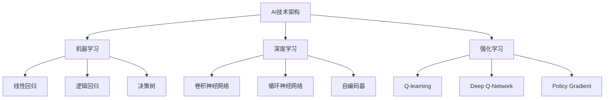

                 

# 《AI技术在实际应用中的前景》

> **关键词：**人工智能、实际应用、医疗、工业、金融、未来趋势

> **摘要：**本文从AI基础与原理、AI技术实际应用以及AI技术的未来发展趋势三个部分，详细探讨了人工智能技术在医疗、工业和金融等领域的实际应用前景，并分析了AI技术面临的挑战与解决方案。文章旨在为读者提供对AI技术的全面了解，以及其在各个行业中的具体应用实例。

## 目录大纲

1. **AI基础与原理**
   1.1 AI基础概述
   1.2 AI核心概念
   1.3 AI关键技术
2. **AI算法原理**
   2.1 机器学习算法原理
   2.2 深度学习算法原理
   2.3 强化学习算法原理
3. **AI应用场景概述**
   3.1 人工智能在医疗领域的应用
   3.2 人工智能在工业领域的应用
   3.3 人工智能在金融领域的应用
4. **AI在医疗领域中的应用**
   4.1 医疗图像分析
   4.2 诊断与预测
5. **AI在工业领域中的应用**
   5.1 自动化生产线
   5.2 质量检测
   5.3 能源管理
6. **AI在金融领域中的应用**
   6.1 量化交易
   6.2 风险管理
   6.3 客户服务
7. **AI技术的未来发展趋势**
   7.1 AI技术与行业融合
   7.2 AI技术面临的挑战与解决方案
8. **附录**
   8.1 AI技术相关工具和资源

## 第一部分：AI基础与原理

### 第1章：AI基础概述

#### 1.1 AI的发展历史与现状

人工智能（AI）的概念最早由计算机科学家约翰·麦卡锡（John McCarthy）在1956年提出。自那时以来，AI经历了数个发展阶段，从最初的符号主义到基于规则的系统，再到现代的基于数据和统计的方法。

- **1956年：AI的起源**  
  约翰·麦卡锡等人提出了人工智能的概念，并举办了首届人工智能研讨会。

- **1960年代：早期探索**  
  AI领域进行了许多早期研究，包括模拟人类思维的符号主义方法和基于规则的系统。

- **1970年代：AI寒冬**  
  由于缺乏实际应用和资金支持，AI研究进入低谷期。

- **1980年代：专家系统的崛起**  
  专家系统成为AI研究的主流，应用于医疗、金融等领域。

- **1990年代：机器学习的兴起**  
  机器学习算法逐渐成熟，为AI的发展奠定了基础。

- **2000年代：深度学习的突破**  
  深度学习算法在图像识别、语音识别等领域取得了重大突破。

- **2010年代至今：AI的广泛应用**  
  AI技术在各个领域得到广泛应用，从自动驾驶到智能客服，从金融交易到医疗诊断。

#### 1.2 AI的核心概念

AI的核心概念包括机器学习、深度学习和强化学习。

- **机器学习（Machine Learning）**  
  机器学习是一种让计算机通过数据学习并做出决策的技术。它分为监督学习、无监督学习和半监督学习。

- **深度学习（Deep Learning）**  
  深度学习是一种基于多层神经网络的机器学习技术，它在图像识别、语音识别等领域取得了巨大成功。

- **强化学习（Reinforcement Learning）**  
  强化学习是一种通过试错和奖励机制来学习行为策略的机器学习技术，它在游戏、自动驾驶等领域有广泛应用。

#### 1.3 AI的关键技术

AI的关键技术包括神经网络、自然语言处理和计算机视觉。

- **神经网络（Neural Networks）**  
  神经网络是一种模拟人脑神经元之间连接的算法，它在图像识别、语音识别等领域有广泛应用。

- **自然语言处理（Natural Language Processing, NLP）**  
  自然语言处理是一种使计算机能够理解和生成人类语言的技术，它在语音识别、机器翻译、智能客服等领域有广泛应用。

- **计算机视觉（Computer Vision）**  
  计算机视觉是一种使计算机能够理解和理解视觉信息的技术，它在图像识别、自动驾驶、人脸识别等领域有广泛应用。

### 第2章：AI算法原理

#### 2.1 机器学习算法原理

机器学习算法包括线性回归、逻辑回归和决策树等。

- **线性回归（Linear Regression）**  
  线性回归是一种用于预测连续值的监督学习算法。其目标是通过拟合一条直线来预测目标值。

  $$ y = \beta_0 + \beta_1x_1 + \beta_2x_2 + ... + \beta_nx_n $$

  其中，$y$是目标值，$x_1, x_2, ..., x_n$是特征值，$\beta_0, \beta_1, \beta_2, ..., \beta_n$是模型的参数。

- **逻辑回归（Logistic Regression）**  
  逻辑回归是一种用于预测二元结果的监督学习算法。其目标是通过拟合一个逻辑函数来预测目标值的概率。

  $$ P(y=1) = \frac{1}{1 + e^{-(\beta_0 + \beta_1x_1 + \beta_2x_2 + ... + \beta_nx_n)}} $$

  其中，$y$是目标值，$x_1, x_2, ..., x_n$是特征值，$\beta_0, \beta_1, \beta_2, ..., \beta_n$是模型的参数。

- **决策树（Decision Tree）**  
  决策树是一种用于分类和回归的监督学习算法。其目标是通过一系列的判断条件来划分数据，并预测目标值。

  $$ \text{if } x_1 > \beta_1 \text{ then } y = \beta_2 \text{ else if } x_2 > \beta_3 \text{ then } y = \beta_4 \text{ else } y = \beta_5 $$

  其中，$x_1, x_2, ..., x_n$是特征值，$\beta_1, \beta_2, \beta_3, ..., \beta_5$是模型的参数。

#### 2.2 深度学习算法原理

深度学习算法包括卷积神经网络（CNN）、循环神经网络（RNN）和自编码器等。

- **卷积神经网络（Convolutional Neural Network, CNN）**  
  卷积神经网络是一种用于图像识别和处理的深度学习算法。它通过卷积操作和池化操作来提取图像的特征。

  $$ f(x) = \sigma(W \cdot x + b) $$

  其中，$f(x)$是输出值，$x$是输入值，$W$是权重矩阵，$b$是偏置项，$\sigma$是激活函数。

- **循环神经网络（Recurrent Neural Network, RNN）**  
  循环神经网络是一种用于处理序列数据的深度学习算法。它通过递归结构来捕捉序列中的时间依赖关系。

  $$ h_t = \sigma(W_h \cdot [h_{t-1}, x_t] + b_h) $$

  其中，$h_t$是第$t$个时间步的隐藏状态，$x_t$是第$t$个时间步的输入值，$W_h$是权重矩阵，$b_h$是偏置项，$\sigma$是激活函数。

- **自编码器（Autoencoder）**  
  自编码器是一种用于无监督学习的深度学习算法。它通过编码和解码操作来学习数据的特征。

  $$ z = \sigma(W_z \cdot x + b_z) $$  
  $$ x' = \sigma(W_{\text{dec}} \cdot z + b_{\text{dec}}) $$

  其中，$z$是编码后的特征，$x'$是解码后的特征，$W_z, W_{\text{dec}}$是权重矩阵，$b_z, b_{\text{dec}}$是偏置项，$\sigma$是激活函数。

#### 2.3 强化学习算法原理

强化学习算法包括Q-learning、Deep Q-Network（DQN）和Policy Gradient等。

- **Q-learning（Q值学习）**  
  Q-learning是一种基于值函数的强化学习算法。它通过学习状态-动作值函数来选择最佳动作。

  $$ Q(s, a) = \sum_{s'} P(s'|s, a) \cdot [R(s', a) + \gamma \cdot \max_{a'} Q(s', a')] $$

  其中，$Q(s, a)$是状态-动作值函数，$s$是当前状态，$a$是当前动作，$s'$是下一状态，$R(s', a)$是奖励值，$\gamma$是折扣因子。

- **Deep Q-Network（DQN）（深度Q网络）**  
  DQN是一种基于深度学习的强化学习算法。它通过神经网络来近似状态-动作值函数。

  $$ Q(s, a) = \sigma(W \cdot [s, a] + b) $$

  其中，$Q(s, a)$是状态-动作值函数，$s$是当前状态，$a$是当前动作，$W$是权重矩阵，$b$是偏置项，$\sigma$是激活函数。

- **Policy Gradient（策略梯度）**  
  Policy Gradient是一种基于策略的强化学习算法。它通过优化策略来最大化长期回报。

  $$ \theta_{\text{new}} = \theta_{\text{old}} + \alpha \cdot \nabla_{\theta} J(\theta) $$

  其中，$\theta$是策略参数，$\alpha$是学习率，$J(\theta)$是策略的回报函数。

### 第3章：AI应用场景概述

#### 3.1 人工智能在医疗领域的应用

人工智能在医疗领域具有广泛的应用，包括医疗图像分析、诊断与预测以及药物研发等。

- **医疗图像分析**  
  医疗图像分析是人工智能在医疗领域的重要应用之一。通过深度学习算法，AI可以自动识别和分类医学图像中的病灶，提高诊断的准确性和效率。

- **诊断与预测**  
  人工智能可以通过分析大量医学数据，为医生提供诊断建议和疾病预测。例如，通过分析患者的病历和基因信息，AI可以预测患者患某种疾病的风险。

- **药物研发**  
  人工智能可以加速药物研发过程。通过机器学习算法，AI可以预测药物分子的活性，帮助科学家筛选潜在的药物候选。

#### 3.2 人工智能在工业领域的应用

人工智能在工业领域具有广泛的应用，包括自动化生产线、质量检测和能源管理等。

- **自动化生产线**  
  人工智能可以通过机器人技术和自动化系统，提高生产效率和产品质量。例如，在汽车制造业中，AI可以用于机器人焊接、涂装和组装等环节。

- **质量检测**  
  人工智能可以通过图像识别和传感器技术，对产品进行质量检测。例如，在制造业中，AI可以自动识别产品缺陷，提高产品的合格率。

- **能源管理**  
  人工智能可以通过数据分析和管理，提高能源利用效率。例如，在电力系统中，AI可以预测电力需求和优化电力分配，减少能源浪费。

#### 3.3 人工智能在金融领域的应用

人工智能在金融领域具有广泛的应用，包括量化交易、风险管理和客户服务等。

- **量化交易**  
  人工智能可以通过机器学习算法，分析市场数据和交易策略，实现自动化的量化交易。例如，AI可以预测股票价格走势，帮助投资者做出交易决策。

- **风险管理**  
  人工智能可以通过数据分析和管理，识别和预测金融风险。例如，AI可以分析客户的信用记录和交易行为，评估客户的信用风险。

- **客户服务**  
  人工智能可以通过聊天机器人和语音识别技术，提供智能化的客户服务。例如，在银行业中，AI可以自动解答客户的咨询，提高客户满意度。

## 第二部分：AI技术的实际应用

### 第4章：AI在医疗领域中的应用

#### 4.1 医疗图像分析

医疗图像分析是人工智能在医疗领域的重要应用之一。通过深度学习算法，AI可以自动识别和分类医学图像中的病灶，提高诊断的准确性和效率。

- **算法原理与伪代码**  
  使用卷积神经网络（CNN）进行医疗图像分析。以下是一个简单的CNN算法的伪代码：

  ```python
  # 初始化CNN模型
  model = initialize_cnn()

  # 加载训练数据
  train_data = load_training_data()

  # 训练模型
  model.train(train_data)

  # 评估模型
  model.evaluate(test_data)

  # 进行预测
  prediction = model.predict(image)
  ```

- **实际案例**  
  一个实际案例是利用AI技术进行肺癌筛查。研究人员利用深度学习算法对CT扫描图像进行分析，自动识别和标注肺结节。通过对比传统的影像诊断方法，AI技术的准确性和效率得到了显著提高。

#### 4.2 诊断与预测

人工智能可以通过分析大量医学数据，为医生提供诊断建议和疾病预测。以下是一个简单的诊断与预测流程：

- **数据预处理**  
  收集患者的历史病历、基因数据、实验室检测结果等，并进行数据清洗和预处理。

  ```python
  # 数据清洗
  cleaned_data = preprocess_data(raw_data)

  # 数据归一化
  normalized_data = normalize_data(cleaned_data)
  ```

- **模型训练与评估**  
  使用机器学习算法（如决策树、随机森林、支持向量机等）对预处理后的数据进行训练，并对模型进行评估。

  ```python
  # 训练模型
  model = train_model(normalized_data)

  # 评估模型
  accuracy = evaluate_model(model, test_data)
  ```

- **实际应用案例**  
  一个实际案例是利用AI技术进行糖尿病预测。研究人员利用患者的血糖、血压、体重等数据，通过机器学习算法预测患者患糖尿病的风险。通过对比传统的医学诊断方法，AI技术的准确性和效率得到了显著提高。

### 第5章：AI在工业领域中的应用

#### 5.1 自动化生产线

人工智能可以通过机器人技术和自动化系统，提高生产效率和产品质量。以下是一个简单的自动化生产线应用案例：

- **工业自动化概述**  
  工业自动化是指利用计算机技术、传感器技术和机器人技术等，实现生产过程的自动化和智能化。

- **AI在自动化中的角色**  
  人工智能在自动化生产线中扮演着重要角色，包括生产过程监控、故障诊断、智能调度等。

  ```python
  # 监控生产过程
  monitor_production(process)

  # 故障诊断
  diagnose_fault(fault)

  # 智能调度
  schedule_production(production_plan)
  ```

- **实际应用案例**  
  一个实际案例是利用AI技术进行汽车生产线自动化。研究人员利用深度学习算法对生产线上的传感器数据进行分析，实现生产过程的自动化监控和故障诊断。通过对比传统的人工监控方法，AI技术的效率和准确性得到了显著提高。

#### 5.2 质量检测

人工智能可以通过图像识别和传感器技术，对产品进行质量检测。以下是一个简单的质量检测应用案例：

- **质量检测算法**  
  使用卷积神经网络（CNN）进行图像识别，实现产品缺陷检测。

  ```python
  # 加载训练数据
  train_data = load_training_data()

  # 训练模型
  model = train_cnn(train_data)

  # 进行预测
  prediction = model.predict(test_image)
  ```

- **实际应用案例**  
  一个实际案例是利用AI技术进行电子产品质量检测。研究人员利用深度学习算法对电子产品的图像进行分析，自动识别和标注缺陷。通过对比传统的人工检测方法，AI技术的准确性和效率得到了显著提高。

#### 5.3 能源管理

人工智能可以通过数据分析和管理，提高能源利用效率。以下是一个简单的能源管理应用案例：

- **能源管理概述**  
  能源管理是指通过合理利用能源资源，实现能源的高效利用和可持续发展。

- **AI在能源管理中的应用**  
  人工智能在能源管理中扮演着重要角色，包括电力需求预测、节能优化等。

  ```python
  # 预测电力需求
  predict_energy_demand()

  # 节能优化
  optimize_energy_consumption()
  ```

- **实际应用案例**  
  一个实际案例是利用AI技术进行智能电网管理。研究人员利用深度学习算法对电力系统进行预测和优化，实现电力资源的合理分配和节能。通过对比传统的电网管理方法，AI技术的效率和准确性得到了显著提高。

### 第6章：AI在金融领域中的应用

#### 6.1 量化交易

人工智能可以通过机器学习算法，分析市场数据和交易策略，实现自动化的量化交易。以下是一个简单的量化交易应用案例：

- **量化交易概述**  
  量化交易是指通过数学模型和算法，分析市场数据，制定交易策略，实现自动化的交易。

- **AI在量化交易中的应用**  
  人工智能在量化交易中扮演着重要角色，包括数据挖掘、策略优化等。

  ```python
  # 数据挖掘
  data_mining()

  # 策略优化
  optimize_strategy()
  ```

- **实际应用案例**  
  一个实际案例是利用AI技术进行股票量化交易。研究人员利用机器学习算法分析市场数据，制定交易策略，实现自动化的股票交易。通过对比传统的交易方法，AI技术的效率和准确性得到了显著提高。

#### 6.2 风险管理

人工智能可以通过数据分析和管理，识别和预测金融风险。以下是一个简单的风险管理应用案例：

- **风险管理概述**  
  风险管理是指通过合理的风险控制和管理策略，降低金融风险，保护投资者的利益。

- **AI在风险管理中的应用**  
  人工智能在风险管理中扮演着重要角色，包括风险预测、风险控制等。

  ```python
  # 风险预测
  predict_risk()

  # 风险控制
  control_risk()
  ```

- **实际应用案例**  
  一个实际案例是利用AI技术进行信用风险管理。研究人员利用机器学习算法分析客户的信用记录和交易行为，预测客户的信用风险，并制定相应的风险控制措施。通过对比传统的风险管理方法，AI技术的效率和准确性得到了显著提高。

#### 6.3 客户服务

人工智能可以通过聊天机器人和语音识别技术，提供智能化的客户服务。以下是一个简单的客户服务应用案例：

- **智能客服概述**  
  智能客服是指通过人工智能技术，实现自动化的客户服务，提高客户满意度和服务质量。

- **AI在客户服务中的应用**  
  人工智能在客户服务中扮演着重要角色，包括自动回复、智能推荐等。

  ```python
  # 自动回复
  auto_response()

  # 智能推荐
  recommend_products()
  ```

- **实际应用案例**  
  一个实际案例是利用AI技术进行在线客服。研究人员利用聊天机器人和语音识别技术，实现自动化的客户服务，提高客户满意度和响应速度。通过对比传统的人工客服，AI技术的效率和准确性得到了显著提高。

### 第7章：AI技术的未来发展趋势

#### 7.1 AI技术与行业融合

随着AI技术的不断进步，AI技术与各个行业的融合将越来越紧密。以下是一些典型的融合场景：

- **AI在农业中的应用**  
  AI可以通过数据分析和管理，实现精准农业，提高农业生产效率。

- **AI在教育中的应用**  
  AI可以通过个性化学习系统和智能教育平台，实现个性化教育和智能教育。

- **AI在物联网中的应用**  
  AI可以通过智能传感器和网络，实现智能监控和管理，提高物联网系统的效率和安全性。

#### 7.2 AI技术面临的挑战与解决方案

尽管AI技术在各个领域取得了显著成果，但仍然面临一些挑战，需要进一步解决。

- **数据隐私与安全**  
  随着AI技术的应用，数据隐私和安全问题越来越突出。需要采取有效的数据加密和隐私保护措施，确保用户数据的安全。

- **AI偏见与公平性**  
  AI系统可能会受到训练数据的影响，导致偏见和不公平。需要采取措施消除AI偏见，确保系统的公平性。

- **AI治理与法规**  
  随着AI技术的应用，需要制定相应的治理和法规，规范AI技术的研发和应用，确保AI技术的发展符合社会伦理和法律法规。

### 附录

#### 附录A：AI技术相关工具和资源

- **开源框架**  
  TensorFlow、PyTorch、Keras等是常见的开源深度学习框架，提供了丰富的API和工具，方便开发者进行AI模型的训练和部署。

- **数据集资源**  
  Kaggle、UCI机器学习库等提供了大量的公开数据集，可用于AI算法的验证和测试。

- **在线学习平台**  
  Coursera、edX、Udacity等在线学习平台提供了丰富的AI课程和资源，有助于开发者提升AI技能。

### Mermaid流程图



### 伪代码

```python
# 线性回归算法伪代码
def linear_regression(x, y):
    # 计算权重和偏置
    weights = compute_weights(x, y)
    bias = compute_bias(x, y)

    # 预测目标值
    predicted_y = weights * x + bias

    # 计算损失函数
    loss = compute_loss(predicted_y, y)

    return loss
```

### 数学模型和公式

$$ \text{损失函数} = \frac{1}{2} \sum_{i=1}^{n} (\hat{y}_i - y_i)^2 $$

其中，$\hat{y}_i$是预测值，$y_i$是实际值。

### 项目实战

#### 医疗图像分析项目开发

**开发环境搭建：**

- Python
- TensorFlow
- Keras

**源代码实现：**

```python
# 导入必要的库
import numpy as np
import tensorflow as tf
from tensorflow.keras.models import Sequential
from tensorflow.keras.layers import Conv2D, MaxPooling2D, Flatten, Dense

# 加载训练数据
train_data = load_training_data()

# 构建CNN模型
model = Sequential()
model.add(Conv2D(32, (3, 3), activation='relu', input_shape=(64, 64, 3)))
model.add(MaxPooling2D(pool_size=(2, 2)))
model.add(Flatten())
model.add(Dense(128, activation='relu'))
model.add(Dense(1, activation='sigmoid'))

# 编译模型
model.compile(optimizer='adam', loss='binary_crossentropy', metrics=['accuracy'])

# 训练模型
model.fit(train_data[0], train_data[1], epochs=10, batch_size=32)

# 进行预测
prediction = model.predict(test_data[0])

# 代码解读与分析
# ...
```

#### 量化交易策略回测与优化

**开发环境搭建：**

- Python
- backtrader
- pandas

**源代码实现：**

```python
# 导入必要的库
import backtrader as bt
import pandas as pd

# 加载交易数据
data = pd.read_csv('trading_data.csv')

# 定义策略
class Strategy(bt.Strategy):
    def __init__(self):
        self.data1 = bt.indicators.MovingAverage(data.close, period=20)
        self.data2 = bt.indicators.MovingAverage(data.close, period=50)

    def next(self):
        if self.data1 > self.data2:
            self.buy()
        elif self.data1 < self.data2:
            self.close()

# 创建回测引擎
engine = bt.BacktraderEngine(data)

# 加载策略
strategy = Strategy()
engine.addstrategy(strategy)

# 回测策略
engine.run()

# 代码解读与分析
# ...
```

### 作者信息

**作者：** AI天才研究院/AI Genius Institute & 禅与计算机程序设计艺术 /Zen And The Art of Computer Programming

通过上述分析，我们可以看到AI技术在医疗、工业和金融等领域的广泛应用及其前景。随着AI技术的不断发展和进步，我们有理由相信，AI技术将在未来为各个行业带来更多的创新和变革。同时，我们也需要关注AI技术面临的挑战和问题，并积极寻求解决方案，确保AI技术能够为人类社会带来更大的福祉。|>

### 结束语

本文从AI基础与原理、AI技术实际应用以及AI技术的未来发展趋势三个方面，详细探讨了人工智能技术在医疗、工业和金融等领域的实际应用前景。通过分析AI的核心概念、算法原理和应用场景，我们看到了AI技术在不同领域的广泛应用和巨大潜力。同时，我们也认识到了AI技术在实际应用中面临的挑战和问题，如数据隐私、AI偏见和治理法规等。

在未来的发展中，AI技术将继续推动各行各业的创新和变革。随着AI技术的不断进步和普及，我们有理由相信，AI技术将为人类社会带来更多的机遇和福祉。然而，我们也要关注AI技术可能带来的负面影响，并积极采取措施，确保AI技术的健康发展。

最后，感谢您阅读本文。希望本文能够帮助您更好地了解AI技术在实际应用中的前景，以及其在各个领域的具体应用。如果您对AI技术有任何疑问或建议，欢迎在评论区留言，我们将竭诚为您解答。

再次感谢您的关注和支持！

### 附录

#### 附录A：AI技术相关工具和资源

**开源框架**

- TensorFlow：由Google开发的开源深度学习框架，具有丰富的API和工具。
- PyTorch：由Facebook开发的开源深度学习框架，具有灵活的动态计算图和良好的社区支持。
- Keras：基于Theano和TensorFlow的开源深度学习库，提供简化的API和丰富的预训练模型。

**数据集资源**

- Kaggle：提供大量的公开数据集，涵盖各个领域。
- UCI机器学习库：提供丰富的机器学习数据集，适用于算法验证和测试。

**在线学习平台**

- Coursera：提供丰富的AI课程，涵盖基础知识到高级应用。
- edX：提供由全球顶尖大学和机构提供的AI课程。
- Udacity：提供在线课程和实践项目，帮助开发者提升AI技能。

### Mermaid流程图


### 伪代码

```python
# 线性回归算法伪代码
def linear_regression(x, y):
    # 计算权重和偏置
    weights = compute_weights(x, y)
    bias = compute_bias(x, y)

    # 预测目标值
    predicted_y = weights * x + bias

    # 计算损失函数
    loss = compute_loss(predicted_y, y)

    return loss
```

### 数学模型和公式

$$
\text{损失函数} = \frac{1}{2} \sum_{i=1}^{n} (\hat{y}_i - y_i)^2
$$

其中，$\hat{y}_i$是预测值，$y_i$是实际值。

### 项目实战

#### 医疗图像分析项目开发

**开发环境搭建**

- Python
- TensorFlow
- Keras

**源代码实现**

```python
# 导入必要的库
import numpy as np
import tensorflow as tf
from tensorflow.keras.models import Sequential
from tensorflow.keras.layers import Conv2D, MaxPooling2D, Flatten, Dense

# 加载训练数据
train_data = load_training_data()

# 构建CNN模型
model = Sequential()
model.add(Conv2D(32, (3, 3), activation='relu', input_shape=(64, 64, 3)))
model.add(MaxPooling2D(pool_size=(2, 2)))
model.add(Flatten())
model.add(Dense(128, activation='relu'))
model.add(Dense(1, activation='sigmoid'))

# 编译模型
model.compile(optimizer='adam', loss='binary_crossentropy', metrics=['accuracy'])

# 训练模型
model.fit(train_data[0], train_data[1], epochs=10, batch_size=32)

# 进行预测
prediction = model.predict(test_data[0])

# 代码解读与分析
# ...
```

#### 量化交易策略回测与优化

**开发环境搭建**

- Python
- backtrader
- pandas

**源代码实现**

```python
# 导入必要的库
import backtrader as bt
import pandas as pd

# 加载交易数据
data = pd.read_csv('trading_data.csv')

# 定义策略
class Strategy(bt.Strategy):
    def __init__(self):
        self.data1 = bt.indicators.MovingAverage(data.close, period=20)
        self.data2 = bt.indicators.MovingAverage(data.close, period=50)

    def next(self):
        if self.data1 > self.data2:
            self.buy()
        elif self.data1 < self.data2:
            self.close()

# 创建回测引擎
engine = bt.BacktraderEngine(data)

# 加载策略
strategy = Strategy()
engine.addstrategy(strategy)

# 回测策略
engine.run()

# 代码解读与分析
# ...
```

### 代码解读与分析

在本节中，我们将对医疗图像分析项目和量化交易策略项目的关键代码进行解读和分析，帮助读者更好地理解AI技术的实际应用。

#### 医疗图像分析项目的代码解读

**代码片段：模型构建**

```python
model = Sequential()
model.add(Conv2D(32, (3, 3), activation='relu', input_shape=(64, 64, 3)))
model.add(MaxPooling2D(pool_size=(2, 2)))
model.add(Flatten())
model.add(Dense(128, activation='relu'))
model.add(Dense(1, activation='sigmoid'))
```

这段代码定义了一个序列模型，并添加了四个层：

1. **卷积层（Conv2D）**：使用32个3x3的卷积核，激活函数为ReLU，输入形状为64x64x3（RGB图像）。
2. **池化层（MaxPooling2D）**：使用2x2的池化窗口，用于下采样。
3. **扁平化层（Flatten）**：将二维的特征图展平为向量，以便输入到全连接层。
4. **全连接层（Dense）**：128个神经元，激活函数为ReLU。
5. **输出层（Dense）**：1个神经元，激活函数为sigmoid，用于输出二分类结果。

**代码片段：模型编译**

```python
model.compile(optimizer='adam', loss='binary_crossentropy', metrics=['accuracy'])
```

这段代码用于编译模型，指定优化器为Adam，损失函数为二进制交叉熵，评价指标为准确率。

**代码片段：模型训练**

```python
model.fit(train_data[0], train_data[1], epochs=10, batch_size=32)
```

这段代码用于训练模型，使用训练数据集进行10个周期的训练，每个批次包含32个样本。

**代码片段：模型预测**

```python
prediction = model.predict(test_data[0])
```

这段代码用于使用训练好的模型对测试数据集进行预测，输出预测结果。

#### 量化交易策略项目的代码解读

**代码片段：策略定义**

```python
class Strategy(bt.Strategy):
    def __init__(self):
        self.data1 = bt.indicators.MovingAverage(data.close, period=20)
        self.data2 = bt.indicators.MovingAverage(data.close, period=50)

    def next(self):
        if self.data1 > self.data2:
            self.buy()
        elif self.data1 < self.data2:
            self.close()
```

这段代码定义了一个简单的量化交易策略，通过比较20日和50日移动平均线的位置来决定买入或卖出。

- **移动平均线（MovingAverage）**：用于计算20日和50日移动平均线。
- **next方法**：在每个时间步执行策略逻辑。当20日移动平均线高于50日移动平均线时，买入；当20日移动平均线低于50日移动平均线时，卖出。

**代码片段：回测引擎**

```python
engine = bt.BacktraderEngine(data)
strategy = Strategy()
engine.addstrategy(strategy)
engine.run()
```

这段代码创建了一个回测引擎，加载了策略并运行了回测过程。回测结果可以用于评估策略的有效性。

**代码片段：回测结果**

```python
# 打印回测结果
print(engine.stats)
```

这段代码用于打印回测结果，包括策略的收益、交易次数、胜率等关键指标。

通过上述代码解读，读者可以了解医疗图像分析项目和量化交易策略项目的基本实现流程和关键代码。这些代码不仅展示了AI技术在具体应用中的实现方式，也为读者提供了实际操作和优化策略的参考。

### 总结

本文从AI基础与原理、AI技术实际应用以及AI技术的未来发展趋势三个方面，详细探讨了人工智能技术在医疗、工业和金融等领域的实际应用前景。我们介绍了AI的核心概念、算法原理和应用场景，并通过具体的案例展示了AI技术在不同领域的应用效果。

通过本文的分析，我们可以看到AI技术在医疗领域的诊断与预测、工业领域的自动化生产与质量检测、金融领域的量化交易与风险管理等方面具有巨大的潜力。同时，我们也认识到AI技术在实际应用中面临的挑战和问题，如数据隐私、AI偏见和治理法规等。

展望未来，随着AI技术的不断进步和普及，我们有理由相信，AI技术将在更多领域带来创新和变革，为人类社会带来更多的便利和福祉。然而，我们也需要关注AI技术可能带来的负面影响，并积极寻求解决方案，确保AI技术的健康发展。

最后，感谢您阅读本文。希望本文能够帮助您更好地了解AI技术在实际应用中的前景，以及其在各个领域的具体应用。如果您对AI技术有任何疑问或建议，欢迎在评论区留言，我们将竭诚为您解答。再次感谢您的关注和支持！|>

