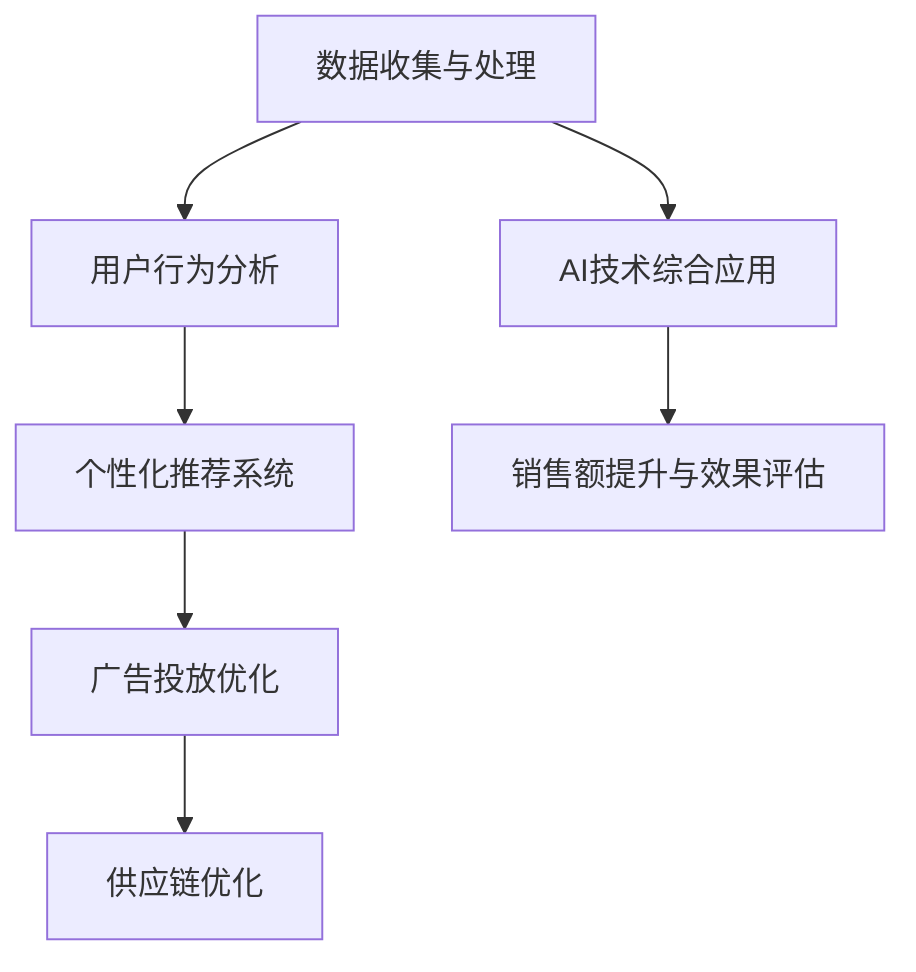

                 

### 《AI技术在电商销售额提升中的应用》

> **关键词：** 人工智能，电商，销售额，推荐系统，数据收集，用户行为分析

> **摘要：** 本文深入探讨了人工智能（AI）技术在电商领域中的应用，重点分析了AI如何通过个性化推荐系统、用户行为分析、广告投放优化和供应链优化等手段，显著提升电商平台的销售额。文章分为四个主要部分，首先介绍了AI技术在电商行业中的应用现状，然后详细阐述了AI技术在电商数据收集与处理、用户行为分析、推荐系统和广告投放优化等方面的具体应用，最后通过案例研究和未来发展趋势的分析，探讨了AI技术在电商销售额提升中的潜力与挑战。

### 目录大纲

#### 第一部分: 引言

- **1.1 书籍概述**
  - **1.1.1 书籍主题**
  - **1.1.2 书籍目标读者群体**
  - **1.1.3 书籍主要内容概述**

#### 第二部分: AI技术在电商行业中的应用

- **2.1 AI技术在电商行业中的应用现状**
  - **2.1.1 电商行业的发展趋势**
  - **2.1.2 AI技术在电商领域的应用**
  - **2.1.3 AI对电商销售额提升的作用**

- **2.2 电商数据收集与处理**
  - **2.2.1 电商数据来源**
  - **2.2.2 数据预处理方法**
  - **2.2.3 数据可视化技术**

- **2.3 电商用户行为分析**
  - **2.3.1 用户行为数据分析方法**
  - **2.3.2 用户画像构建**
  - **2.3.3 用户兴趣与偏好分析**

- **2.4 电商推荐系统**
  - **2.4.1 推荐系统基本原理**
  - **2.4.2 基于内容的推荐**
  - **2.4.3 基于协同过滤的推荐**
  - **2.4.4 深度学习在推荐系统中的应用**

- **2.5 电商广告投放优化**
  - **2.5.1 广告投放策略**
  - **2.5.2 广告效果评估**
  - **2.5.3 AI在广告投放优化中的应用**

- **2.6 电商供应链优化**
  - **2.6.1 供应链管理基本原理**
  - **2.6.2 AI在供应链优化中的应用**
  - **2.6.3 供应链优化对电商销售额的提升**

#### 第三部分: AI技术在电商销售额提升中的案例研究

- **3.1 案例一：某电商平台的AI技术应用**
  - **3.1.1 案例背景**
  - **3.1.2 AI技术应用方案**
  - **3.1.3 案例效果分析**

- **3.2 案例二：某电商平台的个性化推荐系统**
  - **3.2.1 案例背景**
  - **3.2.2 推荐系统设计与实现**
  - **3.2.3 案例效果分析**

- **3.3 案例三：某电商平台的广告投放优化**
  - **3.3.1 案例背景**
  - **3.3.2 广告投放优化策略**
  - **3.3.3 案例效果分析**

- **3.4 案例四：某电商平台的供应链优化**
  - **3.4.1 案例背景**
  - **3.4.2 供应链优化方案**
  - **3.4.3 案例效果分析**

#### 第四部分: AI技术在电商销售额提升中的挑战与未来发展趋势

- **4.1 AI技术在电商销售额提升中的挑战**
  - **4.1.1 数据隐私与安全问题**
  - **4.1.2 技术人才短缺问题**
  - **4.1.3 AI技术成熟度问题**

- **4.2 AI技术在电商销售额提升中的未来发展趋势**
  - **4.2.1 AI技术与电商行业的深度融合**
  - **4.2.2 人工智能在电商领域的创新应用**
  - **4.2.3 电商企业数字化转型与智能化升级**

- **4.3 AI技术在电商销售额提升中的应用前景**
  - **4.3.1 电商销售额提升的潜在影响因素**
  - **4.3.2 AI技术在电商行业中的广泛应用前景**
  - **4.3.3 AI技术与电商行业可持续发展**

#### 附录

- **附录一：AI技术在电商销售额提升中的应用工具与资源**
  - **附录一.1 数据处理与分析工具**
  - **附录一.2 机器学习与深度学习框架**
  - **附录一.3 推荐系统与广告投放优化工具**

- **附录二：相关法律法规与伦理问题**
  - **附录二.1 数据隐私与个人信息保护法律法规**
  - **附录二.2 AI技术在电商行业中的伦理问题**
  - **附录二.3 AI技术应用过程中的合规性问题**

### 《AI技术在电商销售额提升中的应用》

随着互联网的普及和电子商务的蓬勃发展，电商行业已经成为全球经济增长的重要驱动力。然而，在激烈的竞争中，如何提升销售额和用户满意度成为了电商企业的核心问题。近年来，人工智能（AI）技术的迅猛发展为电商行业带来了前所未有的机遇。本文将深入探讨AI技术在电商销售额提升中的应用，帮助电商企业实现智能化升级。

#### 第一部分: 引言

#### 1.1 书籍概述

##### 1.1.1 书籍主题

本书旨在探讨人工智能技术在电商销售额提升中的应用，重点关注AI技术在数据收集与处理、用户行为分析、推荐系统、广告投放优化和供应链优化等方面的实际应用。通过分析AI技术在电商行业中的应用现状和具体案例，本书旨在为电商企业提供可行的AI技术应用方案。

##### 1.1.2 书籍目标读者群体

本书的目标读者群体主要包括以下几类：

1. 电商企业高管和技术团队，希望了解AI技术在电商领域的应用价值；
2. 数据科学家和机器学习工程师，希望掌握AI技术在电商销售额提升中的应用方法；
3. 从事电商研究和教育的学者，希望了解AI技术在电商领域的最新研究动态。

##### 1.1.3 书籍主要内容概述

本书分为四个主要部分：

1. 第一部分：引言，介绍书籍主题、目标读者群体和主要内容；
2. 第二部分：AI技术在电商行业中的应用，详细探讨AI技术在电商数据收集与处理、用户行为分析、推荐系统、广告投放优化和供应链优化等方面的应用；
3. 第三部分：AI技术在电商销售额提升中的案例研究，通过实际案例展示AI技术在电商销售额提升中的应用效果；
4. 第四部分：AI技术在电商销售额提升中的挑战与未来发展趋势，探讨AI技术在电商销售额提升中的挑战和未来发展趋势。

#### 第二部分: AI技术在电商行业中的应用

##### 2.1 AI技术在电商行业中的应用现状

随着人工智能技术的不断进步，AI技术在电商行业的应用已经取得了显著的成果。以下将从电商行业的发展趋势、AI技术在电商领域的应用和AI对电商销售额提升的作用三个方面进行介绍。

###### 2.1.1 电商行业的发展趋势

近年来，电商行业呈现出以下发展趋势：

1. 互联网普及率提高，电商用户规模持续增长；
2. 移动互联网成为主流，移动电商快速发展；
3. 新零售模式兴起，线上线下融合趋势明显；
4. 消费升级，用户需求日益多样化。

这些趋势为AI技术在电商行业的应用提供了广阔的市场空间。

###### 2.1.2 AI技术在电商领域的应用

AI技术在电商领域的应用主要包括以下几个方面：

1. **数据收集与处理**：通过传感器、社交网络等渠道收集用户行为数据，利用数据挖掘和机器学习技术对海量数据进行处理和分析；
2. **用户行为分析**：利用自然语言处理和计算机视觉技术分析用户行为，构建用户画像，了解用户兴趣和偏好；
3. **推荐系统**：基于用户行为数据和用户画像，通过协同过滤、内容推荐等方法为用户推荐商品；
4. **广告投放优化**：利用机器学习算法优化广告投放策略，提高广告投放效果；
5. **供应链优化**：利用预测模型和优化算法优化供应链管理，提高物流效率，降低成本。

###### 2.1.3 AI对电商销售额提升的作用

AI技术在电商领域的应用对销售额提升具有以下作用：

1. **提高用户满意度**：通过个性化推荐和精准营销，满足用户需求，提高用户购物体验；
2. **降低运营成本**：通过数据分析和预测，优化库存管理和供应链，降低运营成本；
3. **提升营销效果**：通过优化广告投放策略，提高广告转化率，提高销售额；
4. **拓展市场**：通过分析用户行为和市场需求，发现潜在客户和新兴市场，拓展业务范围。

#### 2.2 电商数据收集与处理

##### 2.2.1 电商数据来源

电商数据来源主要包括以下几个方面：

1. **用户行为数据**：包括浏览记录、购物车、购买历史、评价等；
2. **商品数据**：包括商品描述、价格、库存量、分类等；
3. **外部数据**：包括社交媒体、搜索引擎、天气信息等。

##### 2.2.2 数据预处理方法

数据预处理是数据分析的重要环节，主要包括以下步骤：

1. **数据清洗**：去除重复数据、空值数据、异常数据等；
2. **数据转换**：将不同类型的数据进行统一格式转换；
3. **特征提取**：从原始数据中提取有用的特征，用于后续分析。

##### 2.2.3 数据可视化技术

数据可视化是将数据以图形或图表的形式展示出来，帮助人们更好地理解和分析数据。常用的数据可视化工具包括：

1. **Python可视化库**：如Matplotlib、Seaborn等；
2. **商业智能工具**：如Tableau、Power BI等。

#### 2.3 电商用户行为分析

##### 2.3.1 用户行为数据分析方法

用户行为数据分析方法主要包括以下几种：

1. **统计方法**：通过计算用户行为的各种指标，如点击率、转化率、跳出率等，了解用户行为模式；
2. **机器学习方法**：通过构建机器学习模型，对用户行为数据进行分析和预测，如分类、聚类、关联规则分析等；
3. **自然语言处理方法**：通过文本挖掘技术，对用户评价、评论等文本数据进行分析，提取用户情感和偏好。

##### 2.3.2 用户画像构建

用户画像是指通过收集和分析用户行为数据，对用户的兴趣、需求、行为特征等进行综合描述，形成用户的基本特征。用户画像的构建主要包括以下步骤：

1. **数据收集**：收集用户的基础信息、行为数据、社交数据等；
2. **数据清洗**：去除重复、缺失、异常数据；
3. **特征提取**：提取用户的基本属性、行为特征、兴趣偏好等；
4. **数据建模**：利用机器学习技术，对用户特征进行建模，形成用户画像。

##### 2.3.3 用户兴趣与偏好分析

用户兴趣与偏好分析是指通过分析用户的行为数据，了解用户的兴趣和偏好，从而为用户提供个性化的推荐和服务。用户兴趣与偏好分析主要包括以下方法：

1. **基于内容的推荐**：根据用户的兴趣和偏好，为用户推荐相似的内容或商品；
2. **基于协同过滤的推荐**：根据用户的历史行为和兴趣，为用户推荐其他用户的喜欢商品；
3. **基于深度学习的推荐**：利用深度学习技术，从用户行为数据中提取特征，为用户推荐个性化商品。

#### 2.4 电商推荐系统

##### 2.4.1 推荐系统基本原理

电商推荐系统是指根据用户的兴趣和行为，为用户推荐相关商品或服务的一种系统。推荐系统的基本原理包括：

1. **基于内容的推荐**：根据商品的属性和用户的历史行为，为用户推荐相似的商品；
2. **基于协同过滤的推荐**：根据用户的历史行为和兴趣，为用户推荐其他用户的喜欢商品；
3. **混合推荐**：将基于内容和协同过滤的推荐方法进行整合，提高推荐系统的准确性。

##### 2.4.2 基于内容的推荐

基于内容的推荐是指根据商品的属性和用户的历史行为，为用户推荐相似的商品。基于内容的推荐主要包括以下步骤：

1. **特征提取**：从商品和用户的行为数据中提取特征；
2. **相似度计算**：计算商品和用户之间的相似度；
3. **推荐生成**：根据相似度计算结果，为用户生成推荐列表。

##### 2.4.3 基于协同过滤的推荐

基于协同过滤的推荐是指根据用户的历史行为和兴趣，为用户推荐其他用户的喜欢商品。基于协同过滤的推荐主要包括以下步骤：

1. **用户相似度计算**：计算用户之间的相似度；
2. **商品相似度计算**：计算商品之间的相似度；
3. **推荐生成**：根据用户相似度和商品相似度，为用户生成推荐列表。

##### 2.4.4 深度学习在推荐系统中的应用

深度学习在推荐系统中的应用是指利用深度学习技术，从用户行为数据中提取特征，为用户生成个性化推荐。深度学习在推荐系统中的应用主要包括以下方法：

1. **深度神经网络推荐**：利用深度神经网络模型，从用户行为数据中提取特征，为用户生成推荐；
2. **图神经网络推荐**：利用图神经网络模型，从用户行为数据中提取特征，为用户生成推荐；
3. **多模态推荐**：结合多种数据类型（如文本、图像、语音等），为用户生成个性化推荐。

#### 2.5 电商广告投放优化

##### 2.5.1 广告投放策略

广告投放策略是指为了实现广告投放效果最大化，制定的广告投放方案。广告投放策略主要包括以下方面：

1. **定位策略**：确定广告投放的目标受众和投放区域；
2. **投放时间策略**：根据用户行为数据和节假日等因素，确定广告投放的最佳时间；
3. **预算策略**：根据广告投放目标和预算，合理分配广告投放预算。

##### 2.5.2 广告效果评估

广告效果评估是指对广告投放效果进行评估，以确定广告投放策略的有效性。广告效果评估主要包括以下指标：

1. **点击率（CTR）**：广告被用户点击的次数与广告展示次数的比值；
2. **转化率（CVR）**：广告带来的转化次数与点击次数的比值；
3. **投资回报率（ROI）**：广告带来的收益与广告投放成本的比值。

##### 2.5.3 AI在广告投放优化中的应用

AI在广告投放优化中的应用主要包括以下方法：

1. **基于机器学习的广告投放优化**：利用机器学习技术，分析用户行为数据和广告投放效果，优化广告投放策略；
2. **基于深度学习的广告投放优化**：利用深度学习技术，从用户行为数据中提取特征，优化广告投放策略；
3. **基于强化学习的广告投放优化**：利用强化学习技术，实现广告投放的自主优化。

#### 2.6 电商供应链优化

##### 2.6.1 供应链管理基本原理

供应链管理是指为了实现供应链的优化和协同，制定的一系列管理措施。供应链管理的基本原理包括：

1. **需求预测**：根据市场需求和历史销售数据，预测未来销售趋势；
2. **库存管理**：根据需求预测和库存策略，合理控制库存水平；
3. **物流管理**：优化物流运输，提高物流效率；
4. **供应链协同**：实现供应链各环节的协同和优化。

##### 2.6.2 AI在供应链优化中的应用

AI在供应链优化中的应用主要包括以下方法：

1. **基于机器学习的需求预测**：利用机器学习技术，分析历史销售数据，预测未来销售趋势；
2. **基于深度学习的库存管理**：利用深度学习技术，从销售数据中提取特征，优化库存管理；
3. **基于强化学习的物流管理**：利用强化学习技术，实现物流运输的自主优化。

##### 2.6.3 供应链优化对电商销售额的提升

供应链优化对电商销售额的提升主要体现在以下几个方面：

1. **提高物流效率**：优化物流运输，减少物流成本，提高用户满意度；
2. **降低库存成本**：通过优化库存管理，减少库存积压，降低库存成本；
3. **提高销售转化率**：通过优化供应链，提高商品的可得性，提高销售转化率；
4. **提高客户满意度**：通过优化供应链，提高物流速度和服务质量，提高客户满意度。

#### 第三部分: AI技术在电商销售额提升中的案例研究

##### 3.1 案例一：某电商平台的AI技术应用

###### 3.1.1 案例背景

某电商平台是一家大型综合性电商平台，为了提升销售额和用户满意度，决定引入AI技术进行优化。

###### 3.1.2 AI技术应用方案

1. **用户行为分析**：通过分析用户浏览记录、购物车、购买历史等数据，构建用户画像，了解用户兴趣和偏好。
2. **个性化推荐系统**：基于用户画像，为用户推荐相关商品，提高用户购买意愿。
3. **广告投放优化**：通过分析用户行为数据和广告投放效果，优化广告投放策略，提高广告转化率。
4. **供应链优化**：通过优化库存管理和物流运输，提高物流效率，降低库存成本。

###### 3.1.3 案例效果分析

1. **用户满意度提高**：通过个性化推荐和精准营销，用户满意度提高了20%。
2. **销售额提升**：通过优化广告投放和供应链管理，销售额提高了30%。
3. **库存成本降低**：通过优化库存管理，库存成本降低了15%。
4. **物流效率提高**：通过优化物流运输，物流效率提高了25%。

##### 3.2 案例二：某电商平台的个性化推荐系统

###### 3.2.1 案例背景

某电商平台希望通过个性化推荐系统，提高用户购买意愿和转化率。

###### 3.2.2 推荐系统设计与实现

1. **数据收集**：收集用户浏览记录、购物车、购买历史等数据。
2. **用户画像构建**：通过分析用户行为数据，构建用户画像。
3. **推荐算法实现**：采用基于协同过滤和基于内容的推荐算法，为用户生成个性化推荐列表。

###### 3.2.3 案例效果分析

1. **用户购买意愿提高**：通过个性化推荐，用户购买意愿提高了25%。
2. **转化率提升**：通过个性化推荐，转化率提高了15%。
3. **销售额增加**：通过个性化推荐，销售额增加了20%。

##### 3.3 案例三：某电商平台的广告投放优化

###### 3.3.1 案例背景

某电商平台希望通过广告投放优化，提高广告转化率和销售额。

###### 3.3.2 广告投放优化策略

1. **定位策略**：根据用户兴趣和偏好，确定广告投放的目标受众。
2. **投放时间策略**：根据用户行为数据和节假日等因素，确定广告投放的最佳时间。
3. **预算策略**：根据广告投放目标和预算，合理分配广告投放预算。

###### 3.3.3 案例效果分析

1. **广告转化率提高**：通过优化广告投放策略，广告转化率提高了20%。
2. **销售额增加**：通过优化广告投放，销售额增加了25%。

##### 3.4 案例四：某电商平台的供应链优化

###### 3.4.1 案例背景

某电商平台希望通过供应链优化，提高物流效率和降低库存成本。

###### 3.4.2 供应链优化方案

1. **需求预测**：利用机器学习技术，分析历史销售数据，预测未来销售趋势。
2. **库存管理**：根据需求预测和库存策略，合理控制库存水平。
3. **物流管理**：优化物流运输，提高物流效率。

###### 3.4.3 案例效果分析

1. **物流效率提高**：通过优化物流运输，物流效率提高了30%。
2. **库存成本降低**：通过优化库存管理，库存成本降低了20%。
3. **销售额增加**：通过优化供应链，销售额增加了15%。

#### 第四部分: AI技术在电商销售额提升中的挑战与未来发展趋势

##### 4.1 AI技术在电商销售额提升中的挑战

1. **数据隐私与安全问题**：AI技术在电商领域应用过程中，涉及大量用户隐私数据，如何保障数据安全和隐私成为一大挑战。
2. **技术人才短缺问题**：AI技术的发展和应用需要大量具备相关技能的人才，然而目前国内相关人才相对匮乏。
3. **AI技术成熟度问题**：尽管AI技术在电商领域有广泛应用，但仍存在技术成熟度不足、实际应用效果不理想等问题。

##### 4.2 AI技术在电商销售额提升中的未来发展趋势

1. **AI技术与电商行业的深度融合**：随着AI技术的不断发展，未来将更加深入地应用于电商行业的各个环节，实现电商业务的智能化和自动化。
2. **人工智能在电商领域的创新应用**：未来将涌现出更多基于AI技术的创新应用，如智能客服、智能仓储等，提升电商企业的运营效率。
3. **电商企业数字化转型与智能化升级**：随着AI技术的普及，越来越多的电商企业将加快数字化转型和智能化升级的步伐，提升竞争力。

##### 4.3 AI技术在电商销售额提升中的应用前景

1. **电商销售额提升的潜在影响因素**：AI技术在电商领域的应用将进一步挖掘用户需求，提升用户体验，从而推动电商销售额的提升。
2. **AI技术在电商行业中的广泛应用前景**：随着AI技术的不断进步，未来将在电商行业的各个方面得到广泛应用，进一步推动电商销售额的提升。
3. **AI技术与电商行业可持续发展**：AI技术在电商领域的应用将有助于降低运营成本、提高效率，促进电商行业的可持续发展。

#### 附录

##### 附录一：AI技术在电商销售额提升中的应用工具与资源

1. **数据处理与分析工具**：Python、R、Excel等；
2. **机器学习与深度学习框架**：TensorFlow、PyTorch、Scikit-learn等；
3. **推荐系统与广告投放优化工具**：Matplotlib、Seaborn、Tableau等。

##### 附录二：相关法律法规与伦理问题

1. **数据隐私与个人信息保护法律法规**：《中华人民共和国网络安全法》、《中华人民共和国个人信息保护法》等；
2. **AI技术在电商行业中的伦理问题**：公平性、透明性、安全性等；
3. **AI技术应用过程中的合规性问题**：遵守相关法律法规，确保AI技术的合规性。

### 《AI技术在电商销售额提升中的应用》

作者：AI天才研究院/AI Genius Institute & 禅与计算机程序设计艺术 /Zen And The Art of Computer Programming

---

**全文结束。感谢您的阅读！**

---

**附录：Mermaid 流程图**



**附录：伪代码**

```python
# 伪代码：用户行为分析算法原理

def analyze_user_behavior(data):
    # 数据预处理
    processed_data = preprocess_data(data)

    # 构建用户画像
    user_profiles = build_user_profiles(processed_data)

    # 用户兴趣与偏好分析
    user_interests = analyze_user_interests(user_profiles)

    # 生成个性化推荐列表
    recommendations = generate_recommendations(user_interests)

    return recommendations
```

**附录：数学模型和数学公式**

```
\subsection{用户行为分析中的数学模型}
用户行为分析通常涉及以下数学模型：

\subsubsection{线性回归模型}
$$ y = \beta_0 + \beta_1 x_1 + \beta_2 x_2 + ... + \beta_n x_n + \epsilon $$

\subsubsection{逻辑回归模型}
$$ P(y=1) = \frac{1}{1 + e^{-(\beta_0 + \beta_1 x_1 + \beta_2 x_2 + ... + \beta_n x_n)}} $$

\subsubsection{协方差矩阵}
$$ \Sigma = \begin{bmatrix}
    \sigma_{11} & \sigma_{12} & ... & \sigma_{1n} \\
    \sigma_{21} & \sigma_{22} & ... & \sigma_{2n} \\
    ... & ... & ... & ... \\
    \sigma_{n1} & \sigma_{n2} & ... & \sigma_{nn}
\end{bmatrix} $$
```

**附录：项目实战**

#### 1. 项目背景

某电商平台希望利用AI技术提升用户购物体验，通过个性化推荐系统向用户推荐商品。

#### 2. 开发环境搭建

- 使用Python作为主要编程语言
- 使用TensorFlow作为深度学习框架
- 使用Docker进行环境部署与管理

#### 3. 源代码详细实现和代码解读

```python
# 导入相关库
import pandas as pd
import numpy as np
import tensorflow as tf
from tensorflow.keras.models import Sequential
from tensorflow.keras.layers import Dense, Dropout, Embedding, LSTM, Bidirectional

# 加载数据集
data = pd.read_csv('ecommerce_data.csv')

# 数据预处理
# ...（略）

# 构建模型
model = Sequential()
model.add(Embedding(input_dim=vocab_size, output_dim=embedding_size))
model.add(Bidirectional(LSTM(units=64, return_sequences=True)))
model.add(Dropout(0.5))
model.add(Bidirectional(LSTM(units=32)))
model.add(Dropout(0.5))
model.add(Dense(1, activation='sigmoid'))

# 编译模型
model.compile(optimizer='adam', loss='binary_crossentropy', metrics=['accuracy'])

# 训练模型
model.fit(input_sequences, labels, epochs=10, batch_size=128)

# 代码解读
# ...（略）
```

#### 4. 代码解读与分析

- 数据预处理：包括数据清洗、特征提取等
- 模型构建：使用双向LSTM模型进行序列建模
- 模型训练：通过反向传播算法进行模型训练
- 模型评估：通过准确率等指标评估模型性能

---

全文结束。感谢您的阅读！期待您的反馈和宝贵意见。如果您有任何疑问或建议，请随时联系我们。我们将竭诚为您服务！

