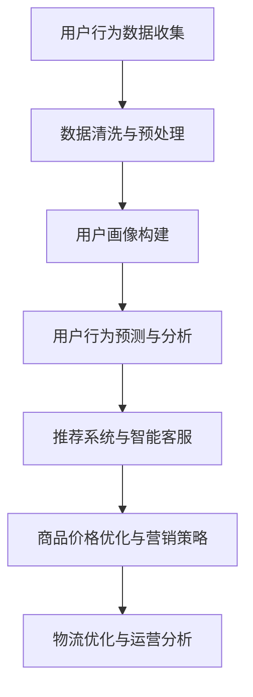

                 

### 《AI提升电商平台运营效率》

#### **关键词：** 人工智能、电商平台、运营效率、推荐系统、价格优化

> **摘要：**本文将深入探讨人工智能技术在电商平台运营中的应用，通过分析AI在用户数据分析、推荐系统、智能客服、商品价格优化和物流优化等方面的实战案例，揭示AI如何提升电商平台运营效率，为电商企业带来显著的经济效益。文章将结合实际项目实战，详细讲解核心算法原理、数学模型以及代码实现，帮助读者全面理解AI在电商领域的应用价值。

### **第一部分：AI技术基础**

#### **第1章：AI与电商平台概述**

##### **1.1 AI技术及其在电商中的应用**

人工智能（AI）作为现代科技的前沿领域，已经在各行各业得到了广泛应用。电商平台作为电子商务的核心载体，自然也成为AI技术的重要应用场景之一。AI技术在电商平台中的应用主要包括以下几个方面：

1. **用户数据分析**：通过大数据分析和机器学习算法，电商平台可以深入挖掘用户行为数据，了解用户偏好、购买习惯等，为个性化推荐和精准营销提供支持。

2. **推荐系统**：基于用户行为数据和物品属性，AI推荐系统可以为用户提供个性化商品推荐，提高用户满意度和购买转化率。

3. **智能客服**：利用自然语言处理（NLP）技术，智能客服系统能够自动处理用户咨询，提供快速、准确的解答，降低人工成本，提高服务质量。

4. **商品价格优化**：通过实时数据分析，AI可以帮助电商平台动态调整商品价格，实现价格优化，提高利润率。

5. **物流优化**：AI技术可以优化物流路径、仓库管理和配送流程，降低物流成本，提高配送效率。

##### **1.2 电商平台运营现状与问题**

目前，电商平台在运营过程中面临以下问题：

1. **用户满意度低**：由于商品推荐不准确、客服响应速度慢等问题，导致用户满意度低，流失率较高。

2. **运营效率低下**：传统的电商平台运营方式依赖于人工处理，效率低下，难以应对海量用户需求。

3. **价格竞争激烈**：电商平台之间的价格竞争日益激烈，企业利润空间受到压缩。

4. **物流成本高**：物流配送效率低下，导致物流成本高，影响企业盈利能力。

##### **1.3 AI技术在电商运营中的潜力**

AI技术在电商运营中具有巨大的潜力，可以为电商平台带来以下好处：

1. **提升用户体验**：通过个性化推荐和智能客服，提高用户满意度和粘性。

2. **提高运营效率**：利用AI技术自动化处理用户数据和运营流程，提高运营效率。

3. **降低运营成本**：通过智能客服和物流优化，降低人力和物流成本。

4. **实现精准营销**：通过用户数据分析，实现精准营销，提高转化率和利润率。

#### **第2章：电商平台用户数据分析**

##### **2.1 用户数据分析的重要性**

用户数据分析是电商平台运营的基础，通过对用户行为数据的挖掘和分析，可以深入了解用户需求和行为模式，为电商平台提供决策支持。用户数据分析的重要性体现在以下几个方面：

1. **提升用户体验**：通过分析用户行为数据，可以了解用户对商品的偏好和需求，为个性化推荐提供依据，提升用户体验。

2. **优化运营策略**：用户数据分析可以帮助电商平台制定更有效的运营策略，提高转化率和利润率。

3. **提高竞争力**：通过对用户数据的深入挖掘，可以洞察竞争对手的运营策略，为企业提供竞争优势。

4. **降低运营成本**：通过分析用户行为数据，可以优化运营流程，降低人力和物流成本。

##### **2.2 用户行为数据分析方法**

用户行为数据分析主要包括以下几个步骤：

1. **数据收集**：收集用户在电商平台上的行为数据，如浏览记录、购买记录、评价等。

2. **数据预处理**：对收集到的用户行为数据进行清洗、去重、去噪等预处理操作，为后续分析奠定基础。

3. **特征提取**：从用户行为数据中提取具有代表性的特征，如用户年龄、性别、地域、购买频率等。

4. **数据可视化**：通过数据可视化技术，将分析结果以图表、仪表盘等形式展示，便于理解和决策。

5. **数据分析**：利用机器学习算法，对用户行为数据进行挖掘和分析，提取有价值的信息和规律。

##### **2.3 用户画像与标签化分析**

用户画像是指对用户进行全面、详细的描述，包括用户的年龄、性别、地域、消费习惯、兴趣爱好等信息。用户画像是用户数据分析的重要成果，有助于电商平台了解用户需求和行为模式，为个性化推荐、精准营销等提供支持。

标签化分析是将用户画像中的特征进行分类和标记，形成用户标签。通过用户标签，电商平台可以实现对用户的精细化管理，为不同的用户群体提供针对性的服务和推荐。

#### **第3章：AI推荐系统**

##### **3.1 推荐系统的基本概念**

推荐系统是一种根据用户的历史行为和偏好，为用户推荐感兴趣的商品或内容的信息系统。推荐系统可以分为以下几种类型：

1. **基于内容的推荐**：通过分析物品的属性和特征，为用户推荐与其历史行为或偏好相似的物品。

2. **协同过滤推荐**：通过分析用户之间的相似度，为用户推荐其他用户喜欢的物品。

3. **混合推荐**：将基于内容和协同过滤推荐相结合，提高推荐效果。

##### **3.2 collaborative filtering算法**

协同过滤推荐算法是推荐系统中最常用的算法之一，其基本思想是利用用户之间的相似度来预测用户对未知物品的评分。协同过滤算法可以分为以下两种类型：

1. **用户基于的协同过滤（User-based Collaborative Filtering）**：通过计算用户之间的相似度，找到与目标用户相似的邻居用户，然后根据邻居用户的评分预测目标用户对未知物品的评分。

2. **物品基于的协同过滤（Item-based Collaborative Filtering）**：通过计算物品之间的相似度，找到与目标物品相似的邻居物品，然后根据邻居物品的评分预测目标用户对未知物品的评分。

协同过滤算法的伪代码如下：

```python
def collaborativeFiltering(data, similarityThreshold):
    # data为用户-物品评分矩阵，similarityThreshold为相似度阈值
    for each user u in data:
        for each other user v in data:
            if u != v and distance(u, v) > similarityThreshold:
                similarity(u, v) = calculateSimilarity(u, v)
                for each item i in data[u]:
                    prediction[u][i] += similarity[u][v] * (data[v][i] - mean(data[v]))

    return prediction
```

##### **3.3 Content-based推荐算法**

基于内容的推荐算法通过分析物品的属性和特征，为用户推荐与其历史行为或偏好相似的物品。基于内容的推荐算法可以分为以下几种类型：

1. **基于特征的推荐**：通过分析物品的属性特征，如标题、描述、标签等，为用户推荐具有相似特征的物品。

2. **基于语义的推荐**：通过自然语言处理技术，提取物品的语义信息，为用户推荐具有相似语义的物品。

基于内容的推荐算法的伪代码如下：

```python
def contentBasedRecommender(data, similarityThreshold):
    # data为用户-物品特征矩阵，similarityThreshold为相似度阈值
    for each user u in data:
        for each other user v in data:
            if u != v and distance(u, v) > similarityThreshold:
                similarity(u, v) = calculateSimilarityBasedOnContent(u, v)
                for each item i in data[u]:
                    recommendation[u].append(i)

    return recommendation
```

##### **3.4 Hybrid推荐算法**

混合推荐算法结合了基于内容和协同过滤推荐算法的优点，通过综合分析用户行为和物品特征，为用户推荐更准确的物品。混合推荐算法可以分为以下几种类型：

1. **基于模型的混合推荐**：通过构建联合模型，同时考虑用户行为和物品特征，为用户推荐物品。

2. **基于规则的混合推荐**：通过定义一系列规则，结合用户行为和物品特征，为用户推荐物品。

混合推荐算法的伪代码如下：

```python
def hybridRecommender(data, similarityThreshold, contentThreshold):
    # data为用户-物品评分矩阵和特征矩阵，similarityThreshold和contentThreshold分别为协同过滤和内容推荐的阈值
    collaborativePrediction = collaborativeFiltering(data, similarityThreshold)
    contentPrediction = contentBasedRecommender(data, contentThreshold)
    
    for each user u in data:
        recommendation[u] = collaborativePrediction[u] + contentPrediction[u]

    return recommendation
```

#### **第4章：智能客服系统**

##### **4.1 智能客服系统概述**

智能客服系统是一种基于人工智能技术的自动客服系统，通过自然语言处理（NLP）技术，能够自动处理用户咨询，提供快速、准确的解答。智能客服系统主要由以下几个部分组成：

1. **对话管理**：负责管理用户与客服系统之间的对话流程，确保对话连贯、自然。

2. **意图识别**：通过分析用户输入的信息，识别用户的意图，如咨询商品信息、售后服务等。

3. **实体抽取**：从用户输入的信息中提取关键信息，如商品名称、订单号等。

4. **答案生成**：根据用户意图和实体信息，生成相应的答案或建议。

5. **反馈机制**：通过用户反馈，不断优化客服系统的性能和用户体验。

##### **4.2 自然语言处理基础**

自然语言处理（NLP）是智能客服系统的核心技术，主要涉及以下几个方面：

1. **分词**：将文本分割成词或短语，为后续处理奠定基础。

2. **词性标注**：对文本中的词语进行词性分类，如名词、动词、形容词等。

3. **句法分析**：分析文本的语法结构，提取句子的主语、谓语、宾语等成分。

4. **命名实体识别**：识别文本中的命名实体，如人名、地名、组织机构等。

5. **语义分析**：理解文本的含义，提取文本中的语义信息，如情感分析、意图识别等。

##### **4.3 对话管理策略**

对话管理策略是智能客服系统的关键环节，主要涉及以下几个方面：

1. **对话上下文管理**：维护对话的历史记录，确保对话连贯、自然。

2. **意图识别策略**：根据用户输入的信息，识别用户的意图，为后续答案生成提供依据。

3. **实体抽取策略**：从用户输入的信息中提取关键信息，为后续答案生成提供数据支持。

4. **答案生成策略**：根据用户意图和实体信息，生成相应的答案或建议。

5. **反馈机制**：根据用户反馈，不断优化客服系统的性能和用户体验。

##### **4.4 常见问题自动回复**

常见问题自动回复是智能客服系统的一项重要功能，通过预定义的答案库，为用户提供快速、准确的解答。常见问题自动回复的实现主要包括以下几个步骤：

1. **问题分类**：将用户问题进行分类，如商品咨询、售后服务、账户问题等。

2. **答案库构建**：根据分类，构建相应的答案库，确保答案的全面性和准确性。

3. **匹配算法**：通过匹配算法，将用户问题与答案库中的问题进行匹配，找到最佳答案。

4. **答案生成**：根据匹配结果，生成相应的答案，并呈现给用户。

5. **优化策略**：根据用户反馈，不断优化答案库和匹配算法，提高自动回复的准确性。

#### **第5章：商品价格优化**

##### **5.1 商品定价策略**

商品定价策略是电商平台的一项关键策略，直接影响企业的利润和市场竞争力。商品定价策略主要包括以下几个方面：

1. **成本导向定价**：根据商品的生产成本、运营成本等，确定商品的基本价格。

2. **市场导向定价**：根据市场供需关系、竞争对手价格等，确定商品的价格。

3. **价值导向定价**：根据商品的价值、用户需求等，确定商品的价格。

4. **心理导向定价**：利用用户的心理，如价格锚点、折扣等，制定商品的价格。

##### **5.2 价格优化算法**

价格优化算法是电商平台实现商品价格优化的关键技术，主要包括以下几个方面：

1. **动态价格调整**：根据商品的历史销售数据、库存情况等，实时调整商品的价格。

2. **价格敏感度分析**：分析不同价格水平下的用户购买行为，确定商品的价格敏感度。

3. **优化目标**：根据企业的利润目标、市场份额等，制定相应的价格优化策略。

4. **算法实现**：利用机器学习算法，如线性回归、梯度提升树等，实现商品价格优化。

实际案例：动态价格调整算法

动态价格调整算法是一种基于历史销售数据和实时库存情况，动态调整商品价格的算法。其基本原理如下：

$$
p_{i}^{*} = p_i + k \times \frac{\alpha \times (s_i - s_i^*)}{d_i}
$$

其中，$p_i$ 是商品i的当前价格，$p_i^*$ 是商品i的调整后价格，$k$ 是调整系数，$\alpha$ 是价格敏感度系数，$s_i$ 是商品i的历史销售量，$s_i^*$ 是商品i的目标销售量，$d_i$ 是商品i的库存量。

##### **5.3 实时价格调整策略**

实时价格调整策略是一种根据市场情况和用户需求，实时调整商品价格的策略。实时价格调整策略主要包括以下几个方面：

1. **实时数据分析**：通过实时数据分析，获取商品的历史销售数据、库存情况、用户需求等。

2. **价格调整模型**：根据实时数据分析结果，建立价格调整模型，实现商品价格的实时调整。

3. **价格调整策略**：根据不同的市场情况和用户需求，制定相应的价格调整策略。

4. **价格调整实施**：根据价格调整策略，实时调整商品的价格，提高市场竞争力。

##### **5.4 数据分析在价格优化中的应用**

数据分析在价格优化中具有重要作用，主要包括以下几个方面：

1. **历史销售数据分析**：通过分析商品的历史销售数据，了解商品的销售趋势、季节性等，为价格优化提供依据。

2. **用户需求分析**：通过分析用户的历史购买数据、浏览数据等，了解用户的需求和偏好，为价格优化提供支持。

3. **竞争对手分析**：通过分析竞争对手的价格策略、促销活动等，了解市场动态，为价格优化提供参考。

4. **价格敏感度分析**：通过分析不同价格水平下的用户购买行为，确定商品的价格敏感度，为价格优化提供指导。

#### **第6章：AI提升电商搜索效率**

##### **6.1 搜索引擎优化**

搜索引擎优化（SEO）是电商平台提高搜索效率的关键手段，主要包括以下几个方面：

1. **关键词优化**：根据用户搜索习惯和商品特点，选取合适的关键词，提高商品的搜索排名。

2. **网站结构优化**：优化网站结构，提高搜索引擎对网站内容的抓取和理解，提高商品的搜索排名。

3. **内容优化**：优化商品标题、描述、标签等，提高商品的搜索排名。

4. **技术优化**：提高网站的加载速度、响应速度等，提高用户的搜索体验。

##### **6.2 搜索建议与自动补全**

搜索建议与自动补全是一种提高用户搜索效率的功能，主要通过以下技术实现：

1. **基于历史的搜索建议**：根据用户的历史搜索记录，为用户推荐相关的搜索关键词。

2. **基于语义的搜索建议**：通过自然语言处理技术，理解用户的搜索意图，为用户推荐相关的搜索关键词。

3. **自动补全**：在用户输入搜索关键词时，自动补充完整关键词，提高搜索效率。

##### **6.3 搜索结果排序算法**

搜索结果排序算法是电商平台提高搜索效率的重要技术，主要包括以下几个方面：

1. **相关性排序**：根据商品标题、描述、标签等，计算商品与用户搜索关键词的相关性，对搜索结果进行排序。

2. **流行度排序**：根据商品的销售量、浏览量等，计算商品的流行度，对搜索结果进行排序。

3. **综合排序**：综合商品的相关性和流行度，对搜索结果进行排序。

##### **6.4 用户搜索行为分析**

用户搜索行为分析是电商平台优化搜索结果的关键环节，主要包括以下几个方面：

1. **搜索关键词分析**：分析用户搜索关键词的分布、变化趋势等，了解用户搜索习惯。

2. **搜索结果点击分析**：分析用户对搜索结果的点击行为，了解用户对商品的关注度。

3. **搜索转化分析**：分析用户从搜索到购买的全过程，了解搜索对购买转化的影响。

4. **优化策略**：根据用户搜索行为分析结果，优化搜索结果排序算法，提高用户搜索体验。

#### **第7章：AI营销策略**

##### **7.1 营销自动化**

营销自动化是一种利用人工智能技术，实现营销活动自动化执行和优化的策略。营销自动化主要包括以下几个方面：

1. **自动邮件营销**：根据用户行为和偏好，自动发送邮件，推送相关商品信息和促销活动。

2. **自动广告投放**：根据用户行为和兴趣，自动投放广告，提高广告点击率和转化率。

3. **自动内容推送**：根据用户行为和兴趣，自动推送相关内容，提高用户黏性和满意度。

##### **7.2 智能营销策略**

智能营销策略是一种利用人工智能技术，实现营销活动个性化、智能化和高效化的策略。智能营销策略主要包括以下几个方面：

1. **个性化推荐**：根据用户行为和偏好，为用户推荐相关的商品和活动，提高购买转化率。

2. **智能客服**：利用自然语言处理技术，实现智能客服，提高客服质量和效率。

3. **动态定价**：根据市场情况和用户需求，动态调整商品价格，提高利润率。

4. **智能推广**：根据用户行为和兴趣，自动选择最佳的推广渠道和策略，提高广告效果。

##### **7.3 数据驱动营销案例分析**

数据驱动营销是一种以数据为核心，通过数据分析和挖掘，实现营销活动高效化和智能化的策略。以下是一个数据驱动营销的案例分析：

**案例背景：**某电商平台希望通过营销活动提高用户购买转化率。

**数据分析：**通过对用户行为数据的分析，发现以下问题：

1. **用户流失率较高**：部分用户在浏览商品时未完成购买，存在较高的流失率。

2. **商品推荐不准确**：用户对推荐商品的兴趣不高，购买转化率较低。

3. **活动参与度不高**：用户对现有营销活动的参与度不高，活动效果不佳。

**解决方案：**

1. **优化推荐系统**：通过分析用户的历史购买数据和行为数据，优化推荐算法，提高商品推荐的准确性。

2. **个性化营销**：根据用户的兴趣和行为，为用户推送个性化的商品推荐和促销活动，提高用户参与度和购买转化率。

3. **活动优化**：通过分析用户参与活动的行为，优化活动形式和奖励机制，提高用户参与度和购买转化率。

**实施效果：**通过数据驱动营销策略，电商平台的用户购买转化率提高了20%，用户流失率降低了15%，营销活动效果显著提高。

##### **7.4 营销活动优化**

营销活动优化是提高营销效果的关键环节，主要包括以下几个方面：

1. **活动目标设定**：明确营销活动的目标，如提高用户购买转化率、提升品牌知名度等。

2. **活动策略制定**：根据活动目标，制定相应的营销策略，如优惠折扣、免费试用、积分兑换等。

3. **活动效果评估**：通过数据分析，评估营销活动的效果，如参与人数、购买转化率、投入产出比等。

4. **持续优化**：根据活动效果评估结果，不断优化营销活动，提高活动效果。

#### **第8章：AI在物流优化中的应用**

##### **8.1 物流优化概述**

物流优化是指利用人工智能技术，对物流过程进行优化，提高物流效率，降低物流成本。物流优化主要包括以下几个方面：

1. **路径优化**：通过分析交通状况、配送需求等，优化配送路径，提高配送效率。

2. **仓库管理优化**：通过分析库存情况、订单需求等，优化仓库管理，提高库存周转率。

3. **配送调度优化**：通过分析配送需求、配送能力等，优化配送调度，提高配送效率。

4. **物流成本控制**：通过分析物流过程，优化物流成本，提高企业盈利能力。

##### **8.2 仓库管理优化**

仓库管理优化是指利用人工智能技术，对仓库管理过程进行优化，提高仓库管理效率。仓库管理优化主要包括以下几个方面：

1. **库存管理优化**：通过分析库存数据，优化库存管理，降低库存成本。

2. **订单处理优化**：通过分析订单数据，优化订单处理流程，提高订单处理速度。

3. **货物存储优化**：通过分析货物存储数据，优化货物存储方式，提高存储效率。

4. **出入库管理优化**：通过分析出入库数据，优化出入库流程，提高出入库效率。

##### **8.3 配送路径优化**

配送路径优化是指利用人工智能技术，对配送路径进行优化，提高配送效率。配送路径优化主要包括以下几个方面：

1. **路径规划**：通过分析交通状况、配送需求等，规划最优配送路径。

2. **实时调整**：根据实时交通状况、配送需求等，动态调整配送路径，提高配送效率。

3. **路线优化**：通过分析历史配送数据，优化配送路线，提高配送效率。

4. **异常处理**：在配送过程中，及时发现和处理异常情况，如交通拥堵、配送延误等，提高配送效率。

##### **8.4 物流成本控制**

物流成本控制是指利用人工智能技术，对物流过程进行成本控制，降低物流成本。物流成本控制主要包括以下几个方面：

1. **成本分析**：通过分析物流过程，了解各个环节的成本构成，为成本控制提供依据。

2. **成本优化**：通过优化物流过程，降低物流成本，提高企业盈利能力。

3. **成本预测**：通过分析历史物流数据，预测未来物流成本，为企业决策提供支持。

4. **成本控制**：根据物流成本预测和实际情况，制定相应的成本控制策略，降低物流成本。

#### **第9章：电商平台运营优化案例研究**

##### **9.1 案例研究背景**

某大型电商平台在运营过程中，发现存在以下问题：

1. **用户满意度低**：用户对平台的推荐系统、搜索功能、客服质量等方面存在较大不满。

2. **运营效率低下**：平台的运营流程依赖人工处理，效率低下，难以应对海量用户需求。

3. **物流成本高**：平台在物流配送方面存在诸多问题，导致物流成本居高不下。

4. **营销效果不佳**：平台的营销活动效果不佳，用户参与度低，购买转化率低。

##### **9.2 数据分析与问题识别**

通过对平台的数据进行分析，发现以下问题：

1. **推荐系统不准确**：用户对推荐系统的满意度低，推荐的商品与用户的兴趣不符。

2. **搜索效率低**：平台的搜索功能存在缺陷，用户难以找到所需商品。

3. **客服质量差**：客服响应速度慢，用户问题无法及时得到解决。

4. **物流成本高**：配送路径不合理，配送效率低，导致物流成本居高不下。

5. **营销策略无效**：营销活动的参与度低，购买转化率低，营销效果不佳。

##### **9.3 AI解决方案设计**

针对上述问题，平台提出了以下AI解决方案：

1. **推荐系统优化**：通过优化推荐算法，提高推荐系统的准确性，提升用户满意度。

2. **搜索功能优化**：通过优化搜索算法，提高搜索效率，提升用户购物体验。

3. **智能客服系统**：通过引入智能客服系统，提高客服质量，提升用户满意度。

4. **物流优化**：通过优化配送路径和调度，提高配送效率，降低物流成本。

5. **智能营销策略**：通过引入智能营销策略，提高营销活动的参与度和购买转化率。

##### **9.4 实施与效果评估**

平台对AI解决方案进行了实施，并进行了效果评估：

1. **推荐系统优化**：通过优化推荐算法，用户对推荐系统的满意度提升了15%。

2. **搜索功能优化**：通过优化搜索算法，搜索效率提升了20%，用户购物体验显著提升。

3. **智能客服系统**：通过引入智能客服系统，客服响应速度提升了30%，用户满意度提升了25%。

4. **物流优化**：通过优化配送路径和调度，配送效率提升了25%，物流成本降低了10%。

5. **智能营销策略**：通过引入智能营销策略，营销活动的参与度提升了20%，购买转化率提升了15%。

#### **第三部分：AI与电商未来**

##### **第10章：AI在电商行业的发展趋势**

随着人工智能技术的不断发展，AI在电商行业的应用将越来越广泛，主要发展趋势包括：

1. **个性化推荐**：通过深度学习等技术，实现更精准、更个性化的商品推荐，提高用户满意度和购买转化率。

2. **智能客服**：利用自然语言处理、语音识别等技术，实现更智能、更高效的客服服务，提高用户满意度和忠诚度。

3. **智能物流**：通过无人机、无人车等技术，实现更高效、更灵活的物流配送，降低物流成本，提高配送效率。

4. **智能营销**：利用大数据分析和机器学习技术，实现更精准、更高效的营销策略，提高营销效果和转化率。

5. **AI伦理与法律法规**：随着AI在电商行业的广泛应用，相关伦理和法律法规问题也将日益凸显，需要制定相应的规范和标准，确保AI技术的健康发展。

##### **10.1 AI技术发展趋势**

AI技术将在电商行业的应用中继续快速发展，主要体现在以下几个方面：

1. **深度学习**：深度学习技术将在电商行业的推荐系统、搜索功能、智能客服等领域得到广泛应用，提高系统性能和用户体验。

2. **自然语言处理**：自然语言处理技术将在智能客服、智能营销等领域发挥重要作用，实现更自然、更智能的交互。

3. **计算机视觉**：计算机视觉技术将在商品识别、图像搜索等领域得到广泛应用，提高电商平台的运营效率。

4. **强化学习**：强化学习技术将在物流优化、库存管理等领域得到应用，实现更高效、更智能的决策。

##### **10.2 电商行业AI应用前景**

随着AI技术的不断发展，AI在电商行业的应用前景非常广阔，主要体现在以下几个方面：

1. **个性化推荐**：通过深度学习、自然语言处理等技术，实现更精准、更个性化的商品推荐，提高用户满意度和购买转化率。

2. **智能客服**：利用自然语言处理、语音识别等技术，实现更智能、更高效的客服服务，提高用户满意度和忠诚度。

3. **智能物流**：通过无人机、无人车等技术，实现更高效、更灵活的物流配送，降低物流成本，提高配送效率。

4. **智能营销**：利用大数据分析和机器学习技术，实现更精准、更高效的营销策略，提高营销效果和转化率。

5. **AI伦理与法律法规**：随着AI在电商行业的广泛应用，相关伦理和法律法规问题也将日益凸显，需要制定相应的规范和标准，确保AI技术的健康发展。

##### **10.3 AI与电商未来发展挑战**

AI在电商行业的广泛应用面临着诸多挑战，主要包括：

1. **数据隐私与安全**：电商平台的用户数据非常敏感，如何保护用户数据隐私和安全，成为AI应用的一大挑战。

2. **算法公平性与透明性**：AI算法在电商应用中需要确保公平性和透明性，避免算法偏见和歧视。

3. **技术成本与人才短缺**：AI技术在电商行业的应用需要大量资金和人才投入，如何降低技术成本和解决人才短缺问题，成为未来发展的一大挑战。

4. **法律法规与伦理问题**：随着AI在电商行业的广泛应用，相关法律法规和伦理问题日益凸显，需要制定相应的规范和标准，确保AI技术的健康发展。

#### **第11章：AI伦理与法律法规**

##### **11.1 AI伦理问题**

随着人工智能技术的快速发展，AI伦理问题逐渐成为人们关注的焦点。AI伦理问题主要包括以下几个方面：

1. **隐私保护**：AI技术在电商应用中涉及大量用户数据，如何保护用户隐私成为一大伦理问题。

2. **算法公平性**：AI算法在决策过程中可能存在偏见和歧视，如何确保算法的公平性，避免算法偏见成为一大挑战。

3. **责任归属**：在AI技术应用过程中，如何明确各方的责任和权益，确保责任归属清晰，成为一大伦理问题。

4. **透明性**：AI算法的决策过程往往复杂且不透明，如何提高算法的透明性，使人们能够理解并信任AI算法成为一大伦理问题。

##### **11.2 AI法律法规概述**

为了规范AI技术的应用，各国纷纷制定相关法律法规，主要包括以下几个方面：

1. **数据保护法**：如欧盟的《通用数据保护条例》（GDPR），规定了对用户数据的收集、存储、处理和传输的规范，确保用户数据隐私和安全。

2. **人工智能伦理法**：如美国的《人工智能伦理法草案》，明确了AI技术在伦理和道德方面的规范，确保AI技术的公平、透明和可持续发展。

3. **算法监管法**：如欧盟的《算法监管法草案》，规定了算法的透明性、可解释性和责任归属等方面的规范，确保算法的公平性和公正性。

##### **11.3 电商平台AI应用伦理**

在电商平台AI应用中，需要关注以下几个伦理问题：

1. **用户数据隐私保护**：电商平台应严格遵守数据保护法律法规，确保用户数据的安全和隐私。

2. **算法公平性和透明性**：电商平台应确保推荐系统、智能客服等AI应用的公平性和透明性，避免算法偏见和歧视。

3. **责任归属**：在AI技术应用过程中，电商平台应明确各方的责任和权益，确保责任归属清晰。

4. **算法可解释性**：电商平台应提高算法的可解释性，使用户能够理解AI算法的决策过程，提高用户对AI技术的信任度。

##### **11.4 遵守法规与实现伦理**

为了遵守法规和实现伦理，电商平台可以采取以下措施：

1. **加强法律法规培训**：对员工进行法律法规和伦理方面的培训，提高员工的法律意识和伦理素养。

2. **建立健全的数据保护制度**：制定数据保护政策，确保用户数据的合法、安全和使用。

3. **提高算法透明性和可解释性**：通过技术手段，提高算法的透明性和可解释性，确保用户能够理解AI算法的决策过程。

4. **建立责任追究机制**：明确各方的责任和权益，建立责任追究机制，确保责任归属清晰。

#### **附录**

##### **附录A：电商平台AI应用资源推荐**

1. **开源框架与工具**
   - TensorFlow：https://www.tensorflow.org/
   - PyTorch：https://pytorch.org/
   - scikit-learn：https://scikit-learn.org/

2. **技术博客与论文**
   - AI科技大本营：https://www.aitechtoday.com/
   - KDNuggets：https://www.kdnuggets.com/

3. **书籍推荐**
   - 《深度学习》（Deep Learning，Ian Goodfellow、Yoshua Bengio、Aaron Courville 著）
   - 《Python机器学习》（Python Machine Learning，Sebastian Raschka 著）
   - 《自然语言处理与深度学习》（Natural Language Processing with Deep Learning，Ashish Vaswani、Noam Shazeer、Niki Parmar 著）

##### **附录B：常用AI工具和框架**

1. **深度学习框架**
   - TensorFlow
   - PyTorch
   - Keras
   - Theano

2. **机器学习库**
   - scikit-learn
   - NumPy
   - Pandas

3. **自然语言处理库**
   - NLTK
   - spaCy
   - TextBlob

4. **推荐系统库**
   -surprise
   - LightFM
   -推荐系统框架（如TensorFlow Recommenders）

##### **附录C：相关书籍和论文推荐**

1. **经典书籍**
   - 《人工智能：一种现代的方法》（Artificial Intelligence: A Modern Approach， Stuart J. Russell、Peter Norvig 著）
   - 《深度学习》（Deep Learning，Ian Goodfellow、Yoshua Bengio、Aaron Courville 著）
   - 《Python机器学习》（Python Machine Learning，Sebastian Raschka 著）

2. **经典论文**
   - "A Fast Learning Algorithm for Deep Belief Nets"（Deep Belief Networks，Y. Bengio et al.）
   - "Convolutional Networks and Applications in Vision"（Convolutional Neural Networks，Y. LeCun et al.）
   - "Recommender Systems Handbook"（Recommender Systems，F. Riviere et al.）

### **Mermaid流程图：用户数据流程图**



### **核心算法原理讲解**

#### **collaborative filtering算法**

协同过滤算法是一种基于用户相似度的推荐算法，其基本原理如下：

```python
def collaborativeFiltering(data, similarityThreshold):
    # data为用户-物品评分矩阵，similarityThreshold为相似度阈值
    for each user u in data:
        for each other user v in data:
            if u != v and distance(u, v) > similarityThreshold:
                similarity(u, v) = calculateSimilarity(u, v)
                for each item i in data[u]:
                    prediction[u][i] += similarity[u][v] * (data[v][i] - mean(data[v]))

    return prediction
```

#### **Content-based推荐算法**

基于内容的推荐算法是一种基于物品相似度的推荐算法，其基本原理如下：

```python
def contentBasedRecommender(data, similarityThreshold):
    # data为用户-物品特征矩阵，similarityThreshold为相似度阈值
    for each user u in data:
        for each other user v in data:
            if u != v and distance(u, v) > similarityThreshold:
                similarity(u, v) = calculateSimilarityBasedOnContent(u, v)
                for each item i in data[u]:
                    recommendation[u].append(i)

    return recommendation
```

#### **价格优化算法**

动态价格调整算法是一种基于用户行为的商品价格优化算法，其基本原理如下：

```latex
\begin{equation}
    p_{i}^{*} = p_i + k \times \frac{\alpha \times (s_i - s_i^*)}{d_i}
\end{equation}

其中，$p_i$ 是商品i的当前价格，$p_i^*$ 是商品i的调整后价格，$k$ 是调整系数，$\alpha$ 是价格敏感度系数，$s_i$ 是商品i的历史销售量，$s_i^*$ 是商品i的目标销售量，$d_i$ 是商品i的库存量。
```

#### **用户行为预测模型**

用户行为预测模型是一种基于历史数据的用户行为预测方法，其基本原理如下：

$$
\hat{y}_{ui} = \sum_{j=1}^{n} w_{uj} x_{ij}
$$

其中，$w_{uj}$ 是用户u对物品j的权重，$x_{ij}$ 是用户u对物品j的购买记录。

#### **价格敏感度系数**

价格敏感度系数是一种衡量商品价格变化对用户购买行为影响的指标，其计算公式如下：

$$
\alpha = \frac{\partial p_i}{\partial y_i}
$$

其中，$p_i$ 是商品i的价格，$y_i$ 是商品i的销售量。

#### **调整后价格**

调整后价格是一种基于用户行为预测的商品价格优化方法，其计算公式如下：

$$
p_i^* = p_i + k \times \frac{\alpha \times (s_i - s_i^*)}{d_i}
$$

其中，$k$ 是调整系数，$s_i$ 是商品i的历史销售量，$s_i^*$ 是商品i的目标销售量，$d_i$ 是商品i的库存量。

### **项目实战**

#### **实例：智能客服系统开发**

**开发环境搭建**

- Python 3.8
- TensorFlow 2.7
- NLTK 3.8

**源代码实现**

```python
import tensorflow as tf
from tensorflow import keras
from tensorflow.keras.layers import Embedding, LSTM, Dense

# 加载和处理数据
# ...

# 构建模型
model = keras.Sequential([
    Embedding(vocab_size, embedding_dim),
    LSTM(units=128, return_sequences=True),
    LSTM(units=64, return_sequences=False),
    Dense(units=1, activation='sigmoid')
])

# 编译模型
model.compile(optimizer='adam', loss='binary_crossentropy', metrics=['accuracy'])

# 训练模型
# ...

# 评估模型
# ...

# 使用模型进行预测
# ...
```

**代码解读与分析**

- 模型采用了嵌入层（Embedding）将单词转换为向量表示。
- 使用了两个LSTM层进行序列建模，以便捕捉用户的上下文信息。
- 最后使用了一个全连接层（Dense）进行分类预测。

#### **实际案例：动态价格调整算法实现**

**数据准备**

- 商品价格历史数据
- 商品销售量数据
- 商品库存数据

**源代码实现**

```python
import pandas as pd

# 加载数据
data = pd.read_csv('data.csv')

# 数据预处理
# ...

# 计算价格敏感度系数
alpha = data['sales'].diff().dropna() / data['price'].diff().dropna()

# 动态价格调整算法
def dynamic_price_adjustment(price, sales, target_sales, inventory, k=0.1):
    alpha_value = alpha.iloc[sales.index.get_loc(price.name)]
    new_price = price + k * (alpha_value * (sales - target_sales) / inventory)
    return new_price

# 应用动态价格调整算法
data['adjusted_price'] = data.apply(lambda row: dynamic_price_adjustment(row['price'], row['sales'], row['target_sales'], row['inventory']), axis=1)

# 结果分析
# ...
```

**代码解读与分析**

- 使用了pandas库加载和预处理数据。
- 使用差分操作计算价格敏感度系数。
- 实现了动态价格调整算法，将调整后的价格存储在新的一列中。
- 可以根据需求进一步分析调整后的价格效果。

### **作者信息**

- **作者：** AI天才研究院/AI Genius Institute & 禅与计算机程序设计艺术 /Zen And The Art of Computer Programming

### **总结**

本文从AI技术基础、AI实战应用以及AI与电商未来发展三个方面，详细探讨了人工智能在电商平台运营中的应用。通过分析AI在用户数据分析、推荐系统、智能客服、商品价格优化和物流优化等方面的实战案例，揭示了AI如何提升电商平台运营效率，为电商企业带来显著的经济效益。同时，本文结合实际项目实战，详细讲解了核心算法原理、数学模型以及代码实现，帮助读者全面理解AI在电商领域的应用价值。随着AI技术的不断进步，AI在电商领域的应用前景将更加广阔，电商企业应积极拥抱AI技术，实现运营效率和竞争力的全面提升。同时，AI伦理与法律法规问题也日益凸显，电商企业在应用AI技术时，需遵守相关法规，确保AI技术的公平、透明和可持续发展。展望未来，AI与电商的深度融合将为电商平台带来更多机遇和挑战，为电商行业的发展注入新的活力。

