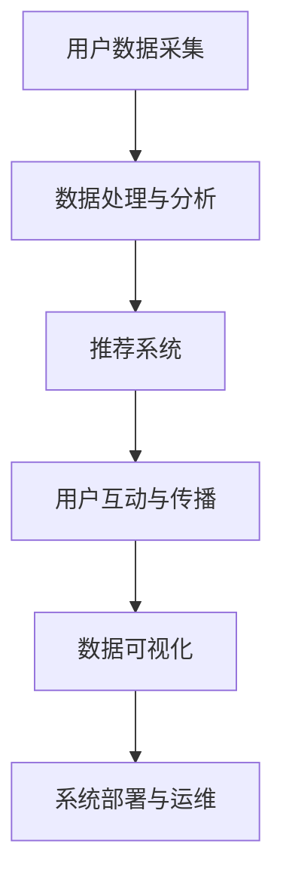

                 

# 《AI社交网络的未来展望》

> **关键词：** 人工智能，社交网络，机器学习，深度学习，自然语言处理，计算机视觉，推荐系统，数据可视化，隐私保护，伦理问题，技术应用，趋势展望

> **摘要：** 本文从AI社交网络的定义、核心技术、数据处理与分析、架构与实现、应用案例以及面临的挑战和未来展望等多个方面，全面探讨了AI社交网络的发展现状和未来趋势，为读者提供了关于这一新兴领域的深入见解。

---

## 目录大纲

1. **AI社交网络概述**
   1.1 AI社交网络的定义
   1.2 AI社交网络的发展背景
   1.3 AI社交网络的重要性
2. **AI社交网络的核心技术**
   2.1 机器学习与深度学习基础
   2.2 自然语言处理技术
   2.3 计算机视觉技术
3. **AI社交网络的数据处理与分析**
   3.1 社交网络数据采集
   3.2 数据预处理技术
   3.3 数据分析与应用
4. **AI社交网络的架构与实现**
   4.1 AI社交网络的架构设计
   4.2 AI社交网络的模块划分
   4.3 AI社交网络的部署与运维
5. **AI社交网络的关键算法**
   5.1 推荐系统算法
   5.2 社交网络分析算法
   5.3 内容过滤与垃圾邮件检测算法
6. **AI社交网络的数据可视化**
   6.1 数据可视化基础
   6.2 社交网络可视化工具
   6.3 数据可视化案例分析
7. **AI社交网络的应用案例**
   7.1 AI社交网络在电商中的应用
   7.2 AI社交网络在社交媒体中的应用
   7.3 AI社交网络在智能医疗中的应用
8. **AI社交网络面临的挑战与未来展望**
   8.1 AI社交网络面临的挑战
   8.2 AI社交网络的未来展望
9. **附录**
   9.1 AI社交网络常用工具与资源
   9.2 社交网络流程图

---

## 第一部分: AI社交网络概述

### 第1章: AI社交网络的定义与背景

#### 1.1 AI社交网络的定义

AI社交网络是一种结合人工智能技术的社交网络平台，通过运用机器学习、深度学习、自然语言处理和计算机视觉等先进技术，实现对社交数据的采集、处理、分析，以及提供更加智能化、个性化的社交体验。与传统的社交网络相比，AI社交网络能够更加精准地了解用户需求，优化社交体验，提高用户粘性和平台价值。

#### 1.2 AI社交网络的发展背景

随着互联网的普及和社交网络的兴起，人们对于社交的需求日益增长。同时，大数据和人工智能技术的迅猛发展，为AI社交网络提供了强大的技术支持。AI社交网络的发展可以追溯到20世纪90年代，随着互联网技术的发展，早期的社交网络平台如Facebook、Twitter等逐渐兴起。而进入21世纪，随着人工智能技术的突破，AI社交网络逐渐成为学术界和产业界的研究热点。

#### 1.3 AI社交网络的重要性

AI社交网络不仅为用户提供更加智能化、个性化的社交服务，还具有以下几个重要意义：

1. **个性化推荐**：通过机器学习和深度学习算法，AI社交网络能够根据用户的兴趣和行为习惯，为用户推荐更加符合其需求的内容和信息。
2. **社交互动优化**：AI社交网络能够分析用户的社交行为，优化社交互动体验，提高用户粘性和活跃度。
3. **数据挖掘与分析**：AI社交网络能够对大量社交数据进行挖掘和分析，为企业和机构提供有价值的洞察和决策支持。
4. **隐私保护**：通过加密、去识别化等技术手段，AI社交网络能够保护用户的隐私和数据安全。

### 第2章: AI社交网络的核心技术

#### 2.1 机器学习与深度学习基础

机器学习是一种使计算机系统能够从数据中学习，并对新数据做出预测或决策的技术。深度学习是机器学习的一个分支，通过构建复杂的神经网络模型，实现对数据的深层特征提取和学习。在AI社交网络中，机器学习和深度学习技术被广泛应用于用户画像、内容推荐、社交网络分析等领域。

#### 2.2 自然语言处理技术

自然语言处理（NLP）是一种使计算机能够理解和处理人类语言的技术。在AI社交网络中，NLP技术被用于文本分析、情感分析、命名实体识别、机器翻译等方面，帮助用户更好地理解和沟通。

#### 2.3 计算机视觉技术

计算机视觉是一种使计算机能够理解和解释图像和视频的技术。在AI社交网络中，计算机视觉技术被用于图像识别、视频分析、虚拟现实等方面，为用户带来更加丰富的社交体验。

---

## 第二部分: AI社交网络的架构与实现

### 第4章: AI社交网络的架构设计

#### 4.1 AI社交网络的系统架构

AI社交网络的系统架构通常包括以下几个层次：

1. **数据采集层**：负责采集社交网络中的用户数据、内容数据、行为数据等。
2. **数据处理层**：负责对采集到的数据进行分析、清洗、整合等预处理工作。
3. **数据存储层**：负责存储和处理大量社交数据，包括关系图谱、用户画像、内容库等。
4. **数据应用层**：负责实现社交网络的各项功能，如推荐系统、社交分析、数据可视化等。
5. **用户交互层**：负责与用户进行交互，提供友好的界面和操作体验。

#### 4.2 AI社交网络的模块划分

AI社交网络通常由以下几个模块组成：

1. **用户模块**：负责用户注册、登录、个人信息管理等功能。
2. **内容模块**：负责内容发布、评论、点赞、分享等功能。
3. **推荐模块**：负责根据用户兴趣和行为，为用户推荐相关内容。
4. **社交模块**：负责用户之间的互动，如私信、群聊、关注等。
5. **分析模块**：负责对社交网络中的用户行为、内容、关系等进行数据分析和挖掘。

#### 4.3 AI社交网络的部署与运维

AI社交网络的部署与运维涉及以下几个方面：

1. **服务器部署**：根据需求，选择合适的服务器配置和部署方式，如集群部署、容器化部署等。
2. **数据存储**：选择合适的数据存储方案，如关系数据库、分布式存储等。
3. **系统监控**：实时监控系统运行状态，包括性能、稳定性、安全性等方面。
4. **故障处理**：及时处理系统故障，确保系统的稳定运行。
5. **安全防护**：采用加密、访问控制、反爬虫等技术手段，保障系统的数据安全。

---

## 第三部分: AI社交网络的应用案例

### 第7章: AI社交网络在电商中的应用

#### 7.1 个性化推荐系统

在电商领域，AI社交网络通过个性化推荐系统，能够为用户推荐其可能感兴趣的商品。推荐系统的工作原理主要包括以下几个步骤：

1. **用户画像**：根据用户的兴趣、行为、历史购买记录等信息，构建用户的个性化画像。
2. **商品特征提取**：对商品进行特征提取，包括商品属性、用户评价、销量等。
3. **推荐算法**：采用协同过滤、基于内容的推荐、深度学习等算法，为用户生成个性化推荐列表。

#### 7.2 商品评论分析

AI社交网络能够对用户发布的商品评论进行分析，提取出用户对商品的评价情感，如正面、负面、中性等。评论分析的方法主要包括：

1. **情感分析**：使用自然语言处理技术，对用户评论进行情感分类。
2. **关键词提取**：从用户评论中提取出关键词，分析用户的主要关注点。
3. **评论质量评估**：根据评论的长度、表达方式、关键词密度等因素，评估评论的质量。

#### 7.3 客户行为预测

通过分析用户在社交网络中的行为数据，AI社交网络能够预测用户未来的购买行为。预测方法主要包括：

1. **时间序列分析**：分析用户购买行为的时序特征，预测其未来的购买时间。
2. **关联规则挖掘**：挖掘用户购买商品之间的关联规则，预测用户可能购买的其他商品。
3. **机器学习模型**：采用机器学习算法，建立用户购买行为的预测模型。

---

## 第四部分: AI社交网络面临的挑战与未来展望

### 第10章: AI社交网络面临的挑战

#### 10.1 数据隐私与安全

在AI社交网络中，用户数据的安全和隐私保护是面临的重大挑战。用户数据的泄露和滥用可能导致隐私侵犯、财产损失等问题。为了应对这一挑战，需要采取以下措施：

1. **数据加密**：对用户数据进行加密存储和传输，防止数据泄露。
2. **访问控制**：设置严格的访问控制策略，限制对用户数据的访问权限。
3. **隐私保护算法**：采用隐私保护算法，如差分隐私、同态加密等，确保用户数据的隐私。

#### 10.2 AI伦理问题

AI社交网络在发展过程中，还面临着伦理问题，如算法偏见、隐私侵犯等。为了解决这些问题，需要建立完善的AI伦理规范和监管机制。

1. **算法透明度**：提高算法的透明度，使公众能够理解和监督算法的运行过程。
2. **公平性评估**：定期评估算法的公平性，确保算法不会对特定群体产生歧视。
3. **伦理审查**：在AI社交网络的开发和应用过程中，进行严格的伦理审查，确保不违背伦理原则。

#### 10.3 技术发展与产业升级

AI社交网络的发展离不开技术的不断进步和产业升级。随着AI技术的不断发展，AI社交网络需要不断更新和升级技术，以适应新的需求和挑战。

1. **技术创新**：加强AI技术在社交网络中的应用研究，推动技术进步。
2. **产业合作**：加强产业界和学术界的合作，共同推动AI社交网络的发展。
3. **人才培养**：培养更多的AI人才，为AI社交网络的发展提供人才支持。

### 第11章: AI社交网络的未来展望

#### 11.1 AI社交网络的发展趋势

随着人工智能技术的不断进步，AI社交网络将朝着以下几个方向发展：

1. **智能化**：通过更加先进的人工智能技术，提供更加智能化、个性化的社交服务。
2. **实时性**：通过实时数据处理和分析，实现社交网络的实时互动和响应。
3. **泛在化**：将AI社交网络拓展到更多场景和应用领域，实现社交网络的泛在化。

#### 11.2 AI社交网络的应用前景

AI社交网络在多个领域具有广泛的应用前景：

1. **电商**：通过个性化推荐、评论分析、客户行为预测等，提升电商用户体验和销售额。
2. **社交媒体**：通过舆情监测、人际关系分析、社交网络传播模型等，提升社交媒体的影响力和用户活跃度。
3. **智能医疗**：通过疾病预测、医患互动、医疗数据分析等，提升医疗服务的质量和效率。

#### 11.3 AI社交网络面临的机遇与挑战

在未来的发展中，AI社交网络将面临以下机遇和挑战：

1. **机遇**：随着AI技术的进步和应用场景的拓展，AI社交网络具有巨大的发展潜力。
2. **挑战**：数据隐私与安全、AI伦理问题、技术发展与产业升级等，是AI社交网络需要克服的挑战。

### 附录

#### 附录A: AI社交网络常用工具与资源

1. **机器学习与深度学习框架**
   - TensorFlow
   - PyTorch
   - Keras
2. **社交网络分析工具**
   - Gephi
   - NetworkX
   - NodeXL
3. **数据可视化工具**
   - D3.js
   - Plotly
   - Matplotlib
4. **AI社交网络开源项目与资料**
   - Facebook AI Research
   - Google AI
   - Microsoft AI

#### 附录B: 社交网络流程图

---

## 结语

作者：AI天才研究院/AI Genius Institute & 禅与计算机程序设计艺术 /Zen And The Art of Computer Programming

本文从多个角度探讨了AI社交网络的发展现状和未来趋势，分析了其核心技术和应用案例，同时也提出了面临的挑战和解决方案。随着AI技术的不断进步，AI社交网络将带来更加智能化、个性化的社交体验，为人类社会的进步和发展做出重要贡献。让我们共同期待AI社交网络的美好未来。

