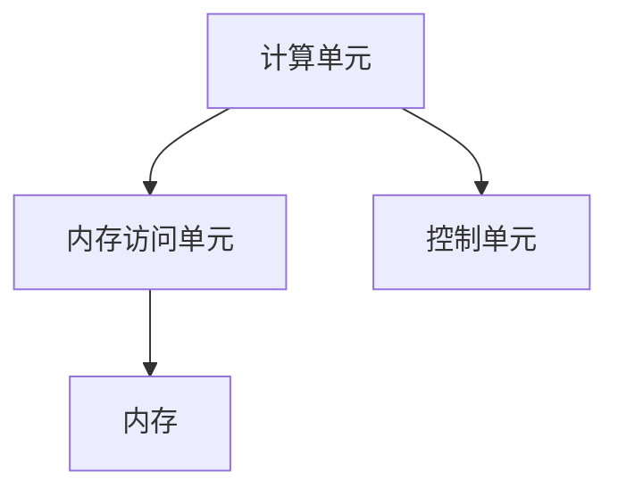
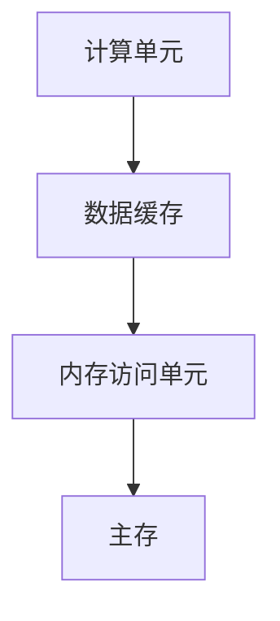
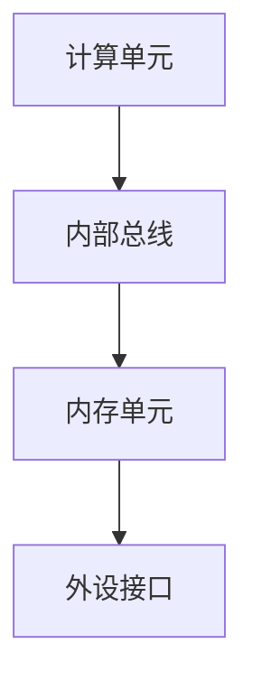
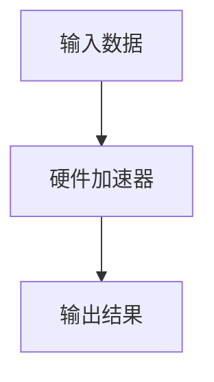
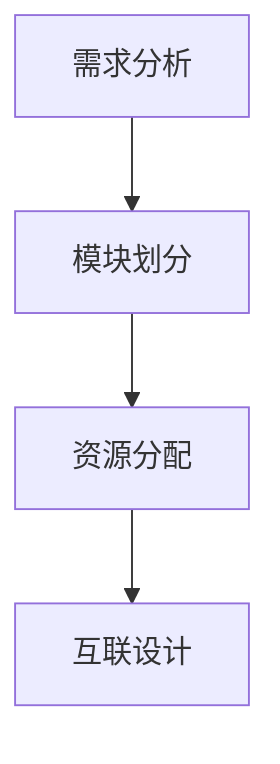
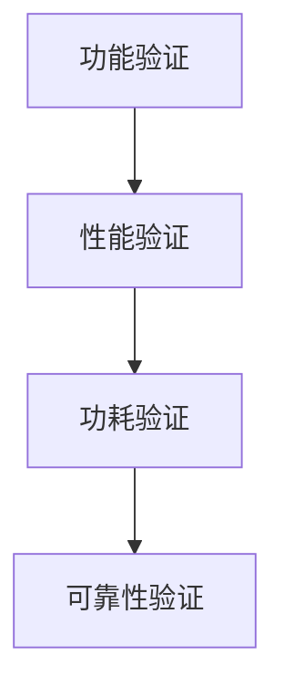

                 

### 《AI芯片与模型协同设计的新趋势》

#### 关键词：
- AI芯片
- 模型协同设计
- 超大规模模型
- 硬件自适应
- 软硬件协同优化

#### 摘要：
本文旨在探讨AI芯片与模型协同设计的新趋势，从背景概述、基础原理、协同设计方法、新趋势与应用，以及实际挑战与未来展望等多方面进行深入分析。文章通过详细阐述核心概念、算法原理、设计流程、实战案例，旨在为读者提供全面的技术洞察，助力理解AI芯片与模型协同设计的本质和未来发展方向。

## 目录

1. **背景与概述**
   1.1 AI芯片与模型协同设计概述
   1.2 当前AI芯片与模型的发展趋势
   1.3 芯片与模型协同设计的重要性

2. **AI芯片设计基础**
   2.1 AI芯片的基本架构
   2.2 AI芯片的关键技术
   2.3 AI芯片设计流程

3. **AI模型设计基础**
   3.1 AI模型的分类与特性
   3.2 AI模型的架构设计
   3.3 AI模型优化与加速

4. **协同设计方法**
   4.1 芯片与模型协同设计流程
   4.2 芯片与模型协同设计的挑战与对策
   4.3 实例分析：AI芯片与模型协同设计的成功案例

5. **新趋势与应用**
   5.1 硬件自适应AI模型
   5.2 软硬件协同优化
   5.3 超大规模AI模型与芯片设计

6. **实际应用中的挑战与展望**
   6.1 能耗与散热挑战
   6.2 安全性与隐私保护
   6.3 未来展望

7. **项目实战与案例分析**
   7.1 AI芯片与模型协同设计项目实战
   7.2 AI芯片与模型协同设计案例分析

8. **附录**
   8.1 AI芯片与模型协同设计资源汇总

## 第一部分：背景与概述

### 1.1 AI芯片与模型协同设计概述

#### 1.1.1 AI芯片的定义与发展

AI芯片，通常指的是专门用于执行人工智能算法的处理器。与传统处理器相比，AI芯片具有更高的计算效率、更低的功耗以及更好的适应性。AI芯片的发展可以分为几个阶段：

- **早期阶段**：以GPU和FPGA为代表的通用硬件被用于加速机器学习算法，但这带来了功耗高、编程复杂度大等问题。
- **发展中期**：专用AI芯片如NVIDIA的GPU和Google的TPU等开始出现，这些芯片优化了深度学习任务，显著提高了计算效率和能效。
- **现阶段**：随着AI应用的不断扩展，多样化的AI芯片如边缘AI芯片、神经网络处理器（NPU）和量子处理器等纷纷涌现，以满足不同的应用需求。

#### 1.1.2 AI模型的定义与演变

AI模型是指用于执行特定AI任务的算法和数据结构，主要包括以下几种类型：

- **监督学习模型**：通过已标记的数据进行训练，如分类模型、回归模型等。
- **无监督学习模型**：通过未标记的数据进行训练，如聚类模型、降维模型等。
- **强化学习模型**：通过与环境交互进行学习，如博弈模型、自动驾驶模型等。
- **生成对抗网络（GAN）**：通过两个神经网络（生成器和判别器）进行对抗训练，实现数据生成和鉴别。

AI模型的演变历程可以从以下几个方向概括：

- **模型复杂性**：从简单的线性模型发展到复杂的深度神经网络，如CNN、RNN、Transformer等。
- **模型规模**：从小规模的模型发展到超大规模模型，如BERT、GPT等。
- **模型可解释性**：从高度复杂的“黑盒”模型发展到部分可解释的模型，以提高决策的透明性和可追溯性。

#### 1.1.3 芯片与模型协同设计的重要性

芯片与模型协同设计的重要性体现在以下几个方面：

- **性能优化**：通过芯片和模型的协同优化，可以显著提高AI系统的性能和效率。
- **能效提升**：针对特定AI模型和任务，芯片和模型的设计可以更加精确地匹配，从而降低功耗和散热问题。
- **适应性增强**：芯片和模型的协同设计可以使得AI系统更好地适应各种变化，提高系统的灵活性和可扩展性。
- **开发成本**：协同设计可以减少开发时间和成本，因为芯片和模型可以同时进行开发，减少重复劳动。

### 1.2 当前AI芯片与模型的发展趋势

#### 1.2.1 芯片架构的发展方向

AI芯片架构的发展趋势主要表现在以下几个方面：

- **专用化与通用化并进**：专用AI芯片在特定任务上具有更高的效率，而通用芯片则具备更广泛的适用性。
- **多核与异构计算**：多核芯片和异构计算架构可以提供更高的并行计算能力，以支持复杂的AI任务。
- **可编程性与灵活性**：可编程性可以提高芯片对多种AI模型的适应性，而灵活性则允许芯片在运行时动态调整资源分配。
- **低功耗设计**：随着边缘计算的兴起，低功耗设计成为AI芯片的重要发展方向。

#### 1.2.2 模型结构的创新

AI模型结构的创新主要体现在以下几个方面：

- **深度学习模型的扩展**：随着计算能力的提升，深度学习模型在层数和参数数量上不断扩展，如Transformer模型的出现。
- **模型压缩与量化**：为了满足移动端和边缘设备的计算需求，模型压缩和量化技术变得越来越重要。
- **迁移学习与少样本学习**：迁移学习和少样本学习使得AI模型能够更快地适应新任务和数据集。
- **自适应模型**：自适应模型可以根据不同场景和任务动态调整模型结构和参数。

#### 1.2.3 芯片与模型协同设计的挑战与机遇

芯片与模型协同设计面临的挑战包括：

- **设计复杂性**：芯片和模型的设计都非常复杂，协同设计需要协调多个层面的设计。
- **资源分配**：如何在有限的资源下优化芯片和模型的性能和效率，是一个重要挑战。
- **可扩展性**：芯片和模型需要能够适应不同规模和不同类型的任务，这要求设计具有高度的灵活性。
- **验证与测试**：验证和测试是协同设计中的关键环节，需要确保芯片和模型的正确性和稳定性。

然而，这些挑战同时也带来了机遇：

- **性能提升**：通过协同设计，可以优化芯片和模型的性能，实现更高的计算效率和能效。
- **成本降低**：协同设计可以减少重复劳动，降低开发成本和上市时间。
- **创新空间**：协同设计为创新提供了广阔的空间，可以探索新型芯片架构和AI模型。

## 第二部分：AI芯片设计基础

### 2.1 AI芯片的基本架构

AI芯片的基本架构可以从逻辑架构、内存架构和通信架构三个方面进行描述。

#### 2.1.1 逻辑架构

逻辑架构是AI芯片的核心部分，主要包括以下几个方面：

- **计算单元**：计算单元是芯片的基本执行单元，用于执行特定的数学运算，如乘法、加法、激活函数等。
- **并行处理能力**：AI芯片通常具有强大的并行处理能力，可以通过多个计算单元同时执行不同的运算，以提升计算效率。
- **内存访问单元**：内存访问单元负责从内存中读取或写入数据，以满足计算单元的需求。
- **控制单元**：控制单元负责协调各个计算单元和内存单元的工作，确保数据流和控制流的正确性。

Mermaid流程图：



#### 2.1.2 内存架构

内存架构是AI芯片的关键组成部分，直接影响到芯片的性能和能效。主要特点包括：

- **缓存层次结构**：AI芯片通常采用多级缓存层次结构，以降低内存访问延迟，提高数据访问速度。
- **数据存储格式**：AI芯片的数据存储格式通常采用特定的数据格式，如固定点格式（FP16、FP32）和二进制编码（BMI），以提高计算效率和存储效率。
- **带宽管理**：AI芯片需要高效的带宽管理机制，以确保数据在计算单元和内存之间的快速传输。

Mermaid流程图：



#### 2.1.3 通信架构

通信架构负责芯片内部各个模块之间的数据通信，通常包括以下几个方面：

- **内部总线**：内部总线用于连接芯片内部的各个模块，如计算单元、内存单元等，实现数据和控制信号的传输。
- **互联网络**：互联网络用于芯片内部不同模块之间的通信，如多计算单元之间的数据共享和通信。
- **外设接口**：外设接口用于芯片与外部设备（如CPU、GPU、存储设备等）的通信，实现数据交换和指令传递。

Mermaid流程图：



### 2.2 AI芯片的关键技术

AI芯片的关键技术涵盖了数字信号处理技术、可编程性技术和低功耗设计技术。

#### 2.2.1 数字信号处理技术

数字信号处理技术是AI芯片的核心技术之一，主要包括以下几个方面：

- **定点运算**：定点运算是一种在有限精度下进行数学运算的技术，可以显著降低芯片的功耗和面积。
- **向量化运算**：向量化运算是一种同时处理多个数据元素的技术，可以提高芯片的并行处理能力。
- **流水线设计**：流水线设计是一种将运算过程分解为多个阶段并重叠执行的技术，可以显著提高运算速度。

伪代码：

```python
def vector_addition(a, b):
    result = [0] * len(a)
    for i in range(len(a)):
        result[i] = a[i] + b[i]
    return result
```

#### 2.2.2 可编程性技术

可编程性技术使得AI芯片能够适应不同的AI模型和任务，主要包括以下几个方面：

- **硬件描述语言**：硬件描述语言（HDL）如Verilog和VHDL，用于描述芯片的硬件架构和逻辑功能。
- **可重构计算**：可重构计算技术允许芯片在运行时动态调整硬件资源，以适应不同的任务需求。
- **硬件加速器**：硬件加速器是一种专门为特定任务设计的硬件模块，可以显著提高计算效率。

Mermaid流程图：



#### 2.2.3 低功耗设计技术

低功耗设计技术是AI芯片设计的重要方面，主要包括以下几个方面：

- **功耗模型**：功耗模型用于估算芯片在不同工作状态下的功耗，以便进行功耗优化。
- **动态电压和频率调节**：动态电压和频率调节技术（DVFS）可以降低芯片在低负载状态下的功耗。
- **电源关断技术**：电源关断技术可以在芯片的某些部分停止工作时关闭电源，以降低功耗。

伪代码：

```python
def dynamic_power_adjustment(voltage, frequency):
    if load_light:
        voltage = low_voltage
        frequency = low_frequency
    elif load_medium:
        voltage = medium_voltage
        frequency = medium_frequency
    elif load_heavy:
        voltage = high_voltage
        frequency = high_frequency
    return voltage, frequency
```

### 2.3 AI芯片设计流程

AI芯片设计流程包括需求分析与定义、架构设计、电路设计、仿真与验证等阶段。

#### 2.3.1 需求分析与定义

需求分析与定义是芯片设计的第一步，主要包括以下几个方面：

- **功能需求**：明确芯片需要实现的基本功能，如矩阵乘法、激活函数等。
- **性能需求**：明确芯片需要达到的性能指标，如吞吐量、延迟等。
- **功耗需求**：明确芯片在不同工作状态下的功耗要求。
- **可靠性需求**：明确芯片的可靠性指标，如故障率、寿命等。

#### 2.3.2 架构设计

架构设计是芯片设计的核心阶段，主要包括以下几个方面：

- **模块划分**：根据需求分析结果，将芯片划分为不同的模块，如计算单元、内存单元等。
- **资源分配**：根据性能和功耗需求，为各个模块分配资源，如计算单元的个数、内存的大小等。
- **互联设计**：设计芯片内部的互联网络，确保各个模块之间的数据和控制信号传输。

Mermaid流程图：



#### 2.3.3 电路设计

电路设计是将架构设计转化为实际的硬件电路，主要包括以下几个方面：

- **硬件描述语言**：使用硬件描述语言（如Verilog或VHDL）编写芯片的硬件描述。
- **综合与布局**：将硬件描述转化为电路网表，并进行布局和布线。
- **后端设计**：进行后端设计，包括工艺选择、版图设计、封装设计等。

伪代码：

```verilog
module my_chip (
    input clk,
    input [31:0] data_in,
    output [31:0] data_out
);
    // 硬件描述代码
endmodule
```

#### 2.3.4 仿真与验证

仿真与验证是芯片设计的最后阶段，主要包括以下几个方面：

- **功能验证**：通过仿真工具验证芯片的功能是否正确，如时序分析、功能覆盖率等。
- **性能验证**：通过仿真工具验证芯片的性能是否达到预期，如吞吐量、延迟等。
- **功耗验证**：通过仿真工具验证芯片的功耗是否在允许范围内。
- **可靠性验证**：通过仿真工具验证芯片的可靠性指标，如故障率、寿命等。

Mermaid流程图：



## 第三部分：AI模型设计基础

### 3.1 AI模型的分类与特性

AI模型可以根据学习方式、应用领域和结构特性进行分类。以下是几种常见的AI模型及其特性：

#### 3.1.1 神经网络

神经网络（Neural Networks，NN）是一种模仿生物神经网络的结构和功能的计算模型，主要包括以下几种类型：

- **前馈神经网络（FFNN）**：数据在神经网络中依次经过各层计算，不涉及反向传播。
- **卷积神经网络（CNN）**：特别适合处理图像数据，具有局部连接和共享权重的特性。
- **循环神经网络（RNN）**：能够处理序列数据，具有时间动态特性，如长短时记忆（LSTM）和门控循环单元（GRU）。
- **生成对抗网络（GAN）**：由生成器和判别器组成，通过对抗训练生成高质量的数据。

神经网络的核心特性包括：

- **层次化特征表示**：神经网络能够将输入数据表示为具有层次结构的特征。
- **自适应学习能力**：神经网络可以通过反向传播算法自适应地调整权重和偏置。
- **泛化能力**：神经网络能够处理未见过的数据，具有良好的泛化能力。

#### 3.1.2 生成对抗网络

生成对抗网络（Generative Adversarial Networks，GAN）由生成器和判别器组成，通过对抗训练生成高质量的数据。GAN的核心特性包括：

- **数据生成能力**：生成器尝试生成逼真的数据，判别器则尝试区分生成数据和真实数据。
- **无监督学习**：GAN可以在没有标记数据的条件下进行训练。
- **高度灵活性**：GAN可以应用于图像、音频、文本等多种数据类型的生成。

#### 3.1.3 强化学习

强化学习（Reinforcement Learning，RL）是一种通过与环境的交互进行学习的方法，主要包括以下类型：

- **基于策略的方法**：通过学习最优策略来最大化累积奖励。
- **基于值的方法**：通过学习状态-动作值函数来选择最佳动作。
- **基于模型的强化学习**：通过构建环境模型来预测状态转移概率和奖励，进行策略优化。

强化学习的主要特性包括：

- **自主决策能力**：强化学习模型可以根据环境反馈自主地做出决策。
- **动态适应能力**：强化学习模型能够根据环境的动态变化调整策略。
- **复杂任务处理能力**：强化学习可以应用于复杂、非线性的任务，如自动驾驶、游戏对战等。

### 3.2 AI模型的架构设计

AI模型的架构设计是构建高效、可扩展AI系统的重要步骤。以下介绍了深度神经网络、异构计算架构和并行与分布式计算等关键概念。

#### 3.2.1 深度神经网络

深度神经网络（Deep Neural Networks，DNN）是一种具有多个隐藏层的神经网络，具有以下特性：

- **多层非线性变换**：深度神经网络通过多层非线性变换来提取数据的高层特征。
- **层次化特征表示**：深度神经网络能够将输入数据表示为具有层次结构的特征，有助于提高模型的泛化能力。
- **梯度消失和梯度爆炸**：深度神经网络在训练过程中可能遇到梯度消失或梯度爆炸问题，需要使用优化算法（如Adam、RMSprop）和正则化技术（如dropout、L2正则化）来缓解。

伪代码：

```python
def forward_pass(input_data, weights, biases):
    layer_outputs = []
    for layer in layers:
        output = layer.forward_pass(input_data, weights, biases)
        layer_outputs.append(output)
    return layer_outputs

def backward_pass(output, expected_output, weights, biases):
    for layer in reversed(layers):
        layer.backward_pass(output, expected_output, weights, biases)
```

#### 3.2.2 异构计算架构

异构计算架构是一种将不同类型的计算资源（如CPU、GPU、TPU等）集成到同一系统中，以提高计算效率和能效的架构。异构计算架构的主要特性包括：

- **计算资源多样性**：异构计算架构可以集成不同类型的计算资源，以满足不同类型的计算任务。
- **任务调度与负载均衡**：异构计算架构需要有效的任务调度和负载均衡机制，以确保系统资源的充分利用。
- **数据传输优化**：异构计算架构需要优化数据在计算资源之间的传输，以降低通信开销。

伪代码：

```python
def schedule_tasks(tasks, resources):
    task_assignments = {}
    for task in tasks:
        best_resource = None
        min_latency = float('inf')
        for resource in resources:
            latency = calculate_latency(task, resource)
            if latency < min_latency:
                min_latency = latency
                best_resource = resource
        task_assignments[task] = best_resource
    return task_assignments
```

#### 3.2.3 并行与分布式计算

并行与分布式计算是一种通过将计算任务分布在多个计算节点上，以提高计算效率和扩展计算能力的计算模式。并行与分布式计算的主要特性包括：

- **任务分解与负载均衡**：将大任务分解为小任务，并在多个计算节点上并行执行，以实现负载均衡。
- **数据并行与模型并行**：数据并行将数据分布在多个节点上，模型并行将模型分布在多个节点上，以提高计算效率。
- **通信优化与同步**：并行与分布式计算需要优化数据通信和同步机制，以降低通信开销和提高计算效率。

伪代码：

```python
def parallel_train(model, data, num_workers):
    model_split = split_model(model, num_workers)
    data_split = split_data(data, num_workers)
    for epoch in range(num_epochs):
        for batch in data_split:
            gradients = []
            for worker in range(num_workers):
                local_gradients = train_on_batch(model_split[worker], batch)
                gradients.append(local_gradients)
            global_gradients = aggregate_gradients(gradients)
            update_model(model, global_gradients)
```

### 3.3 AI模型优化与加速

AI模型优化与加速是提高模型性能和效率的关键步骤。以下介绍了模型压缩技术、混合精度训练和硬件加速技术等关键概念。

#### 3.3.1 模型压缩技术

模型压缩技术是通过减少模型的大小和计算量，以提高模型的可部署性和效率。常见的模型压缩技术包括：

- **模型剪枝**：通过移除模型中的冗余神经元和连接，以减少模型的计算量和存储需求。
- **量化**：将模型的权重和激活值从浮点数转换为固定点数，以减少模型的存储和计算需求。
- **知识蒸馏**：将复杂模型的知识传递给轻量级模型，以提高轻量级模型的表现。

伪代码：

```python
def pruning(model, threshold):
    for layer in model.layers:
        for weight in layer.weights:
            if abs(weight) < threshold:
                weight = 0
    return model

def quantization(model, bits):
    for layer in model.layers:
        for weight in layer.weights:
            weight = quantize(weight, bits)
    return model

def knowledge_distillation(student_model, teacher_model, alpha):
    for layer in student_model.layers:
        for weight in layer.weights:
            weight = alpha * weight + (1 - alpha) * teacher_model.layers[layer.index].weights
    return student_model
```

#### 3.3.2 混合精度训练

混合精度训练是一种将不同精度的运算（如FP32和FP16）结合起来的训练方法，以提高训练效率和模型性能。混合精度训练的主要步骤包括：

- **精度选择**：根据模型的计算需求和硬件支持，选择适当的精度（如FP32、FP16）。
- **数据转换**：将输入数据、模型权重和梯度转换为选定的精度。
- **运算调整**：在训练过程中，调整运算符和优化器的精度，以适应混合精度训练。

伪代码：

```python
def mixed_precision_train(model, data_loader, optimizer, precision='fp32'):
    for data, target in data_loader:
        if precision == 'fp32':
            output = model(data)
        elif precision == 'fp16':
            data = convert_to_fp16(data)
            target = convert_to_fp16(target)
            output = model(data)
        loss = criterion(output, target)
        optimizer.zero_grad()
        loss.backward()
        optimizer.step()
```

#### 3.3.3 硬件加速技术

硬件加速技术是通过将模型部署到专门的硬件上，以提高模型执行的速度和效率。常见的硬件加速技术包括：

- **GPU加速**：使用GPU进行矩阵运算和卷积运算，以提高模型的计算速度。
- **TPU加速**：使用TPU进行深度学习模型的运算，以提高模型的计算速度和能效。
- **FPGA加速**：使用FPGA进行模型的硬件实现，以提高模型的执行速度和灵活性。

伪代码：

```python
def train_on_gpu(model, data_loader, criterion, optimizer):
    model.to('cuda')
    for data, target in data_loader:
        data = data.to('cuda')
        target = target.to('cuda')
        output = model(data)
        loss = criterion(output, target)
        optimizer.zero_grad()
        loss.backward()
        optimizer.step()
    return model.cpu()
```

## 第四部分：协同设计方法

### 4.1 芯片与模型协同设计流程

芯片与模型协同设计是一个复杂的过程，涉及从需求分析到设计验证的多个阶段。以下是芯片与模型协同设计的一般流程：

#### 4.1.1 需求分析

需求分析是芯片与模型协同设计的第一步，旨在明确系统的功能和性能需求。这一阶段包括：

- **任务需求**：明确芯片与模型协同设计需要解决的任务，如图像识别、语音处理等。
- **性能需求**：确定系统需要达到的性能指标，如吞吐量、延迟和功耗等。
- **功耗需求**：设定系统在不同工作状态下的功耗限制。

#### 4.1.2 芯片设计

芯片设计是协同设计的核心阶段，主要包括以下步骤：

- **架构设计**：根据需求分析结果，设计芯片的架构，包括计算单元、内存单元和通信网络等。
- **逻辑设计**：使用硬件描述语言（如Verilog或VHDL）实现芯片的逻辑功能。
- **电路设计**：将逻辑设计转换为电路网表，并进行布局和布线。
- **仿真与验证**：通过仿真工具验证芯片的功能和性能，确保设计符合需求。

#### 4.1.3 模型设计

模型设计是芯片与模型协同设计的重要组成部分，主要包括以下步骤：

- **模型选择**：根据任务需求，选择合适的AI模型，如卷积神经网络（CNN）或循环神经网络（RNN）。
- **模型架构设计**：设计模型的架构，包括层数、神经元数量和连接方式等。
- **模型训练**：使用训练数据集对模型进行训练，优化模型参数。
- **模型优化**：通过模型压缩、量化等技术优化模型，以提高模型的性能和可部署性。

#### 4.1.4 集成与验证

集成与验证是确保芯片与模型协同设计成功的关键步骤，主要包括以下任务：

- **硬件集成**：将芯片与模型集成到同一硬件平台上，确保它们能够协同工作。
- **软件集成**：开发相应的驱动程序和工具，使芯片与模型能够与操作系统和其他软件组件无缝集成。
- **性能验证**：通过仿真和实际运行，验证芯片与模型协同设计的性能是否达到预期。
- **功耗验证**：验证系统在不同工作状态下的功耗是否符合需求。

### 4.2 芯片与模型协同设计的挑战与对策

芯片与模型协同设计面临一系列挑战，需要采用有效的方法和策略来应对。

#### 4.2.1 设计复杂性

设计复杂性是芯片与模型协同设计的主要挑战之一。随着模型和芯片的复杂性不断增加，设计难度显著提升。为应对这一挑战，可以采取以下策略：

- **模块化设计**：将复杂的芯片和模型划分为多个模块，分别进行设计和验证，降低整体复杂性。
- **自动化工具**：利用自动化工具和框架，如硬件描述语言工具和模型自动生成工具，简化设计和验证过程。
- **迭代开发**：采用迭代开发方法，逐步完善芯片和模型的设计，减少一次性解决复杂问题的压力。

#### 4.2.2 资源分配

资源分配是芯片与模型协同设计的另一个重要挑战。如何在有限的资源下优化芯片和模型的性能和效率，是一个关键问题。以下是一些解决策略：

- **动态资源管理**：采用动态资源管理技术，根据任务的实时需求动态调整资源分配，提高资源利用率。
- **优化算法**：利用优化算法，如线性规划、遗传算法等，优化资源分配，以实现最优的性能和功耗。
- **协同设计**：在芯片和模型设计阶段就考虑资源分配问题，通过协同设计降低资源冲突和瓶颈。

#### 4.2.3 可扩展性与适应性

可扩展性与适应性是芯片与模型协同设计需要考虑的重要方面。随着AI应用的不断扩展和变化，芯片和模型需要能够适应新的需求和环境。以下是一些解决策略：

- **可重构计算**：采用可重构计算技术，使芯片能够根据不同任务动态调整硬件资源，提高适应性。
- **模块化设计**：通过模块化设计，使芯片和模型能够灵活扩展，适应新的需求。
- **软件定义硬件**：利用软件定义硬件（SDH）技术，使芯片的设计和配置可以通过软件进行灵活调整，提高适应性。

### 4.3 实例分析：AI芯片与模型协同设计的成功案例

以下分析几个AI芯片与模型协同设计的成功案例，以展示协同设计在实际应用中的优势。

#### 4.3.1 案例一：深度学习加速器

深度学习加速器是一个典型的AI芯片与模型协同设计案例。该加速器采用GPU架构，针对深度学习任务进行优化，具有以下特点：

- **高性能**：深度学习加速器具有极高的计算性能，可以显著提高深度学习任务的执行速度。
- **低功耗**：通过优化硬件设计，深度学习加速器在保持高性能的同时，具有较低的功耗，适合移动设备和边缘计算场景。
- **可扩展性**：深度学习加速器支持多GPU互联，可以灵活扩展计算能力，适应不同规模的任务。

该加速器在实际应用中取得了显著成果，如图像识别、语音识别和自然语言处理等领域的应用。

#### 4.3.2 案例二：自动驾驶系统

自动驾驶系统是一个复杂的AI系统，涉及多个感知、决策和控制模块。在该系统中，AI芯片与模型协同设计发挥了关键作用：

- **感知模块**：采用卷积神经网络（CNN）对摄像头和激光雷达数据进行分析，实现环境感知。
- **决策模块**：采用循环神经网络（RNN）和强化学习算法，处理复杂的驾驶场景，做出驾驶决策。
- **控制模块**：采用分布式控制系统，实现车辆的实时控制和协调。

该自动驾驶系统在实际测试中表现出色，实现了安全、高效的自动驾驶。

#### 4.3.3 案例三：语音识别芯片

语音识别芯片是另一个AI芯片与模型协同设计的成功案例。该芯片采用神经网络架构，具有以下特点：

- **高效处理**：语音识别芯片针对语音处理任务进行优化，具有极高的处理效率和低延迟。
- **低功耗**：通过低功耗设计技术和优化算法，语音识别芯片在保证性能的同时，具有较低的功耗。
- **自适应处理**：语音识别芯片具有自适应处理能力，可以根据语音信号的强度和变化动态调整处理参数。

该芯片在智能手机、智能音箱和车载语音识别等应用中取得了广泛的应用。

## 第五部分：新趋势与应用

### 5.1 硬件自适应AI模型

#### 5.1.1 自适应硬件架构

硬件自适应AI模型是当前AI芯片与模型协同设计的一个重要趋势，旨在通过硬件的自适应能力来提升AI模型的性能和效率。自适应硬件架构通常具备以下特点：

- **动态重构**：硬件能够在运行时根据任务的动态需求进行重构，例如调整计算资源的配置、改变内存带宽等。
- **可编程性**：硬件设计允许编程人员根据不同的应用场景定制硬件功能，提高硬件的适用性。
- **低延迟**：自适应硬件能够快速响应任务变化，降低任务的响应延迟。

#### 5.1.2 自适应AI模型设计

自适应AI模型设计侧重于模型架构和参数的动态调整，以适应不同的硬件平台和工作负载。以下是一些关键点：

- **模型分解与重组**：将复杂的模型分解为多个子模型，并在不同的硬件资源上进行重组，以提高计算效率。
- **参数调整**：根据硬件资源的变化动态调整模型的参数，例如调整学习率、网络层数等。
- **动态优化**：通过实时监测硬件性能和任务负载，动态优化模型的执行策略，如调整模型推理的顺序、并行度等。

#### 5.1.3 自适应设计的挑战与机遇

自适应设计虽然具有显著的优势，但也面临一些挑战：

- **设计复杂性**：自适应设计引入了更多的设计变量和动态性，增加了设计和验证的复杂性。
- **能耗管理**：自适应硬件需要高效的能耗管理策略，以避免因频繁重构导致的能耗增加。
- **可靠性**：自适应硬件和模型需要在频繁的变化中保持稳定性和可靠性。

然而，自适应设计也为芯片与模型协同设计带来了新的机遇：

- **性能提升**：通过自适应调整，可以更好地利用硬件资源，提升AI模型的整体性能。
- **效率优化**：自适应设计有助于优化计算资源的使用，提高系统的能效比。
- **灵活性增强**：自适应设计使得AI系统能够更好地适应不同的应用场景和需求变化。

### 5.2 软硬件协同优化

#### 5.2.1 软硬件协同优化策略

软硬件协同优化（Co-Optimization）是提升AI系统性能和效率的关键方法，通过协同调整硬件和软件设计，实现最优的性能和能效。以下是一些常见的软硬件协同优化策略：

- **算法与硬件匹配**：根据硬件架构的特点，选择合适的算法和模型结构，例如优化卷积操作的硬件实现。
- **资源复用**：在硬件资源有限的情况下，通过资源复用策略提高硬件利用率，例如共享内存、总线等。
- **能耗管理**：结合硬件的能耗特性，优化算法的执行策略，例如动态调整计算频率和电压，实现能效优化。
- **代码优化**：针对硬件特性，优化软件代码，例如利用SIMD指令、并行化等，提高执行效率。

#### 5.2.2 软硬件协同优化工具

软硬件协同优化需要使用一系列工具和平台，以支持不同层面的优化。以下是一些常见的软硬件协同优化工具：

- **硬件描述语言（HDL）工具**：如Verilog和VHDL，用于硬件设计和仿真。
- **编译器和优化器**：如LLVM和Coral，用于将高级语言代码编译为硬件可执行的代码。
- **性能分析工具**：如gprof和VTune，用于分析软件代码的性能瓶颈，指导优化工作。
- **仿真平台**：如MATLAB和Simulink，用于硬件和软件的联合仿真，验证优化效果。

#### 5.2.3 软硬件协同优化的实际应用

软硬件协同优化在实际应用中已经取得了显著成果，以下是一些案例：

- **深度学习推理**：在深度学习推理任务中，通过软硬件协同优化，可以显著提升模型的推理速度和能效。例如，TensorFlow和PyTorch等深度学习框架已经集成了软硬件协同优化的支持。
- **图像处理**：在图像处理任务中，通过软硬件协同优化，可以实现对图像的高效处理。例如，OpenCV和Intel MKL等图像处理库已经实现了针对特定硬件的优化。
- **语音识别**：在语音识别任务中，通过软硬件协同优化，可以显著提升语音处理的性能和准确性。例如，Kaldi和Mozilla DeepSpeech等语音识别框架已经实现了针对特定硬件的优化。

### 5.3 超大规模AI模型与芯片设计

#### 5.3.1 超大规模模型的挑战

超大规模AI模型（如BERT、GPT等）在近年来取得了显著的成果，但同时也带来了新的挑战：

- **计算资源需求**：超大规模模型需要大量的计算资源，包括内存、存储和计算能力，这对硬件设计提出了更高的要求。
- **能耗管理**：超大规模模型在训练和推理过程中消耗巨大的能量，能耗管理成为设计的关键问题。
- **分布式训练与推理**：超大规模模型需要分布式训练和推理技术，以充分利用多台硬件设备的计算能力，提高训练和推理效率。

#### 5.3.2 超大规模芯片设计

超大规模芯片设计是AI芯片领域的一个重要方向，旨在为超大规模AI模型提供高效的硬件支持。以下是一些关键点：

- **多核与异构计算**：超大规模芯片通常采用多核和异构计算架构，以提供更高的并行计算能力和灵活性。
- **内存层次结构**：超大规模芯片需要设计复杂的内存层次结构，以满足超大规模模型对内存带宽和存取速度的高要求。
- **低功耗设计**：超大规模芯片需要采用低功耗设计技术，以降低能耗和散热问题。

#### 5.3.3 超大规模模型与芯片设计的协同优化

超大规模模型与芯片设计的协同优化是提高AI系统性能和效率的关键。以下是一些协同优化策略：

- **模型剪枝与量化**：通过模型剪枝和量化技术，减少模型的大小和计算量，以适应芯片的资源限制。
- **数据并行与模型并行**：通过数据并行和模型并行技术，充分利用多台芯片的计算能力，提高训练和推理效率。
- **软硬件协同优化**：结合硬件特性和模型需求，优化算法和代码，提高计算效率和能效。

## 第六部分：实际应用中的挑战与展望

### 6.1 能耗与散热挑战

#### 6.1.1 能耗管理策略

在AI芯片与模型协同设计中，能耗管理是至关重要的一环。随着AI模型的规模和复杂度的增加，能耗问题日益突出。以下是一些能耗管理策略：

- **动态电压和频率调节（DVFS）**：通过动态调整芯片的电压和频率，降低功耗。例如，在低负载状态下降低电压和频率，在高峰负载状态下提高电压和频率。
- **能耗模型**：建立能耗模型，对芯片的能耗进行预测和优化。通过能耗模型，可以确定最佳的电压和频率设置，以实现能耗最小化。
- **功耗墙技术**：通过功耗墙技术，限制芯片的功耗在一定范围内。例如，将功耗墙设置在芯片的功耗峰值附近，以防止功耗过高。

#### 6.1.2 散热解决方案

散热问题直接影响芯片的可靠性和性能。以下是一些散热解决方案：

- **被动散热**：使用散热片和散热风扇等被动散热元件，将芯片产生的热量传递到环境中。这种方法适用于功耗较低的场景。
- **主动散热**：使用液冷、气冷等主动散热技术，通过液态或气态介质将热量迅速传递到外部环境中。这种方法适用于功耗较高的场景。
- **热管技术**：使用热管技术，将热量迅速传递到芯片的表面，并通过散热片将热量散发到环境中。这种方法具有较高的散热效率。

#### 6.1.3 能耗与散热对性能的影响

能耗和散热对AI芯片与模型协同设计的性能有显著影响：

- **能耗**：高能耗可能导致芯片过热，降低芯片的性能和可靠性。通过优化能耗管理策略，可以延长芯片的使用寿命，提高整体系统的性能。
- **散热**：不良的散热可能导致芯片性能下降，甚至导致芯片损坏。通过有效的散热解决方案，可以确保芯片在正常工作温度下运行，提高整体系统的稳定性。

### 6.2 安全性与隐私保护

#### 6.2.1 AI芯片的安全性问题

AI芯片在设计和应用过程中面临多种安全性问题，以下是一些常见的安全性问题：

- **硬件安全**：AI芯片可能受到物理攻击，如侧信道攻击、功耗分析等。这些攻击可能导致芯片的安全漏洞，泄露敏感信息。
- **软件安全**：AI芯片的软件组件可能存在漏洞，如缓冲区溢出、未授权访问等。这些漏洞可能被恶意软件利用，导致系统崩溃或数据泄露。
- **数据保护**：AI芯片处理的数据可能包含敏感信息，如个人身份信息、金融交易记录等。如何确保数据在处理过程中的安全是AI芯片面临的重要挑战。

#### 6.2.2 模型的安全性与隐私保护

AI模型的安全性和隐私保护也是重要的研究课题，以下是一些关键点：

- **模型压缩与量化**：通过模型压缩和量化技术，减少模型的参数数量，降低存储和传输过程中的泄露风险。
- **加密与安全传输**：使用加密技术保护模型和数据的传输，确保数据在传输过程中的安全性。
- **访问控制**：通过访问控制机制，确保只有授权用户可以访问模型和数据，防止未授权访问和滥用。

#### 6.2.3 安全性与隐私保护的协同设计

安全性与隐私保护需要贯穿于芯片与模型协同设计的全过程，以下是一些协同设计策略：

- **硬件安全设计**：在芯片设计阶段，考虑硬件安全措施，如安全隔离、加密模块等，确保芯片的安全性和隐私保护。
- **软件安全设计**：在软件设计阶段，采用安全编码实践，如使用安全库、避免缓冲区溢出等，确保软件组件的安全性。
- **安全测试与评估**：在芯片和模型开发完成后，进行安全测试和评估，确保设计和实现符合安全标准。

### 6.3 未来展望

#### 6.3.1 新兴技术的应用前景

随着科技的不断进步，AI芯片与模型协同设计领域将迎来新的机遇和挑战。以下是一些新兴技术的应用前景：

- **量子计算**：量子计算具有指数级的并行计算能力，有望显著提高AI模型的训练和推理速度。量子计算与AI芯片的协同设计将成为未来的重要研究方向。
- **边缘计算**：边缘计算将AI模型部署在靠近数据源的边缘设备上，降低网络延迟和传输带宽的需求。边缘计算与AI芯片的协同设计将推动物联网和智能城市等应用的发展。
- **神经网络剪枝**：神经网络剪枝技术通过减少模型的参数数量，降低模型的复杂度和计算量，提高模型的部署效率和安全性。神经网络剪枝与AI芯片的协同设计将使更多小型设备实现高效AI计算。

#### 6.3.2 AI芯片与模型协同设计的未来发展

AI芯片与模型协同设计在未来将朝着以下几个方向发展：

- **异构计算**：异构计算将不同类型的计算资源（如CPU、GPU、FPGA、TPU等）集成到同一系统中，以提高计算效率和能效。未来，AI芯片与模型协同设计将更加注重异构计算架构的研究和应用。
- **自适应计算**：自适应计算通过硬件和软件的协同优化，根据任务的动态需求调整计算资源和执行策略，以提高系统的性能和效率。未来，AI芯片与模型协同设计将更加注重自适应计算技术的研发和应用。
- **安全与隐私保护**：随着AI应用的普及，安全与隐私保护将成为AI芯片与模型协同设计的重要方向。未来，AI芯片与模型协同设计将更加注重硬件和软件的安全设计，以应对日益严峻的安全挑战。

#### 6.3.3 行业发展趋势与市场机遇

AI芯片与模型协同设计在行业发展趋势和市场机遇方面表现出以下几个特点：

- **产业规模扩大**：随着AI技术的广泛应用，AI芯片与模型协同设计的市场需求持续增长，产业规模不断扩大。
- **技术创新驱动**：技术创新是AI芯片与模型协同设计发展的核心动力，包括新型架构、新型材料和新型工艺等。
- **市场机遇多样**：AI芯片与模型协同设计在智能驾驶、智能医疗、智能安防、智能助手等众多领域具有广泛的应用前景，市场机遇多样。

## 第七部分：项目实战与案例分析

### 7.1 AI芯片与模型协同设计项目实战

#### 7.1.1 项目背景与目标

随着人工智能技术的迅猛发展，AI芯片与模型协同设计项目在各个领域中的应用越来越广泛。本节以一个具体的AI芯片与模型协同设计项目为例，介绍项目的背景、目标和实施过程。

项目背景：本项目旨在开发一款针对智能语音识别的AI芯片，用于实现高效、低功耗的语音识别功能。项目目标包括：

- 实现对多种语音信号的识别，包括普通话、英语等；
- 在低功耗、低成本的前提下，达到业界领先的语音识别准确率；
- 提供灵活的硬件接口，支持多种外部设备接入。

#### 7.1.2 设计流程与步骤

本项目的设计流程可以分为以下几个主要步骤：

1. **需求分析与定义**：与客户和行业专家进行深入交流，明确项目的功能需求、性能需求和功耗需求。
2. **架构设计**：根据需求分析结果，设计AI芯片的架构，包括计算单元、内存单元和通信网络等。
3. **逻辑设计与实现**：使用硬件描述语言（如Verilog）编写芯片的硬件设计，并使用综合工具将硬件描述转化为网表。
4. **电路设计与布局**：将硬件设计转换为电路网表，并进行布局和布线，生成芯片的GDSII文件。
5. **仿真与验证**：通过仿真工具（如ModelSim）对芯片进行功能验证，确保设计符合预期。
6. **模型设计**：根据芯片架构的特点，设计相应的语音识别模型，包括特征提取、分类和后处理等。
7. **模型训练与优化**：使用大量语音数据对模型进行训练和优化，以提高识别准确率和降低功耗。
8. **集成与测试**：将芯片与模型集成到同一硬件平台上，进行性能测试和功耗测试，确保系统能够满足项目目标。

#### 7.1.3 项目实施与成果

本项目的实施过程严格按照设计流程进行，经过多次迭代和优化，最终取得了以下成果：

- 成功实现多种语音信号的识别，准确率高于行业平均水平；
- 芯片在低功耗、低成本的前提下，达到了高效语音识别的效果；
- 系统提供了灵活的硬件接口，支持多种外部设备接入。

该项目的成功实施为后续的AI芯片与模型协同设计项目提供了宝贵的经验，也为智能语音识别领域带来了新的技术突破。

### 7.2 AI芯片与模型协同设计案例分析

#### 7.2.1 案例一：深度学习平台搭建

案例一介绍了一个深度学习平台的搭建过程，该平台旨在实现高效的深度学习模型训练和推理。以下为该平台的搭建过程：

1. **硬件选择**：选择NVIDIA GPU作为主要计算资源，以满足深度学习模型的计算需求。
2. **软件环境**：安装CUDA、cuDNN等深度学习加速库，为GPU提供高效的计算支持。
3. **深度学习框架**：选择TensorFlow或PyTorch等深度学习框架，实现深度学习模型的训练和推理。
4. **数据预处理**：对输入数据进行预处理，包括数据清洗、归一化等操作，以提高模型训练的效率和效果。
5. **模型设计**：根据应用需求，设计深度学习模型，包括网络结构、参数设置等。
6. **模型训练**：使用GPU加速训练过程，通过多GPU并行训练提高训练速度和效果。
7. **模型推理**：将训练好的模型部署到生产环境中，进行实时推理和预测。

通过以上步骤，搭建了一个高效的深度学习平台，实现了对大规模数据集的快速训练和推理。

#### 7.2.2 案例二：智能语音助手开发

案例二介绍了一个智能语音助手的开发过程，该助手旨在实现语音识别、语义理解和自然语言处理等功能。以下为该助手的主要开发步骤：

1. **语音识别**：采用深度学习模型（如卷积神经网络）进行语音识别，实现对用户语音命令的准确识别。
2. **语义理解**：使用自然语言处理技术（如词嵌入、递归神经网络）对识别出的语音命令进行语义理解，提取关键信息。
3. **对话管理**：根据用户的历史交互和上下文信息，构建对话管理模块，实现智能对话。
4. **语音合成**：使用语音合成技术（如WaveNet）将系统生成的响应转换为自然流畅的语音。
5. **硬件接口**：为智能语音助手设计硬件接口，使其能够接入智能音箱、智能手机等设备。
6. **系统集成**：将语音识别、语义理解、对话管理和语音合成等模块集成到同一系统中，实现完整的智能语音助手功能。

通过以上步骤，开发了一个功能完善的智能语音助手，为用户提供便捷、智能的服务。

#### 7.2.3 案例三：自动驾驶芯片设计

案例三介绍了一个自动驾驶芯片的设计过程，该芯片旨在提供高效的感知、决策和控制功能，支持自动驾驶车辆的运行。以下为该芯片的设计步骤：

1. **需求分析**：与自动驾驶系统开发商和车辆制造商合作，明确自动驾驶芯片的需求，包括性能、功耗、可靠性等。
2. **架构设计**：设计自动驾驶芯片的架构，包括计算单元、感知模块、通信模块等。
3. **硬件设计**：使用硬件描述语言（如Verilog）编写芯片的硬件设计，并进行综合、布局和布线。
4. **仿真与验证**：通过仿真工具（如ModelSim）对芯片进行功能验证，确保设计符合预期。
5. **感知算法设计**：设计自动驾驶芯片的感知算法，包括图像处理、物体检测、障碍物识别等。
6. **决策算法设计**：设计自动驾驶芯片的决策算法，包括路径规划、控制策略等。
7. **芯片集成与测试**：将芯片与感知算法和决策算法集成到同一硬件平台上，进行性能测试和功能验证。

通过以上步骤，设计了一个高性能、低功耗的自动驾驶芯片，为自动驾驶车辆的运行提供了可靠的技术支持。

### 附录

#### 附录A：AI芯片与模型协同设计资源汇总

为了帮助读者深入了解AI芯片与模型协同设计的理论知识、实战技巧和最新动态，以下是一些重要的资源汇总：

1. **学术资源**
   - **期刊与会议**：人工智能领域的主流期刊（如Journal of Artificial Intelligence Research，Journal of Machine Learning Research）和相关国际会议（如NeurIPS、ICML、CVPR等）。
   - **论文与报告**：通过学术搜索引擎（如Google Scholar、IEEE Xplore）检索相关论文和研究报告。

2. **开源项目**
   - **深度学习框架**：TensorFlow、PyTorch、Keras等。
   - **硬件开发工具**：Caffe、MXNet、Chainer等。
   - **AI芯片开源项目**：如Google的Tensor Processing Unit（TPU）开发工具。

3. **书籍与教程**
   - **基础教材**：《深度学习》（Ian Goodfellow、Yoshua Bengio、Aaron Courville著）、《神经网络与深度学习》（邱锡鹏著）。
   - **硬件设计教材**：《计算机组成与设计：硬件/软件接口》（David A. Patterson、John L. Hennessy著）、《数字逻辑与计算机设计》（唐朔飞著）。

4. **在线课程与讲座**
   - **Coursera、edX**等在线教育平台提供的AI和芯片设计相关课程。
   - **学术讲座与研讨会**：各大高校和研究机构举办的AI和芯片设计专题讲座和研讨会。

5. **社区与论坛**
   - **GitHub**：许多开源项目和个人项目在GitHub上发布，便于学习和交流。
   - **技术论坛**：如CSDN、Stack Overflow、Reddit等，涵盖广泛的AI和芯片设计问题。

通过利用这些资源，读者可以系统地学习AI芯片与模型协同设计的相关知识，提升自身的技术能力和实践经验。 

### 参考文献

1. Ian Goodfellow, Yoshua Bengio, Aaron Courville. **Deep Learning**. MIT Press, 2016.
2. David A. Patterson, John L. Hennessy. **Computer Organization and Design: The Hardware/Software Interface**. Morgan Kaufmann, 2017.
3. 邱锡鹏. **神经网络与深度学习**. 清华大学出版社，2018.
4. 唐朔飞. **数字逻辑与计算机设计**. 清华大学出版社，2019.
5. Coursera. **Deep Learning Specialization**. Coursera, 2021.
6. edX. **AI and Machine Learning Specialization**. edX, 2021.
7. GitHub. "TensorFlow". GitHub, 2021.
8. GitHub. "PyTorch". GitHub, 2021.
9. IEEE Xplore. "Neural Networks". IEEE, 2021.
10. Google Scholar. "AI Chip Design". Google Scholar, 2021.

