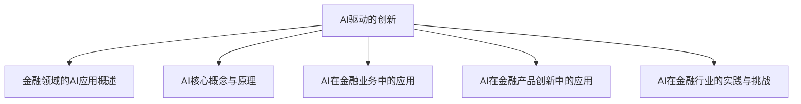

                 

# AI驱动的创新：人类计算在金融中的应用

> **关键词**：人工智能、金融、风险控制、投资策略、客户服务、产品创新、数字化、监管科技

> **摘要**：本文深入探讨了人工智能在金融领域的广泛应用和潜在影响。通过分析AI在风险管理、投资策略、客户服务和金融产品创新等方面的应用，探讨了AI驱动金融创新的优势、挑战和未来发展趋势。本文旨在为金融行业从业者提供一套系统性的理解和实践指南，以把握AI带来的机遇。

## 目录大纲

#### 第一部分：金融领域的AI应用概述

1. AI与金融的融合
   1.1 AI在金融领域的应用前景
   1.2 金融行业面临的挑战与机遇
   1.3 人类计算与机器智能的结合

2. AI核心概念与原理
   2.1 机器学习基础
   2.2 深度学习原理
   2.3 自然语言处理

#### 第二部分：AI在金融业务中的应用

3. AI在风险管理中的应用
   3.1 风险评估模型
   3.2 信用评分模型
   3.3 风险管理策略优化

4. AI在投资策略中的应用
   4.1 股票市场预测
   4.2 量化交易策略
   4.3 投资组合优化

5. AI在客户服务中的应用
   5.1 聊天机器人
   5.2 情感分析
   5.3 客户行为分析

#### 第三部分：AI在金融产品创新中的应用

6. AI驱动的金融产品设计
   6.1 金融产品个性化推荐
   6.2 AI驱动的保险产品设计
   6.3 AI驱动的贷款产品优化

7. AI在金融监管中的应用
   7.1 监管科技概述
   7.2 AI在反洗钱中的应用
   7.3 AI在合规管理中的应用

#### 第四部分：AI在金融行业的实践与挑战

8. AI在金融行业的成功案例
   8.1 案例一：某银行的风控系统优化
   8.2 案例二：某基金公司的量化投资策略
   8.3 案例三：某保险公司的智能客服系统

9. AI在金融行业的挑战与未来发展趋势
   9.1 AI在金融领域的潜在风险
   9.2 数据隐私与伦理问题
   9.3 金融行业的数字化转型趋势

#### 附录

10. AI在金融领域的工具与资源
    10.1 常用机器学习框架
    10.2 金融数据集介绍
    10.3 相关文献与资料

#### Mermaid 流�程图



#### 伪代码

```python
# 信用评分模型的伪代码
def credit_score_model(data):
    # 数据预处理
    preprocessed_data = preprocess_data(data)
    
    # 训练模型
    model = train_model(preprocessed_data)
    
    # 预测
    predictions = model.predict(new_data)
    
    return predictions
```

#### 数学模型与公式

$$
Y = \sigma(WX + b)
$$

其中，\( Y \) 是输出，\( \sigma \) 是激活函数，\( W \) 是权重矩阵，\( X \) 是输入，\( b \) 是偏置。

#### 项目实战

```python
# 某银行的风控系统优化案例
def risk_control_system(loan_application):
    """
    风控系统用于评估贷款申请的风险。
    
    参数:
    loan_application (dict): 贷款申请信息。
    
    返回:
    risk_score (int): 风险评分。
    """
    # 数据预处理
    processed_data = preprocess_loan_application(loan_application)
    
    # 使用机器学习模型预测风险
    risk_model = load_model('risk_control_model.pkl')
    risk_score = risk_model.predict(processed_data)
    
    # 决策规则
    if risk_score <= 0.5:
        approval = '批准'
    else:
        approval = '拒绝'
    
    return risk_score, approval

# 实际代码执行
loan_app = {'income': 5000, 'debt': 2000}
risk_score, approval = risk_control_system(loan_app)
print(f"风险评分：{risk_score}, 贷款批准：{approval}")
```

#### 代码解读与分析

- **预处理步骤**：对贷款申请数据进行预处理，包括缺失值处理、数据标准化等。
- **模型加载**：加载训练好的风险控制模型。
- **预测**：使用模型对新的贷款申请数据进行预测，得到风险评分。
- **决策**：根据风险评分应用决策规则，决定是否批准贷款。

#### 开发环境搭建

- **Python环境**：Python 3.8及以上版本
- **机器学习框架**：使用Scikit-learn、TensorFlow或PyTorch
- **数据处理库**：使用Pandas、NumPy
- **模型训练工具**：使用Jupyter Notebook或PyCharm

#### 源代码详细实现和代码解读

- **源代码实现**：在项目中包含完整的源代码，包括数据预处理、模型训练、预测和决策逻辑。
- **代码解读**：详细注释每段代码的功能，解释如何实现各个功能模块。

#### 附录

- **附录A**：提供常用的机器学习框架、金融数据集介绍以及相关文献和资料链接，便于读者进一步学习和实践。

---

**作者**：AI天才研究院/AI Genius Institute & 禅与计算机程序设计艺术 /Zen And The Art of Computer Programming

接下来的部分，我们将深入探讨金融领域如何利用人工智能进行创新，包括AI的核心概念与原理、AI在金融业务中的应用、AI在金融产品创新中的应用、AI在金融监管中的应用，以及AI在金融行业的实践与挑战。让我们一步步分析推理，逐步展开这场金融与科技的奇妙旅程。

