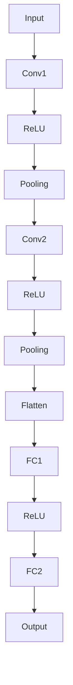
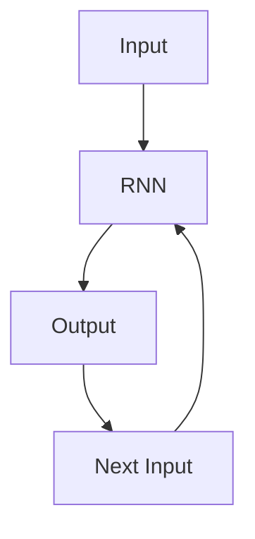
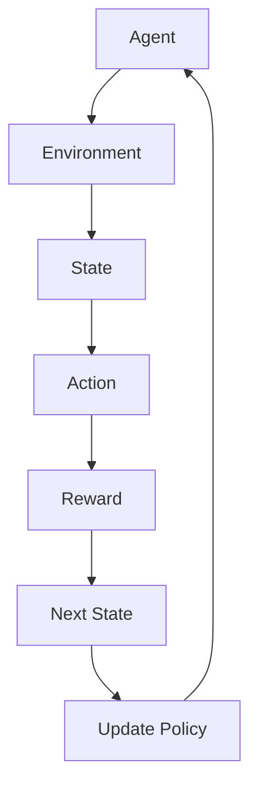

                 

### 《AI驱动的智能仓储系统：提升电商物流效率的关键》

> **关键词：** AI，智能仓储系统，物流效率，机器学习，深度学习，优化算法

> **摘要：** 本文章深入探讨了AI驱动的智能仓储系统的原理、应用和未来展望。通过介绍核心概念、算法模型、项目实战以及未来发展趋势，展示了AI在提升电商物流效率方面的巨大潜力。

## 《AI驱动的智能仓储系统：提升电商物流效率的关键》

智能仓储系统是现代物流管理中不可或缺的一部分，随着电商行业的迅猛发展，其重要性愈发凸显。AI技术的引入，使得智能仓储系统不仅能够实现自动化操作，还能通过智能决策提升整体物流效率。本文将围绕AI驱动的智能仓储系统，探讨其关键技术和应用场景，以期为大家提供全面的技术解读。

### 第一部分：智能仓储系统概述

智能仓储系统是通过信息技术、自动化设备和人工智能技术相结合，实现仓储管理和物流运作的智能化。它不仅能够提高仓储效率和准确性，还能减少人力成本和误差。

#### 第1章：智能仓储系统的基础概念

##### 1.1 智能仓储系统的定义与背景

智能仓储系统是指利用人工智能技术，如机器学习、深度学习、优化算法等，对仓储环节进行自动化管理和优化，实现高效、精准的仓储运作。

随着电商行业的快速发展，物流仓储需求不断增加，传统的手工操作和简单自动化设备已无法满足日益增长的业务需求。AI技术的引入，为仓储管理带来了全新的解决方案，通过智能决策和自动化操作，显著提升了物流效率。

##### 1.2 智能仓储系统的组成部分

智能仓储系统主要由以下几个部分组成：

1. **感知层**：包括传感器、摄像头、RFID等，用于实时监测仓储环境和货物状态。
2. **传输层**：通过物联网技术，将感知层的数据传输到数据中心进行处理。
3. **处理层**：利用人工智能算法，对采集的数据进行分析和处理，实现智能决策。
4. **执行层**：通过自动化设备和机器人，执行智能决策结果，完成仓储操作。

##### 1.3 智能仓储系统的发展历程

智能仓储系统的发展经历了以下几个阶段：

1. **自动化阶段**：采用简单的自动化设备，如自动化输送带、机械臂等，实现货物搬运和分拣。
2. **信息化阶段**：引入条码、RFID等技术，实现货物的自动识别和定位。
3. **智能化阶段**：利用人工智能技术，实现仓储环节的智能决策和优化。

#### 第2章：AI技术在智能仓储中的应用

##### 2.1 机器视觉在智能仓储中的应用

机器视觉技术在智能仓储中主要用于货物的识别、定位和分类。通过摄像头和图像处理算法，系统能够实时捕捉货物图像，进行特征提取和分类，实现自动化操作。

##### 2.2 机器人技术及其在仓储中的应用

机器人技术在智能仓储中广泛应用于货物搬运、分拣、包装等环节。通过路径规划和机器人控制算法，机器人能够高效、准确地完成各项任务，提升仓储运作效率。

##### 2.3 传感器技术在智能仓储中的应用

传感器技术在智能仓储中主要用于环境监测和货物状态监测。通过温湿度传感器、震动传感器等，系统可以实时了解仓储环境，确保货物安全。

### 第二部分：AI驱动的智能仓储系统核心算法

智能仓储系统的核心在于AI算法的应用，通过机器学习和深度学习技术，实现仓储运作的自动化和优化。

#### 第3章：机器学习算法在智能仓储中的应用

##### 3.1 机器学习算法概述

机器学习算法是智能仓储系统的核心，通过训练模型，系统能够从历史数据中学习规律，进行预测和决策。常用的机器学习算法包括分类算法、回归算法和聚类算法。

##### 3.2 分类算法在仓储中的应用

分类算法主要用于货物分类和识别，如通过卷积神经网络（CNN）实现图像分类。

```latex
\begin{equation}
\hat{y} = \text{CNN}(x) = f(\text{ReLU}(\text{Conv}_1(x)), \text{ReLU}(\text{Conv}_2(x)), \ldots)
\end{equation}
```

##### 3.3 回归算法在仓储中的应用

回归算法主要用于预测货物到达时间、仓库容量等。

```latex
\begin{equation}
\hat{y} = \text{W} \cdot x + b
\end{equation}
```

##### 3.4 聚类算法在仓储中的应用

聚类算法主要用于仓库布局优化、货物存储位置分配等。

```latex
\begin{equation}
\text{minimize} \sum_{i=1}^{n} \sum_{j=1}^{k} ||x_i - \mu_j||^2
\end{equation}
```

#### 第4章：深度学习算法在智能仓储中的应用

##### 4.1 深度学习算法概述

深度学习算法是机器学习的一种，通过多层神经网络，实现复杂模式的自动学习。

##### 4.2 卷积神经网络在图像识别中的应用

卷积神经网络（CNN）在图像识别中广泛应用，如用于货物分类。



##### 4.3 循环神经网络在序列数据处理中的应用

循环神经网络（RNN）在序列数据处理中应用广泛，如用于仓库作业调度。



##### 4.4 强化学习在仓储优化中的应用

强化学习通过试错学习，实现仓储优化。



#### 第5章：智能仓储系统的数学模型

##### 5.1 优化理论概述

优化理论是智能仓储系统的数学基础，用于解决仓储运作中的最优问题。

##### 5.2 库存优化模型

库存优化模型通过优化库存策略，降低库存成本。

```latex
\begin{equation}
\text{minimize} C(x)
\end{equation}
```

##### 5.3 货物分配模型

货物分配模型通过优化货物分配策略，提高仓库利用率。

```latex
\begin{equation}
\text{minimize} T(x)
\end{equation}
```

##### 5.4 车辆调度模型

车辆调度模型通过优化车辆调度策略，提高配送效率。

```latex
\begin{equation}
\text{minimize} D(x)
\end{equation}
```

### 第三部分：AI驱动的智能仓储系统项目实战

#### 第6章：智能仓储系统的构建与实现

##### 6.1 智能仓储系统的架构设计

智能仓储系统的架构设计包括感知层、传输层、处理层和执行层。

##### 6.2 数据采集与预处理

数据采集与预处理是智能仓储系统构建的重要环节，包括传感器数据采集、数据清洗和特征提取。

##### 6.3 模型训练与评估

模型训练与评估是智能仓储系统实现的关键步骤，包括模型选择、训练和评估。

##### 6.4 系统集成与优化

系统集成与优化是智能仓储系统运行的关键，包括系统部署、监控和优化。

#### 第7章：案例研究：AI驱动的智能仓储系统应用

##### 7.1 案例一：某电商企业的智能仓储系统

某电商企业通过引入AI驱动的智能仓储系统，实现了库存管理和物流运作的自动化，提升了物流效率。

##### 7.2 案例二：某物流公司的智能仓储系统

某物流公司通过智能仓储系统，实现了货物分拣和配送的自动化，降低了人力成本。

##### 7.3 案例三：某制造企业的智能仓储系统

某制造企业通过智能仓储系统，实现了原材料管理和生产计划的自动化，提高了生产效率。

### 第四部分：AI驱动的智能仓储系统的未来展望

#### 第8章：AI驱动的智能仓储系统发展趋势

##### 8.1 AI驱动的智能仓储系统的技术趋势

随着AI技术的不断发展，智能仓储系统将更加智能化、自动化和高效化。

##### 8.2 AI驱动的智能仓储系统在电商物流中的前景

AI驱动的智能仓储系统将在电商物流领域发挥重要作用，推动物流效率的提升。

##### 8.3 AI驱动的智能仓储系统的社会影响

AI驱动的智能仓储系统将对社会产生深远影响，包括提高物流效率、降低成本、优化资源配置等。

#### 第9章：AI驱动的智能仓储系统的挑战与机遇

##### 9.1 技术挑战

AI驱动的智能仓储系统在技术方面面临诸多挑战，包括数据处理、算法优化、系统集成等。

##### 9.2 应用挑战

AI驱动的智能仓储系统在应用方面面临挑战，包括设备维护、人员培训、系统稳定性等。

##### 9.3 发展机遇

AI驱动的智能仓储系统具有广阔的发展机遇，包括市场拓展、技术创新、产业升级等。

#### 第10章：AI驱动的智能仓储系统的法律法规与伦理问题

##### 10.1 相关法律法规概述

AI驱动的智能仓储系统需要遵守相关法律法规，包括数据保护、网络安全等。

##### 10.2 伦理问题探讨

AI驱动的智能仓储系统涉及伦理问题，包括隐私保护、人权尊重等。

##### 10.3 未来的法律法规趋势

未来法律法规将更加完善，为AI驱动的智能仓储系统提供更好的法律保障。

### 结束语

AI驱动的智能仓储系统是现代物流管理的重要发展方向，通过本文的详细探讨，我们可以看到其在提高物流效率、降低成本、优化资源配置等方面的巨大潜力。随着AI技术的不断发展，智能仓储系统将迎来更广阔的应用前景，为社会经济发展注入新的活力。

---

**作者：AI天才研究院/AI Genius Institute & 禅与计算机程序设计艺术 /Zen And The Art of Computer Programming**

本文内容仅供参考，不代表任何商业建议。在应用AI驱动的智能仓储系统时，请遵守相关法律法规，尊重伦理道德。如需进一步了解或咨询，请随时与我们联系。

