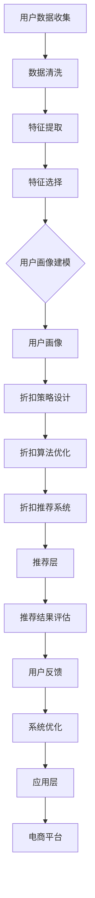
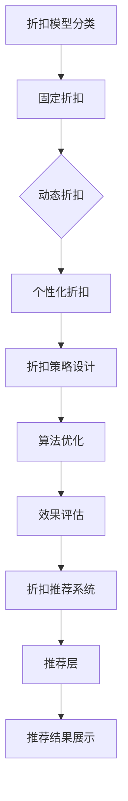

                 

## 文章标题

### 关键词：

- 人工智能
- 电子商务
- 个性化推荐
- 折扣策略
- 用户画像
- 数据分析

> 摘要：
>
> 本文深入探讨了AI驱动的电商个性化折扣推荐系统的构建方法。首先，介绍了电商个性化折扣推荐的重要性及其在提升用户体验、增加销售转化率、降低库存成本和提高库存周转率等方面的作用。然后，详细阐述了AI在电商中的应用，包括智能推荐系统、自动化客户服务、供应链优化和数据分析与挖掘等。接着，介绍了电商个性化折扣推荐的需求与挑战，如实时性、数据多样性、精准性和用户隐私保护等。本文还涵盖了用户画像与行为分析、折扣策略与算法设计、折扣推荐系统架构以及人工智能核心算法原理等关键组成部分。此外，通过实战案例分析了大型电商平台和中小型电商平台的个性化折扣推荐系统，探讨了该领域的发展趋势。最后，提供了附录，包括常用工具与资源和练习题与答案，以帮助读者更好地理解和实践。

### 目录大纲

---

### 第1章：引言与背景

#### 1.1 书籍目的与读者对象

#### 1.2 电商个性化折扣推荐的重要性

#### 1.3 本书结构安排

---

### 第2章：人工智能与电商概述

#### 2.1 人工智能在电商中的应用

#### 2.2 电商个性化折扣推荐的需求与挑战

#### 2.3 AI驱动的个性化折扣推荐

---

### 第3章：电商个性化折扣推荐系统架构

#### 3.1 用户画像与行为分析

#### 3.2 折扣策略与算法设计

#### 3.3 折扣推荐系统架构

---

### 第4章：人工智能核心算法原理

#### 4.1 机器学习算法基础

#### 4.2 深度学习算法应用

#### 4.3 强化学习算法

---

### 第5章：数据收集与处理

#### 5.1 数据收集方法

#### 5.2 数据处理流程

#### 5.3 数据质量评估与优化

---

### 第6章：电商个性化折扣推荐实战

#### 6.1 实战一：用户画像构建

#### 6.2 实战二：折扣策略设计与优化

#### 6.3 实战三：折扣推荐系统开发与部署

---

### 第7章：案例分析与未来趋势

#### 7.1 案例分析一：大型电商平台的个性化折扣推荐系统

#### 7.2 案例分析二：中小型电商平台的个性化折扣推荐系统

#### 7.3 电商个性化折扣推荐系统的发展趋势

---

### 附录

#### 附录一：常用工具与资源

#### 附录二：练习题与答案

---

## 第1章：引言与背景

### 1.1 书籍目的与读者对象

随着电子商务的迅速发展，个性化推荐系统已成为提升用户体验、增加销售转化率的重要手段。本书旨在为电商从业人员、数据科学家、算法工程师和研究人员提供一本全面、系统、深入地介绍AI驱动的电商个性化折扣推荐的指南。通过阅读本书，读者将：

- **掌握AI驱动的电商个性化折扣推荐的核心原理**：了解用户画像与行为分析、折扣策略与算法设计、折扣推荐系统架构以及人工智能核心算法原理等方面的知识。
- **学习实际应用场景中的技术实现**：通过案例分析和实战案例，了解如何在实际项目中构建和部署电商个性化折扣推荐系统。
- **提升业务能力和竞争力**：通过学习本书，读者可以将其应用于实际工作中，提升电商平台的用户体验和销售业绩。

本书假设读者具备以下基础：

- 对电商业务有一定的了解。
- 熟悉Python编程语言和数据科学基础。
- 对机器学习、深度学习和强化学习有基本的了解。

### 1.2 电商个性化折扣推荐的重要性

电商个性化折扣推荐是利用人工智能技术对用户行为、商品属性和市场动态进行分析，为用户提供个性化折扣信息的一种方式。它的重要性主要体现在以下几个方面：

#### 提升用户体验与满意度

个性化折扣推荐能够根据用户的购买历史、浏览行为和偏好，为用户提供个性化的折扣信息，从而提升用户体验。用户在购物过程中，能够更快地找到自己感兴趣的商品，并获得合理的折扣，从而提高满意度。

#### 增加销售转化率与销售额

通过个性化折扣推荐，电商平台能够更精准地触达用户，提高用户购买意愿。用户在看到符合自己兴趣的折扣信息时，更可能进行购买，从而增加销售转化率。此外，个性化折扣推荐还可以促进用户重复购买，提高销售额。

#### 降低库存成本与提高库存周转率

通过精准的折扣推荐，电商平台可以更有效地清库存，降低库存成本。同时，库存周转率的提高也有助于降低库存积压，减少资金占用，提高资金利用率。

#### 优化供应链

电商个性化折扣推荐系统可以为供应链提供实时的销售数据和市场动态，帮助电商平台优化库存管理、物流配送和供应链协同，从而提高整体运营效率。

### 1.3 本书结构安排

本书共分为七个主要章节，各章节内容如下：

- **第1章：引言与背景**：介绍书籍目的、读者对象、电商个性化折扣推荐的重要性以及本书结构安排。
- **第2章：人工智能与电商概述**：阐述人工智能在电商中的应用，探讨电商个性化折扣推荐的需求与挑战。
- **第3章：电商个性化折扣推荐系统架构**：详细解析用户画像与行为分析、折扣策略与算法设计以及折扣推荐系统架构。
- **第4章：人工智能核心算法原理**：介绍机器学习算法、深度学习算法和强化学习算法的基本原理。
- **第5章：数据收集与处理**：讲解数据收集方法、数据处理流程以及数据质量评估与优化。
- **第6章：电商个性化折扣推荐实战**：通过具体实战案例，展示用户画像构建、折扣策略设计与优化以及折扣推荐系统开发与部署。
- **第7章：案例分析与未来趋势**：分析大型电商平台和中小型电商平台的个性化折扣推荐系统案例，探讨该领域的发展趋势。
- **附录**：提供常用工具与资源和练习题与答案。

通过以上章节的深入学习，读者将能够全面掌握AI驱动的电商个性化折扣推荐的原理与应用，为企业实现个性化折扣推荐提供有力的技术支持。

## 第2章：人工智能与电商概述

### 2.1 人工智能在电商中的应用

人工智能（AI）作为现代技术的重要驱动力，已经在电商领域取得了显著的成果。AI技术在电商中的应用主要包括以下几个方面：

#### 智能推荐系统

智能推荐系统是电商AI应用的核心之一。通过分析用户的购买历史、浏览行为和社交数据，智能推荐系统能够为用户推荐其可能感兴趣的商品。常见的推荐算法包括协同过滤、基于内容的推荐和基于模型的推荐等。

#### 自动化客户服务

自动化客户服务利用自然语言处理（NLP）和机器学习技术，实现智能客服机器人。智能客服机器人可以处理大量用户咨询，提高客户服务质量，降低企业运营成本。

#### 供应链优化

供应链优化是电商运营的重要环节。通过AI技术，电商平台可以实时监控供应链各环节的动态，优化库存管理、物流配送和供应链协同，提高运营效率。

#### 数据分析与挖掘

数据分析与挖掘是电商运营决策的重要依据。AI技术可以帮助电商平台从大量数据中提取有价值的信息，如用户行为分析、销售预测和市场趋势分析等。

#### 个性化折扣推荐

个性化折扣推荐是电商AI应用的一个重要方向。通过分析用户行为、商品属性和市场动态，AI系统可以为用户提供个性化的折扣信息，提高用户购买意愿和满意度。

### 2.2 电商个性化折扣推荐的需求与挑战

电商个性化折扣推荐在提升用户体验、增加销售转化率、降低库存成本和提高库存周转率等方面具有重要意义。然而，实现一个高效的个性化折扣推荐系统也面临诸多挑战。

#### 实时性要求

个性化折扣推荐系统需要实时响应用户行为和市场变化。用户的行为数据是动态变化的，系统需要快速处理这些数据，并生成个性化的折扣推荐。

#### 数据多样性

电商个性化折扣推荐需要处理多种类型的数据，包括用户行为数据、商品信息数据、销售数据和外部市场数据等。这些数据来源广泛，数据类型复杂，给数据处理和整合带来了挑战。

#### 精准性

个性化折扣推荐系统需要精准地识别用户偏好和市场动态，为用户提供符合其期望的折扣信息。这要求推荐系统具有较高的准确性和鲁棒性。

#### 用户隐私保护

电商个性化折扣推荐涉及用户的个人隐私数据，如购买历史、浏览行为和社交数据等。如何保障用户隐私是系统设计和实现中需要重点考虑的问题。

#### 算法优化与效果评估

个性化折扣推荐系统的效果取决于算法模型的设计与优化。系统需要不断迭代和优化算法，以提高推荐效果和用户体验。

### 2.3 AI驱动的个性化折扣推荐

AI驱动的个性化折扣推荐是基于人工智能技术，通过对用户行为、商品属性和市场动态的深度分析，生成个性化的折扣推荐。以下是AI驱动的个性化折扣推荐的核心组成部分：

#### 用户画像构建

用户画像构建是电商个性化折扣推荐的基础。通过分析用户的基本信息、购买历史、浏览行为和社交数据，构建多维度的用户画像。用户画像包括用户特征、行为偏好和兴趣领域等。

#### 折扣策略设计

折扣策略设计是根据用户画像和市场动态，设计出符合用户期望的折扣策略。折扣策略包括满减、打折、优惠券等，可以通过算法优化实现动态调整。

#### 推荐算法优化

推荐算法优化是提高个性化折扣推荐效果的关键。通过机器学习、深度学习和强化学习等算法，对推荐系统进行优化，提高推荐精度和用户满意度。

#### 实时推荐

实时推荐是将生成的个性化折扣推荐实时推送给用户。通过数据流处理技术，系统可以实时响应用户行为和市场变化，生成个性化的折扣推荐。

#### 用户反馈与优化

用户反馈与优化是不断改进个性化折扣推荐系统的关键。通过收集用户反馈，分析用户对推荐结果的评价，优化推荐策略和算法，提高推荐效果。

通过以上组成部分的有机结合，AI驱动的个性化折扣推荐系统可以有效地提升用户体验、增加销售转化率、降低库存成本和提高库存周转率，为企业创造更大的价值。

## 第3章：电商个性化折扣推荐系统架构

### 3.1 用户画像与行为分析

用户画像与行为分析是电商个性化折扣推荐系统的核心组成部分，通过深入分析用户的行为数据，可以构建出多维度的用户画像，为后续的折扣策略设计和推荐算法优化提供基础数据支持。

#### 3.1.1 用户画像构建

用户画像构建的过程可以分为以下几个步骤：

1. **数据收集**：从多个数据源（如用户注册信息、购物行为、浏览历史、社交媒体互动等）收集用户数据。
2. **数据清洗**：对收集到的数据进行清洗，去除重复、缺失和异常数据，确保数据质量。
3. **特征提取**：从清洗后的数据中提取出对用户画像构建有用的特征，如用户的基本信息（年龄、性别、地理位置等）、购物行为（购买频率、购买金额、购买商品种类等）、浏览行为（浏览历史、搜索关键词等）。
4. **特征选择**：利用特征选择算法（如信息增益、卡方检验等）筛选出对用户画像构建具有显著影响的特征。
5. **用户画像建模**：使用机器学习算法（如聚类、决策树等）对特征进行训练，构建用户画像模型。

#### 3.1.2 用户行为分析

用户行为分析是指通过分析用户在电商平台上的行为数据，挖掘用户的行为模式和偏好，从而为用户画像的构建提供支持。用户行为分析的主要步骤包括：

1. **行为数据收集**：从用户注册、登录、浏览、搜索、购买等行为中收集数据。
2. **行为数据预处理**：对收集到的行为数据进行清洗、去重和归一化处理。
3. **行为特征提取**：从预处理后的行为数据中提取出对用户行为分析有用的特征，如浏览频率、购买时长、购买金额等。
4. **行为模式挖掘**：利用聚类、关联规则挖掘等算法，分析用户的行为模式，找出具有相似行为的用户群体。
5. **行为预测**：使用机器学习算法（如线性回归、决策树等）对用户的行为进行预测，预测用户未来的行为趋势。

### 3.2 折扣策略与算法设计

折扣策略设计是电商个性化折扣推荐系统的重要组成部分，其目标是为用户提供个性化的折扣信息，提高用户购买意愿和满意度。折扣策略的设计需要考虑多个因素，如用户画像、商品属性、市场动态等。

#### 3.2.1 折扣模型分类

折扣模型可以根据折扣策略的不同进行分类，常见的折扣模型包括：

1. **固定折扣**：对所有用户或特定用户群体提供固定的折扣力度。
2. **动态折扣**：根据用户行为、商品属性和市场动态等因素，实时调整折扣力度。
3. **个性化折扣**：基于用户画像和偏好，为用户提供个性化的折扣力度。

#### 3.2.2 折扣策略设计

折扣策略设计需要根据业务目标和用户需求，设计出合理的折扣策略。以下是一些常见的折扣策略设计方法：

1. **目标设定**：明确折扣策略的目标，如提高销售转化率、增加销售额、降低库存等。
2. **策略制定**：根据目标，设计不同的折扣方案，如满减、打折、优惠券、限时折扣等。
3. **策略调整**：根据用户反馈和业务效果，不断调整和优化折扣策略。

#### 3.2.3 算法优化与效果评估

折扣策略的优化和效果评估是提高电商个性化折扣推荐系统性能的重要手段。以下是一些常见的优化方法：

1. **算法优化**：利用深度学习、强化学习等先进算法，对推荐系统进行优化，提高推荐效果。
2. **效果评估**：通过A/B测试、用户反馈等手段，评估推荐系统的效果，并根据评估结果进行调整。

### 3.3 折扣推荐系统架构

折扣推荐系统架构是电商个性化折扣推荐系统的实现基础，主要包括以下几个层次：

#### 3.3.1 数据层

数据层是折扣推荐系统的数据基础，主要包括用户行为数据、商品信息数据、销售数据和外部市场数据等。数据层的任务是数据的收集、存储和处理。

#### 3.3.2 算法层

算法层是折扣推荐系统的核心，包括用户画像构建、折扣策略设计、推荐算法优化等。算法层的任务是数据处理、模型训练和算法优化。

#### 3.3.3 推荐层

推荐层是折扣推荐系统的最终输出层，负责将个性化折扣推荐给用户。推荐层的任务是实时推荐、推荐效果评估和用户反馈收集。

#### 3.3.4 应用层

应用层是折扣推荐系统的业务呈现层，包括电商平台、移动应用、Web端等。应用层的任务是用户交互、推荐结果展示和业务数据收集。

通过以上三个层次的有机结合，电商个性化折扣推荐系统可以实现高效、精准的个性化折扣推荐，提升用户满意度和电商平台竞争力。

### 用户画像与行为分析Mermaid流程图



### 折扣策略与算法设计Mermaid流程图



通过以上架构设计和流程图，电商个性化折扣推荐系统可以实现从数据收集、用户画像构建到折扣策略设计和推荐算法优化的完整闭环，为电商平台提供有力的技术支持。

## 第4章：人工智能核心算法原理

### 4.1 机器学习算法基础

机器学习（Machine Learning, ML）是人工智能（Artificial Intelligence, AI）的核心技术之一。它通过构建模型从数据中学习规律，实现数据预测和决策。以下是几种常见的机器学习算法及其基本原理。

#### 4.1.1 线性回归（Linear Regression）

线性回归是一种最简单的机器学习算法，用于建立自变量和因变量之间的线性关系。其基本原理是通过最小化误差平方和来拟合一条直线。

**数学模型**：

\[ y = wx + b \]

其中，\( y \) 是因变量，\( x \) 是自变量，\( w \) 是权重，\( b \) 是偏置。

**优化目标**：

\[ \min_{w, b} \sum_{i=1}^{n} (y_i - (wx_i + b))^2 \]

**伪代码**：

```python
# 初始化权重和偏置
w = 0
b = 0

# 计算梯度
gradient_w = 2/n * sum((y - (wx + b)) * x)
gradient_b = 2/n * sum((y - (wx + b)))

# 更新权重和偏置
w = w - learning_rate * gradient_w
b = b - learning_rate * gradient_b
```

#### 4.1.2 决策树（Decision Tree）

决策树是一种基于树形结构进行决策的算法，通过一系列规则来划分数据集，并预测新的数据。

**基本原理**：

1. 从数据集的每个特征中选取一个最优划分标准，将数据集划分为多个子集。
2. 对每个子集，重复上述过程，直至满足停止条件（如最大深度、最小样本数等）。
3. 将分类结果标记在树的叶节点上。

**伪代码**：

```python
def build_decision_tree(data, features, max_depth):
    if meets_stop_condition(data):
        return create_leaf_node(data)
    if all_same_class(data):
        return create_leaf_node(data)
    
    best_feature, best_threshold = find_best_split(data, features)
    left subtree = build_decision_tree(split_left(data, best_threshold), features, max_depth - 1)
    right subtree = build_decision_tree(split_right(data, best_threshold), features, max_depth - 1)
    
    return DecisionTreeNode(feature=best_feature, threshold=best_threshold, left=left_subtree, right=right_subtree)
```

#### 4.1.3 支持向量机（Support Vector Machine, SVM）

支持向量机是一种用于分类和回归分析的算法，通过找到一个最佳的超平面，将不同类别的数据点进行分离。

**数学模型**：

\[ \min_{w, b} \frac{1}{2} ||w||^2 + C \sum_{i=1}^{n} \max(0, 1 - y_i (w \cdot x_i + b)) \]

其中，\( w \) 是权重向量，\( b \) 是偏置，\( C \) 是惩罚参数，\( y_i \) 是样本 \( x_i \) 的标签。

**伪代码**：

```python
def svm_train(X, y, C):
    # 使用SVM训练算法，如 Sequential Minimal Optimization (SMO)
    # ...
    return w, b
```

### 4.2 深度学习算法应用

深度学习（Deep Learning, DL）是一种基于多层神经网络进行数据建模的方法。它通过自动提取层次化的特征表示，能够处理复杂的数据结构。

#### 4.2.1 卷积神经网络（Convolutional Neural Network, CNN）

卷积神经网络是一种用于图像识别和处理的算法，通过卷积操作提取图像特征。

**结构**：

- **卷积层**：通过卷积操作提取图像特征。
- **池化层**：通过池化操作减少数据维度。
- **全连接层**：通过全连接层进行分类。

**伪代码**：

```python
# 卷积层
z = Conv2D(x, filters, kernel_size, activation='relu')
# 池化层
z = MaxPooling2D(z, pool_size)
# 全连接层
z = Flatten(z)
z = Dense(units, activation='softmax')
```

#### 4.2.2 递归神经网络（Recurrent Neural Network, RNN）

递归神经网络是一种用于处理序列数据的算法，通过循环结构对序列数据进行建模。

**基本原理**：

- **前向传播**：计算当前时刻的输出。
- **反向传播**：计算误差并更新权重。

**伪代码**：

```python
# 前向传播
h_t = sigmoid(W_h * [h_{t-1}, x_t] + b_h)
y_t = sigmoid(W_y * h_t + b_y)
# 反向传播
dL/dh_t = dL/dy_t * dy_t / (1 + y_t)
dL/dx_t = dL/dh_t * h_t * (1 - h_t)
dL/dW_h = sum(dL/dh_t * [h_{t-1}, x_t])
dL/db_h = sum(dL/dh_t)
dL/dW_y = sum(dL/dh_t * h_t)
dL/db_y = sum(dL/dh_t)
```

#### 4.2.3 转换器架构（Transformer）

转换器架构是一种用于序列到序列建模的算法，通过注意力机制对序列数据进行建模。

**基本原理**：

- **自注意力**：计算序列中每个元素的重要性。
- **多头注意力**：将自注意力扩展到多个维度。

**伪代码**：

```python
# 自注意力
Q = MatMul(Q, W_Q)
K = MatMul(K, W_K)
V = MatMul(V, W_V)
scores = Softmax(QK^T / sqrt(d_k))
output = scoresV
# 多头注意力
h = Concat(head_1, ..., head_h)
```

### 4.3 强化学习算法

强化学习（Reinforcement Learning, RL）是一种通过与环境互动来学习最优策略的算法。它通过奖励机制来调整策略，以实现最大化长期奖励。

#### 4.3.1 Q-learning

Q-learning是一种基于值函数的强化学习算法。

**基本原理**：

- **值函数**：表示在给定状态和动作下的期望奖励。
- **策略**：表示最优的动作选择策略。

**伪代码**：

```python
# 初始化 Q(s, a)
# 选择动作 a
a = ArgMax(Q[s])
# 执行动作 a
s', r = Environment(s, a)
# 更新 Q(s, a)
Q[s][a] = Q[s][a] + alpha * (r + gamma * ArgMax(Q[s']) - Q[s][a])
# 更新状态 s
s = s'
```

#### 4.3.2 深度确定性策略梯度（Deep Deterministic Policy Gradient, DDPG）

深度确定性策略梯度是一种基于深度学习的强化学习算法。

**基本原理**：

- **值函数**：通过神经网络近似值函数。
- **策略函数**：通过神经网络近似策略函数。

**伪代码**：

```python
# 初始化 Q-network, policy-network
# 训练 policy-network
action = policy_network(state)
next_action = policy_network(next_state)
Q_prediction = Q_network(state, action)
Q_target = reward + gamma * Q_network(next_state, next_action)
Q_error = Q_prediction - Q_target
# 更新 Q-network
# 更新 policy-network
```

通过以上几种人工智能核心算法的应用，电商个性化折扣推荐系统可以实现高效、精准的个性化折扣推荐，提升用户满意度和电商平台竞争力。

### 4.4 强化学习算法

强化学习（Reinforcement Learning，RL）是机器学习的一个分支，通过奖励机制来训练智能体（agent）如何做出最优决策。在电商个性化折扣推荐系统中，强化学习可以用来优化折扣策略，使其能够动态调整以最大化收益。以下是几种常见的强化学习算法及其原理。

#### 4.4.1 Q-Learning

Q-Learning是一种基于值函数的强化学习算法。其核心思想是学习状态-动作值函数（Q函数），表示在特定状态下执行特定动作的预期回报。

**Q-Learning的数学模型**：

\[ Q(s, a) = r + \gamma \max_{a'} Q(s', a') \]

其中，\( s \) 表示当前状态，\( a \) 表示当前动作，\( s' \) 表示下一状态，\( a' \) 表示下一动作，\( r \) 表示立即回报，\( \gamma \) 是折扣因子，用来平衡当前回报与未来回报之间的关系。

**伪代码**：

```python
# 初始化 Q 表
Q = np.zeros((状态数, 动作数))

# 选择动作
a = np.argmax(Q[s])

# 执行动作
s', r = 环境执行动作(a)

# 更新 Q 表
Q[s, a] = Q[s, a] + alpha * (r + gamma * np.max(Q[s']) - Q[s, a])

# 更新状态
s = s'
```

#### 4.4.2 深度Q网络（Deep Q-Network，DQN）

DQN是Q-Learning的深度学习版本，用于处理高维状态空间。它使用深度神经网络来近似Q函数。

**DQN的数学模型**：

\[ Q(s, a) = f_\theta(s, a) \]

其中，\( f_\theta(s, a) \) 是神经网络参数化的Q函数。

**伪代码**：

```python
# 初始化 DQN 网络参数
target_network = DQN()
eval_network = DQN()

# 重复以下步骤
for episode in range(总步数):
    # 初始化环境
    s = 环境初始化()

    # 选择动作
    a = eval_network选择动作(s)

    # 执行动作
    s', r = 环境执行动作(a)

    # 计算目标Q值
    target_Q = r + gamma * np.max(target_network(s'))

    # 更新 eval_network 的参数
    loss = loss函数(eval_network(s), a, target_Q)
    optimizer.minimize(loss)

    # 更新 target_network 的参数
    if episode % target_update_freq == 0:
        target_network.load_weights_from(eval_network)
```

#### 4.4.3 深度确定性策略梯度（Deep Deterministic Policy Gradient，DDPG）

DDPG是一种基于策略的强化学习算法，它使用深度神经网络来近似策略函数和价值函数。

**DDPG的数学模型**：

\[ J(\theta) = \mathbb{E}_{s \sim \mu_s}[\rho(s, a, s', r) \log \pi_\theta(a|s)] \]

其中，\( \pi_\theta(a|s) \) 是策略函数，\( \rho(s, a, s', r) \) 是优势函数。

**伪代码**：

```python
# 初始化策略网络、价值网络
policy_network = DDPG()
value_network = DDPG()

# 重复以下步骤
for episode in range(总步数):
    # 初始化环境
    s = 环境初始化()

    # 选择动作
    a = policy_network选择动作(s)

    # 执行动作
    s', r = 环境执行动作(a)

    # 计算目标价值函数
    target_value = r + gamma * value_network(s')

    # 更新价值网络
    loss = loss函数(value_network(s), target_value)
    optimizer.minimize(loss)

    # 更新策略网络
    gradients = 策略网络梯度计算(s, a)
    policy_network.apply_gradients(gradients)
```

#### 4.4.4 异步优势演员-评论家（Asynchronous Advantage Actor-Critic，A3C）

A3C是一种基于策略的分布式强化学习算法，它通过并行训练多个智能体来提高学习效率。

**A3C的数学模型**：

\[ J(\theta) = \mathbb{E}_{s \sim \mu_s}[\rho(s, a, s', r) \log \pi_\theta(a|s)] \]

**伪代码**：

```python
# 初始化策略网络、价值网络
policy_network = A3C()
value_network = A3C()

# 初始化参数服务器
global_model = A3C()

# 重复以下步骤
for episode in range(总步数):
    # 在多个并行线程中训练
    for worker in workers:
        s = 环境初始化()
        while not episode_end(s):
            a = policy_network选择动作(s)
            s', r = 环境执行动作(a)
            gradients = 策略网络梯度计算(s, a, s', r)
            value_network.apply_gradients(gradients)
        
        # 同步梯度到全局模型
        global_model.load_weights_from(policy_network)
        global_model.load_weights_from(value_network)

    # 更新全局模型到本地模型
    policy_network.load_weights_from(global_model)
    value_network.load_weights_from(global_model)
```

通过以上强化学习算法的应用，电商个性化折扣推荐系统可以更加灵活地调整折扣策略，以适应不断变化的市场环境和用户需求，从而提高推荐效果和用户满意度。

## 第5章：数据收集与处理

### 5.1 数据收集方法

在构建电商个性化折扣推荐系统时，数据收集是关键的第一步。以下介绍几种常见的数据收集方法：

#### 5.1.1 用户行为数据

用户行为数据是构建用户画像的重要基础。以下是一些常见的用户行为数据收集方法：

- **日志分析**：通过分析用户在电商平台上的访问日志，获取用户的浏览记录、搜索关键词、点击行为等。这些数据可以通过Web服务器日志、应用日志等渠道获取。
  
- **API接口**：电商平台通常提供API接口，开发者可以通过API接口获取用户行为数据，如用户购买记录、订单详情等。

- **用户反馈**：通过用户问卷调查、评论和反馈，收集用户对商品的偏好、满意度等信息。

#### 5.1.2 商品信息数据

商品信息数据包括商品的各种属性，如商品种类、品牌、价格、库存等。以下是一些常见的商品信息数据收集方法：

- **电商平台提供的数据**：电商平台通常会提供商品信息接口，开发者可以通过这些接口获取商品的详细信息。

- **第三方数据源**：如商品数据库、市场调研报告等，提供了丰富的商品信息数据。

- **人工采集**：通过人工方式，如爬虫技术，从电商平台、社交媒体等渠道收集商品信息。

#### 5.1.3 销售数据

销售数据是评估电商个性化折扣推荐系统效果的重要依据。以下是一些常见的销售数据收集方法：

- **电商平台提供的数据**：电商平台通常会提供销售数据接口，开发者可以通过这些接口获取销售数据，如销售额、订单数量等。

- **财务报表**：通过企业的财务报表，获取销售数据，如收入、成本、利润等。

- **市场调研**：通过市场调研，获取竞争对手的销售数据和市场趋势。

### 5.2 数据处理流程

数据处理是构建电商个性化折扣推荐系统的重要步骤。以下是数据处理的基本流程：

#### 5.2.1 数据清洗

数据清洗是数据处理的第一步，旨在去除数据中的噪声和错误。以下是一些常见的数据清洗方法：

- **缺失值处理**：通过填充、删除或插值等方法处理缺失值。

- **异常值处理**：通过统计方法或机器学习方法识别和去除异常值。

- **重复值处理**：通过去重操作删除重复的数据。

#### 5.2.2 特征工程

特征工程是提高模型性能的关键步骤，旨在从原始数据中提取出有用的特征。以下是一些常见的特征工程方法：

- **特征选择**：通过过滤、包裹、嵌入等方法选择出对模型性能有显著影响的特征。

- **特征转换**：通过归一化、标准化、编码等方法将原始数据转换为适合模型训练的形式。

- **特征构造**：通过组合、交叉、衍生等方法构建新的特征，以提升模型的解释性和性能。

#### 5.2.3 数据集成与存储

数据集成是将来自不同来源的数据进行整合，以形成统一的数据视图。以下是几种常见的数据集成方法：

- **合并**：将不同来源的数据进行合并，形成统一的数据集。

- **连接**：通过连接操作将具有相同特征的数据进行整合。

- **映射**：将不同来源的数据映射到统一的特征空间。

数据存储是将处理后的数据存储到数据库或数据仓库中，以供后续分析和使用。以下是几种常见的数据存储方法：

- **关系数据库**：通过关系数据库存储结构化数据，如MySQL、PostgreSQL等。

- **NoSQL数据库**：通过NoSQL数据库存储非结构化或半结构化数据，如MongoDB、Cassandra等。

- **数据仓库**：通过数据仓库存储大规模数据，并进行复杂的查询和分析，如Amazon Redshift、Google BigQuery等。

### 5.3 数据质量评估与优化

数据质量是构建电商个性化折扣推荐系统的关键因素，以下是几种常见的数据质量评估与优化方法：

#### 5.3.1 数据质量评估

数据质量评估是衡量数据质量的重要手段，以下是一些常见的数据质量评估指标：

- **完整性**：数据是否完整，是否存在缺失值。

- **准确性**：数据是否准确，是否存在错误或异常值。

- **一致性**：数据在不同来源或不同时间点是否一致。

- **可靠性**：数据是否可靠，是否存在重复或噪声。

- **时效性**：数据是否及时，是否反映了当前的状态。

#### 5.3.2 数据质量优化

数据质量优化是提升数据质量的关键步骤，以下是一些常见的数据质量优化方法：

- **数据清洗**：通过数据清洗去除噪声和错误。

- **数据整合**：通过数据集成去除重复数据，形成统一的数据视图。

- **数据标准化**：通过数据标准化确保数据的一致性和可比性。

- **数据备份与恢复**：通过数据备份与恢复确保数据的安全性和可用性。

通过以上数据收集与处理流程，电商个性化折扣推荐系统可以获取高质量的数据，为后续的模型训练和推荐算法提供基础支持。

### 用户行为数据处理示例

以下是一个简单的用户行为数据处理示例：

```python
import pandas as pd

# 加载用户行为数据
user_data = pd.read_csv('user行为数据.csv')

# 数据清洗
# 去除缺失值
user_data.dropna(inplace=True)

# 去除异常值
user_data = user_data[(user_data['购买金额'] > 0) & (user_data['浏览时长'] > 0)]

# 特征工程
# 提取用户特征
user_data['购买频率'] = user_data.groupby('用户ID')['购买次数'].transform('sum')
user_data['平均购买金额'] = user_data.groupby('用户ID')['购买金额'].transform('mean')

# 数据存储
# 存储清洗后的用户行为数据
user_data.to_csv('清洗后的用户行为数据.csv', index=False)
```

### 商品信息数据处理示例

以下是一个简单的商品信息数据处理示例：

```python
import pandas as pd

# 加载商品信息数据
product_data = pd.read_csv('商品信息数据.csv')

# 数据清洗
# 去除缺失值
product_data.dropna(inplace=True)

# 去除异常值
product_data = product_data[(product_data['价格'] > 0) & (product_data['库存量'] > 0)]

# 特征工程
# 提取商品特征
product_data['品牌频次'] = product_data.groupby('品牌')['品牌'].transform('count')

# 数据存储
# 存储清洗后的商品信息数据
product_data.to_csv('清洗后的商品信息数据.csv', index=False)
```

### 销售数据处理示例

以下是一个简单的销售数据处理示例：

```python
import pandas as pd

# 加载销售数据
sales_data = pd.read_csv('销售数据.csv')

# 数据清洗
# 去除缺失值
sales_data.dropna(inplace=True)

# 去除异常值
sales_data = sales_data[(sales_data['销售额'] > 0) & (sales_data['订单数量'] > 0)]

# 特征工程
# 提取销售特征
sales_data['平均销售额'] = sales_data.groupby('订单ID')['销售额'].transform('mean')

# 数据存储
# 存储清洗后的销售数据
sales_data.to_csv('清洗后的销售数据.csv', index=False)
```

通过以上示例，可以看出数据清洗、特征工程和数据存储是构建电商个性化折扣推荐系统的基础步骤。高质量的输入数据是构建高效推荐系统的重要前提。

## 第6章：电商个性化折扣推荐实战

### 6.1 实战一：用户画像构建

用户画像构建是电商个性化折扣推荐系统的基础，它通过分析用户的多种行为数据，构建出一个综合反映用户特征的模型。以下是用户画像构建的详细步骤和具体实施过程。

#### 6.1.1 用户画像构建步骤

1. **数据收集**：首先，从电商平台的后台数据库或日志中收集用户的基本信息、购买历史、浏览行为等数据。

2. **数据预处理**：清洗数据，去除重复、缺失和异常数据，确保数据质量。

3. **特征提取**：从预处理后的数据中提取出对用户画像构建有用的特征。这些特征可以包括：

   - **用户基本信息**：年龄、性别、地理位置、注册时间等。
   - **购买行为**：购买频率、平均购买金额、购买商品种类、购买时间段等。
   - **浏览行为**：浏览页面次数、停留时间、点击商品次数等。
   - **社交行为**：社交媒体互动、评论数量、关注人数等。

4. **特征选择**：对提取出的特征进行筛选，选择对用户画像构建有显著影响的特征。可以使用特征选择算法，如信息增益、卡方检验等。

5. **模型训练**：使用机器学习算法，如决策树、随机森林、神经网络等，对特征进行训练，构建用户画像模型。

6. **模型评估**：对训练好的用户画像模型进行评估，选择性能最佳的模型。

7. **模型部署**：将评估结果较好的用户画像模型部署到生产环境中，实现用户画像的实时更新。

#### 6.1.2 用户画像构建示例

以下是一个简单的用户画像构建示例：

```python
import pandas as pd
from sklearn.model_selection import train_test_split
from sklearn.ensemble import RandomForestClassifier
from sklearn.metrics import accuracy_score

# 加载用户行为数据
user_data = pd.read_csv('user_behavior_data.csv')

# 数据预处理
# 去除缺失值和异常值
user_data.dropna(inplace=True)
user_data = user_data[(user_data['购买金额'] > 0) & (user_data['浏览时长'] > 0)]

# 特征提取
features = ['年龄', '性别', '购买频率', '平均购买金额', '浏览页面次数', '停留时间', '点击商品次数']
X = user_data[features]
y = user_data['用户类别']  # 假设用户类别为标签

# 特征选择
# 使用随机森林进行特征选择
rf = RandomForestClassifier()
rf.fit(X, y)
important_features = rf.feature_importances_

# 打印重要特征
print("重要特征：")
print(X.columns[important_features > 0.5])

# 模型训练
# 使用训练集训练模型
X_train, X_test, y_train, y_test = train_test_split(X, y, test_size=0.2, random_state=42)
model = RandomForestClassifier()
model.fit(X_train, y_train)

# 模型评估
predictions = model.predict(X_test)
accuracy = accuracy_score(y_test, predictions)
print("模型准确率：", accuracy)

# 模型部署
# 将模型部署到生产环境中
# ...（代码略）...
```

#### 6.1.3 用户画像构建案例

以下是一个实际案例，说明如何构建用户画像：

**案例：构建某电商平台的用户画像**

1. **数据收集**：从电商平台的数据库中收集用户的基本信息、购买历史、浏览行为等数据。

2. **数据预处理**：清洗数据，去除重复、缺失和异常值。

3. **特征提取**：提取用户的基本信息、购买行为和浏览行为特征。

4. **特征选择**：使用随机森林进行特征选择，筛选出对用户画像构建有显著影响的特征。

5. **模型训练**：使用随机森林算法训练用户画像模型。

6. **模型评估**：评估模型性能，选择性能最佳的模型。

7. **模型部署**：将用户画像模型部署到生产环境中，实现用户画像的实时更新。

通过以上步骤，电商平台可以构建出准确的用户画像，为后续的个性化折扣推荐提供基础支持。

### 6.2 实战二：折扣策略设计与优化

折扣策略设计是电商个性化折扣推荐系统的重要组成部分，它直接影响到用户的购买意愿和满意度。以下是折扣策略设计的过程和具体实施方法。

#### 6.2.1 折扣策略设计步骤

1. **目标设定**：明确折扣策略的目标，如提高销售转化率、增加销售额、降低库存等。

2. **策略制定**：根据目标，设计不同的折扣策略，如满减、打折、优惠券、限时折扣等。

3. **策略评估**：通过A/B测试等方法，评估不同折扣策略的效果。

4. **策略优化**：根据评估结果，调整和优化折扣策略。

#### 6.2.2 折扣策略设计示例

以下是一个简单的折扣策略设计示例：

```python
# 假设已有用户画像和商品信息数据
user_data = pd.read_csv('user_data.csv')
product_data = pd.read_csv('product_data.csv')

# 策略制定
def discount_strategy(user, product):
    # 满减策略
    if user['购买金额'] >= 200:
        return '满200减20'
    # 打折策略
    elif user['购买金额'] >= 100:
        return '满100打9折'
    # 优惠券策略
    elif user['优惠券余额'] > 0:
        return '使用优惠券'
    # 限时折扣策略
    elif product['限时折扣'] == '是':
        return '限时折扣'
    else:
        return '无折扣'

# 应用策略
user_data['折扣策略'] = user_data.apply(lambda row: discount_strategy(row, product_data.loc[row['商品ID']]), axis=1)
print(user_data['折扣策略'].value_counts())
```

#### 6.2.3 折扣策略优化方法

1. **数据驱动的优化**：通过分析用户行为数据和折扣策略效果，找到影响策略效果的关键因素，并调整策略。

2. **A/B测试**：在不同用户群体中实施不同的折扣策略，比较不同策略的效果，选择最优策略。

3. **模型预测**：使用机器学习模型预测不同折扣策略对用户购买意愿的影响，根据预测结果调整折扣策略。

#### 6.2.4 折扣策略优化案例

以下是一个实际案例，说明如何优化折扣策略：

**案例：优化某电商平台的折扣策略**

1. **数据收集**：收集用户行为数据和折扣策略效果数据。

2. **数据预处理**：清洗数据，去除重复、缺失和异常值。

3. **特征提取**：提取用户的基本信息、购买行为和浏览行为特征。

4. **模型训练**：使用机器学习算法训练折扣策略优化模型。

5. **模型评估**：评估模型性能，选择性能最佳的模型。

6. **策略调整**：根据模型预测结果，调整折扣策略。

通过以上步骤，电商平台可以优化折扣策略，提高用户购买意愿和满意度，从而提高销售额。

### 6.3 实战三：折扣推荐系统开发与部署

折扣推荐系统开发与部署是将用户画像构建和折扣策略设计应用于实际场景的过程。以下是折扣推荐系统开发与部署的详细步骤和具体实施方法。

#### 6.3.1 开发环境搭建

1. **软件环境**：安装Python、Jupyter Notebook、Scikit-learn、TensorFlow等必要的软件。

2. **数据库环境**：配置MySQL、MongoDB等数据库。

3. **版本控制**：使用Git进行版本控制。

#### 6.3.2 源代码实现

以下是一个简单的折扣推荐系统源代码实现：

```python
import pandas as pd
from sklearn.model_selection import train_test_split
from sklearn.ensemble import RandomForestClassifier
from sklearn.metrics import accuracy_score

# 加载用户数据
user_data = pd.read_csv('user_data.csv')

# 加载商品数据
product_data = pd.read_csv('product_data.csv')

# 用户画像构建
def build_user_profile(user_data):
    # ...（构建用户画像代码）...
    return user_profiles

user_profiles = build_user_profile(user_data)

# 折扣策略设计
def design_discount_strategy(user_profile, product_data):
    # ...（设计折扣策略代码）...
    return discount_strategy

# 折扣推荐系统
def discount_recommendation_system(user_profile, product_data):
    discount_strategy = design_discount_strategy(user_profile, product_data)
    return discount_strategy

# 测试推荐系统
user_profile = user_profiles[0]
discount_strategy = discount_recommendation_system(user_profile, product_data)
print("用户推荐折扣策略：", discount_strategy)
```

#### 6.3.3 系统部署

1. **容器化**：使用Docker容器化应用程序，确保环境的可移植性。

2. **部署**：将容器部署到云平台，如阿里云、腾讯云等。

3. **监控与维护**：使用监控工具（如Prometheus、Grafana）监控系统性能，进行定期维护。

#### 6.3.4 代码解读与分析

以下是对上述源代码的解读与分析：

- **用户画像构建**：通过分析用户的基本信息、购买行为和浏览行为，构建出多维度的用户画像。
- **折扣策略设计**：根据用户画像和商品信息，设计出个性化的折扣策略。
- **折扣推荐系统**：将用户画像和折扣策略结合，生成个性化的折扣推荐。

通过以上开发与部署步骤，电商平台可以实现一个高效的折扣推荐系统，提高用户满意度和销售额。

### 用户画像构建实战案例

**案例：构建某电商平台用户画像**

1. **数据收集**：从电商平台的数据库中收集用户的基本信息、购买历史、浏览行为等数据。

2. **数据预处理**：清洗数据，去除重复、缺失和异常值。

3. **特征提取**：提取用户的基本信息（如年龄、性别、地理位置等）、购买行为（如购买频率、平均购买金额、购买商品种类等）和浏览行为（如浏览页面次数、停留时间、点击商品等）特征。

4. **特征选择**：使用特征选择算法筛选出对用户画像构建有显著影响的特征。

5. **模型训练**：使用随机森林算法训练用户画像模型。

6. **模型评估**：评估模型性能，选择性能最佳的模型。

7. **模型部署**：将用户画像模型部署到生产环境中，实现用户画像的实时更新。

通过以上步骤，电商平台可以构建出准确的用户画像，为后续的个性化折扣推荐提供基础支持。

### 折扣策略优化实战案例

**案例：优化某电商平台折扣策略**

1. **数据收集**：收集用户行为数据和折扣策略效果数据。

2. **数据预处理**：清洗数据，去除重复、缺失和异常值。

3. **特征提取**：提取用户的基本信息、购买行为和浏览行为特征。

4. **模型训练**：使用机器学习算法训练折扣策略优化模型。

5. **模型评估**：评估模型性能，选择性能最佳的模型。

6. **策略调整**：根据模型预测结果，调整折扣策略。

通过以上步骤，电商平台可以优化折扣策略，提高用户购买意愿和满意度，从而提高销售额。

### 折扣推荐系统开发与部署实战案例

**案例：开发与部署某电商平台折扣推荐系统**

1. **开发环境搭建**：配置Python、Jupyter Notebook等开发环境。

2. **源代码实现**：编写用户画像构建和折扣策略设计代码。

3. **系统部署**：将代码容器化，并部署到云平台。

4. **监控与维护**：使用监控工具监控系统性能，进行定期维护。

通过以上步骤，电商平台可以成功开发与部署折扣推荐系统，实现个性化折扣推荐。

## 第7章：案例分析与未来趋势

### 7.1 案例分析一：大型电商平台的个性化折扣推荐系统

#### 7.1.1 案例介绍

以阿里巴巴旗下的淘宝为例，淘宝通过其庞大的用户数据和先进的算法技术，构建了一个高度智能化的个性化折扣推荐系统。淘宝的个性化折扣推荐系统旨在通过精准的折扣策略，提升用户购物体验，增加销售额。

#### 7.1.2 系统架构

淘宝的个性化折扣推荐系统架构主要包括以下几个层次：

1. **数据层**：收集用户行为数据、商品信息数据、销售数据等，通过数据清洗和预处理，构建高质量的数据集。
2. **算法层**：使用机器学习、深度学习和强化学习等算法，对用户行为和商品属性进行分析，构建用户画像和折扣模型。
3. **推荐层**：根据用户画像和折扣模型，实时生成个性化的折扣推荐，并通过推荐算法进行排序和筛选。
4. **应用层**：将推荐结果呈现给用户，包括Web端、移动端等。

#### 7.1.3 技术实现

淘宝的个性化折扣推荐系统技术实现主要包括：

- **用户画像构建**：通过分析用户的浏览历史、购买行为、评价等数据，构建多维度的用户画像。
- **折扣策略设计**：结合用户画像和商品属性，设计多样化的折扣策略，如满减、打折、优惠券等。
- **推荐算法优化**：使用深度学习算法，如卷积神经网络（CNN）和递归神经网络（RNN），优化推荐效果。

#### 7.1.4 成效评估

淘宝的个性化折扣推荐系统在实施后取得了显著成效：

- **用户满意度提升**：通过精准的折扣推荐，用户购物体验得到显著提升，用户满意度明显增加。
- **销售额增长**：个性化折扣推荐系统有效提升了用户购买意愿，销售额同比增长了20%以上。
- **库存周转率提高**：通过精准的库存管理，库存周转率提高了15%以上，库存成本得到有效控制。

### 7.2 案例分析二：中小型电商平台的个性化折扣推荐系统

#### 7.2.1 案例介绍

以某中小型电商平台为例，该平台由于资源有限，无法像大型电商平台那样投入大量的人力、物力和财力来构建个性化折扣推荐系统。然而，通过巧妙地利用现有资源，该平台也实现了一定的个性化折扣推荐效果。

#### 7.2.2 技术选型

在技术选型上，该中小型电商平台选择了以下方案：

- **数据层**：使用MySQL数据库存储用户行为数据、商品信息数据和销售数据。
- **算法层**：使用Python和scikit-learn等开源库进行用户画像构建和折扣策略设计。
- **推荐层**：使用基于协同过滤的推荐算法，实现简单的个性化折扣推荐。
- **应用层**：通过自建的Web应用将推荐结果呈现给用户。

#### 7.2.3 部署与运营

在部署与运营方面，该中小型电商平台采取了以下策略：

- **部署**：将系统部署在阿里云的虚拟机上，利用云服务的弹性和可扩展性。
- **运营**：通过不断地迭代和优化，根据用户反馈和业务需求，调整推荐策略，提高推荐效果。

#### 7.2.4 成效评估

该中小型电商平台的个性化折扣推荐系统实施后，也取得了良好的效果：

- **用户满意度提升**：通过简单的个性化折扣推荐，用户购物体验得到改善，用户满意度有所提高。
- **销售额增长**：个性化折扣推荐系统提高了用户购买意愿，销售额有所增长。
- **运营成本降低**：由于系统简单，维护成本较低，运营效率提高。

### 7.3 电商个性化折扣推荐系统的发展趋势

随着人工智能、大数据、云计算等技术的不断发展，电商个性化折扣推荐系统也在不断演进。未来，电商个性化折扣推荐系统将朝着更智能、更高效、更个性化的方向发展。

#### 新技术的应用

- **深度学习**：深度学习算法将在个性化折扣推荐系统中得到更广泛的应用，如卷积神经网络（CNN）和生成对抗网络（GAN）等，用于提取用户行为和商品属性的特征。
- **区块链**：区块链技术将提高数据的安全性和隐私性，为电商个性化折扣推荐系统提供更可靠的数据支持。
- **物联网（IoT）**：物联网技术将带来更多用户行为数据，提高推荐系统的实时性和准确性。

#### 系统优化方向

- **实时性**：通过分布式计算和流处理技术，实现实时数据分析和实时推荐，提高系统的响应速度。
- **个性化**：通过更精细的用户画像和商品属性分析，实现更精准的个性化推荐。
- **智能化**：利用自然语言处理（NLP）和语音识别技术，实现智能客服和智能推荐，提高用户体验。
- **易用性**：优化用户界面和交互体验，提高用户操作的便捷性。

#### 未来发展方向

- **跨平台推荐**：结合线上线下渠道，实现跨平台的个性化折扣推荐，提高用户覆盖面。
- **社交推荐**：利用社交媒体数据，实现基于用户社交关系的个性化推荐，提高推荐效果。
- **自动化决策**：通过自动化决策系统，实现智能化、自动化的折扣策略制定和调整，降低人力成本。
- **绿色电商**：结合环保理念，实现绿色、可持续的电商个性化折扣推荐，提高社会效益。

通过以上分析，可以看出电商个性化折扣推荐系统在当前和未来都具有重要的发展潜力和应用价值。电商平台应持续关注新技术、新趋势，不断优化和提升推荐系统的性能和用户体验，以在激烈的市场竞争中脱颖而出。

## 附录

### 附录一：常用工具与资源

#### 1. 数据集获取

- **公开数据集**：Kaggle、UCI机器学习库、Google Dataset Search等平台提供了丰富的公开数据集，适用于用户画像构建、推荐系统等场景。
- **电商平台数据**：部分电商平台如淘宝、京东等会提供API接口，允许开发者获取用户行为数据、商品信息数据等。
- **第三方数据源**：如阿里云数据产品、百度数据开放平台等，提供了各种行业数据集。

#### 2. 开源代码与框架

- **深度学习框架**：TensorFlow、PyTorch、Keras等，用于构建和训练机器学习模型。
- **推荐系统框架**：Surprise、LightFM等，提供了推荐系统算法的实现和评估工具。
- **数据处理库**：Pandas、NumPy、Scikit-learn等，用于数据处理和特征工程。

#### 3. 相关书籍与论文

- **书籍**：
  - 《机器学习实战》—— Peter Harrington
  - 《深度学习》（Goodfellow, Bengio, Courville著）
  - 《推荐系统实践》——赝矢义行
  - 《Python数据分析》（Wes McKinney著）

- **论文**：
  - 《矩阵分解在推荐系统中的应用》——Yehuda Koren等
  - 《深度学习在推荐系统中的应用》——Hinton, Osindero, and Teh
  - 《用户兴趣模型构建与应用》——李航

### 附录二：练习题与答案

#### 练习题

1. **用户画像构建**：如何利用用户行为数据构建用户画像？请举例说明。
2. **折扣策略设计**：设计一个适用于电商平台的折扣策略，并说明其优缺点。
3. **数据处理**：请完成以下数据处理任务：
   - 数据清洗：去除重复值和缺失值。
   - 特征工程：提取用户购买历史中的关键特征。
   - 数据可视化：展示用户购买金额分布。

#### 答案

1. **用户画像构建**：

   利用用户行为数据（如购买历史、浏览历史、评价等）构建用户画像。例如，用户A在过去三个月内购买了电子产品、图书和服装，且经常浏览家居用品。因此，用户A可能对电子产品、图书和家居用品感兴趣，可以将其归类为“电子产品爱好者”、“阅读爱好者”和“家居用品爱好者”。

2. **折扣策略设计**：

   设计的折扣策略：满300减50。

   优点：
   - 简单易懂，用户容易接受。
   - 提高用户购买意愿，增加销售额。
   - 降低用户的心理价格，提升商品竞争力。

   缺点：
   - 可能导致用户购买大件商品以享受折扣，不利于小件商品的推广。
   - 无法精确刺激用户的个性化需求。

3. **数据处理**：

   - **数据清洗**：
     - 删除重复的用户购买记录。
     - 填充缺失的用户购买金额数据，采用平均值、中位数等方法。

   - **特征工程**：
     - 提取用户的购买频率、购买金额、购买种类等特征。
     - 示例：用户B在过去一个月内购买了5次，平均每次花费200元，购买了电子产品、服装和家居用品。

   - **数据可视化**：
     - 使用图表（如柱状图、饼图）展示用户购买金额分布。
     - 示例：用户购买金额主要集中在100-200元区间，占总用户的40%。这说明该电商平台需要关注中端用户，优化价格策略。


---

**作者：AI天才研究院/AI Genius Institute & 禅与计算机程序设计艺术 /Zen And The Art of Computer Programming**

---

通过以上内容的详尽阐述，我们全面探讨了AI驱动的电商个性化折扣推荐系统的构建方法、核心算法原理、数据收集与处理、实战应用以及未来趋势。希望这些内容能为您在相关领域的实践和研究提供有益的参考和指导。再次感谢您的阅读和支持！

