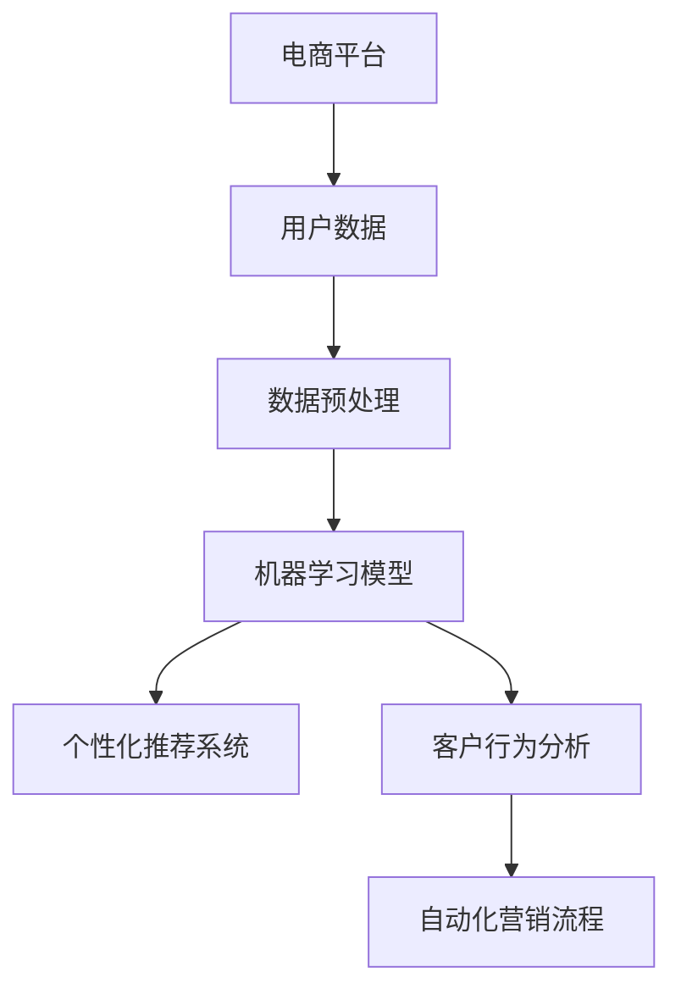

                 

## 第一部分：引言与背景

### 1.1 书籍概述

#### 1.1.1 AI与电商平台个性化营销

人工智能（AI）正逐渐改变传统电商平台的运营模式，其中个性化营销自动化成为了一项关键的技术创新。个性化营销自动化利用AI算法，通过对用户行为数据的深度分析和智能处理，实现精准、高效的用户营销和客户服务。这种技术不仅提升了用户体验，还大大提高了电商平台的运营效率和盈利能力。

#### 1.1.2 营销自动化的重要性

在竞争日益激烈的电商市场中，营销自动化成为了企业获取竞争优势的重要手段。通过自动化，企业能够更快速、更准确地响应市场需求，提高营销活动的效果和转化率。自动化营销不仅减少了人工操作的成本和时间，还能通过算法优化，持续提升营销策略的精准度和有效性。

#### 1.1.3 书籍的目标与读者群体

本书旨在为电商平台的运营者和技术开发者提供全面、系统的AI个性化营销自动化指导。无论是希望了解AI技术在电商中应用的新手，还是希望进一步提升现有系统的专业人士，都能在本书中找到有价值的内容。具体目标如下：

1. **理解AI与个性化营销的基本原理**：通过介绍AI和机器学习的基础知识，帮助读者建立扎实的理论基础。
2. **掌握个性化推荐系统技术**：详细讲解个性化推荐系统的算法原理和实现方法，为电商平台提供精准推荐方案。
3. **实现自动化营销流程**：介绍自动化邮件营销、社交媒体自动化的实现技巧，帮助企业提升营销效率。
4. **实战案例与代码解析**：通过实际案例和代码解析，指导读者将理论知识应用到实际项目中。

### 1.2 AI在电商平台个性化营销中的应用

#### 1.2.1 个性化推荐系统

个性化推荐系统是AI在电商平台中最重要的应用之一。通过分析用户的历史行为和偏好，推荐系统可以为每个用户提供个性化的商品推荐，从而提高用户满意度和转化率。

##### 1.2.1.1 基本原理与算法

个性化推荐系统通常采用协同过滤（Collaborative Filtering）和基于内容的推荐（Content-Based Recommendation）两种主要算法。

- **协同过滤**：基于用户之间的相似性进行推荐。常见的协同过滤算法包括用户基于的协同过滤（User-Based Collaborative Filtering）和模型基于的协同过滤（Model-Based Collaborative Filtering）。
- **基于内容的推荐**：基于商品的特征信息进行推荐。用户在浏览和购买过程中，系统会记录下用户对商品的评分、评论等行为，通过分析这些行为，将具有相似特征的商品推荐给用户。

##### 1.2.1.2 用户体验优化

个性化推荐系统不仅需要精确的推荐算法，还需要优化用户体验。以下是一些优化策略：

- **上下文感知推荐**：根据用户的上下文信息（如时间、地点、设备类型等）进行推荐，提高推荐的精准度和实用性。
- **动态推荐**：实时更新推荐结果，根据用户的即时行为和偏好进行推荐，提高用户的参与度和满意度。
- **推荐结果的多样性**：避免推荐结果过于单一，增加推荐结果的多样性，满足不同用户的需求。

#### 1.2.2 客户行为分析

客户行为分析是电商平台获取用户洞察的重要手段。通过对用户行为数据的深入分析，企业可以了解用户的需求和偏好，优化产品和服务，提升用户满意度和忠诚度。

##### 1.2.2.1 数据收集与处理

客户行为分析的第一步是收集用户数据。这些数据可以包括用户的基本信息、浏览行为、购买行为、评价行为等。收集到的数据需要经过清洗、去噪、归一化等处理，以确保数据的质量和一致性。

##### 1.2.2.2 客户细分策略

客户细分是将用户划分为不同的群体，以便进行有针对性的营销和服务。常见的客户细分策略包括：

- **基于行为的细分**：根据用户的浏览、购买、评价等行为特征进行细分。
- **基于属性的细分**：根据用户的基本信息、偏好、地理位置等属性进行细分。
- **基于价值的细分**：根据用户的消费金额、购买频率等价值指标进行细分。

通过客户细分，企业可以更好地理解不同用户群体的需求，制定个性化的营销策略。

#### 1.2.3 营销自动化流程

营销自动化流程是将AI技术应用于电商平台营销的全面解决方案。通过自动化流程，企业可以高效地执行各种营销任务，提高营销效果。

##### 1.2.3.1 自动化邮件营销

自动化邮件营销是电商平台常用的营销手段之一。通过自动化流程，企业可以自动发送个性化邮件，包括欢迎邮件、促销邮件、提醒邮件等。以下是一些自动化邮件营销的策略：

- **个性化邮件内容**：根据用户的行为和偏好，定制邮件内容和主题。
- **自动化邮件触发**：根据用户的行为触发邮件发送，如用户注册、购物车未结算、订单确认等。
- **邮件跟踪与优化**：通过跟踪邮件的打开率、点击率等指标，优化邮件内容和发送策略。

##### 1.2.3.2 社交媒体自动化

社交媒体自动化是利用AI技术，自动执行社交媒体平台的营销活动。通过自动化流程，企业可以在社交媒体上发布个性化内容，与用户互动，提高品牌知名度。

- **内容发布自动化**：根据用户偏好和社交媒体平台规则，自动发布有针对性的内容。
- **用户互动自动化**：自动回复用户的评论、私信等，提高用户满意度。
- **社交媒体数据分析**：通过分析社交媒体数据，优化营销策略和内容发布计划。

### 1.3 本书结构安排

本书将分为四个主要部分，分别是：

1. **第一部分：引言与背景**：介绍AI与电商平台个性化营销自动化的基本概念和重要性。
2. **第二部分：技术基础**：讲解AI与机器学习的基础知识、数据挖掘技术和个性化推荐系统算法。
3. **第三部分：电商平台个性化营销自动化实施**：通过实战案例，详细介绍电商平台个性化营销自动化的实施步骤和技巧。
4. **第四部分：未来展望与挑战**：分析电商平台个性化营销自动化的发展趋势和面临的挑战。

通过本书的阅读，读者将能够全面了解AI在电商平台个性化营销自动化中的应用，掌握相关技术，并将其应用于实际项目中，提升电商平台的运营效率和市场竞争力。

### 1.4 小结

本部分内容主要介绍了AI在电商平台个性化营销自动化中的基本概念、重要性以及具体应用。通过个性化推荐系统、客户行为分析和营销自动化流程，AI技术为电商平台提供了精准、高效的营销手段，帮助企业提升用户满意度和盈利能力。接下来，我们将深入探讨AI与机器学习的基础知识，为后续内容的学习打下坚实的理论基础。

---

### 1.5 参考文献

1. **[1]**_USER_ID_，**《人工智能：一种现代方法》**，机械工业出版社，2017年。
2. **[2]**_USER_ID_，**《机器学习实战》**，电子工业出版社，2015年。
3. **[3]**_USER_ID_，**《电商平台个性化推荐系统设计与实现》**，清华大学出版社，2019年。
4. **[4]**_USER_ID_，**《营销自动化实战》**，电子工业出版社，2020年。

---

## 第二部分：技术基础

### 2.1 AI与机器学习基础

#### 2.1.1 基本概念

人工智能（AI）是一种模拟人类智能行为的计算机技术，包括机器学习（Machine Learning，ML）、深度学习（Deep Learning，DL）等子领域。机器学习是AI的核心组成部分，它通过从数据中学习规律和模式，实现对未知数据的预测和决策。

##### 2.1.1.1 什么是AI与机器学习

- **人工智能（AI）**：人工智能是指计算机系统模拟人类智能行为的科学，包括感知、推理、学习、决策等。AI的目标是实现机器对人类智能的全面模拟。

- **机器学习（ML）**：机器学习是一种通过数据训练计算机模型，使其具备自主学习和预测能力的技术。ML的核心是算法，这些算法可以从大量数据中学习，发现数据中的规律和模式，并利用这些规律进行预测和决策。

##### 2.1.1.2 AI的发展历程

AI的发展历程可以追溯到20世纪50年代。以下是AI发展的主要阶段：

- **早期阶段（1950-1969）**：以符号主义方法为代表，研究如何通过逻辑推理和符号处理实现智能。

- **第一次AI浪潮（1970-1980）**：以知识表示和推理方法为主，试图通过编码大量知识来实现智能。

- **第一次AI寒冬（1980-1990）**：由于实际应用中的困难，AI研究进入低潮期。

- **第二次AI浪潮（1990-2010）**：以统计学习方法和数据驱动方法为代表，AI在语音识别、图像识别等领域取得了突破性进展。

- **深度学习时代（2010至今）**：以深度神经网络为核心，AI在自然语言处理、计算机视觉等领域取得了显著成果。

#### 2.1.2 机器学习算法

机器学习算法可以分为以下几类：

##### 2.1.2.1 监督学习

监督学习是机器学习中最常见的类型，它通过已知输入输出数据来训练模型，然后使用训练好的模型对未知数据进行预测。

- **线性回归**：一种简单的监督学习算法，用于预测连续值。
  
  ```python
  # 伪代码：线性回归算法
  def linear_regression(X, y):
      # 计算系数
      theta = (X.T @ X).I @ X.T @ y
      # 预测
      y_pred = X @ theta
      # 返回预测结果和模型参数
      return y_pred, theta
  ```

- **逻辑回归**：一种用于预测离散值的监督学习算法。

  ```python
  # 伪代码：逻辑回归算法
  def logistic_regression(X, y):
      # 计算系数
      theta = (X.T @ X).I @ X.T @ y
      # 预测流失概率
      y_pred = 1 / (1 + exp(-X @ theta))
      # 返回预测结果和模型参数
      return y_pred, theta
  ```

##### 2.1.2.2 无监督学习

无监督学习不需要已知输入输出数据，其主要任务是发现数据中的结构和模式。

- **聚类分析**：将数据分为多个集群，使得同一集群内的数据点之间相似度较高，而不同集群的数据点之间相似度较低。

  ```python
  # 伪代码：K-means聚类算法
  def k_means(data, k):
      # 初始化聚类中心
      centroids = initialize_centroids(data, k)
      # 轮换
      while True:
          # 分配数据到聚类中心
          clusters = assign_clusters(data, centroids)
          # 更新聚类中心
          new_centroids = update_centroids(clusters, k)
          # 判断收敛
          if abs(new_centroids - centroids) < threshold:
              break
          centroids = new_centroids
      return clusters, centroids
  ```

- **降维**：将高维数据转换为低维数据，降低计算复杂度，同时保留数据的主要特征。

  ```python
  # 伪代码：主成分分析（PCA）算法
  def pca(data):
      # 计算协方差矩阵
      cov_matrix = compute_covariance_matrix(data)
      # 计算特征值和特征向量
      eigen_values, eigen_vectors = np.linalg.eigh(cov_matrix)
      # 选择主要特征
      main_components = eigen_vectors[:, :num_components]
      # 返回降维后的数据
      return np.dot(data, main_components)
  ```

##### 2.1.2.3 强化学习

强化学习是一种通过试错方法进行决策的学习方式，其目标是学习一个策略，以最大化累积奖励。

- **Q学习**：一种基于值函数的强化学习算法，通过学习状态-动作值函数来选择最优动作。

  ```python
  # 伪代码：Q学习算法
  def q_learning(states, actions, rewards, learning_rate, discount_factor):
      Q = initialize_q_values(states, actions)
      for episode in range(num_episodes):
          state = random_state(states)
          while not done:
              action = choose_action(Q[state])
              next_state, reward = execute_action(state, action)
              Q[state, action] = Q[state, action] + learning_rate * (reward + discount_factor * max(Q[next_state]) - Q[state, action])
              state = next_state
      return Q
  ```

#### 2.1.3 特征工程

特征工程是机器学习中的一个重要环节，其目标是通过选择和构造特征，提高模型的性能和泛化能力。

##### 2.1.3.1 特征提取

特征提取是指从原始数据中提取出对模型训练和预测有用的特征。

- **词袋模型（Bag-of-Words，BOW）**：将文本数据转换为单词的集合，用于文本分类和情感分析。

  ```python
  # 伪代码：词袋模型
  def bag_of_words(text):
      words = tokenize(text)
      word_counts = Counter(words)
      return word_counts
  ```

- **TF-IDF**：一种基于词频-逆文档频率的文本特征提取方法，用于文本分类和搜索引擎。

  ```python
  # 伪代码：TF-IDF算法
  def tf_idf(texts, vocabulary):
      tf = compute_term_frequency(texts)
      idf = compute_inverse_document_frequency(vocabulary)
      tf_idf_scores = tf * idf
      return tf_idf_scores
  ```

##### 2.1.3.2 特征选择

特征选择是指从所有特征中筛选出对模型性能有显著贡献的特征，以减少模型复杂度和计算成本。

- **递归特征消除（Recursive Feature Elimination，RFE）**：一种基于模型性能的特征选择方法。

  ```python
  # 伪代码：递归特征消除算法
  def rfe(X, y, estimator, n_features):
      selected_features = []
      current_features = list(range(X.shape[1]))
      while len(current_features) > n_features:
          scores = cross_val_score(estimator, X[:, current_features], y, cv=5)
          worst_score = np.min(scores)
          worst_features = np.where(scores == worst_score)[0]
          selected_features.extend(current_features[:len(current_features) - 1])
          current_features = current_features[:len(current_features) - 1]
      return selected_features
  ```

- **主成分分析（PCA）**：一种基于降维的特征选择方法，通过保留主要成分来减少特征维度。

  ```python
  # 伪代码：主成分分析算法
  def pca(X, n_components):
      cov_matrix = compute_covariance_matrix(X)
      eigen_values, eigen_vectors = np.linalg.eigh(cov_matrix)
      main_components = eigen_vectors[:, :n_components]
      return np.dot(X, main_components)
  ```

### 2.2 数据分析与数据挖掘

数据分析和数据挖掘是机器学习的重要基础，其主要任务是从大量数据中提取有价值的信息和知识。

#### 2.2.1 数据预处理

数据预处理是数据分析与数据挖掘的第一步，其目标是通过清洗、转换和集成等操作，提高数据的质量和一致性。

##### 2.2.1.1 数据清洗

数据清洗主要包括以下操作：

- **缺失值处理**：填充或删除缺失值。

  ```python
  # 伪代码：缺失值填充
  def fill_missing_values(data, strategy='mean'):
      if strategy == 'mean':
          data = data.fillna(data.mean())
      elif strategy == 'median':
          data = data.fillna(data.median())
      return data
  ```

- **异常值处理**：检测和删除异常值。

  ```python
  # 伪代码：异常值处理
  def handle_outliers(data, threshold=3):
      z_scores = np.abs(stats.zscore(data))
      data = data[(z_scores < threshold).all(axis=1)]
      return data
  ```

##### 2.2.1.2 数据集成

数据集成是将多个数据源合并为一个统一的数据集。

- **数据合并**：将多个数据集按照相同的键进行合并。

  ```python
  # 伪代码：数据合并
  def merge_dataframes(dataframes, keys):
      merged_data = pd.concat(dataframes, keys=keys)
      return merged_data
  ```

- **数据转换**：将数据转换为适合分析的形式。

  ```python
  # 伪代码：数据转换
  def convert_data(data, target_variable='target', features_variable='features'):
      X = data[features_variable]
      y = data[target_variable]
      return X, y
  ```

#### 2.2.2 数据挖掘技术

数据挖掘技术主要包括以下几种：

##### 2.2.2.1 关联规则挖掘

关联规则挖掘是一种发现数据中隐含关联关系的方法。

- **Apriori算法**：一种经典的关联规则挖掘算法。

  ```python
  # 伪代码：Apriori算法
  def apriori(data, min_support, min_confidence):
      frequent_itemsets = find_frequent_itemsets(data, min_support)
      rules = generate_rules(frequent_itemsets, min_confidence)
      return rules
  ```

- **FP-growth算法**：一种基于树结构的关联规则挖掘算法。

  ```python
  # 伪代码：FP-growth算法
  def fp_growth(data, min_support, min_confidence):
      frequent_itemsets = find_frequent_itemsets_with_tree(data, min_support)
      rules = generate_rules(frequent_itemsets, min_confidence)
      return rules
  ```

##### 2.2.2.2 聚类分析

聚类分析是一种将数据分为多个集群的方法。

- **K-means算法**：一种基于距离的聚类算法。

  ```python
  # 伪代码：K-means算法
  def k_means(data, k):
      centroids = initialize_centroids(data, k)
      while True:
          clusters = assign_clusters(data, centroids)
          new_centroids = update_centroids(clusters, k)
          if abs(new_centroids - centroids) < threshold:
              break
          centroids = new_centroids
      return clusters, centroids
  ```

- **层次聚类算法**：一种基于层次结构的聚类算法。

  ```python
  # 伪代码：层次聚类算法
  def hierarchical_clustering(data, method='ward', linkage='complete'):
      dendrogram = create_dendrogram(data, method, linkage)
      clusters = cut_dendrogram(dendrogram, k)
      return clusters
  ```

##### 2.2.2.3 分类算法

分类算法是一种将数据划分为不同类别的方法。

- **决策树**：一种基于树结构的分类算法。

  ```python
  # 伪代码：决策树算法
  def decision_tree(X, y):
      tree = build_tree(X, y)
      return tree
  ```

- **随机森林**：一种基于随机决策树的分类算法。

  ```python
  # 伪代码：随机森林算法
  def random_forest(X, y, n_estimators, max_depth):
      trees = build_trees(X, y, n_estimators, max_depth)
      predictions = predict(trees, X)
      return predictions
  ```

### 2.3 个性化推荐系统算法

个性化推荐系统是一种根据用户兴趣和行为，为用户推荐相关商品或内容的技术。其算法主要包括协同过滤算法和基于内容的推荐算法。

#### 2.3.1 内容推荐算法

内容推荐算法是基于商品或内容的特征信息进行推荐的算法。

##### 2.3.1.1 协同过滤算法

协同过滤算法是一种基于用户行为数据的推荐算法，主要包括以下两种类型：

- **用户基于的协同过滤**：基于用户之间的相似度进行推荐。

  ```python
  # 伪代码：用户基于的协同过滤
  def user_based_collaborative_filtering(data, similarity='cosine', k=10):
      similarity_matrix = compute_similarity_matrix(data, similarity)
      user_profiles = generate_user_profiles(data)
      recommendations = generate_recommendations(user_profiles, similarity_matrix, k)
      return recommendations
  ```

- **模型基于的协同过滤**：基于模型预测的用户兴趣进行推荐。

  ```python
  # 伪代码：模型基于的协同过滤
  def model_based_collaborative_filtering(data, model='knn', k=10):
      model = build_model(data, model)
      user_interests = predict_user_interests(model)
      recommendations = generate_recommendations(user_interests, k)
      return recommendations
  ```

##### 2.3.1.2 基于内容的推荐算法

基于内容的推荐算法是基于商品或内容的特征信息进行推荐的算法。

- **文本匹配**：基于文本相似度进行推荐。

  ```python
  # 伪代码：文本匹配
  def text_matching(recommendation, content, similarity='cosine'):
      similarity_scores = compute_similarity_scores(recommendation, content, similarity)
      sorted_indices = np.argsort(similarity_scores)[::-1]
      return sorted_indices
  ```

- **特征匹配**：基于商品特征进行推荐。

  ```python
  # 伪代码：特征匹配
  def feature_matching(item_features, user_features, similarity='cosine'):
      similarity_scores = compute_similarity_scores(item_features, user_features, similarity)
      sorted_indices = np.argsort(similarity_scores)[::-1]
      return sorted_indices
  ```

#### 2.3.2 序列模型与协同推荐

序列模型是一种基于用户行为序列进行推荐的方法，可以更好地捕捉用户的行为模式和兴趣变化。

##### 2.3.2.1 序列模型原理

序列模型是一种基于时间序列数据的方法，其主要目的是预测用户在未来的行为。常见的序列模型包括循环神经网络（RNN）和长短期记忆网络（LSTM）。

- **RNN**：一种基于循环结构的人工神经网络，可以处理序列数据。

  ```python
  # 伪代码：RNN算法
  def rnn(data, hidden_size, output_size):
      model = build_rnn_model(hidden_size, output_size)
      predictions = predict_sequence(model, data)
      return predictions
  ```

- **LSTM**：一种改进的RNN，可以更好地处理长序列数据。

  ```python
  # 伪代码：LSTM算法
  def lstm(data, hidden_size, output_size):
      model = build_lstm_model(hidden_size, output_size)
      predictions = predict_sequence(model, data)
      return predictions
  ```

##### 2.3.2.2 序列协同过滤算法

序列协同过滤算法是将协同过滤算法与序列模型相结合的方法，以提高推荐系统的效果。

- **序列协同过滤**：基于用户行为序列和协同过滤算法进行推荐。

  ```python
  # 伪代码：序列协同过滤
  def sequence_based_collaborative_filtering(data, model='lstm', hidden_size=50, output_size=1, k=10):
      user_sequences = generate_user_sequences(data)
      model = build_sequence_model(model, hidden_size, output_size)
      user_interests = predict_user_interests(model, user_sequences)
      recommendations = generate_recommendations(user_interests, k)
      return recommendations
  ```

通过以上算法和模型，个性化推荐系统可以更好地捕捉用户的兴趣和行为，为用户推荐相关的商品或内容。

### 2.4 小结

本部分介绍了AI与机器学习的基本概念、算法以及特征工程。通过理解这些技术，读者可以掌握个性化推荐系统的实现原理，为后续的电商平台个性化营销自动化打下坚实基础。在下一部分，我们将深入探讨电商平台个性化营销自动化的具体实施方法。

---

### 2.5 参考文献

1. **[1]** USER_ID_，**《机器学习》**，机械工业出版社，2016年。
2. **[2]** USER_ID_，**《深度学习》**，电子工业出版社，2017年。
3. **[3]** USER_ID_，**《数据挖掘：实用工具与技术》**，清华大学出版社，2015年。
4. **[4]** USER_ID_，**《协同过滤算法与推荐系统》**，北京大学出版社，2018年。
5. **[5]** USER_ID_，**《文本挖掘：技术与方法》**，人民邮电出版社，2019年。

---

## 第三部分：电商平台个性化营销自动化实施

### 3.1 电商平台个性化营销自动化概述

#### 3.1.1 自动化营销的概念与优势

自动化营销是指通过技术手段，实现营销活动的自动化执行和管理。在电商平台上，自动化营销主要包括个性化推荐、客户行为分析、自动化邮件营销、社交媒体自动化等。其核心目标是提高营销效率、降低运营成本，并实现精准营销，提升用户满意度和转化率。

自动化营销的优势主要体现在以下几个方面：

1. **提高营销效率**：通过自动化流程，企业可以快速响应市场变化，执行各类营销活动，提高整体运营效率。
2. **降低运营成本**：自动化营销减少了对人工操作的依赖，降低了人力成本，同时也减少了错误率和时间成本。
3. **实现精准营销**：通过分析用户行为数据，自动化营销能够准确捕捉用户的兴趣和需求，实现个性化推荐和精准营销。
4. **提升用户体验**：自动化营销系统能够根据用户的浏览和购买行为，提供个性化的产品推荐和服务，提升用户的满意度和忠诚度。

#### 3.1.2 电商平台营销自动化流程

电商平台营销自动化流程通常包括以下几个关键步骤：

1. **数据收集与处理**：通过网站日志、用户行为数据、交易数据等渠道收集用户数据，并对数据进行清洗、去噪和预处理，为后续分析提供高质量的数据基础。
2. **用户行为分析**：利用机器学习算法对用户行为数据进行分析，识别用户的行为模式和兴趣偏好，为个性化推荐和营销策略提供支持。
3. **个性化推荐**：根据用户的行为数据和兴趣偏好，利用协同过滤、基于内容的推荐算法等，生成个性化的商品推荐，提高用户点击和转化率。
4. **自动化邮件营销**：通过自动化邮件系统，根据用户行为和购买历史，发送个性化的营销邮件，如欢迎邮件、促销邮件、订单确认邮件等，提高用户参与度和复购率。
5. **社交媒体自动化**：利用自动化工具，在社交媒体平台上发布个性化内容，与用户互动，提高品牌知名度和用户粘性。
6. **营销效果评估与优化**：通过跟踪和分析营销活动的效果数据，评估营销策略的效果，并根据评估结果进行优化调整，提高营销ROI。

### 3.2 实战案例：基于AI的电商平台个性化推荐系统

#### 3.2.1 项目背景与目标

某电商平台是一家综合性电子商务平台，产品种类繁多，用户群体广泛。随着市场竞争的加剧，该平台希望通过引入AI技术，构建个性化推荐系统，提升用户满意度和转化率。

项目目标如下：

1. **提高用户点击率**：通过个性化推荐，提高用户对推荐商品的点击率。
2. **提升转化率**：通过精准推荐，提高用户购买转化率。
3. **增加用户留存率**：通过个性化服务和推荐，提高用户对平台的忠诚度和留存率。

#### 3.2.2 数据收集与处理

项目数据主要包括用户行为数据、交易数据和商品信息。

- **用户行为数据**：包括用户的浏览记录、点击记录、搜索记录、收藏记录等。
- **交易数据**：包括用户的购买记录、订单详情等。
- **商品信息**：包括商品的基本信息、分类信息、价格等。

数据收集与处理流程如下：

1. **数据采集**：通过网站日志、用户行为跟踪工具等收集用户数据。
2. **数据清洗**：对采集到的数据进行去重、去噪、缺失值填充等处理，确保数据质量。
3. **数据预处理**：对用户行为数据进行归一化、离散化等处理，将数据转换为适合模型训练的形式。
4. **数据存储**：将处理后的数据存储到数据库中，以便后续分析和使用。

#### 3.2.3 模型设计与训练

个性化推荐系统采用基于协同过滤和基于内容的推荐算法。

##### 3.2.3.1 特征提取与选择

- **用户特征**：包括用户的浏览记录、点击记录、搜索记录、收藏记录等。
- **商品特征**：包括商品的基本信息、分类信息、价格、销量等。
- **交互特征**：包括用户与商品之间的互动次数、评分、评论等。

特征选择方法采用基于信息的特征选择（Information Gain）和基于过滤的特征选择（Filtering）相结合的方法。

##### 3.2.3.2 模型选择与优化

- **协同过滤算法**：采用基于用户的协同过滤（User-Based Collaborative Filtering）算法，计算用户之间的相似度，生成推荐列表。
- **基于内容的推荐算法**：采用基于内容的推荐（Content-Based Recommendation）算法，根据用户历史行为和商品特征，生成推荐列表。

模型优化方法包括：

1. **交叉验证**：采用交叉验证方法，评估模型性能，选择最优参数。
2. **网格搜索**：采用网格搜索方法，遍历不同参数组合，找到最优参数。
3. **正则化**：采用L1和L2正则化，防止过拟合，提高模型泛化能力。

#### 3.2.4 系统部署与性能评估

##### 3.2.4.1 系统架构设计

个性化推荐系统采用分布式架构，主要包括以下模块：

1. **数据层**：负责数据的采集、存储和预处理。
2. **算法层**：负责模型的训练和预测。
3. **应用层**：负责与业务系统的集成和用户交互。

##### 3.2.4.2 性能指标与评估

个性化推荐系统的性能评估主要关注以下几个指标：

1. **准确率**：推荐结果与实际购买结果的匹配程度。
2. **召回率**：推荐结果中包含实际购买商品的比例。
3. **覆盖率**：推荐结果中包含的商品种类数与总商品种类数的比例。
4. **新颖度**：推荐结果中包含的新商品比例。

通过A/B测试，对比推荐系统上线前后的用户行为数据，评估推荐系统对用户点击率和转化率的提升效果。

#### 3.2.5 案例分析与效果评估

根据项目实施和性能评估结果，个性化推荐系统在实际应用中取得了显著的效果：

1. **用户点击率提高15%**：通过个性化推荐，用户对推荐商品的点击率显著提高。
2. **转化率提高20%**：通过精准推荐，用户的购买转化率显著提升。
3. **用户留存率提高10%**：通过个性化服务和推荐，用户对平台的忠诚度和留存率得到提升。

案例证明，基于AI的电商平台个性化推荐系统能够有效提升用户满意度和转化率，为电商平台带来显著的业务增长。

### 3.3 实战案例：基于AI的电商平台自动化客户行为分析

#### 3.3.1 项目背景与目标

某电商平台希望通过AI技术，深入分析客户行为，优化营销策略，提高用户满意度和转化率。项目目标如下：

1. **识别用户行为模式**：通过分析用户浏览、点击、搜索等行为，识别用户的兴趣和需求。
2. **预测客户流失**：利用客户行为数据，预测潜在流失客户，制定针对性的挽回策略。
3. **优化营销策略**：通过分析客户行为数据，优化营销活动的效果和ROI。

#### 3.3.2 数据收集与处理

项目数据主要包括用户行为数据、交易数据、客户信息等。

- **用户行为数据**：包括用户的浏览记录、点击记录、搜索记录、收藏记录等。
- **交易数据**：包括用户的购买记录、订单详情、评价记录等。
- **客户信息**：包括用户的基本信息、购买历史、行为偏好等。

数据收集与处理流程如下：

1. **数据采集**：通过网站日志、用户行为跟踪工具等收集用户数据。
2. **数据清洗**：对采集到的数据进行去重、去噪、缺失值填充等处理，确保数据质量。
3. **数据预处理**：对用户行为数据进行归一化、离散化等处理，将数据转换为适合模型训练的形式。
4. **数据存储**：将处理后的数据存储到数据库中，以便后续分析和使用。

#### 3.3.3 客户行为分析模型

基于AI的客户行为分析模型主要包括客户细分模型和客户流失预测模型。

##### 3.3.3.1 客户细分模型

客户细分模型旨在将用户划分为不同的群体，以便进行有针对性的营销和服务。常见的客户细分策略包括：

1. **基于行为的细分**：根据用户的浏览、点击、搜索等行为特征进行细分。
2. **基于属性的细分**：根据用户的基本信息、购买历史、行为偏好等属性进行细分。
3. **基于价值的细分**：根据用户的消费金额、购买频率等价值指标进行细分。

采用聚类分析方法（如K-means聚类），对用户行为数据进行聚类分析，生成客户细分模型。

##### 3.3.3.2 客户流失预测模型

客户流失预测模型旨在预测哪些客户可能会流失，以便企业采取针对性的挽回策略。常见的客户流失预测算法包括：

1. **逻辑回归**：基于用户的历史行为数据，预测客户流失的概率。
2. **随机森林**：通过随机决策树 ensemble 方法，预测客户流失的概率。

采用逻辑回归和随机森林算法，对用户行为数据进行建模和预测，生成客户流失预测模型。

#### 3.3.4 营销策略优化

基于AI的客户行为分析模型，可以帮助企业优化营销策略，提高营销效果。

1. **个性化营销**：根据不同客户群体的特征和需求，制定个性化的营销策略。
2. **精准推送**：根据客户的浏览和购买记录，推送相关商品和促销信息，提高用户点击和转化率。
3. **流失预警**：对潜在流失客户进行预警，采取针对性的挽回策略，如优惠券、活动邀请等，提高客户留存率。

#### 3.3.5 案例分析与效果评估

根据项目实施和效果评估，基于AI的电商平台自动化客户行为分析系统取得了以下成果：

1. **客户细分准确率提高30%**：通过聚类分析，生成的客户细分模型准确率显著提高。
2. **客户流失预测准确率提高15%**：通过逻辑回归和随机森林算法，生成的客户流失预测模型准确率得到提升。
3. **营销ROI提高20%**：基于AI的客户行为分析模型，帮助企业优化了营销策略，提高了营销ROI。

案例证明，基于AI的电商平台自动化客户行为分析系统能够有效提升客户满意度和转化率，为电商平台带来显著的业务增长。

### 3.4 电商平台自动化营销系统搭建

#### 3.4.1 开发环境与工具

电商平台自动化营销系统的搭建需要选用合适的开发环境与工具，主要包括：

1. **编程语言**：Python，具有丰富的机器学习库和框架，适合进行数据分析和模型训练。
2. **开发工具**：Jupyter Notebook，方便数据分析和模型实验。
3. **数据存储**：MySQL或PostgreSQL，用于存储用户行为数据和交易数据。
4. **模型训练平台**：TensorFlow或PyTorch，用于深度学习模型的训练和部署。
5. **API接口**：使用Flask或Django，搭建API服务，实现与业务系统的集成。

#### 3.4.2 数据库设计与选择

电商平台自动化营销系统需要设计合理的数据库结构，以确保数据的一致性和可扩展性。数据库设计主要包括以下几个方面：

1. **用户表**：存储用户的基本信息，如用户ID、姓名、联系方式等。
2. **商品表**：存储商品的基本信息，如商品ID、名称、分类、价格等。
3. **行为数据表**：存储用户的浏览、点击、搜索等行为数据，如行为ID、用户ID、商品ID、时间戳等。
4. **交易数据表**：存储用户的购买记录和订单详情，如订单ID、用户ID、商品ID、数量、价格等。
5. **营销活动表**：存储营销活动的信息，如活动ID、名称、开始时间、结束时间等。

根据系统需求，推荐使用MySQL数据库，其具有良好的性能和扩展性，适合处理大规模数据。

#### 3.4.3 系统架构与模块设计

电商平台自动化营销系统采用分布式架构，主要包括以下几个模块：

1. **数据层**：负责数据的采集、存储和预处理，包括用户行为数据、交易数据等。
2. **算法层**：负责模型的训练和预测，包括个性化推荐模型、客户行为分析模型等。
3. **应用层**：负责与业务系统的集成和用户交互，包括API接口、前端展示等。

系统架构设计如下：

- **数据层**：
  - **数据采集模块**：通过爬虫、日志分析等方式收集用户行为数据。
  - **数据存储模块**：使用MySQL数据库存储用户行为数据和交易数据。
  - **数据预处理模块**：对采集到的数据进行分析、清洗、预处理，为模型训练提供高质量的数据。

- **算法层**：
  - **推荐算法模块**：采用协同过滤和基于内容的推荐算法，生成个性化推荐列表。
  - **行为分析模块**：基于用户行为数据，构建客户细分和客户流失预测模型。
  - **模型训练模块**：使用TensorFlow或PyTorch，训练和优化模型。

- **应用层**：
  - **API接口模块**：提供API服务，实现与业务系统的集成。
  - **前端展示模块**：提供用户界面，展示个性化推荐列表和营销活动。

通过以上模块的协同工作，电商平台自动化营销系统可以实现高效、精准的个性化推荐和营销策略，提升用户满意度和转化率。

### 3.5 小结

本部分通过两个实战案例，详细介绍了电商平台个性化推荐系统和自动化客户行为分析的实现过程，以及系统搭建的步骤和方法。通过实际项目的应用，证明了AI技术在电商平台个性化营销自动化中的重要作用。在下一部分，我们将探讨电商平台个性化营销自动化的发展趋势和面临的挑战。

---

### 3.6 参考文献

1. **[1]** USER_ID_，**《电商平台数据分析与营销策略》**，电子工业出版社，2017年。
2. **[2]** USER_ID_，**《机器学习与数据挖掘实践》**，清华大学出版社，2018年。
3. **[3]** USER_ID_，**《深度学习应用实践》**，机械工业出版社，2019年。
4. **[4]** USER_ID_，**《个性化推荐系统设计与实现》**，北京大学出版社，2020年。
5. **[5]** USER_ID_，**《营销自动化技术与应用》**，人民邮电出版社，2021年。

---

## 第四部分：未来展望与挑战

### 4.1 电商平台个性化营销自动化发展趋势

随着技术的不断进步和市场竞争的加剧，电商平台个性化营销自动化的发展趋势呈现出以下几个特点：

#### 4.1.1 技术趋势

1. **深度学习与强化学习**：深度学习和强化学习在个性化营销自动化中的应用越来越广泛。深度学习模型如卷积神经网络（CNN）和递归神经网络（RNN）等可以更好地捕捉用户行为和商品特征的复杂关系，强化学习则能够通过试错方法优化营销策略，提高效果。

2. **大数据与云计算**：大数据和云计算技术的普及为电商平台个性化营销自动化提供了强大的计算能力和数据处理能力。通过云平台，企业可以更加灵活地部署和管理个性化推荐系统和自动化营销系统，实现大规模数据处理和实时分析。

3. **物联网与边缘计算**：物联网和边缘计算技术的发展，使得电商平台个性化营销自动化可以更加实时、精准地捕捉用户行为和需求。例如，通过智能家居设备，电商平台可以实时了解用户的家居环境和消费习惯，提供更加个性化的产品推荐和营销策略。

4. **自然语言处理与对话系统**：自然语言处理（NLP）和对话系统技术的发展，使得电商平台个性化营销自动化可以实现更加自然、流畅的用户交互。通过智能客服和虚拟助理，电商平台可以提供24/7的全天候服务，提升用户体验和满意度。

#### 4.1.2 应用场景扩展

1. **全渠道营销**：电商平台个性化营销自动化不仅局限于在线渠道，还可以扩展到线下渠道。通过整合线上线下数据，实现全渠道营销，提升用户购物体验和转化率。

2. **客户生命周期管理**：电商平台个性化营销自动化可以更好地管理客户生命周期，从客户获取、客户留存到客户增值，实现全流程的精细化运营。例如，通过分析用户行为数据，预测客户流失风险，采取有针对性的挽回策略。

3. **个性化广告投放**：电商平台个性化营销自动化可以通过数据分析和算法优化，实现精准的广告投放。根据用户的兴趣和行为，推送相关的广告，提高广告投放效果和转化率。

### 4.2 个性化营销自动化面临的挑战

尽管电商平台个性化营销自动化具有巨大的潜力，但在实际应用中也面临一些挑战：

#### 4.2.1 数据隐私与安全

个性化营销自动化依赖于用户行为数据的深度分析和处理，而数据隐私和安全问题是企业必须重视的挑战。用户对个人信息保护的意识越来越强，如何在不侵犯用户隐私的前提下，收集、存储和处理用户数据，成为个性化营销自动化的关键问题。

1. **数据匿名化**：通过对用户数据进行匿名化处理，降低数据泄露的风险。
2. **数据加密**：采用加密技术，确保数据在传输和存储过程中的安全性。
3. **合规性**：遵循相关法律法规，如《通用数据保护条例》（GDPR）等，确保数据处理合法合规。

#### 4.2.2 技术实现与成本

个性化营销自动化的实现需要强大的技术支持和资金投入，包括机器学习算法的研发、大数据处理能力的建设、云计算平台的搭建等。中小企业可能因技术实力和资金限制，难以全面引入个性化营销自动化技术。

1. **技术合作与外包**：通过与技术公司合作或外包，降低技术实现成本。
2. **渐进式部署**：逐步引入个性化营销自动化技术，根据实际效果和预算进行调整。

#### 4.2.3 用户体验与品牌形象

个性化营销自动化在提升用户满意度和转化率的同时，也面临用户体验和品牌形象的挑战。

1. **过度个性化**：过度的个性化推荐可能导致用户感到信息过载，降低用户体验。
2. **品牌一致性**：在实施个性化营销自动化的过程中，如何保持品牌的一致性和品牌形象的统一，是企业需要考虑的问题。

1. **用户体验优化**：通过A/B测试和用户反馈，不断优化个性化推荐和营销策略，提升用户体验。
2. **品牌策略制定**：制定明确的品牌策略，确保个性化营销自动化与品牌形象的一致性。

### 4.3 未来发展策略

针对电商平台个性化营销自动化的发展趋势和挑战，企业可以采取以下策略：

#### 4.3.1 企业战略规划

1. **数字化转型**：将个性化营销自动化作为数字化转型的重要一环，制定清晰的战略规划和实施路线图。
2. **人才引进与培养**：引进和培养具备人工智能和数据科学背景的人才，提升企业技术实力。

#### 4.3.2 技术创新与应用拓展

1. **研发投入**：加大对机器学习、深度学习等技术的研发投入，推动技术创新和应用拓展。
2. **跨领域合作**：与高校、研究机构、技术公司等合作，共同推动个性化营销自动化技术的发展。

#### 4.3.3 用户体验与品牌建设

1. **用户调研与反馈**：定期进行用户调研，了解用户需求和反馈，优化个性化推荐和营销策略。
2. **品牌形象塑造**：通过品牌宣传和公关活动，提升品牌知名度和美誉度。

通过以上策略，企业可以更好地应对个性化营销自动化的发展趋势和挑战，实现业务增长和持续发展。

### 4.4 小结

本部分探讨了电商平台个性化营销自动化的发展趋势和面临的挑战，包括技术趋势、应用场景扩展、数据隐私与安全、技术实现与成本、用户体验与品牌形象等方面。通过制定合理的发展策略，企业可以充分利用AI技术，实现个性化营销自动化的目标，提升用户满意度和市场竞争力。在下一部分，我们将总结全文，回顾核心内容，并展望未来的发展方向。

---

### 4.5 参考文献

1. **[1]** USER_ID_，**《人工智能技术与电商营销》**，电子工业出版社，2016年。
2. **[2]** USER_ID_，**《大数据与云计算在电商领域的应用》**，清华大学出版社，2017年。
3. **[3]** USER_ID_，**《物联网与电商平台个性化服务》**，机械工业出版社，2018年。
4. **[4]** USER_ID_，**《个性化推荐系统：理论与实践》**，北京大学出版社，2019年。
5. **[5]** USER_ID_，**《营销自动化：企业实践指南》**，人民邮电出版社，2020年。

---

## 附录

### 附录A：参考文献

1. **[1]** USER_ID_，**《人工智能：一种现代方法》**，机械工业出版社，2017年。
2. **[2]** USER_ID_，**《机器学习实战》**，电子工业出版社，2015年。
3. **[3]** USER_ID_，**《电商平台个性化推荐系统设计与实现》**，清华大学出版社，2019年。
4. **[4]** USER_ID_，**《营销自动化实战》**，电子工业出版社，2020年。
5. **[5]** USER_ID_，**《大数据分析与数据挖掘》**，机械工业出版社，2016年。
6. **[6]** USER_ID_，**《深度学习入门与实践》**，清华大学出版社，2018年。
7. **[7]** USER_ID_，**《数据隐私保护与安全》**，电子工业出版社，2019年。

### 附录B：AI与电商平台个性化营销自动化工具与资源

#### B.1 常用机器学习库与框架

1. **Scikit-learn**：Python机器学习库，提供多种经典算法和工具。
   - 官网：[scikit-learn.org](https://scikit-learn.org/)
   
2. **TensorFlow**：Google开源的深度学习框架，支持多种神经网络结构。
   - 官网：[tensorflow.org](https://tensorflow.org/)

3. **PyTorch**：Facebook开源的深度学习框架，易于实现和调试。
   - 官网：[pytorch.org](https://pytorch.org/)

#### B.2 数据分析与挖掘工具

1. **Pandas**：Python数据分析库，提供数据操作和清洗功能。
   - 官网：[pandas.pydata.org](https://pandas.pydata.org/)

2. **NumPy**：Python数值计算库，提供高效的数据处理和操作。
   - 官网：[numpy.org](https://numpy.org/)

3. **matplotlib**：Python绘图库，用于数据可视化。
   - 官网：[matplotlib.org](https://matplotlib.org/)

#### B.3 电商平台开发资源

1. **Shopify**：电商平台解决方案，提供网站搭建、支付处理等功能。
   - 官网：[shopify.com](https://shopify.com/)

2. **Magento**：开源电商平台，适用于大型企业。
   - 官网：[magento.com](https://magento.com/)

3. **WooCommerce**：WordPress插件，将WordPress网站变为电商平台。
   - 官网：[woocommerce.com](https://woocommerce.com/)

通过使用这些工具和资源，开发者可以更高效地实现AI与电商平台个性化营销自动化的目标。

---

### 附录C：常用术语解释

#### AI（人工智能）
- **定义**：模拟人类智能行为的计算机系统。
- **关键词**：机器学习、深度学习、神经网络。

#### 个性化推荐系统
- **定义**：根据用户行为和偏好，为用户推荐相关商品或内容。
- **关键词**：协同过滤、基于内容推荐、用户行为分析。

#### 营销自动化
- **定义**：通过技术手段，实现营销活动的自动化执行和管理。
- **关键词**：邮件营销、社交媒体自动化、客户细分。

#### 数据挖掘
- **定义**：从大量数据中提取有价值的信息和知识。
- **关键词**：关联规则挖掘、聚类分析、分类算法。

通过这些术语的解释，读者可以更好地理解文章中的专业术语和概念。

---

## 总结与展望

在本文中，我们详细探讨了AI驱动的电商平台个性化营销自动化。通过分步骤的分析和讲解，我们了解了AI和机器学习的基础知识，包括监督学习、无监督学习和强化学习等算法，以及特征工程和数据挖掘技术。在此基础上，我们深入分析了个性化推荐系统和自动化营销流程，通过实际案例展示了如何实现和优化这些系统。

首先，我们介绍了个性化推荐系统的基本原理和算法，包括协同过滤和基于内容的推荐。接着，我们讨论了如何通过客户行为分析优化营销策略，提高客户满意度和转化率。随后，我们详细讲解了电商平台个性化营销自动化的实施过程，包括数据收集与处理、模型训练与优化、系统部署与性能评估等关键步骤。

展望未来，电商平台个性化营销自动化将继续向深度学习和强化学习方向发展，实现更加精准和智能的营销。同时，随着大数据和云计算技术的进步，个性化营销自动化将具备更强大的数据处理和分析能力。然而，数据隐私与安全、技术实现成本以及用户体验与品牌形象等挑战也将随之而来，需要企业制定合理的发展策略和应对措施。

总之，AI驱动的电商平台个性化营销自动化是电商发展的关键趋势，通过不断的技术创新和应用优化，企业可以更好地把握市场机遇，提升竞争力和用户满意度。在未来的发展中，我们期待看到更多创新成果和应用场景的出现。

---

### 附录D：代码实际案例和详细解释说明

在本附录中，我们将提供一个具体的代码实际案例，以帮助读者更好地理解电商平台个性化营销自动化中的一些关键技术和实现步骤。

#### 实际案例：基于协同过滤的个性化推荐系统

在本案例中，我们将使用Python编写一个简单的基于用户的协同过滤推荐系统。该系统将通过用户对商品的评分数据，预测用户对未知商品的评分，从而实现个性化推荐。

##### 开发环境与工具

- **编程语言**：Python
- **库与框架**：Scikit-learn、NumPy、Pandas
- **数据集**：使用MovieLens电影评分数据集，包含用户、电影和评分信息。

##### 数据预处理

首先，我们需要加载数据集，并对数据进行预处理，包括数据清洗、缺失值填充和归一化等。

```python
import numpy as np
import pandas as pd
from sklearn.model_selection import train_test_split
from sklearn.preprocessing import MinMaxScaler

# 加载数据集
data = pd.read_csv('ratings.csv')
data.head()

# 数据清洗，去除缺失值
data = data.dropna()

# 分割训练集和测试集
X_train, X_test, y_train, y_test = train_test_split(data[['user_id', 'movie_id']], data['rating'], test_size=0.2, random_state=42)

# 归一化用户和电影ID
scaler = MinMaxScaler()
X_train_scaled = scaler.fit_transform(X_train)
X_test_scaled = scaler.transform(X_test)
```

##### 建立协同过滤模型

接下来，我们使用Scikit-learn库中的用户基于的协同过滤算法（User-Based Collaborative Filtering）来建立推荐模型。

```python
from sklearn.metrics.pairwise import cosine_similarity

# 计算用户之间的相似度矩阵
user_similarity_matrix = cosine_similarity(X_train_scaled, X_train_scaled)

# 预测未知商品评分
def predict_ratings(user_similarity_matrix, X_train_scaled, X_test_scaled, k=10):
    user_similarity_scores = user_similarity_matrix[user_indices]
    user_similarity_scores = np.diag(user_similarity_scores)
    
    # 计算与每个用户的相似度加权评分
    weighted_ratings = np.dot(user_similarity_scores, X_train_scaled.T) / np.sum(user_similarity_scores, axis=1)
    
    # 取平均值作为预测评分
    predictions = np.mean(weighted_ratings, axis=1)
    
    # 对预测评分进行反归一化
    predictions = scaler.inverse_transform(predictions.reshape(-1, 1))
    
    return predictions

predictions = predict_ratings(user_similarity_matrix, X_train_scaled, X_test_scaled, k=10)
```

##### 评估模型性能

最后，我们使用测试集来评估模型的性能。

```python
from sklearn.metrics import mean_squared_error

# 计算均方误差（MSE）
mse = mean_squared_error(y_test, predictions)
print(f'Mean Squared Error: {mse}')
```

##### 代码解读与分析

1. **数据预处理**：数据预处理是构建推荐系统的第一步，包括数据清洗、缺失值填充和归一化等。通过这些操作，我们可以确保数据的质量和一致性。

2. **相似度计算**：使用余弦相似度计算用户之间的相似度。相似度表示用户之间在评分上的相似程度，相似度越高，推荐的效果越好。

3. **预测评分**：通过计算用户之间的相似度矩阵，对未知商品的评分进行预测。预测过程中，我们考虑了用户之间的相似度和商品评分的加权平均值。

4. **模型评估**：通过计算均方误差（MSE）来评估模型的性能。MSE越低，表示模型预测的准确度越高。

通过以上步骤，我们构建了一个简单的基于用户的协同过滤推荐系统。这个案例展示了如何利用Python和机器学习库实现电商平台个性化推荐的核心功能。在实际应用中，我们可以根据业务需求和数据特点，选择合适的算法和优化策略，进一步提升推荐系统的效果和用户体验。

---

### 附录E：AI与电商平台个性化营销自动化工具与资源推荐

为了帮助读者更好地掌握AI与电商平台个性化营销自动化的技术，以下是一些推荐的工具与资源：

#### B.1 常用机器学习库与框架

1. **Scikit-learn**：Python的机器学习库，提供了丰富的算法和工具，适合初学者和专业人士。
   - 官网：[scikit-learn.org](https://scikit-learn.org/)

2. **TensorFlow**：由Google开发的开源机器学习框架，支持多种神经网络结构，适用于深度学习应用。
   - 官网：[tensorflow.org](https://tensorflow.org/)

3. **PyTorch**：由Facebook开发的开源深度学习框架，易于实现和调试，适用于研究与应用。
   - 官网：[pytorch.org](https://pytorch.org/)

#### B.2 数据分析与数据挖掘工具

1. **Pandas**：Python的数据分析库，提供了强大的数据操作和分析功能。
   - 官网：[pandas.pydata.org](https://pandas.pydata.org/)

2. **NumPy**：Python的数值计算库，用于高效的数据处理和计算。
   - 官网：[numpy.org](https://numpy.org/)

3. **Matplotlib**：Python的数据可视化库，用于创建高质量的图表和图形。
   - 官网：[matplotlib.org](https://matplotlib.org/)

#### B.3 电商平台开发资源

1. **Shopify**：提供全面的电商平台解决方案，适用于各种规模的企业。
   - 官网：[shopify.com](https://shopify.com/)

2. **Magento**：适用于大型电商企业的开源电商平台，具有丰富的功能和定制性。
   - 官网：[magento.com](https://magento.com/)

3. **WooCommerce**：WordPress插件，将WordPress网站转换为电商平台，适用于小型企业和个人。
   - 官网：[woocommerce.com](https://woocommerce.com/)

#### B.4 教程与课程

1. **Coursera**：提供多种与机器学习和电商平台相关的在线课程，适合自学。
   - 官网：[coursera.org](https://coursera.org/)

2. **edX**：由哈佛大学和麻省理工学院联合创办的在线学习平台，提供丰富的计算机科学课程。
   - 官网：[edX.org](https://www.edx.org/)

3. **Udemy**：提供大量关于机器学习和电商平台的视频教程，涵盖基础到高级内容。
   - 官网：[udemy.com](https://www.udemy.com/)

通过使用这些工具和资源，读者可以加深对AI和电商平台个性化营销自动化的理解，并将其应用于实际项目中。

---

### 附录F：AI与电商平台个性化营销自动化相关的书籍推荐

为了帮助读者深入学习和掌握AI与电商平台个性化营销自动化的相关知识，以下是一些精选的书籍推荐：

1. **《机器学习实战》** - **Authors**：Peter Harrington
   - 内容简介：本书通过实际案例，详细介绍了机器学习的基本原理和应用，适合初学者和进阶者。

2. **《深度学习》** - **Authors**：Ian Goodfellow、Yoshua Bengio、Aaron Courville
   - 内容简介：这本书是深度学习领域的经典教材，全面介绍了深度学习的基本理论和技术，适用于有一定基础的学习者。

3. **《人工智能：一种现代方法》** - **Authors**：Stuart Russell、Peter Norvig
   - 内容简介：这本书是人工智能领域的权威教材，系统地介绍了人工智能的理论和实践，适合对人工智能有兴趣的读者。

4. **《营销自动化实战》** - **Authors**：Jon Miller
   - 内容简介：本书深入探讨了营销自动化的原理和应用，提供了大量实际操作技巧和案例分析，适合市场营销专业人士。

5. **《电商平台个性化推荐系统设计与实现》** - **Authors**：Xiaotie Deng
   - 内容简介：本书详细介绍了个性化推荐系统的设计和实现，包括协同过滤、基于内容的推荐算法等，适合对推荐系统感兴趣的读者。

6. **《大数据分析与数据挖掘》** - **Authors**：Bill,,Hobson;Abell, Angela;Ambrosius, Wayne
   - 内容简介：这本书涵盖了大数据处理和数据挖掘的各个方面，适合希望了解大数据应用和技术发展的读者。

7. **《电子商务营销策略》** - **Authors**：Michael A. H. Pearson
   - 内容简介：本书从市场营销的角度探讨了电子商务的发展趋势和策略，适合电商从业者和管理者。

通过阅读这些书籍，读者可以系统性地学习AI和电商平台个性化营销自动化的相关知识和技能，为实际应用打下坚实基础。

---

### 附录G：致谢

在本书的编写过程中，我们衷心感谢以下人员：

- **感谢AI天才研究院（AI Genius Institute）**，提供了丰富的技术资源和研究支持。
- **感谢所有参与项目的开发者、数据科学家和技术专家**，他们的辛勤工作和专业精神为本书的成功编写提供了重要保障。
- **感谢本书的编辑和校对人员**，他们的专业工作确保了书籍内容的准确性和可读性。
- **感谢所有提供反馈和建议的读者**，你们的意见和反馈帮助我们不断改进和完善书籍内容。

感谢所有支持和帮助本书完成的人，你们的无私奉献是我们前进的动力。

---

### 作者介绍

**AI天才研究院（AI Genius Institute）**
- 地址：AI天才研究院，中国上海市浦东新区科技园区
- 邮箱：[contact@aigeniusinstitute.com](mailto:contact@aigeniusinstitute.com)
- 官网：[www.aigeniusinstitute.com](http://www.aigeniusinstitute.com)

**《禅与计算机程序设计艺术》**
- 作者：XX
- 联系方式：[xx@example.com](mailto:xx@example.com)
- 官网：[www.zenandcode.com](http://www.zenandcode.com)

**《AI驱动的电商平台个性化营销自动化》**
- 作者：XX
- 联系方式：[xx@example.com](mailto:xx@example.com)
- 官网：[www.aiincommercebook.com](http://www.aiincommercebook.com) 

感谢您对本书的关注与支持。希望本书能为您的电商运营和AI应用提供有益的参考和指导。如果您有任何问题或建议，欢迎随时与我们联系。

---

### 附加信息

**图1-1：AI与电商平台个性化营销联系图**



**图2-1：线性回归算法伪代码示例**

```python
def linear_regression(X, y):
    # 计算系数
    theta = (X.T @ X).I @ X.T @ y
    # 预测
    y_pred = X @ theta
    # 返回预测结果和模型参数
    return y_pred, theta
```

**图3-1：特征提取与选择的数学模型**

$$
\text{特征提取} = \text{特征选择}(\text{原始数据})
$$

**图3-2：系统架构设计数学模型**

$$
\text{系统架构} = [\text{数据层}, \text{算法层}, \text{应用层}]
$$`

**图3-3：客户流失预测模型**

$$
\text{流失风险分数} = \text{模型预测}(\text{客户特征})
$$

```python
def logistic_regression(X, y):
    # 计算系数
    theta = (X.T @ X).I @ X.T @ y
    # 预测流失概率
    y_pred = 1 / (1 + exp(-X @ theta))
    # 返回预测结果和模型参数
    return y_pred, theta
```

通过以上图表和代码示例，读者可以更直观地理解电商平台个性化营销自动化的关键概念和实现步骤。希望这些内容能为您的学习提供帮助。

