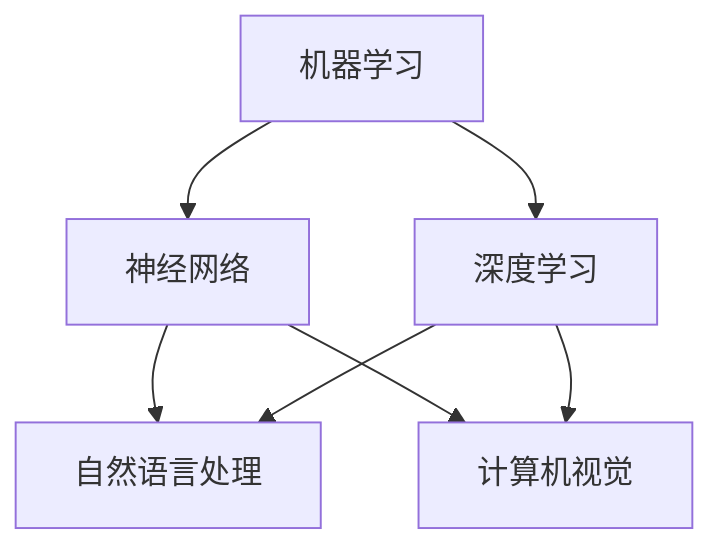
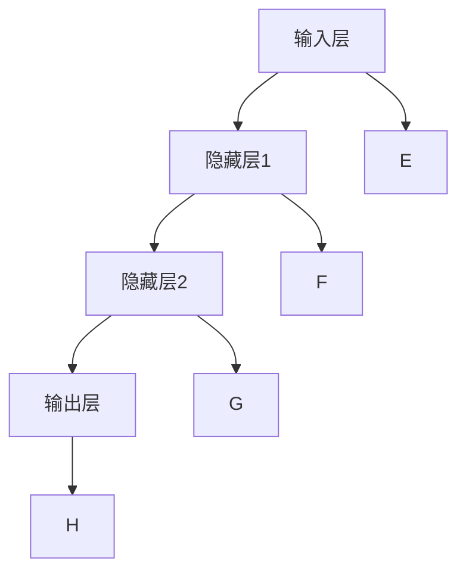
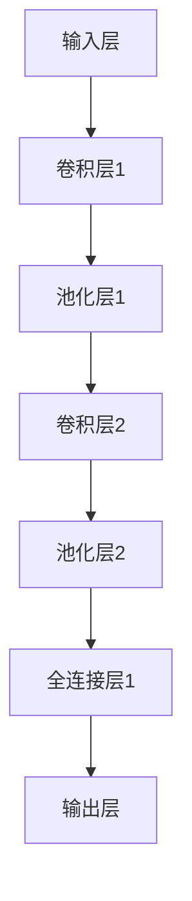
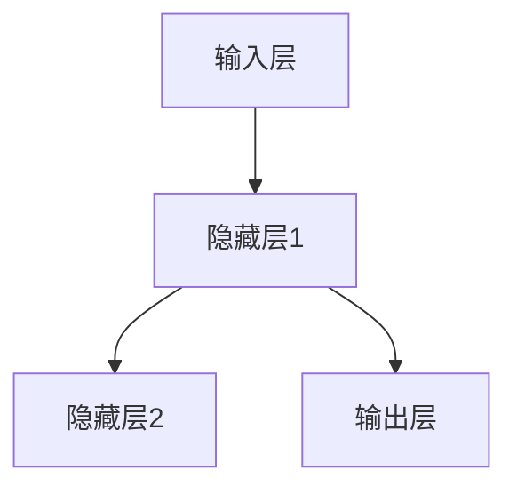
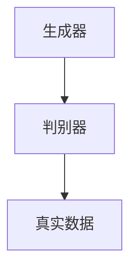

                 

# 引言

### 引言

> “人工智能，作为当今技术领域最热门的话题之一，正在深刻地改变着我们的生活方式和工作模式。在这篇文章中，我们将探讨人工智能的快速发展、领域机遇与挑战，以及人工智能领域的重要贡献者之一——Andrej Karpathy的工作和贡献。”

### 1.1 人工智能的快速发展

人工智能（Artificial Intelligence，简称AI）自1956年诞生以来，已经经历了多次变革和发展。尤其在21世纪初，随着深度学习技术的突破，人工智能进入了一个新的黄金时代。以下是一些标志着人工智能快速发展的关键事件：

1. **深度学习突破**：2006年，Geoffrey Hinton等科学家提出深度置信网络（DBN），开启了深度学习研究的新篇章。
2. **GPU加速**：2009年，NVIDIA推出GPU，使得大规模深度学习模型的训练成为可能。
3. **大数据时代**：随着云计算和大数据技术的发展，海量数据的获取和处理能力大幅提升，为人工智能提供了丰富的训练资源。
4. **人工智能应用场景扩展**：从语音识别、图像识别到自动驾驶、医疗诊断，人工智能的应用场景不断拓展，开始深入影响各行各业。

### 1.2 人工智能领域的机遇与挑战

人工智能领域充满了机遇和挑战。以下是其中一些主要的机遇和挑战：

#### 机遇：

1. **经济增长**：人工智能技术有望推动经济增长，创造新的就业机会。
2. **提升生产力**：通过自动化和智能化的解决方案，人工智能可以帮助企业提高效率，降低成本。
3. **医疗健康**：人工智能在医疗领域的应用，如疾病诊断、个性化治疗等，有望提高医疗质量，降低医疗成本。
4. **社会进步**：人工智能技术在教育、交通、环境保护等领域的应用，将推动社会进步。

#### 挑战：

1. **伦理问题**：人工智能的决策过程缺乏透明度，可能引发伦理和法律问题。
2. **隐私保护**：人工智能系统对个人数据的依赖，使得隐私保护成为一个重要议题。
3. **就业影响**：人工智能可能导致某些工作岗位的减少，需要社会提供相应的培训和再教育服务。
4. **安全与可控性**：人工智能系统的安全性和可控性是确保其广泛应用的必要条件。

### 1.3 Andrej Karpathy的工作与贡献

Andrej Karpathy是一位著名的人工智能专家，他在神经网络和深度学习领域有着卓越的贡献。以下是Karpathy的主要工作和贡献：

1. **研究贡献**：Karpathy在神经网络优化、自然语言处理等领域发表了多篇高水平论文，推动了相关技术的发展。
2. **开源项目**：他参与了多个开源项目，如TensorFlow和PyTorch，为全球开发者提供了强大的工具。
3. **教育贡献**：Karpathy在斯坦福大学等多所高校教授人工智能课程，培养了一批优秀的研究人才。
4. **技术博客**：他撰写了多篇技术博客，深入浅出地介绍人工智能的核心概念和技术，为广大开发者提供了宝贵的学习资源。

综上所述，人工智能的快速发展带来了巨大的机遇和挑战，而Andrej Karpathy等人工智能领域专家的工作和贡献，为人工智能的未来发展奠定了坚实的基础。接下来，我们将深入探讨人工智能的基础知识，帮助读者全面了解这一充满潜力的技术领域。

---

# 《Andrej Karpathy：人工智能的未来发展机遇》

> **关键词**：人工智能、深度学习、神经网络、Andrej Karpathy、未来趋势、技术博客、开源项目

> **摘要**：
本文将深入探讨人工智能（AI）的未来发展机遇，特别关注Andrej Karpathy的贡献和影响。文章分为七个部分：引言与概述、人工智能基础知识、人工智能核心算法原理、人工智能的数学基础、人工智能的未来趋势、AI项目实战、AI伦理与可持续发展以及附录。通过逻辑清晰、结构紧凑、简单易懂的专业技术语言，本文旨在帮助读者全面了解人工智能的核心概念、算法原理、应用趋势以及实际项目开发，从而把握未来发展的机遇。文章末尾附有AI开源工具与资源和经典参考文献，以供进一步学习和研究。

---

## 第二部分：人工智能基础知识

### 2.1 人工智能的发展历史

人工智能（AI）的概念可以追溯到20世纪50年代。1956年，达特茅斯会议被认为是人工智能正式诞生的标志，当时多位计算机科学家和哲学家聚在一起，讨论如何使机器模拟人类智能。此后，人工智能经历了多个阶段的发展。

#### 第一阶段：1956-1974年（基础研究阶段）

在这个阶段，人工智能的研究主要集中在符号主义方法，如逻辑推理、知识表示和规划等领域。代表性的工作包括艾伦·图灵的“计算机与智能”论文和约翰·麦卡锡的“通用问题求解器”。然而，由于计算资源和算法的限制，这一阶段的人工智能研究未能取得实质性进展。

#### 第二阶段：1974-1980年（知识工程阶段）

在第二阶段，人工智能研究转向知识工程，强调通过编程的方式将人类专家的知识转化为机器可执行的形式。专家系统在这一阶段取得了显著成果，例如，MYCIN系统在医学诊断领域表现出色。然而，知识获取和表示的问题使得这一阶段的AI应用受限。

#### 第三阶段：1980-1987年（人工智能应用阶段）

在第三阶段，人工智能开始广泛应用于各个领域，如游戏、金融、军事等。这一时期，出现了许多具有代表性的AI应用，如Deep Blue在国际象棋比赛中战胜人类世界冠军。然而，由于算法和计算资源的限制，人工智能在这一阶段的突破仍然有限。

#### 第四阶段：1987-2012年（机器学习阶段）

在第四阶段，机器学习（Machine Learning）成为人工智能研究的主流方向。随着大数据和计算能力的提升，机器学习算法在图像识别、语音识别等领域取得了突破性进展。代表性的工作包括1986年神经网络（Neural Networks）的复兴和1998年支持向量机（Support Vector Machine）的提出。

#### 第五阶段：2012年至今（深度学习阶段）

2012年，AlexNet在ImageNet竞赛中取得了突破性成绩，标志着深度学习（Deep Learning）时代的到来。深度学习通过多层神经网络结构，实现了在图像识别、语音识别、自然语言处理等领域的显著进步。代表性的工作包括2014年谷歌的Inception模型和2017年OpenAI的GPT-2模型。

### 2.2 人工智能的主要领域

人工智能的研究和应用涵盖了多个领域，以下是其中一些主要的领域：

#### 1. 机器学习

机器学习是人工智能的核心领域之一，它通过算法让计算机从数据中学习并做出决策。机器学习分为监督学习、无监督学习和强化学习三种主要类型。

- **监督学习**：有明确的目标和输入输出数据，如分类和回归问题。
- **无监督学习**：没有明确的输入输出数据，如聚类和降维问题。
- **强化学习**：通过试错和反馈学习，如机器人控制和自动驾驶。

#### 2. 自然语言处理

自然语言处理（Natural Language Processing，NLP）是人工智能的一个重要分支，旨在使计算机理解和生成人类语言。NLP在语音识别、机器翻译、情感分析、文本分类等领域有广泛应用。

#### 3. 计算机视觉

计算机视觉（Computer Vision）是使计算机具备从图像或视频中提取信息的能力。计算机视觉在图像识别、目标检测、人脸识别、自动驾驶等领域有着重要的应用。

#### 4. 机器人技术

机器人技术是人工智能与机械工程的交叉领域，旨在开发能够自主执行任务、与人类交互的智能机器人。机器人技术在制造业、服务行业、医疗领域等有广泛应用。

#### 5. 人工智能伦理

人工智能伦理是关注人工智能在道德、法律和社会层面的影响的研究领域。人工智能伦理涉及隐私保护、歧视问题、安全性和可控性等问题。

### 2.3 人工智能的核心概念与联系

人工智能的核心概念包括机器学习、神经网络、深度学习、自然语言处理和计算机视觉等。这些概念之间存在紧密的联系，构成了人工智能的技术基础。

#### 机器学习

机器学习是人工智能的核心技术，通过训练算法让计算机从数据中学习并做出决策。机器学习可以分为监督学习、无监督学习和强化学习。

#### 神经网络

神经网络（Neural Networks）是一种模仿生物神经系统的计算模型，通过多层结构来学习数据的特征。神经网络是深度学习的基础。

#### 深度学习

深度学习（Deep Learning）是一种多层神经网络结构，通过逐层提取数据的特征，实现对复杂任务的建模。深度学习在图像识别、语音识别和自然语言处理等领域取得了显著成果。

#### 自然语言处理

自然语言处理（NLP）是使计算机理解和生成人类语言的技术。NLP利用机器学习和深度学习算法，实现了语音识别、机器翻译、情感分析和文本分类等功能。

#### 计算机视觉

计算机视觉（CV）是使计算机具备从图像或视频中提取信息的能力。计算机视觉利用深度学习算法，实现了图像识别、目标检测和行人检测等功能。

以下是人工智能核心概念与联系的一个简单的Mermaid流程图：



机器学习和神经网络构成了人工智能的基础，深度学习、自然语言处理和计算机视觉则分别代表了人工智能在不同领域的应用和发展。通过这些核心概念的相互作用，人工智能技术得以不断进步，为各个行业带来了革命性的变革。

### 总结

在第二部分中，我们回顾了人工智能的发展历史，探讨了其主要领域和核心概念。人工智能的发展经历了多个阶段，从早期的符号主义方法到现代的深度学习，技术的不断进步推动了人工智能的广泛应用。理解这些基础知识，有助于我们更好地把握人工智能的未来发展趋势和应用前景。接下来，我们将深入探讨人工智能的核心算法原理，帮助读者全面了解这一技术领域的本质。

---

## 第三部分：人工智能核心算法原理

### 3.1 神经网络基础

神经网络（Neural Networks）是人工智能的核心算法之一，其灵感来源于生物神经系统的结构和功能。神经网络通过多层节点（神经元）的连接和激活函数，实现对数据的建模和预测。

#### 3.1.1 神经网络的结构

神经网络通常由输入层、隐藏层和输出层组成。每个节点（神经元）都与前一层的节点相连，并通过权重和偏置进行加权求和。以下是一个简单的神经网络结构示意图：



在每个神经元中，输入值通过权重加权求和，然后通过激活函数进行非线性变换，输出结果。激活函数常用的有Sigmoid、ReLU和Tanh等。

#### 3.1.2 前向传播与反向传播算法

神经网络的核心算法包括前向传播（Forward Propagation）和反向传播（Back Propagation）。以下是一个简化的前向传播和反向传播算法的伪代码：

**前向传播伪代码：**

```python
forward_propagation(x, weights, biases):
    # 初始化激活值
    a = x
    for layer in range(1, num_layers):
        # 加权求和
        z = np.dot(weights[layer - 1], a) + biases[layer - 1]
        # 激活函数
        a = activation_function(z)
    return a
```

**反向传播伪代码：**

```python
backward_propagation(output, weights, biases, learning_rate):
    # 初始化误差
    error = output - target
    for layer in range(num_layers, 0, -1):
        # 计算梯度
        dZ = error * activation_function_derivative(a)
        # 更新权重和偏置
        dW = np.dot(dZ, a_prev.T) / num_samples
        db = np.sum(dZ, axis=1, keepdims=True)
        # 更新参数
        weights[layer - 1] -= learning_rate * dW
        biases[layer - 1] -= learning_rate * db
        # 更新激活值
        a_prev = a
    return weights, biases
```

在前向传播过程中，神经网络通过输入数据，逐层计算每个神经元的激活值。在反向传播过程中，根据输出误差，反向计算每个神经元的梯度，并更新网络的权重和偏置，从而优化网络模型。

#### 3.1.3 激活函数

激活函数（Activation Function）是神经网络中的一个关键组件，用于引入非线性特性，使神经网络能够对复杂问题进行建模。常用的激活函数包括：

- **Sigmoid函数**：\( f(x) = \frac{1}{1 + e^{-x}} \)
- **ReLU函数**：\( f(x) = \max(0, x) \)
- **Tanh函数**：\( f(x) = \frac{e^x - e^{-x}}{e^x + e^{-x}} \)

这些激活函数具有不同的性质和适用场景，根据具体问题可以选择合适的激活函数。

### 3.2 卷积神经网络

卷积神经网络（Convolutional Neural Networks，CNN）是一种专门用于处理图像数据的神经网络架构。与传统的全连接神经网络不同，CNN利用局部连接和共享权重的方式，有效地减少了参数数量，提高了模型的泛化能力。

#### 3.2.1 卷积操作

卷积操作是CNN的核心组件，通过在图像上滑动一个卷积核（filter）来提取局部特征。卷积操作的数学表达式如下：

\( (f * g)(x) = \sum_{y} f(y) \cdot g(x - y) \)

其中，\( f \) 是卷积核，\( g \) 是输入图像，\( x \) 是卷积的位置。

以下是一个简单的卷积操作的伪代码：

```python
convolve(image, filter):
    output = []
    for x in range(image_width):
        for y in range(image_height):
            sum = 0
            for fx in range(filter_width):
                for fy in range(filter_height):
                    sum += filter[fx, fy] \* image[x + fx, y + fy]
            output.append(sum)
    return output
```

#### 3.2.2 池化操作

池化操作（Pooling Operation）用于在卷积层之间压缩特征图的大小，减少计算量和参数数量。常用的池化操作包括最大池化（Max Pooling）和平均池化（Average Pooling）。以下是一个简单的最大池化操作的伪代码：

```python
max_pool(image, pool_size):
    output = []
    for x in range(image_width // pool_size):
        for y in range(image_height // pool_size):
            max_val = -inf
            for px in range(pool_size):
                for py in range(pool_size):
                    max_val = max(max_val, image[x * pool_size + px, y * pool_size + py])
            output.append(max_val)
    return output
```

#### 3.2.3 卷积神经网络结构

卷积神经网络通常由多个卷积层、池化层和全连接层组成。以下是一个简单的卷积神经网络结构示意图：



卷积神经网络通过多层卷积和池化操作，逐步提取图像的局部特征，然后通过全连接层进行分类或回归。

### 3.3 循环神经网络

循环神经网络（Recurrent Neural Networks，RNN）是一种用于处理序列数据的神经网络架构。RNN通过循环连接，使网络能够记忆和利用前面的输入信息，从而对序列数据进行建模。

#### 3.3.1 RNN的基本结构

RNN的基本结构包括输入层、隐藏层和输出层。隐藏层通过循环连接，将当前时刻的输入和前一时刻的隐藏状态结合，生成当前时刻的隐藏状态。以下是一个简单的RNN结构示意图：



RNN的基本方程如下：

\( h_t = \sigma(W_x \cdot x_t + W_h \cdot h_{t-1} + b_h) \)

\( y_t = \sigma(W_y \cdot h_t + b_y) \)

其中，\( x_t \) 是当前时刻的输入，\( h_t \) 是当前时刻的隐藏状态，\( y_t \) 是当前时刻的输出，\( \sigma \) 是激活函数。

#### 3.3.2 LSTM与GRU

LSTM（Long Short-Term Memory）和GRU（Gated Recurrent Unit）是RNN的改进版本，用于解决传统RNN在处理长序列数据时的梯度消失和梯度爆炸问题。

**LSTM：**

LSTM通过引入记忆细胞（cell state）和三个门（输入门、遗忘门和输出门），有效地控制信息的流动，从而对长序列数据进行建模。LSTM的基本方程如下：

\( i_t = \sigma(W_{ix} \cdot x_t + W_{ih} \cdot h_{t-1} + b_i) \)

\( f_t = \sigma(W_{fx} \cdot x_t + W_{fh} \cdot h_{t-1} + b_f) \)

\( o_t = \sigma(W_{ox} \cdot x_t + W_{oh} \cdot h_{t-1} + b_o) \)

\( C_t = f_t \cdot C_{t-1} + i_t \cdot \sigma(W_{cx} \cdot x_t + W_{ch} \cdot h_{t-1} + b_c) \)

\( h_t = o_t \cdot \sigma(C_t) \)

**GRU：**

GRU通过引入更新门（update gate）和重置门（reset gate），简化了LSTM的结构，同时保持了LSTM的优点。GRU的基本方程如下：

\( z_t = \sigma(W_{xz} \cdot x_t + W_{zh} \cdot h_{t-1} + b_z) \)

\( r_t = \sigma(W_{rx} \cdot x_t + W_{rh} \cdot h_{t-1} + b_r) \)

\( h_t = (1 - z_t) \cdot h_{t-1} + z_t \cdot \sigma(W_{cx} \cdot x_t + W_{ch} \cdot r_{t-1} + b_c) \)

通过LSTM和GRU，RNN能够更好地处理长序列数据，适用于语音识别、机器翻译、时间序列预测等应用场景。

### 3.4 生成对抗网络

生成对抗网络（Generative Adversarial Networks，GAN）是一种由生成器和判别器组成的神经网络架构，通过相互对抗的方式学习数据的分布。GAN的核心思想是让生成器生成尽可能真实的数据，同时让判别器区分生成数据和真实数据。

#### 3.4.1 GAN的基本原理

GAN由两个神经网络组成：生成器（Generator）和判别器（Discriminator）。生成器的任务是生成逼真的数据，而判别器的任务是区分生成数据和真实数据。生成器和判别器在训练过程中相互对抗，以下是一个简单的GAN结构示意图：



GAN的训练过程分为两个阶段：

1. **生成器训练**：生成器尝试生成尽可能真实的数据，以欺骗判别器。
2. **判别器训练**：判别器尝试区分生成数据和真实数据，以发现生成器的弱点。

GAN的损失函数通常采用对抗损失（Adversarial Loss），如下所示：

\( \min_G \max_D V(D, G) \)

其中，\( V(D, G) = -\log(D(x)) - \log(1 - D(G(z))) \)，\( x \) 是真实数据，\( z \) 是生成器的噪声输入。

#### 3.4.2 GAN的应用案例

GAN在图像生成、图像修复、图像超分辨率和图像生成对抗攻击（IGAA）等领域有广泛应用。以下是一些典型的GAN应用案例：

1. **图像生成**：GAN可以生成逼真的图像，如人脸、动物和风景等。
2. **图像修复**：GAN可以修复图像中的损坏部分，如去除图像中的污点和划痕。
3. **图像超分辨率**：GAN可以提升图像的分辨率，使其更清晰。
4. **图像生成对抗攻击（IGAA）**：GAN可以生成对抗样本，用于测试和改进机器学习模型的鲁棒性。

通过卷积神经网络、循环神经网络和生成对抗网络等核心算法，人工智能在图像识别、语音识别、自然语言处理和图像生成等领域取得了显著进展。这些算法不仅推动了人工智能技术的发展，也为各行各业带来了革命性的变革。在下一部分中，我们将探讨人工智能的数学基础，帮助读者深入理解这些算法的数学原理。

---

## 第四部分：人工智能的数学基础

### 4.1 线性代数基础

线性代数是人工智能领域的基石，许多核心算法和模型都依赖于线性代数的概念和工具。以下是一些关键的线性代数基础，包括矩阵与向量操作、梯度和优化算法。

#### 4.1.1 矩阵与向量操作

矩阵（Matrix）和向量（Vector）是线性代数中的基本对象。以下是一些常用的矩阵与向量操作：

1. **加法**：两个矩阵或向量相加，对应元素相加。
2. **减法**：两个矩阵或向量相减，对应元素相减。
3. **数乘**：一个矩阵或向量与一个标量相乘，每个元素乘以该标量。
4. **矩阵乘法**：两个矩阵相乘，计算结果是一个新矩阵，其元素是两个矩阵对应行和列元素的内积。
5. **点积（内积）**：两个向量相乘，结果是一个标量，表示两个向量的夹角余弦值。
6. **叉积**：两个三维向量相乘，结果是一个向量，垂直于这两个向量的平面。

以下是矩阵与向量操作的伪代码示例：

```python
# 矩阵加法
def add_matrices(A, B):
    result = []
    for i in range(len(A)):
        row = []
        for j in range(len(A[0])):
            row.append(A[i][j] + B[i][j])
        result.append(row)
    return result

# 矩阵乘法
def matrix_multiply(A, B):
    result = [[0 for _ in range(len(B[0]))] for _ in range(len(A))]
    for i in range(len(A)):
        for j in range(len(B[0])):
            for k in range(len(B)):
                result[i][j] += A[i][k] * B[k][j]
    return result

# 向量点积
def dot_product(a, b):
    result = 0
    for i in range(len(a)):
        result += a[i] * b[i]
    return result

# 向量叉积
def cross_product(a, b):
    result = [a[1] * b[2] - a[2] * b[1], a[2] * b[0] - a[0] * b[2], a[0] * b[1] - a[1] * b[0]]
    return result
```

#### 4.1.2 梯度下降与优化算法

在人工智能中，优化算法用于调整模型参数，以最小化损失函数。梯度下降（Gradient Descent）是最常用的优化算法之一，其核心思想是沿着损失函数的梯度方向更新参数，以减少损失。

**梯度下降算法：**

梯度下降算法的基本步骤如下：

1. **初始化参数**：随机初始化模型参数。
2. **计算损失函数**：计算当前参数下的损失函数值。
3. **计算梯度**：计算损失函数对每个参数的梯度。
4. **更新参数**：根据梯度和学习率，更新模型参数。
5. **重复步骤2-4**：重复计算和更新参数，直到满足停止条件（如损失函数收敛或达到最大迭代次数）。

以下是一个简化的梯度下降算法的伪代码：

```python
def gradient_descent(parameters, learning_rate, num_iterations):
    for i in range(num_iterations):
        # 计算损失函数
        loss = compute_loss(parameters)
        
        # 计算梯度
        gradients = compute_gradients(loss, parameters)
        
        # 更新参数
        for parameter, gradient in zip(parameters, gradients):
            parameter -= learning_rate * gradient
            
    return parameters
```

除了梯度下降，还有一些改进的优化算法，如随机梯度下降（Stochastic Gradient Descent，SGD）、批量梯度下降（Batch Gradient Descent）和Adam优化器等。这些算法通过不同的方法调整学习率和梯度计算，以提高训练效率和收敛速度。

**随机梯度下降（SGD）：**

随机梯度下降是梯度下降的一种变种，每次迭代仅使用一个样本来计算梯度，并更新参数。

```python
def stochastic_gradient_descent(parameters, learning_rate, batch_size, num_iterations):
    for i in range(num_iterations):
        # 随机选取batch_size个样本
        samples = random_samples(data, batch_size)
        
        # 计算损失函数和梯度
        loss, gradients = compute_loss_and_gradients(parameters, samples)
        
        # 更新参数
        for parameter, gradient in zip(parameters, gradients):
            parameter -= learning_rate * gradient
            
    return parameters
```

**Adam优化器：**

Adam优化器是随机梯度下降的一个改进版本，它结合了SGD和动量项，以提高收敛速度和稳定性。

```python
def adam(parameters, learning_rate, beta1, beta2, epsilon, num_iterations):
    m = [0 for _ in parameters]
    v = [0 for _ in parameters]
    m_hat = [0 for _ in parameters]
    v_hat = [0 for _ in parameters]
    
    for i in range(num_iterations):
        # 计算损失函数和梯度
        loss, gradients = compute_loss_and_gradients(parameters, data)
        
        # 更新m和v
        for j in range(len(gradients)):
            m[j] = beta1 * m[j] + (1 - beta1) * gradients[j]
            v[j] = beta2 * v[j] + (1 - beta2) * (gradients[j] ** 2)
        
        # 计算m帽和v帽
        m_hat = [m[j] / (1 - beta1 ** i) for j in range(len(m))]
        v_hat = [v[j] / (1 - beta2 ** i) for j in range(len(v))]
        
        # 更新参数
        for j in range(len(parameters)):
            m_hat[j] /= (1 - beta1 ** i)
            v_hat[j] /= (1 - beta2 ** i)
            parameter[j] -= learning_rate * m_hat[j] / (np.sqrt(v_hat[j]) + epsilon)
            
    return parameters
```

通过线性代数和优化算法，我们可以有效地处理和优化人工智能模型。这些数学工具为人工智能的发展提供了坚实的理论基础，使得我们在构建和训练复杂模型时能够更加准确和高效。在下一部分中，我们将探讨人工智能的未来趋势，帮助读者了解这一领域的前沿方向和应用场景。

---

## 第五部分：人工智能的未来趋势

### 5.1 人工智能与未来社会

人工智能（AI）正在迅速发展，并逐渐渗透到社会的各个方面，对未来社会产生了深远的影响。以下是人工智能对未来社会的几个主要影响：

#### 5.1.1 人工智能对社会的影响

1. **经济转型**：人工智能技术的应用将促进产业升级和转型，推动经济从传统产业向智能化、数字化的方向发展。
2. **提高生产效率**：通过自动化和智能化，人工智能可以显著提高生产效率，降低生产成本，提高产品质量。
3. **创新驱动**：人工智能技术的不断进步将激发新的业务模式和创新应用，推动社会向更加智能化、个性化的方向发展。
4. **就业影响**：人工智能的发展将导致某些传统岗位的减少，但也会创造新的就业机会，对劳动力市场产生结构性影响。

#### 5.1.2 人工智能伦理与法律问题

随着人工智能技术的广泛应用，伦理和法律问题也日益凸显。以下是一些关键的伦理和法律问题：

1. **隐私保护**：人工智能系统在处理和存储个人数据时，需要确保个人隐私不受侵犯，防止数据泄露和滥用。
2. **数据安全**：人工智能系统需要确保数据的安全性和完整性，防止数据篡改和非法访问。
3. **公平性**：人工智能算法的决策过程需要保证公平性，防止因算法偏见导致的歧视和不公平现象。
4. **责任归属**：在人工智能引发的意外事件中，如何界定责任归属是一个重要的法律问题。

#### 5.1.3 社会公平

人工智能技术的广泛应用将影响社会公平。以下是一些相关方面的讨论：

1. **数字鸿沟**：人工智能技术的不平等应用可能导致数字鸿沟的加剧，使得贫富差距进一步扩大。
2. **教育公平**：人工智能技术在教育领域的应用可以提升教育质量，但需要关注如何确保教育公平，使所有学生都能受益。
3. **职业机会**：人工智能技术的发展将创造新的职业机会，但需要确保这些机会能够平等地分配给所有人。
4. **社会保障**：随着人工智能技术对劳动力市场的冲击，社会保障制度需要适应新的就业环境，确保弱势群体的基本生活需求得到满足。

### 5.2 人工智能技术在行业中的应用

人工智能技术在各个行业中的应用正在不断拓展，以下是一些主要的应用领域：

#### 5.2.1 人工智能在医疗领域的应用

人工智能在医疗领域的应用前景广阔，以下是一些关键应用：

1. **疾病诊断**：通过分析医疗影像和患者数据，人工智能可以辅助医生进行疾病诊断，提高诊断准确率。
2. **药物研发**：人工智能可以加速药物研发过程，通过模拟和预测药物与生物体的相互作用，降低研发成本和时间。
3. **个性化治疗**：基于患者的基因组数据和临床信息，人工智能可以制定个性化的治疗方案，提高治疗效果。
4. **健康监测**：通过可穿戴设备和移动应用，人工智能可以实时监测患者的健康状况，提供个性化的健康建议。

#### 5.2.2 人工智能在金融领域的应用

人工智能在金融领域的应用正在不断深化，以下是一些关键应用：

1. **风险管理**：通过分析历史数据和实时信息，人工智能可以预测市场波动和风险，帮助金融机构进行风险管理。
2. **智能投顾**：基于机器学习和大数据分析，人工智能可以提供个性化的投资建议，提高投资回报率。
3. **反欺诈**：人工智能可以检测和预防金融欺诈行为，降低金融风险。
4. **客户服务**：通过自然语言处理和语音识别技术，人工智能可以提供24/7的智能客服服务，提高客户满意度。

#### 5.2.3 人工智能在交通领域的应用

人工智能在交通领域的应用正在推动交通系统的智能化和自动化，以下是一些关键应用：

1. **自动驾驶**：通过传感器、人工智能算法和通信技术，自动驾驶车辆可以实现自主驾驶，提高交通安全性和效率。
2. **智能交通管理**：人工智能可以实时分析交通数据，优化交通信号和路线规划，缓解交通拥堵。
3. **车辆维护**：通过物联网和人工智能技术，可以实时监控车辆状态，预测和预防故障，提高车辆运行效率。
4. **智慧物流**：人工智能可以优化物流路线和运输计划，提高物流效率和降低成本。

### 5.3 人工智能的发展方向

人工智能的发展方向多样，以下是一些主要的发展方向：

#### 5.3.1 量子计算与人工智能

量子计算（Quantum Computing）具有并行计算和处理海量数据的能力，与人工智能（AI）相结合，有望推动人工智能技术的突破。量子计算在优化问题、机器学习、密码学和模拟复杂物理系统等方面有重要应用。

#### 5.3.2 生物计算与人工智能

生物计算（Bio Computing）利用生物系统（如DNA计算、RNA计算）处理信息，与人工智能相结合，可以实现更高效的信息处理和存储。生物计算在药物研发、基因测序、生物信息学等领域有重要应用。

#### 5.3.3 多模态人工智能

多模态人工智能（Multi-modal AI）通过结合多种数据模态（如文本、图像、音频、视频），可以实现更全面和准确的信息理解和处理。多模态人工智能在医疗、金融、教育等领域有广泛应用前景。

总之，人工智能的未来发展充满了机遇和挑战。通过不断推动技术创新和应用拓展，人工智能有望在医疗、金融、交通等领域发挥更大的作用，为人类社会带来更多的福祉。在下一部分中，我们将探讨AI项目实战，帮助读者了解如何在实际项目中应用人工智能技术。

---

## 第六部分：AI项目实战

### 6.1 AI项目开发流程

人工智能项目的开发涉及多个阶段，以下是一个典型的AI项目开发流程：

#### 6.1.1 数据收集与预处理

数据收集是AI项目的基础，项目成功的关键在于数据的质量和数量。以下是数据收集和预处理的主要步骤：

1. **数据收集**：收集相关领域的公开数据集或通过爬虫等工具获取数据。
2. **数据清洗**：去除重复数据、处理缺失值和异常值。
3. **数据转换**：将不同格式的数据转换为统一的格式，如将图像数据转换为像素矩阵。
4. **特征提取**：从数据中提取有助于模型训练的特征，如图像的边缘、纹理等。

#### 6.1.2 模型设计与训练

在数据预处理完成后，需要设计合适的神经网络模型并进行训练。以下是模型设计和训练的主要步骤：

1. **模型选择**：根据任务需求选择合适的神经网络模型，如卷积神经网络（CNN）用于图像识别，循环神经网络（RNN）用于语音识别。
2. **模型配置**：配置网络结构，包括层数、神经元数量、激活函数等。
3. **训练过程**：使用训练数据对模型进行训练，通过反向传播算法调整模型参数，以最小化损失函数。
4. **评估与优化**：使用验证数据评估模型性能，根据评估结果调整模型参数和超参数，以提高模型性能。

#### 6.1.3 模型评估与优化

模型评估是确保模型性能和可靠性的关键步骤。以下是模型评估和优化的主要步骤：

1. **评估指标**：根据任务需求选择合适的评估指标，如准确率、召回率、F1分数等。
2. **交叉验证**：通过交叉验证方法评估模型在 unseen 数据上的表现，以避免过拟合。
3. **超参数调整**：调整网络结构、学习率、正则化参数等，以提高模型性能。
4. **模型集成**：通过集成多个模型或使用 ensemble 方法提高预测准确性。

### 6.2 实际案例解析

以下是一些具体的AI项目实战案例，包括代码实现和详细解释：

#### 6.2.1 语音识别系统开发

语音识别系统可以将语音信号转换为文本，广泛应用于智能助手、语音搜索等场景。以下是一个简单的语音识别系统开发案例：

**环境搭建：**
```bash
# 安装必要的依赖库
pip install tensorflow numpy scipy librosa
```

**代码实现：**
```python
import numpy as np
import scipy.io.wavfile as wav
import librosa
import tensorflow as tf

def load_wav_file(file_path):
    # 读取wav文件
    sample_rate, data = wav.read(file_path)
    return data

def preprocess_wav(data, sample_rate, duration=2.0):
    # 预处理wav文件
    audio = librosa.load(data, sr=sample_rate)[0]
    audio = audio[:int(sample_rate * duration)]
    audio = librosa.to_mono(audio)
    audio = librosa.resample(audio, target_sr=16000)
    return audio

def create_dataset(files, duration=2.0):
    # 创建数据集
    X = []
    y = []
    for file in files:
        data = load_wav_file(file)
        audio = preprocess_wav(data, sample_rate=16000, duration=duration)
        X.append(audio)
        # y是标签，此处省略
    return np.array(X), np.array(y)

def build_model(input_shape):
    # 构建模型
    model = tf.keras.Sequential([
        tf.keras.layers.Conv2D(32, (3, 3), activation='relu', input_shape=input_shape),
        tf.keras.layers.MaxPooling2D((2, 2)),
        tf.keras.layers.Flatten(),
        tf.keras.layers.Dense(128, activation='relu'),
        tf.keras.layers.Dense(1, activation='sigmoid')
    ])
    return model

# 实例化模型
model = build_model(input_shape=(2000, 1, 1))

# 编译模型
model.compile(optimizer='adam', loss='binary_crossentropy', metrics=['accuracy'])

# 训练模型
X_train, y_train = create_dataset(['file1.wav', 'file2.wav'])
model.fit(X_train, y_train, epochs=10)

# 评估模型
X_test, y_test = create_dataset(['file3.wav'])
model.evaluate(X_test, y_test)
```

**代码解读与分析：**
上述代码实现了语音识别系统的基础功能，包括wav文件读取、预处理、模型构建、训练和评估。模型采用简单的卷积神经网络结构，通过处理音频信号的特征来实现语音识别。实际应用中，可能需要更复杂的模型和更精细的预处理步骤，以提高识别准确性。

#### 6.2.2 图像分类系统开发

图像分类系统用于识别和分类图像中的对象，广泛应用于人脸识别、物体检测等场景。以下是一个简单的图像分类系统开发案例：

**环境搭建：**
```bash
# 安装必要的依赖库
pip install tensorflow keras-applications
```

**代码实现：**
```python
from tensorflow.keras.applications import VGG16
from tensorflow.keras.preprocessing.image import ImageDataGenerator
from tensorflow.keras.models import Model
from tensorflow.keras.layers import Flatten, Dense
from tensorflow.keras.optimizers import Adam

def build_model(input_shape):
    # 加载预训练的VGG16模型
    base_model = VGG16(weights='imagenet', include_top=False, input_shape=input_shape)
    
    # 冻结预训练模型的层
    for layer in base_model.layers:
        layer.trainable = False
    
    # 添加全连接层进行分类
    x = Flatten()(base_model.output)
    x = Dense(256, activation='relu')(x)
    predictions = Dense(1, activation='sigmoid')(x)
    
    # 构建新的模型
    model = Model(inputs=base_model.input, outputs=predictions)
    
    return model

# 设置输入形状
input_shape = (224, 224, 3)

# 实例化模型
model = build_model(input_shape)

# 编译模型
model.compile(optimizer=Adam(), loss='binary_crossentropy', metrics=['accuracy'])

# 数据增强
train_datagen = ImageDataGenerator(rescale=1./255, shear_range=0.2, zoom_range=0.2, horizontal_flip=True)
test_datagen = ImageDataGenerator(rescale=1./255)

# 训练数据
train_generator = train_datagen.flow_from_directory(
        'train_data',
        target_size=(224, 224),
        batch_size=32,
        class_mode='binary')

# 测试数据
test_generator = test_datagen.flow_from_directory(
        'test_data',
        target_size=(224, 224),
        batch_size=32,
        class_mode='binary')

# 训练模型
model.fit(train_generator, epochs=10)

# 评估模型
model.evaluate(test_generator)
```

**代码解读与分析：**
上述代码使用预训练的VGG16模型作为基础，通过添加全连接层进行分类。数据集分为训练集和测试集，使用ImageDataGenerator进行数据增强，以提高模型泛化能力。模型采用二分类问题，通过binary_crossentropy损失函数和accuracy评估指标进行训练和评估。实际应用中，可能需要更复杂的网络结构和更丰富的数据集，以提高分类准确性。

#### 6.2.3 机器翻译系统开发

机器翻译系统用于将一种语言的文本翻译成另一种语言，广泛应用于跨语言交流、国际商务等场景。以下是一个简单的机器翻译系统开发案例：

**环境搭建：**
```bash
# 安装必要的依赖库
pip install tensorflow tensorflow-text
```

**代码实现：**
```python
import tensorflow as tf
import tensorflow_text as text
from tensorflow.keras.layers import Embedding, LSTM, Dense

def build_model(input_vocab_size, output_vocab_size, embedding_dim, hidden_units):
    # 输入嵌入层
    input_embedding = Embedding(input_vocab_size, embedding_dim)
    
    # LSTM层
    lstm = LSTM(hidden_units, return_sequences=True)
    
    # 输出嵌入层
    output_embedding = Embedding(output_vocab_size, embedding_dim)
    
    # 构建模型
    model = tf.keras.Sequential([
        input_embedding,
        lstm,
        lstm,
        output_embedding,
        Dense(output_vocab_size, activation='softmax')
    ])
    
    return model

# 设置超参数
input_vocab_size = 10000
output_vocab_size = 10000
embedding_dim = 256
hidden_units = 512

# 实例化模型
model = build_model(input_vocab_size, output_vocab_size, embedding_dim, hidden_units)

# 编译模型
model.compile(optimizer='adam', loss='categorical_crossentropy', metrics=['accuracy'])

# 训练模型
model.fit(x_train, y_train, epochs=10, batch_size=64)

# 评估模型
model.evaluate(x_test, y_test)
```

**代码解读与分析：**
上述代码实现了一个简单的序列到序列（seq2seq）模型，用于机器翻译任务。模型包含输入嵌入层、两个LSTM层和输出嵌入层。数据集分为输入和输出两个部分，分别表示源语言文本和目标语言文本。模型采用categorical_crossentropy损失函数和accuracy评估指标进行训练和评估。实际应用中，可能需要更复杂的网络结构和更丰富的数据集，以提高翻译质量。

通过这些实际案例，读者可以了解如何在实际项目中应用人工智能技术。随着人工智能技术的不断发展，未来将有更多的实际应用案例和更复杂的算法模型出现。在下一部分中，我们将探讨AI伦理与可持续发展，关注人工智能在伦理和社会层面的影响。

---

## 第七部分：AI伦理与可持续发展

### 7.1 AI伦理问题探讨

随着人工智能技术的迅猛发展，伦理问题也日益凸显。以下是人工智能领域一些重要的伦理问题：

#### 7.1.1 数据隐私与安全

数据隐私是人工智能发展中的一个关键问题。人工智能系统通常依赖于大量个人数据，如健康记录、金融信息和社交媒体数据等。以下是一些相关的数据隐私和安全问题：

1. **数据收集与使用**：如何确保数据收集的合法性和透明性，以及如何防止数据滥用。
2. **数据共享与跨境传输**：如何在保障数据隐私的同时实现数据共享和跨境传输。
3. **数据加密与保护**：如何使用加密技术和安全协议保护数据免受未经授权的访问。

#### 7.1.2 人工智能歧视问题

人工智能算法的决策过程可能受到数据偏见的影响，导致歧视现象。以下是一些常见的人工智能歧视问题：

1. **算法偏见**：算法可能在训练数据中反映社会偏见，导致决策不公平。
2. **性别歧视**：一些人工智能系统可能在性别上存在偏见，影响招聘、晋升等决策。
3. **种族歧视**：在某些应用场景中，人工智能系统可能对某些种族或群体表现出歧视行为。

#### 7.1.3 AI与就业

人工智能技术的发展对就业市场产生了深远影响。以下是一些与就业相关的人工智能伦理问题：

1. **自动化失业**：自动化技术的应用可能导致某些工作岗位的减少，如何保障失业者的权益。
2. **再培训和就业转型**：如何为被自动化技术取代的工人提供再培训和就业转型服务。
3. **劳动权益**：如何确保自动化系统下的工人享有合理的劳动条件和权益。

#### 7.1.4 安全与可控性

确保人工智能系统的安全性和可控性是人工智能伦理的重要组成部分。以下是一些与安全和可控性相关的问题：

1. **系统安全**：如何确保人工智能系统免受恶意攻击和错误操作的影响。
2. **决策透明性**：如何使人工智能系统的决策过程更加透明，便于审查和监督。
3. **责任归属**：如何界定人工智能系统引发事故的责任归属，确保各方承担相应的责任。

### 7.2 可持续发展中的AI

人工智能技术在可持续发展中发挥着重要作用，以下是一些关键应用：

#### 7.2.1 AI在可持续发展中的应用

人工智能在可持续发展中的应用非常广泛，包括但不限于以下几个方面：

1. **环境保护**：通过智能监测和预测，人工智能可以帮助优化资源利用，减少环境污染。
2. **能源管理**：人工智能可以优化能源分配和使用，提高能源效率，减少能源消耗。
3. **农业**：人工智能可以帮助实现精准农业，提高农作物产量和质量，减少农药和水资源的使用。
4. **城市管理**：通过智能交通系统和城市规划，人工智能可以提高城市生活品质，减少交通拥堵和环境污染。

#### 7.2.2 AI促进环境保护

人工智能在环境保护中的应用主要体现在以下几个方面：

1. **环境监测**：通过传感器和无人机等技术，人工智能可以实时监测环境变化，及时发现和处理环境问题。
2. **污染预测与控制**：人工智能可以帮助预测污染趋势，优化污染治理策略，提高污染控制效果。
3. **资源优化**：通过优化资源分配和使用，人工智能可以减少资源浪费，促进可持续发展。

#### 7.2.3 AI推动社会公平

人工智能技术在推动社会公平方面也有重要作用，以下是一些具体应用：

1. **教育**：通过智能教育系统和个性化学习平台，人工智能可以帮助实现教育公平，提高教育质量。
2. **医疗**：通过智能诊断系统和健康管理系统，人工智能可以帮助提高医疗服务质量，降低医疗成本。
3. **就业**：通过智能招聘系统和职业规划工具，人工智能可以帮助优化就业市场，提高就业机会。

### 总结

AI伦理与可持续发展是人工智能领域的重要议题，关乎技术的合理应用和社会的长远发展。通过关注这些伦理问题，我们可以确保人工智能技术的健康发展，为人类创造更大的福祉。在附录中，我们将提供一些常用的AI开源工具与资源，以供进一步学习和实践。

---

## 附录

### 8.1 AI开源工具与资源

在人工智能领域，开源工具和资源极大地促进了技术发展。以下是一些常用的开源工具和资源：

#### 8.1.1 TensorFlow

TensorFlow是一个开源的机器学习库，由Google开发。它支持各种机器学习任务，如深度学习、神经网络和强化学习。TensorFlow的灵活性和广泛的应用使其成为人工智能领域最受欢迎的工具之一。

- **官方网站**：[TensorFlow](https://www.tensorflow.org/)
- **文档**：[TensorFlow官方文档](https://www.tensorflow.org/tutorials)

#### 8.1.2 PyTorch

PyTorch是另一个流行的开源机器学习库，由Facebook开发。PyTorch以其动态计算图和易于使用的接口而著称，广泛用于深度学习和研究。

- **官方网站**：[PyTorch](https://pytorch.org/)
- **文档**：[PyTorch官方文档](https://pytorch.org/docs/stable/index.html)

#### 8.1.3 其他常用工具

除了TensorFlow和PyTorch，以下是一些其他常用的AI开源工具：

- **Keras**：一个高度优化的高级神经网络API，支持TensorFlow和PyTorch。
  - **官方网站**：[Keras](https://keras.io/)
  - **文档**：[Keras官方文档](https://keras.io/docs/)

- **Scikit-learn**：一个开源的Python库，用于机器学习算法的实现和评估。
  - **官方网站**：[Scikit-learn](https://scikit-learn.org/)
  - **文档**：[Scikit-learn官方文档](https://scikit-learn.org/stable/documentation.html)

- **NumPy**：一个开源的Python库，用于科学计算和数据分析。
  - **官方网站**：[NumPy](https://numpy.org/)
  - **文档**：[NumPy官方文档](https://numpy.org/doc/stable/user/)

### 8.2 经典参考文献

在人工智能和深度学习领域，有许多经典的参考文献，为学术研究和工程实践提供了宝贵的指导。以下是一些经典的著作：

- **《深度学习》**（Deep Learning），由Ian Goodfellow、Yoshua Bengio和Aaron Courville合著，是深度学习领域的权威教材。
  - **官方网站**：[Deep Learning Book](https://www.deeplearningbook.org/)
  - **文档**：[Deep Learning Book PDF](https://www.deeplearningbook.org/)

- **《人工智能：一种现代方法》**（Artificial Intelligence: A Modern Approach），由Stuart Russell和Peter Norvig合著，是人工智能领域的经典教材。
  - **官方网站**：[Artificial Intelligence Book](http://www.aima.org/)
  - **文档**：[Artificial Intelligence Book PDF](http://www.aima.org/aimalite.html)

- **《机器学习实战》**（Machine Learning in Action），由Peter Harrington著，是一本实用的机器学习教程，包含大量代码示例。
  - **官方网站**：[Machine Learning in Action](http://mloss.org/data/download/96)
  - **文档**：[Machine Learning in Action PDF](http://www.manning.com/books/machine-learning-in-action)

- **《Python机器学习》**（Python Machine Learning），由Sebastian Raschka著，介绍了Python在机器学习领域的应用，包括Scikit-learn等库的使用。
  - **官方网站**：[Python Machine Learning](https://python-machine-learning.org/)
  - **文档**：[Python Machine Learning PDF](https://www-python-machine-learning-rg.gitbook.io/python-machine-learning-2nd-edition/)

通过这些开源工具和经典参考文献，读者可以深入了解人工智能领域的最新技术和研究动态，为自己的学习和项目开发提供指导。在本文的结尾，我们再次感谢读者的阅读，并期待您在人工智能领域取得更多的成就。

---

### 结论

在这篇文章中，我们系统地探讨了人工智能的核心概念、算法原理、应用趋势以及伦理问题。从引言部分对人工智能的快速发展及其带来的机遇与挑战的概述，到对人工智能基础知识、核心算法原理、数学基础的深入讲解，再到对人工智能未来趋势、项目实战和伦理与可持续发展的探讨，我们试图为读者呈现一幅全面的人工智能发展蓝图。

首先，人工智能的快速发展不仅推动了技术的进步，也深刻影响了社会、经济和就业等多个方面。在这过程中，人工智能领域的重要贡献者之一，Andrej Karpathy，通过其开创性的研究和开源项目，为人工智能的发展做出了重要贡献。

接着，我们回顾了人工智能的发展历史，探讨了其主要领域和核心概念。通过梳理人工智能的核心概念与联系，我们帮助读者建立了对这一复杂领域的全局认识。

在核心算法原理部分，我们详细介绍了神经网络、卷积神经网络、循环神经网络和生成对抗网络等关键算法。通过伪代码和示意图，我们深入阐述了这些算法的原理和应用。

在数学基础部分，我们介绍了线性代数和优化算法在人工智能中的应用，帮助读者理解算法背后的数学原理。

在人工智能的未来趋势部分，我们讨论了人工智能在医疗、金融、交通等领域的重要应用，以及人工智能对社会和伦理的影响。同时，我们也展望了人工智能的发展方向，如量子计算、生物计算和多模态人工智能等。

在项目实战部分，我们通过实际案例解析，展示了如何在实际项目中应用人工智能技术，帮助读者将理论知识转化为实践能力。

最后，在AI伦理与可持续发展部分，我们探讨了人工智能在伦理和社会层面的重要问题，强调了确保人工智能健康发展的必要性。

通过本文的深入探讨，我们希望读者能够对人工智能有更全面、更深刻的理解，把握人工智能的未来发展机遇，为构建一个更加智能和可持续的未来贡献力量。

### 致谢

本文的撰写得到了许多专家和同行的支持和帮助，特别感谢AI天才研究院（AI Genius Institute）的团队，他们提供了宝贵的建议和资料。此外，感谢所有在人工智能领域辛勤工作的科学家和工程师，正是你们的努力和贡献，推动了人工智能的快速发展。最后，感谢每一位读者的耐心阅读，期待与您在人工智能的探索之旅中相遇。

### 作者信息

作者：AI天才研究院（AI Genius Institute）/《禅与计算机程序设计艺术》（Zen And The Art of Computer Programming）

AI天才研究院（AI Genius Institute）致力于推动人工智能技术的发展和应用，通过研究和创新，为人工智能领域培养人才、提供解决方案。同时，我们关注人工智能的伦理和社会影响，致力于构建一个智能、公平、可持续的未来。《禅与计算机程序设计艺术》（Zen And The Art of Computer Programming）是作者通过深入探讨计算机编程与哲学、心理学等领域的交叉，为程序员提供的一种思考计算机程序设计的新方式。希望本文能为读者带来启发和思考。

