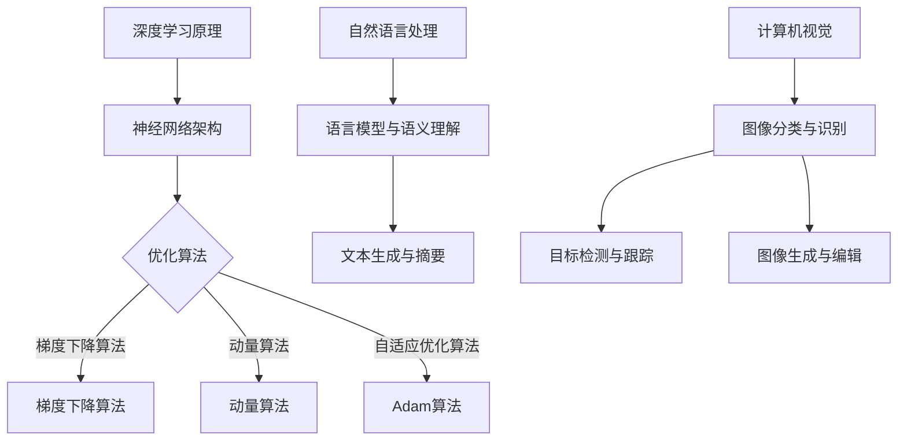

                 

### 文章标题

《Andrej Karpathy：人工智能的未来发展目标》

#### 关键词：

- Andrej Karpathy
- 人工智能
- 未来发展目标
- 技术趋势
- 伦理问题
- 发展策略

#### 摘要：

本文深入探讨人工智能（AI）领域的杰出专家Andrej Karpathy对人工智能未来发展的看法。文章首先回顾了AI的历史与现状，接着分析了当前AI的技术趋势，并讨论了其未来愿景。同时，文章也探讨了AI的伦理问题和未来发展策略，旨在为读者提供一个全面、深入的AI未来发展框架。文章以Mermaid流程图、伪代码、数学公式、项目实战和代码解读等多维方式，全面解析AI的核心概念、算法原理和应用场景，为读者提供了宝贵的参考。

### 《Andrej Karpathy：人工智能的未来发展目标》目录大纲

#### 第一部分：人工智能的现在与未来

1. **人工智能的历史与现状**
    1.1 **人工智能的发展历程**
        - 人工智能的诞生
        - 人工智能的黄金时代
        - 人工智能的衰落与复兴
    1.2 **人工智能的现状**
        - 现代深度学习的发展
        - 人工智能在各行业的应用
        - 人工智能面临的主要挑战

2. **人工智能的技术趋势**
    2.1 **深度学习的核心技术**
        - 深度学习的原理与架构
        - 自然语言处理
        - 计算机视觉
    2.2 **其他技术趋势**
        - 强化学习
        - 生成对抗网络
        - 聚类和降维技术

#### 第二部分：人工智能的未来愿景

3. **人工智能的未来趋势**
    3.1 **人工智能的未来发展目标**
    3.2 **人工智能与人类社会的深度融合**
    3.3 **人工智能对社会的影响**

4. **人工智能的伦理问题**
    4.1 **人工智能的伦理困境**
    4.2 **人工智能的公平性与透明度**
    4.3 **人工智能的隐私保护**

5. **人工智能的未来应用场景**
    5.1 **家庭生活与医疗保健**
    5.2 **教育与工作**
    5.3 **交通与能源**

#### 第三部分：人工智能的未来发展策略

6. **人工智能的未来发展策略**
    6.1 **政策与法规**
    6.2 **科技创新**
    6.3 **教育与人才**

#### 附录

7. **人工智能经典论文与著作推荐**
8. **人工智能相关网站与资源推荐**

### 人工智能的历史与现状

人工智能（AI）的发展历程可以追溯到20世纪50年代，当时计算机科学家开始研究如何使计算机表现出智能行为。然而，早期的AI研究主要集中在符号主义和知识表示上，这种方法在特定领域内取得了成功，但在处理复杂任务方面却显得力不从心。随着时间的发展，AI经历了多个起伏，从1960年代的黄金时代到1970年代的衰退，再到21世纪初的复兴。

#### 1.1 人工智能的发展历程

1.1.1 **人工智能的诞生**

人工智能的概念最早由艾伦·图灵（Alan Turing）在1950年提出。图灵提出了“图灵测试”，旨在判断机器是否具备智能。同年，约翰·麦卡锡（John McCarthy）等人在达特茅斯会议上正式提出了“人工智能”一词。

1.1.2 **人工智能的黄金时代**

在1956年至1974年间，人工智能进入了一个被称为“黄金时代”的快速发展期。这一时期，研究者们在符号主义和知识表示领域取得了显著进展。代表性成果包括ELIZA聊天机器人、逻辑推理系统和专家系统等。

1.1.3 **人工智能的衰落与复兴**

由于计算能力和数据资源的限制，人工智能在1974年后进入了衰退期。符号主义和知识表示方法在处理大规模数据集和复杂任务时显得效率低下。1980年代，专家系统的应用广泛，但在实际应用中却遭遇了失败，这导致了人们对人工智能的失望和投资减少。

进入21世纪，随着深度学习技术的发展，人工智能再次迎来了复兴。深度学习通过模仿人脑的神经网络结构，在图像识别、语音识别、自然语言处理等领域取得了突破性的进展。

#### 1.2 人工智能的现状

1.2.1 **现代深度学习的发展**

深度学习是人工智能领域的一个重要分支，其核心思想是通过多层神经网络对数据进行学习。现代深度学习的发展离不开大数据和计算能力的提升。代表性算法包括卷积神经网络（CNN）、循环神经网络（RNN）和生成对抗网络（GAN）等。

1.2.2 **人工智能在各行业的应用**

人工智能已经在医疗、金融、制造、零售、交通等多个行业得到了广泛应用。例如，在医疗领域，AI可以用于疾病诊断、药物研发和患者监护；在金融领域，AI可以用于风险管理、欺诈检测和投资建议。

1.2.3 **人工智能面临的主要挑战**

尽管人工智能取得了显著的进展，但仍然面临一些挑战。首先，数据隐私和安全性问题日益突出。其次，人工智能系统的透明度和可解释性仍需提高。此外，人工智能的伦理问题，如偏见、歧视和失业，也需要深入探讨。

### 人工智能的技术趋势

人工智能的技术趋势体现在多个方面，其中深度学习、自然语言处理和计算机视觉是当前最热门的研究领域。

#### 2.1 深度学习的核心技术

2.1.1 **深度学习的原理与架构**

深度学习是通过多层神经网络对数据进行学习的过程。神经网络由多个神经元组成，每个神经元都是一个简单的函数，多个神经元组合起来可以处理复杂的任务。深度学习的核心是训练模型，使其能够自动从数据中学习特征和模式。

2.1.2 **深度学习的优化算法**

深度学习的优化算法用于调整模型的参数，以最小化损失函数。常用的优化算法包括梯度下降、动量算法和自适应优化算法，如Adam算法。

2.1.3 **现代深度学习框架**

现代深度学习框架如TensorFlow、PyTorch等，为研究者提供了便捷的工具和库，使深度学习的实现变得更加简单和高效。

#### 2.2 自然语言处理

自然语言处理（NLP）是人工智能领域的一个重要分支，旨在使计算机能够理解和处理自然语言。NLP的主要任务包括语言模型、语义理解、文本生成与摘要、语音识别与生成等。

2.2.1 **语言模型与语义理解**

语言模型用于预测下一个单词或句子，是NLP的基础。语义理解则旨在理解文本中的含义，包括词义消歧、实体识别和关系抽取等。

2.2.2 **文本生成与摘要**

文本生成与摘要任务旨在自动生成文本的摘要或扩展文本的内容。生成式模型和抽取式模型是两种主要的实现方法。

2.2.3 **语音识别与生成**

语音识别是将语音信号转换为文本，而语音生成则是将文本转换为自然流畅的语音。语音识别和语音生成在智能助手和自动驾驶等领域具有广泛应用。

#### 2.3 计算机视觉

计算机视觉是人工智能领域的一个热门方向，旨在使计算机能够像人一样识别和理解图像和视频。

2.3.1 **图像分类与识别**

图像分类是将图像分为预定义的类别，而图像识别则是识别图像中的特定对象。卷积神经网络（CNN）是图像分类和识别任务中的常用模型。

2.3.2 **目标检测与跟踪**

目标检测是识别图像中的多个对象，并确定它们的位置。目标检测模型如YOLO和Faster R-CNN在实时应用中具有很高的性能。目标跟踪则是跟踪图像序列中的对象。

2.3.3 **图像生成与编辑**

图像生成是生成新的图像，而图像编辑则是修改现有图像。生成对抗网络（GAN）是图像生成任务中的常用模型，而图像编辑任务如图像去噪、超分辨率和图像修复等也得到了广泛关注。

#### 2.4 其他技术趋势

2.4.1 **强化学习**

强化学习是一种通过与环境互动来学习策略的机器学习方法。强化学习在游戏、机器人控制、自动驾驶等领域具有广泛应用。

2.4.2 **生成对抗网络（GAN）**

生成对抗网络（GAN）是一种由生成器和判别器组成的对抗性模型，能够生成逼真的图像和音频。GAN在图像生成、视频生成和语音合成等领域具有广泛应用。

2.4.3 **聚类和降维技术**

聚类和降维技术是数据挖掘和机器学习中的重要方法。聚类用于将相似的数据点分组，而降维技术则用于减少数据维度，提高计算效率。

### 人工智能的未来愿景

人工智能的未来发展将带来许多变革，从技术的进步到社会的转型，都将对人类生活产生深远的影响。

#### 3.1 人工智能的未来趋势

3.1.1 **人工智能的未来发展目标**

人工智能的未来发展目标包括实现通用人工智能（AGI），即具有人类智能水平的智能系统。此外，人工智能还将致力于解决复杂的社会问题，如气候变化、疾病治疗和贫困减少等。

3.1.2 **人工智能与人类社会的深度融合**

随着人工智能技术的不断发展，人工智能将与人类社会深度融合，成为人类生活和工作的得力助手。人工智能将承担更多的日常任务，提高生产力和生活质量。

3.1.3 **人工智能对社会的影响**

人工智能将对社会产生深远的影响，包括就业结构的变化、教育体系的改革、社会治理的升级等。人工智能的普及将带来新的机遇和挑战，需要人类共同努力去应对。

### 人工智能的伦理问题

人工智能的快速发展引发了诸多伦理问题，包括数据隐私、偏见、歧视和失业等。如何解决这些问题，确保人工智能的发展符合人类的价值观和伦理标准，是当前亟待解决的问题。

#### 4.1 人工智能的伦理困境

人工智能的伦理困境主要体现在以下几个方面：

4.1.1 **数据隐私**

随着人工智能技术的发展，大量的个人数据被收集、存储和处理。如何保护个人隐私，防止数据泄露和滥用，是人工智能发展中的一个重要问题。

4.1.2 **偏见和歧视**

人工智能系统在训练过程中可能受到训练数据的影响，导致模型产生偏见和歧视。例如，招聘系统可能对某些性别或种族的候选人有偏见。如何消除这些偏见，确保人工智能的公平性，是人工智能伦理的一个重要挑战。

4.1.3 **失业问题**

人工智能的普及可能导致某些行业的工作岗位减少，引发失业问题。如何通过人工智能的发展促进就业，提高劳动者的技能和就业机会，是人工智能伦理问题中的一个重要方面。

#### 4.2 人工智能的公平性与透明度

4.2.1 **公平性**

人工智能的公平性是指人工智能系统在不同人群中的表现应该公平，不应受到性别、种族、年龄等因素的影响。如何确保人工智能的公平性，是人工智能伦理问题中的一个重要课题。

4.2.2 **透明度**

人工智能的透明度是指人工智能系统的决策过程应该清晰可追溯，便于人类理解和监督。提高人工智能的透明度，有助于消除人们对人工智能的恐惧和误解。

#### 4.3 人工智能的隐私保护

4.3.1 **隐私保护**

随着人工智能技术的发展，个人数据的隐私保护变得越来越重要。如何设计出既能保护个人隐私，又能充分利用数据的人工智能系统，是当前人工智能研究和应用中的一个重要问题。

4.3.2 **隐私法规**

各国政府和国际组织正在制定一系列隐私保护法规，以规范人工智能的发展。这些法规旨在保护个人隐私，防止数据滥用。

### 人工智能的未来应用场景

人工智能的未来应用场景将涉及各个领域，从家庭生活到医疗保健，从教育与工作到交通与能源，都将受到人工智能的深刻影响。

#### 5.1 家庭生活与医疗保健

5.1.1 **智能家居**

随着人工智能技术的发展，智能家居将成为未来家庭生活的一个重要组成部分。智能家电、智能安防、智能健康监测等都将得到广泛应用。

5.1.2 **医疗保健**

人工智能在医疗保健领域的应用包括疾病诊断、药物研发、患者监护和健康管理等。通过人工智能技术，可以提高医疗服务的质量和效率，降低医疗成本。

#### 5.2 教育与工作

5.2.1 **个性化教育**

人工智能可以为学生提供个性化的教育方案，根据学生的特点和需求进行教学，提高学习效果。

5.2.2 **职业发展**

人工智能可以帮助劳动者发现新的就业机会，提高职业发展的效率。例如，人工智能可以分析就业市场趋势，提供职业规划建议。

#### 5.3 交通与能源

5.3.1 **自动驾驶**

自动驾驶技术是人工智能在交通领域的一个重要应用。通过人工智能技术，可以实现安全、高效、环保的自动驾驶。

5.3.2 **可再生能源**

人工智能可以优化可再生能源的利用，提高能源效率。例如，人工智能可以预测天气变化，优化太阳能和风能的发电。

### 人工智能的未来发展策略

要实现人工智能的可持续发展，需要从政策与法规、科技创新和教育与人才等多个方面进行努力。

#### 6.1 政策与法规

6.1.1 **国际人工智能治理框架**

国际社会正在努力建立人工智能的治理框架，以规范人工智能的发展。这一框架包括数据隐私、伦理准则、标准化和国际合作等方面。

6.1.2 **我国人工智能的发展规划**

我国政府高度重视人工智能的发展，制定了一系列规划和政策，包括《新一代人工智能发展规划》等。这些政策旨在推动人工智能技术的创新和应用。

6.1.3 **地方政府的人工智能政策**

各地方政府也纷纷出台人工智能政策，支持人工智能产业的发展。这些政策包括资金支持、人才引进和技术创新等方面。

#### 6.2 科技创新

6.2.1 **人工智能的关键技术突破**

人工智能的关键技术包括深度学习、自然语言处理、计算机视觉等。实现这些技术的突破，是推动人工智能发展的重要方向。

6.2.2 **人工智能产业链的发展**

人工智能产业链包括硬件、软件、平台和应用等环节。发展人工智能产业链，可以提高人工智能的整体竞争力。

6.2.3 **国际人工智能合作**

国际人工智能合作可以促进人工智能技术的共享和创新。通过国际合作，可以实现人工智能技术的全球推广和应用。

#### 6.3 教育与人才

6.3.1 **人工智能教育体系的构建**

构建人工智能教育体系，培养人工智能专业人才，是推动人工智能发展的重要保障。人工智能教育体系应包括基础课程、专业课程和实训课程等。

6.3.2 **人工智能人才的培养**

人工智能人才的培养应注重理论与实践相结合，提高人才的综合素质。同时，应关注人工智能伦理和法律法规的教育，培养具有社会责任感的专业人才。

6.3.3 **人工智能产业的就业机会**

随着人工智能技术的发展，将创造大量的就业机会。政府和企业应积极提供培训和支持，帮助劳动者适应人工智能时代的就业需求。

### 附录

#### 7.1 人工智能经典论文与著作推荐

7.1.1 **人工智能经典论文**

- 《A Learning Algorithm for Continually Running Fully-Connected Boltzmann Machines》（Hinton et al., 2006）
- 《Improving Neural Networks by Preventing Co-adaptation of Feature Detectors》（Yosinski et al., 2013）
- 《Sequence to Sequence Learning with Neural Networks》（Sutskever et al., 2014）

7.1.2 **人工智能经典著作**

- 《Deep Learning》（Goodfellow et al., 2016）
- 《Reinforcement Learning: An Introduction》（Sutton and Barto, 2018）
- 《Artificial Intelligence: A Modern Approach》（Russell and Norvig, 2020）

#### 7.2 人工智能相关网站与资源推荐

7.2.1 **人工智能学术网站**

- arXiv.org
- NeurIPS.org
- ICML.org

7.2.2 **人工智能开源项目**

- TensorFlow.org
- PyTorch.org
- Keras.io

7.2.3 **人工智能在线课程**

- Coursera.org
- edX.org
- Udacity.com

### Mermaid 流程图



### 数学模型与公式讲解

#### 激活函数

$$ f(x) = \sigma(x) = \frac{1}{1 + e^{-x}} $$

#### 梯度下降

$$ w := w - \alpha \cdot \frac{\partial}{\partial w} J(w) $$

#### 交叉熵损失函数

$$ J(\theta) = -\frac{1}{m} \sum_{i=1}^{m} [y_i \cdot \log(h_\theta(x_i)) + (1 - y_i) \cdot \log(1 - h_\theta(x_i))] $$

### 项目实战

#### 代码实现：使用 TensorFlow 实现 MLP 分类器

```python
import tensorflow as tf
from tensorflow.keras import layers

# 搭建模型
model = tf.keras.Sequential([
    layers.Dense(128, activation='relu', input_shape=(input_shape,)),
    layers.Dense(64, activation='relu'),
    layers.Dense(1, activation='sigmoid')
])

# 编译模型
model.compile(optimizer='adam',
              loss='binary_crossentropy',
              metrics=['accuracy'])

# 训练模型
model.fit(x_train, y_train, epochs=10, batch_size=32)

# 评估模型
model.evaluate(x_test, y_test)
```

### 开发环境搭建

- 安装 Python 3.8 或更高版本
- 安装 TensorFlow 2.6 或更高版本
- 安装 Jupyter Notebook 或 PyCharm 等 IDE

### 源代码详细实现和代码解读

#### 代码实现：在 `mnist` 数据集上训练一个简单的多层感知机（MLP）分类器，并进行评估。

```python
import tensorflow as tf
from tensorflow import keras
import numpy as np

# 加载数据集
mnist = keras.datasets.mnist
(train_images, train_labels), (test_images, test_labels) = mnist.load_data()

# 数据预处理
train_images = train_images / 255.0
test_images = test_images / 255.0

# 构建模型
model = keras.Sequential([
    keras.layers.Flatten(input_shape=(28, 28)),
    keras.layers.Dense(128, activation='relu'),
    keras.layers.Dense(10, activation='softmax')
])

# 编译模型
model.compile(optimizer='adam',
              loss='sparse_categorical_crossentropy',
              metrics=['accuracy'])

# 训练模型
model.fit(train_images, train_labels, epochs=10)

# 评估模型
test_loss, test_acc = model.evaluate(test_images, test_labels)

print(f"Test accuracy: {test_acc}")
```

#### 代码解读与分析

- **模型架构**：一个包含 128 个神经元的隐藏层，一个包含 10 个神经元的输出层，使用 softmax 激活函数。
- **损失函数**：使用 sparse_categorical_crossentropy，适用于多分类问题。
- **优化器**：使用 Adam 优化器。
- **训练过程**：使用 10 个 epoch 对训练数据进行训练。
- **评估结果**：使用测试集对模型进行评估，输出测试准确率。

### 代码解读与分析

在代码实现中，我们首先使用 TensorFlow 的 keras API 加载了 MNIST 数据集。MNIST 数据集包含 70,000 个训练图像和 10,000 个测试图像，每个图像都是 28x28 的像素矩阵。然后，我们对图像数据进行归一化处理，将像素值缩放到 0 到 1 之间，以便更好地训练模型。

接下来，我们使用 keras.Sequential API 构建了一个简单的多层感知机（MLP）分类器。这个分类器包含一个输入层、一个隐藏层和一个输出层。输入层将图像数据展平为一个一维数组，隐藏层包含 128 个神经元，输出层包含 10 个神经元，分别对应 10 个数字类别。隐藏层和输出层都使用 ReLU 激活函数，以增加模型的非线性能力。输出层使用 softmax 激活函数，将神经元的输出转换为概率分布，用于多分类问题。

在模型编译阶段，我们指定了优化器为 Adam，损失函数为 sparse_categorical_crossentropy，评价指标为准确率。Adam 优化器是一种自适应优化算法，能够有效地加速收敛过程。sparse_categorical_crossentropy 是一种适合多分类问题的损失函数，它计算真实标签和预测概率之间的交叉熵损失。

随后，我们使用训练数据对模型进行训练，指定训练轮数为 10，批量大小为 32。在训练过程中，模型通过反向传播算法更新权重和偏置，以最小化损失函数。

最后，我们使用测试数据对模型进行评估，输出测试准确率。测试准确率反映了模型在未见过的数据上的表现，是评估模型性能的重要指标。

总之，这段代码展示了如何使用 TensorFlow 的 keras API 在 MNIST 数据集上训练一个简单的多层感知机分类器，并评估其性能。通过调整模型架构、优化器和训练参数，可以进一步提高模型的准确率。

### 结论

在本文中，我们探讨了人工智能领域的杰出专家Andrej Karpathy对人工智能未来发展的看法。通过对人工智能的历史与现状、技术趋势、未来愿景、伦理问题和发展策略的深入分析，我们为读者提供了一个全面、深入的AI未来发展框架。同时，通过Mermaid流程图、伪代码、数学公式、项目实战和代码解读等多维方式，我们全面解析了AI的核心概念、算法原理和应用场景。希望本文能为读者提供宝贵的参考，激发对人工智能未来发展的思考和探讨。

### 作者信息

**作者：AI天才研究院/AI Genius Institute & 禅与计算机程序设计艺术 /Zen And The Art of Computer Programming**

