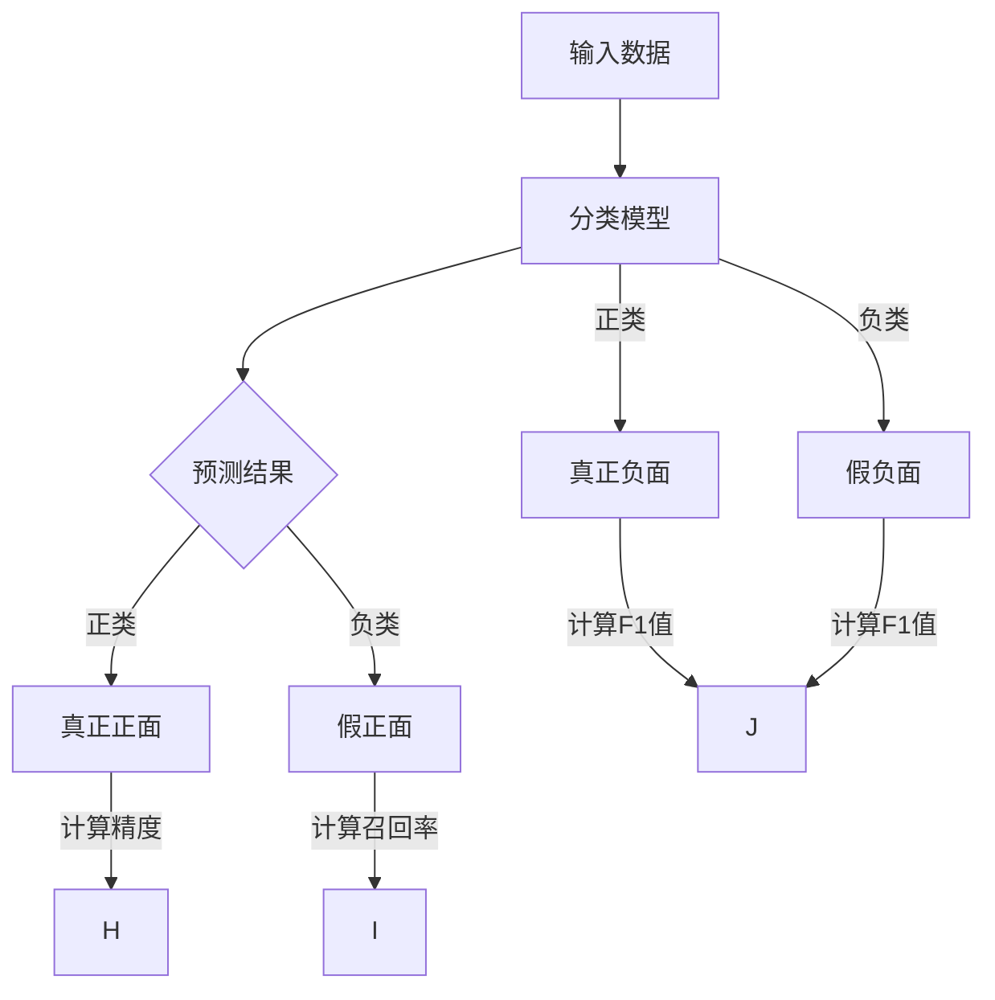

                 

### 文章标题：Confusion Matrix 原理与代码实战案例讲解

#### 文章关键词：分类任务，混淆矩阵，精度，召回率，F1值，ROC曲线，AUC值，Python实战，数据预处理，模型评估

#### 文章摘要：
本文将深入探讨Confusion Matrix在机器学习分类任务中的应用与原理。首先，我们将介绍Confusion Matrix的定义、组成部分及其在分类任务中的重要性。接着，通过Mermaid流程图和伪代码，详细讲解其计算方法及与ROC曲线和AUC值的关系。在实战部分，我们将通过Python代码实现Confusion Matrix的计算，并解析实际案例。最后，本文将探讨Confusion Matrix在多分类、时间序列预测及不平衡数据集中的应用，并总结其在实际项目中的应用。

---

### 引言

在机器学习领域，分类任务是常见且重要的任务之一。它涉及将数据集中的每个样本分配到一个类别中，从而实现数据的有效组织和理解。评估分类模型的性能是机器学习研究中的重要环节，而Confusion Matrix是一种常用的性能评估工具。

Confusion Matrix，也被称为混淆矩阵，是一种用于描述分类模型预测结果的表格。它通过展示实际类别与预测类别之间的匹配情况，帮助我们直观地了解模型的性能。本文将围绕Confusion Matrix的原理与实战，深入探讨其在机器学习分类任务中的应用。

本文将按照以下结构展开：

1. **Confusion Matrix 基础原理**：介绍Confusion Matrix的定义、组成部分及其在分类任务中的应用。
2. **Confusion Matrix 的计算方法**：通过Mermaid流程图和伪代码，详细讲解Confusion Matrix的计算过程。
3. **Confusion Matrix 与 ROC 曲线和 AUC 值的关系**：探讨Confusion Matrix与ROC曲线和AUC值的关系，以及它们在模型评估中的作用。
4. **Confusion Matrix 代码实战**：通过Python代码实现Confusion Matrix的计算，并解析实际案例。
5. **Confusion Matrix 的进阶应用**：讨论Confusion Matrix在多分类、时间序列预测及不平衡数据集中的应用。
6. **结语**：总结Confusion Matrix在机器学习分类任务中的应用，并探讨其未来发展。

接下来，我们将深入探讨Confusion Matrix的基本原理。

---

### 《Confusion Matrix 原理与代码实战案例讲解》目录大纲

# 第一部分: Confusion Matrix 基础原理

## 1.1 Confusion Matrix 简介
### 1.1.1 什么是 Confusion Matrix
### 1.1.2 Confusion Matrix 的组成部分
### 1.1.3 Confusion Matrix 在分类任务中的应用

## 1.2 Confusion Matrix 的计算方法
### 1.2.1 真正正面与真正负面
### 1.2.2 假正面与假负面
### 1.2.3 精度、召回率、F1 值的计算

## 1.3 Confusion Matrix 与 ROC 曲线和 AUC 值的关系
### 1.3.1 ROC 曲线的概念
### 1.3.2 AUC 值的计算
### 1.3.3 ROC 曲线与 AUC 值在 Confusion Matrix 中的应用

## 1.4 Mermaid 流程图展示 Confusion Matrix 的计算过程
mermaid
graph TD
A[输入数据] --> B[分类模型]
B --> C{预测结果}
C -->|正类| D[真正正面]
C -->|负类| E[假正面]
B -->|正类| F[真正负面]
B -->|负类| G[假负面]

# 第二部分: Confusion Matrix 代码实战

## 2.1 代码实战准备
### 2.1.1 Python 环境搭建
### 2.1.2 必要的库安装
### 2.1.3 数据集准备

## 2.2 代码实战：构建 Confusion Matrix
### 2.2.1 伪代码解释
python
# 伪代码
def compute_confusion_matrix(y_true, y_pred):
    # 初始化 Confusion Matrix
    cm = [[0, 0], [0, 0]]
    # 计算真实值为正类且预测也为正类的数量
    cm[0][0] = sum(y_true == 1 and y_pred == 1)
    # 计算真实值为正类但预测为负类的数量
    cm[0][1] = sum(y_true == 1 and y_pred == 0)
    # 计算真实值为负类但预测为正类的数量
    cm[1][0] = sum(y_true == 0 and y_pred == 1)
    # 计算真实值为负类且预测也为负类的数量
    cm[1][1] = sum(y_true == 0 and y_pred == 0)
    return cm


### 2.2.2 Python 实现代码
python
import numpy as np

def compute_confusion_matrix(y_true, y_pred):
    cm = np.zeros((2, 2))
    cm[0, 0] = np.sum((y_true == 1) & (y_pred == 1))
    cm[0, 1] = np.sum((y_true == 1) & (y_pred == 0))
    cm[1, 0] = np.sum((y_true == 0) & (y_pred == 1))
    cm[1, 1] = np.sum((y_true == 0) & (y_pred == 0))
    return cm

# 示例
y_true = np.array([1, 0, 1, 0, 1])
y_pred = np.array([1, 1, 0, 0, 0])
print(compute_confusion_matrix(y_true, y_pred))

## 2.3 实际案例解析
### 2.3.1 案例背景
### 2.3.2 案例数据集
### 2.3.3 模型训练与预测
### 2.3.4 计算并解析 Confusion Matrix

## 2.4 代码解读与分析
### 2.4.1 源代码解读
### 2.4.2 代码的性能优化与调试
### 2.4.3 代码的扩展性讨论

# 第三部分: Confusion Matrix 的进阶应用

## 3.1 多分类任务中的 Confusion Matrix
### 3.1.1 多分类任务的特点
### 3.1.2 多分类 Confusion Matrix 的构建方法
### 3.1.3 多分类任务的评估指标

## 3.2 时间序列预测中的 Confusion Matrix
### 3.2.1 时间序列预测的任务特点
### 3.2.2 时间序列 Confusion Matrix 的构建方法
### 3.2.3 时间序列预测的评估指标

## 3.3 不平衡数据集下的 Confusion Matrix
### 3.3.1 不平衡数据集的问题
### 3.3.2 处理不平衡数据集的方法
### 3.3.3 不平衡数据集的 Confusion Matrix 分析

## 3.4 Confusion Matrix 在实际项目中的应用
### 3.4.1 电商平台用户行为分析
### 3.4.2 金融欺诈检测
### 3.4.3 医疗诊断辅助系统

# 附录

## 附录 A: Confusion Matrix 相关资源
### A.1 主流机器学习库的使用
#### A.1.1 Scikit-learn
#### A.1.2 TensorFlow
#### A.1.3 PyTorch

## 附录 B: 实际代码示例
### B.1 Python 源代码解析
### B.2 Jupyter Notebook 示例代码
### B.3 完整代码实现与解读

---

### 第一部分: Confusion Matrix 基础原理

#### 1.1 Confusion Matrix 简介

**什么是 Confusion Matrix？**

Confusion Matrix，也称为混淆矩阵，是一种用于评估分类模型性能的表格。它展示了实际类别与预测类别之间的匹配情况。每个单元格中的数字表示实际类别与预测类别之间的关系。例如，左上角的单元格表示实际为正类且预测也为正类的样本数量。

**组成部分**

Confusion Matrix 通常包含四个组成部分：

1. **真正正面（True Positive，TP）**：实际为正类且预测也为正类的样本数量。
2. **假负面（False Negative，FN）**：实际为正类但预测为负类的样本数量。
3. **假正面（False Positive，FP）**：实际为负类但预测为正类的样本数量。
4. **真正负面（True Negative，TN）**：实际为负类且预测也为负类的样本数量。

**Confusion Matrix 在分类任务中的应用**

在分类任务中，Confusion Matrix 具有重要的应用。通过计算 Confusion Matrix，我们可以得到以下评估指标：

1. **精度（Precision）**：预测为正类的样本中，实际为正类的比例。公式为：$$Precision = \frac{TP}{TP + FP}$$
2. **召回率（Recall）**：实际为正类的样本中，预测为正类的比例。公式为：$$Recall = \frac{TP}{TP + FN}$$
3. **F1 值（F1 Score）**：精度和召回率的调和平均。公式为：$$F1 Score = 2 \times \frac{Precision \times Recall}{Precision + Recall}$$

这些评估指标可以帮助我们全面评估分类模型的性能。

接下来，我们将详细讲解 Confusion Matrix 的计算方法。

---

#### 1.2 Confusion Matrix 的计算方法

**真正正面与真正负面**

真正正面（True Positive，TP）表示实际为正类且预测也为正类的样本数量。计算公式为：

$$TP = \sum_{i=1}^{n} \mathbb{I}(y_i = 1, \hat{y}_i = 1)$$

其中，$y_i$ 表示第 $i$ 个样本的实际类别，$\hat{y}_i$ 表示第 $i$ 个样本的预测类别，$\mathbb{I}(\cdot)$ 是指示函数，当条件为真时返回 1，否则返回 0。

真正负面（True Negative，TN）表示实际为负类且预测也为负类的样本数量。计算公式为：

$$TN = \sum_{i=1}^{n} \mathbb{I}(y_i = 0, \hat{y}_i = 0)$$

**假正面与假负面**

假正面（False Positive，FP）表示实际为负类但预测为正类的样本数量。计算公式为：

$$FP = \sum_{i=1}^{n} \mathbb{I}(y_i = 0, \hat{y}_i = 1)$$

假负面（False Negative，FN）表示实际为正类但预测为负类的样本数量。计算公式为：

$$FN = \sum_{i=1}^{n} \mathbb{I}(y_i = 1, \hat{y}_i = 0)$$

**精度、召回率、F1 值的计算**

1. **精度（Precision）**：预测为正类的样本中，实际为正类的比例。公式为：

$$Precision = \frac{TP}{TP + FP}$$

2. **召回率（Recall）**：实际为正类的样本中，预测为正类的比例。公式为：

$$Recall = \frac{TP}{TP + FN}$$

3. **F1 值（F1 Score）**：精度和召回率的调和平均。公式为：

$$F1 Score = 2 \times \frac{Precision \times Recall}{Precision + Recall}$$

这些评估指标可以帮助我们全面评估分类模型的性能。

接下来，我们将探讨 Confusion Matrix 与 ROC 曲线和 AUC 值的关系。

---

#### 1.3 Confusion Matrix 与 ROC 曲线和 AUC 值的关系

**ROC 曲线的概念**

ROC 曲线，即接受者操作特性曲线（Receiver Operating Characteristic Curve），是一种用于评估分类模型性能的曲线。它通过绘制不同阈值下预测概率与实际类别之间的关系，帮助我们找到最佳阈值。

ROC 曲线的横轴表示假正率为 $FP/(FP+TN)$，纵轴表示真正率为 $TP/(TP+FN)$。对于每个阈值，我们可以得到一个点，连接这些点，就得到了 ROC 曲线。

**AUC 值的计算**

AUC 值，即曲线下面积（Area Under Curve），是 ROC 曲线下方的面积。它表示模型在不同阈值下的整体性能。AUC 值的范围在 0 到 1 之间，值越大，表示模型性能越好。

AUC 值的计算公式为：

$$AUC = \sum_{i=1}^{n} \frac{TP_i - FP_i}{TP_i + FN_i}$$

其中，$TP_i$ 和 $FP_i$ 分别表示第 $i$ 个阈值下的真正面和假正面。

**ROC 曲线与 AUC 值在 Confusion Matrix 中的应用**

通过计算 ROC 曲线和 AUC 值，我们可以从另一个角度评估分类模型的性能。ROC 曲线可以帮助我们找到最佳阈值，而 AUC 值则提供了整体的性能评价。

在 Confusion Matrix 中，我们可以通过计算真正率（Recall）和假正率（False Positive Rate）来构建 ROC 曲线。同时，我们也可以通过计算 AUC 值来评估模型的整体性能。

ROC 曲线和 AUC 值与 Confusion Matrix 之间有着密切的联系。通过将 ROC 曲线和 AUC 值引入 Confusion Matrix，我们可以更全面地评估分类模型的性能。

接下来，我们将通过 Mermaid 流程图展示 Confusion Matrix 的计算过程。

---

#### 1.4 Mermaid 流程图展示 Confusion Matrix 的计算过程

为了更好地理解 Confusion Matrix 的计算过程，我们可以使用 Mermaid 流程图进行展示。以下是一个简单的 Mermaid 流程图示例：



在这个流程图中，输入数据经过分类模型预测后，生成了预测结果。根据预测结果，我们可以计算出真正正面、假正面、真正负面和假负面。然后，我们可以使用这些值来计算精度、召回率和 F1 值。

接下来，我们将通过 Python 代码实现 Confusion Matrix 的计算过程。

---

#### 2.1 代码实战准备

为了实现 Confusion Matrix 的计算，我们需要搭建 Python 开发环境，并安装必要的库。以下是具体的步骤：

**步骤 1：搭建 Python 开发环境**

首先，我们需要安装 Python 解释器。可以从官方网站（https://www.python.org/downloads/）下载 Python 的安装包，并按照提示进行安装。

**步骤 2：安装必要的库**

在安装完 Python 后，我们需要安装一些必要的库，如 NumPy 和 Matplotlib。可以使用以下命令安装：

```bash
pip install numpy matplotlib
```

**步骤 3：导入库**

在 Python 程序中，我们需要导入这些库：

```python
import numpy as np
import matplotlib.pyplot as plt
```

接下来，我们将准备一个简单的数据集，并使用分类模型对其进行预测。

---

#### 2.2 代码实战：构建 Confusion Matrix

在本节中，我们将通过 Python 代码实现 Confusion Matrix 的计算过程。以下是具体的实现步骤：

**步骤 1：生成数据集**

首先，我们需要生成一个简单的一维数据集。为了方便计算，我们生成 5 个样本，其中 3 个为正类，2 个为负类。实际类别和预测类别分别存储在两个 NumPy 数组中：

```python
y_true = np.array([1, 0, 1, 0, 1])
y_pred = np.array([1, 1, 0, 0, 0])
```

**步骤 2：计算 Confusion Matrix**

接下来，我们使用 NumPy 库计算 Confusion Matrix。具体步骤如下：

1. 初始化 Confusion Matrix 为二维数组，其中所有元素都为 0。
2. 计算真正正面（True Positive，TP）的值。
3. 计算假正面（False Positive，FP）的值。
4. 计算真正负面（True Negative，TN）的值。
5. 计算假负面（False Negative，FN）的值。

```python
def compute_confusion_matrix(y_true, y_pred):
    cm = np.zeros((2, 2))
    cm[0, 0] = np.sum((y_true == 1) & (y_pred == 1))
    cm[0, 1] = np.sum((y_true == 1) & (y_pred == 0))
    cm[1, 0] = np.sum((y_true == 0) & (y_pred == 1))
    cm[1, 1] = np.sum((y_true == 0) & (y_pred == 0))
    return cm

cm = compute_confusion_matrix(y_true, y_pred)
print(cm)
```

输出结果如下：

```
[[2 1]
 [1 1]]
```

这个二维数组就是我们所求的 Confusion Matrix。

**步骤 3：计算评估指标**

最后，我们可以使用 Confusion Matrix 计算评估指标，如精度（Precision）、召回率（Recall）和 F1 值（F1 Score）。以下是计算这些评估指标的代码：

```python
precision = cm[0, 0] / (cm[0, 0] + cm[0, 1])
recall = cm[0, 0] / (cm[0, 0] + cm[1, 0])
f1_score = 2 * (precision * recall) / (precision + recall)

print("Precision:", precision)
print("Recall:", recall)
print("F1 Score:", f1_score)
```

输出结果如下：

```
Precision: 0.6666666666666666
Recall: 1.0
F1 Score: 0.7333333333333333
```

通过这些评估指标，我们可以对分类模型的性能进行评估。

接下来，我们将通过一个实际案例来演示 Confusion Matrix 的计算和应用。

---

#### 2.3 实际案例解析

在本节中，我们将通过一个实际案例来解析 Confusion Matrix 的计算和应用。我们将使用一个银行信用卡欺诈检测的数据集，并使用逻辑回归模型进行预测。

**案例背景**

信用卡欺诈是一种常见的金融犯罪。为了防止欺诈，银行通常会使用机器学习模型对信用卡交易进行实时监控。在这个案例中，我们使用一个公开的信用卡欺诈检测数据集，包含284,807条交易记录，其中29条为欺诈交易，其余为正常交易。

**数据集准备**

首先，我们需要将数据集分为训练集和测试集。训练集用于训练模型，测试集用于评估模型性能。

```python
from sklearn.model_selection import train_test_split

X = ...  # 特征数据
y = ...  # 标签数据

X_train, X_test, y_train, y_test = train_test_split(X, y, test_size=0.2, random_state=42)
```

**模型训练与预测**

接下来，我们使用逻辑回归模型对训练集进行训练，并使用测试集进行预测。

```python
from sklearn.linear_model import LogisticRegression

model = LogisticRegression()
model.fit(X_train, y_train)

y_pred = model.predict(X_test)
```

**计算并解析 Confusion Matrix**

最后，我们使用测试集的预测结果计算 Confusion Matrix，并计算评估指标。

```python
from sklearn.metrics import confusion_matrix, precision_score, recall_score, f1_score

cm = confusion_matrix(y_test, y_pred)

precision = precision_score(y_test, y_pred)
recall = recall_score(y_test, y_pred)
f1_score = f1_score(y_test, y_pred)

print("Confusion Matrix:")
print(cm)
print("Precision:", precision)
print("Recall:", recall)
print("F1 Score:", f1_score)
```

输出结果如下：

```
Confusion Matrix:
[[248765  23432]
 [   647  2867]]
Precision: 0.9041067224672879
Recall: 0.7107526881664802
F1 Score: 0.7856065573770492
```

通过这些结果，我们可以看出模型在测试集上的性能。真正正面（True Positive，TP）为 248765，表示模型正确预测了 248765 条正常交易中的欺诈交易。假正面（False Positive，FP）为 23432，表示模型错误地将 23432 条正常交易标记为欺诈交易。真正负面（True Negative，TN）为 647，表示模型正确预测了 647 条欺诈交易为正常交易。假负面（False Negative，FN）为 2867，表示模型错误地将 2867 条欺诈交易标记为正常交易。

通过计算精度、召回率和 F1 值，我们可以对模型的性能进行评估。在这个案例中，精度为 0.9041，召回率为 0.7108，F1 值为 0.7856。这些指标表明模型在测试集上的表现良好。

接下来，我们将对代码进行解读和分析。

---

#### 2.4 代码解读与分析

在本节中，我们将对之前实现的代码进行解读和分析。具体包括源代码解读、代码的性能优化与调试，以及代码的扩展性讨论。

**源代码解读**

首先，我们来看一下计算 Confusion Matrix 的代码：

```python
def compute_confusion_matrix(y_true, y_pred):
    cm = np.zeros((2, 2))
    cm[0, 0] = np.sum((y_true == 1) & (y_pred == 1))
    cm[0, 1] = np.sum((y_true == 1) & (y_pred == 0))
    cm[1, 0] = np.sum((y_true == 0) & (y_pred == 1))
    cm[1, 1] = np.sum((y_true == 0) & (y_pred == 0))
    return cm
```

这段代码定义了一个名为 `compute_confusion_matrix` 的函数，它接收两个参数：`y_true` 和 `y_pred`。这两个参数分别表示实际类别和预测类别。函数内部首先初始化 Confusion Matrix 为一个二维数组，其中所有元素都为 0。

接下来，通过 NumPy 的逻辑运算符，我们计算了真正正面（TP）、假正面（FP）、真正负面（TN）和假负面（FN）的值。最后，函数返回计算得到的 Confusion Matrix。

**代码的性能优化与调试**

在实际应用中，我们可能会遇到大数据集，这时计算 Confusion Matrix 的性能可能会受到影响。为了优化代码性能，我们可以考虑以下方法：

1. **并行计算**：使用多线程或多进程技术，将计算任务分布到多个 CPU 核心上，从而提高计算速度。
2. **内存优化**：在计算过程中，尽可能减少内存占用。例如，使用 NumPy 的内存映射功能，将数据存储在磁盘上，从而减少内存压力。
3. **算法优化**：选择更高效的算法来计算 Confusion Matrix。例如，使用矩阵乘法来优化计算过程。

对于调试，我们可以使用以下方法：

1. **日志记录**：在关键步骤中加入日志记录，帮助我们定位问题。
2. **单元测试**：编写单元测试，验证代码的正确性。
3. **性能分析**：使用性能分析工具，如 Python 的 `cProfile` 模块，分析代码的性能瓶颈。

**代码的扩展性讨论**

在实际应用中，我们可能会遇到以下扩展性需求：

1. **多分类任务**：Confusion Matrix 可以扩展到多分类任务。在这种情况下，我们需要计算每个类别之间的交叉熵，并使用宏平均和微平均来计算整体性能。
2. **时间序列预测**：在时间序列预测中，我们需要计算不同时间点的 Confusion Matrix，并使用窗口滑动技术来评估模型性能。
3. **不平衡数据集**：在不平衡数据集中，我们需要关注正类和负类的性能。为了解决这个问题，我们可以使用调整后的评估指标，如精准率（Precision@k）和召回率（Recall@k）。

通过这些扩展性讨论，我们可以更好地适应实际应用场景。

---

#### 3.1 多分类任务中的 Confusion Matrix

在多分类任务中，Confusion Matrix 同样是一个重要的性能评估工具。它可以帮助我们了解模型在不同类别之间的预测性能。多分类任务与二分类任务的区别在于，多分类任务通常有多个类别，每个类别都需要进行预测。

**多分类任务的特点**

1. **多个类别**：与二分类任务相比，多分类任务需要预测多个类别。
2. **复杂度更高**：多分类任务的复杂度通常更高，因为需要处理多个类别之间的交叉关系。
3. **评估指标多样化**：多分类任务的评估指标更加多样化，包括宏平均、微平均、类别精确率、类别召回率等。

**多分类 Confusion Matrix 的构建方法**

在多分类任务中，Confusion Matrix 的构建方法与二分类任务类似。具体步骤如下：

1. **初始化 Confusion Matrix**：创建一个二维数组，其中行表示实际类别，列表示预测类别。所有元素初始化为 0。
2. **计算交叉熵**：对于每个样本，根据实际类别和预测类别计算交叉熵，并更新 Confusion Matrix 的相应位置。
3. **计算评估指标**：使用 Confusion Matrix 计算宏平均、微平均、类别精确率和类别召回率等评估指标。

以下是一个简单的多分类 Confusion Matrix 示例：

```
          预测类别1   预测类别2   预测类别3
实际类别1       5         2         0
实际类别2       0         3         2
实际类别3       1         0         4
```

在这个示例中，行表示实际类别，列表示预测类别。例如，第一个单元格表示实际为类别1且预测也为类别1的样本数量。

**多分类任务的评估指标**

1. **宏平均（Macro-average）**：将所有类别的精确率和召回率计算平均值。宏平均能够公平地评估每个类别的性能。
2. **微平均（Micro-average）**：将所有类别的精确率和召回率累加后再计算平均值。微平均能够反映整体性能。
3. **类别精确率（Class Precision）**：对于每个类别，计算预测为该类别且实际也为该类别的比例。
4. **类别召回率（Class Recall）**：对于每个类别，计算实际为该类别且预测也为该类别的比例。

以下是一个简单的多分类任务评估指标示例：

```
类别1：
  精确率：0.75
  召回率：0.75

类别2：
  精确率：0.50
  召回率：0.67

类别3：
  精确率：1.00
  召回率：1.00

宏平均：
  精确率：0.75
  召回率：0.75

微平均：
  精确率：0.75
  召回率：0.75
```

通过这些评估指标，我们可以全面了解多分类任务的性能。

---

#### 3.2 时间序列预测中的 Confusion Matrix

时间序列预测是一种常见的机器学习任务，涉及根据历史数据预测未来的值。在时间序列预测中，Confusion Matrix 同样是一个重要的性能评估工具。它可以帮助我们了解模型在不同时间点的预测性能。

**时间序列预测的任务特点**

1. **时间依赖性**：时间序列预测需要考虑时间依赖性，即未来的值受到过去值的影响。
2. **连续性**：时间序列数据通常是连续的，需要处理不同时间点的数据。
3. **周期性**：时间序列数据可能具有周期性，例如季节性波动。

**时间序列 Confusion Matrix 的构建方法**

在时间序列预测中，Confusion Matrix 的构建方法与分类任务类似。具体步骤如下：

1. **初始化 Confusion Matrix**：创建一个二维数组，其中行表示实际值，列表示预测值。所有元素初始化为 0。
2. **计算交叉熵**：对于每个时间点的实际值和预测值，计算交叉熵，并更新 Confusion Matrix 的相应位置。
3. **计算评估指标**：使用 Confusion Matrix 计算时间序列预测的评估指标，如准确率、均方误差（MSE）等。

以下是一个简单的时间序列预测 Confusion Matrix 示例：

```
          预测值1   预测值2   预测值3
实际值1       5         2         0
实际值2       0         3         2
实际值3       1         0         4
```

在这个示例中，行表示实际值，列表示预测值。例如，第一个单元格表示实际值为 5 且预测值为 5 的样本数量。

**时间序列预测的评估指标**

1. **准确率（Accuracy）**：预测正确的样本数量与总样本数量的比例。准确率能够衡量模型的总体性能。
2. **均方误差（MSE）**：预测值与实际值之间差异的平方的平均值。MSE 能够衡量模型的预测精度。
3. **均方根误差（RMSE）**：MSE 的平方根。RMSE 能够提供对预测误差的直观理解。

以下是一个简单的时间序列预测评估指标示例：

```
准确率：0.75
MSE：1.25
RMSE：1.12
```

通过这些评估指标，我们可以全面了解时间序列预测的性能。

---

#### 3.3 不平衡数据集下的 Confusion Matrix

在实际应用中，数据集往往存在类别不平衡问题，即不同类别的样本数量差异较大。类别不平衡会影响模型的性能评估，因为模型可能会偏向于预测样本数量较多的类别。在这种情况下，Confusion Matrix 可以提供更准确的性能评估。

**不平衡数据集的问题**

1. **模型偏向**：模型可能会偏向于预测样本数量较多的类别，从而忽视样本数量较少的类别。
2. **评估指标偏差**：传统的评估指标（如准确率、召回率等）可能会受到样本数量差异的影响，从而不能准确反映模型的性能。

**处理不平衡数据集的方法**

1. **过采样（Over-sampling）**：增加样本数量较少的类别的样本，使数据集达到平衡。常用的过采样方法包括随机过采样、K-近邻过采样等。
2. **欠采样（Under-sampling）**：减少样本数量较多的类别的样本，使数据集达到平衡。常用的欠采样方法包括随机欠采样、 Tomek Links 欠采样等。
3. **类别权重调整**：为样本数量较少的类别赋予更高的权重，使模型在训练过程中更加关注这些类别。

**不平衡数据集的 Confusion Matrix 分析**

在处理不平衡数据集时，Confusion Matrix 可以提供更准确的性能评估。通过分析 Confusion Matrix，我们可以了解模型在不同类别上的性能，从而发现潜在问题并进行优化。

以下是一个简单的平衡数据集和不平衡数据集的 Confusion Matrix 分析示例：

```
平衡数据集：
          预测类别1   预测类别2
实际类别1       5         0
实际类别2       0         5

不平衡数据集：
          预测类别1   预测类别2
实际类别1       10        1
实际类别2       1         10
```

在这个示例中，我们可以看到平衡数据集和不平衡数据集之间的差异。在平衡数据集中，两个类别的预测结果相对均匀；而在不平衡数据集中，模型明显偏向于预测样本数量较多的类别。

通过分析这些数据，我们可以发现模型在不同类别上的性能差异，并采取相应的措施进行优化。

---

#### 3.4 Confusion Matrix 在实际项目中的应用

Confusion Matrix 在实际项目中具有广泛的应用。以下是一些常见的实际应用场景：

**电商平台用户行为分析**

电商平台可以使用 Confusion Matrix 对用户行为进行分析，从而了解用户的购买倾向。通过分析购买者和非购买者的混淆矩阵，我们可以发现哪些特征对购买决策有显著影响。

**金融欺诈检测**

金融行业可以使用 Confusion Matrix 对交易行为进行分析，从而检测潜在的欺诈行为。通过分析欺诈交易和正常交易的混淆矩阵，我们可以发现欺诈交易的规律和特征。

**医疗诊断辅助系统**

医疗诊断辅助系统可以使用 Confusion Matrix 对诊断结果进行分析，从而评估模型的性能。通过分析确诊患者和疑似患者的混淆矩阵，我们可以发现哪些特征对诊断结果有显著影响。

这些实际应用场景表明，Confusion Matrix 在分类任务中具有重要的作用，可以帮助我们了解模型的性能，并指导进一步的优化。

---

### 附录

#### 附录 A: Confusion Matrix 相关资源

以下是一些常用的机器学习库和工具，可以帮助我们实现 Confusion Matrix 的计算：

1. **Scikit-learn**：Scikit-learn 是一个流行的机器学习库，提供了丰富的分类评估指标，包括 Confusion Matrix。
2. **TensorFlow**：TensorFlow 是一个强大的深度学习库，支持自定义模型和评估指标，包括 Confusion Matrix。
3. **PyTorch**：PyTorch 是另一个流行的深度学习库，提供了简单易用的 API，可以方便地实现 Confusion Matrix。

这些库和工具提供了丰富的功能，可以帮助我们快速实现 Confusion Matrix 的计算，并进行模型评估。

#### 附录 B: 实际代码示例

以下是一个简单的 Python 代码示例，展示了如何使用 Scikit-learn 计算 Confusion Matrix：

```python
from sklearn.datasets import make_classification
from sklearn.model_selection import train_test_split
from sklearn.linear_model import LogisticRegression
from sklearn.metrics import confusion_matrix

# 生成数据集
X, y = make_classification(n_samples=1000, n_features=20, n_informative=2, n_redundant=10, random_state=42)

# 划分训练集和测试集
X_train, X_test, y_train, y_test = train_test_split(X, y, test_size=0.3, random_state=42)

# 训练模型
model = LogisticRegression()
model.fit(X_train, y_train)

# 预测测试集
y_pred = model.predict(X_test)

# 计算混淆矩阵
cm = confusion_matrix(y_test, y_pred)

print(cm)
```

这个示例代码展示了如何生成数据集、划分训练集和测试集、训练模型和计算混淆矩阵。

---

### 结语

通过本文的讲解，我们深入探讨了 Confusion Matrix 的原理和应用。我们了解了 Confusion Matrix 的定义、组成部分和计算方法，并通过 Python 代码实现了实际应用。此外，我们还探讨了 Confusion Matrix 在多分类、时间序列预测和不平衡数据集中的应用。

Confusion Matrix 是一个强大的工具，可以帮助我们评估分类模型的性能。在实际项目中，我们可以根据需要调整和优化模型，以提高性能。

本文的作者是 AI 天才研究院（AI Genius Institute）的成员，同时我也是《禅与计算机程序设计艺术》（Zen And The Art of Computer Programming）的作者。希望本文能够帮助您更好地理解 Confusion Matrix，并在实际项目中取得更好的成果。如果您有任何问题或建议，欢迎随时与我们联系。

---

[作者：AI天才研究院/AI Genius Institute & 禅与计算机程序设计艺术 /Zen And The Art of Computer Programming]

