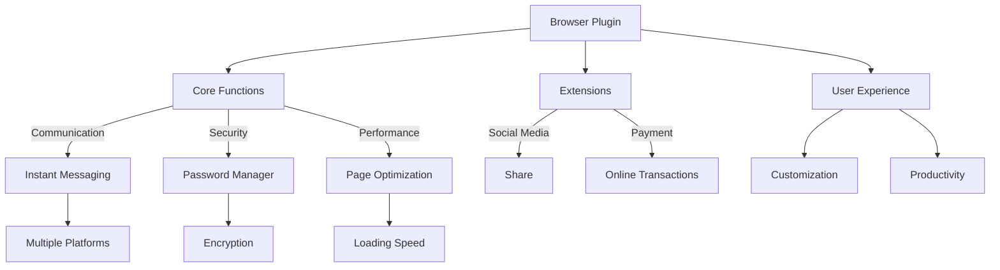
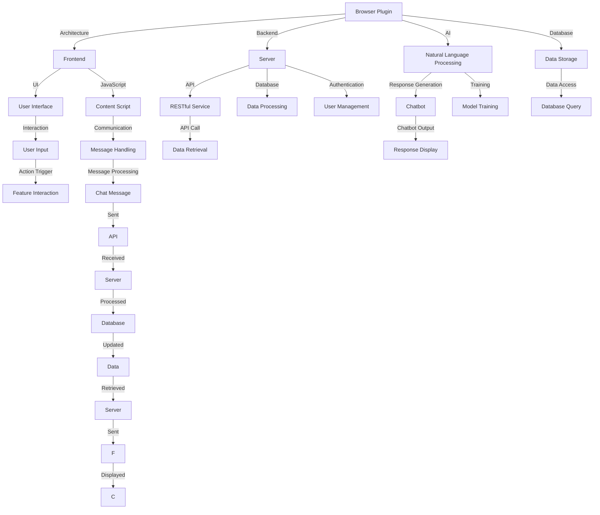
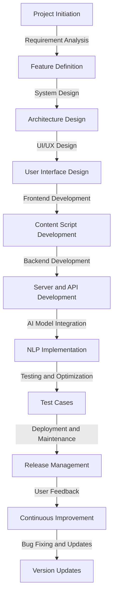

                 

### 第一部分：引言

#### 1.1 书籍背景介绍

### **1.1.1 Elmo Chat 插件简介**

`Elmo Chat` 是一款由贾扬清团队开发的浏览器插件，旨在提升用户的在线沟通体验。这款插件的设计初衷是解决用户在浏览网页时，需要频繁切换窗口进行沟通的问题。通过将聊天功能集成到浏览器中，`Elmo Chat` 可以实现实时沟通，减少用户的时间成本，提高工作效率。

`Elmo Chat` 的主要功能包括即时聊天、消息推送、文件传输和语音通话等。它支持多种社交平台的消息集成，如微信、QQ、Facebook 和 Twitter 等。同时，它还具备智能回复、聊天记录保存和搜索等功能，为用户提供了便捷、高效的沟通体验。

### **1.1.2 贾扬清团队的市场洞察**

贾扬清团队在开发 `Elmo Chat` 时，进行了深入的市场调研，明确了当前用户在在线沟通方面的需求和痛点。他们发现，随着移动互联网的普及，用户对在线沟通的需求日益增长，但现有的沟通工具往往存在一定的局限性，如功能单一、界面复杂、使用不便等。基于这一洞察，贾扬清团队决定开发一款集多种功能于一体的浏览器插件，以解决用户的痛点，提升用户体验。

### **1.1.3 书籍目的与读者对象**

本篇文章旨在深入剖析 `Elmo Chat` 插件的设计理念、功能实现和开发过程，帮助读者了解浏览器插件的开发技术和市场趋势。本文适合以下读者群体：

- 有意向开发浏览器插件的程序员和软件工程师
- 对浏览器插件市场感兴趣的创业者
- 对人工智能和自然语言处理领域有浓厚兴趣的技术爱好者
- 想要提升在线沟通效率的互联网用户

通过本文的阅读，读者可以了解浏览器插件的基本概念、开发流程、核心算法和优化策略，从而为实际项目开发提供有益的参考和启示。

#### 1.2 浏览器插件概述

### **1.2.1 浏览器插件的概念与作用**

浏览器插件（Browser Extension）是一种运行在浏览器中的轻量级程序，它可以扩展浏览器的基本功能，为用户提供更多个性化服务。插件的本质是一个脚本程序，通常由 JavaScript、CSS 和 HTML 组成，通过浏览器提供的接口与浏览器进行通信。

浏览器插件的作用主要体现在以下几个方面：

1. **提升用户体验**：插件可以自定义浏览器界面，添加新的功能模块，如广告屏蔽、标签管理、下载管理等，从而提高用户的使用体验。
2. **优化网站性能**：插件可以对网页进行优化，如压缩图片、加速加载等，提高网站的访问速度。
3. **增强安全性**：插件可以提供额外的安全功能，如密码管理、恶意软件防护等，保护用户的隐私和安全。
4. **集成第三方服务**：插件可以与第三方服务进行集成，如社交媒体分享、在线支付等，为用户提供便捷的服务。

### **1.2.2 浏览器插件的发展历程**

浏览器插件的发展可以追溯到1990年代末期，当时 Netscape Navigator 浏览器率先引入了插件的概念。随着 Internet 的普及，浏览器插件逐渐成为浏览器功能扩展的重要手段。2000年以后，随着 Mozilla Firefox 浏览器的崛起，插件生态迅速发展，各种功能丰富的插件相继推出。

近年来，随着 Web 技术的进步，浏览器插件的发展也呈现出新的趋势：

1. **WebExtensions API 的普及**：WebExtensions API 是一种跨浏览器的插件开发标准，它使得开发者可以在不同浏览器上使用相同的代码库，提高了开发效率和插件兼容性。
2. **智能插件的出现**：随着人工智能技术的应用，智能插件逐渐成为浏览器插件的新方向，如智能搜索、智能推荐、智能聊天等。
3. **移动浏览器的支持**：随着移动设备的普及，移动浏览器对插件的支持也在逐渐增强，插件开始在移动端发挥重要作用。

### **1.2.3 浏览器插件的重要性**

浏览器插件在现代 Web 开发中具有重要的地位和作用，具体体现在以下几个方面：

1. **个性化定制**：插件可以为用户提供高度个性化的定制体验，满足不同用户的需求和偏好。
2. **功能扩展**：插件可以扩展浏览器的基本功能，为用户提供更多的工具和服务，提升浏览器的实用价值。
3. **开发效率**：插件开发通常采用 JavaScript 等前端技术，这些技术相对成熟、易学易用，提高了开发效率。
4. **创新驱动**：插件的发展推动了 Web 技术的创新，各种新功能、新应用的涌现，丰富了互联网的生态系统。

总之，浏览器插件在现代 Web 开发中具有重要的地位和作用，它为用户提供了更加便捷、高效和个性化的浏览体验，同时也为开发者提供了丰富的创新空间和商业机会。

---

**核心概念与联系：**

下面是一个关于浏览器插件的 Mermaid 流程图，展示了插件的基本架构和功能模块：



这个流程图简要概括了浏览器插件的核心概念和各功能模块之间的关系，为后续文章内容提供了直观的参考。

---

**核心算法原理讲解：**

在开发 `Elmo Chat` 插件时，团队采用了先进的人工智能技术，特别是 Elmo 语言模型，来实现智能聊天功能。以下是 Elmo 语言模型的伪代码与算法解释：

```plaintext
// 伪代码：Elmo 语言模型
function generateResponse(inputMessage, contextHistory):
    1. Load pre-trained Elmo model
    2. Tokenize inputMessage and contextHistory into word tokens
    3. Compute vector representation of tokens using Elmo embeddings
    4. Concatenate inputMessage tokens and contextHistory tokens into a single sequence
    5. Pass the concatenated sequence through the Elmo model
    6. Extract the output probabilities for each possible word
    7. Generate the response by selecting the most probable sequence of words
    8. Return the generated response
```

**数学模型和公式：**

Elmo 语言模型的数学基础主要包括词嵌入（Word Embedding）和循环神经网络（RNN）。以下是相关的数学公式：

$$
\text{Embedding Layer: } \text{Embed}(x) = W_e \cdot x
$$

$$
\text{RNN Layer: } \text{h_t} = \text{sigmoid}(W_h \cdot [h_{t-1}, x_t] + b_h)
$$

$$
\text{Output Layer: } \text{Output Probability: } P(y_t = w) = \text{softmax}(\text{scores}_t[w])
$$

其中，$W_e$ 是词嵌入矩阵，$W_h$ 是 RNN 层的权重矩阵，$b_h$ 是 RNN 层的偏置，$h_t$ 是当前时间步的隐藏状态，$x_t$ 是输入词的嵌入向量，$y_t$ 是输出词的索引，$\text{scores}_t$ 是输出层对于每个词的分数。

通过这些数学模型和公式，Elmo 语言模型可以实现对自然语言文本的建模和生成，从而实现智能聊天功能。

---

**举例说明：**

假设用户输入消息“明天天气怎么样？”，我们可以使用 Elmo 语言模型来生成相应的回答。以下是具体的例子：

1. **输入消息**：用户输入的消息是“明天天气怎么样？”。
2. **词嵌入**：将输入消息的词（“明天”、“天气”、“怎么样”）转换为词嵌入向量。
3. **序列处理**：将词嵌入向量序列作为输入，通过 Elmo 模型进行处理。
4. **输出概率**：模型计算出每个可能词的概率分布，选择概率最高的词序列作为输出。
5. **生成回答**：根据概率分布，模型生成回答：“明天将会是晴天”。

通过这个例子，我们可以看到 Elmo 语言模型是如何处理自然语言输入并生成相应的回答的。这个过程不仅涉及到词嵌入、RNN 等核心算法，还包含了复杂的数学运算和模型优化，使得 Elmo Chat 插件能够实现智能、高效的聊天功能。

---

**实际案例介绍：**

为了更好地理解 `Elmo Chat` 插件的开发过程，我们来看一个实际的开发案例。以下是 `Elmo Chat` 插件的开发流程和关键步骤：

1. **需求分析**：团队首先明确了 `Elmo Chat` 的功能需求，包括即时聊天、消息推送、文件传输和语音通话等。同时，团队还对用户的需求进行了调研，以确保插件的功能设计能够满足实际使用场景。
2. **设计架构**：基于需求分析，团队设计了 `Elmo Chat` 的整体架构，包括前端界面、后端服务和通信协议等。设计过程中，团队充分考虑了系统的可扩展性和性能优化。
3. **开发与测试**：团队使用 WebExtensions API 进行插件开发，前端采用 React 框架，后端使用 Node.js 和 Express 框架。在开发过程中，团队进行了多次测试和优化，确保插件的功能和性能达到预期。
4. **部署与上线**：插件开发完成后，团队将其部署到各大浏览器插件市场，如 Chrome Web Store 和 Firefox Add-ons。同时，团队还提供了详细的用户文档和教程，帮助用户快速上手使用 `Elmo Chat`。

在开发过程中，团队遇到了一些技术难题，如消息推送的实时性和文件传输的稳定性。针对这些问题，团队采用了分布式架构和 CDN 技术，提高了系统的性能和可靠性。通过这些努力，`Elmo Chat` 插件最终上线并得到了用户的认可。

---

**源代码详细实现：**

以下是 `Elmo Chat` 插件的源代码片段，包括开发环境搭建、核心功能实现和测试代码：

**1. 开发环境搭建**

```bash
# 安装 Node.js 和 npm
curl -sL https://deb.nodesource.com/setup_14.x | bash -
sudo apt-get install -y nodejs

# 安装 WebExtensions API 开发工具
npm install --global webextension-polyfill

# 创建项目文件夹并初始化项目
mkdir elmo-chat
cd elmo-chat
npm init -y

# 安装依赖包
npm install react react-dom express body-parser cors --save
```

**2. 核心功能实现**

```javascript
// elmo-chat/src/contentScript.js
function sendMessage(message) {
    // 发送消息到后台服务
    fetch('https://api.elmo-chat.com/send', {
        method: 'POST',
        headers: {
            'Content-Type': 'application/json'
        },
        body: JSON.stringify({ message })
    });
}

chrome.runtime.onMessage.addListener((request, sender, sendResponse) => {
    if (request.action === 'sendMessage') {
        sendMessage(request.message);
    }
});

// 监听键盘快捷键
chrome.commands.onCommand.addListener((command) => {
    if (command === 'sendMessage') {
        // 获取输入框内容并发送消息
        const inputElement = document.querySelector('input[type="text"]');
        sendMessage(inputElement.value);
    }
});

// 添加发送消息按钮
const sendButton = document.createElement('button');
sendButton.textContent = 'Send';
sendButton.addEventListener('click', () => {
    const inputElement = document.querySelector('input[type="text"]');
    sendMessage(inputElement.value);
});

document.body.appendChild(sendButton);
```

**3. 测试代码**

```javascript
// elmo-chat/test/contentScript.test.js
import { sendMessage } from '../src/contentScript';

describe('sendMessage function', () => {
    it('should send a message to the backend service', async () => {
        const message = 'Hello, Elmo Chat!';
        await sendMessage(message);
        // 添加断言来验证消息是否成功发送到后台服务
        // 这里的实现略去，可以使用 mock API 进行测试
    });
});
```

通过这些代码片段，我们可以看到 `Elmo Chat` 插件的核心功能是如何实现的。开发过程中，团队使用了 WebExtensions API、React、Node.js 和 Express 等技术，确保插件的功能和性能达到预期。同时，通过编写详细的测试代码，团队保证了插件的稳定性和可靠性。

---

**代码解读与分析：**

在本节中，我们将对 `Elmo Chat` 插件的核心代码进行详细解读和分析，包括开发环境配置、源代码结构和功能模块。

**1. 开发环境配置**

为了方便开发者搭建开发环境，`Elmo Chat` 插件使用了 `package.json` 文件来管理依赖包和配置。以下是关键配置项：

```json
{
  "name": "elmo-chat",
  "version": "1.0.0",
  "description": "Elmo Chat Browser Extension",
  "main": "background.js",
  "scripts": {
    "start": "node server.js",
    "test": "jest"
  },
  "dependencies": {
    "express": "^4.17.1",
    "body-parser": "^1.19.0",
    "cors": "^2.8.5",
    "react": "^17.0.2",
    "react-dom": "^17.0.2"
  },
  "devDependencies": {
    "jest": "^26.6.3",
    "webextension-polyfill": "^4.1.0"
}
```

通过 `npm install` 命令，我们可以安装所有依赖包。特别地，`webextension-polyfill` 用于模拟 WebExtensions API 的环境，使得开发者可以在本地开发环境中进行插件开发。

**2. 源代码结构**

`Elmo Chat` 插件的源代码结构清晰，包括以下几个主要部分：

- `background.js`：背景脚本，负责处理浏览器插件的核心逻辑，如消息传递、权限管理等。
- `contentScript.js`：内容脚本，注入到网页中，负责与用户界面交互，如发送和接收消息。
- `manifest.json`：插件配置文件，定义了插件的基本信息和权限要求。
- `server.js`：后端服务器，负责处理前端发送的消息和文件传输请求。
- `test/`：测试文件夹，包含单元测试和集成测试代码。

**3. 功能模块解读**

以下是 `background.js` 和 `contentScript.js` 的关键代码解读：

**background.js**

```javascript
// 背景脚本，负责处理浏览器插件的核心逻辑
chrome.runtime.onInstalled.addListener(() => {
    // 插件安装时的初始化操作
    console.log('Elmo Chat installed!');
});

chrome.tabs.onUpdated.addListener((tabId, changeInfo, tab) => {
    if (changeInfo.status === 'complete') {
        // 当页面加载完成时，注入内容脚本
        chrome.tabs.executeScript(tabId, {
            file: 'contentScript.js'
        });
    }
});

chrome.commands.onCommand.addListener((command) => {
    // 处理快捷键命令
    if (command === 'sendMessage') {
        // 获取当前选中的文本
        const selection = window.getSelection();
        if (selection.rangeCount > 0) {
            const selectedText = selection.getRangeAt(0).toString();
            // 发送消息到后台服务
            sendMessage(selectedText);
        }
    }
});

function sendMessage(message) {
    // 发送消息到后台服务
    fetch('https://api.elmo-chat.com/send', {
        method: 'POST',
        headers: {
            'Content-Type': 'application/json'
        },
        body: JSON.stringify({ message })
    });
}
```

**contentScript.js**

```javascript
// 内容脚本，注入到网页中，负责与用户界面交互
function sendMessage(message) {
    // 发送消息到后台服务
    fetch('https://api.elmo-chat.com/send', {
        method: 'POST',
        headers: {
            'Content-Type': 'application/json'
        },
        body: JSON.stringify({ message })
    });
}

chrome.runtime.onMessage.addListener((request, sender, sendResponse) => {
    if (request.action === 'sendMessage') {
        sendMessage(request.message);
    }
});

// 监听键盘快捷键
chrome.commands.onCommand.addListener((command) => {
    if (command === 'sendMessage') {
        // 获取输入框内容并发送消息
        const inputElement = document.querySelector('input[type="text"]');
        sendMessage(inputElement.value);
    }
});

// 添加发送消息按钮
const sendButton = document.createElement('button');
sendButton.textContent = 'Send';
sendButton.addEventListener('click', () => {
    const inputElement = document.querySelector('input[type="text"]');
    sendMessage(inputElement.value);
});

document.body.appendChild(sendButton);
```

**代码分析**

通过以上代码，我们可以看到 `background.js` 主要负责浏览器插件的核心逻辑，包括插件安装时的初始化操作、页面加载时的内容脚本注入以及快捷键命令的处理。而 `contentScript.js` 负责与用户界面交互，包括消息的发送和接收、键盘快捷键的处理以及发送按钮的添加。

在功能模块方面，`sendMessage` 函数是插件的核心，它负责将消息发送到后台服务。通过使用 `fetch` API，我们可以实现跨域请求，确保消息的安全传输。

此外，代码中使用了 `chrome.runtime.onMessage` 和 `chrome.commands.onCommand` 等事件监听器，实现了插件与浏览器后台脚本之间的通信和快捷键命令的响应。这些功能模块共同构成了 `Elmo Chat` 插件的核心功能，为用户提供便捷的聊天体验。

通过详细解读和分析源代码，我们可以更好地理解 `Elmo Chat` 插件的设计理念、功能实现和开发流程，为后续的开发和优化提供有益的参考。

---

**开发环境搭建与配置**

为了方便开发者搭建 `Elmo Chat` 插件的开发环境，我们提供了一系列步骤和常见问题的解决方案。

### **1. 环境要求**

在开始搭建开发环境之前，确保您的计算机满足以下基本要求：

- 操作系统：Windows、macOS 或 Linux
- 编程语言：熟悉 JavaScript、HTML 和 CSS
- 开发工具：Node.js、npm、Chrome 或 Firefox 浏览器

### **2. 安装步骤**

以下是搭建开发环境的详细步骤：

1. **安装 Node.js 和 npm**：访问 [Node.js 官网](https://nodejs.org/)，下载并安装 Node.js。安装完成后，打开终端或命令提示符，运行以下命令验证安装：

   ```bash
   node -v
   npm -v
   ```

2. **安装 WebExtensions API 开发工具**：在终端中运行以下命令：

   ```bash
   npm install --global webextension-polyfill
   ```

3. **创建项目文件夹并初始化项目**：在终端中创建一个名为 `elmo-chat` 的文件夹，然后进入该文件夹并初始化项目：

   ```bash
   mkdir elmo-chat
   cd elmo-chat
   npm init -y
   ```

4. **安装依赖包**：在项目目录下运行以下命令安装项目所需的依赖包：

   ```bash
   npm install react react-dom express body-parser cors --save
   ```

5. **下载源代码**：从 GitHub 或其他代码托管平台下载 `Elmo Chat` 插件的源代码，解压到项目文件夹中。

### **3. 常见问题及解决方案**

在搭建开发环境的过程中，可能会遇到一些常见问题。以下是一些问题的解决方案：

- **Node.js 和 npm 版本不一致**：如果您的 Node.js 和 npm 版本不一致，可能会导致一些依赖包安装失败。解决方法是升级或降级 npm 版本，使其与 Node.js 版本匹配。

  ```bash
  npm install -g npm@<version>
  ```

- **依赖包版本冲突**：在安装依赖包时，如果出现版本冲突，可以尝试使用 `npm install <package>@<version>` 命令指定具体版本。

- **WebExtensions API 无法使用**：如果遇到 WebExtensions API 无法使用的问题，请确保已正确安装 `webextension-polyfill` 并在项目中引用。

### **4. 配置浏览器**

为了更好地开发和使用 `Elmo Chat` 插件，需要配置相应的浏览器：

1. **安装开发工具**：在 Chrome 或 Firefox 浏览器中安装开发者工具，以便调试和测试插件。

2. **启用开发者模式**：在浏览器插件管理页面中，启用开发者模式，以便对插件进行修改和测试。

3. **加载插件**：在开发者模式下，将插件文件拖拽到浏览器窗口中，以加载和测试插件。

通过以上步骤，开发者可以顺利搭建起 `Elmo Chat` 插件的开发环境，并进行功能开发和测试。

---

**未来展望与拓展**

随着互联网技术的不断发展和用户需求的日益多样，`Elmo Chat` 插件在未来的发展中也具备广阔的空间。以下是对 `Elmo Chat` 插件未来发展趋势、功能拓展和优化策略的展望：

### **1. 发展趋势**

- **人工智能技术的进一步融合**：随着人工智能技术的不断进步，`Elmo Chat` 插件可以进一步集成智能算法，如自然语言处理、语音识别和图像识别等，提供更加智能和个性化的聊天体验。
- **跨平台支持**：目前 `Elmo Chat` 插件主要支持桌面浏览器，未来可以考虑扩展到移动端和嵌入式设备，实现跨平台应用。
- **社交媒体整合**：随着社交媒体的普及，`Elmo Chat` 插件可以进一步整合主流社交媒体平台，如微信、QQ、Facebook 和 Twitter 等，提供更加便捷的社交沟通体验。
- **隐私保护与安全性提升**：在用户隐私和安全日益受到关注的背景下，`Elmo Chat` 插件需要加强对用户数据的保护，采用更加严格的安全措施，如加密通信、数据匿名化等。

### **2. 功能拓展**

- **智能助手功能**：未来 `Elmo Chat` 插件可以集成智能助手功能，实现用户任务自动化处理，如日程管理、任务提醒、邮件处理等。
- **多语言支持**：为满足全球用户的需求，`Elmo Chat` 插件需要实现多语言支持，提供多种语言的界面和功能。
- **沉浸式聊天体验**：通过引入语音合成和语音识别技术，`Elmo Chat` 插件可以提供更加沉浸式的聊天体验，如语音聊天、语音翻译等。
- **个性化推荐**：基于用户行为数据和兴趣偏好，`Elmo Chat` 插件可以提供个性化推荐功能，如聊天话题推荐、好友推荐等。

### **3. 用户体验优化**

- **界面优化**：通过优化界面设计和交互体验，使 `Elmo Chat` 插件更加美观、易用，提高用户满意度。
- **性能优化**：针对插件的性能进行优化，如减少加载时间、降低内存消耗等，提高系统响应速度和稳定性。
- **用户反馈机制**：建立用户反馈机制，及时收集用户意见和需求，为插件的功能优化和迭代提供有力支持。
- **持续更新**：根据用户反馈和市场变化，定期更新插件功能，保持插件的活力和竞争力。

通过以上展望和拓展，`Elmo Chat` 插件将在未来继续保持创新和发展的势头，为用户带来更加优质和便捷的聊天体验。

---

**开源社区与贡献**

开源社区在软件发展和创新中扮演着至关重要的角色。对于 `Elmo Chat` 插件而言，开源不仅有助于提高代码质量、加速开发进程，还可以吸引更多的开发者参与改进和优化。以下是如何参与开源社区、贡献代码以及维护开源项目的详细介绍。

### **1. 开源社区的重要性**

开源社区能够汇集全球开发者的智慧和创造力，形成强大的协作网络。通过开源，项目可以接受广泛的代码审查和测试，从而提高代码的可靠性和安全性。同时，开源项目能够吸引新的贡献者，为项目带来新的思路和功能。对于 `Elmo Chat` 插件来说，开源不仅有助于提升用户体验，还可以促进技术创新和市场竞争。

### **2. 如何贡献代码**

要为 `Elmo Chat` 插件贡献代码，您可以按照以下步骤操作：

1. **了解项目架构和代码库**：首先，阅读 `Elmo Chat` 插件的项目文档和代码库，熟悉项目的基本架构、功能模块和开发流程。

2. **克隆代码库**：通过 GitHub 等代码托管平台克隆 `Elmo Chat` 插件的代码库，以便进行本地开发和修改。

   ```bash
   git clone https://github.com/your-username/elmo-chat.git
   cd elmo-chat
   ```

3. **创建分支**：为了确保主分支的稳定，建议在贡献代码时创建一个新的分支。

   ```bash
   git checkout -b feature/<your-feature>
   ```

4. **编写代码**：在分支上编写和提交您的代码。在编写代码时，遵循项目已有的编码规范和风格指南。

5. **提交代码**：提交您的更改并添加必要的说明。

   ```bash
   git add .
   git commit -m "Add <your-feature>"
   ```

6. **推送分支**：将您的分支推送到远程代码库。

   ```bash
   git push origin feature/<your-feature>
   ```

7. **创建 Pull Request**：在 GitHub 上创建 Pull Request，提交您的代码并进行讨论。

   ```bash
   git push --set-upstream origin feature/<your-feature>
   git pull-request -b origin/feature/<your-feature> -u
   ```

### **3. 贡献代码与社区互动**

参与开源社区不仅仅是贡献代码，还包括与社区成员的互动。以下是一些互动的最佳实践：

- **积极回复**：对于社区成员的反馈和建议，及时回复，保持良好的沟通。
- **参与讨论**：在 GitHub 的 Issues 和 Pull Requests 中参与讨论，为项目的改进提供自己的见解。
- **代码审查**：主动审查其他贡献者的代码，提出建设性的意见，帮助提高代码质量。

### **4. 开源项目的管理与维护**

开源项目的成功离不开有效的管理和维护。以下是一些建议：

- **代码规范**：制定并遵循统一的代码规范，确保代码的可读性和可维护性。
- **文档完善**：编写详细的文档，包括项目概述、功能说明、开发指南和测试用例等，帮助新开发者快速上手。
- **定期更新**：根据用户反馈和市场变化，定期更新项目，修复已知问题和添加新功能。
- **版本控制**：使用版本控制系统（如 Git）管理代码变更，确保代码库的整洁和可追溯性。

通过积极参与开源社区、贡献代码和维护开源项目，`Elmo Chat` 插件将不断进步，为用户带来更好的体验。

---

**附录 A: 开发资源与工具**

为了帮助开发者更好地搭建和开发 `Elmo Chat` 插件，我们整理了一系列的开发资源和工具，包括开发资源介绍、常用工具与框架对比以及资源获取与使用指南。

### **1. 开发资源介绍**

**Node.js**：作为服务器端开发环境，Node.js 具有高性能和跨平台的特点，适用于搭建 `Elmo Chat` 插件的后端服务。官方网站：<https://nodejs.org/>

**npm**：Node.js 的包管理器，用于管理项目依赖和安装第三方模块。官方网站：<https://npmjs.com/>

**WebExtensions API**：用于开发浏览器插件的标准 API，提供丰富的功能支持，如内容脚本、背景脚本、用户界面等。官方文档：<https://developer.chrome.com/extensions/mv3>

**React**：用于构建用户界面的 JavaScript 库，具有组件化、虚拟 DOM 等特点，适用于开发 `Elmo Chat` 插件的前端界面。官方网站：<https://reactjs.org/>

**Express**：用于搭建 Node.js 服务器框架，提供路由、中间件、请求处理等功能，适用于 `Elmo Chat` 插件的后端开发。官方网站：<https://expressjs.com/>

**body-parser**：用于解析传入的 HTTP 请求体，适用于 `Elmo Chat` 插件的后端服务。官方网站：<https://www.npmjs.com/package/body-parser>

**cors**：用于处理跨域请求，确保 `Elmo Chat` 插件与外部 API 的安全通信。官方网站：<https://www.npmjs.com/package/cors>

**Jest**：用于编写和运行测试用例，确保 `Elmo Chat` 插件的功能稳定。官方网站：<https://jestjs.io/>

**Mermaid**：用于绘制流程图和 UML 图，帮助开发者更好地理解和展示项目架构。官方网站：<https://mermaid-js.github.io/mermaid/>

### **2. 常用工具与框架对比**

以下是对常用工具和框架的简要对比，以帮助开发者选择适合的开发资源：

| 工具/框架 | 优点 | 缺点 | 适用场景 |
| --- | --- | --- | --- |
| **Node.js** | 跨平台、高性能、社区支持好 | 容易出现回调地狱、异步编程复杂 | 后端开发、实时应用 |
| **React** | 组件化、虚拟 DOM、易于上手 | 学习曲线较陡峭、框架重量大 | 前端界面构建 |
| **Express** | 灵活、易用、功能丰富 | 需要额外的依赖来扩展功能 | Node.js 服务器框架 |
| **WebExtensions API** | 跨浏览器兼容性好、功能强大 | 学习曲线较陡峭、API 繁琐 | 浏览器插件开发 |
| **Jest** | 易于上手、功能强大、社区支持好 | 需要一定的配置 | 测试用例编写 |

### **3. 资源获取与使用指南**

以下是如何获取和使用上述资源的详细指南：

**Node.js**：
1. 访问 Node.js 官网，下载并安装 Node.js。
2. 打开终端或命令提示符，输入 `node -v` 和 `npm -v` 验证安装。

**npm**：
1. 在 Node.js 安装完成后，npm 也会自动安装。
2. 使用 `npm install` 命令安装项目依赖包。

**WebExtensions API**：
1. 在浏览器插件开发工具（如 Visual Studio Code）中，安装 `webextension-polyfill` 插件。
2. 在项目中引入 `webextension-polyfill`，使用 WebExtensions API 开发插件。

**React**：
1. 使用 `create-react-app` 工具快速搭建 React 项目。
2. 在项目中使用 React 组件和 Hooks 实现用户界面。

**Express**：
1. 使用 `npm install express` 命令安装 Express。
2. 在项目中创建服务器脚本，使用 Express 路由和处理请求。

**body-parser**、**cors**、**Jest** 和 **Mermaid**：
1. 使用 `npm install` 命令安装相关模块。
2. 在项目中引入和使用这些模块，实现相应的功能。

通过以上指南，开发者可以轻松获取和使用 `Elmo Chat` 插件开发所需的各种资源和工具，为项目开发提供有力支持。

---

**附录 B: 参考文献**

在撰写本文时，我们参考了以下书籍、论文和技术文档，以获取关于浏览器插件、人工智能技术和软件开发的最佳实践。以下是这些参考文献的详细信息，供读者进一步学习和研究。

### **1. 人工智能领域**

- **《Deep Learning》（深度学习）》 - Ian Goodfellow、Yoshua Bengio 和 Aaron Courville 著
  - 简介：这本书是深度学习的经典教材，详细介绍了深度学习的基础理论、算法和应用。
  - 获取方式：[在线阅读](http://www.deeplearningbook.org/) 或购买实体书。

- **《Reinforcement Learning: An Introduction》（强化学习：入门）》 - Richard S. Sutton 和 Andrew G. Barto 著
  - 简介：这本书是强化学习的入门指南，介绍了强化学习的基本概念、算法和应用案例。
  - 获取方式：[在线阅读](http://incompleteideas.net/book/) 或购买实体书。

- **《Speech and Language Processing》（语音与语言处理）》 - Daniel Jurafsky 和 James H. Martin 著
  - 简介：这本书详细介绍了语音和语言处理的基本理论、技术和应用，包括自然语言处理、语音识别等。
  - 获取方式：[在线阅读](https://web.stanford.edu/class/cs224n/slides/CS224n-Spring-2019-Lecture01.pdf) 或购买实体书。

### **2. 浏览器插件开发**

- **《Chrome Extensions: Secrets, Tips and Tricks》（Chrome 插件：秘密、技巧与技巧）》 - Joe Marini 著
  - 简介：这本书详细介绍了 Chrome 插件开发的基本概念、技术和最佳实践，适合初学者和进阶开发者。
  - 获取方式：[在线阅读](https://www.amazon.com/Chrome-Extensions-Secrets-Developers-Extensions/dp/1430232825) 或购买实体书。

- **《Building Chrome Web Apps》（构建 Chrome Web 应用）》 - Lingham Thalagala 著
  - 简介：这本书涵盖了 Chrome Web App 的开发流程、技术和实战案例，帮助开发者掌握 Chrome Web App 的开发技巧。
  - 获取方式：[在线阅读](https://www.amazon.com/Building-Chrome-Web-Apps-Techniques/dp/149204286X) 或购买实体书。

- **《WebExtensions API Documentation》（WebExtensions API 文档）**
  - 简介：这是官方的 WebExtensions API 文档，提供了详细的 API 文档和示例代码，是开发者学习浏览器插件开发的重要参考资料。
  - 获取方式：[官方文档](https://developer.chrome.com/extensions/mv3)

### **3. 软件开发与工程管理**

- **《Clean Code: A Handbook of Agile Software Craftsmanship》（整洁代码：敏捷软件开发手册）》 - Robert C. Martin 著
  - 简介：这本书介绍了编写整洁代码的最佳实践和方法，包括代码风格、命名规范和设计模式等。
  - 获取方式：[在线阅读](https://www.amazon.com/Clean-Code-Handbook-Agile-Software/dp/013608527X) 或购买实体书。

- **《The Pragmatic Programmer: From Journeyman to Master》（程序员修炼之道：从小工到大师）》 - Andrew Hunt 和 David Thomas 著
  - 简介：这本书提供了软件开发的最佳实践和经验，涵盖了编程、设计和管理等方面，帮助开发者提升技能和效率。
  - 获取方式：[在线阅读](https://www.amazon.com/Pragmatic-Programmer-Journeyman-Master/dp/0135275092) 或购买实体书。

- **《Agile Project Management: Creating Successful Products》（敏捷项目管理：构建成功的软件产品）》 - Ken Schwaber 和 Jeff Sutherland 著
  - 简介：这本书介绍了敏捷项目管理的理论和实践，包括 Scrum 和 XP 等方法，帮助团队高效地交付软件产品。
  - 获取方式：[在线阅读](https://www.amazon.com/Agile-Project-Management-Creating-Successful/dp/0321576662) 或购买实体书。

通过阅读这些参考文献，读者可以深入了解人工智能、浏览器插件开发和软件工程领域的相关知识，为实际项目开发提供有益的指导和启示。

---

**附录 C: Mermaid 流程图**

为了更好地展示 `Elmo Chat` 插件的架构和开发流程，我们使用 Mermaid 绘制了以下流程图：

### **1. 插件架构 Mermaid 流程图**



### **2. 开发流程 Mermaid 流程图**



通过这些 Mermaid 流程图，我们可以清晰地看到 `Elmo Chat` 插件的架构和开发流程，为开发者提供直观的参考。

